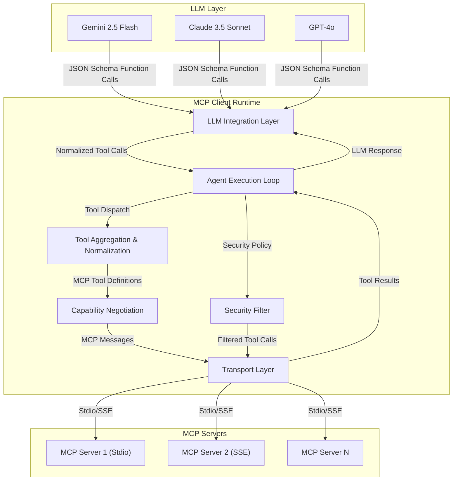

Giao thức Ngữ cảnh Mô hình (MCP) định nghĩa một giao diện chuẩn cho các LLM để khám phá và tương tác với các công cụ và dịch vụ bên ngoài. Hướng dẫn này trình bày chi tiết việc xây dựng một runtime máy khách MCP tùy chỉnh mạnh mẽ bằng TypeScript, có khả năng tổng hợp các công cụ từ nhiều máy chủ MCP đồng thời và trình bày chúng dưới dạng các khai báo gọi hàm JSON Schema tiêu chuẩn cho các LLM khác nhau. Chúng ta sẽ đề cập đến việc thiết lập kết nối, đàm phán khả năng, khám phá công cụ động, thực thi tác nhân tự động, phục hồi lỗi và các cân nhắc về bảo mật.

<AudioPlayer src="/static/audio/building-custom-mcp-client-runtime-vi.mp3" title="Tóm tắt âm thanh cho kỹ sư" voice="Google Cloud vi-VN-Neural2-A" />


## Tổng quan kiến trúc

Một máy khách MCP tùy chỉnh hoạt động như một lớp trung gian, trừu tượng hóa sự phức tạp của các nhà cung cấp công cụ đa dạng đằng sau một giao diện thống nhất. Các thành phần cốt lõi bao gồm:

1.  **Lớp truyền tải**: Xử lý giao tiếp với các máy chủ MCP (Stdio, SSE).
2.  **Đàm phán khả năng**: Quản lý việc lập phiên bản giao thức và khám phá tính năng.
3.  **Tổng hợp công cụ**: Thu thập và chuẩn hóa định nghĩa công cụ từ nhiều máy chủ.
4.  **Tích hợp LLM**: Dịch các công cụ MCP thành các lược đồ gọi hàm dành riêng cho LLM.
5.  **Vòng lặp thực thi tác nhân**: Điều phối các lệnh gọi công cụ, quản lý trạng thái và xử lý phục hồi lỗi.
6.  **Bộ lọc bảo mật**: Thực thi kiểm soát truy cập và làm sạch dữ liệu.



## Triển khai máy khách MCP cốt lõi

### 1. Lớp truyền tải

MCP định nghĩa hai cơ chế truyền tải chính: Stdio và Server-Sent Events (SSE). Máy khách của chúng ta phải hỗ trợ cả hai.

#### `StdioClientTransport`

Truyền tải này phù hợp cho các máy chủ MCP cục bộ, dựa trên tiến trình. Nó sử dụng `child_process` để quản lý tiến trình máy chủ và `stdin`/`stdout` để giao tiếp.

```typescript
// src/mcp/transports/stdio.ts
import { spawn, ChildProcessWithoutNullStreams } from 'child_process';
import { EventEmitter } from 'events';
import { MCPMessage, MCPCapability } from '../types'; // Assume these types are defined

export class StdioClientTransport extends EventEmitter {
  private process: ChildProcessWithoutNullStreams | null = null;
  private buffer: string = '';
  private readonly serverPath: string;
  private readonly args: string[];

  constructor(serverPath: string, args: string[] = []) {
    super();
    this.serverPath = serverPath;
    this.args = args;
  }

  public async connect(): Promise<void> {
    if (this.process) {
      console.warn('StdioClientTransport already connected.');
      return;
    }

    this.process = spawn(this.serverPath, this.args, { stdio: ['pipe', 'pipe', 'inherit'] });

    this.process.stdout.on('data', (data: Buffer) => {
      this.buffer += data.toString();
      this.processBuffer();
    });

    this.process.stderr.on('data', (data: Buffer) => {
      console.error(`MCP Stdio Server Error: ${data.toString()}`);
      this.emit('error', new Error(`Server stderr: ${data.toString()}`));
    });

    this.process.on('close', (code: number) => {
      console.log(`MCP Stdio Server exited with code ${code}`);
      this.emit('disconnect', code);
      this.process = null;
    });

    this.process.on('error', (err: Error) => {
      console.error(`MCP Stdio Process Error: ${err.message}`);
      this.emit('error', err);
      this.process = null;
    });

    console.log(`StdioClientTransport connected to ${this.serverPath}`);
    this.emit('connect');
  }

  private processBuffer(): void {
    let newlineIndex: number;
    while ((newlineIndex = this.buffer.indexOf('\n')) !== -1) {
      const messageStr = this.buffer.substring(0, newlineIndex).trim();
      this.buffer = this.buffer.substring(newlineIndex + 1);

      if (messageStr) {
        try {
          const message: MCPMessage = JSON.parse(messageStr);
          this.emit('message', message);
        } catch (e) {
          console.error(`Failed to parse MCP message: ${messageStr}`, e);
          this.emit('error', new Error(`Invalid MCP message: ${messageStr}`));
        }
      }
    }
  }

  public send(message: MCPMessage): void {
    if (!this.process || !this.process.stdin) {
      throw new Error('StdioClientTransport not connected.');
    }
    this.process.stdin.write(JSON.stringify(message) + '\n');
  }

  public disconnect(): void {
    if (this.process) {
      this.process.kill();
      this.process = null;
      this.emit('disconnect', 0);
    }
  }
}
```

#### `SSEClientTransport`

Đối với các máy chủ MCP từ xa, SSE cung cấp một kết nối liên tục, đơn hướng. Chúng ta sẽ sử dụng `EventSource` (hoặc một polyfill cho môi trường Node.js).

```typescript
// src/mcp/transports/sse.ts
import { EventEmitter } from 'events';
import { MCPMessage } from '../types'; // Assume these types are defined

// Polyfill for Node.js if running outside browser
// import EventSource from 'eventsource'; // npm install eventsource

export class SSEClientTransport extends EventEmitter {
  private eventSource: EventSource | null = null;
  private readonly url: string;

  constructor(url: string) {
    super();
    this.url = url;
  }

  public async connect(): Promise<void> {
    if (this.eventSource) {
      console.warn('SSEClientTransport already connected.');
      return;
    }

    this.eventSource = new EventSource(this.url);

    this.eventSource.onopen = () => {
      console.log(`SSEClientTransport connected to ${this.url}`);
      this.emit('connect');
    };

    this.eventSource.onmessage = (event: MessageEvent) => {
      try {
        const message: MCPMessage = JSON.parse(event.data);
        this.emit('message', message);
      } catch (e) {
        console.error(`Failed to parse SSE message: ${event.data}`, e);
        this.emit('error', new Error(`Invalid SSE message: ${event.data}`));
      }
    };

    this.eventSource.onerror = (err: Event) => {
      console.error(`SSEClientTransport error:`, err);
      this.emit('error', new Error(`SSE connection error: ${err}`));
      this.disconnect(); // Attempt to reconnect or handle gracefully
    };

    // MCP servers might also send messages via POST requests,
    // but for simplicity, we focus on SSE for server-to-client and
    // a separate mechanism (e.g., fetch POST) for client-to-server if needed.
    // For MCP, client-to-server is typically via a separate HTTP POST endpoint.
    // Here, we assume the SSE is purely for server-initiated messages.
    // If client needs to send, a separate `send` method using `fetch` would be required.
  }

  // For sending messages to an SSE-based MCP server, a separate HTTP POST endpoint
  // is typically used. This `send` method would wrap a `fetch` call.
  public async send(message: MCPMessage): Promise<void> {
    try {
      const response = await fetch(this.url, {
        method: 'POST',
        headers: { 'Content-Type': 'application/json' },
        body: JSON.stringify(message),
      });
      if (!response.ok) {
        throw new Error(`Failed to send message: ${response.statusText}`);
      }
    } catch (e) {
      console.error(`Error sending message via HTTP POST to ${this.url}:`, e);
      this.emit('error', e);
    }
  }

  public disconnect(): void {
    if (this.eventSource) {
      this.eventSource.close();
      this.eventSource = null;
      this.emit('disconnect', 0);
    }
  }
}
```

### 2. Đàm phán khả năng và khám phá công cụ

Khi kết nối, máy khách phải đàm phán khả năng và khám phá các công cụ có sẵn. MCP định nghĩa các thông báo `mcp/capabilities` và `mcp/tools`.

```typescript
// src/mcp/client.ts
import { EventEmitter } from 'events';
import { StdioClientTransport } from './transports/stdio';
import { SSEClientTransport } from './transports/sse';
import {
  MCPMessage,
  MCPCapability,
  MCPTool,
  MCPToolDeclaration,
  MCPRequest,
  MCPResponse,
  MCPError,
} from './types'; // Define these types based on MCP spec

export type MCPTransport = StdioClientTransport | SSEClientTransport;

export interface ToolDefinition {
  id: string;
  name: string;
  description: string;
  parameters: Record<string, any>; // JSON Schema
  serverUrl: string; // Originating server URL/path
}

export class MCPClient extends EventEmitter {
  private transport: MCPTransport;
  private capabilities: MCPCapability[] = [];
  private tools: Map<string, MCPTool> = new Map(); // Map<toolId, MCPTool>
  private pendingRequests: Map<string, { resolve: (res: MCPResponse) => void; reject: (err: MCPError) => void }> = new Map();
  private requestIdCounter: number = 0;

  constructor(transport: MCPTransport) {
    super();
    this.transport = transport;
    this.transport.on('message', this.handleMessage.bind(this));
    this.transport.on('error', (err) => this.emit('error', err));
    this.transport.on('disconnect', (code) => this.emit('disconnect', code));
  }

  public async connect(): Promise<void> {
    await this.transport.connect();
    await this.negotiateCapabilities();
    await this.discoverTools();
    this.emit('ready');
  }

  private async negotiateCapabilities(): Promise<void> {
    const request: MCPRequest = {
      id: this.generateRequestId(),
      type: 'mcp/capabilities',
      payload: {}, // Client can propose capabilities here if needed
    };
    const response = await this.sendRequest(request);
    if (response.type === 'mcp/capabilities') {
      this.capabilities = response.payload.capabilities;
      console.log('Negotiated capabilities:', this.capabilities);
    } else {
      throw new Error(`Unexpected response type for capabilities: ${response.type}`);
    }
  }

  private async discoverTools(): Promise<void> {
    const request: MCPRequest = {
      id: this.generateRequestId(),
      type: 'mcp/tools',
      payload: {},
    };
    const response = await this.sendRequest(request);
    if (response.type === 'mcp/tools') {
      this.tools.clear();
      response.payload.tools.forEach((tool: MCPTool) => {
        this.tools.set(tool.id, tool);
      });
      console.log(`Discovered ${this.tools.size} tools.`);
    } else {
      throw new Error(`Unexpected response type for tools: ${response.type}`);
    }
  }

  private generateRequestId(): string {
    return `req-${this.requestIdCounter++}-${Date.now()}`;
  }

  public async sendRequest(request: MCPRequest): Promise<MCPResponse> {
    return new Promise((resolve, reject) => {
      this.pendingRequests.set(request.id, { resolve, reject });
      this.transport.send(request);
    });
  }

  private handleMessage(message: MCPMessage): void {
    if (message.type.startsWith('mcp/')) {
      // Handle MCP protocol messages
      if (message.type === 'mcp/response') {
        const response = message as MCPResponse;
        const pending = this.pendingRequests.get(response.id);
        if (pending) {
          this.pendingRequests.delete(response.id);
          if (response.error) {
            pending.reject(response.error);
          } else {
            pending.resolve(response);
          }
        } else {
          console.warn(`Received response for unknown request ID: ${response.id}`);
        }
      } else if (message.type === 'mcp/event') {
        // Handle server-initiated events (e.g., tool updates, status changes)
        this.emit('event', message.payload);
      } else {
        // Other MCP messages like mcp/capabilities, mcp/tools are handled by sendRequest's promise
        // if they are responses to client-initiated requests.
        // If they are unsolicited, they should be handled as events.
        console.log(`Unhandled MCP message type: ${message.type}`, message);
      }
    } else {
      // Potentially other custom message types or direct tool outputs
      this.emit('rawMessage', message);
    }
  }

  public getAvailableTools(): ToolDefinition[] {
    return Array.from(this.tools.values()).map(tool => ({
      id: tool.id,
      name: tool.name,
      description: tool.description,
      parameters: tool.parameters,
      serverUrl: (this.transport as any).url || (this.transport as any).serverPath, // Infer from transport
    }));
  }

  public async callTool(toolId: string, args: Record<string, any>): Promise<any> {
    const tool = this.tools.get(toolId);
    if (!tool) {
      throw new Error(`Tool with ID ${toolId} not found.`);
    }

    const request: MCPRequest = {
      id: this.generateRequestId(),
      type: 'mcp/call',
      payload: {
        toolId: tool.id,
        args: args,
      },
    };
    const response = await this.sendRequest(request);
    if (response.type === 'mcp/call_result') {
      return response.payload.result;
    } else if (response.type === 'mcp/error') {
      throw new Error(`Tool call failed: ${response.error?.message || 'Unknown error'}`);
    } else {
      throw new Error(`Unexpected response type for tool call: ${response.type}`);
    }
  }

  public disconnect(): void {
    this.transport.disconnect();
  }
}
```

### 3. Tổng hợp công cụ và tích hợp LLM

`MCPClient` cung cấp `getAvailableTools()`. Chúng ta cần tổng hợp chúng từ nhiều phiên bản `MCPClient` và chuyển đổi chúng thành các lược đồ gọi hàm dành riêng cho LLM.

```typescript
// src/agent/tool_manager.ts
import { MCPClient, ToolDefinition } from '../mcp/client';

export interface LLMFunctionCallSchema {
  name: string;
  description: string;
  parameters: Record<string, any>; // JSON Schema
}

export class ToolManager {
  private clients: Map<string, MCPClient> = new Map(); // Map<clientId, MCPClient>
  private aggregatedTools: Map<string, ToolDefinition> = new Map(); // Map<toolName, ToolDefinition>

  public registerClient(clientId: string, client: MCPClient): void {
    this.clients.set(clientId, client);
    client.on('ready', () => this.refreshTools());
    client.on('event', (event) => {
      if (event.type === 'tool_update') {
        this.refreshTools();
      }
    });
    client.on('disconnect', () => {
      console.warn(`MCPClient ${clientId} disconnected. Refreshing tools.`);
      this.refreshTools();
    });
  }

  public async initializeClients(): Promise<void> {
    const connectPromises = Array.from(this.clients.values()).map(client => client.connect());
    await Promise.all(connectPromises);
    this.refreshTools();
  }

  private refreshTools(): void {
    this.aggregatedTools.clear();
    for (const client of this.clients.values()) {
      for (const tool of client.getAvailableTools()) {
        // Ensure unique tool names across servers, or handle conflicts
        // For simplicity, we'll prefix with client ID if names clash.
        const toolName = tool.name;
        if (this.aggregatedTools.has(toolName)) {
          console.warn(`Tool name conflict: ${toolName}. Prefixed with client ID.`);
          this.aggregatedTools.set(`${client.transport instanceof StdioClientTransport ? 'stdio' : 'sse'}_${toolName}`, tool);
        } else {
          this.aggregatedTools.set(toolName, tool);
        }
      }
    }
    console.log(`Aggregated ${this.aggregatedTools.size} tools from ${this.clients.size} clients.`);
  }

  public getLLMFunctionSchemas(): LLMFunctionCallSchema[] {
    return Array.from(this.aggregatedTools.values()).map(tool => ({
      name: tool.name, // Use the potentially prefixed name
      description: tool.description,
      parameters: tool.parameters,
    }));
  }

  public async executeTool(toolName: string, args: Record<string, any>): Promise<any> {
    const tool = this.aggregatedTools.get(toolName);
    if (!tool) {
      throw new Error(`Aggregated tool ${toolName} not found.`);
    }

    // Find the client that owns this tool
    for (const client of this.clients.values()) {
      if (client.getAvailableTools().some(t => t.id === tool.id)) { // Assuming tool.id is unique per server
        return client.callTool(tool.id, args);
      }
    }
    throw new Error(`Could not find client for tool ${toolName} (ID: ${tool.id})`);
  }
}
```

### 4. Vòng lặp thực thi tác nhân tự động

Vòng lặp tác nhân sử dụng LLM để quyết định công cụ nào sẽ gọi, thực thi nó và đưa kết quả trở lại. Vòng lặp này cần xử lý lỗi mạnh mẽ và quản lý trạng thái.

```typescript
// src/agent/autonomous_agent.ts
import { ToolManager, LLMFunctionCallSchema } from './tool_manager';
import { LLMProvider, LLMMessage, LLMToolCall } from '../llm/types'; // Assume LLM types

export class AutonomousAgent {
  private toolManager: ToolManager;
  private llm: LLMProvider; // e.g., Gemini, Claude, OpenAI client
  private conversationHistory: LLMMessage[] = [];
  private readonly maxRetries: number;

  constructor(toolManager: ToolManager, llm: LLMProvider, maxRetries: number = 3) {
    this.toolManager = toolManager;
    this.llm = llm;
    this.maxRetries = maxRetries;
  }

  public async run(initialPrompt: string): Promise<string> {
    this.conversationHistory = [{ role: 'user', content: initialPrompt }];
    let retries = 0;

    while (retries < this.maxRetries) {
      try {
        const availableTools = this.toolManager.getLLMFunctionSchemas();
        const response = await this.llm.chat({
          messages: this.conversationHistory,
          tools: availableTools,
        });

        if (response.toolCalls && response.toolCalls.length > 0) {
          this.conversationHistory.push({ role: 'assistant', toolCalls: response.toolCalls });
          const toolResults: LLMMessage[] = [];

          for (const toolCall of response.toolCalls) {
            try {
              console.log(`Calling tool: ${toolCall.name} with args:`, toolCall.args);
              const result = await this.toolManager.executeTool(toolCall.name, toolCall.args);
              console.log(`Tool ${toolCall.name} result:`, result);
              toolResults.push({
                role: 'tool',
                toolCallId: toolCall.id,
                content: JSON.stringify(result),
              });
            } catch (toolError: any) {
              console.error(`Error executing tool ${toolCall.name}:`, toolError);
              toolResults.push({
                role: 'tool',
                toolCallId: toolCall.id,
                content: JSON.stringify({ error: toolError.message || 'Tool execution failed' }),
              });
              // Potentially add a specific error message to history for LLM to handle
            }
          }
          this.conversationHistory.push(...toolResults);
          retries = 0; // Reset retries on successful tool execution
        } else if (response.content) {
          this.conversationHistory.push({ role: 'assistant', content: response.content });
          return response.content; // Agent has a final answer
        } else {
          throw new Error('LLM response neither contained content nor tool calls.');
        }
      } catch (llmError: any) {
        console.error('LLM interaction error:', llmError);
        this.conversationHistory.push({
          role: 'tool', // Use tool role to indicate an internal error to the LLM
          content: JSON.stringify({ error: `LLM interaction failed: ${llmError.message}` }),
        });
        retries++;
        if (retries >= this.maxRetries) {
          throw new Error(`Agent failed after ${this.maxRetries} retries: ${llmError.message}`);
        }
        console.log(`Retrying agent loop (${retries}/${this.maxRetries})...`);
      }
    }
    throw new Error('Agent loop terminated without a final answer after max retries.');
  }

  // Pagination for resources:
  // Tools themselves should ideally handle pagination. If a tool returns a large dataset,
  // its schema should include parameters for `page`, `pageSize`, `offset`, etc.
  // The LLM, when calling the tool, would then be prompted to use these parameters.
  // Example: `search_documents(query: string, page: number = 1, pageSize: number = 10)`
  // The agent loop would then observe if the LLM requests subsequent pages.
  // This is a design decision for the MCP server and its tool definitions.
}
```

### 5. Lọc bảo mật

Trước khi thực thi bất kỳ lệnh gọi công cụ nào, một bộ lọc bảo mật nên xác thực lệnh gọi đó dựa trên các chính sách được xác định trước. Điều này ngăn chặn các lệnh gọi công cụ độc hại hoặc trái phép.

```typescript
// src/agent/security_filter.ts
import { LLMToolCall } from '../llm/types';
import { ToolDefinition } from '../mcp/client';

export interface SecurityPolicy {
  allowList?: string[]; // List of allowed tool names
  denyList?: string[];  // List of denied tool names
  parameterConstraints?: {
    [toolName: string]: {
      [paramName: string]: {
        type?: string;
        pattern?: string;
        enum?: any[];
        maxLength?: number;
        // Add more JSON Schema validation keywords
      };
    };
  };
  // Add more complex policies like rate limiting, user-based access control
}

export class SecurityFilter {
  private policy: SecurityPolicy;
  private toolDefinitions: Map<string, ToolDefinition>; // Map<toolName, ToolDefinition>

  constructor(policy: SecurityPolicy, toolDefinitions: Map<string, ToolDefinition>) {
    this.policy = policy;
    this.toolDefinitions = toolDefinitions;
  }

  public async authorizeToolCall(toolCall: LLMToolCall): Promise<void> {
    const toolName = toolCall.name;
    const args = toolCall.args;
    const toolDef = this.toolDefinitions.get(toolName);

    if (!toolDef) {
      throw new Error(`Security Error: Attempted to call unknown tool '${toolName}'.`);
    }

    // 1. Allow/Deny List Check
    if (this.policy.allowList && !this.policy.allowList.includes(toolName)) {
      throw new Error(`Security Error: Tool '${toolName}' is not in the allow list.`);
    }
    if (this.policy.denyList && this.policy.denyList.includes(toolName)) {
      throw new Error(`Security Error: Tool '${toolName}' is in the deny list.`);
    }

    // 2. Parameter Constraints (Basic validation, full JSON Schema validation is more complex)
    if (this.policy.parameterConstraints && this.policy.parameterConstraints[toolName]) {
      const constraints = this.policy.parameterConstraints[toolName];
      for (const paramName in constraints) {
        const paramConstraint = constraints[paramName];
        const argValue = args[paramName];

        if (paramConstraint.type && typeof argValue !== paramConstraint.type) {
          throw new Error(`Security Error: Parameter '${paramName}' for tool '${toolName}' has incorrect type.`);
        }
        if (paramConstraint.pattern && typeof argValue === 'string' && !new RegExp(paramConstraint.pattern).test(argValue)) {
          throw new Error(`Security Error: Parameter '${paramName}' for tool '${toolName}' does not match pattern.`);
        }
        if (paramConstraint.enum && !paramConstraint.enum.includes(argValue)) {
          throw new Error(`Security Error: Parameter '${paramName}' for tool '${toolName}' value not in enum.`);
        }
        if (paramConstraint.maxLength && typeof argValue === 'string' && argValue.length > paramConstraint.maxLength) {
          throw new Error(`Security Error: Parameter '${paramName}' for tool '${toolName}' exceeds max length.`);
        }
        // More sophisticated validation would involve a JSON Schema validator library
      }
    }

    // 3. (Placeholder) User-specific access control, rate limiting, etc.
    // const userContext = getUserContext();
    // if (!canUserAccessTool(userContext, toolName)) {
    //   throw new Error(`Security Error: User not authorized to access tool '${toolName}'.`);
    // }

    console.log(`Security Filter: Tool call to '${toolName}' authorized.`);
  }
}
```

Phương thức `executeTool` của `ToolManager` sẽ tích hợp `SecurityFilter`.

```typescript
// Modified ToolManager.executeTool
// ... (imports and class definition) ...

export class ToolManager {
  // ... (existing properties) ...
  private securityFilter: SecurityFilter;

  constructor(securityPolicy: SecurityPolicy) {
    // ...
    this.securityFilter = new SecurityFilter(securityPolicy, this.aggregatedTools);
  }

  private refreshTools(): void {
    // ... (existing logic) ...
    // Update security filter with new tool definitions
    this.securityFilter = new SecurityFilter(this.securityFilter['policy'], this.aggregatedTools);
  }

  public async executeTool(toolName: string, args: Record<string, any>): Promise<any> {
    const tool = this.aggregatedTools.get(toolName);
    if (!tool) {
      throw new Error(`Aggregated tool ${toolName} not found.`);
    }

    // Create a dummy LLMToolCall for authorization
    const dummyToolCall: LLMToolCall = { id: 'auth-check', name: toolName, args: args };
    await this.securityFilter.authorizeToolCall(dummyToolCall); // Pre-execution authorization

    // Find the client that owns this tool
    for (const client of this.clients.values()) {
      if (client.getAvailableTools().some(t => t.id === tool.id)) {
        return client.callTool(tool.id, args);
      }
    }
    throw new Error(`Could not find client for tool ${toolName} (ID: ${tool.id})`);
  }
}
```

## Ví dụ sử dụng

```typescript
// src/main.ts
import { StdioClientTransport } from './mcp/transports/stdio';
import { SSEClientTransport } from './mcp/transports/sse';
import { MCPClient } from './mcp/client';
import { ToolManager, LLMFunctionCallSchema } from './agent/tool_manager';
import { AutonomousAgent } from './agent/autonomous_agent';
import { SecurityPolicy } from './agent/security_filter';
import { LLMProvider, LLMMessage, LLMToolCall, LLMResponse } from './llm/types';

// --- Mock LLM Provider (e.g., Gemini, Claude, OpenAI) ---
class MockLLM implements LLMProvider {
  private readonly modelName: string;
  constructor(modelName: string) { this.modelName = modelName; }

  async chat(params: { messages: LLMMessage[]; tools?: LLMFunctionCallSchema[] }): Promise<LLMResponse> {
    console.log(`\n--- Mock LLM (${this.modelName}) called ---`);
    console.log('Messages:', JSON.stringify(params.messages, null, 2));
    console.log('Available Tools:', JSON.stringify(params.tools, null, 2));

    // Simple mock logic: if user asks for "time", call a mock tool
    const lastUserMessage = params.messages.findLast(m => m.role === 'user')?.content;

    if (lastUserMessage?.includes('current time')) {
      const toolCall: LLMToolCall = {
        id: 'call_123',
        name: 'get_current_time', // This tool must be provided by an MCP server
        args: {},
      };
      return { toolCalls: [toolCall] };
    } else if (lastUserMessage?.includes('search for')) {
      const query = lastUserMessage.split('search for ')[1];
      const toolCall: LLMToolCall = {
        id: 'call_456',
        name: 'web_search', // This tool must be provided by an MCP server
        args: { query: query },
      };
      return { toolCalls: [toolCall] };
    } else if (lastUserMessage?.includes('list files')) {
      const toolCall: LLMToolCall = {
        id: 'call_789',
        name: 'list_files', // This tool must be provided by an MCP server
        args: { path: '.' },
      };
      return { toolCalls: [toolCall] };
    } else if (params.messages.some(m => m.role === 'tool' && m.toolCallId === 'call_123')) {
      return { content: `The current time is 10:30 AM (mocked).` };
    } else if (params.messages.some(m => m.role === 'tool' && m.toolCallId === 'call_456')) {
      return { content: `Search results for "${lastUserMessage}" (mocked): Found 3 relevant articles.` };
    } else if (params.messages.some(m => m.role === 'tool' && m.toolCallId === 'call_789')) {
      return { content: `Files in current directory (mocked): main.ts, package.json, README.md.` };
    }

    return { content: `I'm a mock LLM. You asked: "${lastUserMessage}". I don't have a specific tool for that.` };
  }
}

// --- Mock MCP Server (for Stdio transport) ---
// This would typically be a separate process/script.
// For demonstration, we'll simulate its behavior.
// In a real scenario, you'd run `node mock_stdio_server.js`
// and `StdioClientTransport` would connect to it.

// mock_stdio_server.ts (simplified for in-memory demo)
// In a real setup, this would be a separate executable.
// For this example, we'll just define the tools it *would* provide.
const mockStdioServerTools: MCPTool[] = [
  {
    id: 'stdio_tool_1',
    name: 'get_current_time',
    description: 'Returns the current time.',
    parameters: { type: 'object', properties: {} },
  },
  {
    id: 'stdio_tool_2',
    name: 'list_files',
    description: 'Lists files in a given path.',
    parameters: {
      type: 'object',
      properties: {
        path: { type: 'string', description: 'The path to list files from.' }
      },
      required: ['path']
    },
  },
];

// --- Mock SSE Server (for SSE transport) ---
// Similar to Stdio, this would be a separate HTTP server.
// We'll define its tools here.
const mockSSEServerTools: MCPTool[] = [
  {
    id: 'sse_tool_1',
    name: 'web_search',
    description: 'Performs a web search for a given query.',
    parameters: {
      type: 'object',
      properties: {
        query: { type: 'string', description: 'The search query.' }
      },
      required: ['query']
    },
  },
  {
    id: 'sse_tool_2',
    name: 'send_email',
    description: 'Sends an email to a recipient.',
    parameters: {
      type: 'object',
      properties: {
        to: { type: 'string', format: 'email' },
        subject: { type: 'string' },
        body:
```
