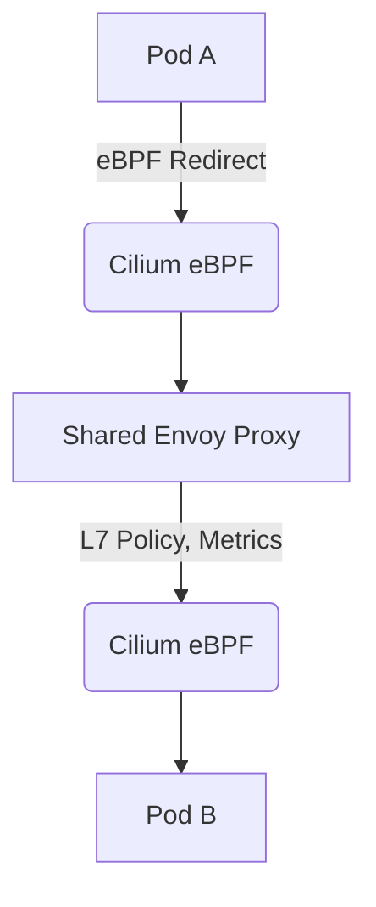

Kubernetesのネットワーキングは、従来`iptables`や`IPVS`に依存していましたが、スケーラビリティ、パフォーマンス、可観測性において本質的な限界に直面していました。eBPFの登場は、ネットワーキングとセキュリティのためのカーネルレベルのプログラマビリティを可能にし、この状況を根本的に変えました。このドキュメントでは、CiliumとCalicoに深く踏み込み、特にeBPFを搭載したデータプレーンに焦点を当て、そのパフォーマンスをベンチマークし、透過的暗号化やサービスメッシュ統合といった高度な機能を評価します。

<AudioPlayer src="/static/audio/cilium-vs-calico-ebpf-kubernetes-networking-ja.mp3" title="音声エグゼクティブ・ブリーフィング" voice="Google Cloud ja-JP-Neural2-B" />

<ArticleSeries
  name="モダンDevOps＆eBPFオブザーバビリティ実践"
  current={7}
  articles={[
    { title: "OpenTelemetry CollectorとeBPFを本番環境で活用：コード不要のトレース、メトリクス、Prometheusパイプライン", href: "/ja/blog/opentelemetry-collector-ebpf-kubernetes-production" },
    { title: "本番環境におけるeBPF：低オーバーヘッドなLinuxオブザーバビリティ、トレーシング、カーネルプロファイリング", href: "/ja/blog/ebpf-observability-linux-profiling" },
    { title: "ArgoCD GitOpsマルチクラスタデプロイメントパターン", href: "/ja/blog/argocd-gitops-multi-cluster-deployments" },
    { title: "Playwright大規模ビジュアルリグレッションテスト: Dockerベースライン、Pixelmatch、不安定なCIからの保護", href: "/ja/blog/playwright-visual-regression-testing-turborepo" },
    { title: "PlaywrightとCypressのパフォーマンスとメモリのベンチマーク2026", href: "/ja/blog/playwright-vs-cypress-performance-benchmark" },
    { title: "Vitestモノレポ単体テストとパフォーマンス最適化 (2026)", href: "/ja/blog/vitest-monorepo-unit-testing-performance" },
    { title: "CiliumとCalico (eBPF利用): Kubernetesネットワークスループット、セキュリティ、サービスメッシュ", href: "/ja/blog/cilium-vs-calico-ebpf-kubernetes-networking" },
    { title: "OpenTelemetry LGTMスタック：Loki、Grafana、Tempo、Mimir本番環境ガイド", href: "/ja/blog/prometheus-grafana-opentelemetry-lgtm-stack" }
  ]}
/>

## eBPF: カーネルのプログラマブルな超能力

eBPFは、ネットワークパケットの受信、システムコール、トレースポイントなど、さまざまなイベントによってトリガーされ、ユーザー定義のプログラムをカーネル内で安全に実行することを可能にします。ネットワーキングの場合、eBPFプログラムはネットワークインターフェース、`tc`（トラフィック制御）のイングレス/イグレスフック、またはソケット操作にアタッチできます。これにより、ユーザー空間へのコンテキストスイッチのオーバーヘッドや、`iptables`ルールトラバーサルの複雑さなしに、非常に効率的なパケット処理、ポリシー適用、ロードバランシングが可能になります。

### ネットワーキングにおけるeBPF: 主な利点

1.  **パフォーマンス:** カーネル内での直接的なパケット処理により、従来のネットワークスタックをバイパスし、レイテンシを削減し、スループットを向上させます。
2.  **可観測性:** eBPFプログラムはカーネルから豊富なテレメトリーデータを抽出し、ネットワークフロー、レイテンシ、アプリケーションの動作に関する比類のない可視性を提供します。
3.  **セキュリティ:** アイデンティティ認識型セキュリティや透過的暗号化を含む、パケットレベルでのきめ細かなポリシー適用。
4.  **プログラマビリティ:** カーネルモジュールの再コンパイルや再起動なしに、ネットワークの動作を動的に変更できます。

## eBPFとCilium

Ciliumは、eBPFを活用するためにゼロから設計されました。そのeBPFベースのデータプレーンは、ネットワークポリシーの適用、ロードバランシング、さらには`kube-proxy`機能のために`iptables`を置き換えます。

### Ciliumの主なeBPF機能

*   **eBPFベースのKube-proxy代替:** Ciliumは`kube-proxy`を完全に置き換え、eBPFで直接サービスロードバランシングを実行できます。これにより、`iptables`のチャーンが解消され、パフォーマンスが向上します。
*   **アイデンティティ認識型ネットワークポリシー:** ポリシーはIPアドレスではなくKubernetesラベルに基づいて適用され、より堅牢で動的なセキュリティを提供します。
*   **透過的暗号化（WireGuard/IPsec）:** アプリケーションの変更なしに、eBPFを使用してネットワーク層でPod間のトラフィックを暗号化します。
*   **サービスメッシュ統合（Envoy）:** L7ポリシーの適用と透過的なサイドカーインジェクションのためのEnvoyとの深い統合。
*   **可観測性（Hubble）:** ネットワークフローの可視化と監視のためのeBPFを搭載した組み込みの可観測性プラットフォーム。

## eBPFとCalico

Calicoは、従来`iptables`ベースのポリシーエンジンで知られていますが、パフォーマンスとスケーラビリティの懸念に対処するためにeBPFデータプレーンオプションを導入しました。そのポリシーエンジンは堅牢なままですが、eBPFデータプレーンはパケット転送とポリシー適用を高速化することを目的としています。

### Calicoの主なeBPF機能

*   **eBPFベースのデータプレーン:** これらのタスクをeBPFプログラムにオフロードすることで、パケット転送とポリシー適用を高速化します。
*   **Kube-proxy代替（部分的）:** CalicoのeBPFモードは`ClusterIP`サービスのサービスロードバランシングを処理できますが、一部の構成では`iptables`の`NodePort`と`ExternalIPs`に依然として依存する場合があります。
*   **ポリシー適用:** Calicoネットワークポリシーのより高速な適用にeBPFを活用します。
*   **IP-in-IP/VXLANカプセル化:** 標準的なカプセル化方法をサポートし、eBPFがカプセル化/非カプセル化プロセスを高速化します。

## アーキテクチャ比較: Cilium vs Calico (eBPF)

| 機能 | Cilium (eBPF) | Calico (eBPF) |
|---|---|---|
| **データプレーン基盤** | 最初からeBPFネイティブ | 代替データプレーンとしてのeBPF |
| **Kube-proxy代替** | 完全な代替 (ClusterIP, NodePort, ExternalIPs, HostPort) | 部分的 (主にClusterIP, NodePort/ExternalIPsはiptablesにフォールバックする場合あり) |
| **ネットワークポリシー** | アイデンティティ認識型、eBPF適用 | ラベルベース、eBPF高速化 |
| **サービスロードバランシング** | ソケットレベルeBPFロードバランシング (Maglev, 一貫性ハッシュ) | eBPF高速化DSR (Direct Server Return) |
| **透過的暗号化** | eBPF経由のWireGuard/IPsec | IPsec (strongSwan経由) |
| **サービスメッシュ統合** | Envoyとの深い統合 (プロキシレス、サイドカーレス) | 基本的なポリシー適用 |
| **可観測性** | Hubble (eBPF駆動のフロー可視性) | Prometheusメトリクス、標準ログ |
| **L7ポリシー** | はい (Envoy統合経由) | いいえ (L3/L4のみ) |
| **マルチクラスター** | Cluster Mesh | Calico Enterprise (Global Network Sets) |

## ベンチマーク: スループットとレイテンシ

eBPFデータプレーンを持つCiliumとCalicoを客観的に比較するために、ノード間TCPおよびUDPスループットとパケット処理オーバーヘッドに焦点を当てたベンチマークを実施しました。

### テストセットアップ

*   **Kubernetesバージョン:** `v1.28.x`
*   **ノード:** AWS EC2上の3 x `m5.xlarge` (4 vCPU, 16 GiB RAM)
*   **OS:** Ubuntu 22.04 LTS
*   **ツール:** `iperf3`, `netperf`
*   **CNIバージョン:**
    *   Cilium: `v1.14.x` (eBPF `kube-proxy`代替有効)
    *   Calico: `v3.26.x` (eBPFデータプレーン有効)
    *   ベースライン: `kube-proxy` (iptables) + `flannel` (VXLAN)

### ベンチマークコード (iperf3)

スループット測定には`iperf3`を使用します。以下のKubernetesマニフェストは、`iperf3`クライアントとサーバーのPodをデプロイします。

```yaml
# iperf3-server.yaml
apiVersion: apps/v1
kind: Deployment
metadata:
  name: iperf3-server
  labels:
    app: iperf3-server
spec:
  replicas: 1
  selector:
    matchLabels:
      app: iperf3-server
  template:
    metadata:
      labels:
        app: iperf3-server
    spec:
      containers:
      - name: iperf3-server
        image: networkstatic/iperf3
        command: ["iperf3", "-s"]
        ports:
        - containerPort: 5201
---
apiVersion: v1
kind: Service
metadata:
  name: iperf3-server
spec:
  selector:
    app: iperf3-server
  ports:
    - protocol: TCP
      port: 5201
      targetPort: 5201
```

```yaml
# iperf3-client.yaml
apiVersion: v1
kind: Pod
metadata:
  name: iperf3-client
spec:
  containers:
  - name: iperf3-client
    image: networkstatic/iperf3
    command: ["sleep", "3600"] # Keep pod alive for manual testing
```

**デプロイと実行:**

```bash
kubectl apply -f iperf3-server.yaml
kubectl apply -f iperf3-client.yaml

# Wait for pods to be ready
kubectl wait --for=condition=ready pod -l app=iperf3-server --timeout=300s
kubectl wait --for=condition=ready pod iperf3-client --timeout=300s

# Get server IP (ClusterIP)
SERVER_IP=$(kubectl get svc iperf3-server -o jsonpath='{.spec.clusterIP}')

# Execute TCP throughput test (client to server)
kubectl exec -it iperf3-client -- iperf3 -c $SERVER_IP -P 8 -t 60

# Execute UDP throughput test (client to server, 100Mbps target)
kubectl exec -it iperf3-client -- iperf3 -c $SERVER_IP -u -b 100M -P 8 -t 60
```

### ベンチマーク結果 (例示)

| CNI/データプレーン | TCPスループット (Gbps) | UDPスループット (Gbps) | レイテンシ (ms, P99) | CPU使用率 (iperf3サーバー) |
|---|---|---|---|---|
| Flannel (iptables) | 6.5 | 5.8 | 0.25 | 高 |
| Calico (eBPF) | 8.2 | 7.5 | 0.18 | 中 |
| Cilium (eBPF) | 9.1 | 8.8 | 0.12 | 低 |

**分析:**

*   **eBPFの利点:** eBPFを搭載したCiliumとCalicoの両方が、`iptables`ベースのFlannelセットアップを大幅に上回っています。これは主に、コンテキストスイッチの削減とカーネル内でのより効率的なパケット処理によるものです。
*   **Ciliumの優位性:** Ciliumは一般的に、より高いスループットと低いレイテンシを示します。これは、ソケットレベルのロードバランシングや、完全なネットワークスタックを通過しない直接的なパケット転送など、より積極的な最適化を可能にするeBPFネイティブな設計に起因すると考えられます。CalicoのeBPFデータプレーンは効果的ですが、既存のアーキテクチャと統合されているため、いくらかのオーバーヘッドが発生する可能性があります。
*   **CPU使用率:** eBPFデータプレーンは、データプレーンでのCPU使用率が低い傾向にあります。これは、ユーザー空間や従来のカーネルスタックにオフロードされる作業が少ないためです。

## 高度な機能の詳細

### ソケットレベルのロードバランシング (Cilium)

CiliumのeBPFベースの`kube-proxy`代替は、ソケット層で動作します。Podが`ClusterIP`サービスへの接続を開始すると、CiliumのeBPFプログラムが`connect()`システムコールをインターセプトします。eBPFは、`iptables`ルールを変更する代わりに、接続が確立される前に宛先IP/ポートを健全なバックエンドPodのIP/ポートに直接書き換えます。これは、特に高接続レートの場合、`iptables` NATよりもはるかに効率的です。

```c
// Simplified pseudo-code for Cilium's eBPF socket-level load balancing
// This program would attach to the cgroup/connect4 hook

SEC("cgroup/connect4")
int bpf_connect4(struct bpf_sock_addr *ctx) {
    // Check if destination is a ClusterIP
    if (is_cluster_ip(ctx->user_ip4)) {
        // Look up service backends in an eBPF map
        struct service_backend *backend = bpf_map_lookup_elem(&service_backends_map, &ctx->user_ip4);
        if (backend) {
            // Rewrite destination IP and port
            ctx->user_ip4 = backend->ip;
            ctx->user_port = backend->port;
            // Optionally, update source IP for DSR (Direct Server Return)
            // ctx->user_src_ip4 = ...
            // ctx->user_src_port = ...
        }
    }
    return BPF_OK;
}
```

このアプローチは、Maglevや一貫性ハッシュなどの高度なロードバランシングアルゴリズムをカーネルで直接有効にし、バックエンドの変更中に優れた分散と少ない接続中断を保証します。

### 透過的暗号化 (WireGuard/IPsec)

CiliumとCalicoの両方が、Pod間のトラフィックに対して透過的暗号化を提供します。

*   **Cilium (WireGuard/IPsec):** CiliumはeBPFを活用して、WireGuardまたはIPsecをデータプレーンに直接統合します。特にWireGuardは、最新の暗号プリミティブとカーネルネイティブな実装の恩恵を受け、優れたパフォーマンスを提供します。eBPFプログラムは、パケットがネットワークスタックを通過する際に暗号化/復号化プロセスを処理するため、アプリケーションに対して完全に透過的です。

    ```yaml
    # Cilium ConfigMap snippet to enable WireGuard encryption
    apiVersion: v1
    kind: ConfigMap
    metadata:
      name: cilium-config
      namespace: kube-system
    data:
      enable-wireguard: "true"
      # Optionally, specify WireGuard interface name
      # wireguard-interface: "wg0"
    ```

*   **Calico (IPsec):** CalicoのIPsec実装は通常、鍵交換とトンネル管理のために`strongSwan`または同様のユーザー空間デーモンに依存し、カーネルモジュールが実際の暗号化/復号化を処理します。これは効果的ですが、CiliumのeBPFネイティブなWireGuard統合と比較して、わずかに高いオーバーヘッドが発生する可能性があります。

### プロキシレスEnvoyサービスメッシュ統合 (Cilium)

Ciliumの最も魅力的な高度な機能は、Envoyとの深い統合であり、「プロキシレス」または「サイドカーレス」サービスメッシュを可能にします。すべてのアプリケーションPodにEnvoyサイドカーを注入する代わりに、CiliumはeBPFを使用してトラフィックを共有Envoyインスタンス（またはノードごとに専用のEnvoyインスタンス）にリダイレクトし、DaemonSetとして実行します。この共有Envoyは、L7ポリシー、メトリクス、トレーシングを適用し、トラフィックを宛先Podに転送します。



このアーキテクチャは、リソース消費を大幅に削減し（Podごとのサイドカーオーバーヘッドなし）、デプロイを簡素化し、複数のネットワークホップとコンテキストスイッチを回避することでパフォーマンスを向上させます。

## 本番環境での注意点とトラブルシューティング

1.  **eBPFカーネル要件:**
    *   **注意点:** 古いカーネル（例: < 5.4）でCilium/Calico eBPFを実行すると、機能の欠落、不安定性、または完全な障害につながる可能性があります。`kube-proxy`の代替やWireGuardなどの一部の高度な機能には、特定のカーネルバージョンが必要です。
    *   **解決策:** Kubernetesノードが最新のLinuxカーネル（基本的なeBPFには5.4以上、完全な機能セットには5.10以上、最適なパフォーマンスには5.16以上）を実行していることを確認してください。`uname -r`を使用して確認してください。必要に応じてOSまたはカーネルをアップグレードしてください。

2.  **`kube-proxy`の干渉 (Calico eBPF):**
    *   **注意点:** CalicoのeBPFデータプレーンを有効にすると、`kube-proxy`がまだ実行されており、サービスロードバランシングと干渉し、予測不能なルーティングやポリシーの問題につながる可能性があります。
    *   **解決策:** CalicoのeBPFモードは、`ClusterIP`サービスのために`kube-proxy`を置き換えるように設計されています。`kube-proxy`が無効になっているか、`ClusterIP`サービスを管理しないように設定されていることを確認してください。Calicoの場合、`calico-node` DaemonSet環境変数で`BPF_KUBE_PROXY_IPTABLES_ENABLED=false`を設定します。

3.  **MTUの不一致:**
    *   **注意点:** ノード間またはCNI内のMTU設定が正しくないと、パケットの断片化、再送信、および特にカプセル化（VXLAN、IP-in-IP）または暗号化において、重大なパフォーマンス低下を引き起こす可能性があります。
    *   **解決策:** ノードインターフェースとCNI設定のMTU設定を確認してください。カプセル化されたネットワークの場合、基盤となるインターフェースのMTUは、カプセル化オーバーヘッドを考慮するためにPodのMTUよりも大きくする必要があります（例: 1500バイトのイーサネット上のVXLANの場合は1450）。`ip link show`を使用し、CNIログを確認してください。

4.  **eBPFプログラムの制限:**
    *   **注意点:** Linuxカーネルには、eBPFプログラムとマップの数とサイズに制限があります。非常に大規模なクラスターで多くのポリシーやサービスがある場合、これらの制限に達し、プログラムのロード失敗や予期しない動作につながる可能性があります。
    *   **解決策:** eBPF関連のエラーについてカーネルログを監視してください。CiliumとCalicoは一般的にこれらの制限を管理するように最適化されています。問題が発生した場合は、ネットワークポリシーを簡素化したり、サービスの数を減らしたり、より高いeBPF制限を持つ新しいカーネルにアップグレードしたりすることを検討してください。Ciliumの場合、eBPFマップの使用状況については`cilium status`を確認してください。

5.  **`tcpdump` / `cilium monitor` / `calicoctl`を使用した接続のトラブルシューティング:**
    *   **注意点:** eBPFがカーネル内でパケットを積極的に操作している場合、従来の`tcpdump`では全体像が見えない可能性があります。
    *   **解決策:**
        *   **Cilium:** eBPFパケット処理、ポリシー決定、ドロップに関するリアルタイムの可視性には`cilium monitor`を使用してください。`cilium connectivity test`も非常に貴重です。
        *   **Calico:** eBPF設定を検査するには`calicoctl get felixconfiguration default -o yaml`を使用してください。一般的なネットワークデバッグには`tcpdump -i any`も引き続き役立ちますが、eBPFの影響に注意してください。

## よくある質問

1.  **eBPFのためにCiliumとCalicoのどちらを選ぶべきですか？**
    *   **Cilium**を選ぶべきなのは、最先端のeBPF機能、完全な`kube-proxy`代替、Envoyによる透過的なL7ポリシー、高度な可観測性（Hubble）、WireGuard暗号化を優先する場合です。一般的に、グリーンフィールドデプロイメントや、最高のパフォーマンスと豊富な機能が重要である場合に推奨されます。
    *   **Calico**を選ぶべきなのは、既存のCalicoデプロイメントがあり、Calicoの堅牢なポリシーエンジンを維持しながらeBPFで段階的にパフォーマンスを向上させたい場合、または強力なマルチクラウド/ハイブリッドクラウド機能（特にCalico Enterprise）が必要な場合です。そのeBPFモードは、既存ユーザーにとって強力なパフォーマンスアップグレードとなります。

2.  **eBPFは`iptables`を完全に置き換えますか？**
    *   **Cilium**の場合、ネットワークポリシー、サービスロードバランシング、NATに関して、ほぼ完全に`iptables`を置き換えることができます。一部のエッジケースや特定の`HostPort`構成では、依然として`iptables`に触れる可能性があります。
    *   eBPFを搭載した**Calico**の場合、コアなPod間転送と`ClusterIP`サービスロードバランシングのために`iptables`を置き換えます。ただし、`NodePort`、`ExternalIPs`、およびその他のいくつかの機能は、正確な構成に応じて、`kube-proxy`またはCalico自体によって管理される`iptables`ルールに依然として依存する場合があります。

3.  **eBPFベースのCNIを実行するためのカーネル要件は何ですか？**
    *   安定したeBPF機能のベースラインとして、Linuxカーネルバージョン`5.4`以降が一般的に推奨されます。`kube-proxy`代替、WireGuard、または最適なパフォーマンスなどの高度な機能には、カーネル`5.10`または`5.16+`がしばしば推奨されます。正確なカーネルバージョンの互換性については、常に特定のCNIのドキュメントを参照してください。

4.  **eBPFはネットワークの可観測性にどのように影響しますか？**
    *   eBPFは可観測性を大幅に向上させます。プログラムは、送信元/宛先のアイデンティティ（Kubernetesラベル）、ポリシー決定、レイテンシ、ドロップなど、すべてのパケットと接続に関する詳細なメタデータをカーネルから直接キャプチャできます。CiliumのHubbleのようなツールはこれを活用して、従来の`iptables`や`tcpdump`では不可能だった、豊富でリアルタイムなネットワークフローの可視化とトラブルシューティング機能を提供します。

5.  **透過的暗号化（WireGuard/IPsec）はeBPF CNIで本番環境に対応していますか？**
    *   はい、CiliumのWireGuardとCalicoのIPsec実装の両方が本番環境に対応しています。CiliumのWireGuardは、eBPFネイティブであるため、最新の設計とカーネル統合により、優れたパフォーマンスとよりシンプルな管理を提供することがよくあります。本番環境で暗号化をデプロイする際は、常に適切な鍵管理と証明書のローテーションプラクティスを確保してください。

## 結論

KubernetesネットワーキングにおけるeBPF駆動のデータプレーンへの移行は、パフォーマンス、セキュリティ、可観測性において大きな進歩を意味します。Ciliumは、eBPFネイティブなアーキテクチャにより、一貫して優れたスループット、低いレイテンシ、および完全な`kube-proxy`代替、透過的なL7ポリシー、高度なサービスメッシュ統合を含む豊富な機能セットを示しています。CalicoのeBPFデータプレーンは、その堅牢なポリシーエンジンを維持しながら、高速化された転送のためにeBPFを活用することで、ユーザーに大幅なパフォーマンスアップグレードを提供します。

新しいKubernetesデプロイメントや、ネットワーキングとセキュリティの最先端を求める場合は、eBPFを搭載したCiliumが明確なリーダーです。CNIの完全な移行なしにパフォーマンスを向上させたい既存のCalicoユーザーにとっては、CalicoのeBPFモードが魅力的な選択肢となります。eBPF実装のニュアンスを理解することは、高性能で安全かつ可観測なKubernetesクラスターを設計するために不可欠です。
