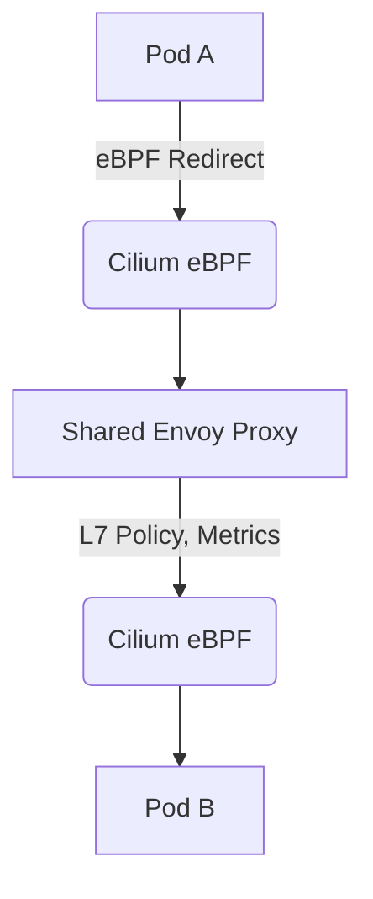

Mạng Kubernetes, theo truyền thống dựa vào `iptables` và `IPVS`, đối mặt với những hạn chế cố hữu về khả năng mở rộng, hiệu suất và khả năng quan sát. Sự ra đời của eBPF đã thay đổi cơ bản cục diện này, cho phép lập trình cấp kernel cho mạng và bảo mật. Tài liệu này cung cấp một cái nhìn sâu sắc về Cilium và Calico, đặc biệt tập trung vào các đường dẫn dữ liệu được hỗ trợ bởi eBPF của chúng, đánh giá hiệu suất của chúng và đánh giá các tính năng nâng cao như mã hóa trong suốt và tích hợp service mesh.

<AudioPlayer src="/static/audio/cilium-vs-calico-ebpf-kubernetes-networking-vi.mp3" title="Tóm tắt âm thanh cho kỹ sư" voice="Google Cloud vi-VN-Neural2-A" />

<ArticleSeries
  name="Lộ trình DevOps & Giám sát eBPF Hiện đại"
  current={7}
  articles={[
    { title: "OpenTelemetry Collector & eBPF trong Production: Tracing, Metrics & Prometheus Pipelines Không Cần Code", href: "/vi/blog/opentelemetry-collector-ebpf-kubernetes-production" },
    { title: "eBPF trong Môi Trường Production: Quan Sát Hệ Thống Linux Với Overhead Cực Thấp, Tracing và Profiling Nhân Hệ Điều Hành", href: "/vi/blog/ebpf-observability-linux-profiling" },
    { title: "ArgoCD GitOps: Các mô hình triển khai đa cụm", href: "/vi/blog/argocd-gitops-multi-cluster-deployments" },
    { title: "Kiểm thử hồi quy hình ảnh Playwright ở quy mô lớn: Docker Baselines, Pixelmatch & Flaky CI Shields", href: "/vi/blog/playwright-visual-regression-testing-turborepo" },
    { title: "Hiệu suất & Thử nghiệm bộ nhớ Playwright vs Cypress 2026", href: "/vi/blog/playwright-vs-cypress-performance-benchmark" },
    { title: "Vitest Monorepo: Kiểm thử đơn vị & Tối ưu hiệu suất (2026)", href: "/vi/blog/vitest-monorepo-unit-testing-performance" },
    { title: "Cilium và Calico với eBPF: Thông lượng mạng Kubernetes, bảo mật & Service Mesh", href: "/vi/blog/cilium-vs-calico-ebpf-kubernetes-networking" },
    { title: "OpenTelemetry LGTM Stack: Hướng dẫn triển khai Loki, Grafana, Tempo & Mimir trong môi trường Production", href: "/vi/blog/prometheus-grafana-opentelemetry-lgtm-stack" }
  ]}
/>

## eBPF: Siêu năng lực lập trình của Kernel

eBPF cho phép các chương trình do người dùng định nghĩa chạy an toàn trong kernel, được kích hoạt bởi nhiều sự kiện khác nhau như nhận gói mạng, lệnh gọi hệ thống hoặc tracepoint. Đối với mạng, các chương trình eBPF có thể gắn vào các giao diện mạng, các hook ingress/egress `tc` (kiểm soát lưu lượng) hoặc các hoạt động socket. Điều này cho phép xử lý gói tin hiệu quả cao, thực thi chính sách và cân bằng tải mà không có chi phí chuyển đổi ngữ cảnh sang không gian người dùng hoặc sự phức tạp của việc duyệt quy tắc `iptables`.

### eBPF trong mạng: Những lợi thế chính

1.  **Hiệu suất:** Xử lý gói trực tiếp trong kernel bỏ qua ngăn xếp mạng truyền thống, giảm độ trễ và tăng thông lượng.
2.  **Khả năng quan sát:** Các chương trình eBPF có thể trích xuất dữ liệu đo từ xa phong phú từ kernel, cung cấp khả năng hiển thị chưa từng có về luồng mạng, độ trễ và hành vi ứng dụng.
3.  **Bảo mật:** Thực thi chính sách chi tiết ở cấp độ gói, bao gồm bảo mật nhận dạng và mã hóa trong suốt.
4.  **Khả năng lập trình:** Sửa đổi động hành vi mạng mà không cần biên dịch lại hoặc khởi động lại mô-đun kernel.

## Cilium với eBPF

Cilium được thiết kế từ đầu để tận dụng eBPF. Đường dẫn dữ liệu dựa trên eBPF của nó thay thế `iptables` để thực thi chính sách mạng, cân bằng tải và thậm chí cả chức năng `kube-proxy`.

### Các tính năng eBPF chính của Cilium

*   **Thay thế Kube-proxy dựa trên eBPF:** Cilium có thể thay thế hoàn toàn `kube-proxy`, thực hiện cân bằng tải dịch vụ trực tiếp trong eBPF. Điều này loại bỏ sự thay đổi `iptables` và cải thiện hiệu suất.
*   **Chính sách mạng nhận dạng:** Các chính sách được thực thi dựa trên nhãn Kubernetes, không phải địa chỉ IP, cung cấp bảo mật mạnh mẽ và năng động hơn.
*   **Mã hóa trong suốt (WireGuard/IPsec):** Mã hóa lưu lượng pod-to-pod ở lớp mạng bằng eBPF, không cần thay đổi ứng dụng.
*   **Tích hợp Service Mesh (Envoy):** Tích hợp sâu với Envoy để thực thi chính sách L7 và chèn sidecar trong suốt.
*   **Khả năng quan sát (Hubble):** Nền tảng quan sát tích hợp được hỗ trợ bởi eBPF để trực quan hóa và giám sát luồng mạng.

## Calico với eBPF

Calico, theo truyền thống được biết đến với công cụ chính sách dựa trên `iptables`, đã giới thiệu tùy chọn đường dẫn dữ liệu eBPF để giải quyết các vấn đề về hiệu suất và khả năng mở rộng. Mặc dù công cụ chính sách của nó vẫn mạnh mẽ, đường dẫn dữ liệu eBPF nhằm mục đích tăng tốc chuyển tiếp gói và thực thi chính sách.

### Các tính năng eBPF chính của Calico

*   **Đường dẫn dữ liệu dựa trên eBPF:** Tăng tốc chuyển tiếp gói và thực thi chính sách bằng cách chuyển các tác vụ này sang các chương trình eBPF.
*   **Thay thế Kube-proxy (Một phần):** Chế độ eBPF của Calico có thể xử lý cân bằng tải dịch vụ cho các dịch vụ `ClusterIP`, nhưng vẫn có thể dựa vào `iptables` cho `NodePort` và `ExternalIPs` trong một số cấu hình.
*   **Thực thi chính sách:** Tận dụng eBPF để áp dụng nhanh hơn các Chính sách mạng Calico.
*   **Đóng gói IP-in-IP/VXLAN:** Hỗ trợ các phương pháp đóng gói tiêu chuẩn, với eBPF tăng tốc quá trình đóng gói/giải đóng gói.

## So sánh kiến trúc: Cilium vs Calico (eBPF)

| Tính năng | Cilium (eBPF) | Calico (eBPF) |
|---|---|---|
| **Nền tảng đường dẫn dữ liệu** | eBPF-native từ đầu | eBPF như một đường dẫn dữ liệu thay thế |
| **Thay thế Kube-proxy** | Thay thế hoàn toàn (ClusterIP, NodePort, ExternalIPs, HostPort) | Một phần (chủ yếu là ClusterIP, NodePort/ExternalIPs có thể quay lại iptables) |
| **Chính sách mạng** | Nhận dạng, được thực thi bởi eBPF | Dựa trên nhãn, được tăng tốc bởi eBPF |
| **Cân bằng tải dịch vụ** | Cân bằng tải eBPF cấp socket (Maglev, băm nhất quán) | DSR được tăng tốc bởi eBPF (Direct Server Return) |
| **Mã hóa trong suốt** | WireGuard/IPsec qua eBPF | IPsec (qua strongSwan) |
| **Tích hợp Service Mesh** | Tích hợp Envoy sâu (proxyless, sidecar-less) | Thực thi chính sách cơ bản |
| **Khả năng quan sát** | Hubble (khả năng hiển thị luồng được hỗ trợ bởi eBPF) | Số liệu Prometheus, nhật ký tiêu chuẩn |
| **Chính sách L7** | Có (qua tích hợp Envoy) | Không (chỉ L3/L4) |
| **Đa cụm** | Cluster Mesh | Calico Enterprise (Global Network Sets) |

## Đánh giá hiệu suất: Thông lượng và độ trễ

Để so sánh khách quan Cilium và Calico với các đường dẫn dữ liệu eBPF của chúng, chúng tôi đã tiến hành các đánh giá hiệu suất tập trung vào thông lượng TCP và UDP giữa các nút, và chi phí xử lý gói.

### Thiết lập thử nghiệm

*   **Phiên bản Kubernetes:** `v1.28.x`
*   **Các nút:** 3 x `m5.xlarge` (4 vCPU, 16 GiB RAM) trên AWS EC2
*   **Hệ điều hành:** Ubuntu 22.04 LTS
*   **Công cụ:** `iperf3`, `netperf`
*   **Phiên bản CNI:**
    *   Cilium: `v1.14.x` (đã bật thay thế eBPF `kube-proxy`)
    *   Calico: `v3.26.x` (đã bật đường dẫn dữ liệu eBPF)
    *   Cơ sở: `kube-proxy` (iptables) + `flannel` (VXLAN)

### Mã đánh giá hiệu suất (iperf3)

Chúng tôi sẽ sử dụng `iperf3` để đo thông lượng. Các manifest Kubernetes sau triển khai các pod client và server `iperf3`.

```yaml
# iperf3-server.yaml
apiVersion: apps/v1
kind: Deployment
metadata:
  name: iperf3-server
  labels:
    app: iperf3-server
spec:
  replicas: 1
  selector:
    matchLabels:
      app: iperf3-server
  template:
    metadata:
      labels:
        app: iperf3-server
    spec:
      containers:
      - name: iperf3-server
        image: networkstatic/iperf3
        command: ["iperf3", "-s"]
        ports:
        - containerPort: 5201
---
apiVersion: v1
kind: Service
metadata:
  name: iperf3-server
spec:
  selector:
    app: iperf3-server
  ports:
    - protocol: TCP
      port: 5201
      targetPort: 5201
```

```yaml
# iperf3-client.yaml
apiVersion: v1
kind: Pod
metadata:
  name: iperf3-client
spec:
  containers:
  - name: iperf3-client
    image: networkstatic/iperf3
    command: ["sleep", "3600"] # Keep pod alive for manual testing
```

**Triển khai và thực thi:**

```bash
kubectl apply -f iperf3-server.yaml
kubectl apply -f iperf3-client.yaml

# Wait for pods to be ready
kubectl wait --for=condition=ready pod -l app=iperf3-server --timeout=300s
kubectl wait --for=condition=ready pod iperf3-client --timeout=300s

# Get server IP (ClusterIP)
SERVER_IP=$(kubectl get svc iperf3-server -o jsonpath='{.spec.clusterIP}')

# Execute TCP throughput test (client to server)
kubectl exec -it iperf3-client -- iperf3 -c $SERVER_IP -P 8 -t 60

# Execute UDP throughput test (client to server, 100Mbps target)
kubectl exec -it iperf3-client -- iperf3 -c $SERVER_IP -u -b 100M -P 8 -t 60
```

### Kết quả đánh giá hiệu suất (Minh họa)

| CNI/Đường dẫn dữ liệu | Thông lượng TCP (Gbps) | Thông lượng UDP (Gbps) | Độ trễ (ms, P99) | Sử dụng CPU (máy chủ iperf3) |
|---|---|---|---|---|
| Flannel (iptables) | 6.5 | 5.8 | 0.25 | Cao |
| Calico (eBPF) | 8.2 | 7.5 | 0.18 | Trung bình |
| Cilium (eBPF) | 9.1 | 8.8 | 0.12 | Thấp |

**Phân tích:**

*   **Lợi thế của eBPF:** Cả Cilium và Calico với eBPF đều vượt trội đáng kể so với thiết lập Flannel dựa trên `iptables`. Điều này chủ yếu là do giảm chuyển đổi ngữ cảnh và xử lý gói hiệu quả hơn trong kernel.
*   **Ưu thế của Cilium:** Cilium thường cho thấy thông lượng cao hơn và độ trễ thấp hơn. Điều này có thể là do thiết kế eBPF-native của nó, cho phép tối ưu hóa mạnh mẽ hơn như cân bằng tải cấp socket và chuyển tiếp gói trực tiếp mà không cần đi qua toàn bộ ngăn xếp mạng. Đường dẫn dữ liệu eBPF của Calico, mặc dù hiệu quả, vẫn tích hợp với kiến trúc hiện có của nó, điều này có thể gây ra một số chi phí.
*   **Sử dụng CPU:** Các đường dẫn dữ liệu eBPF thường dẫn đến việc sử dụng CPU thấp hơn trên mặt phẳng dữ liệu, vì ít công việc được chuyển sang không gian người dùng hoặc ngăn xếp kernel truyền thống.

## Tìm hiểu sâu về các tính năng nâng cao

### Cân bằng tải cấp Socket (Cilium)

Thay thế `kube-proxy` dựa trên eBPF của Cilium hoạt động ở lớp socket. Khi một pod khởi tạo kết nối đến một dịch vụ `ClusterIP`, các chương trình eBPF của Cilium chặn lệnh gọi hệ thống `connect()`. Thay vì sửa đổi các quy tắc `iptables`, eBPF trực tiếp ghi lại IP/cổng đích thành IP/cổng của một pod backend khỏe mạnh trước khi kết nối được thiết lập. Điều này hiệu quả hơn đáng kể so với NAT `iptables`, đặc biệt đối với tốc độ kết nối cao.

```c
// Simplified pseudo-code for Cilium's eBPF socket-level load balancing
// This program would attach to the cgroup/connect4 hook

SEC("cgroup/connect4")
int bpf_connect4(struct bpf_sock_addr *ctx) {
    // Check if destination is a ClusterIP
    if (is_cluster_ip(ctx->user_ip4)) {
        // Look up service backends in an eBPF map
        struct service_backend *backend = bpf_map_lookup_elem(&service_backends_map, &ctx->user_ip4);
        if (backend) {
            // Rewrite destination IP and port
            ctx->user_ip4 = backend->ip;
            ctx->user_port = backend->port;
            // Optionally, update source IP for DSR (Direct Server Return)
            // ctx->user_src_ip4 = ...
            // ctx->user_src_port = ...
        }
    }
    return BPF_OK;
}
```

Cách tiếp cận này cũng cho phép các thuật toán cân bằng tải nâng cao như Maglev hoặc băm nhất quán trực tiếp trong kernel, đảm bảo phân phối tốt hơn và ít gián đoạn kết nối hơn trong quá trình thay đổi backend.

### Mã hóa trong suốt (WireGuard/IPsec)

Cả Cilium và Calico đều cung cấp mã hóa trong suốt cho lưu lượng pod-to-pod.

*   **Cilium (WireGuard/IPsec):** Cilium tận dụng eBPF để tích hợp WireGuard hoặc IPsec trực tiếp vào đường dẫn dữ liệu. WireGuard, đặc biệt, hưởng lợi từ các nguyên thủy mật mã hiện đại và triển khai kernel-native, mang lại hiệu suất tuyệt vời. Các chương trình eBPF xử lý quá trình mã hóa/giải mã khi các gói đi qua ngăn xếp mạng, làm cho nó hoàn toàn trong suốt đối với các ứng dụng.

    ```yaml
    # Cilium ConfigMap snippet to enable WireGuard encryption
    apiVersion: v1
    kind: ConfigMap
    metadata:
      name: cilium-config
      namespace: kube-system
    data:
      enable-wireguard: "true"
      # Optionally, specify WireGuard interface name
      # wireguard-interface: "wg0"
    ```

*   **Calico (IPsec):** Triển khai IPsec của Calico thường dựa vào `strongSwan` hoặc các daemon không gian người dùng tương tự để trao đổi khóa và quản lý đường hầm, với các mô-đun kernel xử lý việc mã hóa/giải mã thực tế. Mặc dù hiệu quả, nó có thể gây ra chi phí cao hơn một chút so với tích hợp WireGuard eBPF-native của Cilium.

### Tích hợp Service Mesh Envoy không proxy (Cilium)

Tính năng nâng cao hấp dẫn nhất của Cilium là tích hợp sâu với Envoy, cho phép một service mesh "không proxy" hoặc "không sidecar". Thay vì chèn một sidecar Envoy vào mỗi pod ứng dụng, Cilium sử dụng eBPF để chuyển hướng lưu lượng đến một phiên bản Envoy dùng chung (hoặc một phiên bản Envoy chuyên dụng cho mỗi nút) chạy dưới dạng DaemonSet. Envoy dùng chung này sau đó áp dụng các chính sách L7, số liệu và theo dõi, và chuyển tiếp lưu lượng trở lại pod đích.



Kiến trúc này giảm đáng kể mức tiêu thụ tài nguyên (không có chi phí sidecar trên mỗi pod), đơn giản hóa việc triển khai và cải thiện hiệu suất bằng cách tránh nhiều bước nhảy mạng và chuyển đổi ngữ cảnh.

## Những vấn đề và cách khắc phục trong sản xuất

1.  **Yêu cầu Kernel eBPF:**
    *   **Vấn đề:** Chạy Cilium/Calico eBPF trên các kernel cũ hơn (ví dụ: < 5.4) có thể dẫn đến thiếu tính năng, không ổn định hoặc lỗi hoàn toàn. Một số tính năng nâng cao như thay thế `kube-proxy` hoặc WireGuard yêu cầu các phiên bản kernel cụ thể.
    *   **Khắc phục:** Đảm bảo các nút Kubernetes của bạn đang chạy một kernel Linux hiện đại (5.4+ cho eBPF cơ bản, 5.10+ cho bộ tính năng đầy đủ, 5.16+ cho hiệu suất tối ưu). Sử dụng `uname -r` để kiểm tra. Nâng cấp hệ điều hành hoặc kernel của bạn nếu cần.

2.  **Can thiệp `kube-proxy` (Calico eBPF):**
    *   **Vấn đề:** Khi bật đường dẫn dữ liệu eBPF của Calico, `kube-proxy` vẫn có thể đang chạy và can thiệp vào cân bằng tải dịch vụ, dẫn đến định tuyến không thể đoán trước hoặc các vấn đề về chính sách.
    *   **Khắc phục:** Chế độ eBPF của Calico được thiết kế để thay thế `kube-proxy` cho các dịch vụ `ClusterIP`. Đảm bảo `kube-proxy` bị vô hiệu hóa hoặc được cấu hình để không quản lý các dịch vụ `ClusterIP`. Đối với Calico, đặt `BPF_KUBE_PROXY_IPTABLES_ENABLED=false` trong các biến môi trường DaemonSet `calico-node`.

3.  **Không khớp MTU:**
    *   **Vấn đề:** Cài đặt MTU không chính xác giữa các nút hoặc trong CNI có thể gây phân mảnh gói, truyền lại và suy giảm hiệu suất đáng kể, đặc biệt với đóng gói (VXLAN, IP-in-IP) hoặc mã hóa.
    *   **Khắc phục:** Xác minh cài đặt MTU trên các giao diện nút và cấu hình CNI của bạn. Đối với các mạng được đóng gói, MTU trên giao diện cơ bản phải lớn hơn MTU của pod để chứa chi phí đóng gói (ví dụ: 1450 cho VXLAN trên Ethernet 1500 byte). Sử dụng `ip link show` và kiểm tra nhật ký CNI.

4.  **Giới hạn chương trình eBPF:**
    *   **Vấn đề:** Kernel Linux có giới hạn về số lượng và kích thước của các chương trình và bản đồ eBPF. Trong các cụm rất lớn với nhiều chính sách hoặc dịch vụ, bạn có thể gặp phải các giới hạn này, dẫn đến lỗi tải chương trình hoặc hành vi không mong muốn.
    *   **Khắc phục:** Giám sát nhật ký kernel để tìm các lỗi liên quan đến eBPF. Cilium và Calico thường được tối ưu hóa để quản lý các giới hạn này. Nếu phát sinh vấn đề, hãy cân nhắc đơn giản hóa các chính sách mạng, giảm số lượng dịch vụ hoặc nâng cấp lên kernel mới hơn với giới hạn eBPF cao hơn. Đối với Cilium, kiểm tra `cilium status` để sử dụng bản đồ eBPF.

5.  **Khắc phục sự cố kết nối với `tcpdump` / `cilium monitor` / `calicoctl`:**
    *   **Vấn đề:** `tcpdump` truyền thống có thể không hiển thị toàn bộ bức tranh khi eBPF đang tích cực thao tác các gói trong kernel.
    *   **Khắc phục:**
        *   **Cilium:** Sử dụng `cilium monitor` để có khả năng hiển thị thời gian thực về xử lý gói eBPF, quyết định chính sách và các gói bị loại bỏ. `cilium connectivity test` cũng rất có giá trị.
        *   **Calico:** Sử dụng `calicoctl get felixconfiguration default -o yaml` để kiểm tra cài đặt eBPF. Đối với gỡ lỗi mạng chung, `tcpdump -i any` vẫn có thể hữu ích, nhưng hãy lưu ý đến ảnh hưởng của eBPF.

## Các câu hỏi thường gặp

1.  **Khi nào tôi nên chọn Cilium thay vì Calico (hoặc ngược lại) cho eBPF?**
    *   Chọn **Cilium** nếu: bạn ưu tiên các tính năng eBPF tiên tiến nhất, thay thế `kube-proxy` hoàn toàn, chính sách L7 trong suốt với Envoy, khả năng quan sát nâng cao (Hubble) và mã hóa WireGuard. Nó thường được ưu tiên cho các triển khai mới hoặc khi hiệu suất tối đa và tính năng phong phú là rất quan trọng.
    *   Chọn **Calico** nếu: bạn có một triển khai Calico hiện có và muốn cải thiện hiệu suất dần dần với eBPF trong khi vẫn giữ công cụ chính sách mạnh mẽ của Calico, hoặc nếu bạn cần khả năng đa đám mây/đám mây lai mạnh mẽ (đặc biệt với Calico Enterprise). Chế độ eBPF của nó là một nâng cấp hiệu suất mạnh mẽ cho những người dùng hiện có.

2.  **eBPF có thay thế hoàn toàn `iptables` không?**
    *   Đối với **Cilium**, có, nó có thể thay thế gần như hoàn toàn `iptables` cho chính sách mạng, cân bằng tải dịch vụ và NAT. Một số trường hợp đặc biệt hoặc cấu hình `HostPort` cụ thể vẫn có thể chạm vào `iptables`.
    *   Đối với **Calico** với eBPF, nó thay thế `iptables` cho chuyển tiếp pod-to-pod cốt lõi và cân bằng tải dịch vụ `ClusterIP`. Tuy nhiên, `NodePort`, `ExternalIPs` và một số tính năng khác vẫn có thể dựa vào các quy tắc `iptables` được quản lý bởi `kube-proxy` hoặc chính Calico, tùy thuộc vào cấu hình chính xác.

3.  **Yêu cầu kernel để chạy các CNI dựa trên eBPF là gì?**
    *   Phiên bản kernel Linux `5.4` trở lên thường được khuyến nghị làm cơ sở cho các tính năng eBPF ổn định. Đối với các tính năng nâng cao như thay thế `kube-proxy`, WireGuard hoặc hiệu suất tối ưu, kernel `5.10` hoặc `5.16+` thường được ưu tiên. Luôn tham khảo tài liệu của CNI cụ thể để biết khả năng tương thích phiên bản kernel chính xác.

4.  **eBPF ảnh hưởng đến khả năng quan sát mạng như thế nào?**
    *   eBPF cải thiện đáng kể khả năng quan sát. Các chương trình có thể thu thập siêu dữ liệu chi tiết về mọi gói và kết nối trực tiếp từ kernel, bao gồm danh tính nguồn/đích (nhãn Kubernetes), quyết định chính sách, độ trễ và các gói bị loại bỏ. Các công cụ như Hubble của Cilium tận dụng điều này để cung cấp khả năng trực quan hóa luồng mạng và khắc phục sự cố phong phú, thời gian thực mà không thể thực hiện được với `iptables` hoặc `tcpdump` truyền thống.

5.  **Mã hóa trong suốt (WireGuard/IPsec) đã sẵn sàng cho sản xuất với các CNI eBPF chưa?**
    *   Có, cả triển khai WireGuard của Cilium và IPsec của Calico đều đã sẵn sàng cho sản xuất. WireGuard của Cilium, là eBPF-native, thường mang lại hiệu suất vượt trội và quản lý đơn giản hơn nhờ thiết kế hiện đại và tích hợp kernel. Luôn đảm bảo quản lý khóa và luân chuyển chứng chỉ phù hợp khi triển khai mã hóa trong sản xuất.


## Kiểm tra kiến thức

<Quiz questions={
  [
    {
      "question": "Trong môi trường Kubernetes production, tại sao một đội ngũ kỹ sư lại chọn CNI dựa trên eBPF như Cilium thay vì các giải pháp `iptables`/`IPVS` truyền thống, đặc biệt khi xem xét thông lượng mạng (network throughput) và độ trễ (latency) cho các microservices hiệu suất cao?",
      "options": [
        "eBPF cung cấp các công cụ gỡ lỗi (debugging tools) đơn giản hơn cho các network policy so với `iptables`.",
        "eBPF cho phép xử lý gói tin trực tiếp trong kernel, giảm overhead chuyển đổi ngữ cảnh (context switching) và cải thiện hiệu suất data plane.",
        "Các giải pháp `iptables` truyền thống vốn dĩ an toàn hơn do sự trưởng thành lâu đời và được áp dụng rộng rãi.",
        "CNI dựa trên eBPF yêu cầu ít bộ nhớ hơn trên các worker node, làm cho chúng phù hợp với các môi trường tài nguyên hạn chế."
      ],
      "correctAnswer": 1,
      "explanation": "Ưu điểm chính của eBPF đối với mạng hiệu suất cao là khả năng xử lý gói tin trực tiếp trong kernel. Điều này bỏ qua network stack truyền thống và tránh các context switch tốn kém giữa kernel và user space, vốn phổ biến với việc duyệt các rule của `iptables`. Việc xử lý trực tiếp này giúp giảm đáng kể latency và tăng network throughput, rất quan trọng đối với các microservices đòi hỏi cao. Mặc dù eBPF cung cấp khả năng quan sát (observability) tốt hơn (hỗ trợ debugging) và bảo mật nâng cao, lợi ích hiệu suất cốt lõi của nó xuất phát từ hiệu quả cấp độ kernel này. Khẳng định về việc ít bộ nhớ hơn thường không phải là động lực chính để áp dụng eBPF thay cho `iptables`."
    },
    {
      "question": "Một tổ chức đang di chuyển một ứng dụng legacy sang Kubernetes, yêu cầu cách ly mạng (network isolation) nghiêm ngặt và mã hóa trong suốt (transparent encryption) giữa các microservices. Tính năng CNI nào được hỗ trợ bởi eBPF sẽ quan trọng nhất để đáp ứng các yêu cầu bảo mật này với sự thay đổi mã ứng dụng tối thiểu?",
      "options": [
        "Thay thế `kube-proxy` dựa trên eBPF để cân bằng tải dịch vụ hiệu quả.",
        "Sửa đổi động hành vi mạng mà không cần biên dịch lại kernel module.",
        "Các chính sách bảo mật nhận dạng (identity-aware security policies) và mã hóa trong suốt ở cấp độ gói tin.",
        "Trích xuất dữ liệu telemetry phong phú để quan sát luồng mạng (network flow observability)."
      ],
      "correctAnswer": 2,
      "explanation": "Để cách ly mạng nghiêm ngặt và mã hóa trong suốt mà không cần thay đổi mã ứng dụng, các chính sách bảo mật nhận dạng (identity-aware security policies) và mã hóa trong suốt ở cấp độ gói tin (như được cung cấp bởi các CNI dựa trên eBPF như Cilium) là quan trọng nhất. Điều này cho phép lớp mạng thực thi bảo mật dựa trên danh tính của workload thay vì chỉ địa chỉ IP, và tự động mã hóa lưu lượng, đáp ứng các yêu cầu. Mặc dù việc thay thế `kube-proxy` cải thiện hiệu suất, sửa đổi động tăng cường tính linh hoạt và telemetry hỗ trợ khả năng quan sát, nhưng không có tính năng nào trực tiếp giải quyết các yêu cầu bảo mật cốt lõi về cách ly và mã hóa trong suốt hiệu quả như các tính năng bảo mật nhận dạng và mã hóa."
    }
  ]
} />


## Kết luận

Sự chuyển đổi sang các đường dẫn dữ liệu được hỗ trợ bởi eBPF trong mạng Kubernetes đại diện cho một bước tiến đáng kể về hiệu suất, bảo mật và khả năng quan sát. Cilium, với kiến trúc eBPF-native của nó, liên tục thể hiện thông lượng vượt trội, độ trễ thấp hơn và bộ tính năng phong phú hơn, bao gồm thay thế `kube-proxy` hoàn toàn, chính sách L7 trong suốt và tích hợp service mesh nâng cao. Đường dẫn dữ liệu eBPF của Calico cung cấp một nâng cấp hiệu suất đáng kể cho người dùng của nó, duy trì công cụ chính sách mạnh mẽ của nó trong khi tận dụng eBPF để tăng tốc chuyển tiếp.

Đối với các triển khai Kubernetes mới hoặc những người tìm kiếm công nghệ tiên tiến nhất trong mạng và bảo mật, Cilium với eBPF là lựa chọn hàng đầu rõ ràng. Đối với những người dùng Calico hiện có muốn tăng hiệu suất mà không cần di chuyển CNI hoàn toàn, chế độ eBPF của Calico mang đến một con đường đầy hứa hẹn. Hiểu rõ các sắc thái trong triển khai eBPF của họ là rất quan trọng để thiết kế các cụm Kubernetes hiệu suất cao, an toàn và có khả năng quan sát.
