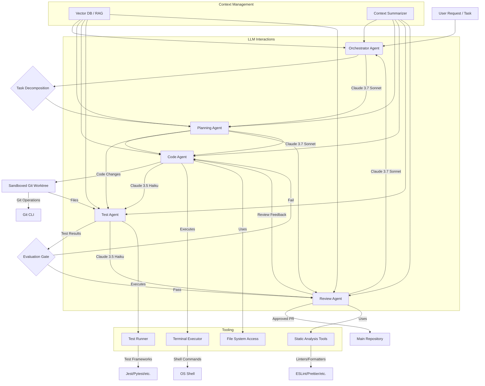

This guide details the architecture and implementation of autonomous coding loops leveraging Claude's capabilities for agentic workflows. We focus on practical, production-grade systems, emphasizing context management, robust tool definitions, and multi-agent orchestration.

<AudioPlayer src="/static/audio/claude-code-agentic-workflow-engineering.mp3" title="Executive Audio Briefing" voice="Google Cloud en-US-Neural2-F" />


## Autonomous Terminal Coding Loop Anatomy

An autonomous terminal coding loop, at its core, is a state machine driven by an LLM, executing actions within a sandboxed environment, and iteratively refining its output based on feedback. The key components are:

1.  **Context Budget Management**: Efficiently managing the LLM's context window to provide relevant information without exceeding token limits. This involves dynamic summarization, retrieval-augmented generation (RAG), and intelligent pruning.
2.  **Tool Definition Schemas**: Precisely defining the actions an agent can take. Tools are functions exposed to the LLM, described via JSON schemas, enabling structured interaction with the environment.
3.  **Fact-Forcing Evaluation Gates**: Implementing objective, automated checks to validate agent output. These gates prevent propagation of incorrect solutions and enforce quality standards.
4.  **Sandboxed Git Worktree Orchestration**: Providing a controlled, isolated environment for code modifications, testing, and version control. This ensures reproducibility and prevents unintended side effects on the main codebase.
5.  **Multi-Turn Error Recovery**: Designing agents to diagnose and recover from failures, rather than simply halting. This involves introspection, re-planning, and leveraging diagnostic tools.

### Architecture Diagram



## Implementing the Autonomous Coding Loop

We'll use TypeScript for demonstration, leveraging a hypothetical `ClaudeClient` and `Tool` interface.

### Tool Definition and Execution

Tools are the agent's interface to the world. Each tool has a `name`, `description`, and a `parameters` JSON schema.

```typescript
// src/tools/types.ts
export interface Tool {
  name: string;
  description: string;
  parameters: {
    type: 'object';
    properties: Record<string, { type: string; description: string; enum?: string[] }>;
    required: string[];
  };
  execute: (args: Record<string, any>) => Promise<string>;
}

// src/tools/terminalExecutor.ts
import { Tool } from './types';
import { exec } from 'child_process';
import util from 'util';

const execPromise = util.promisify(exec);

export const terminalExecutorTool: Tool = {
  name: 'terminal_executor',
  description: 'Executes a shell command in the sandboxed environment and returns its stdout/stderr.',
  parameters: {
    type: 'object',
    properties: {
      command: {
        type: 'string',
        description: 'The shell command to execute (e.g., `npm test`, `git status`, `ls -la`).',
      },
    },
    required: ['command'],
  },
  execute: async ({ command }: { command: string }): Promise<string> => {
    try {
      console.log(`Executing command: ${command}`);
      const { stdout, stderr } = await execPromise(command, { cwd: process.env.SANDBOX_DIR || './sandbox' });
      if (stderr) {
        console.warn(`Command stderr: ${stderr}`);
      }
      return `STDOUT:\n${stdout}\nSTDERR:\n${stderr}`;
    } catch (error: any) {
      return `ERROR: Command failed: ${error.message}\nSTDOUT:\n${error.stdout}\nSTDERR:\n${error.stderr}`;
    }
  },
};

// src/tools/fileManager.ts
import { Tool } from './types';
import fs from 'fs/promises';
import path from 'path';

const SANDBOX_ROOT = process.env.SANDBOX_DIR || './sandbox';

export const fileManagerTool: Tool = {
  name: 'file_manager',
  description: 'Reads, writes, or lists files within the sandboxed environment.',
  parameters: {
    type: 'object',
    properties: {
      action: {
        type: 'string',
        description: 'The file operation to perform.',
        enum: ['read', 'write', 'list'],
      },
      filePath: {
        type: 'string',
        description: 'The path to the file, relative to the sandbox root.',
      },
      content: {
        type: 'string',
        description: 'Content to write for "write" action.',
      },
    },
    required: ['action'],
  },
  execute: async ({ action, filePath, content }: { action: string; filePath?: string; content?: string }): Promise<string> => {
    const fullPath = filePath ? path.join(SANDBOX_ROOT, filePath) : SANDBOX_ROOT;
    try {
      switch (action) {
        case 'read':
          if (!filePath) return 'ERROR: filePath is required for read action.';
          return await fs.readFile(fullPath, 'utf-8');
        case 'write':
          if (!filePath || !content) return 'ERROR: filePath and content are required for write action.';
          await fs.mkdir(path.dirname(fullPath), { recursive: true });
          await fs.writeFile(fullPath, content, 'utf-8');
          return `File written: ${filePath}`;
        case 'list':
          const files = await fs.readdir(fullPath, { recursive: true, withFileTypes: true });
          return files.map(dirent => path.join(dirent.path, dirent.name)).join('\n');
        default:
          return `ERROR: Unknown action: ${action}`;
      }
    } catch (error: any) {
      return `ERROR: File operation failed: ${error.message}`;
    }
  },
};
```

### Claude Client and Tool Calling

Claude's `tool_use` capability is central. The client needs to parse the LLM's response to identify tool calls and execute them.

```typescript
// src/claudeClient.ts
import Anthropic from '@anthropic-ai/sdk';
import { Tool } from './tools/types';

interface ClaudeMessage {
  role: 'user' | 'assistant';
  content: string | Anthropic.Messages.MessageParam.Content;
}

export class ClaudeClient {
  private anthropic: Anthropic;
  private model: string;

  constructor(apiKey: string, model: string = 'claude-3-7-sonnet-20240620') {
    this.anthropic = new Anthropic({ apiKey });
    this.model = model;
  }

  async chat(
    messages: ClaudeMessage[],
    tools: Tool[],
    maxRetries: number = 3
  ): Promise<Anthropic.Messages.Message> {
    let retries = 0;
    while (retries < maxRetries) {
      try {
        const response = await this.anthropic.messages.create({
          model: this.model,
          max_tokens: 4096,
          messages: messages,
          tools: tools.map(tool => ({
            name: tool.name,
            description: tool.description,
            input_schema: tool.parameters,
          })),
        });
        return response;
      } catch (error: any) {
        console.error(`Claude API error (retry ${retries + 1}/${maxRetries}):`, error.message);
        retries++;
        await new Promise(resolve => setTimeout(resolve, 1000 * Math.pow(2, retries))); // Exponential backoff
      }
    }
    throw new Error(`Failed to get response from Claude after ${maxRetries} retries.`);
  }
}
```

### The Autonomous Agent Loop

The core loop involves:
1.  Sending current state and available tools to Claude.
2.  Receiving a response (text or tool call).
3.  If tool call, executing the tool and adding its output to the context.
4.  Repeating until a final answer or termination condition.

```typescript
// src/agents/codingAgent.ts
import { ClaudeClient } from '../claudeClient';
import { Tool } from '../tools/types';
import { terminalExecutorTool, fileManagerTool } from '../tools/index'; // Assuming an index.ts exports all tools

export class CodingAgent {
  private client: ClaudeClient;
  private tools: Tool[];
  private conversationHistory: { role: 'user' | 'assistant'; content: any }[] = [];
  private maxIterations: number;

  constructor(apiKey: string, model: string, maxIterations: number = 10) {
    this.client = new ClaudeClient(apiKey, model);
    this.tools = [terminalExecutorTool, fileManagerTool]; // Register available tools
    this.maxIterations = maxIterations;
  }

  async run(initialTask: string): Promise<string> {
    this.conversationHistory = [{ role: 'user', content: initialTask }];
    let iteration = 0;

    while (iteration < this.maxIterations) {
      console.log(`\n--- Agent Iteration ${iteration + 1} ---`);
      const response = await this.client.chat(this.conversationHistory, this.tools);
      this.conversationHistory.push(response);

      if (response.stop_reason === 'end_turn' && typeof response.content === 'string') {
        console.log('Agent finished with final answer.');
        return response.content; // Agent provided a final text response
      }

      if (response.stop_reason === 'tool_use') {
        const toolCalls = response.content.filter(block => block.type === 'tool_use');
        for (const toolCall of toolCalls) {
          if (toolCall.type === 'tool_use') {
            const tool = this.tools.find(t => t.name === toolCall.name);
            if (tool) {
              console.log(`Agent calling tool: ${tool.name} with args:`, toolCall.input);
              const toolOutput = await tool.execute(toolCall.input);
              console.log(`Tool output: ${toolOutput.substring(0, 200)}...`); // Log truncated output
              this.conversationHistory.push({
                role: 'user',
                content: [{ type: 'tool_result', tool_use_id: toolCall.id, content: toolOutput }],
              });
            } else {
              const errorMessage = `ERROR: Agent tried to call unknown tool: ${toolCall.name}`;
              console.error(errorMessage);
              this.conversationHistory.push({
                role: 'user',
                content: [{ type: 'tool_result', tool_use_id: toolCall.id, content: errorMessage }],
              });
            }
          }
        }
      } else {
        console.log('Agent response:', response.content);
        // If it's not a tool_use and not a final answer, it might be an intermediate thought.
        // We can choose to continue or terminate based on the content.
        // For simplicity, we'll just continue here.
      }
      iteration++;
    }
    return 'Agent terminated due to max iterations without a final answer.';
  }
}

// Example usage:
// (async () => {
//   const apiKey = process.env.ANTHROPIC_API_KEY!;
//   if (!apiKey) {
//     console.error('ANTHROPIC_API_KEY environment variable not set.');
//     process.exit(1);
//   }
//   // Ensure sandbox directory exists
//   await fs.mkdir('./sandbox', { recursive: true });
//   process.env.SANDBOX_DIR = './sandbox';

//   const agent = new CodingAgent(apiKey, 'claude-3-7-sonnet-20240620');
//   const task = 'Create a file named `hello.js` in the sandbox with content `console.log("Hello, Claude!");` then execute it using node.';
//   const result = await agent.run(task);
//   console.log('Final Agent Result:', result);
// })();
```

### Evaluation Gates

Evaluation gates are critical for ensuring correctness. They can range from simple regex checks to full test suite executions.

```typescript
// src/evalGates/testRunnerGate.ts
import { terminalExecutorTool } from '../tools/terminalExecutor';

export async function runTestsAndEvaluate(testCommand: string): Promise<{ passed: boolean; output: string }> {
  console.log(`Running evaluation tests with command: ${testCommand}`);
  const result = await terminalExecutorTool.execute({ command: testCommand });

  // Simple heuristic: check for common success/failure indicators
  const passed = !result.includes('ERROR:') && !result.includes('fail') && !result.includes('Failures');
  return { passed, output: result };
}

// Example integration in agent loop (conceptual):
// ... inside CodingAgent.run() after code modification ...
// const { passed, output } = await runTestsAndEvaluate('npm test');
// if (!passed) {
//   this.conversationHistory.push({
//     role: 'user',
//     content: `Tests failed. Output:\n${output}\nAnalyze the failures and fix the code.`,
//   });
// } else {
//   this.conversationHistory.push({
//     role: 'user',
//     content: `Tests passed. Output:\n${output}\nProceed to next step (e.g., code review).`,
//   });
// }
// ...
```

### Sandboxed Git Worktree Orchestration

For robust code changes, a dedicated git worktree is essential.

```bash
# Initialize a sandbox directory and git repo
mkdir sandbox
cd sandbox
git init -b main
echo "Initial project setup." > README.md
git add .
git commit -m "Initial commit"

# Create a worktree for the agent
# This allows the agent to work on a separate branch without affecting main
git worktree add ../agent-worktree agent-branch
```

The `terminalExecutorTool` should operate within the `agent-worktree` directory.

## Multi-Agent Architecture

For complex tasks, a single agent often struggles. A multi-agent system, where specialized agents collaborate, is more effective.

### Agent Roles

*   **Orchestrator Agent**: Decomposes the main task, assigns sub-tasks to specialized agents, and synthesizes their results. Uses a higher-tier model (e.g., Claude 3.7 Sonnet).
*   **Planning Agent**: Develops detailed execution plans for sub-tasks.
*   **Code Agent**: Writes and modifies code.
*   **Test Agent**: Generates and executes tests, reports results.
*   **Review Agent**: Performs static analysis, suggests improvements, and approves/rejects changes.
*   **Refinement Agent**: Specializes in debugging and error recovery.

### Custom MCP Servers & Auto-Review Hooks

A Master Control Program (MCP) server acts as a central hub for agent communication and state management. Auto-review hooks are pre-commit or pre-merge checks that leverage Review Agents.

```typescript
// src/mcpServer.ts
import express from 'express';
import bodyParser from 'body-parser';
import { CodingAgent } from './agents/codingAgent'; // Example agent
import { ReviewAgent } from './agents/reviewAgent'; // Example review agent

interface AgentTask {
  id: string;
  task: string;
  status: 'pending' | 'in_progress' | 'completed' | 'failed';
  result?: string;
  agentType: 'coding' | 'review';
}

export class MCPServer {
  private app: express.Application;
  private tasks: Map<string, AgentTask> = new Map();
  private codingAgent: CodingAgent;
  private reviewAgent: ReviewAgent; // Assume ReviewAgent exists

  constructor(anthropicApiKey: string) {
    this.app = express();
    this.app.use(bodyParser.json());
    this.codingAgent = new CodingAgent(anthropicApiKey, 'claude-3-7-sonnet-20240620');
    this.reviewAgent = new ReviewAgent(anthropicApiKey, 'claude-3-7-sonnet-20240620'); // Review agent might use a more capable model

    this.setupRoutes();
  }

  private setupRoutes() {
    this.app.post('/task', async (req, res) => {
      const { task, agentType } = req.body;
      if (!task || !agentType) {
        return res.status(400).send('Task and agentType are required.');
      }

      const taskId = `task-${Date.now()}`;
      this.tasks.set(taskId, { id: taskId, task, status: 'pending', agentType });
      res.status(202).json({ taskId, status: 'accepted' });

      // Asynchronously process the task
      this.processTask(taskId);
    });

    this.app.get('/task/:id', (req, res) => {
      const task = this.tasks.get(req.params.id);
      if (!task) {
        return res.status(404).send('Task not found.');
      }
      res.json(task);
    });

    // Auto-review hook endpoint
    this.app.post('/review-pr', async (req, res) => {
      const { prDiff, branchName } = req.body; // In a real system, this would be a webhook payload
      if (!prDiff || !branchName) {
        return res.status(400).send('PR diff and branch name are required.');
      }

      const reviewTaskId = `review-${Date.now()}`;
      this.tasks.set(reviewTaskId, { id: reviewTaskId, task: `Review PR for branch ${branchName}`, status: 'pending', agentType: 'review' });
      res.status(202).json({ reviewTaskId, status: 'review_initiated' });

      // In a real system, the ReviewAgent would interact with Git/PR system
      this.reviewAgent.reviewCode(prDiff, branchName)
        .then(reviewResult => {
          this.tasks.set(reviewTaskId, { ...this.tasks.get(reviewTaskId)!, status: 'completed', result: reviewResult });
          // Here, you'd typically post the reviewResult back to the PR system (e.g., GitHub API)
          console.log(`Review for ${branchName} completed: ${reviewResult}`);
        })
        .catch(error => {
          this.tasks.set(reviewTaskId, { ...this.tasks.get(reviewTaskId)!, status: 'failed', result: error.message });
          console.error(`Review for ${branchName} failed: ${error.message}`);
        });
    });
  }

  private async processTask(taskId: string) {
    const taskEntry = this.tasks.get(taskId);
    if (!taskEntry) return;

    this.tasks.set(taskId, { ...taskEntry, status: 'in_progress' });
    try {
      let result: string;
      if (taskEntry.agentType === 'coding') {
        result = await this.codingAgent.run(taskEntry.task);
      } else if (taskEntry.agentType === 'review') {
        // This path would be for direct review tasks, not PR hooks
        result = await this.reviewAgent.reviewCode(taskEntry.task, 'adhoc-review');
      } else {
        throw new Error(`Unknown agent type: ${taskEntry.agentType}`);
      }
      this.tasks.set(taskId, { ...taskEntry, status: 'completed', result });
    } catch (error: any) {
      this.tasks.set(taskId, { ...taskEntry, status: 'failed', result: error.message });
    }
  }

  listen(port: number) {
    this.app.listen(port, () => {
      console.log(`MCP Server listening on port ${port}`);
    });
  }
}

// (async () => {
//   const apiKey = process.env.ANTHROPIC_API_KEY!;
//   if (!apiKey) {
//     console.error('ANTHROPIC_API_KEY environment variable not set.');
//     process.exit(1);
//   }
//   const mcp = new MCPServer(apiKey);
//   mcp.listen(3000);
// })();
```

### Cost-Effective Model Routing

Different tasks require different LLM capabilities and have varying cost sensitivities.

*   **Claude 3.7 Sonnet**: Higher reasoning, complex planning, code generation, and critical review tasks. More expensive, but higher quality.
*   **Claude 3.5 Haiku**: Faster, cheaper, suitable for simpler tasks like test generation, initial code drafts, summarization, and quick checks.

The `ClaudeClient` can be instantiated with different models, or the `MCPServer` can route tasks to agents configured with specific models.

```typescript
// Example of model routing in Orchestrator or MCP
const codingAgent = new CodingAgent(apiKey, 'claude-3-7-sonnet-20240620'); // For complex coding
const testAgent = new TestAgent(apiKey, 'claude-3-5-haiku-20240307'); // For generating simple tests
const reviewAgent = new ReviewAgent(apiKey, 'claude-3-7-sonnet-20240620'); // For critical code review
```

## Agentic vs. Copilot Workflows

| Feature                 | Agentic Workflows (Autonomous)                                    | Copilot Workflows (Assisted)                                      |
| :---------------------- | :---------------------------------------------------------------- | :---------------------------------------------------------------- |
| **Autonomy Level**      | High. Agents execute multi-step tasks end-to-end.                 | Low. Suggests code, user drives development.                      |
| **Interaction Model**   | Goal-driven. User defines high-level objective, agents act.       | Interactive. User prompts, LLM responds with suggestions.         |
| **Task Complexity**     | Suited for complex, multi-stage tasks (e.g., "Implement feature X"). | Suited for localized coding tasks (e.g., "Write function Y").     |
| **Error Handling**      | Multi-turn error recovery, self-correction.                       | User-driven error correction.                                     |
| **Context Management**  | Sophisticated, dynamic context window management.                 | Primarily local file/editor context.                              |
| **Tool Use**            | Extensive, structured tool use for environment interaction.       | Limited, often IDE-integrated actions (e.g., refactor, explain).  |
| **Cost Model**          | Potentially higher per-task cost due to multiple LLM calls.       | Lower per-interaction cost.                                       |
| **Development Cycle**   | Can automate entire dev cycles (plan, code, test, review).        | Accelerates individual coding steps.                              |
| **Reproducibility**     | High, especially with sandboxed environments and clear prompts.   | Depends on user's actions and prompts.                            |

## Production Gotchas & Troubleshooting

1.  **Context Window Overflow**:
    *   **Failure Mode**: LLM receives truncated context, leading to illogical actions or `400 Bad Request` errors from the API.
    *   **Fix**: Implement dynamic summarization (e.g., using a cheaper LLM like Haiku to summarize long logs/files), RAG for relevant code snippets, and intelligent pruning of conversation history. Prioritize recent interactions and critical files.
    *   **Code Example**: Before adding a large tool output, check token count.
        ```typescript
        // In ClaudeClient or Agent
        import { getEncoding } from 'js-tiktoken';
        const encoding = getEncoding('cl100k_base'); // For Claude 3 models

        function getTokenCount(text: string): number {
          return encoding.encode(text).length;
        }

        // ... inside agent loop before pushing tool_result ...
        const MAX_TOOL_OUTPUT_TOKENS = 1000;
        let toolOutput = await tool.execute(toolCall.input);
        if (getTokenCount(toolOutput) > MAX_TOOL_OUTPUT_TOKENS) {
          const summaryPrompt = `Summarize the following tool output, highlighting key results, errors, or relevant information for a coding agent. Keep it concise, under ${MAX_TOOL_OUTPUT_TOKENS} tokens:\n\n${toolOutput}`;
          // Use a separate, cheaper ClaudeClient for summarization
          const summaryClient = new ClaudeClient(apiKey, 'claude-3-5-haiku-20240307');
          const summaryResponse = await summaryClient.chat([{ role: 'user', content: summaryPrompt }], []);
          toolOutput = `(Summarized due to length) Original output too long. Summary:\n${summaryResponse.content}`;
        }
        this.conversationHistory.push({
          role: 'user',
          content: [{ type: 'tool_result', tool_use_id: toolCall.id, content: toolOutput }],
        });
        ```

2.  **Non-Deterministic Tool Calls**:
    *   **Failure Mode**: LLM generates malformed JSON for tool calls or invents non-existent tools/parameters.
    *   **Fix**: Strict JSON schema validation on tool inputs. Implement retry mechanisms with explicit error messages back to the LLM. Use system prompts to reinforce tool usage guidelines. Claude's native `tool_use` is generally robust, but external tools might still fail.
    *   **Code Example**: The `ClaudeClient` already handles basic API errors. For malformed tool inputs, the `execute` method should return informative errors.

3.  **Sandbox Contamination/State Drift**:
    *   **Failure Mode**: Agent's actions in the sandbox are not properly reset or isolated, leading to unexpected behavior in subsequent runs.
    *   **Fix**: Use ephemeral git worktrees for each task or sub-task. Ensure a clean `git reset --hard` and `git clean -fdx` before each new agent run. Docker containers or VMs offer stronger isolation for critical tasks.
    *   **Shell Command**: `rm -rf agent-worktree && git worktree add ../agent-worktree agent-branch`

4.  **Infinite Loops / Oscillation**:
    *   **Failure Mode**: Agent repeatedly tries the same failed approach or gets stuck in a cycle of actions without progress.
    *   **Fix**: Implement iteration limits (`maxIterations`). Introduce a "critic" or "monitor" agent that observes the main agent's actions and intervenes if no progress is detected (e.g., same files modified repeatedly without passing tests). Track modified files and test results to detect stagnation.
    *   **Code Example**: The `maxIterations` in `CodingAgent` is a basic safeguard. More advanced solutions involve state tracking.

5.  **Cost Overruns**:
    *   **Failure Mode**: Excessive LLM calls, especially with expensive models, lead to high API bills.
    *   **Fix**: Implement model routing (as discussed). Cache LLM responses for identical prompts. Use cheaper models for summarization, planning, and initial drafts. Monitor token usage per task.
    *   **Monitoring**: Integrate with Anthropic's usage dashboards or custom logging to track token consumption per agent/task.


## Test Your Knowledge

<Quiz questions={
  [
    {
      "question": "In a production-grade autonomous coding loop, why is 'Fact-Forcing Evaluation Gates' a critical component, especially when dealing with LLM-driven code generation?",
      "options": [
        "They primarily serve to reduce the LLM's token usage by summarizing generated code.",
        "They ensure that all generated code strictly adheres to a predefined coding style guide.",
        "They provide objective, automated validation of agent output, preventing the propagation of incorrect or non-functional solutions.",
        "They are used to dynamically adjust the LLM's temperature and top-p parameters for better code quality."
      ],
      "correctAnswer": 2,
      "explanation": "Fact-Forcing Evaluation Gates are crucial for production systems because LLMs, while powerful, can still generate incorrect or hallucinated code. These gates act as automated quality checks, using objective criteria (like passing tests or static analysis) to validate the agent's output. This prevents flawed code from progressing further in the development cycle, enforcing quality standards and reducing the risk of introducing bugs into the main codebase. The other options describe secondary benefits or incorrect functionalities."
    },
    {
      "question": "Considering the multi-agent architecture described, what is the primary production tradeoff in using different Claude models (e.g., Sonnet for Planning/Code, Haiku for Test/Review) for distinct agent roles?",
      "options": [
        "It primarily aims to reduce the overall latency of the entire coding loop by parallelizing LLM calls.",
        "It allows for cost optimization by using less expensive, faster models (Haiku) for tasks that require less complex reasoning, while reserving more capable models (Sonnet) for critical, complex tasks.",
        "It simplifies context budget management by assigning specific context window sizes to each model.",
        "It is a strategy to mitigate vendor lock-in by diversifying the LLM providers used within the system."
      ],
      "correctAnswer": 1,
      "explanation": "The primary production tradeoff in using different LLM models like Claude Sonnet and Haiku for distinct roles is cost optimization and performance tuning. More capable models like Sonnet are generally more expensive and slower but excel at complex reasoning (e.g., planning, code generation). Less capable but faster and cheaper models like Haiku can be sufficient for tasks like generating test cases or reviewing code, where the complexity of reasoning might be lower. This selective assignment allows engineers to balance the need for high-quality output with operational costs and overall system throughput, rather than simply parallelizing calls or managing context budgets."
    }
  ]
} />


## Frequently Asked Questions

1.  **How do I ensure the agent's code changes are safe and don't introduce vulnerabilities?**
    *   Integrate security linters (e.g., Bandit for Python, ESLint with security plugins for JS) into the Review Agent's toolkit. Implement a dedicated "Security Agent" for vulnerability scanning. Crucially, all agent-generated code must pass human review before merging to production. The sandboxed environment prevents direct harm to the main codebase.

2.  **What's the best way to manage dependencies for the agent's sandbox?**
    *   For each new task, the agent should first run dependency installation commands (e.g., `npm install`, `pip install -r requirements.txt`). The sandbox should ideally be a fresh environment (e.g., a Docker container) or a git worktree with a clean `node_modules` or `venv` directory. Provide the agent with tools to manage these dependencies.

3.  **Can agents handle complex refactoring tasks across multiple files?**
    *   Yes, but it requires sophisticated planning and context management. The Orchestrator Agent would break down the refactoring into smaller, manageable steps. The Code Agent would need access to a broad context (via RAG) and tools for semantic code analysis (e.g., AST parsers) to ensure correctness across files. This is where Claude 3.7 Sonnet's larger context window and stronger reasoning shine.

4.  **How do I debug an agent that's stuck or producing incorrect output?**
    *   **Detailed Logging**: Log all LLM prompts, responses, tool calls, and tool outputs.
    *   **Conversation History Inspection**: Review the `conversationHistory` to understand the agent's thought process and identify where it went wrong.
    *   **Interactive Debugging**: Implement a "human-in-the-loop" mode where the agent pauses at critical junctures, allowing a human to inspect state, provide feedback, or even manually execute a tool.
    *   **"Why" Tool**: Give the agent a special tool that, when called, forces it to explain its reasoning for the last action, which can be logged for debugging.

5.  **What are the limitations of current agentic systems with Claude?**
    *   **Hallucinations**: LLMs can still generate plausible but incorrect information or code. Evaluation gates and human review are essential.
    *   **Context Window Limits**: Despite large context windows, complex, large codebases can still exceed limits, requiring sophisticated RAG and summarization.
    *   **Computational Cost**: Running many LLM calls, especially with larger models, can be expensive and slow.
    *   **Lack of True Understanding**: Agents operate on patterns and probabilities, not genuine understanding. They can struggle with novel problems or subtle logical errors.
    *   **Tool Reliability**: The reliability of the agent is directly tied to the reliability and robustness of the tools it uses.
