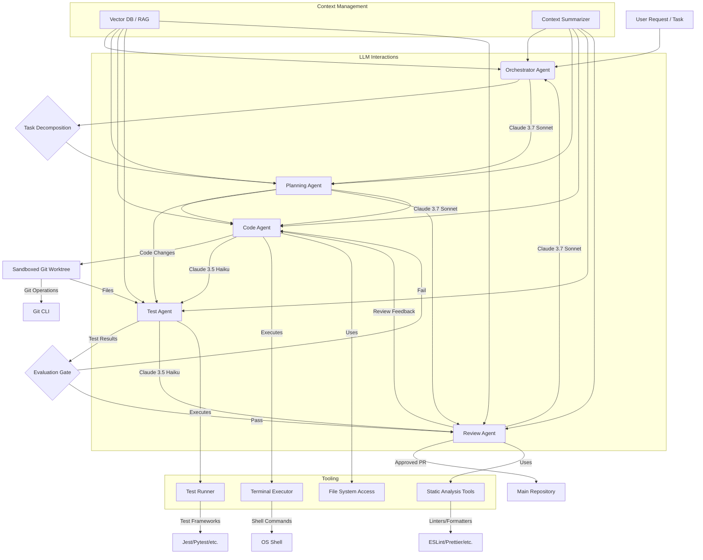

このガイドでは、Claudeの機能とエージェントワークフローを活用した自律的なコーディングループのアーキテクチャと実装について詳しく説明します。コンテキスト管理、堅牢なツール定義、マルチエージェントオーケストレーションに重点を置き、実用的で本番環境に対応したシステムに焦点を当てます。

<AudioPlayer src="/static/audio/claude-code-agentic-workflow-engineering-ja.mp3" title="音声エグゼクティブ・ブリーフィング" voice="Google Cloud ja-JP-Neural2-B" />


## 自律型ターミナルコーディングループの構造

自律型ターミナルコーディングループは、その核となる部分で、LLMによって駆動されるステートマシンであり、サンドボックス環境内でアクションを実行し、フィードバックに基づいて出力を繰り返し洗練させます。主要なコンポーネントは次のとおりです。

1.  **コンテキスト予算管理（Context Budget Management）**: トークン制限を超えずに、関連情報を提供するためにLLMのコンテキストウィンドウを効率的に管理します。これには、動的な要約、検索拡張生成（RAG）、インテリジェントなプルーニングが含まれます。
2.  **ツール定義スキーマ（Tool Definition Schemas）**: エージェントが実行できるアクションを正確に定義します。ツールはLLMに公開される関数であり、JSONスキーマを介して記述され、環境との構造化された対話を可能にします。
3.  **ファクト強制評価ゲート（Fact-Forcing Evaluation Gates）**: エージェントの出力を検証するための客観的で自動化されたチェックを実装します。これらのゲートは、誤ったソリューションの伝播を防ぎ、品質基準を強制します。
4.  **サンドボックス化されたGitワークツリーオーケストレーション（Sandboxed Git Worktree Orchestration）**: コードの変更、テスト、バージョン管理のための制御された分離環境を提供します。これにより、再現性が確保され、メインコードベースへの意図しない副作用が防止されます。
5.  **マルチターンエラー回復（Multi-Turn Error Recovery）**: 単に停止するのではなく、障害を診断して回復するようにエージェントを設計します。これには、内省、再計画、診断ツールの活用が含まれます。

### アーキテクチャ図



## 自律型コーディングループの実装

デモンストレーションにはTypeScriptを使用し、架空の`ClaudeClient`と`Tool`インターフェースを活用します。

### ツール定義と実行

ツールは、エージェントが世界と対話するためのインターフェースです。各ツールには、`name`、`description`、および`parameters`のJSONスキーマがあります。

```typescript
// src/tools/types.ts
export interface Tool {
  name: string;
  description: string;
  parameters: {
    type: 'object';
    properties: Record<string, { type: string; description: string; enum?: string[] }>;
    required: string[];
  };
  execute: (args: Record<string, any>) => Promise<string>;
}

// src/tools/terminalExecutor.ts
import { Tool } from './types';
import { exec } from 'child_process';
import util from 'util';

const execPromise = util.promisify(exec);

export const terminalExecutorTool: Tool = {
  name: 'terminal_executor',
  description: 'Executes a shell command in the sandboxed environment and returns its stdout/stderr.',
  parameters: {
    type: 'object',
    properties: {
      command: {
        type: 'string',
        description: 'The shell command to execute (e.g., `npm test`, `git status`, `ls -la`).',
      },
    },
    required: ['command'],
  },
  execute: async ({ command }: { command: string }): Promise<string> => {
    try {
      console.log(`Executing command: ${command}`);
      const { stdout, stderr } = await execPromise(command, { cwd: process.env.SANDBOX_DIR || './sandbox' });
      if (stderr) {
        console.warn(`Command stderr: ${stderr}`);
      }
      return `STDOUT:\n${stdout}\nSTDERR:\n${stderr}`;
    } catch (error: any) {
      return `ERROR: Command failed: ${error.message}\nSTDOUT:\n${error.stdout}\nSTDERR:\n${error.stderr}`;
    }
  },
};

// src/tools/fileManager.ts
import { Tool } from './types';
import fs from 'fs/promises';
import path from 'path';

const SANDBOX_ROOT = process.env.SANDBOX_DIR || './sandbox';

export const fileManagerTool: Tool = {
  name: 'file_manager',
  description: 'Reads, writes, or lists files within the sandboxed environment.',
  parameters: {
    type: 'object',
    properties: {
      action: {
        type: 'string',
        description: 'The file operation to perform.',
        enum: ['read', 'write', 'list'],
      },
      filePath: {
        type: 'string',
        description: 'The path to the file, relative to the sandbox root.',
      },
      content: {
        type: 'string',
        description: 'Content to write for "write" action.',
      },
    },
    required: ['action'],
  },
  execute: async ({ action, filePath, content }: { action: string; filePath?: string; content?: string }): Promise<string> => {
    const fullPath = filePath ? path.join(SANDBOX_ROOT, filePath) : SANDBOX_ROOT;
    try {
      switch (action) {
        case 'read':
          if (!filePath) return 'ERROR: filePath is required for read action.';
          return await fs.readFile(fullPath, 'utf-8');
        case 'write':
          if (!filePath || !content) return 'ERROR: filePath and content are required for write action.';
          await fs.mkdir(path.dirname(fullPath), { recursive: true });
          await fs.writeFile(fullPath, content, 'utf-8');
          return `File written: ${filePath}`;
        case 'list':
          const files = await fs.readdir(fullPath, { recursive: true, withFileTypes: true });
          return files.map(dirent => path.join(dirent.path, dirent.name)).join('\n');
        default:
          return `ERROR: Unknown action: ${action}`;
      }
    } catch (error: any) {
      return `ERROR: File operation failed: ${error.message}`;
    }
  },
};
```

### Claudeクライアントとツール呼び出し

Claudeの`tool_use`機能が中心となります。クライアントは、ツール呼び出しを識別して実行するために、LLMの応答を解析する必要があります。

```typescript
// src/claudeClient.ts
import Anthropic from '@anthropic-ai/sdk';
import { Tool } from './tools/types';

interface ClaudeMessage {
  role: 'user' | 'assistant';
  content: string | Anthropic.Messages.MessageParam.Content;
}

export class ClaudeClient {
  private anthropic: Anthropic;
  private model: string;

  constructor(apiKey: string, model: string = 'claude-3-7-sonnet-20240620') {
    this.anthropic = new Anthropic({ apiKey });
    this.model = model;
  }

  async chat(
    messages: ClaudeMessage[],
    tools: Tool[],
    maxRetries: number = 3
  ): Promise<Anthropic.Messages.Message> {
    let retries = 0;
    while (retries < maxRetries) {
      try {
        const response = await this.anthropic.messages.create({
          model: this.model,
          max_tokens: 4096,
          messages: messages,
          tools: tools.map(tool => ({
            name: tool.name,
            description: tool.description,
            input_schema: tool.parameters,
          })),
        });
        return response;
      } catch (error: any) {
        console.error(`Claude API error (retry ${retries + 1}/${maxRetries}):`, error.message);
        retries++;
        await new Promise(resolve => setTimeout(resolve, 1000 * Math.pow(2, retries))); // Exponential backoff
      }
    }
    throw new Error(`Failed to get response from Claude after ${maxRetries} retries.`);
  }
}
```

### 自律型エージェントループ

コアとなるループは次のとおりです。
1.  現在の状態と利用可能なツールをClaudeに送信します。
2.  応答（テキストまたはツール呼び出し）を受信します。
3.  ツール呼び出しの場合、ツールを実行し、その出力をコンテキストに追加します。
4.  最終的な回答または終了条件に達するまで繰り返します。

```typescript
// src/agents/codingAgent.ts
import { ClaudeClient } from '../claudeClient';
import { Tool } from '../tools/types';
import { terminalExecutorTool, fileManagerTool } from '../tools/index'; // Assuming an index.ts exports all tools

export class CodingAgent {
  private client: ClaudeClient;
  private tools: Tool[];
  private conversationHistory: { role: 'user' | 'assistant'; content: any }[] = [];
  private maxIterations: number;

  constructor(apiKey: string, model: string, maxIterations: number = 10) {
    this.client = new ClaudeClient(apiKey, model);
    this.tools = [terminalExecutorTool, fileManagerTool]; // Register available tools
    this.maxIterations = maxIterations;
  }

  async run(initialTask: string): Promise<string> {
    this.conversationHistory = [{ role: 'user', content: initialTask }];
    let iteration = 0;

    while (iteration < this.maxIterations) {
      console.log(`\n--- Agent Iteration ${iteration + 1} ---`);
      const response = await this.client.chat(this.conversationHistory, this.tools);
      this.conversationHistory.push(response);

      if (response.stop_reason === 'end_turn' && typeof response.content === 'string') {
        console.log('Agent finished with final answer.');
        return response.content; // Agent provided a final text response
      }

      if (response.stop_reason === 'tool_use') {
        const toolCalls = response.content.filter(block => block.type === 'tool_use');
        for (const toolCall of toolCalls) {
          if (toolCall.type === 'tool_use') {
            const tool = this.tools.find(t => t.name === toolCall.name);
            if (tool) {
              console.log(`Agent calling tool: ${tool.name} with args:`, toolCall.input);
              const toolOutput = await tool.execute(toolCall.input);
              console.log(`Tool output: ${toolOutput.substring(0, 200)}...`); // Log truncated output
              this.conversationHistory.push({
                role: 'user',
                content: [{ type: 'tool_result', tool_use_id: toolCall.id, content: toolOutput }],
              });
            } else {
              const errorMessage = `ERROR: Agent tried to call unknown tool: ${toolCall.name}`;
              console.error(errorMessage);
              this.conversationHistory.push({
                role: 'user',
                content: [{ type: 'tool_result', tool_use_id: toolCall.id, content: errorMessage }],
              });
            }
          }
        }
      } else {
        console.log('Agent response:', response.content);
        // If it's not a tool_use and not a final answer, it might be an intermediate thought.
        // We can choose to continue or terminate based on the content.
        // For simplicity, we'll just continue here.
      }
      iteration++;
    }
    return 'Agent terminated due to max iterations without a final answer.';
  }
}

// Example usage:
// (async () => {
//   const apiKey = process.env.ANTHROPIC_API_KEY!;
//   if (!apiKey) {
//     console.error('ANTHROPIC_API_KEY environment variable not set.');
//     process.exit(1);
//   }
//   // Ensure sandbox directory exists
//   await fs.mkdir('./sandbox', { recursive: true });
//   process.env.SANDBOX_DIR = './sandbox';

//   const agent = new CodingAgent(apiKey, 'claude-3-7-sonnet-20240620');
//   const task = 'Create a file named `hello.js` in the sandbox with content `console.log("Hello, Claude!");` then execute it using node.';
//   const result = await agent.run(task);
//   console.log('Final Agent Result:', result);
// })();
```

### 評価ゲート

評価ゲートは、正確性を確保するために不可欠です。単純な正規表現チェックから完全なテストスイートの実行まで、さまざまなものがあります。

```typescript
// src/evalGates/testRunnerGate.ts
import { terminalExecutorTool } from '../tools/terminalExecutor';

export async function runTestsAndEvaluate(testCommand: string): Promise<{ passed: boolean; output: string }> {
  console.log(`Running evaluation tests with command: ${testCommand}`);
  const result = await terminalExecutorTool.execute({ command: testCommand });

  // Simple heuristic: check for common success/failure indicators
  const passed = !result.includes('ERROR:') && !result.includes('fail') && !result.includes('Failures');
  return { passed, output: result };
}

// Example integration in agent loop (conceptual):
// ... inside CodingAgent.run() after code modification ...
// const { passed, output } = await runTestsAndEvaluate('npm test');
// if (!passed) {
//   this.conversationHistory.push({
//     role: 'user',
//     content: `Tests failed. Output:\n${output}\nAnalyze the failures and fix the code.`,
//   });
// } else {
//   this.conversationHistory.push({
//     role: 'user',
//     content: `Tests passed. Output:\n${output}\nProceed to next step (e.g., code review).`,
//   });
// }
// ...
```

### サンドボックス化されたGitワークツリーオーケストレーション

堅牢なコード変更には、専用のgitワークツリーが不可欠です。

```bash
# Initialize a sandbox directory and git repo
mkdir sandbox
cd sandbox
git init -b main
echo "Initial project setup." > README.md
git add .
git commit -m "Initial commit"

# Create a worktree for the agent
# This allows the agent to work on a separate branch without affecting main
git worktree add ../agent-worktree agent-branch
```

`terminalExecutorTool`は`agent-worktree`ディレクトリ内で動作する必要があります。

## マルチエージェントアーキテクチャ

複雑なタスクの場合、単一のエージェントではしばしば苦戦します。専門のエージェントが協力するマルチエージェントシステムの方が効果的です。

### エージェントの役割

*   **オーケストレーターエージェント（Orchestrator Agent）**: メインタスクを分解し、専門エージェントにサブタスクを割り当て、その結果を統合します。より上位のモデル（例：Claude 3.7 Sonnet）を使用します。
*   **プランニングエージェント（Planning Agent）**: サブタスクの詳細な実行計画を立てます。
*   **コードエージェント（Code Agent）**: コードを記述および変更します。
*   **テストエージェント（Test Agent）**: テストを生成および実行し、結果を報告します。
*   **レビューエージェント（Review Agent）**: 静的解析を実行し、改善を提案し、変更を承認/拒否します。
*   **リファインメントエージェント（Refinement Agent）**: デバッグとエラー回復に特化しています。

### カスタムMCPサーバーと自動レビューフック

マスターコントロールプログラム（MCP）サーバーは、エージェント間の通信と状態管理の中心的なハブとして機能します。自動レビューフックは、レビューエージェントを活用するプレコミットまたはプレマージチェックです。

```typescript
// src/mcpServer.ts
import express from 'express';
import bodyParser from 'body-parser';
import { CodingAgent } from './agents/codingAgent'; // Example agent
import { ReviewAgent } from './agents/reviewAgent'; // Example review agent

interface AgentTask {
  id: string;
  task: string;
  status: 'pending' | 'in_progress' | 'completed' | 'failed';
  result?: string;
  agentType: 'coding' | 'review';
}

export class MCPServer {
  private app: express.Application;
  private tasks: Map<string, AgentTask> = new Map();
  private codingAgent: CodingAgent;
  private reviewAgent: ReviewAgent; // Assume ReviewAgent exists

  constructor(anthropicApiKey: string) {
    this.app = express();
    this.app.use(bodyParser.json());
    this.codingAgent = new CodingAgent(anthropicApiKey, 'claude-3-7-sonnet-20240620');
    this.reviewAgent = new ReviewAgent(anthropicApiKey, 'claude-3-7-sonnet-20240620'); // Review agent might use a more capable model

    this.setupRoutes();
  }

  private setupRoutes() {
    this.app.post('/task', async (req, res) => {
      const { task, agentType } = req.body;
      if (!task || !agentType) {
        return res.status(400).send('Task and agentType are required.');
      }

      const taskId = `task-${Date.now()}`;
      this.tasks.set(taskId, { id: taskId, task, status: 'pending', agentType });
      res.status(202).json({ taskId, status: 'accepted' });

      // Asynchronously process the task
      this.processTask(taskId);
    });

    this.app.get('/task/:id', (req, res) => {
      const task = this.tasks.get(req.params.id);
      if (!task) {
        return res.status(404).send('Task not found.');
      }
      res.json(task);
    });

    // Auto-review hook endpoint
    this.app.post('/review-pr', async (req, res) => {
      const { prDiff, branchName } = req.body; // In a real system, this would be a webhook payload
      if (!prDiff || !branchName) {
        return res.status(400).send('PR diff and branch name are required.');
      }

      const reviewTaskId = `review-${Date.now()}`;
      this.tasks.set(reviewTaskId, { id: reviewTaskId, task: `Review PR for branch ${branchName}`, status: 'pending', agentType: 'review' });
      res.status(202).json({ reviewTaskId, status: 'review_initiated' });

      // In a real system, the ReviewAgent would interact with Git/PR system
      this.reviewAgent.reviewCode(prDiff, branchName)
        .then(reviewResult => {
          this.tasks.set(reviewTaskId, { ...this.tasks.get(reviewTaskId)!, status: 'completed', result: reviewResult });
          // Here, you'd typically post the reviewResult back to the PR system (e.g., GitHub API)
          console.log(`Review for ${branchName} completed: ${reviewResult}`);
        })
        .catch(error => {
          this.tasks.set(reviewTaskId, { ...this.tasks.get(reviewTaskId)!, status: 'failed', result: error.message });
          console.error(`Review for ${branchName} failed: ${error.message}`);
        });
    });
  }

  private async processTask(taskId: string) {
    const taskEntry = this.tasks.get(taskId);
    if (!taskEntry) return;

    this.tasks.set(taskId, { ...taskEntry, status: 'in_progress' });
    try {
      let result: string;
      if (taskEntry.agentType === 'coding') {
        result = await this.codingAgent.run(taskEntry.task);
      } else if (taskEntry.agentType === 'review') {
        // This path would be for direct review tasks, not PR hooks
        result = await this.reviewAgent.reviewCode(taskEntry.task, 'adhoc-review');
      } else {
        throw new Error(`Unknown agent type: ${taskEntry.agentType}`);
      }
      this.tasks.set(taskId, { ...taskEntry, status: 'completed', result });
    } catch (error: any) {
      this.tasks.set(taskId, { ...taskEntry, status: 'failed', result: error.message });
    }
  }

  listen(port: number) {
    this.app.listen(port, () => {
      console.log(`MCP Server listening on port ${port}`);
    });
  }
}

// (async () => {
//   const apiKey = process.env.ANTHROPIC_API_KEY!;
//   if (!apiKey) {
//     console.error('ANTHROPIC_API_KEY environment variable not set.');
//     process.exit(1);
//   }
//   const mcp = new MCPServer(apiKey);
//   mcp.listen(3000);
// })();
```

### 費用対効果の高いモデルルーティング

異なるタスクには異なるLLM機能が必要であり、コスト感度も異なります。

*   **Claude 3.7 Sonnet**: 高度な推論、複雑な計画、コード生成、重要なレビュータスクに適しています。高価ですが、品質は高いです。
*   **Claude 3.5 Haiku**: 高速で安価であり、テスト生成、初期コードドラフト、要約、迅速なチェックなどのより単純なタスクに適しています。

`ClaudeClient`は異なるモデルでインスタンス化することも、`MCPServer`が特定のモデルで構成されたエージェントにタスクをルーティングすることもできます。

```typescript
// Example of model routing in Orchestrator or MCP
const codingAgent = new CodingAgent(apiKey, 'claude-3-7-sonnet-20240620'); // For complex coding
const testAgent = new TestAgent(apiKey, 'claude-3-5-haiku-20240307'); // For generating simple tests
const reviewAgent = new ReviewAgent(apiKey, 'claude-3-7-sonnet-20240620'); // For critical code review
```

## エージェントワークフローとコパイロットワークフローの比較

| 機能                  | エージェントワークフロー（自律型）                                    | コパイロットワークフロー（支援型）                                      |
| :-------------------- | :---------------------------------------------------------------- | :---------------------------------------------------------------- |
| **自律レベル**        | 高い。エージェントはマルチステップタスクをエンドツーエンドで実行します。 | 低い。コードを提案し、ユーザーが開発を主導します。                      |
| **インタラクションモデル** | 目標駆動型。ユーザーは高レベルの目標を定義し、エージェントが行動します。 | 対話型。ユーザーがプロンプトを出し、LLMが提案で応答します。         |
| **タスクの複雑さ**    | 複雑な多段階タスク（例：「機能Xを実装する」）に適しています。 | ローカライズされたコーディングタスク（例：「関数Yを記述する」）に適しています。 |
| **エラー処理**        | マルチターンエラー回復、自己修正。                                | ユーザー主導のエラー修正。                                     |
| **コンテキスト管理**  | 洗練された動的なコンテキストウィンドウ管理。                 | 主にローカルファイル/エディタのコンテキスト。                              |
| **ツール使用**        | 環境との対話のための広範で構造化されたツール使用。       | 制限された、多くの場合IDE統合されたアクション（例：リファクタリング、説明）。  |
| **コストモデル**      | 複数のLLM呼び出しにより、タスクあたりのコストが高くなる可能性があります。 | インタラクションあたりのコストは低い。                                       |
| **開発サイクル**      | 開発サイクル全体（計画、コード、テスト、レビュー）を自動化できます。        | 個々のコーディングステップを加速します。                              |
| **再現性**            | 高い。特にサンドボックス環境と明確なプロンプトを使用する場合。   | ユーザーのアクションとプロンプトに依存します。                            |

## 本番環境での注意点とトラブルシューティング

1.  **コンテキストウィンドウのオーバーフロー**:
    *   **失敗モード**: LLMが切り詰められたコンテキストを受け取り、非論理的なアクションやAPIからの`400 Bad Request`エラーにつながります。
    *   **修正**: 動的な要約（例：Haikuのような安価なLLMを使用して長いログ/ファイルを要約）、関連するコードスニペットのRAG、会話履歴のインテリジェントなプルーニングを実装します。最近のインタラクションと重要なファイルを優先します。
    *   **コード例**: 大量のツール出力を追加する前に、トークン数をチェックします。
        ```typescript
        // In ClaudeClient or Agent
        import { getEncoding } from 'js-tiktoken';
        const encoding = getEncoding('cl100k_base'); // For Claude 3 models

        function getTokenCount(text: string): number {
          return encoding.encode(text).length;
        }

        // ... inside agent loop before pushing tool_result ...
        const MAX_TOOL_OUTPUT_TOKENS = 1000;
        let toolOutput = await tool.execute(toolCall.input);
        if (getTokenCount(toolOutput) > MAX_TOOL_OUTPUT_TOKENS) {
          const summaryPrompt = `Summarize the following tool output, highlighting key results, errors, or relevant information for a coding agent. Keep it concise, under ${MAX_TOOL_OUTPUT_TOKENS} tokens:\n\n${toolOutput}`;
          // Use a separate, cheaper ClaudeClient for summarization
          const summaryClient = new ClaudeClient(apiKey, 'claude-3-5-haiku-20240307');
          const summaryResponse = await summaryClient.chat([{ role: 'user', content: summaryPrompt }], []);
          toolOutput = `(Summarized due to length) Original output too long. Summary:\n${summaryResponse.content}`;
        }
        this.conversationHistory.push({
          role: 'user',
          content: [{ type: 'tool_result', tool_use_id: toolCall.id, content: toolOutput }],
        });
        ```

2.  **非決定的なツール呼び出し**:
    *   **失敗モード**: LLMがツール呼び出しのために不正なJSONを生成したり、存在しないツール/パラメータを発明したりします。
    *   **修正**: ツール入力に対する厳密なJSONスキーマ検証。LLMへの明示的なエラーメッセージを含む再試行メカニズムを実装します。システムプロンプトを使用してツール使用ガイドラインを強化します。Claudeのネイティブ`tool_use`は一般的に堅牢ですが、外部ツールは依然として失敗する可能性があります。
    *   **コード例**: `ClaudeClient`はすでに基本的なAPIエラーを処理しています。不正なツール入力の場合、`execute`メソッドは情報豊富なエラーを返す必要があります。

3.  **サンドボックスの汚染/状態のずれ**:
    *   **失敗モード**: サンドボックス内のエージェントのアクションが適切にリセットまたは分離されず、その後の実行で予期しない動作につながります。
    *   **修正**: 各タスクまたはサブタスクに一時的なgitワークツリーを使用します。各新しいエージェントの実行前に、クリーンな`git reset --hard`と`git clean -fdx`を確保します。DockerコンテナまたはVMは、重要なタスクに対してより強力な分離を提供します。
    *   **シェルコマンド**: `rm -rf agent-worktree && git worktree add ../agent-worktree agent-branch`

4.  **無限ループ/振動**:
    *   **失敗モード**: エージェントが同じ失敗したアプローチを繰り返し試行したり、進捗のないアクションのサイクルに陥ったりします。
    *   **修正**: イテレーション制限（`maxIterations`）を実装します。「批評家」または「モニター」エージェントを導入し、メインエージェントのアクションを監視し、進捗がない場合（例：テストに合格せずに同じファイルが繰り返し変更される場合）に介入させます。変更されたファイルとテスト結果を追跡して停滞を検出します。
    *   **コード例**: `maxIterations`の`CodingAgent`は基本的な安全策です。より高度なソリューションには状態追跡が含まれます。

5.  **コスト超過**:
    *   **失敗モード**: 過剰なLLM呼び出し、特に高価なモデルを使用すると、API料金が高額になります。
    *   **修正**: モデルルーティングを実装します（前述のとおり）。同一のプロンプトに対してLLM応答をキャッシュします。要約、計画、初期ドラフトには安価なモデルを使用します。タスクあたりのトークン使用量を監視します。
    *   **監視**: Anthropicの使用状況ダッシュボードまたはカスタムロギングと統合して、エージェント/タスクあたりのトークン消費量を追跡します。

## よくある質問

1.  **エージェントのコード変更が安全で、脆弱性を導入しないことをどのように保証できますか？**
    *   セキュリティリンター（例：Python用のBandit、JS用のセキュリティプラグイン付きESLint）をレビューエージェントのツールキットに統合します。脆弱性スキャン用に専用の「セキュリティエージェント」を実装します。決定的に重要なのは、エージェントが生成したすべてのコードは、本番環境にマージする前に人間のレビューに合格する必要があることです。サンドボックス環境は、メインコードベースへの直接的な損害を防ぎます。

2.  **エージェントのサンドボックスの依存関係を管理する最良の方法は何ですか？**
    *   新しいタスクごとに、エージェントはまず依存関係のインストールコマンド（例：`npm install`、`pip install -r requirements.txt`）を実行する必要があります。サンドボックスは理想的にはクリーンな環境（例：Dockerコンテナ）であるか、クリーンな`node_modules`または`venv`ディレクトリを持つgitワークツリーである必要があります。エージェントにこれらの依存関係を管理するためのツールを提供します。

3.  **エージェントは複数のファイルにわたる複雑なリファクタリングタスクを処理できますか？**
    *   はい、しかし洗練された計画とコンテキスト管理が必要です。オーケストレーターエージェントは、リファクタリングをより小さく管理しやすいステップに分解します。コードエージェントは、広範なコンテキスト（RAGを介して）と、ファイル間の正確性を確保するためのセマンティックコード解析ツール（例：ASTパーサー）にアクセスする必要があります。これは、Claude 3.7 Sonnetのより大きなコンテキストウィンドウと強力な推論が輝くところです。

4.  **スタックしたり、誤った出力を生成したりするエージェントをデバッグするにはどうすればよいですか？**
    *   **詳細なロギング**: すべてのLLMプロンプト、応答、ツール呼び出し、ツール出力をログに記録します。
    *   **会話履歴の検査**: `conversationHistory`をレビューして、エージェントの思考プロセスを理解し、どこで間違ったのかを特定します。
    *   **インタラクティブデバッグ**: エージェントが重要な分岐点で一時停止し、人間が状態を検査したり、フィードバックを提供したり、手動でツールを実行したりできる「ヒューマン・イン・ザ・ループ」モードを実装します。
    *   **「なぜ」ツール**: エージェントに特別なツールを与え、それが呼び出されたときに、最後のアクションの理由を説明するように強制します。これはデバッグのためにログに記録できます。

5.  **Claudeを使用した現在のエージェントシステムの制限は何ですか？**
    *   **ハルシネーション（Hallucinations）**: LLMは、もっともらしいが不正確な情報やコードを生成する可能性があります。評価ゲートと人間のレビューが不可欠です。
    *   **コンテキストウィンドウの制限**: 大きなコンテキストウィンドウにもかかわらず、複雑で大規模なコードベースは依然として制限を超える可能性があり、洗練されたRAGと要約が必要です。
    *   **計算コスト**: 多くのLLM呼び出し、特に大規模なモデルを使用すると、高価で遅くなる可能性があります。
    *   **真の理解の欠如**: エージェントはパターンと確率に基づいて動作し、真の理解ではありません。新しい問題や微妙な論理エラーに苦労する可能性があります。
    *   **ツールの信頼性**: エージェントの信頼性は、使用するツールの信頼性と堅牢性に直接関係しています。
