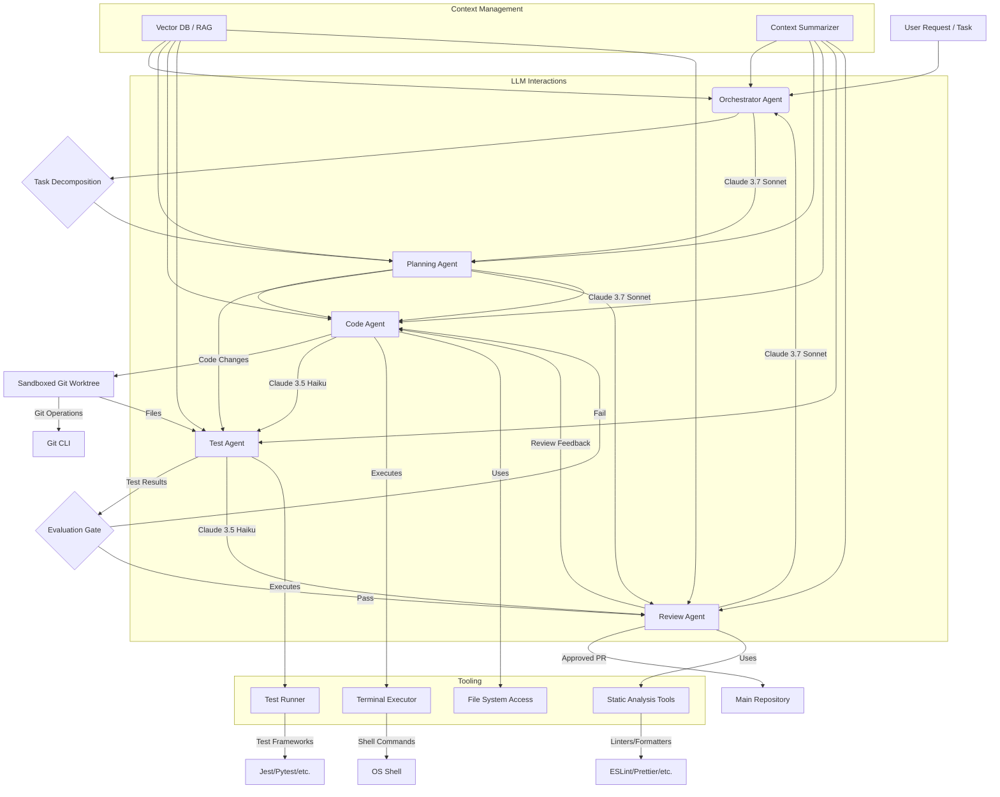

Hướng dẫn này trình bày chi tiết kiến trúc và cách triển khai các vòng lặp mã hóa tự động tận dụng khả năng của Claude cho các quy trình làm việc theo tác nhân. Chúng tôi tập trung vào các hệ thống cấp độ sản xuất, thực tế, nhấn mạnh việc quản lý ngữ cảnh, định nghĩa công cụ mạnh mẽ và điều phối đa tác nhân.

<AudioPlayer src="/static/audio/claude-code-agentic-workflow-engineering-vi.mp3" title="Tóm tắt âm thanh cho kỹ sư" voice="Google Cloud vi-VN-Neural2-A" />


## Giải phẫu Vòng lặp Mã hóa Thiết bị đầu cuối Tự động

Về cốt lõi, một vòng lặp mã hóa thiết bị đầu cuối tự động là một máy trạng thái được điều khiển bởi một LLM, thực hiện các hành động trong một môi trường hộp cát, và lặp đi lặp lại tinh chỉnh đầu ra của nó dựa trên phản hồi. Các thành phần chính là:

1.  **Quản lý Ngân sách Ngữ cảnh**: Quản lý hiệu quả cửa sổ ngữ cảnh của LLM để cung cấp thông tin liên quan mà không vượt quá giới hạn token. Điều này liên quan đến tóm tắt động, tạo sinh tăng cường truy xuất (RAG) và cắt tỉa thông minh.
2.  **Lược đồ Định nghĩa Công cụ**: Định nghĩa chính xác các hành động mà một tác nhân có thể thực hiện. Các công cụ là các hàm được phơi bày cho LLM, được mô tả thông qua lược đồ JSON, cho phép tương tác có cấu trúc với môi trường.
3.  **Cổng Đánh giá Buộc Sự thật**: Triển khai các kiểm tra tự động, khách quan để xác thực đầu ra của tác nhân. Các cổng này ngăn chặn sự lan truyền của các giải pháp không chính xác và thực thi các tiêu chuẩn chất lượng.
4.  **Điều phối Git Worktree Hộp cát**: Cung cấp một môi trường được kiểm soát, cô lập để sửa đổi mã, kiểm thử và kiểm soát phiên bản. Điều này đảm bảo khả năng tái tạo và ngăn chặn các tác dụng phụ không mong muốn trên cơ sở mã chính.
5.  **Phục hồi Lỗi Đa lượt**: Thiết kế các tác nhân để chẩn đoán và phục hồi sau các lỗi, thay vì chỉ đơn giản là dừng lại. Điều này liên quan đến việc tự xem xét, lập kế hoạch lại và tận dụng các công cụ chẩn đoán.

### Sơ đồ Kiến trúc



## Triển khai Vòng lặp Mã hóa Tự động

Chúng tôi sẽ sử dụng TypeScript để minh họa, tận dụng giao diện `ClaudeClient` và `Tool` giả định.

### Định nghĩa và Thực thi Công cụ

Các công cụ là giao diện của tác nhân với thế giới. Mỗi công cụ có một `name`, `description` và một lược đồ JSON `parameters`.

```typescript
// src/tools/types.ts
export interface Tool {
  name: string;
  description: string;
  parameters: {
    type: 'object';
    properties: Record<string, { type: string; description: string; enum?: string[] }>;
    required: string[];
  };
  execute: (args: Record<string, any>) => Promise<string>;
}

// src/tools/terminalExecutor.ts
import { Tool } from './types';
import { exec } from 'child_process';
import util from 'util';

const execPromise = util.promisify(exec);

export const terminalExecutorTool: Tool = {
  name: 'terminal_executor',
  description: 'Executes a shell command in the sandboxed environment and returns its stdout/stderr.',
  parameters: {
    type: 'object',
    properties: {
      command: {
        type: 'string',
        description: 'The shell command to execute (e.g., `npm test`, `git status`, `ls -la`).',
      },
    },
    required: ['command'],
  },
  execute: async ({ command }: { command: string }): Promise<string> => {
    try {
      console.log(`Executing command: ${command}`);
      const { stdout, stderr } = await execPromise(command, { cwd: process.env.SANDBOX_DIR || './sandbox' });
      if (stderr) {
        console.warn(`Command stderr: ${stderr}`);
      }
      return `STDOUT:\n${stdout}\nSTDERR:\n${stderr}`;
    } catch (error: any) {
      return `ERROR: Command failed: ${error.message}\nSTDOUT:\n${error.stdout}\nSTDERR:\n${error.stderr}`;
    }
  },
};

// src/tools/fileManager.ts
import { Tool } from './types';
import fs from 'fs/promises';
import path from 'path';

const SANDBOX_ROOT = process.env.SANDBOX_DIR || './sandbox';

export const fileManagerTool: Tool = {
  name: 'file_manager',
  description: 'Reads, writes, or lists files within the sandboxed environment.',
  parameters: {
    type: 'object',
    properties: {
      action: {
        type: 'string',
        description: 'The file operation to perform.',
        enum: ['read', 'write', 'list'],
      },
      filePath: {
        type: 'string',
        description: 'The path to the file, relative to the sandbox root.',
      },
      content: {
        type: 'string',
        description: 'Content to write for "write" action.',
      },
    },
    required: ['action'],
  },
  execute: async ({ action, filePath, content }: { action: string; filePath?: string; content?: string }): Promise<string> => {
    const fullPath = filePath ? path.join(SANDBOX_ROOT, filePath) : SANDBOX_ROOT;
    try {
      switch (action) {
        case 'read':
          if (!filePath) return 'ERROR: filePath is required for read action.';
          return await fs.readFile(fullPath, 'utf-8');
        case 'write':
          if (!filePath || !content) return 'ERROR: filePath and content are required for write action.';
          await fs.mkdir(path.dirname(fullPath), { recursive: true });
          await fs.writeFile(fullPath, content, 'utf-8');
          return `File written: ${filePath}`;
        case 'list':
          const files = await fs.readdir(fullPath, { recursive: true, withFileTypes: true });
          return files.map(dirent => path.join(dirent.path, dirent.name)).join('\n');
        default:
          return `ERROR: Unknown action: ${action}`;
      }
    } catch (error: any) {
      return `ERROR: File operation failed: ${error.message}`;
    }
  },
};
```

### Claude Client và Gọi Công cụ

Khả năng `tool_use` của Claude là trung tâm. Client cần phân tích phản hồi của LLM để xác định các lệnh gọi công cụ và thực thi chúng.

```typescript
// src/claudeClient.ts
import Anthropic from '@anthropic-ai/sdk';
import { Tool } from './tools/types';

interface ClaudeMessage {
  role: 'user' | 'assistant';
  content: string | Anthropic.Messages.MessageParam.Content;
}

export class ClaudeClient {
  private anthropic: Anthropic;
  private model: string;

  constructor(apiKey: string, model: string = 'claude-3-7-sonnet-20240620') {
    this.anthropic = new Anthropic({ apiKey });
    this.model = model;
  }

  async chat(
    messages: ClaudeMessage[],
    tools: Tool[],
    maxRetries: number = 3
  ): Promise<Anthropic.Messages.Message> {
    let retries = 0;
    while (retries < maxRetries) {
      try {
        const response = await this.anthropic.messages.create({
          model: this.model,
          max_tokens: 4096,
          messages: messages,
          tools: tools.map(tool => ({
            name: tool.name,
            description: tool.description,
            input_schema: tool.parameters,
          })),
        });
        return response;
      } catch (error: any) {
        console.error(`Claude API error (retry ${retries + 1}/${maxRetries}):`, error.message);
        retries++;
        await new Promise(resolve => setTimeout(resolve, 1000 * Math.pow(2, retries))); // Exponential backoff
      }
    }
    throw new Error(`Failed to get response from Claude after ${maxRetries} retries.`);
  }
}
```

### Vòng lặp Tác nhân Tự động

Vòng lặp cốt lõi bao gồm:
1.  Gửi trạng thái hiện tại và các công cụ có sẵn cho Claude.
2.  Nhận phản hồi (văn bản hoặc lệnh gọi công cụ).
3.  Nếu là lệnh gọi công cụ, thực thi công cụ và thêm đầu ra của nó vào ngữ cảnh.
4.  Lặp lại cho đến khi có câu trả lời cuối cùng hoặc điều kiện kết thúc.

```typescript
// src/agents/codingAgent.ts
import { ClaudeClient } from '../claudeClient';
import { Tool } from '../tools/types';
import { terminalExecutorTool, fileManagerTool } from '../tools/index'; // Assuming an index.ts exports all tools

export class CodingAgent {
  private client: ClaudeClient;
  private tools: Tool[];
  private conversationHistory: { role: 'user' | 'assistant'; content: any }[] = [];
  private maxIterations: number;

  constructor(apiKey: string, model: string, maxIterations: number = 10) {
    this.client = new ClaudeClient(apiKey, model);
    this.tools = [terminalExecutorTool, fileManagerTool]; // Register available tools
    this.maxIterations = maxIterations;
  }

  async run(initialTask: string): Promise<string> {
    this.conversationHistory = [{ role: 'user', content: initialTask }];
    let iteration = 0;

    while (iteration < this.maxIterations) {
      console.log(`\n--- Agent Iteration ${iteration + 1} ---`);
      const response = await this.client.chat(this.conversationHistory, this.tools);
      this.conversationHistory.push(response);

      if (response.stop_reason === 'end_turn' && typeof response.content === 'string') {
        console.log('Agent finished with final answer.');
        return response.content; // Agent provided a final text response
      }

      if (response.stop_reason === 'tool_use') {
        const toolCalls = response.content.filter(block => block.type === 'tool_use');
        for (const toolCall of toolCalls) {
          if (toolCall.type === 'tool_use') {
            const tool = this.tools.find(t => t.name === toolCall.name);
            if (tool) {
              console.log(`Agent calling tool: ${tool.name} with args:`, toolCall.input);
              const toolOutput = await tool.execute(toolCall.input);
              console.log(`Tool output: ${toolOutput.substring(0, 200)}...`); // Log truncated output
              this.conversationHistory.push({
                role: 'user',
                content: [{ type: 'tool_result', tool_use_id: toolCall.id, content: toolOutput }],
              });
            } else {
              const errorMessage = `ERROR: Agent tried to call unknown tool: ${toolCall.name}`;
              console.error(errorMessage);
              this.conversationHistory.push({
                role: 'user',
                content: [{ type: 'tool_result', tool_use_id: toolCall.id, content: errorMessage }],
              });
            }
          }
        }
      } else {
        console.log('Agent response:', response.content);
        // If it's not a tool_use and not a final answer, it might be an intermediate thought.
        // We can choose to continue or terminate based on the content.
        // For simplicity, we'll just continue here.
      }
      iteration++;
    }
    return 'Agent terminated due to max iterations without a final answer.';
  }
}

// Example usage:
// (async () => {
//   const apiKey = process.env.ANTHROPIC_API_KEY!;
//   if (!apiKey) {
//     console.error('ANTHROPIC_API_KEY environment variable not set.');
//     process.exit(1);
//   }
//   // Ensure sandbox directory exists
//   await fs.mkdir('./sandbox', { recursive: true });
//   process.env.SANDBOX_DIR = './sandbox';

//   const agent = new CodingAgent(apiKey, 'claude-3-7-sonnet-20240620');
//   const task = 'Create a file named `hello.js` in the sandbox with content `console.log("Hello, Claude!");` then execute it using node.';
//   const result = await agent.run(task);
//   console.log('Final Agent Result:', result);
// })();
```

### Cổng Đánh giá

Các cổng đánh giá rất quan trọng để đảm bảo tính đúng đắn. Chúng có thể bao gồm từ các kiểm tra regex đơn giản đến việc thực thi bộ kiểm thử đầy đủ.

```typescript
// src/evalGates/testRunnerGate.ts
import { terminalExecutorTool } from '../tools/terminalExecutor';

export async function runTestsAndEvaluate(testCommand: string): Promise<{ passed: boolean; output: string }> {
  console.log(`Running evaluation tests with command: ${testCommand}`);
  const result = await terminalExecutorTool.execute({ command: testCommand });

  // Simple heuristic: check for common success/failure indicators
  const passed = !result.includes('ERROR:') && !result.includes('fail') && !result.includes('Failures');
  return { passed, output: result };
}

// Example integration in agent loop (conceptual):
// ... inside CodingAgent.run() after code modification ...
// const { passed, output } = await runTestsAndEvaluate('npm test');
// if (!passed) {
//   this.conversationHistory.push({
//     role: 'user',
//     content: `Tests failed. Output:\n${output}\nAnalyze the failures and fix the code.`,
//   });
// } else {
//   this.conversationHistory.push({
//     role: 'user',
//     content: `Tests passed. Output:\n${output}\nProceed to next step (e.g., code review).`,
//   });
// }
// ...
```

### Điều phối Git Worktree Hộp cát

Để thay đổi mã mạnh mẽ, một git worktree chuyên dụng là điều cần thiết.

```bash
# Initialize a sandbox directory and git repo
mkdir sandbox
cd sandbox
git init -b main
echo "Initial project setup." > README.md
git add .
git commit -m "Initial commit"

# Create a worktree for the agent
# This allows the agent to work on a separate branch without affecting main
git worktree add ../agent-worktree agent-branch
```

`terminalExecutorTool` nên hoạt động trong thư mục `agent-worktree`.

## Kiến trúc Đa tác nhân

Đối với các tác vụ phức tạp, một tác nhân đơn lẻ thường gặp khó khăn. Một hệ thống đa tác nhân, nơi các tác nhân chuyên biệt hợp tác, sẽ hiệu quả hơn.

### Vai trò của Tác nhân

*   **Tác nhân Điều phối (Orchestrator Agent)**: Phân rã tác vụ chính, gán các tác vụ con cho các tác nhân chuyên biệt và tổng hợp kết quả của chúng. Sử dụng mô hình cấp cao hơn (ví dụ: Claude 3.7 Sonnet).
*   **Tác nhân Lập kế hoạch (Planning Agent)**: Phát triển các kế hoạch thực thi chi tiết cho các tác vụ con.
*   **Tác nhân Mã hóa (Code Agent)**: Viết và sửa đổi mã.
*   **Tác nhân Kiểm thử (Test Agent)**: Tạo và thực thi các kiểm thử, báo cáo kết quả.
*   **Tác nhân Đánh giá (Review Agent)**: Thực hiện phân tích tĩnh, đề xuất cải tiến và phê duyệt/từ chối các thay đổi.
*   **Tác nhân Tinh chỉnh (Refinement Agent)**: Chuyên về gỡ lỗi và phục hồi lỗi.

### Máy chủ MCP Tùy chỉnh & Hook Tự động Đánh giá

Một máy chủ Master Control Program (MCP) hoạt động như một trung tâm để giao tiếp tác nhân và quản lý trạng thái. Các hook tự động đánh giá là các kiểm tra trước khi commit hoặc trước khi merge tận dụng các Tác nhân Đánh giá.

```typescript
// src/mcpServer.ts
import express from 'express';
import bodyParser from 'body-parser';
import { CodingAgent } from './agents/codingAgent'; // Example agent
import { ReviewAgent } from './agents/reviewAgent'; // Example review agent

interface AgentTask {
  id: string;
  task: string;
  status: 'pending' | 'in_progress' | 'completed' | 'failed';
  result?: string;
  agentType: 'coding' | 'review';
}

export class MCPServer {
  private app: express.Application;
  private tasks: Map<string, AgentTask> = new Map();
  private codingAgent: CodingAgent;
  private reviewAgent: ReviewAgent; // Assume ReviewAgent exists

  constructor(anthropicApiKey: string) {
    this.app = express();
    this.app.use(bodyParser.json());
    this.codingAgent = new CodingAgent(anthropicApiKey, 'claude-3-7-sonnet-20240620');
    this.reviewAgent = new ReviewAgent(anthropicApiKey, 'claude-3-7-sonnet-20240620'); // Review agent might use a more capable model

    this.setupRoutes();
  }

  private setupRoutes() {
    this.app.post('/task', async (req, res) => {
      const { task, agentType } = req.body;
      if (!task || !agentType) {
        return res.status(400).send('Task and agentType are required.');
      }

      const taskId = `task-${Date.now()}`;
      this.tasks.set(taskId, { id: taskId, task, status: 'pending', agentType });
      res.status(202).json({ taskId, status: 'accepted' });

      // Asynchronously process the task
      this.processTask(taskId);
    });

    this.app.get('/task/:id', (req, res) => {
      const task = this.tasks.get(req.params.id);
      if (!task) {
        return res.status(404).send('Task not found.');
      }
      res.json(task);
    });

    // Auto-review hook endpoint
    this.app.post('/review-pr', async (req, res) => {
      const { prDiff, branchName } = req.body; // In a real system, this would be a webhook payload
      if (!prDiff || !branchName) {
        return res.status(400).send('PR diff and branch name are required.');
      }

      const reviewTaskId = `review-${Date.now()}`;
      this.tasks.set(reviewTaskId, { id: reviewTaskId, task: `Review PR for branch ${branchName}`, status: 'pending', agentType: 'review' });
      res.status(202).json({ reviewTaskId, status: 'review_initiated' });

      // In a real system, the ReviewAgent would interact with Git/PR system
      this.reviewAgent.reviewCode(prDiff, branchName)
        .then(reviewResult => {
          this.tasks.set(reviewTaskId, { ...this.tasks.get(reviewTaskId)!, status: 'completed', result: reviewResult });
          // Here, you'd typically post the reviewResult back to the PR system (e.g., GitHub API)
          console.log(`Review for ${branchName} completed: ${reviewResult}`);
        })
        .catch(error => {
          this.tasks.set(reviewTaskId, { ...this.tasks.get(reviewTaskId)!, status: 'failed', result: error.message });
          console.error(`Review for ${branchName} failed: ${error.message}`);
        });
    });
  }

  private async processTask(taskId: string) {
    const taskEntry = this.tasks.get(taskId);
    if (!taskEntry) return;

    this.tasks.set(taskId, { ...taskEntry, status: 'in_progress' });
    try {
      let result: string;
      if (taskEntry.agentType === 'coding') {
        result = await this.codingAgent.run(taskEntry.task);
      } else if (taskEntry.agentType === 'review') {
        // This path would be for direct review tasks, not PR hooks
        result = await this.reviewAgent.reviewCode(taskEntry.task, 'adhoc-review');
      } else {
        throw new Error(`Unknown agent type: ${taskEntry.agentType}`);
      }
      this.tasks.set(taskId, { ...taskEntry, status: 'completed', result });
    } catch (error: any) {
      this.tasks.set(taskId, { ...taskEntry, status: 'failed', result: error.message });
    }
  }

  listen(port: number) {
    this.app.listen(port, () => {
      console.log(`MCP Server listening on port ${port}`);
    });
  }
}

// (async () => {
//   const apiKey = process.env.ANTHROPIC_API_KEY!;
//   if (!apiKey) {
//     console.error('ANTHROPIC_API_KEY environment variable not set.');
//     process.exit(1);
//   }
//   const mcp = new MCPServer(apiKey);
//   mcp.listen(3000);
// })();
```

### Định tuyến Mô hình Hiệu quả Chi phí

Các tác vụ khác nhau yêu cầu các khả năng LLM khác nhau và có độ nhạy chi phí khác nhau.

*   **Claude 3.7 Sonnet**: Khả năng suy luận cao hơn, lập kế hoạch phức tạp, tạo mã và các tác vụ đánh giá quan trọng. Đắt hơn, nhưng chất lượng cao hơn.
*   **Claude 3.5 Haiku**: Nhanh hơn, rẻ hơn, phù hợp cho các tác vụ đơn giản hơn như tạo kiểm thử, bản nháp mã ban đầu, tóm tắt và kiểm tra nhanh.

`ClaudeClient` có thể được khởi tạo với các mô hình khác nhau, hoặc `MCPServer` có thể định tuyến các tác vụ đến các tác nhân được cấu hình với các mô hình cụ thể.

```typescript
// Example of model routing in Orchestrator or MCP
const codingAgent = new CodingAgent(apiKey, 'claude-3-7-sonnet-20240620'); // For complex coding
const testAgent = new TestAgent(apiKey, 'claude-3-5-haiku-20240307'); // For generating simple tests
const reviewAgent = new ReviewAgent(apiKey, 'claude-3-7-sonnet-20240620'); // For critical code review
```

## Quy trình làm việc theo Tác nhân so với Copilot

| Tính năng               | Quy trình làm việc theo Tác nhân (Tự động)                               | Quy trình làm việc Copilot (Hỗ trợ)                               |
| :---------------------- | :----------------------------------------------------------------------- | :---------------------------------------------------------------- |
| **Mức độ Tự chủ**       | Cao. Các tác nhân thực hiện các tác vụ đa bước từ đầu đến cuối.          | Thấp. Đề xuất mã, người dùng điều khiển quá trình phát triển.     |
| **Mô hình Tương tác**   | Hướng mục tiêu. Người dùng định nghĩa mục tiêu cấp cao, tác nhân hành động. | Tương tác. Người dùng nhắc, LLM phản hồi với các đề xuất.         |
| **Độ phức tạp Tác vụ**  | Phù hợp cho các tác vụ phức tạp, đa giai đoạn (ví dụ: "Triển khai tính năng X"). | Phù hợp cho các tác vụ mã hóa cục bộ (ví dụ: "Viết hàm Y").       |
| **Xử lý Lỗi**           | Phục hồi lỗi đa lượt, tự sửa lỗi.                                        | Sửa lỗi do người dùng điều khiển.                                 |
| **Quản lý Ngữ cảnh**    | Quản lý cửa sổ ngữ cảnh tinh vi, động.                                   | Chủ yếu là ngữ cảnh tệp/trình chỉnh sửa cục bộ.                   |
| **Sử dụng Công cụ**     | Sử dụng công cụ rộng rãi, có cấu trúc để tương tác với môi trường.      | Hạn chế, thường là các hành động tích hợp IDE (ví dụ: tái cấu trúc, giải thích). |
| **Mô hình Chi phí**     | Có khả năng chi phí cao hơn cho mỗi tác vụ do nhiều lệnh gọi LLM.        | Chi phí thấp hơn cho mỗi tương tác.                               |
| **Chu trình Phát triển** | Có thể tự động hóa toàn bộ chu trình phát triển (lập kế hoạch, mã hóa, kiểm thử, đánh giá). | Tăng tốc các bước mã hóa riêng lẻ.                               |
| **Khả năng Tái tạo**    | Cao, đặc biệt với môi trường hộp cát và các lời nhắc rõ ràng.           | Phụ thuộc vào hành động và lời nhắc của người dùng.               |

## Những điều cần lưu ý và Khắc phục sự cố trong Sản xuất

1.  **Tràn cửa sổ ngữ cảnh**:
    *   **Chế độ lỗi**: LLM nhận ngữ cảnh bị cắt ngắn, dẫn đến các hành động phi logic hoặc lỗi `400 Bad Request` từ API.
    *   **Cách khắc phục**: Triển khai tóm tắt động (ví dụ: sử dụng LLM rẻ hơn như Haiku để tóm tắt các nhật ký/tệp dài), RAG cho các đoạn mã liên quan và cắt tỉa thông minh lịch sử hội thoại. Ưu tiên các tương tác gần đây và các tệp quan trọng.
    *   **Ví dụ mã**: Trước khi thêm một đầu ra công cụ lớn, hãy kiểm tra số lượng token.
        ```typescript
        // In ClaudeClient or Agent
        import { getEncoding } from 'js-tiktoken';
        const encoding = getEncoding('cl100k_base'); // For Claude 3 models

        function getTokenCount(text: string): number {
          return encoding.encode(text).length;
        }

        // ... inside agent loop before pushing tool_result ...
        const MAX_TOOL_OUTPUT_TOKENS = 1000;
        let toolOutput = await tool.execute(toolCall.input);
        if (getTokenCount(toolOutput) > MAX_TOOL_OUTPUT_TOKENS) {
          const summaryPrompt = `Summarize the following tool output, highlighting key results, errors, or relevant information for a coding agent. Keep it concise, under ${MAX_TOOL_OUTPUT_TOKENS} tokens:\n\n${toolOutput}`;
          // Use a separate, cheaper ClaudeClient for summarization
          const summaryClient = new ClaudeClient(apiKey, 'claude-3-5-haiku-20240307');
          const summaryResponse = await summaryClient.chat([{ role: 'user', content: summaryPrompt }], []);
          toolOutput = `(Summarized due to length) Original output too long. Summary:\n${summaryResponse.content}`;
        }
        this.conversationHistory.push({
          role: 'user',
          content: [{ type: 'tool_result', tool_use_id: toolCall.id, content: toolOutput }],
        });
        ```

2.  **Lệnh gọi công cụ không xác định**:
    *   **Chế độ lỗi**: LLM tạo JSON không đúng định dạng cho các lệnh gọi công cụ hoặc tạo ra các công cụ/tham số không tồn tại.
    *   **Cách khắc phục**: Xác thực lược đồ JSON nghiêm ngặt trên các đầu vào công cụ. Triển khai cơ chế thử lại với các thông báo lỗi rõ ràng trở lại LLM. Sử dụng lời nhắc hệ thống để củng cố các hướng dẫn sử dụng công cụ. `tool_use` gốc của Claude thường mạnh mẽ, nhưng các công cụ bên ngoài vẫn có thể thất bại.
    *   **Ví dụ mã**: `ClaudeClient` đã xử lý các lỗi API cơ bản. Đối với các đầu vào công cụ không đúng định dạng, phương thức `execute` nên trả về các lỗi có thông tin.

3.  **Nhiễm bẩn hộp cát/Trôi trạng thái**:
    *   **Chế độ lỗi**: Các hành động của tác nhân trong hộp cát không được đặt lại hoặc cô lập đúng cách, dẫn đến hành vi không mong muốn trong các lần chạy tiếp theo.
    *   **Cách khắc phục**: Sử dụng các git worktree tạm thời cho mỗi tác vụ hoặc tác vụ con. Đảm bảo một `git reset --hard` và `git clean -fdx` sạch sẽ trước mỗi lần chạy tác nhân mới. Các container Docker hoặc VM cung cấp khả năng cô lập mạnh mẽ hơn cho các tác vụ quan trọng.
    *   **Lệnh shell**: `rm -rf agent-worktree && git worktree add ../agent-worktree agent-branch`

4.  **Vòng lặp vô hạn / Dao động**:
    *   **Chế độ lỗi**: Tác nhân lặp đi lặp lại cùng một cách tiếp cận thất bại hoặc bị kẹt trong một chu kỳ hành động mà không có tiến bộ.
    *   **Cách khắc phục**: Triển khai giới hạn lặp (`maxIterations`). Giới thiệu một tác nhân "phê bình" hoặc "giám sát" quan sát các hành động của tác nhân chính và can thiệp nếu không phát hiện thấy tiến bộ (ví dụ: cùng một tệp được sửa đổi lặp đi lặp lại mà không vượt qua các kiểm thử). Theo dõi các tệp đã sửa đổi và kết quả kiểm thử để phát hiện sự trì trệ.
    *   **Ví dụ mã**: `maxIterations` trong `CodingAgent` là một biện pháp bảo vệ cơ bản. Các giải pháp nâng cao hơn liên quan đến việc theo dõi trạng thái.

5.  **Vượt chi phí**:
    *   **Chế độ lỗi**: Các lệnh gọi LLM quá mức, đặc biệt với các mô hình đắt tiền, dẫn đến hóa đơn API cao.
    *   **Cách khắc phục**: Triển khai định tuyến mô hình (như đã thảo luận). Lưu trữ phản hồi LLM cho các lời nhắc giống hệt nhau. Sử dụng các mô hình rẻ hơn để tóm tắt, lập kế hoạch và bản nháp ban đầu. Giám sát việc sử dụng token cho mỗi tác vụ.
    *   **Giám sát**: Tích hợp với bảng điều khiển sử dụng của Anthropic hoặc ghi nhật ký tùy chỉnh để theo dõi mức tiêu thụ token cho mỗi tác nhân/tác vụ.

## Câu hỏi Thường gặp

1.  **Làm cách nào để đảm bảo các thay đổi mã của tác nhân an toàn và không gây ra lỗ hổng?**
    *   Tích hợp các công cụ kiểm tra bảo mật (ví dụ: Bandit cho Python, ESLint với các plugin bảo mật cho JS) vào bộ công cụ của Tác nhân Đánh giá. Triển khai một "Tác nhân Bảo mật" chuyên dụng để quét lỗ hổng. Quan trọng là, tất cả mã do tác nhân tạo ra phải vượt qua đánh giá của con người trước khi hợp nhất vào sản xuất. Môi trường hộp cát ngăn chặn tác hại trực tiếp đến cơ sở mã chính.

2.  **Cách tốt nhất để quản lý các phụ thuộc cho hộp cát của tác nhân là gì?**
    *   Đối với mỗi tác vụ mới, tác nhân nên chạy các lệnh cài đặt phụ thuộc trước (ví dụ: `npm install`, `pip install -r requirements.txt`). Hộp cát lý tưởng nên là một môi trường mới (ví dụ: một container Docker) hoặc một git worktree với một thư mục `node_modules` hoặc `venv` sạch sẽ. Cung cấp cho tác nhân các công cụ để quản lý các phụ thuộc này.

3.  **Các tác nhân có thể xử lý các tác vụ tái cấu trúc phức tạp trên nhiều tệp không?**
    *   Có, nhưng nó đòi hỏi lập kế hoạch tinh vi và quản lý ngữ cảnh. Tác nhân Điều phối sẽ chia nhỏ việc tái cấu trúc thành các bước nhỏ hơn, dễ quản lý hơn. Tác nhân Mã hóa sẽ cần quyền truy cập vào một ngữ cảnh rộng (thông qua RAG) và các công cụ để phân tích mã ngữ nghĩa (ví dụ: trình phân tích cú pháp AST) để đảm bảo tính đúng đắn trên các tệp. Đây là nơi cửa sổ ngữ cảnh lớn hơn và khả năng suy luận mạnh mẽ hơn của Claude 3.7 Sonnet tỏa sáng.

4.  **Làm cách nào để gỡ lỗi một tác nhân bị kẹt hoặc tạo ra đầu ra không chính xác?**
    *   **Ghi nhật ký chi tiết**: Ghi nhật ký tất cả các lời nhắc LLM, phản hồi, lệnh gọi công cụ và đầu ra công cụ.
    *   **Kiểm tra lịch sử hội thoại**: Xem lại `conversationHistory` để hiểu quá trình suy nghĩ của tác nhân và xác định nơi nó đã sai.
    *   **Gỡ lỗi tương tác**: Triển khai chế độ "con người trong vòng lặp" nơi tác nhân tạm dừng tại các điểm quan trọng, cho phép con người kiểm tra trạng thái, cung cấp phản hồi hoặc thậm chí thực thi công cụ theo cách thủ công.
    *   **Công cụ "Tại sao"**: Cung cấp cho tác nhân một công cụ đặc biệt mà khi được gọi, buộc nó phải giải thích lý do cho hành động cuối cùng, có thể được ghi nhật ký để gỡ lỗi.

5.  **Những hạn chế của các hệ thống tác nhân hiện tại với Claude là gì?**
    *   **Ảo giác**: LLM vẫn có thể tạo ra thông tin hoặc mã hợp lý nhưng không chính xác. Các cổng đánh giá và đánh giá của con người là điều cần thiết.
    *   **Giới hạn cửa sổ ngữ cảnh**: Mặc dù có cửa sổ ngữ cảnh lớn, các cơ sở mã phức tạp, lớn vẫn có thể vượt quá giới hạn, đòi hỏi RAG và tóm tắt tinh vi.
    *   **Chi phí tính toán**: Chạy nhiều lệnh gọi LLM, đặc biệt với các mô hình lớn hơn, có thể tốn kém và chậm.
    *   **Thiếu hiểu biết thực sự**: Các tác nhân hoạt động dựa trên các mẫu và xác suất, không phải sự hiểu biết thực sự. Chúng có thể gặp khó khăn với các vấn đề mới lạ hoặc các lỗi logic tinh vi.
    *   **Độ tin cậy của công cụ**: Độ tin cậy của tác nhân liên quan trực tiếp đến độ tin cậy và mạnh mẽ của các công cụ mà nó sử dụng.
