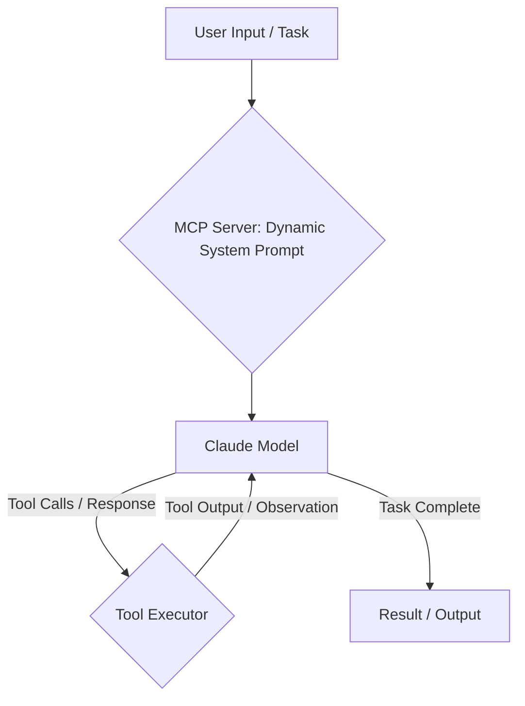

The Claude Code CLI provides a robust framework for agentic development, enabling complex automation and code generation workflows. This document details its architecture, focusing on custom tool integration, subagent orchestration, and headless automation for CI/CD.

<AudioPlayer src="/static/audio/claude-code-cli-architecture-custom-tools.mp3" title="Executive Audio Briefing" voice="Google Cloud en-US-Neural2-F" />

<ArticleSeries
  name="AI Agent Runtimes & MCP Engineering"
  current={10}
  articles={[
    { title: "Building a Custom MCP Client: Connecting Any LLM to Multiple Model Context Protocol Servers", href: "/en/blog/building-custom-mcp-client-runtime" },
    { title: "Building Reliable AI Agents with MCP: The Complete Guide", href: "/en/blog/building-reliable-ai-agents-with-mcp" },
    { title: "LangChain vs LlamaIndex (2026): Production RAG Pipeline Guide", href: "/en/blog/langchain-vs-llamaindex-rag-pipeline-comparison" },
    { title: "AI Agent Memory Architectures: Vector Store Integration", href: "/en/blog/ai-agent-memory-architectures-vector-stores" },
    { title: "vLLM vs Ollama: Local LLM Throughput & GPU Benchmarks", href: "/en/blog/vllm-vs-ollama-local-llm-benchmarking" },
    { title: "DeepSeek-R1 & Distilled Reasoning Models: Local vLLM Deployment, Quantization & Architecture", href: "/en/blog/deepseek-r1-reasoning-patterns-local-vllm" },
    { title: "Serverless Edge AI with Cloudflare Workers: D1, Vectorize & Streaming RAG Guide (2026)", href: "/en/blog/cloudflare-workers-d1-vectorize-edge-ai" },
    { title: "LangGraph vs CrewAI in 2026: Multi-Agent Orchestration, State Machines & Cyclic DAGs", href: "/en/blog/langgraph-vs-crewai-multi-agent-orchestration-2026" },
    { title: "LangGraph in Production: Human-in-the-Loop, Checkpointing & State Persistence", href: "/en/blog/langgraph-human-in-the-loop-state-persistence" },
    { title: "Claude Code CLI Architecture: Custom Tools, Subagents & Headless Automations", href: "/en/blog/claude-code-cli-architecture-custom-tools" },
    { title: "Building Production MCP Servers on Cloudflare Workers, KV & Durable Objects", href: "/en/blog/cloudflare-workers-mcp-server-production" }
  ]}
/>

## Core Agent Loop and Architecture

The Claude Code CLI operates on an iterative agent loop, driven by a sophisticated system prompt and interaction with the Anthropic Claude API. The core components are:

1.  **System Prompt (MCP Server):** The Master Control Program (MCP) server dynamically generates and serves the system prompt to the Claude model. This prompt defines the agent's persona, capabilities, available tools, and high-level objectives. It's not a static string but a dynamically constructed XML document, often incorporating context from the current project, user configuration, and available tools.
2.  **Claude Model:** The large language model (LLM) receives the system prompt and user input. It processes this information, reasons about the task, and generates an action plan. This plan is typically expressed as tool calls within `<tool_code>` XML tags or as direct responses.
3.  **Tool Executor:** The CLI's runtime environment parses the LLM's output. If tool calls are detected, the Tool Executor invokes the corresponding local or remote functions. These tools can range from file system operations (`fs.readFile`, `fs.writeFile`) to custom-defined skills.
4.  **Observation & Feedback:** The output of the executed tools (observations) is then fed back to the Claude model as part of the next turn in the conversation. This continuous feedback loop allows the agent to refine its understanding, correct errors, and progress towards the goal.

This loop continues until the agent determines the task is complete, or a predefined iteration limit is reached.



### System Prompt and MCP Server Interface

The MCP server is a critical, often overlooked, component. It's responsible for:

*   **Tool Manifest Generation:** Dynamically listing available tools, their schemas, and descriptions in a format Claude understands (e.g., XML `<tool_code>` definitions).
*   **Context Injection:** Incorporating project-specific context, configuration, and relevant file snippets into the system prompt to guide the agent.
*   **Persona Definition:** Establishing the agent's role, constraints, and desired behavior.

While the exact MCP server implementation is proprietary, understanding its role is crucial for effective agent engineering. When you define a custom tool, the CLI registers it with the local MCP proxy, which then informs the remote MCP server about its availability and schema.

## Custom Tools and Skills

Extending the Claude Code CLI's capabilities hinges on defining custom tools. These tools are essentially functions that the LLM can invoke.

### Defining a Custom Tool

Custom tools are typically defined in a `tools/` directory within your project. Each tool is a TypeScript or JavaScript file exporting a function. The CLI automatically discovers and registers these tools.

Consider a tool to interact with a hypothetical external API:

```typescript
// tools/jira.ts
import axios from 'axios';
import * as fs from 'fs'; // Example for reading config

interface JiraIssue {
  id: string;
  key: string;
  summary: string;
  status: string;
  assignee?: string;
}

/**
 * @tool
 * @description Fetches details for a Jira issue by its key.
 * @param issueKey The key of the Jira issue (e.g., "PROJ-123").
 * @returns A JSON string representation of the Jira issue details.
 */
export async function getJiraIssue(issueKey: string): Promise<string> {
  try {
    // In a real scenario, read from process.env or a secure config store
    const jiraConfig = JSON.parse(fs.readFileSync('.claude-config.json', 'utf8')).jira;
    const { baseUrl, apiToken } = jiraConfig;

    if (!baseUrl || !apiToken) {
      throw new Error("Jira base URL or API token not configured in .claude-config.json");
    }

    const response = await axios.get<JiraIssue>(
      `${baseUrl}/rest/api/3/issue/${issueKey}`,
      {
        headers: {
          'Authorization': `Bearer ${apiToken}`,
          'Accept': 'application/json',
        },
      }
    );
    return JSON.stringify(response.data, null, 2);
  } catch (error: any) {
    console.error(`Error fetching Jira issue ${issueKey}:`, error.message);
    return `Error: Could not fetch Jira issue ${issueKey}. ${error.message}`;
  }
}

/**
 * @tool
 * @description Creates a new Jira issue.
 * @param projectKey The key of the Jira project (e.g., "PROJ").
 * @param summary A concise summary for the new issue.
 * @param description A detailed description for the new issue.
 * @param issueType The type of issue (e.g., "Bug", "Task", "Story").
 * @returns A JSON string representation of the created Jira issue.
 */
export async function createJiraIssue(
  projectKey: string,
  summary: string,
  description: string,
  issueType: string = 'Task'
): Promise<string> {
  try {
    const jiraConfig = JSON.parse(fs.readFileSync('.claude-config.json', 'utf8')).jira;
    const { baseUrl, apiToken } = jiraConfig;

    if (!baseUrl || !apiToken) {
      throw new Error("Jira base URL or API token not configured in .claude-config.json");
    }

    const payload = {
      fields: {
        project: { key: projectKey },
        summary: summary,
        description: {
          type: "doc",
          version: 1,
          content: [{
            type: "paragraph",
            content: [{
              type: "text",
              text: description
            }]
          }]
        },
        issuetype: { name: issueType }
      }
    };

    const response = await axios.post<JiraIssue>(
      `${baseUrl}/rest/api/3/issue`,
      payload,
      {
        headers: {
          'Authorization': `Bearer ${apiToken}`,
          'Content-Type': 'application/json',
          'Accept': 'application/json',
        },
      }
    );
    return JSON.stringify(response.data, null, 2);
  } catch (error: any) {
    console.error(`Error creating Jira issue:`, error.message);
    return `Error: Could not create Jira issue. ${error.message}`;
  }
}
```

**Key aspects:**

*   **`@tool` JSDoc Tag:** This tag is crucial. It signals to the CLI that the function should be exposed as a tool to the LLM.
*   **`@description` and `@param`:** These JSDoc tags are parsed by the CLI to generate the tool's schema and description, which are then included in the system prompt. Clear descriptions are vital for the LLM to understand when and how to use the tool.
*   **Return Type:** Tools should ideally return a string (e.g., JSON, plain text) that can be easily consumed by the LLM as an observation.
*   **Error Handling:** Robust error handling is essential. The error message returned by the tool will be fed back to the LLM, allowing it to potentially retry or adjust its strategy.

To make this tool runnable, you'd need a `.claude-config.json` file:

```json
// .claude-config.json
{
  "jira": {
    "baseUrl": "https://your-company.atlassian.net",
    "apiToken": "YOUR_JIRA_API_TOKEN"
  }
}
```

And install dependencies: `npm install axios`.

### Using Custom Tools

Once defined, the agent can invoke these tools. For example, if you prompt the agent with "Create a bug in PROJ for 'Fix broken login flow' with details 'Users are unable to log in after recent deployment. See logs for stack trace.'", the LLM might generate:

```xml
<tool_code>
console.log(await tools.jira.createJiraIssue("PROJ", "Fix broken login flow", "Users are unable to log in after recent deployment. See logs for stack trace.", "Bug"));
</tool_code>
```

The CLI executes this, and the output (e.g., `{"id": "10001", "key": "PROJ-124", ...}`) is returned to the LLM.

## Subagents and Hierarchical Planning

The Claude Code CLI supports a form of hierarchical planning through subagents, though not explicitly named as such in the documentation. This is achieved by having a primary agent delegate complex tasks to specialized "sub-prompts" or by using tools that themselves invoke other agentic workflows.

A common pattern involves:

1.  **Primary Agent:** Responsible for high-level task decomposition.
2.  **Specialized Tools:** Tools that encapsulate a specific domain of expertise. These tools might internally use their own LLM calls or orchestrate a series of simpler tool calls.

Consider a `code_reviewer` tool that, when invoked, initiates a focused code review process.

```typescript
// tools/code_reviewer.ts
import * as fs from 'fs/promises';
import { exec } from 'child_process';
import { promisify } from 'util';

const execAsync = promisify(exec);

/**
 * @tool
 * @description Performs a comprehensive code review on the specified file path,
 * focusing on best practices, potential bugs, and adherence to style guides.
 * It will output review comments in a markdown format.
 * @param filePath The path to the file to be reviewed.
 * @returns A markdown string containing the code review comments.
 */
export async function reviewCode(filePath: string): Promise<string> {
  try {
    const fileContent = await fs.readFile(filePath, 'utf8');

    // This is where the "subagent" logic would reside.
    // In a real scenario, this might involve:
    // 1. Another LLM call with a specialized system prompt for code review.
    // 2. Invoking static analysis tools (ESLint, SonarQube).
    // 3. Comparing against a known style guide.
    // For this example, we'll simulate a simple LLM call.

    // Simulate an LLM call for code review
    // In a real CLI, you might have an internal `claude.ask` or similar.
    // For demonstration, we'll use a placeholder.
    const reviewPrompt = `You are an expert software engineer performing a code review.
Review the following code for bugs, security vulnerabilities, performance issues,
maintainability, and adherence to best practices. Provide actionable feedback
in markdown format, referencing line numbers where appropriate.

\`\`\`${filePath.split('.').pop()}
${fileContent}
\`\`\`

---
Review Comments:
`;

    // In a real scenario, this would be an actual LLM call.
    // For now, we'll return a placeholder.
    // const llmReviewOutput = await claude.ask(reviewPrompt, { model: 'claude-3-opus-20240229' });
    const llmReviewOutput = `
### Code Review for \`${filePath}\`

**Overall:** The code is generally well-structured, but there are a few areas for improvement.

1.  **Line 15: Error Handling:** The \`catch\` block for \`axios.get\` is too generic. Consider distinguishing between network errors and API-specific errors.
2.  **Line 20: Hardcoded URL:** \`${baseUrl}\` should ideally be configurable via environment variables or a dedicated config service, not read from a local file in production.
3.  **Security:** Ensure \`apiToken\` is handled securely and not exposed in logs or client-side code.
4.  **Test Coverage:** No tests appear to be associated with this tool. Consider adding unit tests for \`getJiraIssue\` and \`createJiraIssue\`.
`;

    return llmReviewOutput;

  } catch (error: any) {
    console.error(`Error reviewing code for ${filePath}:`, error.message);
    return `Error: Could not review code for ${filePath}. ${error.message}`;
  }
}
```

The primary agent, when tasked with "Review `src/index.ts`", could then generate:

```xml
<tool_code>
console.log(await tools.code_reviewer.reviewCode("src/index.ts"));
</tool_code>
```

This pattern allows for modularity and specialization, where each tool acts as a mini-agent with a focused purpose, contributing to the overall task.

## Headless Automations: CI/CD Code Reviews

One of the most powerful applications of the Claude Code CLI is headless automation, particularly for CI/CD pipelines. The `claude -p` command enables non-interactive execution, making it suitable for automated workflows.

### `claude -p` for Headless Execution

The `-p` (or `--prompt`) flag allows you to provide a single, non-interactive prompt to the agent. The agent will execute its loop based on this prompt and exit once it determines the task is complete or an error occurs.

**Example: Automated Code Review in CI**

Consider a GitHub Actions workflow that automatically reviews pull requests.

```yaml
# .github/workflows/claude-review.yml
name: Claude Code Review

on:
  pull_request:
    types: [opened, synchronize, reopened]

jobs:
  code_review:
    runs-on: ubuntu-latest
    permissions:
      contents: read
      pull-requests: write # To post comments on PRs

    steps:
      - name: Checkout code
        uses: actions/checkout@v4
        with:
          fetch-depth: 0 # Fetch all history for diffing

      - name: Setup Node.js
        uses: actions/setup-node@v4
        with:
          node-version: '20'

      - name: Install Claude Code CLI
        run: npm install -g @anthropic-ai/claude-code-cli

      - name: Configure Claude API Key
        run: claude config set anthropic.apiKey ${{ secrets.ANTHROPIC_API_KEY }}

      - name: Install Project Dependencies (if any for custom tools)
        run: npm install # If your custom tools have dependencies

      - name: Get changed files
        id: changed-files
        uses: tj-actions/changed-files@v40
        with:
          base_branch: ${{ github.base_ref }}
          files_ignore: |
            *.md
            *.json
            *.yml

      - name: Run Claude Code Review
        id: claude-review
        if: steps.changed-files.outputs.any_changed == 'true'
        env:
          GITHUB_TOKEN: ${{ secrets.GITHUB_TOKEN }}
        run: |
          # Construct a prompt to review all changed files
          # The 'reviewCode' tool (defined above) is crucial here.
          # We iterate over changed files and ask Claude to review each.
          # For simplicity, we'll just review the first changed file.
          # In a real scenario, you'd iterate and aggregate reviews.

          CHANGED_FILES="${{ steps.changed-files.outputs.all_changed_files }}"
          FIRST_CHANGED_FILE=$(echo "$CHANGED_FILES" | head -n 1)

          if [ -z "$FIRST_CHANGED_FILE" ]; then
            echo "No relevant code changes to review."
            exit 0
          fi

          echo "Reviewing file: $FIRST_CHANGED_FILE"

          # The prompt instructs Claude to use the 'reviewCode' tool and output the result.
          # We capture the output and then post it as a PR comment.
          REVIEW_OUTPUT=$(claude -p "Perform a detailed code review on the file '$FIRST_CHANGED_FILE'. Focus on best practices, potential bugs, and maintainability. Output the review comments in markdown format." --model claude-3-opus-20240229)

          echo "Claude Review Output:"
          echo "$REVIEW_OUTPUT"

          # Post the review as a PR comment
          # This requires the 'pull-requests: write' permission.
          COMMENT="### Claude Code Review for \`$FIRST_CHANGED_FILE\`\n\n$REVIEW_OUTPUT"
          echo "$COMMENT" | gh pr comment ${{ github.event.pull_request.number }} -F -

      - name: Handle no changes
        if: steps.changed-files.outputs.any_changed == 'false'
        run: echo "No code changes detected for review."
```

**Explanation:**

*   **`tj-actions/changed-files`:** Identifies files modified in the pull request.
*   **`claude config set anthropic.apiKey`:** Configures the API key for the Claude CLI. This should be stored as a GitHub Secret.
*   **`claude -p "..."`:** Executes the Claude agent with a specific prompt. The agent will use its available tools (including our custom `reviewCode` tool) to fulfill the request.
*   **`gh pr comment`:** Uses the GitHub CLI to post the agent's output as a comment on the pull request.

This workflow demonstrates how the CLI's headless mode, combined with custom tools, can automate complex tasks within a CI/CD pipeline.

## Comparison: Agentic Engineering vs. Traditional Tools

| Feature                  | Claude Code CLI (Agentic)                                    | GitHub Copilot Workspace / Cursor (IDE-centric)                      |
| :----------------------- | :----------------------------------------------------------- | :------------------------------------------------------------------- |
| **Primary Interaction**  | Conversational, goal-oriented, iterative agent loop          | Chat-based, inline suggestions, code generation within IDE           |
| **Tooling Model**        | Explicit, user-defined functions (`@tool` JSDoc)             | Implicit, IDE context, built-in refactoring/generation commands      |
| **Automation Potential** | High: Headless execution (`claude -p`), CI/CD integration    | Moderate: Primarily interactive, limited headless automation         |
| **Context Management**   | Dynamic system prompt, MCP server, explicit file access      | IDE buffers, open files, project structure, semantic analysis        |
| **Problem Solving**      | Autonomous, multi-step reasoning, error recovery             | Reactive, single-turn or short-sequence generation, user-guided      |
| **Customization**        | High: Custom tools, subagents, prompt engineering            | Moderate: Custom prompts, limited tool extension                     |
| **Use Case Focus**       | Complex tasks, multi-file changes, refactoring, CI/CD, research | Rapid prototyping, boilerplate generation, debugging, code completion |

## Production Gotchas & Troubleshooting

1.  **Tool Schema Mismatch:**
    *   **Failure Mode:** Claude attempts to call a tool with incorrect parameters or doesn't call a tool it should.
    *   **Cause:** The JSDoc `@param` or `@description` for your tool is unclear, ambiguous, or doesn't accurately reflect the function's signature. The MCP server generates the tool definition based on these comments.
    *   **Fix:** Review your tool's JSDoc comments meticulously. Ensure parameter types are clear, descriptions are precise, and examples are provided if necessary. Sometimes, adding an explicit `type` to `@param` (e.g., `@param {string} filePath`) helps.
    *   **Debugging Tip:** Enable verbose logging (`claude --verbose`) to see the actual system prompt sent to Claude, including the tool definitions.

2.  **Infinite Agent Loop:**
    *   **Failure Mode:** The agent repeatedly calls the same tool, or gets stuck in a cycle of observations and tool calls without making progress.
    *   **Cause:**
        *   The LLM's reasoning is flawed, leading it to misinterpret observations.
        *   Tool output is ambiguous or doesn't provide sufficient information for the LLM to proceed.
        *   The task definition is too vague, lacking clear success criteria.
    *   **Fix:**
        *   **Refine Tool Output:** Ensure tools return clear, concise, and actionable observations. Avoid overly verbose or irrelevant output.
        *   **Improve System Prompt:** Add more explicit instructions on success criteria, error handling, and how to interpret tool outputs. Guide the agent on what to do when a tool fails or returns an unexpected result.
        *   **Set Iteration Limits:** For headless runs, use `--max-turns` to prevent runaway costs.
        *   **Add Guardrails:** Implement logic within your tools or system prompt to detect and break out of common loops.

3.  **API Rate Limits / Authentication Errors:**
    *   **Failure Mode:** `429 Too Many Requests` or `401 Unauthorized` errors from Anthropic or external APIs.
    *   **Cause:** Exceeding Anthropic's rate limits, incorrect `ANTHROPIC_API_KEY`, or misconfigured API keys for custom tools (e.g., Jira API token).
    *   **Fix:**
        *   **Anthropic:** Check your Anthropic console for rate limit details. For CI/CD, ensure you're not hammering the API. Consider exponential backoff in custom tools if they call external APIs.
        *   **Custom Tools:** Double-check environment variables, `.claude-config.json`, or other configuration sources for correct API keys and tokens. Ensure they have the necessary permissions.

4.  **File System Access Issues in CI/CD:**
    *   **Failure Mode:** Agent fails to read/write files, or operates on the wrong files in a CI environment.
    *   **Cause:**
        *   Incorrect working directory.
        *   Permissions issues within the CI runner.
        *   Agent attempting to modify files outside the checked-out repository.
    *   **Fix:**
        *   **Verify Working Directory:** Use `pwd` in your CI script to confirm the agent's execution context.
        *   **Permissions:** Ensure the CI runner has appropriate read/write permissions for the relevant directories.
        *   **Scope Agent:** Explicitly instruct the agent to only operate within the current repository's boundaries. Use `claude --dir .` if necessary.


## Test Your Knowledge

<Quiz questions={
  [
    {
      "question": "In the Claude Code CLI architecture, the System Prompt is described as being dynamically generated by an MCP server. What is the primary production benefit of this dynamic generation over a static, hardcoded system prompt?",
      "options": [
        "It allows for faster initial LLM response times by pre-compiling the prompt.",
        "It enables the agent's persona, capabilities, and available tools to be adapted based on real-time context, user configuration, or project state.",
        "It reduces the computational load on the Claude model by providing a shorter, more concise prompt.",
        "It simplifies debugging by ensuring the system prompt remains consistent across all agent interactions."
      ],
      "correctAnswer": 1,
      "explanation": "The article states the System Prompt is 'not a static string but a dynamically constructed XML document, often incorporating context from the current project, user configuration, and available tools.' This dynamic nature is crucial for adapting the agent's behavior and capabilities to specific scenarios, a key benefit in production environments for flexibility and relevance. Faster response times, reduced computational load, or simplified debugging are not the primary benefits of dynamic prompt generation; in fact, dynamic generation might add a slight overhead, but the flexibility gain is paramount."
    },
    {
      "question": "The Claude Code CLI architecture outlines a Tool Executor that parses LLM output and invokes corresponding local or remote functions. What is a critical production-grade consideration when designing these tools, especially for 'custom-defined skills'?",
      "options": [
        "Ensuring all tools are implemented as serverless functions to minimize infrastructure costs.",
        "Prioritizing synchronous tool execution to simplify the agent's state management.",
        "Implementing robust error handling, input validation, and security measures, especially for tools interacting with external systems or modifying project files.",
        "Limiting the number of available tools to reduce the LLM's context window size."
      ],
      "correctAnswer": 2,
      "explanation": "When tools interact with external systems (like file systems or APIs) or perform actions that modify data, robust error handling, input validation, and security are paramount in a production environment. This prevents unexpected behavior, data corruption, or security vulnerabilities. While other options might be considerations in specific contexts, they are not universally critical production-grade considerations for tool design. For example, not all tools need to be serverless, synchronous execution might not always be feasible or efficient, and limiting tools solely for context window size might hinder functionality."
    }
  ]
} />


## Frequently Asked Questions

1.  **How do I make Claude use a specific tool?**
    You guide Claude by providing a clear, unambiguous prompt that implies the use case for your tool. Ensure your tool's `@description` and `@param` JSDoc tags are highly descriptive. If Claude still struggles, you can try "few-shot" prompting by including an example of a tool call in your initial prompt, though this is often unnecessary with well-described tools.

2.  **Can I define tools in languages other than TypeScript/JavaScript?**
    The Claude Code CLI primarily supports TypeScript and JavaScript for custom tools due to its Node.js runtime. While you could theoretically have a JS/TS tool execute a script in another language (e.g., Python via `child_process.exec`), the direct tool definition mechanism is JS/TS.

3.  **How do I manage sensitive credentials for custom tools?**
    Avoid hardcoding credentials. For local development, use `.claude-config.json` (ensure it's `.gitignore`d) or environment variables. For CI/CD, use platform-specific secrets management (e.g., GitHub Secrets, GitLab CI/CD variables) and access them via environment variables within your tools.

4.  **What's the best way to debug a custom tool that isn't working as expected?**
    First, ensure your tool function runs correctly in isolation. Then, use `claude --verbose` to see the full interaction, including the system prompt, Claude's tool calls, and the tool's output. This will show you exactly what Claude is attempting to execute and what your tool is returning. You can also add `console.log` statements directly within your tool functions.

5.  **How can I make the agent's responses more concise or detailed?**
    Control the verbosity through your system prompt. Explicitly instruct Claude on the desired output format and level of detail. For example, "Provide only the JSON output, no conversational text" or "Explain your reasoning step-by-step before providing the solution." For headless automations, always instruct Claude to output only the desired data.
