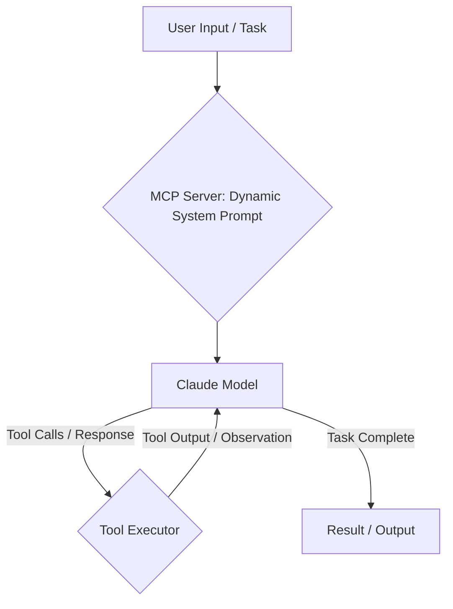

Claude Code CLIは、エージェント開発のための堅牢なフレームワークを提供し、複雑な自動化とコード生成ワークフローを可能にします。このドキュメントでは、カスタムツールの統合、サブエージェントのオーケストレーション、CI/CDのためのヘッドレス自動化に焦点を当て、そのアーキテクチャを詳しく説明します。

<AudioPlayer src="/static/audio/claude-code-cli-architecture-custom-tools-ja.mp3" title="音声エグゼクティブ・ブリーフィング" voice="Google Cloud ja-JP-Neural2-B" />

<ArticleSeries
  name="AIエージェント・ランタイム＆MCPアーキテクチャ"
  current={10}
  articles={[
    { title: "カスタムMCPクライアントの構築：あらゆるLLMを複数Model Context Protocolサーバーに接続する", href: "/ja/blog/building-custom-mcp-client-runtime" },
    { title: "MCPで信頼性の高いAIエージェントを構築する：完全ガイド", href: "/ja/blog/building-reliable-ai-agents-with-mcp" },
    { title: "LangChainとLlamaIndex（2026）: 本番RAGパイプラインガイド", href: "/ja/blog/langchain-vs-llamaindex-rag-pipeline-comparison" },
    { title: "AIエージェントのメモリ構造: ベクターストア統合", href: "/ja/blog/ai-agent-memory-architectures-vector-stores" },
    { title: "vLLMとOllamaの比較：ローカルLLMのスループットとGPUベンチマーク", href: "/ja/blog/vllm-vs-ollama-local-llm-benchmarking" },
    { title: "DeepSeek-R1と蒸留推論モデル：ローカルvLLMデプロイ、量子化、アーキテクチャ", href: "/ja/blog/deepseek-r1-reasoning-patterns-local-vllm" },
    { title: "Cloudflare WorkersによるServerless Edge AI: D1、Vectorize、Streaming RAGガイド (2026)", href: "/ja/blog/cloudflare-workers-d1-vectorize-edge-ai" },
    { title: "LangGraphとCrewAIの2026年比較：マルチエージェントオーケストレーション、ステートマシン、および循環DAG", href: "/ja/blog/langgraph-vs-crewai-multi-agent-orchestration-2026" },
    { title: "LangGraphを本番環境で使う：Human-in-the-Loop、チェックポイント、状態永続化", href: "/ja/blog/langgraph-human-in-the-loop-state-persistence" },
    { title: "Claude Code CLIアーキテクチャ:カスタムツール、サブエージェント、ヘッドレスオートメーション", href: "/ja/blog/claude-code-cli-architecture-custom-tools" },
    { title: "CloudflareWorkers、KV、DurableObjectsで本番MCPサーバーを構築する", href: "/ja/blog/cloudflare-workers-mcp-server-production" }
  ]}
/>

## コアエージェントループとアーキテクチャ

Claude Code CLIは、洗練されたシステムプロンプトとAnthropic Claude APIとのインタラクションによって駆動される、反復的なエージェントループで動作します。主要なコンポーネントは以下の通りです。

1.  **システムプロンプト（MCPサーバー）：** マスターコントロールプログラム（MCP）サーバーは、システムプロンプトを動的に生成し、Claudeモデルに提供します。このプロンプトは、エージェントのペルソナ、機能、利用可能なツール、および高レベルの目標を定義します。これは静的な文字列ではなく、現在のプロジェクト、ユーザー設定、利用可能なツールからのコンテキストを組み込んだ、動的に構築されたXMLドキュメントです。
2.  **Claudeモデル：** 大規模言語モデル（LLM）は、システムプロンプトとユーザー入力を受け取ります。この情報を処理し、タスクについて推論し、アクションプランを生成します。このプランは通常、`<tool_code>` XMLタグ内のツール呼び出し、または直接の応答として表現されます。
3.  **ツールエグゼキュータ：** CLIのランタイム環境は、LLMの出力を解析します。ツール呼び出しが検出されると、ツールエグゼキュータは対応するローカルまたはリモート関数を呼び出します。これらのツールは、ファイルシステム操作（`fs.readFile`、`fs.writeFile`）からカスタム定義されたスキルまで多岐にわたります。
4.  **観測とフィードバック：** 実行されたツールの出力（観測）は、会話の次のターンの一部としてClaudeモデルにフィードバックされます。この継続的なフィードバックループにより、エージェントは理解を深め、エラーを修正し、目標に向かって進むことができます。

このループは、エージェントがタスクの完了を判断するか、事前定義された反復制限に達するまで続行されます。



### システムプロンプトとMCPサーバーインターフェース

MCPサーバーは、重要でありながら見過ごされがちなコンポーネントです。その役割は以下の通りです。

*   **ツールマニフェストの生成：** 利用可能なツール、そのスキーマ、および説明をClaudeが理解できる形式（例：XML `<tool_code>`定義）で動的にリストアップします。
*   **コンテキストの注入：** プロジェクト固有のコンテキスト、設定、および関連するファイルスニペットをシステムプロンプトに組み込み、エージェントをガイドします。
*   **ペルソナの定義：** エージェントの役割、制約、および望ましい動作を確立します。

正確なMCPサーバーの実装はプロプライエタリですが、その役割を理解することは効果的なエージェントエンジニアリングにとって不可欠です。カスタムツールを定義すると、CLIはそれをローカルMCPプロキシに登録し、その後リモートMCPサーバーにその可用性とスキーマを通知します。

## カスタムツールとスキル

Claude Code CLIの機能を拡張するには、カスタムツールの定義が不可欠です。これらのツールは、LLMが呼び出すことができる本質的に関数です。

### カスタムツールの定義

カスタムツールは通常、プロジェクト内の`tools/`ディレクトリに定義されます。各ツールは、関数をエクスポートするTypeScriptまたはJavaScriptファイルです。CLIはこれらのツールを自動的に検出し、登録します。

架空の外部APIと対話するツールを考えてみましょう。

```typescript
// tools/jira.ts
import axios from 'axios';
import * as fs from 'fs'; // Example for reading config

interface JiraIssue {
  id: string;
  key: string;
  summary: string;
  status: string;
  assignee?: string;
}

/**
 * @tool
 * @description Fetches details for a Jira issue by its key.
 * @param issueKey The key of the Jira issue (e.g., "PROJ-123").
 * @returns A JSON string representation of the Jira issue details.
 */
export async function getJiraIssue(issueKey: string): Promise<string> {
  try {
    // In a real scenario, read from process.env or a secure config store
    const jiraConfig = JSON.parse(fs.readFileSync('.claude-config.json', 'utf8')).jira;
    const { baseUrl, apiToken } = jiraConfig;

    if (!baseUrl || !apiToken) {
      throw new Error("Jira base URL or API token not configured in .claude-config.json");
    }

    const response = await axios.get<JiraIssue>(
      `${baseUrl}/rest/api/3/issue/${issueKey}`,
      {
        headers: {
          'Authorization': `Bearer ${apiToken}`,
          'Accept': 'application/json',
        },
      }
    );
    return JSON.stringify(response.data, null, 2);
  } catch (error: any) {
    console.error(`Error fetching Jira issue ${issueKey}:`, error.message);
    return `Error: Could not fetch Jira issue ${issueKey}. ${error.message}`;
  }
}

/**
 * @tool
 * @description Creates a new Jira issue.
 * @param projectKey The key of the Jira project (e.g., "PROJ").
 * @param summary A concise summary for the new issue.
 * @param description A detailed description for the new issue.
 * @param issueType The type of issue (e.g., "Bug", "Task", "Story").
 * @returns A JSON string representation of the created Jira issue.
 */
export async function createJiraIssue(
  projectKey: string,
  summary: string,
  description: string,
  issueType: string = 'Task'
): Promise<string> {
  try {
    const jiraConfig = JSON.parse(fs.readFileSync('.claude-config.json', 'utf8')).jira;
    const { baseUrl, apiToken } = jiraConfig;

    if (!baseUrl || !apiToken) {
      throw new Error("Jira base URL or API token not configured in .claude-config.json");
    }

    const payload = {
      fields: {
        project: { key: projectKey },
        summary: summary,
        description: {
          type: "doc",
          version: 1,
          content: [{
            type: "paragraph",
            content: [{
              type: "text",
              text: description
            }]
          }]
        },
        issuetype: { name: issueType }
      }
    };

    const response = await axios.post<JiraIssue>(
      `${baseUrl}/rest/api/3/issue`,
      payload,
      {
        headers: {
          'Authorization': `Bearer ${apiToken}`,
          'Content-Type': 'application/json',
          'Accept': 'application/json',
        },
      }
    );
    return JSON.stringify(response.data, null, 2);
  } catch (error: any) {
    console.error(`Error creating Jira issue:`, error.message);
    return `Error: Could not create Jira issue. ${error.message}`;
  }
}
```

**主な側面：**

*   **`@tool` JSDocタグ：** このタグは非常に重要です。関数をLLMにツールとして公開する必要があることをCLIに通知します。
*   **`@description`と`@param`：** これらのJSDocタグはCLIによって解析され、ツールのスキーマと説明が生成され、システムプロンプトに含まれます。LLMがツールをいつどのように使用するかを理解するためには、明確な説明が不可欠です。
*   **戻り値の型：** ツールは、LLMが観測として簡単に消費できる文字列（例：JSON、プレーンテキスト）を返すのが理想的です。
*   **エラー処理：** 堅牢なエラー処理が不可欠です。ツールによって返されたエラーメッセージはLLMにフィードバックされ、LLMは再試行したり、戦略を調整したりする可能性があります。

このツールを実行可能にするには、`.claude-config.json`ファイルが必要です。

```json
// .claude-config.json
{
  "jira": {
    "baseUrl": "https://your-company.atlassian.net",
    "apiToken": "YOUR_JIRA_API_TOKEN"
  }
}
```

そして、依存関係をインストールします：`npm install axios`。

### カスタムツールの使用

定義されると、エージェントはこれらのツールを呼び出すことができます。たとえば、「PROJに「壊れたログインフローを修正」というバグを作成し、詳細として「最近のデプロイ後、ユーザーはログインできません。スタックトレースについてはログを参照してください。」と入力してください」とエージェントにプロンプトを出すと、LLMは次のように生成する可能性があります。

```xml
<tool_code>
console.log(await tools.jira.createJiraIssue("PROJ", "Fix broken login flow", "Users are unable to log in after recent deployment. See logs for stack trace.", "Bug"));
</tool_code>
```

CLIはこれを実行し、出力（例：`{"id": "10001", "key": "PROJ-124", ...}`）がLLMに返されます。

## サブエージェントと階層的プランニング

Claude Code CLIは、ドキュメントで明示的にそのように呼ばれてはいませんが、サブエージェントを介した階層的プランニングの一形態をサポートしています。これは、プライマリエージェントが複雑なタスクを専門の「サブプロンプト」に委任したり、それ自体が他のエージェントワークフローを呼び出すツールを使用したりすることによって実現されます。

一般的なパターンには以下が含まれます。

1.  **プライマリエージェント：** 高レベルのタスク分解を担当します。
2.  **専門ツール：** 特定の専門分野をカプセル化したツール。これらのツールは、内部で独自のLLM呼び出しを使用したり、一連のより単純なツール呼び出しをオーケストレーションしたりする場合があります。

呼び出されると、焦点を絞ったコードレビュープロセスを開始する`code_reviewer`ツールを考えてみましょう。

```typescript
// tools/code_reviewer.ts
import * as fs from 'fs/promises';
import { exec } from 'child_process';
import { promisify } from 'util';

const execAsync = promisify(exec);

/**
 * @tool
 * @description Performs a comprehensive code review on the specified file path,
 * focusing on best practices, potential bugs, and adherence to style guides.
 * It will output review comments in a markdown format.
 * @param filePath The path to the file to be reviewed.
 * @returns A markdown string containing the code review comments.
 */
export async function reviewCode(filePath: string): Promise<string> {
  try {
    const fileContent = await fs.readFile(filePath, 'utf8');

    // This is where the "subagent" logic would reside.
    // In a real scenario, this might involve:
    // 1. Another LLM call with a specialized system prompt for code review.
    // 2. Invoking static analysis tools (ESLint, SonarQube).
    // 3. Comparing against a known style guide.
    // For this example, we'll simulate a simple LLM call.

    // Simulate an LLM call for code review
    // In a real CLI, you might have an internal `claude.ask` or similar.
    // For demonstration, we'll use a placeholder.
    const reviewPrompt = `You are an expert software engineer performing a code review.
Review the following code for bugs, security vulnerabilities, performance issues,
maintainability, and adherence to best practices. Provide actionable feedback
in markdown format, referencing line numbers where appropriate.

\`\`\`${filePath.split('.').pop()}
${fileContent}
\`\`\`

---
Review Comments:
`;

    // In a real scenario, this would be an actual LLM call.
    // For now, we'll return a placeholder.
    // const llmReviewOutput = await claude.ask(reviewPrompt, { model: 'claude-3-opus-20240229' });
    const llmReviewOutput = `
### Code Review for \`${filePath}\`

**Overall:** The code is generally well-structured, but there are a few areas for improvement.

1.  **Line 15: Error Handling:** The \`catch\` block for \`axios.get\` is too generic. Consider distinguishing between network errors and API-specific errors.
2.  **Line 20: Hardcoded URL:** \`${baseUrl}\` should ideally be configurable via environment variables or a dedicated config service, not read from a local file in production.
3.  **Security:** Ensure \`apiToken\` is handled securely and not exposed in logs or client-side code.
4.  **Test Coverage:** No tests appear to be associated with this tool. Consider adding unit tests for \`getJiraIssue\` and \`createJiraIssue\`.
`;

    return llmReviewOutput;

  } catch (error: any) {
    console.error(`Error reviewing code for ${filePath}:`, error.message);
    return `Error: Could not review code for ${filePath}. ${error.message}`;
  }
}
```

プライマリエージェントは、「`src/index.ts`をレビューする」というタスクを与えられたとき、次のように生成できます。

```xml
<tool_code>
console.log(await tools.code_reviewer.reviewCode("src/index.ts"));
</tool_code>
```

このパターンにより、モジュール性と専門化が可能になり、各ツールが焦点を絞った目的を持つミニエージェントとして機能し、全体的なタスクに貢献します。

## ヘッドレス自動化：CI/CDコードレビュー

Claude Code CLIの最も強力なアプリケーションの1つは、特にCI/CDパイプライン向けのヘッドレス自動化です。`claude -p`コマンドは非対話型実行を可能にし、自動化されたワークフローに適しています。

### ヘッドレス実行のための`claude -p`

`-p`（または`--prompt`）フラグを使用すると、エージェントに単一の非対話型プロンプトを提供できます。エージェントはこのプロンプトに基づいてループを実行し、タスクが完了したと判断するか、エラーが発生すると終了します。

**例：CIでの自動コードレビュー**

プルリクエストを自動的にレビューするGitHub Actionsワークフローを考えてみましょう。

```yaml
# .github/workflows/claude-review.yml
name: Claude Code Review

on:
  pull_request:
    types: [opened, synchronize, reopened]

jobs:
  code_review:
    runs-on: ubuntu-latest
    permissions:
      contents: read
      pull-requests: write # To post comments on PRs

    steps:
      - name: Checkout code
        uses: actions/checkout@v4
        with:
          fetch-depth: 0 # Fetch all history for diffing

      - name: Setup Node.js
        uses: actions/setup-node@v4
        with:
          node-version: '20'

      - name: Install Claude Code CLI
        run: npm install -g @anthropic-ai/claude-code-cli

      - name: Configure Claude API Key
        run: claude config set anthropic.apiKey ${{ secrets.ANTHROPIC_API_KEY }}

      - name: Install Project Dependencies (if any for custom tools)
        run: npm install # If your custom tools have dependencies

      - name: Get changed files
        id: changed-files
        uses: tj-actions/changed-files@v40
        with:
          base_branch: ${{ github.base_ref }}
          files_ignore: |
            *.md
            *.json
            *.yml

      - name: Run Claude Code Review
        id: claude-review
        if: steps.changed-files.outputs.any_changed == 'true'
        env:
          GITHUB_TOKEN: ${{ secrets.GITHUB_TOKEN }}
        run: |
          # Construct a prompt to review all changed files
          # The 'reviewCode' tool (defined above) is crucial here.
          # We iterate over changed files and ask Claude to review each.
          # For simplicity, we'll just review the first changed file.
          # In a real scenario, you'd iterate and aggregate reviews.

          CHANGED_FILES="${{ steps.changed-files.outputs.all_changed_files }}"
          FIRST_CHANGED_FILE=$(echo "$CHANGED_FILES" | head -n 1)

          if [ -z "$FIRST_CHANGED_FILE" ]; then
            echo "No relevant code changes to review."
            exit 0
          fi

          echo "Reviewing file: $FIRST_CHANGED_FILE"

          # The prompt instructs Claude to use the 'reviewCode' tool and output the result.
          # We capture the output and then post it as a PR comment.
          REVIEW_OUTPUT=$(claude -p "Perform a detailed code review on the file '$FIRST_CHANGED_FILE'. Focus on best practices, potential bugs, and maintainability. Output the review comments in markdown format." --model claude-3-opus-20240229)

          echo "Claude Review Output:"
          echo "$REVIEW_OUTPUT"

          # Post the review as a PR comment
          # This requires the 'pull-requests: write' permission.
          COMMENT="### Claude Code Review for \`$FIRST_CHANGED_FILE\`\n\n$REVIEW_OUTPUT"
          echo "$COMMENT" | gh pr comment ${{ github.event.pull_request.number }} -F -

      - name: Handle no changes
        if: steps.changed-files.outputs.any_changed == 'false'
        run: echo "No code changes detected for review."
```

**説明：**

*   **`tj-actions/changed-files`：** プルリクエストで変更されたファイルを識別します。
*   **`claude config set anthropic.apiKey`：** Claude CLIのAPIキーを設定します。これはGitHub Secretとして保存する必要があります。
*   **`claude -p "..."`：** 特定のプロンプトでClaudeエージェントを実行します。エージェントは、利用可能なツール（カスタム`reviewCode`ツールを含む）を使用してリクエストを履行します。
*   **`gh pr comment`：** GitHub CLIを使用して、エージェントの出力をプルリクエストのコメントとして投稿します。

このワークフローは、CLIのヘッドレスモードとカスタムツールを組み合わせることで、CI/CDパイプライン内で複雑なタスクを自動化する方法を示しています。

## 比較：エージェントエンジニアリング vs. 従来のツール

| 機能                  | Claude Code CLI（エージェント）                                    | GitHub Copilot Workspace / Cursor（IDE中心）                      |
| :----------------------- | :----------------------------------------------------------- | :------------------------------------------------------------------- |
| **主なインタラクション**  | 会話型、目標指向、反復的なエージェントループ          | チャットベース、インライン提案、IDE内でのコード生成           |
| **ツールモデル**        | 明示的、ユーザー定義関数（`@tool` JSDoc）             | 暗黙的、IDEコンテキスト、組み込みのリファクタリング/生成コマンド      |
| **自動化の可能性** | 高：ヘッドレス実行（`claude -p`）、CI/CD統合    | 中程度：主にインタラクティブ、ヘッドレス自動化は限定的         |
| **コンテキスト管理**   | 動的システムプロンプト、MCPサーバー、明示的なファイルアクセス      | IDEバッファ、開いているファイル、プロジェクト構造、セマンティック分析        |
| **問題解決**      | 自律的、多段階推論、エラー回復             | 反応的、単一ターンまたは短いシーケンス生成、ユーザーガイド      |
| **カスタマイズ**        | 高：カスタムツール、サブエージェント、プロンプトエンジニアリング            | 中程度：カスタムプロンプト、限定的なツール拡張                     |
| **ユースケースの焦点**       | 複雑なタスク、複数ファイルの変更、リファクタリング、CI/CD、研究 | 迅速なプロトタイピング、ボイラープレート生成、デバッグ、コード補完 |

## 本番環境での注意点とトラブルシューティング

1.  **ツールスキーマの不一致：**
    *   **失敗モード：** Claudeが誤ったパラメータでツールを呼び出そうとするか、呼び出すべきツールを呼び出さない。
    *   **原因：** ツールのJSDoc `@param`または`@description`が不明確、曖昧、または関数のシグネチャを正確に反映していない。MCPサーバーはこれらのコメントに基づいてツール定義を生成します。
    *   **修正：** ツールのJSDocコメントを注意深く確認してください。パラメータの型が明確で、説明が正確であり、必要に応じて例が提供されていることを確認してください。場合によっては、`type`から`@param`への明示的な追加（例：`@param {string} filePath`）が役立ちます。
    *   **デバッグのヒント：** 詳細ログ（`claude --verbose`）を有効にして、ツール定義を含むClaudeに送信された実際のシステムプロンプトを確認します。

2.  **無限エージェントループ：**
    *   **失敗モード：** エージェントが同じツールを繰り返し呼び出すか、観測とツール呼び出しのサイクルに陥り、進捗がない。
    *   **原因：**
        *   LLMの推論に欠陥があり、観測を誤解している。
        *   ツールの出力が曖昧であるか、LLMが続行するのに十分な情報を提供していない。
        *   タスク定義が曖昧すぎて、明確な成功基準がない。
    *   **修正：**
        *   **ツールの出力を改善する：** ツールが明確で簡潔かつ実用的な観測を返すようにします。冗長すぎたり、無関係な出力を避けましょう。
        *   **システムプロンプトを改善する：** 成功基準、エラー処理、ツールの出力の解釈方法について、より明示的な指示を追加します。ツールが失敗した場合や予期しない結果を返した場合に何をすべきか、エージェントをガイドします。
        *   **反復制限を設定する：** ヘッドレス実行の場合、暴走するコストを防ぐために`--max-turns`を使用します。
        *   **ガードレールを追加する：** ツール内またはシステムプロンプト内にロジックを実装して、一般的なループを検出し、そこから抜け出します。

3.  **APIレート制限 / 認証エラー：**
    *   **失敗モード：** Anthropicまたは外部APIからの`429 Too Many Requests`または`401 Unauthorized`エラー。
    *   **原因：** Anthropicのレート制限を超過している、`ANTHROPIC_API_KEY`が間違っている、またはカスタムツール（例：Jira APIトークン）のAPIキーが誤って設定されている。
    *   **修正：**
        *   **Anthropic：** Anthropicコンソールでレート制限の詳細を確認してください。CI/CDの場合、APIを過度に叩いていないことを確認してください。カスタムツールが外部APIを呼び出す場合は、指数バックオフを検討してください。
        *   **カスタムツール：** 環境変数、`.claude-config.json`、またはその他の設定ソースを再確認して、正しいAPIキーとトークンを確認してください。必要な権限があることを確認してください。

4.  **CI/CDでのファイルシステムアクセス問題：**
    *   **失敗モード：** エージェントがファイルの読み書きに失敗するか、CI環境で間違ったファイルを操作する。
    *   **原因：**
        *   作業ディレクトリが間違っている。
        *   CIランナー内の権限の問題。
        *   エージェントがチェックアウトされたリポジトリ外のファイルを変更しようとしている。
    *   **修正：**
        *   **作業ディレクトリを確認する：** CIスクリプトで`pwd`を使用して、エージェントの実行コンテキストを確認します。
        *   **権限：** CIランナーが関連ディレクトリに対して適切な読み書き権限を持っていることを確認します。
        *   **エージェントのスコープを設定する：** エージェントに現在のリポジトリの境界内でのみ操作するように明示的に指示します。必要に応じて`claude --dir .`を使用します。

## よくある質問

1.  **Claudeに特定のツールを使用させるにはどうすればよいですか？**
    ツールのユースケースを暗示する明確で曖昧でないプロンプトを提供することで、Claudeをガイドします。ツールの`@description`と`@param` JSDocタグが非常に記述的であることを確認してください。それでもClaudeが苦戦する場合は、最初のプロンプトにツール呼び出しの例を含めることで「フューショット」プロンプトを試すことができますが、適切に記述されたツールではこれは不要な場合が多いです。

2.  **TypeScript/JavaScript以外の言語でツールを定義できますか？**
    Claude Code CLIは、Node.jsランタイムのため、カスタムツールに主にTypeScriptとJavaScriptをサポートしています。理論的には、JS/TSツールが別の言語（例：`child_process.exec`を介したPython）でスクリプトを実行することは可能ですが、直接的なツール定義メカニズムはJS/TSです。

3.  **カスタムツールの機密クレデンシャルを管理するにはどうすればよいですか？**
    クレデンシャルをハードコーディングすることは避けてください。ローカル開発では、`.claude-config.json`（`.gitignore`されていることを確認してください）または環境変数を使用します。CI/CDでは、プラットフォーム固有のシークレット管理（例：GitHub Secrets、GitLab CI/CD変数）を使用し、ツール内で環境変数を介してアクセスします。

4.  **期待どおりに動作しないカスタムツールをデバッグする最善の方法は何ですか？**
    まず、ツール関数が単独で正しく実行されることを確認します。次に、`claude --verbose`を使用して、システムプロンプト、Claudeのツール呼び出し、ツールの出力を含む完全なインタラクションを確認します。これにより、Claudeが何を正確に実行しようとしているのか、ツールが何を返しているのかがわかります。ツール関数内に直接`console.log`ステートメントを追加することもできます。

5.  **エージェントの応答をより簡潔にする、またはより詳細にするにはどうすればよいですか？**
    システムプロンプトを介して詳細度を制御します。Claudeに、目的の出力形式と詳細レベルを明示的に指示します。たとえば、「会話文なしでJSON出力のみを提供してください」または「解決策を提供する前に、推論を段階的に説明してください」などです。ヘッドレス自動化の場合、常にClaudeに目的のデータのみを出力するように指示します。
