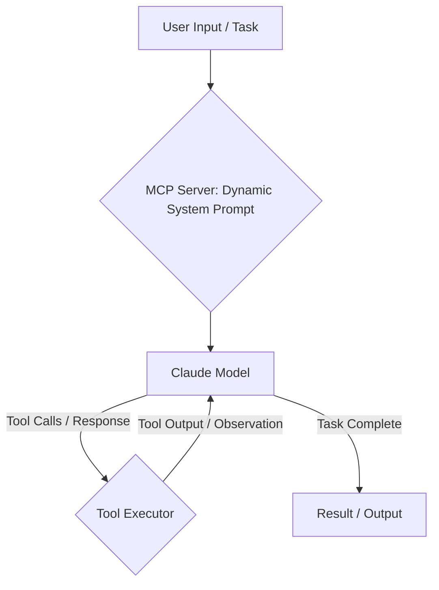

Claude Code CLI cung cấp một framework mạnh mẽ cho việc phát triển tác nhân (agentic development), cho phép tự động hóa phức tạp và quy trình tạo mã. Tài liệu này trình bày chi tiết kiến trúc của nó, tập trung vào việc tích hợp công cụ tùy chỉnh, điều phối tác nhân phụ (subagent orchestration) và tự động hóa không giao diện (headless automation) cho CI/CD.

<AudioPlayer src="/static/audio/claude-code-cli-architecture-custom-tools-vi.mp3" title="Tóm tắt âm thanh cho kỹ sư" voice="Google Cloud vi-VN-Neural2-A" />

<ArticleSeries
  name="Hệ thống AI Agent Runtimes & Giao thức MCP"
  current={10}
  articles={[
    { title: "Xây dựng một MCP Client tùy chỉnh: Kết nối bất kỳ LLM nào với nhiều Model Context Protocol Server", href: "/vi/blog/building-custom-mcp-client-runtime" },
    { title: "Xây dựng tác nhân AI đáng tin cậy với MCP: Hướng dẫn toàn diện", href: "/vi/blog/building-reliable-ai-agents-with-mcp" },
    { title: "LangChain vs LlamaIndex (2026): Hướng dẫn xây dựng pipeline RAG sản xuất", href: "/vi/blog/langchain-vs-llamaindex-rag-pipeline-comparison" },
    { title: "Kiến trúc bộ nhớ tác nhân AI: Tích hợp Vector Store", href: "/vi/blog/ai-agent-memory-architectures-vector-stores" },
    { title: "vLLM vs Ollama: Thông lượng LLM cục bộ & Điểm chuẩn GPU", href: "/vi/blog/vllm-vs-ollama-local-llm-benchmarking" },
    { title: "DeepSeek-R1 & Các Mô Hình Suy Luận Chưng Cất: Triển Khai vLLM Cục Bộ, Lượng Tử Hóa & Kiến Trúc", href: "/vi/blog/deepseek-r1-reasoning-patterns-local-vllm" },
    { title: "AI biên không máy chủ với Cloudflare Workers: Hướng dẫn D1, Vectorize & Streaming RAG (2026)", href: "/vi/blog/cloudflare-workers-d1-vectorize-edge-ai" },
    { title: "LangGraph vs CrewAI năm 2026: Điều phối đa tác nhân, máy trạng thái & DAG tuần hoàn", href: "/vi/blog/langgraph-vs-crewai-multi-agent-orchestration-2026" },
    { title: "LangGraph trong Production: Human-in-the-Loop, Checkpointing & State Persistence", href: "/vi/blog/langgraph-human-in-the-loop-state-persistence" },
    { title: "Kiến trúc Claude Code CLI: Công cụ tùy chỉnh, Subagent & Tự động hóa không giao diện", href: "/vi/blog/claude-code-cli-architecture-custom-tools" },
    { title: "Xây dựng máy chủ MCP sản xuất trên Cloudflare Workers, KV & Durable Objects", href: "/vi/blog/cloudflare-workers-mcp-server-production" }
  ]}
/>

## Vòng lặp tác nhân cốt lõi và kiến trúc

Claude Code CLI hoạt động trên một vòng lặp tác nhân lặp đi lặp lại, được điều khiển bởi một lời nhắc hệ thống tinh vi và tương tác với API Anthropic Claude. Các thành phần cốt lõi là:

1.  **Lời nhắc hệ thống (MCP Server):** Máy chủ Chương trình Điều khiển Chính (Master Control Program - MCP) tạo và cung cấp lời nhắc hệ thống một cách linh hoạt cho mô hình Claude. Lời nhắc này định nghĩa tính cách, khả năng, các công cụ có sẵn và mục tiêu cấp cao của tác nhân. Nó không phải là một chuỗi tĩnh mà là một tài liệu XML được xây dựng động, thường kết hợp ngữ cảnh từ dự án hiện tại, cấu hình người dùng và các công cụ có sẵn.
2.  **Mô hình Claude:** Mô hình ngôn ngữ lớn (LLM) nhận lời nhắc hệ thống và đầu vào của người dùng. Nó xử lý thông tin này, suy luận về nhiệm vụ và tạo ra một kế hoạch hành động. Kế hoạch này thường được thể hiện dưới dạng các lệnh gọi công cụ trong các thẻ XML `<tool_code>` hoặc dưới dạng phản hồi trực tiếp.
3.  **Bộ thực thi công cụ (Tool Executor):** Môi trường thời gian chạy của CLI phân tích đầu ra của LLM. Nếu phát hiện các lệnh gọi công cụ, Bộ thực thi công cụ sẽ gọi các hàm cục bộ hoặc từ xa tương ứng. Các công cụ này có thể bao gồm từ các thao tác hệ thống tệp (`fs.readFile`, `fs.writeFile`) đến các kỹ năng được định nghĩa tùy chỉnh.
4.  **Quan sát & Phản hồi:** Đầu ra của các công cụ đã thực thi (quan sát) sau đó được đưa trở lại mô hình Claude như một phần của lượt hội thoại tiếp theo. Vòng lặp phản hồi liên tục này cho phép tác nhân tinh chỉnh sự hiểu biết của mình, sửa lỗi và tiến tới mục tiêu.

Vòng lặp này tiếp tục cho đến khi tác nhân xác định nhiệm vụ đã hoàn thành hoặc đạt đến giới hạn lặp lại được xác định trước.



### Lời nhắc hệ thống và giao diện máy chủ MCP

Máy chủ MCP là một thành phần quan trọng, thường bị bỏ qua. Nó chịu trách nhiệm cho:

*   **Tạo danh sách công cụ (Tool Manifest Generation):** Liệt kê động các công cụ có sẵn, lược đồ và mô tả của chúng theo định dạng mà Claude hiểu (ví dụ: định nghĩa XML `<tool_code>`).
*   **Chèn ngữ cảnh (Context Injection):** Kết hợp ngữ cảnh cụ thể của dự án, cấu hình và các đoạn tệp liên quan vào lời nhắc hệ thống để hướng dẫn tác nhân.
*   **Định nghĩa tính cách (Persona Definition):** Thiết lập vai trò, ràng buộc và hành vi mong muốn của tác nhân.

Mặc dù việc triển khai máy chủ MCP chính xác là độc quyền, nhưng việc hiểu vai trò của nó là rất quan trọng đối với kỹ thuật tác nhân hiệu quả. Khi bạn định nghĩa một công cụ tùy chỉnh, CLI sẽ đăng ký nó với proxy MCP cục bộ, sau đó proxy này sẽ thông báo cho máy chủ MCP từ xa về tính khả dụng và lược đồ của nó.

## Công cụ và kỹ năng tùy chỉnh

Mở rộng khả năng của Claude Code CLI phụ thuộc vào việc định nghĩa các công cụ tùy chỉnh. Các công cụ này về cơ bản là các hàm mà LLM có thể gọi.

### Định nghĩa một công cụ tùy chỉnh

Các công cụ tùy chỉnh thường được định nghĩa trong thư mục `tools/` trong dự án của bạn. Mỗi công cụ là một tệp TypeScript hoặc JavaScript xuất một hàm. CLI tự động phát hiện và đăng ký các công cụ này.

Hãy xem xét một công cụ để tương tác với một API bên ngoài giả định:

```typescript
// tools/jira.ts
import axios from 'axios';
import * as fs from 'fs'; // Example for reading config

interface JiraIssue {
  id: string;
  key: string;
  summary: string;
  status: string;
  assignee?: string;
}

/**
 * @tool
 * @description Fetches details for a Jira issue by its key.
 * @param issueKey The key of the Jira issue (e.g., "PROJ-123").
 * @returns A JSON string representation of the Jira issue details.
 */
export async function getJiraIssue(issueKey: string): Promise<string> {
  try {
    // In a real scenario, read from process.env or a secure config store
    const jiraConfig = JSON.parse(fs.readFileSync('.claude-config.json', 'utf8')).jira;
    const { baseUrl, apiToken } = jiraConfig;

    if (!baseUrl || !apiToken) {
      throw new Error("Jira base URL or API token not configured in .claude-config.json");
    }

    const response = await axios.get<JiraIssue>(
      `${baseUrl}/rest/api/3/issue/${issueKey}`,
      {
        headers: {
          'Authorization': `Bearer ${apiToken}`,
          'Accept': 'application/json',
        },
      }
    );
    return JSON.stringify(response.data, null, 2);
  } catch (error: any) {
    console.error(`Error fetching Jira issue ${issueKey}:`, error.message);
    return `Error: Could not fetch Jira issue ${issueKey}. ${error.message}`;
  }
}

/**
 * @tool
 * @description Creates a new Jira issue.
 * @param projectKey The key of the Jira project (e.g., "PROJ").
 * @param summary A concise summary for the new issue.
 * @param description A detailed description for the new issue.
 * @param issueType The type of issue (e.g., "Bug", "Task", "Story").
 * @returns A JSON string representation of the created Jira issue.
 */
export async function createJiraIssue(
  projectKey: string,
  summary: string,
  description: string,
  issueType: string = 'Task'
): Promise<string> {
  try {
    const jiraConfig = JSON.parse(fs.readFileSync('.claude-config.json', 'utf8')).jira;
    const { baseUrl, apiToken } = jiraConfig;

    if (!baseUrl || !apiToken) {
      throw new Error("Jira base URL or API token not configured in .claude-config.json");
    }

    const payload = {
      fields: {
        project: { key: projectKey },
        summary: summary,
        description: {
          type: "doc",
          version: 1,
          content: [{
            type: "paragraph",
            content: [{
              type: "text",
              text: description
            }]
          }]
        },
        issuetype: { name: issueType }
      }
    };

    const response = await axios.post<JiraIssue>(
      `${baseUrl}/rest/api/3/issue`,
      payload,
      {
        headers: {
          'Authorization': `Bearer ${apiToken}`,
          'Content-Type': 'application/json',
          'Accept': 'application/json',
        },
      }
    );
    return JSON.stringify(response.data, null, 2);
  } catch (error: any) {
    console.error(`Error creating Jira issue:`, error.message);
    return `Error: Could not create Jira issue. ${error.message}`;
  }
}
```

**Các khía cạnh chính:**

*   **Thẻ JSDoc `@tool`:** Thẻ này rất quan trọng. Nó báo hiệu cho CLI rằng hàm này nên được hiển thị dưới dạng một công cụ cho LLM.
*   **`@description` và `@param`:** Các thẻ JSDoc này được CLI phân tích cú pháp để tạo lược đồ và mô tả của công cụ, sau đó được đưa vào lời nhắc hệ thống. Các mô tả rõ ràng là rất quan trọng để LLM hiểu khi nào và cách sử dụng công cụ.
*   **Kiểu trả về:** Các công cụ lý tưởng nên trả về một chuỗi (ví dụ: JSON, văn bản thuần túy) mà LLM có thể dễ dàng sử dụng làm quan sát.
*   **Xử lý lỗi:** Xử lý lỗi mạnh mẽ là điều cần thiết. Thông báo lỗi được công cụ trả về sẽ được đưa trở lại LLM, cho phép nó có thể thử lại hoặc điều chỉnh chiến lược của mình.

Để làm cho công cụ này có thể chạy được, bạn sẽ cần một tệp `.claude-config.json`:

```json
// .claude-config.json
{
  "jira": {
    "baseUrl": "https://your-company.atlassian.net",
    "apiToken": "YOUR_JIRA_API_TOKEN"
  }
}
```

Và cài đặt các dependency: `npm install axios`.

### Sử dụng công cụ tùy chỉnh

Sau khi được định nghĩa, tác nhân có thể gọi các công cụ này. Ví dụ, nếu bạn nhắc tác nhân với "Tạo một lỗi trong PROJ cho 'Sửa luồng đăng nhập bị hỏng' với chi tiết 'Người dùng không thể đăng nhập sau khi triển khai gần đây. Xem nhật ký để biết stack trace.'", LLM có thể tạo ra:

```xml
<tool_code>
console.log(await tools.jira.createJiraIssue("PROJ", "Fix broken login flow", "Users are unable to log in after recent deployment. See logs for stack trace.", "Bug"));
</tool_code>
```

CLI thực thi điều này, và đầu ra (ví dụ: `{"id": "10001", "key": "PROJ-124", ...}`) được trả về LLM.

## Tác nhân phụ và lập kế hoạch phân cấp

Claude Code CLI hỗ trợ một dạng lập kế hoạch phân cấp thông qua các tác nhân phụ (subagents), mặc dù không được đặt tên rõ ràng như vậy trong tài liệu. Điều này đạt được bằng cách có một tác nhân chính ủy quyền các nhiệm vụ phức tạp cho các "lời nhắc phụ" chuyên biệt hoặc bằng cách sử dụng các công cụ mà bản thân chúng gọi các quy trình tác nhân khác.

Một mẫu phổ biến bao gồm:

1.  **Tác nhân chính:** Chịu trách nhiệm phân tách nhiệm vụ cấp cao.
2.  **Công cụ chuyên biệt:** Các công cụ gói gọn một lĩnh vực chuyên môn cụ thể. Các công cụ này có thể sử dụng các lệnh gọi LLM riêng của chúng hoặc điều phối một loạt các lệnh gọi công cụ đơn giản hơn.

Hãy xem xét một công cụ `code_reviewer` mà khi được gọi, sẽ khởi tạo một quy trình đánh giá mã tập trung.

```typescript
// tools/code_reviewer.ts
import * as fs from 'fs/promises';
import { exec } from 'child_process';
import { promisify } from 'util';

const execAsync = promisify(exec);

/**
 * @tool
 * @description Performs a comprehensive code review on the specified file path,
 * focusing on best practices, potential bugs, and adherence to style guides.
 * It will output review comments in a markdown format.
 * @param filePath The path to the file to be reviewed.
 * @returns A markdown string containing the code review comments.
 */
export async function reviewCode(filePath: string): Promise<string> {
  try {
    const fileContent = await fs.readFile(filePath, 'utf8');

    // This is where the "subagent" logic would reside.
    // In a real scenario, this might involve:
    // 1. Another LLM call with a specialized system prompt for code review.
    // 2. Invoking static analysis tools (ESLint, SonarQube).
    // 3. Comparing against a known style guide.
    // For this example, we'll simulate a simple LLM call.

    // Simulate an LLM call for code review
    // In a real CLI, you might have an internal `claude.ask` or similar.
    // For demonstration, we'll use a placeholder.
    const reviewPrompt = `You are an expert software engineer performing a code review.
Review the following code for bugs, security vulnerabilities, performance issues,
maintainability, and adherence to best practices. Provide actionable feedback
in markdown format, referencing line numbers where appropriate.

\`\`\`${filePath.split('.').pop()}
${fileContent}
\`\`\`

---
Review Comments:
`;

    // In a real scenario, this would be an actual LLM call.
    // For now, we'll return a placeholder.
    // const llmReviewOutput = await claude.ask(reviewPrompt, { model: 'claude-3-opus-20240229' });
    const llmReviewOutput = `
### Code Review for \`${filePath}\`

**Overall:** The code is generally well-structured, but there are a few areas for improvement.

1.  **Line 15: Error Handling:** The \`catch\` block for \`axios.get\` is too generic. Consider distinguishing between network errors and API-specific errors.
2.  **Line 20: Hardcoded URL:** \`${baseUrl}\` should ideally be configurable via environment variables or a dedicated config service, not read from a local file in production.
3.  **Security:** Ensure \`apiToken\` is handled securely and not exposed in logs or client-side code.
4.  **Test Coverage:** No tests appear to be associated with this tool. Consider adding unit tests for \`getJiraIssue\` and \`createJiraIssue\`.
`;

    return llmReviewOutput;

  } catch (error: any) {
    console.error(`Error reviewing code for ${filePath}:`, error.message);
    return `Error: Could not review code for ${filePath}. ${error.message}`;
  }
}
```

Tác nhân chính, khi được giao nhiệm vụ "Đánh giá `src/index.ts`", sau đó có thể tạo ra:

```xml
<tool_code>
console.log(await tools.code_reviewer.reviewCode("src/index.ts"));
</tool_code>
```

Mẫu này cho phép tính mô-đun và chuyên môn hóa, trong đó mỗi công cụ hoạt động như một tác nhân nhỏ với mục đích tập trung, đóng góp vào nhiệm vụ tổng thể.

## Tự động hóa không giao diện: Đánh giá mã CI/CD

Một trong những ứng dụng mạnh mẽ nhất của Claude Code CLI là tự động hóa không giao diện (headless automation), đặc biệt cho các pipeline CI/CD. Lệnh `claude -p` cho phép thực thi không tương tác, làm cho nó phù hợp với các quy trình làm việc tự động.

### `claude -p` cho thực thi không giao diện

Cờ `-p` (hoặc `--prompt`) cho phép bạn cung cấp một lời nhắc duy nhất, không tương tác cho tác nhân. Tác nhân sẽ thực thi vòng lặp của nó dựa trên lời nhắc này và thoát khi nó xác định nhiệm vụ đã hoàn thành hoặc xảy ra lỗi.

**Ví dụ: Đánh giá mã tự động trong CI**

Hãy xem xét một quy trình làm việc GitHub Actions tự động đánh giá các pull request.

```yaml
# .github/workflows/claude-review.yml
name: Claude Code Review

on:
  pull_request:
    types: [opened, synchronize, reopened]

jobs:
  code_review:
    runs-on: ubuntu-latest
    permissions:
      contents: read
      pull-requests: write # To post comments on PRs

    steps:
      - name: Checkout code
        uses: actions/checkout@v4
        with:
          fetch-depth: 0 # Fetch all history for diffing

      - name: Setup Node.js
        uses: actions/setup-node@v4
        with:
          node-version: '20'

      - name: Install Claude Code CLI
        run: npm install -g @anthropic-ai/claude-code-cli

      - name: Configure Claude API Key
        run: claude config set anthropic.apiKey ${{ secrets.ANTHROPIC_API_KEY }}

      - name: Install Project Dependencies (if any for custom tools)
        run: npm install # If your custom tools have dependencies

      - name: Get changed files
        id: changed-files
        uses: tj-actions/changed-files@v40
        with:
          base_branch: ${{ github.base_ref }}
          files_ignore: |
            *.md
            *.json
            *.yml

      - name: Run Claude Code Review
        id: claude-review
        if: steps.changed-files.outputs.any_changed == 'true'
        env:
          GITHUB_TOKEN: ${{ secrets.GITHUB_TOKEN }}
        run: |
          # Construct a prompt to review all changed files
          # The 'reviewCode' tool (defined above) is crucial here.
          # We iterate over changed files and ask Claude to review each.
          # For simplicity, we'll just review the first changed file.
          # In a real scenario, you'd iterate and aggregate reviews.

          CHANGED_FILES="${{ steps.changed-files.outputs.all_changed_files }}"
          FIRST_CHANGED_FILE=$(echo "$CHANGED_FILES" | head -n 1)

          if [ -z "$FIRST_CHANGED_FILE" ]; then
            echo "No relevant code changes to review."
            exit 0
          fi

          echo "Reviewing file: $FIRST_CHANGED_FILE"

          # The prompt instructs Claude to use the 'reviewCode' tool and output the result.
          # We capture the output and then post it as a PR comment.
          REVIEW_OUTPUT=$(claude -p "Perform a detailed code review on the file '$FIRST_CHANGED_FILE'. Focus on best practices, potential bugs, and maintainability. Output the review comments in markdown format." --model claude-3-opus-20240229)

          echo "Claude Review Output:"
          echo "$REVIEW_OUTPUT"

          # Post the review as a PR comment
          # This requires the 'pull-requests: write' permission.
          COMMENT="### Claude Code Review for \`$FIRST_CHANGED_FILE\`\n\n$REVIEW_OUTPUT"
          echo "$COMMENT" | gh pr comment ${{ github.event.pull_request.number }} -F -

      - name: Handle no changes
        if: steps.changed-files.outputs.any_changed == 'false'
        run: echo "No code changes detected for review."
```

**Giải thích:**

*   **`tj-actions/changed-files`:** Xác định các tệp đã sửa đổi trong pull request.
*   **`claude config set anthropic.apiKey`:** Cấu hình khóa API cho Claude CLI. Khóa này nên được lưu trữ dưới dạng GitHub Secret.
*   **`claude -p "..."`:** Thực thi tác nhân Claude với một lời nhắc cụ thể. Tác nhân sẽ sử dụng các công cụ có sẵn của nó (bao gồm công cụ `reviewCode` tùy chỉnh của chúng ta) để hoàn thành yêu cầu.
*   **`gh pr comment`:** Sử dụng GitHub CLI để đăng đầu ra của tác nhân dưới dạng một bình luận trên pull request.

Quy trình làm việc này minh họa cách chế độ không giao diện của CLI, kết hợp với các công cụ tùy chỉnh, có thể tự động hóa các tác vụ phức tạp trong một pipeline CI/CD.

## So sánh: Kỹ thuật tác nhân so với công cụ truyền thống

| Tính năng                | Claude Code CLI (Tác nhân)                                   | GitHub Copilot Workspace / Cursor (Tập trung vào IDE)                |
| :----------------------- | :----------------------------------------------------------- | :------------------------------------------------------------------- |
| **Tương tác chính**      | Đối thoại, định hướng mục tiêu, vòng lặp tác nhân lặp đi lặp lại | Dựa trên trò chuyện, gợi ý nội tuyến, tạo mã trong IDE               |
| **Mô hình công cụ**      | Hàm rõ ràng, do người dùng định nghĩa (JSDoc `@tool`)         | Ngầm định, ngữ cảnh IDE, lệnh tái cấu trúc/tạo mã tích hợp sẵn       |
| **Tiềm năng tự động hóa** | Cao: Thực thi không giao diện (`claude -p`), tích hợp CI/CD       | Trung bình: Chủ yếu tương tác, tự động hóa không giao diện hạn chế   |
| **Quản lý ngữ cảnh**     | Lời nhắc hệ thống động, máy chủ MCP, truy cập tệp rõ ràng    | Bộ đệm IDE, tệp đang mở, cấu trúc dự án, phân tích ngữ nghĩa         |
| **Giải quyết vấn đề**    | Tự động, suy luận nhiều bước, phục hồi lỗi                   | Phản ứng, tạo một lượt hoặc chuỗi ngắn, có hướng dẫn của người dùng |
| **Tùy chỉnh**            | Cao: Công cụ tùy chỉnh, tác nhân phụ, kỹ thuật nhắc lệnh     | Trung bình: Lời nhắc tùy chỉnh, mở rộng công cụ hạn chế              |
| **Trọng tâm trường hợp sử dụng** | Các tác vụ phức tạp, thay đổi nhiều tệp, tái cấu trúc, CI/CD, nghiên cứu | Tạo mẫu nhanh, tạo mã mẫu, gỡ lỗi, hoàn thành mã                   |

## Những vấn đề và cách khắc phục trong sản xuất

1.  **Không khớp lược đồ công cụ:**
    *   **Chế độ lỗi:** Claude cố gắng gọi một công cụ với các tham số không chính xác hoặc không gọi một công cụ mà nó nên gọi.
    *   **Nguyên nhân:** JSDoc `@param` hoặc `@description` cho công cụ của bạn không rõ ràng, mơ hồ hoặc không phản ánh chính xác chữ ký của hàm. Máy chủ MCP tạo định nghĩa công cụ dựa trên các nhận xét này.
    *   **Cách khắc phục:** Xem xét kỹ lưỡng các nhận xét JSDoc của công cụ của bạn. Đảm bảo các kiểu tham số rõ ràng, mô tả chính xác và cung cấp ví dụ nếu cần. Đôi khi, việc thêm một `type` rõ ràng vào `@param` (ví dụ: `@param {string} filePath`) sẽ hữu ích.
    *   **Mẹo gỡ lỗi:** Bật ghi nhật ký chi tiết (`claude --verbose`) để xem lời nhắc hệ thống thực tế được gửi đến Claude, bao gồm các định nghĩa công cụ.

2.  **Vòng lặp tác nhân vô hạn:**
    *   **Chế độ lỗi:** Tác nhân liên tục gọi cùng một công cụ, hoặc bị kẹt trong một chu kỳ quan sát và gọi công cụ mà không tiến triển.
    *   **Nguyên nhân:**
        *   Suy luận của LLM bị lỗi, dẫn đến việc nó hiểu sai các quan sát.
        *   Đầu ra của công cụ mơ hồ hoặc không cung cấp đủ thông tin để LLM tiếp tục.
        *   Định nghĩa nhiệm vụ quá mơ hồ, thiếu các tiêu chí thành công rõ ràng.
    *   **Cách khắc phục:**
        *   **Tinh chỉnh đầu ra công cụ:** Đảm bảo các công cụ trả về các quan sát rõ ràng, súc tích và có thể hành động. Tránh đầu ra quá dài dòng hoặc không liên quan.
        *   **Cải thiện lời nhắc hệ thống:** Thêm các hướng dẫn rõ ràng hơn về tiêu chí thành công, xử lý lỗi và cách diễn giải đầu ra của công cụ. Hướng dẫn tác nhân về những việc cần làm khi một công cụ thất bại hoặc trả về kết quả không mong muốn.
        *   **Đặt giới hạn lặp lại:** Đối với các lần chạy không giao diện, hãy sử dụng `--max-turns` để ngăn chặn chi phí tăng vọt.
        *   **Thêm các biện pháp bảo vệ:** Triển khai logic trong các công cụ hoặc lời nhắc hệ thống của bạn để phát hiện và thoát khỏi các vòng lặp phổ biến.

3.  **Giới hạn tốc độ API / Lỗi xác thực:**
    *   **Chế độ lỗi:** Lỗi `429 Too Many Requests` hoặc `401 Unauthorized` từ Anthropic hoặc các API bên ngoài.
    *   **Nguyên nhân:** Vượt quá giới hạn tốc độ của Anthropic, `ANTHROPIC_API_KEY` không chính xác hoặc khóa API bị cấu hình sai cho các công cụ tùy chỉnh (ví dụ: mã thông báo API Jira).
    *   **Cách khắc phục:**
        *   **Anthropic:** Kiểm tra bảng điều khiển Anthropic của bạn để biết chi tiết giới hạn tốc độ. Đối với CI/CD, đảm bảo bạn không làm quá tải API. Cân nhắc sử dụng exponential backoff trong các công cụ tùy chỉnh nếu chúng gọi các API bên ngoài.
        *   **Công cụ tùy chỉnh:** Kiểm tra lại các biến môi trường, `.claude-config.json` hoặc các nguồn cấu hình khác để biết khóa API và mã thông báo chính xác. Đảm bảo chúng có các quyền cần thiết.

4.  **Sự cố truy cập hệ thống tệp trong CI/CD:**
    *   **Chế độ lỗi:** Tác nhân không đọc/ghi tệp, hoặc hoạt động trên các tệp sai trong môi trường CI.
    *   **Nguyên nhân:**
        *   Thư mục làm việc không chính xác.
        *   Sự cố về quyền trong trình chạy CI.
        *   Tác nhân cố gắng sửa đổi các tệp bên ngoài kho lưu trữ đã được kiểm xuất.
    *   **Cách khắc phục:**
        *   **Xác minh thư mục làm việc:** Sử dụng `pwd` trong tập lệnh CI của bạn để xác nhận ngữ cảnh thực thi của tác nhân.
        *   **Quyền:** Đảm bảo trình chạy CI có quyền đọc/ghi thích hợp cho các thư mục liên quan.
        *   **Phạm vi tác nhân:** Hướng dẫn rõ ràng tác nhân chỉ hoạt động trong giới hạn của kho lưu trữ hiện tại. Sử dụng `claude --dir .` nếu cần.

## Câu hỏi thường gặp

1.  **Làm cách nào để Claude sử dụng một công cụ cụ thể?**
    Bạn hướng dẫn Claude bằng cách cung cấp một lời nhắc rõ ràng, không mơ hồ ngụ ý trường hợp sử dụng cho công cụ của bạn. Đảm bảo các thẻ JSDoc `@description` và `@param` của công cụ của bạn có tính mô tả cao. Nếu Claude vẫn gặp khó khăn, bạn có thể thử nhắc "few-shot" bằng cách bao gồm một ví dụ về lệnh gọi công cụ trong lời nhắc ban đầu của bạn, mặc dù điều này thường không cần thiết với các công cụ được mô tả tốt.

2.  **Tôi có thể định nghĩa công cụ bằng các ngôn ngữ khác ngoài TypeScript/JavaScript không?**
    Claude Code CLI chủ yếu hỗ trợ TypeScript và JavaScript cho các công cụ tùy chỉnh do môi trường thời gian chạy Node.js của nó. Mặc dù về mặt lý thuyết, bạn có thể có một công cụ JS/TS thực thi một tập lệnh bằng ngôn ngữ khác (ví dụ: Python thông qua `child_process.exec`), nhưng cơ chế định nghĩa công cụ trực tiếp là JS/TS.

3.  **Làm cách nào để quản lý thông tin đăng nhập nhạy cảm cho các công cụ tùy chỉnh?**
    Tránh mã hóa cứng thông tin đăng nhập. Đối với phát triển cục bộ, hãy sử dụng `.claude-config.json` (đảm bảo nó được `.gitignore`) hoặc các biến môi trường. Đối với CI/CD, hãy sử dụng quản lý bí mật dành riêng cho nền tảng (ví dụ: GitHub Secrets, biến GitLab CI/CD) và truy cập chúng thông qua các biến môi trường trong các công cụ của bạn.

4.  **Cách tốt nhất để gỡ lỗi một công cụ tùy chỉnh không hoạt động như mong đợi là gì?**
    Đầu tiên, đảm bảo hàm công cụ của bạn chạy chính xác một cách độc lập. Sau đó, sử dụng `claude --verbose` để xem toàn bộ tương tác, bao gồm lời nhắc hệ thống, các lệnh gọi công cụ của Claude và đầu ra của công cụ. Điều này sẽ cho bạn thấy chính xác những gì Claude đang cố gắng thực thi và những gì công cụ của bạn đang trả về. Bạn cũng có thể thêm các câu lệnh `console.log` trực tiếp vào các hàm công cụ của mình.

5.  **Làm cách nào để làm cho phản hồi của tác nhân ngắn gọn hơn hoặc chi tiết hơn?**
    Kiểm soát độ dài thông qua lời nhắc hệ thống của bạn. Hướng dẫn rõ ràng Claude về định dạng đầu ra và mức độ chi tiết mong muốn. Ví dụ: "Chỉ cung cấp đầu ra JSON, không có văn bản đối thoại" hoặc "Giải thích lý do của bạn từng bước trước khi đưa ra giải pháp." Đối với các tự động hóa không giao diện, luôn hướng dẫn Claude chỉ xuất dữ liệu mong muốn.
