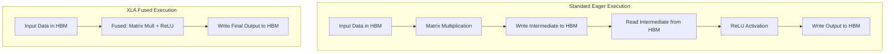
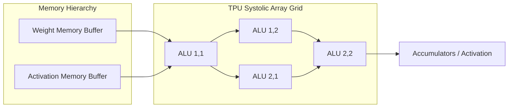

# JAX and TPU Optimizations: Accelerating the Future of Deep Learning

Modern machine learning models, particularly Large Language Models (LLMs), vision transformers, and advanced diffusion models, demand unprecedented computational resources. As parameter counts soar into the billions, and eventually trillions, the hardware and software paradigms that governed previous generations of artificial intelligence are being pushed to their absolute limits. 

While PyTorch remains the undisputed king of deep learning research and production due to its intuitive interface, dynamic execution, and massive ecosystem, a formidable challenger has emerged for extreme-scale workloads: JAX. Paired with Google's Tensor Processing Units (TPUs), JAX represents a monumental paradigm shift in how we approach accelerated computing. In this comprehensive article, we will dissect the fundamental architecture of JAX, explore how it diverges profoundly from PyTorch, and delve into the hardware synergies that make JAX on TPUs an unmatched powerhouse for modern deep learning.

## JAX vs. PyTorch: A Fundamental Paradigm Shift

To truly understand JAX, we must first contrast it with the standard bearer, PyTorch. PyTorch relies heavily on dynamic computational graphs (also known as eager execution) and an Object-Oriented Programming (OOP) model. When you build a neural network in PyTorch, you define stateful objects (like `nn.Linear` or `nn.Conv2d`) that hold their own weights and biases. When operations are performed, PyTorch dispatches kernels one by one to the underlying hardware (e.g., a GPU). 

JAX, developed by researchers at Google, adopts a strictly functional programming paradigm. In JAX, functions must be pure: they cannot have side effects, and they do not mutate external state. Instead of building stateful objects, you must pass the model parameters explicitly into every function. Furthermore, JAX does not natively dispatch operations one-by-one eager style for peak performance (though it can); rather, it traces the Python functions and compiles them. This fundamental shift from OOP to functional, stateless execution enables profound compiler-level optimizations that are notoriously difficult to achieve in dynamic, stateful frameworks.

### Code Comparison: Stateful vs. Stateless Execution

```python
# PyTorch: Stateful Object-Oriented Execution
import torch
import torch.nn as nn

class SimpleModel(nn.Module):
    def __init__(self):
        super().__init__()
        self.dense = nn.Linear(128, 64)
        
    def forward(self, x):
        return torch.relu(self.dense(x))

model = SimpleModel()
x = torch.randn(32, 128)
output = model(x) # State is internal to the model object
```

```python
# JAX: Pure Functional and Stateless Execution
import jax
import jax.numpy as jnp

def simple_model(params, x):
    # 'params' dictionary contains 'weights' and 'biases' explicitly
    dense_out = jnp.dot(x, params['weights']) + params['biases']
    return jax.nn.relu(dense_out)

# Weights must be explicitly initialized and passed into the function
# output = simple_model(params, x)
```

## The Four Pillars of JAX Transformations

JAX is fundamentally an extensible system for transforming numerical functions. The ecosystem is built upon four foundational pillars:
1. **`grad`**: Automatic differentiation. Unlike PyTorch's `loss.backward()`, which relies on a hidden autograd tape and mutates `.grad` attributes on tensors, JAX's `grad` returns a completely new Python function that computes the gradient.
2. **`jit`**: Just-in-time compilation. By wrapping a Python function with `@jax.jit`, JAX traces the numerical operations and compiles them into a highly optimized binary.
3. **`vmap`**: Auto-vectorization. Allows you to write functions that operate on single examples, and seamlessly lift them to operate on batches without manually rewriting matrix mathematics.
4. **`pmap`**: Parallel mapping. Distributes computation across multiple devices seamlessly.

## Under the Hood: XLA (Accelerated Linear Algebra)

The true engine behind JAX's performance is XLA (Accelerated Linear Algebra). XLA is a domain-specific compiler specifically designed for linear algebra operations. 

In standard deep learning execution, each operation (like a matrix multiplication, followed by an activation function, followed by dropout) requires reading data from memory, performing the math on the accelerator, and writing the result back to memory. This memory bandwidth limitation, known as the "von Neumann bottleneck," is often the actual constraint in AI training, rather than raw compute speed.

XLA solves this critical bottleneck through **kernel fusion**. By examining the entire computational graph as a whole via JIT compilation, XLA can fuse multiple operations into a single GPU or TPU kernel. The intermediate data is kept in the fast, on-chip registers rather than being round-tripped to High Bandwidth Memory (HBM).

### Architecture Diagram: XLA Kernel Fusion



## The TPU Advantage: Mastering Systolic Arrays

While XLA optimizes code for NVIDIA GPUs beautifully, its true potential is fully unlocked on Google's Tensor Processing Units (TPUs). TPUs are Application-Specific Integrated Circuits (ASICs) designed exclusively for deep learning workloads. 

At the microscopic heart of a TPU core lies the **Systolic Array**, a massive, dense 2D grid of Arithmetic Logic Units (ALUs). Standard CPU or GPU architectures require fetching data from registers or caches for nearly every instruction. In contrast, a systolic array passes data seamlessly from one ALU to the adjacent one in a synchronized rhythm (much like blood pumping through a biological heart, giving it the name "systolic"). 

When performing large matrix multiplications—the foundational mathematical operation of deep learning—the values are fed into the top and sides of the array. The ALUs multiply and accumulate the results as the data flows diagonally and seamlessly across the grid. This hardware design provides astronomical throughput for matrix operations while drastically reducing power consumption and memory access overhead.

### Architecture Diagram: TPU Systolic Array



## Scaling Up: Extreme Parallelism with `pmap`

TPUs are rarely used in isolation; they are typically deployed in massive clusters known as Pods, connected by a high-speed, custom torus network. Managing distributed training across thousands of chips is traditionally a dev-ops nightmare. JAX abstracts away this immense hardware complexity through its parallelization transformations. 

By utilizing `pmap` (parallel map), developers can achieve Single Program, Multiple Data (SPMD) execution across hundreds or thousands of TPU cores with a single function call. Data parallelism becomes trivial.

### Code Example: Scaling with pmap

```python
import jax
import jax.numpy as jnp

# Verify available hardware accelerators
devices = jax.devices()
print(f"Number of TPU cores available: {len(devices)}")

@jax.pmap(axis_name='devices')
def parallel_training_step(params, batch):
    # This function executes on every TPU core simultaneously.
    # Each core receives its own shard (slice) of the data batch.
    
    def loss_fn(p, b):
        # Calculate loss (placeholder logic)
        return jnp.sum(p['weights'] * b)
        
    # Compute gradients locally on the TPU core
    loss, grads = jax.value_and_grad(loss_fn)(params, batch)
    
    # Synchronize and average gradients across all TPU cores 
    # using high-speed interconnects (cross-replica sum)
    grads = jax.lax.pmean(grads, axis_name='devices')
    
    # Apply gradient descent update
    new_params = jax.tree_map(lambda p, g: p - 0.01 * g, params, grads)
    return new_params

# The execution model scales seamlessly to entire TPU Pods
# updated_params = parallel_training_step(replicated_params, sharded_batches)
```

## Conclusion

The transition from dynamic graphs and general-purpose hardware to JAX and specialized TPUs requires a steep learning curve and a fundamental paradigm shift in how engineers design machine learning systems. However, the rewards are immense. The functional, stateless nature of JAX, combined with the aggressive graph compilation of XLA and the heavily specialized systolic arrays of the TPU, enables researchers to train frontier-scale models faster and more cost-effectively than ever before. 

While PyTorch will undoubtedly remain the undisputed choice for rapid prototyping, dynamic network architectures, and general accessibility, the combination of JAX and TPUs is rapidly cementing itself as the gold standard for organizations pushing the absolute boundaries of deep learning capability and scale.
