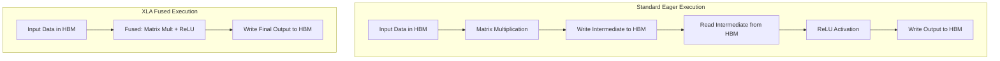
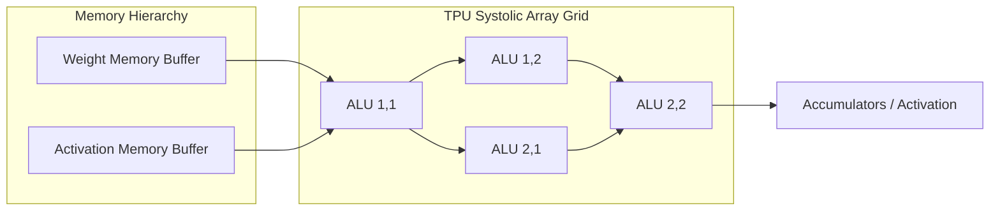

# JAXとTPUの最適化：深層学習の未来を加速する

現代の機械学習モデル、特に大規模言語モデル（LLM）、ビジョントランスフォーマー、高度な拡散モデルは、前例のない計算リソースを要求します。パラメータ数が数十億、最終的には数兆にまで膨れ上がるにつれて、これまでの人工知能を支配してきたハードウェアとソフトウェアのパラダイムは、その絶対的な限界にまで追い込まれています。

PyTorchは、その直感的なインターフェース、動的な実行、そして巨大なエコシステムにより、深層学習の研究と本番環境において揺るぎない王者であり続けていますが、極限規模のワークロードにおいては、手ごわい挑戦者であるJAXが登場しました。GoogleのTensor Processing Units（TPU）と組み合わせることで、JAXは加速コンピューティングへのアプローチ方法に記念碑的なパラダイムシフトをもたらします。この記事では、JAXの基本的なアーキテクチャを詳細に分析し、PyTorchとどのように根本的に異なるのかを探り、JAXとTPUの組み合わせが現代の深層学習にとって比類のない強力な存在となるハードウェアシナジーについて深く掘り下げていきます。

<AudioPlayer src="/static/audio/deep-learning-jax-tpu-ja.mp3" title="音声エグゼクティブ・ブリーフィング" voice="Google Cloud ja-JP-Neural2-B" />

## JAX vs. PyTorch：根本的なパラダイムシフト

JAXを真に理解するためには、まずその標準的な存在であるPyTorchと比較する必要があります。PyTorchは、動的な計算グラフ（イーガー実行（eager execution）とも呼ばれる）とオブジェクト指向プログラミング（OOP）モデルに大きく依存しています。PyTorchでニューラルネットワークを構築する場合、独自の重みとバイアスを保持するステートフルなオブジェクト（例：`nn.Linear`や`nn.Conv2d`）を定義します。操作が実行されると、PyTorchはカーネルを1つずつ基盤となるハードウェア（例：GPU）にディスパッチします。

Googleの研究者によって開発されたJAXは、厳密な関数型プログラミングパラダイムを採用しています。JAXでは、関数は純粋でなければなりません。副作用を持たず、外部の状態を変更しません。ステートフルなオブジェクトを構築する代わりに、モデルのパラメータをすべての関数に明示的に渡す必要があります。さらに、JAXは最高のパフォーマンスのために操作を1つずつイーガースタイルでネイティブにディスパッチするわけではありません（可能ではありますが）。むしろ、Python関数をトレースしてコンパイルします。このOOPから関数型、ステートレスな実行への根本的な転換は、動的でステートフルなフレームワークでは達成が非常に困難な、深いコンパイラレベルの最適化を可能にします。

### コード比較：ステートフル vs. ステートレス実行

```python
# PyTorch: Stateful Object-Oriented Execution
import torch
import torch.nn as nn

class SimpleModel(nn.Module):
    def __init__(self):
        super().__init__()
        self.dense = nn.Linear(128, 64)
        
    def forward(self, x):
        return torch.relu(self.dense(x))

model = SimpleModel()
x = torch.randn(32, 128)
output = model(x) # State is internal to the model object
```

```python
# JAX: Pure Functional and Stateless Execution
import jax
import jax.numpy as jnp

def simple_model(params, x):
    # 'params' dictionary contains 'weights' and 'biases' explicitly
    dense_out = jnp.dot(x, params['weights']) + params['biases']
    return jax.nn.relu(dense_out)

# Weights must be explicitly initialized and passed into the function
# output = simple_model(params, x)
```

## JAX変換の4つの柱

JAXは、数値関数を変換するための本質的に拡張可能なシステムです。そのエコシステムは、以下の4つの基本的な柱の上に構築されています。
1. **`grad`**：自動微分。隠れた自動勾配テープに依存し、テンソルの`.grad`属性を変更するPyTorchの`loss.backward()`とは異なり、JAXの`grad`は勾配を計算する全く新しいPython関数を返します。
2. **`jit`**：ジャストインタイムコンパイル。Python関数を`@jax.jit`でラップすることで、JAXは数値演算をトレースし、高度に最適化されたバイナリにコンパイルします。
3. **`vmap`**：自動ベクトル化。単一の例で動作する関数を記述し、行列演算を手動で書き直すことなく、それらをバッチで動作するようにシームレスに昇格させることができます。
4. **`pmap`**：並列マッピング。複数のデバイスにわたって計算をシームレスに分散します。

## 内部構造：XLA（Accelerated Linear Algebra）

JAXのパフォーマンスの真の原動力は、XLA（Accelerated Linear Algebra）です。XLAは、線形代数演算のために特別に設計されたドメイン固有のコンパイラです。

標準的な深層学習の実行では、各操作（行列乗算、それに続く活性化関数、それに続くドロップアウトなど）は、メモリからデータを読み込み、アクセラレータで計算を実行し、結果をメモリに書き戻す必要があります。このメモリ帯域幅の制限は、「フォン・ノイマン・ボトルネック」として知られており、AIトレーニングにおける実際の制約は、生の計算速度よりもこちらであることがよくあります。

XLAは、**カーネル融合**によってこの重要なボトルネックを解決します。JITコンパイルを介して計算グラフ全体をまとめて調べることで、XLAは複数の操作を単一のGPUまたはTPUカーネルに融合できます。中間データは、高速なオンチップレジスタに保持され、高帯域幅メモリ（HBM）への往復は行われません。

### アーキテクチャ図：XLAカーネル融合



## TPUの利点：シストリックアレイをマスターする

XLAはNVIDIA GPU向けにコードを美しく最適化しますが、その真の可能性はGoogleのTensor Processing Units（TPU）で完全に引き出されます。TPUは、深層学習ワークロード専用に設計された特定用途向け集積回路（ASIC）です。

TPUコアの微細な中心には、大規模で密な2次元の算術論理演算ユニット（ALU）グリッドである**シストリックアレイ**があります。標準的なCPUまたはGPUアーキテクチャでは、ほぼすべての命令に対してレジスタまたはキャッシュからデータをフェッチする必要があります。対照的に、シストリックアレイは、同期されたリズムでデータをあるALUから隣接するALUへシームレスに渡します（生物学的な心臓が血液を送り出すように、この名前の由来となっています）。

深層学習の基本的な数学演算である大規模な行列乗算を実行する場合、値はアレイの上部と側面から供給されます。データがグリッド全体を斜めにシームレスに流れるにつれて、ALUは結果を乗算および累積します。このハードウェア設計は、行列演算に対して驚異的なスループットを提供し、同時に消費電力とメモリアクセスのオーバーヘッドを大幅に削減します。

### アーキテクチャ図：TPUシストリックアレイ



## スケーリングアップ：`pmap`による極限並列処理

TPUは単独で使用されることはめったにありません。通常、高速なカスタムトーラスネットワークで接続されたPodとして知られる大規模なクラスターにデプロイされます。数千のチップにわたる分散トレーニングを管理することは、従来、DevOpsの悪夢でした。JAXは、その並列化変換を通じて、この途方もないハードウェアの複雑さを抽象化します。

`pmap`（並列マップ）を利用することで、開発者は単一の関数呼び出しで、数百または数千のTPUコアにわたる単一プログラム複数データ（SPMD）実行を実現できます。データ並列処理は些細なことになります。

### コード例：pmapによるスケーリング

```python
import jax
import jax.numpy as jnp

# Verify available hardware accelerators
devices = jax.devices()
print(f"Number of TPU cores available: {len(devices)}")

@jax.pmap(axis_name='devices')
def parallel_training_step(params, batch):
    # This function executes on every TPU core simultaneously.
    # Each core receives its own shard (slice) of the data batch.
    
    def loss_fn(p, b):
        # Calculate loss (placeholder logic)
        return jnp.sum(p['weights'] * b)
        
    # Compute gradients locally on the TPU core
    loss, grads = jax.value_and_grad(loss_fn)(params, batch)
    
    # Synchronize and average gradients across all TPU cores 
    # using high-speed interconnects (cross-replica sum)
    grads = jax.lax.pmean(grads, axis_name='devices')
    
    # Apply gradient descent update
    new_params = jax.tree_map(lambda p, g: p - 0.01 * g, params, grads)
    return new_params

# The execution model scales seamlessly to entire TPU Pods
# updated_params = parallel_training_step(replicated_params, sharded_batches)
```

## 結論

動的グラフと汎用ハードウェアからJAXと特殊なTPUへの移行は、急な学習曲線と、エンジニアが機械学習システムを設計する方法における根本的なパラダイムシフトを必要とします。しかし、その報酬は計り知れません。JAXの関数型でステートレスな性質は、XLAの積極的なグラフコンパイルとTPUの高度に特殊化されたシストリックアレイと相まって、研究者がこれまで以上に高速かつ費用対効果の高い方法で最先端のモデルをトレーニングすることを可能にします。

PyTorchは、迅速なプロトタイピング、動的なネットワークアーキテクチャ、および一般的なアクセシビリティにおいて、間違いなく揺るぎない選択肢であり続けるでしょうが、JAXとTPUの組み合わせは、深層学習の能力と規模の絶対的な限界を押し広げようとする組織にとって、急速にゴールドスタンダードとしての地位を確立しています。

## こちらもおすすめです

- [実践的なML評価：精度、再現率、AUCを超えて](/en/blog/machine-learning-2026-08-09)
- [フォークしてプライベートに保ち、アップストリームと同期する](/en/blog/opensoure-private-project)
- [高度なPythonデータ構造：何でもリストと辞書を使うのをやめる](/en/blog/advanced-python-data-structures)
- [バックエンド開発者向け量子コンピュータ耐性暗号（PQC）移行ガイド](/en/blog/post-quantum-cryptography-pqc-migration)