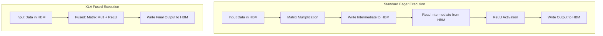
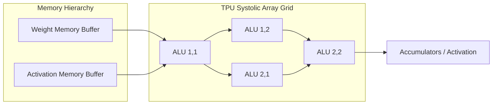

# Tối ưu hóa JAX và TPU: Tăng tốc tương lai của Học sâu

Các mô hình học máy hiện đại, đặc biệt là các Mô hình Ngôn ngữ Lớn (LLM), bộ biến đổi thị giác và các mô hình khuếch tán tiên tiến, đòi hỏi tài nguyên tính toán chưa từng có. Khi số lượng tham số tăng vọt lên hàng tỷ, và cuối cùng là hàng nghìn tỷ, các mô hình phần cứng và phần mềm đã chi phối các thế hệ trí tuệ nhân tạo trước đây đang bị đẩy đến giới hạn tuyệt đối.

Trong khi PyTorch vẫn là vua không thể tranh cãi của nghiên cứu và sản xuất học sâu nhờ giao diện trực quan, thực thi động và hệ sinh thái khổng lồ, một đối thủ đáng gờm đã xuất hiện cho các khối lượng công việc quy mô cực lớn: JAX. Kết hợp với Bộ xử lý Tensor (TPU) của Google, JAX đại diện cho một sự thay đổi mô hình to lớn trong cách chúng ta tiếp cận tính toán tăng tốc. Trong bài viết toàn diện này, chúng ta sẽ phân tích kiến trúc cơ bản của JAX, khám phá cách nó khác biệt sâu sắc so với PyTorch, và đi sâu vào sự phối hợp phần cứng khiến JAX trên TPU trở thành một cỗ máy mạnh mẽ vô song cho học sâu hiện đại.

<AudioPlayer src="/static/audio/deep-learning-jax-tpu-vi.mp3" title="Tóm tắt âm thanh cho kỹ sư" voice="Google Cloud vi-VN-Neural2-A" />

## JAX so với PyTorch: Một sự thay đổi mô hình cơ bản

Để thực sự hiểu JAX, trước tiên chúng ta phải đối chiếu nó với PyTorch, một tiêu chuẩn. PyTorch phụ thuộc nhiều vào đồ thị tính toán động (còn gọi là thực thi tức thời) và mô hình Lập trình Hướng đối tượng (OOP). Khi bạn xây dựng một mạng nơ-ron trong PyTorch, bạn định nghĩa các đối tượng có trạng thái (như `nn.Linear` hoặc `nn.Conv2d`) chứa trọng số và độ lệch của riêng chúng. Khi các phép toán được thực hiện, PyTorch gửi từng kernel một đến phần cứng cơ bản (ví dụ: GPU).

JAX, được phát triển bởi các nhà nghiên cứu tại Google, áp dụng một mô hình lập trình hàm nghiêm ngặt. Trong JAX, các hàm phải thuần túy: chúng không thể có tác dụng phụ và chúng không làm thay đổi trạng thái bên ngoài. Thay vì xây dựng các đối tượng có trạng thái, bạn phải truyền các tham số mô hình một cách rõ ràng vào mọi hàm. Hơn nữa, JAX không tự động gửi các phép toán từng cái một theo kiểu tức thời để đạt hiệu suất cao nhất (mặc dù nó có thể); thay vào đó, nó theo dõi các hàm Python và biên dịch chúng. Sự thay đổi cơ bản này từ OOP sang thực thi hàm, không trạng thái cho phép tối ưu hóa cấp trình biên dịch sâu sắc mà rất khó đạt được trong các framework động, có trạng thái.

### So sánh mã: Thực thi có trạng thái so với không trạng thái

```python
# PyTorch: Stateful Object-Oriented Execution
import torch
import torch.nn as nn

class SimpleModel(nn.Module):
    def __init__(self):
        super().__init__()
        self.dense = nn.Linear(128, 64)
        
    def forward(self, x):
        return torch.relu(self.dense(x))

model = SimpleModel()
x = torch.randn(32, 128)
output = model(x) # State is internal to the model object
```

```python
# JAX: Pure Functional and Stateless Execution
import jax
import jax.numpy as jnp

def simple_model(params, x):
    # 'params' dictionary contains 'weights' and 'biases' explicitly
    dense_out = jnp.dot(x, params['weights']) + params['biases']
    return jax.nn.relu(dense_out)

# Weights must be explicitly initialized and passed into the function
# output = simple_model(params, x)
```

## Bốn trụ cột của các phép biến đổi JAX

JAX về cơ bản là một hệ thống mở rộng để biến đổi các hàm số. Hệ sinh thái được xây dựng dựa trên bốn trụ cột cơ bản:
1. **`grad`**: Tự động vi phân. Không giống như `loss.backward()` của PyTorch, dựa vào một băng ghi tự động ẩn và làm thay đổi các thuộc tính `.grad` trên các tensor, `grad` của JAX trả về một hàm Python hoàn toàn mới tính toán gradient.
2. **`jit`**: Biên dịch tức thời. Bằng cách gói một hàm Python với `@jax.jit`, JAX theo dõi các phép toán số và biên dịch chúng thành một tệp nhị phân được tối ưu hóa cao.
3. **`vmap`**: Tự động vector hóa. Cho phép bạn viết các hàm hoạt động trên các ví dụ đơn lẻ và dễ dàng nâng chúng lên để hoạt động trên các lô mà không cần viết lại toán học ma trận theo cách thủ công.
4. **`pmap`**: Ánh xạ song song. Phân phối tính toán trên nhiều thiết bị một cách liền mạch.

## Bên trong: XLA (Đại số tuyến tính tăng tốc)

Động cơ thực sự đằng sau hiệu suất của JAX là XLA (Accelerated Linear Algebra). XLA là một trình biên dịch chuyên biệt được thiết kế đặc biệt cho các phép toán đại số tuyến tính.

Trong thực thi học sâu tiêu chuẩn, mỗi phép toán (như phép nhân ma trận, sau đó là hàm kích hoạt, sau đó là dropout) yêu cầu đọc dữ liệu từ bộ nhớ, thực hiện phép toán trên bộ tăng tốc và ghi kết quả trở lại bộ nhớ. Hạn chế băng thông bộ nhớ này, được gọi là "nút cổ chai von Neumann", thường là giới hạn thực tế trong huấn luyện AI, hơn là tốc độ tính toán thô.

XLA giải quyết nút cổ chai quan trọng này thông qua **hợp nhất kernel**. Bằng cách kiểm tra toàn bộ đồ thị tính toán thông qua biên dịch JIT, XLA có thể hợp nhất nhiều phép toán thành một kernel GPU hoặc TPU duy nhất. Dữ liệu trung gian được giữ trong các thanh ghi nhanh, trên chip thay vì phải đi lại đến Bộ nhớ Băng thông Cao (HBM).

### Sơ đồ kiến trúc: Hợp nhất Kernel XLA



## Lợi thế của TPU: Làm chủ các mảng Systolic

Mặc dù XLA tối ưu hóa mã cho GPU NVIDIA rất tốt, nhưng tiềm năng thực sự của nó được phát huy tối đa trên Bộ xử lý Tensor (TPU) của Google. TPU là các Mạch tích hợp chuyên dụng (ASIC) được thiết kế riêng cho các khối lượng công việc học sâu.

Tại trung tâm vi mô của một lõi TPU nằm ở **Mảng Systolic**, một lưới 2D dày đặc, khổng lồ gồm các Đơn vị Số học Logic (ALU). Kiến trúc CPU hoặc GPU tiêu chuẩn yêu cầu lấy dữ liệu từ các thanh ghi hoặc bộ nhớ cache cho gần như mọi lệnh. Ngược lại, một mảng systolic truyền dữ liệu liền mạch từ một ALU sang ALU liền kề theo một nhịp điệu đồng bộ (giống như máu bơm qua một trái tim sinh học, mang lại cho nó cái tên "systolic").

Khi thực hiện các phép nhân ma trận lớn — phép toán toán học cơ bản của học sâu — các giá trị được đưa vào phía trên và các cạnh của mảng. Các ALU nhân và tích lũy kết quả khi dữ liệu chảy chéo và liền mạch qua lưới. Thiết kế phần cứng này cung cấp thông lượng khổng lồ cho các phép toán ma trận đồng thời giảm đáng kể mức tiêu thụ điện năng và chi phí truy cập bộ nhớ.

### Sơ đồ kiến trúc: Mảng Systolic của TPU



## Mở rộng quy mô: Song song hóa cực độ với `pmap`

TPU hiếm khi được sử dụng riêng lẻ; chúng thường được triển khai trong các cụm lớn được gọi là Pod, được kết nối bằng mạng torus tốc độ cao, tùy chỉnh. Quản lý huấn luyện phân tán trên hàng nghìn chip theo truyền thống là một cơn ác mộng đối với dev-ops. JAX trừu tượng hóa sự phức tạp phần cứng khổng lồ này thông qua các phép biến đổi song song hóa của nó.

Bằng cách sử dụng `pmap` (ánh xạ song song), các nhà phát triển có thể đạt được thực thi Chương trình Đơn, Dữ liệu Đa (SPMD) trên hàng trăm hoặc hàng nghìn lõi TPU chỉ với một lệnh gọi hàm duy nhất. Song song hóa dữ liệu trở nên tầm thường.

### Ví dụ mã: Mở rộng quy mô với pmap

```python
import jax
import jax.numpy as jnp

# Verify available hardware accelerators
devices = jax.devices()
print(f"Number of TPU cores available: {len(devices)}")

@jax.pmap(axis_name='devices')
def parallel_training_step(params, batch):
    # This function executes on every TPU core simultaneously.
    # Each core receives its own shard (slice) of the data batch.
    
    def loss_fn(p, b):
        # Calculate loss (placeholder logic)
        return jnp.sum(p['weights'] * b)
        
    # Compute gradients locally on the TPU core
    loss, grads = jax.value_and_grad(loss_fn)(params, batch)
    
    # Synchronize and average gradients across all TPU cores 
    # using high-speed interconnects (cross-replica sum)
    grads = jax.lax.pmean(grads, axis_name='devices')
    
    # Apply gradient descent update
    new_params = jax.tree_map(lambda p, g: p - 0.01 * g, params, grads)
    return new_params

# The execution model scales seamlessly to entire TPU Pods
# updated_params = parallel_training_step(replicated_params, sharded_batches)
```

## Kết luận

Sự chuyển đổi từ đồ thị động và phần cứng đa năng sang JAX và TPU chuyên dụng đòi hỏi một đường cong học tập dốc và một sự thay đổi mô hình cơ bản trong cách các kỹ sư thiết kế hệ thống học máy. Tuy nhiên, phần thưởng là rất lớn. Bản chất hàm, không trạng thái của JAX, kết hợp với việc biên dịch đồ thị mạnh mẽ của XLA và các mảng systolic chuyên biệt cao của TPU, cho phép các nhà nghiên cứu huấn luyện các mô hình quy mô tiên tiến nhanh hơn và hiệu quả hơn về chi phí hơn bao giờ hết.

Trong khi PyTorch chắc chắn sẽ vẫn là lựa chọn không thể tranh cãi cho việc tạo mẫu nhanh, kiến trúc mạng động và khả năng tiếp cận chung, sự kết hợp giữa JAX và TPU đang nhanh chóng khẳng định mình là tiêu chuẩn vàng cho các tổ chức đang đẩy giới hạn tuyệt đối của khả năng và quy mô học sâu.

## Bạn cũng có thể thích

- [Đánh giá ML thực tế: Vượt xa độ chính xác với Precision, Recall và AUC](/en/blog/machine-learning-2026-08-09)
- [Fork nó, giữ nó riêng tư, đồng bộ với Upstream](/en/blog/opensoure-private-project)
- [Cấu trúc dữ liệu Python nâng cao: Ngừng sử dụng List và Dict cho mọi thứ](/en/blog/advanced-python-data-structures)
- [Hướng dẫn di chuyển mã hóa hậu lượng tử (PQC) cho các nhà phát triển Backend](/en/blog/post-quantum-cryptography-pqc-migration)