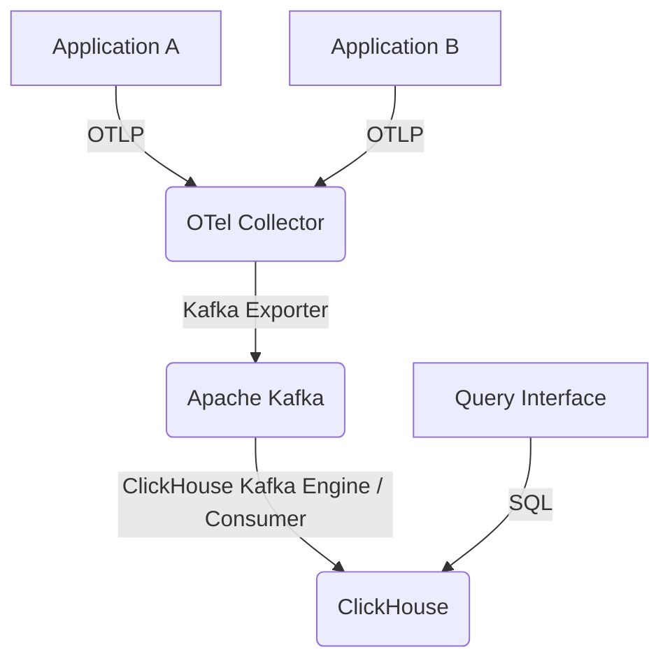

Distributed tracing at petabyte scale demands a robust, efficient, and cost-effective pipeline. This guide details the construction of such a system using OpenTelemetry for instrumentation, Apache Kafka for reliable transport, and ClickHouse for high-performance storage and analytical querying. The focus is on practical, production-grade implementation, including optimized schema design, intelligent sampling strategies, and efficient query patterns.

<AudioPlayer src="/static/audio/distributed-tracing-opentelemetry-clickhouse.mp3" title="Executive Audio Briefing" voice="Google Cloud en-US-Neural2-F" />


## Architecture Overview

The proposed architecture comprises:

1.  **OpenTelemetry SDKs**: Instrument applications to generate traces.
2.  **OpenTelemetry Collector**: Receives, processes, and exports trace data. Acts as a crucial buffer and processing layer.
3.  **Apache Kafka**: A high-throughput, fault-tolerant message bus for ingesting raw trace data from Collectors.
4.  **ClickHouse Kafka Connectors / Consumers**: Ingests data from Kafka into ClickHouse.
5.  **ClickHouse**: Columnar analytical database for storing and querying trace spans.



## OpenTelemetry Collector Configuration

The OpenTelemetry Collector is pivotal for managing trace volume and ensuring data integrity before Kafka ingestion. Key components include receivers, processors, and exporters.

### Receiver Configuration

We'll use the OTLP receiver for standard OpenTelemetry protocol ingestion.

```yaml
# otel-collector-config.yaml
receivers:
  otlp:
    protocols:
      grpc:
        endpoint: 0.0.0.0:4317 # Standard OTLP gRPC port
      http:
        endpoint: 0.0.0.0:4318 # Standard OTLP HTTP port
```

### Processor Configuration: Batching, Memory Limiting, and Tail-Based Sampling

Processors are critical for optimizing data flow.

*   **Batch Processor**: Reduces network overhead by aggregating spans into batches.
*   **Memory Limiter**: Prevents the collector from consuming excessive memory, crucial under high load.
*   **Tail-Based Sampler**: Implements intelligent sampling decisions *after* all spans for a trace have been received. This allows for policies like "always keep error traces" while aggressively sampling "healthy" traces.

```yaml
# otel-collector-config.yaml
processors:
  batch:
    send_batch_size: 1024 # Target batch size
    timeout: 5s         # Max time to wait for a batch
  memory_limiter:
    check_interval: 1s
    limit_mib: 2048     # Max 2GB memory usage
    spike_limit_mib: 512 # Max 512MB spike
  tail_sampling:
    decision_wait: 10s # How long to wait for a trace to complete before making a sampling decision
    num_traces: 100000 # Max number of traces to hold in memory for sampling
    expected_new_traces_per_sec: 10000 # Expected new traces per second
    policies:
      [
        {
          name: "always-sample-errors",
          type: status_code,
          status_code: {
            status_codes: [ERROR, UNSET], # Keep traces with ERROR or UNSET status
            drop_nested_spans: false
          }
        },
        {
          name: "drop-ok-traces",
          type: probabilistic,
          probabilistic: {
            sampling_percentage: 5 # Keep 5% of all other traces (e.g., 200 OK)
          }
        }
      ]
```

This tail-based sampling configuration ensures that:
1.  Any trace containing a span with an `ERROR` or `UNSET` status code is *always* kept. This is paramount for debugging production issues.
2.  For all other traces (etypically healthy `200 OK` responses), only 5% are retained. This drastically reduces data volume for non-critical traces.

### Exporter Configuration: Kafka

The Kafka exporter sends processed batches to a Kafka topic. Crucially, configure `sending_queue` for resilience.

```yaml
# otel-collector-config.yaml
exporters:
  kafka:
    brokers: ["kafka-broker-1:9092", "kafka-broker-2:9092"]
    topic: "opentelemetry-traces"
    encoding: "otlp_json" # Export in OTLP JSON format for easier consumption
    protocol_version: "2.0.0"
    # Essential for production: buffer spans if Kafka is unavailable
    sending_queue:
      enabled: true
      queue_size: 5000 # Number of batches to buffer (e.g., 5000 * 1024 spans)
    # Optional: Configure retries for transient Kafka issues
    retry_on_failure:
      enabled: true
      initial_interval: 5s
      max_interval: 30s
      max_elapsed_time: 5m
```

### Service Pipeline

Finally, assemble the components into a service pipeline.

```yaml
# otel-collector-config.yaml
service:
  pipelines:
    traces:
      receivers: [otlp]
      processors: [memory_limiter, tail_sampling, batch]
      exporters: [kafka]
```

## ClickHouse Schema Design for Traces

An optimized ClickHouse schema is fundamental for petabyte-scale tracing. We need fast ingestion, efficient storage, and sub-second query performance for common trace analysis patterns.

### Table Structure

We'll use a `MergeTree` engine, which is suitable for high-volume writes and analytical queries. Key considerations:

*   **`trace_id`**: The primary identifier for a trace. Should be indexed.
*   **`span_id`**: Unique identifier for a span within a trace.
*   **`parent_span_id`**: For reconstructing trace hierarchies.
*   **`service_name`**: Critical for filtering and aggregation. Use `LowCardinality(String)` for efficiency.
*   **`operation_name`**: Similar to `service_name`.
*   **`start_time_us`, `end_time_us`**: Microsecond precision timestamps.
*   **`duration_us`**: Pre-calculated duration for faster queries.
*   **`status_code`, `status_message`**: For error analysis.
*   **`attributes`**: Store span attributes as `Map(String, String)` or `Array(Tuple(String, String))` for flexibility. `Map` is generally more convenient for querying.
*   **`resource_attributes`**: Attributes from the OpenTelemetry resource (e.g., host, environment). Also `Map(String, String)`.

```sql
CREATE TABLE IF NOT EXISTS traces.spans
(
    `trace_id` String CODEC(ZSTD(1)),
    `span_id` String CODEC(ZSTD(1)),
    `parent_span_id` String CODEC(ZSTD(1)),
    `trace_state` String CODEC(ZSTD(1)),
    `service_name` LowCardinality(String) CODEC(ZSTD(1)),
    `operation_name` LowCardinality(String) CODEC(ZSTD(1)),
    `kind` LowCardinality(String) CODEC(ZSTD(1)),
    `start_time_us` UInt64 CODEC(Delta, ZSTD(1)),
    `end_time_us` UInt64 CODEC(Delta, ZSTD(1)),
    `duration_us` UInt64 CODEC(Delta, ZSTD(1)),
    `status_code` UInt8 CODEC(ZSTD(1)),
    `status_message` String CODEC(ZSTD(1)),
    `attributes` Map(LowCardinality(String), String) CODEC(ZSTD(1)),
    `resource_attributes` Map(LowCardinality(String), String) CODEC(ZSTD(1)),
    `events.time_unix_nano` Array(UInt64) CODEC(Delta, ZSTD(1)),
    `events.name` Array(LowCardinality(String)) CODEC(ZSTD(1)),
    `events.attributes` Array(Map(LowCardinality(String), String)) CODEC(ZSTD(1)),
    `links.trace_id` Array(String) CODEC(ZSTD(1)),
    `links.span_id` Array(String) CODEC(ZSTD(1)),
    `links.trace_state` Array(String) CODEC(ZSTD(1)),
    `links.attributes` Array(Map(LowCardinality(String), String)) CODEC(ZSTD(1)),
    `ingestion_time_ms` DateTime64(3, 'UTC') DEFAULT now() CODEC(Delta, ZSTD(1))
)
ENGINE = MergeTree
PARTITION BY toYYYYMMDD(toDateTime(start_time_us / 1000000))
ORDER BY (service_name, start_time_us, trace_id, span_id)
PRIMARY KEY (service_name, start_time_us)
TTL toDateTime(start_time_us / 1000000) + INTERVAL 30 DAY
SETTINGS index_granularity = 8192, merge_with_ttl_timeout = 3600;

-- Secondary index for faster trace_id lookups
ALTER TABLE traces.spans ADD INDEX trace_id_idx trace_id TYPE bloom_filter GRANULARITY 1;
```

**Explanation of Schema Choices:**

*   **`CODEC(ZSTD(1))`**: ZSTD compression with level 1 offers a good balance between compression ratio and CPU usage.
*   **`LowCardinality(String)`**: Crucial for fields like `service_name`, `operation_name`, `kind`, and map keys. It stores a dictionary of unique values, significantly reducing storage and improving query performance for filtering and grouping.
*   **`Delta` codec for timestamps and durations**: Efficiently compresses monotonically increasing or decreasing sequences.
*   **`Map(LowCardinality(String), String)`**: For `attributes` and `resource_attributes`. ClickHouse can query map keys and values directly. Using `LowCardinality` for map keys is a significant optimization.
*   **`PARTITION BY toYYYYMMDD(...)`**: Partitions data by day, enabling efficient data retention (TTL) and pruning for time-range queries.
*   **`ORDER BY (service_name, start_time_us, trace_id, span_id)`**: Defines the physical order of data within partitions. This order is critical for range queries on `start_time_us` and filtering by `service_name`. `trace_id` and `span_id` are included for uniqueness and efficient lookup within a service/time range.
*   **`PRIMARY KEY (service_name, start_time_us)`**: The primary key is a prefix of the `ORDER BY` key. It defines the sparse index used for quick data skipping.
*   **`TTL toDateTime(start_time_us / 1000000) + INTERVAL 30 DAY`**: Automatically deletes data older than 30 days based on the span's start time.
*   **`ALTER TABLE ... ADD INDEX trace_id_idx trace_id TYPE bloom_filter GRANULARITY 1`**: A secondary bloom filter index on `trace_id` dramatically speeds up `WHERE trace_id = '...'` queries, which are common for retrieving an entire trace. `GRANULARITY 1` means the index is built for every data part, providing fine-grained filtering.

### Ingestion from Kafka to ClickHouse

ClickHouse can directly consume from Kafka using the `Kafka` table engine. This simplifies the ingestion pipeline by removing the need for a separate consumer application.

```sql
CREATE TABLE IF NOT EXISTS traces.spans_kafka_raw
(
    `trace_id` String,
    `span_id` String,
    `parent_span_id` String,
    `trace_state` String,
    `service_name` String,
    `operation_name` String,
    `kind` String,
    `start_time_us` UInt64,
    `end_time_us` UInt64,
    `duration_us` UInt64,
    `status_code` UInt8,
    `status_message` String,
    `attributes` String, -- Raw JSON string for attributes
    `resource_attributes` String, -- Raw JSON string for resource attributes
    `events.time_unix_nano` Array(UInt64),
    `events.name` Array(String),
    `events.attributes` Array(String), -- Raw JSON string for event attributes
    `links.trace_id` Array(String),
    `links.span_id` Array(String),
    `links.trace_state` Array(String),
    `links.attributes` Array(String) -- Raw JSON string for link attributes
)
ENGINE = Kafka
SETTINGS
    kafka_broker_list = 'kafka-broker-1:9092,kafka-broker-2:9092',
    kafka_topic_list = 'opentelemetry-traces',
    kafka_group_name = 'clickhouse_otel_consumer_group',
    kafka_format = 'JSONEachRow', -- OTLP JSON is essentially JSONEachRow
    kafka_num_consumers = 4, -- Number of parallel consumers
    kafka_max_block_size = 1048576, -- Max bytes per block
    kafka_skip_broken_messages = 10; -- Skip up to 10 broken messages per block
```

Then, use a materialized view to transform and insert data from the Kafka table into the optimized `spans` table. This allows for data type conversions (e.g., JSON strings to `Map`), default value assignments, and pre-calculation of `duration_us`.

```sql
CREATE MATERIALIZED VIEW IF NOT EXISTS traces.spans_mv TO traces.spans AS
SELECT
    JSONExtractString(message, 'resource.attributes.service.name') AS service_name, -- Extract service name from resource attributes
    JSONExtractString(message, 'span_id') AS span_id,
    JSONExtractString(message, 'trace_id') AS trace_id,
    JSONExtractString(message, 'parent_span_id') AS parent_span_id,
    JSONExtractString(message, 'trace_state') AS trace_state,
    JSONExtractString(message, 'name') AS operation_name,
    JSONExtractString(message, 'kind') AS kind,
    JSONExtractUInt(message, 'start_time_unix_nano') / 1000 AS start_time_us,
    JSONExtractUInt(message, 'end_time_unix_nano') / 1000 AS end_time_us,
    (JSONExtractUInt(message, 'end_time_unix_nano') - JSONExtractUInt(message, 'start_time_unix_nano')) / 1000 AS duration_us,
    JSONExtractUInt(message, 'status.code') AS status_code,
    JSONExtractString(message, 'status.message') AS status_message,
    JSONExtract(message, 'attributes', 'Map(LowCardinality(String), String)') AS attributes,
    JSONExtract(message, 'resource.attributes', 'Map(LowCardinality(String), String)') AS resource_attributes,
    arrayMap(x -> JSONExtractUInt(x, 'time_unix_nano'), JSONExtractArrayRaw(message, 'events')) AS `events.time_unix_nano`,
    arrayMap(x -> JSONExtractString(x, 'name'), JSONExtractArrayRaw(message, 'events')) AS `events.name`,
    arrayMap(x -> JSONExtract(x, 'attributes', 'Map(LowCardinality(String), String)'), JSONExtractArrayRaw(message, 'events')) AS `events.attributes`,
    arrayMap(x -> JSONExtractString(x, 'trace_id'), JSONExtractArrayRaw(message, 'links')) AS `links.trace_id`,
    arrayMap(x -> JSONExtractString(x, 'span_id'), JSONExtractArrayRaw(message, 'links')) AS `links.span_id`,
    arrayMap(x -> JSONExtractString(x, 'trace_state'), JSONExtractArrayRaw(message, 'links')) AS `links.trace_state`,
    arrayMap(x -> JSONExtract(x, 'attributes', 'Map(LowCardinality(String), String)'), JSONExtractArrayRaw(message, 'links')) AS `links.attributes`
FROM traces.spans_kafka_raw;
```

**Note on OTLP JSON structure**: The `otlp_json` encoding from the OpenTelemetry Collector Kafka exporter produces a JSON object per span. The `JSONExtract` functions are used to parse this structure. The `service_name` is typically found within `resource.attributes`.

## Sub-Second SQL Trace Queries

Leveraging the optimized schema, common trace queries can achieve sub-second performance.

### 1. Find a Trace by ID

```sql
SELECT
    trace_id,
    span_id,
    parent_span_id,
    service_name,
    operation_name,
    kind,
    start_time_us,
    duration_us,
    status_code,
    status_message,
    attributes,
    resource_attributes
FROM traces.spans
WHERE trace_id = 'a1b2c3d4e5f6a7b8c9d0e1f2a3b4c5d6'
ORDER BY start_time_us ASC;
```
This query benefits from the `bloom_filter` index on `trace_id`.

### 2. Find Error Traces for a Service within a Time Range

```sql
SELECT
    trace_id,
    service_name,
    operation_name,
    start_time_us,
    duration_us,
    status_code,
    status_message
FROM traces.spans
WHERE service_name = 'my-critical-service'
  AND status_code != 0 -- OTLP status_code 0 is OK
  AND toDateTime(start_time_us / 1000000) BETWEEN '2023-10-26 00:00:00' AND '2023-10-26 23:59:59'
ORDER BY start_time_us DESC
LIMIT 100;
```
This query leverages the `PRIMARY KEY` and `ORDER BY` clause on `service_name` and `start_time_us` for efficient filtering and sorting.

### 3. Top N Slowest Operations for a Service

```sql
SELECT
    operation_name,
    avg(duration_us) AS avg_duration_us,
    count() AS total_spans
FROM traces.spans
WHERE service_name = 'my-api-gateway'
  AND toDateTime(start_time_us / 1000000) BETWEEN now() - INTERVAL 1 HOUR AND now()
GROUP BY operation_name
ORDER BY avg_duration_us DESC
LIMIT 10;
```
`LowCardinality(operation_name)` makes `GROUP BY` operations very fast.

### 4. Traces with Specific Attributes

```sql
SELECT
    trace_id,
    service_name,
    operation_name,
    attributes['http.method'] AS http_method,
    attributes['http.status_code'] AS http_status_code
FROM traces.spans
WHERE service_name = 'my-web-app'
  AND attributes['http.method'] = 'POST'
  AND attributes['http.status_code'] = '500'
  AND toDateTime(start_time_us / 1000000) BETWEEN now() - INTERVAL 1 DAY AND now()
LIMIT 50;
```
ClickHouse efficiently queries map keys and values.

## Architecture & Tradeoffs Comparison

| Feature             | OpenTelemetry Collector + Kafka + ClickHouse | SaaS Tracing Platform (e.g., Datadog, Honeycomb) | Jaeger/Zipkin + Elasticsearch |
|---------------------|----------------------------------------------|--------------------------------------------------|-------------------------------|
| **Cost**            | Low (infra + engineering)                    | High (per GB/span)                               | Medium (infra + engineering)  |
| **Scalability**     | Petabyte-scale, highly scalable              | Excellent, managed                               | Good, but ES can struggle with high cardinality |
| **Data Retention**  | Fully customizable (TTL)                     | Vendor-defined tiers                             | Customizable, but ES storage is expensive |
| **Query Performance** | Sub-second for complex analytical queries    | Excellent, optimized for tracing                 | Good for simple lookups, slower for aggregations |
| **Flexibility**     | High (custom schema, sampling, processing)   | Limited to platform features                     | Moderate (schema, sampling)   |
| **Operational Overhead** | High (manage Kafka, ClickHouse, OTel)      | Low (managed service)                            | Medium (manage ES, Cassandra) |
| **Sampling Control**| Fine-grained tail-based sampling             | Often head-based or limited tail-based           | Head-based, some tail-based options |
| **Data Ownership**  | Full                                         | Vendor-controlled                                | Full                          |

## Production Gotchas & Troubleshooting

1.  **Kafka Backpressure / OTel Collector Buffer Overflow**:
    *   **Symptom**: OpenTelemetry Collector logs show `sending_queue` full errors, `dropped_spans` metrics increase. Kafka consumer lag grows.
    *   **Cause**: Kafka brokers are slow, or ClickHouse ingestion cannot keep up with Kafka.
    *   **Fix**:
        *   **Scale Kafka**: Add more brokers, increase topic partitions.
        *   **Scale ClickHouse**: Add more ClickHouse nodes (for distributed tables), optimize ClickHouse merges.
        *   **Optimize ClickHouse Schema**: Ensure `LowCardinality` is used where appropriate, indexes are effective.
        *   **Increase OTel Collector `sending_queue`**: Provides more buffer, but only delays the inevitable if downstream is truly bottlenecked.
        *   **Aggressive Sampling**: If all else fails, increase sampling rates in the OTel Collector to reduce overall volume.

2.  **ClickHouse `LowCardinality` Dictionary Size Exceeded**:
    *   **Symptom**: ClickHouse logs show errors like `Too many unique values for LowCardinality type`. Queries might fail or become extremely slow.
    *   **Cause**: A `LowCardinality` column is used for data with very high cardinality (e.g., unique request IDs, full URLs without path templating).
    *   **Fix**:
        *   **Identify the culprit**: Query `SELECT column_name, count(DISTINCT column_name) FROM traces.spans GROUP BY column_name ORDER BY count() DESC;`
        *   **Change data type**: For truly high-cardinality fields, switch from `LowCardinality(String)` to `String`.
        *   **Pre-process data**: In the OTel Collector or Materialized View, normalize high-cardinality attributes (e.g., `http.url` to `http.route`).

3.  **Slow `trace_id` Lookups in ClickHouse**:
    *   **Symptom**: Queries like `SELECT ... WHERE trace_id = '...'` take several seconds.
    *   **Cause**: The `bloom_filter` index on `trace_id` is not effective, or the data volume per partition is too high.
    *   **Fix**:
        *   **Verify index creation**: Ensure `ALTER TABLE traces.spans ADD INDEX trace_id_idx trace_id TYPE bloom_filter GRANULARITY 1;` was executed.
        *   **Check `GRANULARITY`**: For very large partitions, a `GRANULARITY` of 1 is usually optimal for bloom filters on unique IDs.
        *   **Increase `index_granularity`**: If `index_granularity` is too low, the bloom filter might not skip enough data. Experiment with values like 8192 or 16384.
        *   **Check `MergeTree` merges**: Ensure ClickHouse is merging parts efficiently. Unmerged parts can degrade query performance.

4.  **ClickHouse `Materialized View` Lag**:
    *   **Symptom**: Data appears in `spans_kafka_raw` but takes a long time to show up in `traces.spans`.
    *   **Cause**: The materialized view is struggling to keep up with the Kafka ingestion rate, or there are issues with the `JSONExtract` functions.
    *   **Fix**:
        *   **Optimize `JSONExtract`**: Ensure the JSON paths are correct and not overly complex.
        *   **Increase ClickHouse resources**: More CPU/memory for the ClickHouse server.
        *   **Tune Kafka engine parameters**: Increase `kafka_num_consumers`, `kafka_max_block_size` in the `spans_kafka_raw` table to allow ClickHouse to pull larger batches from Kafka.
        *   **Monitor `system.kafka_consumers`**: Check for errors or consumer lag.

## Frequently Asked Questions

### Q1: How do I ensure 100% of error traces are captured without overwhelming storage?

A1: Implement tail-based sampling in the OpenTelemetry Collector. Configure a `status_code` policy to always sample traces with `ERROR` or `UNSET` statuses. For all other traces, apply a probabilistic sampling policy (e.g., 5% retention). This ensures critical error data is never dropped while significantly reducing the volume of healthy traces.

### Q2: What's the impact of `LowCardinality(String)` on performance and storage?

A2: `LowCardinality(String)` is a significant optimization for fields with a limited number of unique values (e.g., service names, HTTP methods). It stores a dictionary of unique values and uses integer IDs in the main data, drastically reducing storage footprint and improving query performance for filtering, grouping, and sorting on these columns. However, using it for high-cardinality data (e.g., full URLs, user IDs) can lead to excessive dictionary growth, memory issues, and performance degradation.

### Q3: How do I handle schema evolution for trace attributes in ClickHouse?

A3: The `Map(LowCardinality(String), String)` type for `attributes` and `resource_attributes` provides excellent flexibility. New attributes can be added by applications without requiring schema changes in ClickHouse. Queries can access these new attributes using `attributes['new.attribute.key']`. If an attribute becomes critical and frequently queried, consider extracting it into a dedicated column for better performance and indexing.

### Q4: My ClickHouse queries are slow despite the optimized schema. What should I check first?

A4:
1.  **Time Range**: Ensure your queries include a narrow time range (`start_time_us`) that aligns with the `PARTITION BY` and `ORDER BY` keys. This allows ClickHouse to prune partitions and use the primary index effectively.
2.  **`EXPLAIN` Query**: Use `EXPLAIN` to understand the query plan. Look for full table scans or inefficient joins.
3.  **Index Usage**: Verify that secondary indexes (like the `bloom_filter` on `trace_id`) are being utilized.
4.  **Cardinality**: Check the cardinality of columns used in `WHERE` or `GROUP BY` clauses. If a `LowCardinality` column has grown too large, it can degrade performance.
5.  **ClickHouse Metrics**: Monitor ClickHouse server metrics (CPU, disk I/O, merges, active queries) to identify resource bottlenecks.

### Q5: How can I ensure data durability and fault tolerance for this pipeline?

A5:
*   **OpenTelemetry Collector**: Configure `sending_queue` for buffering and `retry_on_failure` for transient network issues. Deploy multiple collectors behind a load balancer.
*   **Kafka**: Deploy a Kafka cluster with replication (e.g., 3 brokers, replication factor 3) and configure appropriate `acks` for producers.
*   **ClickHouse**: Use a ClickHouse cluster with replication (e.g., `ReplicatedMergeTree` engine) and sharding for horizontal scalability and fault tolerance. Materialized views are resilient; if ClickHouse restarts, they will resume consuming from Kafka.
*   **Monitoring**: Implement comprehensive monitoring for all components (OTel Collector, Kafka, ClickHouse) to detect issues early.
