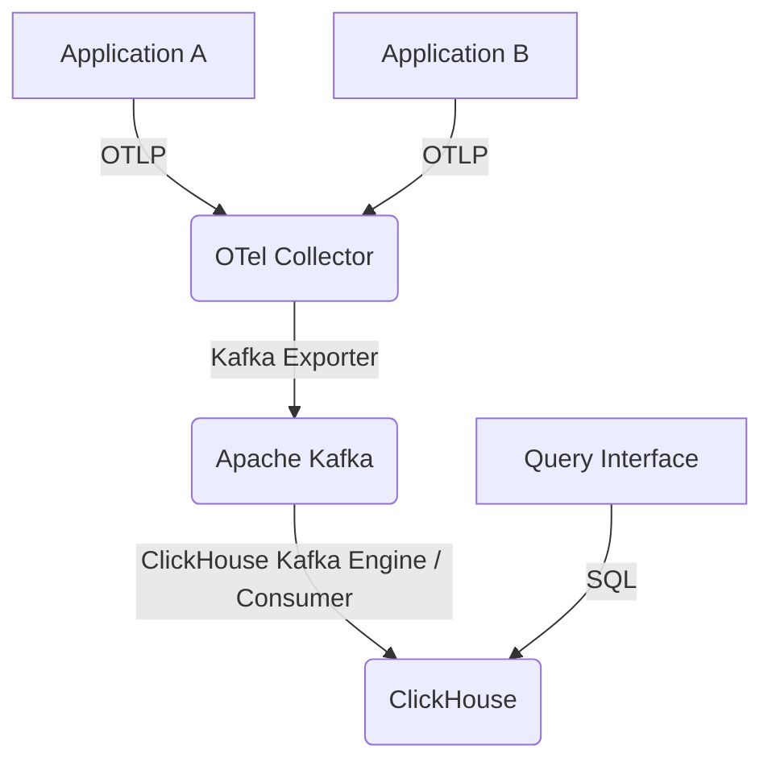

ペタバイト規模の分散トレーシングには、堅牢で効率的、かつ費用対効果の高いパイプラインが求められます。このガイドでは、OpenTelemetryによるインスツルメンテーション、Apache Kafkaによる信頼性の高い転送、ClickHouseによる高性能なストレージと分析クエリを活用したシステムの構築について詳しく説明します。最適化されたスキーマ設計、インテリジェントなサンプリング戦略、効率的なクエリパターンなど、実用的で本番環境に対応した実装に焦点を当てています。

<AudioPlayer src="/static/audio/distributed-tracing-opentelemetry-clickhouse-ja.mp3" title="音声エグゼクティブ・ブリーフィング" voice="Google Cloud ja-JP-Neural2-B" />


## アーキテクチャの概要

提案するアーキテクチャは以下のコンポーネントで構成されます。

1.  **OpenTelemetry SDKs**: アプリケーションをインスツルメントし、トレースを生成します。
2.  **OpenTelemetry Collector**: トレースデータを受信、処理、エクスポートします。重要なバッファリングおよび処理レイヤーとして機能します。
3.  **Apache Kafka**: コレクターから生トレースデータを取り込むための、高スループットでフォールトトレラントなメッセージバスです。
4.  **ClickHouse Kafka Connectors / Consumers**: KafkaからClickHouseにデータを取り込みます。
5.  **ClickHouse**: トレーススパンを保存およびクエリするためのカラム型分析データベースです。



## OpenTelemetry Collector の設定

OpenTelemetry Collectorは、Kafkaに取り込む前のトレース量を管理し、データの整合性を確保するために極めて重要です。主要なコンポーネントには、レシーバー、プロセッサー、エクスポーターがあります。

### レシーバーの設定

標準のOpenTelemetryプロトコルを取り込むためにOTLPレシーバーを使用します。

```yaml
# otel-collector-config.yaml
receivers:
  otlp:
    protocols:
      grpc:
        endpoint: 0.0.0.0:4317 # Standard OTLP gRPC port
      http:
        endpoint: 0.0.0.0:4318 # Standard OTLP HTTP port
```

### プロセッサーの設定: バッチ処理、メモリ制限、テールベースサンプリング

プロセッサーはデータフローを最適化するために不可欠です。

*   **バッチプロセッサー**: スパンをバッチに集約することで、ネットワークオーバーヘッドを削減します。
*   **メモリリミッター**: コレクターが過剰なメモリを消費するのを防ぎます。高負荷時には特に重要です。
*   **テールベースサンプラー**: トレースのすべてのスパンが受信された*後*に、インテリジェントなサンプリング決定を行います。これにより、「エラーのあるトレースは常に保持する」といったポリシーを適用しつつ、「正常な」トレースは積極的にサンプリングできます。

```yaml
# otel-collector-config.yaml
processors:
  batch:
    send_batch_size: 1024 # Target batch size
    timeout: 5s         # Max time to wait for a batch
  memory_limiter:
    check_interval: 1s
    limit_mib: 2048     # Max 2GB memory usage
    spike_limit_mib: 512 # Max 512MB spike
  tail_sampling:
    decision_wait: 10s # How long to wait for a trace to complete before making a sampling decision
    num_traces: 100000 # Max number of traces to hold in memory for sampling
    expected_new_traces_per_sec: 10000 # Expected new traces per second
    policies:
      [
        {
          name: "always-sample-errors",
          type: status_code,
          status_code: {
            status_codes: [ERROR, UNSET], # Keep traces with ERROR or UNSET status
            drop_nested_spans: false
          }
        },
        {
          name: "drop-ok-traces",
          type: probabilistic,
          probabilistic: {
            sampling_percentage: 5 # Keep 5% of all other traces (e.g., 200 OK)
          }
        }
      ]
```

このテールベースサンプリング設定により、以下の点が保証されます。
1.  `ERROR`または`UNSET`ステータスコードを持つスパンを含むトレースは、*常に*保持されます。これは本番環境の問題をデバッグする上で最も重要です。
2.  その他のすべてのトレース（通常は正常な`200 OK`レスポンス）については、5%のみが保持されます。これにより、重要でないトレースのデータ量が大幅に削減されます。

### エクスポーターの設定: Kafka

Kafkaエクスポーターは、処理されたバッチをKafkaトピックに送信します。回復力のために、`sending_queue`を構成することが重要です。

```yaml
# otel-collector-config.yaml
exporters:
  kafka:
    brokers: ["kafka-broker-1:9092", "kafka-broker-2:9092"]
    topic: "opentelemetry-traces"
    encoding: "otlp_json" # Export in OTLP JSON format for easier consumption
    protocol_version: "2.0.0"
    # Essential for production: buffer spans if Kafka is unavailable
    sending_queue:
      enabled: true
      queue_size: 5000 # Number of batches to buffer (e.g., 5000 * 1024 spans)
    # Optional: Configure retries for transient Kafka issues
    retry_on_failure:
      enabled: true
      initial_interval: 5s
      max_interval: 30s
      max_elapsed_time: 5m
```

### サービスパイプライン

最後に、コンポーネントをサービスパイプラインにまとめます。

```yaml
# otel-collector-config.yaml
service:
  pipelines:
    traces:
      receivers: [otlp]
      processors: [memory_limiter, tail_sampling, batch]
      exporters: [kafka]
```

## トレース用ClickHouseスキーマ設計

ペタバイト規模のトレーシングには、最適化されたClickHouseスキーマが不可欠です。高速な取り込み、効率的なストレージ、一般的なトレース分析パターンに対する秒未満のクエリパフォーマンスが必要です。

### テーブル構造

高ボリュームの書き込みと分析クエリに適した`MergeTree`エンジンを使用します。主な考慮事項は以下の通りです。

*   **`trace_id`**: トレースの主要な識別子。インデックス化する必要があります。
*   **`span_id`**: トレース内のスパンの一意な識別子。
*   **`parent_span_id`**: トレース階層を再構築するため。
*   **`service_name`**: フィルタリングと集計に不可欠です。効率のために`LowCardinality(String)`を使用します。
*   **`operation_name`**: `service_name`と同様。
*   **`start_time_us`, `end_time_us`**: マイクロ秒精度のタイムスタンプ。
*   **`duration_us`**: より高速なクエリのために事前に計算された期間。
*   **`status_code`, `status_message`**: エラー分析用。
*   **`attributes`**: スパン属性を柔軟性のために`Map(String, String)`または`Array(Tuple(String, String))`として保存します。クエリには`Map`が一般的に便利です。
*   **`resource_attributes`**: OpenTelemetryリソースからの属性（例: ホスト、環境）。これも`Map(String, String)`。

```sql
CREATE TABLE IF NOT EXISTS traces.spans
(
    `trace_id` String CODEC(ZSTD(1)),
    `span_id` String CODEC(ZSTD(1)),
    `parent_span_id` String CODEC(ZSTD(1)),
    `trace_state` String CODEC(ZSTD(1)),
    `service_name` LowCardinality(String) CODEC(ZSTD(1)),
    `operation_name` LowCardinality(String) CODEC(ZSTD(1)),
    `kind` LowCardinality(String) CODEC(ZSTD(1)),
    `start_time_us` UInt64 CODEC(Delta, ZSTD(1)),
    `end_time_us` UInt64 CODEC(Delta, ZSTD(1)),
    `duration_us` UInt64 CODEC(Delta, ZSTD(1)),
    `status_code` UInt8 CODEC(ZSTD(1)),
    `status_message` String CODEC(ZSTD(1)),
    `attributes` Map(LowCardinality(String), String) CODEC(ZSTD(1)),
    `resource_attributes` Map(LowCardinality(String), String) CODEC(ZSTD(1)),
    `events.time_unix_nano` Array(UInt64) CODEC(Delta, ZSTD(1)),
    `events.name` Array(LowCardinality(String)) CODEC(ZSTD(1)),
    `events.attributes` Array(Map(LowCardinality(String), String)) CODEC(ZSTD(1)),
    `links.trace_id` Array(String) CODEC(ZSTD(1)),
    `links.span_id` Array(String) CODEC(ZSTD(1)),
    `links.trace_state` Array(String) CODEC(ZSTD(1)),
    `links.attributes` Array(Map(LowCardinality(String), String)) CODEC(ZSTD(1)),
    `ingestion_time_ms` DateTime64(3, 'UTC') DEFAULT now() CODEC(Delta, ZSTD(1))
)
ENGINE = MergeTree
PARTITION BY toYYYYMMDD(toDateTime(start_time_us / 1000000))
ORDER BY (service_name, start_time_us, trace_id, span_id)
PRIMARY KEY (service_name, start_time_us)
TTL toDateTime(start_time_us / 1000000) + INTERVAL 30 DAY
SETTINGS index_granularity = 8192, merge_with_ttl_timeout = 3600;

-- Secondary index for faster trace_id lookups
ALTER TABLE traces.spans ADD INDEX trace_id_idx trace_id TYPE bloom_filter GRANULARITY 1;
```

**スキーマ選択の説明:**

*   **`CODEC(ZSTD(1))`**: ZSTD圧縮レベル1は、圧縮率とCPU使用率のバランスが良好です。
*   **`LowCardinality(String)`**: `service_name`、`operation_name`、`kind`、およびマップキーのようなフィールドに不可欠です。一意な値の辞書を保存し、ストレージを大幅に削減し、フィルタリングやグループ化のクエリパフォーマンスを向上させます。
*   **`Delta`コーデック（タイムスタンプと期間用）**: 単調に増加または減少するシーケンスを効率的に圧縮します。
*   **`Map(LowCardinality(String), String)`**: `attributes`と`resource_attributes`用。ClickHouseはマップキーと値を直接クエリできます。マップキーに`LowCardinality`を使用することは、重要な最適化です。
*   **`PARTITION BY toYYYYMMDD(...)`**: データを日ごとにパーティション分割し、効率的なデータ保持（TTL）と時間範囲クエリのプルーニングを可能にします。
*   **`ORDER BY (service_name, start_time_us, trace_id, span_id)`**: パーティション内のデータの物理的な順序を定義します。この順序は、`start_time_us`の範囲クエリと`service_name`によるフィルタリングに不可欠です。`trace_id`と`span_id`は、サービス/時間範囲内での一意性と効率的なルックアップのために含まれています。
*   **`PRIMARY KEY (service_name, start_time_us)`**: プライマリキーは`ORDER BY`キーのプレフィックスです。データの高速スキップに使用される疎なインデックスを定義します。
*   **`TTL toDateTime(start_time_us / 1000000) + INTERVAL 30 DAY`**: スパンの開始時間に基づいて、30日より古いデータを自動的に削除します。
*   **`ALTER TABLE ... ADD INDEX trace_id_idx trace_id TYPE bloom_filter GRANULARITY 1`**: `trace_id`上のセカンダリブルームフィルターインデックスは、トレース全体を取得する一般的な`WHERE trace_id = '...'`クエリを劇的に高速化します。`GRANULARITY 1`は、インデックスがすべてのデータパーツに対して構築され、きめ細かいフィルタリングを提供することを意味します。

### KafkaからClickHouseへの取り込み

ClickHouseは、`Kafka`テーブルエンジンを使用してKafkaから直接データを消費できます。これにより、個別のコンシューマーアプリケーションが不要になり、取り込みパイプラインが簡素化されます。

```sql
CREATE TABLE IF NOT EXISTS traces.spans_kafka_raw
(
    `trace_id` String,
    `span_id` String,
    `parent_span_id` String,
    `trace_state` String,
    `service_name` String,
    `operation_name` String,
    `kind` String,
    `start_time_us` UInt64,
    `end_time_us` UInt64,
    `duration_us` UInt64,
    `status_code` UInt8,
    `status_message` String,
    `attributes` String, -- Raw JSON string for attributes
    `resource_attributes` String, -- Raw JSON string for resource attributes
    `events.time_unix_nano` Array(UInt64),
    `events.name` Array(String),
    `events.attributes` Array(String), -- Raw JSON string for event attributes
    `links.trace_id` Array(String),
    `links.span_id` Array(String),
    `links.trace_state` Array(String),
    `links.attributes` Array(String) -- Raw JSON string for link attributes
)
ENGINE = Kafka
SETTINGS
    kafka_broker_list = 'kafka-broker-1:9092,kafka-broker-2:9092',
    kafka_topic_list = 'opentelemetry-traces',
    kafka_group_name = 'clickhouse_otel_consumer_group',
    kafka_format = 'JSONEachRow', -- OTLP JSON is essentially JSONEachRow
    kafka_num_consumers = 4, -- Number of parallel consumers
    kafka_max_block_size = 1048576, -- Max bytes per block
    kafka_skip_broken_messages = 10; -- Skip up to 10 broken messages per block
```

次に、マテリアライズドビューを使用して、Kafkaテーブルから最適化された`spans`テーブルにデータを変換して挿入します。これにより、データ型変換（例: JSON文字列から`Map`へ）、デフォルト値の割り当て、および`duration_us`の事前計算が可能になります。

```sql
CREATE MATERIALIZED VIEW IF NOT EXISTS traces.spans_mv TO traces.spans AS
SELECT
    JSONExtractString(message, 'resource.attributes.service.name') AS service_name, -- Extract service name from resource attributes
    JSONExtractString(message, 'span_id') AS span_id,
    JSONExtractString(message, 'trace_id') AS trace_id,
    JSONExtractString(message, 'parent_span_id') AS parent_span_id,
    JSONExtractString(message, 'trace_state') AS trace_state,
    JSONExtractString(message, 'name') AS operation_name,
    JSONExtractString(message, 'kind') AS kind,
    JSONExtractUInt(message, 'start_time_unix_nano') / 1000 AS start_time_us,
    JSONExtractUInt(message, 'end_time_unix_nano') / 1000 AS end_time_us,
    (JSONExtractUInt(message, 'end_time_unix_nano') - JSONExtractUInt(message, 'start_time_unix_nano')) / 1000 AS duration_us,
    JSONExtractUInt(message, 'status.code') AS status_code,
    JSONExtractString(message, 'status.message') AS status_message,
    JSONExtract(message, 'attributes', 'Map(LowCardinality(String), String)') AS attributes,
    JSONExtract(message, 'resource.attributes', 'Map(LowCardinality(String), String)') AS resource_attributes,
    arrayMap(x -> JSONExtractUInt(x, 'time_unix_nano'), JSONExtractArrayRaw(message, 'events')) AS `events.time_unix_nano`,
    arrayMap(x -> JSONExtractString(x, 'name'), JSONExtractArrayRaw(message, 'events')) AS `events.name`,
    arrayMap(x -> JSONExtract(x, 'attributes', 'Map(LowCardinality(String), String)'), JSONExtractArrayRaw(message, 'events')) AS `events.attributes`,
    arrayMap(x -> JSONExtractString(x, 'trace_id'), JSONExtractArrayRaw(message, 'links')) AS `links.trace_id`,
    arrayMap(x -> JSONExtractString(x, 'span_id'), JSONExtractArrayRaw(message, 'links')) AS `links.span_id`,
    arrayMap(x -> JSONExtractString(x, 'trace_state'), JSONExtractArrayRaw(message, 'links')) AS `links.trace_state`,
    arrayMap(x -> JSONExtract(x, 'attributes', 'Map(LowCardinality(String), String)'), JSONExtractArrayRaw(message, 'links')) AS `links.attributes`
FROM traces.spans_kafka_raw;
```

**OTLP JSON構造に関する注意**: OpenTelemetry Collector Kafkaエクスポーターからの`otlp_json`エンコーディングは、スパンごとにJSONオブジェクトを生成します。`JSONExtract`関数は、この構造を解析するために使用されます。`service_name`は通常、`resource.attributes`内に見つかります。

## 秒未満のSQLトレースクエリ

最適化されたスキーマを活用することで、一般的なトレースクエリは秒未満のパフォーマンスを達成できます。

### 1. IDによるトレースの検索

```sql
SELECT
    trace_id,
    span_id,
    parent_span_id,
    service_name,
    operation_name,
    kind,
    start_time_us,
    duration_us,
    status_code,
    status_message,
    attributes,
    resource_attributes
FROM traces.spans
WHERE trace_id = 'a1b2c3d4e5f6a7b8c9d0e1f2a3b4c5d6'
ORDER BY start_time_us ASC;
```
このクエリは、`bloom_filter`上の`trace_id`インデックスの恩恵を受けます。

### 2. 特定の時間範囲内のサービスのエラートレースを検索

```sql
SELECT
    trace_id,
    service_name,
    operation_name,
    start_time_us,
    duration_us,
    status_code,
    status_message
FROM traces.spans
WHERE service_name = 'my-critical-service'
  AND status_code != 0 -- OTLP status_code 0 is OK
  AND toDateTime(start_time_us / 1000000) BETWEEN '2023-10-26 00:00:00' AND '2023-10-26 23:59:59'
ORDER BY start_time_us DESC
LIMIT 100;
```
このクエリは、効率的なフィルタリングとソートのために、`PRIMARY KEY`と`ORDER BY`句を`service_name`と`start_time_us`に活用しています。

### 3. サービスで最も遅い上位N個の操作

```sql
SELECT
    operation_name,
    avg(duration_us) AS avg_duration_us,
    count() AS total_spans
FROM traces.spans
WHERE service_name = 'my-api-gateway'
  AND toDateTime(start_time_us / 1000000) BETWEEN now() - INTERVAL 1 HOUR AND now()
GROUP BY operation_name
ORDER BY avg_duration_us DESC
LIMIT 10;
```
`LowCardinality(operation_name)`は`GROUP BY`操作を非常に高速にします。

### 4. 特定の属性を持つトレース

```sql
SELECT
    trace_id,
    service_name,
    operation_name,
    attributes['http.method'] AS http_method,
    attributes['http.status_code'] AS http_status_code
FROM traces.spans
WHERE service_name = 'my-web-app'
  AND attributes['http.method'] = 'POST'
  AND attributes['http.status_code'] = '500'
  AND toDateTime(start_time_us / 1000000) BETWEEN now() - INTERVAL 1 DAY AND now()
LIMIT 50;
```
ClickHouseはマップキーと値を効率的にクエリします。

## アーキテクチャとトレードオフの比較

| 機能             | OpenTelemetry Collector + Kafka + ClickHouse | SaaSトレーシングプラットフォーム (例: Datadog, Honeycomb) | Jaeger/Zipkin + Elasticsearch |
|---------------------|----------------------------------------------|--------------------------------------------------|-------------------------------|
| **コスト**            | 低 (インフラ + エンジニアリング)                    | 高 (GB/スパンあたり)                               | 中 (インフラ + エンジニアリング)  |
| **スケーラビリティ**     | ペタバイト規模、高いスケーラビリティ              | 非常に優れている、マネージド                               | 良好だが、ESは高カーディナリティに苦戦する可能性がある |
| **データ保持**  | 完全にカスタマイズ可能 (TTL)                     | ベンダー定義のティア                             | カスタマイズ可能だが、ESストレージは高価 |
| **クエリパフォーマンス** | 複雑な分析クエリで秒未満    | 非常に優れている、トレーシング用に最適化                 | シンプルなルックアップには良好、集計には遅い |
| **柔軟性**     | 高 (カスタムスキーマ、サンプリング、処理)   | プラットフォーム機能に限定                     | 中程度 (スキーマ、サンプリング)   |
| **運用オーバーヘッド** | 高 (Kafka、ClickHouse、OTelの管理)      | 低 (マネージドサービス)                            | 中程度 (ES、Cassandraの管理) |
| **サンプリング制御**| きめ細かいテールベースサンプリング             | 多くの場合ヘッドベースまたは限定的なテールベース           | ヘッドベース、一部テールベースオプションあり |
| **データ所有権**  | 完全                                         | ベンダー管理                                | 完全                          |

## 本番環境での注意点とトラブルシューティング

1.  **Kafkaバックプレッシャー / OTel Collectorバッファオーバーフロー**:
    *   **症状**: OpenTelemetry Collectorのログに`sending_queue` fullエラーが表示され、`dropped_spans`メトリクスが増加します。Kafkaコンシューマーラグが増大します。
    *   **原因**: Kafkaブローカーが遅い、またはClickHouseの取り込みがKafkaに追いついていない。
    *   **解決策**:
        *   **Kafkaをスケール**: ブローカーを追加し、トピックパーティションを増やします。
        *   **ClickHouseをスケール**: ClickHouseノードを追加し（分散テーブルの場合）、ClickHouseのマージを最適化します。
        *   **ClickHouseスキーマを最適化**: 適切な場所で`LowCardinality`が使用され、インデックスが効果的であることを確認します。
        *   **OTel Collectorの`sending_queue`を増やす**: より多くのバッファを提供しますが、下流が本当にボトルネックになっている場合は一時的な解決策に過ぎません。
        *   **積極的なサンプリング**: 他のすべてが失敗した場合は、OTel Collectorのサンプリングレートを上げて、全体のデータ量を削減します。

2.  **ClickHouse `LowCardinality`辞書サイズ超過**:
    *   **症状**: ClickHouseログに`Too many unique values for LowCardinality type`のようなエラーが表示されます。クエリが失敗したり、非常に遅くなったりする可能性があります。
    *   **原因**: 非常に高いカーディナリティを持つデータ（例: 一意のリクエストID、パスのテンプレート化されていない完全なURL）に`LowCardinality`カラムが使用されている。
    *   **解決策**:
        *   **原因を特定**: `SELECT column_name, count(DISTINCT column_name) FROM traces.spans GROUP BY column_name ORDER BY count() DESC;`をクエリします。
        *   **データ型を変更**: 真に高カーディナリティのフィールドについては、`LowCardinality(String)`から`String`に切り替えます。
        *   **データを前処理**: OTel CollectorまたはMaterialized Viewで、高カーディナリティ属性を正規化します（例: `http.url`を`http.route`に）。

3.  **ClickHouseでの`trace_id`ルックアップが遅い**:
    *   **症状**: `SELECT ... WHERE trace_id = '...'`のようなクエリに数秒かかります。
    *   **原因**: `bloom_filter`上の`trace_id`インデックスが効果的でない、またはパーティションあたりのデータ量が多すぎる。
    *   **解決策**:
        *   **インデックス作成を確認**: `ALTER TABLE traces.spans ADD INDEX trace_id_idx trace_id TYPE bloom_filter GRANULARITY 1;`が実行されたことを確認します。
        *   **`GRANULARITY`を確認**: 非常に大きなパーティションの場合、一意のIDに対するブルームフィルターでは`GRANULARITY`が通常最適です。
        *   **`index_granularity`を増やす**: `index_granularity`が低すぎると、ブルームフィルターが十分なデータをスキップできない可能性があります。8192や16384などの値を試してください。
        *   **`MergeTree`マージを確認**: ClickHouseがパーツを効率的にマージしていることを確認します。マージされていないパーツはクエリパフォーマンスを低下させる可能性があります。

4.  **ClickHouse `Materialized View`ラグ**:
    *   **症状**: データが`spans_kafka_raw`には表示されるが、`traces.spans`に表示されるまでに時間がかかる。
    *   **原因**: マテリアライズドビューがKafkaの取り込みレートに追いついていない、または`JSONExtract`関数に問題がある。
    *   **解決策**:
        *   **`JSONExtract`を最適化**: JSONパスが正しく、過度に複雑でないことを確認します。
        *   **ClickHouseリソースを増やす**: ClickHouseサーバーのCPU/メモリを増やします。
        *   **Kafkaエンジンパラメータを調整**: `spans_kafka_raw`テーブルの`kafka_num_consumers`、`kafka_max_block_size`を増やして、ClickHouseがKafkaからより大きなバッチをプルできるようにします。
        *   **`system.kafka_consumers`を監視**: エラーやコンシューマーラグがないか確認します。

## よくある質問

### Q1: ストレージを圧迫せずに、エラーのあるトレースを100%確実にキャプチャするにはどうすればよいですか？

A1: OpenTelemetry Collectorでテールベースサンプリングを実装します。`status_code`ポリシーを設定して、`ERROR`または`UNSET`ステータスを持つトレースを常にサンプリングするようにします。その他のすべてのトレースには、確率的サンプリングポリシー（例: 5%保持）を適用します。これにより、重要なエラーデータが失われることなく、正常なトレースの量が大幅に削減されます。

### Q2: `LowCardinality(String)`がパフォーマンスとストレージに与える影響は何ですか？

A2: `LowCardinality(String)`は、一意な値の数が限られているフィールド（例: サービス名、HTTPメソッド）にとって重要な最適化です。一意な値の辞書を保存し、メインデータでは整数IDを使用するため、ストレージフットプリントを大幅に削減し、これらのカラムでのフィルタリング、グループ化、ソートのクエリパフォーマンスを向上させます。ただし、高カーディナリティデータ（例: 完全なURL、ユーザーID）に使用すると、辞書の過剰な増大、メモリの問題、パフォーマンスの低下につながる可能性があります。

### Q3: ClickHouseでのトレース属性のスキーマ進化はどのように処理しますか？

A3: `attributes`と`resource_attributes`の`Map(LowCardinality(String), String)`型は、優れた柔軟性を提供します。アプリケーションは、ClickHouseのスキーマ変更を必要とせずに新しい属性を追加できます。クエリは`attributes['new.attribute.key']`を使用してこれらの新しい属性にアクセスできます。属性が重要になり、頻繁にクエリされる場合は、パフォーマンスとインデックス作成を向上させるために、専用のカラムに抽出することを検討してください。

### Q4: 最適化されたスキーマにもかかわらず、ClickHouseのクエリが遅いです。最初に何をチェックすべきですか？

A4:
1.  **時間範囲**: クエリに、`PARTITION BY`および`ORDER BY`キーと一致する狭い時間範囲（`start_time_us`）が含まれていることを確認します。これにより、ClickHouseはパーティションをプルーニングし、プライマリインデックスを効果的に使用できます。
2.  **`EXPLAIN`クエリ**: `EXPLAIN`を使用してクエリプランを理解します。フルテーブルスキャンや非効率な結合がないか確認します。
3.  **インデックスの使用**: セカンダリインデックス（`trace_id`上の`bloom_filter`など）が利用されていることを確認します。
4.  **カーディナリティ**: `WHERE`または`GROUP BY`句で使用されているカラムのカーディナリティを確認します。`LowCardinality`カラムが大きくなりすぎると、パフォーマンスが低下する可能性があります。
5.  **ClickHouseメトリクス**: ClickHouseサーバーのメトリクス（CPU、ディスクI/O、マージ、アクティブクエリ）を監視して、リソースのボトルネックを特定します。

### Q5: このパイプラインのデータ永続性とフォールトトレランスを確保するにはどうすればよいですか？

A5:
*   **OpenTelemetry Collector**: バッファリングには`sending_queue`を、一時的なネットワーク問題には`retry_on_failure`を設定します。ロードバランサーの背後に複数のコレクターをデプロイします。
*   **Kafka**: レプリケーション（例: 3ブローカー、レプリケーションファクター3）を持つKafkaクラスターをデプロイし、プロデューサー用に適切な`acks`を設定します。
*   **ClickHouse**: 水平スケーラビリティとフォールトトレランスのために、レプリケーション（例: `ReplicatedMergeTree`エンジン）とシャーディングを備えたClickHouseクラスターを使用します。マテリアライズドビューは回復力があり、ClickHouseが再起動してもKafkaからの消費を再開します。
*   **監視**: すべてのコンポーネント（OTel Collector、Kafka、ClickHouse）に対して包括的な監視を実装し、問題を早期に検出します。
