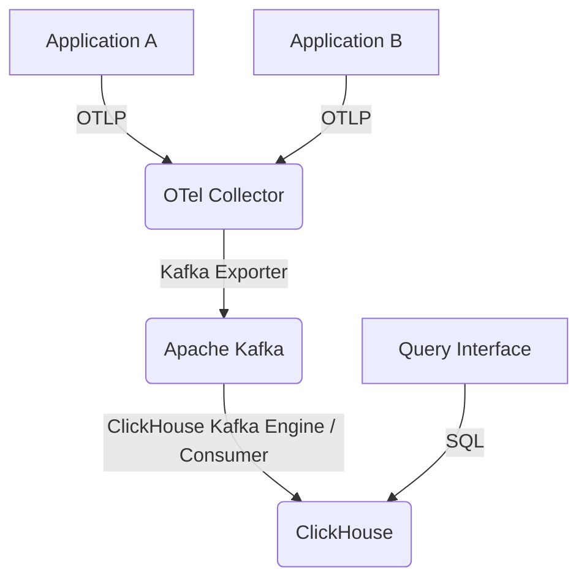

Hệ thống truy vết phân tán ở quy mô petabyte đòi hỏi một pipeline mạnh mẽ, hiệu quả và tiết kiệm chi phí. Hướng dẫn này trình bày chi tiết việc xây dựng một hệ thống như vậy bằng cách sử dụng OpenTelemetry để đo đạc, Apache Kafka để vận chuyển đáng tin cậy và ClickHouse để lưu trữ và truy vấn phân tích hiệu suất cao. Trọng tâm là triển khai thực tế, cấp độ sản xuất, bao gồm thiết kế lược đồ tối ưu, chiến lược lấy mẫu thông minh và các mẫu truy vấn hiệu quả.

<AudioPlayer src="/static/audio/distributed-tracing-opentelemetry-clickhouse-vi.mp3" title="Tóm tắt âm thanh cho kỹ sư" voice="Google Cloud vi-VN-Neural2-A" />


## Tổng quan kiến trúc

Kiến trúc được đề xuất bao gồm:

1.  **OpenTelemetry SDKs**: Đo đạc ứng dụng để tạo ra các trace.
2.  **OpenTelemetry Collector**: Nhận, xử lý và xuất dữ liệu trace. Hoạt động như một lớp đệm và xử lý quan trọng.
3.  **Apache Kafka**: Một bus thông báo có thông lượng cao, chịu lỗi để thu thập dữ liệu trace thô từ các Collector.
4.  **ClickHouse Kafka Connectors / Consumers**: Thu thập dữ liệu từ Kafka vào ClickHouse.
5.  **ClickHouse**: Cơ sở dữ liệu phân tích dạng cột để lưu trữ và truy vấn các span trace.



## Cấu hình OpenTelemetry Collector

OpenTelemetry Collector đóng vai trò then chốt trong việc quản lý khối lượng trace và đảm bảo tính toàn vẹn của dữ liệu trước khi đưa vào Kafka. Các thành phần chính bao gồm receivers, processors và exporters.

### Cấu hình Receiver

Chúng ta sẽ sử dụng OTLP receiver để thu thập giao thức OpenTelemetry tiêu chuẩn.

```yaml
# otel-collector-config.yaml
receivers:
  otlp:
    protocols:
      grpc:
        endpoint: 0.0.0.0:4317 # Standard OTLP gRPC port
      http:
        endpoint: 0.0.0.0:4318 # Standard OTLP HTTP port
```

### Cấu hình Processor: Batching, Memory Limiting và Tail-Based Sampling

Các processor rất quan trọng để tối ưu hóa luồng dữ liệu.

*   **Batch Processor**: Giảm chi phí mạng bằng cách tổng hợp các span thành các batch.
*   **Memory Limiter**: Ngăn Collector tiêu thụ quá nhiều bộ nhớ, rất quan trọng dưới tải cao.
*   **Tail-Based Sampler**: Thực hiện các quyết định lấy mẫu thông minh *sau khi* tất cả các span cho một trace đã được nhận. Điều này cho phép các chính sách như "luôn giữ các trace lỗi" trong khi lấy mẫu mạnh mẽ các trace "khỏe mạnh".

```yaml
# otel-collector-config.yaml
processors:
  batch:
    send_batch_size: 1024 # Target batch size
    timeout: 5s         # Max time to wait for a batch
  memory_limiter:
    check_interval: 1s
    limit_mib: 2048     # Max 2GB memory usage
    spike_limit_mib: 512 # Max 512MB spike
  tail_sampling:
    decision_wait: 10s # How long to wait for a trace to complete before making a sampling decision
    num_traces: 100000 # Max number of traces to hold in memory for sampling
    expected_new_traces_per_sec: 10000 # Expected new traces per second
    policies:
      [
        {
          name: "always-sample-errors",
          type: status_code,
          status_code: {
            status_codes: [ERROR, UNSET], # Keep traces with ERROR or UNSET status
            drop_nested_spans: false
          }
        },
        {
          name: "drop-ok-traces",
          type: probabilistic,
          probabilistic: {
            sampling_percentage: 5 # Keep 5% of all other traces (e.g., 200 OK)
          }
        }
      ]
```

Cấu hình lấy mẫu dựa trên đuôi này đảm bảo rằng:
1.  Bất kỳ trace nào chứa một span có mã trạng thái `ERROR` hoặc `UNSET` *luôn* được giữ lại. Điều này rất quan trọng để gỡ lỗi các vấn đề sản xuất.
2.  Đối với tất cả các trace khác (thường là các phản hồi `200 OK` khỏe mạnh), chỉ 5% được giữ lại. Điều này làm giảm đáng kể khối lượng dữ liệu cho các trace không quan trọng.

### Cấu hình Exporter: Kafka

Kafka exporter gửi các batch đã xử lý đến một topic Kafka. Quan trọng là, hãy cấu hình `sending_queue` để có khả năng phục hồi.

```yaml
# otel-collector-config.yaml
exporters:
  kafka:
    brokers: ["kafka-broker-1:9092", "kafka-broker-2:9092"]
    topic: "opentelemetry-traces"
    encoding: "otlp_json" # Export in OTLP JSON format for easier consumption
    protocol_version: "2.0.0"
    # Essential for production: buffer spans if Kafka is unavailable
    sending_queue:
      enabled: true
      queue_size: 5000 # Number of batches to buffer (e.g., 5000 * 1024 spans)
    # Optional: Configure retries for transient Kafka issues
    retry_on_failure:
      enabled: true
      initial_interval: 5s
      max_interval: 30s
      max_elapsed_time: 5m
```

### Service Pipeline

Cuối cùng, tập hợp các thành phần vào một service pipeline.

```yaml
# otel-collector-config.yaml
service:
  pipelines:
    traces:
      receivers: [otlp]
      processors: [memory_limiter, tail_sampling, batch]
      exporters: [kafka]
```

## Thiết kế lược đồ ClickHouse cho Traces

Một lược đồ ClickHouse được tối ưu hóa là nền tảng cho việc truy vết ở quy mô petabyte. Chúng ta cần thu thập nhanh, lưu trữ hiệu quả và hiệu suất truy vấn dưới một giây cho các mẫu phân tích trace phổ biến.

### Cấu trúc bảng

Chúng ta sẽ sử dụng engine `MergeTree`, phù hợp cho các ghi có khối lượng lớn và các truy vấn phân tích. Các cân nhắc chính:

*   **`trace_id`**: Định danh chính cho một trace. Nên được lập chỉ mục.
*   **`span_id`**: Định danh duy nhất cho một span trong một trace.
*   **`parent_span_id`**: Để tái tạo các hệ thống phân cấp trace.
*   **`service_name`**: Quan trọng cho việc lọc và tổng hợp. Sử dụng `LowCardinality(String)` để tăng hiệu quả.
*   **`operation_name`**: Tương tự như `service_name`.
*   **`start_time_us`, `end_time_us`**: Dấu thời gian với độ chính xác micro giây.
*   **`duration_us`**: Thời lượng được tính toán trước để truy vấn nhanh hơn.
*   **`status_code`, `status_message`**: Để phân tích lỗi.
*   **`attributes`**: Lưu trữ các thuộc tính span dưới dạng `Map(String, String)` hoặc `Array(Tuple(String, String))` để linh hoạt. `Map` thường tiện lợi hơn cho việc truy vấn.
*   **`resource_attributes`**: Các thuộc tính từ tài nguyên OpenTelemetry (ví dụ: host, environment). Cũng là `Map(String, String)`.

```sql
CREATE TABLE IF NOT EXISTS traces.spans
(
    `trace_id` String CODEC(ZSTD(1)),
    `span_id` String CODEC(ZSTD(1)),
    `parent_span_id` String CODEC(ZSTD(1)),
    `trace_state` String CODEC(ZSTD(1)),
    `service_name` LowCardinality(String) CODEC(ZSTD(1)),
    `operation_name` LowCardinality(String) CODEC(ZSTD(1)),
    `kind` LowCardinality(String) CODEC(ZSTD(1)),
    `start_time_us` UInt64 CODEC(Delta, ZSTD(1)),
    `end_time_us` UInt64 CODEC(Delta, ZSTD(1)),
    `duration_us` UInt64 CODEC(Delta, ZSTD(1)),
    `status_code` UInt8 CODEC(ZSTD(1)),
    `status_message` String CODEC(ZSTD(1)),
    `attributes` Map(LowCardinality(String), String) CODEC(ZSTD(1)),
    `resource_attributes` Map(LowCardinality(String), String) CODEC(ZSTD(1)),
    `events.time_unix_nano` Array(UInt64) CODEC(Delta, ZSTD(1)),
    `events.name` Array(LowCardinality(String)) CODEC(ZSTD(1)),
    `events.attributes` Array(Map(LowCardinality(String), String)) CODEC(ZSTD(1)),
    `links.trace_id` Array(String) CODEC(ZSTD(1)),
    `links.span_id` Array(String) CODEC(ZSTD(1)),
    `links.trace_state` Array(String) CODEC(ZSTD(1)),
    `links.attributes` Array(Map(LowCardinality(String), String)) CODEC(ZSTD(1)),
    `ingestion_time_ms` DateTime64(3, 'UTC') DEFAULT now() CODEC(Delta, ZSTD(1))
)
ENGINE = MergeTree
PARTITION BY toYYYYMMDD(toDateTime(start_time_us / 1000000))
ORDER BY (service_name, start_time_us, trace_id, span_id)
PRIMARY KEY (service_name, start_time_us)
TTL toDateTime(start_time_us / 1000000) + INTERVAL 30 DAY
SETTINGS index_granularity = 8192, merge_with_ttl_timeout = 3600;

-- Secondary index for faster trace_id lookups
ALTER TABLE traces.spans ADD INDEX trace_id_idx trace_id TYPE bloom_filter GRANULARITY 1;
```

**Giải thích các lựa chọn lược đồ:**

*   **`CODEC(ZSTD(1))`**: Nén ZSTD với cấp độ 1 mang lại sự cân bằng tốt giữa tỷ lệ nén và mức sử dụng CPU.
*   **`LowCardinality(String)`**: Quan trọng đối với các trường như `service_name`, `operation_name`, `kind` và các khóa map. Nó lưu trữ một từ điển các giá trị duy nhất, giảm đáng kể dung lượng lưu trữ và cải thiện hiệu suất truy vấn cho việc lọc và nhóm.
*   **`Delta` codec cho dấu thời gian và thời lượng**: Nén hiệu quả các chuỗi tăng hoặc giảm đơn điệu.
*   **`Map(LowCardinality(String), String)`**: Đối với `attributes` và `resource_attributes`. ClickHouse có thể truy vấn trực tiếp các khóa và giá trị map. Sử dụng `LowCardinality` cho các khóa map là một tối ưu hóa đáng kể.
*   **`PARTITION BY toYYYYMMDD(...)`**: Phân vùng dữ liệu theo ngày, cho phép giữ lại dữ liệu hiệu quả (TTL) và cắt tỉa cho các truy vấn theo phạm vi thời gian.
*   **`ORDER BY (service_name, start_time_us, trace_id, span_id)`**: Định nghĩa thứ tự vật lý của dữ liệu trong các phân vùng. Thứ tự này rất quan trọng cho các truy vấn phạm vi trên `start_time_us` và lọc theo `service_name`. `trace_id` và `span_id` được bao gồm để đảm bảo tính duy nhất và tra cứu hiệu quả trong một dịch vụ/phạm vi thời gian.
*   **`PRIMARY KEY (service_name, start_time_us)`**: Khóa chính là tiền tố của khóa `ORDER BY`. Nó định nghĩa chỉ mục thưa thớt được sử dụng để bỏ qua dữ liệu nhanh chóng.
*   **`TTL toDateTime(start_time_us / 1000000) + INTERVAL 30 DAY`**: Tự động xóa dữ liệu cũ hơn 30 ngày dựa trên thời gian bắt đầu của span.
*   **`ALTER TABLE ... ADD INDEX trace_id_idx trace_id TYPE bloom_filter GRANULARITY 1`**: Một chỉ mục bloom filter thứ cấp trên `trace_id` tăng tốc đáng kể các truy vấn `WHERE trace_id = '...'`, vốn phổ biến để truy xuất toàn bộ trace. `GRANULARITY 1` có nghĩa là chỉ mục được xây dựng cho mọi phần dữ liệu, cung cấp khả năng lọc chi tiết.

### Thu thập từ Kafka vào ClickHouse

ClickHouse có thể trực tiếp tiêu thụ từ Kafka bằng cách sử dụng engine bảng `Kafka`. Điều này đơn giản hóa pipeline thu thập bằng cách loại bỏ nhu cầu về một ứng dụng consumer riêng biệt.

```sql
CREATE TABLE IF NOT EXISTS traces.spans_kafka_raw
(
    `trace_id` String,
    `span_id` String,
    `parent_span_id` String,
    `trace_state` String,
    `service_name` String,
    `operation_name` String,
    `kind` String,
    `start_time_us` UInt64,
    `end_time_us` UInt64,
    `duration_us` UInt64,
    `status_code` UInt8,
    `status_message` String,
    `attributes` String, -- Raw JSON string for attributes
    `resource_attributes` String, -- Raw JSON string for resource attributes
    `events.time_unix_nano` Array(UInt64),
    `events.name` Array(String),
    `events.attributes` Array(String), -- Raw JSON string for event attributes
    `links.trace_id` Array(String),
    `links.span_id` Array(String),
    `links.trace_state` Array(String),
    `links.attributes` Array(String) -- Raw JSON string for link attributes
)
ENGINE = Kafka
SETTINGS
    kafka_broker_list = 'kafka-broker-1:9092,kafka-broker-2:9092',
    kafka_topic_list = 'opentelemetry-traces',
    kafka_group_name = 'clickhouse_otel_consumer_group',
    kafka_format = 'JSONEachRow', -- OTLP JSON is essentially JSONEachRow
    kafka_num_consumers = 4, -- Number of parallel consumers
    kafka_max_block_size = 1048576, -- Max bytes per block
    kafka_skip_broken_messages = 10; -- Skip up to 10 broken messages per block
```

Sau đó, sử dụng một materialized view để chuyển đổi và chèn dữ liệu từ bảng Kafka vào bảng `spans` đã được tối ưu hóa. Điều này cho phép chuyển đổi kiểu dữ liệu (ví dụ: chuỗi JSON sang `Map`), gán giá trị mặc định và tính toán trước `duration_us`.

```sql
CREATE MATERIALIZED VIEW IF NOT EXISTS traces.spans_mv TO traces.spans AS
SELECT
    JSONExtractString(message, 'resource.attributes.service.name') AS service_name, -- Extract service name from resource attributes
    JSONExtractString(message, 'span_id') AS span_id,
    JSONExtractString(message, 'trace_id') AS trace_id,
    JSONExtractString(message, 'parent_span_id') AS parent_span_id,
    JSONExtractString(message, 'trace_state') AS trace_state,
    JSONExtractString(message, 'name') AS operation_name,
    JSONExtractString(message, 'kind') AS kind,
    JSONExtractUInt(message, 'start_time_unix_nano') / 1000 AS start_time_us,
    JSONExtractUInt(message, 'end_time_unix_nano') / 1000 AS end_time_us,
    (JSONExtractUInt(message, 'end_time_unix_nano') - JSONExtractUInt(message, 'start_time_unix_nano')) / 1000 AS duration_us,
    JSONExtractUInt(message, 'status.code') AS status_code,
    JSONExtractString(message, 'status.message') AS status_message,
    JSONExtract(message, 'attributes', 'Map(LowCardinality(String), String)') AS attributes,
    JSONExtract(message, 'resource.attributes', 'Map(LowCardinality(String), String)') AS resource_attributes,
    arrayMap(x -> JSONExtractUInt(x, 'time_unix_nano'), JSONExtractArrayRaw(message, 'events')) AS `events.time_unix_nano`,
    arrayMap(x -> JSONExtractString(x, 'name'), JSONExtractArrayRaw(message, 'events')) AS `events.name`,
    arrayMap(x -> JSONExtract(x, 'attributes', 'Map(LowCardinality(String), String)'), JSONExtractArrayRaw(message, 'events')) AS `events.attributes`,
    arrayMap(x -> JSONExtractString(x, 'trace_id'), JSONExtractArrayRaw(message, 'links')) AS `links.trace_id`,
    arrayMap(x -> JSONExtractString(x, 'span_id'), JSONExtractArrayRaw(message, 'links')) AS `links.span_id`,
    arrayMap(x -> JSONExtractString(x, 'trace_state'), JSONExtractArrayRaw(message, 'links')) AS `links.trace_state`,
    arrayMap(x -> JSONExtract(x, 'attributes', 'Map(LowCardinality(String), String)'), JSONExtractArrayRaw(message, 'links')) AS `links.attributes`
FROM traces.spans_kafka_raw;
```

**Lưu ý về cấu trúc JSON của OTLP**: Mã hóa `otlp_json` từ Kafka exporter của OpenTelemetry Collector tạo ra một đối tượng JSON cho mỗi span. Các hàm `JSONExtract` được sử dụng để phân tích cấu trúc này. `service_name` thường được tìm thấy trong `resource.attributes`.

## Truy vấn Trace SQL dưới một giây

Tận dụng lược đồ được tối ưu hóa, các truy vấn trace phổ biến có thể đạt hiệu suất dưới một giây.

### 1. Tìm một Trace theo ID

```sql
SELECT
    trace_id,
    span_id,
    parent_span_id,
    service_name,
    operation_name,
    kind,
    start_time_us,
    duration_us,
    status_code,
    status_message,
    attributes,
    resource_attributes
FROM traces.spans
WHERE trace_id = 'a1b2c3d4e5f6a7b8c9d0e1f2a3b4c5d6'
ORDER BY start_time_us ASC;
```
Truy vấn này được hưởng lợi từ chỉ mục `bloom_filter` trên `trace_id`.

### 2. Tìm các Trace lỗi cho một Service trong một Phạm vi thời gian

```sql
SELECT
    trace_id,
    service_name,
    operation_name,
    start_time_us,
    duration_us,
    status_code,
    status_message
FROM traces.spans
WHERE service_name = 'my-critical-service'
  AND status_code != 0 -- OTLP status_code 0 is OK
  AND toDateTime(start_time_us / 1000000) BETWEEN '2023-10-26 00:00:00' AND '2023-10-26 23:59:59'
ORDER BY start_time_us DESC
LIMIT 100;
```
Truy vấn này tận dụng mệnh đề `PRIMARY KEY` và `ORDER BY` trên `service_name` và `start_time_us` để lọc và sắp xếp hiệu quả.

### 3. Top N Thao tác chậm nhất cho một Service

```sql
SELECT
    operation_name,
    avg(duration_us) AS avg_duration_us,
    count() AS total_spans
FROM traces.spans
WHERE service_name = 'my-api-gateway'
  AND toDateTime(start_time_us / 1000000) BETWEEN now() - INTERVAL 1 HOUR AND now()
GROUP BY operation_name
ORDER BY avg_duration_us DESC
LIMIT 10;
```
`LowCardinality(operation_name)` làm cho các thao tác `GROUP BY` rất nhanh.

### 4. Traces với các thuộc tính cụ thể

```sql
SELECT
    trace_id,
    service_name,
    operation_name,
    attributes['http.method'] AS http_method,
    attributes['http.status_code'] AS http_status_code
FROM traces.spans
WHERE service_name = 'my-web-app'
  AND attributes['http.method'] = 'POST'
  AND attributes['http.status_code'] = '500'
  AND toDateTime(start_time_us / 1000000) BETWEEN now() - INTERVAL 1 DAY AND now()
LIMIT 50;
```
ClickHouse truy vấn các khóa và giá trị map một cách hiệu quả.

## So sánh Kiến trúc & Đánh đổi

| Tính năng             | OpenTelemetry Collector + Kafka + ClickHouse | Nền tảng Tracing SaaS (ví dụ: Datadog, Honeycomb) | Jaeger/Zipkin + Elasticsearch |
|---------------------|----------------------------------------------|--------------------------------------------------|-------------------------------|
| **Chi phí**            | Thấp (cơ sở hạ tầng + kỹ thuật)                    | Cao (mỗi GB/span)                               | Trung bình (cơ sở hạ tầng + kỹ thuật)  |
| **Khả năng mở rộng**     | Quy mô petabyte, khả năng mở rộng cao              | Tuyệt vời, được quản lý                               | Tốt, nhưng ES có thể gặp khó khăn với tính đa dạng cao |
| **Lưu giữ dữ liệu**  | Hoàn toàn có thể tùy chỉnh (TTL)                     | Các cấp độ do nhà cung cấp định nghĩa                             | Có thể tùy chỉnh, nhưng lưu trữ ES đắt tiền |
| **Hiệu suất truy vấn** | Dưới một giây cho các truy vấn phân tích phức tạp    | Tuyệt vời, được tối ưu hóa cho tracing                 | Tốt cho các tra cứu đơn giản, chậm hơn cho các tổng hợp |
| **Tính linh hoạt**     | Cao (lược đồ tùy chỉnh, lấy mẫu, xử lý)   | Hạn chế đối với các tính năng của nền tảng                     | Trung bình (lược đồ, lấy mẫu)   |
| **Chi phí vận hành** | Cao (quản lý Kafka, ClickHouse, OTel)      | Thấp (dịch vụ được quản lý)                            | Trung bình (quản lý ES, Cassandra) |
| **Kiểm soát lấy mẫu**| Lấy mẫu dựa trên đuôi chi tiết             | Thường là lấy mẫu dựa trên đầu hoặc lấy mẫu dựa trên đuôi hạn chế           | Lấy mẫu dựa trên đầu, một số tùy chọn lấy mẫu dựa trên đuôi |
| **Quyền sở hữu dữ liệu**  | Hoàn toàn                                         | Do nhà cung cấp kiểm soát                                | Hoàn toàn                          |

## Các vấn đề và khắc phục sự cố trong sản xuất

1.  **Áp lực ngược Kafka / Tràn bộ đệm OTel Collector**:
    *   **Triệu chứng**: Nhật ký OpenTelemetry Collector hiển thị lỗi `sending_queue` đầy, số liệu `dropped_spans` tăng. Độ trễ của Kafka consumer tăng.
    *   **Nguyên nhân**: Các broker Kafka chậm, hoặc việc thu thập của ClickHouse không thể theo kịp Kafka.
    *   **Khắc phục**:
        *   **Mở rộng Kafka**: Thêm nhiều broker, tăng số phân vùng topic.
        *   **Mở rộng ClickHouse**: Thêm nhiều node ClickHouse (cho các bảng phân tán), tối ưu hóa các hợp nhất của ClickHouse.
        *   **Tối ưu hóa lược đồ ClickHouse**: Đảm bảo `LowCardinality` được sử dụng khi thích hợp, các chỉ mục hiệu quả.
        *   **Tăng `sending_queue` của OTel Collector**: Cung cấp thêm bộ đệm, nhưng chỉ trì hoãn điều không thể tránh khỏi nếu hệ thống hạ nguồn thực sự bị tắc nghẽn.
        *   **Lấy mẫu mạnh mẽ**: Nếu tất cả các cách khác đều thất bại, hãy tăng tỷ lệ lấy mẫu trong OTel Collector để giảm tổng khối lượng.

2.  **Kích thước từ điển `LowCardinality` của ClickHouse bị vượt quá**:
    *   **Triệu chứng**: Nhật ký ClickHouse hiển thị các lỗi như `Too many unique values for LowCardinality type`. Các truy vấn có thể thất bại hoặc trở nên cực kỳ chậm.
    *   **Nguyên nhân**: Một cột `LowCardinality` được sử dụng cho dữ liệu có tính đa dạng rất cao (ví dụ: ID yêu cầu duy nhất, URL đầy đủ không có mẫu đường dẫn).
    *   **Khắc phục**:
        *   **Xác định thủ phạm**: Truy vấn `SELECT column_name, count(DISTINCT column_name) FROM traces.spans GROUP BY column_name ORDER BY count() DESC;`
        *   **Thay đổi kiểu dữ liệu**: Đối với các trường có tính đa dạng thực sự cao, hãy chuyển từ `LowCardinality(String)` sang `String`.
        *   **Tiền xử lý dữ liệu**: Trong OTel Collector hoặc Materialized View, chuẩn hóa các thuộc tính có tính đa dạng cao (ví dụ: `http.url` thành `http.route`).

3.  **Tra cứu `trace_id` chậm trong ClickHouse**:
    *   **Triệu chứng**: Các truy vấn như `SELECT ... WHERE trace_id = '...'` mất vài giây.
    *   **Nguyên nhân**: Chỉ mục `bloom_filter` trên `trace_id` không hiệu quả, hoặc khối lượng dữ liệu trên mỗi phân vùng quá cao.
    *   **Khắc phục**:
        *   **Xác minh việc tạo chỉ mục**: Đảm bảo `ALTER TABLE traces.spans ADD INDEX trace_id_idx trace_id TYPE bloom_filter GRANULARITY 1;` đã được thực thi.
        *   **Kiểm tra `GRANULARITY`**: Đối với các phân vùng rất lớn, `GRANULARITY` là tối ưu cho các bloom filter trên các ID duy nhất.
        *   **Tăng `index_granularity`**: Nếu `index_granularity` quá thấp, bloom filter có thể không bỏ qua đủ dữ liệu. Thử nghiệm với các giá trị như 8192 hoặc 16384.
        *   **Kiểm tra các hợp nhất `MergeTree`**: Đảm bảo ClickHouse đang hợp nhất các phần một cách hiệu quả. Các phần chưa hợp nhất có thể làm giảm hiệu suất truy vấn.

4.  **Độ trễ `Materialized View` của ClickHouse**:
    *   **Triệu chứng**: Dữ liệu xuất hiện trong `spans_kafka_raw` nhưng mất nhiều thời gian để hiển thị trong `traces.spans`.
    *   **Nguyên nhân**: Materialized view đang gặp khó khăn trong việc theo kịp tốc độ thu thập của Kafka, hoặc có vấn đề với các hàm `JSONExtract`.
    *   **Khắc phục**:
        *   **Tối ưu hóa `JSONExtract`**: Đảm bảo các đường dẫn JSON chính xác và không quá phức tạp.
        *   **Tăng tài nguyên ClickHouse**: Thêm CPU/bộ nhớ cho máy chủ ClickHouse.
        *   **Điều chỉnh các tham số engine Kafka**: Tăng `kafka_num_consumers`, `kafka_max_block_size` trong bảng `spans_kafka_raw` để cho phép ClickHouse kéo các batch lớn hơn từ Kafka.
        *   **Giám sát `system.kafka_consumers`**: Kiểm tra lỗi hoặc độ trễ của consumer.

## Các câu hỏi thường gặp

### Q1: Làm cách nào để đảm bảo 100% các trace lỗi được ghi lại mà không làm quá tải bộ nhớ?

A1: Triển khai lấy mẫu dựa trên đuôi trong OpenTelemetry Collector. Cấu hình chính sách `status_code` để luôn lấy mẫu các trace có trạng thái `ERROR` hoặc `UNSET`. Đối với tất cả các trace khác, áp dụng chính sách lấy mẫu xác suất (ví dụ: giữ lại 5%). Điều này đảm bảo dữ liệu lỗi quan trọng không bao giờ bị bỏ qua trong khi giảm đáng kể khối lượng các trace khỏe mạnh.

### Q2: Tác động của `LowCardinality(String)` đến hiệu suất và bộ nhớ là gì?

A2: `LowCardinality(String)` là một tối ưu hóa đáng kể cho các trường có số lượng giá trị duy nhất hạn chế (ví dụ: tên dịch vụ, phương thức HTTP). Nó lưu trữ một từ điển các giá trị duy nhất và sử dụng ID số nguyên trong dữ liệu chính, giảm đáng kể dung lượng lưu trữ và cải thiện hiệu suất truy vấn cho việc lọc, nhóm và sắp xếp trên các cột này. Tuy nhiên, việc sử dụng nó cho dữ liệu có tính đa dạng cao (ví dụ: URL đầy đủ, ID người dùng) có thể dẫn đến sự phát triển từ điển quá mức, các vấn đề về bộ nhớ và suy giảm hiệu suất.

### Q3: Làm cách nào để xử lý sự phát triển lược đồ cho các thuộc tính trace trong ClickHouse?

A3: Kiểu `Map(LowCardinality(String), String)` cho `attributes` và `resource_attributes` cung cấp tính linh hoạt tuyệt vời. Các thuộc tính mới có thể được thêm bởi các ứng dụng mà không yêu cầu thay đổi lược đồ trong ClickHouse. Các truy vấn có thể truy cập các thuộc tính mới này bằng cách sử dụng `attributes['new.attribute.key']`. Nếu một thuộc tính trở nên quan trọng và được truy vấn thường xuyên, hãy cân nhắc trích xuất nó vào một cột chuyên dụng để có hiệu suất và lập chỉ mục tốt hơn.

### Q4: Các truy vấn ClickHouse của tôi chậm mặc dù đã tối ưu hóa lược đồ. Tôi nên kiểm tra gì trước?

A4:
1.  **Phạm vi thời gian**: Đảm bảo các truy vấn của bạn bao gồm một phạm vi thời gian hẹp (`start_time_us`) phù hợp với các khóa `PARTITION BY` và `ORDER BY`. Điều này cho phép ClickHouse cắt tỉa các phân vùng và sử dụng chỉ mục chính một cách hiệu quả.
2.  **Truy vấn `EXPLAIN`**: Sử dụng `EXPLAIN` để hiểu kế hoạch truy vấn. Tìm kiếm các lần quét bảng đầy đủ hoặc các phép nối không hiệu quả.
3.  **Sử dụng chỉ mục**: Xác minh rằng các chỉ mục thứ cấp (như `bloom_filter` trên `trace_id`) đang được sử dụng.
4.  **Tính đa dạng**: Kiểm tra tính đa dạng của các cột được sử dụng trong các mệnh đề `WHERE` hoặc `GROUP BY`. Nếu một cột `LowCardinality` đã phát triển quá lớn, nó có thể làm giảm hiệu suất.
5.  **Số liệu ClickHouse**: Giám sát các số liệu máy chủ ClickHouse (CPU, I/O đĩa, hợp nhất, truy vấn đang hoạt động) để xác định các nút thắt cổ chai tài nguyên.

### Q5: Làm cách nào để đảm bảo tính bền vững của dữ liệu và khả năng chịu lỗi cho pipeline này?

A5:
*   **OpenTelemetry Collector**: Cấu hình `sending_queue` để đệm và `retry_on_failure` cho các vấn đề mạng tạm thời. Triển khai nhiều collector phía sau bộ cân bằng tải.
*   **Kafka**: Triển khai một cụm Kafka với sao chép (ví dụ: 3 broker, hệ số sao chép 3) và cấu hình `acks` thích hợp cho các producer.
*   **ClickHouse**: Sử dụng một cụm ClickHouse với sao chép (ví dụ: engine `ReplicatedMergeTree`) và phân mảnh để có khả năng mở rộng theo chiều ngang và khả năng chịu lỗi. Các materialized view có khả năng phục hồi; nếu ClickHouse khởi động lại, chúng sẽ tiếp tục tiêu thụ từ Kafka.
*   **Giám sát**: Triển khai giám sát toàn diện cho tất cả các thành phần (OTel Collector, Kafka, ClickHouse) để phát hiện sớm các vấn đề.

## Kiểm tra kiến thức

<Quiz questions={
  [
    {
      "question": "Trong một hệ thống distributed tracing khối lượng lớn sử dụng OpenTelemetry Collectors, Kafka và ClickHouse, trade-off sản xuất chính khi quyết định giữa head-based sampling (ở cấp độ application/SDK) và tail-based sampling (trong OpenTelemetry Collector) là gì?",
      "options": [
        "Head-based sampling cung cấp tính đầy đủ dữ liệu tốt hơn cho các trace riêng lẻ, trong khi tail-based sampling đơn giản hơn để triển khai.",
        "Tail-based sampling giảm chi phí mạng và lưu trữ hiệu quả hơn bằng cách loại bỏ các span không mong muốn sớm hơn trong pipeline.",
        "Head-based sampling hiệu quả tài nguyên hơn cho Collector, nhưng tail-based sampling cho phép các quyết định sampling thông minh hơn, có nhận thức ngữ cảnh hơn.",
        "Tail-based sampling đảm bảo rằng tất cả các span của một trace luôn được thu thập, trong khi head-based sampling có thể bỏ qua các span quan trọng giữa trace."
      ],
      "correctAnswer": 2,
      "explanation": "Head-based sampling (ví dụ: probabilistic sampling tại SDK) quyết định có sample một trace hay không khi nó được khởi tạo, trước khi bất kỳ span nào được gửi đi. Điều này hiệu quả tài nguyên vì ít span hơn được xử lý và vận chuyển. Tuy nhiên, nó không thể đưa ra quyết định dựa trên kết quả của trace (ví dụ: một lỗi xảy ra sau đó trong trace). Tail-based sampling, như được mô tả trong bài viết, thu thập tất cả các span cho một trace đến một điểm nhất định (decision_wait) trong Collector trước khi đưa ra quyết định sampling. Điều này cho phép các chính sách thông minh như 'luôn giữ các trace lỗi' hoặc 'sample các trace vượt quá một độ trễ nhất định', cung cấp ngữ cảnh phong phú hơn nhưng phải trả giá bằng việc sử dụng tài nguyên cao hơn (memory, CPU) trong Collector và tăng lưu lượng mạng đến Collector, vì nhiều dữ liệu được đệm tạm thời và xử lý trước khi có thể bị loại bỏ."
    },
    {
      "question": "Cấu hình OpenTelemetry Collector bao gồm một processor `memory_limiter`. Trong môi trường sản xuất xử lý dữ liệu trace petabyte-scale, lý do quan trọng nhất để triển khai processor này là gì, đặc biệt khi kết hợp với processor `tail_sampling`?",
      "options": [
        "Để giảm tổng dung lượng lưu trữ trong ClickHouse bằng cách ngăn chặn việc nhập dữ liệu quá mức.",
        "Để đảm bảo Collector xử lý gracefully các đợt tăng đột biến không mong muốn về khối lượng trace mà không bị crash hoặc ảnh hưởng đến các dịch vụ khác trên cùng một host.",
        "Để ưu tiên xử lý các trace lỗi hơn các trace thành công trong thời gian tải cao.",
        "Để giảm thiểu chi phí egress mạng bằng cách loại bỏ dữ liệu trace trước khi nó đến Kafka."
      ],
      "correctAnswer": 1,
      "explanation": "Processor `memory_limiter` rất quan trọng đối với sự ổn định và độ tin cậy của OpenTelemetry Collector. Trong một kịch bản khối lượng lớn, đặc biệt khi sử dụng các processor như `tail_sampling` vốn tạm thời đệm các trace trong memory, một sự gia tăng đột biến không mong muốn trong dữ liệu trace hoặc một cấu hình sai có thể khiến Collector tiêu thụ memory quá mức. Điều này có thể dẫn đến lỗi out-of-memory, crash process hoặc thiếu tài nguyên cho các dịch vụ quan trọng khác chạy trên cùng một host. `memory_limiter` hoạt động như một biện pháp bảo vệ, ngăn chặn các vấn đề này bằng cách giảm tải (loại bỏ dữ liệu) khi ngưỡng memory bị vượt quá, do đó đảm bảo Collector vẫn hoạt động và ổn định, mặc dù có thể phải trả giá bằng một số mất mát dữ liệu trong các sự kiện cực đoan."
    }
  ]
} />

