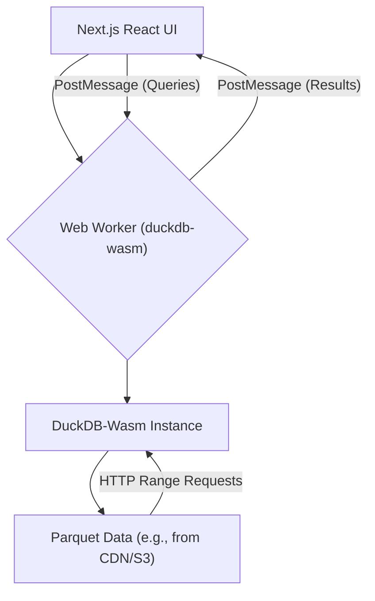

DuckDB-Wasm enables analytical SQL workloads directly within the browser, leveraging WebAssembly for near-native performance. This guide details its integration into Next.js, focusing on querying multi-megabyte Parquet files client-side, managing Web Workers, and constructing an interactive dashboard without backend compute.

<AudioPlayer src="/static/audio/duckdb-wasm-in-browser-analytics.mp3" title="Executive Audio Briefing" />


## Architectural Overview

Client-side analytics with DuckDB-Wasm fundamentally shifts the data processing paradigm. Instead of transmitting raw data to a backend for SQL execution, the data remains local, and the SQL engine runs in the browser. This architecture offers several advantages: reduced network latency, eliminated backend compute costs, and enhanced data privacy.

The core components are:

1.  **DuckDB-Wasm:** The SQL engine, compiled to WebAssembly, running in a Web Worker.
2.  **Web Workers:** Isolate DuckDB-Wasm operations from the main UI thread, preventing freezes.
3.  **Next.js React Components:** Provide the user interface for data visualization and interaction.
4.  **Parquet Files:** Efficient columnar storage format, ideal for analytical queries and direct loading into DuckDB.



## Setting Up DuckDB-Wasm in Next.js

We'll establish a dedicated Web Worker for DuckDB operations. This is critical for maintaining UI responsiveness, especially when dealing with large datasets or complex queries.

### Project Setup

First, install the necessary packages:

```bash
npm install @duckdb/duckdb-wasm @duckdb/duckdb-wasm-shell react-chartjs-2 chart.js
npm install -D worker-loader # For Next.js custom webpack config
```

### Next.js Webpack Configuration

Next.js requires a custom Webpack configuration to handle Web Workers. Create `next.config.mjs`:

```javascript
// next.config.mjs
import { fileURLToPath } from 'url';
import { dirname } from 'path';

const __filename = fileURLToPath(import.meta.url);
const __dirname = dirname(__filename);

/** @type {import('next').NextConfig} */
const nextConfig = {
  webpack: (config, { isServer, webpack }) => {
    // DuckDB-Wasm requires specific asset handling
    config.experiments = { ...config.experiments,
      asyncWebAssembly: true,
      topLevelAwait: true,
      layers: true
    };

    // Configure worker-loader for our DuckDB worker
    config.module.rules.unshift({
      test: /\.worker\.ts$/,
      loader: 'worker-loader',
      options: {
        filename: 'static/[hash].worker.js', // Output worker to static directory
        publicPath: '/_next/', // Ensure correct public path for worker
      },
    });

    // DuckDB-Wasm specific configuration for WASM files
    config.module.rules.push({
      test: /\.wasm$/,
      type: 'asset/resource',
      generator: {
        filename: 'static/wasm/[name].[hash][ext]',
      },
    });

    // Ensure DuckDB-Wasm can find its worker files
    config.plugins.push(
      new webpack.DefinePlugin({
        'process.env.DUCKDB_RUNTIME_URL': JSON.stringify('/_next/static/wasm/duckdb-mvp.wasm'),
        'process.env.DUCKDB_RUNTIME_WORKER_URL': JSON.stringify('/_next/static/wasm/duckdb-browser-mvp.worker.js'),
      })
    );

    return config;
  },
};

export default nextConfig;
```

### The DuckDB Web Worker

Create `src/workers/duckdb.worker.ts`. This worker will initialize DuckDB and expose a message-passing API.

```typescript
// src/workers/duckdb.worker.ts
import * as duckdb from '@duckdb/duckdb-wasm';
import { AsyncDuckDB, DuckDBDataProtocol, ConsoleLogger } from '@duckdb/duckdb-wasm';

// Define the DuckDB-Wasm bundle
const DUCKDB_BUNDLES = {
  mvp: {
    mainModule: '/_next/static/wasm/duckdb-mvp.wasm',
    mainWorker: '/_next/static/wasm/duckdb-browser-mvp.worker.js',
  },
  eh: {
    mainModule: '/_next/static/wasm/duckdb-eh.wasm',
    mainWorker: '/_next/static/wasm/duckdb-browser-eh.worker.js',
  },
};

let db: AsyncDuckDB | null = null;
let conn: duckdb.AsyncDuckDBConnection | null = null;

// Function to initialize DuckDB
async function initializeDuckDB() {
  if (db) return; // Already initialized

  const bundle = await duckdb.selectBundle(DUCKDB_BUNDLES);
  const worker = new Worker(bundle.mainWorker!);

  // Use the custom logger to see DuckDB logs in the worker console
  db = new AsyncDuckDB(new ConsoleLogger(), worker);
  await db.instantiate(bundle.mainModule, bundle.pthreadWorker);
  conn = await db.connect();
  console.log('DuckDB-Wasm initialized in worker.');
}

// Handle messages from the main thread
self.onmessage = async (event: MessageEvent) => {
  const { id, type, payload } = event.data;

  try {
    if (type === 'INIT') {
      await initializeDuckDB();
      self.postMessage({ id, type: 'INIT_SUCCESS' });
    } else if (type === 'QUERY') {
      if (!conn) throw new Error('DuckDB not initialized.');
      const { query, params } = payload;
      console.log(`Executing query: ${query}`);

      // Example: Register a Parquet file if needed
      // For this example, we assume the Parquet file is already accessible via HTTP
      // or registered in a previous step.
      // If you need to register a file from a URL:
      // await db.registerFileURL('my_data.parquet', payload.parquetUrl, DuckDBDataProtocol.HTTP, false);

      const result = await conn.query(query, params);
      self.postMessage({ id, type: 'QUERY_SUCCESS', payload: result.toArray() });
    } else if (type === 'REGISTER_PARQUET_URL') {
      if (!db) throw new Error('DuckDB not initialized.');
      const { name, url } = payload;
      await db.registerFileURL(name, url, DuckDBDataProtocol.HTTP, false);
      console.log(`Registered Parquet file: ${name} from ${url}`);
      self.postMessage({ id, type: 'REGISTER_PARQUET_URL_SUCCESS' });
    } else {
      throw new Error(`Unknown message type: ${type}`);
    }
  } catch (error: any) {
    console.error('DuckDB Worker Error:', error);
    self.postMessage({ id, type: 'ERROR', payload: error.message });
  }
};
```

### React Hook for Worker Communication

Create `src/hooks/useDuckDB.ts` to abstract worker communication.

```typescript
// src/hooks/useDuckDB.ts
import { useEffect, useState, useRef, useCallback } from 'react';
import { v4 as uuidv4 } from 'uuid';

// Define message types for communication
interface WorkerMessage {
  id: string;
  type: string;
  payload?: any;
}

interface QueryResult {
  [key: string]: any;
}

export function useDuckDB() {
  const [isReady, setIsReady] = useState(false);
  const [error, setError] = useState<string | null>(null);
  const workerRef = useRef<Worker | null>(null);
  const messageCallbacks = useRef<Map<string, (result: any) => void>>(new Map());

  useEffect(() => {
    // Dynamically import the worker to avoid issues with Next.js SSR
    // This assumes your worker is built by webpack and accessible via a URL
    // The `worker-loader` plugin handles this.
    workerRef.current = new Worker(new URL('../workers/duckdb.worker.ts', import.meta.url));

    const worker = workerRef.current;

    worker.onmessage = (event: MessageEvent<WorkerMessage>) => {
      const { id, type, payload } = event.data;
      if (type === 'INIT_SUCCESS') {
        setIsReady(true);
      } else if (type === 'ERROR') {
        setError(payload);
        const callback = messageCallbacks.current.get(id);
        if (callback) {
          callback(new Error(payload)); // Propagate error to specific call
          messageCallbacks.current.delete(id);
        }
      } else {
        const callback = messageCallbacks.current.get(id);
        if (callback) {
          callback(payload);
          messageCallbacks.current.delete(id);
        }
      }
    };

    worker.onerror = (err) => {
      console.error('DuckDB Worker Error:', err);
      setError('Worker encountered an error.');
    };

    // Initialize the worker
    worker.postMessage({ id: uuidv4(), type: 'INIT' });

    return () => {
      worker.terminate();
      workerRef.current = null;
    };
  }, []);

  const sendWorkerMessage = useCallback((type: string, payload?: any): Promise<any> => {
    return new Promise((resolve, reject) => {
      if (!workerRef.current) {
        return reject(new Error('DuckDB worker not initialized.'));
      }
      const id = uuidv4();
      messageCallbacks.current.set(id, (result: any) => {
        if (result instanceof Error) {
          reject(result);
        } else {
          resolve(result);
        }
      });
      workerRef.current.postMessage({ id, type, payload });
    });
  }, []);

  const query = useCallback(async (sql: string, params?: any[]): Promise<QueryResult[]> => {
    if (!isReady) throw new Error('DuckDB is not ready.');
    return sendWorkerMessage('QUERY', { query: sql, params });
  }, [isReady, sendWorkerMessage]);

  const registerParquetUrl = useCallback(async (name: string, url: string): Promise<void> => {
    if (!isReady) throw new Error('DuckDB is not ready.');
    return sendWorkerMessage('REGISTER_PARQUET_URL', { name, url });
  }, [isReady, sendWorkerMessage]);

  return { isReady, error, query, registerParquetUrl };
}
```

## Querying 10 Million Rows: An Interactive Dashboard Example

We'll create a simple dashboard to visualize data from a large Parquet file. For demonstration, assume a Parquet file named `sales_data_10m.parquet` is available via a public URL (e.g., a CDN or S3 bucket). This file contains 10 million rows of sales data with columns like `product_category`, `sale_date`, and `revenue`.

### Example Parquet Data Generation (Optional)

To generate a sample Parquet file with 10 million rows:

```python
import pandas as pd
import numpy as np
from datetime import datetime, timedelta

num_rows = 10_000_000

# Generate synthetic data
data = {
    'sale_id': np.arange(num_rows),
    'product_category': np.random.choice(['Electronics', 'Clothing', 'Home Goods', 'Books', 'Food'], num_rows),
    'revenue': np.random.uniform(10, 1000, num_rows).round(2),
    'units_sold': np.random.randint(1, 10, num_rows),
    'sale_date': [datetime(2023, 1, 1) + timedelta(days=np.random.randint(0, 365)) for _ in range(num_rows)],
    'region': np.random.choice(['North', 'South', 'East', 'West'], num_rows),
}

df = pd.DataFrame(data)

# Save to Parquet
df.to_parquet('public/sales_data_10m.parquet', index=False)
print(f"Generated sales_data_10m.parquet with {num_rows} rows.")
```

Place this `sales_data_10m.parquet` file in your Next.js `public` directory, or host it on a CDN.

### Dashboard Component

Create `src/app/page.tsx` (for App Router) or `src/pages/index.tsx` (for Pages Router).

```tsx
// src/app/page.tsx
'use client'; // Mark as client component for Next.js App Router

import { useEffect, useState, useMemo } from 'react';
import { useDuckDB } from '../hooks/useDuckDB';
import { Bar, Line } from 'react-chartjs-2';
import {
  Chart as ChartJS,
  CategoryScale,
  LinearScale,
  BarElement,
  Title,
  Tooltip,
  Legend,
  PointElement,
  LineElement,
} from 'chart.js';

// Register Chart.js components
ChartJS.register(
  CategoryScale,
  LinearScale,
  BarElement,
  Title,
  Tooltip,
  Legend,
  PointElement,
  LineElement
);

interface SalesByCategory {
  product_category: string;
  total_revenue: number;
}

interface DailySales {
  sale_date: string; // DuckDB returns dates as strings by default
  daily_revenue: number;
}

export default function Home() {
  const { isReady, error, query, registerParquetUrl } = useDuckDB();
  const [categoryData, setCategoryData] = useState<SalesByCategory[]>([]);
  const [dailyData, setDailyData] = useState<DailySales[]>([]);
  const [loading, setLoading] = useState(true);
  const [totalRows, setTotalRows] = useState<number | null>(null);

  const PARQUET_FILE_URL = '/sales_data_10m.parquet'; // Adjust if hosted externally
  const PARQUET_FILE_NAME = 'sales_data_10m.parquet';

  useEffect(() => {
    const loadData = async () => {
      if (isReady) {
        setLoading(true);
        try {
          // Register the Parquet file URL with DuckDB
          await registerParquetUrl(PARQUET_FILE_NAME, PARQUET_FILE_URL);
          console.log('Parquet file registered.');

          // Count total rows
          const countResult = await query(`SELECT COUNT(*) as total_rows FROM "${PARQUET_FILE_NAME}"`);
          setTotalRows(countResult[0]?.total_rows || 0);

          // Query 1: Total Revenue by Product Category
          const categoryResults = await query(`
            SELECT
              product_category,
              SUM(revenue) AS total_revenue
            FROM "${PARQUET_FILE_NAME}"
            GROUP BY product_category
            ORDER BY total_revenue DESC
          `);
          setCategoryData(categoryResults as SalesByCategory[]);
          console.log('Category data fetched:', categoryResults);

          // Query 2: Daily Revenue Trend
          const dailyResults = await query(`
            SELECT
              STRFTIME(sale_date, '%Y-%m-%d') AS sale_date,
              SUM(revenue) AS daily_revenue
            FROM "${PARQUET_FILE_NAME}"
            GROUP BY STRFTIME(sale_date, '%Y-%m-%d')
            ORDER BY sale_date ASC
          `);
          setDailyData(dailyResults as DailySales[]);
          console.log('Daily data fetched:', dailyResults);

        } catch (err: any) {
          console.error('Failed to query DuckDB:', err);
          setError(err.message);
        } finally {
          setLoading(false);
        }
      }
    };
    loadData();
  }, [isReady, query, registerParquetUrl, setError]);

  const categoryChartData = useMemo(() => ({
    labels: categoryData.map(d => d.product_category),
    datasets: [
      {
        label: 'Total Revenue',
        data: categoryData.map(d => d.total_revenue),
        backgroundColor: 'rgba(75, 192, 192, 0.6)',
        borderColor: 'rgba(75, 192, 192, 1)',
        borderWidth: 1,
      },
    ],
  }), [categoryData]);

  const dailyChartData = useMemo(() => ({
    labels: dailyData.map(d => d.sale_date),
    datasets: [
      {
        label: 'Daily Revenue',
        data: dailyData.map(d => d.daily_revenue),
        fill: false,
        backgroundColor: 'rgba(153, 102, 255, 0.6)',
        borderColor: 'rgba(153, 102, 255, 1)',
        tension: 0.1,
      },
    ],
  }), [dailyData]);

  if (error) {
    return <div className="p-4 text-red-600">Error: {error}</div>;
  }

  if (!isReady || loading) {
    return <div className="p-4">Loading DuckDB and data... This may take a moment for large files.</div>;
  }

  return (
    <div className="container mx-auto p-4">
      <h1 className="text-3xl font-bold mb-6">Client-Side Sales Dashboard (10M Rows)</h1>
      <p className="mb-4">
        Powered by DuckDB-Wasm. Total rows processed: <span className="font-bold">{totalRows?.toLocaleString()}</span>
      </p>

      <div className="grid grid-cols-1 md:grid-cols-2 gap-8">
        <div className="bg-white p-6 rounded-lg shadow-md">
          <h2 className="text-xl font-semibold mb-4">Revenue by Product Category</h2>
          <Bar data={categoryChartData} options={{ responsive: true, maintainAspectRatio: false }} />
        </div>
        <div className="bg-white p-6 rounded-lg shadow-md">
          <h2 className="text-xl font-semibold mb-4">Daily Revenue Trend</h2>
          <Line data={dailyChartData} options={{ responsive: true, maintainAspectRatio: false }} />
        </div>
      </div>
    </div>
  );
}
```

This example demonstrates:
*   **Lazy Initialization:** DuckDB is initialized only once in the worker.
*   **Asynchronous Queries:** All queries are `await`ed, and results are passed back to the main thread.
*   **Parquet File Registration:** The `registerParquetUrl` function makes the remote Parquet file accessible to DuckDB. DuckDB-Wasm uses HTTP Range Requests to fetch only necessary parts of the file, optimizing network usage.
*   **Interactive Visualization:** `react-chartjs-2` is used to render charts based on the query results.

## Performance Considerations and Tradeoffs

| Feature / Aspect       | DuckDB-Wasm (Client-Side)                               | Traditional Backend DB (Server-Side)                                  |
| :--------------------- | :------------------------------------------------------ | :-------------------------------------------------------------------- |
| **Data Locality**      | Data processed directly in browser.                     | Data resides on server, processed remotely.                           |
| **Network Latency**    | Minimal after initial data load (HTTP Range Requests).  | High for each query, data transfer over network.                      |
| **Compute Cost**       | Zero backend compute. Uses client CPU/RAM.              | Server-side compute costs (CPU, RAM, I/O).                            |
| **Scalability**        | Scales with client devices. Limited by client resources. | Scales with server infrastructure.                                    |
| **Data Volume**        | Practical for 10s-100s of MBs, up to GBs (with care).   | Handles TBs-PBs easily.                                               |
| **Initial Load Time**  | Can be higher due to WASM module download & data indexing. | Lower for initial page load, but data fetching adds latency.          |
| **Security/Privacy**   | Data never leaves client. High privacy.                 | Data transmitted to server. Requires robust server-side security.     |
| **Offline Capability** | Possible with Service Workers caching data.             | Generally requires online connection.                                 |
| **Complexity**         | Web Worker management, WASM specifics.                  | Database administration, connection pooling, ORMs.                    |
| **Query Language**     | Full SQL (DuckDB dialect).                              | Full SQL (specific DB dialect).                                       |

### WebAssembly Memory Limits

DuckDB-Wasm operates within the browser's WebAssembly memory limits. While modern browsers allow for several gigabytes of WASM memory, excessive data loading can lead to out-of-memory errors.

*   **Strategy:** DuckDB's ability to query Parquet files directly via HTTP Range Requests is crucial. It avoids loading the entire file into memory. Only the necessary columns and row groups are fetched and processed.
*   **Monitoring:** Observe browser memory usage in developer tools. If memory spikes, optimize queries or consider pre-aggregating data.
*   **Error Handling:** Implement robust error handling for `QUERY_ERROR` messages from the worker, which might indicate memory pressure.

## Production Gotchas & Troubleshooting

1.  **`Failed to load module: No such file or directory` (WASM/Worker files):**
    *   **Symptom:** Browser console shows errors like `GET /_next/static/wasm/duckdb-mvp.wasm 404 (Not Found)`.
    *   **Cause:** Next.js Webpack configuration is incorrect, or the `publicPath` for the worker/WASM assets is misconfigured.
    *   **Fix:** Double-check `next.config.mjs`. Ensure `asset/resource` rule for `.wasm` files and `worker-loader` for `.worker.ts` files are correctly configured. The `DUCKDB_RUNTIME_URL` and `DUCKDB_RUNTIME_WORKER_URL` `DefinePlugin` entries must point to the correct paths where Next.js serves these assets. Verify the actual output paths in your `.next` directory after building.

2.  **UI Freezes during Query Execution:**
    *   **Symptom:** The browser tab becomes unresponsive when a query is running, even with a Web Worker.
    *   **Cause:** Incorrect worker setup, or accidentally running DuckDB operations on the main thread.
    *   **Fix:** Ensure all DuckDB initialization and query execution happens *exclusively* within the Web Worker. The `useDuckDB` hook and `duckdb.worker.ts` are designed for this. If you're using `duckdb-wasm` directly in a React component, you're doing it wrong.

3.  **`Out of Memory` or `WebAssembly.Memory` allocation errors:**
    *   **Symptom:** Browser console shows WASM memory allocation failures, especially with very large datasets or complex joins.
    *   **Cause:** Querying too much data at once, or DuckDB attempting to load an entire large Parquet file into WASM memory when it shouldn't.
    *   **Fix:**
        *   **Optimize Queries:** Use `LIMIT` clauses, `GROUP BY` to aggregate, and `SELECT` only necessary columns.
        *   **Parquet Structure:** Ensure your Parquet files are well-partitioned and have appropriate row group sizes. DuckDB-Wasm leverages these for efficient range requests.
        *   **Data Types:** Use efficient data types in Parquet.
        *   **Pre-aggregation:** For extremely large datasets, consider pre-aggregating some data on the server if client-side memory is a persistent bottleneck.
        *   **Browser Limits:** Be aware that browser WASM memory limits can vary.

4.  **`TypeError: Cannot read properties of undefined (reading 'connect')`:**
    *   **Symptom:** Occurs when trying to call `conn.query()` or similar methods.
    *   **Cause:** The `AsyncDuckDB` instance or `AsyncDuckDBConnection` was not properly initialized or is `null` when a query is attempted.
    *   **Fix:** Ensure the `initializeDuckDB` function in the worker completes successfully before any `QUERY` messages are sent. The `isReady` state in `useDuckDB` is designed to prevent this; ensure you're waiting for `isReady` to be `true`.

5.  **CORS Issues with Parquet Files:**
    *   **Symptom:** `Failed to fetch` or CORS errors when `registerFileURL` attempts to access a Parquet file from a different origin.
    *   **Cause:** The server hosting the Parquet file does not send appropriate CORS headers (`Access-Control-Allow-Origin`).
    *   **Fix:** Configure the server (e.g., S3 bucket policy, CDN settings) to allow CORS requests from your Next.js application's origin. Specifically, `Range` headers might also need to be allowed for efficient Parquet fetching.


## Test Your Knowledge

<Quiz questions={
  [
    {
      "question": "A development team is building a client-side analytics dashboard using DuckDB-Wasm in Next.js. They observe that complex queries or large data loads occasionally cause the browser tab to become unresponsive for several seconds. Which architectural decision, if overlooked, is the most likely cause of this issue?",
      "options": [
        "Storing Parquet files on a CDN instead of directly embedding them in the Next.js bundle.",
        "Using `react-chartjs-2` for visualizations instead of a more lightweight charting library.",
        "Executing DuckDB-Wasm operations directly on the main UI thread.",
        "Not pre-loading all necessary DuckDB-Wasm modules during application initialization."
      ],
      "correctAnswer": 2,
      "explanation": "The article explicitly states, 'Web Workers: Isolate DuckDB-Wasm operations from the main UI thread, preventing freezes.' If DuckDB-Wasm operations, especially complex queries or large data loads, are run on the main UI thread, they will block it, leading to an unresponsive browser tab. Web Workers are crucial for offloading these computationally intensive tasks."
    },
    {
      "question": "When integrating DuckDB-Wasm into a Next.js application, the article highlights the need for specific Webpack configurations. What is the primary reason for these custom configurations, particularly regarding `.worker.ts` and `.wasm` files?",
      "options": [
        "To enable server-side rendering (SSR) of DuckDB-Wasm queries for faster initial page loads.",
        "To ensure that WebAssembly modules and Web Workers are correctly bundled and served as static assets by Next.js.",
        "To optimize the DuckDB-Wasm engine for specific browser environments like Safari or Firefox.",
        "To automatically transpile SQL queries into JavaScript for execution without DuckDB-Wasm."
      ],
      "correctAnswer": 1,
      "explanation": "The `next.config.mjs` example shows custom rules for `worker-loader` for `.worker.ts` files and `type: 'asset/resource'` for `.wasm` files. This is necessary because Webpack, by default, might not know how to correctly process and serve these specialized file types (Web Workers and WebAssembly binaries) as static assets that DuckDB-Wasm needs at runtime. The configurations ensure they are properly outputted to static directories and accessible via correct public paths."
    }
  ]
} />


## Frequently Asked Questions

### Q1: Can DuckDB-Wasm handle real-time data updates?

A1: DuckDB-Wasm is primarily designed for analytical queries on static or slowly changing datasets. While you can re-register files or load new data, it doesn't have built-in mechanisms for real-time streaming updates like a traditional OLTP database. For real-time dashboards, you'd typically fetch new data, potentially as new Parquet files, and re-run queries.

### Q2: How do I persist DuckDB-Wasm data across browser sessions?

A2: DuckDB-Wasm can be configured to use an `IDBBatchAtomicVFS` (IndexedDB-backed file system) for persistence. This allows the database state and registered files to be stored in IndexedDB, surviving browser refreshes or closures. You would configure this during `AsyncDuckDB` instantiation in your worker.

```typescript
// Example for persistence in duckdb.worker.ts
import { AsyncDuckDB, DuckDBDataProtocol, ConsoleLogger, IDBBatchAtomicVFS } from '@duckdb/duckdb-wasm';

// ... inside initializeDuckDB()
const bundle = await duckdb.selectBundle(DUCKDB_BUNDLES);
const worker = new Worker(bundle.mainWorker!);

// Initialize VFS for persistence
const vfs = new IDBBatchAtomicVFS('duckdb-data'); // 'duckdb-data' is the database name
db = new AsyncDuckDB(new ConsoleLogger(), worker);
await db.instantiate(bundle.mainModule, bundle.pthreadWorker, {
  query: {
    'duckdb-data': vfs, // Register the VFS
  },
});
conn = await db.connect();
// Now you can use 'ATTACH 'duckdb-data';' and 'CREATE TABLE ... IN 'duckdb-data';'
// or 'COPY ... TO 'duckdb-data'/my_table.parquet (FORMAT PARQUET);'
```

### Q3: What are the limitations of DuckDB-Wasm compared to a server-side DuckDB instance?

A3: The primary limitations are:
1.  **Memory:** Constrained by browser WebAssembly memory limits (typically 2-4GB, but can be higher). Server-side DuckDB can use all available system RAM.
2.  **CPU:** Relies on client CPU, which varies greatly. Server-side can leverage powerful multi-core CPUs.
3.  **I/O:** Browser I/O is generally slower than server-side disk I/O, though HTTP Range Requests mitigate this for remote files.
4.  **Concurrency:** Web Workers provide parallelism, but a single DuckDB instance within a worker is single-threaded for query execution (though it can offload I/O). Pthread builds of DuckDB-Wasm can leverage multiple cores within a worker, but this is more complex to set up.

### Q4: Can I use DuckDB-Wasm with local files (e.g., from an `<input type="file">`)?

A4: Yes, absolutely. You can read a `File` object (from a file input) using `FileReader` or `File.arrayBuffer()` and then register it with DuckDB-Wasm using `db.registerFileBuffer()`.

```typescript
// In your worker:
// ...
else if (type === 'REGISTER_FILE_BUFFER') {
  if (!db) throw new Error('DuckDB not initialized.');
  const { name, buffer } = payload; // buffer would be an ArrayBuffer
  await db.registerFileBuffer(name, new Uint8Array(buffer));
  console.log(`Registered file buffer: ${name}`);
  self.postMessage({ id, type: 'REGISTER_FILE_BUFFER_SUCCESS' });
}
// ...

// In your React component:
const handleFileChange = async (event: React.ChangeEvent<HTMLInputElement>) => {
  const file = event.target.files?.[0];
  if (file) {
    const arrayBuffer = await file.arrayBuffer();
    await sendWorkerMessage('REGISTER_FILE_BUFFER', { name: file.name, buffer: arrayBuffer });
    // Now you can query the file by its name
    const result = await query(`SELECT COUNT(*) FROM "${file.name}"`);
    console.log('Local file count:', result);
  }
};

// ... in JSX
<input type="file" onChange={handleFileChange} accept=".parquet" />
```
