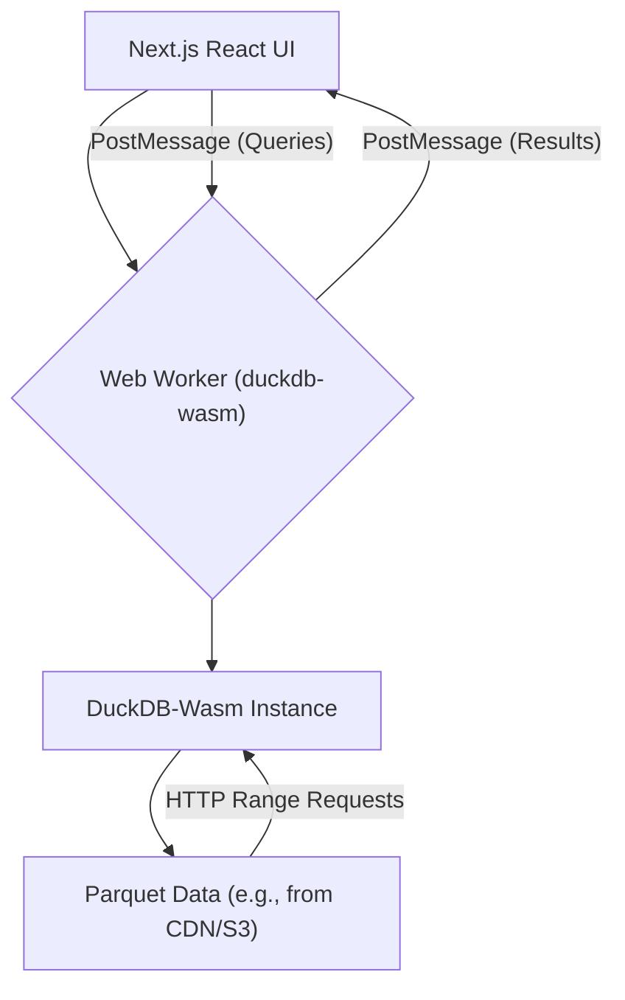

DuckDB-Wasmは、WebAssemblyを活用してブラウザ内でほぼネイティブなパフォーマンスで分析SQLワークロードを可能にします。このガイドでは、Next.jsへの統合について詳しく説明し、数メガバイトのParquetファイルをクライアント側でクエリする方法、Web Workerの管理、バックエンドの計算なしでインタラクティブなダッシュボードを構築する方法に焦点を当てます。

<AudioPlayer src="/static/audio/duckdb-wasm-in-browser-analytics-ja.mp3" title="音声エグゼクティブ・ブリーフィング" voice="Google Cloud ja-JP-Neural2-B" />


## アーキテクチャの概要

DuckDB-Wasmによるクライアントサイド分析は、データ処理のパラダイムを根本的に変えます。SQL実行のために生データをバックエンドに送信する代わりに、データはローカルに保持され、SQLエンジンはブラウザ内で実行されます。このアーキテクチャには、ネットワーク遅延の削減、バックエンド計算コストの排除、データプライバシーの強化など、いくつかの利点があります。

主要なコンポーネントは次のとおりです。

1.  **DuckDB-Wasm:** WebAssemblyにコンパイルされ、Web Workerで実行されるSQLエンジン。
2.  **Web Workers:** DuckDB-Wasmの操作をメインのUIスレッドから分離し、フリーズを防ぎます。
3.  **Next.js Reactコンポーネント:** データ視覚化とインタラクションのためのユーザーインターフェースを提供します。
4.  **Parquetファイル:** 効率的なカラム型ストレージ形式で、分析クエリやDuckDBへの直接ロードに最適です。



## Next.jsでのDuckDB-Wasmのセットアップ

DuckDB操作専用のWeb Workerを確立します。これは、特に大規模なデータセットや複雑なクエリを扱う際に、UIの応答性を維持するために不可欠です。

### プロジェクトのセットアップ

まず、必要なパッケージをインストールします。

```bash
npm install @duckdb/duckdb-wasm @duckdb/duckdb-wasm-shell react-chartjs-2 chart.js
npm install -D worker-loader # For Next.js custom webpack config
```

### Next.js Webpack設定

Next.jsは、Web Workerを処理するためにカスタムのWebpack設定を必要とします。`next.config.mjs`を作成します。

```javascript
// next.config.mjs
import { fileURLToPath } from 'url';
import { dirname } from 'path';

const __filename = fileURLToPath(import.meta.url);
const __dirname = dirname(__filename);

/** @type {import('next').NextConfig} */
const nextConfig = {
  webpack: (config, { isServer, webpack }) => {
    // DuckDB-Wasm requires specific asset handling
    config.experiments = { ...config.experiments,
      asyncWebAssembly: true,
      topLevelAwait: true,
      layers: true
    };

    // Configure worker-loader for our DuckDB worker
    config.module.rules.unshift({
      test: /\.worker\.ts$/,
      loader: 'worker-loader',
      options: {
        filename: 'static/[hash].worker.js', // Output worker to static directory
        publicPath: '/_next/', // Ensure correct public path for worker
      },
    });

    // DuckDB-Wasm specific configuration for WASM files
    config.module.rules.push({
      test: /\.wasm$/,
      type: 'asset/resource',
      generator: {
        filename: 'static/wasm/[name].[hash][ext]',
      },
    });

    // Ensure DuckDB-Wasm can find its worker files
    config.plugins.push(
      new webpack.DefinePlugin({
        'process.env.DUCKDB_RUNTIME_URL': JSON.stringify('https://cdn.jsdelivr.net/npm/@duckdb/duckdb-wasm@1.28.0/dist/duckdb-mvp.wasm'),
        'process.env.DUCKDB_RUNTIME_WORKER_URL': JSON.stringify('https://cdn.jsdelivr.net/npm/@duckdb/duckdb-wasm@1.28.0/dist/duckdb-browser-mvp.worker.js'),
      })
    );

    return config;
  },
};

export default nextConfig;
```

### DuckDB Web Worker

`src/workers/duckdb.worker.ts`を作成します。このワーカーはDuckDBを初期化し、メッセージパッシングAPIを公開します。

```typescript
// src/workers/duckdb.worker.ts
import * as duckdb from '@duckdb/duckdb-wasm';
import { AsyncDuckDB, DuckDBDataProtocol, ConsoleLogger } from '@duckdb/duckdb-wasm';

// Define the DuckDB-Wasm bundle
const DUCKDB_BUNDLES = {
  mvp: {
    mainModule: 'https://cdn.jsdelivr.net/npm/@duckdb/duckdb-wasm@1.28.0/dist/duckdb-mvp.wasm',
    mainWorker: 'https://cdn.jsdelivr.net/npm/@duckdb/duckdb-wasm@1.28.0/dist/duckdb-browser-mvp.worker.js',
  },
  eh: {
    mainModule: 'https://cdn.jsdelivr.net/npm/@duckdb/duckdb-wasm@1.28.0/dist/duckdb-eh.wasm',
    mainWorker: 'https://cdn.jsdelivr.net/npm/@duckdb/duckdb-wasm@1.28.0/dist/duckdb-browser-eh.worker.js',
  },
};

let db: AsyncDuckDB | null = null;
let conn: duckdb.AsyncDuckDBConnection | null = null;

// Function to initialize DuckDB
async function initializeDuckDB() {
  if (db) return; // Already initialized

  const bundle = await duckdb.selectBundle(DUCKDB_BUNDLES);
  const worker = new Worker(bundle.mainWorker!);

  // Use the custom logger to see DuckDB logs in the worker console
  db = new AsyncDuckDB(new ConsoleLogger(), worker);
  await db.instantiate(bundle.mainModule, bundle.pthreadWorker);
  conn = await db.connect();
  console.log('DuckDB-Wasm initialized in worker.');
}

// Handle messages from the main thread
self.onmessage = async (event: MessageEvent) => {
  const { id, type, payload } = event.data;

  try {
    if (type === 'INIT') {
      await initializeDuckDB();
      self.postMessage({ id, type: 'INIT_SUCCESS' });
    } else if (type === 'QUERY') {
      if (!conn) throw new Error('DuckDB not initialized.');
      const { query, params } = payload;
      console.log(`Executing query: ${query}`);

      // Example: Register a Parquet file if needed
      // For this example, we assume the Parquet file is already accessible via HTTP
      // or registered in a previous step.
      // If you need to register a file from a URL:
      // await db.registerFileURL('my_data.parquet', payload.parquetUrl, DuckDBDataProtocol.HTTP, false);

      const result = await conn.query(query, params);
      self.postMessage({ id, type: 'QUERY_SUCCESS', payload: result.toArray() });
    } else if (type === 'REGISTER_PARQUET_URL') {
      if (!db) throw new Error('DuckDB not initialized.');
      const { name, url } = payload;
      await db.registerFileURL(name, url, DuckDBDataProtocol.HTTP, false);
      console.log(`Registered Parquet file: ${name} from ${url}`);
      self.postMessage({ id, type: 'REGISTER_PARQUET_URL_SUCCESS' });
    } else {
      throw new Error(`Unknown message type: ${type}`);
    }
  } catch (error: any) {
    console.error('DuckDB Worker Error:', error);
    self.postMessage({ id, type: 'ERROR', payload: error.message });
  }
};
```

### Worker通信のためのReact Hook

ワーカー通信を抽象化するために`src/hooks/useDuckDB.ts`を作成します。

```typescript
// src/hooks/useDuckDB.ts
import { useEffect, useState, useRef, useCallback } from 'react';
import { v4 as uuidv4 } from 'uuid';

// Define message types for communication
interface WorkerMessage {
  id: string;
  type: string;
  payload?: any;
}

interface QueryResult {
  [key: string]: any;
}

export function useDuckDB() {
  const [isReady, setIsReady] = useState(false);
  const [error, setError] = useState<string | null>(null);
  const workerRef = useRef<Worker | null>(null);
  const messageCallbacks = useRef<Map<string, (result: any) => void>>(new Map());

  useEffect(() => {
    // Dynamically import the worker to avoid issues with Next.js SSR
    // This assumes your worker is built by webpack and accessible via a URL
    // The `worker-loader` plugin handles this.
    workerRef.current = new Worker(new URL('../workers/duckdb.worker.ts', import.meta.url));

    const worker = workerRef.current;

    worker.onmessage = (event: MessageEvent<WorkerMessage>) => {
      const { id, type, payload } = event.data;
      if (type === 'INIT_SUCCESS') {
        setIsReady(true);
      } else if (type === 'ERROR') {
        setError(payload);
        const callback = messageCallbacks.current.get(id);
        if (callback) {
          callback(new Error(payload)); // Propagate error to specific call
          messageCallbacks.current.delete(id);
        }
      } else {
        const callback = messageCallbacks.current.get(id);
        if (callback) {
          callback(payload);
          messageCallbacks.current.delete(id);
        }
      }
    };

    worker.onerror = (err) => {
      console.error('DuckDB Worker Error:', err);
      setError('Worker encountered an error.');
    };

    // Initialize the worker
    worker.postMessage({ id: uuidv4(), type: 'INIT' });

    return () => {
      worker.terminate();
      workerRef.current = null;
    };
  }, []);

  const sendWorkerMessage = useCallback((type: string, payload?: any): Promise<any> => {
    return new Promise((resolve, reject) => {
      if (!workerRef.current) {
        return reject(new Error('DuckDB worker not initialized.'));
      }
      const id = uuidv4();
      messageCallbacks.current.set(id, (result: any) => {
        if (result instanceof Error) {
          reject(result);
        } else {
          resolve(result);
        }
      });
      workerRef.current.postMessage({ id, type, payload });
    });
  }, []);

  const query = useCallback(async (sql: string, params?: any[]): Promise<QueryResult[]> => {
    if (!isReady) throw new Error('DuckDB is not ready.');
    return sendWorkerMessage('QUERY', { query: sql, params });
  }, [isReady, sendWorkerMessage]);

  const registerParquetUrl = useCallback(async (name: string, url: string): Promise<void> => {
    if (!isReady) throw new Error('DuckDB is not ready.');
    return sendWorkerMessage('REGISTER_PARQUET_URL', { name, url });
  }, [isReady, sendWorkerMessage]);

  return { isReady, error, query, registerParquetUrl };
}
```

## 1,000万行のクエリ: インタラクティブダッシュボードの例

大規模なParquetファイルからデータを視覚化するためのシンプルなダッシュボードを作成します。デモンストレーションのために、`sales_data_10m.parquet`という名前のParquetファイルが公開URL（CDNやS3バケットなど）経由で利用可能であると仮定します。このファイルには、`product_category`、`sale_date`、`revenue`などの列を持つ1,000万行の販売データが含まれています。

### Parquetデータ生成の例（オプション）

1,000万行のサンプルParquetファイルを生成するには：

```python
import pandas as pd
import numpy as np
from datetime import datetime, timedelta

num_rows = 10_000_000

# Generate synthetic data
data = {
    'sale_id': np.arange(num_rows),
    'product_category': np.random.choice(['Electronics', 'Clothing', 'Home Goods', 'Books', 'Food'], num_rows),
    'revenue': np.random.uniform(10, 1000, num_rows).round(2),
    'units_sold': np.random.randint(1, 10, num_rows),
    'sale_date': [datetime(2023, 1, 1) + timedelta(days=np.random.randint(0, 365)) for _ in range(num_rows)],
    'region': np.random.choice(['North', 'South', 'East', 'West'], num_rows),
}

df = pd.DataFrame(data)

# Save to Parquet
df.to_parquet('public/sales_data_10m.parquet', index=False)
print(f"Generated sales_data_10m.parquet with {num_rows} rows.")
```

この`sales_data_10m.parquet`ファイルをNext.jsの`public`ディレクトリに配置するか、CDNでホストします。

### ダッシュボードコンポーネント

`src/app/page.tsx`（App Router用）または`src/pages/index.tsx`（Pages Router用）を作成します。

```tsx
// src/app/page.tsx
'use client'; // Mark as client component for Next.js App Router

import { useEffect, useState, useMemo } from 'react';
import { useDuckDB } from '../hooks/useDuckDB';
import { Bar, Line } from 'react-chartjs-2';
import {
  Chart as ChartJS,
  CategoryScale,
  LinearScale,
  BarElement,
  Title,
  Tooltip,
  Legend,
  PointElement,
  LineElement,
} from 'chart.js';

// Register Chart.js components
ChartJS.register(
  CategoryScale,
  LinearScale,
  BarElement,
  Title,
  Tooltip,
  Legend,
  PointElement,
  LineElement
);

interface SalesByCategory {
  product_category: string;
  total_revenue: number;
}

interface DailySales {
  sale_date: string; // DuckDB returns dates as strings by default
  daily_revenue: number;
}

export default function Home() {
  const { isReady, error, query, registerParquetUrl } = useDuckDB();
  const [categoryData, setCategoryData] = useState<SalesByCategory[]>([]);
  const [dailyData, setDailyData] = useState<DailySales[]>([]);
  const [loading, setLoading] = useState(true);
  const [totalRows, setTotalRows] = useState<number | null>(null);

  const PARQUET_FILE_URL = '/sales_data_10m.parquet'; // Adjust if hosted externally
  const PARQUET_FILE_NAME = 'sales_data_10m.parquet';

  useEffect(() => {
    const loadData = async () => {
      if (isReady) {
        setLoading(true);
        try {
          // Register the Parquet file URL with DuckDB
          await registerParquetUrl(PARQUET_FILE_NAME, PARQUET_FILE_URL);
          console.log('Parquet file registered.');

          // Count total rows
          const countResult = await query(`SELECT COUNT(*) as total_rows FROM "${PARQUET_FILE_NAME}"`);
          setTotalRows(countResult[0]?.total_rows || 0);

          // Query 1: Total Revenue by Product Category
          const categoryResults = await query(`
            SELECT
              product_category,
              SUM(revenue) AS total_revenue
            FROM "${PARQUET_FILE_NAME}"
            GROUP BY product_category
            ORDER BY total_revenue DESC
          `);
          setCategoryData(categoryResults as SalesByCategory[]);
          console.log('Category data fetched:', categoryResults);

          // Query 2: Daily Revenue Trend
          const dailyResults = await query(`
            SELECT
              STRFTIME(sale_date, '%Y-%m-%d') AS sale_date,
              SUM(revenue) AS daily_revenue
            FROM "${PARQUET_FILE_NAME}"
            GROUP BY STRFTIME(sale_date, '%Y-%m-%d')
            ORDER BY sale_date ASC
          `);
          setDailyData(dailyResults as DailySales[]);
          console.log('Daily data fetched:', dailyResults);

        } catch (err: any) {
          console.error('Failed to query DuckDB:', err);
          setError(err.message);
        } finally {
          setLoading(false);
        }
      }
    };
    loadData();
  }, [isReady, query, registerParquetUrl, setError]);

  const categoryChartData = useMemo(() => ({
    labels: categoryData.map(d => d.product_category),
    datasets: [
      {
        label: 'Total Revenue',
        data: categoryData.map(d => d.total_revenue),
        backgroundColor: 'rgba(75, 192, 192, 0.6)',
        borderColor: 'rgba(75, 192, 192, 1)',
        borderWidth: 1,
      },
    ],
  }), [categoryData]);

  const dailyChartData = useMemo(() => ({
    labels: dailyData.map(d => d.sale_date),
    datasets: [
      {
        label: 'Daily Revenue',
        data: dailyData.map(d => d.daily_revenue),
        fill: false,
        backgroundColor: 'rgba(153, 102, 255, 0.6)',
        borderColor: 'rgba(153, 102, 255, 1)',
        tension: 0.1,
      },
    ],
  }), [dailyData]);

  if (error) {
    return <div className="p-4 text-red-600">Error: {error}</div>;
  }

  if (!isReady || loading) {
    return <div className="p-4">Loading DuckDB and data... This may take a moment for large files.</div>;
  }

  return (
    <div className="container mx-auto p-4">
      <h1 className="text-3xl font-bold mb-6">Client-Side Sales Dashboard (10M Rows)</h1>
      <p className="mb-4">
        Powered by DuckDB-Wasm. Total rows processed: <span className="font-bold">{totalRows?.toLocaleString()}</span>
      </p>

      <div className="grid grid-cols-1 md:grid-cols-2 gap-8">
        <div className="bg-white p-6 rounded-lg shadow-md">
          <h2 className="text-xl font-semibold mb-4">Revenue by Product Category</h2>
          <Bar data={categoryChartData} options={{ responsive: true, maintainAspectRatio: false }} />
        </div>
        <div className="bg-white p-6 rounded-lg shadow-md">
          <h2 className="text-xl font-semibold mb-4">Daily Revenue Trend</h2>
          <Line data={dailyChartData} options={{ responsive: true, maintainAspectRatio: false }} />
        </div>
      </div>
    </div>
  );
}
```

この例は以下を示しています。
*   **遅延初期化:** DuckDBはワーカー内で一度だけ初期化されます。
*   **非同期クエリ:** すべてのクエリは`await`され、結果はメインスレッドに渡されます。
*   **Parquetファイルの登録:** `registerParquetUrl`関数は、リモートのParquetファイルをDuckDBからアクセス可能にします。DuckDB-WasmはHTTP Range Requestsを使用して、ファイルの必要な部分のみをフェッチし、ネットワーク使用量を最適化します。
*   **インタラクティブな視覚化:** `react-chartjs-2`は、クエリ結果に基づいてチャートをレンダリングするために使用されます。

## パフォーマンスに関する考慮事項とトレードオフ

| 機能 / 側面          | DuckDB-Wasm（クライアントサイド）                               | 従来のバックエンドDB（サーバーサイド）                                  |
| :--------------------- | :------------------------------------------------------ | :-------------------------------------------------------------------- |
| **データ局所性**       | データはブラウザで直接処理されます。                     | データはサーバーに存在し、リモートで処理されます。                           |
| **ネットワーク遅延**   | 初期データロード後（HTTP Range Requests）は最小限。  | 各クエリで高く、ネットワーク経由のデータ転送が発生します。                      |
| **計算コスト**         | バックエンドの計算はゼロ。クライアントのCPU/RAMを使用。      | サーバーサイドの計算コスト（CPU、RAM、I/O）。                            |
| **スケーラビリティ**   | クライアントデバイスに応じてスケーリング。クライアントリソースに制限される。 | サーバーインフラに応じてスケーリング。                                    |
| **データ量**           | 数十〜数百MB、最大GB（注意が必要）。   | 数TB〜PBを容易に処理。                                                  |
| **初期ロード時間**     | WASMモジュールのダウンロードとデータインデックス作成のため高くなる場合がある。 | 初期ページロードは低いが、データフェッチにより遅延が増加。          |
| **セキュリティ/プライバシー** | データはクライアントから離れない。高いプライバシー。 | データはサーバーに送信される。堅牢なサーバーサイドセキュリティが必要。     |
| **オフライン機能**     | サービスワーカーによるデータキャッシュで可能。             | 通常はオンライン接続が必要。                                          |
| **複雑さ**             | Web Worker管理、WASMの特殊性。                         | データベース管理、コネクションプーリング、ORM。                         |
| **クエリ言語**         | 完全なSQL（DuckDB方言）。                              | 完全なSQL（特定のDB方言）。                                           |

### WebAssemblyのメモリ制限

DuckDB-Wasmは、ブラウザのWebAssemblyメモリ制限内で動作します。最新のブラウザでは数ギガバイトのWASMメモリが許可されていますが、過剰なデータロードはメモリ不足エラーにつながる可能性があります。

*   **戦略:** DuckDBがHTTP Range Requestsを介してParquetファイルを直接クエリできる機能は非常に重要です。これにより、ファイル全体をメモリにロードすることを回避できます。必要な列と行グループのみがフェッチされ、処理されます。
*   **監視:** 開発者ツールでブラウザのメモリ使用量を監視します。メモリが急増する場合は、クエリを最適化するか、データを事前集計することを検討してください。
*   **エラー処理:** メモリ圧力を示す可能性のあるワーカーからの`QUERY_ERROR`メッセージに対して、堅牢なエラー処理を実装します。

## 本番環境での落とし穴とトラブルシューティング

1.  **`Failed to load module: No such file or directory` (WASM/Workerファイル):**
    *   **症状:** ブラウザのコンソールに`GET .../duckdb-mvp.wasm 404 (Not Found)`のようなエラーが表示される。
    *   **原因:** Next.jsのWebpack設定が間違っているか、ワーカー/WASMアセットの`publicPath`が誤って設定されている。
    *   **修正:** `next.config.mjs`を再確認する。`asset/resource`ファイル用の`.wasm`ルールと、`worker-loader`ファイル用の`.worker.ts`が正しく設定されていることを確認する。`DUCKDB_RUNTIME_URL`と`DUCKDB_RUNTIME_WORKER_URL`の`DefinePlugin`エントリが、Next.jsがこれらのアセットを提供する正しいパスを指していることを確認する。ビルド後に`.next`ディレクトリ内の実際の出力パスを確認する。

2.  **クエリ実行中のUIフリーズ:**
    *   **症状:** クエリ実行中にブラウザタブが応答しなくなる。Web Workerを使用している場合でも。
    *   **原因:** ワーカーの設定が間違っているか、誤ってメインスレッドでDuckDB操作を実行している。
    *   **修正:** すべてのDuckDBの初期化とクエリ実行がWeb Worker内で*のみ*行われるようにする。`useDuckDB`フックと`duckdb.worker.ts`はこのために設計されている。Reactコンポーネントで`duckdb-wasm`を直接使用している場合は、間違っている。

3.  **`Out of Memory`または`WebAssembly.Memory`の割り当てエラー:**
    *   **症状:** ブラウザのコンソールにWASMメモリ割り当て失敗が表示される。特に非常に大きなデータセットや複雑な結合の場合。
    *   **原因:** 一度に大量のデータをクエリしているか、DuckDBが本来そうすべきでないのに、大きなParquetファイル全体をWASMメモリにロードしようとしている。
    *   **修正:**
        *   **クエリの最適化:** `LIMIT`句、集計のための`GROUP BY`、必要な列のみの`SELECT`を使用する。
        *   **Parquet構造:** Parquetファイルが適切にパーティション分割され、適切な行グループサイズを持っていることを確認する。DuckDB-Wasmは、効率的な範囲リクエストのためにこれらを活用する。
        *   **データ型:** Parquetで効率的なデータ型を使用する。
        *   **事前集計:** 非常に大規模なデータセットの場合、クライアントサイドのメモリが永続的なボトルネックになる場合は、サーバー側で一部のデータを事前集計することを検討する。
        *   **ブラウザの制限:** ブラウザのWASMメモリ制限は異なる場合があることに注意する。

4.  **`TypeError: Cannot read properties of undefined (reading 'connect')`:**
    *   **症状:** `conn.query()`などのメソッドを呼び出そうとしたときに発生する。
    *   **原因:** `AsyncDuckDB`インスタンスまたは`AsyncDuckDBConnection`が適切に初期化されていないか、クエリが試行されたときに`null`である。
    *   **修正:** ワーカー内の`initializeDuckDB`関数が、`QUERY`メッセージが送信される前に正常に完了することを確認する。`isReady`の`useDuckDB`の状態はこれを防ぐように設計されている。`isReady`が`true`になるのを待っていることを確認する。

5.  **ParquetファイルでのCORS問題:**
    *   **症状:** `Failed to fetch`またはCORSエラーが、`registerFileURL`が異なるオリジンからParquetファイルにアクセスしようとしたときに発生する。
    *   **原因:** Parquetファイルをホストしているサーバーが適切なCORSヘッダー（`Access-Control-Allow-Origin`）を送信していない。
    *   **修正:** サーバー（例：S3バケットポリシー、CDN設定）を構成して、Next.jsアプリケーションのオリジンからのCORSリクエストを許可する。特に、効率的なParquetフェッチのために`Range`ヘッダーも許可する必要がある場合がある。


## 知識を確認する（インタラクティブクイズ）

<Quiz questions={
  [
    {
      "question": "開発チームはNext.jsでDuckDB-Wasmを使用してクライアントサイドの分析ダッシュボードを構築しています。複雑なクエリや大量のデータロードが原因で、ブラウザタブが数秒間応答しなくなることがあると報告されています。見落とされた場合、この問題の最も可能性の高い原因となるアーキテクチャ上の決定は何ですか？",
      "options": [
        "ParquetファイルをNext.jsバンドルに直接埋め込む代わりにCDNに保存していること。",
        "より軽量なチャートライブラリの代わりに`react-chartjs-2`を視覚化に使用していること。",
        "DuckDB-Wasmの操作をメインUIスレッドで直接実行していること。",
        "アプリケーションの初期化中に必要なすべてのDuckDB-Wasmモジュールをプリロードしていないこと。"
      ],
      "correctAnswer": 2,
      "explanation": "記事には「Web Workers: DuckDB-Wasmの操作をメインUIスレッドから分離し、フリーズを防ぐ」と明示的に記載されています。DuckDB-Wasmの操作、特に複雑なクエリや大量のデータロードがメインUIスレッドで実行されると、スレッドがブロックされ、ブラウザタブが応答しなくなります。Web Workersは、これらの計算集約的なタスクをオフロードするために不可欠です。"
    },
    {
      "question": "DuckDB-WasmをNext.jsアプリケーションに統合する際、記事では特定のWebpack設定の必要性が強調されています。特に`.worker.ts`および`.wasm`ファイルに関するこれらのカスタム設定の主な理由は何ですか？",
      "options": [
        "初期ページロードを高速化するために、DuckDB-Wasmクエリのサーバーサイドレンダリング（SSR）を有効にすること。",
        "WebAssemblyモジュールとWeb WorkersがNext.jsによって正しくバンドルされ、静的アセットとして提供されることを保証すること。",
        "SafariやFirefoxなどの特定のブラウザ環境向けにDuckDB-Wasmエンジンを最適化すること。",
        "DuckDB-Wasmなしで実行するために、SQLクエリをJavaScriptに自動的にトランスパイルすること。"
      ],
      "correctAnswer": 1,
      "explanation": "`next.config.mjs`の例では、`.worker.ts`ファイル用の`worker-loader`と、`.wasm`ファイル用の`type: 'asset/resource'`のカスタムルールが示されています。これは、Webpackがデフォルトでは、DuckDB-Wasmがランタイムに必要とするこれらの特殊なファイルタイプ（Web WorkersとWebAssemblyバイナリ）を静的アセットとして正しく処理および提供する方法を知らない可能性があるため、必要です。これらの設定により、それらが静的ディレクトリに適切に出力され、正しいパブリックパスを介してアクセスできるようになります。"
    }
  ]
} />


## よくある質問

### Q1: DuckDB-Wasmはリアルタイムのデータ更新を処理できますか？

A1: DuckDB-Wasmは主に、静的またはゆっくりと変化するデータセットに対する分析クエリ用に設計されています。ファイルを再登録したり、新しいデータをロードしたりすることはできますが、従来のOLTPデータベースのようなリアルタイムストリーミング更新のための組み込みメカニズムはありません。リアルタイムダッシュボードの場合、通常は新しいデータをフェッチし（場合によっては新しいParquetファイルとして）、クエリを再実行します。

### Q2: ブラウザセッション間でDuckDB-Wasmデータを永続化するにはどうすればよいですか？

A2: DuckDB-Wasmは、永続化のために`IDBBatchAtomicVFS`（IndexedDBをバックエンドとするファイルシステム）を使用するように構成できます。これにより、データベースの状態と登録されたファイルをIndexedDBに保存し、ブラウザのリフレッシュや終了後も保持できます。これは、ワーカー内の`AsyncDuckDB`インスタンス化中に構成します。

```typescript
// Example for persistence in duckdb.worker.ts
import { AsyncDuckDB, DuckDBDataProtocol, ConsoleLogger, IDBBatchAtomicVFS } from '@duckdb/duckdb-wasm';

// ... inside initializeDuckDB()
const bundle = await duckdb.selectBundle(DUCKDB_BUNDLES);
const worker = new Worker(bundle.mainWorker!);

// Initialize VFS for persistence
const vfs = new IDBBatchAtomicVFS('duckdb-data'); // 'duckdb-data' is the database name
db = new AsyncDuckDB(new ConsoleLogger(), worker);
await db.instantiate(bundle.mainModule, bundle.pthreadWorker, {
  query: {
    'duckdb-data': vfs, // Register the VFS
  },
});
conn = await db.connect();
// Now you can use 'ATTACH 'duckdb-data';' and 'CREATE TABLE ... IN 'duckdb-data';'
// or 'COPY ... TO 'duckdb-data'/my_table.parquet (FORMAT PARQUET);'
```

### Q3: DuckDB-Wasmの制限は、サーバーサイドのDuckDBインスタンスと比較してどのようなものですか？

A3: 主な制限は次のとおりです。
1.  **メモリ:** ブラウザのWebAssemblyメモリ制限（通常2〜4GBですが、それ以上になることもあります）によって制約されます。サーバーサイドのDuckDBは、利用可能なすべてのシステムRAMを使用できます。
2.  **CPU:** クライアントのCPUに依存し、これは大きく異なります。サーバーサイドは強力なマルチコアCPUを活用できます。
3.  **I/O:** ブラウザのI/Oは一般的にサーバーサイドのディスクI/Oよりも遅いですが、HTTP Range Requestsはリモートファイルの場合にこれを軽減します。
4.  **並行性:** Web Workerは並列性を提供しますが、ワーカー内の単一のDuckDBインスタンスはクエリ実行に関してはシングルスレッドです（I/Oをオフロードすることはできます）。DuckDB-WasmのPthreadビルドは、ワーカー内で複数のコアを活用できますが、これは設定がより複雑です。

### Q4: DuckDB-Wasmをローカルファイル（例：`<input type="file">`から）で使用できますか？

A4: はい、もちろんです。`File`オブジェクト（ファイル入力から）を`FileReader`または`File.arrayBuffer()`を使用して読み取り、`db.registerFileBuffer()`を使用してDuckDB-Wasmに登録できます。

```typescript
// In your worker:
// ...
else if (type === 'REGISTER_FILE_BUFFER') {
  if (!db) throw new Error('DuckDB not initialized.');
  const { name, buffer } = payload; // buffer would be an ArrayBuffer
  await db.registerFileBuffer(name, new Uint8Array(buffer));
  console.log(`Registered file buffer: ${name}`);
  self.postMessage({ id, type: 'REGISTER_FILE_BUFFER_SUCCESS' });
}
// ...

// In your React component:
const handleFileChange = async (event: React.ChangeEvent<HTMLInputElement>) => {
  const file = event.target.files?.[0];
  if (file) {
    const arrayBuffer = await file.arrayBuffer();
    await sendWorkerMessage('REGISTER_FILE_BUFFER', { name: file.name, buffer: arrayBuffer });
    // Now you can query the file by its name
    const result = await query(`SELECT COUNT(*) FROM "${file.name}"`);
    console.log('Local file count:', result);
  }
};

// ... in JSX
<input type="file" onChange={handleFileChange} accept=".parquet" />
```
