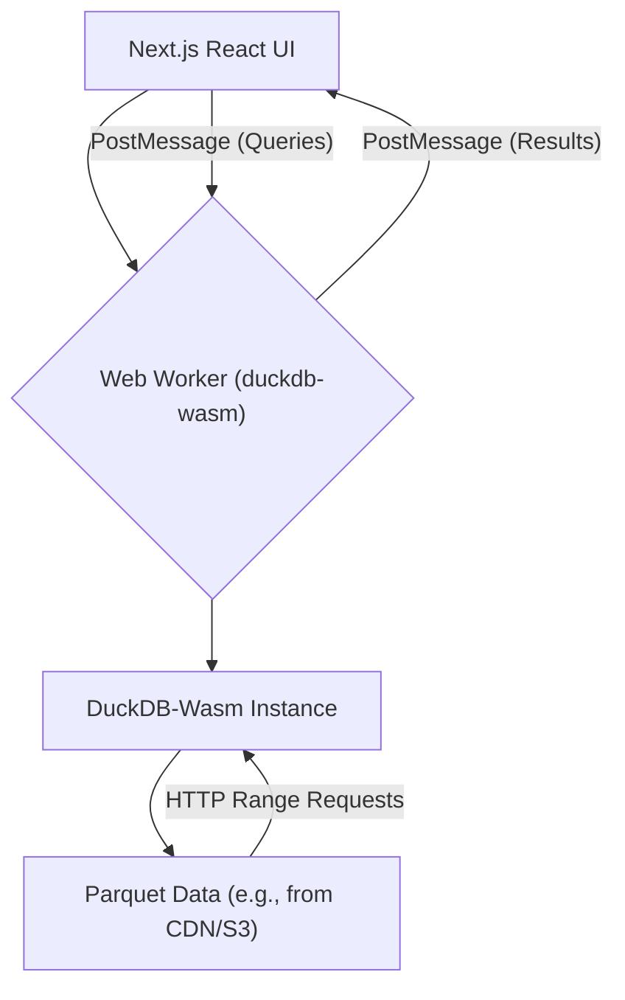

DuckDB-Wasm cho phép thực hiện các tác vụ SQL phân tích trực tiếp trong trình duyệt, tận dụng WebAssembly để đạt hiệu suất gần như native. Hướng dẫn này trình bày chi tiết việc tích hợp nó vào Next.js, tập trung vào việc truy vấn các tệp Parquet có kích thước vài megabyte ở phía client, quản lý Web Worker và xây dựng một bảng điều khiển tương tác mà không cần tính toán ở backend.

<AudioPlayer src="/static/audio/duckdb-wasm-in-browser-analytics-vi.mp3" title="Tóm tắt âm thanh cho kỹ sư" voice="Google Cloud vi-VN-Neural2-A" />


## Tổng quan kiến trúc

Phân tích phía client với DuckDB-Wasm thay đổi cơ bản mô hình xử lý dữ liệu. Thay vì truyền dữ liệu thô đến backend để thực thi SQL, dữ liệu vẫn nằm cục bộ và công cụ SQL chạy trong trình duyệt. Kiến trúc này mang lại một số lợi thế: giảm độ trễ mạng, loại bỏ chi phí tính toán backend và tăng cường quyền riêng tư dữ liệu.

Các thành phần cốt lõi là:

1.  **DuckDB-Wasm:** Công cụ SQL, được biên dịch sang WebAssembly, chạy trong Web Worker.
2.  **Web Workers:** Cô lập các hoạt động của DuckDB-Wasm khỏi luồng UI chính, ngăn chặn tình trạng đóng băng.
3.  **Next.js React Components:** Cung cấp giao diện người dùng để trực quan hóa và tương tác với dữ liệu.
4.  **Parquet Files:** Định dạng lưu trữ cột hiệu quả, lý tưởng cho các truy vấn phân tích và tải trực tiếp vào DuckDB.



## Thiết lập DuckDB-Wasm trong Next.js

Chúng ta sẽ thiết lập một Web Worker chuyên dụng cho các hoạt động của DuckDB. Điều này rất quan trọng để duy trì khả năng phản hồi của UI, đặc biệt khi xử lý các tập dữ liệu lớn hoặc các truy vấn phức tạp.

### Thiết lập dự án

Đầu tiên, cài đặt các gói cần thiết:

```bash
npm install @duckdb/duckdb-wasm @duckdb/duckdb-wasm-shell react-chartjs-2 chart.js
npm install -D worker-loader # For Next.js custom webpack config
```

### Cấu hình Webpack của Next.js

Next.js yêu cầu cấu hình Webpack tùy chỉnh để xử lý Web Worker. Tạo `next.config.mjs`:

```javascript
// next.config.mjs
import { fileURLToPath } from 'url';
import { dirname } from 'path';

const __filename = fileURLToPath(import.meta.url);
const __dirname = dirname(__filename);

/** @type {import('next').NextConfig} */
const nextConfig = {
  webpack: (config, { isServer, webpack }) => {
    // DuckDB-Wasm requires specific asset handling
    config.experiments = { ...config.experiments,
      asyncWebAssembly: true,
      topLevelAwait: true,
      layers: true
    };

    // Configure worker-loader for our DuckDB worker
    config.module.rules.unshift({
      test: /\.worker\.ts$/,
      loader: 'worker-loader',
      options: {
        filename: 'static/[hash].worker.js', // Output worker to static directory
        publicPath: '/_next/', // Ensure correct public path for worker
      },
    });

    // DuckDB-Wasm specific configuration for WASM files
    config.module.rules.push({
      test: /\.wasm$/,
      type: 'asset/resource',
      generator: {
        filename: 'static/wasm/[name].[hash][ext]',
      },
    });

    // Ensure DuckDB-Wasm can find its worker files
    config.plugins.push(
      new webpack.DefinePlugin({
        'process.env.DUCKDB_RUNTIME_URL': JSON.stringify('/_next/static/wasm/duckdb-mvp.wasm'),
        'process.env.DUCKDB_RUNTIME_WORKER_URL': JSON.stringify('/_next/static/wasm/duckdb-browser-mvp.worker.js'),
      })
    );

    return config;
  },
};

export default nextConfig;
```

### Web Worker của DuckDB

Tạo `src/workers/duckdb.worker.ts`. Worker này sẽ khởi tạo DuckDB và hiển thị API truyền thông điệp.

```typescript
// src/workers/duckdb.worker.ts
import * as duckdb from '@duckdb/duckdb-wasm';
import { AsyncDuckDB, DuckDBDataProtocol, ConsoleLogger } from '@duckdb/duckdb-wasm';

// Define the DuckDB-Wasm bundle
const DUCKDB_BUNDLES = {
  mvp: {
    mainModule: '/_next/static/wasm/duckdb-mvp.wasm',
    mainWorker: '/_next/static/wasm/duckdb-browser-mvp.worker.js',
  },
  eh: {
    mainModule: '/_next/static/wasm/duckdb-eh.wasm',
    mainWorker: '/_next/static/wasm/duckdb-browser-eh.worker.js',
  },
};

let db: AsyncDuckDB | null = null;
let conn: duckdb.AsyncDuckDBConnection | null = null;

// Function to initialize DuckDB
async function initializeDuckDB() {
  if (db) return; // Already initialized

  const bundle = await duckdb.selectBundle(DUCKDB_BUNDLES);
  const worker = new Worker(bundle.mainWorker!);

  // Use the custom logger to see DuckDB logs in the worker console
  db = new AsyncDuckDB(new ConsoleLogger(), worker);
  await db.instantiate(bundle.mainModule, bundle.pthreadWorker);
  conn = await db.connect();
  console.log('DuckDB-Wasm initialized in worker.');
}

// Handle messages from the main thread
self.onmessage = async (event: MessageEvent) => {
  const { id, type, payload } = event.data;

  try {
    if (type === 'INIT') {
      await initializeDuckDB();
      self.postMessage({ id, type: 'INIT_SUCCESS' });
    } else if (type === 'QUERY') {
      if (!conn) throw new Error('DuckDB not initialized.');
      const { query, params } = payload;
      console.log(`Executing query: ${query}`);

      // Example: Register a Parquet file if needed
      // For this example, we assume the Parquet file is already accessible via HTTP
      // or registered in a previous step.
      // If you need to register a file from a URL:
      // await db.registerFileURL('my_data.parquet', payload.parquetUrl, DuckDBDataProtocol.HTTP, false);

      const result = await conn.query(query, params);
      self.postMessage({ id, type: 'QUERY_SUCCESS', payload: result.toArray() });
    } else if (type === 'REGISTER_PARQUET_URL') {
      if (!db) throw new Error('DuckDB not initialized.');
      const { name, url } = payload;
      await db.registerFileURL(name, url, DuckDBDataProtocol.HTTP, false);
      console.log(`Registered Parquet file: ${name} from ${url}`);
      self.postMessage({ id, type: 'REGISTER_PARQUET_URL_SUCCESS' });
    } else {
      throw new Error(`Unknown message type: ${type}`);
    }
  } catch (error: any) {
    console.error('DuckDB Worker Error:', error);
    self.postMessage({ id, type: 'ERROR', payload: error.message });
  }
};
```

### React Hook để giao tiếp với Worker

Tạo `src/hooks/useDuckDB.ts` để trừu tượng hóa giao tiếp với worker.

```typescript
// src/hooks/useDuckDB.ts
import { useEffect, useState, useRef, useCallback } from 'react';
import { v4 as uuidv4 } from 'uuid';

// Define message types for communication
interface WorkerMessage {
  id: string;
  type: string;
  payload?: any;
}

interface QueryResult {
  [key: string]: any;
}

export function useDuckDB() {
  const [isReady, setIsReady] = useState(false);
  const [error, setError] = useState<string | null>(null);
  const workerRef = useRef<Worker | null>(null);
  const messageCallbacks = useRef<Map<string, (result: any) => void>>(new Map());

  useEffect(() => {
    // Dynamically import the worker to avoid issues with Next.js SSR
    // This assumes your worker is built by webpack and accessible via a URL
    // The `worker-loader` plugin handles this.
    workerRef.current = new Worker(new URL('../workers/duckdb.worker.ts', import.meta.url));

    const worker = workerRef.current;

    worker.onmessage = (event: MessageEvent<WorkerMessage>) => {
      const { id, type, payload } = event.data;
      if (type === 'INIT_SUCCESS') {
        setIsReady(true);
      } else if (type === 'ERROR') {
        setError(payload);
        const callback = messageCallbacks.current.get(id);
        if (callback) {
          callback(new Error(payload)); // Propagate error to specific call
          messageCallbacks.current.delete(id);
        }
      } else {
        const callback = messageCallbacks.current.get(id);
        if (callback) {
          callback(payload);
          messageCallbacks.current.delete(id);
        }
      }
    };

    worker.onerror = (err) => {
      console.error('DuckDB Worker Error:', err);
      setError('Worker encountered an error.');
    };

    // Initialize the worker
    worker.postMessage({ id: uuidv4(), type: 'INIT' });

    return () => {
      worker.terminate();
      workerRef.current = null;
    };
  }, []);

  const sendWorkerMessage = useCallback((type: string, payload?: any): Promise<any> => {
    return new Promise((resolve, reject) => {
      if (!workerRef.current) {
        return reject(new Error('DuckDB worker not initialized.'));
      }
      const id = uuidv4();
      messageCallbacks.current.set(id, (result: any) => {
        if (result instanceof Error) {
          reject(result);
        } else {
          resolve(result);
        }
      });
      workerRef.current.postMessage({ id, type, payload });
    });
  }, []);

  const query = useCallback(async (sql: string, params?: any[]): Promise<QueryResult[]> => {
    if (!isReady) throw new Error('DuckDB is not ready.');
    return sendWorkerMessage('QUERY', { query: sql, params });
  }, [isReady, sendWorkerMessage]);

  const registerParquetUrl = useCallback(async (name: string, url: string): Promise<void> => {
    if (!isReady) throw new Error('DuckDB is not ready.');
    return sendWorkerMessage('REGISTER_PARQUET_URL', { name, url });
  }, [isReady, sendWorkerMessage]);

  return { isReady, error, query, registerParquetUrl };
}
```

## Truy vấn 10 triệu hàng: Ví dụ về bảng điều khiển tương tác

Chúng ta sẽ tạo một bảng điều khiển đơn giản để trực quan hóa dữ liệu từ một tệp Parquet lớn. Để minh họa, giả sử một tệp Parquet có tên `sales_data_10m.parquet` có sẵn thông qua một URL công khai (ví dụ: CDN hoặc S3 bucket). Tệp này chứa 10 triệu hàng dữ liệu bán hàng với các cột như `product_category`, `sale_date` và `revenue`.

### Tạo dữ liệu Parquet mẫu (Tùy chọn)

Để tạo một tệp Parquet mẫu với 10 triệu hàng:

```python
import pandas as pd
import numpy as np
from datetime import datetime, timedelta

num_rows = 10_000_000

# Generate synthetic data
data = {
    'sale_id': np.arange(num_rows),
    'product_category': np.random.choice(['Electronics', 'Clothing', 'Home Goods', 'Books', 'Food'], num_rows),
    'revenue': np.random.uniform(10, 1000, num_rows).round(2),
    'units_sold': np.random.randint(1, 10, num_rows),
    'sale_date': [datetime(2023, 1, 1) + timedelta(days=np.random.randint(0, 365)) for _ in range(num_rows)],
    'region': np.random.choice(['North', 'South', 'East', 'West'], num_rows),
}

df = pd.DataFrame(data)

# Save to Parquet
df.to_parquet('public/sales_data_10m.parquet', index=False)
print(f"Generated sales_data_10m.parquet with {num_rows} rows.")
```

Đặt tệp `sales_data_10m.parquet` này vào thư mục `public` của Next.js, hoặc lưu trữ nó trên CDN.

### Thành phần bảng điều khiển

Tạo `src/app/page.tsx` (cho App Router) hoặc `src/pages/index.tsx` (cho Pages Router).

```tsx
// src/app/page.tsx
'use client'; // Mark as client component for Next.js App Router

import { useEffect, useState, useMemo } from 'react';
import { useDuckDB } from '../hooks/useDuckDB';
import { Bar, Line } from 'react-chartjs-2';
import {
  Chart as ChartJS,
  CategoryScale,
  LinearScale,
  BarElement,
  Title,
  Tooltip,
  Legend,
  PointElement,
  LineElement,
} from 'chart.js';

// Register Chart.js components
ChartJS.register(
  CategoryScale,
  LinearScale,
  BarElement,
  Title,
  Tooltip,
  Legend,
  PointElement,
  LineElement
);

interface SalesByCategory {
  product_category: string;
  total_revenue: number;
}

interface DailySales {
  sale_date: string; // DuckDB returns dates as strings by default
  daily_revenue: number;
}

export default function Home() {
  const { isReady, error, query, registerParquetUrl } = useDuckDB();
  const [categoryData, setCategoryData] = useState<SalesByCategory[]>([]);
  const [dailyData, setDailyData] = useState<DailySales[]>([]);
  const [loading, setLoading] = useState(true);
  const [totalRows, setTotalRows] = useState<number | null>(null);

  const PARQUET_FILE_URL = '/sales_data_10m.parquet'; // Adjust if hosted externally
  const PARQUET_FILE_NAME = 'sales_data_10m.parquet';

  useEffect(() => {
    const loadData = async () => {
      if (isReady) {
        setLoading(true);
        try {
          // Register the Parquet file URL with DuckDB
          await registerParquetUrl(PARQUET_FILE_NAME, PARQUET_FILE_URL);
          console.log('Parquet file registered.');

          // Count total rows
          const countResult = await query(`SELECT COUNT(*) as total_rows FROM "${PARQUET_FILE_NAME}"`);
          setTotalRows(countResult[0]?.total_rows || 0);

          // Query 1: Total Revenue by Product Category
          const categoryResults = await query(`
            SELECT
              product_category,
              SUM(revenue) AS total_revenue
            FROM "${PARQUET_FILE_NAME}"
            GROUP BY product_category
            ORDER BY total_revenue DESC
          `);
          setCategoryData(categoryResults as SalesByCategory[]);
          console.log('Category data fetched:', categoryResults);

          // Query 2: Daily Revenue Trend
          const dailyResults = await query(`
            SELECT
              STRFTIME(sale_date, '%Y-%m-%d') AS sale_date,
              SUM(revenue) AS daily_revenue
            FROM "${PARQUET_FILE_NAME}"
            GROUP BY STRFTIME(sale_date, '%Y-%m-%d')
            ORDER BY sale_date ASC
          `);
          setDailyData(dailyResults as DailySales[]);
          console.log('Daily data fetched:', dailyResults);

        } catch (err: any) {
          console.error('Failed to query DuckDB:', err);
          setError(err.message);
        } finally {
          setLoading(false);
        }
      }
    };
    loadData();
  }, [isReady, query, registerParquetUrl, setError]);

  const categoryChartData = useMemo(() => ({
    labels: categoryData.map(d => d.product_category),
    datasets: [
      {
        label: 'Total Revenue',
        data: categoryData.map(d => d.total_revenue),
        backgroundColor: 'rgba(75, 192, 192, 0.6)',
        borderColor: 'rgba(75, 192, 192, 1)',
        borderWidth: 1,
      },
    ],
  }), [categoryData]);

  const dailyChartData = useMemo(() => ({
    labels: dailyData.map(d => d.sale_date),
    datasets: [
      {
        label: 'Daily Revenue',
        data: dailyData.map(d => d.daily_revenue),
        fill: false,
        backgroundColor: 'rgba(153, 102, 255, 0.6)',
        borderColor: 'rgba(153, 102, 255, 1)',
        tension: 0.1,
      },
    ],
  }), [dailyData]);

  if (error) {
    return <div className="p-4 text-red-600">Error: {error}</div>;
  }

  if (!isReady || loading) {
    return <div className="p-4">Loading DuckDB and data... This may take a moment for large files.</div>;
  }

  return (
    <div className="container mx-auto p-4">
      <h1 className="text-3xl font-bold mb-6">Client-Side Sales Dashboard (10M Rows)</h1>
      <p className="mb-4">
        Powered by DuckDB-Wasm. Total rows processed: <span className="font-bold">{totalRows?.toLocaleString()}</span>
      </p>

      <div className="grid grid-cols-1 md:grid-cols-2 gap-8">
        <div className="bg-white p-6 rounded-lg shadow-md">
          <h2 className="text-xl font-semibold mb-4">Revenue by Product Category</h2>
          <Bar data={categoryChartData} options={{ responsive: true, maintainAspectRatio: false }} />
        </div>
        <div className="bg-white p-6 rounded-lg shadow-md">
          <h2 className="text-xl font-semibold mb-4">Daily Revenue Trend</h2>
          <Line data={dailyChartData} options={{ responsive: true, maintainAspectRatio: false }} />
        </div>
      </div>
    </div>
  );
}
```

Ví dụ này minh họa:
*   **Khởi tạo lười biếng:** DuckDB chỉ được khởi tạo một lần trong worker.
*   **Truy vấn bất đồng bộ:** Tất cả các truy vấn đều được `await`, và kết quả được truyền trở lại luồng chính.
*   **Đăng ký tệp Parquet:** Hàm `registerParquetUrl` giúp DuckDB truy cập tệp Parquet từ xa. DuckDB-Wasm sử dụng HTTP Range Requests để chỉ tìm nạp các phần cần thiết của tệp, tối ưu hóa việc sử dụng mạng.
*   **Trực quan hóa tương tác:** `react-chartjs-2` được sử dụng để hiển thị biểu đồ dựa trên kết quả truy vấn.

## Các cân nhắc và đánh đổi về hiệu suất

| Tính năng / Khía cạnh | DuckDB-Wasm (Phía Client) | Cơ sở dữ liệu Backend truyền thống (Phía Server) |
| :--------------------- | :------------------------------------------------------ | :-------------------------------------------------------------------- |
| **Tính cục bộ của dữ liệu** | Dữ liệu được xử lý trực tiếp trong trình duyệt. | Dữ liệu nằm trên máy chủ, được xử lý từ xa. |
| **Độ trễ mạng** | Tối thiểu sau khi tải dữ liệu ban đầu (HTTP Range Requests). | Cao cho mỗi truy vấn, truyền dữ liệu qua mạng. |
| **Chi phí tính toán** | Không có tính toán backend. Sử dụng CPU/RAM của client. | Chi phí tính toán phía máy chủ (CPU, RAM, I/O). |
| **Khả năng mở rộng** | Mở rộng theo thiết bị client. Bị giới hạn bởi tài nguyên client. | Mở rộng theo cơ sở hạ tầng máy chủ. |
| **Khối lượng dữ liệu** | Thực tế cho hàng chục-hàng trăm MB, lên đến GB (cần cẩn thận). | Xử lý hàng TB-PB dễ dàng. |
| **Thời gian tải ban đầu** | Có thể cao hơn do tải xuống mô-đun WASM & lập chỉ mục dữ liệu. | Thấp hơn cho tải trang ban đầu, nhưng tìm nạp dữ liệu làm tăng độ trễ. |
| **Bảo mật/Quyền riêng tư** | Dữ liệu không bao giờ rời khỏi client. Quyền riêng tư cao. | Dữ liệu được truyền đến máy chủ. Yêu cầu bảo mật phía máy chủ mạnh mẽ. |
| **Khả năng ngoại tuyến** | Có thể với Service Workers lưu trữ dữ liệu. | Thường yêu cầu kết nối trực tuyến. |
| **Độ phức tạp** | Quản lý Web Worker, các đặc điểm WASM. | Quản trị cơ sở dữ liệu, nhóm kết nối, ORM. |
| **Ngôn ngữ truy vấn** | SQL đầy đủ (phương ngữ DuckDB). | SQL đầy đủ (phương ngữ DB cụ thể). |

### Giới hạn bộ nhớ WebAssembly

DuckDB-Wasm hoạt động trong giới hạn bộ nhớ WebAssembly của trình duyệt. Mặc dù các trình duyệt hiện đại cho phép vài gigabyte bộ nhớ WASM, việc tải dữ liệu quá mức có thể dẫn đến lỗi hết bộ nhớ.

*   **Chiến lược:** Khả năng của DuckDB để truy vấn các tệp Parquet trực tiếp thông qua HTTP Range Requests là rất quan trọng. Nó tránh tải toàn bộ tệp vào bộ nhớ. Chỉ các cột và nhóm hàng cần thiết mới được tìm nạp và xử lý.
*   **Giám sát:** Quan sát việc sử dụng bộ nhớ của trình duyệt trong các công cụ dành cho nhà phát triển. Nếu bộ nhớ tăng đột biến, hãy tối ưu hóa các truy vấn hoặc xem xét tổng hợp trước dữ liệu.
*   **Xử lý lỗi:** Triển khai xử lý lỗi mạnh mẽ cho các thông báo `QUERY_ERROR` từ worker, có thể cho thấy áp lực bộ nhớ.

## Những vấn đề và cách khắc phục trong sản xuất

1.  **`Failed to load module: No such file or directory` (tệp WASM/Worker):**
    *   **Triệu chứng:** Bảng điều khiển trình duyệt hiển thị lỗi như `GET /_next/static/wasm/duckdb-mvp.wasm 404 (Not Found)`.
    *   **Nguyên nhân:** Cấu hình Webpack của Next.js không chính xác, hoặc `publicPath` cho các tài sản worker/WASM bị cấu hình sai.
    *   **Khắc phục:** Kiểm tra lại `next.config.mjs`. Đảm bảo quy tắc `asset/resource` cho các tệp `.wasm` và `worker-loader` cho các tệp `.worker.ts` được cấu hình đúng. Các mục `DUCKDB_RUNTIME_URL` và `DUCKDB_RUNTIME_WORKER_URL` `DefinePlugin` phải trỏ đến các đường dẫn chính xác nơi Next.js phục vụ các tài sản này. Xác minh các đường dẫn đầu ra thực tế trong thư mục `.next` của bạn sau khi xây dựng.

2.  **UI bị đóng băng trong quá trình thực thi truy vấn:**
    *   **Triệu chứng:** Tab trình duyệt không phản hồi khi một truy vấn đang chạy, ngay cả khi có Web Worker.
    *   **Nguyên nhân:** Thiết lập worker không chính xác, hoặc vô tình chạy các hoạt động của DuckDB trên luồng chính.
    *   **Khắc phục:** Đảm bảo tất cả quá trình khởi tạo và thực thi truy vấn của DuckDB xảy ra *độc quyền* trong Web Worker. Hook `useDuckDB` và `duckdb.worker.ts` được thiết kế cho việc này. Nếu bạn đang sử dụng `duckdb-wasm` trực tiếp trong một thành phần React, bạn đang làm sai.

3.  **Lỗi cấp phát `Out of Memory` hoặc `WebAssembly.Memory`:**
    *   **Triệu chứng:** Bảng điều khiển trình duyệt hiển thị lỗi cấp phát bộ nhớ WASM, đặc biệt với các tập dữ liệu rất lớn hoặc các phép nối phức tạp.
    *   **Nguyên nhân:** Truy vấn quá nhiều dữ liệu cùng một lúc, hoặc DuckDB cố gắng tải toàn bộ tệp Parquet lớn vào bộ nhớ WASM khi không nên.
    *   **Khắc phục:**
        *   **Tối ưu hóa truy vấn:** Sử dụng mệnh đề `LIMIT`, `GROUP BY` để tổng hợp, và `SELECT` chỉ các cột cần thiết.
        *   **Cấu trúc Parquet:** Đảm bảo các tệp Parquet của bạn được phân vùng tốt và có kích thước nhóm hàng phù hợp. DuckDB-Wasm tận dụng những điều này để yêu cầu phạm vi hiệu quả.
        *   **Kiểu dữ liệu:** Sử dụng các kiểu dữ liệu hiệu quả trong Parquet.
        *   **Tổng hợp trước:** Đối với các tập dữ liệu cực lớn, hãy xem xét tổng hợp trước một số dữ liệu trên máy chủ nếu bộ nhớ phía client là một nút thắt cổ chai dai dẳng.
        *   **Giới hạn trình duyệt:** Lưu ý rằng giới hạn bộ nhớ WASM của trình duyệt có thể khác nhau.

4.  **`TypeError: Cannot read properties of undefined (reading 'connect')`:**
    *   **Triệu chứng:** Xảy ra khi cố gắng gọi `conn.query()` hoặc các phương thức tương tự.
    *   **Nguyên nhân:** Thể hiện `AsyncDuckDB` hoặc `AsyncDuckDBConnection` không được khởi tạo đúng cách hoặc là `null` khi một truy vấn được thực hiện.
    *   **Khắc phục:** Đảm bảo hàm `initializeDuckDB` trong worker hoàn thành thành công trước khi bất kỳ thông báo `QUERY` nào được gửi. Trạng thái `isReady` trong `useDuckDB` được thiết kế để ngăn chặn điều này; đảm bảo bạn đang đợi `isReady` trở thành `true`.

5.  **Sự cố CORS với tệp Parquet:**
    *   **Triệu chứng:** `Failed to fetch` hoặc lỗi CORS khi `registerFileURL` cố gắng truy cập tệp Parquet từ một nguồn gốc khác.
    *   **Nguyên nhân:** Máy chủ lưu trữ tệp Parquet không gửi các tiêu đề CORS thích hợp (`Access-Control-Allow-Origin`).
    *   **Khắc phục:** Cấu hình máy chủ (ví dụ: chính sách S3 bucket, cài đặt CDN) để cho phép các yêu cầu CORS từ nguồn gốc của ứng dụng Next.js của bạn. Cụ thể, các tiêu đề `Range` cũng có thể cần được cho phép để tìm nạp Parquet hiệu quả.


## Kiểm tra kiến thức

<Quiz questions={
  [
    {
      "question": "Một đội phát triển đang xây dựng một dashboard phân tích phía client sử dụng DuckDB-Wasm trong Next.js. Họ nhận thấy rằng các truy vấn phức tạp hoặc tải dữ liệu lớn đôi khi khiến tab trình duyệt bị treo trong vài giây. Quyết định kiến trúc nào, nếu bị bỏ qua, là nguyên nhân có khả năng nhất gây ra vấn đề này?",
      "options": [
        "Lưu trữ các file Parquet trên CDN thay vì nhúng trực tiếp vào bundle của Next.js.",
        "Sử dụng `react-chartjs-2` cho việc hiển thị dữ liệu thay vì một thư viện biểu đồ nhẹ hơn.",
        "Thực thi các thao tác của DuckDB-Wasm trực tiếp trên main UI thread.",
        "Không pre-load tất cả các module DuckDB-Wasm cần thiết trong quá trình khởi tạo ứng dụng."
      ],
      "correctAnswer": 2,
      "explanation": "Bài viết đã nêu rõ, 'Web Workers: Cô lập các thao tác của DuckDB-Wasm khỏi main UI thread, ngăn chặn tình trạng treo.' Nếu các thao tác của DuckDB-Wasm, đặc biệt là các truy vấn phức tạp hoặc tải dữ liệu lớn, được chạy trên main UI thread, chúng sẽ chặn thread này, dẫn đến tab trình duyệt không phản hồi. Web Workers rất quan trọng để offload các tác vụ tính toán chuyên sâu này."
    },
    {
      "question": "Khi tích hợp DuckDB-Wasm vào một ứng dụng Next.js, bài viết nhấn mạnh sự cần thiết của các cấu hình Webpack cụ thể. Lý do chính cho các cấu hình tùy chỉnh này là gì, đặc biệt liên quan đến các file `.worker.ts` và `.wasm`?",
      "options": [
        "Để bật server-side rendering (SSR) các truy vấn DuckDB-Wasm cho thời gian tải trang ban đầu nhanh hơn.",
        "Để đảm bảo rằng các module WebAssembly và Web Workers được đóng gói và phục vụ đúng cách dưới dạng static assets bởi Next.js.",
        "Để tối ưu hóa engine DuckDB-Wasm cho các môi trường trình duyệt cụ thể như Safari hoặc Firefox.",
        "Để tự động chuyển đổi các truy vấn SQL thành JavaScript để thực thi mà không cần DuckDB-Wasm."
      ],
      "correctAnswer": 1,
      "explanation": "Ví dụ `next.config.mjs` hiển thị các quy tắc tùy chỉnh cho `worker-loader` đối với các file `.worker.ts` và `type: 'asset/resource'` đối với các file `.wasm`. Điều này là cần thiết vì Webpack, theo mặc định, có thể không biết cách xử lý và phục vụ đúng cách các loại file chuyên biệt này (Web Workers và các binary WebAssembly) dưới dạng static assets mà DuckDB-Wasm cần tại runtime. Các cấu hình đảm bảo chúng được xuất đúng cách vào các thư mục static và có thể truy cập thông qua các public path chính xác."
    }
  ]
} />


## Câu hỏi thường gặp

### Q1: DuckDB-Wasm có thể xử lý cập nhật dữ liệu thời gian thực không?

A1: DuckDB-Wasm chủ yếu được thiết kế cho các truy vấn phân tích trên các tập dữ liệu tĩnh hoặc thay đổi chậm. Mặc dù bạn có thể đăng ký lại tệp hoặc tải dữ liệu mới, nhưng nó không có cơ chế tích hợp sẵn để cập nhật luồng thời gian thực như một cơ sở dữ liệu OLTP truyền thống. Đối với các bảng điều khiển thời gian thực, bạn thường tìm nạp dữ liệu mới, có thể dưới dạng các tệp Parquet mới, và chạy lại các truy vấn.

### Q2: Làm cách nào để duy trì dữ liệu DuckDB-Wasm giữa các phiên trình duyệt?

A2: DuckDB-Wasm có thể được cấu hình để sử dụng `IDBBatchAtomicVFS` (hệ thống tệp được hỗ trợ bởi IndexedDB) để duy trì. Điều này cho phép trạng thái cơ sở dữ liệu và các tệp đã đăng ký được lưu trữ trong IndexedDB, tồn tại qua các lần làm mới hoặc đóng trình duyệt. Bạn sẽ cấu hình điều này trong quá trình khởi tạo `AsyncDuckDB` trong worker của mình.

```typescript
// Example for persistence in duckdb.worker.ts
import { AsyncDuckDB, DuckDBDataProtocol, ConsoleLogger, IDBBatchAtomicVFS } from '@duckdb/duckdb-wasm';

// ... inside initializeDuckDB()
const bundle = await duckdb.selectBundle(DUCKDB_BUNDLES);
const worker = new Worker(bundle.mainWorker!);

// Initialize VFS for persistence
const vfs = new IDBBatchAtomicVFS('duckdb-data'); // 'duckdb-data' is the database name
db = new AsyncDuckDB(new ConsoleLogger(), worker);
await db.instantiate(bundle.mainModule, bundle.pthreadWorker, {
  query: {
    'duckdb-data': vfs, // Register the VFS
  },
});
conn = await db.connect();
// Now you can use 'ATTACH 'duckdb-data';' and 'CREATE TABLE ... IN 'duckdb-data';'
// or 'COPY ... TO 'duckdb-data'/my_table.parquet (FORMAT PARQUET);'
```

### Q3: Những hạn chế của DuckDB-Wasm so với một phiên bản DuckDB phía máy chủ là gì?

A3: Các hạn chế chính là:
1.  **Bộ nhớ:** Bị giới hạn bởi giới hạn bộ nhớ WebAssembly của trình duyệt (thường là 2-4GB, nhưng có thể cao hơn). DuckDB phía máy chủ có thể sử dụng tất cả RAM hệ thống có sẵn.
2.  **CPU:** Dựa vào CPU của client, điều này rất khác nhau. Phía máy chủ có thể tận dụng các CPU đa lõi mạnh mẽ.
3.  **I/O:** I/O của trình duyệt thường chậm hơn I/O đĩa phía máy chủ, mặc dù HTTP Range Requests giảm thiểu điều này đối với các tệp từ xa.
4.  **Đồng thời:** Web Workers cung cấp tính song song, nhưng một phiên bản DuckDB duy nhất trong một worker là đơn luồng để thực thi truy vấn (mặc dù nó có thể chuyển I/O). Các bản dựng Pthread của DuckDB-Wasm có thể tận dụng nhiều lõi trong một worker, nhưng việc thiết lập này phức tạp hơn.

### Q4: Tôi có thể sử dụng DuckDB-Wasm với các tệp cục bộ (ví dụ: từ một `<input type="file">`) không?

A4: Vâng, hoàn toàn có thể. Bạn có thể đọc một đối tượng `File` (từ một đầu vào tệp) bằng cách sử dụng `FileReader` hoặc `File.arrayBuffer()` và sau đó đăng ký nó với DuckDB-Wasm bằng cách sử dụng `db.registerFileBuffer()`.

```typescript
// Trong worker của bạn:
// ...
else if (type === 'REGISTER_FILE_BUFFER') {
  if (!db) throw new Error('DuckDB not initialized.');
  const { name, buffer } = payload; // buffer sẽ là một ArrayBuffer
  await db.registerFileBuffer(name, new Uint8Array(buffer));
  console.log(`Registered file buffer: ${name}`);
  self.postMessage({ id, type: 'REGISTER_FILE_BUFFER_SUCCESS' });
}
// ...

// Trong thành phần React của bạn:
const handleFileChange = async (event: React.ChangeEvent<HTMLInputElement>) => {
  const file = event.target.files?.[0];
  if (file) {
    const arrayBuffer = await file.arrayBuffer();
    await sendWorkerMessage('REGISTER_FILE_BUFFER', { name: file.name, buffer: arrayBuffer });
    // Bây giờ bạn có thể truy vấn tệp bằng tên của nó
    const result = await query(`SELECT COUNT(*) FROM "${file.name}"`);
    console.log('Local file count:', result);
  }
};

// ... trong JSX
<input type="file" onChange={handleFileChange} accept=".parquet" />
```
