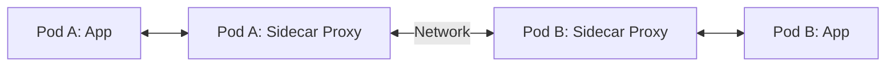

If you've been working in the Kubernetes ecosystem over the last few years, you've probably felt the pain of trying to get deep visibility into your microservices. We used to rely heavily on sidecar proxies (like Envoy in Istio) to capture network traffic and generate telemetry. While sidecars work, they introduce significant overhead—both in terms of resource consumption and added latency. 

Enter **eBPF** (Extended Berkeley Packet Filter). It's fundamentally changing how we approach Kubernetes observability.

<Callout type="info">
eBPF allows us to run sandboxed programs in the operating system kernel. It means we can safely extend the capabilities of the kernel without needing to change kernel source code or load kernel modules.
</Callout>

## The Sidecar Tax

Before eBPF, getting network traces meant injecting a proxy container into every single pod. Every packet had to traverse the network stack, hit the proxy, and go back through the stack before reaching the application.



This "sidecar tax" adds up:
- **CPU/Memory Overhead:** Running thousands of proxies consumes massive cluster resources.
- **Latency:** Extra hops for every request.
- **Complexity:** Injecting sidecars breaks certain applications and complicates the deployment pipeline.

## Why eBPF is the Game Changer

eBPF shifts observability from the user space (sidecars) to the kernel space. Since all network traffic, file operations, and system calls pass through the kernel, eBPF can observe *everything* at the lowest level with near-zero overhead.

Here's how we typically implement eBPF-based observability in a modern cloud-native stack:

<Stepper>
  <Step title="Write the eBPF Program">
    We write a C program that hooks into specific kernel events, such as `kprobe` (kernel probes) or tracepoints.
  </Step>
  <Step title="Compile and Load">
    The program is compiled into eBPF bytecode using LLVM/Clang and loaded into the kernel using a Go or Python user-space application (often using libraries like Cilium ebpf or BCC).
  </Step>
  <Step title="Kernel Verification">
    The kernel's in-built verifier checks the bytecode to ensure it won't crash the system or access unauthorized memory. Safety is a primary feature of eBPF.
  </Step>
  <Step title="Collect Telemetry">
    As events trigger, the eBPF program writes data to eBPF maps (key-value stores). Our user-space agent reads these maps and exports them to Prometheus, Jaeger, or OpenTelemetry.
  </Step>
</Stepper>

### A Simple eBPF Example

To give you a taste, here is a simplified example of how you might hook into the `execve` system call using the Python BCC framework to trace when new processes are started.

```python
from bcc import BPF

# 1. Define the eBPF C program
bpf_text = """
int trace_execve(struct pt_regs *ctx) {
    bpf_trace_printk("A new process was executed!\\n");
    return 0;
}
"""

# 2. Load the program
b = BPF(text=bpf_text)

# 3. Attach to the kprobe for sys_execve
b.attach_kprobe(event=b.get_syscall_fnname("execve"), fn_name="trace_execve")

# 4. Read the trace output
print("Tracing new processes... Ctrl-C to exit.")
b.trace_print()
```

<Callout type="warning">
Writing raw eBPF C code can be complex. In production Kubernetes environments, you'll rarely do this yourself. Instead, use established tools like Cilium, Pixie, or Tetragon that abstract the eBPF complexity into ready-to-use observability platforms.
</Callout>

## Looking Forward

The transition from sidecar-based meshes to eBPF-based, ambient observability is well underway. Tools like Cilium are leading the charge by offering networking, security, and observability completely transparently to the applications. 

By leveraging the kernel directly, we can finally achieve the holy grail of cloud-native observability: deep, cluster-wide visibility without the performance penalty.
