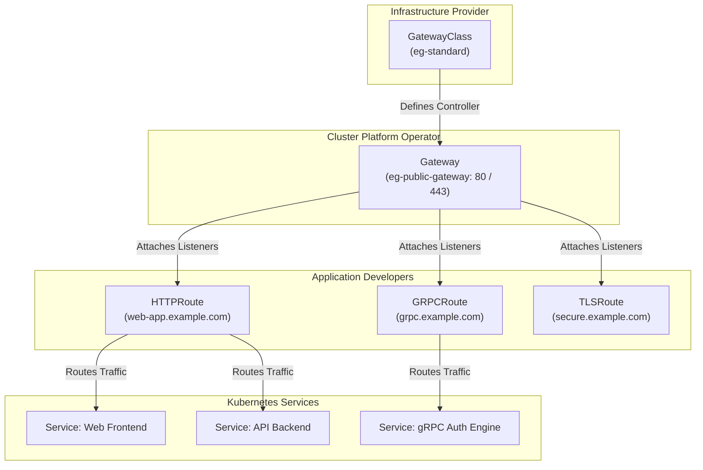
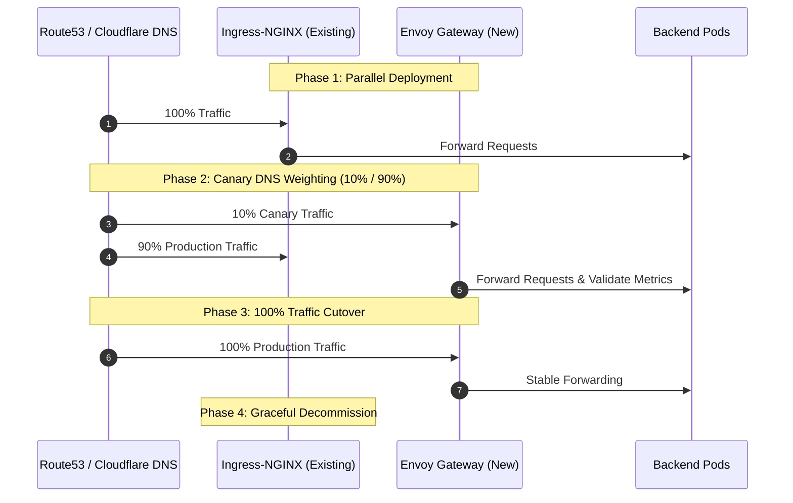

The Kubernetes Ingress API, while foundational to cloud-native networking for nearly a decade, exhibits inherent structural limitations when expressing advanced traffic management policies, multi-tenant boundaries, and protocol-aware routing. Ingress forced platform teams to rely on vendor-specific annotations (`nginx.ingress.kubernetes.io/*`), leading to fragile configuration sprawl, lack of portability, and high blast radius across shared ingress controllers.

The **Kubernetes Gateway API** represents the official, next-generation standard for service networking in Kubernetes. Operating on an expressive, role-oriented resource model, the Gateway API decouples infrastructure provisioning from application routing. Coupled with **Envoy Gateway** - the CNCF-backed Envoy Proxy control plane tailored specifically for Gateway API - engineering teams can eliminate Ingress-NGINX annotation debt and unlock native traffic splitting, protocol-native gRPC/TLS routing, and dynamic configuration updates without reload penalties.

In this deep dive, we will examine the architectural shift from Ingress-NGINX to Envoy Gateway, configure core Gateway API resources, implement advanced traffic routing, automate TLS termination with `cert-manager`, enforce global rate limiting, and execute a zero-downtime production migration playbook.

<AudioPlayer src="/static/audio/envoy-gateway-api-kubernetes-ingress-deep-dive.mp3" title="Executive Audio Briefing" voice="Google Cloud en-US-Neural2-F" />

## Understanding the Kubernetes Gateway API

The Kubernetes Gateway API provides a declarative, extensible, and role-oriented specifications framework for ingress traffic management. Unlike the legacy Ingress resource - which combined infrastructure provisioning, host configuration, and path routing into a single monolithic schema - the Gateway API organizes responsibilities into distinct resources.

### Core Architecture and Resources

The Gateway API architecture is founded on four primary resource types:



1. **`GatewayClass`**: Defines the template and underlying controller implementation (e.g., `gateway.envoyproxy.io/gatewayclass-controller`). Cluster infrastructure providers manage GatewayClasses.
2. **`Gateway`**: Defines a point where traffic can be handled, translating to physical or virtual infrastructure (e.g., cloud load balancers, Envoy proxy pods, listen ports, TLS certificates, and allowed route namespaces). Managed by cluster platform operators.
3. **`Route Resources` (`HTTPRoute`, `GRPCRoute`, `TLSRoute`, `TCPRoute`, `UDPRoute`)**: Define protocol-aware routing rules, matches, filters, and target `backendRefs`. Managed independently by application teams.
4. **`ReferenceGrant`**: Explicitly permits cross-namespace references (e.g., allowing a Gateway in namespace `envoy-gateway-system` to reference a Secret or Service in namespace `production`), enforcing strict security boundaries.

### Role-Oriented Design & Separation of Concerns

The Ingress API suffered from permission conflicts: granting developers access to an `Ingress` resource often allowed them to overwrite cluster-wide settings, misconfigure SSL certificates, or inadvertently hijack other teams' hostnames.

The Gateway API strictly separates concerns according to organizational personas:

| Persona | Primary Resource | Operational Responsibilities |
| :--- | :--- | :--- |
| **Infrastructure Provider** | `GatewayClass` | Manages controller installations, CRDs, and network infrastructure bindings. |
| **Cluster / Platform Operator** | `Gateway` | Manages IP allocation, firewall rules, ports (80/443), certificate issuers, and tenant boundaries. |
| **Application Developer** | `HTTPRoute` / `GRPCRoute` | Configures path routing, URL rewrites, canary splits, header matching, and backend services. |

### Key Architectural Benefits Over Ingress

* **Native Multi-Tenancy**: Routes in different namespaces can bind to a shared central Gateway without requiring admin privileges in the gateway namespace.
* **Portable Feature Set**: Core features such as header manipulation, traffic weighting, query parameter matching, and redirects are first-class fields in the specification rather than non-standard vendor annotations.
* **Granular Validation**: Admission webhooks and CRD schema constraints catch invalid route configurations before applying them to the cluster.
* **Two-Way Status Reporting**: Detailed status conditions on `Gateway` and `HTTPRoute` resources report whether listeners are attached, routes are accepted, or backends are unresolved.

## Introducing Envoy Gateway

Envoy Gateway is an open-source project steered under the Envoy Proxy organization and the CNCF. It aims to lower the barrier to adopting Envoy as an ingress controller by wrapping Envoy Proxy in a specialized control plane that consumes Kubernetes Gateway API resources directly.

### Why Envoy Gateway?

Historically, running Envoy Proxy as an ingress controller required heavy frameworks like Istio or Contour, each introducing bespoke CRDs (`VirtualService`, `HTTPProxy`) and control plane overhead. Envoy Gateway provides:

1. **Native Gateway API Support**: Treats Kubernetes Gateway API CRDs as its primary configuration language with zero custom abstraction layers.
2. **High-Performance xDS Control Plane**: Translates Gateway API resources dynamically into Envoy Discovery Service (xDS) configuration in-memory, pushing updates directly to Envoy proxy data plane pods without restarting worker processes.
3. **Enterprise Edge Capabilities**: Built-in native support for distributed rate limiting, global authentication (OAuth2 / OIDC / JWT), and request tracing via OpenTelemetry.

### Architectural Comparison: Ingress-NGINX vs. Envoy Gateway

| Capability | Ingress-NGINX | Envoy Gateway |
| :--- | :--- | :--- |
| **Configuration Standard** | `networking.k8s.io/v1 Ingress` + Annotations | `gateway.networking.k8s.io/v1 Gateway API` |
| **Data Plane Engine** | NGINX (C-based event loop) | Envoy Proxy (Modern C++17 event-driven architecture) |
| **Configuration Reloads** | Template rendering + `nginx -s reload` (drops long-lived connections) | Zero-reload dynamic xDS streaming API (preserves connections) |
| **Canary / Traffic Splitting** | Fragmented annotations (`nginx.ingress.kubernetes.io/canary`) | Native `weight` field on `backendRefs` with sub-millisecond precision |
| **gRPC & HTTP/2 Support** | Limited multiplexing, clumsy annotation configuration | First-class, bidirectional streaming, `GRPCRoute` CRD |
| **Cross-Namespace Routing** | Requires global permission or custom hacks | Built-in via `parentRefs` and `ReferenceGrant` |
| **Rate Limiting** | Local memory leaky-bucket; external memcached required | Distributed Envoy Rate Limit service with global Redis cluster backend |

## Installation and Initial Setup

Let us deploy Envoy Gateway into a Kubernetes cluster and establish our foundational ingress gateway.

### Prerequisites

* Kubernetes cluster version **1.26 or higher**.
* `kubectl` configured with cluster administrator privileges.
* `helm` v3.10+ installed locally.

### Installing Envoy Gateway with Helm

First, add the official Envoy Gateway Helm repository and install the controller:

```bash
# 1. Add and update Helm repository
helm repo add envoy-gateway https://envoyproxy.github.io/gateway-helm/
helm repo update

# 2. Install Envoy Gateway into its dedicated namespace
helm install envoy-gateway envoy-gateway/envoy-gateway   --namespace envoy-gateway-system   --create-namespace   --set deployment.replicas=2
```

Verify that the Gateway API CRDs and controller pods are operational:

```bash
# Verify controller pods are Ready
kubectl get pods -n envoy-gateway-system

# Verify that the GatewayClass controller is registered
kubectl get gatewayclass
```

Expected output:
```text
NAME          CONTROLLER                                      ACCEPTED   AGE
eg-standard   gateway.envoyproxy.io/gatewayclass-controller   True       45s
```

### Deploying the Gateway and GatewayClass

The `GatewayClass` specifies the controller implementation. With the class established, the platform operator deploys the public `Gateway`:

```yaml
# gateway.yaml
apiVersion: gateway.networking.k8s.io/v1
kind: Gateway
metadata:
  name: eg-public-gateway
  namespace: envoy-gateway-system
spec:
  gatewayClassName: eg-standard
  listeners:
    - name: http
      protocol: HTTP
      port: 80
      allowedRoutes:
        namespaces:
          from: All
    - name: https
      protocol: HTTPS
      port: 443
      tls:
        mode: Terminate
        certificateRefs:
          - kind: Secret
            name: production-wildcard-tls
      allowedRoutes:
        namespaces:
          from: All
```

Apply the gateway manifest:

```bash
kubectl apply -f gateway.yaml
```

Envoy Gateway automatically provisions the underlying Envoy data-plane deployment and a Kubernetes `LoadBalancer` Service. Check the assigned external IP address:

```bash
kubectl get gateway eg-public-gateway -n envoy-gateway-system -w
```

Expected output:
```text
NAME                CLASS         ADDRESS          READY   AGE
eg-public-gateway   eg-standard   198.51.100.42    True    1m
```

Save the external IP address (`198.51.100.42`), as you will point your production DNS A-records or `/etc/hosts` to this address.

## Traffic Routing Patterns with Gateway API

Once the `Gateway` is active, application developers can declare routes without modifying the gateway configuration.

### HTTPRoute: Path & Header-Based Routing

`HTTPRoute` supports comprehensive path, header, query parameter, and HTTP method matching rules.

Deploy two sample backend services:

```yaml
# sample-apps.yaml
apiVersion: apps/v1
kind: Deployment
metadata:
  name: web-frontend
  namespace: default
spec:
  replicas: 2
  selector:
    matchLabels:
      app: web-frontend
  template:
    metadata:
      labels:
        app: web-frontend
    spec:
      containers:
        - name: app
          image: nginxdemos/hello:plain-text
          ports:
            - containerPort: 80
---
apiVersion: v1
kind: Service
metadata:
  name: web-frontend
  namespace: default
spec:
  selector:
    app: web-frontend
  ports:
    - port: 80
      targetPort: 80
---
apiVersion: apps/v1
kind: Deployment
metadata:
  name: api-backend
  namespace: default
spec:
  replicas: 2
  selector:
    matchLabels:
      app: api-backend
  template:
    metadata:
      labels:
        app: api-backend
    spec:
      containers:
        - name: app
          image: nginxdemos/hello:plain-text
          ports:
            - containerPort: 80
---
apiVersion: v1
kind: Service
metadata:
  name: api-backend
  namespace: default
spec:
  selector:
    app: api-backend
  ports:
    - port: 80
      targetPort: 80
```

Now configure an `HTTPRoute` directing `/api/v1` to `api-backend` and all other paths to `web-frontend`, with a special routing override when the request header `X-Debug-Mode: true` is present:

```yaml
# httproute-advanced.yaml
apiVersion: gateway.networking.k8s.io/v1
kind: HTTPRoute
metadata:
  name: app-routing
  namespace: default
spec:
  parentRefs:
    - name: eg-public-gateway
      namespace: envoy-gateway-system
  hostnames:
    - "app.example.com"
  rules:
    # Rule 1: Header-based debug routing
    - matches:
        - headers:
            - name: X-Debug-Mode
              value: "true"
          path:
            type: PathPrefix
            value: /api
      backendRefs:
        - name: api-backend
          port: 80
    # Rule 2: Path prefix routing for API
    - matches:
        - path:
            type: PathPrefix
            value: /api/v1
      filters:
        - type: URLRewrite
          urlRewrite:
            path:
              type: ReplacePrefixMatch
              replacePrefixMatch: /internal/v1
      backendRefs:
        - name: api-backend
          port: 80
    # Rule 3: Default root path routing
    - matches:
        - path:
            type: PathPrefix
            value: /
      backendRefs:
        - name: web-frontend
          port: 80
```

Apply and test:

```bash
kubectl apply -f sample-apps.yaml
kubectl apply -f httproute-advanced.yaml

# Test API routing with path rewrite
curl -H "Host: app.example.com" http://198.51.100.42/api/v1/users
```

### GRPCRoute: Native Microservice Traffic Routing

Unlike Ingress-NGINX - which requires annotations like `nginx.ingress.kubernetes.io/backend-protocol: "GRPC"` and often suffers from HTTP/2 connection pooling issues - the Gateway API features dedicated `GRPCRoute` support:

```yaml
# grpc-route.yaml
apiVersion: gateway.networking.k8s.io/v1
kind: GRPCRoute
metadata:
  name: auth-grpc-route
  namespace: default
spec:
  parentRefs:
    - name: eg-public-gateway
      namespace: envoy-gateway-system
  hostnames:
    - "grpc.example.com"
  rules:
    - matches:
        - method:
            service: "auth.v1.AuthService"
            method: "Authenticate"
      backendRefs:
        - name: auth-service
          port: 50051
```

### TLSRoute: SNI-Based TLS Passthrough

For workloads requiring end-to-end zero-trust encryption where the backend pod must terminate its own TLS certificate (e.g., PostgreSQL over SSL, mutual TLS microservices), use `TLSRoute`:

```yaml
# tls-passthrough-route.yaml
apiVersion: gateway.networking.k8s.io/v1alpha2
kind: TLSRoute
metadata:
  name: secure-db-route
  namespace: default
spec:
  parentRefs:
    - name: eg-public-gateway
      namespace: envoy-gateway-system
      sectionName: https
  hostnames:
    - "secure.example.com"
  rules:
    - backendRefs:
        - name: internal-db-service
          port: 8443
```

In this mode, Envoy Proxy inspects the Server Name Indication (SNI) header in the TLS ClientHello and transparently routes the TCP byte stream to `internal-db-service` without decrypting or terminating the payload.

## Hands-On Migration: Ingress-NGINX to Gateway API

Let us walk through migrating common Ingress-NGINX production patterns to Envoy Gateway.

### Step 1: Mapping Ingress Rules to HTTPRoute

Consider an existing Ingress manifest:

```yaml
# Legacy Ingress-NGINX
apiVersion: networking.k8s.io/v1
kind: Ingress
metadata:
  name: legacy-app-ingress
  annotations:
    kubernetes.io/ingress.class: "nginx"
    nginx.ingress.kubernetes.io/ssl-redirect: "true"
    nginx.ingress.kubernetes.io/rewrite-target: /$2
spec:
  rules:
    - host: portal.example.com
      http:
        paths:
          - path: /portal(/|$)(.*)
            pathType: ImplementationSpecific
            backend:
              service:
                name: portal-service
                port:
                  number: 8080
```

Under Gateway API, this translates into clean, standardized fields:

```yaml
# Modern Envoy Gateway HTTPRoute
apiVersion: gateway.networking.k8s.io/v1
kind: HTTPRoute
metadata:
  name: portal-route
  namespace: default
spec:
  parentRefs:
    - name: eg-public-gateway
      namespace: envoy-gateway-system
  hostnames:
    - "portal.example.com"
  rules:
    - matches:
        - path:
            type: PathPrefix
            value: /portal
      filters:
        - type: URLRewrite
          urlRewrite:
            path:
              type: ReplacePrefixMatch
              replacePrefixMatch: /
      backendRefs:
        - name: portal-service
          port: 8080
```

### Step 2: Automated TLS Termination with cert-manager

In Ingress-NGINX, `cert-manager.io/cluster-issuer: letsencrypt-prod` was placed directly as an annotation on each Ingress. With Gateway API, TLS certificates belong to the `Gateway` infrastructure layer.

1. Configure a Let's Encrypt `ClusterIssuer`:

```yaml
# cluster-issuer.yaml
apiVersion: cert-manager.io/v1
kind: ClusterIssuer
metadata:
  name: letsencrypt-prod
spec:
  acme:
    server: https://acme-v02.api.letsencrypt.org/directory
    email: devops@example.com
    privateKeySecretRef:
      name: letsencrypt-prod-account-key
    solvers:
      - http01:
          gatewayHTTPRoute:
            parentRefs:
              - name: eg-public-gateway
                namespace: envoy-gateway-system
```

2. Request the certificate via `cert-manager`:

```yaml
# certificate.yaml
apiVersion: cert-manager.io/v1
kind: Certificate
metadata:
  name: portal-example-tls
  namespace: envoy-gateway-system
spec:
  secretName: portal-example-tls
  issuerRef:
    name: letsencrypt-prod
    kind: ClusterIssuer
  dnsNames:
    - "portal.example.com"
```

3. Bind the secret into the Gateway's HTTPS listener in `gateway.yaml`:

```yaml
    - name: https-portal
      protocol: HTTPS
      port: 443
      hostname: "portal.example.com"
      tls:
        mode: Terminate
        certificateRefs:
          - kind: Secret
            name: portal-example-tls
```

### Step 3: Canary Deployments with Weighted Traffic Splitting

In Ingress-NGINX, canary testing required creating a second `Ingress` resource with arcane annotations (`nginx.ingress.kubernetes.io/canary: "true"` and `nginx.ingress.kubernetes.io/canary-weight: "20"`).

In Envoy Gateway, weighted canary splitting is a native, declarative property of `backendRefs`:

```yaml
# canary-route.yaml
apiVersion: gateway.networking.k8s.io/v1
kind: HTTPRoute
metadata:
  name: customer-service-canary
  namespace: default
spec:
  parentRefs:
    - name: eg-public-gateway
      namespace: envoy-gateway-system
  hostnames:
    - "customer.example.com"
  rules:
    - matches:
        - path:
            type: PathPrefix
            value: /
      backendRefs:
        - name: customer-service-v1
          port: 8080
          weight: 80
        - name: customer-service-v2
          port: 8080
          weight: 20
```

Envoy Proxy's smooth random weighted cluster selection guarantees zero-jitter distribution across the 80/20 split without reload latency.

### Step 4: Distributed Global Rate Limiting

To prevent API abuse and DDoS attacks, Envoy Gateway integrates natively with Envoy's distributed rate limit service using `BackendTrafficPolicy`:

```yaml
# rate-limit-policy.yaml
apiVersion: gateway.envoyproxy.io/v1alpha1
kind: BackendTrafficPolicy
metadata:
  name: api-rate-limit
  namespace: default
spec:
  targetRef:
    group: gateway.networking.k8s.io
    kind: HTTPRoute
    name: app-routing
  rateLimit:
    type: Global
    global:
      rules:
        - clientSelectors:
            - sourceCIDR:
                type: Distinct
          limit:
            requests: 100
            unit: Minute
```

When a client IP exceeds 100 requests per minute across all cluster pods, Envoy Gateway returns `HTTP 429 (Too Many Requests)` with standard `Retry-After` headers.

## Zero-Downtime Migration Strategy

Transitioning a mission-critical production cluster from Ingress-NGINX to Envoy Gateway requires an evidence-backed, side-by-side phased migration.



### Dual-Ingress Coexistence Pattern

1. **Parallel Installation**: Deploy Envoy Gateway in the same cluster while Ingress-NGINX continues serving traffic. Envoy Gateway receives its own dedicated cloud load balancer IP (`198.51.100.42`).
2. **Resource Synthesis**: Generate all `HTTPRoute` resources matching your current Ingress paths and verify them via `curl` using the `Host:` header directly against Envoy Gateway's external IP:
   ```bash
   curl -vkI -H "Host: portal.example.com" https://198.51.100.42/portal
   ```

### Canary DNS Traffic Shifting

Utilize weighted DNS records (e.g., AWS Route53 Weighted Records or Cloudflare Load Balancing) to shift traffic incrementally:

* **Step 1 (Canary 5%)**: Route 5% of external requests to Envoy Gateway. Monitor error rates (`5xx`), p99 latency, and connection resets in Grafana.
* **Step 2 (Ramp 25% -> 50%)**: Increase DNS weight over 4-6 hours. Verify that TLS handshake latency and session stickiness behave as expected.
* **Step 3 (Cutover 100%)**: Transition 100% of DNS traffic to Envoy Gateway.

### Observability, Health Checks, and Rollback Plan

* **Automated Rollback Trigger**: If Envoy Gateway p99 latency degrades by more than 15% or `5xx` error rates exceed 0.05% during the migration window, instantly flip the weighted DNS record back to 100% Ingress-NGINX. Because Ingress-NGINX remained active throughout the rollout, rollback completes within seconds (governed only by DNS TTL).
* **Decommissioning**: Keep Ingress-NGINX running idle for 48 hours post-cutover. Once application telemetry confirms zero lingering requests, remove Ingress-NGINX via Helm.


## Test Your Knowledge

<Quiz questions={
  [
    {
      "question": "A platform team is migrating from Ingress-NGINX to Envoy Gateway using the Kubernetes Gateway API. They have multiple application teams deploying microservices, each requiring distinct traffic routing rules, some with advanced features like gRPC routing and traffic splitting. Which of the following best describes the primary architectural advantage the Gateway API offers in this scenario compared to Ingress-NGINX?",
      "options": [
        "The Gateway API simplifies configuration by consolidating all routing rules into a single `Gateway` resource, reducing the number of Kubernetes objects.",
        "The Gateway API's `GatewayClass` resource allows application developers to define their own custom ingress controllers, increasing flexibility.",
        "The Gateway API's role-oriented design (e.g., `Gateway` for platform operators, `HTTPRoute` for app developers) enables better separation of concerns and reduces the blast radius of configuration changes.",
        "Envoy Gateway inherently provides better performance and lower latency than Ingress-NGINX, making it a direct performance upgrade regardless of configuration."
      ],
      "correctAnswer": 2,
      "explanation": "The Gateway API's core strength lies in its role-oriented design. Platform operators manage `Gateway` resources, defining shared infrastructure, while application developers manage `Route` resources (`HTTPRoute`, `GRPCRoute`) for their specific applications. This decouples infrastructure provisioning from application routing, preventing 'fragile configuration sprawl' and 'high blast radius' issues common with Ingress-NGINX's annotation-heavy approach. Option A is incorrect because the Gateway API explicitly introduces more, but specialized, resources. Option B is incorrect; `GatewayClass` defines the *controller implementation*, not allows app developers to define custom controllers. Option D is a potential benefit of Envoy but not the *primary architectural advantage* of the Gateway API itself in this context."
    },
    {
      "question": "An organization is considering adopting the Kubernetes Gateway API with Envoy Gateway. A key concern is ensuring that advanced traffic management policies, such as protocol-native gRPC routing and dynamic configuration updates without service reloads, are supported. Which of the following statements accurately reflects how the Gateway API and Envoy Gateway address these requirements compared to traditional Ingress-NGINX?",
      "options": [
        "Ingress-NGINX can achieve protocol-native gRPC routing and dynamic updates through extensive custom Lua scripting and annotations, making the Gateway API unnecessary for these features.",
        "The Gateway API, particularly with `GRPCRoute` resources, natively supports protocol-aware gRPC routing, and Envoy Gateway's architecture allows for dynamic configuration updates without proxy restarts.",
        "Both Ingress-NGINX and Envoy Gateway require manual restarts of the ingress controller pods to apply any traffic routing changes, making dynamic updates equally challenging.",
        "The Gateway API focuses solely on HTTP/HTTPS routing, and gRPC support would still require a separate, dedicated gRPC proxy alongside Envoy Gateway."
      ],
      "correctAnswer": 1,
      "explanation": "The article explicitly states that the Gateway API 'unlock[s] native traffic splitting, protocol-native gRPC/TLS routing, and dynamic configuration updates without reload penalties.' This is a significant advantage over Ingress-NGINX, which often relies on vendor-specific annotations and might require reloads for certain changes. Option A is incorrect because while Ingress-NGINX can be extended, it's not 'native' and often leads to 'fragile configuration sprawl.' Option C is incorrect as Envoy Gateway is designed for dynamic updates. Option D is incorrect because the Gateway API includes `GRPCRoute` for native gRPC support."
    }
  ]
} />


## Frequently Asked Questions

### How does performance compare between Envoy Gateway and Ingress-NGINX?
In high-concurrency synthetic and production benchmarks, Envoy Gateway delivers comparable raw HTTP throughput to Ingress-NGINX while outperforming it significantly during configuration changes. Whereas Ingress-NGINX triggers process reloads (causing temporary worker latency spikes and dropping lingering WebSocket/gRPC streams), Envoy Gateway uses xDS streaming to push updates dynamically in milliseconds with zero dropped connections.

### Can Ingress and Gateway API run side-by-side in the same cluster?
Yes. Kubernetes Gateway API and Ingress use distinct API groups (`gateway.networking.k8s.io` vs. `networking.k8s.io`). They can operate concurrently on the same cluster indefinitely, allowing engineering organizations to migrate individual microservices at their own pace.

### Does Envoy Gateway support custom Envoy filters and WASM?
Yes. Envoy Gateway provides the `EnvoyExtensionPolicy` CRD, enabling platform engineers to inject custom Lua filters, WebAssembly (WASM) plugins, or native Envoy C++ filters into the request/response pipeline.

### How does cert-manager integrate with Gateway API?
`cert-manager` version 1.11+ natively supports Gateway API. Using the `gatewayHTTPRoute` solver in ACME issuers, `cert-manager` automatically provisions temporary `HTTPRoute` objects to solve Let's Encrypt HTTP01 challenges, storing the issued certificates directly in Kubernetes Secrets referenced by the `Gateway`.

## Conclusion & Next Steps

The Kubernetes Gateway API addresses the core technical debt that accumulated around Ingress-NGINX over the past decade. By introducing a role-oriented resource model, expressive native routing primitives, and cross-namespace governance, it establishes a solid architectural foundation for modern microservice architectures.

Backed by Envoy Proxy's bulletproof data plane and zero-reload dynamic configuration, **Envoy Gateway** is the premier production choice for teams modernizing their Kubernetes networking layer.

To continue your implementation:
* Clone and inspect the production manifests in the repository.
* Configure distributed rate limiting backed by an Upstash or AWS ElastiCache Redis cluster.
* Review the [Cilium Service Mesh with eBPF vs. Envoy](/en/blog/cilium-service-mesh-ebpf-vs-envoy) architectural deep-dive to explore kernel-level data plane routing.
