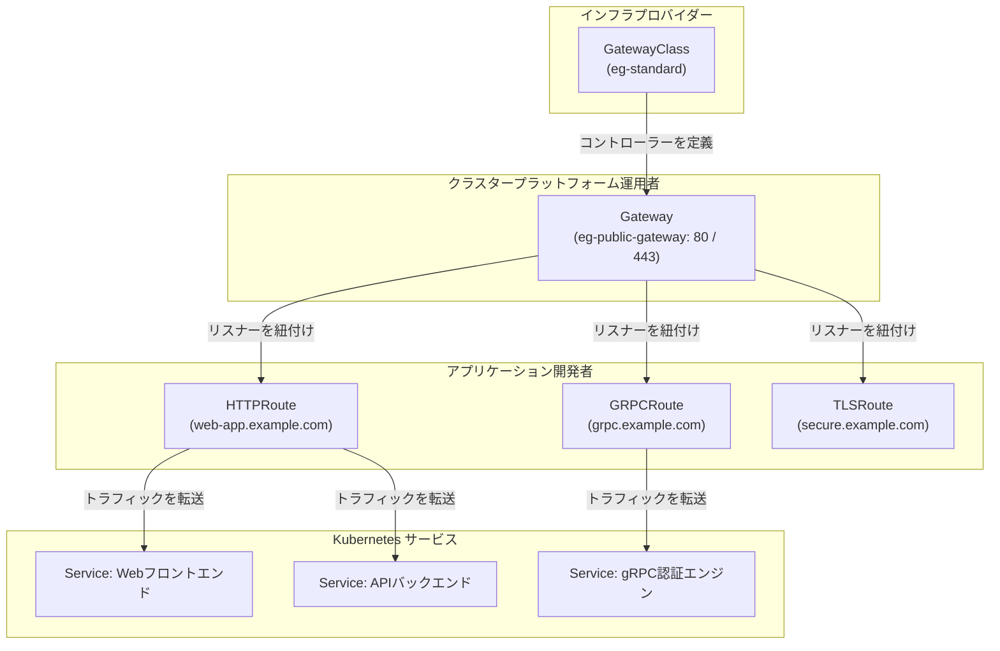
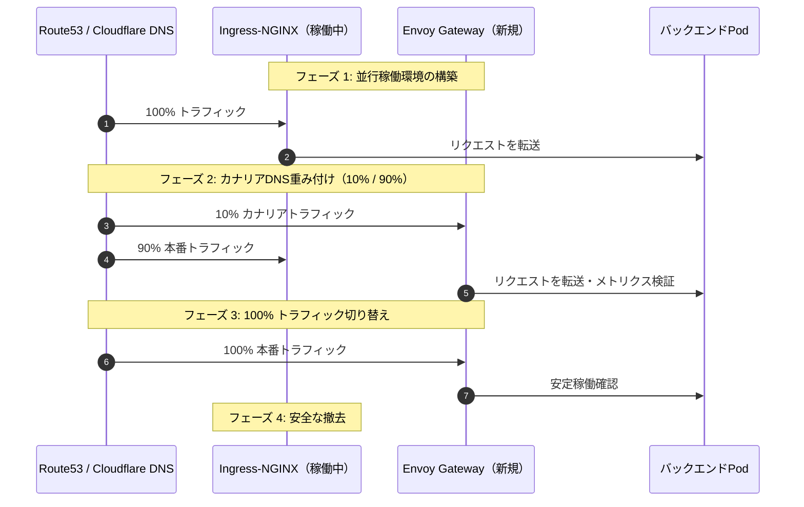

Kubernetes Ingress APIは、過去10年近くにわたりクラウドネイティブネットワーキングの基盤として機能してきましたが、高度なトラフィック管理ポリシー、マルチテナント境界、プロトコルを考慮したルーティングを表現する上で構造的な限界を抱えていました。Ingressではベンダー固有のアノテーション（`nginx.ingress.kubernetes.io/*`）への依存を強いられ、設定の乱立、移植性の欠如、共有インフラでの障害影響範囲の拡大といった課題が存在していました。

**Kubernetes Gateway API**は、Kubernetesにおけるサービスネットワーキングの公式な次世代標準です。表現力豊かなロール指向のリソースモデルに基づき、インフラストラクチャのプロビジョニングとアプリケーションルーティングを明確に分離します。Gateway APIに特化したCNCF公認のEnvoy Proxyコントロールプレーンである**Envoy Gateway**を採用することで、エンジニアリングチームはIngress-NGINXのアノテーション負債を解消し、ネイティブなトラフィック分割、プロトコルネイティブなgRPC/TLSルーティング、ワーカープロセスの再起動を伴わない動的設定更新を実現できます。

本記事では、Ingress-NGINXからEnvoy Gatewayへのアーキテクチャの変遷、コアリソースの設定、高度なルーティングの実装、`cert-manager`によるTLS自動終端、グローバルレート制限、そしてゼロダウンタイム移行プレイブックを詳細に解説します。

<AudioPlayer src="/static/audio/envoy-gateway-api-kubernetes-ingress-deep-dive-ja.mp3" title="音声エグゼクティブ・ブリーフィング" voice="Google Cloud ja-JP-Neural2-B" />

## Kubernetes Gateway APIを理解する

Kubernetes Gateway APIは、イングレストラフィック管理のための宣言型で拡張可能なロール指向の仕様フレームワークを提供します。インフラのプロビジョニング、ホスト設定、パスルーティングを単一のスキーマに混在させていた従来のIngressリソースとは異なり、Gateway APIは責任を明確なリソースに分割します。

### コアアーキテクチャとリソース

Gateway APIのアーキテクチャは、主に以下の4つのリソースタイプで構成されます。



1. **`GatewayClass`**: コントローラーの実装（例：`gateway.envoyproxy.io/gatewayclass-controller`）を定義します。インフラプロバイダーが管理します。
2. **`Gateway`**: トラフィックを受け付けるエントリーポイント（ロードバランサー、EnvoyプロキシPod、リッスンポート、TLS証明書、許可されたネームスペース）を定義します。プラットフォーム運用者が管理します。
3. **`ルートリソース` (`HTTPRoute`, `GRPCRoute`, `TLSRoute`, `TCPRoute`, `UDPRoute`)**: プロトコルを認識したルーティングルール、マッピング、フィルター、転送先`backendRefs`を定義します。アプリケーション開発チームが管理します。
4. **`ReferenceGrant`**: ネームスペースをまたぐ参照（例：`envoy-gateway-system`のGatewayから`production`のSecretやServiceへの参照）を明示的に許可し、厳格なセキュリティ境界を強制します。

### ロール指向の設計と関心の分離

従来のIngress APIでは権限競合が頻発していました。開発者にIngressの編集権限を付与すると、クラスター全体の設定を上書きしたり、SSL証明書を誤設定したり、他チームのホスト名を意図せず奪ってしまう危険がありました。

Gateway APIは組織のロールに応じて責務を厳格に分離します：

| ペルソナ | 主要リソース | 主な運用責務 |
| :--- | :--- | :--- |
| **インフラプロバイダー** | `GatewayClass` | コントローラーの導入、CRD管理、ネットワーク基盤のバインド |
| **プラットフォーム運用者** | `Gateway` | IPアドレス割り当て、ファイアウォール、ポート（80/443）、証明書発行者、テナント境界 |
| **アプリケーション開発者** | `HTTPRoute` / `GRPCRoute` | パスルーティング、URLリライト、カナリア分割、ヘッダーマッチング、バックエンドサービス |

### Ingressに対するアーキテクチャ上の利点

* **ネイティブマルチテナンシー**: 異なるネームスペースのルートが、中央の共有Gatewayに対して安全にバインドできます。
* **ポータブルな標準機能**: ヘッダー操作、重み付けトラフィック分散、クエリパラメータマッチング、リダイレクトがベンダー依存のアノテーションではなく標準仕様として提供されます。
* **きめ細かな検証**: Admission WebhookとCRDスキーマにより、無効な設定を適用前に検知・ブロックします。
* **双方向ステータスレポート**: `Gateway`や`HTTPRoute`のステータス条件により、リスナーの結合状況やルーティング受付の成否を正確に把握できます。

## Envoy Gatewayの紹介

Envoy Gatewayは、Envoy ProxyプロジェクトおよびCNCF傘下で開発されているオープンソースプロジェクトです。Kubernetes Gateway APIリソースを直接解釈する軽量かつ専用のコントロールプレーンを提供します。

### なぜEnvoy Gatewayなのか？

これまでEnvoy ProxyをIngressとして利用するには、IstioやContourのような大規模フレームワークが必要であり、独自CRDや運用オーバーヘッドが課題でした。Envoy Gatewayは以下の特長を備えています：

1. **Gateway APIネイティブ対応**: Kubernetes標準のGateway API CRDを直接ネイティブ言語として扱い、余計な抽象化層を挟みません。
2. **高速なxDSコントロールプレーン**: Gateway APIリソースをインメモリで動的にEnvoy Discovery Service（xDS）設定に変換し、ワーカープロセスの再起動なしでPodへ即座にストリーミング配信します。
3. **エンタープライズエッジ機能**: 分散レート制限、OAuth2/OIDC/JWT認証、OpenTelemetry分散トレーシングをネイティブにサポートします。

### アーキテクチャ比較: Ingress-NGINX vs. Envoy Gateway

| 機能項目 | Ingress-NGINX | Envoy Gateway |
| :--- | :--- | :--- |
| **設定標準** | `networking.k8s.io/v1 Ingress` + アノテーション | `gateway.networking.k8s.io/v1 Gateway API` |
| **データプレーンエンジン** | NGINX（C言語ベースのイベントループ） | Envoy Proxy（最新のC++17イベント駆動アーキテクチャ） |
| **設定リロード** | テンプレートレンダリング + `nginx -s reload`（長寿命接続の切断リスクあり） | ゼロリロード動的xDSストリーミング（接続を完全に維持） |
| **カナリア・トラフィック分割** | 複雑なアノテーション（`nginx.ingress.kubernetes.io/canary`） | `backendRefs`のネイティブ`weight`フィールドでミリ秒単位の制御 |
| **gRPC・HTTP/2サポート** | 多重化の制約、アノテーション設定の複雑さ | ネイティブの双方向ストリーミング、`GRPCRoute` CRD |
| **クロスネームスペースルーティング** | 全体権限またはハックが必要 | `parentRefs`と`ReferenceGrant`で標準対応 |
| **レート制限** | ローカルメモリのリーキーバケット（外部Memcached必要） | グローバルRedisバックエンドを備えた分散レート制限サービス |

## インストールと初期セットアップ

それでは、Envoy GatewayをKubernetesクラスターに導入し、インフラとなるGatewayを構築します。

### 前提条件

* Kubernetesクラスター バージョン **1.26以上**
* クラスター管理者権限を持つ `kubectl`
* ローカルにインストールされた `helm` v3.10以上

### HelmによるEnvoy Gatewayのインストール

公式のHelmリポジトリを追加し、コントローラーをデプロイします：

```bash
# 1. Helmリポジトリの追加と更新
helm repo add envoy-gateway https://envoyproxy.github.io/gateway-helm/
helm repo update

# 2. 専用ネームスペースへのインストール
helm install envoy-gateway envoy-gateway/envoy-gateway \
  --namespace envoy-gateway-system \
  --create-namespace \
  --set deployment.replicas=2
```

コントローラーPodおよびGatewayClassが正しく認識されていることを確認します：

```bash
# Podの稼働確認
kubectl get pods -n envoy-gateway-system

# GatewayClassの登録確認
kubectl get gatewayclass
```

期待される出力例：
```text
NAME          CONTROLLER                                      ACCEPTED   AGE
eg-standard   gateway.envoyproxy.io/gatewayclass-controller   True       45s
```

### GatewayおよびGatewayClassのデプロイ

GatewayClassが利用可能になったら、パブリックトラフィックを受け付ける`Gateway`リソースを作成します：

```yaml
# gateway.yaml
apiVersion: gateway.networking.k8s.io/v1
kind: Gateway
metadata:
  name: eg-public-gateway
  namespace: envoy-gateway-system
spec:
  gatewayClassName: eg-standard
  listeners:
    - name: http
      protocol: HTTP
      port: 80
      allowedRoutes:
        namespaces:
          from: All
    - name: https
      protocol: HTTPS
      port: 443
      tls:
        mode: Terminate
        certificateRefs:
          - kind: Secret
            name: production-wildcard-tls
      allowedRoutes:
        namespaces:
          from: All
```

マニフェストを適用します：

```bash
kubectl apply -f gateway.yaml
```

Envoy Gatewayが自動的にデータプレーンのEnvoy Proxy Deploymentと`LoadBalancer`タイプのServiceをプロビジョニングします。割り当てられた外部IPを確認します：

```bash
kubectl get gateway eg-public-gateway -n envoy-gateway-system -w
```

期待される出力例：
```text
NAME                CLASS         ADDRESS          READY   AGE
eg-public-gateway   eg-standard   198.51.100.42    True    1m
```

この外部IPアドレス（`198.51.100.42`）に対してDNSレコードを設定します。

## Gateway APIによるトラフィックルーティングパターン

`Gateway`が立ち上がれば、アプリケーション開発者はGateway自体を変更することなく、独立してルーティングを定義できます。

### HTTPRoute: パスおよびヘッダーベースのルーティング

`HTTPRoute`はパス、ヘッダー、クエリパラメータ、HTTPメソッドによる包括的なマッチングルールを提供します。

バックエンド用のサンプルServiceとDeploymentを用意します：

```yaml
# sample-apps.yaml
apiVersion: apps/v1
kind: Deployment
metadata:
  name: web-frontend
  namespace: default
spec:
  replicas: 2
  selector:
    matchLabels:
      app: web-frontend
  template:
    metadata:
      labels:
        app: web-frontend
    spec:
      containers:
        - name: app
          image: nginxdemos/hello:plain-text
          ports:
            - containerPort: 80
---
apiVersion: v1
kind: Service
metadata:
  name: web-frontend
  namespace: default
spec:
  selector:
    app: web-frontend
  ports:
    - port: 80
      targetPort: 80
---
apiVersion: apps/v1
kind: Deployment
metadata:
  name: api-backend
  namespace: default
spec:
  replicas: 2
  selector:
    matchLabels:
      app: api-backend
  template:
    metadata:
      labels:
        app: api-backend
    spec:
      containers:
        - name: app
          image: nginxdemos/hello:plain-text
          ports:
            - containerPort: 80
---
apiVersion: v1
kind: Service
metadata:
  name: api-backend
  namespace: default
spec:
  selector:
    app: api-backend
  ports:
    - port: 80
      targetPort: 80
```

次に、`/api/v1`宛てのトラフィックを`api-backend`へ、その他を`web-frontend`へルーティングし、`X-Debug-Mode: true`ヘッダーが付与されている場合の特別ルールを定義した`HTTPRoute`を適用します：

```yaml
# httproute-advanced.yaml
apiVersion: gateway.networking.k8s.io/v1
kind: HTTPRoute
metadata:
  name: app-routing
  namespace: default
spec:
  parentRefs:
    - name: eg-public-gateway
      namespace: envoy-gateway-system
  hostnames:
    - "app.example.com"
  rules:
    # ルール 1: デバッグ用ヘッダーマッチング
    - matches:
        - headers:
            - name: X-Debug-Mode
              value: "true"
          path:
            type: PathPrefix
            value: /api
      backendRefs:
        - name: api-backend
          port: 80
    # ルール 2: APIパスプレフィックスとURLリライト
    - matches:
        - path:
            type: PathPrefix
            value: /api/v1
      filters:
        - type: URLRewrite
          urlRewrite:
            path:
              type: ReplacePrefixMatch
              replacePrefixMatch: /internal/v1
      backendRefs:
        - name: api-backend
          port: 80
    # ルール 3: デフォルトのルートパス
    - matches:
        - path:
            type: PathPrefix
            value: /
      backendRefs:
        - name: web-frontend
          port: 80
```

適用と動作検証を行います：

```bash
kubectl apply -f sample-apps.yaml
kubectl apply -f httproute-advanced.yaml

# リライト検証
curl -H "Host: app.example.com" http://198.51.100.42/api/v1/users
```

### GRPCRoute: ネイティブなマイクロサービスルーティング

Ingress-NGINXではアノテーションに頼る必要があったgRPCルーティングも、Gateway APIでは`GRPCRoute`としてネイティブにサポートされます：

```yaml
# grpc-route.yaml
apiVersion: gateway.networking.k8s.io/v1
kind: GRPCRoute
metadata:
  name: auth-grpc-route
  namespace: default
spec:
  parentRefs:
    - name: eg-public-gateway
      namespace: envoy-gateway-system
  hostnames:
    - "grpc.example.com"
  rules:
    - matches:
        - method:
            service: "auth.v1.AuthService"
            method: "Authenticate"
      backendRefs:
        - name: auth-service
          port: 50051
```

### TLSRoute: SNIベースのTLSパススルー

バックエンド自身がTLS終端を行うゼロトラスト暗号化通信（PostgreSQL SSL接続やmTLSサービス間通信など）には、`TLSRoute`を使用します：

```yaml
# tls-passthrough-route.yaml
apiVersion: gateway.networking.k8s.io/v1alpha2
kind: TLSRoute
metadata:
  name: secure-db-route
  namespace: default
spec:
  parentRefs:
    - name: eg-public-gateway
      namespace: envoy-gateway-system
      sectionName: https
  hostnames:
    - "secure.example.com"
  rules:
    - backendRefs:
        - name: internal-db-service
          port: 8443
```

Envoy ProxyはTLS ClientHello内のSNIヘッダーのみを検査し、ペイロードを復号することなくそのままTCPバイトストリームとしてバックエンドへ中継します。

## 実践移行: Ingress-NGINXからGateway APIへ

本番環境で一般的に利用されているIngress-NGINXの構成パターンをEnvoy Gatewayへ順次移行します。

### ステップ 1: IngressルールからHTTPRouteへのマッピング

従来のIngressマニフェスト：

```yaml
# 従来のIngress-NGINX
apiVersion: networking.k8s.io/v1
kind: Ingress
metadata:
  name: legacy-app-ingress
  annotations:
    kubernetes.io/ingress.class: "nginx"
    nginx.ingress.kubernetes.io/ssl-redirect: "true"
    nginx.ingress.kubernetes.io/rewrite-target: /$2
spec:
  rules:
    - host: portal.example.com
      http:
        paths:
          - path: /portal(/|$)(.*)
            pathType: ImplementationSpecific
            backend:
              service:
                name: portal-service
                port:
                  number: 8080
```

Gateway APIでは、以下のように標準化されたフィールドへ直接移行できます：

```yaml
# 最新のEnvoy Gateway HTTPRoute
apiVersion: gateway.networking.k8s.io/v1
kind: HTTPRoute
metadata:
  name: portal-route
  namespace: default
spec:
  parentRefs:
    - name: eg-public-gateway
      namespace: envoy-gateway-system
  hostnames:
    - "portal.example.com"
  rules:
    - matches:
        - path:
            type: PathPrefix
            value: /portal
      filters:
        - type: URLRewrite
          urlRewrite:
            path:
              type: ReplacePrefixMatch
              replacePrefixMatch: /
      backendRefs:
        - name: portal-service
          port: 8080
```

### ステップ 2: cert-managerによるTLS終端の自動化

Ingress-NGINXでは各Ingressに`cert-manager.io/cluster-issuer`をアノテーションとして付与していましたが、Gateway APIではTLS証明書のライフサイクルは`Gateway`インフラ層に集約されます。

1. Let's Encrypt用の`ClusterIssuer`を定義：

```yaml
# cluster-issuer.yaml
apiVersion: cert-manager.io/v1
kind: ClusterIssuer
metadata:
  name: letsencrypt-prod
spec:
  acme:
    server: https://acme-v02.api.letsencrypt.org/directory
    email: devops@example.com
    privateKeySecretRef:
      name: letsencrypt-prod-account-key
    solvers:
      - http01:
          gatewayHTTPRoute:
            parentRefs:
              - name: eg-public-gateway
                namespace: envoy-gateway-system
```

2. 証明書リソースを作成：

```yaml
# certificate.yaml
apiVersion: cert-manager.io/v1
kind: Certificate
metadata:
  name: portal-example-tls
  namespace: envoy-gateway-system
spec:
  secretName: portal-example-tls
  issuerRef:
    name: letsencrypt-prod
    kind: ClusterIssuer
  dnsNames:
    - "portal.example.com"
```

3. GatewayのHTTPSリスナーに証明書Secretを紐付け：

```yaml
    - name: https-portal
      protocol: HTTPS
      port: 443
      hostname: "portal.example.com"
      tls:
        mode: Terminate
        certificateRefs:
          - kind: Secret
            name: portal-example-tls
```

### ステップ 3: 重み付けによるカナリアデプロイ

Ingress-NGINXではカナリアテスト用に複数のIngressを作成し、難解なアノテーション（`nginx.ingress.kubernetes.io/canary: "true"`）を駆使する必要がありました。

Envoy Gatewayでは、`backendRefs`内の`weight`フィールドで直接重み付けを指定できます：

```yaml
# canary-route.yaml
apiVersion: gateway.networking.k8s.io/v1
kind: HTTPRoute
metadata:
  name: customer-service-canary
  namespace: default
spec:
  parentRefs:
    - name: eg-public-gateway
      namespace: envoy-gateway-system
  hostnames:
    - "customer.example.com"
  rules:
    - matches:
        - path:
            type: PathPrefix
            value: /
      backendRefs:
        - name: customer-service-v1
          port: 8080
          weight: 80
        - name: customer-service-v2
          port: 8080
          weight: 20
```

Envoy Proxyのスムーズなランダム重み付けクラスター選択により、リロードのオーバーヘッドなしに正確な80/20トラフィック分散が保証されます。

### ステップ 4: 分散グローバルレート制限

Envoy Gatewayは`BackendTrafficPolicy`を用いて、Envoyの分散レート制限サービスと透過的に連携します：

```yaml
# rate-limit-policy.yaml
apiVersion: gateway.envoyproxy.io/v1alpha1
kind: BackendTrafficPolicy
metadata:
  name: api-rate-limit
  namespace: default
spec:
  targetRef:
    group: gateway.networking.k8s.io
    kind: HTTPRoute
    name: app-routing
  rateLimit:
    type: Global
    global:
      rules:
        - clientSelectors:
            - sourceCIDR:
                type: Distinct
          limit:
            requests: 100
            unit: Minute
```

クライアントIPが1分間に100リクエストを超過した場合、Envoy Gatewayは標準の`Retry-After`ヘッダーとともに`HTTP 429 (Too Many Requests)`を返却します。

## ゼロダウンタイム移行戦略

ミッションクリティカルな本番環境でIngress-NGINXからEnvoy Gatewayへ安全に切り替えるための段階的移行手順です。



### デュアルIngress並行稼働パターン

1. **並行デプロイ**: 既存のIngress-NGINXを動かしたまま、同一クラスターにEnvoy Gatewayをデプロイします。Envoy Gateway専用のロードバランサーIP（例：`198.51.100.42`）が払い出されます。
2. **ルーティングの事前検証**: すべての`HTTPRoute`をデプロイ後、`curl`の`Host`ヘッダーを用いてEnvoy GatewayのIPに対して直接接続テストを行います：
   ```bash
   curl -vkI -H "Host: portal.example.com" https://198.51.100.42/portal
   ```

### カナリアDNSトラフィックシフト

DNSの重み付け機能（AWS Route53 Weighted RecordsやCloudflare Load Balancing）を利用して、段階的にトラフィックを移動します：

* **ステップ 1（カナリア 5%）**: 5%のトラフィックをEnvoy Gatewayへ転送し、エラーレート（`5xx`）、レイテンシ（p99）、接続リセットをGrafanaで監視。
* **ステップ 2（拡大 25% → 50%）**: 4〜6時間かけて重みを拡大。TLSハンドシェイクの遅延やセッション維持に問題がないことを確認。
* **ステップ 3（完全切り替え 100%）**: すべてのDNSトラフィックをEnvoy Gatewayへ向けます。

### 可観測性、ヘルスチェック、ロールバック計画

* **自動ロールバック基準**: 移行期間中にp99レイテンシが15%以上悪化、または`5xx`エラー率が0.05%を超えた場合、即座にDNSを100% Ingress-NGINXへ戻します。Ingress-NGINXは常に稼働しているため、DNS TTLに応じた数秒から数分でロールバックが完了します。
* **Ingress-NGINXの安全な停止**: 完全切り替え後48時間はIngress-NGINXを待機状態で維持し、アクセスログでリクエストが完全に途絶えたことを確認した上でアンインストールします。


## 知識を確認する（インタラクティブクイズ）

<Quiz questions={
  [
    {
      "question": "プラットフォームチームは、Kubernetes Gateway APIを使用してIngress-NGINXからEnvoy Gatewayへの移行を進めています。複数のアプリケーションチームがマイクロサービスをデプロイしており、それぞれが独自のトラフィックルーティングルールを必要とし、中にはgRPCルーティングやトラフィック分割のような高度な機能も含まれています。このシナリオにおいて、Gateway APIがIngress-NGINXと比較して提供する主要なアーキテクチャ上の利点を最もよく説明しているのは次のうちどれですか？",
      "options": [
        "Gateway APIは、すべてのルーティングルールを単一の`Gateway`リソースに統合することで設定を簡素化し、Kubernetesオブジェクトの数を削減します。",
        "Gateway APIの`GatewayClass`リソースは、アプリケーション開発者が独自のカスタムIngressコントローラーを定義することを可能にし、柔軟性を高めます。",
        "Gateway APIのロール指向設計（例：プラットフォームオペレーター向けの`Gateway`、アプリケーション開発者向けの`HTTPRoute`）は、関心の分離を改善し、設定変更による「blast radius」を低減します。",
        "Envoy Gatewayは、設定に関係なく、Ingress-NGINXよりも本質的に優れたパフォーマンスと低レイテンシーを提供するため、直接的なパフォーマンスアップグレードとなります。"
      ],
      "correctAnswer": 2,
      "explanation": "Gateway APIの核となる強みは、そのロール指向設計にあります。プラットフォームオペレーターは共有インフラストラクチャを定義する`Gateway`リソースを管理し、アプリケーション開発者は自身の特定のアプリケーション向けに`Route`リソース（`HTTPRoute`、`GRPCRoute`）を管理します。これにより、インフラストラクチャのプロビジョニングとアプリケーションルーティングが分離され、Ingress-NGINXのannotationに依存したアプローチでよく見られる「fragile configuration sprawl」や「high blast radius」の問題を防ぎます。オプションAは、Gateway APIが明示的により多くの、しかし専門化されたリソースを導入するため誤りです。オプションBは誤りです。`GatewayClass`は*コントローラーの実装*を定義するものであり、アプリケーション開発者がカスタムコントローラーを定義することを許可するものではありません。オプションDはEnvoyの潜在的な利点ですが、この文脈におけるGateway API自体の*主要なアーキテクチャ上の利点*ではありません。"
    },
    {
      "question": "ある組織がKubernetes Gateway APIとEnvoy Gatewayの採用を検討しています。プロトコルネイティブなgRPCルーティングや、サービスのリロードなしでの動的な設定更新など、高度なトラフィック管理ポリシーがサポートされることを確認することが重要な懸念事項です。次の記述のうち、Gateway APIとEnvoy Gatewayが従来のIngress-NGINXと比較してこれらの要件にどのように対応するかを正確に反映しているのはどれですか？",
      "options": [
        "Ingress-NGINXは、広範なカスタムLuaスクリプトとアノテーションを通じてプロトコルネイティブなgRPCルーティングと動的更新を実現できるため、これらの機能のためにGateway APIは不要です。",
        "Gateway APIは、特に`GRPCRoute`リソースにより、プロトコルを意識したgRPCルーティングをネイティブにサポートし、Envoy Gatewayのアーキテクチャはプロキシの再起動なしで動的な設定更新を可能にします。",
        "Ingress-NGINXとEnvoy Gatewayの両方で、トラフィックルーティングの変更を適用するにはIngressコントローラーのPodを手動で再起動する必要があり、動的な更新は同様に困難です。",
        "Gateway APIはHTTP/HTTPSルーティングのみに焦点を当てており、gRPCサポートにはEnvoy Gatewayとは別に専用のgRPCプロキシが必要になります。"
      ],
      "correctAnswer": 1,
      "explanation": "記事では、Gateway APIが「ネイティブなトラフィック分割、プロトコルネイティブなgRPC/TLSルーティング、およびリロードペナルティなしの動的な設定更新を可能にする」と明示的に述べています。これは、ベンダー固有のアノテーションに依存し、特定の変更のためにリロードが必要になることが多いIngress-NGINXと比較して、大きな利点です。オプションAは誤りです。Ingress-NGINXは拡張可能ですが、「ネイティブ」ではなく、しばしば「fragile configuration sprawl」につながります。オプションCは誤りです。Envoy Gatewayは動的な更新のために設計されています。オプションDは誤りです。Gateway APIにはネイティブなgRPCサポートのための`GRPCRoute`が含まれています。"
    }
  ]
} />


## よくある質問（FAQ）

### Envoy GatewayとIngress-NGINXのパフォーマンス差はどうですか？
通常の高並行ベンチマークにおいて、Envoy GatewayはIngress-NGINXと同等以上のスループットを発揮します。特に設定変更時の挙動において顕著な差があり、NGINXがワーカーのリロードによって一時的な遅延スパイクや長時間のストリーム切断を引き起こすのに対し、Envoy GatewayはxDSによる動的更新を行うためパケットドロップや切断が一切発生しません。

### IngressとGateway APIは同じクラスター内で共存できますか？
はい。Kubernetes Gateway APIとIngressは異なるAPIグループ（`gateway.networking.k8s.io` と `networking.k8s.io`）を使用しているため、同一クラスター内で無期限に共存可能です。サービス単位で計画的に移行を進めることができます。

### Envoy GatewayはカスタムフィルターやWASMに対応していますか？
はい。Envoy Gatewayは`EnvoyExtensionPolicy` CRDを提供しており、Luaスクリプト、WebAssembly（WASM）バイナリ、あるいはEnvoyのネイティブC++フィルターをリクエスト・レスポンスパイプラインに柔軟に注入できます。

### cert-managerはGateway APIとどのように統合されますか？
`cert-manager` v1.11以降ではGateway APIが標準サポートされています。ACME Issuerに`gatewayHTTPRoute`ソルバーを設定することで、HTTP01チャレンジ用のルートが自動生成され、発行された証明書はGatewayが参照するKubernetes Secretへ自動格納されます。

## まとめと次のステップ

Kubernetes Gateway APIは、過去10年にわたりIngress-NGINXに蓄積されてきたアノテーション依存と権限管理の負債を本質的に解消します。ロール指向のリソース設計とプロトコルネイティブな表現力により、現代のマイクロサービス基盤に不可欠なネットワーキング標準を提供します。

Envoy Proxyの信頼性の高いデータプレーンとゼロリロードの動的アーキテクチャを備えた**Envoy Gateway**は、Kubernetesネットワーキング基盤を近代化するための最も有力な選択肢です。

次のステップとして：
* クラスターにマニフェストを適用し、ステージング環境でルーティングを検証してみましょう。
* UpstashやElastiCacheなどのRedisクラスターと連携した分散レート制限の導入を検討してください。
* カーネルレベルのデータプレーンルーティングに関心がある方は、[Cilium Service Mesh with eBPF vs. Envoy](/ja/blog/cilium-service-mesh-ebpf-vs-envoy) のアーキテクチャ解説もぜひご覧ください。
