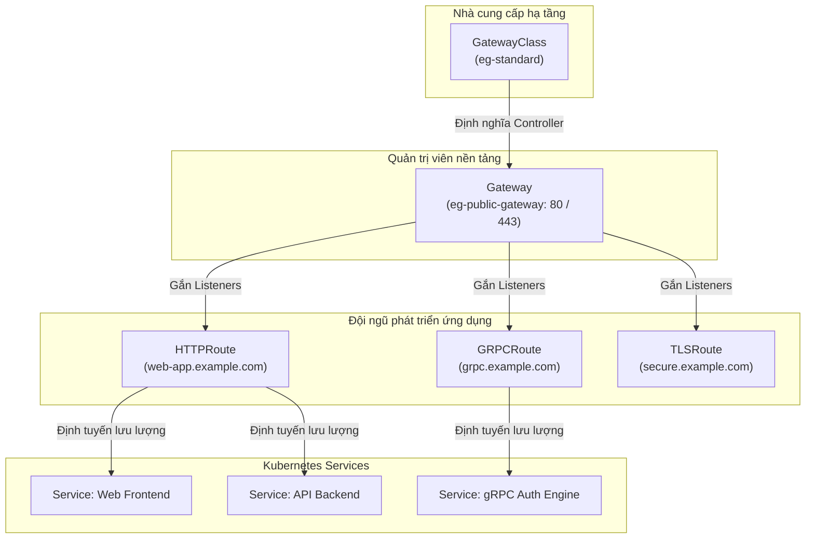
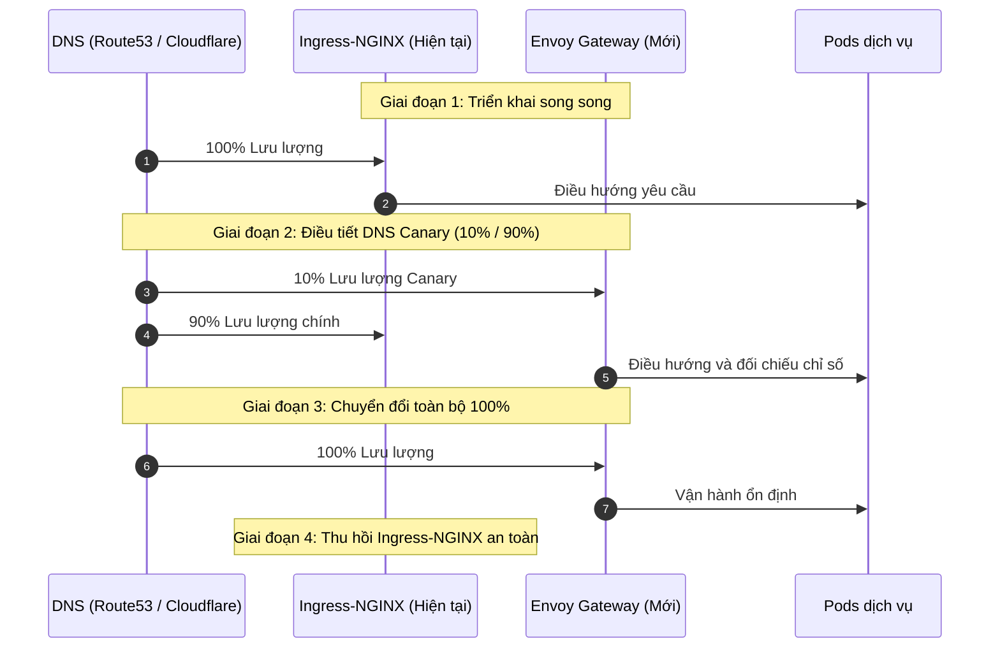

API Ingress của Kubernetes, dù đã đóng vai trò nền tảng cho mạng cloud-native trong gần một thập kỷ qua, vẫn bộc lộ những hạn chế cấu trúc nghiêm trọng khi xử lý các chính sách quản lý lưu lượng nâng cao, ranh giới đa người dùng (multi-tenant) và định tuyến giao thức chuyên sâu. Ingress buộc các đội ngũ vận hành nền tảng phải phụ thuộc vào các annotation riêng của từng nhà cung cấp (`nginx.ingress.kubernetes.io/*`), dẫn đến sự phân mảnh cấu hình, thiếu tính di động và rủi ro ảnh hưởng diện rộng trên cụm điều khiển chung.

**Kubernetes Gateway API** là tiêu chuẩn thế hệ mới chính thức dành cho mạng dịch vụ trong Kubernetes. Vận hành dựa trên mô hình tài nguyên hướng vai trò và có tính biểu đạt cao, Gateway API tách biệt hoàn toàn việc cấp phát hạ tầng khỏi quy tắc định tuyến ứng dụng. Kết hợp với **Envoy Gateway**—bộ điều khiển Envoy Proxy chính thức thuộc CNCF được thiết kế chuyên biệt cho Gateway API—các đội ngũ kỹ sư có thể xóa bỏ hoàn toàn món nợ kỹ thuật từ annotation của Ingress-NGINX, mở khóa tính năng chia tải theo trọng số, định tuyến gRPC/TLS nguyên bản và cập nhật cấu hình theo thời gian thực mà không làm gián đoạn kết nối.

Trong bài viết chuyên sâu này, chúng ta sẽ phân tích bước chuyển dịch kiến trúc từ Ingress-NGINX sang Envoy Gateway, thiết lập các tài nguyên cốt lõi, áp dụng các mẫu định tuyến nâng cao, tự động hóa cấp phát chứng chỉ TLS với `cert-manager`, thực thi giới hạn lưu lượng (rate limiting) phân tán và triển khai quy trình di chuyển không gián đoạn (zero-downtime).

<AudioPlayer src="/static/audio/envoy-gateway-api-kubernetes-ingress-deep-dive-vi.mp3" title="Tóm tắt âm thanh cho kỹ sư" voice="Google Cloud vi-VN-Neural2-A" />

## Tìm hiểu API Gateway của Kubernetes

Kubernetes Gateway API cung cấp một khuôn khổ đặc tả mang tính khai báo, có khả năng mở rộng cao và định hướng theo vai trò để quản lý lưu lượng truy cập vào cụm. Không giống như tài nguyên Ingress truyền thống gom việc cấp phát hạ tầng, cấu hình máy chủ và định tuyến đường dẫn vào một schema duy nhất, Gateway API chia nhỏ trách nhiệm thành các tài nguyên độc lập.

### Kiến trúc cốt lõi và các tài nguyên

Kiến trúc của Gateway API được xây dựng dựa trên 4 loại tài nguyên chủ chốt:



1. **`GatewayClass`**: Định nghĩa mẫu triển khai và bộ điều khiển cơ sở (ví dụ: `gateway.envoyproxy.io/gatewayclass-controller`). Do nhà cung cấp hạ tầng quản lý.
2. **`Gateway`**: Đại diện cho điểm tiếp nhận lưu lượng thực tế (bộ cân bằng tải đám mây, các Pod Envoy proxy, cổng lắng nghe, chứng chỉ TLS và các namespace được phép kết nối). Do kỹ sư vận hành nền tảng quản lý.
3. **`Tài nguyên tuyến đường` (`HTTPRoute`, `GRPCRoute`, `TLSRoute`, `TCPRoute`, `UDPRoute`)**: Định nghĩa quy tắc định tuyến nhận biết giao thức, khớp điều kiện, bộ lọc và các dịch vụ đích (`backendRefs`). Do các đội ngũ phát triển ứng dụng quản lý độc lập.
4. **`ReferenceGrant`**: Cho phép tường minh việc tham chiếu chéo giữa các namespace (ví dụ: cho phép Gateway trong namespace `envoy-gateway-system` tham chiếu Secret hoặc Service trong namespace `production`), đảm bảo ranh giới bảo mật nghiêm ngặt.

### Thiết kế theo vai trò và phân tách trách nhiệm

Ingress API từng gặp xung đột quyền nghiêm trọng: khi trao quyền chỉnh sửa Ingress cho lập trình viên, họ có thể vô tình ghi đè cấu hình toàn cụm, sai sót cấu hình chứng chỉ SSL hoặc chiếm quyền tên miền của nhóm khác.

Gateway API phân tách rạch ròi trách nhiệm theo từng vai trò cụ thể:

| Vai trò | Tài nguyên chính | Trách nhiệm vận hành |
| :--- | :--- | :--- |
| **Nhà cung cấp hạ tầng** | `GatewayClass` | Quản lý cài đặt bộ điều khiển, cập nhật CRD và liên kết mạng cơ sở. |
| **Quản trị viên nền tảng** | `Gateway` | Quản lý IP public, tường lửa, mở cổng (80/443), tổ chức cấp phát chứng chỉ và ranh giới tenant. |
| **Lập trình viên ứng dụng** | `HTTPRoute` / `GRPCRoute` | Cấu hình định tuyến đường dẫn, viết lại URL, chia tải canary, lọc header và gán backend. |

### Lợi ích kiến trúc vượt trội so với Ingress

* **Hỗ trợ đa người dùng (Multi-tenancy) nguyên bản**: Các Route ở các namespace khác nhau có thể gắn kết an toàn vào một Gateway tập trung mà không cần quyền quản trị cụm.
* **Tính năng tiêu chuẩn hóa**: Xử lý header, chia tải theo trọng số, khớp query parameter và chuyển hướng HTTP đều là các trường chuẩn mực thay vì các annotation riêng lẻ.
* **Kiểm tra hợp lệ chi tiết**: Admission Webhook và schema CRD ngăn chặn cấu hình sai ngay từ trước khi áp dụng vào cluster.
* **Báo cáo trạng thái hai chiều**: Trường status trên `Gateway` và `HTTPRoute` cho biết chính xác listener đã gắn kết thành công hay chưa, route đã được chấp nhận hay gặp lỗi backend.

## Giới thiệu Envoy Gateway

Envoy Gateway là dự án mã nguồn mở trực thuộc tổ chức Envoy Proxy và CNCF. Mục tiêu của dự án là đơn giản hóa việc vận hành Envoy Proxy trong Kubernetes bằng cách cung cấp một control plane chuyên dụng tiếp nhận trực tiếp Kubernetes Gateway API.

### Tại sao lại chọn Envoy Gateway?

Trước đây, để chạy Envoy Proxy làm Ingress, người ta phải dựa vào các giải pháp phức tạp như Istio hay Contour với các CRD tự chế (`VirtualService`, `HTTPProxy`) gây tốn tài nguyên. Envoy Gateway mang lại:

1. **Hỗ trợ Gateway API nguyên bản**: Sử dụng trực tiếp các CRD chuẩn của Kubernetes mà không qua tầng trung gian nào.
2. **Control Plane xDS hiệu năng cao**: Chuyển đổi tài nguyên Gateway API thành cấu hình Envoy Discovery Service (xDS) trong bộ nhớ, cập nhật trực tiếp tới các Envoy Proxy Pod mà không cần khởi động lại tiến trình worker.
3. **Tính năng biên mạng cấp doanh nghiệp**: Tích hợp sẵn giới hạn tốc độ phân tán, xác thực toàn cầu (OAuth2 / OIDC / JWT) và truy vết phân tán qua OpenTelemetry.

### So sánh kiến trúc: Ingress-NGINX vs. Envoy Gateway

| Tiêu chí | Ingress-NGINX | Envoy Gateway |
| :--- | :--- | :--- |
| **Chuẩn cấu hình** | `networking.k8s.io/v1 Ingress` + Annotations | `gateway.networking.k8s.io/v1 Gateway API` |
| **Data Plane** | NGINX (Event loop viết bằng C) | Envoy Proxy (Kiến trúc hướng sự kiện viết bằng C++17 hiện đại) |
| **Cập nhật cấu hình** | Tạo lại file cấu hình + `nginx -s reload` (nguy cơ ngắt kết nối WebSocket/gRPC) | Cập nhật động qua xDS streaming (không ngắt kết nối) |
| **Chia tải Canary** | Annotation phức tạp (`nginx.ingress.kubernetes.io/canary`) | Thuộc tính `weight` nguyên bản trong `backendRefs` |
| **Hỗ trợ gRPC & HTTP/2** | Cấu hình rườm rà, hạn chế kết nối đa luồng | Hỗ trợ luồng hai chiều nguyên bản với CRD `GRPCRoute` |
| **Định tuyến xuyên namespace** | Cần phân quyền toàn cụm hoặc thủ thuật riêng | Hỗ trợ sẵn qua `parentRefs` và `ReferenceGrant` |
| **Giới hạn tốc độ (Rate Limit)**| Bộ nhớ cục bộ leaky-bucket (cần thêm Memcached ngoài) | Dịch vụ Envoy Rate Limit phân tán với backend Redis toàn cầu |

## Cài đặt và thiết lập ban đầu

Chúng ta sẽ tiến hành triển khai Envoy Gateway vào cụm Kubernetes và khởi tạo Gateway tiếp nhận lưu lượng truy cập bên ngoài.

### Điều kiện tiên quyết

* Cụm Kubernetes phiên bản **1.26 trở lên**.
* Đã cấu hình `kubectl` với quyền quản trị viên cụm (cluster-admin).
* Đã cài đặt `helm` phiên bản v3.10+.

### Cài đặt Envoy Gateway bằng Helm

Thêm kho lưu trữ Helm chính thức của Envoy Gateway và cài đặt bộ điều khiển:

```bash
# 1. Thêm và cập nhật kho Helm
helm repo add envoy-gateway https://envoyproxy.github.io/gateway-helm/
helm repo update

# 2. Cài đặt Envoy Gateway vào namespace riêng biệt
helm install envoy-gateway envoy-gateway/envoy-gateway \
  --namespace envoy-gateway-system \
  --create-namespace \
  --set deployment.replicas=2
```

Kiểm tra trạng thái các Pod điều khiển và GatewayClass:

```bash
# Kiểm tra Pod controller đã Ready
kubectl get pods -n envoy-gateway-system

# Kiểm tra GatewayClass đã được đăng ký
kubectl get gatewayclass
```

Kết quả hiển thị:
```text
NAME          CONTROLLER                                      ACCEPTED   AGE
eg-standard   gateway.envoyproxy.io/gatewayclass-controller   True       45s
```

### Triển khai tài nguyên Gateway và GatewayClass

Sau khi GatewayClass sẵn sàng, kỹ sư nền tảng sẽ triển khai `Gateway` phục vụ lưu lượng công khai:

```yaml
# gateway.yaml
apiVersion: gateway.networking.k8s.io/v1
kind: Gateway
metadata:
  name: eg-public-gateway
  namespace: envoy-gateway-system
spec:
  gatewayClassName: eg-standard
  listeners:
    - name: http
      protocol: HTTP
      port: 80
      allowedRoutes:
        namespaces:
          from: All
    - name: https
      protocol: HTTPS
      port: 443
      tls:
        mode: Terminate
        certificateRefs:
          - kind: Secret
            name: production-wildcard-tls
      allowedRoutes:
        namespaces:
          from: All
```

Áp dụng manifest trên vào cụm:

```bash
kubectl apply -f gateway.yaml
```

Envoy Gateway sẽ tự động khởi tạo Deployment cho Envoy Proxy và một Service kiểu `LoadBalancer`. Theo dõi để nhận địa chỉ IP công khai:

```bash
kubectl get gateway eg-public-gateway -n envoy-gateway-system -w
```

Kết quả hiển thị:
```text
NAME                CLASS         ADDRESS          READY   AGE
eg-public-gateway   eg-standard   198.51.100.42    True    1m
```

Lưu lại địa chỉ IP này (`198.51.100.42`) để trỏ bản ghi DNS máy chủ của bạn.

## Các mẫu định tuyến lưu lượng với Gateway API

Khi `Gateway` đã hoạt động, các nhóm phát triển ứng dụng có thể tạo các quy tắc định tuyến độc lập mà không cần can thiệp vào cấu hình Gateway chung.

### HTTPRoute: Định tuyến theo đường dẫn và header

`HTTPRoute` hỗ trợ kiểm tra điều kiện đa dạng dựa trên path, header, query parameter và phương thức HTTP.

Triển khai hai dịch vụ backend mẫu:

```yaml
# sample-apps.yaml
apiVersion: apps/v1
kind: Deployment
metadata:
  name: web-frontend
  namespace: default
spec:
  replicas: 2
  selector:
    matchLabels:
      app: web-frontend
  template:
    metadata:
      labels:
        app: web-frontend
    spec:
      containers:
        - name: app
          image: nginxdemos/hello:plain-text
          ports:
            - containerPort: 80
---
apiVersion: v1
kind: Service
metadata:
  name: web-frontend
  namespace: default
spec:
  selector:
    app: web-frontend
  ports:
    - port: 80
      targetPort: 80
---
apiVersion: apps/v1
kind: Deployment
metadata:
  name: api-backend
  namespace: default
spec:
  replicas: 2
  selector:
    matchLabels:
      app: api-backend
  template:
    metadata:
      labels:
        app: api-backend
    spec:
      containers:
        - name: app
          image: nginxdemos/hello:plain-text
          ports:
            - containerPort: 80
---
apiVersion: v1
kind: Service
metadata:
  name: api-backend
  namespace: default
spec:
  selector:
    app: api-backend
  ports:
    - port: 80
      targetPort: 80
```

Cấu hình `HTTPRoute` để định tuyến các yêu cầu `/api/v1` về `api-backend` (kèm URL rewrite) và các đường dẫn còn lại về `web-frontend`, đồng thời ưu tiên định tuyến riêng khi có header `X-Debug-Mode: true`:

```yaml
# httproute-advanced.yaml
apiVersion: gateway.networking.k8s.io/v1
kind: HTTPRoute
metadata:
  name: app-routing
  namespace: default
spec:
  parentRefs:
    - name: eg-public-gateway
      namespace: envoy-gateway-system
  hostnames:
    - "app.example.com"
  rules:
    # Quy tắc 1: Khớp theo header debug
    - matches:
        - headers:
            - name: X-Debug-Mode
              value: "true"
          path:
            type: PathPrefix
            value: /api
      backendRefs:
        - name: api-backend
          port: 80
    # Quy tắc 2: Khớp tiền tố API và viết lại URL
    - matches:
        - path:
            type: PathPrefix
            value: /api/v1
      filters:
        - type: URLRewrite
          urlRewrite:
            path:
              type: ReplacePrefixMatch
              replacePrefixMatch: /internal/v1
      backendRefs:
        - name: api-backend
          port: 80
    # Quy tắc 3: Khớp đường dẫn mặc định
    - matches:
        - path:
            type: PathPrefix
            value: /
      backendRefs:
        - name: web-frontend
          port: 80
```

Áp dụng và kiểm tra hoạt động:

```bash
kubectl apply -f sample-apps.yaml
kubectl apply -f httproute-advanced.yaml

# Thử nghiệm gửi yêu cầu qua cURL
curl -H "Host: app.example.com" http://198.51.100.42/api/v1/users
```

### GRPCRoute: Định tuyến dịch vụ Microservice nguyên bản

Với gRPC, thay vì phải cấu hình các annotation phức tạp như trên NGINX, bạn sử dụng trực tiếp tài nguyên `GRPCRoute`:

```yaml
# grpc-route.yaml
apiVersion: gateway.networking.k8s.io/v1
kind: GRPCRoute
metadata:
  name: auth-grpc-route
  namespace: default
spec:
  parentRefs:
    - name: eg-public-gateway
      namespace: envoy-gateway-system
  hostnames:
    - "grpc.example.com"
  rules:
    - matches:
        - method:
            service: "auth.v1.AuthService"
            method: "Authenticate"
      backendRefs:
        - name: auth-service
          port: 50051
```

### TLSRoute: Chuyển tiếp mã hóa TLS dựa trên SNI

Đối với các ứng dụng yêu cầu mô hình Zero-Trust khép kín (nơi Pod backend tự kết thúc chứng chỉ TLS của mình như PostgreSQL SSL hoặc dịch vụ mTLS nội bộ), chúng ta sử dụng `TLSRoute`:

```yaml
# tls-passthrough-route.yaml
apiVersion: gateway.networking.k8s.io/v1alpha2
kind: TLSRoute
metadata:
  name: secure-db-route
  namespace: default
spec:
  parentRefs:
    - name: eg-public-gateway
      namespace: envoy-gateway-system
      sectionName: https
  hostnames:
    - "secure.example.com"
  rules:
    - backendRefs:
        - name: internal-db-service
          port: 8443
```

Trong chế độ này, Envoy Proxy chỉ đọc trường SNI trong gói tin TLS ClientHello để chuyển tiếp luồng TCP thô tới backend mà không giải mã nội dung.

## Hướng dẫn chuyển đổi thực tế: Từ Ingress-NGINX sang Gateway API

Cùng đối chiếu và chuyển đổi các mô hình cấu hình quen thuộc từ Ingress-NGINX sang Envoy Gateway.

### Bước 1: Ánh xạ quy tắc Ingress sang HTTPRoute

Tài nguyên Ingress-NGINX truyền thống:

```yaml
# Ingress-NGINX cũ
apiVersion: networking.k8s.io/v1
kind: Ingress
metadata:
  name: legacy-app-ingress
  annotations:
    kubernetes.io/ingress.class: "nginx"
    nginx.ingress.kubernetes.io/ssl-redirect: "true"
    nginx.ingress.kubernetes.io/rewrite-target: /$2
spec:
  rules:
    - host: portal.example.com
      http:
        paths:
          - path: /portal(/|$)(.*)
            pathType: ImplementationSpecific
            backend:
              service:
                name: portal-service
                port:
                  number: 8080
```

Chuyển đổi sang `HTTPRoute` chuẩn mực trong Gateway API:

```yaml
# Envoy Gateway HTTPRoute hiện đại
apiVersion: gateway.networking.k8s.io/v1
kind: HTTPRoute
metadata:
  name: portal-route
  namespace: default
spec:
  parentRefs:
    - name: eg-public-gateway
      namespace: envoy-gateway-system
  hostnames:
    - "portal.example.com"
  rules:
    - matches:
        - path:
            type: PathPrefix
            value: /portal
      filters:
        - type: URLRewrite
          urlRewrite:
            path:
              type: ReplacePrefixMatch
              replacePrefixMatch: /
      backendRefs:
        - name: portal-service
          port: 8080
```

### Bước 2: Tự động hóa cấp chứng chỉ TLS với cert-manager

Với Ingress-NGINX, annotation của cert-manager thường được gắn trực tiếp trên từng Ingress. Trong Gateway API, quản lý chứng chỉ thuộc về tầng hạ tầng `Gateway`.

1. Khởi tạo `ClusterIssuer` của Let's Encrypt:

```yaml
# cluster-issuer.yaml
apiVersion: cert-manager.io/v1
kind: ClusterIssuer
metadata:
  name: letsencrypt-prod
spec:
  acme:
    server: https://acme-v02.api.letsencrypt.org/directory
    email: devops@example.com
    privateKeySecretRef:
      name: letsencrypt-prod-account-key
    solvers:
      - http01:
          gatewayHTTPRoute:
            parentRefs:
              - name: eg-public-gateway
                namespace: envoy-gateway-system
```

2. Yêu cầu cấp chứng chỉ cho tên miền:

```yaml
# certificate.yaml
apiVersion: cert-manager.io/v1
kind: Certificate
metadata:
  name: portal-example-tls
  namespace: envoy-gateway-system
spec:
  secretName: portal-example-tls
  issuerRef:
    name: letsencrypt-prod
    kind: ClusterIssuer
  dnsNames:
    - "portal.example.com"
```

3. Gắn Secret chứng chỉ vào listener HTTPS trong `gateway.yaml`:

```yaml
    - name: https-portal
      protocol: HTTPS
      port: 443
      hostname: "portal.example.com"
      tls:
        mode: Terminate
        certificateRefs:
          - kind: Secret
            name: portal-example-tls
```

### Bước 3: Triển khai Canary với phân bổ lưu lượng theo trọng số

Trước đây, canary trên Ingress-NGINX đòi hỏi tạo thêm Ingress thứ hai kèm các annotation như `nginx.ingress.kubernetes.io/canary: "true"` và `nginx.ingress.kubernetes.io/canary-weight: "20"`.

Với Envoy Gateway, tính năng chia trọng số được tích hợp sẵn ngay trong `backendRefs`:

```yaml
# canary-route.yaml
apiVersion: gateway.networking.k8s.io/v1
kind: HTTPRoute
metadata:
  name: customer-service-canary
  namespace: default
spec:
  parentRefs:
    - name: eg-public-gateway
      namespace: envoy-gateway-system
  hostnames:
    - "customer.example.com"
  rules:
    - matches:
        - path:
            type: PathPrefix
            value: /
      backendRefs:
        - name: customer-service-v1
          port: 8080
          weight: 80
        - name: customer-service-v2
          port: 8080
          weight: 20
```

Thuật toán chọn cụm theo trọng số ngẫu nhiên mượt mà của Envoy Proxy đảm bảo tỉ lệ chia tải 80/20 diễn ra chính xác mà không phát sinh độ trễ do tải lại tiến trình.

### Bước 4: Giới hạn lưu lượng phân tán (Global Rate Limiting)

Để bảo vệ hệ thống trước tấn công từ chối dịch vụ hoặc lạm dụng API, Envoy Gateway kết nối trực tiếp với dịch vụ Rate Limit phân tán thông qua chính sách `BackendTrafficPolicy`:

```yaml
# rate-limit-policy.yaml
apiVersion: gateway.envoyproxy.io/v1alpha1
kind: BackendTrafficPolicy
metadata:
  name: api-rate-limit
  namespace: default
spec:
  targetRef:
    group: gateway.networking.k8s.io
    kind: HTTPRoute
    name: app-routing
  rateLimit:
    type: Global
    global:
      rules:
        - clientSelectors:
            - sourceCIDR:
                type: Distinct
          limit:
            requests: 100
            unit: Minute
```

Khi một địa chỉ IP vượt quá hạn mức 100 yêu cầu trong 1 phút trên toàn cụm, Envoy Gateway sẽ tự động trả về mã lỗi `HTTP 429 (Too Many Requests)` đi kèm header `Retry-After`.

## Chiến lược di chuyển không gián đoạn (Zero-Downtime)

Để chuyển đổi một cụm sản xuất quan trọng từ Ingress-NGINX sang Envoy Gateway một cách an toàn, cần thực hiện theo lộ trình song song từng bước.



### Mô hình song song Dual-Ingress

1. **Cài đặt độc lập**: Cài đặt Envoy Gateway song song trên cùng một cụm Kubernetes trong khi Ingress-NGINX vẫn đang xử lý lưu lượng chính. Envoy Gateway sẽ được cấp phát một IP LoadBalancer riêng (`198.51.100.42`).
2. **Đối chiếu và kiểm thử trước**: Sau khi tạo đầy đủ các `HTTPRoute`, hãy sử dụng `curl` với header `Host` để kiểm tra trực tiếp qua IP của Envoy Gateway:
   ```bash
   curl -vkI -H "Host: portal.example.com" https://198.51.100.42/portal
   ```

### Chuyển đổi lưu lượng dần dần qua DNS Canary

Sử dụng tính năng DNS có trọng số (như AWS Route53 Weighted Records hoặc Cloudflare Load Balancing) để dịch chuyển lưu lượng theo từng đợt:

* **Bước 1 (Thử nghiệm 5%)**: Trỏ 5% lưu lượng người dùng thực sang Envoy Gateway. Quan sát tỷ lệ lỗi `5xx`, độ trễ p99 và tình trạng ngắt kết nối trên hệ thống giám sát.
* **Bước 2 (Nâng dần 25% → 50%)**: Mở rộng lưu lượng trong vòng 4-6 giờ. Xác thực độ trễ bắt tay TLS và khả năng duy trì phiên (session stickiness).
* **Bước 3 (Chuyển đổi 100%)**: Trỏ toàn bộ 100% lưu lượng DNS sang Envoy Gateway.

### Khả năng quan sát, kiểm tra sức khỏe và kế hoạch Rollback

* **Cơ chế Rollback tức thì**: Nếu độ trễ p99 của Envoy Gateway tăng trên 15% hoặc tỷ lệ lỗi `5xx` vượt quá 0.05% trong quá trình chuyển đổi, bạn chỉ cần chuyển bản ghi trọng số DNS về 100% cho Ingress-NGINX. Vì Ingress-NGINX vẫn hoạt động bình thường, việc rollback sẽ hoàn tất chỉ trong vài giây đến vài phút tùy theo TTL của DNS.
* **Gỡ bỏ Ingress-NGINX an toàn**: Sau khi hệ thống chạy ổn định qua Envoy Gateway trong 48 giờ và không còn yêu cầu nào rơi vào Ingress-NGINX, tiến hành gỡ bỏ Ingress-NGINX qua Helm.


## Kiểm tra kiến thức

<Quiz questions={
  [
    {
      "question": "Một đội ngũ platform đang di chuyển từ Ingress-NGINX sang Envoy Gateway sử dụng Kubernetes Gateway API. Họ có nhiều đội ngũ ứng dụng triển khai các microservice, mỗi đội ngũ yêu cầu các quy tắc định tuyến lưu lượng riêng biệt, một số có các tính năng nâng cao như định tuyến gRPC và chia tách lưu lượng. Điều nào sau đây mô tả tốt nhất lợi thế kiến trúc chính mà Gateway API mang lại trong kịch bản này so với Ingress-NGINX?",
      "options": [
        "Gateway API đơn giản hóa cấu hình bằng cách hợp nhất tất cả các quy tắc định tuyến vào một tài nguyên `Gateway` duy nhất, giảm số lượng đối tượng Kubernetes.",
        "Tài nguyên `GatewayClass` của Gateway API cho phép các nhà phát triển ứng dụng định nghĩa các ingress controller tùy chỉnh của riêng họ, tăng tính linh hoạt.",
        "Thiết kế hướng vai trò của Gateway API (ví dụ: `Gateway` cho operator platform, `HTTPRoute` cho nhà phát triển ứng dụng) cho phép phân tách mối quan tâm tốt hơn và giảm 'blast radius' của các thay đổi cấu hình.",
        "Envoy Gateway vốn dĩ cung cấp hiệu suất tốt hơn và độ trễ thấp hơn Ingress-NGINX, biến nó thành một nâng cấp hiệu suất trực tiếp bất kể cấu hình."
      ],
      "correctAnswer": 2,
      "explanation": "Điểm mạnh cốt lõi của Gateway API nằm ở thiết kế hướng vai trò của nó. Các operator platform quản lý tài nguyên `Gateway`, định nghĩa cơ sở hạ tầng dùng chung, trong khi các nhà phát triển ứng dụng quản lý tài nguyên `Route` (`HTTPRoute`, `GRPCRoute`) cho các ứng dụng cụ thể của họ. Điều này tách rời việc cung cấp cơ sở hạ tầng khỏi định tuyến ứng dụng, ngăn chặn 'fragile configuration sprawl' và các vấn đề 'high blast radius' thường gặp với cách tiếp cận nặng annotation của Ingress-NGINX. Lựa chọn A không đúng vì Gateway API rõ ràng giới thiệu nhiều tài nguyên hơn, nhưng chuyên biệt hơn. Lựa chọn B không đúng; `GatewayClass` định nghĩa *triển khai controller*, chứ không cho phép nhà phát triển ứng dụng định nghĩa các controller tùy chỉnh. Lựa chọn D là một lợi ích tiềm năng của Envoy nhưng không phải là *lợi thế kiến trúc chính* của bản thân Gateway API trong ngữ cảnh này."
    },
    {
      "question": "Một tổ chức đang xem xét áp dụng Kubernetes Gateway API với Envoy Gateway. Một mối quan tâm chính là đảm bảo rằng các chính sách quản lý lưu lượng nâng cao, chẳng hạn như định tuyến gRPC native theo giao thức và cập nhật cấu hình động mà không cần khởi động lại dịch vụ, được hỗ trợ. Phát biểu nào sau đây phản ánh chính xác cách Gateway API và Envoy Gateway giải quyết các yêu cầu này so với Ingress-NGINX truyền thống?",
      "options": [
        "Ingress-NGINX có thể đạt được định tuyến gRPC native theo giao thức và cập nhật động thông qua việc sử dụng rộng rãi các tập lệnh Lua tùy chỉnh và annotation, khiến Gateway API không cần thiết cho các tính năng này.",
        "Gateway API, đặc biệt với tài nguyên `GRPCRoute`, hỗ trợ định tuyến gRPC nhận biết giao thức một cách native, và kiến trúc của Envoy Gateway cho phép cập nhật cấu hình động mà không cần khởi động lại proxy.",
        "Cả Ingress-NGINX và Envoy Gateway đều yêu cầu khởi động lại thủ công các pod của ingress controller để áp dụng bất kỳ thay đổi định tuyến lưu lượng nào, khiến việc cập nhật động trở nên khó khăn như nhau.",
        "Gateway API chỉ tập trung vào định tuyến HTTP/HTTPS, và hỗ trợ gRPC vẫn sẽ yêu cầu một proxy gRPC chuyên dụng riêng biệt bên cạnh Envoy Gateway."
      ],
      "correctAnswer": 1,
      "explanation": "Bài viết nêu rõ rằng Gateway API 'mở khóa khả năng chia tách lưu lượng native, định tuyến gRPC/TLS native theo giao thức và cập nhật cấu hình động mà không bị phạt do khởi động lại.' Đây là một lợi thế đáng kể so với Ingress-NGINX, vốn thường dựa vào các annotation dành riêng cho nhà cung cấp và có thể yêu cầu khởi động lại cho một số thay đổi nhất định. Lựa chọn A không đúng vì mặc dù Ingress-NGINX có thể được mở rộng, nhưng nó không 'native' và thường dẫn đến 'fragile configuration sprawl.' Lựa chọn C không đúng vì Envoy Gateway được thiết kế để cập nhật động. Lựa chọn D không đúng vì Gateway API bao gồm `GRPCRoute` để hỗ trợ gRPC native."
    }
  ]
} />


## Câu hỏi thường gặp (FAQ)

### Hiệu năng giữa Envoy Gateway và Ingress-NGINX chênh lệch như thế nào?
Trong các bài kiểm tra chịu tải thực tế, Envoy Gateway cho thông lượng xử lý HTTP tương đương Ingress-NGINX nhưng vượt trội hoàn toàn khi có thay đổi cấu hình. Khi NGINX phải tải lại tiến trình (dễ gây nghẽn tạm thời và ngắt các kết nối WebSocket hoặc gRPC đang mở), Envoy Gateway sử dụng xDS streaming để cập nhật cấu hình theo thời gian thực mà không làm rớt bất kỳ gói tin nào.

### Ingress và Gateway API có thể chạy cùng nhau trong một cụm không?
Hoàn toàn có thể. Kubernetes Gateway API và Ingress sử dụng hai nhóm API riêng biệt (`gateway.networking.k8s.io` và `networking.k8s.io`). Chúng có thể vận hành song song vô thời hạn trong cùng một cụm, cho phép các đội ngũ di chuyển từng dịch vụ theo lộ trình riêng.

### Envoy Gateway có hỗ trợ các bộ lọc tùy biến và WASM không?
Có. Envoy Gateway cung cấp CRD `EnvoyExtensionPolicy`, cho phép kỹ sư tích hợp các đoạn mã Lua, module WebAssembly (WASM) hoặc các filter C++ bản địa của Envoy vào chuỗi xử lý yêu cầu/phản hồi.

### cert-manager tích hợp với Gateway API như thế nào?
Kể từ phiên bản 1.11, `cert-manager` đã hỗ trợ Gateway API nguyên bản. Bằng cách khai báo solver `gatewayHTTPRoute` trong ACME Issuer, `cert-manager` sẽ tự động tạo các tuyến đường tạm thời để vượt qua xác thực Let's Encrypt HTTP01 và lưu trữ chứng chỉ vào Kubernetes Secret để Gateway sử dụng.

## Kết luận và các bước tiếp theo

Kubernetes Gateway API giải quyết triệt để những món nợ kỹ thuật tồn đọng của Ingress-NGINX trong suốt thập kỷ qua. Với mô hình tài nguyên hướng vai trò, các chuẩn định tuyến phong phú và ranh giới bảo mật vững chắc, nó thiết lập nền móng vững chãi cho các kiến trúc microservices hiện đại.

Được hậu thuẫn bởi data plane bền bỉ của Envoy Proxy và cơ chế cập nhật động không cần reload, **Envoy Gateway** là sự lựa chọn hàng đầu cho các doanh nghiệp muốn hiện đại hóa hạ tầng mạng trên Kubernetes.

Các bước tiếp theo dành cho bạn:
* Triển khai các manifest mẫu lên cụm staging để kiểm thử.
* Cấu hình giải pháp giới hạn tốc độ phân tán kết hợp với Redis cluster (như Upstash hoặc ElastiCache).
* Khám phá thêm bài viết phân tích chuyên sâu [Cilium Service Mesh với eBPF vs. Envoy](/vi/blog/cilium-service-mesh-ebpf-vs-envoy) để hiểu sâu hơn về định tuyến ở tầng Linux Kernel.
