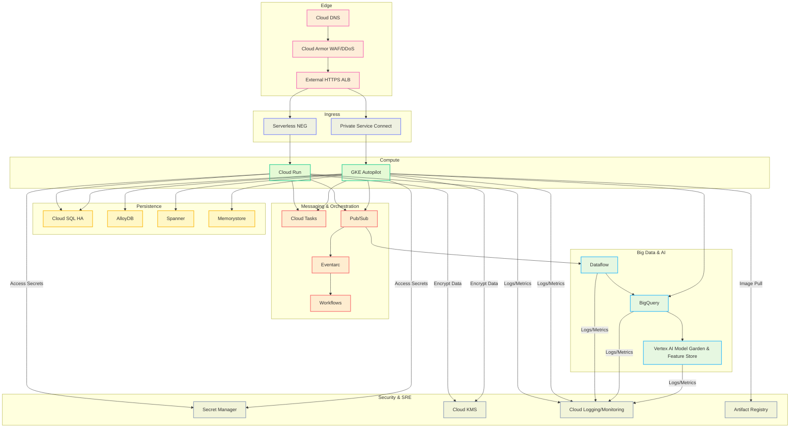

# Executive Overview: The Google Cloud Architectural Mental Model

Google Cloud Platform (GCP) is not merely a collection of services; it is an exposed manifestation of Google's internal infrastructure, refined over decades of operating at planetary scale. Understanding this foundational mental model is critical for designing resilient, performant, and cost-optimized enterprise solutions.

<AudioPlayer src="/static/audio/google-cloud-platform-all-services-architecture-handbook.mp3" title="Executive Audio Briefing" voice="Google Cloud en-US-Neural2-F" />


## The Planetary Network: Jupiter Fabric

At the core of Google Cloud's differentiation is its global private network, often referred to as the Jupiter fabric. This is not the public internet; it's a dedicated, high-bandwidth, low-latency intercontinental network.

| Feature | Description | Impact |
|:--------|:------------|:-------|
| **Jupiter Fabric** | Google's private, software-defined network (SDN) connecting all data centers globally. | Predictable performance, reduced latency for inter-region traffic. |
| **1 Pbps Bisection Bandwidth** | The aggregate capacity of the network to carry traffic between any two halves of the network. | Eliminates network as a bottleneck for even the most demanding workloads. |
| **Andromeda SDN** | The network virtualization stack that powers VPCs, load balancing, and network services. | Enables advanced network features, microsegmentation, and policy enforcement. |
| **Premium Tier** | Default routing. Traffic enters Google's network at the nearest edge PoP and traverses the private backbone. | Optimal performance, lower latency, higher reliability. Recommended for most production workloads. |
| **Standard Tier** | Traffic enters Google's network closer to the destination region, utilizing the public internet for a significant portion of the path. | Cost-optimized for non-latency-sensitive workloads, egress charges are lower. |

**Pragmatic Takeaway:** Always default to Premium Tier for production applications. Standard Tier is suitable for development, testing, or specific cost-sensitive batch processing where latency is not critical. The performance difference is substantial.

## Resource Hierarchy

GCP's resource hierarchy provides a structured way to organize and manage resources, enforce policies, and control access. It's a critical component for governance and security.

| Level | Description | Key Use Cases |
|:------|:------------|:--------------|
| **Organization** | The root node for all Google Cloud resources belonging to a company. | Centralized billing, IAM, policy enforcement (Org Policies). |
| **Folders** | Group projects under an organization. Can be nested. | Departmental or environment-based grouping (e.g., `dev`, `prod`). |
| **Projects** | The fundamental unit for organizing resources. All resources belong to a project. | Billing, API management, resource isolation, IAM boundaries. |
| **Resources** | Individual services like Compute Engine instances, Cloud Storage buckets, BigQuery datasets. | Actual compute, storage, networking, and data assets. |

**IAM Policy Inheritance:** IAM policies set at a higher level (e.g., Organization, Folder) are inherited by all resources at lower levels. This enables granular control and simplifies policy management.

**Organizational Constraints (Org Policies):** These are powerful guardrails that allow administrators to define restrictions on how resources can be configured across the organization. Examples include restricting resource locations, disabling external IP addresses, or enforcing specific API usage.

```bash
# Example: List organization policies for a project
gcloud org-policies list --project=your-project-id

# Example: Describe a specific organization policy
gcloud org-policies describe compute.disableExternalIpAccess --organization=your-organization-id
```

## Borg Lineage

Google's internal cluster management system, Borg, is the direct ancestor of Kubernetes. Understanding this lineage provides insight into GCP's container-first philosophy and the design principles behind many of its services.

| Concept | Borg's Influence | GCP Manifestation |
|:--------|:-----------------|:------------------|
| **Containerization** | Borg pioneered container-based workload isolation and scheduling at scale. | Docker, Container Registry, Cloud Run, GKE. |
| **Declarative APIs** | Borg managed workloads via declarative specifications. | Kubernetes YAML, Cloud Deployment Manager, Terraform. |
| **Self-Healing Systems** | Borg automatically rescheduled failed tasks and maintained desired state. | GKE Autopilot, managed instance groups, Cloud Run's auto-scaling. |
| **Service Discovery** | Borg provided internal service discovery mechanisms. | Cloud DNS, internal load balancers, GKE service discovery. |
| **Resource Efficiency** | Borg's primary goal was maximizing cluster utilization. | GKE Autopilot's node management, serverless offerings (Cloud Run, Cloud Functions). |

**Pragmatic Takeaway:** Google Cloud is inherently designed for containerized, immutable infrastructure. Embrace this paradigm. Services like Cloud Run and GKE Autopilot are not just convenient; they represent the culmination of decades of Google's internal operational experience.

---

## End-to-End Enterprise Reference Architecture

This architecture illustrates a robust, secure, and scalable enterprise deployment on Google Cloud, emphasizing zero-trust principles and defense-in-depth.



**Zero-Trust Data Flow & Defense-in-Depth:**

1.  **Edge Security (Cloud DNS, Cloud Armor):** All external traffic is first routed through Cloud DNS and then subjected to Cloud Armor for DDoS protection and WAF capabilities. This is the first line of defense, filtering malicious traffic before it reaches compute resources.
2.  **Controlled Ingress (External HTTPS ALB, Serverless NEG, Private Service Connect):**
    *   The External HTTPS ALB terminates TLS, providing a single entry point.
    *   **Serverless NEG** directs traffic to Cloud Run, ensuring only authorized, authenticated requests reach the serverless functions. Cloud Run itself enforces IAM at the service level.
    *   **Private Service Connect (PSC)** is used for GKE Autopilot, ensuring that GKE services are not exposed to the public internet. All communication is private, within Google's network, even for external clients connecting via PSC endpoints. This eliminates public IP exposure for the GKE control plane and workloads.
3.  **Compute Isolation (Cloud Run, GKE Autopilot):**
    *   **Cloud Run:** Provides strong workload isolation, automatic scaling, and built-in security features. Each revision runs in an isolated sandbox.
    *   **GKE Autopilot:** Google manages the underlying infrastructure, including node provisioning, patching, and scaling, reducing the attack surface and operational overhead. Workloads run in isolated pods. Network policies within GKE further restrict pod-to-pod communication.
4.  **Data Persistence Security:**
    *   **Cloud SQL HA, AlloyDB, Spanner, Memorystore:** All data stores are managed services, offering encryption at rest and in transit by default. Access is controlled via IAM and private IP connectivity (VPC Service Controls can further restrict access). High Availability (HA) configurations ensure resilience.
5.  **Messaging & Orchestration Security:**
    *   **Cloud Tasks, Pub/Sub, Eventarc, Workflows:** These services facilitate asynchronous communication and workflow orchestration. Access is controlled via IAM. Pub/Sub topics can be secured with VPC Service Controls.
6.  **Big Data & AI Security:**
    *   **Dataflow, BigQuery, Vertex AI:** These services handle large-scale data processing and machine learning. Data is encrypted, and access is strictly controlled via IAM. BigQuery offers column-level security and data masking. Vertex AI ensures secure model deployment and data access.
7.  **Centralized Security & SRE (Secret Manager, KMS, Cloud Logging/Monitoring, Artifact Registry):**
    *   **Secret Manager:** Centralized, encrypted storage for API keys, database credentials, and other sensitive data. Applications retrieve secrets at runtime, avoiding hardcoding.
    *   **Cloud KMS:** Manages cryptographic keys for data encryption across services. Ensures separation of duties for key management.
    *   **Cloud Logging/Monitoring:** Provides comprehensive observability, auditing, and alerting. All service interactions are logged, enabling detection of anomalous behavior.
    *   **Artifact Registry:** Securely stores container images and other build artifacts. Enforces vulnerability scanning and ensures only trusted images are deployed.

This architecture embodies zero-trust by assuming no implicit trust, even within the network perimeter. Every interaction requires explicit authorization, and every layer provides defense against potential threats.

## Domain 1: Compute & Serverless Engine

This domain covers the core compute offerings within Google Cloud, ranging from fully managed serverless platforms to highly customizable virtual machines and container orchestration. The focus is on pragmatic application, understanding trade-offs, and leveraging advanced features for production-grade workloads.

### Cloud Run

Cloud Run is a fully managed compute platform for deploying containerized applications. It abstracts away infrastructure management, allowing developers to focus purely on code.

*   **Container Runtime**: Cloud Run executes OCI-compliant container images. It provides a robust, secure sandbox environment for each instance.
*   **Concurrency per Instance**: A single Cloud Run instance can handle multiple concurrent requests. The default is 80, configurable up to 1000. Higher concurrency can improve resource utilization but requires applications to be thread-safe and non-blocking.
*   **Scale-to-Zero**: A key serverless feature, Cloud Run automatically scales down to zero instances when there's no traffic, eliminating idle costs.
*   **Min-Instances**: To reduce cold start latency for critical applications, `min-instances` can be set to keep a specified number of instances warm and ready to serve traffic. This incurs continuous billing for those instances.
*   **Direct VPC Egress**: For secure and private communication with resources within a Virtual Private Cloud (VPC) network (e.g., Cloud SQL, Memorystore, internal APIs), Cloud Run can be configured for direct VPC egress. This routes all outbound traffic through a specified VPC connector.
*   **GPU Support**: Cloud Run now supports GPU acceleration for workloads requiring specialized processing, such as AI/ML inference. This is configured via the `--cpu` and `--gpu` flags.
*   **Cloud Run Jobs**: A distinct offering within Cloud Run for executing non-HTTP, short-lived, or long-running batch jobs. Jobs can be triggered manually, on a schedule, or via Eventarc. They support parallelism and retries.

### GKE (Google Kubernetes Engine)

GKE is Google Cloud's managed Kubernetes service, providing a robust platform for deploying, managing, and scaling containerized applications.

*   **Autopilot vs Standard**:
 | Feature | GKE Standard | GKE Autopilot |
 | :------ | :----------- | :------------ |
 | Node Mgmt | User-managed | Google-managed |
 | Pricing | VM + GKE fee | Pod-based |
 | Customization | High (node pools, OS) | Limited (pre-defined profiles) |
 | Security | Shared resp. | Enhanced (hardened nodes) |
 | Scaling | Manual/CA | Automatic (pod-driven) |
 | Use Case | Max control, custom OS | Hands-off, cost-optimized |
    *   **Tradeoffs**: Autopilot simplifies operations significantly by managing nodes, scaling, and patching. It's ideal for most workloads where node-level customization isn't critical. Standard offers granular control over node types, operating systems, and networking, suitable for highly specialized or legacy workloads.
    *   **Security Posture**: Autopilot provides a hardened security posture by default, with Google managing node OS and runtime security. Standard requires the user to manage node security updates and configurations.
    *   **Node Auto-provisioning**: In GKE Standard, this feature dynamically creates new node pools based on pending pod resource requests, optimizing resource allocation and reducing manual intervention.

*   **Multi-cluster Ingress**: Enables a single, global external IP address to route traffic to applications deployed across multiple GKE clusters, potentially in different regions. This provides global load balancing, failover, and simplified DNS management for geographically distributed services.
*   **Gateway API**: The next-generation API for Kubernetes ingress, offering more expressive and extensible ways to configure routing, traffic management, and policy enforcement compared to the older Ingress API. It introduces concepts like `GatewayClass`, `Gateway`, `HTTPRoute`, and `TCPRoute`.

### Compute Engine

Compute Engine offers highly customizable virtual machines (VMs) with various machine types, storage options, and pricing models.

*   **C3/N4 Machine Families**:
    *   **C3**: Optimized for high-performance computing (HPC), data analytics, and demanding enterprise workloads. Features 4th Gen Intel Xeon Scalable processors (Sapphire Rapids) and DDR5 memory. Offers high core counts and memory ratios.
    *   **N4**: General-purpose machine family, successor to N2. Provides a balance of performance and cost-effectiveness for a wide range of workloads.
*   **Hyperdisk**: Google Cloud's next-generation block storage for Compute Engine, offering significantly higher performance and flexibility than Persistent Disk.
    *   **Hyperdisk Balanced**: General-purpose, cost-effective block storage with good performance characteristics.
    *   **Hyperdisk Extreme**: Designed for the most demanding transactional workloads (e.g., large databases) requiring ultra-high IOPS and throughput.
    *   **Hyperdisk Throughput**: Optimized for throughput-intensive workloads (e.g., data analytics, streaming) where sequential I/O performance is critical.
*   **Spot VMs**: Highly cost-effective VMs that can be preempted by Compute Engine if resources are needed elsewhere. Ideal for fault-tolerant, stateless, or batch workloads where interruptions are acceptable. Significant cost savings (up to 91% off on-demand prices).
*   **Live Migration**: A Compute Engine feature that allows VMs to be migrated from one host machine to another without downtime. This is crucial for host maintenance, patching, and upgrades, ensuring high availability for critical applications.

### Cloud Functions (2nd Gen)

Cloud Functions 2nd Gen is built on Cloud Run, inheriting its underlying infrastructure and capabilities.

*   **Cloud Run Foundation**: Leveraging Cloud Run provides 2nd Gen functions with longer request timeouts, higher concurrency, and direct VPC egress capabilities, addressing limitations of 1st Gen.
*   **Eventarc Triggers**: Cloud Functions are primarily event-driven. Eventarc provides a unified mechanism to route events from over 100 Google Cloud sources (e.g., Cloud Storage, Pub/Sub, Firestore) to Cloud Functions, enabling robust event-driven architectures.
*   **Timeouts**: 2nd Gen functions support significantly longer timeouts, up to 60 minutes for HTTP functions and 9 hours for event-driven functions, accommodating more complex and long-running tasks.
*   **Concurrency**: Similar to Cloud Run, 2nd Gen functions can handle multiple concurrent requests per instance, improving resource utilization and reducing cold starts.

### Cloud Batch

Cloud Batch is a fully managed service for high-throughput batch computing. It simplifies the execution of large-scale, parallel, and sequential batch jobs.

*   **High-throughput Batch Computing**: Designed for workloads that require processing large datasets or running many independent tasks, such as scientific simulations, financial modeling, or media transcoding.
*   **MPI (Message Passing Interface)**: Cloud Batch supports MPI for tightly coupled parallel workloads, enabling communication between tasks running on different VMs within a job.
*   **Array Jobs**: A powerful feature allowing a single job definition to launch thousands of identical tasks, each processing a different input or part of a dataset. This is efficient for embarrassingly parallel workloads.
*   **Spot VM Fault Tolerance**: Cloud Batch can leverage Spot VMs for significant cost savings. It includes built-in mechanisms to handle preemption, such as automatic retries and checkpointing, making Spot VMs viable for many batch workloads.

### Compact Comparison Table

| Service | Primary Archetype | Best When | Avoid When |
| :------ | :---------------- | :-------- | :--------- |
| Cloud Run | Serverless Container | HTTP/Event-driven microservices, APIs | Long-running stateful apps, extreme GPU needs |
| GKE | Container Orchestration | Complex microservices, custom control, hybrid | Simple apps, minimal ops team |
| Compute Engine | IaaS VM | Legacy apps, custom OS, specific hardware | Serverless ideal, high ops overhead |
| Cloud Functions | Serverless FaaS | Event-driven, short-lived, stateless functions | Long-running processes, complex state |
| Cloud Batch | Batch Processing | HPC, large-scale data processing, array jobs | Real-time, interactive, low-latency |

### Production `gcloud` CLI Recipes

#### Cloud Run Service Deployment

```bash
# Deploy a Cloud Run service with specific resource limits, min/max instances, and VPC egress
gcloud run deploy my-service \
  --image gcr.io/my-project/my-app:v1.0.0 \
  --platform managed \
  --region us-central1 \
  --project my-project-id \
  --service-account my-service-account@my-project-id.iam.gserviceaccount.com \
  --cpu 2 \
  --memory 2Gi \
  --min-instances 1 \
  --max-instances 10 \
  --concurrency 80 \
  --timeout 300s \
  --vpc-egress all \
  --vpc-connector projects/my-project-id/locations/us-central1/connectors/my-vpc-connector \
  --set-env-vars ENV_VAR_KEY=ENV_VAR_VALUE \
  --no-allow-unauthenticated
```

#### Cloud Run Job Creation

```bash
# Create a Cloud Run Job for a batch task
gcloud run jobs create my-batch-job \
  --image gcr.io/my-project/my-batch-processor:v1.0.0 \
  --region us-central1 \
  --project my-project-id \
  --service-account my-batch-sa@my-project-id.iam.gserviceaccount.com \
  --cpu 4 \
  --memory 8Gi \
  --tasks 10 \
  --parallelism 5 \
  --timeout 3600s \
  --set-env-vars INPUT_BUCKET=gs://my-input-data,OUTPUT_BUCKET=gs://my-output-data
```

#### GKE Autopilot Cluster Creation

```bash
# Create a GKE Autopilot cluster with release channel and private endpoint
gcloud container clusters create-auto my-autopilot-cluster \
  --region us-central1 \
  --project my-project-id \
  --release-channel stable \
  --network projects/my-project-id/global/networks/my-vpc \
  --subnetwork projects/my-project-id/regions/us-central1/subnetworks/my-gke-subnet \
  --enable-private-nodes \
  --enable-private-endpoint \
  --master-ipv4-cidr 172.16.0.0/28 \
  --workload-pool my-project-id.svc.id.goog \
  --enable-workload-identity
```

#### Compute Engine Spot VM Instance Creation

```bash
# Create a Compute Engine Spot VM with Hyperdisk Balanced and a specific service account
gcloud compute instances create my-spot-vm \
  --project my-project-id \
  --zone us-central1-a \
  --machine-type n2-standard-4 \
  --provisioning-model SPOT \
  --instance-termination-action STOP \
  --boot-disk-device-name my-spot-boot-disk \
  --boot-disk-type hyperdisk-balanced \
  --boot-disk-size 50GB \
  --image-family debian-11 \
  --image-project debian-cloud \
  --network-interface network=my-vpc,subnet=my-compute-subnet \
  --service-account my-compute-sa@my-project-id.iam.gserviceaccount.com \
  --scopes=https://www.googleapis.com/auth/cloud-platform \
  --metadata startup-script='#!/bin/bash\necho "Hello from Spot VM" > /tmp/startup.txt'
```

#### Cloud Functions (2nd Gen) Deployment

```bash
# Deploy a 2nd Gen Cloud Function triggered by a Pub/Sub topic
gcloud functions deploy my-pubsub-function-v2 \
  --gen2 \
  --runtime python39 \
  --region us-central1 \
  --project my-project-id \
  --source ./function-source \
  --entry-point process_message \
  --trigger-topic my-pubsub-topic \
  --service-account my-function-sa@my-project-id.iam.gserviceaccount.com \
  --memory 512MB \
  --timeout 300s \
  --concurrency 10 \
  --vpc-connector projects/my-project-id/locations/us-central1/connectors/my-vpc-connector \
  --egress-settings private-ranges-only
```

#### Cloud Batch Job Submission

```bash
# Submit a Cloud Batch job using a JSON configuration file
# job_config.json example:
# {
#   "taskGroups": [
#     {
#       "taskSpec": {
#         "runnables": [
#           {
#             "script": {
#               "text": "echo 'Processing task ${BATCH_TASK_INDEX}' && sleep 10"
#             }
#           }
#         ],
#         "computeResource": {
#           "cpuMilli": 1000,
#           "memoryMib": 512
#         }
#       },
#       "taskCount": 5,
#       "parallelism": 2
#     }
#   ],
#   "allocationPolicy": {
#     "instances": [
#       {
#         "policy": {
#           "machineType": "e2-standard-2",
#           "provisioningModel": "SPOT"
#         }
#       }
#     ]
#   },
#   "logsPolicy": {
#     "destination": "CLOUD_LOGGING"
#   }
# }
gcloud batch jobs submit my-batch-job-from-file \
  --location us-central1 \
  --project my-project-id \
  --config job_config.json \
  --service-account my-batch-sa@my-project-id.iam.gserviceaccount.com

## Domain 2: Cloud Databases & In-Memory Stores

### Cloud SQL

Cloud SQL provides fully managed relational database services for PostgreSQL, MySQL, and SQL Server. It abstracts away operational overheads like patching, backups, and replication, allowing focus on application development.

#### PostgreSQL, MySQL, SQL Server

Cloud SQL supports the latest major versions of these popular engines, offering compatibility with existing applications and tools.

*   **PostgreSQL**: Robust, feature-rich, and extensible, often preferred for complex transactional workloads and GIS applications.
*   **MySQL**: Widely adopted, known for its ease of use and performance in web applications.
*   **SQL Server**: Essential for enterprises with existing Microsoft ecosystem dependencies, supporting features like Always On Availability Groups (managed by Cloud SQL).

#### High Availability (HA) Regional Failover

Cloud SQL HA ensures business continuity through automatic failover to a standby instance in a different availability zone within the same region. This is achieved by synchronously replicating data from the primary instance to the standby. In case of a primary instance failure (e.g., zone outage, instance crash), Cloud SQL automatically promotes the standby to primary, minimizing downtime.

*   **Mechanism**: Uses a shared IP address that automatically switches to the new primary.
*   **RPO/RTO**: Near-zero Recovery Point Objective (RPO) due to synchronous replication; Recovery Time Objective (RTO) typically under 60 seconds.

#### Automated Maintenance

Cloud SQL handles routine maintenance tasks such as OS patching, database engine updates, and security vulnerability fixes. Maintenance windows can be configured to minimize impact on production workloads, allowing specification of a preferred day and time range.

#### Read Replicas

Read replicas offload read-heavy workloads from the primary instance, improving performance and scalability. They are asynchronous copies of the primary instance, suitable for reporting, analytics, and geographically distributed read access.

*   **Cross-Region Replicas**: Can be provisioned in different regions for disaster recovery and reduced read latency for global users.
*   **Promotion**: A read replica can be promoted to a standalone primary instance, useful for disaster recovery or database migration scenarios.

#### Private IP Peering vs. Private Service Connect

Both mechanisms enable private connectivity to Cloud SQL instances, avoiding exposure over the public internet.

*   **Private IP Peering (VPC Network Peering)**:
    *   **Mechanism**: Connects your VPC network directly to Google's internal service producer network where Cloud SQL instances reside.
    *   **Setup**: Requires configuring a private IP range for Cloud SQL within your VPC.
    *   **Scope**: Network-wide peering, allowing all resources in your VPC to access Cloud SQL.
    *   **Limitations**: IP address space management can be complex; peering limits apply.

*   **Private Service Connect (PSC)**:
    *   **Mechanism**: Provides private access to managed services using internal IP addresses within your VPC, without VPC network peering.
    *   **Setup**: Creates a forwarding rule and an endpoint in your VPC that points to a service attachment in the service producer's network.
    *   **Scope**: More granular control, allowing specific endpoints for specific services.
    *   **Advantages**: Simplifies IP address management, avoids peering limits, and enhances network security by isolating service traffic. Recommended for new deployments.

### AlloyDB for PostgreSQL

AlloyDB is a fully managed, PostgreSQL-compatible database service designed for demanding enterprise workloads, offering superior performance and availability compared to standard PostgreSQL.

#### Disaggregated Compute & Storage Architecture

AlloyDB separates compute (query processing) from storage (data persistence).

*   **Compute Layer**: Consists of multiple independent compute nodes that process queries. These nodes are stateless and can scale independently.
*   **Storage Layer**: A distributed, shared storage service that stores data in a columnar format. It handles data replication, self-healing, and continuous backup.
*   **Benefits**: Enables rapid scaling of compute resources without affecting storage, and vice versa. Improves fault tolerance as compute nodes can fail independently without data loss.

#### Columnar Engine

AlloyDB incorporates a columnar engine for analytical queries. While PostgreSQL is primarily row-oriented, AlloyDB's intelligent storage layer can store data in a columnar format for specific tables or partitions, significantly accelerating analytical workloads (e.g., OLAP queries) without requiring separate ETL processes or data warehouses. This hybrid transactional/analytical processing (HTAP) capability is a key differentiator.

#### Transactional vs. Analytical Scaling

*   **Transactional Scaling**: Achieved by adding more compute nodes to handle increased concurrent transactions. The shared storage layer ensures data consistency across all nodes.
*   **Analytical Scaling**: The columnar engine and intelligent caching mechanisms optimize analytical query performance. Read replicas can also be used to offload analytical workloads. AlloyDB's architecture allows for efficient scaling of both types of workloads within a single database.

#### Vector Embeddings with pgvector

AlloyDB supports the `pgvector` extension, enabling efficient storage and querying of vector embeddings directly within the database. This is crucial for AI/ML applications, such as similarity search, recommendation engines, and semantic search.

*   **Capabilities**: Stores high-dimensional vectors, supports various distance metrics (e.g., L2 distance, cosine similarity), and provides optimized indexing for fast nearest-neighbor searches.
*   **Integration**: Allows developers to build AI-powered features directly into their applications without needing separate vector databases.

### Cloud Spanner

Cloud Spanner is a globally distributed, strongly consistent, relational database service built for mission-critical applications requiring high availability and massive scale.

#### TrueTime API

TrueTime is Spanner's foundational technology, providing globally consistent wall-clock time with bounded uncertainty.

*   **Mechanism**: Uses atomic clocks and GPS receivers in Google's data centers to synchronize time across all Spanner servers globally.
*   **Guarantees**: Provides a timestamp interval `[earliest, latest]` for every transaction, ensuring that all transactions committed before `t` are visible everywhere by `t`. This enables external consistency.
*   **Impact**: Eliminates the need for distributed commit protocols like Paxos or Raft for global consistency, simplifying application development and improving performance.

#### External Consistency

Spanner offers external consistency, a stronger guarantee than serializability. It means that the global order of transactions observed by any client matches the real-world wall-clock order of those transactions. This simplifies reasoning about distributed transactions and ensures data integrity across continents.

#### Regional vs. Multi-Regional Instances

*   **Regional Instances**: Data is replicated synchronously across three availability zones within a single Google Cloud region. Provides high availability within that region.
*   **Multi-Regional Instances**: Data is replicated synchronously across multiple regions (e.g., `nam-eur-asia1`). Offers extreme availability (99.999% SLA) and low-latency reads for globally distributed applications. Writes are still routed to a primary region for consistency.

#### Granular Instance Sizing (Processing Units)

Spanner instances are sized in "processing units" (PUs). Each PU provides a certain amount of CPU, memory, and I/O capacity.

*   **Scaling**: Instances can be scaled up or down by adding or removing PUs, allowing fine-grained control over performance and cost.
*   **Minimum**: A Spanner instance starts with 100 PUs (0.1 nodes).
*   **Automatic Scaling**: While not fully automatic, Spanner can be integrated with custom solutions to scale PUs based on metrics.

#### Spanner Graph

Spanner Graph is a capability that allows users to perform graph-like queries directly on Spanner data, leveraging its strong consistency and scalability. It's not a separate graph database but rather a set of features and best practices for modeling and querying graph data within Spanner.

*   **Modeling**: Uses adjacency list or edge list models within Spanner tables.
*   **Querying**: Leverages SQL with recursive CTEs (Common Table Expressions) for pathfinding and traversal queries.
*   **Use Cases**: Fraud detection, social networks, recommendation engines, and supply chain analysis where relationships between entities are critical.

### Firestore

Firestore is a flexible, scalable NoSQL document database for mobile, web, and server development. It offers real-time synchronization and offline support.

#### Native Mode vs. Datastore Mode

Firestore offers two modes, primarily differing in their API and feature sets.

*   **Native Mode (Firestore)**:
    *   **Data Model**: Document-oriented, hierarchical collections of documents.
    *   **API**: Real-time listeners, mobile/web SDKs, strong consistency.
    *   **Use Cases**: Mobile/web applications requiring real-time updates, collaborative apps.
    *   **Consistency**: Strong consistency for reads and writes.

*   **Datastore Mode (Cloud Datastore)**:
    *   **Data Model**: Entity-oriented, with entities and kinds, similar to App Engine Datastore.
    *   **API**: Primarily server-side SDKs, eventual consistency by default (strong consistency for ancestor queries).
    *   **Use Cases**: Server-side applications, backend services, large-scale data storage.
    *   **Consistency**: Eventual consistency for most queries, strong consistency for ancestor queries.
    *   **Migration**: Existing Cloud Datastore databases are now technically Firestore in Datastore Mode.

#### Real-time Listeners

Firestore's real-time listeners allow clients to subscribe to changes in a document or a query result set. When data changes on the server, Firestore pushes updates to connected clients in real-time.

*   **Mechanism**: Uses WebSockets for persistent connections.
*   **Benefits**: Enables highly interactive and collaborative applications without constant polling.
*   **Offline Support**: SDKs automatically handle offline data persistence and synchronization when connectivity is restored.

#### Composite Indexes

Firestore automatically creates single-field indexes for all fields. However, for queries involving multiple fields (e.g., `WHERE field1 == 'value' AND field2 > 'value'`), composite indexes are required.

*   **Definition**: Defined manually in the Firebase console or via `firebase.indexes.json` file.
*   **Optimization**: Essential for efficient multi-field queries and ordering. Without them, such queries will fail.
*   **Cost**: Each composite index adds to storage and write costs. Design them judiciously.

#### Distributed Counter Patterns

Directly incrementing a counter field in a single document can lead to contention and performance bottlenecks in high-concurrency scenarios. Firestore supports distributed counter patterns to mitigate this.

*   **Sharded Counters**: Break a single counter into multiple "shards" (separate documents). When incrementing, randomly pick a shard and increment its value. To get the total count, sum all shard values.
*   **Atomic Increments**: Use Firestore's `FieldValue.increment()` to atomically update a numeric field without reading its current value first, reducing read-modify-write conflicts.
*   **Transactions**: For more complex multi-document updates, use transactions to ensure atomicity.

### Cloud Bigtable

Cloud Bigtable is a fully managed, petabyte-scale NoSQL database service designed for large analytical and operational workloads. It's ideal for time-series data, marketing data, financial data, and IoT data.

#### LSM-tree Architecture

Bigtable is built on a Log-Structured Merge-tree (LSM-tree) architecture.

*   **Mechanism**: Writes are first appended to an in-memory buffer (memtable) and a commit log. When the memtable is full, it's flushed to immutable sorted string tables (SSTables) on disk. Reads merge data from memtables and SSTables.
*   **Benefits**: Optimized for high write throughput, as writes are sequential. Efficient for range scans.
*   **Compaction**: Background processes continuously merge and compact SSTables to maintain performance and reclaim space.

#### Row-Key Design Patterns

Row-key design is critical for Bigtable performance, as data is stored lexicographically by row key.

*   **Time-Series Data**:
    *   **Anti-pattern**: Timestamp as prefix (e.g., `timestamp#device_id`) leads to hot-spotting on recent data.
    *   **Good pattern**: Reverse timestamp (e.g., `device_id#reverse_timestamp`) or hash prefix (e.g., `hash(device_id)#timestamp`) for even distribution.
*   **Unique Identifiers**: Use natural keys or UUIDs. If using UUIDs, ensure they are not sequential to avoid hot-spotting.
*   **Related Data**: Group related data by designing row keys that allow efficient range scans (e.g., `user_id#order_id`).
*   **Hot-spotting**: Avoid designs where a small number of row keys receive a disproportionate amount of traffic.

#### SSD vs. HDD

Bigtable offers two storage types:

*   **SSD Storage**: Default and recommended for most workloads. Provides significantly higher throughput and lower latency. Ideal for operational workloads and high-performance analytics.
*   **HDD Storage**: Lower cost per GB, but with much lower throughput and higher latency. Suitable for archival data or workloads where cost is paramount and performance is less critical.

#### Replication and Failover

Bigtable supports multi-cluster replication, allowing data to be replicated across multiple clusters in different regions or zones.

*   **Asynchronous Replication**: Data is replicated asynchronously between clusters.
*   **High Availability**: Provides disaster recovery and allows for low-latency reads for geographically distributed users.
*   **Failover**: In case of a cluster outage, traffic can be redirected to a healthy replica. Application-level logic is typically required for failover.
*   **Consistency**: Eventual consistency across replicas.

#### Integration with BigQuery

Bigtable integrates seamlessly with BigQuery for advanced analytics.

*   **External Tables**: BigQuery can query Bigtable data directly using external tables, avoiding ETL processes. This is useful for ad-hoc analysis or joining Bigtable data with other datasets in BigQuery.
*   **Data Export**: Data can be exported from Bigtable to Cloud Storage and then loaded into BigQuery for more complex transformations and long-term archival.

### Memorystore

Memorystore is a fully managed service for Redis and Memcached, providing highly scalable and available in-memory data stores.

#### Memorystore for Redis Cluster

Memorystore for Redis offers two tiers: Basic and Standard. The Standard tier supports high availability and replication. Memorystore for Redis Cluster is a specific offering for sharded Redis deployments.

*   **Sharding**: Automatically shards data across multiple Redis nodes, enabling horizontal scaling beyond the limits of a single Redis instance.
*   **High Availability**: Each shard can have a primary and replica node for failover.
*   **Use Cases**: Caching, session management, real-time analytics, leaderboards, and message queues requiring high throughput and low latency.
*   **Redis Features**: Supports all native Redis data structures and commands.

#### Memorystore for Valkey

Valkey is an open-source, high-performance in-memory data store, forked from Redis. Memorystore for Valkey provides a managed service for Valkey instances.

*   **Compatibility**: Offers API compatibility with Redis, allowing existing Redis applications to migrate easily.
*   **Features**: Provides similar features to Memorystore for Redis, including caching, session management, and real-time data processing.
*   **Future-Proofing**: Positions users to leverage future innovations within the Valkey ecosystem.

#### Persistence

Memorystore for Redis (Standard Tier and Cluster) offers persistence options to prevent data loss during restarts or failures.

*   **RDB (Redis Database) Snapshots**: Periodically saves a snapshot of the dataset to disk.
*   **AOF (Append-Only File)**: Logs every write operation to a file, allowing reconstruction of the dataset upon restart.
*   **Trade-offs**: RDB is faster for recovery but can lose more data. AOF offers better durability but can be slower for recovery. Memorystore manages these configurations.

#### Cluster Scaling

Memorystore for Redis Cluster allows for dynamic scaling of the cluster size.

*   **Horizontal Scaling**: Add or remove shards to increase or decrease capacity and throughput.
*   **Vertical Scaling**: Adjust the memory capacity of individual nodes within a shard.
*   **Automatic Resharding**: Memorystore handles the rebalancing of data across shards during scaling operations, minimizing application impact.

### Compact Comparison Table

| Database Service | Engine & Model | Throughput / Scale | Consistency Model | Ideal Use Case |
|---|---|---|---|---|
| Cloud SQL | PostgreSQL, MySQL, SQL Server (Relational) | GBs/sec, TBs, vertical scale | Strong | OLTP, web apps, enterprise apps |
| AlloyDB | PostgreSQL (Relational, HTAP) | TBs/sec, PBs, horizontal scale | Strong | High-perf OLTP, HTAP, AI/ML |
| Cloud Spanner | Custom (Globally Distributed Relational) | TBs/sec, PBs, global horizontal scale | External | Mission-critical, global OLTP |
| Firestore | NoSQL Document | MBs/sec, PBs, horizontal scale | Strong (Native), Eventual (Datastore) | Mobile/web apps, real-time, IoT |
| Cloud Bigtable | NoSQL Wide-Column | GBs/sec, PBs, horizontal scale | Eventual | Time-series, IoT, ad tech, analytics |
| Memorystore | Redis, Valkey, Memcached (In-memory KV) | GBs/sec, TBs, horizontal scale | Eventual | Caching, session mgmt, real-time analytics |

### Production `gcloud` CLI Recipes

#### Provisioning Cloud SQL PostgreSQL with HA, Private IP, and Backup

This command provisions a Cloud SQL PostgreSQL instance with high availability, private IP connectivity, automated backups, and a specific maintenance window.

```bash
gcloud sql instances create my-prod-pg-instance \
  --database-version=POSTGRES_14 \
  --region=us-central1 \
  --cpu=4 \
  --memory=16GB \
  --storage-size=500GB \
  --storage-type=SSD \
  --availability-type=REGIONAL \
  --enable-bin-log \
  --backup-start-time="03:00" \
  --backup-location=us-central1 \
  --database-flags="log_statement=all,max_connections=500" \
  --maintenance-window-day=SATURDAY \
  --maintenance-window-hour=02 \
  --network=projects/my-gcp-project/global/networks/my-vpc-network \
  --no-assign-ip \
  --allocated-ip-range-name=my-cloudsql-private-range \
  --root-password="<YOUR_STRONG_PASSWORD>" \
  --project=my-gcp-project
```

*   `--database-version`: Specifies the PostgreSQL version.
*   `--region`: Deploys the instance in `us-central1`.
*   `--cpu`, `--memory`, `--storage-size`, `--storage-type`: Defines instance resources.
*   `--availability-type=REGIONAL`: Enables High Availability (HA) with regional failover.
*   `--enable-bin-log`: Essential for point-in-time recovery and replication.
*   `--backup-start-time`, `--backup-location`: Configures automated daily backups.
*   `--database-flags`: Sets PostgreSQL-specific flags.
*   `--maintenance-window-day`, `--maintenance-window-hour`: Defines the preferred maintenance window.
*   `--network`: Connects to a specified VPC network for private IP.
*   `--no-assign-ip`: Ensures the instance is only accessible via private IP.
*   `--allocated-ip-range-name`: Specifies the named IP range for private service access. This range must be pre-allocated in your VPC.
*   `--root-password`: Sets the initial root user password.
*   `--project`: Specifies the Google Cloud project ID.

#### Provisioning AlloyDB for PostgreSQL Cluster with HA and Private IP

This command creates an AlloyDB cluster and a primary instance within it, configured for high availability and private IP.

```bash
# Create an AlloyDB cluster
gcloud alloydb clusters create my-prod-alloydb-cluster \
  --database-version=POSTGRES_14 \
  --region=us-central1 \
  --network=projects/my-gcp-project/global/networks/my-vpc-network \
  --allocated-ip-range-name=my-alloydb-private-range \
  --project=my-gcp-project

# Create a primary instance within the cluster
gcloud alloydb instances create my-prod-alloydb-primary \
  --cluster=my-prod-alloydb-cluster \
  --instance-type=PRIMARY \
  --cpu-count=4 \
  --region=us-central1 \
  --project=my-gcp-project
```

*   `alloydb clusters create`: Creates the cluster resource.
*   `--database-version`: Specifies the PostgreSQL version for AlloyDB.
*   `--network`, `--allocated-ip-range-name`: Configures private IP connectivity.
*   `alloydb instances create`: Creates an instance within the specified cluster.
*   `--instance-type=PRIMARY`: Designates this as the primary instance.
*   `--cpu-count`: Specifies the vCPU count for the primary instance. AlloyDB automatically manages storage.

#### Provisioning Cloud Spanner Multi-Regional Instance

This command creates a multi-regional Cloud Spanner instance with a specified number of processing units.

```bash
gcloud spanner instances create my-prod-spanner-global \
  --config=nam-eur-asia1 \
  --description="Production Global Spanner Instance" \
  --processing-units=1000 \
  --project=my-gcp-project
```

*   `--config=nam-eur-asia1`: Specifies a multi-regional configuration spanning North America, Europe, and Asia. Other configs like `regional-us-central1` are for regional instances.
*   `--processing-units=1000`: Allocates 1000 processing units (equivalent to 1 node) for the instance. Scale up by increasing this value.

#### Provisioning Cloud Bigtable Instance with SSD Storage and Replication

This command creates a Bigtable instance with SSD storage and a cluster in a different region for replication.

```bash
# Create the primary Bigtable instance and cluster
gcloud bigtable instances create my-prod-bigtable \
  --display-name="Production Bigtable Instance" \
  --cluster-id=my-prod-bigtable-c1 \
  --cluster-zone=us-central1-f \
  --cluster-num-nodes=3 \
  --cluster-storage-type=SSD \
  --project=my-gcp-project

# Add a replica cluster in a different region/zone
gcloud bigtable clusters create my-prod-bigtable-c2 \
  --instance=my-prod-bigtable \
  --cluster-zone=europe-west1-b \
  --cluster-num-nodes=3 \
  --cluster-storage-type=SSD \
  --project=my-gcp-project
```

*   `bigtable instances create`: Creates the Bigtable instance and its initial cluster.
*   `--cluster-id`, `--cluster-zone`, `--cluster-num-nodes`, `--cluster-storage-type`: Defines the primary cluster's properties.
*   `bigtable clusters create`: Adds a new cluster to an existing instance for replication.
*   `--instance`: Specifies the existing instance to add the cluster to.
*   `--cluster-zone`: Places the replica cluster in a different zone/region.

#### Provisioning Memorystore for Redis Cluster

This command creates a Memorystore for Redis Cluster with a specified shard count and node configuration.

```bash
gcloud memorystore redis clusters create my-prod-redis-cluster \
  --region=us-central1 \
  --shard-count=6 \
  --node-count-per-shard=2 \
  --node-cpu-count=2 \
  --node-memory-gb=4 \
  --network=projects/my-gcp-project/global/networks/my-vpc-network \
  --transit-encryption-mode=SERVER_AUTHENTICATION \
  --project=my-gcp-project
```

*   `memorystore redis clusters create`: Creates a Redis Cluster instance.
*   `--shard-count`: Defines the number of shards in the cluster.
*   `--node-count-per-shard`: Specifies the number of nodes (primary + replicas) per shard. `2` means 1 primary and 1 replica per shard for HA.
*   `--node-cpu-count`, `--node-memory-gb`: Configures the resources for each node.
*   `--network`: Connects to a specified VPC network.
*   `--transit-encryption-mode=SERVER_AUTHENTICATION`: Enables encryption in transit.
*   `--project`: Specifies the Google Cloud project ID.

## Domain 3: Object, Block & File Storage

This domain covers the core storage services offered by Google Cloud, essential for managing data across various access patterns, performance requirements, and cost profiles. We'll delve into object, block, and file storage solutions, along with content delivery networks.

### Cloud Storage

Google Cloud Storage (GCS) is a highly durable and available object storage service. It offers various storage classes, object lifecycle management, and advanced features for data protection and performance.

#### Storage Classes

GCS provides four primary storage classes, optimized for different access frequencies and cost considerations. All classes offer identical low latency (time to first byte in milliseconds) for objects stored in multi-regional or regional locations.

| Class | Access Frequency | Minimum Storage Duration | Retrieval Cost | Use Cases |
|---|---|---|---|---|
| Standard | Frequent | None | None | Active data, web content, analytics |
| Nearline | < 1x/month | 30 days | Low | Backups, disaster recovery, infrequently accessed data |
| Coldline | < 1x/quarter | 90 days | Moderate | Archival, long-term backups, compliance data |
| Archive | < 1x/year | 365 days | High | Deep archives, regulatory compliance, cold data |

**Key Considerations:**
*   **Location Types:** GCS buckets can be created as Multi-Regional (highest availability, geo-redundancy), Regional (high availability within a region), or Dual-Regional (data replicated across two regions for higher availability than regional, lower latency than multi-regional for specific use cases).
*   **Early Deletion Charges:** Deleting objects before their minimum storage duration incurs a pro-rata charge.

#### Autoclass

Autoclass automatically transitions objects between storage classes based on access patterns, optimizing costs without manual intervention. It observes object access for 30 days and then moves them to the most cost-effective class. Objects are moved to Standard if accessed, otherwise to Nearline, Coldline, and finally Archive.

**Enabling Autoclass:**
```bash
gcloud storage buckets update gs://your-bucket-name --autoclass-enable
```

#### Object Lifecycle Management (JSON Policies)

Object Lifecycle Management (OLM) allows defining rules to automatically transition objects between storage classes, delete objects, or delete old versions of objects based on conditions like age, creation date, or number of versions. Policies are defined as JSON arrays.

**Example OLM Policy (JSON):**
```json
{
  "lifecycle": {
    "rule": [
      {
        "action": {"type": "SetStorageClass", "storageClass": "NEARLINE"},
        "condition": {"age": 30}
      },
      {
        "action": {"type": "Delete"},
        "condition": {"age": 365, "isLive": true}
      },
      {
        "action": {"type": "Delete"},
        "condition": {"numNewerVersions": 3}
      }
    ]
  }
}
```
This policy moves objects to Nearline after 30 days, deletes live objects after 365 days, and deletes older versions if there are 3 newer versions.

**Applying OLM Policy:**
```bash
gcloud storage buckets update gs://your-bucket-name --lifecycle-file=lifecycle-policy.json
```

#### Soft Delete (1-90 days)

Soft Delete provides a configurable retention period (1-90 days) during which deleted objects are recoverable. This acts as a safety net against accidental deletions. During the soft delete period, objects are not accessible but can be restored. After the period, they are permanently deleted.

**Enabling Soft Delete:**
```bash
gcloud storage buckets update gs://your-bucket-name --soft-delete-duration=7d # 7 days retention
```

#### Turbo Replication

Turbo Replication offers near real-time replication of newly written objects to a dual-region or multi-region bucket. This is critical for use cases requiring extremely low Recovery Point Objective (RPO) for data redundancy across regions, typically within 15 minutes. It's an add-on feature for specific compliance and business continuity requirements.

**Enabling Turbo Replication (example for dual-region):**
```bash
# Turbo Replication is configured at bucket creation or update.
# It requires the bucket to be dual-region or multi-region.
# Example: Create a dual-region bucket with Turbo Replication enabled
gcloud storage buckets create gs://your-turbo-bucket --location=nam4 --enable-turbo-replication
```

#### Uniform Bucket-Level Access

Uniform Bucket-Level Access (UBLA) simplifies access control by enforcing that all objects in a bucket inherit the bucket's IAM policies. This disables object ACLs, ensuring a consistent and auditable permission model. It's a best practice for most enterprise deployments to prevent granular, potentially conflicting object-level ACLs.

**Enabling UBLA:**
```bash
gcloud storage buckets update gs://your-bucket-name --uniform-bucket-level-access
```

### Persistent Disk & Hyperdisk

Google Cloud offers block storage solutions for Compute Engine instances, providing durable and high-performance storage.

#### Persistent Disk (PD)

Persistent Disks are network-attached block storage devices. They are decoupled from the VM instance, allowing them to be detached and reattached to other instances.

*   **Standard Persistent Disk:** Cost-effective for large, sequential reads/writes. Suitable for boot disks, dev/test, and general-purpose workloads.
*   **Balanced Persistent Disk:** Default and recommended for most workloads. Offers a balance of performance and cost, suitable for databases, analytics, and enterprise applications.
*   **SSD Persistent Disk:** High-performance option for transactional databases, high-IOPS applications, and latency-sensitive workloads.
*   **Extreme Persistent Disk:** Highest performance PD, designed for extremely demanding workloads like large-scale databases (e.g., SAP HANA, Oracle). Requires specific machine types and offers provisioned IOPS/throughput.

**Regional Persistent Disks:** Provide synchronous replication of data across two zones within a region. This allows for automatic failover of a Compute Engine instance to another zone in case of a zone outage, significantly improving RTO for critical applications.

#### Hyperdisk

Hyperdisk is a next-generation block storage offering designed for extreme performance and scalability. It decouples IOPS and throughput from disk size, allowing independent scaling.

*   **Hyperdisk Extreme:** Delivers the highest IOPS and throughput available on Google Cloud, up to 1,000,000 IOPS and 4,800 MB/s throughput per disk. Ideal for the most demanding enterprise applications and databases.
*   **Hyperdisk Throughput:** Optimized for throughput-intensive workloads like data analytics, data warehousing, and media processing. Offers high throughput at a lower cost than Hyperdisk Extreme.

#### Snapshot Schedules

Snapshot schedules automate the creation of Persistent Disk snapshots, providing point-in-time backups for disaster recovery and data protection. Snapshots are incremental, storing only changed blocks, which reduces storage costs.

**Creating a Snapshot Schedule:**
```bash
gcloud compute resource-policies create snapshot-schedule my-daily-snapshot-schedule \
    --region=us-central1 \
    --start-time=03:00 \
    --daily-schedule \
    --max-retention-days=7 \
    --storage-location=us-central1
```

**Attaching a Snapshot Schedule to a Disk:**
```bash
gcloud compute disks add-resource-policies my-disk-name \
    --resource-policies=my-daily-snapshot-schedule \
    --zone=us-central1-a
```

### Filestore

Filestore is a fully managed, high-performance file storage service for applications requiring a shared filesystem interface (NFS).

#### Basic vs. Enterprise

| Feature | Basic Tier | Enterprise Tier |
|---|---|---|
| Use Cases | GKE, basic file sharing, dev/test | Mission-critical apps, GKE, SAP, databases |
| Protocol | NFSv3 | NFSv3, NFSv4.1 |
| Availability | Zonal | Regional (multi-zone) |
| Durability | Zonal | Regional (multi-zone) |
| Performance | Standard, Premium, High Scale | High Scale |
| Snapshots | Yes | Yes |
| Replication | No | Yes (regional) |
| Max Capacity | 256 TB | 100 TB (per instance) |

**High-Scale NFS for GKE:** Filestore Enterprise is particularly well-suited for GKE workloads requiring persistent, shared storage. Its regional availability and high-performance characteristics ensure data durability and low-latency access for stateful applications deployed across multiple zones within a GKE cluster.

**Creating a Filestore Enterprise Instance:**
```bash
gcloud filestore instances create my-enterprise-filestore \
    --zone=us-central1-a \
    --tier=ENTERPRISE \
    --file-share=name=my-share,capacity=1TB \
    --network=name=default \
    --description="Enterprise Filestore for GKE"
```

### Cloud CDN & Media CDN

Content Delivery Networks (CDNs) are crucial for delivering web content and media efficiently by caching content closer to users, reducing latency and origin server load.

#### Cloud CDN

Cloud CDN works with HTTP(S) Load Balancing to cache content at Google's global edge network.

*   **QUIC (HTTP/3):** Cloud CDN supports QUIC, a multiplexed transport protocol over UDP, which reduces latency and improves performance, especially on unreliable networks.
*   **Edge Caching:** Content is cached at Google's Points of Presence (PoPs) globally, serving requests from the nearest available cache.
*   **Cache Keys:** Define how Cloud CDN identifies unique cacheable content. By default, the full request URL is used. Custom cache keys allow ignoring query parameters, HTTP headers, or cookies to increase cache hit ratio.
*   **CDN Invalidation Best Practices:**
    *   **Cache-Control Headers:** Use `Cache-Control` HTTP headers (e.g., `max-age`, `s-maxage`, `no-cache`, `no-store`) to control caching behavior at the origin.
    *   **Versioning:** Append content hashes or version numbers to URLs (e.g., `image.jpg?v=12345`) to ensure new content is fetched without explicit invalidation.
    *   **Explicit Invalidation:** For urgent updates or accidental cache of sensitive data, use `gcloud compute url-maps invalidate-cdn-cache` to explicitly invalidate specific URLs or prefixes. This should be used judiciously as it can incur costs and put load on the origin.

**Invalidating Cloud CDN Cache:**
```bash
gcloud compute url-maps invalidate-cdn-cache my-url-map \
    --path="/images/*" # Invalidate all objects under /images/
```

#### Media CDN

Media CDN is a specialized CDN optimized for large-scale video streaming and media delivery. It offers higher throughput, lower latency, and advanced features tailored for media workloads compared to Cloud CDN.

*   **Purpose-built for Media:** Optimized for large file delivery, live streaming, and video-on-demand (VOD).
*   **Advanced Caching:** Deeper caching hierarchies and intelligent cache placement for media assets.
*   **Origin Shielding:** Protects origin servers from traffic spikes by consolidating requests.
*   **Real-time Observability:** Detailed metrics and logs for media delivery performance.

### Compact Comparison Table

| Storage Service | Protocol / Interface | Throughput & Latency | Durability SLA | Cost Profile |
|---|---|---|---|---|
| Cloud Storage | HTTP(S) REST API | Milliseconds (TTFB) | 99.999999999% | Tiered by class, operations, egress |
| Persistent Disk | Block (SCSI/NVMe) | Varies by type (MB/s, IOPS) | 99.999% | Per GB, provisioned IOPS/throughput |
| Hyperdisk | Block (SCSI/NVMe) | High (up to 1M IOPS, 4.8 GB/s) | 99.999% | Per GB, provisioned IOPS/throughput |
| Filestore | NFSv3, NFSv4.1 | High (MB/s, IOPS) | 99.9% (Basic), 99.99% (Enterprise) | Per GB, tiered by performance |
| Cloud CDN | HTTP(S) | Low latency (edge cache) | N/A (caching service) | Egress, cache fill, cache invalidation |
| Media CDN | HTTP(S) | Very low latency (media optimized) | N/A (caching service) | Egress, cache fill, advanced features |

### Production `gcloud` CLI Recipes

#### Bucket creation with uniform bucket-level access, retention policies, and lifecycle rule setup

This recipe demonstrates creating a GCS bucket with best practices for security, data retention, and cost optimization.

1.  **Define Lifecycle Policy (lifecycle-policy.json):**
    This policy moves objects to Nearline after 30 days, then deletes them after 365 days. It also deletes non-current versions after 7 days.

    ```json
    {
      "lifecycle": {
        "rule": [
          {
            "action": {"type": "SetStorageClass", "storageClass": "NEARLINE"},
            "condition": {"age": 30, "isLive": true}
          },
          {
            "action": {"type": "Delete"},
            "condition": {"age": 365, "isLive": true}
          },
          {
            "action": {"type": "Delete"},
            "condition": {"numNewerVersions": 1, "isLive": false, "age": 7}
          }
        ]
      }
    }
    ```

2.  **Create the Bucket with Uniform Bucket-Level Access, Versioning, and Soft Delete:**
    *   `--uniform-bucket-level-access`: Enforces IAM-only permissions.
    *   `--retention-period=365d`: Sets a default object retention of 365 days. Objects cannot be deleted or overwritten before this period.
    *   `--enable-soft-delete`: Enables soft delete for the bucket.
    *   `--soft-delete-duration=7d`: Configures a 7-day soft delete retention.
    *   `--versioning`: Enables object versioning to protect against accidental overwrites.
    *   `--default-storage-class=STANDARD`: Sets the default storage class for new objects.
    *   `--location=US-CENTRAL1`: Specifies the regional location.

    ```bash
    gcloud storage buckets create gs://your-production-data-bucket-001 \
        --uniform-bucket-level-access \
        --retention-period=365d \
        --enable-soft-delete \
        --soft-delete-duration=7d \
        --versioning \
        --default-storage-class=STANDARD \
        --location=US-CENTRAL1 \
        --project=your-gcp-project-id
    ```

3.  **Apply the Lifecycle Policy:**

    ```bash
    gcloud storage buckets update gs://your-production-data-bucket-001 \
        --lifecycle-file=lifecycle-policy.json \
        --project=your-gcp-project-id
    ```

4.  **Verify Bucket Configuration:**

    ```bash
    gcloud storage buckets describe gs://your-production-data-bucket-001 \
        --project=your-gcp-project-id
    ```
    Look for `uniformBucketLevelAccess`, `retentionPolicy`, `softDeletePolicy`, `versioning`, `defaultEventBasedHold`, and `lifecycle` in the output to confirm settings.

## Domain 4: Enterprise Networking, Zero-Trust & Hybrid Connectivity

Enterprise networking on Google Cloud demands a robust, secure, and scalable architecture. This section details core components, their interdependencies, and best practices for production deployments, emphasizing security and hybrid connectivity.

### Virtual Private Cloud (VPC)

VPC is the foundational networking construct in Google Cloud, providing a logically isolated network for your resources.

#### Custom Subnetting

Custom mode VPC networks offer granular control over IP address ranges, enabling precise segmentation and IP space management. This is critical for large enterprises with existing IP address schemes or strict compliance requirements.

*   **Best Practice**: Allocate non-overlapping CIDR blocks for subnets. Plan for future growth.
*   **Recommendation**: Use RFC 1918 private IP ranges (`10.0.0.0/8`, `172.16.0.0/12`, `192.168.0.0/16`).

#### Private Google Access (PGA)

PGA allows VMs with internal IP addresses to reach Google APIs and services (e.g., Cloud Storage, BigQuery) without traversing the internet. This enhances security and reduces egress costs.

*   **Configuration**: Enabled per subnet.
*   **Requirement**: VMs must have internal IP addresses.
*   **Note**: For services with `private.googleapis.com` or `restricted.googleapis.com` endpoints, DNS resolution must be configured (e.g., Cloud DNS private zones or on-prem DNS forwarding).

#### Shared VPC

Shared VPC (XPN) allows an organization to connect multiple projects to a common host project's VPC network. This centralizes network administration, simplifies connectivity, and enforces consistent network policies.

*   **Host Project**: Contains the shared VPC network and its subnets.
*   **Service Projects**: Attach to the host project's network, allowing resources (VMs, GKE clusters) to use shared subnets.
*   **Benefits**: Centralized IP management, consistent firewall rules, simplified inter-project communication.
*   **Considerations**: IAM roles are crucial for managing access to shared network resources.

#### VPC Network Peering Limits

VPC Network Peering connects two VPC networks, allowing resources in each network to communicate using internal IP addresses. While powerful, it has limitations:

*   **Transitivity**: Peering is non-transitive. If VPC A peers with B, and B peers with C, A cannot directly communicate with C via peering.
*   **Limit**: A VPC network can peer with a maximum of 25 other VPC networks. This can become a bottleneck in large, complex environments.
*   **IP Overlap**: Peered networks cannot have overlapping IP ranges.

### Cloud NAT

Cloud NAT enables instances without external IP addresses to initiate outbound connections to the internet. It's a managed service, eliminating the need for manual NAT gateway configuration.

#### Gateway Sizing

Cloud NAT automatically scales based on traffic. However, you configure the minimum number of NAT IP addresses and the minimum per-VM port allocation.

*   **Minimum NAT IP Addresses**: Start with 1-2, scale up based on concurrent connections and egress bandwidth.
*   **Minimum Ports per VM**: Default is 64. Increase if VMs make many concurrent outbound connections (e.g., database connections, API calls). Each connection consumes a port.
*   **Recommendation**: Monitor `nat_allocatable_ports_utilization` and `nat_active_connections` metrics to fine-tune port allocation.

#### Port Allocation

Cloud NAT uses Source Network Address Translation (SNAT) and Port Address Translation (PAT). Each outbound connection from a VM consumes a source port on the NAT gateway.

*   **Endpoint-Independent Mapping**: By default, Cloud NAT uses endpoint-independent mapping, meaning a single (source IP, source port) tuple on the NAT gateway is reused for connections to different external destinations, as long as the internal (source IP, source port) is the same. This is efficient but can be a security concern for some protocols.
*   **Endpoint-Dependent Mapping**: Can be configured for stricter security, where a new (source IP, source port) is used for each unique destination. This consumes ports faster.

#### Public vs Private NAT

*   **Public NAT**: The standard Cloud NAT, providing internet egress for VMs without public IPs. Uses public NAT IP addresses.
*   **Private NAT**: Allows VMs in one VPC network to connect to VMs in another VPC network (or on-premises) via a private NAT gateway, without using public IPs or traversing the internet. This is typically used with Private Service Connect or VPN/Interconnect for complex routing scenarios.

### Private Service Connect (PSC)

PSC allows private consumption of services across VPC networks, bypassing VPC peering limits and simplifying network architecture.

#### Endpoints

*   **Consumer Endpoint**: A forwarding rule in the consumer VPC that acts as an internal IP address for the service. Traffic to this IP is routed to the service producer.
*   **Benefits**: No IP overlap required, no transitive routing issues, enhanced security through granular access control.

#### Service Attachments

*   **Producer Service Attachment**: Created by the service producer, exposing their service (e.g., a Load Balancer) to consumers.
*   **URL**: A unique URI for the service attachment is shared with consumers.
*   **Approval**: Producers can approve or reject consumer connections.

#### Bypassing VPC Peering Limits

PSC effectively replaces many use cases for VPC peering, especially for service consumption. Instead of peering N VPCs to a central service VPC, each consumer VPC can establish a PSC endpoint to the service producer's service attachment, avoiding the 25-peering limit and transitive routing complexities.

### Cloud Interconnect (Dedicated & Partner) vs Cloud VPN (HA VPN with BGP Cloud Router)

These services provide hybrid connectivity between your on-premises network and Google Cloud.

| Feature | Cloud Interconnect (Dedicated) | Cloud Interconnect (Partner) | Cloud VPN (HA VPN) |
| :------------------ | :---------------------------------- | :-------------------------------- | :--------------------------------- |
| **Connectivity** | Direct physical fiber | Partner network | IPsec VPN over public internet |
| **Bandwidth** | 10 Gbps, 100 Gbps (multiple circuits) | 50 Mbps - 10 Gbps | Up to 3.2 Gbps per tunnel (max 4 tunnels per gateway) |
| **Latency** | Low, consistent | Low, consistent (depends on partner) | Variable, higher |
| **SLA** | 99.99% (2+ circuits, 2+ locations) | 99.9% (2+ circuits, 2+ locations) | 99.99% (2+ tunnels, 2+ interfaces) |
| **Cost** | Port fees + egress | Partner fees + egress | VPN gateway + egress |
| **Setup Time** | Weeks to months | Days to weeks | Minutes to hours |
| **Encryption** | Not inherently encrypted (Layer 2) | Not inherently encrypted (Layer 2) | IPsec (Layer 3) |
| **Use Case** | High-throughput, low-latency, mission-critical | Moderate-to-high throughput, faster deployment | Cost-effective, quick setup, encrypted |
| **Routing** | BGP with Cloud Router | BGP with Cloud Router | BGP with Cloud Router |

*   **Cloud Router**: Essential for dynamic routing (BGP) with both Cloud Interconnect and HA VPN. It advertises Google Cloud subnets to your on-premises network and learns on-premises routes.
*   **HA VPN**: Requires two VPN tunnels from a single Google Cloud VPN gateway to two distinct peer gateway interfaces (or two distinct peer gateways) to achieve 99.99% availability. Each tunnel uses a unique external IP address.

### Cloud Armor

Cloud Armor is Google Cloud's DDoS protection and WAF service, integrated with Google Cloud Load Balancers.

*   **Enterprise WAF**: Provides pre-configured and custom WAF rules to protect against common web vulnerabilities (OWASP Top 10).
*   **Adaptive Protection**: Uses machine learning to detect and mitigate L7 DDoS attacks and other anomalous traffic patterns automatically. It generates suggested rules based on observed traffic.
*   **Rate Limiting**: Configurable rules to limit requests from specific IP addresses or regions, preventing abuse and resource exhaustion.
*   **Bot Management**: Identifies and mitigates malicious bot traffic using reCAPTCHA Enterprise integration and other signals.
*   **CVE Rulesets**: Regularly updated rules to protect against known vulnerabilities (CVEs) in common web applications.
*   **Policy Scope**: Applied to external HTTP(S) Load Balancers, SSL Proxy Load Balancers, and TCP Proxy Load Balancers.

### Cloud DNS

Cloud DNS is a high-performance, global DNS service.

*   **Public Zones**: Host your public domain names (e.g., `locionic.com`). Managed by Google's global DNS infrastructure.
*   **Private Zones**: Provide DNS resolution for resources within your VPC networks. Critical for internal service discovery and Private Google Access.
*   **Peering Zones**: Allow a private zone in one VPC network to resolve names in another VPC network's private zone. Useful for shared services across VPCs.
*   **Forwarding Zones**: Configure Cloud DNS to forward queries for specific domains to an alternative DNS server (e.g., on-premises DNS servers). Essential for hybrid environments.

### Compact Comparison Table

| Networking Component | Scope | Protocol / Layer | Throughput | Key Gotcha |
| :------------------- | :---- | :--------------- | :--------- | :--------- |
| VPC | Global/Regional | IP (L3) | High | Non-transitive peering |
| Cloud NAT | Regional | TCP/UDP (L4) | Auto-scales | Port exhaustion |
| PSC | Global/Regional | IP (L3) | High | Producer approval |
| Cloud Interconnect | Global | Ethernet (L2) | 10/100 Gbps | Long setup time |
| HA VPN | Global | IPsec (L3) | 3.2 Gbps/tunnel | Internet dependency |
| Cloud Armor | Global | HTTP/S (L7) | High | Only with Load Balancers |
| Cloud DNS | Global | DNS (L7) | High | Cache TTLs |

### Production `gcloud` CLI Recipes

#### VPC Network Creation

Create a custom mode VPC network with a specific subnet.

```bash
gcloud compute networks create production-vpc \
    --subnet-mode=custom \
    --mtu=1460 \
    --description="Production VPC for critical workloads"

gcloud compute networks subnets create production-subnet-us-east1 \
    --network=production-vpc \
    --range=10.10.0.0/20 \
    --region=us-east1 \
    --enable-private-ip-google-access \
    --description="Primary subnet in us-east1 for production VMs"
```

#### Cloud Router Configuration

Create a Cloud Router for dynamic routing with HA VPN or Cloud Interconnect.

```bash
gcloud compute routers create production-cloud-router-us-east1 \
    --region=us-east1 \
    --network=production-vpc \
    --asn=64512 \
    --description="Cloud Router for hybrid connectivity in us-east1"
```

#### HA VPN Gateway and Tunnels

Create an HA VPN gateway and two tunnels to an on-premises VPN device. Replace `PEER_IP_0` and `PEER_IP_1` with your on-premises VPN device's external IP addresses.

```bash
# Create HA VPN Gateway
gcloud compute vpn-gateways create production-ha-vpn-gw-us-east1 \
    --network=production-vpc \
    --region=us-east1 \
    --description="HA VPN Gateway for production VPC"

# Create VPN Tunnel 0
gcloud compute vpn-tunnels create production-vpn-tunnel-0 \
    --peer-external-gateway-interface=0 \
    --region=us-east1 \
    --ike-version=2 \
    --shared-secret=YOUR_SHARED_SECRET_0 \
    --router=production-cloud-router-us-east1 \
    --vpn-gateway=production-ha-vpn-gw-us-east1 \
    --interface=0 \
    --peer-external-gateway=production-onprem-gw \
    --external-traffic-selectors=0.0.0.0/0 \
    --local-traffic-selectors=0.0.0.0/0 \
    --description="VPN Tunnel 0 to on-premise network"

# Create VPN Tunnel 1
gcloud compute vpn-tunnels create production-vpn-tunnel-1 \
    --peer-external-gateway-interface=1 \
    --region=us-east1 \
    --ike-version=2 \
    --shared-secret=YOUR_SHARED_SECRET_1 \
    --router=production-cloud-router-us-east1 \
    --vpn-gateway=production-ha-vpn-gw-us-east1 \
    --interface=1 \
    --peer-external-gateway=production-onprem-gw \
    --external-traffic-selectors=0.0.0.0/0 \
    --local-traffic-selectors=0.0.0.0/0 \
    --description="VPN Tunnel 1 to on-premise network"

# Create BGP interfaces and peers on Cloud Router for Tunnel 0
gcloud compute routers add-interface production-cloud-router-us-east1 \
    --interface-name=tunnel-0-bgi \
    --ip-address=169.254.1.1 \
    --mask-length=30 \
    --vpn-tunnel=production-vpn-tunnel-0 \
    --region=us-east1

gcloud compute routers add-bgp-peer production-cloud-router-us-east1 \
    --peer-name=onprem-peer-0 \
    --interface=tunnel-0-bgi \
    --peer-asn=65501 \
    --peer-ip-address=169.254.1.2 \
    --region=us-east1 \
    --advertisement-mode=DEFAULT_ROUTE_AND_SUBTYPES \
    --advertisement-groups=ALL_SUBNETS \
    --advertisement-ranges=10.10.0.0/20

# Create BGP interfaces and peers on Cloud Router for Tunnel 1
gcloud compute routers add-interface production-cloud-router-us-east1 \
    --interface-name=tunnel-1-bgi \
    --ip-address=169.254.2.1 \
    --mask-length=30 \
    --vpn-tunnel=production-vpn-tunnel-1 \
    --region=us-east1

gcloud compute routers add-bgp-peer production-cloud-router-us-east1 \
    --peer-name=onprem-peer-1 \
    --interface=tunnel-1-bgi \
    --peer-asn=65501 \
    --peer-ip-address=169.254.2.2 \
    --region=us-east1 \
    --advertisement-mode=DEFAULT_ROUTE_AND_SUBTYPES \
    --advertisement-groups=ALL_SUBNETS \
    --advertisement-ranges=10.10.0.0/20
```

#### Cloud Armor Security Policy

Create a Cloud Armor security policy to protect an external HTTP(S) Load Balancer.

```bash
# Create a new Cloud Armor security policy
gcloud compute security-policies create production-waf-policy \
    --description="WAF policy for production web applications"

# Add a rule to block common SQL injection attacks
gcloud compute security-policies rules create 1000 \
    --security-policy=production-waf-policy \
    --expression="evaluatePreconfiguredExpr('sqli-canary')" \
    --action=deny \
    --description="Block SQL Injection attempts"

# Add a rule to block XSS attacks
gcloud compute security-policies rules create 1010 \
    --security-policy=production-waf-policy \
    --expression="evaluatePreconfiguredExpr('xss-canary')" \
    --action=deny \
    --description="Block Cross-Site Scripting attempts"

# Add a rule to allow traffic from specific IP ranges (e.g., internal networks)
gcloud compute security-policies rules create 10 \
    --security-policy=production-waf-policy \
    --expression="origin.ip in ['203.0.113.0/24', '198.51.100.0/24']" \
    --action=allow \
    --description="Allow trusted internal IP ranges"

# Add a default rule to allow all other traffic (must be lowest priority)
gcloud compute security-policies rules create 2147483647 \
    --security-policy=production-waf-policy \
    --expression="true" \
    --action=allow \
    --description="Default allow rule"

# Associate the security policy with an external HTTP(S) Load Balancer backend service
gcloud compute backend-services update production-web-backend-service \
    --security-policy=production-waf-policy \
    --global # Use --region if regional backend service

## Domain 5: Asynchronous Messaging, Eventing & Workflows

Asynchronous patterns are fundamental to building resilient, scalable, and decoupled microservices architectures. Google Cloud offers a robust suite of services to facilitate message passing, event-driven interactions, and workflow orchestration.

### Cloud Pub/Sub

Cloud Pub/Sub is a globally managed, highly scalable, and durable messaging service. It provides asynchronous many-to-many messaging between independent applications.

*   **Global Topics**: Pub/Sub topics are global resources, meaning publishers and subscribers can be in different regions, and messages are routed efficiently across Google's backbone network. This simplifies cross-region communication and disaster recovery strategies.
*   **Pull vs. Push Subscriptions**:
    *   **Pull Subscriptions**: Subscribers explicitly request messages from Pub/Sub. This model is suitable for applications that control their message processing rate and can scale horizontally. It requires the subscriber to manage message acknowledgment.
    *   **Push Subscriptions**: Pub/Sub actively delivers messages to a pre-configured HTTP/S endpoint (e.g., Cloud Run, App Engine, GKE). This offloads message delivery logic from the subscriber but requires the endpoint to be publicly accessible and handle message acknowledgment via HTTP status codes.
*   **Dead-Letter Queues (DLQ)**: DLQs are critical for handling message processing failures. Messages that fail to be processed after a configured number of delivery attempts are automatically forwarded to a specified DLQ topic. This prevents poison pills from blocking message processing and allows for out-of-band analysis and reprocessing.
    ```bash
    # Create a main topic
    gcloud pubsub topics create projects/your-gcp-project/topics/my-main-topic

    # Create a DLQ topic
    gcloud pubsub topics create projects/your-gcp-project/topics/my-dlq-topic

    # Create a subscription with a DLQ policy
    gcloud pubsub subscriptions create projects/your-gcp-project/subscriptions/my-subscription \
        --topic=projects/your-gcp-project/topics/my-main-topic \
        --ack-deadline=30s \
        --message-retention-duration=7d \
        --dead-letter-topic=projects/your-gcp-project/topics/my-dlq-topic \
        --max-delivery-attempts=5
    ```
*   **Message Ordering Keys**: Pub/Sub guarantees message ordering within a single publisher for messages published with the same ordering key. This is crucial for use cases where event sequence is paramount (e.g., financial transactions, state changes). Publishers must explicitly set the `ordering_key` attribute.
*   **Schema Registry (Avro/Protobuf)**: Pub/Sub's Schema Registry allows defining and enforcing message schemas (Avro or Protobuf) for topics. This ensures data consistency, simplifies serialization/deserialization, and enables schema evolution management.
    ```bash
    # Create a schema definition
    gcloud pubsub schemas create my-avro-schema \
        --type=AVRO \
        --definition='{"type":"record","name":"MyEvent","fields":[{"name":"id","type":"string"},{"name":"timestamp","type":"long"}]}'

    # Create a topic with the schema
    gcloud pubsub topics create projects/your-gcp-project/topics/my-schema-topic \
        --schema=projects/your-gcp-project/schemas/my-avro-schema \
        --message-encoding=JSON # or BINARY for Avro/Protobuf
    ```
*   **Pub/Sub Lite**: A zonal, lower-cost, and higher-throughput alternative to standard Pub/Sub, designed for specific use cases requiring strict zonal isolation and predictable performance at scale, often for data streaming or analytics pipelines. It offers partitioned topics and explicit capacity provisioning.

### Cloud Tasks

Cloud Tasks is a fully managed asynchronous task execution service. It allows you to enqueue tasks for later execution, providing robust retry mechanisms, rate limiting, and deduplication.

*   **HTTP Target Queues**: Tasks are delivered as HTTP requests to a specified HTTP/S endpoint (e.g., Cloud Run, App Engine, GKE). The target endpoint processes the task and responds with an HTTP status code to indicate success or failure.
*   **Rate Limiting (`max-dispatches-per-second`)**: Cloud Tasks queues can be configured with rate limits to control the dispatch rate of tasks to target services, preventing overload.
    ```bash
    # Create a queue with rate limits
    gcloud tasks queues create my-http-queue \
        --max-dispatches-per-second=10 \
        --max-concurrent-dispatches=5 \
        --location=us-central1
    ```
*   **Exponential Retries**: Cloud Tasks automatically retries failed tasks with configurable exponential backoff, ensuring eventual delivery and processing. You can define `max-attempts`, `min-backoff`, `max-backoff`, and `max-doublings`.
    ```bash
    # Update a queue with retry parameters
    gcloud tasks queues update my-http-queue \
        --max-attempts=10 \
        --min-backoff=5s \
        --max-backoff=1h \
        --max-doublings=5 \
        --location=us-central1
    ```
*   **Task Deduplication**: Cloud Tasks supports task deduplication using a user-provided `task_id`. If a task with the same ID is enqueued within a 24-hour window, it will be ignored, preventing duplicate processing.

### Eventarc

Eventarc provides a unified way to connect services by routing events from various sources to Cloud Run, Cloud Functions, or GKE destinations. It leverages Pub/Sub as its underlying transport layer.

*   **Audit Log Event Routing**: Eventarc can trigger services based on Google Cloud Audit Logs, enabling reactions to administrative activities, data access events, or system events across GCP services.
    ```bash
    # Create an Eventarc trigger for Audit Log events (e.g., GCS object creation)
    gcloud eventarc triggers create gcs-audit-trigger \
        --destination-run-service=my-event-processor \
        --destination-run-region=us-central1 \
        --event-filters="type=google.cloud.audit.v1.log.write" \
        --event-filters="serviceName=storage.googleapis.com" \
        --event-filters="methodName=storage.objects.create" \
        --location=us-central1
    ```
*   **Pub/Sub Event Routing**: Eventarc can route messages published to a Pub/Sub topic to a destination service, providing a standardized eventing mechanism.
    ```bash
    # Create an Eventarc trigger for Pub/Sub topic messages
    gcloud eventarc triggers create pubsub-event-trigger \
        --destination-run-service=my-pubsub-consumer \
        --destination-run-region=us-central1 \
        --matching-criteria="type=google.cloud.pubsub.topic.v1.messagePublished" \
        --matching-criteria="topic=my-event-topic" \
        --location=us-central1
    ```
*   **Cloud Run Triggers**: Cloud Run is a primary destination for Eventarc triggers, allowing serverless services to react to events without managing infrastructure.

### Cloud Workflows

Cloud Workflows is a fully managed orchestration service that executes sequences of steps, defined in YAML or JSON, that can combine Google Cloud services and external APIs.

*   **YAML/JSON Workflow Definitions**: Workflows are defined declaratively, specifying steps, conditions, loops, and error handling. This provides a clear, auditable, and versionable definition of business processes.
*   **Error Handling**: Workflows support robust error handling, including `try/except` blocks, retries, and custom error responses, allowing for resilient process execution.
*   **Parallel Steps**: Workflows can execute steps in parallel, significantly reducing overall execution time for independent tasks.
*   **API Connectors**: Workflows provide built-in connectors for many Google Cloud services (e.g., Cloud Functions, Pub/Sub, Cloud Storage) and can call any external HTTP API, enabling complex integrations.

### Cloud Scheduler

Cloud Scheduler is a fully managed cron job service. It allows you to schedule virtually any job, including batch processing, big data jobs, and cloud infrastructure operations.

*   **Cron Jobs**: Jobs are defined using standard Unix cron syntax, providing flexible scheduling options (e.g., every hour, daily at midnight, every Monday).
*   **OIDC/OAuth Authentication Headers**: Cloud Scheduler can include OIDC or OAuth tokens in the HTTP requests it sends, enabling secure authentication to target services (e.g., Cloud Run, Cloud Functions) that require authenticated access.
    ```bash
    # Create a Cloud Scheduler job to hit a Cloud Run service with OIDC authentication
    gcloud scheduler jobs create http my-scheduled-job \
        --schedule="0 0 * * *" \
        --uri="https://my-cloud-run-service-xyz.run.app/process" \
        --http-method=GET \
        --oidc-service-account-email=my-scheduler-sa@your-gcp-project.iam.gserviceaccount.com \
        --oidc-token-audience="https://my-cloud-run-service-xyz.run.app" \
        --location=us-central1
    ```

### Compact Comparison

*   **Cloud Pub/Sub**:
    *   **Delivery Semantics**: At-least-once
    *   **Retention Period**: 7 days (standard), up to 31 days (extended)
    *   **Ordering Guarantee**: Per-publisher, per-ordering-key
    *   **Target Scenario**: High-throughput, global event ingestion and distribution, decoupled microservices communication.
*   **Cloud Tasks**:
    *   **Delivery Semantics**: At-least-once (with retries)
    *   **Retention Period**: Up to 30 days (for tasks in queue)
    *   **Ordering Guarantee**: Best-effort (FIFO within a queue, but not strict across all tasks)
    *   **Target Scenario**: Asynchronous background job execution, rate-limited processing, deferred execution.
*   **Eventarc**:
    *   **Delivery Semantics**: At-least-once (via Pub/Sub)
    *   **Retention Period**: N/A (events are immediately routed)
    *   **Ordering Guarantee**: Best-effort (inherits from Pub/Sub for Pub/Sub events)
    *   **Target Scenario**: Event-driven architectures, reacting to GCP service events, connecting services via events.
*   **Cloud Workflows**:
    *   **Delivery Semantics**: Exactly-once (for workflow steps)
    *   **Retention Period**: Up to 30 days (for workflow execution history)
    *   **Ordering Guarantee**: Strict sequential execution of steps (unless parallelized)
    *   **Target Scenario**: Orchestrating complex business processes, long-running operations, API integration.
*   **Cloud Scheduler**:
    *   **Delivery Semantics**: At-least-once (for job execution)
    *   **Retention Period**: N/A (schedules execution, doesn't retain data)
    *   **Ordering Guarantee**: N/A (schedules independent jobs)
    *   **Target Scenario**: Recurring tasks, cron jobs, scheduled batch processing.

## Domain 6: Modern Data Analytics, Streaming & Lakehouses

Modern data analytics on Google Cloud Platform (GCP) is characterized by a suite of highly scalable, managed services designed to handle diverse data workloads, from real-time streaming to petabyte-scale batch processing and interactive BI. The architectural philosophy centers on decoupling compute and storage, enabling independent scaling and cost optimization.

### BigQuery

BigQuery is Google Cloud's fully managed, serverless, and highly scalable enterprise data warehouse. It excels at petabyte-scale analytics with SQL.

#### Architecture

BigQuery's architecture is fundamentally decoupled, comprising two primary components:

*   **Capacitor Storage Engine:** This proprietary columnar storage format is optimized for analytical queries. Data is automatically compressed, encrypted, and replicated across multiple availability zones for high durability and availability. It supports automatic data lifecycle management, including tiered storage (active, long-term) without explicit user intervention.
*   **Dremel Compute Engine:** Dremel is Google's massively parallel processing (MPP) query engine. It leverages a tree-based architecture to fan out queries to thousands of servers, processing data in parallel. This architecture enables BigQuery to scan terabytes to petabytes of data in seconds to minutes.

#### Partitioning vs. Clustering

These techniques optimize query performance and reduce costs by limiting the amount of data scanned.

*   **Partitioning:** Divides a table into segments (partitions) based on a specified column. Queries that filter on the partition column only scan relevant partitions.
    *   **Date/Timestamp Partitioning:** Most common for time-series data. BigQuery automatically manages partitions based on a `DATE` or `TIMESTAMP` column.
    *   **Integer Range Partitioning:** Partitions based on a range of integer values. Useful for IDs or other numerical sequences.
*   **Clustering:** Sorts data within partitions (or the entire table if not partitioned) based on one or more specified columns. Queries filtering or aggregating on clustered columns benefit from reduced data scanning and faster aggregation. Clustering is applied *after* partitioning.

| Feature | Partitioning | Clustering |
| :-------------- | :----------------------------------------------- | :------------------------------------------------- |
| Granularity | Table segments | Data within partitions (or table) |
| Column Types | `DATE`, `TIMESTAMP`, `DATETIME`, `INTEGER` | Any orderable type |
| Primary Benefit | Reduce data scanned by filtering partitions | Reduce data scanned/processed within partitions |
| Cost Impact | Significant reduction in bytes scanned | Moderate reduction in bytes scanned, faster aggregation |
| Order of Ops | Applied first | Applied second (within partitions) |

#### BI Engine

BigQuery BI Engine is an in-memory analysis service that accelerates SQL queries, including those from BI tools like Looker Studio, Looker, and custom applications. It provides sub-second query response times for dashboards and interactive reports by caching frequently accessed data in a columnar, in-memory format. BI Engine is transparently integrated with BigQuery.

#### Storage Write API

The BigQuery Storage Write API is a unified API for ingesting data into BigQuery. It supports both streaming and batch writes with strong transactional guarantees. Key features include:

*   **Exactly-once delivery:** Guarantees that data is written exactly once, even in the face of retries or failures.
*   **Stream offsets:** Allows for resuming writes from a specific point.
*   **Schema evolution:** Supports appending new columns or relaxing column modes.
*   **Managed streams:** Handles stream management and commit logic.

This API is the recommended method for high-volume, low-latency data ingestion into BigQuery, replacing the older streaming insert API for most use cases.

#### Slot Reservations (Standard/Enterprise/Enterprise Plus Editions) vs. On-Demand

BigQuery compute capacity is measured in "slots."

*   **On-Demand Pricing:** You pay for the amount of data processed by your queries. BigQuery automatically allocates slots as needed, but performance can vary based on system load. This is the default and simplest model.
*   **Flat-Rate Pricing (Slot Reservations):** You purchase dedicated slots for a fixed price, providing predictable performance and cost. This is ideal for stable, high-volume workloads.
    *   **Standard Edition:** Baseline flat-rate offering.
    *   **Enterprise Edition:** Enhanced features, including higher concurrency limits and more advanced workload management.
    *   **Enterprise Plus Edition:** Top-tier offering with advanced security, compliance, and data governance features, often including cross-region replication and disaster recovery capabilities.

| Feature | On-Demand | Flat-Rate (Reservations) |
| :---------------- | :--------------------------------------- | :----------------------------------------------- |
| Cost Model | Per TB scanned | Fixed monthly/annual cost for dedicated slots |
| Performance | Variable, subject to system load | Predictable, dedicated capacity |
| Workload Type | Spiky, unpredictable, exploratory | Stable, high-volume, production ETL/BI |
| Cost Predictability | Low | High |
| Editions | N/A | Standard, Enterprise, Enterprise Plus |

### Cloud Dataflow

Cloud Dataflow is a fully managed service for executing Apache Beam pipelines. It provides a unified programming model for both batch and streaming data processing.

#### Apache Beam Engine

Apache Beam is an open-source, unified programming model for defining and executing data processing pipelines. It abstracts away the complexities of distributed processing, allowing developers to focus on the data transformation logic. Dataflow is Google Cloud's managed service for running Beam pipelines.

#### Unified Batch and Streaming

Beam's core strength is its unified model. The same pipeline code can be executed in either batch or streaming mode, simplifying development and maintenance. This is achieved through concepts like "windowing" (grouping data based on time) and "triggers" (determining when to emit results).

#### Exactly-Once Processing

Dataflow provides strong data processing guarantees, including exactly-once processing for streaming pipelines. This means each data element is processed and reflected in the output exactly one time, even in the event of failures or retries, crucial for financial transactions or critical metrics. This is achieved through checkpointing, persistent state, and robust fault tolerance mechanisms.

#### Autoscaling Worker Pools

Dataflow automatically scales the number of worker instances (VMs) based on the workload demands of the pipeline. This ensures optimal resource utilization and performance without manual intervention. It can scale up during peak loads and scale down during idle periods, optimizing costs.

#### Streaming Engine

Streaming Engine is a Dataflow feature that offloads parts of the pipeline execution from the worker VMs to a managed service. This improves performance, reduces resource consumption on workers, and allows for faster autoscaling and more efficient state management, particularly for high-throughput streaming pipelines.

### Dataproc

Dataproc is a fully managed, highly scalable service for running Apache Spark, Apache Hadoop, Apache Flink, and other open-source data processing frameworks. It simplifies the deployment and management of these clusters.

#### Dataproc on Compute Engine vs. Dataproc Serverless for Spark

*   **Dataproc on Compute Engine:** This is the traditional Dataproc offering where you provision and manage clusters of Compute Engine VMs. You have full control over the cluster configuration, machine types, and software versions. It's suitable for long-running clusters, custom configurations, or when specific hardware (e.g., GPUs) is required.
*   **Dataproc Serverless for Spark:** This offering allows you to run Spark workloads without provisioning or managing any clusters. You submit your Spark job, and Dataproc Serverless automatically provisions the necessary compute resources, executes the job, and scales down. It's ideal for ephemeral, bursty, or unpredictable Spark workloads, offering a true "pay-as-you-go" serverless experience.

#### Ephemeral Clusters

A common pattern with Dataproc on Compute Engine is to use ephemeral clusters. These clusters are created on demand for a specific job or set of jobs and then terminated once the work is complete. This optimizes costs by only paying for compute resources when they are actively used. Dataproc Serverless inherently embodies this ephemeral model.

### Dataplex

Dataplex is an intelligent data fabric that helps organizations manage, monitor, and govern their distributed data at scale. It unifies data across data lakes, data warehouses, and data marts, providing a single pane of glass for data management.

#### Data Governance

Dataplex provides capabilities for centralized data governance, including:

*   **Metadata Management:** Automatic discovery and cataloging of technical and business metadata.
*   **Data Quality:** Defining, monitoring, and enforcing data quality rules.
*   **Data Security:** Integration with IAM and data loss prevention (DLP) for access control and sensitive data protection.
*   **Data Lineage:** Tracking data transformations and origins.

#### Data Mesh Architecture

Dataplex is a foundational component for implementing a data mesh architecture. It enables organizations to treat data as a product, allowing domain teams to own and serve their data while providing a centralized platform for discovery, governance, and interoperability across domains. Dataplex zones (raw, curated, trusted) facilitate this domain-oriented organization.

#### Automatic Data Discovery

Dataplex automatically discovers and catalogs data assets across various sources (BigQuery, Cloud Storage, Cloud SQL, etc.). It infers schemas, classifies data types, and extracts metadata, making data easily discoverable and understandable for data consumers.

#### Data Quality Task Scheduling

Dataplex allows users to define data quality rules (e.g., uniqueness, completeness, validity) and schedule their execution. It monitors data quality over time, alerts on deviations, and provides dashboards for tracking data health, ensuring data reliability for analytics and ML.

### Looker

Looker is a modern business intelligence (BI) and data analytics platform acquired by Google Cloud. It provides a powerful semantic modeling layer and an intuitive interface for data exploration and visualization.

#### Looker Core

Looker Core refers to the primary Looker platform, which includes:

*   **LookML (Looker Modeling Language):** A proprietary, SQL-based language used to define data models. LookML abstracts the underlying database schema, creating a consistent, governed view of data for business users. It defines dimensions, measures, relationships, and derived tables.
*   **IDE (Integrated Development Environment):** A web-based environment for developing and managing LookML models.
*   **Explore Interface:** An intuitive, drag-and-drop interface for business users to explore data, build ad-hoc queries, and create visualizations without writing SQL.
*   **Dashboards and Reports:** Tools for creating interactive dashboards and scheduled reports.
*   **Looker API:** A robust API for programmatic access and integration with other applications.

#### Looker Studio (formerly Google Data Studio)

Looker Studio is a free, web-based data visualization and dashboarding tool. It allows users to connect to various data sources (including BigQuery, Google Analytics, Sheets) and create interactive reports and dashboards. While less powerful than Looker Core's semantic modeling, it's excellent for quick visualizations and sharing insights.

#### LookML Semantic Data Modeling

LookML is the cornerstone of Looker's value proposition. It creates a "single source of truth" for business logic and definitions. By defining metrics, dimensions, and relationships once in LookML, consistency is ensured across all reports and dashboards. This semantic layer sits between the raw database and the end-user, abstracting SQL complexity and enabling self-service analytics for business users while maintaining data governance.

### Compact Comparison Table

| Analytics Service | Underlying Engine | Processing Paradigm | Latency / SLA | Best-Fit Workload |
| :---------------- | :---------------------- | :---------------------- | :------------------------------------------ | :------------------------------------------------ |
| BigQuery | Dremel (Compute), Capacitor (Storage) | SQL Query Engine | Seconds to minutes (TB/PB scale) | Petabyte-scale data warehousing, ad-hoc analytics |
| Cloud Dataflow | Apache Beam | Batch & Streaming ETL | Milliseconds (streaming), Minutes to hours (batch) | Real-time analytics, complex ETL/ELT, stream processing |
| Dataproc | Spark, Hadoop, Flink | Batch & Streaming ETL | Minutes to hours (batch), Seconds (streaming) | Custom Spark/Hadoop workloads, ML, data science |
| Dataplex | N/A (Orchestration) | Data Governance, Catalog | N/A | Data mesh, unified data management, data quality |
| Looker | LookML (Semantic Layer) | BI, Data Exploration | Sub-second (BI Engine), Seconds (BigQuery) | Self-service BI, governed data exploration, dashboards |

### Production `gcloud` and `bq` CLI Recipes

#### BigQuery Table Partitioning and Clustering

**1. Create a Date-Partitioned Table:**

```bash
bq mk \
  --table \
  --time_partitioning_field=event_timestamp \
  --time_partitioning_type=DAY \
  --time_partitioning_expiration=7776000 \
  --description "Daily partitioned events table, 90-day expiration" \
  my_project_id:my_dataset.events_daily_partitioned \
  schema.json
```

*   `--time_partitioning_field`: Specifies the `TIMESTAMP` or `DATE` column for partitioning.
*   `--time_partitioning_type`: Defines the partition granularity (`DAY`, `HOUR`, `MONTH`, `YEAR`).
*   `--time_partitioning_expiration`: Sets the default partition expiration in seconds (90 days = 7776000 seconds).

**2. Create an Integer-Partitioned Table:**

```bash
bq mk \
  --table \
  --range_partitioning_field=user_id \
  --range_partitioning_range_start=0 \
  --range_partitioning_range_end=1000000 \
  --range_partitioning_range_interval=10000 \
  --description "Integer partitioned users table" \
  my_project_id:my_dataset.users_integer_partitioned \
  user_schema.json
```

*   `--range_partitioning_field`: Specifies the `INTEGER` column for partitioning.
*   `--range_partitioning_range_start`, `--range_partitioning_range_end`, `--range_partitioning_range_interval`: Define the integer ranges.

**3. Create a Clustered Table (with Partitioning):**

```bash
bq mk \
  --table \
  --time_partitioning_field=event_timestamp \
  --time_partitioning_type=DAY \
  --clustering_fields=user_id,event_type \
  --description "Daily partitioned and clustered events table" \
  my_project_id:my_dataset.events_clustered \
  event_schema.json
```

*   `--clustering_fields`: Specifies one or more columns for clustering. Order matters for query optimization.

**4. Update Table to Add Clustering (Existing Table):**

```bash
bq update \
  --clustering_fields=product_id,category \
  my_project_id:my_dataset.sales_data
```

*   Note: Adding clustering to an existing table rewrites the table data.

#### BigQuery Slot Management (Reservations)

**1. Create a Reservation:**

```bash
bq mk --reservation \
  --project_id=my_project_id \
  --location=us-central1 \
  --slots=500 \
  --ignore_idle_slots \
  my_reservation_name
```

*   `--slots`: Number of dedicated slots to reserve.
*   `--ignore_idle_slots`: Prevents idle slots from being automatically released.

**2. Create an Assignment (Assign Reservation to Project/Folder/Organization):**

```bash
bq mk --assignment \
  --project_id=my_project_id \
  --location=us-central1 \
  --job_type=QUERY \
  --assignee_id=projects/my_project_id \
  --reservation_id=my_reservation_name \
  my_assignment_name
```

*   `--job_type`: Type of jobs to assign (`QUERY`, `LOAD`, `EXTRACT`, `BI_ENGINE`).
*   `--assignee_id`: The resource (project, folder, organization) to assign the reservation to.
*   `--reservation_id`: The name of the reservation to assign.

**3. List Reservations:**

```bash
bq ls --reservation --project_id=my_project_id --location=us-central1
```

**4. List Assignments:**

```bash
bq ls --assignment --project_id=my_project_id --location=us-central1
```

**5. Delete a Reservation:**

```bash
bq rm --reservation --project_id=my_project_id --location=us-central1 my_reservation_name
```

**6. Delete an Assignment:**

```bash
bq rm --assignment --project_id=my_project_id --location=us-central1 my_assignment_name

## Domain 7: Artificial Intelligence, Generative AI & MLOps

Google Cloud's AI/ML offerings, particularly Vertex AI, provide a unified platform for the entire machine learning lifecycle, from data ingestion and preparation to model development, deployment, and monitoring. This domain focuses on leveraging these capabilities for production-grade AI solutions, emphasizing MLOps principles.

### Vertex AI Platform

Vertex AI unifies Google Cloud's ML services into a single platform, streamlining the development and deployment of ML models. It offers a comprehensive suite of tools for data scientists and ML engineers.

#### Model Garden

Vertex AI Model Garden is a curated collection of pre-trained models, foundation models, and solutions, including Google's first-party models and open-source options. It serves as a starting point for various AI tasks, enabling rapid prototyping and deployment.

*   **Foundation Models**: Access to state-of-the-art large language models (LLMs) and multimodal models.
    *   **Gemini 2.5 Pro**: Google's most capable model for a wide range of multimodal tasks, offering advanced reasoning, coding, and understanding. Suitable for complex applications requiring high accuracy and nuanced understanding.
    *   **Gemini 2.5 Flash**: A lighter, faster, and more cost-effective version of Gemini, optimized for high-volume, low-latency use cases where speed and efficiency are paramount. Ideal for chatbots, summarization, and quick content generation.
*   **Supervised Fine-tuning (SFT)**: Adapting foundation models to specific downstream tasks or datasets using labeled examples. This process involves training the model on a smaller, task-specific dataset to improve its performance for a particular application.
    *   **Process**:
        1.  Prepare a high-quality, task-specific dataset (e.g., question-answer pairs, text-to-summary).
        2.  Select a foundation model (e.g., `gemini-1.5-pro-001`).
        3.  Configure fine-tuning parameters (learning rate, epochs, batch size).
        4.  Train the model on Vertex AI.
        5.  Evaluate the fine-tuned model's performance.
    *   **Benefits**: Improved accuracy, reduced hallucination, better alignment with domain-specific language and style.
*   **Model Distillation**: A technique to create a smaller, faster "student" model that mimics the behavior of a larger, more complex "teacher" model. This is crucial for deploying models to resource-constrained environments or for reducing inference latency and cost.
    *   **Process**:
        1.  Train a large, high-performing teacher model.
        2.  Train a smaller student model, using the teacher's predictions (soft targets) as additional supervision alongside the true labels.
        3.  The student model learns to generalize from the teacher's knowledge.
    *   **Benefits**: Reduced model size, faster inference, lower computational cost, suitable for edge deployments.

#### Vertex AI Endpoints

Vertex AI Endpoints provide a managed service for deploying and serving ML models. They abstract away the complexities of infrastructure management, allowing engineers to focus on model performance.

*   **Custom Model Serving**: Deploying models trained outside of Vertex AI or with custom frameworks. This involves packaging the model artifact and a custom prediction routine.
    *   **Containerization**: Models are typically served within custom Docker containers, allowing for specific dependencies and execution environments.
    *   **Prediction Routine**: A Python script (`predictor.py`) defining `predict()` and `load()` methods for handling inference requests.
*   **Autoscaling**: Dynamically adjusting the number of serving replicas based on traffic load.
    *   **`min_replicas`**: The minimum number of serving instances always running, ensuring baseline availability and reducing cold start latency.
    *   **`max_replicas`**: The maximum number of serving instances allowed, preventing over-provisioning and controlling costs.
    *   **Scaling Metrics**: Configurable based on CPU utilization, GPU utilization, or custom metrics.
*   **GPU/TPU Accelerator Mapping**: Assigning specific hardware accelerators to endpoints for high-performance inference.
    *   **GPUs**: Ideal for deep learning models, offering parallel processing capabilities.
        *   `NVIDIA_TESLA_T4`, `NVIDIA_TESLA_V100`, `NVIDIA_TESLA_A100`.
    *   **TPUs**: Custom-designed ASICs by Google for ML workloads, particularly effective for large-scale training and inference of specific model architectures.
        *   `TPU_V2`, `TPU_V3`, `TPU_V4`.
    *   **Configuration**: Specified during endpoint deployment.

```bash
# Deploy a custom model to a Vertex AI Endpoint with autoscaling and GPU
MODEL_ID="your-model-id" # Replace with your model ID
ENDPOINT_NAME="my-gpu-endpoint"
PROJECT_ID="your-gcp-project-id"
REGION="us-central1"
MODEL_DISPLAY_NAME="MyCustomModel"
MACHINE_TYPE="n1-standard-4"
ACCELERATOR_TYPE="NVIDIA_TESLA_T4"
ACCELERATOR_COUNT=1
MIN_REPLICAS=1
MAX_REPLICAS=3

gcloud ai endpoints create ${ENDPOINT_NAME} \
    --project=${PROJECT_ID} \
    --region=${REGION} \
    --display-name=${ENDPOINT_NAME}

gcloud ai endpoints deploy-model ${ENDPOINT_NAME} \
    --project=${PROJECT_ID} \
    --region=${REGION} \
    --model=${MODEL_ID} \
    --display-name=${MODEL_DISPLAY_NAME} \
    --machine-type=${MACHINE_TYPE} \
    --accelerator-type=${ACCELERATOR_TYPE} \
    --accelerator-count=${ACCELERATOR_COUNT} \
    --min-replica-count=${MIN_REPLICAS} \
    --max-replica-count=${MAX_REPLICAS} \
    --traffic-split=0 # Deploy with 0% traffic initially
```

### Vertex Vector Search

Vertex Vector Search (formerly Matching Engine) is a highly scalable, low-latency service for approximate nearest neighbor (ANN) search. It's fundamental for recommendation systems, semantic search, and anomaly detection.

*   **ScaNN Algorithm**: Utilizes Google's ScaNN (Scalable Nearest Neighbors) algorithm, optimized for high-dimensional vector search at scale. ScaNN is known for its efficiency and recall performance.
*   **Approximate Nearest Neighbor Search**: Instead of finding the absolute nearest neighbors (which is computationally expensive for large datasets), ANN algorithms find vectors that are "close enough" to the query vector within a specified tolerance. This trade-off enables real-time search over billions of vectors.
*   **Billion-Scale Vector Indexing**: Capable of indexing and searching over billions of vectors with low latency.
    *   **Indexing**: Vectors are uploaded to a Cloud Storage bucket, and Vertex Vector Search builds an index.
    *   **Querying**: Client applications send query vectors to the deployed index endpoint, receiving a list of nearest neighbor IDs and their distances.
    *   **Use Cases**:
        *   **Semantic Search**: Finding documents or images semantically similar to a query.
        *   **Recommendation Systems**: Recommending items similar to those a user has interacted with.
        *   **Anomaly Detection**: Identifying data points that are distant from the majority.

```python
# Vertex AI SDK for Vector Search index creation and deployment
from google.cloud import aiplatform

PROJECT_ID = "your-gcp-project-id"
REGION = "us-central1"
INDEX_DISPLAY_NAME = "my-vector-index"
GCS_INPUT_URI = "gs://your-bucket/vectors/" # Path to your vector files (JSONL format)
EMBEDDING_DIMENSIONS = 768 # e.g., for BERT embeddings
APPROX_NEIGHBORS_COUNT = 10 # Number of neighbors to return

aiplatform.init(project=PROJECT_ID, location=REGION)

# Create an index
my_index = aiplatform.MatchingEngineIndex.create_tree_ah_index(
    display_name=INDEX_DISPLAY_NAME,
    contents_delta_uri=GCS_INPUT_URI,
    dimensions=EMBEDDING_DIMENSIONS,
    approximate_neighbors_count=APPROX_NEIGHBORS_COUNT,
    distance_measure_type="DOT_PRODUCT_DISTANCE", # or "COSINE_DISTANCE", "L2_DISTANCE"
    feature_norm_type="NONE", # or "UNIT_L2_NORM"
    leaf_node_embedding_count=500,
    leaf_nodes_to_search_percent=7,
    description="Index for semantic search of product embeddings."
)

# Deploy the index to an endpoint
my_index_endpoint = my_index.deploy_to_endpoint(
    display_name=f"{INDEX_DISPLAY_NAME}-endpoint",
    machine_type="e2-standard-16",
    min_replica_count=1,
    max_replica_count=2
)

print(f"Index deployed to endpoint: {my_index_endpoint.resource_name}")

# Example of querying (after deployment)
# query_vector = [0.1, 0.2, ..., 0.9] # Your embedding vector
# response = my_index_endpoint.find_neighbors(
#     deployed_index_id=my_index_endpoint.deployed_indexes[0].id,
#     queries=[query_vector],
#     num_neighbors=5
# )
# print(response)
```

### Vertex Feature Store

Vertex Feature Store is a centralized repository for managing, serving, and sharing ML features. It addresses the challenges of feature consistency, reusability, and low-latency serving for online inference.

*   **Online Low-Latency Serving**: Provides a highly available, low-latency API for retrieving feature values for real-time inference. This is critical for applications like fraud detection, personalized recommendations, and real-time bidding.
    *   **Data Sources**: Features can be ingested from various sources (BigQuery, Cloud Storage, streaming data).
    *   **Serving**: Features are served via a gRPC or REST API, optimized for fast lookups.
*   **Offline Batch Training Feature Management**: Enables consistent feature generation and retrieval for model training.
    *   **Point-in-Time Correctness**: Ensures that features used for training reflect the state of data at a specific historical point, preventing data leakage and improving model robustness.
    *   **Feature Definitions**: Centralized definitions of features, including their data types, transformation logic, and source.
    *   **Use Cases**:
        *   **Fraud Detection**: Real-time features like "number of transactions in the last 5 minutes."
        *   **Recommendation Engines**: User-item interaction features, item attributes.
        *   **Credit Scoring**: Historical financial data, behavioral patterns.

```bash
# Create a Featurestore
FEATURESTORE_ID="my_featurestore"
PROJECT_ID="your-gcp-project-id"
REGION="us-central1"

gcloud ai featurestores create ${FEATURESTORE_ID} \
    --project=${PROJECT_ID} \
    --region=${REGION} \
    --online-serving-config=fixed-node-count=1 # Or auto-scaling

# Create an EntityType
ENTITY_TYPE_ID="user"
gcloud ai featurestores entity-types create ${ENTITY_TYPE_ID} \
    --featurestore=${FEATURESTORE_ID} \
    --project=${PROJECT_ID} \
    --region=${REGION}

# Create a Feature
FEATURE_ID="last_login_timestamp"
VALUE_TYPE="INT64" # Or STRING, BOOL, DOUBLE, BYTES
gcloud ai featurestores features create ${FEATURE_ID} \
    --entity-type=${ENTITY_TYPE_ID} \
    --featurestore=${FEATURESTORE_ID} \
    --project=${PROJECT_ID} \
    --region=${REGION} \
    --value-type=${VALUE_TYPE}

# Ingest data (example using BigQuery source)
# This is typically done via a batch job or streaming ingestion.
# For batch, you'd define a BigQuery source and import.
# Example:
# gcloud ai featurestores features batch-import \
#     --featurestore=${FEATURESTORE_ID} \
#     --entity-type=${ENTITY_TYPE_ID} \
#     --bigquery-source=bq://your-project.your_dataset.your_table \
#     --feature-configs=feature_id=last_login_timestamp,source_field=login_time_col \
#     --entity-id-field=user_id_col \
#     --project=${PROJECT_ID} \
#     --region=${REGION}
```

### Specialized AI APIs

Google Cloud offers a suite of pre-trained, specialized AI APIs for common tasks, enabling developers to integrate advanced AI capabilities without extensive ML expertise.

*   **Document AI**: Extracts structured data from unstructured documents.
    *   **Form Parser**: Extracts key-value pairs and table data from arbitrary forms. Ideal for digitizing paper forms, applications, or surveys.
    *   **Invoice Parser**: Specialized processor for extracting specific fields (e.g., invoice number, total amount, line items) from invoices. Highly accurate for financial document processing.
    *   **Custom Processors**: Train custom document parsers for unique document types.
*   **Speech-to-Text v2**: Converts audio to text with high accuracy.
    *   **Enhanced Models**: Improved accuracy for various audio types (phone calls, video, medical).
    *   **Speaker Diarization**: Identifies different speakers in an audio stream.
    *   **Automatic Language Detection**: Automatically detects the language spoken.
    *   **Real-time Streaming**: Low-latency transcription for live audio.
*   **Text-to-Speech (Neural2/Journey)**: Synthesizes natural-sounding speech from text.
    *   **Neural2 Voices**: High-quality, human-like voices generated by deep neural networks.
    *   **Journey Voices**: Even more natural and expressive voices, offering greater emotional range and intonation.
    *   **Custom Voice**: Train a custom voice model using your own audio recordings for brand consistency.
    *   **SSML Support**: Allows for fine-grained control over speech characteristics (pitch, speed, pauses).
*   **Vision API**: Analyzes images and extracts insights.
    *   **Object Detection**: Identifies and localizes multiple objects within an image.
    *   **Label Detection**: Categorizes images based on content.
    *   **Optical Character Recognition (OCR)**: Extracts text from images.
    *   **Face Detection**: Detects human faces and their attributes (emotions, landmarks).
    *   **SafeSearch Detection**: Detects inappropriate content.

```bash
# Example: Using gcloud CLI for Document AI Invoice Parser
# Ensure you have a processor created and enabled.
# PROCESSOR_ID="your-processor-id"
# LOCATION="us" # Or eu, global
# INPUT_URI="gs://your-bucket/invoice.pdf"
# OUTPUT_URI="gs://your-bucket/processed_invoices/"

# gcloud docai processors process ${PROCESSOR_ID} \
#     --location=${LOCATION} \
#     --document-uri=${INPUT_URI} \
#     --output-uri=${OUTPUT_URI}
```

### Compact Comparison Table

| AI Capability | Service / Framework | Real-Time Latency | Training Requisite | Primary Business Use Case |
| :------------ | :------------------ | :---------------- | :----------------- | :------------------------ |
| Foundation Models | Vertex AI Model Garden | Low (Flash) / Moderate (Pro) | Fine-tuning (SFT) | Content generation, summarization, chatbots |
| Custom Model Serving | Vertex AI Endpoints | Low | Model training | Custom ML model deployment, real-time inference |
| Vector Search | Vertex Vector Search | Very Low | Embedding generation | Semantic search, recommendations, anomaly detection |
| Feature Management | Vertex Feature Store | Very Low (Online) | Feature definition | Consistent feature serving for ML models |
| Document Processing | Document AI | Moderate | Pre-trained / Custom | Invoice parsing, form extraction, contract analysis |
| Speech-to-Text | Speech-to-Text v2 | Very Low (Streaming) | Pre-trained | Voice assistants, call center analytics, transcription |
| Text-to-Speech | Text-to-Speech (Neural2/Journey) | Very Low | Pre-trained / Custom | Voiceovers, IVR systems, accessibility |
| Image Analysis | Vision AI | Low | Pre-trained | Object detection, content moderation, OCR |

## Domain 8: Security, Identity & Zero-Trust Governance

Effective security, identity, and zero-trust governance are paramount in cloud environments. This domain covers the core Google Cloud services and architectural patterns for establishing a robust security posture, enforcing least privilege, and managing sensitive data.

### Cloud IAM: Principle of Least Privilege

Cloud Identity and Access Management (IAM) is the foundational service for defining who has what access to which resources. Adhering to the principle of least privilege is critical: grant only the permissions necessary for a user or service account to perform its intended function, and no more.

#### Predefined vs. Custom Roles

*   **Predefined Roles**: Google-managed roles offering a curated set of permissions for common use cases (e.g., `roles/compute.admin`, `roles/storage.objectViewer`). These are suitable for most scenarios but can be overly permissive if not carefully selected.
*   **Custom Roles**: User-defined roles that allow granular control over permissions. Essential when predefined roles grant excessive permissions or when a specific combination of permissions is required. Custom roles are defined at the project or organization level.

    ```yaml
    # Example custom role definition (YAML for gcloud)
    title: "Project Storage Object Reader"
    description: "Grants read access to storage objects within a project."
    stage: "GA"
    includedPermissions:
    - "storage.objects.get"
    - "storage.objects.list"
    ```

    To create a custom role:
    ```bash
    gcloud iam roles create projectStorageObjectReader \
        --project=your-gcp-project-id \
        --file=./custom-role.yaml
    ```

#### Conditional Bindings

IAM Conditions allow you to grant roles conditionally based on attributes like time, resource tags, or API arguments. This enables fine-grained access control beyond simple role assignments.

*   **Time-based Conditions**: Grant temporary access, e.g., for a specific project or during business hours.
*   **Resource-based Conditions**: Restrict access to resources with specific tags or names.
*   **Request-based Conditions**: Control access based on API request attributes, such as the source IP address.

    ```bash
    # Example: Grant storage.objectViewer role only during business hours (UTC)
    gcloud projects add-iam-policy-binding your-gcp-project-id \
        --member='user:alice@example.com' \
        --role='roles/storage.objectViewer' \
        --condition='expression=request.time.getHours() >= 9 && request.time.getHours() under 17 && request.time.getDayOfWeek() >= 1 && request.time.getDayOfWeek() <= 5,title=business_hours_access,description=Access during business hours'
    ```

#### IAM Recommender

The IAM Recommender analyzes IAM policies and usage patterns to suggest more secure and least-privilege role assignments. It identifies:

*   **Over-provisioned roles**: Roles that grant more permissions than are actually used.
*   **Unused roles**: Roles that have been granted but never exercised.

Regularly reviewing and acting on Recommender insights is a critical operational practice for maintaining a strong security posture.

### Workload Identity Federation

Workload Identity Federation eliminates the need for long-lived service account keys for external identities (e.g., GitHub Actions, AWS, Azure, on-premises identity providers). Instead, external identities can directly impersonate Google Cloud service accounts, leveraging short-lived credentials. This significantly reduces the risk associated with key compromise.

#### Core Concepts

*   **Workload Identity Pool**: A collection of external identities that can authenticate with Google Cloud.
*   **Workload Identity Provider**: Configures how Google Cloud trusts an external identity provider (e.g., OIDC for GitHub Actions, SAML for Okta).
*   **Service Account Impersonation**: External identities exchange their federated credentials for short-lived Google Cloud access tokens, allowing them to act as a Google Cloud service account.

#### GitHub Actions Example

1.  **Create a Workload Identity Pool**:

```bash
gcloud iam workload-identity-pools create github-actions-pool \
    --project=your-gcp-project-id \
    --location=global \
    --display-name="GitHub Actions Workload Identity Pool"
```

2.  **Create an OIDC Provider for GitHub Actions**:

```bash
gcloud iam workload-identity-pools providers create-oidc github-actions-provider \
    --project=your-gcp-project-id \
    --location=global \
    --workload-identity-pool=github-actions-pool \
    --display-name="GitHub Actions OIDC Provider" \
    --attribute-mapping="google.subject=assertion.sub,attribute.actor=assertion.actor,attribute.repository=assertion.repository" \
    --issuer-uri="https://token.actions.githubusercontent.com"
```

3.  **Grant Service Account Token Creator Role**:
    Grant the `roles/iam.workloadIdentityUser` role on the target service account to the federated identity. This allows the GitHub Action to impersonate the service account.

```bash
# Get the provider resource name
PROVIDER_ID=$(gcloud iam workload-identity-pools providers describe github-actions-provider \
    --project=your-gcp-project-id \
    --location=global \
    --workload-identity-pool=github-actions-pool \
    --format="value(name)")

# Grant the role to a specific GitHub repository's main branch
gcloud iam service-accounts add-iam-policy-binding your-service-account@your-gcp-project-id.iam.gserviceaccount.com \
    --project=your-gcp-project-id \
    --role="roles/iam.workloadIdentityUser" \
    --member="principalSet://iam.googleapis.com/${PROVIDER_ID}/attribute.repository/octo-org/octo-repo" \
    --condition="expression=attribute.ref == 'refs/heads/main',title=main_branch_access,description=Allow access only from main branch"
```

4.  **GitHub Actions Workflow Configuration**:

```yaml
# .github/workflows/deploy.yaml
name: Deploy to GKE
on:
  push:
    branches:
      - main
jobs:
  deploy:
    runs-on: ubuntu-latest
    permissions:
      contents: 'read'
      id-token: 'write' # This is important for OIDC
    steps:
      - name: Checkout
        uses: actions/checkout@v4

      - id: 'auth'
        uses: 'google-github-actions/auth@v2'
        with:
          workload_identity_provider: 'projects/your-gcp-project-id/locations/global/workloadIdentityPools/github-actions-pool/providers/github-actions-provider'
          service_account: 'your-service-account@your-gcp-project-id.iam.gserviceaccount.com'

      - name: 'Use gcloud CLI'
        run: 'gcloud compute instances list --project your-gcp-project-id'
```

#### AWS and Azure Integration

Similar patterns apply for AWS and Azure:

*   **AWS**: Use an OIDC provider in Google Cloud that trusts the AWS OIDC endpoint. The AWS identity (e.g., an IAM role) assumes a Google Cloud service account.
*   **Azure**: Use an OIDC provider in Google Cloud that trusts the Azure AD OIDC endpoint. An Azure AD application or service principal assumes a Google Cloud service account.

### Secret Manager

Secret Manager is a fully managed service for storing, managing, and accessing secrets such as API keys, passwords, certificates, and other sensitive data. It offers robust features for security and operational efficiency.

#### Automatic Replication

Secrets are automatically replicated to multiple regions within a project, ensuring high availability and disaster recovery. You can choose between:

*   **Automatic Replication**: Google manages replication to suitable regions.
*   **User-Managed Replication**: You specify the exact regions for replication. This is useful for data residency requirements.

    ```bash
    # Create a secret with automatic replication
    gcloud secrets create my-api-key \
        --project=your-gcp-project-id \
        --replication-policy="automatic" \
        --data-file=./api-key.txt

    # Create a secret with user-managed replication
    gcloud secrets create my-regional-secret \
        --project=your-gcp-project-id \
        --replication-policy="user-managed" \
        --locations="us-central1,europe-west1" \
        --data-file=./regional-secret.txt
    ```

#### Versioning

Every update to a secret creates a new version. This allows for:

*   **Rollback**: Easily revert to a previous working version if a new secret causes issues.
*   **Auditing**: Track changes to secrets over time.
*   **Non-disruptive updates**: Applications can continue using the current version while a new version is being deployed and tested.

    ```bash
    # Add a new version to an existing secret
    gcloud secrets versions add my-api-key \
        --project=your-gcp-project-id \
        --data-file=./new-api-key.txt
    ```

#### Rotation Schedules

Secret Manager can automatically rotate secrets on a defined schedule by invoking a Cloud Function. This is crucial for reducing the impact of compromised secrets and enforcing security best practices.

*   **Cloud Function**: The rotation function is responsible for generating a new secret, updating the external system (e.g., database password), and then adding the new secret version to Secret Manager.
*   **Pub/Sub Topic**: Secret Manager publishes rotation events to a Pub/Sub topic, triggering the Cloud Function.

    ```bash
    # Example: Configure a secret to rotate every 30 days
    gcloud secrets update my-db-password \
        --project=your-gcp-project-id \
        --rotation-period="2592000s" \
        --rotation-topic="projects/your-gcp-project-id/topics/secret-rotation-topic"
    ```

#### Automatic Cloud Run Integration

Cloud Run services can directly access secrets from Secret Manager without requiring explicit code to retrieve them. This is achieved by mounting secrets as volumes or injecting them as environment variables.

*   **Environment Variable**:
    ```bash
    gcloud run deploy my-service \
        --project=your-gcp-project-id \
        --image=gcr.io/cloudrun/hello \
        --set-env-vars=API_KEY=SECRET_MANAGER_SECRET_VERSION=my-api-key:latest
    ```
*   **Volume Mount**:
    ```bash
    gcloud run deploy my-service \
        --project=your-gcp-project-id \
        --image=gcr.io/cloudrun/hello \
        --set-secrets=/etc/secrets/api-key=my-api-key:latest
    ```

### Cloud KMS

Cloud Key Management Service (KMS) is a cloud-hosted key management service that allows you to manage cryptographic keys for your cloud services and applications. It supports various key types and protection levels.

#### Cloud HSM

Cloud Hardware Security Module (HSM) is a FIPS 140-2 Level 3 validated, fully managed hardware security module service. It provides the highest level of key protection, where cryptographic operations are performed within the HSM, and keys never leave the hardware.

*   **Use Cases**: Regulatory compliance (e.g., PCI DSS, HIPAA), high-value data encryption, digital signatures.
*   **Key Rings**: Logical groupings of keys.
*   **Keys**: Can be symmetric or asymmetric, with various purposes (encryption/decryption, signing).

    ```bash
    # Create a key ring
    gcloud kms keyrings create my-hsm-keyring \
        --project=your-gcp-project-id \
        --location=us-central1

    # Create an HSM key for encryption/decryption
    gcloud kms keys create my-hsm-key \
        --project=your-gcp-project-id \
        --location=us-central1 \
        --keyring=my-hsm-keyring \
        --purpose=encryption \
        --default-algorithm=google-symmetric-encryption \
        --protection-level=hsm
    ```

#### Customer-Managed Encryption Keys (CMEK)

CMEK allows you to use your own encryption keys managed in Cloud KMS to encrypt data at rest in various Google Cloud services (e.g., Cloud Storage, Compute Engine, BigQuery, Cloud SQL). While Google Cloud encrypts data at rest by default with Google-managed encryption keys, CMEK provides an additional layer of control.

*   **Control**: You control the key lifecycle, including rotation, disabling, and destruction.
*   **Compliance**: Helps meet specific regulatory or compliance requirements.

    ```bash
    # Enable CMEK for a Cloud Storage bucket
    gcloud storage buckets update gs://your-bucket-name \
        --default-kms-key=projects/your-gcp-project-id/locations/us-central1/keyRings/my-hsm-keyring/cryptoKeys/my-hsm-key
    ```

#### Envelope Encryption

Envelope encryption is a technique where data is encrypted with a data encryption key (DEK), and the DEK itself is encrypted with a key encryption key (KEK). The KEK is typically stored in a KMS.

*   **Benefits**:
    *   **Performance**: DEKs are often symmetric keys, which are faster for bulk data encryption.
    *   **Security**: The KEK, which protects the DEK, can be stored in a highly secure KMS or HSM.
    *   **Scalability**: DEKs can be generated and managed locally, reducing calls to the KMS for every encryption operation.

*   **Process**:
    1.  Generate a DEK locally.
    2.  Encrypt the data with the DEK.
    3.  Encrypt the DEK with a KEK from Cloud KMS.
    4.  Store the encrypted data and the encrypted DEK.
    5.  To decrypt, retrieve the encrypted DEK, decrypt it with the KEK from Cloud KMS, then use the decrypted DEK to decrypt the data.

### Security Command Center (SCC)

Security Command Center (SCC) is Google Cloud's centralized vulnerability and threat reporting service. It helps security teams prevent, detect, and respond to threats across their Google Cloud assets.

#### Premium/Enterprise Tier

While SCC Standard provides basic asset inventory and security health checks, the Premium and Enterprise tiers offer advanced capabilities:

*   **Posture Management**: Continuous monitoring of security configurations against benchmarks (e.g., CIS Google Cloud Foundations Benchmark).
*   **Threat Detection**: Identifies active threats using machine learning, threat intelligence, and anomaly detection (e.g., `Event Threat Detection`, `Container Threat Detection`).
*   **Vulnerability Management**: Integrates with services like `Container Analysis` and `Web Security Scanner` to identify vulnerabilities.
*   **Compliance Monitoring**: Maps findings to compliance standards.
*   **Attack Path Simulation**: (Enterprise) Identifies potential attack paths to critical assets.
*   **Security Health Analytics**: Detects misconfigurations and policy violations.

#### Posture Management

SCC continuously evaluates your Google Cloud environment against security best practices and policies. It identifies misconfigurations, policy violations, and deviations from desired security posture.

*   **Custom Security Health Analytics (SHA) Modules**: Define custom rules to detect specific misconfigurations relevant to your organization.
*   **Policy Enforcement**: Integrate with Cloud IAM and Organization Policies to enforce security controls.

#### Threat Detection

SCC's threat detection capabilities leverage various sources and techniques:

*   **Event Threat Detection (ETD)**: Analyzes Cloud Logging streams for indicators of compromise (IOCs) and suspicious activity (e.g., brute-force attacks, crypto mining, data exfiltration).
*   **Container Threat Detection (CTD)**: Monitors GKE clusters for runtime threats, such as reverse shells, privilege escalation, and execution of malicious binaries within containers. It uses eBPF to monitor container syscalls.
*   **Virtual Machine Threat Detection (VMTD)**: Detects threats within Compute Engine VMs, including rootkit installations and kernel-level attacks.

#### Container Threat Detection

CTD is a critical component for securing GKE workloads. It provides deep visibility into container runtime behavior, detecting threats that might bypass static analysis or admission controls.

*   **Runtime Monitoring**: Observes container processes, file system access, network connections, and system calls.
*   **Threat Signatures**: Uses a continuously updated set of signatures to identify known attack patterns.
*   **Anomaly Detection**: Flags unusual behavior that deviates from baseline container activity.

### Binary Authorization

Binary Authorization is a deploy-time security control that ensures only trusted images are deployed to GKE clusters or Cloud Run services. It enforces policies that require images to be signed by trusted authorities before deployment.

#### Attestation Authorities

An attestation authority (or "attestor") is a Cloud KMS key pair used to cryptographically sign container images. Before an image can be deployed, it must have a valid attestation from a configured authority.

*   **Policy**: Defines which attestors must sign an image for it to be considered deployable.
*   **Trust Chain**: Establishes a chain of trust from the image builder/scanner to the deployment environment.

    ```bash
    # Create a KMS key ring for attestor
    gcloud kms keyrings create my-attestor-keyring \
        --project=your-gcp-project-id \
        --location=global

    # Create a KMS key for signing
    gcloud kms keys create my-attestor-key \
        --project=your-gcp-project-id \
        --location=global \
        --keyring=my-attestor-keyring \
        --purpose=asymmetric-signing \
        --default-algorithm=ec-sign-p256-sha256

    # Create an attestor
    gcloud container binauthz attestors create my-attestor \
        --project=your-gcp-project-id \
        --description="Attestor for CI/CD pipeline" \
        --kms-key-project=your-gcp-project-id \
        --kms-key-location=global \
        --kms-keyring=my-attestor-keyring \
        --kms-key=my-attestor-key \
        --kms-key-version=1
    ```

#### Cosign/Sigstore Signing

Cosign, part of the Sigstore project, provides a simple way to sign and verify container images using OCI registries. It integrates seamlessly with Binary Authorization.

*   **Workflow**:
    1.  Build container image.
    2.  Scan image for vulnerabilities.
    3.  If scan passes, sign the image using `cosign sign` with a key managed by Cloud KMS or a local key.
    4.  The signature and attestation are stored in the OCI registry alongside the image.
    5.  Binary Authorization policy verifies the signature against the configured attestor.

    ```bash
    # Example: Sign an image with Cosign using a KMS key
    # Ensure you have gcloud configured for KMS and cosign installed
    export COSIGN_KMS_KEY="gcpkms://projects/your-gcp-project-id/locations/global/keyRings/my-attestor-keyring/cryptoKeys/my-attestor-key/versions/1"
    cosign sign --key "${COSIGN_KMS_KEY}" gcr.io/your-gcp-project-id/my-app:latest
    ```

#### GKE Admission Webhook Enforcement

Binary Authorization works by deploying an admission webhook to your GKE cluster. When a deployment request is made, the webhook intercepts it, checks the image against the Binary Authorization policy, and either permits or denies the deployment.

*   **Policy Modes**:
    *   **Enforce**: Blocks deployments of unsigned or non-compliant images.
    *   **Dry Run**: Logs policy violations without blocking deployments, useful for testing.

*   **Configuration**: The Binary Authorization policy is configured at the project level and applies to all GKE clusters within that project where Binary Authorization is enabled.

### Compact Comparison Table

| Security Component | Protection Domain | Scope | Enforcement Mechanism | Failure Mode |
|:-------------------|:------------------|:------|:----------------------|:-------------|
| Cloud IAM | Access Control | Resource, Project, Org | Policy Bindings | Over-permission, Unauthorized Access |
| Workload Identity Federation | Identity & Authentication | External Identities | OIDC/SAML Trust, SA Impersonation | Impersonation by untrusted identity |
| Secret Manager | Data Confidentiality | Secrets | Encryption, Access Control, Rotation | Secret Compromise, Unauthorized Access |
| Cloud KMS | Cryptographic Keys | Keys, Data at Rest | Key Lifecycle, HSM, CMEK | Key Compromise, Data Exposure |
| Security Command Center | Threat & Vulnerability | Assets, Configuration | Detection, Reporting, Posture Mgmt | Undetected Threats, Misconfigurations |
| Binary Authorization | Software Supply Chain | Container Images | Admission Webhook, Attestations | Untrusted Image Deployment |

### Production `gcloud` CLI Recipes

#### Workload Identity Federation Pool Creation

This recipe creates a Workload Identity Pool and an OIDC provider for GitHub Actions, then grants a specific GitHub repository's main branch the ability to impersonate a service account.

```bash
# --- Variables ---
GCP_PROJECT_ID="your-production-project-id"
WIF_POOL_ID="github-actions-prod-pool"
WIF_PROVIDER_ID="github-actions-prod-provider"
SERVICE_ACCOUNT_EMAIL="ci-cd-sa@${GCP_PROJECT_ID}.iam.gserviceaccount.com"
GITHUB_ORG="your-github-org"
GITHUB_REPO="your-production-repo"

# 1. Create the Workload Identity Pool
echo "Creating Workload Identity Pool: ${WIF_POOL_ID}..."
gcloud iam workload-identity-pools create "${WIF_POOL_ID}" \
    --project="${GCP_PROJECT_ID}" \
    --location=global \
    --display-name="Production GitHub Actions Pool" \
    --description="Pool for production GitHub Actions to access GCP resources." \
    --format="value(name)"

# 2. Create the OIDC Provider for GitHub Actions
echo "Creating OIDC Provider: ${WIF_PROVIDER_ID}..."
gcloud iam workload-identity-pools providers create-oidc "${WIF_PROVIDER_ID}" \
    --project="${GCP_PROJECT_ID}" \
    --location=global \
    --workload-identity-pool="${WIF_POOL_ID}" \
    --display-name="GitHub Actions OIDC Provider" \
    --description="OIDC provider for GitHub Actions from ${GITHUB_ORG}/${GITHUB_REPO}." \
    --attribute-mapping="google.subject=assertion.sub,attribute.actor=assertion.actor,attribute.repository=assertion.repository,attribute.ref=assertion.ref" \
    --issuer-uri="https://token.actions.githubusercontent.com" \
    --format="value(name)"

# 3. Get the full resource name of the provider
WIF_PROVIDER_RESOURCE_NAME=$(gcloud iam workload-identity-pools providers describe "${WIF_PROVIDER_ID}" \
    --project="${GCP_PROJECT_ID}" \
    --location=global \
    --workload-identity-pool="${WIF_POOL_ID}" \
    --format="value(name)")

# 4. Grant the service account token creator role to the GitHub identity
#    This allows the GitHub Action to impersonate the service account.
#    Condition ensures only 'main' branch of the specific repo can impersonate.
echo "Granting roles/iam.workloadIdentityUser to ${SERVICE_ACCOUNT_EMAIL}..."
gcloud iam service-accounts add-iam-policy-binding "${SERVICE_ACCOUNT_EMAIL}" \
    --project="${GCP_PROJECT_ID}" \
    --role="roles/iam.workloadIdentityUser" \
    --member="principalSet://iam.googleapis.com/${WIF_PROVIDER_RESOURCE_NAME}/attribute.repository/${GITHUB_ORG}/${GITHUB_REPO}" \
    --condition="expression=attribute.ref == 'refs/heads/main',title=main_branch_access,description=Allow access only from main branch of ${GITHUB_ORG}/${GITHUB_REPO}" \
    --format="json"

echo "Workload Identity Federation setup complete for ${GITHUB_ORG}/${GITHUB_REPO}."
echo "Service Account: ${SERVICE_ACCOUNT_EMAIL}"
echo "WIF Pool: ${WIF_POOL_ID}"
echo "WIF Provider: ${WIF_PROVIDER_ID}"
```

#### Secret Manager with IAM Access

This recipe creates a secret, adds a version, and then grants a specific service account read access to it.

```bash
# --- Variables ---
GCP_PROJECT_ID="your-production-project-id"
SECRET_ID="my-prod-db-password"
SECRET_VALUE_FILE="./prod-db-password.txt" # Ensure this file exists with the secret content
SERVICE_ACCOUNT_EMAIL="db-access-sa@${GCP_PROJECT_ID}.iam.gserviceaccount.com"

# 1. Create the secret with automatic replication
echo "Creating secret: ${SECRET_ID}..."
gcloud secrets create "${SECRET_ID}" \
    --project="${GCP_PROJECT_ID}" \
    --replication-policy="automatic" \
    --labels="env=prod,app=database" \
    --data-file="${SECRET_VALUE_FILE}" \
    --format="value(name)"

# 2. Add a new version to the secret (if needed, or for initial content)
#    Note: The 'create' command above already adds the first version.
#    This step is for subsequent updates.
# echo "Adding a new version to secret: ${SECRET_ID}..."
# gcloud secrets versions add "${SECRET_ID}" \
#     --project="${GCP_PROJECT_ID}" \
#     --data-file="./new-prod-db-password.txt" \
#     --format="value(name)"

# 3. Grant Secret Manager Secret Accessor role to the service account
echo "Granting roles/secretmanager.secretAccessor to ${SERVICE_ACCOUNT_EMAIL} for secret ${SECRET_ID}..."
gcloud secrets add-iam-policy-binding "${SECRET_ID}" \
    --project="${GCP_PROJECT_ID}" \
    --member="serviceAccount:${SERVICE_ACCOUNT_EMAIL}" \
    --role="roles/secretmanager.secretAccessor" \
    --format="json"

echo "Secret Manager setup complete for secret: ${SECRET_ID}."
echo "Service Account ${SERVICE_ACCOUNT_EMAIL} now has access."

## Domain 9: Enterprise Observability & Site Reliability Engineering

Enterprise observability on Google Cloud demands a holistic strategy encompassing logging, metrics, tracing, and profiling. This domain outlines battle-tested approaches to achieve deep visibility, optimize costs, and ensure robust SRE practices.

### Cloud Logging

Cloud Logging is the foundational service for collecting, storing, and analyzing logs. Effective log management is critical for debugging, auditing, and security.

#### Log Router Sinks

Log sinks define destinations for logs ingested by Cloud Logging. They enable routing logs to various Google Cloud services for storage, analysis, or export.

| Sink Type | Destination | Use Case | Cost Impact |
|:----------|:------------|:---------|:------------|
| BigQuery | Dataset | Real-time analytics, SQL queries | Cost-effective for structured logs |
| Cloud Storage | Bucket | Long-term archival, compliance, batch processing | Lowest cost for raw log storage |
| Pub/Sub | Topic | Real-time streaming to external systems | Enables custom processing |
| Cloud Logging | Bucket | Centralized log storage within Logging | Default, higher cost for long retention |

#### Exclusion Filters for Cost Optimization

High-volume debug or verbose logs can significantly inflate Cloud Logging costs. Exclusion filters prevent these logs from being ingested and stored, leading to substantial savings.

**Strategy:** Identify log entries that provide minimal operational value but generate high volume. Create exclusion filters at the sink level to drop these logs *before* ingestion.

**Example:** Excluding verbose HTTP access logs from a specific service.

```gcloud
gcloud logging sinks create my-exclusion-sink \
  logging.googleapis.com/projects/my-project/locations/global/buckets/my-exclusion-bucket \
  --log-filter='NOT (resource.type="cloud_run_revision" AND jsonPayload.httpRequest.requestUrl=~"/healthz")' \
  --description="Excludes health check logs from Cloud Run" \
  --exclusion-filters='name="exclude-health-checks",filter="resource.type=\"cloud_run_revision\" AND jsonPayload.httpRequest.requestUrl=~\"/healthz\""' \
  --project=my-project
```

**Note:** The `--exclusion-filters` flag is crucial. The `filter` within it specifies the logs to *exclude*.

#### Routing to BigQuery/GCS for Cost Reduction

Routing logs to BigQuery or Cloud Storage can reduce logging costs by up to 90% compared to retaining them in Cloud Logging's default buckets for extended periods.

**BigQuery for Structured Logs:** Ideal for logs with a consistent schema, enabling powerful SQL-based analysis.

```gcloud
gcloud logging sinks create bq-app-logs-sink \
  bigquery.googleapis.com/projects/my-project/datasets/app_logs_dataset \
  --log-filter='resource.type="cloud_run_revision" OR resource.type="gce_instance"' \
  --description="Routes application logs to BigQuery for analytics" \
  --project=my-project
```

**Cloud Storage for Archival:** Best for raw log archival, compliance, and scenarios where logs are infrequently accessed or processed in batch.

```gcloud
gcloud logging sinks create gcs-audit-logs-sink \
  storage.googleapis.com/my-audit-logs-bucket \
  --log-filter='logName:"cloudaudit.googleapis.com"' \
  --description="Archives all audit logs to Cloud Storage" \
  --project=my-project
```

#### Log-based Metrics

Log-based metrics allow you to define custom metrics based on log content. These are invaluable for monitoring specific events, error rates, or business-critical actions that are only visible in logs.

**Counter Metrics:** Count occurrences of specific log entries.
**Distribution Metrics:** Extract numerical values from log entries and track their distribution.

**Example:** Counting "ERROR" severity logs for a specific service.

```gcloud
gcloud logging metrics create error-log-count \
  --description="Counts ERROR severity logs for my-service" \
  --log-filter='resource.type="cloud_run_revision" AND resource.labels.service_name="my-service" AND severity="ERROR"' \
  --metric-kind=DELTA \
  --value-extractor=NONE \
  --project=my-project
```

These metrics can then be used in Cloud Monitoring for dashboards and alerting.

### Cloud Monitoring

Cloud Monitoring provides comprehensive visibility into the performance, uptime, and health of applications and infrastructure.

#### Metrics Explorer

The Metrics Explorer is the primary interface for visualizing time-series data. It allows for ad-hoc querying, aggregation, and filtering of metrics.

**Key Features:**
*   **Resource Type & Metric Selection:** Choose the specific resource and metric to analyze.
*   **Aggregation:** Apply functions like `mean`, `sum`, `max`, `min`, `count` over time series.
*   **Group By:** Segment data by labels (e.g., `instance_id`, `region`, `service_name`).
*   **Filters:** Narrow down data based on label values.

#### Monitoring Query Language (MQL)

MQL provides a powerful, expressive language for querying, aggregating, and transforming metric data. It's essential for complex analysis and advanced alerting conditions.

**Example:** Calculate the 99th percentile latency for a Cloud Run service, grouped by revision.

```mql
fetch cloud_run_revision
| metric 'run.googleapis.com/request_latencies'
| filter resource.labels.service_name == 'my-service'
| group_by [resource.labels.revision_name],
    [value_request_latencies_99_percentile: percentile(value.request_latencies, 99)]
| every 1m
```

#### Alerting Policies

Alerting policies notify stakeholders when specific metric thresholds are crossed, log patterns emerge, or uptime checks fail.

**Components:**
*   **Condition:** Defines the metric, threshold, and duration for triggering an alert. MQL can be used for complex conditions.
*   **Notification Channels:** Email, SMS, PagerDuty, Slack, Pub/Sub, Webhooks.
*   **Documentation:** Contextual information for responders.

**Example:** Alert if CPU utilization of a GCE instance exceeds 80% for 5 minutes.

```gcloud
gcloud monitoring policies create \
  --display-name="High CPU Utilization on GCE" \
  --description="Alerts when GCE instance CPU utilization exceeds 80% for 5 minutes." \
  --resource-type="gce_instance" \
  --metric="compute.googleapis.com/instance/cpu/utilization" \
  --threshold-value=0.8 \
  --comparison-operator="COMPARISON_GT" \
  --duration="300s" \
  --aggregation-cross-series-reducer="REDUCE_MEAN" \
  --aggregation-alignment-period="60s" \
  --notification-channels="projects/my-project/notificationChannels/1234567890" \
  --combiner="OR" \
  --project=my-project
```

#### Uptime Checks

Uptime checks monitor the availability of web applications, APIs, and other internet-accessible resources. They provide critical insights into external reachability.

**Types:** HTTP, HTTPS, TCP, SSL.
**Features:** Global distribution, custom headers, content matching, alerting integration.

```gcloud
gcloud monitoring uptime-checks create http \
  --display-name="My Service Health Check" \
  --resource-type="uptime_url" \
  --host="api.locionic.com" \
  --port=443 \
  --path="/healthz" \
  --period="60s" \
  --timeout="10s" \
  --validate-ssl \
  --content-matchers='content="OK",matcher=CONTAINS' \
  --notification-channels="projects/my-project/notificationChannels/1234567890" \
  --project=my-project
```

### Cloud Trace, Cloud Profiler, Error Reporting

These specialized tools provide deeper insights into application performance, resource consumption, and error patterns.

#### Cloud Trace

Cloud Trace collects and visualizes latency data for requests across your application. It helps identify performance bottlenecks in distributed systems.

**Key Features:**
*   **Distributed Tracing:** Tracks requests across microservices.
*   **Latency Analysis:** Visualizes request paths and component latencies.
*   **Integration:** Automatic instrumentation for many Google Cloud services (e.g., App Engine, Cloud Functions, Cloud Run). Manual instrumentation via OpenTelemetry or Cloud Trace SDKs.

#### Cloud Profiler

Cloud Profiler continuously collects CPU, heap, and other resource consumption profiles from your applications. It helps identify the most resource-intensive parts of your code.

**Key Features:**
*   **Continuous Profiling:** Low-overhead, always-on profiling.
*   **Multiple Profile Types:** CPU time, heap usage, allocated space, contention, wall time.
*   **Flame Graphs & Call Trees:** Visualizes code execution paths and resource consumption.
*   **Language Support:** Go, Java, Node.js, Python, Ruby, .NET.

#### Error Reporting

Error Reporting aggregates and analyzes application errors, providing a centralized view of error trends and occurrences.

**Key Features:**
*   **Automatic Grouping:** Groups similar errors to reduce noise.
*   **Contextual Information:** Provides stack traces, HTTP request details, and user information.
*   **Alerting:** Integrates with Cloud Monitoring for notifications on new or increasing error rates.
*   **Integration:** Automatically collects errors from App Engine, Cloud Functions, Cloud Run, and can be integrated with custom applications via client libraries.

### Compact Comparison Table

| Observability Tool | Telemetry Type | Retention Window | Query Engine | Primary Use Case |
|:-------------------|:---------------|:-----------------|:-------------|:-----------------|
| Cloud Logging | Logs | Configurable (default 30d) | Advanced Filters, Log Explorer | Debugging, Auditing, Security |
| Cloud Monitoring | Metrics | 6 weeks (raw), 25 months (aggregated) | MQL, Metrics Explorer | Performance, Health, Alerting |
| Cloud Trace | Traces | 30 days | Trace Explorer | Latency, Distributed Performance |
| Cloud Profiler | Profiles | 30 days | Profile Explorer | Resource Optimization, Code Hotspots |
| Error Reporting | Errors | 30 days | Error Explorer | Error Aggregation, Trend Analysis |

### Production `gcloud` CLI Recipes

#### Creating a Log Exclusion Sink

This example creates a global log sink that routes all logs to a Cloud Storage bucket, but *excludes* specific verbose logs from a Cloud Run service.

```bash
# 1. Define variables
PROJECT_ID="my-production-project-12345"
GCS_BUCKET_NAME="my-prod-log-archive-bucket"
SINK_NAME="prod-gcs-log-archive-with-exclusions"
EXCLUSION_FILTER_NAME="exclude-cloud-run-health-checks"
EXCLUSION_FILTER_EXPRESSION='resource.type="cloud_run_revision" AND jsonPayload.httpRequest.requestUrl=~"/healthz" AND severity="DEBUG"'

# 2. Create the Cloud Storage bucket (if it doesn't exist)
#    Ensure appropriate lifecycle policies are set on the bucket for cost management.
gsutil mb -p "${PROJECT_ID}" "gs://${GCS_BUCKET_NAME}"

# 3. Create the log sink with an exclusion filter
gcloud logging sinks create "${SINK_NAME}" \
  "storage.googleapis.com/${GCS_BUCKET_NAME}" \
  --log-filter='NOT (resource.type="cloud_run_revision" AND jsonPayload.httpRequest.requestUrl=~"/healthz" AND severity="DEBUG")' \
  --description="Archives all logs to GCS, excluding Cloud Run health checks and DEBUG logs." \
  --exclusion-filters="name=${EXCLUSION_FILTER_NAME},filter=${EXCLUSION_FILTER_EXPRESSION}" \
  --project="${PROJECT_ID}"

# 4. Grant Logging Writer permission to the sink's service account on the GCS bucket
#    Get the writer identity from the created sink
WRITER_IDENTITY=$(gcloud logging sinks describe "${SINK_NAME}" --format="value(writerIdentity)" --project="${PROJECT_ID}")

#    Grant the permission
gsutil iam ch "user:${WRITER_IDENTITY}:objectCreator" "gs://${GCS_BUCKET_NAME}"

echo "Log sink '${SINK_NAME}' created successfully with exclusion filter."
echo "Ensure the GCS bucket '${GCS_BUCKET_NAME}' has appropriate lifecycle policies."
```

#### Creating an Alerting Policy for High Error Rate (Log-based Metric)

This example creates a log-based metric for application errors and then an alerting policy that triggers if the error rate exceeds a threshold.

```bash
# 1. Define variables
PROJECT_ID="my-production-project-12345"
METRIC_NAME="app-error-rate"
METRIC_DESCRIPTION="Counts application errors (severity ERROR or CRITICAL) for my-service."
METRIC_FILTER='resource.type="cloud_run_revision" AND resource.labels.service_name="my-service" AND (severity="ERROR" OR severity="CRITICAL")'
ALERT_POLICY_NAME="High Application Error Rate"
ALERT_DESCRIPTION="Alerts when the application error rate for my-service exceeds 5 errors per minute."
NOTIFICATION_CHANNEL_ID="projects/${PROJECT_ID}/notificationChannels/1234567890" # Replace with your actual channel ID

# 2. Create the log-based counter metric
gcloud logging metrics create "${METRIC_NAME}" \
  --description="${METRIC_DESCRIPTION}" \
  --log-filter="${METRIC_FILTER}" \
  --metric-kind=DELTA \
  --value-extractor=NONE \
  --project="${PROJECT_ID}"

# 3. Create the alerting policy
#    Note: The condition uses the custom log-based metric.
gcloud monitoring policies create \
  --display-name="${ALERT_POLICY_NAME}" \
  --description="${ALERT_DESCRIPTION}" \
  --resource-type="global" \
  --metric="logging.googleapis.com/user/${METRIC_NAME}" \
  --threshold-value=5 \
  --comparison-operator="COMPARISON_GT" \
  --duration="60s" \
  --aggregation-cross-series-reducer="REDUCE_SUM" \
  --aggregation-alignment-period="60s" \
  --notification-channels="${NOTIFICATION_CHANNEL_ID}" \
  --combiner="OR" \
  --project="${PROJECT_ID}"

echo "Log-based metric '${METRIC_NAME}' and alerting policy '${ALERT_POLICY_NAME}' created successfully."
echo "Ensure notification channel '${NOTIFICATION_CHANNEL_ID}' is valid."

## Domain 10: CI/CD & Developer Delivery

Effective CI/CD and streamlined developer delivery are paramount for rapid, reliable software deployment. Google Cloud offers a suite of integrated services designed to automate, secure, and accelerate the entire software release lifecycle.

### Cloud Build

Cloud Build is a fully managed CI/CD platform that executes your builds on Google Cloud infrastructure. It supports a wide range of source code repositories, build steps, and deployment targets.

#### Private Worker Pools

For sensitive workloads or builds requiring custom network configurations (e.g., access to private GKE clusters, on-premise resources via VPN), Cloud Build Private Worker Pools are essential. They provide dedicated, isolated build environments within a VPC network.

| Feature | Description | Benefit |
|:--------|:------------|:--------|
| VPC Integration | Connects directly to your VPC | Secure access to private resources |
| Custom Machine Types | Specify CPU/memory for workers | Optimize build performance/cost |
| IP Whitelisting | Control egress IP addresses | Enhanced security, firewall compliance |
| Regional Isolation | Workers run in a specific region | Data residency, reduced latency |

**Configuration Snippet (cloudbuild.yaml):**

```yaml
# cloudbuild.yaml
steps:
- name: 'gcr.io/cloud-builders/docker'
  args: ['build', '-t', 'gcr.io/$PROJECT_ID/my-app:$COMMIT_SHA', '.']
options:
  workerPool: 'projects/$PROJECT_ID/locations/$REGION/workerPools/my-private-pool'
```

**Creating a Private Worker Pool:**

```bash
gcloud builds worker-pools create my-private-pool \
  --region=$REGION \
  --project=$PROJECT_ID \
  --network=projects/$PROJECT_ID/global/networks/my-vpc-network \
  --peered-network-ip-range=10.128.0.0/20 \
  --config-file=worker-pool-config.yaml # Optional: for advanced settings
```

#### Build Triggers

Automate builds based on repository events (e.g., Git pushes, pull requests) or scheduled intervals. Triggers are highly configurable, allowing filtering by branch, tag, or file changes.

| Trigger Type | Event Source | Use Case |
|:-------------|:-------------|:---------|
| Repository | GitHub, Bitbucket, Cloud Source Repositories | CI for code changes |
| Pub/Sub | Custom Pub/Sub messages | Event-driven builds |
| Webhook | Generic HTTP POST | Integrate with external systems |
| Manual | Console, CLI | Ad-hoc builds, debugging |

**Creating a GitHub Push Trigger:**

```bash
gcloud builds triggers create github \
  --name=my-app-ci-trigger \
  --repo-name=my-app-repo \
  --repo-owner=my-github-org \
  --branch-pattern='^main$' \
  --build-config=cloudbuild.yaml \
  --project=$PROJECT_ID
```

#### Secret Injection from Secret Manager

Never hardcode sensitive information in build configurations. Cloud Build integrates with Secret Manager to securely inject secrets as environment variables during build steps.

**cloudbuild.yaml with Secret Injection:**

```yaml
# cloudbuild.yaml
steps:
- name: 'gcr.io/cloud-builders/gcloud'
  entrypoint: 'bash'
  args:
  - '-c'
 - |
    echo "Accessing secret: $$MY_API_KEY"
    # Use $$MY_API_KEY in your build logic
  secretEnv: ['MY_API_KEY']
availableSecrets:
  secretManager:
  - versionName: projects/$PROJECT_ID/secrets/my-api-key/versions/latest
    env: 'MY_API_KEY'
```

**Granting Cloud Build Service Account Access to Secret Manager:**

```bash
PROJECT_NUMBER=$(gcloud projects describe $PROJECT_ID --format="value(projectNumber)")
CLOUD_BUILD_SA="${PROJECT_NUMBER}@cloudbuild.gserviceaccount.com"

gcloud secrets add-iam-policy-binding my-api-key \
  --role='roles/secretmanager.secretAccessor' \
  --member="serviceAccount:${CLOUD_BUILD_SA}" \
  --project=$PROJECT_ID
```

#### Caching

Cloud Build supports various caching mechanisms to accelerate builds by reusing artifacts from previous runs.

| Cache Type | Description | Benefit |
|:-----------|:------------|:--------|
| Docker Layer | Docker image layers are cached | Faster image builds |
| Volume Cache | Persistent volumes for build steps | Cache dependencies (e.g., `node_modules`, `.m2`) |
| Custom Cache | Store artifacts in GCS | Share cache across builds/projects |

**Volume Caching Example (cloudbuild.yaml):**

```yaml
# cloudbuild.yaml
steps:
- name: 'gcr.io/cloud-builders/npm'
  args: ['install']
  volumes:
  - name: 'npm-cache'
    path: '/root/.npm'
- name: 'gcr.io/cloud-builders/npm'
  args: ['test']
  volumes:
  - name: 'npm-cache'
    path: '/root/.npm'
```

### Artifact Registry

Artifact Registry is a universal package manager for Google Cloud, supporting various artifact formats and providing integrated security features. It replaces Container Registry for most use cases.

#### Multi-Format Package Repositories

Artifact Registry supports a wide array of package formats, centralizing artifact storage and management.

| Format | Description | Example Use Case |
|:-------|:------------|:-----------------|
| Docker | Container images | Microservices, serverless functions |
| Maven | Java artifacts | Java applications, libraries |
| npm | Node.js packages | Frontend, backend Node.js apps |
| Python | Python packages | Python applications, data science |
| Go | Go modules | Go applications, libraries |
| KFP | Kubeflow Pipelines | ML workflows |

**Creating a Docker Repository:**

```bash
gcloud artifacts repositories create my-docker-repo \
  --repository-format=docker \
  --location=$REGION \
  --description="Docker images for my application" \
  --project=$PROJECT_ID
```

**Creating an npm Repository:**

```bash
gcloud artifacts repositories create my-npm-repo \
  --repository-format=npm \
  --location=$REGION \
  --description="npm packages for my frontend" \
  --project=$PROJECT_ID
```

#### Automated Vulnerability Scanning

Artifact Registry integrates with Container Analysis to automatically scan Docker images for known vulnerabilities (CVEs). This provides critical security insights directly within your CI/CD pipeline.

**Enabling Vulnerability Scanning (per repository):**

Vulnerability scanning is enabled by default for new Docker repositories. For existing ones, ensure the Container Analysis API is enabled.

```bash
gcloud services enable containeranalysis.googleapis.com
```

View scan results via the Cloud Console or `gcloud container images describe` (for images pushed to Artifact Registry).

#### Cleanup Policies

Manage storage costs and maintain repository hygiene by defining cleanup policies. These policies automatically delete old or untagged artifacts based on criteria like age, number of versions, or tag patterns.

**Example Cleanup Policy (JSON):**

```json
{
  "cleanupPolicies": [
    {
      "id": "delete-old-untagged",
      "action": "DELETE",
      "condition": {
        "tagState": "UNTAGGED",
        "olderThan": "30d"
      }
    },
    {
      "id": "keep-latest-5-tagged",
      "action": "DELETE",
      "condition": {
        "tagState": "TAGGED",
        "tagPrefixes": ["v"],
        "olderThan": "90d",
        "newerThan": "7d",
        "versionPruning": {
          "keep": 5,
          "sortOrder": "NEWEST_PACKAGES"
        }
      }
    }
  ]
}
```

**Applying a Cleanup Policy:**

```bash
gcloud artifacts repositories update my-docker-repo \
  --location=$REGION \
  --cleanup-policy-file=cleanup-policy.json \
  --project=$PROJECT_ID
```

### Cloud Deploy

Cloud Deploy is a fully managed continuous delivery service that automates deployments to various Google Cloud runtimes (GKE, Cloud Run, GCE). It provides declarative delivery pipelines, progressive rollouts, and integrated rollback capabilities.

#### Delivery Pipelines

Define your release process as a series of stages (e.g., `dev`, `staging`, `prod`). Each stage can target different environments and apply specific deployment strategies.

**Example Delivery Pipeline (clouddeploy.yaml):**

```yaml
# clouddeploy.yaml
apiVersion: deploy.cloud.google.com/v1
kind: DeliveryPipeline
metadata:
  name: my-app-pipeline
description: My application delivery pipeline
serialPipeline:
  stages:
  - targetId: dev-cluster
    profiles: ["dev"]
  - targetId: staging-cluster
    profiles: ["staging"]
  - targetId: prod-cluster
    profiles: ["prod"]
    strategy:
      standard:
        postdeploy:
          actions: ["verify"] # Example: run integration tests after deployment
```

**Target Definitions (dev-cluster.yaml):**

```yaml
# dev-cluster.yaml
apiVersion: deploy.cloud.google.com/v1
kind: Target
metadata:
  name: dev-cluster
description: GKE development cluster
gke:
  cluster: projects/$PROJECT_ID/locations/$REGION/clusters/dev-gke-cluster
```

**Registering the Pipeline and Targets:**

```bash
gcloud deploy apply --file=clouddeploy.yaml --region=$REGION --project=$PROJECT_ID
gcloud deploy apply --file=dev-cluster.yaml --region=$REGION --project=$PROJECT_ID
gcloud deploy apply --file=staging-cluster.yaml --region=$REGION --project=$PROJECT_ID
gcloud deploy apply --file=prod-cluster.yaml --region=$REGION --project=$PROJECT_ID
```

#### Automated Canary Rollouts

Cloud Deploy supports advanced deployment strategies like canary rollouts, allowing you to gradually shift traffic to new versions while monitoring performance. This minimizes risk and enables quick rollbacks if issues arise.

**Canary Strategy in `clouddeploy.yaml`:**

```yaml
# clouddeploy.yaml (excerpt for prod stage)
  - targetId: prod-cluster
    profiles: ["prod"]
    strategy:
      canary:
        canaryTargets:
        - percent: 25 # Deploy to 25% of instances/pods
          # Optional: custom verify/postdeploy actions for canary
        - percent: 75 # Deploy to 75% of instances/pods
        # Optional: postdeploy actions after full rollout
        postdeploy:
          actions: ["integration-tests"]
```

Cloud Deploy integrates with GKE and Cloud Run to manage traffic splitting and resource allocation for canary deployments.

#### Multi-Target Promotions

Promote releases across multiple targets (e.g., different regions, clusters) within a single stage or across stages. This is crucial for global deployments or blue/green strategies.

**Promoting a Release:**

```bash
gcloud deploy releases promote my-app-release-001 \
  --delivery-pipeline=my-app-pipeline \
  --to-target=staging-cluster \
  --region=$REGION \
  --project=$PROJECT_ID
```

#### Rollback Execution

Cloud Deploy maintains a history of all deployments. In case of issues, you can easily roll back to a previous stable release with a single command.

**Initiating a Rollback:**

```bash
gcloud deploy releases rollback my-app-release-001 \
  --delivery-pipeline=my-app-pipeline \
  --target=prod-cluster \
  --to-release=my-app-release-000 \
  --region=$REGION \
  --project=$PROJECT_ID
```

This command will redeploy the artifacts associated with `my-app-release-000` to the `prod-cluster` target.

### Compact Comparison Table

| Delivery Service | Lifecycle Stage | Integration Surface | Concurrency / Limits | Best Practice |
|:-----------------|:----------------|:--------------------|:---------------------|:--------------|
| Cloud Build | CI | Source Repos, Pub/Sub, Webhooks | 100 concurrent builds (default) | Use private pools for sensitive builds, cache dependencies |
| Artifact Registry| Artifact Mgmt | Docker, Maven, npm, Python, Go | High throughput, petabytes storage | Implement cleanup policies, enable vulnerability scanning |
| Cloud Deploy | CD | GKE, Cloud Run, GCE | 20 pipelines per project (default) | Define declarative pipelines, leverage canary deployments |

### Production `gcloud` CLI Recipes

#### Artifact Registry Repositories

**1. Create a new Docker repository with remote upstream (e.g., Docker Hub):**

```bash
gcloud artifacts repositories create my-proxy-repo \
  --repository-format=docker \
  --location=$REGION \
  --description="Proxy for Docker Hub images" \
  --mode=REMOTE_REPOSITORY \
  --docker-upstream-url=https://registry-1.docker.io \
  --project=$PROJECT_ID
```

**2. List all repositories in a project:**

```bash
gcloud artifacts repositories list \
  --project=$PROJECT_ID \
  --format="table(name,format,location,createTime)"
```

**3. List all Docker images in a specific repository:**

```bash
gcloud artifacts docker images list $REGION-docker.pkg.dev/$PROJECT_ID/my-docker-repo \
  --project=$PROJECT_ID \
  --format="table(IMAGE,TAGS,DIGEST,UPLOAD_TIME)"
```

**4. Delete an image by digest (irreversible):**

```bash
gcloud artifacts docker images delete $REGION-docker.pkg.dev/$PROJECT_ID/my-docker-repo/my-app@sha256:abcdef12345... \
  --project=$PROJECT_ID \
  --delete-tags \
  --quiet
```

#### Cloud Deploy Pipelines

**1. Create a release from a Cloud Build artifact:**

```bash
gcloud deploy releases create my-app-release-$(date +%Y%m%d-%H%M%S) \
  --delivery-pipeline=my-app-pipeline \
  --images=my-app-image=$REGION-docker.pkg.dev/$PROJECT_ID/my-docker-repo/my-app:$(git rev-parse HEAD) \
  --description="Release from latest main branch commit" \
  --region=$REGION \
  --project=$PROJECT_ID
```

**2. List all releases for a pipeline:**

```bash
gcloud deploy releases list \
  --delivery-pipeline=my-app-pipeline \
  --region=$REGION \
  --project=$PROJECT_ID \
  --format="table(name,createTime,state,targetRenders.targetId.list())"
```

**3. Get details of a specific release:**

```bash
gcloud deploy releases describe my-app-release-001 \
  --delivery-pipeline=my-app-pipeline \
  --region=$REGION \
  --project=$PROJECT_ID
```

**4. Advance a release to the next stage (manual promotion):**

```bash
gcloud deploy releases promote my-app-release-001 \
  --delivery-pipeline=my-app-pipeline \
  --to-target=prod-cluster \
  --region=$REGION \
  --project=$PROJECT_ID
```

**5. Suspend a rollout (e.g., during a canary deployment):**

```bash
gcloud deploy rollouts suspend my-app-release-001-rollout-001 \
  --delivery-pipeline=my-app-pipeline \
  --release=my-app-release-001 \
  --target=prod-cluster \
  --region=$REGION \
  --project=$PROJECT_ID
```

**6. Resume a suspended rollout:**

```bash
gcloud deploy rollouts resume my-app-release-001-rollout-001 \
  --delivery-pipeline=my-app-pipeline \
  --release=my-app-release-001 \
  --target=prod-cluster \
  --region=$REGION \
  --project=$PROJECT_ID

# Section 11: Cost Optimization Rules

This section details the 7 Golden Rules for Google Cloud Platform (GCP) cost optimization, providing deep technical insights, mathematical formulas, and actionable CLI commands for auditing and remediation. These rules are derived from extensive production experience and aim to eliminate common, often hidden, cost sinks.

## The 7 Golden Rules of GCP Cost Optimization

### 1. The Cloud NAT Idle & Data Processing Trap

Cloud NAT incurs charges for both gateway uptime and data processing. An idle NAT gateway, even if processing minimal traffic, still accrues hourly charges. More critically, *all* data processed through NAT, inbound and outbound, is charged. This can become a significant hidden cost for services with high ingress/egress to private IPs that require internet access.

**Cost Structure:**
*   **Gateway Hourly Charge:** $0.0014 per NAT gateway hour (for 1-32 NAT IPs).
*   **Data Processing Charge:** $0.045 per GB processed.

**Calculation Formula:**
`Total_NAT_Cost = (Gateway_Hours * 0.0014) + (Processed_GB * 0.045)`

**Audit & Remediation:**
Identify NAT gateways with low data processing but high uptime. Consider consolidating NAT gateways or using alternative egress patterns (e.g., direct internet access for public IPs, Private Google Access for Google APIs).

```bash
# List all Cloud NAT gateways and their regions
gcloud compute routers nat list --format="table(name,region,router)"

# Get detailed NAT status, including processed bytes (requires parsing logs or monitoring)
# This command shows configuration, not real-time usage.
# For usage, integrate with Cloud Monitoring metrics: `nat.googleapis.com/bytes_processed`
gcloud compute routers nat describe my-nat-gateway --router=my-router --region=us-central1
```

**Monitoring for Idle NAT:**
Create Cloud Monitoring alerts for `nat.googleapis.com/bytes_processed` where the 5-minute sum is consistently below a threshold (e.g., 100 KB) over a 24-hour period.

### 2. Cloud Logging Default Ingestion Charges

Cloud Logging ingests all logs by default, with a free tier of 50 GiB per month. Beyond this, ingestion is charged at $0.50 per GiB. Many applications generate verbose debug logs that are rarely reviewed but contribute significantly to ingestion costs.

**Cost Structure:**
*   **Free Tier:** 50 GiB/month.
*   **Ingestion Charge:** $0.50 per GiB after free tier.

**Audit & Remediation:**
Identify high-volume log sources. Implement log exclusion sinks to drop unnecessary logs *before* ingestion, or route them to cheaper storage (e.g., Cloud Storage) for archival.

```bash
# List current log sinks
gcloud logging sinks list --organization=YOUR_ORG_ID --format="table(name,destination,filter)"

# Create an exclusion sink for verbose debug logs from a specific service
# This example excludes logs from 'my-service' with severity DEBUG or INFO
gcloud logging sinks create my-debug-exclusion-sink \
    logging.googleapis.com/projects/YOUR_PROJECT_ID/locations/global/buckets/_Default \
    --log-filter='resource.type="cloud_run_revision" AND resource.labels.service_name="my-service" AND (severity=DEBUG OR severity=INFO)' \
    --description="Exclude verbose debug/info logs from my-service" \
    --exclusion-name=my-service-debug-exclude \
    --exclude-filter='severity=DEBUG OR severity=INFO'

# To route logs to Cloud Storage for cheaper archival (example)
gcloud logging sinks create my-archive-sink \
    gs://my-log-archive-bucket/ \
    --log-filter='severity>=INFO' \
    --description="Archive all INFO and higher logs to GCS"
```

**Best Practice:** Implement a structured logging strategy to control log verbosity at the application level.

### 3. Cross-Zone and Cross-Region Egress Routing Traps

Data transfer costs vary significantly based on the source and destination. Egress within the same region but across different zones is cheaper than cross-region egress. Internet egress is the most expensive. Unoptimized network topologies can lead to substantial, often overlooked, egress charges.

**Cost Structure (Illustrative, varies by region/tier):**
*   **Intra-Region, Cross-Zone:** $0.01 - $0.02 per GB.
*   **Cross-Region:** $0.08 - $0.12 per GB.
*   **Internet Egress:** $0.12 - $0.23 per GB (tiered).

**Audit & Remediation:**
Analyze VPC Flow Logs to identify high-volume cross-zone/cross-region traffic. Optimize application deployment for zonal affinity where possible. Use Private Service Connect (PSC) for internal service-to-service communication across VPCs or regions to avoid internet egress.

```bash
# Enable VPC Flow Logs for a subnet (if not already enabled)
gcloud compute networks subnets update my-subnet \
    --region=us-central1 \
    --enable-flow-logs \
    --aggregation-interval=INTERVAL_5_SEC \
    --flow-sampling=0.5 \
    --metadata-fields=SRC_IP,DEST_IP,SRC_PORT,DEST_PORT,PROTOCOL,BYTES_SENT,PACKETS_SENT,START_TIME,END_TIME,SRC_VM,DEST_VM,SRC_ZONE,DEST_ZONE,SRC_REGION,DEST_REGION

# Query Flow Logs in BigQuery (requires exporting Flow Logs to BigQuery)
# Example query to find top cross-zone traffic within a region
bq query --use_legacy_sql=false \
'SELECT
  src_zone,
  dest_zone,
  SUM(bytes_sent) AS total_bytes
FROM
  `your_project.your_flow_logs_dataset.vpc_flow_logs_table`
WHERE
  src_zone != dest_zone AND src_region = dest_region
GROUP BY
  src_zone,
  dest_zone
ORDER BY
  total_bytes DESC
LIMIT 10'
```

### 4. BigQuery On-Demand vs Editions / Slot Commitments

BigQuery offers two primary pricing models for analysis: on-demand and flat-rate (via Editions or slot commitments). On-demand charges $6.25 per TB scanned, which can be unpredictable and expensive for large, frequently queried datasets. Flat-rate pricing provides predictable costs by committing to a certain number of "slots" (compute capacity).

**Cost Structure:**
*   **On-Demand:** $6.25 per TB scanned (first 1 TB/month free).
*   **Editions (Standard, Enterprise, Enterprise Plus):** Offers different features and pricing models, including flat-rate slot commitments. Standard Edition starts at $0.04/slot-hour.

**Calculation Formula (On-Demand):**
`Total_Query_Cost = (Total_TB_Scanned - Free_Tier_TB) * 6.25`

**Audit & Remediation:**
Analyze query patterns and data scanned. For consistent, high-volume querying, flat-rate pricing (Editions or slot commitments) is often more cost-effective. Use `bq` commands to estimate query costs before execution.

```bash
# Estimate bytes scanned for a query (DO NOT RUN THE QUERY)
bq query --dry_run --format=json 'SELECT COUNT(*) FROM `project.dataset.table` WHERE date = CURRENT_DATE()' | jq -r '.statistics.query.totalBytesProcessed'

# Get query history with bytes processed
bq ls -j --all --max_results=100 --format=json | jq -r '.[] | select(.statistics.query.totalBytesProcessed) | {query: .query, bytesProcessed: .statistics.query.totalBytesProcessed}'

# Create a BigQuery reservation (for flat-rate pricing)
# This is a simplified example; actual slot commitment requires careful planning.
gcloud bigquery reservations create my-reservation \
    --project=YOUR_PROJECT_ID \
    --location=us-central1 \
    --slot-capacity=500 \
    --edition=STANDARD # Or ENTERPRISE, ENTERPRISE_PLUS

# Assign a project to the reservation
gcloud bigquery reservations assignments create \
    --project=YOUR_PROJECT_ID \
    --location=us-central1 \
    --reservation-id=my-reservation \
    --job-type=QUERY \
    --assignee-id=projects/YOUR_PROJECT_ID
```

**Optimization:** Partition and cluster tables to reduce data scanned. Use `SELECT` only necessary columns.

### 5. Cloud Storage Multi-Region Archive Lifecycle Automation

Cloud Storage offers various storage classes (Standard, Nearline, Coldline, Archive) with different costs for storage and access. Multi-region storage is more expensive than regional. Storing infrequently accessed data in Standard or even Nearline in a multi-region bucket is a common cost trap.

**Cost Structure (Illustrative):**
*   **Multi-Region Standard:** $0.026 per GB/month.
*   **Multi-Region Archive:** $0.012 per GB/month.
*   **Regional Archive:** $0.0025 per GB/month.
*   **Retrieval/Operations:** Varies significantly by class. Archive has highest retrieval costs.

**Audit & Remediation:**
Implement Object Lifecycle Management (OLM) rules to automatically transition objects to cheaper storage classes (e.g., Coldline, Archive) and eventually delete them based on age. For data with strict regionality requirements and infrequent access, consider regional Archive storage.

```bash
# Create a lifecycle configuration JSON file (e.g., lifecycle.json)
# This example moves objects older than 30 days to Coldline, then 90 days to Archive, then deletes after 365 days.
cat << EOF > lifecycle.json
{
  "rule": [
    {
      "action": {"type": "SetStorageClass", "storageClass": "COLDLINE"},
      "condition": {"age": 30, "isLive": true}
    },
    {
      "action": {"type": "SetStorageClass", "storageClass": "ARCHIVE"},
      "condition": {"age": 90, "isLive": true}
    },
    {
      "action": {"type": "Delete"},
      "condition": {"age": 365, "isLive": true}
    }
  ]
}
EOF

# Apply the lifecycle configuration to a bucket
gsutil lifecycle set lifecycle.json gs://my-multi-region-bucket

# Check current lifecycle configuration
gsutil lifecycle get gs://my-multi-region-bucket
```

**Recommendation:** Carefully evaluate access patterns and RTO/RPO for each dataset before applying aggressive lifecycle policies, especially for Archive storage due to higher retrieval costs and latency.

### 6. Cloud SQL Unattached Disks and Over-Provisioned vCPUs

Cloud SQL instances are often over-provisioned, especially regarding CPU and memory, leading to idle resources. Furthermore, when instances are deleted, their persistent disks might not be automatically deleted, becoming "unattached disks" that continue to accrue storage costs.

**Cost Structure:**
*   **vCPU:** Billed per hour, varies by machine type.
*   **Memory:** Billed per GB-hour, varies by machine type.
*   **Persistent Disk:** Billed per GB-month, even if unattached.

**Audit & Remediation:**
Regularly review Cloud SQL instance metrics (CPU utilization, memory utilization) in Cloud Monitoring. Downsize instances that consistently show low utilization. Implement a process to ensure disks are deleted with instances.

```bash
# List Cloud SQL instances and their machine types
gcloud sql instances list --format="table(name,databaseVersion,tier,region,state)"

# Describe an instance to see disk size
gcloud sql instances describe my-sql-instance --format="value(settings.diskSizeGb)"

# Identify unattached disks (requires custom scripting or Cloud Asset Inventory)
# There's no direct `gcloud sql` command for unattached disks.
# You'd typically list all persistent disks and cross-reference with disks attached to running instances.
# Example (conceptual, requires more robust scripting):
# gcloud compute disks list --filter="zone:(us-central1-a OR us-central1-b)" --format="json" | jq -r '.[] | select(.users | length == 0) | .name'
```

**Monitoring:** Set up Cloud Monitoring alerts for Cloud SQL instances with average CPU utilization below 10-15% over a 7-day period.

### 7. Orphaned Disks, Unattached Static External IPs, and Idle VM Cleanup Scripts

These are common "zombie" resources that continue to incur costs without providing value.

*   **Orphaned Disks:** Persistent disks not attached to any VM instance. Often left behind after VM deletion or recreation.
*   **Unattached Static External IPs:** Reserved static IP addresses that are not assigned to any resource (VM, Load Balancer, etc.).
*   **Idle VMs:** Virtual machines that are running but have very low CPU/network utilization, indicating they are not actively used.

**Cost Structure:**
*   **Persistent Disk:** $0.04 - $0.17 per GB-month (depending on type).
*   **Static External IP:** $0.004 per hour when *not* in use. Free when in use.
*   **Idle VM:** Full VM cost (vCPU, memory, disk) per hour.

**Audit & Remediation:**
Automate cleanup scripts. Regularly audit resources.

```bash
# 1. Find Orphaned Disks (disks not attached to any VM)
# This command lists disks that have no 'users' field, indicating they are unattached.
gcloud compute disks list --filter="-users:*" --format="table(name,zone,sizeGb,type)"

# Delete an orphaned disk (CAUTION: Ensure it's truly orphaned and not needed)
# gcloud compute disks delete my-orphaned-disk --zone=us-central1-a

# 2. Find Unattached Static External IPs
# This command lists static external IP addresses that are not assigned to any resource.
gcloud compute addresses list --filter="status=RESERVED AND -users:*" --format="table(name,region,address,status)"

# Release an unattached static external IP (CAUTION: Ensure it's not needed)
# gcloud compute addresses delete my-unattached-ip --region=us-central1

# 3. Find Idle VMs (requires Cloud Monitoring metrics and custom scripting)
# There's no direct `gcloud` command to list idle VMs based on utilization.
# You need to query Cloud Monitoring for `compute.googleapis.com/instance/cpu/utilization`
# and `compute.googleapis.com/instance/network/received_bytes_count` for VMs.
# Example (conceptual, requires scripting with Cloud Monitoring API):
# For VMs with average CPU < 5% and network < 100KB/hr over 7 days.
# Once identified, stop or delete them:
# gcloud compute instances stop my-idle-vm --zone=us-central1-a
# gcloud compute instances delete my-idle-vm --zone=us-central1-a
```

**Automation:** Schedule these audit commands to run periodically (e.g., via Cloud Functions or Cloud Scheduler) and report findings. For critical production environments, implement a multi-stage process: identify -> notify -> confirm -> delete.

---

# Section 12: Production Gotchas & Failure Mode Runbook

This section details common production pitfalls encountered in GCP, providing real-world incident post-mortems and their technical fixes. These "gotchas" often arise from scaling limits, misconfigurations, or unexpected interactions between services.

## 5 Real-World Production Incident Post-Mortems and Fixes

### 1. VPC Peering 25-Network Quota Exhaustion

**Incident:** A rapidly growing microservices architecture, deployed across multiple GCP projects, relied heavily on VPC Peering for inter-service communication. As the number of projects and VPCs increased, new peering connections started failing with a `QUOTA_EXCEEDED` error, specifically the "VPC Network Peering connections per network" quota, which is 25. This brought down new service deployments and prevented critical cross-project communication.

**Root Cause:** The default quota of 25 VPC peering connections per network was hit. Each peering connection is bidirectional, meaning a single connection consumes 1 quota unit on *both* peered networks. With N projects, a full mesh peering topology requires `N * (N-1) / 2` connections, which scales quadratically.

**Impact:**
*   New service deployments requiring cross-project access failed.
*   Existing services could not establish new connections to newly deployed dependencies.
*   Significant operational overhead in managing peering connections.

**Fix/Mitigation: Private Service Connect (PSC)**

Private Service Connect (PSC) allows consumers to access services in different VPC networks (even across organizations) using private IP addresses, without VPC Peering. It provides a dedicated, private endpoint in the consumer's VPC that connects to a service attachment in the producer's VPC.

**Technical Implementation:**

1.  **Producer Side (Service Owner):**
    *   Create a Load Balancer (Internal TCP/UDP or Internal HTTP(S)) for your service.
    *   Create a Service Attachment that points to the Load Balancer's forwarding rule.

    ```bash
    # Create an Internal TCP/UDP Load Balancer for your service
    gcloud compute health-checks create tcp my-service-health-check --port=8080 --region=us-central1
    gcloud compute backend-services create my-service-backend --protocol=TCP --health-checks=my-service-health-check --region=us-central1
    gcloud compute backend-services add-backend my-service-backend --instance-group=my-instance-group --instance-group-zone=us-central1-a --region=us-central1
    gcloud compute forwarding-rules create my-service-forwarding-rule \
        --region=us-central1 \
        --load-balancing-scheme=INTERNAL \
        --network=producer-vpc \
        --subnet=producer-subnet \
        --address=10.10.10.10 \
        --ports=8080 \
        --backend-service=my-service-backend

    # Create a Service Attachment
    gcloud compute service-attachments create my-service-attachment \
        --region=us-central1 \
        --producer-forwarding-rule=my-service-forwarding-rule \
        --connection-preference=ACCEPT_AUTOMATIC \
        --description="PSC attachment for my-service"
    ```

2.  **Consumer Side (Client Project):**
    *   Create a Private Service Connect endpoint (forwarding rule) in your VPC, referencing the producer's service attachment URI.

    ```bash
    # Create a PSC endpoint (forwarding rule) in the consumer VPC
    gcloud compute forwarding-rules create my-psc-endpoint \
        --region=us-central1 \
        --network=consumer-vpc \
        --subnet=consumer-subnet \
        --address=10.20.20.20 \
        --target-service-attachment=projects/producer-project/regions/us-central1/serviceAttachments/my-service-attachment \
        --load-balancing-scheme=INTERNAL_MANAGED \
        --ports=8080 \
        --description="PSC endpoint to my-service"
    ```

**Outcome:** PSC eliminates the need for direct VPC peering between every pair of networks, effectively bypassing the 25-network quota. It scales linearly with the number of services, not quadratically with the number of networks.

### 2. Pub/Sub Subscriber Ack-Deadline Cascade Failure

**Incident:** A critical data processing pipeline using Pub/Sub experienced a complete halt. Messages were being delivered to subscribers but never acknowledged, leading to repeated redelivery, increased message backlog, and eventually subscriber overload and failure. The system was effectively in a deadlock.

**Root Cause:** A bug in the subscriber application caused a long-running, CPU-intensive operation *after* receiving a message but *before* processing it and sending an acknowledgment. This operation occasionally exceeded the default Pub/Sub `ack_deadline` (10 seconds). When the deadline was missed, Pub/Sub redelivered the message. As the backlog grew, more messages were redelivered, exacerbating the problem and creating a positive feedback loop that overwhelmed subscribers.

**Impact:**
*   Data processing halted.
*   Massive Pub/Sub backlog.
*   Subscriber applications crashed or became unresponsive.
*   High Pub/Sub costs due to excessive message redelivery.

**Fix/Mitigation:**

1.  **Extend `ack_deadline` (Temporary/Emergency):**
    Increase the `ack_deadline` for the problematic subscription to allow more time for processing. This is a temporary fix to alleviate immediate pressure.

    ```bash
    gcloud pubsub subscriptions update my-subscription \
        --ack-deadline=60 # Extend to 60 seconds
    ```

2.  **Implement `modifyAckDeadline` (Programmatic):**
    The most robust solution is for the subscriber to *programmatically extend the ack deadline* while it's still processing a message. This tells Pub/Sub "I'm still working on this, don't redeliver yet."

    ```python
    # Python Pub/Sub client example
    from google.cloud import pubsub_v1
    import time

    subscriber = pubsub_v1.SubscriberClient()
    subscription_path = subscriber.subscription_path("your-project-id", "my-subscription")

    def callback(message: pubsub_v1.subscriber.message.Message):
        print(f"Received message: {message.data.decode()}")
        # Simulate long-running task
        time.sleep(5) # Initial processing
        message.modify_ack_deadline(30) # Extend deadline by 30 seconds
        print("Extended ack deadline.")
        time.sleep(10) # More processing
        message.ack()
        print("Message acknowledged.")

    streaming_pull_future = subscriber.subscribe(subscription_path, callback=callback)
    print(f"Listening for messages on {subscription_path}...")
    with subscriber:
        try:
            streaming_pull_future.result()
        except KeyboardInterrupt:
            streaming_pull_future.cancel()
            streaming_pull_future.result()
    ```

3.  **Dead-Letter Queues (DLQ):**
    Configure a Dead-Letter Queue for the subscription. Messages that fail to be acknowledged after a configured number of delivery attempts are moved to the DLQ, preventing them from endlessly retrying and overwhelming the main subscription.

    ```bash
    gcloud pubsub subscriptions update my-subscription \
        --dead-letter-topic=projects/your-project-id/topics/my-dlq-topic \
        --max-delivery-attempts=5
    ```

**Outcome:** Programmatic `modifyAckDeadline` ensures messages are not redelivered prematurely. DLQs provide a safety net for truly unprocessable messages, preventing cascade failures and allowing for manual inspection and reprocessing.

### 3. Cloud Run Cold-Start Concurrency Mismatch Under Burst Traffic

**Incident:** A Cloud Run service, designed for low-latency API responses, experienced severe latency spikes and error rates during sudden traffic bursts. While Cloud Run auto-scaled, the initial requests during a burst would hit cold instances, leading to high latency. The problem was exacerbated by the default concurrency setting.

**Root Cause:** Cloud Run's default concurrency is 80 requests per instance. During a burst, if 1000 requests arrive simultaneously, Cloud Run might spin up 10-15 new instances. However, each new instance takes time to cold-start. If the application's cold-start time is significant (e.g., 5-10 seconds for a large Java application), the first few requests hitting these new instances will experience high latency. If the application itself is not truly concurrent (e.g., uses blocking I/O or has internal bottlenecks), setting high concurrency can lead to requests queuing up on a single instance, further increasing latency.

**Impact:**
*   High latency and error rates during traffic spikes.
*   Poor user experience.
*   Potential for cascading failures if dependent services time out.

**Fix/Mitigation:**

1.  **Optimize Cold Start:**
    *   **Reduce image size:** Use multi-stage Docker builds, smaller base images (e.g., Alpine), and remove unnecessary dependencies.
    *   **Lazy loading:** Defer initialization of non-critical components.
    *   **Pre-warm connections:** Initialize database connections or external API clients during startup.
    *   **Use faster runtimes:** Go, Rust, Node.js generally have faster cold starts than Java, Python.

2.  **Adjust Concurrency:**
    *   **Lower Concurrency:** If the application is not truly concurrent or has blocking I/O, lower the concurrency to 1. This forces Cloud Run to spin up more instances faster, potentially reducing per-request latency during cold starts, as each instance handles only one request at a time.

    ```bash
    gcloud run services update my-service \
        --region=us-central1 \
        --concurrency=1 # Set concurrency to 1
    ```

    *   **Increase Concurrency (if truly concurrent):** If the application is highly concurrent and non-blocking, and cold starts are not the primary issue, increasing concurrency (e.g., to 200) can reduce the number of instances needed, potentially saving costs. This requires careful profiling.

3.  **Minimum Instances:**
    For critical services with strict latency requirements, provision a minimum number of instances to keep them warm. This incurs cost but eliminates cold starts.

    ```bash
    gcloud run services update my-service \
        --region=us-central1 \
        --min-instances=2 # Keep 2 instances warm
    ```

**Outcome:** A combination of cold-start optimization, appropriate concurrency settings, and potentially minimum instances ensures the Cloud Run service can handle burst traffic with acceptable latency.

### 4. Service Account OAuth Token Expiration in Long-Running Batch Jobs

**Incident:** A critical batch job, implemented as a long-running Python script on a Compute Engine VM, intermittently failed after approximately one hour. The error messages indicated authentication failures when trying to access other GCP services (e.g., Cloud Storage, BigQuery).

**Root Cause:** The batch job was authenticating using a service account key file directly or implicitly via `gcloud auth application-default login` on the VM. When using service account keys, the OAuth 2.0 access tokens obtained have a default expiration of 1 hour. The application was not refreshing these tokens, leading to authentication failures after the initial token expired.

**Impact:**
*   Intermittent batch job failures.
*   Data processing delays.
*   Manual restarts required.

**Fix/Mitigation:**

1.  **Use Managed Service Account Credentials (Recommended for VMs):**
    Instead of downloading and managing service account key files, assign a service account directly to the Compute Engine VM instance. The GCP metadata server automatically handles token refresh.

    ```bash
    # Create a VM with a service account and appropriate scopes
    gcloud compute instances create my-batch-vm \
        --zone=us-central1-a \
        --machine-type=e2-medium \
        --image-family=debian-11 \
        --image-project=debian-cloud \
        --service-account=my-batch-sa@your-project-id.iam.gserviceaccount.com \
        --scopes=https://www.googleapis.com/auth/devstorage.read_write,https://www.googleapis.com/auth/bigquery
    ```
    On the VM, applications using client libraries will automatically pick up these credentials and handle token refresh.

2.  **Programmatic Token Refresh (If not on GCP compute):**
    If the batch job runs outside GCP compute (e.g., on-premises, another cloud), and uses a service account key file, the application code must explicitly handle token refresh. Most GCP client libraries do this automatically if initialized correctly. Ensure you are using up-to-date client libraries and initializing them with the service account key file.

    ```python
    # Python example using google-auth library for explicit refresh
    from google.oauth2 import service_account
    from google.auth.transport.requests import Request
    import requests

    # Path to your service account key file
    KEY_FILE = "path/to/your/service-account-key.json"
    SCOPES = ["https://www.googleapis.com/auth/cloud-platform"]

    credentials = service_account.Credentials.from_service_account_file(KEY_FILE, scopes=SCOPES)

    # The credentials object will automatically refresh tokens when needed
    # You can explicitly refresh if necessary, but client libraries usually handle this
    if not credentials.valid:
        credentials.refresh(Request())

    # Use the credentials to make authenticated requests
    # Example: Accessing Cloud Storage API
    # from google.cloud import storage
    # client = storage.Client(credentials=credentials)
    ```

**Outcome:** By leveraging managed service account credentials on GCP compute or ensuring client libraries handle token refresh, long-running jobs maintain continuous authentication without manual intervention.

### 5. AlloyDB Columnar Engine Memory Exhaustion

**Incident:** An AlloyDB for PostgreSQL instance, configured with the columnar engine for analytical queries, experienced intermittent query failures and slow performance for complex analytical workloads. Error messages in the logs indicated "out of memory" conditions within the columnar engine.

**Root Cause:** The columnar engine in AlloyDB stores data in a columnar format optimized for analytical queries. While highly efficient, it still requires sufficient memory to process large datasets, especially for operations like joins, aggregations, and sorts on high-cardinality columns. The instance's provisioned memory was insufficient for the peak memory demands of certain complex queries, leading to memory exhaustion within the columnar engine's internal buffers. This is distinct from standard PostgreSQL memory exhaustion, as the columnar engine has its own memory management.

**Impact:**
*   Analytical queries failed or timed out.
*   Degraded performance for reporting and data analysis.
*   Unreliable data insights.

**Fix/Mitigation:**

1.  **Monitor Columnar Engine Memory Usage:**
    AlloyDB provides specific metrics for the columnar engine. Monitor `alloydb.googleapis.com/columnar_engine/memory/usage` and `alloydb.googleapis.com/columnar_engine/memory/total_bytes`.

2.  **Optimize Queries:**
    *   **Filter Early:** Apply `WHERE` clauses as early as possible to reduce the amount of data processed by the columnar engine.
    *   **Select Only Necessary Columns:** Avoid `SELECT *` in analytical queries.
    *   **Partitioning/Clustering:** Ensure tables are appropriately partitioned and clustered to reduce scan size.
    *   **Index Usage:** While columnar is optimized for scans, ensure appropriate indexes exist for join keys or filtering predicates that might not be fully offloaded to the columnar engine.

3.  **Scale Up Instance Memory:**
    The most direct solution is to increase the memory of the AlloyDB instance. The columnar engine's memory is part of the overall instance memory.

    ```bash
    # Get current machine type
    gcloud alloydb instances describe my-instance --cluster=my-cluster --region=us-central1 --format="value(machineConfig.cpuCount)"

    # Update instance to a larger machine type with more memory
    # Example: From 4 vCPU, 32GB RAM to 8 vCPU, 64GB RAM
    gcloud alloydb instances update my-instance \
        --cluster=my-cluster \
        --region=us-central1 \
        --cpu-count=8 \
        --memory=64GB # Note: memory is specified in GB
    ```

4.  **Review Columnar Engine Configuration (Advanced):**
    While AlloyDB manages most columnar engine parameters automatically, for extreme cases, consult Google Cloud support regarding any advanced configuration options that might influence memory allocation for the columnar engine.

**Outcome:** By monitoring columnar engine specific metrics, optimizing queries, and scaling instance memory appropriately, the AlloyDB instance can reliably handle complex analytical workloads without memory exhaustion.

# Section 13: Frequently Asked Questions & Production Launch Checklist


## Test Your Knowledge

<Quiz questions={
  [
    {
      "question": "A global enterprise is deploying a new mission-critical, low-latency financial trading application on GCP, requiring predictable network performance across continents. They are evaluating network tier options for their production environment. Which GCP network tier should they choose and why?",
      "options": [
        "Standard Tier, because it is more cost-effective for inter-regional traffic.",
        "Premium Tier, because it leverages Google's private Jupiter fabric for optimal performance and lower latency.",
        "Standard Tier, as it uses the public internet for a significant portion of the path, offering greater flexibility.",
        "Premium Tier, but only for traffic within the same region to minimize costs."
      ],
      "correctAnswer": 1,
      "explanation": "For mission-critical, low-latency applications requiring predictable network performance across continents, Premium Tier is the correct choice. It routes traffic through Google's private Jupiter fabric from the nearest edge PoP, ensuring optimal performance, lower latency, and higher reliability. Standard Tier, while cost-optimized, uses the public internet for a significant portion of the path, making it unsuitable for latency-sensitive production workloads."
    },
    {
      "question": "A large organization is setting up its GCP environment for the first time, aiming to enforce strict security and compliance policies across all its projects and resources. They have multiple departments, each managing several projects. What is the most effective way to structure their GCP resource hierarchy to achieve centralized policy enforcement and simplified IAM management?",
      "options": [
        "Create a separate Organization for each department to isolate policies.",
        "Place all projects directly under the Organization node and apply IAM policies individually to each project.",
        "Utilize Folders to group projects by department under a single Organization, applying Org Policies and IAM at the Folder level.",
        "Manage all resources within a single large project to simplify billing and access control."
      ],
      "correctAnswer": 2,
      "explanation": "The most effective way to achieve centralized policy enforcement and simplified IAM management for a large organization with multiple departments is to utilize Folders. By grouping projects by department under a single Organization, policies (both Org Policies and IAM) applied at the Folder level will be inherited by all projects and resources within those folders. This provides granular control, simplifies policy management, and aligns with the principle of least privilege, without the overhead of multiple Organizations or the complexity of managing individual project policies."
    }
  ]
} />


## Frequently Asked Questions (FAQ)

### 1. How does Private Service Connect (PSC) fundamentally differ from VPC Peering, and when should I migrate?

**Private Service Connect (PSC)** and **VPC Peering** both enable private connectivity between VPC networks, but their fundamental architectural models and use cases diverge significantly.

*   **VPC Peering:**
    *   **Model:** Establishes a direct, one-to-one network connection between two VPC networks. Routes are exchanged, and resources in peered networks can communicate as if they were in the same network.
    *   **Scope:** Primarily designed for connecting *your own* VPC networks (e.g., different environments, business units) or connecting to trusted partners where you have visibility and control over their network configuration.
    *   **IP Overlap:** Requires non-overlapping CIDR ranges between peered networks. This can become a significant operational burden in large, multi-tenant, or multi-partner environments.
    *   **Scalability:** Scales linearly with the number of peered networks. Managing routes and firewall rules across many peered networks can become complex.
    *   **Security:** While private, it exposes the entire peered network's routing table to the other side. Trust boundaries are broader.

*   **Private Service Connect (PSC):**
    *   **Model:** Provides private consumption of services published by *service producers* (Google-managed services, third-party SaaS, or your own services in a separate VPC) into *service consumer* VPCs. It uses a forwarding rule and a private IP address in the consumer's VPC to access the service endpoint.
    *   **Scope:** Ideal for consuming services without exposing them to the public internet, especially from untrusted or external service providers, or for isolating internal services.
    *   **IP Overlap:** Tolerant of overlapping IP ranges between consumer and producer networks because it doesn't exchange routes. The service endpoint appears as a local IP in the consumer VPC.
    *   **Scalability:** Highly scalable for service consumption. Consumers don't need to know the producer's network topology. Producers can serve many consumers from a single service attachment.
    *   **Security:** Provides strong network isolation. Consumers only see the specific service endpoint, not the producer's entire network. It enforces a clear service boundary.

**When to Migrate:**
Migrate from VPC Peering to PSC when:
*   You need to consume Google-managed services (e.g., Cloud SQL, Cloud Storage, GKE control plane) privately and securely, bypassing public internet exposure and avoiding egress costs.
*   You are building a SaaS offering and want to provide private connectivity to your customers without managing complex peering relationships or IP space conflicts.
*   You need to connect to third-party SaaS providers that offer PSC endpoints.
*   Your current VPC Peering setup is becoming unmanageable due to IP address space exhaustion or complex routing requirements across many peered networks.
*   You require a stronger security posture by isolating service access to specific endpoints rather than entire network segments.

### 2. When should an enterprise choose AlloyDB over Cloud SQL PostgreSQL?

**AlloyDB for PostgreSQL** and **Cloud SQL for PostgreSQL** both offer managed PostgreSQL services on Google Cloud, but they are optimized for different enterprise workloads and operational requirements.

*   **Cloud SQL for PostgreSQL:**
    *   **Focus:** General-purpose, fully managed relational database service.
    *   **Architecture:** Based on standard PostgreSQL, running on Google Cloud infrastructure.
    *   **Performance:** Good for most transactional workloads, but performance is bound by the underlying VM and storage architecture. Scaling reads requires read replicas.
    *   **Scalability:** Vertical scaling (up to 64 vCPUs, 500GB RAM) and horizontal scaling for reads via read replicas. Storage scales up to 64TB.
    *   **High Availability:** Regional HA with automatic failover to a standby instance.
    *   **Cost:** Generally more cost-effective for moderate workloads.
    *   **Use Cases:** Web applications, internal tools, CRM, ERP, and other applications with predictable, moderate transactional loads.

*   **AlloyDB for PostgreSQL:**
    *   **Focus:** High-performance, mission-critical, enterprise-grade transactional workloads requiring extreme availability and scalability.
    *   **Architecture:** A fully compatible PostgreSQL engine with a disaggregated storage and compute architecture, leveraging Google's custom hardware and intelligent storage layer.
    *   **Performance:** Up to 4x faster for transactional workloads and up to 100x faster for analytical queries compared to standard PostgreSQL. Achieves this through columnar acceleration and intelligent caching.
    *   **Scalability:** Compute and storage scale independently. Read pools allow for massive read scaling (up to 20 read replicas) with automatic load balancing.
    *   **High Availability:** 99.999% availability SLA, achieved through a highly resilient architecture with automatic self-healing, transparent failover, and zero data loss.
    *   **Cost:** Higher cost due to advanced features, performance, and availability guarantees.
    *   **Use Cases:** Financial services, e-commerce, gaming, real-time analytics, high-volume transactional systems, and any application where downtime or performance bottlenecks are unacceptable.

**When to Choose AlloyDB:**
Choose AlloyDB when your enterprise application demands:
*   **Extreme Performance:** Your application is bottlenecked by database I/O or CPU, and you need significantly higher throughput and lower latency than Cloud SQL can provide.
*   **Mission-Critical Availability:** Your business requires a 99.999% availability SLA, and even seconds of downtime are costly.
*   **Massive Read Scaling:** You have applications with very high read volumes that exceed the capabilities of Cloud SQL read replicas.
*   **Hybrid Transactional/Analytical Processing (HTAP):** You need to run complex analytical queries directly on your transactional database without impacting OLTP performance or requiring a separate data warehouse.
*   **Future-Proofing:** You anticipate significant growth in data volume or transaction rates and want a database that can scale seamlessly without major architectural changes.

### 3. How do BigQuery Editions compare to On-Demand pricing for predictable enterprise analytical spend?

**BigQuery Editions** and **On-Demand pricing** represent fundamentally different consumption and billing models for BigQuery, each suited for distinct enterprise analytical spend patterns.

*   **On-Demand Pricing:**
    *   **Model:** Pay-as-you-go. You are charged for the amount of data scanned by your queries (query bytes processed) and for storage.
    *   **Predictability:** Low predictability for variable workloads. Costs can fluctuate significantly based on query patterns, data volume, and user activity. Spikes in query activity directly translate to cost spikes.
    *   **Resource Allocation:** Shared, multi-tenant resources. Performance can vary based on overall system load. Queries are allocated "slots" dynamically.
    *   **Control:** Limited direct control over query concurrency or dedicated resources.
    *   **Use Cases:** Ad-hoc analysis, exploratory data science, development/testing environments, small to medium-sized datasets, or workloads with highly unpredictable and infrequent query patterns.

*   **BigQuery Editions (Standard, Enterprise, Enterprise Plus):**
    *   **Model:** Capacity-based pricing. You provision and pay for dedicated "slots" (units of computational capacity) for a fixed duration (e.g., per second, per minute, per hour, or annually). Storage is still billed separately.
    *   **Predictability:** High predictability for consistent or growing workloads. Costs are largely fixed based on the committed slot capacity, regardless of query bytes processed (within the allocated slots). This allows for budgeting and cost forecasting.
    *   **Resource Allocation:** Dedicated, isolated resources. Your queries run on your reserved slots, providing more consistent performance and guaranteed concurrency.
    *   **Control:** Granular control over slot allocation, allowing you to assign slots to specific projects, folders, or even individual users/workloads using reservations. This enables workload management and prioritization.
    *   **Use Cases:** Production data warehouses, critical business intelligence dashboards, large-scale ETL/ELT pipelines, applications with consistent query loads, or environments where predictable performance and cost are paramount.

**Comparison for Predictable Enterprise Analytical Spend:**

| Feature | On-Demand Pricing | BigQuery Editions (Capacity-based) |
| :------------------ | :---------------------------------------------- | :---------------------------------------------------------------- |
| **Cost Model** | Pay-per-query (bytes scanned) + storage | Fixed cost for dedicated slots + storage |
| **Cost Predictability** | Low; highly variable with query activity | High; fixed based on committed slots |
| **Performance** | Variable; shared resources, potential for queuing | Consistent; dedicated resources, guaranteed concurrency |
| **Resource Control** | Limited; dynamic slot allocation | Granular; assign slots to projects/workloads, workload management |
| **Ideal For** | Ad-hoc, exploratory, small/unpredictable loads | Production, critical BI, large-scale ETL, consistent workloads |
| **Cost Efficiency** | Good for low usage, bursty workloads | Better for high, consistent usage where predictability is key |

**Conclusion for Predictable Spend:**
For predictable enterprise analytical spend, **BigQuery Editions are unequivocally superior**. They decouple query cost from data scanned, providing a stable, fixed operational expenditure for your compute resources. This allows enterprises to budget accurately, avoid unexpected cost spikes, and ensure consistent performance for critical workloads by reserving dedicated capacity. While the initial cost might seem higher for low usage, the long-term predictability, performance guarantees, and workload management capabilities make Editions the preferred choice for production-grade analytical environments.

### 4. What is the optimal architectural pattern for connecting Cloud Run to Cloud SQL without public IP exposure?

The optimal architectural pattern for connecting Cloud Run to Cloud SQL without public IP exposure leverages **VPC Access Connector** and **Private IP Cloud SQL instances**. This ensures all traffic remains within Google's private network, enhancing security and reducing latency.

**Architectural Pattern:**

1.  **Cloud SQL Private IP Instance:**
    *   Provision your Cloud SQL for PostgreSQL, MySQL, or SQL Server instance with **Private IP enabled** and **Public IP disabled**.
    *   During creation, you'll need to select a VPC network for the private connection. This establishes a private service connection between your VPC and the Google-managed service producer network where Cloud SQL resides.
    *   **`gcloud sql instances create my-cloudsql-instance \
        --database-version=POSTGRES_14 \
        --region=us-central1 \
        --cpu=2 \
        --memory=8GB \
        --storage-size=100GB \
        --storage-type=SSD \
        --network=projects/YOUR_PROJECT_ID/global/networks/YOUR_VPC_NETWORK_NAME \
        --no-assign-ip \
        --database-flags=cloudsql.iam_authentication=On`**

2.  **Serverless VPC Access Connector:**
    *   Create a Serverless VPC Access Connector in the *same region* and *same VPC network* as your Cloud SQL instance's private IP connection.
    *   This connector acts as a bridge, allowing serverless environments (like Cloud Run, Cloud Functions, App Engine standard) to send traffic into your VPC network.
    *   It requires a `/28` CIDR range within your VPC that does not overlap with existing subnets.
    *   **`gcloud compute networks vpc-access connectors create my-vpc-connector \
        --region=us-central1 \
        --network=YOUR_VPC_NETWORK_NAME \
        --range=10.8.0.0/28`**

3.  **Cloud Run Service Configuration:**
    *   When deploying or updating your Cloud Run service, configure it to use the Serverless VPC Access Connector.
    *   This directs all outbound traffic from your Cloud Run service through the connector into your specified VPC network.
    *   **`gcloud run deploy my-cloud-run-service \
        --image gcr.io/YOUR_PROJECT_ID/my-app-image \
        --platform managed \
        --region us-central1 \
        --vpc-connector projects/YOUR_PROJECT_ID/locations/us-central1/connectors/my-vpc-connector \
        --set-env-vars CLOUDSQL_CONNECTION_NAME=YOUR_PROJECT_ID:us-central1:my-cloudsql-instance`**
    *   Your application code in Cloud Run will then connect to Cloud SQL using its **private IP address** or, more commonly and robustly, via the **Cloud SQL Auth Proxy** (recommended for secure, managed connections) using the `CLOUDSQL_CONNECTION_NAME` environment variable. The Auth Proxy automatically handles secure, private connections via the connector.

**Benefits:**
*   **Enhanced Security:** No public IP exposure for Cloud SQL, eliminating a common attack vector. All traffic stays within Google's private network.
*   **Reduced Latency:** Direct private network path between Cloud Run and Cloud SQL.
*   **Simplified Networking:** No complex firewall rules or NAT gateways required for this specific connection.
*   **Scalability:** Both Cloud Run and Cloud SQL scale independently, and the VPC Access Connector scales automatically.

### 5. How does Workload Identity Federation eliminate the security risks of service account JSON keys?

**Workload Identity Federation** fundamentally eliminates the security risks associated with long-lived **service account JSON keys** by allowing external identities (e.g., from AWS, Azure, on-premises IdPs, or Kubernetes service accounts) to directly impersonate Google Cloud service accounts without ever requiring a static key.

**The Problem with Service Account JSON Keys:**
*   **Long-Lived Credentials:** JSON keys are static, long-lived credentials. Once created, they don't expire unless manually rotated or deleted.
*   **High Risk of Compromise:** If a JSON key is stolen, leaked, or accidentally committed to source control, it grants full access to the associated service account's permissions until revoked. This is a critical security vulnerability.
*   **Operational Overhead:** Managing, rotating, and securely distributing JSON keys across various environments and workloads is a complex and error-prone operational burden.
*   **No Audit Trail for Key Usage:** It's difficult to distinguish legitimate key usage from malicious usage if the key itself is compromised.

**How Workload Identity Federation Solves This:**

Workload Identity Federation operates on a trust relationship and short-lived credentials:

1.  **External Identity Provider (IdP) Trust:** You configure an **Identity Provider Pool** and an **Identity Provider** in Google Cloud's IAM. This establishes a trust relationship between Google Cloud and your external IdP (e.g., AWS IAM, Azure AD, Okta, Kubernetes OIDC). You define which external identities are trusted.
    *   **`gcloud iam workload-identity-pools create my-pool \
        --location=global \
        --display-name="My Workload Identity Pool"`**
    *   **`gcloud iam workload-identity-pools providers create-oidc my-k8s-provider \
        --location=global \
        --workload-identity-pool=my-pool \
        --display-name="My Kubernetes OIDC Provider" \
        --issuer-uri="https://container.googleapis.com/v1/projects/PROJECT_ID/locations/REGION/clusters/CLUSTER_NAME"`**

2.  **Service Account Impersonation Policy:** You grant the external identity the permission to impersonate a specific Google Cloud service account using the `roles/iam.workloadIdentityUser` role. This is done via an IAM policy binding on the service account.
    *   **`gcloud iam service-accounts add-iam-policy-binding my-service-account@PROJECT_ID.iam.gserviceaccount.com \
        --role=roles/iam.workloadIdentityUser \
        --member="principalSet://iam.googleapis.com/projects/PROJECT_NUMBER/locations/global/workloadIdentityPools/my-pool/attribute.kubernetes.io/namespace/my-namespace"`**
    *   This policy states: "Any identity from `my-namespace` in `my-pool` can impersonate `my-service-account`."

3.  **Short-Lived Credential Exchange:**
    *   When a workload (e.g., a pod in Kubernetes, an EC2 instance in AWS) needs to access Google Cloud resources, it presents its *own* native, short-lived credentials (e.g., a Kubernetes service account token, an AWS IAM role session token) to Google Cloud's Security Token Service (STS).
    *   The STS validates these external credentials against the configured trust relationship.
    *   If valid, the STS issues a **short-lived Google Cloud access token** for the target Google Cloud service account. This token typically has a lifetime of 1 hour and is automatically refreshed.

**Elimination of Risks:**
*   **No Static Keys:** No JSON key files are ever created, stored, or distributed. The entire process relies on dynamic, short-lived tokens.
*   **Reduced Attack Surface:** There's no long-lived secret to steal. Even if a short-lived token is compromised, its utility is limited by its expiry.
*   **Improved Auditability:** Google Cloud's audit logs will show which external identity (e.g., which Kubernetes pod/service account) impersonated which Google Cloud service account, providing a clear audit trail.
*   **Simplified Management:** Eliminates the operational burden of key rotation and distribution. External workloads use their native identity mechanisms.
*   **Least Privilege:** Policies can be granular, allowing specific external identities to impersonate specific service accounts with specific permissions.

In essence, Workload Identity Federation shifts the trust from a static, shared secret (JSON key) to a dynamic, federated identity system, aligning with modern zero-trust security principles.

## 10-Point Enterprise Production Launch Checklist

Before deploying any enterprise application to production on Google Cloud, a rigorous checklist is essential to ensure security, reliability, cost-efficiency, and operational readiness.

1.  **IAM & Access Control Hardening:**
    *   **Principle of Least Privilege:** Verify all service accounts and user accounts have only the minimum necessary permissions. Use custom roles where built-in roles are too broad.
    *   **Workload Identity Federation:** Implement Workload Identity Federation for all non-Google Cloud workloads accessing GCP resources, eliminating service account JSON keys.
    *   **MFA Enforcement:** Mandate Multi-Factor Authentication (MFA) for all administrative users and critical service accounts.
    *   **Audit Logs:** Enable Data Access Audit Logs for critical services (e.g., Cloud Storage, BigQuery, Cloud SQL) and configure log sinks to a centralized SIEM or BigQuery for analysis.
    *   **Access Transparency:** Enable Access Transparency for critical projects to monitor Google staff access.

2.  **Network Security & Segmentation:**
    *   **VPC Service Controls (VPC-SC):** Implement VPC-SC perimeters around sensitive data and services to prevent data exfiltration and unauthorized access.
    *   **Private IP & PSC:** Ensure all internal services (Cloud SQL, Memorystore, GKE control plane) use Private IP and/or Private Service Connect (PSC) to avoid public IP exposure.
    *   **Firewall Rules:** Review and restrict firewall rules to only allow necessary ingress/egress traffic. Use network tags for granular control.
    *   **Load Balancer Security:** Configure SSL policies, WAF (Cloud Armor), and DDoS protection for all external-facing load balancers.
    *   **DNS Security:** Use Cloud DNS private zones for internal resolution and DNSSEC for public zones.

3.  **Data Encryption (CMEK & Customer-Managed Keys):**
    *   **CMEK Enforcement:** Enable Customer-Managed Encryption Keys (CMEK) for all supported services storing sensitive data (Cloud Storage, BigQuery, Cloud SQL, Persistent Disks, Pub/Sub, etc.).
    *   **Key Rotation:** Establish automated key rotation policies for CMEK keys in Cloud Key Management Service (KMS).
    *   **Key Access Control:** Restrict access to KMS keys using granular IAM policies.

4.  **Backup & Disaster Recovery (DR):**
    *   **Automated Backups:** Configure automated backups for all stateful services (Cloud SQL, GKE Persistent Disks, Firestore, etc.) with appropriate retention policies.
    *   **Cross-Region Replication:** Implement cross-region replication for critical data stores (e.g., Cloud Storage buckets, BigQuery datasets) for disaster recovery.
    *   **RTO/RPO Definition:** Clearly define Recovery Time Objectives (RTO) and Recovery Point Objectives (RPO) for all critical applications and validate DR procedures.
    *   **Snapshot Policies:** Implement automated snapshot policies for GCE instances and Persistent Disks.

5.  **Observability & Monitoring:**
    *   **Centralized Logging:** Route all application and infrastructure logs to Cloud Logging. Implement structured logging.
    *   **Metrics & Dashboards:** Configure Cloud Monitoring dashboards for key application and infrastructure metrics (CPU, memory, network I/O, latency, error rates).
    *   **Alerting:** Set up robust alerting for critical thresholds, errors, and security events. Integrate with incident management systems.
    *   **Tracing & Profiling:** Implement Cloud Trace and Cloud Profiler for distributed tracing and performance analysis of microservices.
    *   **Uptime Checks:** Configure Uptime Checks for all public-facing endpoints.

6.  **Cost Management & Optimization:**
    *   **Resource Tagging:** Implement a comprehensive resource tagging strategy for cost allocation and chargeback (e.g., `environment`, `application`, `cost-center`).
    *   **Budget Alerts:** Set up Cloud Billing budgets with alerts for projected and actual spend.
    *   **Rightsizing:** Review and rightsize all compute resources (GCE, GKE, Cloud Run) based on actual usage patterns.
    *   **Committed Use Discounts (CUDs):** Evaluate and purchase CUDs for stable, long-term workloads (GCE, Cloud SQL, BigQuery slots).
    *   **Storage Tiering:** Utilize appropriate storage classes (Standard, Nearline, Coldline, Archive) for Cloud Storage based on access frequency.

7.  **Infrastructure as Code (IaC):**
    *   **Terraform/Pulumi:** Ensure all infrastructure is defined and managed using IaC (Terraform, Pulumi) for version control, reproducibility, and automated deployments.
    *   **State Management:** Securely manage IaC state (e.g., in Cloud Storage with versioning and encryption).
    *   **CI/CD Integration:** Integrate IaC deployments into your CI/CD pipelines.

8.  **Security Scanning & Vulnerability Management:**
    *   **Container Scanning:** Integrate Container Analysis into your CI/CD pipeline to scan container images for known vulnerabilities.
    *   **Web Application Scanning:** Use Cloud Security Scanner for public-facing web applications.
    *   **Vulnerability Assessment:** Conduct regular vulnerability assessments and penetration testing.
    *   **Security Command Center:** Enable and configure Security Command Center for continuous security posture management.

9.  **Compliance & Governance:**
    *   **Policy Enforcement:** Implement Organization Policies to enforce compliance requirements (e.g., restrict resource locations, disable public IP, enforce CMEK).
    *   **Data Residency:** Verify data residency requirements are met by selecting appropriate regions.
    *   **Regulatory Compliance:** Ensure the architecture and controls meet relevant industry and regulatory compliance standards (e.g., HIPAA, GDPR, PCI DSS).

10. **Documentation & Runbooks:**
    *   **Architecture Diagrams:** Maintain up-to-date architecture diagrams (logical, network, data flow).
    *   **Operational Runbooks:** Develop detailed runbooks for common operational tasks, incident response, and disaster recovery.
    *   **Service Level Objectives (SLOs):** Define and document SLOs for critical services and applications.
    *   **Contact Information:** Maintain clear contact information for support and escalation paths.

## Conclusion: Mastering the Planetary Cloud

Mastering the planetary cloud, specifically Google Cloud, transcends mere infrastructure provisioning; it demands a deep, pragmatic understanding of its architectural primitives, security paradigms, and operational best practices. This handbook has aimed to distill years of battle-tested enterprise experience into actionable guidance, moving beyond theoretical concepts to concrete, production-grade implementations.

The core tenets for success in this hyperscale environment revolve around:

*   **Security by Design:** Embracing a zero-trust model, leveraging Workload Identity Federation, VPC Service Controls, and pervasive CMEK to protect data and access. Security is not an afterthought but an intrinsic layer of every architectural decision.
*   **Serverless First, Managed Always:** Prioritizing fully managed services like Cloud Run, Cloud Functions, BigQuery, and Cloud SQL to offload operational burden, accelerate development, and scale efficiently. Where custom compute is necessary, GKE provides a robust, managed platform.
*   **Data-Centric Architecture:** Recognizing that data is the new oil, and designing robust, scalable, and secure data pipelines using BigQuery, Cloud Storage, Pub/Sub, and Dataflow. The ability to derive insights from vast datasets is a key differentiator.
*   **Automation & Infrastructure as Code:** Treating infrastructure as code (IaC) with tools like Terraform as the single source of truth, enabling repeatable, auditable, and consistent deployments. Manual operations are an anti-pattern.
*   **Observability as a First-Class Citizen:** Implementing comprehensive logging, monitoring, tracing, and alerting from day one to ensure deep visibility into application health, performance, and security posture. If you can't observe it, you can't manage it.
*   **Cost Optimization as a Continuous Process:** Actively managing cloud spend through resource tagging, rightsizing, CUDs, and budget alerts. The cloud's elasticity demands constant vigilance to avoid runaway costs.

The journey to mastering the planetary cloud is continuous. Google Cloud's pace of innovation is relentless, introducing new services and features regularly. A successful enterprise architect remains a perpetual learner, constantly evaluating new capabilities against evolving business needs and security landscapes. By adhering to the principles and practices outlined herein, enterprises can confidently build, deploy, and operate resilient, secure, and cost-effective solutions that truly leverage the power of Google's global infrastructure. Embrace the challenge, build with precision, and lead your organization into the future of cloud computing.
