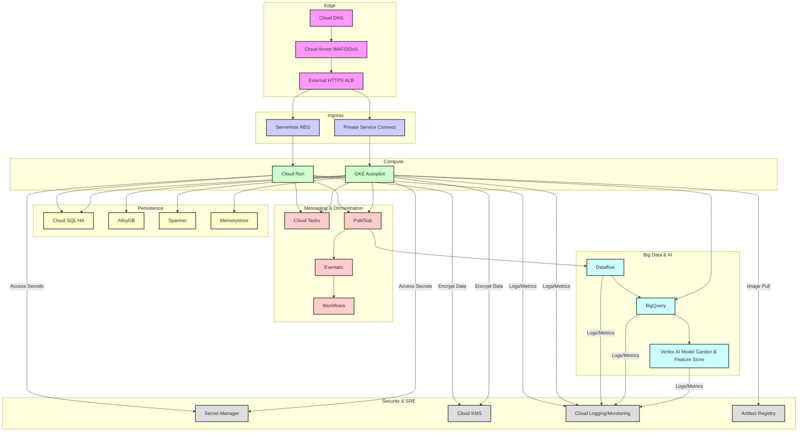

# エグゼクティブサマリー: Google Cloudのアーキテクチャに関するメンタルモデル

Google Cloud Platform (GCP) は単なるサービスの集合体ではありません。それは、Googleが数十年にわたる地球規模での運用を通じて洗練させてきた、Googleの内部インフラストラクチャが外部に公開されたものです。この基本的なメンタルモデルを理解することは、回復力があり、高性能で、コスト最適化されたエンタープライズソリューションを設計するために不可欠です。

<AudioPlayer src="/static/audio/google-cloud-platform-all-services-architecture-handbook-ja.mp3" title="音声エグゼクティブ・ブリーフィング" voice="Google Cloud ja-JP-Neural2-B" />


## 地球規模のネットワーク: Jupiter Fabric

Google Cloudの差別化の中核にあるのは、Jupiter fabricとよく呼ばれるグローバルなプライベートネットワークです。これはパブリックインターネットではなく、専用の、高帯域幅、低遅延の国際ネットワークです。

| 機能 | 説明 | 影響 |
|:--------|:------------|:-------|
| **Jupiter Fabric** | Googleのプライベートなソフトウェア定義ネットワーク（SDN）で、すべてのデータセンターをグローバルに接続します。 | 予測可能なパフォーマンス、リージョン間トラフィックの遅延削減。 |
| **1 Pbps Bisection Bandwidth** | ネットワークの任意の2つの半分間でトラフィックを伝送する総容量。 | 最も要求の厳しいワークロードでもネットワークがボトルネックになることを排除。 |
| **Andromeda SDN** | VPC、ロードバランシング、ネットワークサービスを支えるネットワーク仮想化スタック。 | 高度なネットワーク機能、マイクロセグメンテーション、ポリシー適用を可能にします。 |
| **Premium Tier** | デフォルトのルーティング。トラフィックは最寄りのエッジPoPでGoogleのネットワークに入り、プライベートバックボーンを通過します。 | 最適なパフォーマンス、低遅延、高信頼性。ほとんどのプロダクションワークロードに推奨。 |
| **Standard Tier** | トラフィックは宛先リージョンに近い場所でGoogleのネットワークに入り、パスの大部分でパブリックインターネットを利用します。 | 遅延に敏感でないワークロード向けにコスト最適化されており、エグレス料金が低い。 |

**実用的な教訓:** プロダクションアプリケーションには常にPremium Tierをデフォルトにしてください。Standard Tierは、開発、テスト、または遅延が重要でない特定のコスト重視のバッチ処理に適しています。パフォーマンスの違いはかなり大きいです。

## リソース階層

GCPのリソース階層は、リソースを整理および管理し、ポリシーを適用し、アクセスを制御するための構造化された方法を提供します。これはガバナンスとセキュリティにとって重要なコンポーネントです。

| レベル | 説明 | 主なユースケース |
|:------|:------------|:--------------|
| **組織** | 企業に属するすべてのGoogle Cloudリソースのルートノード。 | 一元化された請求、IAM、ポリシー適用（組織ポリシー）。 |
| **フォルダ** | 組織の下にプロジェクトをグループ化します。ネスト可能。 | 部門別または環境ベースのグループ化（例: `dev`、`prod`）。 |
| **プロジェクト** | リソースを整理するための基本的な単位。すべてのリソースはプロジェクトに属します。 | 請求、API管理、リソース分離、IAM境界。 |
| **リソース** | Compute Engineインスタンス、Cloud Storageバケット、BigQueryデータセットなどの個々のサービス。 | 実際のコンピューティング、ストレージ、ネットワーキング、データ資産。 |

**IAMポリシーの継承:** 上位レベル（例: 組織、フォルダ）で設定されたIAMポリシーは、下位レベルのすべてのリソースに継承されます。これにより、きめ細かな制御とポリシー管理の簡素化が可能になります。

**組織の制約（組織ポリシー）:** これらは、管理者が組織全体でリソースをどのように構成できるかについて制限を定義できる強力なガードレールです。例としては、リソースの場所の制限、外部IPアドレスの無効化、特定のAPI使用の強制などがあります。

```bash
# Example: List organization policies for a project
gcloud org-policies list --project=your-project-id

# Example: Describe a specific organization policy
gcloud org-policies describe compute.disableExternalIpAccess --organization=your-organization-id
```

## Borgの系譜

Googleの内部クラスタ管理システムであるBorgは、Kubernetesの直接の祖先です。この系譜を理解することで、GCPのコンテナファーストの哲学と、その多くのサービスの設計原則についての洞察が得られます。

| コンセプト | Borgの影響 | GCPでの具現化 |
|:--------|:-----------------|:------------------|
| **コンテナ化** | Borgは、コンテナベースのワークロード分離とスケジューリングを大規模に開拓しました。 | Docker、Container Registry、Cloud Run、GKE。 |
| **宣言型API** | Borgは、宣言型仕様を介してワークロードを管理しました。 | Kubernetes YAML、Cloud Deployment Manager、Terraform。 |
| **自己修復システム** | Borgは、失敗したタスクを自動的に再スケジュールし、望ましい状態を維持しました。 | GKE Autopilot、マネージドインスタンスグループ、Cloud Runのオートスケーリング。 |
| **サービスディスカバリ** | Borgは内部サービスディスカバリメカニズムを提供しました。 | Cloud DNS、内部ロードバランサー、GKEサービスディスカバリ。 |
| **リソース効率** | Borgの主な目標は、クラスタ利用率を最大化することでした。 | GKE Autopilotのノード管理、サーバーレスサービス（Cloud Run、Cloud Functions）。 |

**実用的な教訓:** Google Cloudは、コンテナ化されたイミュータブルなインフラストラクチャ向けに本質的に設計されています。このパラダイムを受け入れてください。Cloud RunやGKE Autopilotのようなサービスは、単に便利であるだけでなく、Googleの数十年にわたる内部運用経験の集大成を表しています。

---

## エンドツーエンドのエンタープライズリファレンスアーキテクチャ

このアーキテクチャは、ゼロトラスト原則と多層防御を重視した、Google Cloud上での堅牢で安全かつスケーラブルなエンタープライズデプロイメントを示しています。



**ゼロトラストデータフローと多層防御:**

1.  **エッジセキュリティ (Cloud DNS, Cloud Armor):** すべての外部トラフィックはまずCloud DNSを経由し、その後Cloud ArmorによってDDoS保護とWAF機能が適用されます。これは第一線の防御であり、悪意のあるトラフィックがコンピューティングリソースに到達する前にフィルタリングします。
2.  **制御されたイングレス (External HTTPS ALB, Serverless NEG, Private Service Connect):**
    *   External HTTPS ALBはTLSを終端し、単一のエントリポイントを提供します。
    *   **Serverless NEG**はトラフィックをCloud Runにルーティングし、認証済みで承認されたリクエストのみがサーバーレス関数に到達するようにします。Cloud Run自体がサービスレベルでIAMを強制します。
    *   **Private Service Connect (PSC)**はGKE Autopilotに使用され、GKEサービスがパブリックインターネットに公開されないようにします。すべての通信は、PSCエンドポイントを介して接続する外部クライアントであっても、Googleのネットワーク内でプライベートに行われます。これにより、GKEコントロールプレーンとワークロードのパブリックIP露出が排除されます。
3.  **コンピューティング分離 (Cloud Run, GKE Autopilot):**
    *   **Cloud Run:** 強力なワークロード分離、自動スケーリング、組み込みのセキュリティ機能を提供します。各リビジョンは分離されたサンドボックスで実行されます。
    *   **GKE Autopilot:** Googleがノードのプロビジョニング、パッチ適用、スケーリングを含む基盤となるインフラストラクチャを管理し、攻撃対象領域と運用オーバーヘッドを削減します。ワークロードは分離されたPodで実行されます。GKE内のネットワークポリシーは、Pod間の通信をさらに制限します。
4.  **データ永続化セキュリティ:**
    *   **Cloud SQL HA, AlloyDB, Spanner, Memorystore:** すべてのデータストアはマネージドサービスであり、デフォルトで保存時および転送時の暗号化を提供します。アクセスはIAMとプライベートIP接続（VPC Service Controlsでさらにアクセスを制限可能）を介して制御されます。高可用性（HA）構成により、回復力が確保されます。
5.  **メッセージングとオーケストレーションセキュリティ:**
    *   **Cloud Tasks, Pub/Sub, Eventarc, Workflows:** これらのサービスは、非同期通信とワークフローオーケストレーションを容易にします。アクセスはIAMを介して制御されます。Pub/SubトピックはVPC Service Controlsで保護できます。
6.  **ビッグデータとAIセキュリティ:**
    *   **Dataflow, BigQuery, Vertex AI:** これらのサービスは、大規模なデータ処理と機械学習を処理します。データは暗号化され、アクセスはIAMを介して厳密に制御されます。BigQueryは列レベルのセキュリティとデータマスキングを提供します。Vertex AIは、安全なモデルデプロイとデータアクセスを保証します。
7.  **一元化されたセキュリティとSRE (Secret Manager, KMS, Cloud Logging/Monitoring, Artifact Registry):**
    *   **Secret Manager:** APIキー、データベース認証情報、その他の機密データを一元的に暗号化して保存します。アプリケーションは実行時にシークレットを取得し、ハードコーディングを回避します。
    *   **Cloud KMS:** サービス全体のデータ暗号化のための暗号化キーを管理します。キー管理の職務分離を保証します。
    *   **Cloud Logging/Monitoring:** 包括的な可観測性、監査、アラートを提供します。すべてのサービスインタラクションがログに記録され、異常な動作の検出を可能にします。
    *   **Artifact Registry:** コンテナイメージやその他のビルド成果物を安全に保存します。脆弱性スキャンを強制し、信頼できるイメージのみがデプロイされるようにします。

このアーキテクチャは、ネットワーク境界内であっても暗黙の信頼を仮定しないことで、ゼロトラストを具現化しています。すべてのインタラクションには明示的な承認が必要であり、すべてのレイヤーが潜在的な脅威に対する防御を提供します。

## ドメイン1: コンピューティングとサーバーレスエンジン

このドメインでは、Google Cloudの主要なコンピューティングサービスについて説明します。これには、完全に管理されたサーバーレスプラットフォームから、高度にカスタマイズ可能な仮想マシンやコンテナオーケストレーションまでが含まれます。実用的な適用、トレードオフの理解、およびプロダクショングレードのワークロードのための高度な機能の活用に焦点を当てています。

### Cloud Run

Cloud Runは、コンテナ化されたアプリケーションをデプロイするための完全に管理されたコンピューティングプラットフォームです。インフラストラクチャ管理を抽象化し、開発者がコードに集中できるようにします。

*   **コンテナランタイム**: Cloud RunはOCI準拠のコンテナイメージを実行します。各インスタンスに堅牢で安全なサンドボックス環境を提供します。
*   **インスタンスあたりの同時実行数**: 単一のCloud Runインスタンスは、複数の同時リクエストを処理できます。デフォルトは80で、最大1000まで設定可能です。同時実行数を増やすとリソース利用率が向上しますが、アプリケーションがスレッドセーフで非ブロッキングである必要があります。
*   **スケール・トゥ・ゼロ**: 主要なサーバーレス機能であるCloud Runは、トラフィックがない場合に自動的にゼロインスタンスにスケールダウンし、アイドルコストを排除します。
*   **最小インスタンス数**: 重要なアプリケーションのコールドスタート遅延を減らすために、`min-instances`を設定して、指定された数のインスタンスをウォーム状態に保ち、トラフィックを処理できるようにすることができます。これにより、これらのインスタンスに対して継続的な課金が発生します。
*   **直接VPCエグレス**: 仮想プライベートクラウド（VPC）ネットワーク内のリソース（例: Cloud SQL、Memorystore、内部API）との安全でプライベートな通信のために、Cloud Runは直接VPCエグレス用に構成できます。これにより、すべての送信トラフィックが指定されたVPCコネクタを介してルーティングされます。
*   **GPUサポート**: Cloud Runは現在、AI/ML推論などの特殊な処理を必要とするワークロード向けにGPUアクセラレーションをサポートしています。これは`--cpu`および`--gpu`フラグを介して構成されます。
*   **Cloud Run Jobs**: Cloud Run内の個別のサービスで、HTTP以外の、短命または長時間実行されるバッチジョブを実行します。ジョブは手動で、スケジュールに基づいて、またはEventarcを介してトリガーできます。並列処理と再試行をサポートします。

### GKE (Google Kubernetes Engine)

GKEはGoogle CloudのマネージドKubernetesサービスであり、コンテナ化されたアプリケーションのデプロイ、管理、スケーリングのための堅牢なプラットフォームを提供します。

*   **Autopilot vs Standard**:
 | 機能 | GKE Standard | GKE Autopilot |
 | :------ | :----------- | :------------ |
 | ノード管理 | ユーザー管理 | Google管理 |
 | 料金 | VM + GKE料金 | Podベース |
 | カスタマイズ | 高い（ノードプール、OS） | 制限あり（事前定義プロファイル） |
 | セキュリティ | 共有責任 | 強化（強化されたノード） |
 | スケーリング | 手動/CA | 自動（Pod駆動） |
 | ユースケース | 最大限の制御、カスタムOS | ハンズオフ、コスト最適化 |
    *   **トレードオフ**: Autopilotは、ノード、スケーリング、パッチ適用を管理することで、運用を大幅に簡素化します。ノードレベルのカスタマイズが重要でないほとんどのワークロードに最適です。Standardは、ノードタイプ、オペレーティングシステム、ネットワーキングに対するきめ細かな制御を提供し、高度に専門化されたワークロードやレガシーワークロードに適しています。
    *   **セキュリティ体制**: Autopilotは、GoogleがノードOSとランタイムセキュリティを管理することで、デフォルトで強化されたセキュリティ体制を提供します。Standardは、ユーザーがノードのセキュリティ更新と構成を管理する必要があります。
    *   **ノード自動プロビジョニング**: GKE Standardでは、この機能は保留中のPodリソース要求に基づいて新しいノードプールを動的に作成し、リソース割り当てを最適化し、手動介入を削減します。

*   **マルチクラスタイングレス**: 単一のグローバル外部IPアドレスを使用して、複数のGKEクラスタ（異なるリージョンにある可能性もある）にデプロイされたアプリケーションにトラフィックをルーティングできます。これにより、地理的に分散されたサービスに対して、グローバルロードバランシング、フェイルオーバー、および簡素化されたDNS管理が提供されます。
*   **Gateway API**: Kubernetesイングレスの次世代APIであり、従来のIngress APIと比較して、ルーティング、トラフィック管理、ポリシー適用を構成するためのより表現力豊かで拡張可能な方法を提供します。`GatewayClass`、`Gateway`、`HTTPRoute`、`TCPRoute`などの概念を導入しています。

### Compute Engine

Compute Engineは、さまざまなマシンタイプ、ストレージオプション、および料金モデルを備えた高度にカスタマイズ可能な仮想マシン（VM）を提供します。

*   **C3/N4マシンファミリー**:
    *   **C3**: ハイパフォーマンスコンピューティング（HPC）、データ分析、要求の厳しいエンタープライズワークロード向けに最適化されています。第4世代Intel Xeon Scalableプロセッサ（Sapphire Rapids）とDDR5メモリを搭載しています。高いコア数とメモリ比率を提供します。
    *   **N4**: N2の後継となる汎用マシンファミリー。幅広いワークロードに対してパフォーマンスとコスト効率のバランスを提供します。
*   **Hyperdisk**: Compute Engine向けのGoogle Cloudの次世代ブロックストレージであり、Persistent Diskよりも大幅に高いパフォーマンスと柔軟性を提供します。
    *   **Hyperdisk Balanced**: 優れたパフォーマンス特性を持つ汎用で費用対効果の高いブロックストレージ。
    *   **Hyperdisk Extreme**: 超高IOPSとスループットを必要とする最も要求の厳しいトランザクションワークロード（例: 大規模データベース）向けに設計されています。
    *   **Hyperdisk Throughput**: シーケンシャルI/Oパフォーマンスが重要なスループット集約型ワークロード（例: データ分析、ストリーミング）向けに最適化されています。
*   **Spot VM**: リソースが他の場所で必要になった場合にCompute Engineによってプリエンプトされる可能性がある、非常に費用対効果の高いVMです。中断が許容されるフォールトトレラントな、ステートレスな、またはバッチワークロードに最適です。オンデマンド価格から最大91%の大幅なコスト削減が可能です。
*   **ライブマイグレーション**: Compute Engineの機能で、ダウンタイムなしでVMをあるホストマシンから別のホストマシンに移行できます。これはホストのメンテナンス、パッチ適用、アップグレードに不可欠であり、重要なアプリケーションの高可用性を保証します。

### Cloud Functions (第2世代)

Cloud Functions 第2世代はCloud Run上に構築されており、その基盤となるインフラストラクチャと機能を継承しています。

*   **Cloud Run基盤**: Cloud Runを活用することで、第2世代関数は、第1世代の制限に対処する、より長いリクエストタイムアウト、高い同時実行性、および直接VPCエグレス機能を提供します。
*   **Eventarcトリガー**: Cloud Functionsは主にイベント駆動型です。Eventarcは、100を超えるGoogle Cloudソース（例: Cloud Storage、Pub/Sub、Firestore）からのイベントをCloud Functionsにルーティングするための統一されたメカニズムを提供し、堅牢なイベント駆動型アーキテクチャを可能にします。
*   **タイムアウト**: 第2世代関数は、HTTP関数で最大60分、イベント駆動型関数で最大9時間という大幅に長いタイムアウトをサポートしており、より複雑で長時間実行されるタスクに対応できます。
*   **同時実行性**: Cloud Runと同様に、第2世代関数はインスタンスあたり複数の同時リクエストを処理でき、リソース利用率を向上させ、コールドスタートを削減します。

### Cloud Batch

Cloud Batchは、高スループットのバッチコンピューティングのための完全に管理されたサービスです。大規模な並列およびシーケンシャルバッチジョブの実行を簡素化します。

*   **高スループットバッチコンピューティング**: 科学シミュレーション、金融モデリング、メディアトランスコーディングなど、大規模なデータセットの処理や多数の独立したタスクの実行を必要とするワークロード向けに設計されています。
*   **MPI (Message Passing Interface)**: Cloud Batchは、密結合された並列ワークロード向けにMPIをサポートしており、ジョブ内の異なるVMで実行されているタスク間の通信を可能にします。
*   **アレイジョブ**: 単一のジョブ定義で数千の同一タスクを起動できる強力な機能で、それぞれが異なる入力またはデータセットの一部を処理します。これは、embarrassingly parallelなワークロードに効率的です。
*   **Spot VMフォールトトレランス**: Cloud Batchは、大幅なコスト削減のためにSpot VMを活用できます。自動再試行やチェックポイントなどのプリエンプションを処理するための組み込みメカニズムが含まれており、多くのバッチワークロードでSpot VMを実用的にします。

### 簡潔な比較表

| サービス | 主要なアーキタイプ | 最適な場合 | 避けるべき場合 |
| :------ | :---------------- | :-------- | :--------- |
| Cloud Run | サーバーレスコンテナ | HTTP/イベント駆動型マイクロサービス、API | 長時間実行されるステートフルなアプリ、極端なGPU要件 |
| GKE | コンテナオーケストレーション | 複雑なマイクロサービス、カスタム制御、ハイブリッド | シンプルなアプリ、最小限の運用チーム |
| Compute Engine | IaaS VM | レガシーアプリ、カスタムOS、特定のハードウェア | サーバーレスが理想的、高い運用オーバーヘッド |
| Cloud Functions | サーバーレスFaaS | イベント駆動型、短命、ステートレス関数 | 長時間実行されるプロセス、複雑な状態 |
| Cloud Batch | バッチ処理 | HPC、大規模データ処理、アレイジョブ | リアルタイム、インタラクティブ、低遅延 |

### プロダクション `gcloud` CLIレシピ

#### Cloud Runサービスデプロイ

```bash
# Deploy a Cloud Run service with specific resource limits, min/max instances, and VPC egress
gcloud run deploy my-service \
  --image gcr.io/my-project/my-app:v1.0.0 \
  --platform managed \
  --region us-central1 \
  --project my-project-id \
  --service-account my-service-account@my-project-id.iam.gserviceaccount.com \
  --cpu 2 \
  --memory 2Gi \
  --min-instances 1 \
  --max-instances 10 \
  --concurrency 80 \
  --timeout 300s \
  --vpc-egress all \
  --vpc-connector projects/my-project-id/locations/us-central1/connectors/my-vpc-connector \
  --set-env-vars ENV_VAR_KEY=ENV_VAR_VALUE \
  --no-allow-unauthenticated
```

#### Cloud Runジョブ作成

```bash
# Create a Cloud Run Job for a batch task
gcloud run jobs create my-batch-job \
  --image gcr.io/my-project/my-batch-processor:v1.0.0 \
  --region us-central1 \
  --project my-project-id \
  --service-account my-batch-sa@my-project-id.iam.gserviceaccount.com \
  --cpu 4 \
  --memory 8Gi \
  --tasks 10 \
  --parallelism 5 \
  --timeout 3600s \
  --set-env-vars INPUT_BUCKET=gs://my-input-data,OUTPUT_BUCKET=gs://my-output-data
```

#### GKE Autopilotクラスタ作成

```bash
# Create a GKE Autopilot cluster with release channel and private endpoint
gcloud container clusters create-auto my-autopilot-cluster \
  --region us-central1 \
  --project my-project-id \
  --release-channel stable \
  --network projects/my-project-id/global/networks/my-vpc \
  --subnetwork projects/my-project-id/regions/us-central1/subnetworks/my-gke-subnet \
  --enable-private-nodes \
  --enable-private-endpoint \
  --master-ipv4-cidr 172.16.0.0/28 \
  --workload-pool my-project-id.svc.id.goog \
  --enable-workload-identity
```

#### Compute Engine Spot VMインスタンス作成

```bash
# Create a Compute Engine Spot VM with Hyperdisk Balanced and a specific service account
gcloud compute instances create my-spot-vm \
  --project my-project-id \
  --zone us-central1-a \
  --machine-type n2-standard-4 \
  --provisioning-model SPOT \
  --instance-termination-action STOP \
  --boot-disk-device-name my-spot-boot-disk \
  --boot-disk-type hyperdisk-balanced \
  --boot-disk-size 50GB \
  --image-family debian-11 \
  --image-project debian-cloud \
  --network-interface network=my-vpc,subnet=my-compute-subnet \
  --service-account my-compute-sa@my-project-id.iam.gserviceaccount.com \
  --scopes=https://www.googleapis.com/auth/cloud-platform \
  --metadata startup-script='#!/bin/bash\necho "Hello from Spot VM" > /tmp/startup.txt'
```

#### Cloud Functions (第2世代) デプロイ

```bash
# Deploy a 2nd Gen Cloud Function triggered by a Pub/Sub topic
gcloud functions deploy my-pubsub-function-v2 \
  --gen2 \
  --runtime python39 \
  --region us-central1 \
  --project my-project-id \
  --source ./function-source \
  --entry-point process_message \
  --trigger-topic my-pubsub-topic \
  --service-account my-function-sa@my-project-id.iam.gserviceaccount.com \
  --memory 512MB \
  --timeout 300s \
  --concurrency 10 \
  --vpc-connector projects/my-project-id/locations/us-central1/connectors/my-vpc-connector \
  --egress-settings private-ranges-only
```

#### Cloud Batchジョブ送信

```bash
# Submit a Cloud Batch job using a JSON configuration file
# job_config.json example:
# {
#   "taskGroups": [
#     {
#       "taskSpec": {
#         "runnables": [
#           {
#             "script": {
#               "text": "echo 'Processing task ${BATCH_TASK_INDEX}' && sleep 10"
#             }
#           }
#         ],
#         "computeResource": {
#           "cpuMilli": 1000,
#           "memoryMib": 512
#         }
#       },
#       "taskCount": 5,
#       "parallelism": 2
#     }
#   ],
#   "allocationPolicy": {
#     "instances": [
#       {
#         "policy": {
#           "machineType": "e2-standard-2",
#           "provisioningModel": "SPOT"
#         }
#       }
#     ]
#   },
#   "logsPolicy": {
#     "destination": "CLOUD_LOGGING"
#   }
# }
gcloud batch jobs submit my-batch-job-from-file \
  --location us-central1 \
  --project my-project-id \
  --config job_config.json \
  --service-account my-batch-sa@my-project-id.iam.gserviceaccount.com

## Domain 2: Cloud Databases & In-Memory Stores

### Cloud SQL

Cloud SQL provides fully managed relational database services for PostgreSQL, MySQL, and SQL Server. It abstracts away operational overheads like patching, backups, and replication, allowing focus on application development.

#### PostgreSQL, MySQL, SQL Server

Cloud SQL supports the latest major versions of these popular engines, offering compatibility with existing applications and tools.

*   **PostgreSQL**: Robust, feature-rich, and extensible, often preferred for complex transactional workloads and GIS applications.
*   **MySQL**: Widely adopted, known for its ease of use and performance in web applications.
*   **SQL Server**: Essential for enterprises with existing Microsoft ecosystem dependencies, supporting features like Always On Availability Groups (managed by Cloud SQL).

#### High Availability (HA) Regional Failover

Cloud SQL HA ensures business continuity through automatic failover to a standby instance in a different availability zone within the same region. This is achieved by synchronously replicating data from the primary instance to the standby. In case of a primary instance failure (e.g., zone outage, instance crash), Cloud SQL automatically promotes the standby to primary, minimizing downtime.

*   **Mechanism**: Uses a shared IP address that automatically switches to the new primary.
*   **RPO/RTO**: Near-zero Recovery Point Objective (RPO) due to synchronous replication; Recovery Time Objective (RTO) typically under 60 seconds.

#### Automated Maintenance

Cloud SQL handles routine maintenance tasks such as OS patching, database engine updates, and security vulnerability fixes. Maintenance windows can be configured to minimize impact on production workloads, allowing specification of a preferred day and time range.

#### Read Replicas

Read replicas offload read-heavy workloads from the primary instance, improving performance and scalability. They are asynchronous copies of the primary instance, suitable for reporting, analytics, and geographically distributed read access.

*   **Cross-Region Replicas**: Can be provisioned in different regions for disaster recovery and reduced read latency for global users.
*   **Promotion**: A read replica can be promoted to a standalone primary instance, useful for disaster recovery or database migration scenarios.

#### Private IP Peering vs. Private Service Connect

Both mechanisms enable private connectivity to Cloud SQL instances, avoiding exposure over the public internet.

*   **Private IP Peering (VPC Network Peering)**:
    *   **Mechanism**: Connects your VPC network directly to Google's internal service producer network where Cloud SQL instances reside.
    *   **Setup**: Requires configuring a private IP range for Cloud SQL within your VPC.
    *   **Scope**: Network-wide peering, allowing all resources in your VPC to access Cloud SQL.
    *   **Limitations**: IP address space management can be complex; peering limits apply.

*   **Private Service Connect (PSC)**:
    *   **Mechanism**: Provides private access to managed services using internal IP addresses within your VPC, without VPC network peering.
    *   **Setup**: Creates a forwarding rule and an endpoint in your VPC that points to a service attachment in the service producer's network.
    *   **Scope**: More granular control, allowing specific endpoints for specific services.
    *   **Advantages**: Simplifies IP address management, avoids peering limits, and enhances network security by isolating service traffic. Recommended for new deployments.

### AlloyDB for PostgreSQL

AlloyDB is a fully managed, PostgreSQL-compatible database service designed for demanding enterprise workloads, offering superior performance and availability compared to standard PostgreSQL.

#### Disaggregated Compute & Storage Architecture

AlloyDB separates compute (query processing) from storage (data persistence).

*   **Compute Layer**: Consists of multiple independent compute nodes that process queries. These nodes are stateless and can scale independently.
*   **Storage Layer**: A distributed, shared storage service that stores data in a columnar format. It handles data replication, self-healing, and continuous backup.
*   **Benefits**: Enables rapid scaling of compute resources without affecting storage, and vice versa. Improves fault tolerance as compute nodes can fail independently without data loss.

#### Columnar Engine

AlloyDB incorporates a columnar engine for analytical queries. While PostgreSQL is primarily row-oriented, AlloyDB's intelligent storage layer can store data in a columnar format for specific tables or partitions, significantly accelerating analytical workloads (e.g., OLAP queries) without requiring separate ETL processes or data warehouses. This hybrid transactional/analytical processing (HTAP) capability is a key differentiator.

#### Transactional vs. Analytical Scaling

*   **Transactional Scaling**: Achieved by adding more compute nodes to handle increased concurrent transactions. The shared storage layer ensures data consistency across all nodes.
*   **Analytical Scaling**: The columnar engine and intelligent caching mechanisms optimize analytical query performance. Read replicas can also be used to offload analytical workloads. AlloyDB's architecture allows for efficient scaling of both types of workloads within a single database.

#### Vector Embeddings with pgvector

AlloyDB supports the `pgvector` extension, enabling efficient storage and querying of vector embeddings directly within the database. This is crucial for AI/ML applications, such as similarity search, recommendation engines, and semantic search.

*   **Capabilities**: Stores high-dimensional vectors, supports various distance metrics (e.g., L2 distance, cosine similarity), and provides optimized indexing for fast nearest-neighbor searches.
*   **Integration**: Allows developers to build AI-powered features directly into their applications without needing separate vector databases.

### Cloud Spanner

Cloud Spanner is a globally distributed, strongly consistent, relational database service built for mission-critical applications requiring high availability and massive scale.

#### TrueTime API

TrueTime is Spanner's foundational technology, providing globally consistent wall-clock time with bounded uncertainty.

*   **Mechanism**: Uses atomic clocks and GPS receivers in Google's data centers to synchronize time across all Spanner servers globally.
*   **Guarantees**: Provides a timestamp interval `[earliest, latest]` for every transaction, ensuring that all transactions committed before `t` are visible everywhere by `t`. This enables external consistency.
*   **Impact**: Eliminates the need for distributed commit protocols like Paxos or Raft for global consistency, simplifying application development and improving performance.

#### External Consistency

Spanner offers external consistency, a stronger guarantee than serializability. It means that the global order of transactions observed by any client matches the real-world wall-clock order of those transactions. This simplifies reasoning about distributed transactions and ensures data integrity across continents.

#### Regional vs. Multi-Regional Instances

*   **Regional Instances**: Data is replicated synchronously across three availability zones within a single Google Cloud region. Provides high availability within that region.
*   **Multi-Regional Instances**: Data is replicated synchronously across multiple regions (e.g., `nam-eur-asia1`). Offers extreme availability (99.999% SLA) and low-latency reads for globally distributed applications. Writes are still routed to a primary region for consistency.

#### Granular Instance Sizing (Processing Units)

Spanner instances are sized in "processing units" (PUs). Each PU provides a certain amount of CPU, memory, and I/O capacity.

*   **Scaling**: Instances can be scaled up or down by adding or removing PUs, allowing fine-grained control over performance and cost.
*   **Minimum**: A Spanner instance starts with 100 PUs (0.1 nodes).
*   **Automatic Scaling**: While not fully automatic, Spanner can be integrated with custom solutions to scale PUs based on metrics.

#### Spanner Graph

Spanner Graph is a capability that allows users to perform graph-like queries directly on Spanner data, leveraging its strong consistency and scalability. It's not a separate graph database but rather a set of features and best practices for modeling and querying graph data within Spanner.

*   **Modeling**: Uses adjacency list or edge list models within Spanner tables.
*   **Querying**: Leverages SQL with recursive CTEs (Common Table Expressions) for pathfinding and traversal queries.
*   **Use Cases**: Fraud detection, social networks, recommendation engines, and supply chain analysis where relationships between entities are critical.

### Firestore

Firestore is a flexible, scalable NoSQL document database for mobile, web, and server development. It offers real-time synchronization and offline support.

#### Native Mode vs. Datastore Mode

Firestore offers two modes, primarily differing in their API and feature sets.

*   **Native Mode (Firestore)**:
    *   **Data Model**: Document-oriented, hierarchical collections of documents.
    *   **API**: Real-time listeners, mobile/web SDKs, strong consistency.
    *   **Use Cases**: Mobile/web applications requiring real-time updates, collaborative apps.
    *   **Consistency**: Strong consistency for reads and writes.

*   **Datastore Mode (Cloud Datastore)**:
    *   **Data Model**: Entity-oriented, with entities and kinds, similar to App Engine Datastore.
    *   **API**: Primarily server-side SDKs, eventual consistency by default (strong consistency for ancestor queries).
    *   **Use Cases**: Server-side applications, backend services, large-scale data storage.
    *   **Consistency**: Eventual consistency for most queries, strong consistency for ancestor queries.
    *   **Migration**: Existing Cloud Datastore databases are now technically Firestore in Datastore Mode.

#### Real-time Listeners

Firestore's real-time listeners allow clients to subscribe to changes in a document or a query result set. When data changes on the server, Firestore pushes updates to connected clients in real-time.

*   **Mechanism**: Uses WebSockets for persistent connections.
*   **Benefits**: Enables highly interactive and collaborative applications without constant polling.
*   **Offline Support**: SDKs automatically handle offline data persistence and synchronization when connectivity is restored.

#### Composite Indexes

Firestore automatically creates single-field indexes for all fields. However, for queries involving multiple fields (e.g., `WHERE field1 == 'value' AND field2 > 'value'`), composite indexes are required.

*   **Definition**: Defined manually in the Firebase console or via `firebase.indexes.json` file.
*   **Optimization**: Essential for efficient multi-field queries and ordering. Without them, such queries will fail.
*   **Cost**: Each composite index adds to storage and write costs. Design them judiciously.

#### Distributed Counter Patterns

Directly incrementing a counter field in a single document can lead to contention and performance bottlenecks in high-concurrency scenarios. Firestore supports distributed counter patterns to mitigate this.

*   **Sharded Counters**: Break a single counter into multiple "shards" (separate documents). When incrementing, randomly pick a shard and increment its value. To get the total count, sum all shard values.
*   **Atomic Increments**: Use Firestore's `FieldValue.increment()` to atomically update a numeric field without reading its current value first, reducing read-modify-write conflicts.
*   **Transactions**: For more complex multi-document updates, use transactions to ensure atomicity.

### Cloud Bigtable

Cloud Bigtable is a fully managed, petabyte-scale NoSQL database service designed for large analytical and operational workloads. It's ideal for time-series data, marketing data, financial data, and IoT data.

#### LSM-tree Architecture

Bigtable is built on a Log-Structured Merge-tree (LSM-tree) architecture.

*   **Mechanism**: Writes are first appended to an in-memory buffer (memtable) and a commit log. When the memtable is full, it's flushed to immutable sorted string tables (SSTables) on disk. Reads merge data from memtables and SSTables.
*   **Benefits**: Optimized for high write throughput, as writes are sequential. Efficient for range scans.
*   **Compaction**: Background processes continuously merge and compact SSTables to maintain performance and reclaim space.

#### Row-Key Design Patterns

Row-key design is critical for Bigtable performance, as data is stored lexicographically by row key.

*   **Time-Series Data**:
    *   **Anti-pattern**: Timestamp as prefix (e.g., `timestamp#device_id`) leads to hot-spotting on recent data.
    *   **Good pattern**: Reverse timestamp (e.g., `device_id#reverse_timestamp`) or hash prefix (e.g., `hash(device_id)#timestamp`) for even distribution.
*   **Unique Identifiers**: Use natural keys or UUIDs. If using UUIDs, ensure they are not sequential to avoid hot-spotting.
*   **Related Data**: Group related data by designing row keys that allow efficient range scans (e.g., `user_id#order_id`).
*   **Hot-spotting**: Avoid designs where a small number of row keys receive a disproportionate amount of traffic.

#### SSD vs. HDD

Bigtable offers two storage types:

*   **SSD Storage**: Default and recommended for most workloads. Provides significantly higher throughput and lower latency. Ideal for operational workloads and high-performance analytics.
*   **HDD Storage**: Lower cost per GB, but with much lower throughput and higher latency. Suitable for archival data or workloads where cost is paramount and performance is less critical.

#### Replication and Failover

Bigtable supports multi-cluster replication, allowing data to be replicated across multiple clusters in different regions or zones.

*   **Asynchronous Replication**: Data is replicated asynchronously between clusters.
*   **High Availability**: Provides disaster recovery and allows for low-latency reads for geographically distributed users.
*   **Failover**: In case of a cluster outage, traffic can be redirected to a healthy replica. Application-level logic is typically required for failover.
*   **Consistency**: Eventual consistency across replicas.

#### Integration with BigQuery

Bigtable integrates seamlessly with BigQuery for advanced analytics.

*   **External Tables**: BigQuery can query Bigtable data directly using external tables, avoiding ETL processes. This is useful for ad-hoc analysis or joining Bigtable data with other datasets in BigQuery.
*   **Data Export**: Data can be exported from Bigtable to Cloud Storage and then loaded into BigQuery for more complex transformations and long-term archival.

### Memorystore

Memorystore is a fully managed service for Redis and Memcached, providing highly scalable and available in-memory data stores.

#### Memorystore for Redis Cluster

Memorystore for Redis offers two tiers: Basic and Standard. The Standard tier supports high availability and replication. Memorystore for Redis Cluster is a specific offering for sharded Redis deployments.

*   **Sharding**: Automatically shards data across multiple Redis nodes, enabling horizontal scaling beyond the limits of a single Redis instance.
*   **High Availability**: Each shard can have a primary and replica node for failover.
*   **Use Cases**: Caching, session management, real-time analytics, leaderboards, and message queues requiring high throughput and low latency.
*   **Redis Features**: Supports all native Redis data structures and commands.

#### Memorystore for Valkey

Valkey is an open-source, high-performance in-memory data store, forked from Redis. Memorystore for Valkey provides a managed service for Valkey instances.

*   **Compatibility**: Offers API compatibility with Redis, allowing existing Redis applications to migrate easily.
*   **Features**: Provides similar features to Memorystore for Redis, including caching, session management, and real-time data processing.
*   **Future-Proofing**: Positions users to leverage future innovations within the Valkey ecosystem.

#### Persistence

Memorystore for Redis (Standard Tier and Cluster) offers persistence options to prevent data loss during restarts or failures.

*   **RDB (Redis Database) Snapshots**: Periodically saves a snapshot of the dataset to disk.
*   **AOF (Append-Only File)**: Logs every write operation to a file, allowing reconstruction of the dataset upon restart.
*   **Trade-offs**: RDB is faster for recovery but can lose more data. AOF offers better durability but can be slower for recovery. Memorystore manages these configurations.

#### Cluster Scaling

Memorystore for Redis Cluster allows for dynamic scaling of the cluster size.

*   **Horizontal Scaling**: Add or remove shards to increase or decrease capacity and throughput.
*   **Vertical Scaling**: Adjust the memory capacity of individual nodes within a shard.
*   **Automatic Resharding**: Memorystore handles the rebalancing of data across shards during scaling operations, minimizing application impact.

### Compact Comparison Table

| Database Service | Engine & Model | Throughput / Scale | Consistency Model | Ideal Use Case |
|---|---|---|---|---|
| Cloud SQL | PostgreSQL, MySQL, SQL Server (Relational) | GBs/sec, TBs, vertical scale | Strong | OLTP, web apps, enterprise apps |
| AlloyDB | PostgreSQL (Relational, HTAP) | TBs/sec, PBs, horizontal scale | Strong | High-perf OLTP, HTAP, AI/ML |
| Cloud Spanner | Custom (Globally Distributed Relational) | TBs/sec, PBs, global horizontal scale | External | Mission-critical, global OLTP |
| Firestore | NoSQL Document | MBs/sec, PBs, horizontal scale | Strong (Native), Eventual (Datastore) | Mobile/web apps, real-time, IoT |
| Cloud Bigtable | NoSQL Wide-Column | GBs/sec, PBs, horizontal scale | Eventual | Time-series, IoT, ad tech, analytics |
| Memorystore | Redis, Valkey, Memcached (In-memory KV) | GBs/sec, TBs, horizontal scale | Eventual | Caching, session mgmt, real-time analytics |

### Production `gcloud` CLI Recipes

#### Provisioning Cloud SQL PostgreSQL with HA, Private IP, and Backup

This command provisions a Cloud SQL PostgreSQL instance with high availability, private IP connectivity, automated backups, and a specific maintenance window.

```bash
gcloud sql instances create my-prod-pg-instance \
  --database-version=POSTGRES_14 \
  --region=us-central1 \
  --cpu=4 \
  --memory=16GB \
  --storage-size=500GB \
  --storage-type=SSD \
  --availability-type=REGIONAL \
  --enable-bin-log \
  --backup-start-time="03:00" \
  --backup-location=us-central1 \
  --database-flags="log_statement=all,max_connections=500" \
  --maintenance-window-day=SATURDAY \
  --maintenance-window-hour=02 \
  --network=projects/my-gcp-project/global/networks/my-vpc-network \
  --no-assign-ip \
  --allocated-ip-range-name=my-cloudsql-private-range \
  --root-password="<YOUR_STRONG_PASSWORD>" \
  --project=my-gcp-project
```

*   `--database-version`: Specifies the PostgreSQL version.
*   `--region`: Deploys the instance in `us-central1`.
*   `--cpu`, `--memory`, `--storage-size`, `--storage-type`: Defines instance resources.
*   `--availability-type=REGIONAL`: Enables High Availability (HA) with regional failover.
*   `--enable-bin-log`: Essential for point-in-time recovery and replication.
*   `--backup-start-time`, `--backup-location`: Configures automated daily backups.
*   `--database-flags`: Sets PostgreSQL-specific flags.
*   `--maintenance-window-day`, `--maintenance-window-hour`: Defines the preferred maintenance window.
*   `--network`: Connects to a specified VPC network for private IP.
*   `--no-assign-ip`: Ensures the instance is only accessible via private IP.
*   `--allocated-ip-range-name`: Specifies the named IP range for private service access. This range must be pre-allocated in your VPC.
*   `--root-password`: Sets the initial root user password.
*   `--project`: Specifies the Google Cloud project ID.

#### Provisioning AlloyDB for PostgreSQL Cluster with HA and Private IP

This command creates an AlloyDB cluster and a primary instance within it, configured for high availability and private IP.

```bash
# AlloyDBクラスタの作成
gcloud alloydb clusters create my-prod-alloydb-cluster \
  --database-version=POSTGRES_14 \
  --region=us-central1 \
  --network=projects/my-gcp-project/global/networks/my-vpc-network \
  --allocated-ip-range-name=my-alloydb-private-range \
  --project=my-gcp-project

# クラスタ内にプライマリインスタンスを作成
gcloud alloydb instances create my-prod-alloydb-primary \
  --cluster=my-prod-alloydb-cluster \
  --instance-type=PRIMARY \
  --cpu-count=4 \
  --region=us-central1 \
  --project=my-gcp-project
```

*   `alloydb clusters create`: Creates the cluster resource.
*   `--database-version`: Specifies the PostgreSQL version for AlloyDB.
*   `--network`, `--allocated-ip-range-name`: Configures private IP connectivity.
*   `alloydb instances create`: Creates an instance within the specified cluster.
*   `--instance-type=PRIMARY`: Designates this as the primary instance.
*   `--cpu-count`: Specifies the vCPU count for the primary instance. AlloyDB automatically manages storage.

#### Provisioning Cloud Spanner Multi-Regional Instance

This command creates a multi-regional Cloud Spanner instance with a specified number of processing units.

```bash
gcloud spanner instances create my-prod-spanner-global \
  --config=nam-eur-asia1 \
  --description="Production Global Spanner Instance" \
  --processing-units=1000 \
  --project=my-gcp-project
```

*   `--config=nam-eur-asia1`: Specifies a multi-regional configuration spanning North America, Europe, and Asia. Other configs like `regional-us-central1` are for regional instances.
*   `--processing-units=1000`: Allocates 1000 processing units (equivalent to 1 node) for the instance. Scale up by increasing this value.

#### Provisioning Cloud Bigtable Instance with SSD Storage and Replication

This command creates a Bigtable instance with SSD storage and a cluster in a different region for replication.

```bash
# プライマリのBigtableインスタンスとクラスタを作成
gcloud bigtable instances create my-prod-bigtable \
  --display-name="Production Bigtable Instance" \
  --cluster-id=my-prod-bigtable-c1 \
  --cluster-zone=us-central1-f \
  --cluster-num-nodes=3 \
  --cluster-storage-type=SSD \
  --project=my-gcp-project

# 別のリージョン/ゾーンにレプリカクラスタを追加
gcloud bigtable clusters create my-prod-bigtable-c2 \
  --instance=my-prod-bigtable \
  --cluster-zone=europe-west1-b \
  --cluster-num-nodes=3 \
  --cluster-storage-type=SSD \
  --project=my-gcp-project
```

*   `bigtable instances create`: Creates the Bigtable instance and its initial cluster.
*   `--cluster-id`, `--cluster-zone`, `--cluster-num-nodes`, `--cluster-storage-type`: Defines the primary cluster's properties.
*   `bigtable clusters create`: Adds a new cluster to an existing instance for replication.
*   `--instance`: Specifies the existing instance to add the cluster to.
*   `--cluster-zone`: Places the replica cluster in a different zone/region.

#### Provisioning Memorystore for Redis Cluster

This command creates a Memorystore for Redis Cluster with a specified shard count and node configuration.

```bash
gcloud memorystore redis clusters create my-prod-redis-cluster \
  --region=us-central1 \
  --shard-count=6 \
  --node-count-per-shard=2 \
  --node-cpu-count=2 \
  --node-memory-gb=4 \
  --network=projects/my-gcp-project/global/networks/my-vpc-network \
  --transit-encryption-mode=SERVER_AUTHENTICATION \
  --project=my-gcp-project
```

*   `memorystore redis clusters create`: Creates a Redis Cluster instance.
*   `--shard-count`: Defines the number of shards in the cluster.
*   `--node-count-per-shard`: Specifies the number of nodes (primary + replicas) per shard. `2` means 1 primary and 1 replica per shard for HA.
*   `--node-cpu-count`, `--node-memory-gb`: Configures the resources for each node.
*   `--network`: Connects to a specified VPC network.
*   `--transit-encryption-mode=SERVER_AUTHENTICATION`: Enables encryption in transit.
*   `--project`: Specifies the Google Cloud project ID.

## Domain 3: Object, Block & File Storage

This domain covers the core storage services offered by Google Cloud, essential for managing data across various access patterns, performance requirements, and cost profiles. We'll delve into object, block, and file storage solutions, along with content delivery networks.

### Cloud Storage

Google Cloud Storage (GCS) is a highly durable and available object storage service. It offers various storage classes, object lifecycle management, and advanced features for data protection and performance.

#### Storage Classes

GCS provides four primary storage classes, optimized for different access frequencies and cost considerations. All classes offer identical low latency (time to first byte in milliseconds) for objects stored in multi-regional or regional locations.

| Class | Access Frequency | Minimum Storage Duration | Retrieval Cost | Use Cases |
|---|---|---|---|---|
| Standard | Frequent | None | None | Active data, web content, analytics |
| Nearline | < 1x/month | 30 days | Low | Backups, disaster recovery, infrequently accessed data |
| Coldline | < 1x/quarter | 90 days | Moderate | Archival, long-term backups, compliance data |
| Archive | < 1x/year | 365 days | High | Deep archives, regulatory compliance, cold data |

**Key Considerations:**
*   **Location Types:** GCS buckets can be created as Multi-Regional (highest availability, geo-redundancy), Regional (high availability within a region), or Dual-Regional (data replicated across two regions for higher availability than regional, lower latency than multi-regional for specific use cases).
*   **Early Deletion Charges:** Deleting objects before their minimum storage duration incurs a pro-rata charge.

#### Autoclass

Autoclass automatically transitions objects between storage classes based on access patterns, optimizing costs without manual intervention. It observes object access for 30 days and then moves them to the most cost-effective class. Objects are moved to Standard if accessed, otherwise to Nearline, Coldline, and finally Archive.

**Enabling Autoclass:**
```bash
gcloud storage buckets update gs://your-bucket-name --autoclass-enable
```

#### Object Lifecycle Management (JSON Policies)

Object Lifecycle Management (OLM) allows defining rules to automatically transition objects between storage classes, delete objects, or delete old versions of objects based on conditions like age, creation date, or number of versions. Policies are defined as JSON arrays.

**Example OLM Policy (JSON):**
```json
{
  "lifecycle": {
    "rule": [
      {
        "action": {"type": "SetStorageClass", "storageClass": "NEARLINE"},
        "condition": {"age": 30}
      },
      {
        "action": {"type": "Delete"},
        "condition": {"age": 365, "isLive": true}
      },
      {
        "action": {"type": "Delete"},
        "condition": {"numNewerVersions": 3}
      }
    ]
  }
}
```
This policy moves objects to Nearline after 30 days, deletes live objects after 365 days, and deletes older versions if there are 3 newer versions.

**Applying OLM Policy:**
```bash
gcloud storage buckets update gs://your-bucket-name --lifecycle-file=lifecycle-policy.json
```

#### Soft Delete (1-90 days)

Soft Delete provides a configurable retention period (1-90 days) during which deleted objects are recoverable. This acts as a safety net against accidental deletions. During the soft delete period, objects are not accessible but can be restored. After the period, they are permanently deleted.

**Enabling Soft Delete:**
```bash
gcloud storage buckets update gs://your-bucket-name --soft-delete-duration=7d # 7 days retention
```

#### Turbo Replication

Turbo Replication offers near real-time replication of newly written objects to a dual-region or multi-region bucket. This is critical for use cases requiring extremely low Recovery Point Objective (RPO) for data redundancy across regions, typically within 15 minutes. It's an add-on feature for specific compliance and business continuity requirements.

**Enabling Turbo Replication (example for dual-region):**
```bash
# Turbo Replicationはバケット作成時または更新時に設定されます。
# バケットがデュアルリージョンまたはマルチリージョンである必要があります。
# 例: Turbo Replicationを有効にしてデュアルリージョンバケットを作成
gcloud storage buckets create gs://your-turbo-bucket --location=nam4 --enable-turbo-replication
```

#### Uniform Bucket-Level Access

Uniform Bucket-Level Access (UBLA) simplifies access control by enforcing that all objects in a bucket inherit the bucket's IAM policies. This disables object ACLs, ensuring a consistent and auditable permission model. It's a best practice for most enterprise deployments to prevent granular, potentially conflicting object-level ACLs.

**Enabling UBLA:**
```bash
gcloud storage buckets update gs://your-bucket-name --uniform-bucket-level-access
```

### Persistent Disk & Hyperdisk

Google Cloud offers block storage solutions for Compute Engine instances, providing durable and high-performance storage.

#### Persistent Disk (PD)

Persistent Disks are network-attached block storage devices. They are decoupled from the VM instance, allowing them to be detached and reattached to other instances.

*   **Standard Persistent Disk:** Cost-effective for large, sequential reads/writes. Suitable for boot disks, dev/test, and general-purpose workloads.
*   **Balanced Persistent Disk:** Default and recommended for most workloads. Offers a balance of performance and cost, suitable for databases, analytics, and enterprise applications.
*   **SSD Persistent Disk:** High-performance option for transactional databases, high-IOPS applications, and latency-sensitive workloads.
*   **Extreme Persistent Disk:** Highest performance PD, designed for extremely demanding workloads like large-scale databases (e.g., SAP HANA, Oracle). Requires specific machine types and offers provisioned IOPS/throughput.

**Regional Persistent Disks:** Provide synchronous replication of data across two zones within a region. This allows for automatic failover of a Compute Engine instance to another zone in case of a zone outage, significantly improving RTO for critical applications.

#### Hyperdisk

Hyperdisk is a next-generation block storage offering designed for extreme performance and scalability. It decouples IOPS and throughput from disk size, allowing independent scaling.

*   **Hyperdisk Extreme:** Delivers the highest IOPS and throughput available on Google Cloud, up to 1,000,000 IOPS and 4,800 MB/s throughput per disk. Ideal for the most demanding enterprise applications and databases.
*   **Hyperdisk Throughput:** Optimized for throughput-intensive workloads like data analytics, data warehousing, and media processing. Offers high throughput at a lower cost than Hyperdisk Extreme.

#### Snapshot Schedules

Snapshot schedules automate the creation of Persistent Disk snapshots, providing point-in-time backups for disaster recovery and data protection. Snapshots are incremental, storing only changed blocks, which reduces storage costs.

**Creating a Snapshot Schedule:**
```bash
gcloud compute resource-policies create snapshot-schedule my-daily-snapshot-schedule \
    --region=us-central1 \
    --start-time=03:00 \
    --daily-schedule \
    --max-retention-days=7 \
    --storage-location=us-central1
```

**Attaching a Snapshot Schedule to a Disk:**
```bash
gcloud compute disks add-resource-policies my-disk-name \
    --resource-policies=my-daily-snapshot-schedule \
    --zone=us-central1-a
```

### Filestore

Filestore is a fully managed, high-performance file storage service for applications requiring a shared filesystem interface (NFS).

#### Basic vs. Enterprise

| Feature | Basic Tier | Enterprise Tier |
|---|---|---|
| Use Cases | GKE, basic file sharing, dev/test | Mission-critical apps, GKE, SAP, databases |
| Protocol | NFSv3 | NFSv3, NFSv4.1 |
| Availability | Zonal | Regional (multi-zone) |
| Durability | Zonal | Regional (multi-zone) |
| Performance | Standard, Premium, High Scale | High Scale |
| Snapshots | Yes | Yes |
| Replication | No | Yes (regional) |
| Max Capacity | 256 TB | 100 TB (per instance) |

**High-Scale NFS for GKE:** Filestore Enterprise is particularly well-suited for GKE workloads requiring persistent, shared storage. Its regional availability and high-performance characteristics ensure data durability and low-latency access for stateful applications deployed across multiple zones within a GKE cluster.

**Creating a Filestore Enterprise Instance:**
```bash
gcloud filestore instances create my-enterprise-filestore \
    --zone=us-central1-a \
    --tier=ENTERPRISE \
    --file-share=name=my-share,capacity=1TB \
    --network=name=default \
    --description="Enterprise Filestore for GKE"
```

### Cloud CDN & Media CDN

Content Delivery Networks (CDNs) are crucial for delivering web content and media efficiently by caching content closer to users, reducing latency and origin server load.

#### Cloud CDN

Cloud CDN works with HTTP(S) Load Balancing to cache content at Google's global edge network.

*   **QUIC (HTTP/3):** Cloud CDN supports QUIC, a multiplexed transport protocol over UDP, which reduces latency and improves performance, especially on unreliable networks.
*   **Edge Caching:** Content is cached at Google's Points of Presence (PoPs) globally, serving requests from the nearest available cache.
*   **Cache Keys:** Define how Cloud CDN identifies unique cacheable content. By default, the full request URL is used. Custom cache keys allow ignoring query parameters, HTTP headers, or cookies to increase cache hit ratio.
*   **CDN Invalidation Best Practices:**
    *   **Cache-Control Headers:** Use `Cache-Control` HTTP headers (e.g., `max-age`, `s-maxage`, `no-cache`, `no-store`) to control caching behavior at the origin.
    *   **Versioning:** Append content hashes or version numbers to URLs (e.g., `image.jpg?v=12345`) to ensure new content is fetched without explicit invalidation.
    *   **Explicit Invalidation:** For urgent updates or accidental cache of sensitive data, use `gcloud compute url-maps invalidate-cdn-cache` to explicitly invalidate specific URLs or prefixes. This should be used judiciously as it can incur costs and put load on the origin.

**Invalidating Cloud CDN Cache:**
```bash
gcloud compute url-maps invalidate-cdn-cache my-url-map \
    --path="/images/*" # /images/以下のすべてのオブジェクトを無効化
```

#### Media CDN

Media CDN is a specialized CDN optimized for large-scale video streaming and media delivery. It offers higher throughput, lower latency, and advanced features tailored for media workloads compared to Cloud CDN.

*   **Purpose-built for Media:** Optimized for large file delivery, live streaming, and video-on-demand (VOD).
*   **Advanced Caching:** Deeper caching hierarchies and intelligent cache placement for media assets.
*   **Origin Shielding:** Protects origin servers from traffic spikes by consolidating requests.
*   **Real-time Observability:** Detailed metrics and logs for media delivery performance.

### Compact Comparison Table

| Storage Service | Protocol / Interface | Throughput & Latency | Durability SLA | Cost Profile |
|---|---|---|---|---|
| Cloud Storage | HTTP(S) REST API | Milliseconds (TTFB) | 99.999999999% | Tiered by class, operations, egress |
| Persistent Disk | Block (SCSI/NVMe) | Varies by type (MB/s, IOPS) | 99.999% | Per GB, provisioned IOPS/throughput |
| Hyperdisk | Block (SCSI/NVMe) | High (up to 1M IOPS, 4.8 GB/s) | 99.999% | Per GB, provisioned IOPS/throughput |
| Filestore | NFSv3, NFSv4.1 | High (MB/s, IOPS) | 99.9% (Basic), 99.99% (Enterprise) | Per GB, tiered by performance |
| Cloud CDN | HTTP(S) | Low latency (edge cache) | N/A (caching service) | Egress, cache fill, cache invalidation |
| Media CDN | HTTP(S) | Very low latency (media optimized) | N/A (caching service) | Egress, cache fill, advanced features |

### Production `gcloud` CLI Recipes

#### Bucket creation with uniform bucket-level access, retention policies, and lifecycle rule setup

This recipe demonstrates creating a GCS bucket with best practices for security, data retention, and cost optimization.

1.  **Define Lifecycle Policy (lifecycle-policy.json):**
    This policy moves objects to Nearline after 30 days, then deletes them after 365 days. It also deletes non-current versions after 7 days.

    ```json
    {
      "lifecycle": {
        "rule": [
          {
            "action": {"type": "SetStorageClass", "storageClass": "NEARLINE"},
            "condition": {"age": 30, "isLive": true}
          },
          {
            "action": {"type": "Delete"},
            "condition": {"age": 365, "isLive": true}
          },
          {
            "action": {"type": "Delete"},
            "condition": {"numNewerVersions": 1, "isLive": false, "age": 7}
          }
        ]
      }
    }
    ```

2.  **Create the Bucket with Uniform Bucket-Level Access, Versioning, and Soft Delete:**
    *   `--uniform-bucket-level-access`: Enforces IAM-only permissions.
    *   `--retention-period=365d`: Sets a default object retention of 365 days. Objects cannot be deleted or overwritten before this period.
    *   `--enable-soft-delete`: Enables soft delete for the bucket.
    *   `--soft-delete-duration=7d`: Configures a 7-day soft delete retention.
    *   `--versioning`: Enables object versioning to protect against accidental overwrites.
    *   `--default-storage-class=STANDARD`: Sets the default storage class for new objects.
    *   `--location=US-CENTRAL1`: Specifies the regional location.

    ```bash
    gcloud storage buckets create gs://your-production-data-bucket-001 \
        --uniform-bucket-level-access \
        --retention-period=365d \
        --enable-soft-delete \
        --soft-delete-duration=7d \
        --versioning \
        --default-storage-class=STANDARD \
        --location=US-CENTRAL1 \
        --project=your-gcp-project-id
    ```

3.  **Apply the Lifecycle Policy:**

    ```bash
    gcloud storage buckets update gs://your-production-data-bucket-001 \
        --lifecycle-file=lifecycle-policy.json \
        --project=your-gcp-project-id
    ```

4.  **Verify Bucket Configuration:**

    ```bash
    gcloud storage buckets describe gs://your-production-data-bucket-001 \
        --project=your-gcp-project-id
    ```
    Look for `uniformBucketLevelAccess`, `retentionPolicy`, `softDeletePolicy`, `versioning`, `defaultEventBasedHold`, and `lifecycle` in the output to confirm settings.

## Domain 4: Enterprise Networking, Zero-Trust & Hybrid Connectivity

Enterprise networking on Google Cloud demands a robust, secure, and scalable architecture. This section details core components, their interdependencies, and best practices for production deployments, emphasizing security and hybrid connectivity.

### Virtual Private Cloud (VPC)

VPC is the foundational networking construct in Google Cloud, providing a logically isolated network for your resources.

#### Custom Subnetting

Custom mode VPC networks offer granular control over IP address ranges, enabling precise segmentation and IP space management. This is critical for large enterprises with existing IP address schemes or strict compliance requirements.

*   **Best Practice**: Allocate non-overlapping CIDR blocks for subnets. Plan for future growth.
*   **Recommendation**: Use RFC 1918 private IP ranges (`10.0.0.0/8`, `172.16.0.0/12`, `192.168.0.0/16`).

#### Private Google Access (PGA)

PGA allows VMs with internal IP addresses to reach Google APIs and services (e.g., Cloud Storage, BigQuery) without traversing the internet. This enhances security and reduces egress costs.

*   **Configuration**: Enabled per subnet.
*   **Requirement**: VMs must have internal IP addresses.
*   **Note**: For services with `private.googleapis.com` or `restricted.googleapis.com` endpoints, DNS resolution must be configured (e.g., Cloud DNS private zones or on-prem DNS forwarding).

#### Shared VPC

Shared VPC (XPN) allows an organization to connect multiple projects to a common host project's VPC network. This centralizes network administration, simplifies connectivity, and enforces consistent network policies.

*   **Host Project**: Contains the shared VPC network and its subnets.
*   **Service Projects**: Attach to the host project's network, allowing resources (VMs, GKE clusters) to use shared subnets.
*   **Benefits**: Centralized IP management, consistent firewall rules, simplified inter-project communication.
*   **Considerations**: IAM roles are crucial for managing access to shared network resources.

#### VPC Network Peering Limits

VPC Network Peering connects two VPC networks, allowing resources in each network to communicate using internal IP addresses. While powerful, it has limitations:

*   **Transitivity**: Peering is non-transitive. If VPC A peers with B, and B peers with C, A cannot directly communicate with C via peering.
*   **Limit**: A VPC network can peer with a maximum of 25 other VPC networks. This can become a bottleneck in large, complex environments.
*   **IP Overlap**: Peered networks cannot have overlapping IP ranges.

### Cloud NAT

Cloud NAT enables instances without external IP addresses to initiate outbound connections to the internet. It's a managed service, eliminating the need for manual NAT gateway configuration.

#### Gateway Sizing

Cloud NAT automatically scales based on traffic. However, you configure the minimum number of NAT IP addresses and the minimum per-VM port allocation.

*   **Minimum NAT IP Addresses**: Start with 1-2, scale up based on concurrent connections and egress bandwidth.
*   **Minimum Ports per VM**: Default is 64. Increase if VMs make many concurrent outbound connections (e.g., database connections, API calls). Each connection consumes a port.
*   **Recommendation**: Monitor `nat_allocatable_ports_utilization` and `nat_active_connections` metrics to fine-tune port allocation.

#### Port Allocation

Cloud NAT uses Source Network Address Translation (SNAT) and Port Address Translation (PAT). Each outbound connection from a VM consumes a source port on the NAT gateway.

*   **Endpoint-Independent Mapping**: By default, Cloud NAT uses endpoint-independent mapping, meaning a single (source IP, source port) tuple on the NAT gateway is reused for connections to different external destinations, as long as the internal (source IP, source port) is the same. This is efficient but can be a security concern for some protocols.
*   **Endpoint-Dependent Mapping**: Can be configured for stricter security, where a new (source IP, source port) is used for each unique destination. This consumes ports faster.

#### Public vs Private NAT

*   **Public NAT**: The standard Cloud NAT, providing internet egress for VMs without public IPs. Uses public NAT IP addresses.
*   **Private NAT**: Allows VMs in one VPC network to connect to VMs in another VPC network (or on-premises) via a private NAT gateway, without using public IPs or traversing the internet. This is typically used with Private Service Connect or VPN/Interconnect for complex routing scenarios.

### Private Service Connect (PSC)

PSC allows private consumption of services across VPC networks, bypassing VPC peering limits and simplifying network architecture.

#### Endpoints

*   **Consumer Endpoint**: A forwarding rule in the consumer VPC that acts as an internal IP address for the service. Traffic to this IP is routed to the service producer.
*   **Benefits**: No IP overlap required, no transitive routing issues, enhanced security through granular access control.

#### Service Attachments

*   **Producer Service Attachment**: Created by the service producer, exposing their service (e.g., a Load Balancer) to consumers.
*   **URL**: A unique URI for the service attachment is shared with consumers.
*   **Approval**: Producers can approve or reject consumer connections.

#### Bypassing VPC Peering Limits

PSC effectively replaces many use cases for VPC peering, especially for service consumption. Instead of peering N VPCs to a central service VPC, each consumer VPC can establish a PSC endpoint to the service producer's service attachment, avoiding the 25-peering limit and transitive routing complexities.

### Cloud Interconnect (Dedicated & Partner) vs Cloud VPN (HA VPN with BGP Cloud Router)

These services provide hybrid connectivity between your on-premises network and Google Cloud.

| Feature | Cloud Interconnect (Dedicated) | Cloud Interconnect (Partner) | Cloud VPN (HA VPN) |
| :------------------ | :---------------------------------- | :-------------------------------- | :--------------------------------- |
| **Connectivity** | Direct physical fiber | Partner network | IPsec VPN over public internet |
| **Bandwidth** | 10 Gbps, 100 Gbps (multiple circuits) | 50 Mbps - 10 Gbps | Up to 3.2 Gbps per tunnel (max 4 tunnels per gateway) |
| **Latency** | Low, consistent | Low, consistent (depends on partner) | Variable, higher |
| **SLA** | 99.99% (2+ circuits, 2+ locations) | 99.9% (2+ circuits, 2+ locations) | 99.99% (2+ tunnels, 2+ interfaces) |
| **Cost** | Port fees + egress | Partner fees + egress | VPN gateway + egress |
| **Setup Time** | Weeks to months | Days to weeks | Minutes to hours |
| **Encryption** | Not inherently encrypted (Layer 2) | Not inherently encrypted (Layer 2) | IPsec (Layer 3) |
| **Use Case** | High-throughput, low-latency, mission-critical | Moderate-to-high throughput, faster deployment | Cost-effective, quick setup, encrypted |
| **Routing** | BGP with Cloud Router | BGP with Cloud Router | BGP with Cloud Router |

*   **Cloud Router**: Essential for dynamic routing (BGP) with both Cloud Interconnect and HA VPN. It advertises Google Cloud subnets to your on-premises network and learns on-premises routes.
*   **HA VPN**: Requires two VPN tunnels from a single Google Cloud VPN gateway to two distinct peer gateway interfaces (or two distinct peer gateways) to achieve 99.99% availability. Each tunnel uses a unique external IP address.

### Cloud Armor

Cloud Armor is Google Cloud's DDoS protection and WAF service, integrated with Google Cloud Load Balancers.

*   **Enterprise WAF**: Provides pre-configured and custom WAF rules to protect against common web vulnerabilities (OWASP Top 10).
*   **Adaptive Protection**: Uses machine learning to detect and mitigate L7 DDoS attacks and other anomalous traffic patterns automatically. It generates suggested rules based on observed traffic.
*   **Rate Limiting**: Configurable rules to limit requests from specific IP addresses or regions, preventing abuse and resource exhaustion.
*   **Bot Management**: Identifies and mitigates malicious bot traffic using reCAPTCHA Enterprise integration and other signals.
*   **CVE Rulesets**: Regularly updated rules to protect against known vulnerabilities (CVEs) in common web applications.
*   **Policy Scope**: Applied to external HTTP(S) Load Balancers, SSL Proxy Load Balancers, and TCP Proxy Load Balancers.

### Cloud DNS

Cloud DNS is a high-performance, global DNS service.

*   **Public Zones**: Host your public domain names (e.g., `locionic.com`). Managed by Google's global DNS infrastructure.
*   **Private Zones**: Provide DNS resolution for resources within your VPC networks. Critical for internal service discovery and Private Google Access.
*   **Peering Zones**: Allow a private zone in one VPC network to resolve names in another VPC network's private zone. Useful for shared services across VPCs.
*   **Forwarding Zones**: Configure Cloud DNS to forward queries for specific domains to an alternative DNS server (e.g., on-premises DNS servers). Essential for hybrid environments.

### Compact Comparison Table

| Networking Component | Scope | Protocol / Layer | Throughput | Key Gotcha |
| :------------------- | :---- | :--------------- | :--------- | :--------- |
| VPC | Global/Regional | IP (L3) | High | Non-transitive peering |
| Cloud NAT | Regional | TCP/UDP (L4) | Auto-scales | Port exhaustion |
| PSC | Global/Regional | IP (L3) | High | Producer approval |
| Cloud Interconnect | Global | Ethernet (L2) | 10/100 Gbps | Long setup time |
| HA VPN | Global | IPsec (L3) | 3.2 Gbps/tunnel | Internet dependency |
| Cloud Armor | Global | HTTP/S (L7) | High | Only with Load Balancers |
| Cloud DNS | Global | DNS (L7) | High | Cache TTLs |

### Production `gcloud` CLI Recipes

#### VPC Network Creation

Create a custom mode VPC network with a specific subnet.

```bash
gcloud compute networks create production-vpc \
    --subnet-mode=custom \
    --mtu=1460 \
    --description="Production VPC for critical workloads"

gcloud compute networks subnets create production-subnet-us-east1 \
    --network=production-vpc \
    --range=10.10.0.0/20 \
    --region=us-east1 \
    --enable-private-ip-google-access \
    --description="Primary subnet in us-east1 for production VMs"
```

#### Cloud Router Configuration

Create a Cloud Router for dynamic routing with HA VPN or Cloud Interconnect.

```bash
gcloud compute routers create production-cloud-router-us-east1 \
    --region=us-east1 \
    --network=production-vpc \
    --asn=64512 \
    --description="Cloud Router for hybrid connectivity in us-east1"
```

#### HA VPN Gateway and Tunnels

Create an HA VPN gateway and two tunnels to an on-premises VPN device. Replace `PEER_IP_0` and `PEER_IP_1` with your on-premises VPN device's external IP addresses.

```bash
# HA VPN ゲートウェイの作成
gcloud compute vpn-gateways create production-ha-vpn-gw-us-east1 \
    --network=production-vpc \
    --region=us-east1 \
    --description="HA VPN Gateway for production VPC"

# VPN トンネル 0 の作成
gcloud compute vpn-tunnels create production-vpn-tunnel-0 \
    --peer-external-gateway-interface=0 \
    --region=us-east1 \
    --ike-version=2 \
    --shared-secret=YOUR_SHARED_SECRET_0 \
    --router=production-cloud-router-us-east1 \
    --vpn-gateway=production-ha-vpn-gw-us-east1 \
    --interface=0 \
    --peer-external-gateway=production-onprem-gw \
    --external-traffic-selectors=0.0.0.0/0 \
    --local-traffic-selectors=0.0.0.0/0 \
    --description="VPN Tunnel 0 to on-premise network"

# VPN トンネル 1 の作成
gcloud compute vpn-tunnels create production-vpn-tunnel-1 \
    --peer-external-gateway-interface=1 \
    --region=us-east1 \
    --ike-version=2 \
    --shared-secret=YOUR_SHARED_SECRET_1 \
    --router=production-cloud-router-us-east1 \
    --vpn-gateway=production-ha-vpn-gw-us-east1 \
    --interface=1 \
    --peer-external-gateway=production-onprem-gw \
    --external-traffic-selectors=0.0.0.0/0 \
    --local-traffic-selectors=0.0.0.0/0 \
    --description="VPN Tunnel 1 to on-premise network"

# トンネル 0 用の Cloud Router に BGP インターフェースとピアを作成
gcloud compute routers add-interface production-cloud-router-us-east1 \
    --interface-name=tunnel-0-bgi \
    --ip-address=169.254.1.1 \
    --mask-length=30 \
    --vpn-tunnel=production-vpn-tunnel-0 \
    --region=us-east1

gcloud compute routers add-bgp-peer production-cloud-router-us-east1 \
    --peer-name=onprem-peer-0 \
    --interface=tunnel-0-bgi \
    --peer-asn=65501 \
    --peer-ip-address=169.254.1.2 \
    --region=us-east1 \
    --advertisement-mode=DEFAULT_ROUTE_AND_SUBTYPES \
    --advertisement-groups=ALL_SUBNETS \
    --advertisement-ranges=10.10.0.0/20

# トンネル 1 用の Cloud Router に BGP インターフェースとピアを作成
gcloud compute routers add-interface production-cloud-router-us-east1 \
    --interface-name=tunnel-1-bgi \
    --ip-address=169.254.2.1 \
    --mask-length=30 \
    --vpn-tunnel=production-vpn-tunnel-1 \
    --region=us-east1

gcloud compute routers add-bgp-peer production-cloud-router-us-east1 \
    --peer-name=onprem-peer-1 \
    --interface=tunnel-1-bgi \
    --peer-asn=65501 \
    --peer-ip-address=169.254.2.2 \
    --region=us-east1 \
    --advertisement-mode=DEFAULT_ROUTE_AND_SUBTYPES \
    --advertisement-groups=ALL_SUBNETS \
    --advertisement-ranges=10.10.0.0/20
```

#### Cloud Armor Security Policy

Create a Cloud Armor security policy to protect an external HTTP(S) Load Balancer.

```bash
# 新しい Cloud Armor セキュリティポリシーを作成
gcloud compute security-policies create production-waf-policy \
    --description="WAF policy for production web applications"

# 一般的な SQL インジェクション攻撃をブロックするルールを追加
gcloud compute security-policies rules create 1000 \
    --security-policy=production-waf-policy \
    --expression="evaluatePreconfiguredExpr('sqli-canary')" \
    --action=deny \
    --description="Block SQL Injection attempts"

# XSS 攻撃をブロックするルールを追加
gcloud compute security-policies rules create 1010 \
    --security-policy=production-waf-policy \
    --expression="evaluatePreconfiguredExpr('xss-canary')" \
    --action=deny \
    --description="Block Cross-Site Scripting attempts"

# 特定の IP 範囲 (例: 内部ネットワーク) からのトラフィックを許可するルールを追加
gcloud compute security-policies rules create 10 \
    --security-policy=production-waf-policy \
    --expression="origin.ip in ['203.0.113.0/24', '198.51.100.0/24']" \
    --action=allow \
    --description="Allow trusted internal IP ranges"

# 他のすべてのトラフィックを許可するデフォルトルールを追加 (優先度は最も低くする必要がある)
gcloud compute security-policies rules create 2147483647 \
    --security-policy=production-waf-policy \
    --expression="true" \
    --action=allow \
    --description="Default allow rule"

# セキュリティポリシーを外部 HTTP(S) ロードバランサーのバックエンドサービスに関連付ける
gcloud compute backend-services update production-web-backend-service \
    --security-policy=production-waf-policy \
    --global # リージョンバックエンドサービスの場合は --region を使用

## ドメイン 5: 非同期メッセージング、イベント処理、ワークフロー

非同期パターンは、回復性、スケーラビリティ、疎結合なマイクロサービスアーキテクチャを構築するための基本です。Google Cloud は、メッセージパッシング、イベント駆動型インタラクション、ワークフローオーケストレーションを容易にする堅牢なサービススイートを提供しています。

### Cloud Pub/Sub

Cloud Pub/Sub は、グローバルに管理され、高いスケーラビリティと耐久性を持つメッセージングサービスです。独立したアプリケーション間で非同期の多対多メッセージングを提供します。

*   **グローバルトピック**: Pub/Sub トピックはグローバルリソースであり、パブリッシャーとサブスクライバーが異なるリージョンに存在しても、メッセージは Google のバックボーンネットワークを介して効率的にルーティングされます。これにより、リージョン間の通信と災害復旧戦略が簡素化されます。
*   **プルサブスクリプションとプッシュサブスクリプション**:
    *   **プルサブスクリプション**: サブスクライバーが Pub/Sub から明示的にメッセージを要求します。このモデルは、メッセージ処理レートを制御し、水平にスケールできるアプリケーションに適しています。サブスクライバーがメッセージの確認応答を管理する必要があります。
    *   **プッシュサブスクリプション**: Pub/Sub が、事前に設定された HTTP/S エンドポイント（例: Cloud Run、App Engine、GKE）にメッセージを積極的に配信します。これにより、サブスクライバーのメッセージ配信ロジックがオフロードされますが、エンドポイントが公開されており、HTTP ステータスコードを介してメッセージの確認応答を処理できる必要があります。
*   **デッドレターキュー (DLQ)**: DLQ は、メッセージ処理の失敗を処理するために不可欠です。設定された配信試行回数後に処理に失敗したメッセージは、指定された DLQ トピックに自動的に転送されます。これにより、ポイズンピルがメッセージ処理をブロックするのを防ぎ、帯域外分析と再処理を可能にします。
    ```bash
    # Create a main topic
    gcloud pubsub topics create projects/your-gcp-project/topics/my-main-topic

    # Create a DLQ topic
    gcloud pubsub topics create projects/your-gcp-project/topics/my-dlq-topic

    # Create a subscription with a DLQ policy
    gcloud pubsub subscriptions create projects/your-gcp-project/subscriptions/my-subscription \
        --topic=projects/your-gcp-project/topics/my-main-topic \
        --ack-deadline=30s \
        --message-retention-duration=7d \
        --dead-letter-topic=projects/your-gcp-project/topics/my-dlq-topic \
        --max-delivery-attempts=5
    ```
*   **メッセージ順序付けキー**: Pub/Sub は、同じ順序付けキーで公開されたメッセージについて、単一のパブリッシャー内でのメッセージ順序を保証します。これは、イベントの順序が最優先されるユースケース（例: 金融取引、状態変更）にとって重要です。パブリッシャーは明示的に `ordering_key` 属性を設定する必要があります。
*   **スキーマレジストリ (Avro/Protobuf)**: Pub/Sub のスキーマレジストリは、トピックのメッセージスキーマ（Avro または Protobuf）を定義および適用することを可能にします。これにより、データの一貫性が確保され、シリアル化/逆シリアル化が簡素化され、スキーマ進化の管理が可能になります。
    ```bash
    # Create a schema definition
    gcloud pubsub schemas create my-avro-schema \
        --type=AVRO \
        --definition='{"type":"record","name":"MyEvent","fields":[{"name":"id","type":"string"},{"name":"timestamp","type":"long"}]}'

    # Create a topic with the schema
    gcloud pubsub topics create projects/your-gcp-project/topics/my-schema-topic \
        --schema=projects/your-gcp-project/schemas/my-avro-schema \
        --message-encoding=JSON # or BINARY for Avro/Protobuf
    ```
*   **Pub/Sub Lite**: 標準の Pub/Sub のゾーンベースで低コスト、高スループットの代替サービスです。厳密なゾーン分離と予測可能なパフォーマンスを大規模に必要とする特定のユースケース（データストリーミングや分析パイプラインなど）向けに設計されています。パーティション化されたトピックと明示的な容量プロビジョニングを提供します。

### Cloud Tasks

Cloud Tasks は、完全に管理された非同期タスク実行サービスです。タスクをキューに入れて後で実行することができ、堅牢な再試行メカニズム、レート制限、重複排除を提供します。

*   **HTTP ターゲットキュー**: タスクは、指定された HTTP/S エンドポイント（例: Cloud Run、App Engine、GKE）への HTTP リクエストとして配信されます。ターゲットエンドポイントはタスクを処理し、成功または失敗を示す HTTP ステータスコードで応答します。
*   **レート制限 (`max-dispatches-per-second`)**: Cloud Tasks キューは、ターゲットサービスへのタスクのディスパッチレートを制御するためのレート制限を設定でき、過負荷を防ぎます。
    ```bash
    # Create a queue with rate limits
    gcloud tasks queues create my-http-queue \
        --max-dispatches-per-second=10 \
        --max-concurrent-dispatches=5 \
        --location=us-central1
    ```
*   **指数バックオフ再試行**: Cloud Tasks は、設定可能な指数バックオフで失敗したタスクを自動的に再試行し、最終的な配信と処理を保証します。`max-attempts`、`min-backoff`、`max-backoff`、および `max-doublings` を定義できます。
    ```bash
    # Update a queue with retry parameters
    gcloud tasks queues update my-http-queue \
        --max-attempts=10 \
        --min-backoff=5s \
        --max-backoff=1h \
        --max-doublings=5 \
        --location=us-central1
    ```
*   **タスクの重複排除**: Cloud Tasks は、ユーザーが提供する `task_id` を使用したタスクの重複排除をサポートしています。同じ ID のタスクが 24 時間以内にキューに入れられた場合、それは無視され、重複処理が防止されます。

### Eventarc

Eventarc は、さまざまなソースからのイベントを Cloud Run、Cloud Functions、または GKE の宛先にルーティングすることで、サービスを接続する統一された方法を提供します。基盤となるトランスポート層として Pub/Sub を利用しています。

*   **監査ログイベントルーティング**: Eventarc は、Google Cloud 監査ログに基づいてサービスをトリガーでき、GCP サービス全体での管理アクティビティ、データアクセスイベント、またはシステムイベントへの反応を可能にします。
    ```bash
    # Create an Eventarc trigger for Audit Log events (e.g., GCS object creation)
    gcloud eventarc triggers create gcs-audit-trigger \
        --destination-run-service=my-event-processor \
        --destination-run-region=us-central1 \
        --event-filters="type=google.cloud.audit.v1.log.write" \
        --event-filters="serviceName=storage.googleapis.com" \
        --event-filters="methodName=storage.objects.create" \
        --location=us-central1
    ```
*   **Pub/Sub イベントルーティング**: Eventarc は、Pub/Sub トピックに公開されたメッセージを宛先サービスにルーティングでき、標準化されたイベントメカニズムを提供します。
    ```bash
    # Create an Eventarc trigger for Pub/Sub topic messages
    gcloud eventarc triggers create pubsub-event-trigger \
        --destination-run-service=my-pubsub-consumer \
        --destination-run-region=us-central1 \
        --matching-criteria="type=google.cloud.pubsub.topic.v1.messagePublished" \
        --matching-criteria="topic=my-event-topic" \
        --location=us-central1
    ```
*   **Cloud Run トリガー**: Cloud Run は Eventarc トリガーの主要な宛先であり、サーバーレスサービスがインフラストラクチャを管理することなくイベントに反応することを可能にします。

### Cloud Workflows

Cloud Workflows は、Google Cloud サービスと外部 API を組み合わせることができる、YAML または JSON で定義された一連のステップを実行する完全に管理されたオーケストレーションサービスです。

*   **YAML/JSON ワークフロー定義**: ワークフローは宣言的に定義され、ステップ、条件、ループ、エラー処理が指定されます。これにより、ビジネスプロセスの明確で監査可能、バージョン管理可能な定義が提供されます。
*   **エラー処理**: ワークフローは、`try/except` ブロック、再試行、カスタムエラー応答を含む堅牢なエラー処理をサポートしており、回復力のあるプロセス実行を可能にします。
*   **並列ステップ**: ワークフローはステップを並列で実行でき、独立したタスクの全体的な実行時間を大幅に短縮します。
*   **API コネクタ**: ワークフローは、多くの Google Cloud サービス（例: Cloud Functions、Pub/Sub、Cloud Storage）用の組み込みコネクタを提供し、任意の外部 HTTP API を呼び出すことができ、複雑な統合を可能にします。

### Cloud Scheduler

Cloud Scheduler は、完全に管理された cron ジョブサービスです。バッチ処理、ビッグデータジョブ、クラウドインフラストラクチャ操作など、ほぼすべてのジョブをスケジュールできます。

*   **Cron ジョブ**: ジョブは標準の Unix cron 構文を使用して定義され、柔軟なスケジュールオプション（例: 毎時、毎日深夜、毎週月曜日）を提供します。
*   **OIDC/OAuth 認証ヘッダー**: Cloud Scheduler は、送信する HTTP リクエストに OIDC または OAuth トークンを含めることができ、認証されたアクセスを必要とするターゲットサービス（例: Cloud Run、Cloud Functions）への安全な認証を可能にします。
    ```bash
    # Create a Cloud Scheduler job to hit a Cloud Run service with OIDC authentication
    gcloud scheduler jobs create http my-scheduled-job \
        --schedule="0 0 * * *" \
        --uri="https://my-cloud-run-service-xyz.run.app/process" \
        --http-method=GET \
        --oidc-service-account-email=my-scheduler-sa@your-gcp-project.iam.gserviceaccount.com \
        --oidc-token-audience="https://my-cloud-run-service-xyz.run.app" \
        --location=us-central1
    ```

### 簡易比較

*   **Cloud Pub/Sub**:
    *   **配信セマンティクス**: 少なくとも1回
    *   **保持期間**: 7日間（標準）、最大31日間（延長）
    *   **順序保証**: パブリッシャーごと、順序付けキーごと
    *   **最適なシナリオ**: 高スループット、グローバルなイベント取り込みと配信、疎結合なマイクロサービス通信。
*   **Cloud Tasks**:
    *   **配信セマンティクス**: 少なくとも1回（再試行あり）
    *   **保持期間**: 最大30日間（キュー内のタスクの場合）
    *   **順序保証**: ベストエフォート（キュー内では FIFO、ただしすべてのタスクで厳密ではない）
    *   **最適なシナリオ**: 非同期バックグラウンドジョブ実行、レート制限された処理、遅延実行。
*   **Eventarc**:
    *   **配信セマンティクス**: 少なくとも1回（Pub/Sub 経由）
    *   **保持期間**: 該当なし（イベントは即座にルーティングされる）
    *   **順序保証**: ベストエフォート（Pub/Sub イベントの場合、Pub/Sub から継承）
    *   **最適なシナリオ**: イベント駆動型アーキテクチャ、GCP サービスイベントへの反応、イベントによるサービス接続。
*   **Cloud Workflows**:
    *   **配信セマンティクス**: 厳密に1回（ワークフローステップの場合）
    *   **保持期間**: 最大30日間（ワークフロー実行履歴の場合）
    *   **順序保証**: ステップの厳密な順次実行（並列化されていない限り）
    *   **最適なシナリオ**: 複雑なビジネスプロセスのオーケストレーション、長時間実行される操作、API 統合。
*   **Cloud Scheduler**:
    *   **配信セマンティクス**: 少なくとも1回（ジョブ実行の場合）
    *   **保持期間**: 該当なし（実行をスケジュールするだけで、データを保持しない）
    *   **順序保証**: 該当なし（独立したジョブをスケジュールする）
    *   **最適なシナリオ**: 定期的なタスク、cron ジョブ、スケジュールされたバッチ処理。

## ドメイン 6: 最新のデータ分析、ストリーミング、レイクハウス

Google Cloud Platform (GCP) における最新のデータ分析は、リアルタイムストリーミングからペタバイト規模のバッチ処理、インタラクティブな BI まで、多様なデータワークロードを処理するように設計された、高度にスケーラブルなマネージドサービススイートによって特徴付けられます。アーキテクチャの哲学は、コンピューティングとストレージの分離を中心に据え、独立したスケーリングとコスト最適化を可能にします。

### BigQuery

BigQuery は、Google Cloud の完全に管理されたサーバーレスで、高度にスケーラブルなエンタープライズデータウェアハウスです。SQL を使用したペタバイト規模の分析に優れています。

#### アーキテクチャ

BigQuery のアーキテクチャは、基本的に分離されており、2 つの主要なコンポーネントで構成されています。

*   **Capacitor ストレージエンジン:** この独自のカラム型ストレージ形式は、分析クエリ用に最適化されています。データは自動的に圧縮、暗号化、複数のアベイラビリティゾーンにレプリケートされ、高い耐久性と可用性を実現します。明示的なユーザー介入なしに、階層型ストレージ（アクティブ、長期）を含む自動データライフサイクル管理をサポートします。
*   **Dremel コンピューティングエンジン:** Dremel は、Google の超並列処理 (MPP) クエリエンジンです。ツリーベースのアーキテクチャを利用して、クエリを数千のサーバーに分散させ、データを並列で処理します。このアーキテクチャにより、BigQuery は数秒から数分でテラバイトからペタバイトのデータをスキャンできます。

#### パーティショニングとクラスタリング

これらの手法は、スキャンされるデータ量を制限することで、クエリのパフォーマンスを最適化し、コストを削減します。

*   **パーティショニング:** 指定された列に基づいてテーブルをセグメント（パーティション）に分割します。パーティション列でフィルタリングするクエリは、関連するパーティションのみをスキャンします。
    *   **日付/タイムスタンプパーティショニング:** 時系列データで最も一般的です。BigQuery は、`DATE` または `TIMESTAMP` 列に基づいてパーティションを自動的に管理します。
    *   **整数範囲パーティショニング:** 整数値の範囲に基づいてパーティションを分割します。ID やその他の数値シーケンスに役立ちます。
*   **クラスタリング:** 1 つ以上の指定された列に基づいて、パーティション内（またはパーティション化されていない場合はテーブル全体）のデータをソートします。クラスタリングされた列でフィルタリングまたは集計するクエリは、データスキャンの削減と集計の高速化の恩恵を受けます。クラスタリングはパーティショニングの*後*に適用されます。

| 機能 | パーティショニング | クラスタリング |
| :-------------- | :----------------------------------------------- | :------------------------------------------------- |
| 粒度 | テーブルセグメント | パーティション内（またはテーブル内）のデータ |
| 列の型 | `DATE`, `TIMESTAMP`, `DATETIME`, `INTEGER` | 順序付け可能な任意の型 |
| 主な利点 | パーティションをフィルタリングすることでスキャンされるデータを削減 | パーティション内でスキャン/処理されるデータを削減 |
| コストへの影響 | スキャンされるバイトの大幅な削減 | スキャンされるバイトの適度な削減、集計の高速化 |
| 処理順序 | 最初に適用 | 2番目に適用（パーティション内） |

#### BI Engine

BigQuery BI Engine は、Looker Studio、Looker、カスタムアプリケーションなどの BI ツールからのクエリを含む SQL クエリを高速化するインメモリ分析サービスです。頻繁にアクセスされるデータをカラム型インメモリ形式でキャッシュすることで、ダッシュボードやインタラクティブなレポートに対して秒以下のクエリ応答時間を提供します。BI Engine は BigQuery と透過的に統合されています。

#### Storage Write API

BigQuery Storage Write API は、BigQuery にデータを取り込むための統合 API です。強力なトランザクション保証を備えたストリーミング書き込みとバッチ書き込みの両方をサポートしています。主な機能は次のとおりです。

*   **厳密に1回の配信:** 再試行や障害が発生した場合でも、データが厳密に1回書き込まれることを保証します。
*   **ストリームオフセット:** 特定の時点から書き込みを再開できます。
*   **スキーマ進化:** 新しい列の追加や列モードの緩和をサポートします。
*   **マネージドストリーム:** ストリーム管理とコミットロジックを処理します。

この API は、ほとんどのユースケースで古いストリーミング挿入 API に代わる、BigQuery への大量、低遅延のデータ取り込みに推奨される方法です。

#### スロット予約 (Standard/Enterprise/Enterprise Plus Edition) とオンデマンド

BigQuery のコンピューティング容量は「スロット」で測定されます。

*   **オンデマンド料金:** クエリによって処理されたデータ量に対して料金を支払います。BigQuery は必要に応じてスロットを自動的に割り当てますが、パフォーマンスはシステム負荷によって変動する可能性があります。これはデフォルトで最もシンプルなモデルです。
*   **定額料金 (スロット予約):** 専用スロットを固定料金で購入し、予測可能なパフォーマンスとコストを提供します。これは、安定した大量のワークロードに最適です。
    *   **Standard Edition:** ベースラインの定額料金プラン。
    *   **Enterprise Edition:** 高度な機能、より高い同時実行制限、より高度なワークロード管理が含まれます。
    *   **Enterprise Plus Edition:** 高度なセキュリティ、コンプライアンス、データガバナンス機能、多くの場合、クロスリージョンレプリケーションと災害復旧機能を含む最上位のプラン。

| 機能 | オンデマンド | 定額料金 (予約) |
| :---------------- | :--------------------------------------- | :----------------------------------------------- |
| コストモデル | スキャンされた TB ごと | 専用スロットの月額/年額固定費用 |
| パフォーマンス | 可変、システム負荷に依存 | 予測可能、専用容量 |
| ワークロードの種類 | スパイク的、予測不能、探索的 | 安定、大量、本番 ETL/BI |
| コスト予測可能性 | 低い | 高い |
| エディション | 該当なし | Standard, Enterprise, Enterprise Plus |

### Cloud Dataflow

Cloud Dataflow は、Apache Beam パイプラインを実行するための完全に管理されたサービスです。バッチデータ処理とストリーミングデータ処理の両方に統一されたプログラミングモデルを提供します。

#### Apache Beam エンジン

Apache Beam は、データ処理パイプラインを定義および実行するためのオープンソースの統一プログラミングモデルです。分散処理の複雑さを抽象化し、開発者がデータ変換ロジックに集中できるようにします。Dataflow は、Beam パイプラインを実行するための Google Cloud のマネージドサービスです。

#### 統一されたバッチとストリーミング

Beam の核となる強みは、その統一モデルです。同じパイプラインコードをバッチモードとストリーミングモードの両方で実行できるため、開発とメンテナンスが簡素化されます。これは、「ウィンドウ処理」（時間に基づいてデータをグループ化する）や「トリガー」（結果をいつ出力するかを決定する）などの概念を通じて実現されます。

#### 厳密に1回の処理

Dataflow は、ストリーミングパイプラインの厳密に1回の処理を含む、強力なデータ処理保証を提供します。これは、障害や再試行が発生した場合でも、各データ要素が正確に1回処理され、出力に反映されることを意味し、金融取引や重要なメトリックにとって不可欠です。これは、チェックポイント処理、永続的な状態、堅牢なフォールトトレランスメカニズムによって実現されます。

#### 自動スケーリングワーカープール

Dataflow は、パイプラインのワークロード要件に基づいて、ワーカーインスタンス（VM）の数を自動的にスケーリングします。これにより、手動介入なしに最適なリソース利用とパフォーマンスが保証されます。ピーク時にはスケールアップし、アイドル時にはスケールダウンできるため、コストを最適化できます。

#### ストリーミングエンジン

ストリーミングエンジンは、パイプライン実行の一部をワーカー VM からマネージドサービスにオフロードする Dataflow の機能です。これにより、パフォーマンスが向上し、ワーカーのリソース消費が削減され、特に高スループットのストリーミングパイプラインの場合、自動スケーリングが高速化され、状態管理がより効率的になります。

### Dataproc

Dataproc は、Apache Spark、Apache Hadoop、Apache Flink、およびその他のオープンソースデータ処理フレームワークを実行するための、完全に管理された、高度にスケーラブルなサービスです。これらのクラスターのデプロイと管理を簡素化します。

#### Compute Engine 上の Dataproc と Spark 用 Dataproc Serverless

*   **Compute Engine 上の Dataproc:** これは従来の Dataproc オファリングで、Compute Engine VM のクラスターをプロビジョニングおよび管理します。クラスター構成、マシンタイプ、ソフトウェアバージョンを完全に制御できます。長時間実行されるクラスター、カスタム構成、または特定のハードウェア（例: GPU）が必要な場合に適しています。
*   **Spark 用 Dataproc Serverless:** このオファリングでは、クラスターをプロビジョニングまたは管理することなく Spark ワークロードを実行できます。Spark ジョブを送信すると、Dataproc Serverless が必要なコンピューティングリソースを自動的にプロビジョニングし、ジョブを実行し、スケールダウンします。一時的、バースト的、または予測不能な Spark ワークロードに最適で、真の「従量課金制」サーバーレスエクスペリエンスを提供します。

#### エフェメラルクラスター

Compute Engine 上の Dataproc の一般的なパターンは、エフェメラルクラスターを使用することです。これらのクラスターは、特定のジョブまたは一連のジョブのためにオンデマンドで作成され、作業が完了すると終了します。これにより、コンピューティングリソースがアクティブに使用されている場合にのみ料金を支払うことでコストを最適化します。Dataproc Serverless は、このエフェメラルモデルを本質的に具現化しています。

### Dataplex

Dataplex は、組織が分散データを大規模に管理、監視、統制するのに役立つインテリジェントなデータファブリックです。データレイク、データウェアハウス、データマートにわたるデータを統合し、データ管理のための単一の管理画面を提供します。

#### データガバナンス

Dataplex は、以下を含む集中型データガバナンス機能を提供します。

*   **メタデータ管理:** 技術的およびビジネスメタデータの自動検出とカタログ化。
*   **データ品質:** データ品質ルールの定義、監視、適用。
*   **データセキュリティ:** IAM およびデータ損失防止 (DLP) との統合によるアクセス制御と機密データ保護。
*   **データリネージ:** データ変換と起源の追跡。

#### データメッシュアーキテクチャ

Dataplex は、データメッシュアーキテクチャを実装するための基盤となるコンポーネントです。これにより、組織はデータを製品として扱い、ドメインチームがデータを所有および提供できるようにしながら、ドメイン全体での検出、ガバナンス、相互運用性のための集中プラットフォームを提供できます。Dataplex ゾーン（raw、curated、trusted）は、このドメイン指向の組織を促進します。

#### 自動データ検出

Dataplex は、さまざまなソース（BigQuery、Cloud Storage、Cloud SQL など）にわたるデータアセットを自動的に検出し、カタログ化します。スキーマを推論し、データ型を分類し、メタデータを抽出することで、データコンシューマーがデータを簡単に発見し、理解できるようにします。

#### データ品質タスクのスケジュール設定

Dataplex を使用すると、ユーザーはデータ品質ルール（例: 一意性、完全性、有効性）を定義し、その実行をスケジュールできます。時間の経過とともにデータ品質を監視し、逸脱を警告し、データヘルスを追跡するためのダッシュボードを提供することで、分析と ML のデータ信頼性を確保します。

### Looker

Looker は、Google Cloud が買収した最新のビジネスインテリジェンス (BI) およびデータ分析プラットフォームです。強力なセマンティックモデリングレイヤーと、データ探索および視覚化のための直感的なインターフェースを提供します。

#### Looker Core

Looker Core は、以下の機能を含む主要な Looker プラットフォームを指します。

*   **LookML (Looker Modeling Language):** データモデルを定義するために使用される独自の SQL ベース言語。LookML は基盤となるデータベーススキーマを抽象化し、ビジネスユーザー向けに一貫性のある統制されたデータビューを作成します。ディメンション、メジャー、リレーションシップ、派生テーブルを定義します。
*   **IDE (統合開発環境):** LookML モデルを開発および管理するための Web ベースの環境。
*   **Explore インターフェース:** ビジネスユーザーが SQL を記述することなくデータを探索し、アドホッククエリを構築し、視覚化を作成するための直感的でドラッグアンドドロップ可能なインターフェース。
*   **ダッシュボードとレポート:** インタラクティブなダッシュボードとスケジュールされたレポートを作成するためのツール。
*   **Looker API:** プログラムによるアクセスと他のアプリケーションとの統合のための堅牢な API。

#### Looker Studio (旧 Google Data Studio)

Looker Studio は、無料の Web ベースのデータ視覚化およびダッシュボード作成ツールです。ユーザーは、さまざまなデータソース（BigQuery、Google Analytics、Sheets など）に接続し、インタラクティブなレポートやダッシュボードを作成できます。Looker Core のセマンティックモデリングほど強力ではありませんが、迅速な視覚化とインサイトの共有に優れています。

#### LookML セマンティックデータモデリング

LookML は、Looker の価値提案の要です。ビジネスロジックと定義の「単一の信頼できる情報源」を作成します。LookML でメトリック、ディメンション、リレーションシップを一度定義することで、すべてのレポートとダッシュボードで一貫性が確保されます。このセマンティックレイヤーは、生のデータベースとエンドユーザーの間に位置し、SQL の複雑さを抽象化し、データガバナンスを維持しながらビジネスユーザー向けのセルフサービス分析を可能にします。

### 簡易比較表

| 分析サービス | 基盤となるエンジン | 処理パラダイム | レイテンシ / SLA | 最適なワークロード |
| :---------------- | :---------------------- | :---------------------- | :------------------------------------------ | :------------------------------------------------ |
| BigQuery | Dremel (コンピューティング), Capacitor (ストレージ) | SQL クエリエンジン | 数秒から数分 (TB/PB 規模) | ペタバイト規模のデータウェアハウジング、アドホック分析 |
| Cloud Dataflow | Apache Beam | バッチ & ストリーミング ETL | ミリ秒 (ストリーミング), 数分から数時間 (バッチ) | リアルタイム分析、複雑な ETL/ELT、ストリーム処理 |
| Dataproc | Spark, Hadoop, Flink | バッチ & ストリーミング ETL | 数分から数時間 (バッチ), 数秒 (ストリーミング) | カスタム Spark/Hadoop ワークロード、ML、データサイエンス |
| Dataplex | 該当なし (オーケストレーション) | データガバナンス、カタログ | 該当なし | データメッシュ、統合データ管理、データ品質 |
| Looker | LookML (セマンティックレイヤー) | BI、データ探索 | 秒以下 (BI Engine), 数秒 (BigQuery) | セルフサービス BI、統制されたデータ探索、ダッシュボード |

### 本番環境の `gcloud` と `bq` CLI レシピ

#### BigQuery テーブルのパーティショニングとクラスタリング

**1. 日付パーティションテーブルの作成:**

```bash
bq mk \
  --table \
  --time_partitioning_field=event_timestamp \
  --time_partitioning_type=DAY \
  --time_partitioning_expiration=7776000 \
  --description "Daily partitioned events table, 90-day expiration" \
  my_project_id:my_dataset.events_daily_partitioned \
  schema.json
```

*   `--time_partitioning_field`: パーティショニングの `TIMESTAMP` または `DATE` 列を指定します。
*   `--time_partitioning_type`: パーティションの粒度（`DAY`、`HOUR`、`MONTH`、`YEAR`）を定義します。
*   `--time_partitioning_expiration`: デフォルトのパーティション有効期限を秒単位で設定します（90 日 = 7776000 秒）。

**2. 整数パーティションテーブルの作成:**

```bash
bq mk \
  --table \
  --range_partitioning_field=user_id \
  --range_partitioning_range_start=0 \
  --range_partitioning_range_end=1000000 \
  --range_partitioning_range_interval=10000 \
  --description "Integer partitioned users table" \
  my_project_id:my_dataset.users_integer_partitioned \
  user_schema.json
```

*   `--range_partitioning_field`: パーティショニングの `INTEGER` 列を指定します。
*   `--range_partitioning_range_start`、`--range_partitioning_range_end`、`--range_partitioning_range_interval`: 整数範囲を定義します。

**3. クラスタリングされたテーブルの作成（パーティショニングあり）:**

```bash
bq mk \
  --table \
  --time_partitioning_field=event_timestamp \
  --time_partitioning_type=DAY \
  --clustering_fields=user_id,event_type \
  --description "Daily partitioned and clustered events table" \
  my_project_id:my_dataset.events_clustered \
  event_schema.json
```

*   `--clustering_fields`: クラスタリングする 1 つ以上の列を指定します。クエリ最適化のために順序が重要です。

**4. テーブルを更新してクラスタリングを追加（既存のテーブル）:**

```bash
bq update \
  --clustering_fields=product_id,category \
  my_project_id:my_dataset.sales_data
```

*   注: 既存のテーブルにクラスタリングを追加すると、テーブルデータが書き換えられます。

#### BigQuery スロット管理（予約）

**1. 予約の作成:**

```bash
bq mk --reservation \
  --project_id=my_project_id \
  --location=us-central1 \
  --slots=500 \
  --ignore_idle_slots \
  my_reservation_name
```

*   `--slots`: 予約する専用スロットの数。
*   `--ignore_idle_slots`: アイドル状態のスロットが自動的に解放されるのを防ぎます。

**2. 割り当ての作成（プロジェクト/フォルダ/組織への予約の割り当て）:**

```bash
bq mk --assignment \
  --project_id=my_project_id \
  --location=us-central1 \
  --job_type=QUERY \
  --assignee_id=projects/my_project_id \
  --reservation_id=my_reservation_name \
  my_assignment_name
```

*   `--job_type`: 割り当てるジョブの種類（`QUERY`、`LOAD`、`EXTRACT`、`BI_ENGINE`）。
*   `--assignee_id`: 予約を割り当てるリソース（プロジェクト、フォルダ、組織）。
*   `--reservation_id`: 割り当てる予約の名前。

**3. 予約のリスト表示:**

```bash
bq ls --reservation --project_id=my_project_id --location=us-central1
```

**4. 割り当てのリスト表示:**

```bash
bq ls --assignment --project_id=my_project_id --location=us-central1
```

**5. 予約の削除:**

```bash
bq rm --reservation --project_id=my_project_id --location=us-central1 my_reservation_name
```

**6. 割り当ての削除:**

```bash
bq rm --assignment --project_id=my_project_id --location=us-central1 my_assignment_name

## Domain 7: Artificial Intelligence, Generative AI & MLOps

Google Cloud's AI/ML offerings, particularly Vertex AI, provide a unified platform for the entire machine learning lifecycle, from data ingestion and preparation to model development, deployment, and monitoring. This domain focuses on leveraging these capabilities for production-grade AI solutions, emphasizing MLOps principles.

### Vertex AI Platform

Vertex AI unifies Google Cloud's ML services into a single platform, streamlining the development and deployment of ML models. It offers a comprehensive suite of tools for data scientists and ML engineers.

#### Model Garden

Vertex AI Model Garden is a curated collection of pre-trained models, foundation models, and solutions, including Google's first-party models and open-source options. It serves as a starting point for various AI tasks, enabling rapid prototyping and deployment.

*   **Foundation Models**: Access to state-of-the-art large language models (LLMs) and multimodal models.
    *   **Gemini 2.5 Pro**: Google's most capable model for a wide range of multimodal tasks, offering advanced reasoning, coding, and understanding. Suitable for complex applications requiring high accuracy and nuanced understanding.
    *   **Gemini 2.5 Flash**: A lighter, faster, and more cost-effective version of Gemini, optimized for high-volume, low-latency use cases where speed and efficiency are paramount. Ideal for chatbots, summarization, and quick content generation.
*   **Supervised Fine-tuning (SFT)**: Adapting foundation models to specific downstream tasks or datasets using labeled examples. This process involves training the model on a smaller, task-specific dataset to improve its performance for a particular application.
    *   **Process**:
        1.  Prepare a high-quality, task-specific dataset (e.g., question-answer pairs, text-to-summary).
        2.  Select a foundation model (e.g., `gemini-1.5-pro-001`).
        3.  Configure fine-tuning parameters (learning rate, epochs, batch size).
        4.  Train the model on Vertex AI.
        5.  Evaluate the fine-tuned model's performance.
    *   **Benefits**: Improved accuracy, reduced hallucination, better alignment with domain-specific language and style.
*   **Model Distillation**: A technique to create a smaller, faster "student" model that mimics the behavior of a larger, more complex "teacher" model. This is crucial for deploying models to resource-constrained environments or for reducing inference latency and cost.
    *   **Process**:
        1.  Train a large, high-performing teacher model.
        2.  Train a smaller student model, using the teacher's predictions (soft targets) as additional supervision alongside the true labels.
        3.  The student model learns to generalize from the teacher's knowledge.
    *   **Benefits**: Reduced model size, faster inference, lower computational cost, suitable for edge deployments.

#### Vertex AI Endpoints

Vertex AI Endpoints provide a managed service for deploying and serving ML models. They abstract away the complexities of infrastructure management, allowing engineers to focus on model performance.

*   **Custom Model Serving**: Deploying models trained outside of Vertex AI or with custom frameworks. This involves packaging the model artifact and a custom prediction routine.
    *   **Containerization**: Models are typically served within custom Docker containers, allowing for specific dependencies and execution environments.
    *   **Prediction Routine**: A Python script (`predictor.py`) defining `predict()` and `load()` methods for handling inference requests.
*   **Autoscaling**: Dynamically adjusting the number of serving replicas based on traffic load.
    *   **`min_replicas`**: The minimum number of serving instances always running, ensuring baseline availability and reducing cold start latency.
    *   **`max_replicas`**: The maximum number of serving instances allowed, preventing over-provisioning and controlling costs.
    *   **Scaling Metrics**: Configurable based on CPU utilization, GPU utilization, or custom metrics.
*   **GPU/TPU Accelerator Mapping**: Assigning specific hardware accelerators to endpoints for high-performance inference.
    *   **GPUs**: Ideal for deep learning models, offering parallel processing capabilities.
        *   `NVIDIA_TESLA_T4`, `NVIDIA_TESLA_V100`, `NVIDIA_TESLA_A100`.
    *   **TPUs**: Custom-designed ASICs by Google for ML workloads, particularly effective for large-scale training and inference of specific model architectures.
        *   `TPU_V2`, `TPU_V3`, `TPU_V4`.
    *   **Configuration**: Specified during endpoint deployment.

```bash
# オートスケーリングとGPUを備えたカスタムモデルをVertex AIエンドポイントにデプロイする
MODEL_ID="your-model-id" # モデルIDに置き換えてください
ENDPOINT_NAME="my-gpu-endpoint"
PROJECT_ID="your-gcp-project-id"
REGION="us-central1"
MODEL_DISPLAY_NAME="MyCustomModel"
MACHINE_TYPE="n1-standard-4"
ACCELERATOR_TYPE="NVIDIA_TESLA_T4"
ACCELERATOR_COUNT=1
MIN_REPLICAS=1
MAX_REPLICAS=3

gcloud ai endpoints create ${ENDPOINT_NAME} \
    --project=${PROJECT_ID} \
    --region=${REGION} \
    --display-name=${ENDPOINT_NAME}

gcloud ai endpoints deploy-model ${ENDPOINT_NAME} \
    --project=${PROJECT_ID} \
    --region=${REGION} \
    --model=${MODEL_ID} \
    --display-name=${MODEL_DISPLAY_NAME} \
    --machine-type=${MACHINE_TYPE} \
    --accelerator-type=${ACCELERATOR_TYPE} \
    --accelerator-count=${ACCELERATOR_COUNT} \
    --min-replica-count=${MIN_REPLICAS} \
    --max-replica-count=${MAX_REPLICAS} \
    --traffic-split=0 # 最初はトラフィック0%でデプロイ
```

### Vertex Vector Search

Vertex Vector Search (formerly Matching Engine) is a highly scalable, low-latency service for approximate nearest neighbor (ANN) search. It's fundamental for recommendation systems, semantic search, and anomaly detection.

*   **ScaNN Algorithm**: Utilizes Google's ScaNN (Scalable Nearest Neighbors) algorithm, optimized for high-dimensional vector search at scale. ScaNN is known for its efficiency and recall performance.
*   **Approximate Nearest Neighbor Search**: Instead of finding the absolute nearest neighbors (which is computationally expensive for large datasets), ANN algorithms find vectors that are "close enough" to the query vector within a specified tolerance. This trade-off enables real-time search over billions of vectors.
*   **Billion-Scale Vector Indexing**: Capable of indexing and searching over billions of vectors with low latency.
    *   **Indexing**: Vectors are uploaded to a Cloud Storage bucket, and Vertex Vector Search builds an index.
    *   **Querying**: Client applications send query vectors to the deployed index endpoint, receiving a list of nearest neighbor IDs and their distances.
    *   **Use Cases**:
        *   **Semantic Search**: Finding documents or images semantically similar to a query.
        *   **Recommendation Systems**: Recommending items similar to those a user has interacted with.
        *   **Anomaly Detection**: Identifying data points that are distant from the majority.

```python
# ベクトル検索インデックス作成とデプロイのためのVertex AI SDK
from google.cloud import aiplatform

PROJECT_ID = "your-gcp-project-id"
REGION = "us-central1"
INDEX_DISPLAY_NAME = "my-vector-index"
GCS_INPUT_URI = "gs://your-bucket/vectors/" # ベクトルファイル（JSONL形式）へのパス
EMBEDDING_DIMENSIONS = 768 # 例: BERT埋め込みの場合
APPROX_NEIGHBORS_COUNT = 10 # 返す近傍の数

aiplatform.init(project=PROJECT_ID, location=REGION)

# インデックスを作成
my_index = aiplatform.MatchingEngineIndex.create_tree_ah_index(
    display_name=INDEX_DISPLAY_NAME,
    contents_delta_uri=GCS_INPUT_URI,
    dimensions=EMBEDDING_DIMENSIONS,
    approximate_neighbors_count=APPROX_NEIGHBORS_COUNT,
    distance_measure_type="DOT_PRODUCT_DISTANCE", # または "COSINE_DISTANCE", "L2_DISTANCE"
    feature_norm_type="NONE", # または "UNIT_L2_NORM"
    leaf_node_embedding_count=500,
    leaf_nodes_to_search_percent=7,
    description="Index for semantic search of product embeddings."
)

# インデックスをエンドポイントにデプロイ
my_index_endpoint = my_index.deploy_to_endpoint(
    display_name=f"{INDEX_DISPLAY_NAME}-endpoint",
    machine_type="e2-standard-16",
    min_replica_count=1,
    max_replica_count=2
)

print(f"Index deployed to endpoint: {my_index_endpoint.resource_name}")

# クエリの例（デプロイ後）
# query_vector = [0.1, 0.2, ..., 0.9] # あなたの埋め込みベクトル
# response = my_index_endpoint.find_neighbors(
#     deployed_index_id=my_index_endpoint.deployed_indexes[0].id,
#     queries=[query_vector],
#     num_neighbors=5
# )
# print(response)
```

### Vertex Feature Store

Vertex Feature Store is a centralized repository for managing, serving, and sharing ML features. It addresses the challenges of feature consistency, reusability, and low-latency serving for online inference.

*   **Online Low-Latency Serving**: Provides a highly available, low-latency API for retrieving feature values for real-time inference. This is critical for applications like fraud detection, personalized recommendations, and real-time bidding.
    *   **Data Sources**: Features can be ingested from various sources (BigQuery, Cloud Storage, streaming data).
    *   **Serving**: Features are served via a gRPC or REST API, optimized for fast lookups.
*   **Offline Batch Training Feature Management**: Enables consistent feature generation and retrieval for model training.
    *   **Point-in-Time Correctness**: Ensures that features used for training reflect the state of data at a specific historical point, preventing data leakage and improving model robustness.
    *   **Feature Definitions**: Centralized definitions of features, including their data types, transformation logic, and source.
    *   **Use Cases**:
        *   **Fraud Detection**: Real-time features like "number of transactions in the last 5 minutes."
        *   **Recommendation Engines**: User-item interaction features, item attributes.
        *   **Credit Scoring**: Historical financial data, behavioral patterns.

```bash
# フィーチャーストアを作成
FEATURESTORE_ID="my_featurestore"
PROJECT_ID="your-gcp-project-id"
REGION="us-central1"

gcloud ai featurestores create ${FEATURESTORE_ID} \
    --project=${PROJECT_ID} \
    --region=${REGION} \
    --online-serving-config=fixed-node-count=1 # またはオートスケーリング

# エンティティタイプを作成
ENTITY_TYPE_ID="user"
gcloud ai featurestores entity-types create ${ENTITY_TYPE_ID} \
    --featurestore=${FEATURESTORE_ID} \
    --project=${PROJECT_ID} \
    --region=${REGION}

# フィーチャを作成
FEATURE_ID="last_login_timestamp"
VALUE_TYPE="INT64" # または STRING, BOOL, DOUBLE, BYTES
gcloud ai featurestores features create ${FEATURE_ID} \
    --entity-type=${ENTITY_TYPE_ID} \
    --featurestore=${FEATURESTORE_ID} \
    --project=${PROJECT_ID} \
    --region=${REGION} \
    --value-type=${VALUE_TYPE}

# データの取り込み（BigQueryソースの例）
# これは通常、バッチジョブまたはストリーミング取り込みによって行われます。
# バッチの場合、BigQueryソースを定義してインポートします。
# 例:
# gcloud ai featurestores features batch-import \
#     --featurestore=${FEATURESTORE_ID} \
#     --entity-type=${ENTITY_TYPE_ID} \
#     --bigquery-source=bq://your-project.your_dataset.your_table \
#     --feature-configs=feature_id=last_login_timestamp,source_field=login_time_col \
#     --entity-id-field=user_id_col \
#     --project=${PROJECT_ID} \
#     --region=${REGION}
```

### Specialized AI APIs

Google Cloud offers a suite of pre-trained, specialized AI APIs for common tasks, enabling developers to integrate advanced AI capabilities without extensive ML expertise.

*   **Document AI**: Extracts structured data from unstructured documents.
    *   **Form Parser**: Extracts key-value pairs and table data from arbitrary forms. Ideal for digitizing paper forms, applications, or surveys.
    *   **Invoice Parser**: Specialized processor for extracting specific fields (e.g., invoice number, total amount, line items) from invoices. Highly accurate for financial document processing.
    *   **Custom Processors**: Train custom document parsers for unique document types.
*   **Speech-to-Text v2**: Converts audio to text with high accuracy.
    *   **Enhanced Models**: Improved accuracy for various audio types (phone calls, video, medical).
    *   **Speaker Diarization**: Identifies different speakers in an audio stream.
    *   **Automatic Language Detection**: Automatically detects the language spoken.
    *   **Real-time Streaming**: Low-latency transcription for live audio.
*   **Text-to-Speech (Neural2/Journey)**: Synthesizes natural-sounding speech from text.
    *   **Neural2 Voices**: High-quality, human-like voices generated by deep neural networks.
    *   **Journey Voices**: Even more natural and expressive voices, offering greater emotional range and intonation.
    *   **Custom Voice**: Train a custom voice model using your own audio recordings for brand consistency.
    *   **SSML Support**: Allows for fine-grained control over speech characteristics (pitch, speed, pauses).
*   **Vision API**: Analyzes images and extracts insights.
    *   **Object Detection**: Identifies and localizes multiple objects within an image.
    *   **Label Detection**: Categorizes images based on content.
    *   **Optical Character Recognition (OCR)**: Extracts text from images.
    *   **Face Detection**: Detects human faces and their attributes (emotions, landmarks).
    *   **SafeSearch Detection**: Detects inappropriate content.

```bash
# 例: Document AI Invoice Parserにgcloud CLIを使用
# プロセッサが作成され、有効になっていることを確認してください。
# PROCESSOR_ID="your-processor-id"
# LOCATION="us" # または eu, global
# INPUT_URI="gs://your-bucket/invoice.pdf"
# OUTPUT_URI="gs://your-bucket/processed_invoices/"

# gcloud docai processors process ${PROCESSOR_ID} \
#     --location=${LOCATION} \
#     --document-uri=${INPUT_URI} \
#     --output-uri=${OUTPUT_URI}
```

### Compact Comparison Table

| AI Capability | Service / Framework | Real-Time Latency | Training Requisite | Primary Business Use Case |
| :------------ | :------------------ | :---------------- | :----------------- | :------------------------ |
| Foundation Models | Vertex AI Model Garden | Low (Flash) / Moderate (Pro) | Fine-tuning (SFT) | Content generation, summarization, chatbots |
| Custom Model Serving | Vertex AI Endpoints | Low | Model training | Custom ML model deployment, real-time inference |
| Vector Search | Vertex Vector Search | Very Low | Embedding generation | Semantic search, recommendations, anomaly detection |
| Feature Management | Vertex Feature Store | Very Low (Online) | Feature definition | Consistent feature serving for ML models |
| Document Processing | Document AI | Moderate | Pre-trained / Custom | Invoice parsing, form extraction, contract analysis |
| Speech-to-Text | Speech-to-Text v2 | Very Low (Streaming) | Pre-trained | Voice assistants, call center analytics, transcription |
| Text-to-Speech | Text-to-Speech (Neural2/Journey) | Very Low | Pre-trained / Custom | Voiceovers, IVR systems, accessibility |
| Image Analysis | Vision AI | Low | Pre-trained | Object detection, content moderation, OCR |

## Domain 8: Security, Identity & Zero-Trust Governance

Effective security, identity, and zero-trust governance are paramount in cloud environments. This domain covers the core Google Cloud services and architectural patterns for establishing a robust security posture, enforcing least privilege, and managing sensitive data.

### Cloud IAM: Principle of Least Privilege

Cloud Identity and Access Management (IAM) is the foundational service for defining who has what access to which resources. Adhering to the principle of least privilege is critical: grant only the permissions necessary for a user or service account to perform its intended function, and no more.

#### Predefined vs. Custom Roles

*   **Predefined Roles**: Google-managed roles offering a curated set of permissions for common use cases (e.g., `roles/compute.admin`, `roles/storage.objectViewer`). These are suitable for most scenarios but can be overly permissive if not carefully selected.
*   **Custom Roles**: User-defined roles that allow granular control over permissions. Essential when predefined roles grant excessive permissions or when a specific combination of permissions is required. Custom roles are defined at the project or organization level.

    ```yaml
    # カスタムロール定義の例（gcloud用YAML）
    title: "Project Storage Object Reader"
    description: "Grants read access to storage objects within a project."
    stage: "GA"
    includedPermissions:
    - "storage.objects.get"
    - "storage.objects.list"
    ```

    To create a custom role:
    ```bash
    gcloud iam roles create projectStorageObjectReader \
        --project=your-gcp-project-id \
        --file=./custom-role.yaml
    ```

#### Conditional Bindings

IAM Conditions allow you to grant roles conditionally based on attributes like time, resource tags, or API arguments. This enables fine-grained access control beyond simple role assignments.

*   **Time-based Conditions**: Grant temporary access, e.g., for a specific project or during business hours.
*   **Resource-based Conditions**: Restrict access to resources with specific tags or names.
*   **Request-based Conditions**: Control access based on API request attributes, such as the source IP address.

    ```bash
    # 例: 営業時間内（UTC）のみstorage.objectViewerロールを付与
    gcloud projects add-iam-policy-binding your-gcp-project-id \
        --member='user:alice@example.com' \
        --role='roles/storage.objectViewer' \
        --condition='expression=request.time.getHours() >= 9 && request.time.getHours() under 17 && request.time.getDayOfWeek() >= 1 && request.time.getDayOfWeek() <= 5,title=business_hours_access,description=Access during business hours'
    ```

#### IAM Recommender

The IAM Recommender analyzes IAM policies and usage patterns to suggest more secure and least-privilege role assignments. It identifies:

*   **Over-provisioned roles**: Roles that grant more permissions than are actually used.
*   **Unused roles**: Roles that have been granted but never exercised.

Regularly reviewing and acting on Recommender insights is a critical operational practice for maintaining a strong security posture.

### Workload Identity Federation

Workload Identity Federation eliminates the need for long-lived service account keys for external identities (e.g., GitHub Actions, AWS, Azure, on-premises identity providers). Instead, external identities can directly impersonate Google Cloud service accounts, leveraging short-lived credentials. This significantly reduces the risk associated with key compromise.

#### Core Concepts

*   **Workload Identity Pool**: A collection of external identities that can authenticate with Google Cloud.
*   **Workload Identity Provider**: Configures how Google Cloud trusts an external identity provider (e.g., OIDC for GitHub Actions, SAML for Okta).
*   **Service Account Impersonation**: External identities exchange their federated credentials for short-lived Google Cloud access tokens, allowing them to act as a Google Cloud service account.

#### GitHub Actions Example

1.  **Create a Workload Identity Pool**:
    ```bash
    gcloud iam workload-identity-pools create github-actions-pool \
        --project=your-gcp-project-id \
        --location=global \
        --display-name="GitHub Actions Workload Identity Pool"
    ```

2.  **Create an OIDC Provider for GitHub Actions**:
    ```bash
    gcloud iam workload-identity-pools providers create-oidc github-actions-provider \
        --project=your-gcp-project-id \
        --location=global \
        --workload-identity-pool=github-actions-pool \
        --display-name="GitHub Actions OIDC Provider" \
        --attribute-mapping="google.subject=assertion.sub,attribute.actor=assertion.actor,attribute.repository=assertion.repository" \
        --issuer-uri="https://token.actions.githubusercontent.com"
    ```

3.  **Grant Service Account Token Creator Role**:
    Grant the `roles/iam.workloadIdentityUser` role on the target service account to the federated identity. This allows the GitHub Action to impersonate the service account.

    ```bash
# プロバイダリソース名を取得
    PROVIDER_ID=$(gcloud iam workload-identity-pools providers describe github-actions-provider \
        --project=your-gcp-project-id \
        --location=global \
        --workload-identity-pool=github-actions-pool \
        --format="value(name)")

    # 特定のGitHubリポジトリのmainブランチにロールを付与
    gcloud iam service-accounts add-iam-policy-binding your-service-account@your-gcp-project-id.iam.gserviceaccount.com \
        --project=your-gcp-project-id \
        --role="roles/iam.workloadIdentityUser" \
        --member="principalSet://iam.googleapis.com/${PROVIDER_ID}/attribute.repository/octo-org/octo-repo" \
        --condition="expression=attribute.ref == 'refs/heads/main',title=main_branch_access,description=Allow access only from main branch"
    ```

4.  **GitHub Actions Workflow Configuration**:
    ```yaml
    # .github/workflows/deploy.yaml
    name: Deploy to GKE
    on:
      push:
        branches:
          - main
    jobs:
      deploy:
        runs-on: ubuntu-latest
        permissions:
          contents: 'read'
          id-token: 'write' # これはOIDCにとって重要です
        steps:
          - name: Checkout
            uses: actions/checkout@v4

          - id: 'auth'
            uses: 'google-github-actions/auth@v2'
            with:
              workload_identity_provider: 'projects/your-gcp-project-id/locations/global/workloadIdentityPools/github-actions-pool/providers/github-actions-provider'
              service_account: 'your-service-account@your-gcp-project-id.iam.gserviceaccount.com'

          - name: 'Use gcloud CLI'
            run: 'gcloud compute instances list --project your-gcp-project-id'
    ```

#### AWS and Azure Integration

Similar patterns apply for AWS and Azure:

*   **AWS**: Use an OIDC provider in Google Cloud that trusts the AWS OIDC endpoint. The AWS identity (e.g., an IAM role) assumes a Google Cloud service account.
*   **Azure**: Use an OIDC provider in Google Cloud that trusts the Azure AD OIDC endpoint. An Azure AD application or service principal assumes a Google Cloud service account.

### Secret Manager

Secret Manager is a fully managed service for storing, managing, and accessing secrets such as API keys, passwords, certificates, and other sensitive data. It offers robust features for security and operational efficiency.

#### Automatic Replication

Secrets are automatically replicated to multiple regions within a project, ensuring high availability and disaster recovery. You can choose between:

*   **Automatic Replication**: Google manages replication to suitable regions.
*   **User-Managed Replication**: You specify the exact regions for replication. This is useful for data residency requirements.

    ```bash
    # 自動レプリケーションでシークレットを作成
    gcloud secrets create my-api-key \
        --project=your-gcp-project-id \
        --replication-policy="automatic" \
        --data-file=./api-key.txt

    # ユーザー管理レプリケーションでシークレットを作成
    gcloud secrets create my-regional-secret \
        --project=your-gcp-project-id \
        --replication-policy="user-managed" \
        --locations="us-central1,europe-west1" \
        --data-file=./regional-secret.txt
    ```

#### Versioning

Every update to a secret creates a new version. This allows for:

*   **Rollback**: Easily revert to a previous working version if a new secret causes issues.
*   **Auditing**: Track changes to secrets over time.
*   **Non-disruptive updates**: Applications can continue using the current version while a new version is being deployed and tested.

    ```bash
    # 既存のシークレットに新しいバージョンを追加
    gcloud secrets versions add my-api-key \
        --project=your-gcp-project-id \
        --data-file=./new-api-key.txt
    ```

#### Rotation Schedules

Secret Manager can automatically rotate secrets on a defined schedule by invoking a Cloud Function. This is crucial for reducing the impact of compromised secrets and enforcing security best practices.

*   **Cloud Function**: The rotation function is responsible for generating a new secret, updating the external system (e.g., database password), and then adding the new secret version to Secret Manager.
*   **Pub/Sub Topic**: Secret Manager publishes rotation events to a Pub/Sub topic, triggering the Cloud Function.

    ```bash
    # 例: 30日ごとにローテーションするようにシークレットを設定
    gcloud secrets update my-db-password \
        --project=your-gcp-project-id \
        --rotation-period="2592000s" \
        --rotation-topic="projects/your-gcp-project-id/topics/secret-rotation-topic"
    ```

#### Automatic Cloud Run Integration

Cloud Run services can directly access secrets from Secret Manager without requiring explicit code to retrieve them. This is achieved by mounting secrets as volumes or injecting them as environment variables.

*   **Environment Variable**:
    ```bash
    gcloud run deploy my-service \
        --project=your-gcp-project-id \
        --image=gcr.io/cloudrun/hello \
        --set-env-vars=API_KEY=SECRET_MANAGER_SECRET_VERSION=my-api-key:latest
    ```
*   **Volume Mount**:
    ```bash
    gcloud run deploy my-service \
        --project=your-gcp-project-id \
        --image=gcr.io/cloudrun/hello \
        --set-secrets=/etc/secrets/api-key=my-api-key:latest
    ```

### Cloud KMS

Cloud Key Management Service (KMS) is a cloud-hosted key management service that allows you to manage cryptographic keys for your cloud services and applications. It supports various key types and protection levels.

#### Cloud HSM

Cloud Hardware Security Module (HSM) is a FIPS 140-2 Level 3 validated, fully managed hardware security module service. It provides the highest level of key protection, where cryptographic operations are performed within the HSM, and keys never leave the hardware.

*   **Use Cases**: Regulatory compliance (e.g., PCI DSS, HIPAA), high-value data encryption, digital signatures.
*   **Key Rings**: Logical groupings of keys.
*   **Keys**: Can be symmetric or asymmetric, with various purposes (encryption/decryption, signing).

    ```bash
    # キーリングを作成
    gcloud kms keyrings create my-hsm-keyring \
        --project=your-gcp-project-id \
        --location=us-central1

    # 暗号化/復号化用のHSMキーを作成
    gcloud kms keys create my-hsm-key \
        --project=your-gcp-project-id \
        --location=us-central1 \
        --keyring=my-hsm-keyring \
        --purpose=encryption \
        --default-algorithm=google-symmetric-encryption \
        --protection-level=hsm
    ```

#### Customer-Managed Encryption Keys (CMEK)

CMEK allows you to use your own encryption keys managed in Cloud KMS to encrypt data at rest in various Google Cloud services (e.g., Cloud Storage, Compute Engine, BigQuery, Cloud SQL). While Google Cloud encrypts data at rest by default with Google-managed encryption keys, CMEK provides an additional layer of control.

*   **Control**: You control the key lifecycle, including rotation, disabling, and destruction.
*   **Compliance**: Helps meet specific regulatory or compliance requirements.

    ```bash
    # Cloud StorageバケットでCMEKを有効にする
    gcloud storage buckets update gs://your-bucket-name \
        --default-kms-key=projects/your-gcp-project-id/locations/us-central1/keyRings/my-hsm-keyring/cryptoKeys/my-hsm-key
    ```

#### Envelope Encryption

Envelope encryption is a technique where data is encrypted with a data encryption key (DEK), and the DEK itself is encrypted with a key encryption key (KEK). The KEK is typically stored in a KMS.

*   **Benefits**:
    *   **Performance**: DEKs are often symmetric keys, which are faster for bulk data encryption.
    *   **Security**: The KEK, which protects the DEK, can be stored in a highly secure KMS or HSM.
    *   **Scalability**: DEKs can be generated and managed locally, reducing calls to the KMS for every encryption operation.

*   **Process**:
    1.  Generate a DEK locally.
    2.  Encrypt the data with the DEK.
    3.  Encrypt the DEK with a KEK from Cloud KMS.
    4.  Store the encrypted data and the encrypted DEK.
    5.  To decrypt, retrieve the encrypted DEK, decrypt it with the KEK from Cloud KMS, then use the decrypted DEK to decrypt the data.

### Security Command Center (SCC)

Security Command Center (SCC) is Google Cloud's centralized vulnerability and threat reporting service. It helps security teams prevent, detect, and respond to threats across their Google Cloud assets.

#### Premium/Enterprise Tier

While SCC Standard provides basic asset inventory and security health checks, the Premium and Enterprise tiers offer advanced capabilities:

*   **Posture Management**: Continuous monitoring of security configurations against benchmarks (e.g., CIS Google Cloud Foundations Benchmark).
*   **Threat Detection**: Identifies active threats using machine learning, threat intelligence, and anomaly detection (e.g., `Event Threat Detection`, `Container Threat Detection`).
*   **Vulnerability Management**: Integrates with services like `Container Analysis` and `Web Security Scanner` to identify vulnerabilities.
*   **Compliance Monitoring**: Maps findings to compliance standards.
*   **Attack Path Simulation**: (Enterprise) Identifies potential attack paths to critical assets.
*   **Security Health Analytics**: Detects misconfigurations and policy violations.

#### Posture Management

SCC continuously evaluates your Google Cloud environment against security best practices and policies. It identifies misconfigurations, policy violations, and deviations from desired security posture.

*   **Custom Security Health Analytics (SHA) Modules**: Define custom rules to detect specific misconfigurations relevant to your organization.
*   **Policy Enforcement**: Integrate with Cloud IAM and Organization Policies to enforce security controls.

#### Threat Detection

SCC's threat detection capabilities leverage various sources and techniques:

*   **Event Threat Detection (ETD)**: Analyzes Cloud Logging streams for indicators of compromise (IOCs) and suspicious activity (e.g., brute-force attacks, crypto mining, data exfiltration).
*   **Container Threat Detection (CTD)**: Monitors GKE clusters for runtime threats, such as reverse shells, privilege escalation, and execution of malicious binaries within containers. It uses eBPF to monitor container syscalls.
*   **Virtual Machine Threat Detection (VMTD)**: Detects threats within Compute Engine VMs, including rootkit installations and kernel-level attacks.

#### Container Threat Detection

CTD is a critical component for securing GKE workloads. It provides deep visibility into container runtime behavior, detecting threats that might bypass static analysis or admission controls.

*   **Runtime Monitoring**: Observes container processes, file system access, network connections, and system calls.
*   **Threat Signatures**: Uses a continuously updated set of signatures to identify known attack patterns.
*   **Anomaly Detection**: Flags unusual behavior that deviates from baseline container activity.

### Binary Authorization

Binary Authorization is a deploy-time security control that ensures only trusted images are deployed to GKE clusters or Cloud Run services. It enforces policies that require images to be signed by trusted authorities before deployment.

#### Attestation Authorities

An attestation authority (or "attestor") is a Cloud KMS key pair used to cryptographically sign container images. Before an image can be deployed, it must have a valid attestation from a configured authority.

*   **Policy**: Defines which attestors must sign an image for it to be considered deployable.
*   **Trust Chain**: Establishes a chain of trust from the image builder/scanner to the deployment environment.

    ```bash
    # アテスター用のKMSキーリングを作成
    gcloud kms keyrings create my-attestor-keyring \
        --project=your-gcp-project-id \
        --location=global

    # 署名用のKMSキーを作成
    gcloud kms keys create my-attestor-key \
        --project=your-gcp-project-id \
        --location=global \
        --keyring=my-attestor-keyring \
        --purpose=asymmetric-signing \
        --default-algorithm=ec-sign-p256-sha256

    # アテスターを作成
    gcloud container binauthz attestors create my-attestor \
        --project=your-gcp-project-id \
        --description="Attestor for CI/CD pipeline" \
        --kms-key-project=your-gcp-project-id \
        --kms-key-location=global \
        --kms-keyring=my-attestor-keyring \
        --kms-key=my-attestor-key \
        --kms-key-version=1
    ```

#### Cosign/Sigstore Signing

Cosign, part of the Sigstore project, provides a simple way to sign and verify container images using OCI registries. It integrates seamlessly with Binary Authorization.

*   **Workflow**:
    1.  Build container image.
    2.  Scan image for vulnerabilities.
    3.  If scan passes, sign the image using `cosign sign` with a key managed by Cloud KMS or a local key.
    4.  The signature and attestation are stored in the OCI registry alongside the image.
    5.  Binary Authorization policy verifies the signature against the configured attestor.

    ```bash
    # 例: KMSキーを使用してCosignでイメージに署名する
    # gcloudがKMS用に設定され、cosignがインストールされていることを確認してください
    export COSIGN_KMS_KEY="gcpkms://projects/your-gcp-project-id/locations/global/keyRings/my-attestor-keyring/cryptoKeys/my-attestor-key/versions/1"
    cosign sign --key "${COSIGN_KMS_KEY}" gcr.io/your-gcp-project-id/my-app:latest
    ```

#### GKE Admission Webhook Enforcement

Binary Authorization works by deploying an admission webhook to your GKE cluster. When a deployment request is made, the webhook intercepts it, checks the image against the Binary Authorization policy, and either permits or denies the deployment.

*   **Policy Modes**:
    *   **Enforce**: Blocks deployments of unsigned or non-compliant images.
    *   **Dry Run**: Logs policy violations without blocking deployments, useful for testing.

*   **Configuration**: The Binary Authorization policy is configured at the project level and applies to all GKE clusters within that project where Binary Authorization is enabled.

### Compact Comparison Table

| Security Component | Protection Domain | Scope | Enforcement Mechanism | Failure Mode |
|:-------------------|:------------------|:------|:----------------------|:-------------|
| Cloud IAM | Access Control | Resource, Project, Org | Policy Bindings | Over-permission, Unauthorized Access |
| Workload Identity Federation | Identity & Authentication | External Identities | OIDC/SAML Trust, SA Impersonation | Impersonation by untrusted identity |
| Secret Manager | Data Confidentiality | Secrets | Encryption, Access Control, Rotation | Secret Compromise, Unauthorized Access |
| Cloud KMS | Cryptographic Keys | Keys, Data at Rest | Key Lifecycle, HSM, CMEK | Key Compromise, Data Exposure |
| Security Command Center | Threat & Vulnerability | Assets, Configuration | Detection, Reporting, Posture Mgmt | Undetected Threats, Misconfigurations |
| Binary Authorization | Software Supply Chain | Container Images | Admission Webhook, Attestations | Untrusted Image Deployment |

### Production `gcloud` CLI Recipes

#### Workload Identity Federation Pool Creation

This recipe creates a Workload Identity Pool and an OIDC provider for GitHub Actions, then grants a specific GitHub repository's main branch the ability to impersonate a service account.

```bash
# --- Variables ---
GCP_PROJECT_ID="your-production-project-id"
WIF_POOL_ID="github-actions-prod-pool"
WIF_PROVIDER_ID="github-actions-prod-provider"
SERVICE_ACCOUNT_EMAIL="ci-cd-sa@${GCP_PROJECT_ID}.iam.gserviceaccount.com"
GITHUB_ORG="your-github-org"
GITHUB_REPO="your-production-repo"

# 1. Workload Identity Pool を作成します
echo "Workload Identity Pool: ${WIF_POOL_ID} を作成しています..."
gcloud iam workload-identity-pools create "${WIF_POOL_ID}" \
    --project="${GCP_PROJECT_ID}" \
    --location=global \
    --display-name="Production GitHub Actions Pool" \
    --description="Production GitHub Actions が GCP リソースにアクセスするためのプールです。" \
    --format="value(name)"

# 2. GitHub Actions 用の OIDC プロバイダを作成します
echo "OIDC プロバイダ: ${WIF_PROVIDER_ID} を作成しています..."
gcloud iam workload-identity-pools providers create-oidc "${WIF_PROVIDER_ID}" \
    --project="${GCP_PROJECT_ID}" \
    --location=global \
    --workload-identity-pool="${WIF_POOL_ID}" \
    --display-name="GitHub Actions OIDC Provider" \
    --description="${GITHUB_ORG}/${GITHUB_REPO} からの GitHub Actions 用 OIDC プロバイダです。" \
    --attribute-mapping="google.subject=assertion.sub,attribute.actor=assertion.actor,attribute.repository=assertion.repository,attribute.ref=assertion.ref" \
    --issuer-uri="https://token.actions.githubusercontent.com" \
    --format="value(name)"

# 3. プロバイダの完全なリソース名を取得します
WIF_PROVIDER_RESOURCE_NAME=$(gcloud iam workload-identity-pools providers describe "${WIF_PROVIDER_ID}" \
    --project="${GCP_PROJECT_ID}" \
    --location=global \
    --workload-identity-pool="${WIF_POOL_ID}" \
    --format="value(name)")

# 4. サービスアカウントトークン作成者ロールを GitHub ID に付与します
#    これにより、GitHub Action はサービスアカウントを偽装できます。
#    条件により、特定のレポの 'main' ブランチのみが偽装できるようになります。
echo "${SERVICE_ACCOUNT_EMAIL} に roles/iam.workloadIdentityUser を付与しています..."
gcloud iam service-accounts add-iam-policy-binding "${SERVICE_ACCOUNT_EMAIL}" \
    --project="${GCP_PROJECT_ID}" \
    --role="roles/iam.workloadIdentityUser" \
    --member="principalSet://iam.googleapis.com/${WIF_PROVIDER_RESOURCE_NAME}/attribute.repository/${GITHUB_ORG}/${GITHUB_REPO}" \
    --condition="expression=attribute.ref == 'refs/heads/main',title=main_branch_access,description=Allow access only from main branch of ${GITHUB_ORG}/${GITHUB_REPO}" \
    --format="json"

echo "${GITHUB_ORG}/${GITHUB_REPO} の Workload Identity Federation の設定が完了しました。"
echo "サービスアカウント: ${SERVICE_ACCOUNT_EMAIL}"
echo "WIF プール: ${WIF_POOL_ID}"
echo "WIF プロバイダ: ${WIF_PROVIDER_ID}"
```

#### Secret Manager with IAM Access

This recipe creates a secret, adds a version, and then grants a specific service account read access to it.

```bash
# --- Variables ---
GCP_PROJECT_ID="your-production-project-id"
SECRET_ID="my-prod-db-password"
SECRET_VALUE_FILE="./prod-db-password.txt" # シークレットコンテンツを含むこのファイルが存在することを確認してください
SERVICE_ACCOUNT_EMAIL="db-access-sa@${GCP_PROJECT_ID}.iam.gserviceaccount.com"

# 1. 自動レプリケーションでシークレットを作成します
echo "シークレット: ${SECRET_ID} を作成しています..."
gcloud secrets create "${SECRET_ID}" \
    --project="${GCP_PROJECT_ID}" \
    --replication-policy="automatic" \
    --labels="env=prod,app=database" \
    --data-file="${SECRET_VALUE_FILE}" \
    --format="value(name)"

# 2. シークレットに新しいバージョンを追加します (必要に応じて、または初期コンテンツの場合)
#    注: 上記の 'create' コマンドはすでに最初のバージョンを追加しています。
#    このステップは、その後の更新用です。
# echo "シークレット: ${SECRET_ID} に新しいバージョンを追加しています..."
# gcloud secrets versions add "${SECRET_ID}" \
#     --project="${GCP_PROJECT_ID}" \
#     --data-file="./new-prod-db-password.txt" \
#     --format="value(name)"

# 3. サービスアカウントに Secret Manager Secret Accessor ロールを付与します
echo "シークレット ${SECRET_ID} の ${SERVICE_ACCOUNT_EMAIL} に roles/secretmanager.secretAccessor を付与しています..."
gcloud secrets add-iam-policy-binding "${SECRET_ID}" \
    --project="${GCP_PROJECT_ID}" \
    --member="serviceAccount:${SERVICE_ACCOUNT_EMAIL}" \
    --role="roles/secretmanager.secretAccessor" \
    --format="json"

echo "シークレット: ${SECRET_ID} の Secret Manager の設定が完了しました。"
echo "サービスアカウント ${SERVICE_ACCOUNT_EMAIL} がアクセスできるようになりました。"

## ドメイン 9: エンタープライズ可観測性（Observability）とサイト信頼性エンジニアリング（Site Reliability Engineering）

Google Cloud におけるエンタープライズ可観測性は、ロギング、メトリクス、トレーシング、プロファイリングを網羅する全体的な戦略を必要とします。このドメインでは、深い可視性を実現し、コストを最適化し、堅牢な SRE プラクティスを確保するための実証済みの手法を概説します。

### Cloud Logging

Cloud Logging は、ログの収集、保存、分析のための基盤となるサービスです。効果的なログ管理は、デバッグ、監査、セキュリティにとって不可欠です。

#### ログルーターシンク

ログシンクは、Cloud Logging によって取り込まれたログの宛先を定義します。これにより、ログをさまざまな Google Cloud サービスにルーティングして、保存、分析、またはエクスポートすることができます。

| シンクタイプ | 宛先 | ユースケース | コストへの影響 |
|:----------|:------------|:---------|:------------|
| BigQuery | データセット | リアルタイム分析、SQL クエリ | 構造化ログに費用対効果が高い |
| Cloud Storage | バケット | 長期アーカイブ、コンプライアンス、バッチ処理 | 生ログストレージのコストが最も低い |
| Pub/Sub | トピック | 外部システムへのリアルタイムストリーミング | カスタム処理を可能にする |
| Cloud Logging | バケット | Logging 内の集中ログストレージ | デフォルト、長期保存にはコストが高い |

#### コスト最適化のための除外フィルタ

大量のデバッグログや詳細ログは、Cloud Logging のコストを大幅に膨らませる可能性があります。除外フィルタは、これらのログが取り込まれて保存されるのを防ぎ、大幅な節約につながります。

**戦略:** 運用上の価値が最小限であるにもかかわらず、大量に生成されるログエントリを特定します。これらのログを取り込み*前*に破棄するために、シンクレベルで除外フィルタを作成します。

**例:** 特定のサービスからの詳細な HTTP アクセスログを除外する。

```gcloud
gcloud logging sinks create my-exclusion-sink \
  logging.googleapis.com/projects/my-project/locations/global/buckets/my-exclusion-bucket \
  --log-filter='NOT (resource.type="cloud_run_revision" AND jsonPayload.httpRequest.requestUrl=~"/healthz")' \
  --description="Excludes health check logs from Cloud Run" \
  --exclusion-filters='name="exclude-health-checks",filter="resource.type=\"cloud_run_revision\" AND jsonPayload.httpRequest.requestUrl=~\"/healthz\""' \
  --project=my-project
```

**注:** `--exclusion-filters` フラグは非常に重要です。その中の `filter` は、*除外する*ログを指定します。

#### コスト削減のための BigQuery/GCS へのルーティング

ログを BigQuery または Cloud Storage にルーティングすることで、Cloud Logging のデフォルトバケットに長期間保持する場合と比較して、ロギングコストを最大 90% 削減できます。

**構造化ログ用の BigQuery:** 一貫したスキーマを持つログに最適で、強力な SQL ベースの分析を可能にします。

```gcloud
gcloud logging sinks create bq-app-logs-sink \
  bigquery.googleapis.com/projects/my-project/datasets/app_logs_dataset \
  --log-filter='resource.type="cloud_run_revision" OR resource.type="gce_instance"' \
  --description="Routes application logs to BigQuery for analytics" \
  --project=my-project
```

**アーカイブ用の Cloud Storage:** 生ログのアーカイブ、コンプライアンス、およびログへのアクセスが infrequent であるかバッチで処理されるシナリオに最適です。

```gcloud
gcloud logging sinks create gcs-audit-logs-sink \
  storage.googleapis.com/my-audit-logs-bucket \
  --log-filter='logName:"cloudaudit.googleapis.com"' \
  --description="Archives all audit logs to Cloud Storage" \
  --project=my-project
```

#### ログベースのメトリクス

ログベースのメトリクスを使用すると、ログコンテンツに基づいてカスタムメトリクスを定義できます。これらは、ログにのみ表示される特定のイベント、エラー率、またはビジネス上重要なアクションを監視する上で非常に貴重です。

**カウンタメトリクス:** 特定のログエントリの発生回数をカウントします。
**分布メトリクス:** ログエントリから数値データを抽出し、その分布を追跡します。

**例:** 特定のサービスのエラー（"ERROR"）レベルのログをカウントする。

```gcloud
gcloud logging metrics create error-log-count \
  --description="Counts ERROR severity logs for my-service" \
  --log-filter='resource.type="cloud_run_revision" AND resource.labels.service_name="my-service" AND severity="ERROR"' \
  --metric-kind=DELTA \
  --value-extractor=NONE \
  --project=my-project
```

これらのメトリクスは、Cloud Monitoring でダッシュボードやアラートに使用できます。

### Cloud Monitoring

Cloud Monitoring は、アプリケーションとインフラストラクチャのパフォーマンス、稼働時間、健全性に関する包括的な可視性を提供します。

#### Metrics Explorer

Metrics Explorer は、時系列データを視覚化するための主要なインターフェースです。メトリクスのアドホックなクエリ、集計、フィルタリングを可能にします。

**主な機能:**
*   **リソースタイプとメトリクスの選択:** 分析する特定のリソースとメトリクスを選択します。
*   **集計:** 時系列データに対して `mean`、`sum`、`max`、`min`、`count` などの関数を適用します。
*   **グループ化:** ラベル（例: `instance_id`、`region`、`service_name`）でデータをセグメント化します。
*   **フィルタ:** ラベル値に基づいてデータを絞り込みます。

#### Monitoring Query Language (MQL)

MQL は、メトリクスデータのクエリ、集計、変換のための強力で表現力豊かな言語です。複雑な分析や高度なアラート条件に不可欠です。

**例:** Cloud Run サービスの 99 パーセンタイルレイテンシを、リビジョンごとにグループ化して計算する。

```mql
fetch cloud_run_revision
| metric 'run.googleapis.com/request_latencies'
| filter resource.labels.service_name == 'my-service'
| group_by [resource.labels.revision_name],
    [value_request_latencies_99_percentile: percentile(value.request_latencies, 99)]
| every 1m
```

#### アラートポリシー

アラートポリシーは、特定のメトリクスしきい値を超えた場合、ログパターンが出現した場合、または稼働時間チェックが失敗した場合に、関係者に通知します。

**コンポーネント:**
*   **条件:** アラートをトリガーするためのメトリクス、しきい値、期間を定義します。MQL は複雑な条件に使用できます。
*   **通知チャネル:** メール、SMS、PagerDuty、Slack、Pub/Sub、Webhook。
*   **ドキュメント:** 対応者向けのコンテキスト情報。

**例:** GCE インスタンスの CPU 使用率が 5 分間 80% を超えた場合にアラートを出す。

```gcloud
gcloud monitoring policies create \
  --display-name="High CPU Utilization on GCE" \
  --description="Alerts when GCE instance CPU utilization exceeds 80% for 5 minutes." \
  --resource-type="gce_instance" \
  --metric="compute.googleapis.com/instance/cpu/utilization" \
  --threshold-value=0.8 \
  --comparison-operator="COMPARISON_GT" \
  --duration="300s" \
  --aggregation-cross-series-reducer="REDUCE_MEAN" \
  --aggregation-alignment-period="60s" \
  --notification-channels="projects/my-project/notificationChannels/1234567890" \
  --combiner="OR" \
  --project=my-project
```

#### 稼働時間チェック

稼働時間チェックは、ウェブアプリケーション、API、およびその他のインターネットアクセス可能なリソースの可用性を監視します。外部からの到達可能性に関する重要な洞察を提供します。

**タイプ:** HTTP、HTTPS、TCP、SSL。
**機能:** グローバル分散、カスタムヘッダー、コンテンツマッチング、アラート統合。

```gcloud
gcloud monitoring uptime-checks create http \
  --display-name="My Service Health Check" \
  --resource-type="uptime_url" \
  --host="api.locionic.com" \
  --port=443 \
  --path="/healthz" \
  --period="60s" \
  --timeout="10s" \
  --validate-ssl \
  --content-matchers='content="OK",matcher=CONTAINS' \
  --notification-channels="projects/my-project/notificationChannels/1234567890" \
  --project=my-project
```

### Cloud Trace、Cloud Profiler、Error Reporting

これらの専門ツールは、アプリケーションのパフォーマンス、リソース消費、エラーパターンに関するより深い洞察を提供します。

#### Cloud Trace

Cloud Trace は、アプリケーション全体の要求のレイテンシデータを収集し、視覚化します。分散システムにおけるパフォーマンスのボトルネックを特定するのに役立ちます。

**主な機能:**
*   **分散トレーシング:** マイクロサービス間の要求を追跡します。
*   **レイテンシ分析:** 要求パスとコンポーネントのレイテンシを視覚化します。
*   **統合:** 多くの Google Cloud サービス（例: App Engine、Cloud Functions、Cloud Run）の自動インスツルメンテーション。OpenTelemetry または Cloud Trace SDK を介した手動インスツルメンテーション。

#### Cloud Profiler

Cloud Profiler は、アプリケーションから CPU、ヒープ、その他のリソース消費プロファイルを継続的に収集します。これにより、コードの最もリソースを大量に消費する部分を特定できます。

**主な機能:**
*   **継続的なプロファイリング:** 低オーバーヘッドで常時稼働のプロファイリング。
*   **複数のプロファイルタイプ:** CPU 時間、ヒープ使用量、割り当てられたスペース、競合、ウォールタイム。
*   **フレームグラフとコールツリー:** コード実行パスとリソース消費を視覚化します。
*   **言語サポート:** Go、Java、Node.js、Python、Ruby、.NET。

#### Error Reporting

Error Reporting は、アプリケーションのエラーを集計および分析し、エラーの傾向と発生状況を一元的に表示します。

**主な機能:**
*   **自動グループ化:** ノイズを減らすために類似のエラーをグループ化します。
*   **コンテキスト情報:** スタックトレース、HTTP 要求の詳細、ユーザー情報を提供します。
*   **アラート:** 新しいエラー率または増加するエラー率に関する通知のために Cloud Monitoring と統合します。
*   **統合:** App Engine、Cloud Functions、Cloud Run からエラーを自動的に収集し、クライアントライブラリを介してカスタムアプリケーションと統合できます。

### コンパクトな比較表

| 可観測性ツール | テレメトリタイプ | 保持期間 | クエリエンジン | 主なユースケース |
|:-------------------|:---------------|:-----------------|:-------------|:-----------------|
| Cloud Logging | ログ | 設定可能 (デフォルト 30 日) | 高度なフィルタ、ログエクスプローラ | デバッグ、監査、セキュリティ |
| Cloud Monitoring | メトリクス | 6 週間 (生)、25 ヶ月 (集計) | MQL、Metrics Explorer | パフォーマンス、健全性、アラート |
| Cloud Trace | トレース | 30 日 | Trace Explorer | レイテンシ、分散パフォーマンス |
| Cloud Profiler | プロファイル | 30 日 | Profile Explorer | リソース最適化、コードのホットスポット |
| Error Reporting | エラー | 30 日 | Error Explorer | エラー集計、傾向分析 |

### 本番環境 `gcloud` CLI レシピ

#### ログ除外シンクの作成

この例では、すべてのログを Cloud Storage バケットにルーティングするグローバルログシンクを作成しますが、Cloud Run サービスからの特定の詳細ログは*除外*します。

```bash
# 1. Define variables
PROJECT_ID="my-production-project-12345"
GCS_BUCKET_NAME="my-prod-log-archive-bucket"
SINK_NAME="prod-gcs-log-archive-with-exclusions"
EXCLUSION_FILTER_NAME="exclude-cloud-run-health-checks"
EXCLUSION_FILTER_EXPRESSION='resource.type="cloud_run_revision" AND jsonPayload.httpRequest.requestUrl=~"/healthz" AND severity="DEBUG"'

# 2. Create the Cloud Storage bucket (if it doesn't exist)
#    Ensure appropriate lifecycle policies are set on the bucket for cost management.
gsutil mb -p "${PROJECT_ID}" "gs://${GCS_BUCKET_NAME}"

# 3. Create the log sink with an exclusion filter
gcloud logging sinks create "${SINK_NAME}" \
  "storage.googleapis.com/${GCS_BUCKET_NAME}" \
  --log-filter='NOT (resource.type="cloud_run_revision" AND jsonPayload.httpRequest.requestUrl=~"/healthz" AND severity="DEBUG")' \
  --description="Archives all logs to GCS, excluding Cloud Run health checks and DEBUG logs." \
  --exclusion-filters="name=${EXCLUSION_FILTER_NAME},filter=${EXCLUSION_FILTER_EXPRESSION}" \
  --project="${PROJECT_ID}"

# 4. Grant Logging Writer permission to the sink's service account on the GCS bucket
#    Get the writer identity from the created sink
WRITER_IDENTITY=$(gcloud logging sinks describe "${SINK_NAME}" --format="value(writerIdentity)" --project="${PROJECT_ID}")

#    Grant the permission
gsutil iam ch "user:${WRITER_IDENTITY}:objectCreator" "gs://${GCS_BUCKET_NAME}"

echo "Log sink '${SINK_NAME}' created successfully with exclusion filter."
echo "Ensure the GCS bucket '${GCS_BUCKET_NAME}' has appropriate lifecycle policies."
```

#### 高エラー率のアラートポリシーの作成（ログベースのメトリクス）

この例では、アプリケーションエラーのログベースのメトリクスを作成し、エラー率がしきい値を超えた場合にトリガーされるアラートポリシーを作成します。

```bash
# 1. Define variables
PROJECT_ID="my-production-project-12345"
METRIC_NAME="app-error-rate"
METRIC_DESCRIPTION="Counts application errors (severity ERROR or CRITICAL) for my-service."
METRIC_FILTER='resource.type="cloud_run_revision" AND resource.labels.service_name="my-service" AND (severity="ERROR" OR severity="CRITICAL")'
ALERT_POLICY_NAME="High Application Error Rate"
ALERT_DESCRIPTION="Alerts when the application error rate for my-service exceeds 5 errors per minute."
NOTIFICATION_CHANNEL_ID="projects/${PROJECT_ID}/notificationChannels/1234567890" # Replace with your actual channel ID

# 2. Create the log-based counter metric
gcloud logging metrics create "${METRIC_NAME}" \
  --description="${METRIC_DESCRIPTION}" \
  --log-filter="${METRIC_FILTER}" \
  --metric-kind=DELTA \
  --value-extractor=NONE \
  --project="${PROJECT_ID}"

# 3. Create the alerting policy
#    Note: The condition uses the custom log-based metric.
gcloud monitoring policies create \
  --display-name="${ALERT_POLICY_NAME}" \
  --description="${ALERT_DESCRIPTION}" \
  --resource-type="global" \
  --metric="logging.googleapis.com/user/${METRIC_NAME}" \
  --threshold-value=5 \
  --comparison-operator="COMPARISON_GT" \
  --duration="60s" \
  --aggregation-cross-series-reducer="REDUCE_SUM" \
  --aggregation-alignment-period="60s" \
  --notification-channels="${NOTIFICATION_CHANNEL_ID}" \
  --combiner="OR" \
  --project="${PROJECT_ID}"

echo "Log-based metric '${METRIC_NAME}' and alerting policy '${ALERT_POLICY_NAME}' created successfully."
echo "Ensure notification channel '${NOTIFICATION_CHANNEL_ID}' is valid."

## Domain 10: CI/CD & Developer Delivery

Effective CI/CD and streamlined developer delivery are paramount for rapid, reliable software deployment. Google Cloud offers a suite of integrated services designed to automate, secure, and accelerate the entire software release lifecycle.

### Cloud Build

Cloud Build is a fully managed CI/CD platform that executes your builds on Google Cloud infrastructure. It supports a wide range of source code repositories, build steps, and deployment targets.

#### Private Worker Pools

For sensitive workloads or builds requiring custom network configurations (e.g., access to private GKE clusters, on-premise resources via VPN), Cloud Build Private Worker Pools are essential. They provide dedicated, isolated build environments within a VPC network.

| Feature | Description | Benefit |
|:--------|:------------|:--------|
| VPC Integration | Connects directly to your VPC | Secure access to private resources |
| Custom Machine Types | Specify CPU/memory for workers | Optimize build performance/cost |
| IP Whitelisting | Control egress IP addresses | Enhanced security, firewall compliance |
| Regional Isolation | Workers run in a specific region | Data residency, reduced latency |

**Configuration Snippet (cloudbuild.yaml):**

```yaml
# cloudbuild.yaml
steps:
- name: 'gcr.io/cloud-builders/docker'
  args: ['build', '-t', 'gcr.io/$PROJECT_ID/my-app:$COMMIT_SHA', '.']
options:
  workerPool: 'projects/$PROJECT_ID/locations/$REGION/workerPools/my-private-pool'
```

**Creating a Private Worker Pool:**

```bash
gcloud builds worker-pools create my-private-pool \
  --region=$REGION \
  --project=$PROJECT_ID \
  --network=projects/$PROJECT_ID/global/networks/my-vpc-network \
  --peered-network-ip-range=10.128.0.0/20 \
  --config-file=worker-pool-config.yaml # Optional: for advanced settings
```

#### Build Triggers

Automate builds based on repository events (e.g., Git pushes, pull requests) or scheduled intervals. Triggers are highly configurable, allowing filtering by branch, tag, or file changes.

| Trigger Type | Event Source | Use Case |
|:-------------|:-------------|:---------|
| Repository | GitHub, Bitbucket, Cloud Source Repositories | CI for code changes |
| Pub/Sub | Custom Pub/Sub messages | Event-driven builds |
| Webhook | Generic HTTP POST | Integrate with external systems |
| Manual | Console, CLI | Ad-hoc builds, debugging |

**Creating a GitHub Push Trigger:**

```bash
gcloud builds triggers create github \
  --name=my-app-ci-trigger \
  --repo-name=my-app-repo \
  --repo-owner=my-github-org \
  --branch-pattern='^main$' \
  --build-config=cloudbuild.yaml \
  --project=$PROJECT_ID
```

#### Secret Injection from Secret Manager

Never hardcode sensitive information in build configurations. Cloud Build integrates with Secret Manager to securely inject secrets as environment variables during build steps.

**cloudbuild.yaml with Secret Injection:**

```yaml
# cloudbuild.yaml
steps:
- name: 'gcr.io/cloud-builders/gcloud'
  entrypoint: 'bash'
  args:
  - '-c'
 - |
    echo "Accessing secret: $$MY_API_KEY"
    # Use $$MY_API_KEY in your build logic
  secretEnv: ['MY_API_KEY']
availableSecrets:
  secretManager:
  - versionName: projects/$PROJECT_ID/secrets/my-api-key/versions/latest
    env: 'MY_API_KEY'
```

**Granting Cloud Build Service Account Access to Secret Manager:**

```bash
PROJECT_NUMBER=$(gcloud projects describe $PROJECT_ID --format="value(projectNumber)")
CLOUD_BUILD_SA="${PROJECT_NUMBER}@cloudbuild.gserviceaccount.com"

gcloud secrets add-iam-policy-binding my-api-key \
  --role='roles/secretmanager.secretAccessor' \
  --member="serviceAccount:${CLOUD_BUILD_SA}" \
  --project=$PROJECT_ID
```

#### Caching

Cloud Build supports various caching mechanisms to accelerate builds by reusing artifacts from previous runs.

| Cache Type | Description | Benefit |
|:-----------|:------------|:--------|
| Docker Layer | Docker image layers are cached | Faster image builds |
| Volume Cache | Persistent volumes for build steps | Cache dependencies (e.g., `node_modules`, `.m2`) |
| Custom Cache | Store artifacts in GCS | Share cache across builds/projects |

**Volume Caching Example (cloudbuild.yaml):**

```yaml
# cloudbuild.yaml
steps:
- name: 'gcr.io/cloud-builders/npm'
  args: ['install']
  volumes:
  - name: 'npm-cache'
    path: '/root/.npm'
- name: 'gcr.io/cloud-builders/npm'
  args: ['test']
  volumes:
  - name: 'npm-cache'
    path: '/root/.npm'
```

### Artifact Registry

Artifact Registry is a universal package manager for Google Cloud, supporting various artifact formats and providing integrated security features. It replaces Container Registry for most use cases.

#### Multi-Format Package Repositories

Artifact Registry supports a wide array of package formats, centralizing artifact storage and management.

| Format | Description | Example Use Case |
|:-------|:------------|:-----------------|
| Docker | Container images | Microservices, serverless functions |
| Maven | Java artifacts | Java applications, libraries |
| npm | Node.js packages | Frontend, backend Node.js apps |
| Python | Python packages | Python applications, data science |
| Go | Go modules | Go applications, libraries |
| KFP | Kubeflow Pipelines | ML workflows |

**Creating a Docker Repository:**

```bash
gcloud artifacts repositories create my-docker-repo \
  --repository-format=docker \
  --location=$REGION \
  --description="Docker images for my application" \
  --project=$PROJECT_ID
```

**Creating an npm Repository:**

```bash
gcloud artifacts repositories create my-npm-repo \
  --repository-format=npm \
  --location=$REGION \
  --description="npm packages for my frontend" \
  --project=$PROJECT_ID
```

#### Automated Vulnerability Scanning

Artifact Registry integrates with Container Analysis to automatically scan Docker images for known vulnerabilities (CVEs). This provides critical security insights directly within your CI/CD pipeline.

**Enabling Vulnerability Scanning (per repository):**

Vulnerability scanning is enabled by default for new Docker repositories. For existing ones, ensure the Container Analysis API is enabled.

```bash
gcloud services enable containeranalysis.googleapis.com
```

View scan results via the Cloud Console or `gcloud container images describe` (for images pushed to Artifact Registry).

#### Cleanup Policies

Manage storage costs and maintain repository hygiene by defining cleanup policies. These policies automatically delete old or untagged artifacts based on criteria like age, number of versions, or tag patterns.

**Example Cleanup Policy (JSON):**

```json
{
  "cleanupPolicies": [
    {
      "id": "delete-old-untagged",
      "action": "DELETE",
      "condition": {
        "tagState": "UNTAGGED",
        "olderThan": "30d"
      }
    },
    {
      "id": "keep-latest-5-tagged",
      "action": "DELETE",
      "condition": {
        "tagState": "TAGGED",
        "tagPrefixes": ["v"],
        "olderThan": "90d",
        "newerThan": "7d",
        "versionPruning": {
          "keep": 5,
          "sortOrder": "NEWEST_PACKAGES"
        }
      }
    }
  ]
}
```

**Applying a Cleanup Policy:**

```bash
gcloud artifacts repositories update my-docker-repo \
  --location=$REGION \
  --cleanup-policy-file=cleanup-policy.json \
  --project=$PROJECT_ID
```

### Cloud Deploy

Cloud Deploy is a fully managed continuous delivery service that automates deployments to various Google Cloud runtimes (GKE, Cloud Run, GCE). It provides declarative delivery pipelines, progressive rollouts, and integrated rollback capabilities.

#### Delivery Pipelines

Define your release process as a series of stages (e.g., `dev`, `staging`, `prod`). Each stage can target different environments and apply specific deployment strategies.

**Example Delivery Pipeline (clouddeploy.yaml):**

```yaml
# clouddeploy.yaml
apiVersion: deploy.cloud.google.com/v1
kind: DeliveryPipeline
metadata:
  name: my-app-pipeline
description: My application delivery pipeline
serialPipeline:
  stages:
  - targetId: dev-cluster
    profiles: ["dev"]
  - targetId: staging-cluster
    profiles: ["staging"]
  - targetId: prod-cluster
    profiles: ["prod"]
    strategy:
      standard:
        postdeploy:
          actions: ["verify"] # Example: run integration tests after deployment
```

**Target Definitions (dev-cluster.yaml):**

```yaml
# dev-cluster.yaml
apiVersion: deploy.cloud.google.com/v1
kind: Target
metadata:
  name: dev-cluster
description: GKE development cluster
gke:
  cluster: projects/$PROJECT_ID/locations/$REGION/clusters/dev-gke-cluster
```

**Registering the Pipeline and Targets:**

```bash
gcloud deploy apply --file=clouddeploy.yaml --region=$REGION --project=$PROJECT_ID
gcloud deploy apply --file=dev-cluster.yaml --region=$REGION --project=$PROJECT_ID
gcloud deploy apply --file=staging-cluster.yaml --region=$REGION --project=$PROJECT_ID
gcloud deploy apply --file=prod-cluster.yaml --region=$REGION --project=$PROJECT_ID
```

#### Automated Canary Rollouts

Cloud Deploy supports advanced deployment strategies like canary rollouts, allowing you to gradually shift traffic to new versions while monitoring performance. This minimizes risk and enables quick rollbacks if issues arise.

**Canary Strategy in `clouddeploy.yaml`:**

```yaml
# clouddeploy.yaml (excerpt for prod stage)
  - targetId: prod-cluster
    profiles: ["prod"]
    strategy:
      canary:
        canaryTargets:
        - percent: 25 # Deploy to 25% of instances/pods
          # Optional: custom verify/postdeploy actions for canary
        - percent: 75 # Deploy to 75% of instances/pods
        # Optional: postdeploy actions after full rollout
        postdeploy:
          actions: ["integration-tests"]
```

Cloud Deploy integrates with GKE and Cloud Run to manage traffic splitting and resource allocation for canary deployments.

#### Multi-Target Promotions

Promote releases across multiple targets (e.g., different regions, clusters) within a single stage or across stages. This is crucial for global deployments or blue/green strategies.

**Promoting a Release:**

```bash
gcloud deploy releases promote my-app-release-001 \
  --delivery-pipeline=my-app-pipeline \
  --to-target=staging-cluster \
  --region=$REGION \
  --project=$PROJECT_ID
```

#### Rollback Execution

Cloud Deploy maintains a history of all deployments. In case of issues, you can easily roll back to a previous stable release with a single command.

**Initiating a Rollback:**

```bash
gcloud deploy releases rollback my-app-release-001 \
  --delivery-pipeline=my-app-pipeline \
  --target=prod-cluster \
  --to-release=my-app-release-000 \
  --region=$REGION \
  --project=$PROJECT_ID
```

This command will redeploy the artifacts associated with `my-app-release-000` to the `prod-cluster` target.

### Compact Comparison Table

| Delivery Service | Lifecycle Stage | Integration Surface | Concurrency / Limits | Best Practice |
|:-----------------|:----------------|:--------------------|:---------------------|:--------------|
| Cloud Build | CI | Source Repos, Pub/Sub, Webhooks | 100 concurrent builds (default) | Use private pools for sensitive builds, cache dependencies |
| Artifact Registry| Artifact Mgmt | Docker, Maven, npm, Python, Go | High throughput, petabytes storage | Implement cleanup policies, enable vulnerability scanning |
| Cloud Deploy | CD | GKE, Cloud Run, GCE | 20 pipelines per project (default) | Define declarative pipelines, leverage canary deployments |

### Production `gcloud` CLI Recipes

#### Artifact Registry Repositories

**1. Create a new Docker repository with remote upstream (e.g., Docker Hub):**

```bash
gcloud artifacts repositories create my-proxy-repo \
  --repository-format=docker \
  --location=$REGION \
  --description="Proxy for Docker Hub images" \
  --mode=REMOTE_REPOSITORY \
  --docker-upstream-url=https://registry-1.docker.io \
  --project=$PROJECT_ID
```

**2. List all repositories in a project:**

```bash
gcloud artifacts repositories list \
  --project=$PROJECT_ID \
  --format="table(name,format,location,createTime)"
```

**3. List all Docker images in a specific repository:**

```bash
gcloud artifacts docker images list $REGION-docker.pkg.dev/$PROJECT_ID/my-docker-repo \
  --project=$PROJECT_ID \
  --format="table(IMAGE,TAGS,DIGEST,UPLOAD_TIME)"
```

**4. Delete an image by digest (irreversible):**

```bash
gcloud artifacts docker images delete $REGION-docker.pkg.dev/$PROJECT_ID/my-docker-repo/my-app@sha256:abcdef12345... \
  --project=$PROJECT_ID \
  --delete-tags \
  --quiet
```

#### Cloud Deploy Pipelines

**1. Create a release from a Cloud Build artifact:**

```bash
gcloud deploy releases create my-app-release-$(date +%Y%m%d-%H%M%S) \
  --delivery-pipeline=my-app-pipeline \
  --images=my-app-image=$REGION-docker.pkg.dev/$PROJECT_ID/my-docker-repo/my-app:$(git rev-parse HEAD) \
  --description="Release from latest main branch commit" \
  --region=$REGION \
  --project=$PROJECT_ID
```

**2. List all releases for a pipeline:**

```bash
gcloud deploy releases list \
  --delivery-pipeline=my-app-pipeline \
  --region=$REGION \
  --project=$PROJECT_ID \
  --format="table(name,createTime,state,targetRenders.targetId.list())"
```

**3. Get details of a specific release:**

```bash
gcloud deploy releases describe my-app-release-001 \
  --delivery-pipeline=my-app-pipeline \
  --region=$REGION \
  --project=$PROJECT_ID
```

**4. Advance a release to the next stage (manual promotion):**

```bash
gcloud deploy releases promote my-app-release-001 \
  --delivery-pipeline=my-app-pipeline \
  --to-target=prod-cluster \
  --region=$REGION \
  --project=$PROJECT_ID
```

**5. Suspend a rollout (e.g., during a canary deployment):**

```bash
gcloud deploy rollouts suspend my-app-release-001-rollout-001 \
  --delivery-pipeline=my-app-pipeline \
  --release=my-app-release-001 \
  --target=prod-cluster \
  --region=$REGION \
  --project=$PROJECT_ID
```

**6. Resume a suspended rollout:**

```bash
gcloud deploy rollouts resume my-app-release-001-rollout-001 \
  --delivery-pipeline=my-app-pipeline \
  --release=my-app-release-001 \
  --target=prod-cluster \
  --region=$REGION \
  --project=$PROJECT_ID

# Section 11: Cost Optimization Rules

このセクションでは、Google Cloud Platform（GCP）のコスト最適化に関する7つのゴールデンルールについて詳しく説明します。深い技術的洞察、数式、監査と修正のための実用的なCLIコマンドを提供します。これらのルールは、広範な本番環境での経験から導き出されたものであり、一般的で、しばしば隠れたコストの無駄を排除することを目的としています。

## GCPコスト最適化の7つのゴールデンルール

### 1. Cloud NATのアイドル状態とデータ処理の罠

Cloud NATは、ゲートウェイの稼働時間とデータ処理の両方に対して課金されます。アイドル状態のNATゲートウェイは、最小限のトラフィックしか処理していなくても、時間単位の料金が発生します。さらに重要なのは、NATを介して処理されるすべてのデータ（インバウンドとアウトバウンド）が課金されることです。これは、インターネットアクセスを必要とするプライベートIPへのイングレス/エグレスが多いサービスにとって、かなりの隠れたコストになる可能性があります。

**コスト構造:**
*   **ゲートウェイ時間料金:** NATゲートウェイ1時間あたり$0.0014（NAT IP 1～32個の場合）。
*   **データ処理料金:** 処理されたGBあたり$0.045。

**計算式:**
`Total_NAT_Cost = (Gateway_Hours * 0.0014) + (Processed_GB * 0.045)`

**監査と修正:**
データ処理量が少ないが稼働時間が長いNATゲートウェイを特定します。NATゲートウェイの統合、または代替のエグレスパターン（例: パブリックIPへの直接インターネットアクセス、Google APIへのPrivate Google Access）の使用を検討してください。

```bash
# List all Cloud NAT gateways and their regions
gcloud compute routers nat list --format="table(name,region,router)"

# Get detailed NAT status, including processed bytes (requires parsing logs or monitoring)
# This command shows configuration, not real-time usage.
# For usage, integrate with Cloud Monitoring metrics: `nat.googleapis.com/bytes_processed`
gcloud compute routers nat describe my-nat-gateway --router=my-router --region=us-central1
```

**アイドル状態のNATの監視:**
`nat.googleapis.com/bytes_processed` のCloud Monitoringアラートを作成し、5分間の合計が24時間連続してしきい値（例: 100 KB）を下回る場合に通知するように設定します。

### 2. Cloud Loggingのデフォルトの取り込み料金

Cloud Loggingはデフォルトですべてのログを取り込み、月あたり50 GiBの無料枠があります。これを超えると、取り込みはGiBあたり$0.50で課金されます。多くのアプリケーションは、めったにレビューされない冗長なデバッグログを生成しますが、これが取り込みコストに大きく貢献します。

**コスト構造:**
*   **無料枠:** 50 GiB/月。
*   **取り込み料金:** 無料枠を超えるとGiBあたり$0.50。

**監査と修正:**
大量のログソースを特定します。不要なログを取り込み*前*に破棄するログ除外シンクを実装するか、アーカイブのために安価なストレージ（例: Cloud Storage）にルーティングします。

```bash
# List current log sinks
gcloud logging sinks list --organization=YOUR_ORG_ID --format="table(name,destination,filter)"

# Create an exclusion sink for verbose debug logs from a specific service
# This example excludes logs from 'my-service' with severity DEBUG or INFO
gcloud logging sinks create my-debug-exclusion-sink \
    logging.googleapis.com/projects/YOUR_PROJECT_ID/locations/global/buckets/_Default \
    --log-filter='resource.type="cloud_run_revision" AND resource.labels.service_name="my-service" AND (severity=DEBUG OR severity=INFO)' \
    --description="Exclude verbose debug/info logs from my-service" \
    --exclusion-name=my-service-debug-exclude \
    --exclude-filter='severity=DEBUG OR severity=INFO'

# To route logs to Cloud Storage for cheaper archival (example)
gcloud logging sinks create my-archive-sink \
    gs://my-log-archive-bucket/ \
    --log-filter='severity>=INFO' \
    --description="Archive all INFO and higher logs to GCS"
```

**ベストプラクティス:** アプリケーションレベルでログの冗長性を制御するために、構造化ロギング戦略を実装します。

### 3. クロスゾーンおよびクロスリージョンのエグレスルーティングの罠

データ転送コストは、送信元と送信先によって大きく異なります。同じリージョン内でも異なるゾーン間のエグレスは、クロスリージョンエグレスよりも安価です。インターネットエグレスが最も高価です。最適化されていないネットワークトポロジーは、かなりの、しばしば見過ごされがちなエグレス料金につながる可能性があります。

**コスト構造（例、リージョン/ティアによって異なる）:**
*   **リージョン内、クロスゾーン:** GBあたり$0.01 - $0.02。
*   **クロスリージョン:** GBあたり$0.08 - $0.12。
*   **インターネットエグレス:** GBあたり$0.12 - $0.23（ティア制）。

**監査と修正:**
VPCフローログを分析して、大量のクロスゾーン/クロスリージョントラフィックを特定します。可能であれば、ゾーンアフィニティのためにアプリケーションデプロイメントを最適化します。VPC間またはリージョン間の内部サービス間通信には、インターネットエグレスを回避するためにPrivate Service Connect (PSC) を使用します。

```bash
# Enable VPC Flow Logs for a subnet (if not already enabled)
gcloud compute networks subnets update my-subnet \
    --region=us-central1 \
    --enable-flow-logs \
    --aggregation-interval=INTERVAL_5_SEC \
    --flow-sampling=0.5 \
    --metadata-fields=SRC_IP,DEST_IP,SRC_PORT,DEST_PORT,PROTOCOL,BYTES_SENT,PACKETS_SENT,START_TIME,END_TIME,SRC_VM,DEST_VM,SRC_ZONE,DEST_ZONE,SRC_REGION,DEST_REGION

# Query Flow Logs in BigQuery (requires exporting Flow Logs to BigQuery)
# Example query to find top cross-zone traffic within a region
bq query --use_legacy_sql=false \
'SELECT
  src_zone,
  dest_zone,
  SUM(bytes_sent) AS total_bytes
FROM
  `your_project.your_flow_logs_dataset.vpc_flow_logs_table`
WHERE
  src_zone != dest_zone AND src_region = dest_region
GROUP BY
  src_zone,
  dest_zone
ORDER BY
  total_bytes DESC
LIMIT 10'
```

### 4. BigQueryのオンデマンドとエディション/スロットコミットメント

BigQueryは、分析のために主に2つの料金モデルを提供しています。オンデマンドと固定料金（エディションまたはスロットコミットメント経由）です。オンデマンドはスキャンされたTBあたり$6.25で課金され、大規模で頻繁にクエリされるデータセットでは予測不能で高価になる可能性があります。固定料金は、「スロット」（コンピューティング能力）の特定の数をコミットすることで、予測可能なコストを提供します。

**コスト構造:**
*   **オンデマンド:** スキャンされたTBあたり$6.25（最初の1 TB/月は無料）。
*   **エディション（Standard、Enterprise、Enterprise Plus）:** 固定料金のスロットコミットメントを含む、異なる機能と料金モデルを提供します。Standard Editionはスロット時間あたり$0.04から。

**計算式（オンデマンド）:**
`Total_Query_Cost = (Total_TB_Scanned - Free_Tier_TB) * 6.25`

**監査と修正:**
クエリパターンとスキャンされたデータを分析します。一貫して大量のクエリを実行する場合は、固定料金（エディションまたはスロットコミットメント）の方が費用対効果が高いことがよくあります。実行前にクエリコストを見積もるには、`bq` コマンドを使用します。

```bash
# Estimate bytes scanned for a query (DO NOT RUN THE QUERY)
bq query --dry_run --format=json 'SELECT COUNT(*) FROM `project.dataset.table` WHERE date = CURRENT_DATE()' | jq -r '.statistics.query.totalBytesProcessed'

# Get query history with bytes processed
bq ls -j --all --max_results=100 --format=json | jq -r '.[] | select(.statistics.query.totalBytesProcessed) | {query: .query, bytesProcessed: .statistics.query.totalBytesProcessed}'

# Create a BigQuery reservation (for flat-rate pricing)
# This is a simplified example; actual slot commitment requires careful planning.
gcloud bigquery reservations create my-reservation \
    --project=YOUR_PROJECT_ID \
    --location=us-central1 \
    --slot-capacity=500 \
    --edition=STANDARD # Or ENTERPRISE, ENTERPRISE_PLUS

# Assign a project to the reservation
gcloud bigquery reservations assignments create \
    --project=YOUR_PROJECT_ID \
    --location=us-central1 \
    --reservation-id=my-reservation \
    --job-type=QUERY \
    --assignee-id=projects/YOUR_PROJECT_ID
```

**最適化:** テーブルをパーティション分割およびクラスタリングして、スキャンされるデータを削減します。`SELECT` 必要な列のみを使用します。

### 5. Cloud Storageのマルチリージョンアーカイブライフサイクル自動化

Cloud Storageは、ストレージとアクセスに対して異なるコストを持つ様々なストレージクラス（Standard、Nearline、Coldline、Archive）を提供しています。マルチリージョンストレージはリージョンストレージよりも高価です。アクセス頻度の低いデータをマルチリージョンバケットのStandardまたはNearlineに保存することは、一般的なコストの罠です。

**コスト構造（例）:**
*   **マルチリージョンStandard:** GB/月あたり$0.026。
*   **マルチリージョンArchive:** GB/月あたり$0.012。
*   **リージョンArchive:** GB/月あたり$0.0025。
*   **取得/操作:** クラスによって大きく異なります。Archiveは取得コストが最も高いです。

**監査と修正:**
オブジェクトライフサイクル管理（OLM）ルールを実装して、オブジェクトをより安価なストレージクラス（例: Coldline、Archive）に自動的に移行させ、最終的には経過時間に基づいて削除します。厳密なリージョン要件があり、アクセス頻度が低いデータの場合は、リージョンArchiveストレージを検討してください。

```bash
# Create a lifecycle configuration JSON file (e.g., lifecycle.json)
# This example moves objects older than 30 days to Coldline, then 90 days to Archive, then deletes after 365 days.
cat << EOF > lifecycle.json
{
  "rule": [
    {
      "action": {"type": "SetStorageClass", "storageClass": "COLDLINE"},
      "condition": {"age": 30, "isLive": true}
    },
    {
      "action": {"type": "SetStorageClass", "storageClass": "ARCHIVE"},
      "condition": {"age": 90, "isLive": true}
    },
    {
      "action": {"type": "Delete"},
      "condition": {"age": 365, "isLive": true}
    }
  ]
}
EOF

# Apply the lifecycle configuration to a bucket
gsutil lifecycle set lifecycle.json gs://my-multi-region-bucket

# Check current lifecycle configuration
gsutil lifecycle get gs://my-multi-region-bucket
```

**推奨事項:** 特にArchiveストレージは取得コストとレイテンシが高いため、積極的なライフサイクルポリシーを適用する前に、各データセットのアクセスパターンとRTO/RPOを慎重に評価してください。

### 6. Cloud SQLの未アタッチディスクと過剰プロビジョニングされたvCPU

Cloud SQLインスタンスは、特にCPUとメモリに関して過剰にプロビジョニングされていることが多く、アイドル状態のリソースにつながります。さらに、インスタンスが削除されても、その永続ディスクが自動的に削除されない場合があり、「未アタッチディスク」としてストレージコストが発生し続けます。

**コスト構造:**
*   **vCPU:** 時間単位で課金され、マシンタイプによって異なります。
*   **メモリ:** GB時間単位で課金され、マシンタイプによって異なります。
*   **永続ディスク:** 未アタッチであってもGB月単位で課金されます。

**監査と修正:**
Cloud MonitoringでCloud SQLインスタンスのメトリクス（CPU使用率、メモリ使用率）を定期的に確認します。一貫して低い使用率を示すインスタンスは、サイズを縮小します。インスタンスとともにディスクが削除されるようにプロセスを実装します。

```bash
# List Cloud SQL instances and their machine types
gcloud sql instances list --format="table(name,databaseVersion,tier,region,state)"

# Describe an instance to see disk size
gcloud sql instances describe my-sql-instance --format="value(settings.diskSizeGb)"

# Identify unattached disks (requires custom scripting or Cloud Asset Inventory)
# There's no direct `gcloud sql` command for unattached disks.
# You'd typically list all persistent disks and cross-reference with disks attached to running instances.
# Example (conceptual, requires more robust scripting):
# gcloud compute disks list --filter="zone:(us-central1-a OR us-central1-b)" --format="json" | jq -r '.[] | select(.users | length == 0) | .name'
```

**監視:** 7日間で平均CPU使用率が10〜15%を下回るCloud SQLインスタンスに対して、Cloud Monitoringアラートを設定します。

### 7. 孤立したディスク、未アタッチの静的外部IP、アイドル状態のVMクリーンアップスクリプト

これらは、価値を提供せずにコストを発生させ続ける一般的な「ゾンビ」リソースです。

*   **孤立したディスク:** どのVMインスタンスにもアタッチされていない永続ディスク。VMの削除または再作成後に残されることが多いです。
*   **未アタッチの静的外部IP:** どのリソース（VM、ロードバランサーなど）にも割り当てられていない予約済みの静的IPアドレス。
*   **アイドル状態のVM:** 実行中だがCPU/ネットワーク使用率が非常に低い仮想マシン。これは、アクティブに使用されていないことを示します。

**コスト構造:**
*   **永続ディスク:** GB月あたり$0.04 - $0.17（タイプによって異なる）。
*   **静的外部IP:** 使用*されていない*場合、時間あたり$0.004。使用されている場合は無料。
*   **アイドル状態のVM:** VMの全コスト（vCPU、メモリ、ディスク）が時間あたり発生。

**監査と修正:**
クリーンアップスクリプトを自動化します。リソースを定期的に監査します。

```bash
# 1. Find Orphaned Disks (disks not attached to any VM)
# This command lists disks that have no 'users' field, indicating they are unattached.
gcloud compute disks list --filter="-users:*" --format="table(name,zone,sizeGb,type)"

# Delete an orphaned disk (CAUTION: Ensure it's truly orphaned and not needed)
# gcloud compute disks delete my-orphaned-disk --zone=us-central1-a

# 2. Find Unattached Static External IPs
# This command lists static external IP addresses that are not assigned to any resource.
gcloud compute addresses list --filter="status=RESERVED AND -users:*" --format="table(name,region,address,status)"

# Release an unattached static external IP (CAUTION: Ensure it's not needed)
# gcloud compute addresses delete my-unattached-ip --region=us-central1

# 3. Find Idle VMs (requires Cloud Monitoring metrics and custom scripting)
# There's no direct `gcloud` command to list idle VMs based on utilization.
# You need to query Cloud Monitoring for `compute.googleapis.com/instance/cpu/utilization`
# and `compute.googleapis.com/instance/network/received_bytes_count` for VMs.
# Example (conceptual, requires scripting with Cloud Monitoring API):
# For VMs with average CPU < 5% and network < 100KB/hr over 7 days.
# Once identified, stop or delete them:
# gcloud compute instances stop my-idle-vm --zone=us-central1-a
# gcloud compute instances delete my-idle-vm --zone=us-central1-a
```

**自動化:** これらの監査コマンドを定期的に（例: Cloud FunctionsまたはCloud Scheduler経由で）実行し、結果を報告するようにスケジュールします。重要な本番環境では、識別 -> 通知 -> 確認 -> 削除という多段階プロセスを実装します。

---
# セクション12：本番環境での落とし穴と障害モードのランブック

このセクションでは、GCPで遭遇する一般的な本番環境での落とし穴について詳しく説明し、実際のインシデントの事後分析と技術的な修正策を提供します。これらの「落とし穴」は、スケーリングの制限、設定ミス、またはサービス間の予期せぬ相互作用から生じることがよくあります。

## 実際のプロダクションインシデントの事後分析と修正5選

### 1. VPCピアリング 25ネットワーククォータの枯渇

**インシデント:** 複数のGCPプロジェクトにデプロイされた急速に成長するマイクロサービスアーキテクチャは、サービス間通信のためにVPCピアリングに大きく依存していました。プロジェクトとVPCの数が増えるにつれて、新しいピアリング接続が`QUOTA_EXCEEDED`エラー、特に「VPCネットワークピアリング接続数（ネットワークあたり）」クォータ（25）で失敗し始めました。これにより、新しいサービスデプロイが停止し、重要なプロジェクト間通信が妨げられました。

**根本原因:** ネットワークあたりのVPCピアリング接続のデフォルトクォータである25に達しました。各ピアリング接続は双方向であり、単一の接続はピアリングされた*両方の*ネットワークで1クォータユニットを消費します。N個のプロジェクトでは、フルメッシュピアリングトポロジには`N * (N-1) / 2`の接続が必要であり、これは二次関数的に増加します。

**影響:**
*   プロジェクト間アクセスを必要とする新しいサービスデプロイが失敗しました。
*   既存のサービスは、新しくデプロイされた依存関係への新しい接続を確立できませんでした。
*   ピアリング接続の管理における運用上のオーバーヘッドが大幅に増加しました。

**修正/緩和策: Private Service Connect (PSC)**

Private Service Connect (PSC) を使用すると、コンシューマはVPCピアリングなしで、プライベートIPアドレスを使用して異なるVPCネットワーク（組織間でも）のサービスにアクセスできます。コンシューマのVPCに専用のプライベートエンドポイントを提供し、プロデューサのVPCのサービスアタッチメントに接続します。

**技術的な実装:**

1.  **プロデューサ側（サービスオーナー）:**
    *   サービス用のロードバランサー（内部TCP/UDPまたは内部HTTP(S)）を作成します。
    *   ロードバランサーの転送ルールを指すサービスアタッチメントを作成します。

    ```bash
    # Create an Internal TCP/UDP Load Balancer for your service
    gcloud compute health-checks create tcp my-service-health-check --port=8080 --region=us-central1
    gcloud compute backend-services create my-service-backend --protocol=TCP --health-checks=my-service-health-check --region=us-central1
    gcloud compute backend-services add-backend my-service-backend --instance-group=my-instance-group --instance-group-zone=us-central1-a --region=us-central1
    gcloud compute forwarding-rules create my-service-forwarding-rule \
        --region=us-central1 \
        --load-balancing-scheme=INTERNAL \
        --network=producer-vpc \
        --subnet=producer-subnet \
        --address=10.10.10.10 \
        --ports=8080 \
        --backend-service=my-service-backend

    # Create a Service Attachment
    gcloud compute service-attachments create my-service-attachment \
        --region=us-central1 \
        --producer-forwarding-rule=my-service-forwarding-rule \
        --connection-preference=ACCEPT_AUTOMATIC \
        --description="PSC attachment for my-service"
    ```

2.  **コンシューマ側（クライアントプロジェクト）:**
    *   プロデューサのサービスアタッチメントURIを参照して、VPCにPrivate Service Connectエンドポイント（転送ルール）を作成します。

    ```bash
    # Create a PSC endpoint (forwarding rule) in the consumer VPC
    gcloud compute forwarding-rules create my-psc-endpoint \
        --region=us-central1 \
        --network=consumer-vpc \
        --subnet=consumer-subnet \
        --address=10.20.20.20 \
        --target-service-attachment=projects/producer-project/regions/us-central1/serviceAttachments/my-service-attachment \
        --load-balancing-scheme=INTERNAL_MANAGED \
        --ports=8080 \
        --description="PSC endpoint to my-service"
    ```

**結果:** PSCは、すべてのネットワークペア間の直接VPCピアリングの必要性を排除し、25ネットワーククォータを効果的に回避します。ネットワークの数に対して二次関数的にではなく、サービスの数に対して線形にスケーリングします。

### 2. Pub/SubサブスクライバーのAck-Deadlineカスケード障害

**インシデント:** Pub/Subを使用する重要なデータ処理パイプラインが完全に停止しました。メッセージはサブスクライバーに配信されましたが、確認応答されず、繰り返し再配信され、メッセージバックログが増加し、最終的にサブスクライバーの過負荷と障害が発生しました。システムは事実上デッドロック状態でした。

**根本原因:** サブスクライバーアプリケーションのバグにより、メッセージを受信した後、処理して確認応答を送信する*前に*、長時間実行されるCPU負荷の高い操作が発生しました。この操作は、デフォルトのPub/Sub `ack_deadline`（10秒）を時々超えました。期限が過ぎると、Pub/Subはメッセージを再配信しました。バックログが増加するにつれて、より多くのメッセージが再配信され、問題が悪化し、サブスクライバーを圧倒する正のフィードバックループが作成されました。

**影響:**
*   データ処理が停止しました。
*   大量のPub/Subバックログ。
*   サブスクライバーアプリケーションがクラッシュまたは応答不能になりました。
*   過剰なメッセージ再配信による高いPub/Subコスト。

**修正/緩和策:**

1.  **`ack_deadline`の延長（一時的/緊急）:**
    問題のあるサブスクリプションの`ack_deadline`を増やして、処理時間を長くします。これは、差し迫ったプレッシャーを軽減するための一時的な修正です。

    ```bash
    gcloud pubsub subscriptions update my-subscription \
        --ack-deadline=60 # Extend to 60 seconds
    ```

2.  **`modifyAckDeadline`の実装（プログラムによる）:**
    最も堅牢な解決策は、サブスクライバーがメッセージを処理している間に*プログラムで確認応答期限を延長する*ことです。これにより、Pub/Subに「まだ作業中なので、まだ再配信しないでください」と伝えます。

    ```python
    # Python Pub/Sub client example
    from google.cloud import pubsub_v1
    import time

    subscriber = pubsub_v1.SubscriberClient()
    subscription_path = subscriber.subscription_path("your-project-id", "my-subscription")

    def callback(message: pubsub_v1.subscriber.message.Message):
        print(f"Received message: {message.data.decode()}")
        # Simulate long-running task
        time.sleep(5) # Initial processing
        message.modify_ack_deadline(30) # Extend deadline by 30 seconds
        print("Extended ack deadline.")
        time.sleep(10) # More processing
        message.ack()
        print("Message acknowledged.")

    streaming_pull_future = subscriber.subscribe(subscription_path, callback=callback)
    print(f"Listening for messages on {subscription_path}...")
    with subscriber:
        try:
            streaming_pull_future.result()
        except KeyboardInterrupt:
            streaming_pull_future.cancel()
            streaming_pull_future.result()
    ```

3.  **デッドレターキュー（DLQ）:**
    サブスクリプションにデッドレターキューを設定します。設定された配信試行回数の後に確認応答に失敗したメッセージはDLQに移動され、無限の再試行とメインサブスクリプションの過負荷を防ぎます。

    ```bash
    gcloud pubsub subscriptions update my-subscription \
        --dead-letter-topic=projects/your-project-id/topics/my-dlq-topic \
        --max-delivery-attempts=5
    ```

**結果:** プログラムによる`modifyAckDeadline`により、メッセージが時期尚早に再配信されることがなくなります。DLQは、真に処理できないメッセージに対するセーフティネットを提供し、カスケード障害を防ぎ、手動での検査と再処理を可能にします。

### 3. バーストトラフィック下でのCloud Runコールドスタートと同時実行の不一致

**インシデント:** 低レイテンシのAPI応答用に設計されたCloud Runサービスが、突然のトラフィックバースト中に深刻なレイテンシスパイクとエラー率を経験しました。Cloud Runは自動スケーリングしましたが、バースト中の最初のリクエストはコールドインスタンスにヒットし、高レイテンシにつながりました。この問題は、デフォルトの同時実行設定によって悪化しました。

**根本原因:** Cloud Runのデフォルトの同時実行数はインスタンスあたり80リクエストです。バースト中に1000リクエストが同時に到着した場合、Cloud Runは10〜15個の新しいインスタンスを起動する可能性があります。ただし、新しいインスタンスごとにコールドスタートに時間がかかります。アプリケーションのコールドスタート時間が長い場合（たとえば、大規模なJavaアプリケーションで5〜10秒）、これらの新しいインスタンスにヒットする最初の数リクエストは高レイテンシを経験します。アプリケーション自体が真に同時実行ではない場合（たとえば、ブロッキングI/Oを使用している、または内部ボトルネックがある場合）、高い同時実行数を設定すると、単一のインスタンスでリクエストがキューに入れられ、レイテンシがさらに増加する可能性があります。

**影響:**
*   トラフィックスパイク時の高レイテンシとエラー率。
*   ユーザーエクスペリエンスの低下。
*   依存サービスがタイムアウトした場合のカスケード障害の可能性。

**修正/緩和策:**

1.  **コールドスタートの最適化:**
    *   **イメージサイズの削減:** マルチステージDockerビルド、より小さなベースイメージ（例：Alpine）、不要な依存関係の削除を使用します。
    *   **遅延読み込み:** 重要でないコンポーネントの初期化を遅延させます。
    *   **接続の事前ウォームアップ:** 起動時にデータベース接続または外部APIクライアントを初期化します。
    *   **より高速なランタイムの使用:** Go、Rust、Node.jsは、Java、Pythonよりも一般的にコールドスタートが高速です。

2.  **同時実行数の調整:**
    *   **同時実行数の削減:** アプリケーションが真に同時実行ではない、またはブロッキングI/Oがある場合、同時実行数を1に減らします。これにより、Cloud Runはより多くのインスタンスをより速く起動し、コールドスタート時のリクエストあたりのレイテンシを削減できる可能性があります。各インスタンスは一度に1つのリクエストしか処理しないためです。

    ```bash
    gcloud run services update my-service \
        --region=us-central1 \
        --concurrency=1 # Set concurrency to 1
    ```

    *   **同時実行数の増加（真に同時実行の場合）:** アプリケーションが高度に同時実行で非ブロッキングであり、コールドスタートが主な問題ではない場合、同時実行数を増やす（例：200に）ことで、必要なインスタンス数を減らし、コストを節約できる可能性があります。これには慎重なプロファイリングが必要です。

3.  **最小インスタンス数:**
    厳密なレイテンシ要件を持つ重要なサービスの場合、ウォーム状態を維持するために最小数のインスタンスをプロビジョニングします。これにはコストがかかりますが、コールドスタートは排除されます。

    ```bash
    gcloud run services update my-service \
        --region=us-central1 \
        --min-instances=2 # Keep 2 instances warm
    ```

**結果:** コールドスタートの最適化、適切な同時実行設定、および場合によっては最小インスタンス数の組み合わせにより、Cloud Runサービスは許容可能なレイテンシでバーストトラフィックを処理できます。

### 4. 長時間実行されるバッチジョブでのサービスアカウントOAuthトークンの有効期限切れ

**インシデント:** Compute Engine VM上の長時間実行されるPythonスクリプトとして実装された重要なバッチジョブが、約1時間後に断続的に失敗しました。エラーメッセージは、他のGCPサービス（例：Cloud Storage、BigQuery）にアクセスしようとしたときの認証失敗を示していました。

**根本原因:** バッチジョブは、サービスアカウントキーファイルを直接、またはVM上の`gcloud auth application-default login`を介して暗黙的に認証していました。サービスアカウントキーを使用する場合、取得されるOAuth 2.0アクセストークンはデフォルトで1時間の有効期限があります。アプリケーションはこれらのトークンを更新していなかったため、最初のトークンの有効期限が切れた後に認証失敗が発生しました。

**影響:**
*   断続的なバッチジョブの失敗。
*   データ処理の遅延。
*   手動での再起動が必要。

**修正/緩和策:**

1.  **マネージドサービスアカウント認証情報を使用する（VMに推奨）:**
    サービスアカウントキーファイルをダウンロードして管理する代わりに、サービスアカウントをCompute Engine VMインスタンスに直接割り当てます。GCPメタデータサーバーがトークンの更新を自動的に処理します。

    ```bash
    # Create a VM with a service account and appropriate scopes
    gcloud compute instances create my-batch-vm \
        --zone=us-central1-a \
        --machine-type=e2-medium \
        --image-family=debian-11 \
        --image-project=debian-cloud \
        --service-account=my-batch-sa@your-project-id.iam.gserviceaccount.com \
        --scopes=https://www.googleapis.com/auth/devstorage.read_write,https://www.googleapis.com/auth/bigquery
    ```
    VM上では、クライアントライブラリを使用するアプリケーションはこれらの認証情報を自動的に取得し、トークンの更新を処理します。

2.  **プログラムによるトークン更新（GCPコンピューティング以外の場合）:**
    バッチジョブがGCPコンピューティング以外（例：オンプレミス、別のクラウド）で実行され、サービスアカウントキーファイルを使用する場合、アプリケーションコードはトークンの更新を明示的に処理する必要があります。ほとんどのGCPクライアントライブラリは、正しく初期化されていればこれを自動的に行います。最新のクライアントライブラリを使用し、サービスアカウントキーファイルでそれらを初期化していることを確認してください。

    ```python
    # Python example using google-auth library for explicit refresh
    from google.oauth2 import service_account
    from google.auth.transport.requests import Request
    import requests

    # Path to your service account key file
    KEY_FILE = "path/to/your/service-account-key.json"
    SCOPES = ["https://www.googleapis.com/auth/cloud-platform"]

    credentials = service_account.Credentials.from_service_account_file(KEY_FILE, scopes=SCOPES)

    # The credentials object will automatically refresh tokens when needed
    # You can explicitly refresh if necessary, but client libraries usually handle this
    if not credentials.valid:
        credentials.refresh(Request())

    # Use the credentials to make authenticated requests
    # Example: Accessing Cloud Storage API
    # from google.cloud import storage
    # client = storage.Client(credentials=credentials)
    ```

**結果:** GCPコンピューティングでマネージドサービスアカウント認証情報を活用するか、クライアントライブラリがトークンの更新を処理するようにすることで、長時間実行されるジョブは手動介入なしで継続的な認証を維持できます。

### 5. AlloyDBカラムナエンジンのメモリ枯渇

**インシデント:** 分析クエリ用にカラムナエンジンで構成されたAlloyDB for PostgreSQLインスタンスが、複雑な分析ワークロードで断続的なクエリ失敗とパフォーマンス低下を経験しました。ログのエラーメッセージは、カラムナエンジン内の「メモリ不足」状態を示していました。

**根本原因:** AlloyDBのカラムナエンジンは、分析クエリに最適化されたカラムナ形式でデータを格納します。非常に効率的ですが、特に高カーディナリティ列での結合、集計、ソートなどの操作では、大量のデータ処理に十分なメモリが必要です。プロビジョニングされたインスタンスのメモリは、特定の複雑なクエリのピークメモリ要件に対して不十分であり、カラムナエンジンの内部バッファ内でメモリ枯渇を引き起こしました。これは、カラムナエンジンが独自のメモリ管理を持っているため、標準のPostgreSQLのメモリ枯渇とは異なります。

**影響:**
*   分析クエリが失敗またはタイムアウトしました。
*   レポート作成とデータ分析のパフォーマンスが低下しました。
*   データインサイトの信頼性が低下しました。

**修正/緩和策:**

1.  **カラムナエンジンのメモリ使用量を監視する:**
    AlloyDBは、カラムナエンジンに特化したメトリクスを提供します。`alloydb.googleapis.com/columnar_engine/memory/usage`と`alloydb.googleapis.com/columnar_engine/memory/total_bytes`を監視してください。

2.  **クエリの最適化:**
    *   **早期フィルタリング:** カラムナエンジンによって処理されるデータ量を減らすために、`WHERE`句をできるだけ早く適用します。
    *   **必要な列のみを選択:** 分析クエリで`SELECT *`を避けます。
    *   **パーティショニング/クラスタリング:** スキャンサイズを減らすために、テーブルが適切にパーティション化され、クラスタリングされていることを確認します。
    *   **インデックスの使用:** カラムナはスキャンに最適化されていますが、カラムナエンジンに完全にオフロードされない可能性のある結合キーまたはフィルタリング述語に適切なインデックスが存在することを確認します。

3.  **インスタンスメモリのスケールアップ:**
    最も直接的な解決策は、AlloyDBインスタンスのメモリを増やすことです。カラムナエンジンのメモリは、インスタンス全体のメモリの一部です。

    ```bash
    # Get current machine type
    gcloud alloydb instances describe my-instance --cluster=my-cluster --region=us-central1 --format="value(machineConfig.cpuCount)"

    # Update instance to a larger machine type with more memory
    # Example: From 4 vCPU, 32GB RAM to 8 vCPU, 64GB RAM
    gcloud alloydb instances update my-instance \
        --cluster=my-cluster \
        --region=us-central1 \
        --cpu-count=8 \
        --memory=64GB # Note: memory is specified in GB
    ```

4.  **カラムナエンジンの構成を確認する（高度な設定）:**
    AlloyDBはほとんどのカラムナエンジンパラメータを自動的に管理しますが、極端なケースでは、カラムナエンジンのメモリ割り当てに影響を与える可能性のある高度な構成オプションについてGoogle Cloudサポートに相談してください。

**結果:** カラムナエンジン固有のメトリクスを監視し、クエリを最適化し、インスタンスメモリを適切にスケーリングすることで、AlloyDBインスタンスはメモリ枯渇なしで複雑な分析ワークロードを確実に処理できます。
# セクション13：よくある質問と本番環境ローンチチェックリスト

## よくある質問（FAQ）

### 1. Private Service Connect (PSC) はVPC Peeringと根本的にどう違うのか、そしていつ移行すべきか？

**Private Service Connect (PSC)** と **VPC Peering** はどちらもVPCネットワーク間のプライベート接続を可能にしますが、その根本的なアーキテクチャモデルとユースケースは大きく異なります。

*   **VPC Peering:**
    *   **モデル:** 2つのVPCネットワーク間に直接的な1対1のネットワーク接続を確立します。ルートが交換され、ピアリングされたネットワーク内のリソースは、まるで同じネットワーク内にあるかのように通信できます。
    *   **スコープ:** 主に *自身の* VPCネットワーク（例：異なる環境、事業部門）を接続したり、ネットワーク構成を可視化・制御できる信頼できるパートナーに接続したりするために設計されています。
    *   **IPアドレスの重複:** ピアリングされたネットワーク間でCIDR範囲が重複しないことが必要です。これは、大規模なマルチテナント環境やマルチパートナー環境では、運用上の大きな負担となる可能性があります。
    *   **スケーラビリティ:** ピアリングされたネットワークの数に比例してスケールします。多数のピアリングされたネットワーク間でルートやファイアウォールルールを管理するのは複雑になることがあります。
    *   **セキュリティ:** プライベートではありますが、ピアリングされたネットワーク全体のルーティングテーブルを相手側に公開します。信頼境界が広くなります。

*   **Private Service Connect (PSC):**
    *   **モデル:** *サービスプロデューサー*（Googleマネージドサービス、サードパーティSaaS、または別のVPC内の自身のサービス）によって公開されたサービスを、*サービスコンシューマー*のVPCにプライベートに利用できるようにします。コンシューマーのVPC内の転送ルールとプライベートIPアドレスを使用してサービスエンドポイントにアクセスします。
    *   **スコープ:** サービスをパブリックインターネットに公開することなく利用する場合、特に信頼できない外部サービスプロバイダーから利用する場合や、内部サービスを分離する場合に最適です。
    *   **IPアドレスの重複:** ルートを交換しないため、コンシューマーネットワークとプロデューサーネットワーク間でIPアドレス範囲が重複していても問題ありません。サービスエンドポイントは、コンシューマーVPC内のローカルIPとして表示されます。
    *   **スケーラビリティ:** サービス利用において高いスケーラビリティを発揮します。コンシューマーはプロデューサーのネットワークトポロジを知る必要がありません。プロデューサーは単一のサービスアタッチメントから多数のコンシューマーにサービスを提供できます。
    *   **セキュリティ:** 強固なネットワーク分離を提供します。コンシューマーは特定のサービスエンドポイントのみを認識し、プロデューサーのネットワーク全体を見ることはありません。明確なサービス境界を強制します。

**移行のタイミング:**
以下の状況でVPC PeeringからPSCに移行してください。
*   Googleマネージドサービス（例：Cloud SQL、Cloud Storage、GKEコントロールプレーン）をプライベートかつセキュアに利用し、パブリックインターネットへの露出を避け、エグレスコストを削減する必要がある場合。
*   SaaS製品を構築しており、複雑なピアリング関係やIPアドレス空間の競合を管理することなく、顧客にプライベート接続を提供したい場合。
*   PSCエンドポイントを提供するサードパーティSaaSプロバイダーに接続する必要がある場合。
*   現在のVPC Peering設定が、IPアドレス空間の枯渇や多数のピアリングされたネットワーク間での複雑なルーティング要件のために管理不能になっている場合。
*   ネットワークセグメント全体ではなく、特定のサービスエンドポイントへのアクセスを分離することで、より強固なセキュリティ体制が必要な場合。

### 2. 企業はCloud SQL PostgreSQLではなくAlloyDBを選ぶべきなのはどんな時か？

**AlloyDB for PostgreSQL** と **Cloud SQL for PostgreSQL** はどちらもGoogle Cloud上でマネージドなPostgreSQLサービスを提供しますが、それぞれ異なるエンタープライズワークロードと運用要件に最適化されています。

*   **Cloud SQL for PostgreSQL:**
    *   **焦点:** 汎用的なフルマネージドのリレーショナルデータベースサービス。
    *   **アーキテクチャ:** 標準のPostgreSQLをベースに、Google Cloudインフラストラクチャ上で動作。
    *   **パフォーマンス:** ほとんどのトランザクションワークロードに適していますが、パフォーマンスは基盤となるVMとストレージアーキテクチャに制約されます。読み取りのスケールにはリードレプリカが必要です。
    *   **スケーラビリティ:** 垂直スケーリング（最大64vCPU、500GB RAM）と、リードレプリカによる読み取りの水平スケーリング。ストレージは最大64TBまでスケールします。
    *   **高可用性:** スタンバイインスタンスへの自動フェイルオーバーを備えたリージョンHA。
    *   **コスト:** 一般的に、中程度のワークロードに対しては費用対効果が高い。
    *   **ユースケース:** ウェブアプリケーション、社内ツール、CRM、ERP、その他予測可能で中程度のトランザクション負荷を持つアプリケーション。

*   **AlloyDB for PostgreSQL:**
    *   **焦点:** 最高の可用性とスケーラビリティを必要とする、高性能でミッションクリティカルなエンタープライズグレードのトランザクションワークロード。
    *   **アーキテクチャ:** Googleのカスタムハードウェアとインテリジェントなストレージレイヤーを活用した、ストレージとコンピューティングが分離されたアーキテクチャを持つ、完全に互換性のあるPostgreSQLエンジン。
    *   **パフォーマンス:** 標準のPostgreSQLと比較して、トランザクションワークロードで最大4倍、分析クエリで最大100倍高速。これは、カラム型アクセラレーションとインテリジェントなキャッシングによって実現されます。
    *   **スケーラビリティ:** コンピューティングとストレージが独立してスケールします。リードプールにより、自動負荷分散で大規模な読み取りスケーリング（最大20のリードレプリカ）が可能です。
    *   **高可用性:** 自動自己修復、透過的なフェイルオーバー、データ損失ゼロの非常に回復力のあるアーキテクチャにより、99.999%の可用性SLAを実現。
    *   **コスト:** 高度な機能、パフォーマンス、可用性保証のため、コストは高くなります。
    *   **ユースケース:** 金融サービス、Eコマース、ゲーム、リアルタイム分析、大量トランザクションシステム、およびダウンタイムやパフォーマンスのボトルネックが許容できないあらゆるアプリケーション。

**AlloyDBを選ぶべき時:**
エンタープライズアプリケーションが以下を要求する場合、AlloyDBを選択してください。
*   **究極のパフォーマンス:** アプリケーションがデータベースI/OまたはCPUによってボトルネックになっており、Cloud SQLが提供できるよりも大幅に高いスループットと低いレイテンシが必要な場合。
*   **ミッションクリティカルな可用性:** ビジネスが99.999%の可用性SLAを要求し、数秒のダウンタイムでもコストがかかる場合。
*   **大規模な読み取りスケーリング:** Cloud SQLのリードレプリカの能力を超える非常に高い読み取りボリュームを持つアプリケーションがある場合。
*   **ハイブリッドトランザクション/分析処理 (HTAP):** OLTPパフォーマンスに影響を与えたり、別途データウェアハウスを必要とせずに、複雑な分析クエリをトランザクションデータベース上で直接実行する必要がある場合。
*   **将来性:** データ量やトランザクションレートの大幅な増加を予測しており、大きなアーキテクチャ変更なしにシームレスにスケールできるデータベースを求めている場合。

### 3. 予測可能なエンタープライズ分析費用において、BigQuery Editionsはオンデマンド料金とどう比較されるか？

**BigQuery Editions** と **オンデマンド料金** は、BigQueryの消費と課金モデルにおいて根本的に異なり、それぞれ異なるエンタープライズ分析費用のパターンに適しています。

*   **オンデマンド料金:**
    *   **モデル:** 従量課金制。クエリによってスキャンされたデータ量（処理されたクエリバイト）とストレージに対して課金されます。
    *   **予測可能性:** 可変ワークロードに対する予測可能性は低い。クエリパターン、データ量、ユーザーアクティビティに基づいてコストが大きく変動する可能性があります。クエリアクティビティの急増は、コストの急増に直結します。
    *   **リソース割り当て:** 共有のマルチテナントリソース。全体的なシステム負荷によってパフォーマンスが変動する可能性があります。クエリには「スロット」が動的に割り当てられます。
    *   **制御:** クエリの同時実行性や専用リソースに対する直接的な制御は限られています。
    *   **ユースケース:** アドホック分析、探索的データサイエンス、開発/テスト環境、中小規模のデータセット、または非常に予測不能で頻度の低いクエリパターンを持つワークロード。

*   **BigQuery Editions (Standard, Enterprise, Enterprise Plus):**
    *   **モデル:** 容量ベースの料金。専用の「スロット」（計算能力の単位）を固定期間（例：秒単位、分単位、時間単位、または年単位）でプロビジョニングし、その料金を支払います。ストレージは引き続き別途課金されます。
    *   **予測可能性:** 一貫した、または成長するワークロードに対して高い予測可能性。コストは、コミットされたスロット容量に基づいてほぼ固定され、処理されたクエリバイト数（割り当てられたスロット内であれば）に関係なく一定です。これにより、予算編成とコスト予測が可能になります。
    *   **リソース割り当て:** 専用の分離されたリソース。クエリは予約されたスロットで実行され、より一貫したパフォーマンスと保証された同時実行性を提供します。
    *   **制御:** スロット割り当てをきめ細かく制御でき、予約を使用して特定のプロジェクト、フォルダ、さらには個々のユーザー/ワークロードにスロットを割り当てることができます。これにより、ワークロード管理と優先順位付けが可能になります。
    *   **ユースケース:** 本番データウェアハウス、重要なビジネスインテリジェンスダッシュボード、大規模なETL/ELTパイプライン、一貫したクエリ負荷を持つアプリケーション、または予測可能なパフォーマンスとコストが最優先される環境。

**予測可能なエンタープライズ分析費用に関する比較:**

| 機能 | オンデマンド料金 | BigQuery Editions (容量ベース) |
| :------------------ | :---------------------------------------------- | :---------------------------------------------------------------- |
| **コストモデル** | クエリごとの支払い（スキャンされたバイト数）+ ストレージ | 専用スロットの固定コスト + ストレージ |
| **コスト予測可能性** | 低い。クエリアクティビティによって大きく変動 | 高い。コミットされたスロットに基づいて固定 |
| **パフォーマンス** | 可変。共有リソース、キューイングの可能性あり | 一貫性あり。専用リソース、同時実行性が保証される |
| **リソース制御** | 制限あり。動的なスロット割り当て | きめ細かい。プロジェクト/ワークロードへのスロット割り当て、ワークロード管理 |
| **理想的な用途** | アドホック、探索的、小規模/予測不能な負荷 | 本番、重要なBI、大規模ETL、一貫したワークロード |
| **コスト効率** | 低使用量、バースト的なワークロードに適している | 予測可能性が重要となる高使用量、一貫した使用量に適している |

**予測可能な費用に関する結論:**
予測可能なエンタープライズ分析費用に関しては、**BigQuery Editionsが断然優れています**。クエリコストをスキャンされたデータから切り離し、コンピューティングリソースに対して安定した固定の運用費用を提供します。これにより、企業は正確な予算を立て、予期せぬコストの急増を回避し、専用容量を予約することで重要なワークロードの一貫したパフォーマンスを確保できます。使用量が少ない場合は初期コストが高く見えるかもしれませんが、長期的な予測可能性、パフォーマンス保証、およびワークロード管理機能により、Editionsは本番グレードの分析環境にとって好ましい選択肢となります。

### 4. Cloud RunをCloud SQLにパブリックIPを公開せずに接続するための最適なアーキテクチャパターンは？

Cloud RunをCloud SQLにパブリックIPを公開せずに接続するための最適なアーキテクチャパターンは、**VPCアクセスコネクタ**と**プライベートIP Cloud SQLインスタンス**を活用することです。これにより、すべてのトラフィックがGoogleのプライベートネットワーク内に留まり、セキュリティが強化され、レイテンシが削減されます。

**アーキテクチャパターン:**

1.  **Cloud SQLプライベートIPインスタンス:**
    *   Cloud SQL for PostgreSQL、MySQL、またはSQL Serverインスタンスを、**プライベートIPを有効にし**、**パブリックIPを無効にして**プロビジョニングします。
    *   作成時に、プライベート接続用のVPCネットワークを選択する必要があります。これにより、VPCと、Cloud SQLが存在するGoogleマネージドサービスプロデューサーネットワークとの間にプライベートサービス接続が確立されます。
    *   **`gcloud sql instances create my-cloudsql-instance \
        --database-version=POSTGRES_14 \
        --region=us-central1 \
        --cpu=2 \
        --memory=8GB \
        --storage-size=100GB \
        --storage-type=SSD \
        --network=projects/YOUR_PROJECT_ID/global/networks/YOUR_VPC_NETWORK_NAME \
        --no-assign-ip \
        --database-flags=cloudsql.iam_authentication=On`**

2.  **Serverless VPC Access Connector:**
    *   Cloud SQLインスタンスのプライベートIP接続と同じ*リージョン*および*VPCネットワーク*にServerless VPC Access Connectorを作成します。
    *   このコネクタはブリッジとして機能し、サーバーレス環境（Cloud Run、Cloud Functions、App Engineスタンダードなど）がVPCネットワークにトラフィックを送信できるようにします。
    *   既存のサブネットと重複しない、VPC内の`/28` CIDR範囲が必要です。
    *   **`gcloud compute networks vpc-access connectors create my-vpc-connector \
        --region=us-central1 \
        --network=YOUR_VPC_NETWORK_NAME \
        --range=10.8.0.0/28`**

3.  **Cloud Runサービス構成:**
    *   Cloud Runサービスをデプロイまたは更新する際に、Serverless VPC Access Connectorを使用するように構成します。
    *   これにより、Cloud Runサービスからのすべてのアウトバウンドトラフィックがコネクタを介して指定されたVPCネットワークにルーティングされます。
    *   **`gcloud run deploy my-cloud-run-service \
        --image gcr.io/YOUR_PROJECT_ID/my-app-image \
        --platform managed \
        --region us-central1 \
        --vpc-connector projects/YOUR_PROJECT_ID/locations/us-central1/connectors/my-vpc-connector \
        --set-env-vars CLOUDSQL_CONNECTION_NAME=YOUR_PROJECT_ID:us-central1:my-cloudsql-instance`**
    *   Cloud Run内のアプリケーションコードは、その後、**プライベートIPアドレス**を使用してCloud SQLに接続するか、より一般的で堅牢な方法として、`CLOUDSQL_CONNECTION_NAME`環境変数を使用して**Cloud SQL Auth Proxy**（セキュアなマネージド接続に推奨）を介して接続します。Auth Proxyは、コネクタを介したセキュアなプライベート接続を自動的に処理します。

**利点:**
*   **セキュリティ強化:** Cloud SQLにパブリックIPを公開しないため、一般的な攻撃ベクトルを排除します。すべてのトラフィックはGoogleのプライベートネットワーク内に留まります。
*   **レイテンシの削減:** Cloud RunとCloud SQL間の直接的なプライベートネットワークパス。
*   **ネットワークの簡素化:** この特定の接続には、複雑なファイアウォールルールやNATゲートウェイは不要です。
*   **スケーラビリティ:** Cloud RunとCloud SQLは独立してスケールし、VPCアクセスコネクタは自動的にスケールします。

### 5. Workload Identity Federationは、サービスアカウントJSONキーのセキュリティリスクをどのように排除するか？

**Workload Identity Federation** は、外部ID（例：AWS、Azure、オンプレミスIdP、またはKubernetesサービスアカウント）が静的なキーを必要とせずにGoogle Cloudサービスアカウントを直接借用できるようにすることで、長期間有効な**サービスアカウントJSONキー**に関連するセキュリティリスクを根本的に排除します。

**サービスアカウントJSONキーの問題点:**
*   **長期間有効な認証情報:** JSONキーは静的で長期間有効な認証情報です。一度作成されると、手動でローテーションまたは削除されない限り期限切れになりません。
*   **高い侵害リスク:** JSONキーが盗まれたり、漏洩したり、誤ってソースコード管理にコミットされたりした場合、取り消されるまで関連するサービスアカウントの権限に完全にアクセスできるようになります。これは重大なセキュリティ脆弱性です。
*   **運用上のオーバーヘッド:** さまざまな環境やワークロードでJSONキーを管理、ローテーション、安全に配布することは、複雑でエラーが発生しやすい運用上の負担です。
*   **キー使用の監査証跡なし:** キー自体が侵害された場合、正当なキーの使用と悪意のある使用を区別することは困難です。

**Workload Identity Federationがこれを解決する方法:**

Workload Identity Federationは、信頼関係と短期間有効な認証情報に基づいて動作します。

1.  **外部IDプロバイダー (IdP) の信頼:** Google CloudのIAMで**Identity Provider Pool**と**Identity Provider**を構成します。これにより、Google Cloudと外部IdP（例：AWS IAM、Azure AD、Okta、Kubernetes OIDC）との間に信頼関係が確立されます。どの外部IDが信頼されるかを定義します。
    *   **`gcloud iam workload-identity-pools create my-pool \
        --location=global \
        --display-name="My Workload Identity Pool"`**
    *   **`gcloud iam workload-identity-pools providers create-oidc my-k8s-provider \
        --location=global \
        --workload-identity-pool=my-pool \
        --display-name="My Kubernetes OIDC Provider" \
        --issuer-uri="https://container.googleapis.com/v1/projects/PROJECT_ID/locations/REGION/clusters/CLUSTER_NAME"`**

2.  **サービスアカウント借用ポリシー:** 外部IDに、`roles/iam.workloadIdentityUser`ロールを使用して特定のGoogle Cloudサービスアカウントを借用する権限を付与します。これは、サービスアカウントに対するIAMポリシーバインディングを介して行われます。
    *   **`gcloud iam service-accounts add-iam-policy-binding my-service-account@PROJECT_ID.iam.gserviceaccount.com \
        --role=roles/iam.workloadIdentityUser \
        --member="principalSet://iam.googleapis.com/projects/PROJECT_NUMBER/locations/global/workloadIdentityPools/my-pool/attribute.kubernetes.io/namespace/my-namespace"`**
    *   このポリシーは、「`my-namespace`の`my-pool`からの任意のIDは、`my-service-account`を借用できる」と述べています。

3.  **短期間有効な認証情報の交換:**
    *   ワークロード（例：KubernetesのPod、AWSのEC2インスタンス）がGoogle Cloudリソースにアクセスする必要がある場合、そのワークロードは自身のネイティブな短期間有効な認証情報（例：Kubernetesサービスアカウントトークン、AWS IAMロールセッショントークン）をGoogle CloudのSecurity Token Service (STS) に提示します。
    *   STSは、構成された信頼関係に対してこれらの外部認証情報を検証します。
    *   有効な場合、STSはターゲットのGoogle Cloudサービスアカウント用の**短期間有効なGoogle Cloudアクセストークン**を発行します。このトークンは通常1時間の有効期間を持ち、自動的に更新されます。

**リスクの排除:**
*   **静的キーなし:** JSONキーファイルは作成、保存、配布されることはありません。プロセス全体が動的で短期間有効なトークンに依存しています。
*   **攻撃対象領域の削減:** 盗むべき長期間有効なシークレットはありません。短期間有効なトークンが侵害されたとしても、その有用性は有効期限によって制限されます。
*   **監査可能性の向上:** Google Cloudの監査ログには、どの外部ID（例：どのKubernetes Pod/サービスアカウント）がどのGoogle Cloudサービスアカウントを借用したかが表示され、明確な監査証跡が提供されます。
*   **管理の簡素化:** キーのローテーションと配布の運用上の負担を排除します。外部ワークロードはネイティブのIDメカニズムを使用します。
*   **最小権限:** ポリシーはきめ細かく設定でき、特定の外部IDが特定の権限を持つ特定のサービスアカウントを借用できるようにします。

要するに、Workload Identity Federationは、信頼を静的な共有シークレット（JSONキー）から動的なフェデレーションIDシステムに移行させ、現代のゼロトラストセキュリティ原則に合致しています。
## 10のエンタープライズ本番環境ローンチチェックリスト

Google Cloudにエンタープライズアプリケーションをデプロイする前に、セキュリティ、信頼性、費用対効果、および運用準備を確実にするために、厳格なチェックリストが不可欠です。

1.  **IAMとアクセス制御の強化:**
    *   **最小権限の原則:** すべてのサービスアカウントとユーザーアカウントが、必要最小限の権限のみを持つことを確認します。組み込みロールが広すぎる場合は、カスタムロールを使用します。
    *   **Workload Identity 連携:** GCPリソースにアクセスするすべての非Google Cloudワークロードに対してWorkload Identity 連携を実装し、サービスアカウントのJSONキーを排除します。
    *   **MFAの強制:** すべての管理者ユーザーおよび重要なサービスアカウントに対して多要素認証（MFA）を義務付けます。
    *   **監査ログ:** 重要なサービス（例：Cloud Storage、BigQuery、Cloud SQL）に対してデータアクセス監査ログを有効にし、ログシンクを集中SIEMまたはBigQueryに構成して分析します。
    *   **アクセス透明性:** 重要なプロジェクトに対してアクセス透明性を有効にし、Googleスタッフのアクセスを監視します。

2.  **ネットワークセキュリティとセグメンテーション:**
    *   **VPC Service Controls (VPC-SC):** 機密データとサービスを囲むVPC-SC境界を実装し、データ流出と不正アクセスを防止します。
    *   **プライベートIPとPSC:** すべての内部サービス（Cloud SQL、Memorystore、GKEコントロールプレーン）がプライベートIPおよび/またはPrivate Service Connect (PSC) を使用し、パブリックIPの露出を避けるようにします。
    *   **ファイアウォールルール:** ファイアウォールルールを見直し、必要なイングレス/エグレストラフィックのみを許可するように制限します。きめ細かな制御のためにネットワークタグを使用します。
    *   **ロードバランサーのセキュリティ:** すべての外部向けロードバランサーに対してSSLポリシー、WAF (Cloud Armor)、およびDDoS保護を構成します。
    *   **DNSセキュリティ:** 内部解決にはCloud DNSプライベートゾーンを、パブリックゾーンにはDNSSECを使用します。

3.  **データ暗号化 (CMEKと顧客管理キー):**
    *   **CMEKの強制:** 機密データを保存するすべてのサポート対象サービス（Cloud Storage、BigQuery、Cloud SQL、永続ディスク、Pub/Subなど）に対して顧客管理暗号化キー（CMEK）を有効にします。
    *   **キーのローテーション:** Cloud Key Management Service (KMS) のCMEKキーに対して自動キーローテーションポリシーを確立します。
    *   **キーアクセス制御:** きめ細かなIAMポリシーを使用してKMSキーへのアクセスを制限します。

4.  **バックアップと災害復旧 (DR):**
    *   **自動バックアップ:** すべてのステートフルサービス（Cloud SQL、GKE永続ディスク、Firestoreなど）に対して、適切な保持ポリシーで自動バックアップを構成します。
    *   **クロスリージョンレプリケーション:** 災害復旧のために、重要なデータストア（例：Cloud Storageバケット、BigQueryデータセット）に対してクロスリージョンレプリケーションを実装します。
    *   **RTO/RPOの定義:** すべての重要なアプリケーションについてリカバリ時間目標（RTO）とリカバリポイント目標（RPO）を明確に定義し、DR手順を検証します。
    *   **スナップショットポリシー:** GCEインスタンスと永続ディスクに対して自動スナップショットポリシーを実装します。

5.  **可観測性（Observability）とモニタリング:**
    *   **集中ロギング:** すべてのアプリケーションログとインフラストラクチャログをCloud Loggingにルーティングします。構造化ロギングを実装します。
    *   **メトリクスとダッシュボード:** 主要なアプリケーションおよびインフラストラクチャメトリクス（CPU、メモリ、ネットワークI/O、レイテンシ、エラー率）のCloud Monitoringダッシュボードを構成します。
    *   **アラート:** 重要なしきい値、エラー、セキュリティイベントに対して堅牢なアラートを設定します。インシデント管理システムと統合します。
    *   **トレーシングとプロファイリング:** マイクロサービスの分散トレーシングとパフォーマンス分析のためにCloud TraceとCloud Profilerを実装します。
    *   **稼働時間チェック:** すべての公開エンドポイントに対して稼働時間チェックを構成します。

6.  **コスト管理と最適化:**
    *   **リソースタグ付け:** コスト配分とチャージバックのための包括的なリソースタグ付け戦略を実装します（例：`environment`、`application`、`cost-center`）。
    *   **予算アラート:** 予測および実際の支出に対するアラート付きのCloud Billing予算を設定します。
    *   **リソースの適正化（Rightsizing）:** 実際の使用パターンに基づいて、すべてのコンピューティングリソース（GCE、GKE、Cloud Run）を見直し、適正化します。
    *   **コミットメント利用割引（CUDs）:** 安定した長期的なワークロード（GCE、Cloud SQL、BigQueryスロット）に対してCUDを評価し、購入します。
    *   **ストレージ階層化:** アクセス頻度に基づいて、Cloud Storageに適切なストレージクラス（Standard、Nearline、Coldline、Archive）を利用します。

7.  **Infrastructure as Code (IaC):**
    *   **Terraform/Pulumi:** すべてのインフラストラクチャが、バージョン管理、再現性、自動デプロイのためにIaC（Terraform、Pulumi）を使用して定義および管理されていることを確認します。
    *   **状態管理:** IaCの状態を安全に管理します（例：バージョン管理と暗号化を備えたCloud Storage）。
    *   **CI/CD統合:** IaCデプロイをCI/CDパイプラインに統合します。

8.  **セキュリティスキャンと脆弱性管理:**
    *   **コンテナスキャン:** 既知の脆弱性についてコンテナイメージをスキャンするために、Container AnalysisをCI/CDパイプラインに統合します。
    *   **Webアプリケーションスキャン:** 公開WebアプリケーションにはCloud Security Scannerを使用します。
    *   **脆弱性評価:** 定期的な脆弱性評価と侵入テストを実施します。
    *   **Security Command Center:** 継続的なセキュリティ体制管理のためにSecurity Command Centerを有効にして構成します。

9.  **コンプライアンスとガバナンス:**
    *   **ポリシーの強制:** コンプライアンス要件を強制するために組織ポリシーを実装します（例：リソースの場所の制限、パブリックIPの無効化、CMEKの強制）。
    *   **データレジデンシー:** 適切なリージョンを選択することで、データレジデンシー要件が満たされていることを確認します。
    *   **規制コンプライアンス:** アーキテクチャと制御が、関連する業界および規制コンプライアンス標準（例：HIPAA、GDPR、PCI DSS）を満たしていることを確認します。

10. **ドキュメントとランブック:**
    *   **アーキテクチャ図:** 最新のアーキテクチャ図（論理、ネットワーク、データフロー）を維持します。
    *   **運用ランブック:** 一般的な運用タスク、インシデント対応、災害復旧のための詳細なランブックを作成します。
    *   **サービスレベル目標（SLO）:** 重要なサービスとアプリケーションのSLOを定義し、文書化します。
    *   **連絡先情報:** サポートおよびエスカレーションパスの明確な連絡先情報を維持します。

## 結論：惑星規模のクラウドをマスターする

惑星規模のクラウド、特にGoogle Cloudをマスターすることは、単なるインフラストラクチャのプロビジョニングを超え、そのアーキテクチャの基本要素、セキュリティパラダイム、および運用上のベストプラクティスに対する深く実用的な理解を必要とします。このハンドブックは、長年の実戦で培われたエンタープライズ経験を、理論的な概念を超えて、具体的な本番環境レベルの実装へと導く実用的なガイダンスに凝縮することを目的としています。

このハイパースケール環境で成功するための核となる原則は次のとおりです。

*   **設計によるセキュリティ:** ゼロトラストモデルを採用し、Workload Identity 連携、VPC Service Controls、および遍在するCMEKを活用してデータとアクセスを保護します。セキュリティは後付けではなく、すべてのアーキテクチャ決定に内在するレイヤーです。
*   **サーバーレスファースト、常にマネージド:** Cloud Run、Cloud Functions、BigQuery、Cloud SQLなどのフルマネージドサービスを優先し、運用負担を軽減し、開発を加速し、効率的にスケーリングします。カスタムコンピューティングが必要な場合でも、GKEは堅牢なマネージドプラットフォームを提供します。
*   **データ中心のアーキテクチャ:** データが新しい石油であることを認識し、BigQuery、Cloud Storage、Pub/Sub、Dataflowを使用して、堅牢でスケーラブルかつ安全なデータパイプラインを設計します。膨大なデータセットから洞察を引き出す能力は、重要な差別化要因です。
*   **自動化とInfrastructure as Code:** Terraformのようなツールを使用してインフラストラクチャをコード（IaC）として扱い、単一の信頼できる情報源として、再現可能で監査可能、かつ一貫性のあるデプロイを可能にします。手動操作はアンチパターンです。
*   **ファーストクラスの可観測性:** アプリケーションの健全性、パフォーマンス、セキュリティ体制を深く可視化するために、初日から包括的なロギング、モニタリング、トレーシング、アラートを実装します。観測できなければ、管理できません。
*   **継続的なプロセスとしてのコスト最適化:** リソースタグ付け、リソースの適正化、CUD、予算アラートを通じて、クラウド支出を積極的に管理します。クラウドの弾力性は、コストの暴走を避けるために絶え間ない警戒を必要とします。

惑星規模のクラウドをマスターする旅は継続的です。Google Cloudのイノベーションのペースは絶え間なく、新しいサービスや機能が定期的に導入されています。成功するエンタープライズアーキテクトは、常に学び続け、進化するビジネスニーズとセキュリティ状況に対して新しい機能を常に評価します。ここに概説された原則と実践に従うことで、企業はGoogleのグローバルインフラストラクチャの力を真に活用する、回復力があり、安全で費用対効果の高いソリューションを自信を持って構築、デプロイ、運用できます。課題を受け入れ、正確に構築し、組織をクラウドコンピューティングの未来へと導きましょう。
