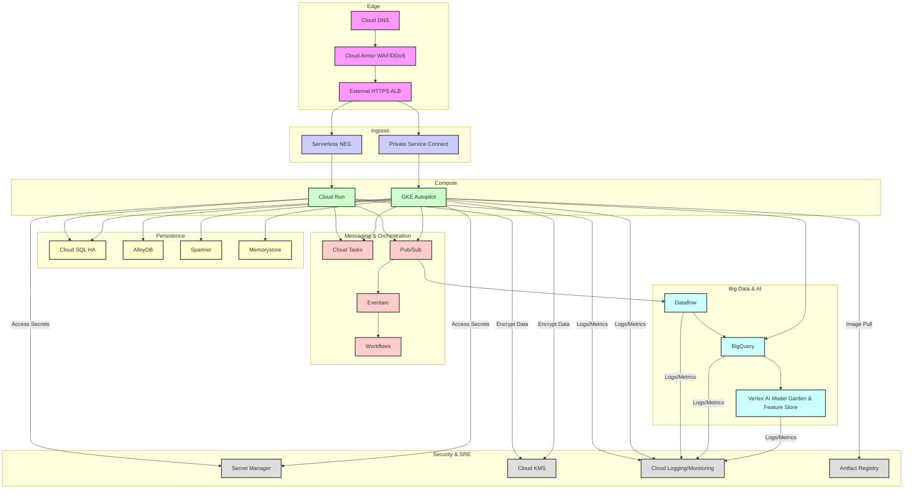

# Tổng quan điều hành: Mô hình tư duy kiến trúc Google Cloud

Google Cloud Platform (GCP) không chỉ đơn thuần là một tập hợp các dịch vụ; đó là một biểu hiện rõ ràng của cơ sở hạ tầng nội bộ của Google, được tinh chỉnh qua nhiều thập kỷ hoạt động ở quy mô toàn cầu. Việc hiểu rõ mô hình tư duy nền tảng này là rất quan trọng để thiết kế các giải pháp doanh nghiệp có khả năng phục hồi, hiệu suất cao và tối ưu chi phí.

<AudioPlayer src="/static/audio/google-cloud-platform-all-services-architecture-handbook-vi.mp3" title="Tóm tắt âm thanh cho kỹ sư" voice="Google Cloud vi-VN-Neural2-A" />


## Mạng lưới toàn cầu: Jupiter Fabric

Điểm khác biệt cốt lõi của Google Cloud nằm ở mạng riêng toàn cầu của nó, thường được gọi là Jupiter fabric. Đây không phải là internet công cộng; đó là một mạng lưới liên lục địa chuyên dụng, băng thông cao, độ trễ thấp.

| Tính năng | Mô tả | Tác động |
|:--------|:------------|:-------|
| **Jupiter Fabric** | Mạng riêng, được định nghĩa bằng phần mềm (SDN) của Google kết nối tất cả các trung tâm dữ liệu trên toàn cầu. | Hiệu suất có thể dự đoán, giảm độ trễ cho lưu lượng truy cập giữa các khu vực. |
| **Băng thông phân chia 1 Pbps** | Tổng dung lượng của mạng để truyền lưu lượng truy cập giữa hai nửa bất kỳ của mạng. | Loại bỏ mạng như một nút thắt cổ chai ngay cả đối với các khối lượng công việc đòi hỏi khắt khe nhất. |
| **Andromeda SDN** | Ngăn xếp ảo hóa mạng cung cấp năng lượng cho VPC, cân bằng tải và các dịch vụ mạng. | Cho phép các tính năng mạng nâng cao, phân đoạn vi mô và thực thi chính sách. |
| **Premium Tier** | Định tuyến mặc định. Lưu lượng truy cập đi vào mạng của Google tại PoP biên gần nhất và đi qua xương sống riêng. | Hiệu suất tối ưu, độ trễ thấp hơn, độ tin cậy cao hơn. Khuyến nghị cho hầu hết các khối lượng công việc sản xuất. |
| **Standard Tier** | Lưu lượng truy cập đi vào mạng của Google gần hơn với khu vực đích, sử dụng internet công cộng cho một phần đáng kể của đường dẫn. | Tối ưu chi phí cho các khối lượng công việc không nhạy cảm với độ trễ, phí thoát thấp hơn. |

**Lời khuyên thực tế:** Luôn mặc định sử dụng Premium Tier cho các ứng dụng sản xuất. Standard Tier phù hợp cho phát triển, thử nghiệm hoặc xử lý hàng loạt cụ thể nhạy cảm với chi phí mà độ trễ không quan trọng. Sự khác biệt về hiệu suất là đáng kể.

## Hệ thống phân cấp tài nguyên

Hệ thống phân cấp tài nguyên của GCP cung cấp một cách có cấu trúc để tổ chức và quản lý tài nguyên, thực thi chính sách và kiểm soát quyền truy cập. Đây là một thành phần quan trọng cho quản trị và bảo mật.

| Cấp độ | Mô tả | Các trường hợp sử dụng chính |
|:------|:------------|:--------------|
| **Tổ chức** | Nút gốc cho tất cả các tài nguyên Google Cloud thuộc về một công ty. | Thanh toán tập trung, IAM, thực thi chính sách (Chính sách tổ chức). |
| **Thư mục** | Nhóm các dự án dưới một tổ chức. Có thể lồng nhau. | Nhóm theo phòng ban hoặc môi trường (ví dụ: `dev`, `prod`). |
| **Dự án** | Đơn vị cơ bản để tổ chức tài nguyên. Tất cả các tài nguyên thuộc về một dự án. | Thanh toán, quản lý API, cách ly tài nguyên, ranh giới IAM. |
| **Tài nguyên** | Các dịch vụ riêng lẻ như phiên bản Compute Engine, nhóm Cloud Storage, tập dữ liệu BigQuery. | Tài sản tính toán, lưu trữ, mạng và dữ liệu thực tế. |

**Kế thừa chính sách IAM:** Các chính sách IAM được đặt ở cấp cao hơn (ví dụ: Tổ chức, Thư mục) được kế thừa bởi tất cả các tài nguyên ở cấp thấp hơn. Điều này cho phép kiểm soát chi tiết và đơn giản hóa việc quản lý chính sách.

**Các ràng buộc tổ chức (Chính sách tổ chức):** Đây là những hàng rào bảo vệ mạnh mẽ cho phép quản trị viên xác định các hạn chế về cách tài nguyên có thể được cấu hình trên toàn tổ chức. Ví dụ bao gồm hạn chế vị trí tài nguyên, vô hiệu hóa địa chỉ IP bên ngoài hoặc thực thi việc sử dụng API cụ thể.

```bash
# Example: List organization policies for a project
gcloud org-policies list --project=your-project-id

# Example: Describe a specific organization policy
gcloud org-policies describe compute.disableExternalIpAccess --organization=your-organization-id
```

## Dòng dõi Borg

Hệ thống quản lý cụm nội bộ của Google, Borg, là tổ tiên trực tiếp của Kubernetes. Việc hiểu dòng dõi này cung cấp cái nhìn sâu sắc về triết lý ưu tiên container của GCP và các nguyên tắc thiết kế đằng sau nhiều dịch vụ của nó.

| Khái niệm | Ảnh hưởng của Borg | Biểu hiện của GCP |
|:--------|:-----------------|:------------------|
| **Container hóa** | Borg đi tiên phong trong việc cách ly và lập lịch khối lượng công việc dựa trên container ở quy mô lớn. | Docker, Container Registry, Cloud Run, GKE. |
| **API khai báo** | Borg quản lý khối lượng công việc thông qua các đặc tả khai báo. | Kubernetes YAML, Cloud Deployment Manager, Terraform. |
| **Hệ thống tự phục hồi** | Borg tự động lên lịch lại các tác vụ bị lỗi và duy trì trạng thái mong muốn. | GKE Autopilot, nhóm phiên bản được quản lý, tự động mở rộng quy mô của Cloud Run. |
| **Phát hiện dịch vụ** | Borg cung cấp các cơ chế phát hiện dịch vụ nội bộ. | Cloud DNS, bộ cân bằng tải nội bộ, phát hiện dịch vụ GKE. |
| **Hiệu quả tài nguyên** | Mục tiêu chính của Borg là tối đa hóa việc sử dụng cụm. | Quản lý nút của GKE Autopilot, các dịch vụ không máy chủ (Cloud Run, Cloud Functions). |

**Lời khuyên thực tế:** Google Cloud được thiết kế vốn dĩ cho cơ sở hạ tầng bất biến, được container hóa. Hãy nắm lấy mô hình này. Các dịch vụ như Cloud Run và GKE Autopilot không chỉ tiện lợi; chúng đại diện cho đỉnh cao của hàng thập kỷ kinh nghiệm vận hành nội bộ của Google.

---

## Kiến trúc tham chiếu doanh nghiệp đầu cuối

Kiến trúc này minh họa một triển khai doanh nghiệp mạnh mẽ, an toàn và có khả năng mở rộng trên Google Cloud, nhấn mạnh các nguyên tắc không tin cậy và phòng thủ theo chiều sâu.



**Luồng dữ liệu không tin cậy & Phòng thủ theo chiều sâu:**

1.  **Bảo mật biên (Cloud DNS, Cloud Armor):** Tất cả lưu lượng truy cập bên ngoài trước tiên được định tuyến qua Cloud DNS và sau đó được Cloud Armor xử lý để bảo vệ DDoS và khả năng WAF. Đây là tuyến phòng thủ đầu tiên, lọc lưu lượng truy cập độc hại trước khi nó đến các tài nguyên tính toán.
2.  **Kiểm soát Ingress (External HTTPS ALB, Serverless NEG, Private Service Connect):**
    *   External HTTPS ALB chấm dứt TLS, cung cấp một điểm vào duy nhất.
    *   **Serverless NEG** định tuyến lưu lượng truy cập đến Cloud Run, đảm bảo chỉ các yêu cầu được ủy quyền, đã xác thực mới đến được các hàm không máy chủ. Bản thân Cloud Run thực thi IAM ở cấp dịch vụ.
    *   **Private Service Connect (PSC)** được sử dụng cho GKE Autopilot, đảm bảo rằng các dịch vụ GKE không bị lộ ra internet công cộng. Tất cả giao tiếp là riêng tư, trong mạng của Google, ngay cả đối với các máy khách bên ngoài kết nối qua các điểm cuối PSC. Điều này loại bỏ việc lộ IP công cộng cho mặt phẳng điều khiển và khối lượng công việc của GKE.
3.  **Cách ly tính toán (Cloud Run, GKE Autopilot):**
    *   **Cloud Run:** Cung cấp khả năng cách ly khối lượng công việc mạnh mẽ, tự động mở rộng quy mô và các tính năng bảo mật tích hợp. Mỗi bản sửa đổi chạy trong một môi trường sandbox bị cô lập.
    *   **GKE Autopilot:** Google quản lý cơ sở hạ tầng cơ bản, bao gồm cung cấp nút, vá lỗi và mở rộng quy mô, giảm bề mặt tấn công và chi phí vận hành. Khối lượng công việc chạy trong các pod bị cô lập. Các chính sách mạng trong GKE tiếp tục hạn chế giao tiếp giữa các pod.
4.  **Bảo mật lưu trữ dữ liệu:**
    *   **Cloud SQL HA, AlloyDB, Spanner, Memorystore:** Tất cả các kho dữ liệu là các dịch vụ được quản lý, cung cấp mã hóa khi lưu trữ và khi truyền mặc định. Quyền truy cập được kiểm soát thông qua IAM và kết nối IP riêng (VPC Service Controls có thể hạn chế quyền truy cập hơn nữa). Cấu hình High Availability (HA) đảm bảo khả năng phục hồi.
5.  **Bảo mật nhắn tin & điều phối:**
    *   **Cloud Tasks, Pub/Sub, Eventarc, Workflows:** Các dịch vụ này tạo điều kiện giao tiếp không đồng bộ và điều phối quy trình làm việc. Quyền truy cập được kiểm soát thông qua IAM. Các chủ đề Pub/Sub có thể được bảo mật bằng VPC Service Controls.
6.  **Bảo mật dữ liệu lớn & AI:**
    *   **Dataflow, BigQuery, Vertex AI:** Các dịch vụ này xử lý dữ liệu quy mô lớn và học máy. Dữ liệu được mã hóa và quyền truy cập được kiểm soát chặt chẽ thông qua IAM. BigQuery cung cấp bảo mật cấp cột và che dấu dữ liệu. Vertex AI đảm bảo triển khai mô hình và truy cập dữ liệu an toàn.
7.  **Bảo mật tập trung & SRE (Secret Manager, KMS, Cloud Logging/Monitoring, Artifact Registry):**
    *   **Secret Manager:** Lưu trữ tập trung, mã hóa cho khóa API, thông tin đăng nhập cơ sở dữ liệu và các dữ liệu nhạy cảm khác. Các ứng dụng truy xuất bí mật tại thời điểm chạy, tránh mã hóa cứng.
    *   **Cloud KMS:** Quản lý các khóa mã hóa để mã hóa dữ liệu trên các dịch vụ. Đảm bảo phân tách nhiệm vụ cho quản lý khóa.
    *   **Cloud Logging/Monitoring:** Cung cấp khả năng quan sát, kiểm tra và cảnh báo toàn diện. Tất cả các tương tác dịch vụ được ghi lại, cho phép phát hiện hành vi bất thường.
    *   **Artifact Registry:** Lưu trữ an toàn hình ảnh container và các tạo phẩm xây dựng khác. Thực thi quét lỗ hổng và đảm bảo chỉ các hình ảnh đáng tin cậy mới được triển khai.

Kiến trúc này thể hiện nguyên tắc không tin cậy bằng cách giả định không có sự tin cậy ngầm, ngay cả trong phạm vi mạng. Mọi tương tác đều yêu cầu ủy quyền rõ ràng và mọi lớp đều cung cấp khả năng phòng thủ chống lại các mối đe dọa tiềm ẩn.

## Lĩnh vực 1: Công cụ tính toán & không máy chủ

Lĩnh vực này bao gồm các dịch vụ tính toán cốt lõi trong Google Cloud, từ các nền tảng không máy chủ được quản lý hoàn toàn đến các máy ảo và điều phối container có thể tùy chỉnh cao. Trọng tâm là ứng dụng thực tế, hiểu các đánh đổi và tận dụng các tính năng nâng cao cho khối lượng công việc cấp sản xuất.

### Cloud Run

Cloud Run là một nền tảng tính toán được quản lý hoàn toàn để triển khai các ứng dụng được container hóa. Nó trừu tượng hóa việc quản lý cơ sở hạ tầng, cho phép các nhà phát triển tập trung hoàn toàn vào mã.

*   **Thời gian chạy Container**: Cloud Run thực thi các hình ảnh container tuân thủ OCI. Nó cung cấp một môi trường sandbox mạnh mẽ, an toàn cho mỗi phiên bản.
*   **Đồng thời trên mỗi phiên bản**: Một phiên bản Cloud Run duy nhất có thể xử lý nhiều yêu cầu đồng thời. Mặc định là 80, có thể cấu hình lên đến 1000. Đồng thời cao hơn có thể cải thiện việc sử dụng tài nguyên nhưng yêu cầu các ứng dụng phải an toàn về luồng và không chặn.
*   **Scale-to-Zero**: Một tính năng không máy chủ quan trọng, Cloud Run tự động giảm xuống không phiên bản khi không có lưu lượng truy cập, loại bỏ chi phí nhàn rỗi.
*   **Min-Instances**: Để giảm độ trễ khởi động lạnh cho các ứng dụng quan trọng, `min-instances` có thể được đặt để giữ một số lượng phiên bản được chỉ định ở trạng thái sẵn sàng phục vụ lưu lượng truy cập. Điều này phát sinh chi phí thanh toán liên tục cho các phiên bản đó.
*   **Direct VPC Egress**: Để giao tiếp an toàn và riêng tư với các tài nguyên trong mạng Virtual Private Cloud (VPC) (ví dụ: Cloud SQL, Memorystore, API nội bộ), Cloud Run có thể được cấu hình cho Direct VPC Egress. Điều này định tuyến tất cả lưu lượng truy cập đi qua một trình kết nối VPC được chỉ định.
*   **Hỗ trợ GPU**: Cloud Run hiện hỗ trợ tăng tốc GPU cho các khối lượng công việc yêu cầu xử lý chuyên biệt, chẳng hạn như suy luận AI/ML. Điều này được cấu hình thông qua các cờ `--cpu` và `--gpu`.
*   **Cloud Run Jobs**: Một dịch vụ riêng biệt trong Cloud Run để thực thi các công việc hàng loạt không phải HTTP, ngắn hạn hoặc dài hạn. Các công việc có thể được kích hoạt thủ công, theo lịch trình hoặc thông qua Eventarc. Chúng hỗ trợ song song hóa và thử lại.

### GKE (Google Kubernetes Engine)

GKE là dịch vụ Kubernetes được quản lý của Google Cloud, cung cấp một nền tảng mạnh mẽ để triển khai, quản lý và mở rộng quy mô các ứng dụng được container hóa.

*   **Autopilot so với Standard**:
 | Tính năng | GKE Standard | GKE Autopilot |
 | :------ | :----------- | :------------ |
 | Quản lý nút | Người dùng quản lý | Google quản lý |
 | Giá cả | VM + phí GKE | Dựa trên Pod |
 | Tùy chỉnh | Cao (nhóm nút, HĐH) | Hạn chế (hồ sơ được xác định trước) |
 | Bảo mật | Trách nhiệm chung | Nâng cao (nút được tăng cường) |
 | Mở rộng | Thủ công/CA | Tự động (dựa trên pod) |
 | Trường hợp sử dụng | Kiểm soát tối đa, HĐH tùy chỉnh | Không cần can thiệp, tối ưu chi phí |
    *   **Đánh đổi**: Autopilot đơn giản hóa đáng kể các hoạt động bằng cách quản lý các nút, mở rộng quy mô và vá lỗi. Nó lý tưởng cho hầu hết các khối lượng công việc mà việc tùy chỉnh cấp nút không quan trọng. Standard cung cấp khả năng kiểm soát chi tiết đối với các loại nút, hệ điều hành và mạng, phù hợp cho các khối lượng công việc chuyên biệt cao hoặc kế thừa.
    *   **Tư thế bảo mật**: Autopilot cung cấp tư thế bảo mật được tăng cường theo mặc định, với Google quản lý HĐH nút và bảo mật thời gian chạy. Standard yêu cầu người dùng quản lý các bản cập nhật và cấu hình bảo mật nút.
    *   **Tự động cung cấp nút**: Trong GKE Standard, tính năng này tự động tạo các nhóm nút mới dựa trên các yêu cầu tài nguyên pod đang chờ xử lý, tối ưu hóa phân bổ tài nguyên và giảm sự can thiệp thủ công.

*   **Multi-cluster Ingress**: Cho phép một địa chỉ IP bên ngoài toàn cầu duy nhất định tuyến lưu lượng truy cập đến các ứng dụng được triển khai trên nhiều cụm GKE, có thể ở các khu vực khác nhau. Điều này cung cấp cân bằng tải toàn cầu, chuyển đổi dự phòng và quản lý DNS đơn giản hóa cho các dịch vụ phân tán địa lý.
*   **Gateway API**: API thế hệ tiếp theo cho Kubernetes ingress, cung cấp các cách biểu cảm và mở rộng hơn để cấu hình định tuyến, quản lý lưu lượng truy cập và thực thi chính sách so với API Ingress cũ hơn. Nó giới thiệu các khái niệm như `GatewayClass`, `Gateway`, `HTTPRoute` và `TCPRoute`.

### Compute Engine

Compute Engine cung cấp các máy ảo (VM) có thể tùy chỉnh cao với nhiều loại máy, tùy chọn lưu trữ và mô hình định giá khác nhau.

*   **Dòng máy C3/N4**:
    *   **C3**: Tối ưu hóa cho tính toán hiệu năng cao (HPC), phân tích dữ liệu và các khối lượng công việc doanh nghiệp đòi hỏi khắt khe. Có bộ xử lý Intel Xeon Scalable thế hệ thứ 4 (Sapphire Rapids) và bộ nhớ DDR5. Cung cấp số lượng lõi và tỷ lệ bộ nhớ cao.
    *   **N4**: Dòng máy đa năng, kế nhiệm N2. Cung cấp sự cân bằng giữa hiệu suất và hiệu quả chi phí cho nhiều khối lượng công việc.
*   **Hyperdisk**: Bộ nhớ khối thế hệ tiếp theo của Google Cloud dành cho Compute Engine, cung cấp hiệu suất và tính linh hoạt cao hơn đáng kể so với Persistent Disk.
    *   **Hyperdisk Balanced**: Bộ nhớ khối đa năng, hiệu quả chi phí với các đặc tính hiệu suất tốt.
    *   **Hyperdisk Extreme**: Được thiết kế cho các khối lượng công việc giao dịch đòi hỏi khắt khe nhất (ví dụ: cơ sở dữ liệu lớn) yêu cầu IOPS và thông lượng cực cao.
    *   **Hyperdisk Throughput**: Tối ưu hóa cho các khối lượng công việc chuyên sâu về thông lượng (ví dụ: phân tích dữ liệu, truyền phát) nơi hiệu suất I/O tuần tự là rất quan trọng.
*   **Spot VMs**: Các VM hiệu quả chi phí cao có thể bị Compute Engine chiếm quyền nếu cần tài nguyên ở nơi khác. Lý tưởng cho các khối lượng công việc chịu lỗi, không trạng thái hoặc hàng loạt mà sự gián đoạn là chấp nhận được. Tiết kiệm chi phí đáng kể (lên đến 91% so với giá theo yêu cầu).
*   **Live Migration**: Một tính năng của Compute Engine cho phép các VM được di chuyển từ một máy chủ sang máy chủ khác mà không bị gián đoạn. Điều này rất quan trọng để bảo trì, vá lỗi và nâng cấp máy chủ, đảm bảo tính khả dụng cao cho các ứng dụng quan trọng.

### Cloud Functions (Thế hệ thứ 2)

Cloud Functions Thế hệ thứ 2 được xây dựng trên Cloud Run, kế thừa cơ sở hạ tầng và khả năng cơ bản của nó.

*   **Nền tảng Cloud Run**: Tận dụng Cloud Run cung cấp cho các hàm Thế hệ thứ 2 thời gian chờ yêu cầu dài hơn, đồng thời cao hơn và khả năng thoát VPC trực tiếp, giải quyết các hạn chế của Thế hệ thứ 1.
*   **Trình kích hoạt Eventarc**: Cloud Functions chủ yếu là hướng sự kiện. Eventarc cung cấp một cơ chế thống nhất để định tuyến các sự kiện từ hơn 100 nguồn Google Cloud (ví dụ: Cloud Storage, Pub/Sub, Firestore) đến Cloud Functions, cho phép các kiến trúc hướng sự kiện mạnh mẽ.
*   **Thời gian chờ**: Các hàm Thế hệ thứ 2 hỗ trợ thời gian chờ dài hơn đáng kể, lên đến 60 phút cho các hàm HTTP và 9 giờ cho các hàm hướng sự kiện, đáp ứng các tác vụ phức tạp và chạy dài hơn.
*   **Đồng thời**: Tương tự như Cloud Run, các hàm Thế hệ thứ 2 có thể xử lý nhiều yêu cầu đồng thời trên mỗi phiên bản, cải thiện việc sử dụng tài nguyên và giảm khởi động lạnh.

### Cloud Batch

Cloud Batch là một dịch vụ được quản lý hoàn toàn cho tính toán hàng loạt thông lượng cao. Nó đơn giản hóa việc thực thi các công việc hàng loạt quy mô lớn, song song và tuần tự.

*   **Tính toán hàng loạt thông lượng cao**: Được thiết kế cho các khối lượng công việc yêu cầu xử lý tập dữ liệu lớn hoặc chạy nhiều tác vụ độc lập, chẳng hạn như mô phỏng khoa học, mô hình tài chính hoặc chuyển mã phương tiện.
*   **MPI (Giao diện truyền thông điệp)**: Cloud Batch hỗ trợ MPI cho các khối lượng công việc song song được kết nối chặt chẽ, cho phép giao tiếp giữa các tác vụ chạy trên các VM khác nhau trong một công việc.
*   **Array Jobs**: Một tính năng mạnh mẽ cho phép một định nghĩa công việc duy nhất khởi chạy hàng nghìn tác vụ giống hệt nhau, mỗi tác vụ xử lý một đầu vào hoặc một phần khác nhau của tập dữ liệu. Điều này hiệu quả cho các khối lượng công việc song song dễ dàng.
*   **Khả năng chịu lỗi của Spot VM**: Cloud Batch có thể tận dụng Spot VM để tiết kiệm chi phí đáng kể. Nó bao gồm các cơ chế tích hợp để xử lý việc chiếm quyền, chẳng hạn như tự động thử lại và điểm kiểm tra, giúp Spot VM khả thi cho nhiều khối lượng công việc hàng loạt.

### Bảng so sánh nhỏ gọn

| Dịch vụ | Nguyên mẫu chính | Tốt nhất khi | Tránh khi |
| :------ | :---------------- | :-------- | :--------- |
| Cloud Run | Container không máy chủ | Microservice HTTP/hướng sự kiện, API | Ứng dụng có trạng thái chạy dài, nhu cầu GPU cực cao |
| GKE | Điều phối Container | Microservice phức tạp, kiểm soát tùy chỉnh, lai | Ứng dụng đơn giản, nhóm vận hành tối thiểu |
| Compute Engine | IaaS VM | Ứng dụng kế thừa, HĐH tùy chỉnh, phần cứng cụ thể | Không máy chủ lý tưởng, chi phí vận hành cao |
| Cloud Functions | FaaS không máy chủ | Hướng sự kiện, ngắn hạn, hàm không trạng thái | Quy trình chạy dài, trạng thái phức tạp |
| Cloud Batch | Xử lý hàng loạt | HPC, xử lý dữ liệu quy mô lớn, công việc mảng | Thời gian thực, tương tác, độ trễ thấp |

### Các công thức CLI sản xuất `gcloud`

#### Triển khai dịch vụ Cloud Run

```bash
# Deploy a Cloud Run service with specific resource limits, min/max instances, and VPC egress
gcloud run deploy my-service \
  --image gcr.io/my-project/my-app:v1.0.0 \
  --platform managed \
  --region us-central1 \
  --project my-project-id \
  --service-account my-service-account@my-project-id.iam.gserviceaccount.com \
  --cpu 2 \
  --memory 2Gi \
  --min-instances 1 \
  --max-instances 10 \
  --concurrency 80 \
  --timeout 300s \
  --vpc-egress all \
  --vpc-connector projects/my-project-id/locations/us-central1/connectors/my-vpc-connector \
  --set-env-vars ENV_VAR_KEY=ENV_VAR_VALUE \
  --no-allow-unauthenticated
```

#### Tạo công việc Cloud Run

```bash
# Create a Cloud Run Job for a batch task
gcloud run jobs create my-batch-job \
  --image gcr.io/my-project/my-batch-processor:v1.0.0 \
  --region us-central1 \
  --project my-project-id \
  --service-account my-batch-sa@my-project-id.iam.gserviceaccount.com \
  --cpu 4 \
  --memory 8Gi \
  --tasks 10 \
  --parallelism 5 \
  --timeout 3600s \
  --set-env-vars INPUT_BUCKET=gs://my-input-data,OUTPUT_BUCKET=gs://my-output-data
```

#### Tạo cụm GKE Autopilot

```bash
# Create a GKE Autopilot cluster with release channel and private endpoint
gcloud container clusters create-auto my-autopilot-cluster \
  --region us-central1 \
  --project my-project-id \
  --release-channel stable \
  --network projects/my-project-id/global/networks/my-vpc \
  --subnetwork projects/my-project-id/regions/us-central1/subnetworks/my-gke-subnet \
  --enable-private-nodes \
  --enable-private-endpoint \
  --master-ipv4-cidr 172.16.0.0/28 \
  --workload-pool my-project-id.svc.id.goog \
  --enable-workload-identity
```

#### Tạo phiên bản Compute Engine Spot VM

```bash
# Create a Compute Engine Spot VM with Hyperdisk Balanced and a specific service account
gcloud compute instances create my-spot-vm \
  --project my-project-id \
  --zone us-central1-a \
  --machine-type n2-standard-4 \
  --provisioning-model SPOT \
  --instance-termination-action STOP \
  --boot-disk-device-name my-spot-boot-disk \
  --boot-disk-type hyperdisk-balanced \
  --boot-disk-size 50GB \
  --image-family debian-11 \
  --image-project debian-cloud \
  --network-interface network=my-vpc,subnet=my-compute-subnet \
  --service-account my-compute-sa@my-project-id.iam.gserviceaccount.com \
  --scopes=https://www.googleapis.com/auth/cloud-platform \
  --metadata startup-script='#!/bin/bash\necho "Hello from Spot VM" > /tmp/startup.txt'
```

#### Triển khai Cloud Functions (Thế hệ thứ 2)

```bash
# Deploy a 2nd Gen Cloud Function triggered by a Pub/Sub topic
gcloud functions deploy my-pubsub-function-v2 \
  --gen2 \
  --runtime python39 \
  --region us-central1 \
  --project my-project-id \
  --source ./function-source \
  --entry-point process_message \
  --trigger-topic my-pubsub-topic \
  --service-account my-function-sa@my-project-id.iam.gserviceaccount.com \
  --memory 512MB \
  --timeout 300s \
  --concurrency 10 \
  --vpc-connector projects/my-project-id/locations/us-central1/connectors/my-vpc-connector \
  --egress-settings private-ranges-only
```

#### Gửi công việc Cloud Batch

```bash
# Submit a Cloud Batch job using a JSON configuration file
# job_config.json example:
# {
#   "taskGroups": [
#     {
#       "taskSpec": {
#         "runnables": [
#           {
#             "script": {
#               "text": "echo 'Processing task ${BATCH_TASK_INDEX}' && sleep 10"
#             }
#           }
#         ],
#         "computeResource": {
#           "cpuMilli": 1000,
#           "memoryMib": 512
#         }
#       },
#       "taskCount": 5,
#       "parallelism": 2
#     }
#   ],
#   "allocationPolicy": {
#     "instances": [
#       {
#         "policy": {
#           "machineType": "e2-standard-2",
#           "provisioningModel": "SPOT"
#         }
#       }
#     ]
#   },
#   "logsPolicy": {
#     "destination": "CLOUD_LOGGING"
#   }
# }
gcloud batch jobs submit my-batch-job-from-file \
  --location us-central1 \
  --project my-project-id \
  --config job_config.json \
  --service-account my-batch-sa@my-project-id.iam.gserviceaccount.com

## Domain 2: Cloud Databases & In-Memory Stores

### Cloud SQL

Cloud SQL provides fully managed relational database services for PostgreSQL, MySQL, and SQL Server. It abstracts away operational overheads like patching, backups, and replication, allowing focus on application development.

#### PostgreSQL, MySQL, SQL Server

Cloud SQL supports the latest major versions of these popular engines, offering compatibility with existing applications and tools.

*   **PostgreSQL**: Robust, feature-rich, and extensible, often preferred for complex transactional workloads and GIS applications.
*   **MySQL**: Widely adopted, known for its ease of use and performance in web applications.
*   **SQL Server**: Essential for enterprises with existing Microsoft ecosystem dependencies, supporting features like Always On Availability Groups (managed by Cloud SQL).

#### High Availability (HA) Regional Failover

Cloud SQL HA ensures business continuity through automatic failover to a standby instance in a different availability zone within the same region. This is achieved by synchronously replicating data from the primary instance to the standby. In case of a primary instance failure (e.g., zone outage, instance crash), Cloud SQL automatically promotes the standby to primary, minimizing downtime.

*   **Mechanism**: Uses a shared IP address that automatically switches to the new primary.
*   **RPO/RTO**: Near-zero Recovery Point Objective (RPO) due to synchronous replication; Recovery Time Objective (RTO) typically under 60 seconds.

#### Automated Maintenance

Cloud SQL handles routine maintenance tasks such as OS patching, database engine updates, and security vulnerability fixes. Maintenance windows can be configured to minimize impact on production workloads, allowing specification of a preferred day and time range.

#### Read Replicas

Read replicas offload read-heavy workloads from the primary instance, improving performance and scalability. They are asynchronous copies of the primary instance, suitable for reporting, analytics, and geographically distributed read access.

*   **Cross-Region Replicas**: Can be provisioned in different regions for disaster recovery and reduced read latency for global users.
*   **Promotion**: A read replica can be promoted to a standalone primary instance, useful for disaster recovery or database migration scenarios.

#### Private IP Peering vs. Private Service Connect

Both mechanisms enable private connectivity to Cloud SQL instances, avoiding exposure over the public internet.

*   **Private IP Peering (VPC Network Peering)**:
    *   **Mechanism**: Connects your VPC network directly to Google's internal service producer network where Cloud SQL instances reside.
    *   **Setup**: Requires configuring a private IP range for Cloud SQL within your VPC.
    *   **Scope**: Network-wide peering, allowing all resources in your VPC to access Cloud SQL.
    *   **Limitations**: IP address space management can be complex; peering limits apply.

*   **Private Service Connect (PSC)**:
    *   **Mechanism**: Provides private access to managed services using internal IP addresses within your VPC, without VPC network peering.
    *   **Setup**: Creates a forwarding rule and an endpoint in your VPC that points to a service attachment in the service producer's network.
    *   **Scope**: More granular control, allowing specific endpoints for specific services.
    *   **Advantages**: Simplifies IP address management, avoids peering limits, and enhances network security by isolating service traffic. Recommended for new deployments.

### AlloyDB for PostgreSQL

AlloyDB is a fully managed, PostgreSQL-compatible database service designed for demanding enterprise workloads, offering superior performance and availability compared to standard PostgreSQL.

#### Disaggregated Compute & Storage Architecture

AlloyDB separates compute (query processing) from storage (data persistence).

*   **Compute Layer**: Consists of multiple independent compute nodes that process queries. These nodes are stateless and can scale independently.
*   **Storage Layer**: A distributed, shared storage service that stores data in a columnar format. It handles data replication, self-healing, and continuous backup.
*   **Benefits**: Enables rapid scaling of compute resources without affecting storage, and vice versa. Improves fault tolerance as compute nodes can fail independently without data loss.

#### Columnar Engine

AlloyDB incorporates a columnar engine for analytical queries. While PostgreSQL is primarily row-oriented, AlloyDB's intelligent storage layer can store data in a columnar format for specific tables or partitions, significantly accelerating analytical workloads (e.g., OLAP queries) without requiring separate ETL processes or data warehouses. This hybrid transactional/analytical processing (HTAP) capability is a key differentiator.

#### Transactional vs. Analytical Scaling

*   **Transactional Scaling**: Achieved by adding more compute nodes to handle increased concurrent transactions. The shared storage layer ensures data consistency across all nodes.
*   **Analytical Scaling**: The columnar engine and intelligent caching mechanisms optimize analytical query performance. Read replicas can also be used to offload analytical workloads. AlloyDB's architecture allows for efficient scaling of both types of workloads within a single database.

#### Vector Embeddings with pgvector

AlloyDB supports the `pgvector` extension, enabling efficient storage and querying of vector embeddings directly within the database. This is crucial for AI/ML applications, such as similarity search, recommendation engines, and semantic search.

*   **Capabilities**: Stores high-dimensional vectors, supports various distance metrics (e.g., L2 distance, cosine similarity), and provides optimized indexing for fast nearest-neighbor searches.
*   **Integration**: Allows developers to build AI-powered features directly into their applications without needing separate vector databases.

### Cloud Spanner

Cloud Spanner is a globally distributed, strongly consistent, relational database service built for mission-critical applications requiring high availability and massive scale.

#### TrueTime API

TrueTime is Spanner's foundational technology, providing globally consistent wall-clock time with bounded uncertainty.

*   **Mechanism**: Uses atomic clocks and GPS receivers in Google's data centers to synchronize time across all Spanner servers globally.
*   **Guarantees**: Provides a timestamp interval `[earliest, latest]` for every transaction, ensuring that all transactions committed before `t` are visible everywhere by `t`. This enables external consistency.
*   **Impact**: Eliminates the need for distributed commit protocols like Paxos or Raft for global consistency, simplifying application development and improving performance.

#### External Consistency

Spanner offers external consistency, a stronger guarantee than serializability. It means that the global order of transactions observed by any client matches the real-world wall-clock order of those transactions. This simplifies reasoning about distributed transactions and ensures data integrity across continents.

#### Regional vs. Multi-Regional Instances

*   **Regional Instances**: Data is replicated synchronously across three availability zones within a single Google Cloud region. Provides high availability within that region.
*   **Multi-Regional Instances**: Data is replicated synchronously across multiple regions (e.g., `nam-eur-asia1`). Offers extreme availability (99.999% SLA) and low-latency reads for globally distributed applications. Writes are still routed to a primary region for consistency.

#### Granular Instance Sizing (Processing Units)

Spanner instances are sized in "processing units" (PUs). Each PU provides a certain amount of CPU, memory, and I/O capacity.

*   **Scaling**: Instances can be scaled up or down by adding or removing PUs, allowing fine-grained control over performance and cost.
*   **Minimum**: A Spanner instance starts with 100 PUs (0.1 nodes).
*   **Automatic Scaling**: While not fully automatic, Spanner can be integrated with custom solutions to scale PUs based on metrics.

#### Spanner Graph

Spanner Graph is a capability that allows users to perform graph-like queries directly on Spanner data, leveraging its strong consistency and scalability. It's not a separate graph database but rather a set of features and best practices for modeling and querying graph data within Spanner.

*   **Modeling**: Uses adjacency list or edge list models within Spanner tables.
*   **Querying**: Leverages SQL with recursive CTEs (Common Table Expressions) for pathfinding and traversal queries.
*   **Use Cases**: Fraud detection, social networks, recommendation engines, and supply chain analysis where relationships between entities are critical.

### Firestore

Firestore is a flexible, scalable NoSQL document database for mobile, web, and server development. It offers real-time synchronization and offline support.

#### Native Mode vs. Datastore Mode

Firestore offers two modes, primarily differing in their API and feature sets.

*   **Native Mode (Firestore)**:
    *   **Data Model**: Document-oriented, hierarchical collections of documents.
    *   **API**: Real-time listeners, mobile/web SDKs, strong consistency.
    *   **Use Cases**: Mobile/web applications requiring real-time updates, collaborative apps.
    *   **Consistency**: Strong consistency for reads and writes.

*   **Datastore Mode (Cloud Datastore)**:
    *   **Data Model**: Entity-oriented, with entities and kinds, similar to App Engine Datastore.
    *   **API**: Primarily server-side SDKs, eventual consistency by default (strong consistency for ancestor queries).
    *   **Use Cases**: Server-side applications, backend services, large-scale data storage.
    *   **Consistency**: Eventual consistency for most queries, strong consistency for ancestor queries.
    *   **Migration**: Existing Cloud Datastore databases are now technically Firestore in Datastore Mode.

#### Real-time Listeners

Firestore's real-time listeners allow clients to subscribe to changes in a document or a query result set. When data changes on the server, Firestore pushes updates to connected clients in real-time.

*   **Mechanism**: Uses WebSockets for persistent connections.
*   **Benefits**: Enables highly interactive and collaborative applications without constant polling.
*   **Offline Support**: SDKs automatically handle offline data persistence and synchronization when connectivity is restored.

#### Composite Indexes

Firestore automatically creates single-field indexes for all fields. However, for queries involving multiple fields (e.g., `WHERE field1 == 'value' AND field2 > 'value'`), composite indexes are required.

*   **Definition**: Defined manually in the Firebase console or via `firebase.indexes.json` file.
*   **Optimization**: Essential for efficient multi-field queries and ordering. Without them, such queries will fail.
*   **Cost**: Each composite index adds to storage and write costs. Design them judiciously.

#### Distributed Counter Patterns

Directly incrementing a counter field in a single document can lead to contention and performance bottlenecks in high-concurrency scenarios. Firestore supports distributed counter patterns to mitigate this.

*   **Sharded Counters**: Break a single counter into multiple "shards" (separate documents). When incrementing, randomly pick a shard and increment its value. To get the total count, sum all shard values.
*   **Atomic Increments**: Use Firestore's `FieldValue.increment()` to atomically update a numeric field without reading its current value first, reducing read-modify-write conflicts.
*   **Transactions**: For more complex multi-document updates, use transactions to ensure atomicity.

### Cloud Bigtable

Cloud Bigtable is a fully managed, petabyte-scale NoSQL database service designed for large analytical and operational workloads. It's ideal for time-series data, marketing data, financial data, and IoT data.

#### LSM-tree Architecture

Bigtable is built on a Log-Structured Merge-tree (LSM-tree) architecture.

*   **Mechanism**: Writes are first appended to an in-memory buffer (memtable) and a commit log. When the memtable is full, it's flushed to immutable sorted string tables (SSTables) on disk. Reads merge data from memtables and SSTables.
*   **Benefits**: Optimized for high write throughput, as writes are sequential. Efficient for range scans.
*   **Compaction**: Background processes continuously merge and compact SSTables to maintain performance and reclaim space.

#### Row-Key Design Patterns

Row-key design is critical for Bigtable performance, as data is stored lexicographically by row key.

*   **Time-Series Data**:
    *   **Anti-pattern**: Timestamp as prefix (e.g., `timestamp#device_id`) leads to hot-spotting on recent data.
    *   **Good pattern**: Reverse timestamp (e.g., `device_id#reverse_timestamp`) or hash prefix (e.g., `hash(device_id)#timestamp`) for even distribution.
*   **Unique Identifiers**: Use natural keys or UUIDs. If using UUIDs, ensure they are not sequential to avoid hot-spotting.
*   **Related Data**: Group related data by designing row keys that allow efficient range scans (e.g., `user_id#order_id`).
*   **Hot-spotting**: Avoid designs where a small number of row keys receive a disproportionate amount of traffic.

#### SSD vs. HDD

Bigtable offers two storage types:

*   **SSD Storage**: Default and recommended for most workloads. Provides significantly higher throughput and lower latency. Ideal for operational workloads and high-performance analytics.
*   **HDD Storage**: Lower cost per GB, but with much lower throughput and higher latency. Suitable for archival data or workloads where cost is paramount and performance is less critical.

#### Replication and Failover

Bigtable supports multi-cluster replication, allowing data to be replicated across multiple clusters in different regions or zones.

*   **Asynchronous Replication**: Data is replicated asynchronously between clusters.
*   **High Availability**: Provides disaster recovery and allows for low-latency reads for geographically distributed users.
*   **Failover**: In case of a cluster outage, traffic can be redirected to a healthy replica. Application-level logic is typically required for failover.
*   **Consistency**: Eventual consistency across replicas.

#### Integration with BigQuery

Bigtable integrates seamlessly with BigQuery for advanced analytics.

*   **External Tables**: BigQuery can query Bigtable data directly using external tables, avoiding ETL processes. This is useful for ad-hoc analysis or joining Bigtable data with other datasets in BigQuery.
*   **Data Export**: Data can be exported from Bigtable to Cloud Storage and then loaded into BigQuery for more complex transformations and long-term archival.

### Memorystore

Memorystore is a fully managed service for Redis and Memcached, providing highly scalable and available in-memory data stores.

#### Memorystore for Redis Cluster

Memorystore for Redis offers two tiers: Basic and Standard. The Standard tier supports high availability and replication. Memorystore for Redis Cluster is a specific offering for sharded Redis deployments.

*   **Sharding**: Automatically shards data across multiple Redis nodes, enabling horizontal scaling beyond the limits of a single Redis instance.
*   **High Availability**: Each shard can have a primary and replica node for failover.
*   **Use Cases**: Caching, session management, real-time analytics, leaderboards, and message queues requiring high throughput and low latency.
*   **Redis Features**: Supports all native Redis data structures and commands.

#### Memorystore for Valkey

Valkey is an open-source, high-performance in-memory data store, forked from Redis. Memorystore for Valkey provides a managed service for Valkey instances.

*   **Compatibility**: Offers API compatibility with Redis, allowing existing Redis applications to migrate easily.
*   **Features**: Provides similar features to Memorystore for Redis, including caching, session management, and real-time data processing.
*   **Future-Proofing**: Positions users to leverage future innovations within the Valkey ecosystem.

#### Persistence

Memorystore for Redis (Standard Tier and Cluster) offers persistence options to prevent data loss during restarts or failures.

*   **RDB (Redis Database) Snapshots**: Periodically saves a snapshot of the dataset to disk.
*   **AOF (Append-Only File)**: Logs every write operation to a file, allowing reconstruction of the dataset upon restart.
*   **Trade-offs**: RDB is faster for recovery but can lose more data. AOF offers better durability but can be slower for recovery. Memorystore manages these configurations.

#### Cluster Scaling

Memorystore for Redis Cluster allows for dynamic scaling of the cluster size.

*   **Horizontal Scaling**: Add or remove shards to increase or decrease capacity and throughput.
*   **Vertical Scaling**: Adjust the memory capacity of individual nodes within a shard.
*   **Automatic Resharding**: Memorystore handles the rebalancing of data across shards during scaling operations, minimizing application impact.

### Compact Comparison Table

| Database Service | Engine & Model | Throughput / Scale | Consistency Model | Ideal Use Case |
|---|---|---|---|---|
| Cloud SQL | PostgreSQL, MySQL, SQL Server (Relational) | GBs/sec, TBs, vertical scale | Strong | OLTP, web apps, enterprise apps |
| AlloyDB | PostgreSQL (Relational, HTAP) | TBs/sec, PBs, horizontal scale | Strong | High-perf OLTP, HTAP, AI/ML |
| Cloud Spanner | Custom (Globally Distributed Relational) | TBs/sec, PBs, global horizontal scale | External | Mission-critical, global OLTP |
| Firestore | NoSQL Document | MBs/sec, PBs, horizontal scale | Strong (Native), Eventual (Datastore) | Mobile/web apps, real-time, IoT |
| Cloud Bigtable | NoSQL Wide-Column | GBs/sec, PBs, horizontal scale | Eventual | Time-series, IoT, ad tech, analytics |
| Memorystore | Redis, Valkey, Memcached (In-memory KV) | GBs/sec, TBs, horizontal scale | Eventual | Caching, session mgmt, real-time analytics |

### Production `gcloud` CLI Recipes

#### Provisioning Cloud SQL PostgreSQL with HA, Private IP, and Backup

This command provisions a Cloud SQL PostgreSQL instance with high availability, private IP connectivity, automated backups, and a specific maintenance window.

```bash
gcloud sql instances create my-prod-pg-instance \
  --database-version=POSTGRES_14 \
  --region=us-central1 \
  --cpu=4 \
  --memory=16GB \
  --storage-size=500GB \
  --storage-type=SSD \
  --availability-type=REGIONAL \
  --enable-bin-log \
  --backup-start-time="03:00" \
  --backup-location=us-central1 \
  --database-flags="log_statement=all,max_connections=500" \
  --maintenance-window-day=SATURDAY \
  --maintenance-window-hour=02 \
  --network=projects/my-gcp-project/global/networks/my-vpc-network \
  --no-assign-ip \
  --allocated-ip-range-name=my-cloudsql-private-range \
  --root-password="<YOUR_STRONG_PASSWORD>" \
  --project=my-gcp-project
```

*   `--database-version`: Specifies the PostgreSQL version.
*   `--region`: Deploys the instance in `us-central1`.
*   `--cpu`, `--memory`, `--storage-size`, `--storage-type`: Defines instance resources.
*   `--availability-type=REGIONAL`: Enables High Availability (HA) with regional failover.
*   `--enable-bin-log`: Essential for point-in-time recovery and replication.
*   `--backup-start-time`, `--backup-location`: Configures automated daily backups.
*   `--database-flags`: Sets PostgreSQL-specific flags.
*   `--maintenance-window-day`, `--maintenance-window-hour`: Defines the preferred maintenance window.
*   `--network`: Connects to a specified VPC network for private IP.
*   `--no-assign-ip`: Ensures the instance is only accessible via private IP.
*   `--allocated-ip-range-name`: Specifies the named IP range for private service access. This range must be pre-allocated in your VPC.
*   `--root-password`: Sets the initial root user password.
*   `--project`: Specifies the Google Cloud project ID.

#### Provisioning AlloyDB for PostgreSQL Cluster with HA and Private IP

This command creates an AlloyDB cluster and a primary instance within it, configured for high availability and private IP.

```bash
# Tạo một cụm AlloyDB
gcloud alloydb clusters create my-prod-alloydb-cluster \
  --database-version=POSTGRES_14 \
  --region=us-central1 \
  --network=projects/my-gcp-project/global/networks/my-vpc-network \
  --allocated-ip-range-name=my-alloydb-private-range \
  --project=my-gcp-project

# Tạo một instance chính trong cụm
gcloud alloydb instances create my-prod-alloydb-primary \
  --cluster=my-prod-alloydb-cluster \
  --instance-type=PRIMARY \
  --cpu-count=4 \
  --region=us-central1 \
  --project=my-gcp-project
```

*   `alloydb clusters create`: Creates the cluster resource.
*   `--database-version`: Specifies the PostgreSQL version for AlloyDB.
*   `--network`, `--allocated-ip-range-name`: Configures private IP connectivity.
*   `alloydb instances create`: Creates an instance within the specified cluster.
*   `--instance-type=PRIMARY`: Designates this as the primary instance.
*   `--cpu-count`: Specifies the vCPU count for the primary instance. AlloyDB automatically manages storage.

#### Provisioning Cloud Spanner Multi-Regional Instance

This command creates a multi-regional Cloud Spanner instance with a specified number of processing units.

```bash
gcloud spanner instances create my-prod-spanner-global \
  --config=nam-eur-asia1 \
  --description="Production Global Spanner Instance" \
  --processing-units=1000 \
  --project=my-gcp-project
```

*   `--config=nam-eur-asia1`: Specifies a multi-regional configuration spanning North America, Europe, and Asia. Other configs like `regional-us-central1` are for regional instances.
*   `--processing-units=1000`: Allocates 1000 processing units (equivalent to 1 node) for the instance. Scale up by increasing this value.

#### Provisioning Cloud Bigtable Instance with SSD Storage and Replication

This command creates a Bigtable instance with SSD storage and a cluster in a different region for replication.

```bash
# Tạo instance và cụm Bigtable chính
gcloud bigtable instances create my-prod-bigtable \
  --display-name="Production Bigtable Instance" \
  --cluster-id=my-prod-bigtable-c1 \
  --cluster-zone=us-central1-f \
  --cluster-num-nodes=3 \
  --cluster-storage-type=SSD \
  --project=my-gcp-project

# Thêm một cụm bản sao ở một khu vực/vùng khác
gcloud bigtable clusters create my-prod-bigtable-c2 \
  --instance=my-prod-bigtable \
  --cluster-zone=europe-west1-b \
  --cluster-num-nodes=3 \
  --cluster-storage-type=SSD \
  --project=my-gcp-project
```

*   `bigtable instances create`: Creates the Bigtable instance and its initial cluster.
*   `--cluster-id`, `--cluster-zone`, `--cluster-num-nodes`, `--cluster-storage-type`: Defines the primary cluster's properties.
*   `bigtable clusters create`: Adds a new cluster to an existing instance for replication.
*   `--instance`: Specifies the existing instance to add the cluster to.
*   `--cluster-zone`: Places the replica cluster in a different zone/region.

#### Provisioning Memorystore for Redis Cluster

This command creates a Memorystore for Redis Cluster with a specified shard count and node configuration.

```bash
gcloud memorystore redis clusters create my-prod-redis-cluster \
  --region=us-central1 \
  --shard-count=6 \
  --node-count-per-shard=2 \
  --node-cpu-count=2 \
  --node-memory-gb=4 \
  --network=projects/my-gcp-project/global/networks/my-vpc-network \
  --transit-encryption-mode=SERVER_AUTHENTICATION \
  --project=my-gcp-project
```

*   `memorystore redis clusters create`: Creates a Redis Cluster instance.
*   `--shard-count`: Defines the number of shards in the cluster.
*   `--node-count-per-shard`: Specifies the number of nodes (primary + replicas) per shard. `2` means 1 primary and 1 replica per shard for HA.
*   `--node-cpu-count`, `--node-memory-gb`: Configures the resources for each node.
*   `--network`: Connects to a specified VPC network.
*   `--transit-encryption-mode=SERVER_AUTHENTICATION`: Enables encryption in transit.
*   `--project`: Specifies the Google Cloud project ID.

## Domain 3: Object, Block & File Storage

This domain covers the core storage services offered by Google Cloud, essential for managing data across various access patterns, performance requirements, and cost profiles. We'll delve into object, block, and file storage solutions, along with content delivery networks.

### Cloud Storage

Google Cloud Storage (GCS) is a highly durable and available object storage service. It offers various storage classes, object lifecycle management, and advanced features for data protection and performance.

#### Storage Classes

GCS provides four primary storage classes, optimized for different access frequencies and cost considerations. All classes offer identical low latency (time to first byte in milliseconds) for objects stored in multi-regional or regional locations.

| Class | Access Frequency | Minimum Storage Duration | Retrieval Cost | Use Cases |
|---|---|---|---|---|
| Standard | Frequent | None | None | Active data, web content, analytics |
| Nearline | < 1x/month | 30 days | Low | Backups, disaster recovery, infrequently accessed data |
| Coldline | < 1x/quarter | 90 days | Moderate | Archival, long-term backups, compliance data |
| Archive | < 1x/year | 365 days | High | Deep archives, regulatory compliance, cold data |

**Key Considerations:**
*   **Location Types:** GCS buckets can be created as Multi-Regional (highest availability, geo-redundancy), Regional (high availability within a region), or Dual-Regional (data replicated across two regions for higher availability than regional, lower latency than multi-regional for specific use cases).
*   **Early Deletion Charges:** Deleting objects before their minimum storage duration incurs a pro-rata charge.

#### Autoclass

Autoclass automatically transitions objects between storage classes based on access patterns, optimizing costs without manual intervention. It observes object access for 30 days and then moves them to the most cost-effective class. Objects are moved to Standard if accessed, otherwise to Nearline, Coldline, and finally Archive.

**Enabling Autoclass:**
```bash
gcloud storage buckets update gs://your-bucket-name --autoclass-enable
```

#### Object Lifecycle Management (JSON Policies)

Object Lifecycle Management (OLM) allows defining rules to automatically transition objects between storage classes, delete objects, or delete old versions of objects based on conditions like age, creation date, or number of versions. Policies are defined as JSON arrays.

**Example OLM Policy (JSON):**
```json
{
  "lifecycle": {
    "rule": [
      {
        "action": {"type": "SetStorageClass", "storageClass": "NEARLINE"},
        "condition": {"age": 30}
      },
      {
        "action": {"type": "Delete"},
        "condition": {"age": 365, "isLive": true}
      },
      {
        "action": {"type": "Delete"},
        "condition": {"numNewerVersions": 3}
      }
    ]
  }
}
```
This policy moves objects to Nearline after 30 days, deletes live objects after 365 days, and deletes older versions if there are 3 newer versions.

**Applying OLM Policy:**
```bash
gcloud storage buckets update gs://your-bucket-name --lifecycle-file=lifecycle-policy.json
```

#### Soft Delete (1-90 days)

Soft Delete provides a configurable retention period (1-90 days) during which deleted objects are recoverable. This acts as a safety net against accidental deletions. During the soft delete period, objects are not accessible but can be restored. After the period, they are permanently deleted.

**Enabling Soft Delete:**
```bash
gcloud storage buckets update gs://your-bucket-name --soft-delete-duration=7d # 7 days retention
```

#### Turbo Replication

Turbo Replication offers near real-time replication of newly written objects to a dual-region or multi-region bucket. This is critical for use cases requiring extremely low Recovery Point Objective (RPO) for data redundancy across regions, typically within 15 minutes. It's an add-on feature for specific compliance and business continuity requirements.

**Enabling Turbo Replication (example for dual-region):**
```bash
# Turbo Replication được cấu hình khi tạo hoặc cập nhật bucket.
# Nó yêu cầu bucket phải là dual-region hoặc multi-region.
# Ví dụ: Tạo một bucket dual-region với Turbo Replication được bật
gcloud storage buckets create gs://your-turbo-bucket --location=nam4 --enable-turbo-replication
```

#### Uniform Bucket-Level Access

Uniform Bucket-Level Access (UBLA) simplifies access control by enforcing that all objects in a bucket inherit the bucket's IAM policies. This disables object ACLs, ensuring a consistent and auditable permission model. It's a best practice for most enterprise deployments to prevent granular, potentially conflicting object-level ACLs.

**Enabling UBLA:**
```bash
gcloud storage buckets update gs://your-bucket-name --uniform-bucket-level-access
```

### Persistent Disk & Hyperdisk

Google Cloud offers block storage solutions for Compute Engine instances, providing durable and high-performance storage.

#### Persistent Disk (PD)

Persistent Disks are network-attached block storage devices. They are decoupled from the VM instance, allowing them to be detached and reattached to other instances.

*   **Standard Persistent Disk:** Cost-effective for large, sequential reads/writes. Suitable for boot disks, dev/test, and general-purpose workloads.
*   **Balanced Persistent Disk:** Default and recommended for most workloads. Offers a balance of performance and cost, suitable for databases, analytics, and enterprise applications.
*   **SSD Persistent Disk:** High-performance option for transactional databases, high-IOPS applications, and latency-sensitive workloads.
*   **Extreme Persistent Disk:** Highest performance PD, designed for extremely demanding workloads like large-scale databases (e.g., SAP HANA, Oracle). Requires specific machine types and offers provisioned IOPS/throughput.

**Regional Persistent Disks:** Provide synchronous replication of data across two zones within a region. This allows for automatic failover of a Compute Engine instance to another zone in case of a zone outage, significantly improving RTO for critical applications.

#### Hyperdisk

Hyperdisk is a next-generation block storage offering designed for extreme performance and scalability. It decouples IOPS and throughput from disk size, allowing independent scaling.

*   **Hyperdisk Extreme:** Delivers the highest IOPS and throughput available on Google Cloud, up to 1,000,000 IOPS and 4,800 MB/s throughput per disk. Ideal for the most demanding enterprise applications and databases.
*   **Hyperdisk Throughput:** Optimized for throughput-intensive workloads like data analytics, data warehousing, and media processing. Offers high throughput at a lower cost than Hyperdisk Extreme.

#### Snapshot Schedules

Snapshot schedules automate the creation of Persistent Disk snapshots, providing point-in-time backups for disaster recovery and data protection. Snapshots are incremental, storing only changed blocks, which reduces storage costs.

**Creating a Snapshot Schedule:**
```bash
gcloud compute resource-policies create snapshot-schedule my-daily-snapshot-schedule \
    --region=us-central1 \
    --start-time=03:00 \
    --daily-schedule \
    --max-retention-days=7 \
    --storage-location=us-central1
```

**Attaching a Snapshot Schedule to a Disk:**
```bash
gcloud compute disks add-resource-policies my-disk-name \
    --resource-policies=my-daily-snapshot-schedule \
    --zone=us-central1-a
```

### Filestore

Filestore is a fully managed, high-performance file storage service for applications requiring a shared filesystem interface (NFS).

#### Basic vs. Enterprise

| Feature | Basic Tier | Enterprise Tier |
|---|---|---|
| Use Cases | GKE, basic file sharing, dev/test | Mission-critical apps, GKE, SAP, databases |
| Protocol | NFSv3 | NFSv3, NFSv4.1 |
| Availability | Zonal | Regional (multi-zone) |
| Durability | Zonal | Regional (multi-zone) |
| Performance | Standard, Premium, High Scale | High Scale |
| Snapshots | Yes | Yes |
| Replication | No | Yes (regional) |
| Max Capacity | 256 TB | 100 TB (per instance) |

**High-Scale NFS for GKE:** Filestore Enterprise is particularly well-suited for GKE workloads requiring persistent, shared storage. Its regional availability and high-performance characteristics ensure data durability and low-latency access for stateful applications deployed across multiple zones within a GKE cluster.

**Creating a Filestore Enterprise Instance:**
```bash
gcloud filestore instances create my-enterprise-filestore \
    --zone=us-central1-a \
    --tier=ENTERPRISE \
    --file-share=name=my-share,capacity=1TB \
    --network=name=default \
    --description="Enterprise Filestore for GKE"
```

### Cloud CDN & Media CDN

Content Delivery Networks (CDNs) are crucial for delivering web content and media efficiently by caching content closer to users, reducing latency and origin server load.

#### Cloud CDN

Cloud CDN works with HTTP(S) Load Balancing to cache content at Google's global edge network.

*   **QUIC (HTTP/3):** Cloud CDN supports QUIC, a multiplexed transport protocol over UDP, which reduces latency and improves performance, especially on unreliable networks.
*   **Edge Caching:** Content is cached at Google's Points of Presence (PoPs) globally, serving requests from the nearest available cache.
*   **Cache Keys:** Define how Cloud CDN identifies unique cacheable content. By default, the full request URL is used. Custom cache keys allow ignoring query parameters, HTTP headers, or cookies to increase cache hit ratio.
*   **CDN Invalidation Best Practices:**
    *   **Cache-Control Headers:** Use `Cache-Control` HTTP headers (e.g., `max-age`, `s-maxage`, `no-cache`, `no-store`) to control caching behavior at the origin.
    *   **Versioning:** Append content hashes or version numbers to URLs (e.g., `image.jpg?v=12345`) to ensure new content is fetched without explicit invalidation.
    *   **Explicit Invalidation:** For urgent updates or accidental cache of sensitive data, use `gcloud compute url-maps invalidate-cdn-cache` to explicitly invalidate specific URLs or prefixes. This should be used judiciously as it can incur costs and put load on the origin.

**Invalidating Cloud CDN Cache:**
```bash
gcloud compute url-maps invalidate-cdn-cache my-url-map \
    --path="/images/*" # Vô hiệu hóa tất cả các đối tượng dưới /images/
```

#### Media CDN

Media CDN is a specialized CDN optimized for large-scale video streaming and media delivery. It offers higher throughput, lower latency, and advanced features tailored for media workloads compared to Cloud CDN.

*   **Purpose-built for Media:** Optimized for large file delivery, live streaming, and video-on-demand (VOD).
*   **Advanced Caching:** Deeper caching hierarchies and intelligent cache placement for media assets.
*   **Origin Shielding:** Protects origin servers from traffic spikes by consolidating requests.
*   **Real-time Observability:** Detailed metrics and logs for media delivery performance.

### Compact Comparison Table

| Storage Service | Protocol / Interface | Throughput & Latency | Durability SLA | Cost Profile |
|---|---|---|---|---|
| Cloud Storage | HTTP(S) REST API | Milliseconds (TTFB) | 99.999999999% | Tiered by class, operations, egress |
| Persistent Disk | Block (SCSI/NVMe) | Varies by type (MB/s, IOPS) | 99.999% | Per GB, provisioned IOPS/throughput |
| Hyperdisk | Block (SCSI/NVMe) | High (up to 1M IOPS, 4.8 GB/s) | 99.999% | Per GB, provisioned IOPS/throughput |
| Filestore | NFSv3, NFSv4.1 | High (MB/s, IOPS) | 99.9% (Basic), 99.99% (Enterprise) | Per GB, tiered by performance |
| Cloud CDN | HTTP(S) | Low latency (edge cache) | N/A (caching service) | Egress, cache fill, cache invalidation |
| Media CDN | HTTP(S) | Very low latency (media optimized) | N/A (caching service) | Egress, cache fill, advanced features |

### Production `gcloud` CLI Recipes

#### Bucket creation with uniform bucket-level access, retention policies, and lifecycle rule setup

This recipe demonstrates creating a GCS bucket with best practices for security, data retention, and cost optimization.

1.  **Define Lifecycle Policy (lifecycle-policy.json):**
    This policy moves objects to Nearline after 30 days, then deletes them after 365 days. It also deletes non-current versions after 7 days.

    ```json
    {
      "lifecycle": {
        "rule": [
          {
            "action": {"type": "SetStorageClass", "storageClass": "NEARLINE"},
            "condition": {"age": 30, "isLive": true}
          },
          {
            "action": {"type": "Delete"},
            "condition": {"age": 365, "isLive": true}
          },
          {
            "action": {"type": "Delete"},
            "condition": {"numNewerVersions": 1, "isLive": false, "age": 7}
          }
        ]
      }
    }
    ```

2.  **Create the Bucket with Uniform Bucket-Level Access, Versioning, and Soft Delete:**
    *   `--uniform-bucket-level-access`: Enforces IAM-only permissions.
    *   `--retention-period=365d`: Sets a default object retention of 365 days. Objects cannot be deleted or overwritten before this period.
    *   `--enable-soft-delete`: Enables soft delete for the bucket.
    *   `--soft-delete-duration=7d`: Configures a 7-day soft delete retention.
    *   `--versioning`: Enables object versioning to protect against accidental overwrites.
    *   `--default-storage-class=STANDARD`: Sets the default storage class for new objects.
    *   `--location=US-CENTRAL1`: Specifies the regional location.

    ```bash
    gcloud storage buckets create gs://your-production-data-bucket-001 \
        --uniform-bucket-level-access \
        --retention-period=365d \
        --enable-soft-delete \
        --soft-delete-duration=7d \
        --versioning \
        --default-storage-class=STANDARD \
        --location=US-CENTRAL1 \
        --project=your-gcp-project-id
    ```

3.  **Apply the Lifecycle Policy:**

    ```bash
    gcloud storage buckets update gs://your-production-data-bucket-001 \
        --lifecycle-file=lifecycle-policy.json \
        --project=your-gcp-project-id
    ```

4.  **Verify Bucket Configuration:**

    ```bash
    gcloud storage buckets describe gs://your-production-data-bucket-001 \
        --project=your-gcp-project-id
    ```
    Look for `uniformBucketLevelAccess`, `retentionPolicy`, `softDeletePolicy`, `versioning`, `defaultEventBasedHold`, and `lifecycle` in the output to confirm settings.

## Domain 4: Enterprise Networking, Zero-Trust & Hybrid Connectivity

Enterprise networking on Google Cloud demands a robust, secure, and scalable architecture. This section details core components, their interdependencies, and best practices for production deployments, emphasizing security and hybrid connectivity.

### Virtual Private Cloud (VPC)

VPC is the foundational networking construct in Google Cloud, providing a logically isolated network for your resources.

#### Custom Subnetting

Custom mode VPC networks offer granular control over IP address ranges, enabling precise segmentation and IP space management. This is critical for large enterprises with existing IP address schemes or strict compliance requirements.

*   **Best Practice**: Allocate non-overlapping CIDR blocks for subnets. Plan for future growth.
*   **Recommendation**: Use RFC 1918 private IP ranges (`10.0.0.0/8`, `172.16.0.0/12`, `192.168.0.0/16`).

#### Private Google Access (PGA)

PGA allows VMs with internal IP addresses to reach Google APIs and services (e.g., Cloud Storage, BigQuery) without traversing the internet. This enhances security and reduces egress costs.

*   **Configuration**: Enabled per subnet.
*   **Requirement**: VMs must have internal IP addresses.
*   **Note**: For services with `private.googleapis.com` or `restricted.googleapis.com` endpoints, DNS resolution must be configured (e.g., Cloud DNS private zones or on-prem DNS forwarding).

#### Shared VPC

Shared VPC (XPN) allows an organization to connect multiple projects to a common host project's VPC network. This centralizes network administration, simplifies connectivity, and enforces consistent network policies.

*   **Host Project**: Contains the shared VPC network and its subnets.
*   **Service Projects**: Attach to the host project's network, allowing resources (VMs, GKE clusters) to use shared subnets.
*   **Benefits**: Centralized IP management, consistent firewall rules, simplified inter-project communication.
*   **Considerations**: IAM roles are crucial for managing access to shared network resources.

#### VPC Network Peering Limits

VPC Network Peering connects two VPC networks, allowing resources in each network to communicate using internal IP addresses. While powerful, it has limitations:

*   **Transitivity**: Peering is non-transitive. If VPC A peers with B, and B peers with C, A cannot directly communicate with C via peering.
*   **Limit**: A VPC network can peer with a maximum of 25 other VPC networks. This can become a bottleneck in large, complex environments.
*   **IP Overlap**: Peered networks cannot have overlapping IP ranges.

### Cloud NAT

Cloud NAT enables instances without external IP addresses to initiate outbound connections to the internet. It's a managed service, eliminating the need for manual NAT gateway configuration.

#### Gateway Sizing

Cloud NAT automatically scales based on traffic. However, you configure the minimum number of NAT IP addresses and the minimum per-VM port allocation.

*   **Minimum NAT IP Addresses**: Start with 1-2, scale up based on concurrent connections and egress bandwidth.
*   **Minimum Ports per VM**: Default is 64. Increase if VMs make many concurrent outbound connections (e.g., database connections, API calls). Each connection consumes a port.
*   **Recommendation**: Monitor `nat_allocatable_ports_utilization` and `nat_active_connections` metrics to fine-tune port allocation.

#### Port Allocation

Cloud NAT uses Source Network Address Translation (SNAT) and Port Address Translation (PAT). Each outbound connection from a VM consumes a source port on the NAT gateway.

*   **Endpoint-Independent Mapping**: By default, Cloud NAT uses endpoint-independent mapping, meaning a single (source IP, source port) tuple on the NAT gateway is reused for connections to different external destinations, as long as the internal (source IP, source port) is the same. This is efficient but can be a security concern for some protocols.
*   **Endpoint-Dependent Mapping**: Can be configured for stricter security, where a new (source IP, source port) is used for each unique destination. This consumes ports faster.

#### Public vs Private NAT

*   **Public NAT**: The standard Cloud NAT, providing internet egress for VMs without public IPs. Uses public NAT IP addresses.
*   **Private NAT**: Allows VMs in one VPC network to connect to VMs in another VPC network (or on-premises) via a private NAT gateway, without using public IPs or traversing the internet. This is typically used with Private Service Connect or VPN/Interconnect for complex routing scenarios.

### Private Service Connect (PSC)

PSC allows private consumption of services across VPC networks, bypassing VPC peering limits and simplifying network architecture.

#### Endpoints

*   **Consumer Endpoint**: A forwarding rule in the consumer VPC that acts as an internal IP address for the service. Traffic to this IP is routed to the service producer.
*   **Benefits**: No IP overlap required, no transitive routing issues, enhanced security through granular access control.

#### Service Attachments

*   **Producer Service Attachment**: Created by the service producer, exposing their service (e.g., a Load Balancer) to consumers.
*   **URL**: A unique URI for the service attachment is shared with consumers.
*   **Approval**: Producers can approve or reject consumer connections.

#### Bypassing VPC Peering Limits

PSC effectively replaces many use cases for VPC peering, especially for service consumption. Instead of peering N VPCs to a central service VPC, each consumer VPC can establish a PSC endpoint to the service producer's service attachment, avoiding the 25-peering limit and transitive routing complexities.

### Cloud Interconnect (Dedicated & Partner) vs Cloud VPN (HA VPN with BGP Cloud Router)

These services provide hybrid connectivity between your on-premises network and Google Cloud.

| Feature | Cloud Interconnect (Dedicated) | Cloud Interconnect (Partner) | Cloud VPN (HA VPN) |
| :------------------ | :---------------------------------- | :-------------------------------- | :--------------------------------- |
| **Connectivity** | Direct physical fiber | Partner network | IPsec VPN over public internet |
| **Bandwidth** | 10 Gbps, 100 Gbps (multiple circuits) | 50 Mbps - 10 Gbps | Up to 3.2 Gbps per tunnel (max 4 tunnels per gateway) |
| **Latency** | Low, consistent | Low, consistent (depends on partner) | Variable, higher |
| **SLA** | 99.99% (2+ circuits, 2+ locations) | 99.9% (2+ circuits, 2+ locations) | 99.99% (2+ tunnels, 2+ interfaces) |
| **Cost** | Port fees + egress | Partner fees + egress | VPN gateway + egress |
| **Setup Time** | Weeks to months | Days to weeks | Minutes to hours |
| **Encryption** | Not inherently encrypted (Layer 2) | Not inherently encrypted (Layer 2) | IPsec (Layer 3) |
| **Use Case** | High-throughput, low-latency, mission-critical | Moderate-to-high throughput, faster deployment | Cost-effective, quick setup, encrypted |
| **Routing** | BGP with Cloud Router | BGP with Cloud Router | BGP with Cloud Router |

*   **Cloud Router**: Essential for dynamic routing (BGP) with both Cloud Interconnect and HA VPN. It advertises Google Cloud subnets to your on-premises network and learns on-premises routes.
*   **HA VPN**: Requires two VPN tunnels from a single Google Cloud VPN gateway to two distinct peer gateway interfaces (or two distinct peer gateways) to achieve 99.99% availability. Each tunnel uses a unique external IP address.

### Cloud Armor

Cloud Armor is Google Cloud's DDoS protection and WAF service, integrated with Google Cloud Load Balancers.

*   **Enterprise WAF**: Provides pre-configured and custom WAF rules to protect against common web vulnerabilities (OWASP Top 10).
*   **Adaptive Protection**: Uses machine learning to detect and mitigate L7 DDoS attacks and other anomalous traffic patterns automatically. It generates suggested rules based on observed traffic.
*   **Rate Limiting**: Configurable rules to limit requests from specific IP addresses or regions, preventing abuse and resource exhaustion.
*   **Bot Management**: Identifies and mitigates malicious bot traffic using reCAPTCHA Enterprise integration and other signals.
*   **CVE Rulesets**: Regularly updated rules to protect against known vulnerabilities (CVEs) in common web applications.
*   **Policy Scope**: Applied to external HTTP(S) Load Balancers, SSL Proxy Load Balancers, and TCP Proxy Load Balancers.

### Cloud DNS

Cloud DNS is a high-performance, global DNS service.

*   **Public Zones**: Host your public domain names (e.g., `locionic.com`). Managed by Google's global DNS infrastructure.
*   **Private Zones**: Provide DNS resolution for resources within your VPC networks. Critical for internal service discovery and Private Google Access.
*   **Peering Zones**: Allow a private zone in one VPC network to resolve names in another VPC network's private zone. Useful for shared services across VPCs.
*   **Forwarding Zones**: Configure Cloud DNS to forward queries for specific domains to an alternative DNS server (e.g., on-premises DNS servers). Essential for hybrid environments.

### Compact Comparison Table

| Networking Component | Scope | Protocol / Layer | Throughput | Key Gotcha |
| :------------------- | :---- | :--------------- | :--------- | :--------- |
| VPC | Global/Regional | IP (L3) | High | Non-transitive peering |
| Cloud NAT | Regional | TCP/UDP (L4) | Auto-scales | Port exhaustion |
| PSC | Global/Regional | IP (L3) | High | Producer approval |
| Cloud Interconnect | Global | Ethernet (L2) | 10/100 Gbps | Long setup time |
| HA VPN | Global | IPsec (L3) | 3.2 Gbps/tunnel | Internet dependency |
| Cloud Armor | Global | HTTP/S (L7) | High | Only with Load Balancers |
| Cloud DNS | Global | DNS (L7) | High | Cache TTLs |

### Production `gcloud` CLI Recipes

#### VPC Network Creation

Create a custom mode VPC network with a specific subnet.

```bash
gcloud compute networks create production-vpc \
    --subnet-mode=custom \
    --mtu=1460 \
    --description="Production VPC for critical workloads"

gcloud compute networks subnets create production-subnet-us-east1 \
    --network=production-vpc \
    --range=10.10.0.0/20 \
    --region=us-east1 \
    --enable-private-ip-google-access \
    --description="Primary subnet in us-east1 for production VMs"
```

#### Cloud Router Configuration

Create a Cloud Router for dynamic routing with HA VPN or Cloud Interconnect.

```bash
gcloud compute routers create production-cloud-router-us-east1 \
    --region=us-east1 \
    --network=production-vpc \
    --asn=64512 \
    --description="Cloud Router for hybrid connectivity in us-east1"
```

#### HA VPN Gateway and Tunnels

Create an HA VPN gateway and two tunnels to an on-premises VPN device. Replace `PEER_IP_0` and `PEER_IP_1` with your on-premises VPN device's external IP addresses.

```bash
# Tạo HA VPN Gateway
gcloud compute vpn-gateways create production-ha-vpn-gw-us-east1 \
    --network=production-vpc \
    --region=us-east1 \
    --description="HA VPN Gateway cho production VPC"

# Tạo VPN Tunnel 0
gcloud compute vpn-tunnels create production-vpn-tunnel-0 \
    --peer-external-gateway-interface=0 \
    --region=us-east1 \
    --ike-version=2 \
    --shared-secret=YOUR_SHARED_SECRET_0 \
    --router=production-cloud-router-us-east1 \
    --vpn-gateway=production-ha-vpn-gw-us-east1 \
    --interface=0 \
    --peer-external-gateway=production-onprem-gw \
    --external-traffic-selectors=0.0.0.0/0 \
    --local-traffic-selectors=0.0.0.0/0 \
    --description="VPN Tunnel 0 đến mạng tại chỗ"

# Tạo VPN Tunnel 1
gcloud compute vpn-tunnels create production-vpn-tunnel-1 \
    --peer-external-gateway-interface=1 \
    --region=us-east1 \
    --ike-version=2 \
    --shared-secret=YOUR_SHARED_SECRET_1 \
    --router=production-cloud-router-us-east1 \
    --vpn-gateway=production-ha-vpn-gw-us-east1 \
    --interface=1 \
    --peer-external-gateway=production-onprem-gw \
    --external-traffic-selectors=0.0.0.0/0 \
    --local-traffic-selectors=0.0.0.0/0 \
    --description="VPN Tunnel 1 đến mạng tại chỗ"

# Tạo giao diện BGP và các peer trên Cloud Router cho Tunnel 0
gcloud compute routers add-interface production-cloud-router-us-east1 \
    --interface-name=tunnel-0-bgi \
    --ip-address=169.254.1.1 \
    --mask-length=30 \
    --vpn-tunnel=production-vpn-tunnel-0 \
    --region=us-east1

gcloud compute routers add-bgp-peer production-cloud-router-us-east1 \
    --peer-name=onprem-peer-0 \
    --interface=tunnel-0-bgi \
    --peer-asn=65501 \
    --peer-ip-address=169.254.1.2 \
    --region=us-east1 \
    --advertisement-mode=DEFAULT_ROUTE_AND_SUBTYPES \
    --advertisement-groups=ALL_SUBNETS \
    --advertisement-ranges=10.10.0.0/20

# Tạo giao diện BGP và các peer trên Cloud Router cho Tunnel 1
gcloud compute routers add-interface production-cloud-router-us-east1 \
    --interface-name=tunnel-1-bgi \
    --ip-address=169.254.2.1 \
    --mask-length=30 \
    --vpn-tunnel=production-vpn-tunnel-1 \
    --region=us-east1

gcloud compute routers add-bgp-peer production-cloud-router-us-east1 \
    --peer-name=onprem-peer-1 \
    --interface=tunnel-1-bgi \
    --peer-asn=65501 \
    --peer-ip-address=169.254.2.2 \
    --region=us-east1 \
    --advertisement-mode=DEFAULT_ROUTE_AND_SUBTYPES \
    --advertisement-groups=ALL_SUBNETS \
    --advertisement-ranges=10.10.0.0/20
```

#### Cloud Armor Security Policy

Create a Cloud Armor security policy to protect an external HTTP(S) Load Balancer.

```bash
# Tạo một chính sách bảo mật Cloud Armor mới
gcloud compute security-policies create production-waf-policy \
    --description="Chính sách WAF cho các ứng dụng web production"

# Thêm một quy tắc để chặn các cuộc tấn công SQL injection phổ biến
gcloud compute security-policies rules create 1000 \
    --security-policy=production-waf-policy \
    --expression="evaluatePreconfiguredExpr('sqli-canary')" \
    --action=deny \
    --description="Chặn các nỗ lực SQL Injection"

# Thêm một quy tắc để chặn các cuộc tấn công XSS
gcloud compute security-policies rules create 1010 \
    --security-policy=production-waf-policy \
    --expression="evaluatePreconfiguredExpr('xss-canary')" \
    --action=deny \
    --description="Chặn các nỗ lực Cross-Site Scripting"

# Thêm một quy tắc để cho phép lưu lượng truy cập từ các dải IP cụ thể (ví dụ: mạng nội bộ)
gcloud compute security-policies rules create 10 \
    --security-policy=production-waf-policy \
    --expression="origin.ip in ['203.0.113.0/24', '198.51.100.0/24']" \
    --action=allow \
    --description="Cho phép các dải IP nội bộ đáng tin cậy"

# Thêm một quy tắc mặc định để cho phép tất cả lưu lượng truy cập khác (phải có độ ưu tiên thấp nhất)
gcloud compute security-policies rules create 2147483647 \
    --security-policy=production-waf-policy \
    --expression="true" \
    --action=allow \
    --description="Quy tắc cho phép mặc định"

# Liên kết chính sách bảo mật với một dịch vụ backend của External HTTP(S) Load Balancer
gcloud compute backend-services update production-web-backend-service \
    --security-policy=production-waf-policy \
    --global # Sử dụng --region nếu là dịch vụ backend theo khu vực

## Lĩnh vực 5: Nhắn tin không đồng bộ, Sự kiện & Quy trình làm việc

Các mẫu không đồng bộ là nền tảng để xây dựng kiến trúc microservices có khả năng phục hồi, có thể mở rộng và tách rời. Google Cloud cung cấp một bộ dịch vụ mạnh mẽ để tạo điều kiện truyền tin nhắn, tương tác dựa trên sự kiện và điều phối quy trình làm việc.

### Cloud Pub/Sub

Cloud Pub/Sub là một dịch vụ nhắn tin được quản lý toàn cầu, có khả năng mở rộng cao và bền bỉ. Nó cung cấp tính năng nhắn tin không đồng bộ nhiều-đến-nhiều giữa các ứng dụng độc lập.

*   **Chủ đề toàn cầu**: Các chủ đề Pub/Sub là tài nguyên toàn cầu, nghĩa là các nhà xuất bản và người đăng ký có thể ở các khu vực khác nhau và tin nhắn được định tuyến hiệu quả qua mạng xương sống của Google. Điều này đơn giản hóa giao tiếp giữa các khu vực và các chiến lược khắc phục thảm họa.
*   **Đăng ký kéo (Pull) so với Đẩy (Push)**:
    *   **Đăng ký kéo**: Người đăng ký yêu cầu tin nhắn rõ ràng từ Pub/Sub. Mô hình này phù hợp cho các ứng dụng kiểm soát tốc độ xử lý tin nhắn của chúng và có thể mở rộng theo chiều ngang. Nó yêu cầu người đăng ký quản lý việc xác nhận tin nhắn.
    *   **Đăng ký đẩy**: Pub/Sub chủ động gửi tin nhắn đến một điểm cuối HTTP/S được cấu hình trước (ví dụ: Cloud Run, App Engine, GKE). Điều này giúp giảm tải logic gửi tin nhắn từ người đăng ký nhưng yêu cầu điểm cuối phải có thể truy cập công khai và xử lý xác nhận tin nhắn thông qua mã trạng thái HTTP.
*   **Hàng đợi thư chết (DLQ)**: DLQ rất quan trọng để xử lý các lỗi xử lý tin nhắn. Các tin nhắn không thể xử lý sau một số lần thử gửi được cấu hình sẽ tự động được chuyển tiếp đến một chủ đề DLQ được chỉ định. Điều này ngăn chặn các tin nhắn độc hại làm tắc nghẽn quá trình xử lý tin nhắn và cho phép phân tích và xử lý lại ngoài luồng.
    ```bash
    # Create a main topic
    gcloud pubsub topics create projects/your-gcp-project/topics/my-main-topic

    # Create a DLQ topic
    gcloud pubsub topics create projects/your-gcp-project/topics/my-dlq-topic

    # Create a subscription with a DLQ policy
    gcloud pubsub subscriptions create projects/your-gcp-project/subscriptions/my-subscription \
        --topic=projects/your-gcp-project/topics/my-main-topic \
        --ack-deadline=30s \
        --message-retention-duration=7d \
        --dead-letter-topic=projects/your-gcp-project/topics/my-dlq-topic \
        --max-delivery-attempts=5
    ```
*   **Khóa sắp xếp tin nhắn**: Pub/Sub đảm bảo sắp xếp tin nhắn trong một nhà xuất bản duy nhất cho các tin nhắn được xuất bản với cùng một khóa sắp xếp. Điều này rất quan trọng đối với các trường hợp sử dụng mà trình tự sự kiện là tối quan trọng (ví dụ: giao dịch tài chính, thay đổi trạng thái). Các nhà xuất bản phải đặt rõ ràng thuộc tính `ordering_key`.
*   **Schema Registry (Avro/Protobuf)**: Schema Registry của Pub/Sub cho phép định nghĩa và thực thi các schema tin nhắn (Avro hoặc Protobuf) cho các chủ đề. Điều này đảm bảo tính nhất quán của dữ liệu, đơn giản hóa việc tuần tự hóa/giải tuần tự hóa và cho phép quản lý tiến hóa schema.
    ```bash
    # Create a schema definition
    gcloud pubsub schemas create my-avro-schema \
        --type=AVRO \
        --definition='{"type":"record","name":"MyEvent","fields":[{"name":"id","type":"string"},{"name":"timestamp","type":"long"}]}'

    # Create a topic with the schema
    gcloud pubsub topics create projects/your-gcp-project/topics/my-schema-topic \
        --schema=projects/your-gcp-project/schemas/my-avro-schema \
        --message-encoding=JSON # or BINARY for Avro/Protobuf
    ```
*   **Pub/Sub Lite**: Một giải pháp thay thế theo khu vực, chi phí thấp hơn và thông lượng cao hơn so với Pub/Sub tiêu chuẩn, được thiết kế cho các trường hợp sử dụng cụ thể yêu cầu cách ly khu vực nghiêm ngặt và hiệu suất có thể dự đoán được ở quy mô lớn, thường dành cho các đường ống truyền dữ liệu hoặc phân tích. Nó cung cấp các chủ đề được phân vùng và cấp phát dung lượng rõ ràng.

### Cloud Tasks

Cloud Tasks là một dịch vụ thực thi tác vụ không đồng bộ được quản lý hoàn toàn. Nó cho phép bạn xếp hàng các tác vụ để thực thi sau, cung cấp các cơ chế thử lại mạnh mẽ, giới hạn tốc độ và loại bỏ trùng lặp.

*   **Hàng đợi mục tiêu HTTP**: Các tác vụ được gửi dưới dạng yêu cầu HTTP đến một điểm cuối HTTP/S được chỉ định (ví dụ: Cloud Run, App Engine, GKE). Điểm cuối mục tiêu xử lý tác vụ và phản hồi bằng mã trạng thái HTTP để cho biết thành công hay thất bại.
*   **Giới hạn tốc độ (`max-dispatches-per-second`)**: Hàng đợi Cloud Tasks có thể được cấu hình với giới hạn tốc độ để kiểm soát tốc độ gửi tác vụ đến các dịch vụ mục tiêu, ngăn chặn quá tải.
    ```bash
    # Create a queue with rate limits
    gcloud tasks queues create my-http-queue \
        --max-dispatches-per-second=10 \
        --max-concurrent-dispatches=5 \
        --location=us-central1
    ```
*   **Thử lại theo cấp số nhân**: Cloud Tasks tự động thử lại các tác vụ thất bại với thời gian chờ tăng theo cấp số nhân có thể cấu hình, đảm bảo việc gửi và xử lý cuối cùng. Bạn có thể định nghĩa `max-attempts`, `min-backoff`, `max-backoff` và `max-doublings`.
    ```bash
    # Update a queue with retry parameters
    gcloud tasks queues update my-http-queue \
        --max-attempts=10 \
        --min-backoff=5s \
        --max-backoff=1h \
        --max-doublings=5 \
        --location=us-central1
    ```
*   **Loại bỏ trùng lặp tác vụ**: Cloud Tasks hỗ trợ loại bỏ trùng lặp tác vụ bằng cách sử dụng `task_id` do người dùng cung cấp. Nếu một tác vụ có cùng ID được xếp hàng trong vòng 24 giờ, nó sẽ bị bỏ qua, ngăn chặn việc xử lý trùng lặp.

### Eventarc

Eventarc cung cấp một cách thống nhất để kết nối các dịch vụ bằng cách định tuyến các sự kiện từ nhiều nguồn khác nhau đến các đích Cloud Run, Cloud Functions hoặc GKE. Nó tận dụng Pub/Sub làm lớp vận chuyển cơ bản.

*   **Định tuyến sự kiện nhật ký kiểm tra**: Eventarc có thể kích hoạt các dịch vụ dựa trên Nhật ký kiểm tra của Google Cloud, cho phép phản ứng với các hoạt động quản trị, sự kiện truy cập dữ liệu hoặc sự kiện hệ thống trên các dịch vụ GCP.
    ```bash
    # Create an Eventarc trigger for Audit Log events (e.g., GCS object creation)
    gcloud eventarc triggers create gcs-audit-trigger \
        --destination-run-service=my-event-processor \
        --destination-run-region=us-central1 \
        --event-filters="type=google.cloud.audit.v1.log.write" \
        --event-filters="serviceName=storage.googleapis.com" \
        --event-filters="methodName=storage.objects.create" \
        --location=us-central1
    ```
*   **Định tuyến sự kiện Pub/Sub**: Eventarc có thể định tuyến các tin nhắn được xuất bản đến một chủ đề Pub/Sub đến một dịch vụ đích, cung cấp một cơ chế sự kiện tiêu chuẩn hóa.
    ```bash
    # Create an Eventarc trigger for Pub/Sub topic messages
    gcloud eventarc triggers create pubsub-event-trigger \
        --destination-run-service=my-pubsub-consumer \
        --destination-run-region=us-central1 \
        --matching-criteria="type=google.cloud.pubsub.topic.v1.messagePublished" \
        --matching-criteria="topic=my-event-topic" \
        --location=us-central1
    ```
*   **Kích hoạt Cloud Run**: Cloud Run là một đích chính cho các kích hoạt Eventarc, cho phép các dịch vụ không máy chủ phản ứng với các sự kiện mà không cần quản lý cơ sở hạ tầng.

### Cloud Workflows

Cloud Workflows là một dịch vụ điều phối được quản lý hoàn toàn, thực thi các chuỗi bước, được định nghĩa trong YAML hoặc JSON, có thể kết hợp các dịch vụ Google Cloud và các API bên ngoài.

*   **Định nghĩa quy trình làm việc YAML/JSON**: Các quy trình làm việc được định nghĩa một cách khai báo, chỉ định các bước, điều kiện, vòng lặp và xử lý lỗi. Điều này cung cấp một định nghĩa rõ ràng, có thể kiểm tra và có thể phiên bản hóa của các quy trình kinh doanh.
*   **Xử lý lỗi**: Workflows hỗ trợ xử lý lỗi mạnh mẽ, bao gồm các khối `try/except`, thử lại và phản hồi lỗi tùy chỉnh, cho phép thực thi quy trình linh hoạt.
*   **Các bước song song**: Workflows có thể thực thi các bước song song, giảm đáng kể thời gian thực thi tổng thể cho các tác vụ độc lập.
*   **Trình kết nối API**: Workflows cung cấp các trình kết nối tích hợp cho nhiều dịch vụ Google Cloud (ví dụ: Cloud Functions, Pub/Sub, Cloud Storage) và có thể gọi bất kỳ API HTTP bên ngoài nào, cho phép tích hợp phức tạp.

### Cloud Scheduler

Cloud Scheduler là một dịch vụ cron job được quản lý hoàn toàn. Nó cho phép bạn lên lịch hầu như bất kỳ công việc nào, bao gồm xử lý hàng loạt, các công việc dữ liệu lớn và các hoạt động cơ sở hạ tầng đám mây.

*   **Cron Jobs**: Các công việc được định nghĩa bằng cú pháp cron tiêu chuẩn của Unix, cung cấp các tùy chọn lên lịch linh hoạt (ví dụ: mỗi giờ, hàng ngày vào nửa đêm, mỗi thứ Hai).
*   **Tiêu đề xác thực OIDC/OAuth**: Cloud Scheduler có thể bao gồm các mã thông báo OIDC hoặc OAuth trong các yêu cầu HTTP mà nó gửi, cho phép xác thực an toàn đến các dịch vụ mục tiêu (ví dụ: Cloud Run, Cloud Functions) yêu cầu truy cập được xác thực.
    ```bash
    # Create a Cloud Scheduler job to hit a Cloud Run service with OIDC authentication
    gcloud scheduler jobs create http my-scheduled-job \
        --schedule="0 0 * * *" \
        --uri="https://my-cloud-run-service-xyz.run.app/process" \
        --http-method=GET \
        --oidc-service-account-email=my-scheduler-sa@your-gcp-project.iam.gserviceaccount.com \
        --oidc-token-audience="https://my-cloud-run-service-xyz.run.app" \
        --location=us-central1
    ```

### So sánh nhỏ gọn

*   **Cloud Pub/Sub**:
    *   **Ngữ nghĩa phân phối**: Ít nhất một lần
    *   **Thời gian lưu giữ**: 7 ngày (tiêu chuẩn), lên đến 31 ngày (mở rộng)
    *   **Đảm bảo thứ tự**: Mỗi nhà xuất bản, mỗi khóa sắp xếp
    *   **Kịch bản mục tiêu**: Thu thập và phân phối sự kiện toàn cầu thông lượng cao, giao tiếp microservices tách rời.
*   **Cloud Tasks**:
    *   **Ngữ nghĩa phân phối**: Ít nhất một lần (với các lần thử lại)
    *   **Thời gian lưu giữ**: Lên đến 30 ngày (đối với các tác vụ trong hàng đợi)
    *   **Đảm bảo thứ tự**: Nỗ lực tốt nhất (FIFO trong một hàng đợi, nhưng không nghiêm ngặt trên tất cả các tác vụ)
    *   **Kịch bản mục tiêu**: Thực thi công việc nền không đồng bộ, xử lý giới hạn tốc độ, thực thi trì hoãn.
*   **Eventarc**:
    *   **Ngữ nghĩa phân phối**: Ít nhất một lần (qua Pub/Sub)
    *   **Thời gian lưu giữ**: N/A (sự kiện được định tuyến ngay lập tức)
    *   **Đảm bảo thứ tự**: Nỗ lực tốt nhất (kế thừa từ Pub/Sub cho các sự kiện Pub/Sub)
    *   **Kịch bản mục tiêu**: Kiến trúc hướng sự kiện, phản ứng với các sự kiện dịch vụ GCP, kết nối các dịch vụ qua các sự kiện.
*   **Cloud Workflows**:
    *   **Ngữ nghĩa phân phối**: Chính xác một lần (đối với các bước quy trình làm việc)
    *   **Thời gian lưu giữ**: Lên đến 30 ngày (đối với lịch sử thực thi quy trình làm việc)
    *   **Đảm bảo thứ tự**: Thực thi tuần tự nghiêm ngặt các bước (trừ khi được song song hóa)
    *   **Kịch bản mục tiêu**: Điều phối các quy trình kinh doanh phức tạp, các hoạt động chạy dài, tích hợp API.
*   **Cloud Scheduler**:
    *   **Ngữ nghĩa phân phối**: Ít nhất một lần (đối với việc thực thi công việc)
    *   **Thời gian lưu giữ**: N/A (lên lịch thực thi, không lưu giữ dữ liệu)
    *   **Đảm bảo thứ tự**: N/A (lên lịch các công việc độc lập)
    *   **Kịch bản mục tiêu**: Các tác vụ định kỳ, cron jobs, xử lý hàng loạt theo lịch trình.

## Lĩnh vực 6: Phân tích dữ liệu hiện đại, Truyền dữ liệu & Lakehouses

Phân tích dữ liệu hiện đại trên Google Cloud Platform (GCP) được đặc trưng bởi một bộ dịch vụ được quản lý, có khả năng mở rộng cao, được thiết kế để xử lý các khối lượng công việc dữ liệu đa dạng, từ truyền dữ liệu thời gian thực đến xử lý hàng loạt quy mô petabyte và BI tương tác. Triết lý kiến trúc tập trung vào việc tách rời tính toán và lưu trữ, cho phép mở rộng độc lập và tối ưu hóa chi phí.

### BigQuery

BigQuery là kho dữ liệu doanh nghiệp được quản lý hoàn toàn, không máy chủ và có khả năng mở rộng cao của Google Cloud. Nó vượt trội trong phân tích quy mô petabyte với SQL.

#### Kiến trúc

Kiến trúc của BigQuery được tách rời về cơ bản, bao gồm hai thành phần chính:

*   **Công cụ lưu trữ Capacitor:** Định dạng lưu trữ cột độc quyền này được tối ưu hóa cho các truy vấn phân tích. Dữ liệu được tự động nén, mã hóa và sao chép trên nhiều vùng khả dụng để có độ bền và khả dụng cao. Nó hỗ trợ quản lý vòng đời dữ liệu tự động, bao gồm lưu trữ theo tầng (hoạt động, dài hạn) mà không cần sự can thiệp rõ ràng của người dùng.
*   **Công cụ tính toán Dremel:** Dremel là công cụ truy vấn xử lý song song lớn (MPP) của Google. Nó tận dụng kiến trúc dựa trên cây để phân tán các truy vấn đến hàng nghìn máy chủ, xử lý dữ liệu song song. Kiến trúc này cho phép BigQuery quét hàng terabyte đến petabyte dữ liệu trong vài giây đến vài phút.

#### Phân vùng so với Phân cụm

Các kỹ thuật này tối ưu hóa hiệu suất truy vấn và giảm chi phí bằng cách giới hạn lượng dữ liệu được quét.

*   **Phân vùng:** Chia một bảng thành các phân đoạn (phân vùng) dựa trên một cột được chỉ định. Các truy vấn lọc trên cột phân vùng chỉ quét các phân vùng liên quan.
    *   **Phân vùng theo ngày/thời gian:** Phổ biến nhất cho dữ liệu chuỗi thời gian. BigQuery tự động quản lý các phân vùng dựa trên cột `DATE` hoặc `TIMESTAMP`.
    *   **Phân vùng theo dải số nguyên:** Phân vùng dựa trên một dải giá trị số nguyên. Hữu ích cho ID hoặc các chuỗi số khác.
*   **Phân cụm:** Sắp xếp dữ liệu trong các phân vùng (hoặc toàn bộ bảng nếu không được phân vùng) dựa trên một hoặc nhiều cột được chỉ định. Các truy vấn lọc hoặc tổng hợp trên các cột được phân cụm được hưởng lợi từ việc giảm quét dữ liệu và tổng hợp nhanh hơn. Phân cụm được áp dụng *sau* phân vùng.

| Tính năng | Phân vùng | Phân cụm |
| :-------------- | :----------------------------------------------- | :------------------------------------------------- |
| Mức độ chi tiết | Các phân đoạn bảng | Dữ liệu trong các phân vùng (hoặc bảng) |
| Loại cột | `DATE`, `TIMESTAMP`, `DATETIME`, `INTEGER` | Bất kỳ loại có thể sắp xếp nào |
| Lợi ích chính | Giảm dữ liệu được quét bằng cách lọc các phân vùng | Giảm dữ liệu được quét/xử lý trong các phân vùng |
| Tác động chi phí | Giảm đáng kể số byte được quét | Giảm vừa phải số byte được quét, tổng hợp nhanh hơn |
| Thứ tự hoạt động | Áp dụng trước | Áp dụng sau (trong các phân vùng) |

#### BI Engine

BigQuery BI Engine là một dịch vụ phân tích trong bộ nhớ giúp tăng tốc các truy vấn SQL, bao gồm cả những truy vấn từ các công cụ BI như Looker Studio, Looker và các ứng dụng tùy chỉnh. Nó cung cấp thời gian phản hồi truy vấn dưới một giây cho các bảng điều khiển và báo cáo tương tác bằng cách lưu vào bộ nhớ cache dữ liệu được truy cập thường xuyên ở định dạng cột, trong bộ nhớ. BI Engine được tích hợp minh bạch với BigQuery.

#### Storage Write API

BigQuery Storage Write API là một API thống nhất để nhập dữ liệu vào BigQuery. Nó hỗ trợ cả ghi luồng và ghi hàng loạt với các đảm bảo giao dịch mạnh mẽ. Các tính năng chính bao gồm:

*   **Phân phối chính xác một lần:** Đảm bảo rằng dữ liệu được ghi chính xác một lần, ngay cả khi có các lần thử lại hoặc lỗi.
*   **Độ lệch luồng:** Cho phép tiếp tục ghi từ một điểm cụ thể.
*   **Tiến hóa schema:** Hỗ trợ thêm các cột mới hoặc nới lỏng các chế độ cột.
*   **Luồng được quản lý:** Xử lý quản lý luồng và logic commit.

API này là phương pháp được khuyến nghị để nhập dữ liệu khối lượng lớn, độ trễ thấp vào BigQuery, thay thế API chèn luồng cũ hơn cho hầu hết các trường hợp sử dụng.

#### Đặt trước Slot (Phiên bản Standard/Enterprise/Enterprise Plus) so với Theo yêu cầu

Dung lượng tính toán của BigQuery được đo bằng "slot".

*   **Giá theo yêu cầu:** Bạn trả tiền cho lượng dữ liệu được xử lý bởi các truy vấn của mình. BigQuery tự động cấp phát các slot khi cần, nhưng hiệu suất có thể thay đổi tùy thuộc vào tải hệ thống. Đây là mô hình mặc định và đơn giản nhất.
*   **Giá cố định (Đặt trước Slot):** Bạn mua các slot chuyên dụng với giá cố định, cung cấp hiệu suất và chi phí có thể dự đoán được. Điều này lý tưởng cho các khối lượng công việc ổn định, khối lượng lớn.
    *   **Phiên bản Standard:** Cung cấp giá cố định cơ bản.
    *   **Phiên bản Enterprise:** Các tính năng nâng cao, bao gồm giới hạn đồng thời cao hơn và quản lý khối lượng công việc nâng cao hơn.
    *   **Phiên bản Enterprise Plus:** Cung cấp cấp cao nhất với các tính năng bảo mật, tuân thủ và quản trị dữ liệu nâng cao, thường bao gồm sao chép giữa các khu vực và khả năng khắc phục thảm họa.

| Tính năng | Theo yêu cầu | Giá cố định (Đặt trước) |
| :---------------- | :--------------------------------------- | :----------------------------------------------- |
| Mô hình chi phí | Mỗi TB được quét | Chi phí cố định hàng tháng/hàng năm cho các slot chuyên dụng |
| Hiệu suất | Biến đổi, tùy thuộc vào tải hệ thống | Dung lượng có thể dự đoán, chuyên dụng |
| Loại khối lượng công việc | Đột biến, không thể đoán trước, thăm dò | Ổn định, khối lượng lớn, ETL/BI sản xuất |
| Khả năng dự đoán chi phí | Thấp | Cao |
| Phiên bản | N/A | Standard, Enterprise, Enterprise Plus |

### Cloud Dataflow

Cloud Dataflow là một dịch vụ được quản lý hoàn toàn để thực thi các đường ống Apache Beam. Nó cung cấp một mô hình lập trình thống nhất cho cả xử lý dữ liệu hàng loạt và luồng.

#### Công cụ Apache Beam

Apache Beam là một mô hình lập trình thống nhất, mã nguồn mở để định nghĩa và thực thi các đường ống xử lý dữ liệu. Nó trừu tượng hóa sự phức tạp của xử lý phân tán, cho phép các nhà phát triển tập trung vào logic chuyển đổi dữ liệu. Dataflow là dịch vụ được quản lý của Google Cloud để chạy các đường ống Beam.

#### Hàng loạt và Luồng thống nhất

Sức mạnh cốt lõi của Beam là mô hình thống nhất của nó. Cùng một mã đường ống có thể được thực thi ở chế độ hàng loạt hoặc luồng, đơn giản hóa việc phát triển và bảo trì. Điều này đạt được thông qua các khái niệm như "cửa sổ" (nhóm dữ liệu dựa trên thời gian) và "kích hoạt" (xác định thời điểm phát ra kết quả).

#### Xử lý chính xác một lần

Dataflow cung cấp các đảm bảo xử lý dữ liệu mạnh mẽ, bao gồm xử lý chính xác một lần cho các đường ống luồng. Điều này có nghĩa là mỗi phần tử dữ liệu được xử lý và phản ánh trong đầu ra chính xác một lần, ngay cả khi có lỗi hoặc thử lại, điều này rất quan trọng đối với các giao dịch tài chính hoặc các chỉ số quan trọng. Điều này đạt được thông qua việc kiểm tra điểm, trạng thái bền vững và các cơ chế chịu lỗi mạnh mẽ.

#### Nhóm worker tự động mở rộng

Dataflow tự động mở rộng số lượng phiên bản worker (VM) dựa trên nhu cầu khối lượng công việc của đường ống. Điều này đảm bảo sử dụng tài nguyên và hiệu suất tối ưu mà không cần can thiệp thủ công. Nó có thể mở rộng lên trong thời gian tải cao điểm và thu nhỏ trong thời gian nhàn rỗi, tối ưu hóa chi phí.

#### Streaming Engine

Streaming Engine là một tính năng của Dataflow giúp giảm tải một phần việc thực thi đường ống từ các VM worker sang một dịch vụ được quản lý. Điều này cải thiện hiệu suất, giảm tiêu thụ tài nguyên trên các worker và cho phép tự động mở rộng nhanh hơn cũng như quản lý trạng thái hiệu quả hơn, đặc biệt đối với các đường ống truyền dữ liệu thông lượng cao.

### Dataproc

Dataproc là một dịch vụ được quản lý hoàn toàn, có khả năng mở rộng cao để chạy Apache Spark, Apache Hadoop, Apache Flink và các framework xử lý dữ liệu mã nguồn mở khác. Nó đơn giản hóa việc triển khai và quản lý các cụm này.

#### Dataproc trên Compute Engine so với Dataproc Serverless cho Spark

*   **Dataproc trên Compute Engine:** Đây là dịch vụ Dataproc truyền thống, nơi bạn cấp phát và quản lý các cụm VM Compute Engine. Bạn có toàn quyền kiểm soát cấu hình cụm, loại máy và phiên bản phần mềm. Nó phù hợp cho các cụm chạy dài, cấu hình tùy chỉnh hoặc khi yêu cầu phần cứng cụ thể (ví dụ: GPU).
*   **Dataproc Serverless cho Spark:** Dịch vụ này cho phép bạn chạy các khối lượng công việc Spark mà không cần cấp phát hoặc quản lý bất kỳ cụm nào. Bạn gửi công việc Spark của mình, và Dataproc Serverless tự động cấp phát các tài nguyên tính toán cần thiết, thực thi công việc và thu nhỏ. Nó lý tưởng cho các khối lượng công việc Spark tạm thời, bùng nổ hoặc không thể đoán trước, mang lại trải nghiệm không máy chủ "trả tiền theo mức sử dụng" thực sự.

#### Cụm tạm thời

Một mô hình phổ biến với Dataproc trên Compute Engine là sử dụng các cụm tạm thời. Các cụm này được tạo theo yêu cầu cho một công việc cụ thể hoặc một tập hợp các công việc và sau đó được chấm dứt sau khi công việc hoàn thành. Điều này tối ưu hóa chi phí bằng cách chỉ trả tiền cho tài nguyên tính toán khi chúng được sử dụng tích cực. Dataproc Serverless vốn đã thể hiện mô hình tạm thời này.

### Dataplex

Dataplex là một nền tảng dữ liệu thông minh giúp các tổ chức quản lý, giám sát và quản trị dữ liệu phân tán của họ ở quy mô lớn. Nó hợp nhất dữ liệu trên các hồ dữ liệu, kho dữ liệu và thị trường dữ liệu, cung cấp một giao diện duy nhất để quản lý dữ liệu.

#### Quản trị dữ liệu

Dataplex cung cấp các khả năng quản trị dữ liệu tập trung, bao gồm:

*   **Quản lý siêu dữ liệu:** Tự động khám phá và lập danh mục siêu dữ liệu kỹ thuật và kinh doanh.
*   **Chất lượng dữ liệu:** Định nghĩa, giám sát và thực thi các quy tắc chất lượng dữ liệu.
*   **Bảo mật dữ liệu:** Tích hợp với IAM và phòng chống mất dữ liệu (DLP) để kiểm soát truy cập và bảo vệ dữ liệu nhạy cảm.
*   **Nguồn gốc dữ liệu:** Theo dõi các chuyển đổi và nguồn gốc dữ liệu.

#### Kiến trúc Data Mesh

Dataplex là một thành phần nền tảng để triển khai kiến trúc data mesh. Nó cho phép các tổ chức coi dữ liệu là một sản phẩm, cho phép các nhóm miền sở hữu và phục vụ dữ liệu của họ trong khi cung cấp một nền tảng tập trung để khám phá, quản trị và tương tác giữa các miền. Các vùng Dataplex (thô, được quản lý, đáng tin cậy) tạo điều kiện cho tổ chức hướng miền này.

#### Tự động khám phá dữ liệu

Dataplex tự động khám phá và lập danh mục các tài sản dữ liệu trên nhiều nguồn khác nhau (BigQuery, Cloud Storage, Cloud SQL, v.v.). Nó suy luận schema, phân loại loại dữ liệu và trích xuất siêu dữ liệu, giúp dữ liệu dễ dàng được khám phá và hiểu bởi người tiêu dùng dữ liệu.

#### Lên lịch tác vụ chất lượng dữ liệu

Dataplex cho phép người dùng định nghĩa các quy tắc chất lượng dữ liệu (ví dụ: tính duy nhất, tính đầy đủ, tính hợp lệ) và lên lịch thực thi chúng. Nó giám sát chất lượng dữ liệu theo thời gian, cảnh báo về các sai lệch và cung cấp bảng điều khiển để theo dõi tình trạng dữ liệu, đảm bảo độ tin cậy của dữ liệu cho phân tích và ML.

### Looker

Looker là một nền tảng phân tích dữ liệu và BI (Business Intelligence) hiện đại được Google Cloud mua lại. Nó cung cấp một lớp mô hình hóa ngữ nghĩa mạnh mẽ và giao diện trực quan để khám phá và trực quan hóa dữ liệu.

#### Looker Core

Looker Core đề cập đến nền tảng Looker chính, bao gồm:

*   **LookML (Ngôn ngữ mô hình hóa Looker):** Một ngôn ngữ độc quyền, dựa trên SQL được sử dụng để định nghĩa các mô hình dữ liệu. LookML trừu tượng hóa schema cơ sở dữ liệu cơ bản, tạo ra một cái nhìn nhất quán, được quản trị về dữ liệu cho người dùng doanh nghiệp. Nó định nghĩa các chiều, thước đo, mối quan hệ và bảng dẫn xuất.
*   **IDE (Môi trường phát triển tích hợp):** Một môi trường dựa trên web để phát triển và quản lý các mô hình LookML.
*   **Giao diện Explore:** Một giao diện kéo và thả trực quan cho người dùng doanh nghiệp để khám phá dữ liệu, xây dựng các truy vấn ad-hoc và tạo trực quan hóa mà không cần viết SQL.
*   **Bảng điều khiển và Báo cáo:** Các công cụ để tạo bảng điều khiển tương tác và báo cáo theo lịch trình.
*   **Looker API:** Một API mạnh mẽ để truy cập theo chương trình và tích hợp với các ứng dụng khác.

#### Looker Studio (trước đây là Google Data Studio)

Looker Studio là một công cụ trực quan hóa dữ liệu và bảng điều khiển dựa trên web miễn phí. Nó cho phép người dùng kết nối với nhiều nguồn dữ liệu khác nhau (bao gồm BigQuery, Google Analytics, Sheets) và tạo các báo cáo và bảng điều khiển tương tác. Mặc dù ít mạnh mẽ hơn mô hình hóa ngữ nghĩa của Looker Core, nhưng nó rất tuyệt vời để trực quan hóa nhanh chóng và chia sẻ thông tin chi tiết.

#### Mô hình hóa dữ liệu ngữ nghĩa LookML

LookML là nền tảng của giá trị cốt lõi của Looker. Nó tạo ra một "nguồn sự thật duy nhất" cho logic và định nghĩa kinh doanh. Bằng cách định nghĩa các chỉ số, chiều và mối quan hệ một lần trong LookML, tính nhất quán được đảm bảo trên tất cả các báo cáo và bảng điều khiển. Lớp ngữ nghĩa này nằm giữa cơ sở dữ liệu thô và người dùng cuối, trừu tượng hóa sự phức tạp của SQL và cho phép phân tích tự phục vụ cho người dùng doanh nghiệp trong khi vẫn duy trì quản trị dữ liệu.

### Bảng so sánh nhỏ gọn

| Dịch vụ phân tích | Công cụ cơ bản | Mô hình xử lý | Độ trễ / SLA | Khối lượng công việc phù hợp nhất |
| :---------------- | :---------------------- | :---------------------- | :------------------------------------------ | :------------------------------------------------ |
| BigQuery | Dremel (Tính toán), Capacitor (Lưu trữ) | Công cụ truy vấn SQL | Vài giây đến vài phút (quy mô TB/PB) | Kho dữ liệu quy mô petabyte, phân tích ad-hoc |
| Cloud Dataflow | Apache Beam | ETL hàng loạt & luồng | Vài mili giây (luồng), Vài phút đến vài giờ (hàng loạt) | Phân tích thời gian thực, ETL/ELT phức tạp, xử lý luồng |
| Dataproc | Spark, Hadoop, Flink | ETL hàng loạt & luồng | Vài phút đến vài giờ (hàng loạt), Vài giây (luồng) | Khối lượng công việc Spark/Hadoop tùy chỉnh, ML, khoa học dữ liệu |
| Dataplex | N/A (Điều phối) | Quản trị dữ liệu, Danh mục | N/A | Data mesh, quản lý dữ liệu hợp nhất, chất lượng dữ liệu |
| Looker | LookML (Lớp ngữ nghĩa) | BI, Khám phá dữ liệu | Dưới một giây (BI Engine), Vài giây (BigQuery) | BI tự phục vụ, khám phá dữ liệu được quản trị, bảng điều khiển |

### Công thức CLI `gcloud` và `bq` sản xuất

#### Phân vùng và phân cụm bảng BigQuery

**1. Tạo bảng được phân vùng theo ngày:**

```bash
bq mk \
  --table \
  --time_partitioning_field=event_timestamp \
  --time_partitioning_type=DAY \
  --time_partitioning_expiration=7776000 \
  --description "Daily partitioned events table, 90-day expiration" \
  my_project_id:my_dataset.events_daily_partitioned \
  schema.json
```

*   `--time_partitioning_field`: Chỉ định cột `TIMESTAMP` hoặc `DATE` để phân vùng.
*   `--time_partitioning_type`: Định nghĩa độ chi tiết của phân vùng (`DAY`, `HOUR`, `MONTH`, `YEAR`).
*   `--time_partitioning_expiration`: Đặt thời gian hết hạn phân vùng mặc định tính bằng giây (90 ngày = 7776000 giây).

**2. Tạo bảng được phân vùng theo số nguyên:**

```bash
bq mk \
  --table \
  --range_partitioning_field=user_id \
  --range_partitioning_range_start=0 \
  --range_partitioning_range_end=1000000 \
  --range_partitioning_range_interval=10000 \
  --description "Integer partitioned users table" \
  my_project_id:my_dataset.users_integer_partitioned \
  user_schema.json
```

*   `--range_partitioning_field`: Chỉ định cột `INTEGER` để phân vùng.
*   `--range_partitioning_range_start`, `--range_partitioning_range_end`, `--range_partitioning_range_interval`: Định nghĩa các dải số nguyên.

**3. Tạo bảng được phân cụm (với phân vùng):**

```bash
bq mk \
  --table \
  --time_partitioning_field=event_timestamp \
  --time_partitioning_type=DAY \
  --clustering_fields=user_id,event_type \
  --description "Daily partitioned and clustered events table" \
  my_project_id:my_dataset.events_clustered \
  event_schema.json
```

*   `--clustering_fields`: Chỉ định một hoặc nhiều cột để phân cụm. Thứ tự quan trọng đối với tối ưu hóa truy vấn.

**4. Cập nhật bảng để thêm phân cụm (bảng hiện có):**

```bash
bq update \
  --clustering_fields=product_id,category \
  my_project_id:my_dataset.sales_data
```

*   Lưu ý: Thêm phân cụm vào một bảng hiện có sẽ ghi lại dữ liệu bảng.

#### Quản lý slot BigQuery (Đặt trước)

**1. Tạo một đặt trước:**

```bash
bq mk --reservation \
  --project_id=my_project_id \
  --location=us-central1 \
  --slots=500 \
  --ignore_idle_slots \
  my_reservation_name
```

*   `--slots`: Số lượng slot chuyên dụng để đặt trước.
*   `--ignore_idle_slots`: Ngăn các slot nhàn rỗi tự động được giải phóng.

**2. Tạo một gán (Gán đặt trước cho dự án/thư mục/tổ chức):**

```bash
bq mk --assignment \
  --project_id=my_project_id \
  --location=us-central1 \
  --job_type=QUERY \
  --assignee_id=projects/my_project_id \
  --reservation_id=my_reservation_name \
  my_assignment_name
```

*   `--job_type`: Loại công việc để gán (`QUERY`, `LOAD`, `EXTRACT`, `BI_ENGINE`).
*   `--assignee_id`: Tài nguyên (dự án, thư mục, tổ chức) để gán đặt trước cho.
*   `--reservation_id`: Tên của đặt trước để gán.

**3. Liệt kê các đặt trước:**

```bash
bq ls --reservation --project_id=my_project_id --location=us-central1
```

**4. Liệt kê các gán:**

```bash
bq ls --assignment --project_id=my_project_id --location=us-central1
```

**5. Xóa một đặt trước:**

```bash
bq rm --reservation --project_id=my_project_id --location=us-central1 my_reservation_name
```

**6. Xóa một gán:**

```bash
bq rm --assignment --project_id=my_project_id --location=us-central1 my_assignment_name

## Domain 7: Artificial Intelligence, Generative AI & MLOps

Google Cloud's AI/ML offerings, particularly Vertex AI, provide a unified platform for the entire machine learning lifecycle, from data ingestion and preparation to model development, deployment, and monitoring. This domain focuses on leveraging these capabilities for production-grade AI solutions, emphasizing MLOps principles.

### Vertex AI Platform

Vertex AI unifies Google Cloud's ML services into a single platform, streamlining the development and deployment of ML models. It offers a comprehensive suite of tools for data scientists and ML engineers.

#### Model Garden

Vertex AI Model Garden is a curated collection of pre-trained models, foundation models, and solutions, including Google's first-party models and open-source options. It serves as a starting point for various AI tasks, enabling rapid prototyping and deployment.

*   **Foundation Models**: Access to state-of-the-art large language models (LLMs) and multimodal models.
    *   **Gemini 2.5 Pro**: Google's most capable model for a wide range of multimodal tasks, offering advanced reasoning, coding, and understanding. Suitable for complex applications requiring high accuracy and nuanced understanding.
    *   **Gemini 2.5 Flash**: A lighter, faster, and more cost-effective version of Gemini, optimized for high-volume, low-latency use cases where speed and efficiency are paramount. Ideal for chatbots, summarization, and quick content generation.
*   **Supervised Fine-tuning (SFT)**: Adapting foundation models to specific downstream tasks or datasets using labeled examples. This process involves training the model on a smaller, task-specific dataset to improve its performance for a particular application.
    *   **Process**:
        1.  Prepare a high-quality, task-specific dataset (e.g., question-answer pairs, text-to-summary).
        2.  Select a foundation model (e.g., `gemini-1.5-pro-001`).
        3.  Configure fine-tuning parameters (learning rate, epochs, batch size).
        4.  Train the model on Vertex AI.
        5.  Evaluate the fine-tuned model's performance.
    *   **Benefits**: Improved accuracy, reduced hallucination, better alignment with domain-specific language and style.
*   **Model Distillation**: A technique to create a smaller, faster "student" model that mimics the behavior of a larger, more complex "teacher" model. This is crucial for deploying models to resource-constrained environments or for reducing inference latency and cost.
    *   **Process**:
        1.  Train a large, high-performing teacher model.
        2.  Train a smaller student model, using the teacher's predictions (soft targets) as additional supervision alongside the true labels.
        3.  The student model learns to generalize from the teacher's knowledge.
    *   **Benefits**: Reduced model size, faster inference, lower computational cost, suitable for edge deployments.

#### Vertex AI Endpoints

Vertex AI Endpoints provide a managed service for deploying and serving ML models. They abstract away the complexities of infrastructure management, allowing engineers to focus on model performance.

*   **Custom Model Serving**: Deploying models trained outside of Vertex AI or with custom frameworks. This involves packaging the model artifact and a custom prediction routine.
    *   **Containerization**: Models are typically served within custom Docker containers, allowing for specific dependencies and execution environments.
    *   **Prediction Routine**: A Python script (`predictor.py`) defining `predict()` and `load()` methods for handling inference requests.
*   **Autoscaling**: Dynamically adjusting the number of serving replicas based on traffic load.
    *   **`min_replicas`**: The minimum number of serving instances always running, ensuring baseline availability and reducing cold start latency.
    *   **`max_replicas`**: The maximum number of serving instances allowed, preventing over-provisioning and controlling costs.
    *   **Scaling Metrics**: Configurable based on CPU utilization, GPU utilization, or custom metrics.
*   **GPU/TPU Accelerator Mapping**: Assigning specific hardware accelerators to endpoints for high-performance inference.
    *   **GPUs**: Ideal for deep learning models, offering parallel processing capabilities.
        *   `NVIDIA_TESLA_T4`, `NVIDIA_TESLA_V100`, `NVIDIA_TESLA_A100`.
    *   **TPUs**: Custom-designed ASICs by Google for ML workloads, particularly effective for large-scale training and inference of specific model architectures.
        *   `TPU_V2`, `TPU_V3`, `TPU_V4`.
    *   **Configuration**: Specified during endpoint deployment.

```bash
# Triển khai một mô hình tùy chỉnh lên Vertex AI Endpoint với khả năng tự động mở rộng và GPU
MODEL_ID="your-model-id" # Thay thế bằng ID mô hình của bạn
ENDPOINT_NAME="my-gpu-endpoint"
PROJECT_ID="your-gcp-project-id"
REGION="us-central1"
MODEL_DISPLAY_NAME="MyCustomModel"
MACHINE_TYPE="n1-standard-4"
ACCELERATOR_TYPE="NVIDIA_TESLA_T4"
ACCELERATOR_COUNT=1
MIN_REPLICAS=1
MAX_REPLICAS=3

gcloud ai endpoints create ${ENDPOINT_NAME} \
    --project=${PROJECT_ID} \
    --region=${REGION} \
    --display-name=${ENDPOINT_NAME}

gcloud ai endpoints deploy-model ${ENDPOINT_NAME} \
    --project=${PROJECT_ID} \
    --region=${REGION} \
    --model=${MODEL_ID} \
    --display-name=${MODEL_DISPLAY_NAME} \
    --machine-type=${MACHINE_TYPE} \
    --accelerator-type=${ACCELERATOR_TYPE} \
    --accelerator-count=${ACCELERATOR_COUNT} \
    --min-replica-count=${MIN_REPLICAS} \
    --max-replica-count=${MAX_REPLICAS} \
    --traffic-split=0 # Triển khai với 0% lưu lượng truy cập ban đầu
```

### Vertex Vector Search

Vertex Vector Search (formerly Matching Engine) is a highly scalable, low-latency service for approximate nearest neighbor (ANN) search. It's fundamental for recommendation systems, semantic search, and anomaly detection.

*   **ScaNN Algorithm**: Utilizes Google's ScaNN (Scalable Nearest Neighbors) algorithm, optimized for high-dimensional vector search at scale. ScaNN is known for its efficiency and recall performance.
*   **Approximate Nearest Neighbor Search**: Instead of finding the absolute nearest neighbors (which is computationally expensive for large datasets), ANN algorithms find vectors that are "close enough" to the query vector within a specified tolerance. This trade-off enables real-time search over billions of vectors.
*   **Billion-Scale Vector Indexing**: Capable of indexing and searching over billions of vectors with low latency.
    *   **Indexing**: Vectors are uploaded to a Cloud Storage bucket, and Vertex Vector Search builds an index.
    *   **Querying**: Client applications send query vectors to the deployed index endpoint, receiving a list of nearest neighbor IDs and their distances.
    *   **Use Cases**:
        *   **Semantic Search**: Finding documents or images semantically similar to a query.
        *   **Recommendation Systems**: Recommending items similar to those a user has interacted with.
        *   **Anomaly Detection**: Identifying data points that are distant from the majority.

```python
# Vertex AI SDK để tạo và triển khai chỉ mục Vector Search
from google.cloud import aiplatform

PROJECT_ID = "your-gcp-project-id"
REGION = "us-central1"
INDEX_DISPLAY_NAME = "my-vector-index"
GCS_INPUT_URI = "gs://your-bucket/vectors/" # Đường dẫn đến các tệp vector của bạn (định dạng JSONL)
EMBEDDING_DIMENSIONS = 768 # ví dụ: cho BERT embeddings
APPROX_NEIGHBORS_COUNT = 10 # Số lượng hàng xóm cần trả về

aiplatform.init(project=PROJECT_ID, location=REGION)

# Tạo một chỉ mục
my_index = aiplatform.MatchingEngineIndex.create_tree_ah_index(
    display_name=INDEX_DISPLAY_NAME,
    contents_delta_uri=GCS_INPUT_URI,
    dimensions=EMBEDDING_DIMENSIONS,
    approximate_neighbors_count=APPROX_NEIGHBORS_COUNT,
    distance_measure_type="DOT_PRODUCT_DISTANCE", # hoặc "COSINE_DISTANCE", "L2_DISTANCE"
    feature_norm_type="NONE", # hoặc "UNIT_L2_NORM"
    leaf_node_embedding_count=500,
    leaf_nodes_to_search_percent=7,
    description="Index for semantic search of product embeddings."
)

# Triển khai chỉ mục đến một endpoint
my_index_endpoint = my_index.deploy_to_endpoint(
    display_name=f"{INDEX_DISPLAY_NAME}-endpoint",
    machine_type="e2-standard-16",
    min_replica_count=1,
    max_replica_count=2
)

print(f"Index deployed to endpoint: {my_index_endpoint.resource_name}")

# Ví dụ về truy vấn (sau khi triển khai)
# query_vector = [0.1, 0.2, ..., 0.9] # Vector embedding của bạn
# response = my_index_endpoint.find_neighbors(
#     deployed_index_id=my_index_endpoint.deployed_indexes[0].id,
#     queries=[query_vector],
#     num_neighbors=5
# )
# print(response)
```

### Vertex Feature Store

Vertex Feature Store is a centralized repository for managing, serving, and sharing ML features. It addresses the challenges of feature consistency, reusability, and low-latency serving for online inference.

*   **Online Low-Latency Serving**: Provides a highly available, low-latency API for retrieving feature values for real-time inference. This is critical for applications like fraud detection, personalized recommendations, and real-time bidding.
    *   **Data Sources**: Features can be ingested from various sources (BigQuery, Cloud Storage, streaming data).
    *   **Serving**: Features are served via a gRPC or REST API, optimized for fast lookups.
*   **Offline Batch Training Feature Management**: Enables consistent feature generation and retrieval for model training.
    *   **Point-in-Time Correctness**: Ensures that features used for training reflect the state of data at a specific historical point, preventing data leakage and improving model robustness.
    *   **Feature Definitions**: Centralized definitions of features, including their data types, transformation logic, and source.
    *   **Use Cases**:
        *   **Fraud Detection**: Real-time features like "number of transactions in the last 5 minutes."
        *   **Recommendation Engines**: User-item interaction features, item attributes.
        *   **Credit Scoring**: Historical financial data, behavioral patterns.

```bash
# Tạo một Featurestore
FEATURESTORE_ID="my_featurestore"
PROJECT_ID="your-gcp-project-id"
REGION="us-central1"

gcloud ai featurestores create ${FEATURESTORE_ID} \
    --project=${PROJECT_ID} \
    --region=${REGION} \
    --online-serving-config=fixed-node-count=1 # Hoặc tự động mở rộng

# Tạo một EntityType
ENTITY_TYPE_ID="user"
gcloud ai featurestores entity-types create ${ENTITY_TYPE_ID} \
    --featurestore=${FEATURESTORE_ID} \
    --project=${PROJECT_ID} \
    --region=${REGION}

# Tạo một Feature
FEATURE_ID="last_login_timestamp"
VALUE_TYPE="INT64" # Hoặc STRING, BOOL, DOUBLE, BYTES
gcloud ai featurestores features create ${FEATURE_ID} \
    --entity-type=${ENTITY_TYPE_ID} \
    --featurestore=${FEATURESTORE_ID} \
    --project=${PROJECT_ID} \
    --region=${REGION} \
    --value-type=${VALUE_TYPE}

# Nhập dữ liệu (ví dụ sử dụng nguồn BigQuery)
# Điều này thường được thực hiện thông qua một tác vụ hàng loạt hoặc nhập dữ liệu theo luồng.
# Đối với tác vụ hàng loạt, bạn sẽ định nghĩa một nguồn BigQuery và nhập.
# Ví dụ:
# gcloud ai featurestores features batch-import \
#     --featurestore=${FEATURESTORE_ID} \
#     --entity-type=${ENTITY_TYPE_ID} \
#     --bigquery-source=bq://your-project.your_dataset.your_table \
#     --feature-configs=feature_id=last_login_timestamp,source_field=login_time_col \
#     --entity-id-field=user_id_col \
#     --project=${PROJECT_ID} \
#     --region=${REGION}
```

### Specialized AI APIs

Google Cloud offers a suite of pre-trained, specialized AI APIs for common tasks, enabling developers to integrate advanced AI capabilities without extensive ML expertise.

*   **Document AI**: Extracts structured data from unstructured documents.
    *   **Form Parser**: Extracts key-value pairs and table data from arbitrary forms. Ideal for digitizing paper forms, applications, or surveys.
    *   **Invoice Parser**: Specialized processor for extracting specific fields (e.g., invoice number, total amount, line items) from invoices. Highly accurate for financial document processing.
    *   **Custom Processors**: Train custom document parsers for unique document types.
*   **Speech-to-Text v2**: Converts audio to text with high accuracy.
    *   **Enhanced Models**: Improved accuracy for various audio types (phone calls, video, medical).
    *   **Speaker Diarization**: Identifies different speakers in an audio stream.
    *   **Automatic Language Detection**: Automatically detects the language spoken.
    *   **Real-time Streaming**: Low-latency transcription for live audio.
*   **Text-to-Speech (Neural2/Journey)**: Synthesizes natural-sounding speech from text.
    *   **Neural2 Voices**: High-quality, human-like voices generated by deep neural networks.
    *   **Journey Voices**: Even more natural and expressive voices, offering greater emotional range and intonation.
    *   **Custom Voice**: Train a custom voice model using your own audio recordings for brand consistency.
    *   **SSML Support**: Allows for fine-grained control over speech characteristics (pitch, speed, pauses).
*   **Vision API**: Analyzes images and extracts insights.
    *   **Object Detection**: Identifies and localizes multiple objects within an image.
    *   **Label Detection**: Categorizes images based on content.
    *   **Optical Character Recognition (OCR)**: Extracts text from images.
    *   **Face Detection**: Detects human faces and their attributes (emotions, landmarks).
    *   **SafeSearch Detection**: Detects inappropriate content.

```bash
# Ví dụ: Sử dụng gcloud CLI cho Document AI Invoice Parser
# Đảm bảo bạn đã tạo và bật một bộ xử lý.
# PROCESSOR_ID="your-processor-id"
# LOCATION="us" # Hoặc eu, global
# INPUT_URI="gs://your-bucket/invoice.pdf"
# OUTPUT_URI="gs://your-bucket/processed_invoices/"

# gcloud docai processors process ${PROCESSOR_ID} \
#     --location=${LOCATION} \
#     --document-uri=${INPUT_URI} \
#     --output-uri=${OUTPUT_URI}
```

### Compact Comparison Table

| AI Capability | Service / Framework | Real-Time Latency | Training Requisite | Primary Business Use Case |
| :------------ | :------------------ | :---------------- | :----------------- | :------------------------ |
| Foundation Models | Vertex AI Model Garden | Low (Flash) / Moderate (Pro) | Fine-tuning (SFT) | Content generation, summarization, chatbots |
| Custom Model Serving | Vertex AI Endpoints | Low | Model training | Custom ML model deployment, real-time inference |
| Vector Search | Vertex Vector Search | Very Low | Embedding generation | Semantic search, recommendations, anomaly detection |
| Feature Management | Vertex Feature Store | Very Low (Online) | Feature definition | Consistent feature serving for ML models |
| Document Processing | Document AI | Moderate | Pre-trained / Custom | Invoice parsing, form extraction, contract analysis |
| Speech-to-Text | Speech-to-Text v2 | Very Low (Streaming) | Pre-trained | Voice assistants, call center analytics, transcription |
| Text-to-Speech | Text-to-Speech (Neural2/Journey) | Very Low | Pre-trained / Custom | Voiceovers, IVR systems, accessibility |
| Image Analysis | Vision AI | Low | Pre-trained | Object detection, content moderation, OCR |

## Domain 8: Security, Identity & Zero-Trust Governance

Effective security, identity, and zero-trust governance are paramount in cloud environments. This domain covers the core Google Cloud services and architectural patterns for establishing a robust security posture, enforcing least privilege, and managing sensitive data.

### Cloud IAM: Principle of Least Privilege

Cloud Identity and Access Management (IAM) is the foundational service for defining who has what access to which resources. Adhering to the principle of least privilege is critical: grant only the permissions necessary for a user or service account to perform its intended function, and no more.

#### Predefined vs. Custom Roles

*   **Predefined Roles**: Google-managed roles offering a curated set of permissions for common use cases (e.g., `roles/compute.admin`, `roles/storage.objectViewer`). These are suitable for most scenarios but can be overly permissive if not carefully selected.
*   **Custom Roles**: User-defined roles that allow granular control over permissions. Essential when predefined roles grant excessive permissions or when a specific combination of permissions is required. Custom roles are defined at the project or organization level.

    ```yaml
    # Ví dụ định nghĩa vai trò tùy chỉnh (YAML cho gcloud)
    title: "Project Storage Object Reader"
    description: "Cấp quyền đọc đối tượng lưu trữ trong một dự án."
    stage: "GA"
    includedPermissions:
    - "storage.objects.get"
    - "storage.objects.list"
    ```

    To create a custom role:
    ```bash
    gcloud iam roles create projectStorageObjectReader \
        --project=your-gcp-project-id \
        --file=./custom-role.yaml
    ```

#### Conditional Bindings

IAM Conditions allow you to grant roles conditionally based on attributes like time, resource tags, or API arguments. This enables fine-grained access control beyond simple role assignments.

*   **Time-based Conditions**: Grant temporary access, e.g., for a specific project or during business hours.
*   **Resource-based Conditions**: Restrict access to resources with specific tags or names.
*   **Request-based Conditions**: Control access based on API request attributes, such as the source IP address.

    ```bash
    # Ví dụ: Cấp vai trò storage.objectViewer chỉ trong giờ làm việc (UTC)
    gcloud projects add-iam-policy-binding your-gcp-project-id \
        --member='user:alice@example.com' \
        --role='roles/storage.objectViewer' \
        --condition='expression=request.time.getHours() >= 9 && request.time.getHours() under 17 && request.time.getDayOfWeek() >= 1 && request.time.getDayOfWeek() <= 5,title=business_hours_access,description=Access during business hours'
    ```

#### IAM Recommender

The IAM Recommender analyzes IAM policies and usage patterns to suggest more secure and least-privilege role assignments. It identifies:

*   **Over-provisioned roles**: Roles that grant more permissions than are actually used.
*   **Unused roles**: Roles that have been granted but never exercised.

Regularly reviewing and acting on Recommender insights is a critical operational practice for maintaining a strong security posture.

### Workload Identity Federation

Workload Identity Federation eliminates the need for long-lived service account keys for external identities (e.g., GitHub Actions, AWS, Azure, on-premises identity providers). Instead, external identities can directly impersonate Google Cloud service accounts, leveraging short-lived credentials. This significantly reduces the risk associated with key compromise.

#### Core Concepts

*   **Workload Identity Pool**: A collection of external identities that can authenticate with Google Cloud.
*   **Workload Identity Provider**: Configures how Google Cloud trusts an external identity provider (e.g., OIDC for GitHub Actions, SAML for Okta).
*   **Service Account Impersonation**: External identities exchange their federated credentials for short-lived Google Cloud access tokens, allowing them to act as a Google Cloud service account.

#### GitHub Actions Example

1.  **Create a Workload Identity Pool**:
    ```bash
    gcloud iam workload-identity-pools create github-actions-pool \
        --project=your-gcp-project-id \
        --location=global \
        --display-name="GitHub Actions Workload Identity Pool"
    ```

2.  **Create an OIDC Provider for GitHub Actions**:
    ```bash
    gcloud iam workload-identity-pools providers create-oidc github-actions-provider \
        --project=your-gcp-project-id \
        --location=global \
        --workload-identity-pool=github-actions-pool \
        --display-name="GitHub Actions OIDC Provider" \
        --attribute-mapping="google.subject=assertion.sub,attribute.actor=assertion.actor,attribute.repository=assertion.repository" \
        --issuer-uri="https://token.actions.githubusercontent.com"
    ```

3.  **Grant Service Account Token Creator Role**:
    Grant the `roles/iam.workloadIdentityUser` role on the target service account to the federated identity. This allows the GitHub Action to impersonate the service account.

    ```bash
# Lấy tên tài nguyên nhà cung cấp
    PROVIDER_ID=$(gcloud iam workload-identity-pools providers describe github-actions-provider \
        --project=your-gcp-project-id \
        --location=global \
        --workload-identity-pool=github-actions-pool \
        --format="value(name)")

    # Cấp quyền cho nhánh chính của một kho lưu trữ GitHub cụ thể
    gcloud iam service-accounts add-iam-policy-binding your-service-account@your-gcp-project-id.iam.gserviceaccount.com \
        --project=your-gcp-project-id \
        --role="roles/iam.workloadIdentityUser" \
        --member="principalSet://iam.googleapis.com/${PROVIDER_ID}/attribute.repository/octo-org/octo-repo" \
        --condition="expression=attribute.ref == 'refs/heads/main',title=main_branch_access,description=Allow access only from main branch"
    ```

4.  **GitHub Actions Workflow Configuration**:
    ```yaml
    # .github/workflows/deploy.yaml
    name: Deploy to GKE
    on:
      push:
        branches:
          - main
    jobs:
      deploy:
        runs-on: ubuntu-latest
        permissions:
          contents: 'read'
          id-token: 'write' # Điều này quan trọng đối với OIDC
        steps:
          - name: Checkout
            uses: actions/checkout@v4

          - id: 'auth'
            uses: 'google-github-actions/auth@v2'
            with:
              workload_identity_provider: 'projects/your-gcp-project-id/locations/global/workloadIdentityPools/github-actions-pool/providers/github-actions-provider'
              service_account: 'your-service-account@your-gcp-project-id.iam.gserviceaccount.com'

          - name: 'Use gcloud CLI'
            run: 'gcloud compute instances list --project your-gcp-project-id'
    ```

#### AWS and Azure Integration

Similar patterns apply for AWS and Azure:

*   **AWS**: Use an OIDC provider in Google Cloud that trusts the AWS OIDC endpoint. The AWS identity (e.g., an IAM role) assumes a Google Cloud service account.
*   **Azure**: Use an OIDC provider in Google Cloud that trusts the Azure AD OIDC endpoint. An Azure AD application or service principal assumes a Google Cloud service account.

### Secret Manager

Secret Manager is a fully managed service for storing, managing, and accessing secrets such as API keys, passwords, certificates, and other sensitive data. It offers robust features for security and operational efficiency.

#### Automatic Replication

Secrets are automatically replicated to multiple regions within a project, ensuring high availability and disaster recovery. You can choose between:

*   **Automatic Replication**: Google manages replication to suitable regions.
*   **User-Managed Replication**: You specify the exact regions for replication. This is useful for data residency requirements.

    ```bash
    # Tạo một bí mật với tính năng sao chép tự động
    gcloud secrets create my-api-key \
        --project=your-gcp-project-id \
        --replication-policy="automatic" \
        --data-file=./api-key.txt

    # Tạo một bí mật với tính năng sao chép do người dùng quản lý
    gcloud secrets create my-regional-secret \
        --project=your-gcp-project-id \
        --replication-policy="user-managed" \
        --locations="us-central1,europe-west1" \
        --data-file=./regional-secret.txt
    ```

#### Versioning

Every update to a secret creates a new version. This allows for:

*   **Rollback**: Easily revert to a previous working version if a new secret causes issues.
*   **Auditing**: Track changes to secrets over time.
*   **Non-disruptive updates**: Applications can continue using the current version while a new version is being deployed and tested.

    ```bash
    # Thêm phiên bản mới vào một bí mật hiện có
    gcloud secrets versions add my-api-key \
        --project=your-gcp-project-id \
        --data-file=./new-api-key.txt
    ```

#### Rotation Schedules

Secret Manager can automatically rotate secrets on a defined schedule by invoking a Cloud Function. This is crucial for reducing the impact of compromised secrets and enforcing security best practices.

*   **Cloud Function**: The rotation function is responsible for generating a new secret, updating the external system (e.g., database password), and then adding the new secret version to Secret Manager.
*   **Pub/Sub Topic**: Secret Manager publishes rotation events to a Pub/Sub topic, triggering the Cloud Function.

    ```bash
    # Ví dụ: Cấu hình một bí mật để xoay vòng mỗi 30 ngày
    gcloud secrets update my-db-password \
        --project=your-gcp-project-id \
        --rotation-period="2592000s" \
        --rotation-topic="projects/your-gcp-project-id/topics/secret-rotation-topic"
    ```

#### Automatic Cloud Run Integration

Cloud Run services can directly access secrets from Secret Manager without requiring explicit code to retrieve them. This is achieved by mounting secrets as volumes or injecting them as environment variables.

*   **Environment Variable**:
    ```bash
    gcloud run deploy my-service \
        --project=your-gcp-project-id \
        --image=gcr.io/cloudrun/hello \
        --set-env-vars=API_KEY=SECRET_MANAGER_SECRET_VERSION=my-api-key:latest
    ```
*   **Volume Mount**:
    ```bash
    gcloud run deploy my-service \
        --project=your-gcp-project-id \
        --image=gcr.io/cloudrun/hello \
        --set-secrets=/etc/secrets/api-key=my-api-key:latest
    ```

### Cloud KMS

Cloud Key Management Service (KMS) is a cloud-hosted key management service that allows you to manage cryptographic keys for your cloud services and applications. It supports various key types and protection levels.

#### Cloud HSM

Cloud Hardware Security Module (HSM) is a FIPS 140-2 Level 3 validated, fully managed hardware security module service. It provides the highest level of key protection, where cryptographic operations are performed within the HSM, and keys never leave the hardware.

*   **Use Cases**: Regulatory compliance (e.g., PCI DSS, HIPAA), high-value data encryption, digital signatures.
*   **Key Rings**: Logical groupings of keys.
*   **Keys**: Can be symmetric or asymmetric, with various purposes (encryption/decryption, signing).

    ```bash
    # Tạo một key ring
    gcloud kms keyrings create my-hsm-keyring \
        --project=your-gcp-project-id \
        --location=us-central1

    # Tạo một khóa HSM để mã hóa/giải mã
    gcloud kms keys create my-hsm-key \
        --project=your-gcp-project-id \
        --location=us-central1 \
        --keyring=my-hsm-keyring \
        --purpose=encryption \
        --default-algorithm=google-symmetric-encryption \
        --protection-level=hsm
    ```

#### Customer-Managed Encryption Keys (CMEK)

CMEK allows you to use your own encryption keys managed in Cloud KMS to encrypt data at rest in various Google Cloud services (e.g., Cloud Storage, Compute Engine, BigQuery, Cloud SQL). While Google Cloud encrypts data at rest by default with Google-managed encryption keys, CMEK provides an additional layer of control.

*   **Control**: You control the key lifecycle, including rotation, disabling, and destruction.
*   **Compliance**: Helps meet specific regulatory or compliance requirements.

    ```bash
    # Bật CMEK cho một nhóm Cloud Storage
    gcloud storage buckets update gs://your-bucket-name \
        --default-kms-key=projects/your-gcp-project-id/locations/us-central1/keyRings/my-hsm-keyring/cryptoKeys/my-hsm-key
    ```

#### Envelope Encryption

Envelope encryption is a technique where data is encrypted with a data encryption key (DEK), and the DEK itself is encrypted with a key encryption key (KEK). The KEK is typically stored in a KMS.

*   **Benefits**:
    *   **Performance**: DEKs are often symmetric keys, which are faster for bulk data encryption.
    *   **Security**: The KEK, which protects the DEK, can be stored in a highly secure KMS or HSM.
    *   **Scalability**: DEKs can be generated and managed locally, reducing calls to the KMS for every encryption operation.

*   **Process**:
    1.  Generate a DEK locally.
    2.  Encrypt the data with the DEK.
    3.  Encrypt the DEK with a KEK from Cloud KMS.
    4.  Store the encrypted data and the encrypted DEK.
    5.  To decrypt, retrieve the encrypted DEK, decrypt it with the KEK from Cloud KMS, then use the decrypted DEK to decrypt the data.

### Security Command Center (SCC)

Security Command Center (SCC) is Google Cloud's centralized vulnerability and threat reporting service. It helps security teams prevent, detect, and respond to threats across their Google Cloud assets.

#### Premium/Enterprise Tier

While SCC Standard provides basic asset inventory and security health checks, the Premium and Enterprise tiers offer advanced capabilities:

*   **Posture Management**: Continuous monitoring of security configurations against benchmarks (e.g., CIS Google Cloud Foundations Benchmark).
*   **Threat Detection**: Identifies active threats using machine learning, threat intelligence, and anomaly detection (e.g., `Event Threat Detection`, `Container Threat Detection`).
*   **Vulnerability Management**: Integrates with services like `Container Analysis` and `Web Security Scanner` to identify vulnerabilities.
*   **Compliance Monitoring**: Maps findings to compliance standards.
*   **Attack Path Simulation**: (Enterprise) Identifies potential attack paths to critical assets.
*   **Security Health Analytics**: Detects misconfigurations and policy violations.

#### Posture Management

SCC continuously evaluates your Google Cloud environment against security best practices and policies. It identifies misconfigurations, policy violations, and deviations from desired security posture.

*   **Custom Security Health Analytics (SHA) Modules**: Define custom rules to detect specific misconfigurations relevant to your organization.
*   **Policy Enforcement**: Integrate with Cloud IAM and Organization Policies to enforce security controls.

#### Threat Detection

SCC's threat detection capabilities leverage various sources and techniques:

*   **Event Threat Detection (ETD)**: Analyzes Cloud Logging streams for indicators of compromise (IOCs) and suspicious activity (e.g., brute-force attacks, crypto mining, data exfiltration).
*   **Container Threat Detection (CTD)**: Monitors GKE clusters for runtime threats, such as reverse shells, privilege escalation, and execution of malicious binaries within containers. It uses eBPF to monitor container syscalls.
*   **Virtual Machine Threat Detection (VMTD)**: Detects threats within Compute Engine VMs, including rootkit installations and kernel-level attacks.

#### Container Threat Detection

CTD is a critical component for securing GKE workloads. It provides deep visibility into container runtime behavior, detecting threats that might bypass static analysis or admission controls.

*   **Runtime Monitoring**: Observes container processes, file system access, network connections, and system calls.
*   **Threat Signatures**: Uses a continuously updated set of signatures to identify known attack patterns.
*   **Anomaly Detection**: Flags unusual behavior that deviates from baseline container activity.

### Binary Authorization

Binary Authorization is a deploy-time security control that ensures only trusted images are deployed to GKE clusters or Cloud Run services. It enforces policies that require images to be signed by trusted authorities before deployment.

#### Attestation Authorities

An attestation authority (or "attestor") is a Cloud KMS key pair used to cryptographically sign container images. Before an image can be deployed, it must have a valid attestation from a configured authority.

*   **Policy**: Defines which attestors must sign an image for it to be considered deployable.
*   **Trust Chain**: Establishes a chain of trust from the image builder/scanner to the deployment environment.

    ```bash
    # Tạo một key ring KMS cho attestor
    gcloud kms keyrings create my-attestor-keyring \
        --project=your-gcp-project-id \
        --location=global

    # Tạo một khóa KMS để ký
    gcloud kms keys create my-attestor-key \
        --project=your-gcp-project-id \
        --location=global \
        --keyring=my-attestor-keyring \
        --purpose=asymmetric-signing \
        --default-algorithm=ec-sign-p256-sha256

    # Tạo một attestor
    gcloud container binauthz attestors create my-attestor \
        --project=your-gcp-project-id \
        --description="Attestor for CI/CD pipeline" \
        --kms-key-project=your-gcp-project-id \
        --kms-key-location=global \
        --kms-keyring=my-attestor-keyring \
        --kms-key=my-attestor-key \
        --kms-key-version=1
    ```

#### Cosign/Sigstore Signing

Cosign, part of the Sigstore project, provides a simple way to sign and verify container images using OCI registries. It integrates seamlessly with Binary Authorization.

*   **Workflow**:
    1.  Build container image.
    2.  Scan image for vulnerabilities.
    3.  If scan passes, sign the image using `cosign sign` with a key managed by Cloud KMS or a local key.
    4.  The signature and attestation are stored in the OCI registry alongside the image.
    5.  Binary Authorization policy verifies the signature against the configured attestor.

    ```bash
    # Ví dụ: Ký một hình ảnh bằng Cosign sử dụng khóa KMS
    # Đảm bảo bạn đã cấu hình gcloud cho KMS và đã cài đặt cosign
    export COSIGN_KMS_KEY="gcpkms://projects/your-gcp-project-id/locations/global/keyRings/my-attestor-keyring/cryptoKeys/my-attestor-key/versions/1"
    cosign sign --key "${COSIGN_KMS_KEY}" gcr.io/your-gcp-project-id/my-app:latest
    ```

#### GKE Admission Webhook Enforcement

Binary Authorization works by deploying an admission webhook to your GKE cluster. When a deployment request is made, the webhook intercepts it, checks the image against the Binary Authorization policy, and either permits or denies the deployment.

*   **Policy Modes**:
    *   **Enforce**: Blocks deployments of unsigned or non-compliant images.
    *   **Dry Run**: Logs policy violations without blocking deployments, useful for testing.

*   **Configuration**: The Binary Authorization policy is configured at the project level and applies to all GKE clusters within that project where Binary Authorization is enabled.

### Compact Comparison Table

| Security Component | Protection Domain | Scope | Enforcement Mechanism | Failure Mode |
|:-------------------|:------------------|:------|:----------------------|:-------------|
| Cloud IAM | Access Control | Resource, Project, Org | Policy Bindings | Over-permission, Unauthorized Access |
| Workload Identity Federation | Identity & Authentication | External Identities | OIDC/SAML Trust, SA Impersonation | Impersonation by untrusted identity |
| Secret Manager | Data Confidentiality | Secrets | Encryption, Access Control, Rotation | Secret Compromise, Unauthorized Access |
| Cloud KMS | Cryptographic Keys | Keys, Data at Rest | Key Lifecycle, HSM, CMEK | Key Compromise, Data Exposure |
| Security Command Center | Threat & Vulnerability | Assets, Configuration | Detection, Reporting, Posture Mgmt | Undetected Threats, Misconfigurations |
| Binary Authorization | Software Supply Chain | Container Images | Admission Webhook, Attestations | Untrusted Image Deployment |

### Production `gcloud` CLI Recipes

#### Workload Identity Federation Pool Creation

This recipe creates a Workload Identity Pool and an OIDC provider for GitHub Actions, then grants a specific GitHub repository's main branch the ability to impersonate a service account.

```bash
# --- Biến số ---
GCP_PROJECT_ID="your-production-project-id"
WIF_POOL_ID="github-actions-prod-pool"
WIF_PROVIDER_ID="github-actions-prod-provider"
SERVICE_ACCOUNT_EMAIL="ci-cd-sa@${GCP_PROJECT_ID}.iam.gserviceaccount.com"
GITHUB_ORG="your-github-org"
GITHUB_REPO="your-production-repo"

# 1. Tạo Workload Identity Pool
echo "Đang tạo Workload Identity Pool: ${WIF_POOL_ID}..."
gcloud iam workload-identity-pools create "${WIF_POOL_ID}" \
    --project="${GCP_PROJECT_ID}" \
    --location=global \
    --display-name="Production GitHub Actions Pool" \
    --description="Pool cho GitHub Actions môi trường production để truy cập tài nguyên GCP." \
    --format="value(name)"

# 2. Tạo OIDC Provider cho GitHub Actions
echo "Đang tạo OIDC Provider: ${WIF_PROVIDER_ID}..."
gcloud iam workload-identity-pools providers create-oidc "${WIF_PROVIDER_ID}" \
    --project="${GCP_PROJECT_ID}" \
    --location=global \
    --workload-identity-pool="${WIF_POOL_ID}" \
    --display-name="GitHub Actions OIDC Provider" \
    --description="OIDC provider cho GitHub Actions từ ${GITHUB_ORG}/${GITHUB_REPO}." \
    --attribute-mapping="google.subject=assertion.sub,attribute.actor=assertion.actor,attribute.repository=assertion.repository,attribute.ref=assertion.ref" \
    --issuer-uri="https://token.actions.githubusercontent.com" \
    --format="value(name)"

# 3. Lấy tên tài nguyên đầy đủ của provider
WIF_PROVIDER_RESOURCE_NAME=$(gcloud iam workload-identity-pools providers describe "${WIF_PROVIDER_ID}" \
    --project="${GCP_PROJECT_ID}" \
    --location=global \
    --workload-identity-pool="${WIF_POOL_ID}" \
    --format="value(name)")

# 4. Cấp quyền tạo token tài khoản dịch vụ cho định danh GitHub
#    Điều này cho phép GitHub Action mạo danh tài khoản dịch vụ.
#    Điều kiện đảm bảo chỉ nhánh 'main' của repo cụ thể mới có thể mạo danh.
echo "Đang cấp roles/iam.workloadIdentityUser cho ${SERVICE_ACCOUNT_EMAIL}..."
gcloud iam service-accounts add-iam-policy-binding "${SERVICE_ACCOUNT_EMAIL}" \
    --project="${GCP_PROJECT_ID}" \
    --role="roles/iam.workloadIdentityUser" \
    --member="principalSet://iam.googleapis.com/${WIF_PROVIDER_RESOURCE_NAME}/attribute.repository/${GITHUB_ORG}/${GITHUB_REPO}" \
    --condition="expression=attribute.ref == 'refs/heads/main',title=main_branch_access,description=Allow access only from main branch of ${GITHUB_ORG}/${GITHUB_REPO}" \
    --format="json"

echo "Thiết lập Workload Identity Federation hoàn tất cho ${GITHUB_ORG}/${GITHUB_REPO}."
echo "Tài khoản dịch vụ: ${SERVICE_ACCOUNT_EMAIL}"
echo "WIF Pool: ${WIF_POOL_ID}"
echo "WIF Provider: ${WIF_PROVIDER_ID}"
```

#### Secret Manager with IAM Access

This recipe creates a secret, adds a version, and then grants a specific service account read access to it.

```bash
# --- Biến số ---
GCP_PROJECT_ID="your-production-project-id"
SECRET_ID="my-prod-db-password"
SECRET_VALUE_FILE="./prod-db-password.txt" # Đảm bảo tệp này tồn tại với nội dung bí mật
SERVICE_ACCOUNT_EMAIL="db-access-sa@${GCP_PROJECT_ID}.iam.gserviceaccount.com"

# 1. Tạo bí mật với tính năng sao chép tự động
echo "Đang tạo bí mật: ${SECRET_ID}..."
gcloud secrets create "${SECRET_ID}" \
    --project="${GCP_PROJECT_ID}" \
    --replication-policy="automatic" \
    --labels="env=prod,app=database" \
    --data-file="${SECRET_VALUE_FILE}" \
    --format="value(name)"

# 2. Thêm phiên bản mới vào bí mật (nếu cần, hoặc cho nội dung ban đầu)
#    Lưu ý: Lệnh 'create' ở trên đã thêm phiên bản đầu tiên.
#    Bước này dành cho các cập nhật tiếp theo.
# echo "Đang thêm phiên bản mới vào bí mật: ${SECRET_ID}..."
# gcloud secrets versions add "${SECRET_ID}" \
#     --project="${GCP_PROJECT_ID}" \
#     --data-file="./new-prod-db-password.txt" \
#     --format="value(name)"

# 3. Cấp vai trò Secret Manager Secret Accessor cho tài khoản dịch vụ
echo "Đang cấp roles/secretmanager.secretAccessor cho ${SERVICE_ACCOUNT_EMAIL} đối với bí mật ${SECRET_ID}..."
gcloud secrets add-iam-policy-binding "${SECRET_ID}" \
    --project="${GCP_PROJECT_ID}" \
    --member="serviceAccount:${SERVICE_ACCOUNT_EMAIL}" \
    --role="roles/secretmanager.secretAccessor" \
    --format="json"

echo "Thiết lập Secret Manager hoàn tất cho bí mật: ${SECRET_ID}."
echo "Tài khoản dịch vụ ${SERVICE_ACCOUNT_EMAIL} hiện đã có quyền truy cập."

## Lĩnh vực 9: Khả năng quan sát cấp doanh nghiệp & Kỹ thuật độ tin cậy trang web

Khả năng quan sát cấp doanh nghiệp trên Google Cloud đòi hỏi một chiến lược toàn diện bao gồm ghi nhật ký, số liệu, theo dõi và lập hồ sơ. Lĩnh vực này phác thảo các phương pháp đã được thử nghiệm trong thực tế để đạt được khả năng hiển thị sâu sắc, tối ưu hóa chi phí và đảm bảo các thực hành SRE mạnh mẽ.

### Cloud Logging

Cloud Logging là dịch vụ nền tảng để thu thập, lưu trữ và phân tích nhật ký. Quản lý nhật ký hiệu quả là rất quan trọng để gỡ lỗi, kiểm tra và bảo mật.

#### Log Router Sinks

Log sinks định nghĩa các đích đến cho nhật ký được Cloud Logging thu nạp. Chúng cho phép định tuyến nhật ký đến các dịch vụ Google Cloud khác nhau để lưu trữ, phân tích hoặc xuất.

| Loại Sink | Đích đến | Trường hợp sử dụng | Tác động chi phí |
|:----------|:------------|:---------|:------------|
| BigQuery | Tập dữ liệu | Phân tích thời gian thực, truy vấn SQL | Hiệu quả về chi phí cho nhật ký có cấu trúc |
| Cloud Storage | Bucket | Lưu trữ dài hạn, tuân thủ, xử lý hàng loạt | Chi phí thấp nhất cho lưu trữ nhật ký thô |
| Pub/Sub | Chủ đề | Truyền trực tuyến thời gian thực đến các hệ thống bên ngoài | Cho phép xử lý tùy chỉnh |
| Cloud Logging | Bucket | Lưu trữ nhật ký tập trung trong Logging | Mặc định, chi phí cao hơn cho việc lưu giữ lâu dài |

#### Bộ lọc loại trừ để tối ưu hóa chi phí

Nhật ký gỡ lỗi hoặc nhật ký chi tiết có khối lượng lớn có thể làm tăng đáng kể chi phí Cloud Logging. Bộ lọc loại trừ ngăn các nhật ký này được thu nạp và lưu trữ, dẫn đến tiết kiệm đáng kể.

**Chiến lược:** Xác định các mục nhật ký cung cấp giá trị hoạt động tối thiểu nhưng tạo ra khối lượng lớn. Tạo bộ lọc loại trừ ở cấp sink để loại bỏ các nhật ký này *trước khi* thu nạp.

**Ví dụ:** Loại trừ nhật ký truy cập HTTP chi tiết từ một dịch vụ cụ thể.

```gcloud
gcloud logging sinks create my-exclusion-sink \
  logging.googleapis.com/projects/my-project/locations/global/buckets/my-exclusion-bucket \
  --log-filter='NOT (resource.type="cloud_run_revision" AND jsonPayload.httpRequest.requestUrl=~"/healthz")' \
  --description="Excludes health check logs from Cloud Run" \
  --exclusion-filters='name="exclude-health-checks",filter="resource.type=\"cloud_run_revision\" AND jsonPayload.httpRequest.requestUrl=~\"/healthz\""' \
  --project=my-project
```

**Lưu ý:** Cờ `--exclusion-filters` rất quan trọng. `filter` bên trong nó chỉ định các nhật ký cần *loại trừ*.

#### Định tuyến đến BigQuery/GCS để giảm chi phí

Định tuyến nhật ký đến BigQuery hoặc Cloud Storage có thể giảm chi phí ghi nhật ký lên đến 90% so với việc giữ chúng trong các bucket mặc định của Cloud Logging trong thời gian dài.

**BigQuery cho nhật ký có cấu trúc:** Lý tưởng cho nhật ký có lược đồ nhất quán, cho phép phân tích mạnh mẽ dựa trên SQL.

```gcloud
gcloud logging sinks create bq-app-logs-sink \
  bigquery.googleapis.com/projects/my-project/datasets/app_logs_dataset \
  --log-filter='resource.type="cloud_run_revision" OR resource.type="gce_instance"' \
  --description="Routes application logs to BigQuery for analytics" \
  --project=my-project
```

**Cloud Storage để lưu trữ:** Tốt nhất để lưu trữ nhật ký thô, tuân thủ và các trường hợp nhật ký ít được truy cập hoặc xử lý theo lô.

```gcloud
gcloud logging sinks create gcs-audit-logs-sink \
  storage.googleapis.com/my-audit-logs-bucket \
  --log-filter='logName:"cloudaudit.googleapis.com"' \
  --description="Archives all audit logs to Cloud Storage" \
  --project=my-project
```

#### Số liệu dựa trên nhật ký

Số liệu dựa trên nhật ký cho phép bạn xác định các số liệu tùy chỉnh dựa trên nội dung nhật ký. Chúng vô cùng hữu ích để giám sát các sự kiện cụ thể, tỷ lệ lỗi hoặc các hành động quan trọng trong kinh doanh chỉ hiển thị trong nhật ký.

**Số liệu bộ đếm:** Đếm số lần xuất hiện của các mục nhật ký cụ thể.
**Số liệu phân phối:** Trích xuất các giá trị số từ các mục nhật ký và theo dõi phân phối của chúng.

**Ví dụ:** Đếm nhật ký có mức độ nghiêm trọng "ERROR" cho một dịch vụ cụ thể.

```gcloud
gcloud logging metrics create error-log-count \
  --description="Counts ERROR severity logs for my-service" \
  --log-filter='resource.type="cloud_run_revision" AND resource.labels.service_name="my-service" AND severity="ERROR"' \
  --metric-kind=DELTA \
  --value-extractor=NONE \
  --project=my-project
```

Các số liệu này sau đó có thể được sử dụng trong Cloud Monitoring cho bảng điều khiển và cảnh báo.

### Cloud Monitoring

Cloud Monitoring cung cấp khả năng hiển thị toàn diện về hiệu suất, thời gian hoạt động và tình trạng của các ứng dụng và cơ sở hạ tầng.

#### Metrics Explorer

Metrics Explorer là giao diện chính để trực quan hóa dữ liệu chuỗi thời gian. Nó cho phép truy vấn, tổng hợp và lọc số liệu ad-hoc.

**Các tính năng chính:**
*   **Lựa chọn loại tài nguyên & số liệu:** Chọn tài nguyên và số liệu cụ thể để phân tích.
*   **Tổng hợp:** Áp dụng các hàm như `mean`, `sum`, `max`, `min`, `count` trên các chuỗi thời gian.
*   **Nhóm theo:** Phân đoạn dữ liệu theo nhãn (ví dụ: `instance_id`, `region`, `service_name`).
*   **Bộ lọc:** Thu hẹp dữ liệu dựa trên giá trị nhãn.

#### Ngôn ngữ truy vấn giám sát (MQL)

MQL cung cấp một ngôn ngữ mạnh mẽ, biểu cảm để truy vấn, tổng hợp và chuyển đổi dữ liệu số liệu. Nó rất cần thiết cho phân tích phức tạp và các điều kiện cảnh báo nâng cao.

**Ví dụ:** Tính độ trễ phân vị thứ 99 cho dịch vụ Cloud Run, được nhóm theo phiên bản.

```mql
fetch cloud_run_revision
| metric 'run.googleapis.com/request_latencies'
| filter resource.labels.service_name == 'my-service'
| group_by [resource.labels.revision_name],
    [value_request_latencies_99_percentile: percentile(value.request_latencies, 99)]
| every 1m
```

#### Chính sách cảnh báo

Chính sách cảnh báo thông báo cho các bên liên quan khi các ngưỡng số liệu cụ thể bị vượt quá, các mẫu nhật ký xuất hiện hoặc kiểm tra thời gian hoạt động thất bại.

**Các thành phần:**
*   **Điều kiện:** Định nghĩa số liệu, ngưỡng và thời lượng để kích hoạt cảnh báo. MQL có thể được sử dụng cho các điều kiện phức tạp.
*   **Kênh thông báo:** Email, SMS, PagerDuty, Slack, Pub/Sub, Webhooks.
*   **Tài liệu:** Thông tin theo ngữ cảnh cho người phản hồi.

**Ví dụ:** Cảnh báo nếu mức sử dụng CPU của một phiên bản GCE vượt quá 80% trong 5 phút.

```gcloud
gcloud monitoring policies create \
  --display-name="High CPU Utilization on GCE" \
  --description="Alerts when GCE instance CPU utilization exceeds 80% for 5 minutes." \
  --resource-type="gce_instance" \
  --metric="compute.googleapis.com/instance/cpu/utilization" \
  --threshold-value=0.8 \
  --comparison-operator="COMPARISON_GT" \
  --duration="300s" \
  --aggregation-cross-series-reducer="REDUCE_MEAN" \
  --aggregation-alignment-period="60s" \
  --notification-channels="projects/my-project/notificationChannels/1234567890" \
  --combiner="OR" \
  --project=my-project
```

#### Kiểm tra thời gian hoạt động

Kiểm tra thời gian hoạt động giám sát tính khả dụng của các ứng dụng web, API và các tài nguyên có thể truy cập internet khác. Chúng cung cấp thông tin chi tiết quan trọng về khả năng tiếp cận bên ngoài.

**Các loại:** HTTP, HTTPS, TCP, SSL.
**Các tính năng:** Phân phối toàn cầu, tiêu đề tùy chỉnh, khớp nội dung, tích hợp cảnh báo.

```gcloud
gcloud monitoring uptime-checks create http \
  --display-name="My Service Health Check" \
  --resource-type="uptime_url" \
  --host="api.locionic.com" \
  --port=443 \
  --path="/healthz" \
  --period="60s" \
  --timeout="10s" \
  --validate-ssl \
  --content-matchers='content="OK",matcher=CONTAINS' \
  --notification-channels="projects/my-project/notificationChannels/1234567890" \
  --project=my-project
```

### Cloud Trace, Cloud Profiler, Error Reporting

Các công cụ chuyên biệt này cung cấp thông tin chi tiết sâu hơn về hiệu suất ứng dụng, mức tiêu thụ tài nguyên và các mẫu lỗi.

#### Cloud Trace

Cloud Trace thu thập và trực quan hóa dữ liệu độ trễ cho các yêu cầu trên ứng dụng của bạn. Nó giúp xác định các nút thắt cổ chai về hiệu suất trong các hệ thống phân tán.

**Các tính năng chính:**
*   **Theo dõi phân tán:** Theo dõi các yêu cầu trên các microservice.
*   **Phân tích độ trễ:** Trực quan hóa đường dẫn yêu cầu và độ trễ thành phần.
*   **Tích hợp:** Tự động đo lường cho nhiều dịch vụ Google Cloud (ví dụ: App Engine, Cloud Functions, Cloud Run). Đo lường thủ công thông qua OpenTelemetry hoặc Cloud Trace SDK.

#### Cloud Profiler

Cloud Profiler liên tục thu thập các hồ sơ tiêu thụ CPU, heap và các tài nguyên khác từ các ứng dụng của bạn. Nó giúp xác định các phần mã tiêu tốn nhiều tài nguyên nhất.

**Các tính năng chính:**
*   **Lập hồ sơ liên tục:** Lập hồ sơ liên tục, chi phí thấp, luôn bật.
*   **Nhiều loại hồ sơ:** Thời gian CPU, mức sử dụng heap, không gian được cấp phát, tranh chấp, thời gian thực.
*   **Biểu đồ ngọn lửa & Cây gọi:** Trực quan hóa đường dẫn thực thi mã và mức tiêu thụ tài nguyên.
*   **Hỗ trợ ngôn ngữ:** Go, Java, Node.js, Python, Ruby, .NET.

#### Error Reporting

Error Reporting tổng hợp và phân tích các lỗi ứng dụng, cung cấp một cái nhìn tập trung về các xu hướng và sự xuất hiện của lỗi.

**Các tính năng chính:**
*   **Nhóm tự động:** Nhóm các lỗi tương tự để giảm nhiễu.
*   **Thông tin theo ngữ cảnh:** Cung cấp dấu vết ngăn xếp, chi tiết yêu cầu HTTP và thông tin người dùng.
*   **Cảnh báo:** Tích hợp với Cloud Monitoring để thông báo về các lỗi mới hoặc tỷ lệ lỗi tăng.
*   **Tích hợp:** Tự động thu thập lỗi từ App Engine, Cloud Functions, Cloud Run và có thể được tích hợp với các ứng dụng tùy chỉnh thông qua thư viện máy khách.

### Bảng so sánh nhỏ gọn

| Công cụ quan sát | Loại Telemetry | Thời gian lưu giữ | Công cụ truy vấn | Trường hợp sử dụng chính |
|:-------------------|:---------------|:-----------------|:-------------|:-----------------|
| Cloud Logging | Nhật ký | Có thể cấu hình (mặc định 30 ngày) | Bộ lọc nâng cao, Log Explorer | Gỡ lỗi, Kiểm tra, Bảo mật |
| Cloud Monitoring | Số liệu | 6 tuần (thô), 25 tháng (tổng hợp) | MQL, Metrics Explorer | Hiệu suất, Tình trạng, Cảnh báo |
| Cloud Trace | Dấu vết | 30 ngày | Trace Explorer | Độ trễ, Hiệu suất phân tán |
| Cloud Profiler | Hồ sơ | 30 ngày | Profile Explorer | Tối ưu hóa tài nguyên, Điểm nóng mã |
| Error Reporting | Lỗi | 30 ngày | Error Explorer | Tổng hợp lỗi, Phân tích xu hướng |

### Các công thức CLI `gcloud` sản xuất

#### Tạo Log Exclusion Sink

Ví dụ này tạo một log sink toàn cầu định tuyến tất cả nhật ký đến một bucket Cloud Storage, nhưng *loại trừ* các nhật ký chi tiết cụ thể từ một dịch vụ Cloud Run.

```bash
# 1. Define variables
PROJECT_ID="my-production-project-12345"
GCS_BUCKET_NAME="my-prod-log-archive-bucket"
SINK_NAME="prod-gcs-log-archive-with-exclusions"
EXCLUSION_FILTER_NAME="exclude-cloud-run-health-checks"
EXCLUSION_FILTER_EXPRESSION='resource.type="cloud_run_revision" AND jsonPayload.httpRequest.requestUrl=~"/healthz" AND severity="DEBUG"'

# 2. Create the Cloud Storage bucket (if it doesn't exist)
#    Ensure appropriate lifecycle policies are set on the bucket for cost management.
gsutil mb -p "${PROJECT_ID}" "gs://${GCS_BUCKET_NAME}"

# 3. Create the log sink with an exclusion filter
gcloud logging sinks create "${SINK_NAME}" \
  "storage.googleapis.com/${GCS_BUCKET_NAME}" \
  --log-filter='NOT (resource.type="cloud_run_revision" AND jsonPayload.httpRequest.requestUrl=~"/healthz" AND severity="DEBUG")' \
  --description="Archives all logs to GCS, excluding Cloud Run health checks and DEBUG logs." \
  --exclusion-filters="name=${EXCLUSION_FILTER_NAME},filter=${EXCLUSION_FILTER_EXPRESSION}" \
  --project="${PROJECT_ID}"

# 4. Grant Logging Writer permission to the sink's service account on the GCS bucket
#    Get the writer identity from the created sink
WRITER_IDENTITY=$(gcloud logging sinks describe "${SINK_NAME}" --format="value(writerIdentity)" --project="${PROJECT_ID}")

#    Grant the permission
gsutil iam ch "user:${WRITER_IDENTITY}:objectCreator" "gs://${GCS_BUCKET_NAME}"

echo "Log sink '${SINK_NAME}' created successfully with exclusion filter."
echo "Ensure the GCS bucket '${GCS_BUCKET_NAME}' has appropriate lifecycle policies."
```

#### Tạo chính sách cảnh báo cho tỷ lệ lỗi cao (Số liệu dựa trên nhật ký)

Ví dụ này tạo một số liệu dựa trên nhật ký cho các lỗi ứng dụng và sau đó là một chính sách cảnh báo sẽ kích hoạt nếu tỷ lệ lỗi vượt quá ngưỡng.

```bash
# 1. Define variables
PROJECT_ID="my-production-project-12345"
METRIC_NAME="app-error-rate"
METRIC_DESCRIPTION="Counts application errors (severity ERROR or CRITICAL) for my-service."
METRIC_FILTER='resource.type="cloud_run_revision" AND resource.labels.service_name="my-service" AND (severity="ERROR" OR severity="CRITICAL")'
ALERT_POLICY_NAME="High Application Error Rate"
ALERT_DESCRIPTION="Alerts when the application error rate for my-service exceeds 5 errors per minute."
NOTIFICATION_CHANNEL_ID="projects/${PROJECT_ID}/notificationChannels/1234567890" # Replace with your actual channel ID

# 2. Create the log-based counter metric
gcloud logging metrics create "${METRIC_NAME}" \
  --description="${METRIC_DESCRIPTION}" \
  --log-filter="${METRIC_FILTER}" \
  --metric-kind=DELTA \
  --value-extractor=NONE \
  --project="${PROJECT_ID}"

# 3. Create the alerting policy
#    Note: The condition uses the custom log-based metric.
gcloud monitoring policies create \
  --display-name="${ALERT_POLICY_NAME}" \
  --description="${ALERT_DESCRIPTION}" \
  --resource-type="global" \
  --metric="logging.googleapis.com/user/${METRIC_NAME}" \
  --threshold-value=5 \
  --comparison-operator="COMPARISON_GT" \
  --duration="60s" \
  --aggregation-cross-series-reducer="REDUCE_SUM" \
  --aggregation-alignment-period="60s" \
  --notification-channels="${NOTIFICATION_CHANNEL_ID}" \
  --combiner="OR" \
  --project="${PROJECT_ID}"

echo "Log-based metric '${METRIC_NAME}' and alerting policy '${ALERT_POLICY_NAME}' created successfully."
echo "Ensure notification channel '${NOTIFICATION_CHANNEL_ID}' is valid."

## Domain 10: CI/CD & Developer Delivery

Effective CI/CD and streamlined developer delivery are paramount for rapid, reliable software deployment. Google Cloud offers a suite of integrated services designed to automate, secure, and accelerate the entire software release lifecycle.

### Cloud Build

Cloud Build is a fully managed CI/CD platform that executes your builds on Google Cloud infrastructure. It supports a wide range of source code repositories, build steps, and deployment targets.

#### Private Worker Pools

For sensitive workloads or builds requiring custom network configurations (e.g., access to private GKE clusters, on-premise resources via VPN), Cloud Build Private Worker Pools are essential. They provide dedicated, isolated build environments within a VPC network.

| Feature | Description | Benefit |
|:--------|:------------|:--------|
| VPC Integration | Connects directly to your VPC | Secure access to private resources |
| Custom Machine Types | Specify CPU/memory for workers | Optimize build performance/cost |
| IP Whitelisting | Control egress IP addresses | Enhanced security, firewall compliance |
| Regional Isolation | Workers run in a specific region | Data residency, reduced latency |

**Configuration Snippet (cloudbuild.yaml):**

```yaml
# cloudbuild.yaml
steps:
- name: 'gcr.io/cloud-builders/docker'
  args: ['build', '-t', 'gcr.io/$PROJECT_ID/my-app:$COMMIT_SHA', '.']
options:
  workerPool: 'projects/$PROJECT_ID/locations/$REGION/workerPools/my-private-pool'
```

**Creating a Private Worker Pool:**

```bash
gcloud builds worker-pools create my-private-pool \
  --region=$REGION \
  --project=$PROJECT_ID \
  --network=projects/$PROJECT_ID/global/networks/my-vpc-network \
  --peered-network-ip-range=10.128.0.0/20 \
  --config-file=worker-pool-config.yaml # Optional: for advanced settings
```

#### Build Triggers

Automate builds based on repository events (e.g., Git pushes, pull requests) or scheduled intervals. Triggers are highly configurable, allowing filtering by branch, tag, or file changes.

| Trigger Type | Event Source | Use Case |
|:-------------|:-------------|:---------|
| Repository | GitHub, Bitbucket, Cloud Source Repositories | CI for code changes |
| Pub/Sub | Custom Pub/Sub messages | Event-driven builds |
| Webhook | Generic HTTP POST | Integrate with external systems |
| Manual | Console, CLI | Ad-hoc builds, debugging |

**Creating a GitHub Push Trigger:**

```bash
gcloud builds triggers create github \
  --name=my-app-ci-trigger \
  --repo-name=my-app-repo \
  --repo-owner=my-github-org \
  --branch-pattern='^main$' \
  --build-config=cloudbuild.yaml \
  --project=$PROJECT_ID
```

#### Secret Injection from Secret Manager

Never hardcode sensitive information in build configurations. Cloud Build integrates with Secret Manager to securely inject secrets as environment variables during build steps.

**cloudbuild.yaml with Secret Injection:**

```yaml
# cloudbuild.yaml
steps:
- name: 'gcr.io/cloud-builders/gcloud'
  entrypoint: 'bash'
  args:
  - '-c'
 - |
    echo "Accessing secret: $$MY_API_KEY"
    # Use $$MY_API_KEY in your build logic
  secretEnv: ['MY_API_KEY']
availableSecrets:
  secretManager:
  - versionName: projects/$PROJECT_ID/secrets/my-api-key/versions/latest
    env: 'MY_API_KEY'
```

**Granting Cloud Build Service Account Access to Secret Manager:**

```bash
PROJECT_NUMBER=$(gcloud projects describe $PROJECT_ID --format="value(projectNumber)")
CLOUD_BUILD_SA="${PROJECT_NUMBER}@cloudbuild.gserviceaccount.com"

gcloud secrets add-iam-policy-binding my-api-key \
  --role='roles/secretmanager.secretAccessor' \
  --member="serviceAccount:${CLOUD_BUILD_SA}" \
  --project=$PROJECT_ID
```

#### Caching

Cloud Build supports various caching mechanisms to accelerate builds by reusing artifacts from previous runs.

| Cache Type | Description | Benefit |
|:-----------|:------------|:--------|
| Docker Layer | Docker image layers are cached | Faster image builds |
| Volume Cache | Persistent volumes for build steps | Cache dependencies (e.g., `node_modules`, `.m2`) |
| Custom Cache | Store artifacts in GCS | Share cache across builds/projects |

**Volume Caching Example (cloudbuild.yaml):**

```yaml
# cloudbuild.yaml
steps:
- name: 'gcr.io/cloud-builders/npm'
  args: ['install']
  volumes:
  - name: 'npm-cache'
    path: '/root/.npm'
- name: 'gcr.io/cloud-builders/npm'
  args: ['test']
  volumes:
  - name: 'npm-cache'
    path: '/root/.npm'
```

### Artifact Registry

Artifact Registry is a universal package manager for Google Cloud, supporting various artifact formats and providing integrated security features. It replaces Container Registry for most use cases.

#### Multi-Format Package Repositories

Artifact Registry supports a wide array of package formats, centralizing artifact storage and management.

| Format | Description | Example Use Case |
|:-------|:------------|:-----------------|
| Docker | Container images | Microservices, serverless functions |
| Maven | Java artifacts | Java applications, libraries |
| npm | Node.js packages | Frontend, backend Node.js apps |
| Python | Python packages | Python applications, data science |
| Go | Go modules | Go applications, libraries |
| KFP | Kubeflow Pipelines | ML workflows |

**Creating a Docker Repository:**

```bash
gcloud artifacts repositories create my-docker-repo \
  --repository-format=docker \
  --location=$REGION \
  --description="Docker images for my application" \
  --project=$PROJECT_ID
```

**Creating an npm Repository:**

```bash
gcloud artifacts repositories create my-npm-repo \
  --repository-format=npm \
  --location=$REGION \
  --description="npm packages for my frontend" \
  --project=$PROJECT_ID
```

#### Automated Vulnerability Scanning

Artifact Registry integrates with Container Analysis to automatically scan Docker images for known vulnerabilities (CVEs). This provides critical security insights directly within your CI/CD pipeline.

**Enabling Vulnerability Scanning (per repository):**

Vulnerability scanning is enabled by default for new Docker repositories. For existing ones, ensure the Container Analysis API is enabled.

```bash
gcloud services enable containeranalysis.googleapis.com
```

View scan results via the Cloud Console or `gcloud container images describe` (for images pushed to Artifact Registry).

#### Cleanup Policies

Manage storage costs and maintain repository hygiene by defining cleanup policies. These policies automatically delete old or untagged artifacts based on criteria like age, number of versions, or tag patterns.

**Example Cleanup Policy (JSON):**

```json
{
  "cleanupPolicies": [
    {
      "id": "delete-old-untagged",
      "action": "DELETE",
      "condition": {
        "tagState": "UNTAGGED",
        "olderThan": "30d"
      }
    },
    {
      "id": "keep-latest-5-tagged",
      "action": "DELETE",
      "condition": {
        "tagState": "TAGGED",
        "tagPrefixes": ["v"],
        "olderThan": "90d",
        "newerThan": "7d",
        "versionPruning": {
          "keep": 5,
          "sortOrder": "NEWEST_PACKAGES"
        }
      }
    }
  ]
}
```

**Applying a Cleanup Policy:**

```bash
gcloud artifacts repositories update my-docker-repo \
  --location=$REGION \
  --cleanup-policy-file=cleanup-policy.json \
  --project=$PROJECT_ID
```

### Cloud Deploy

Cloud Deploy is a fully managed continuous delivery service that automates deployments to various Google Cloud runtimes (GKE, Cloud Run, GCE). It provides declarative delivery pipelines, progressive rollouts, and integrated rollback capabilities.

#### Delivery Pipelines

Define your release process as a series of stages (e.g., `dev`, `staging`, `prod`). Each stage can target different environments and apply specific deployment strategies.

**Example Delivery Pipeline (clouddeploy.yaml):**

```yaml
# clouddeploy.yaml
apiVersion: deploy.cloud.google.com/v1
kind: DeliveryPipeline
metadata:
  name: my-app-pipeline
description: My application delivery pipeline
serialPipeline:
  stages:
  - targetId: dev-cluster
    profiles: ["dev"]
  - targetId: staging-cluster
    profiles: ["staging"]
  - targetId: prod-cluster
    profiles: ["prod"]
    strategy:
      standard:
        postdeploy:
          actions: ["verify"] # Example: run integration tests after deployment
```

**Target Definitions (dev-cluster.yaml):**

```yaml
# dev-cluster.yaml
apiVersion: deploy.cloud.google.com/v1
kind: Target
metadata:
  name: dev-cluster
description: GKE development cluster
gke:
  cluster: projects/$PROJECT_ID/locations/$REGION/clusters/dev-gke-cluster
```

**Registering the Pipeline and Targets:**

```bash
gcloud deploy apply --file=clouddeploy.yaml --region=$REGION --project=$PROJECT_ID
gcloud deploy apply --file=dev-cluster.yaml --region=$REGION --project=$PROJECT_ID
gcloud deploy apply --file=staging-cluster.yaml --region=$REGION --project=$PROJECT_ID
gcloud deploy apply --file=prod-cluster.yaml --region=$REGION --project=$PROJECT_ID
```

#### Automated Canary Rollouts

Cloud Deploy supports advanced deployment strategies like canary rollouts, allowing you to gradually shift traffic to new versions while monitoring performance. This minimizes risk and enables quick rollbacks if issues arise.

**Canary Strategy in `clouddeploy.yaml`:**

```yaml
# clouddeploy.yaml (excerpt for prod stage)
  - targetId: prod-cluster
    profiles: ["prod"]
    strategy:
      canary:
        canaryTargets:
        - percent: 25 # Deploy to 25% of instances/pods
          # Optional: custom verify/postdeploy actions for canary
        - percent: 75 # Deploy to 75% of instances/pods
        # Optional: postdeploy actions after full rollout
        postdeploy:
          actions: ["integration-tests"]
```

Cloud Deploy integrates with GKE and Cloud Run to manage traffic splitting and resource allocation for canary deployments.

#### Multi-Target Promotions

Promote releases across multiple targets (e.g., different regions, clusters) within a single stage or across stages. This is crucial for global deployments or blue/green strategies.

**Promoting a Release:**

```bash
gcloud deploy releases promote my-app-release-001 \
  --delivery-pipeline=my-app-pipeline \
  --to-target=staging-cluster \
  --region=$REGION \
  --project=$PROJECT_ID
```

#### Rollback Execution

Cloud Deploy maintains a history of all deployments. In case of issues, you can easily roll back to a previous stable release with a single command.

**Initiating a Rollback:**

```bash
gcloud deploy releases rollback my-app-release-001 \
  --delivery-pipeline=my-app-pipeline \
  --target=prod-cluster \
  --to-release=my-app-release-000 \
  --region=$REGION \
  --project=$PROJECT_ID
```

This command will redeploy the artifacts associated with `my-app-release-000` to the `prod-cluster` target.

### Compact Comparison Table

| Delivery Service | Lifecycle Stage | Integration Surface | Concurrency / Limits | Best Practice |
|:-----------------|:----------------|:--------------------|:---------------------|:--------------|
| Cloud Build | CI | Source Repos, Pub/Sub, Webhooks | 100 concurrent builds (default) | Use private pools for sensitive builds, cache dependencies |
| Artifact Registry| Artifact Mgmt | Docker, Maven, npm, Python, Go | High throughput, petabytes storage | Implement cleanup policies, enable vulnerability scanning |
| Cloud Deploy | CD | GKE, Cloud Run, GCE | 20 pipelines per project (default) | Define declarative pipelines, leverage canary deployments |

### Production `gcloud` CLI Recipes

#### Artifact Registry Repositories

**1. Create a new Docker repository with remote upstream (e.g., Docker Hub):**

```bash
gcloud artifacts repositories create my-proxy-repo \
  --repository-format=docker \
  --location=$REGION \
  --description="Proxy for Docker Hub images" \
  --mode=REMOTE_REPOSITORY \
  --docker-upstream-url=https://registry-1.docker.io \
  --project=$PROJECT_ID
```

**2. List all repositories in a project:**

```bash
gcloud artifacts repositories list \
  --project=$PROJECT_ID \
  --format="table(name,format,location,createTime)"
```

**3. List all Docker images in a specific repository:**

```bash
gcloud artifacts docker images list $REGION-docker.pkg.dev/$PROJECT_ID/my-docker-repo \
  --project=$PROJECT_ID \
  --format="table(IMAGE,TAGS,DIGEST,UPLOAD_TIME)"
```

**4. Delete an image by digest (irreversible):**

```bash
gcloud artifacts docker images delete $REGION-docker.pkg.dev/$PROJECT_ID/my-docker-repo/my-app@sha256:abcdef12345... \
  --project=$PROJECT_ID \
  --delete-tags \
  --quiet
```

#### Cloud Deploy Pipelines

**1. Create a release from a Cloud Build artifact:**

```bash
gcloud deploy releases create my-app-release-$(date +%Y%m%d-%H%M%S) \
  --delivery-pipeline=my-app-pipeline \
  --images=my-app-image=$REGION-docker.pkg.dev/$PROJECT_ID/my-docker-repo/my-app:$(git rev-parse HEAD) \
  --description="Release from latest main branch commit" \
  --region=$REGION \
  --project=$PROJECT_ID
```

**2. List all releases for a pipeline:**

```bash
gcloud deploy releases list \
  --delivery-pipeline=my-app-pipeline \
  --region=$REGION \
  --project=$PROJECT_ID \
  --format="table(name,createTime,state,targetRenders.targetId.list())"
```

**3. Get details of a specific release:**

```bash
gcloud deploy releases describe my-app-release-001 \
  --delivery-pipeline=my-app-pipeline \
  --region=$REGION \
  --project=$PROJECT_ID
```

**4. Advance a release to the next stage (manual promotion):**

```bash
gcloud deploy releases promote my-app-release-001 \
  --delivery-pipeline=my-app-pipeline \
  --to-target=prod-cluster \
  --region=$REGION \
  --project=$PROJECT_ID
```

**5. Suspend a rollout (e.g., during a canary deployment):**

```bash
gcloud deploy rollouts suspend my-app-release-001-rollout-001 \
  --delivery-pipeline=my-app-pipeline \
  --release=my-app-release-001 \
  --target=prod-cluster \
  --region=$REGION \
  --project=$PROJECT_ID
```

**6. Resume a suspended rollout:**

```bash
gcloud deploy rollouts resume my-app-release-001-rollout-001 \
  --delivery-pipeline=my-app-pipeline \
  --release=my-app-release-001 \
  --target=prod-cluster \
  --region=$REGION \
  --project=$PROJECT_ID

# Phần 11: Các quy tắc tối ưu hóa chi phí

Phần này trình bày chi tiết 7 Quy tắc Vàng để tối ưu hóa chi phí trên Google Cloud Platform (GCP), cung cấp những hiểu biết kỹ thuật sâu sắc, các công thức toán học và các lệnh CLI có thể thực hiện được để kiểm tra và khắc phục. Các quy tắc này được đúc kết từ kinh nghiệm sản xuất sâu rộng và nhằm mục đích loại bỏ các yếu tố gây tốn kém phổ biến, thường bị ẩn giấu.

## 7 Quy tắc Vàng về Tối ưu hóa Chi phí GCP

### 1. Bẫy Cloud NAT Idle & Xử lý Dữ liệu

Cloud NAT tính phí cho cả thời gian hoạt động của gateway và xử lý dữ liệu. Một gateway NAT không hoạt động, ngay cả khi xử lý lưu lượng truy cập tối thiểu, vẫn phải chịu phí hàng giờ. Quan trọng hơn, *tất cả* dữ liệu được xử lý qua NAT, cả vào và ra, đều bị tính phí. Điều này có thể trở thành một chi phí ẩn đáng kể đối với các dịch vụ có lưu lượng vào/ra cao đến các IP riêng yêu cầu truy cập internet.

**Cấu trúc chi phí:**
*   **Phí Gateway hàng giờ:** 0,0014 USD mỗi giờ gateway NAT (đối với 1-32 IP NAT).
*   **Phí xử lý dữ liệu:** 0,045 USD mỗi GB được xử lý.

**Công thức tính toán:**
`Total_NAT_Cost = (Gateway_Hours * 0.0014) + (Processed_GB * 0.045)`

**Kiểm tra & Khắc phục:**
Xác định các gateway NAT có lượng xử lý dữ liệu thấp nhưng thời gian hoạt động cao. Cân nhắc hợp nhất các gateway NAT hoặc sử dụng các mô hình thoát khác (ví dụ: truy cập internet trực tiếp cho các IP công cộng, Private Google Access cho các API của Google).

```bash
# List all Cloud NAT gateways and their regions
gcloud compute routers nat list --format="table(name,region,router)"

# Get detailed NAT status, including processed bytes (requires parsing logs or monitoring)
# This command shows configuration, not real-time usage.
# For usage, integrate with Cloud Monitoring metrics: `nat.googleapis.com/bytes_processed`
gcloud compute routers nat describe my-nat-gateway --router=my-router --region=us-central1
```

**Giám sát NAT không hoạt động:**
Tạo cảnh báo Cloud Monitoring cho `nat.googleapis.com/bytes_processed` khi tổng 5 phút liên tục dưới một ngưỡng (ví dụ: 100 KB) trong khoảng thời gian 24 giờ.

### 2. Phí nhập mặc định của Cloud Logging

Cloud Logging nhập tất cả các nhật ký theo mặc định, với một cấp miễn phí là 50 GiB mỗi tháng. Ngoài mức này, việc nhập sẽ bị tính phí 0,50 USD mỗi GiB. Nhiều ứng dụng tạo ra các nhật ký gỡ lỗi dài dòng hiếm khi được xem xét nhưng lại đóng góp đáng kể vào chi phí nhập.

**Cấu trúc chi phí:**
*   **Cấp miễn phí:** 50 GiB/tháng.
*   **Phí nhập:** 0,50 USD mỗi GiB sau cấp miễn phí.

**Kiểm tra & Khắc phục:**
Xác định các nguồn nhật ký có khối lượng lớn. Triển khai các sink loại trừ nhật ký để loại bỏ các nhật ký không cần thiết *trước* khi nhập, hoặc định tuyến chúng đến bộ nhớ rẻ hơn (ví dụ: Cloud Storage) để lưu trữ.

```bash
# List current log sinks
gcloud logging sinks list --organization=YOUR_ORG_ID --format="table(name,destination,filter)"

# Create an exclusion sink for verbose debug logs from a specific service
# This example excludes logs from 'my-service' with severity DEBUG or INFO
gcloud logging sinks create my-debug-exclusion-sink \
    logging.googleapis.com/projects/YOUR_PROJECT_ID/locations/global/buckets/_Default \
    --log-filter='resource.type="cloud_run_revision" AND resource.labels.service_name="my-service" AND (severity=DEBUG OR severity=INFO)' \
    --description="Exclude verbose debug/info logs from my-service" \
    --exclusion-name=my-service-debug-exclude \
    --exclude-filter='severity=DEBUG OR severity=INFO'

# To route logs to Cloud Storage for cheaper archival (example)
gcloud logging sinks create my-archive-sink \
    gs://my-log-archive-bucket/ \
    --log-filter='severity>=INFO' \
    --description="Archive all INFO and higher logs to GCS"
```

**Thực hành tốt nhất:** Triển khai chiến lược ghi nhật ký có cấu trúc để kiểm soát mức độ chi tiết của nhật ký ở cấp ứng dụng.

### 3. Bẫy định tuyến thoát liên vùng và liên khu vực

Chi phí truyền dữ liệu thay đổi đáng kể tùy thuộc vào nguồn và đích. Thoát trong cùng một khu vực nhưng qua các vùng khác nhau rẻ hơn so với thoát liên khu vực. Thoát internet là đắt nhất. Các cấu trúc liên kết mạng không được tối ưu hóa có thể dẫn đến các khoản phí thoát đáng kể, thường bị bỏ qua.

**Cấu trúc chi phí (Minh họa, thay đổi theo khu vực/bậc):**
*   **Trong khu vực, liên vùng:** 0,01 - 0,02 USD mỗi GB.
*   **Liên khu vực:** 0,08 - 0,12 USD mỗi GB.
*   **Thoát internet:** 0,12 - 0,23 USD mỗi GB (theo bậc).

**Kiểm tra & Khắc phục:**
Phân tích VPC Flow Logs để xác định lưu lượng truy cập liên vùng/liên khu vực có khối lượng lớn. Tối ưu hóa việc triển khai ứng dụng để có tính tương đồng về vùng nếu có thể. Sử dụng Private Service Connect (PSC) cho giao tiếp dịch vụ-đến-dịch vụ nội bộ qua các VPC hoặc khu vực để tránh thoát internet.

```bash
# Enable VPC Flow Logs for a subnet (if not already enabled)
gcloud compute networks subnets update my-subnet \
    --region=us-central1 \
    --enable-flow-logs \
    --aggregation-interval=INTERVAL_5_SEC \
    --flow-sampling=0.5 \
    --metadata-fields=SRC_IP,DEST_IP,SRC_PORT,DEST_PORT,PROTOCOL,BYTES_SENT,PACKETS_SENT,START_TIME,END_TIME,SRC_VM,DEST_VM,SRC_ZONE,DEST_ZONE,SRC_REGION,DEST_REGION

# Query Flow Logs in BigQuery (requires exporting Flow Logs to BigQuery)
# Example query to find top cross-zone traffic within a region
bq query --use_legacy_sql=false \
'SELECT
  src_zone,
  dest_zone,
  SUM(bytes_sent) AS total_bytes
FROM
  `your_project.your_flow_logs_dataset.vpc_flow_logs_table`
WHERE
  src_zone != dest_zone AND src_region = dest_region
GROUP BY
  src_zone,
  dest_zone
ORDER BY
  total_bytes DESC
LIMIT 10'
```

### 4. BigQuery On-Demand so với Editions / Slot Commitments

BigQuery cung cấp hai mô hình định giá chính cho phân tích: theo yêu cầu (on-demand) và giá cố định (thông qua Editions hoặc slot commitments). Theo yêu cầu tính phí 6,25 USD mỗi TB được quét, có thể không thể đoán trước và đắt đỏ đối với các tập dữ liệu lớn, thường xuyên được truy vấn. Giá cố định cung cấp chi phí có thể dự đoán được bằng cách cam kết một số lượng "slot" nhất định (khả năng tính toán).

**Cấu trúc chi phí:**
*   **Theo yêu cầu:** 6,25 USD mỗi TB được quét (1 TB/tháng đầu tiên miễn phí).
*   **Editions (Standard, Enterprise, Enterprise Plus):** Cung cấp các tính năng và mô hình định giá khác nhau, bao gồm cam kết slot giá cố định. Standard Edition bắt đầu từ 0,04 USD/slot-giờ.

**Công thức tính toán (Theo yêu cầu):**
`Total_Query_Cost = (Total_TB_Scanned - Free_Tier_TB) * 6.25`

**Kiểm tra & Khắc phục:**
Phân tích các mẫu truy vấn và dữ liệu được quét. Đối với việc truy vấn khối lượng lớn, nhất quán, giá cố định (Editions hoặc slot commitments) thường hiệu quả hơn về chi phí. Sử dụng các lệnh `bq` để ước tính chi phí truy vấn trước khi thực hiện.

```bash
# Estimate bytes scanned for a query (DO NOT RUN THE QUERY)
bq query --dry_run --format=json 'SELECT COUNT(*) FROM `project.dataset.table` WHERE date = CURRENT_DATE()' | jq -r '.statistics.query.totalBytesProcessed'

# Get query history with bytes processed
bq ls -j --all --max_results=100 --format=json | jq -r '.[] | select(.statistics.query.totalBytesProcessed) | {query: .query, bytesProcessed: .statistics.query.totalBytesProcessed}'

# Create a BigQuery reservation (for flat-rate pricing)
# This is a simplified example; actual slot commitment requires careful planning.
gcloud bigquery reservations create my-reservation \
    --project=YOUR_PROJECT_ID \
    --location=us-central1 \
    --slot-capacity=500 \
    --edition=STANDARD # Or ENTERPRISE, ENTERPRISE_PLUS

# Assign a project to the reservation
gcloud bigquery reservations assignments create \
    --project=YOUR_PROJECT_ID \
    --location=us-central1 \
    --reservation-id=my-reservation \
    --job-type=QUERY \
    --assignee-id=projects/YOUR_PROJECT_ID
```

**Tối ưu hóa:** Phân vùng và nhóm các bảng để giảm dữ liệu được quét. Chỉ sử dụng `SELECT` các cột cần thiết.

### 5. Tự động hóa vòng đời lưu trữ đa vùng của Cloud Storage

Cloud Storage cung cấp nhiều lớp lưu trữ khác nhau (Standard, Nearline, Coldline, Archive) với chi phí lưu trữ và truy cập khác nhau. Lưu trữ đa vùng đắt hơn lưu trữ theo vùng. Lưu trữ dữ liệu ít được truy cập trong Standard hoặc thậm chí Nearline trong một bucket đa vùng là một cái bẫy chi phí phổ biến.

**Cấu trúc chi phí (Minh họa):**
*   **Standard đa vùng:** 0,026 USD mỗi GB/tháng.
*   **Archive đa vùng:** 0,012 USD mỗi GB/tháng.
*   **Archive theo vùng:** 0,0025 USD mỗi GB/tháng.
*   **Truy xuất/Thao tác:** Thay đổi đáng kể theo lớp. Archive có chi phí truy xuất cao nhất.

**Kiểm tra & Khắc phục:**
Triển khai các quy tắc Quản lý vòng đời đối tượng (OLM) để tự động chuyển đổi các đối tượng sang các lớp lưu trữ rẻ hơn (ví dụ: Coldline, Archive) và cuối cùng xóa chúng dựa trên tuổi. Đối với dữ liệu có yêu cầu về khu vực nghiêm ngặt và ít được truy cập, hãy cân nhắc lưu trữ Archive theo vùng.

```bash
# Create a lifecycle configuration JSON file (e.g., lifecycle.json)
# This example moves objects older than 30 days to Coldline, then 90 days to Archive, then deletes after 365 days.
cat << EOF > lifecycle.json
{
  "rule": [
    {
      "action": {"type": "SetStorageClass", "storageClass": "COLDLINE"},
      "condition": {"age": 30, "isLive": true}
    },
    {
      "action": {"type": "SetStorageClass", "storageClass": "ARCHIVE"},
      "condition": {"age": 90, "isLive": true}
    },
    {
      "action": {"type": "Delete"},
      "condition": {"age": 365, "isLive": true}
    }
  ]
}
EOF

# Apply the lifecycle configuration to a bucket
gsutil lifecycle set lifecycle.json gs://my-multi-region-bucket

# Check current lifecycle configuration
gsutil lifecycle get gs://my-multi-region-bucket
```

**Khuyến nghị:** Đánh giá cẩn thận các mẫu truy cập và RTO/RPO cho từng tập dữ liệu trước khi áp dụng các chính sách vòng đời mạnh mẽ, đặc biệt đối với lưu trữ Archive do chi phí truy xuất và độ trễ cao hơn.

### 6. Đĩa Cloud SQL không gắn kết và vCPU được cấp phát quá mức

Các phiên bản Cloud SQL thường được cấp phát quá mức, đặc biệt là về CPU và bộ nhớ, dẫn đến tài nguyên không hoạt động. Hơn nữa, khi các phiên bản bị xóa, các đĩa bền vững của chúng có thể không được tự động xóa, trở thành "đĩa không gắn kết" tiếp tục phát sinh chi phí lưu trữ.

**Cấu trúc chi phí:**
*   **vCPU:** Được tính phí theo giờ, thay đổi theo loại máy.
*   **Bộ nhớ:** Được tính phí theo GB-giờ, thay đổi theo loại máy.
*   **Đĩa bền vững:** Được tính phí theo GB-tháng, ngay cả khi không gắn kết.

**Kiểm tra & Khắc phục:**
Thường xuyên xem xét các chỉ số phiên bản Cloud SQL (mức sử dụng CPU, mức sử dụng bộ nhớ) trong Cloud Monitoring. Giảm kích thước các phiên bản liên tục hiển thị mức sử dụng thấp. Triển khai quy trình để đảm bảo các đĩa được xóa cùng với các phiên bản.

```bash
# List Cloud SQL instances and their machine types
gcloud sql instances list --format="table(name,databaseVersion,tier,region,state)"

# Describe an instance to see disk size
gcloud sql instances describe my-sql-instance --format="value(settings.diskSizeGb)"

# Identify unattached disks (requires custom scripting or Cloud Asset Inventory)
# There's no direct `gcloud sql` command for unattached disks.
# You'd typically list all persistent disks and cross-reference with disks attached to running instances.
# Example (conceptual, requires more robust scripting):
# gcloud compute disks list --filter="zone:(us-central1-a OR us-central1-b)" --format="json" | jq -r '.[] | select(.users | length == 0) | .name'
```

**Giám sát:** Thiết lập cảnh báo Cloud Monitoring cho các phiên bản Cloud SQL có mức sử dụng CPU trung bình dưới 10-15% trong khoảng thời gian 7 ngày.

### 7. Đĩa mồ côi, IP tĩnh bên ngoài không gắn kết và tập lệnh dọn dẹp VM không hoạt động

Đây là những tài nguyên "zombie" phổ biến tiếp tục phát sinh chi phí mà không mang lại giá trị.

*   **Đĩa mồ côi:** Đĩa bền vững không được gắn vào bất kỳ phiên bản VM nào. Thường bị bỏ lại sau khi xóa hoặc tạo lại VM.
*   **IP tĩnh bên ngoài không gắn kết:** Địa chỉ IP tĩnh được dành riêng nhưng không được gán cho bất kỳ tài nguyên nào (VM, Bộ cân bằng tải, v.v.).
*   **VM không hoạt động:** Máy ảo đang chạy nhưng có mức sử dụng CPU/mạng rất thấp, cho thấy chúng không được sử dụng tích cực.

**Cấu trúc chi phí:**
*   **Đĩa bền vững:** 0,04 - 0,17 USD mỗi GB-tháng (tùy thuộc vào loại).
*   **IP tĩnh bên ngoài:** 0,004 USD mỗi giờ khi *không* được sử dụng. Miễn phí khi được sử dụng.
*   **VM không hoạt động:** Toàn bộ chi phí VM (vCPU, bộ nhớ, đĩa) mỗi giờ.

**Kiểm tra & Khắc phục:**
Tự động hóa các tập lệnh dọn dẹp. Thường xuyên kiểm tra tài nguyên.

```bash
# 1. Find Orphaned Disks (disks not attached to any VM)
# This command lists disks that have no 'users' field, indicating they are unattached.
gcloud compute disks list --filter="-users:*" --format="table(name,zone,sizeGb,type)"

# Delete an orphaned disk (CAUTION: Ensure it's truly orphaned and not needed)
# gcloud compute disks delete my-orphaned-disk --zone=us-central1-a

# 2. Find Unattached Static External IPs
# This command lists static external IP addresses that are not assigned to any resource.
gcloud compute addresses list --filter="status=RESERVED AND -users:*" --format="table(name,region,address,status)"

# Release an unattached static external IP (CAUTION: Ensure it's not needed)
# gcloud compute addresses delete my-unattached-ip --region=us-central1

# 3. Find Idle VMs (requires Cloud Monitoring metrics and custom scripting)
# There's no direct `gcloud` command to list idle VMs based on utilization.
# You need to query Cloud Monitoring for `compute.googleapis.com/instance/cpu/utilization`
# and `compute.googleapis.com/instance/network/received_bytes_count` for VMs.
# Example (conceptual, requires scripting with Cloud Monitoring API):
# For VMs with average CPU < 5% and network < 100KB/hr over 7 days.
# Once identified, stop or delete them:
# gcloud compute instances stop my-idle-vm --zone=us-central1-a
# gcloud compute instances delete my-idle-vm --zone=us-central1-a
```

**Tự động hóa:** Lên lịch chạy các lệnh kiểm tra này định kỳ (ví dụ: thông qua Cloud Functions hoặc Cloud Scheduler) và báo cáo kết quả. Đối với các môi trường sản xuất quan trọng, hãy triển khai quy trình nhiều giai đoạn: xác định -> thông báo -> xác nhận -> xóa.

---
# Phần 12: Những Vấn Đề Thường Gặp Khi Vận Hành & Sổ Tay Xử Lý Lỗi

Phần này trình bày chi tiết các cạm bẫy phổ biến khi vận hành trên GCP, cung cấp các phân tích sự cố thực tế và cách khắc phục kỹ thuật. Những "vấn đề" này thường phát sinh từ giới hạn khả năng mở rộng, cấu hình sai hoặc tương tác không mong muốn giữa các dịch vụ.

## 5 Phân Tích Sự Cố Thực Tế Khi Vận Hành và Cách Khắc Phục

### 1. Cạn Kiệt Hạn Mức 25 Mạng của VPC Peering

**Sự cố:** Một kiến trúc microservices đang phát triển nhanh chóng, được triển khai trên nhiều dự án GCP, phụ thuộc rất nhiều vào VPC Peering để giao tiếp giữa các dịch vụ. Khi số lượng dự án và VPC tăng lên, các kết nối peering mới bắt đầu thất bại với lỗi `QUOTA_EXCEEDED`, cụ thể là hạn mức "VPC Network Peering connections per network" là 25. Điều này đã làm ngừng các triển khai dịch vụ mới và ngăn chặn giao tiếp quan trọng giữa các dự án.

**Nguyên nhân gốc rễ:** Đã đạt đến hạn mức mặc định là 25 kết nối VPC peering trên mỗi mạng. Mỗi kết nối peering là hai chiều, nghĩa là một kết nối duy nhất tiêu thụ 1 đơn vị hạn mức trên *cả hai* mạng được peering. Với N dự án, một cấu trúc liên kết peering dạng lưới đầy đủ yêu cầu `N * (N-1) / 2` kết nối, tăng theo cấp số nhân.

**Tác động:**
*   Các triển khai dịch vụ mới yêu cầu truy cập giữa các dự án đã thất bại.
*   Các dịch vụ hiện có không thể thiết lập kết nối mới với các phụ thuộc mới được triển khai.
*   Chi phí vận hành đáng kể trong việc quản lý các kết nối peering.

**Cách khắc phục/Giảm thiểu: Private Service Connect (PSC)**

Private Service Connect (PSC) cho phép người dùng truy cập các dịch vụ trong các mạng VPC khác nhau (thậm chí trên các tổ chức) bằng cách sử dụng địa chỉ IP riêng, mà không cần VPC Peering. Nó cung cấp một điểm cuối riêng tư, chuyên dụng trong VPC của người dùng kết nối với một service attachment trong VPC của nhà cung cấp.

**Triển khai kỹ thuật:**

1.  **Phía nhà cung cấp (Chủ sở hữu dịch vụ):**
    *   Tạo một Load Balancer (Internal TCP/UDP hoặc Internal HTTP(S)) cho dịch vụ của bạn.
    *   Tạo một Service Attachment trỏ đến forwarding rule của Load Balancer.

    ```bash
    # Create an Internal TCP/UDP Load Balancer for your service
    gcloud compute health-checks create tcp my-service-health-check --port=8080 --region=us-central1
    gcloud compute backend-services create my-service-backend --protocol=TCP --health-checks=my-service-health-check --region=us-central1
    gcloud compute backend-services add-backend my-service-backend --instance-group=my-instance-group --instance-group-zone=us-central1-a --region=us-central1
    gcloud compute forwarding-rules create my-service-forwarding-rule \
        --region=us-central1 \
        --load-balancing-scheme=INTERNAL \
        --network=producer-vpc \
        --subnet=producer-subnet \
        --address=10.10.10.10 \
        --ports=8080 \
        --backend-service=my-service-backend

    # Create a Service Attachment
    gcloud compute service-attachments create my-service-attachment \
        --region=us-central1 \
        --producer-forwarding-rule=my-service-forwarding-rule \
        --connection-preference=ACCEPT_AUTOMATIC \
        --description="PSC attachment for my-service"
    ```

2.  **Phía người dùng (Dự án khách hàng):**
    *   Tạo một điểm cuối Private Service Connect (forwarding rule) trong VPC của bạn, tham chiếu URI service attachment của nhà cung cấp.

    ```bash
    # Create a PSC endpoint (forwarding rule) in the consumer VPC
    gcloud compute forwarding-rules create my-psc-endpoint \
        --region=us-central1 \
        --network=consumer-vpc \
        --subnet=consumer-subnet \
        --address=10.20.20.20 \
        --target-service-attachment=projects/producer-project/regions/us-central1/serviceAttachments/my-service-attachment \
        --load-balancing-scheme=INTERNAL_MANAGED \
        --ports=8080 \
        --description="PSC endpoint to my-service"
    ```

**Kết quả:** PSC loại bỏ nhu cầu peering VPC trực tiếp giữa mọi cặp mạng, bỏ qua hiệu quả hạn mức 25 mạng. Nó mở rộng tuyến tính theo số lượng dịch vụ, không phải theo cấp số nhân với số lượng mạng.

### 2. Lỗi Thác Nước Do Hết Hạn Ack-Deadline của Pub/Sub Subscriber

**Sự cố:** Một pipeline xử lý dữ liệu quan trọng sử dụng Pub/Sub đã bị dừng hoàn toàn. Các tin nhắn được gửi đến người đăng ký nhưng không bao giờ được xác nhận, dẫn đến việc gửi lại nhiều lần, tăng lượng tin nhắn tồn đọng và cuối cùng là quá tải và lỗi người đăng ký. Hệ thống thực sự ở trong tình trạng bế tắc.

**Nguyên nhân gốc rễ:** Một lỗi trong ứng dụng người đăng ký đã gây ra một hoạt động chạy dài, tốn nhiều CPU *sau khi* nhận được tin nhắn nhưng *trước khi* xử lý nó và gửi xác nhận. Hoạt động này đôi khi vượt quá `ack_deadline` mặc định của Pub/Sub (10 giây). Khi hết hạn, Pub/Sub đã gửi lại tin nhắn. Khi lượng tin nhắn tồn đọng tăng lên, nhiều tin nhắn hơn đã được gửi lại, làm trầm trọng thêm vấn đề và tạo ra một vòng lặp phản hồi tích cực làm quá tải người đăng ký.

**Tác động:**
*   Xử lý dữ liệu bị dừng.
*   Lượng tin nhắn tồn đọng khổng lồ của Pub/Sub.
*   Các ứng dụng người đăng ký bị treo hoặc không phản hồi.
*   Chi phí Pub/Sub cao do gửi lại tin nhắn quá mức.

**Cách khắc phục/Giảm thiểu:**

1.  **Kéo dài `ack_deadline` (Tạm thời/Khẩn cấp):**
    Tăng `ack_deadline` cho subscription gặp sự cố để có thêm thời gian xử lý. Đây là một cách khắc phục tạm thời để giảm bớt áp lực ngay lập tức.

    ```bash
    gcloud pubsub subscriptions update my-subscription \
        --ack-deadline=60 # Extend to 60 seconds
    ```

2.  **Triển khai `modifyAckDeadline` (Theo chương trình):**
    Giải pháp mạnh mẽ nhất là người đăng ký *kéo dài thời hạn xác nhận theo chương trình* trong khi vẫn đang xử lý tin nhắn. Điều này cho Pub/Sub biết "Tôi vẫn đang xử lý việc này, đừng gửi lại vội."

    ```python
    # Python Pub/Sub client example
    from google.cloud import pubsub_v1
    import time

    subscriber = pubsub_v1.SubscriberClient()
    subscription_path = subscriber.subscription_path("your-project-id", "my-subscription")

    def callback(message: pubsub_v1.subscriber.message.Message):
        print(f"Received message: {message.data.decode()}")
        # Simulate long-running task
        time.sleep(5) # Initial processing
        message.modify_ack_deadline(30) # Extend deadline by 30 seconds
        print("Extended ack deadline.")
        time.sleep(10) # More processing
        message.ack()
        print("Message acknowledged.")

    streaming_pull_future = subscriber.subscribe(subscription_path, callback=callback)
    print(f"Listening for messages on {subscription_path}...")
    with subscriber:
        try:
            streaming_pull_future.result()
        except KeyboardInterrupt:
            streaming_pull_future.cancel()
            streaming_pull_future.result()
    ```

3.  **Hàng đợi thư chết (DLQ):**
    Cấu hình Hàng đợi thư chết cho subscription. Các tin nhắn không được xác nhận sau một số lần thử gửi được cấu hình sẽ được chuyển đến DLQ, ngăn chúng thử lại vô tận và làm quá tải subscription chính.

    ```bash
    gcloud pubsub subscriptions update my-subscription \
        --dead-letter-topic=projects/your-project-id/topics/my-dlq-topic \
        --max-delivery-attempts=5
    ```

**Kết quả:** `modifyAckDeadline` theo chương trình đảm bảo tin nhắn không được gửi lại sớm. DLQ cung cấp một mạng lưới an toàn cho các tin nhắn thực sự không thể xử lý, ngăn chặn các lỗi thác nước và cho phép kiểm tra và xử lý lại thủ công.

### 3. Không Khớp Đồng Thời Khởi Động Lạnh của Cloud Run Dưới Lưu Lượng Truy Cập Đột Biến

**Sự cố:** Một dịch vụ Cloud Run, được thiết kế cho các phản hồi API có độ trễ thấp, đã gặp phải các đợt tăng độ trễ nghiêm trọng và tỷ lệ lỗi trong các đợt lưu lượng truy cập đột biến. Mặc dù Cloud Run tự động mở rộng quy mô, các yêu cầu ban đầu trong một đợt đột biến sẽ đến các phiên bản lạnh, dẫn đến độ trễ cao. Vấn đề trở nên trầm trọng hơn do cài đặt đồng thời mặc định.

**Nguyên nhân gốc rễ:** Độ đồng thời mặc định của Cloud Run là 80 yêu cầu trên mỗi phiên bản. Trong một đợt đột biến, nếu 1000 yêu cầu đến cùng lúc, Cloud Run có thể khởi tạo 10-15 phiên bản mới. Tuy nhiên, mỗi phiên bản mới cần thời gian để khởi động lạnh. Nếu thời gian khởi động lạnh của ứng dụng đáng kể (ví dụ: 5-10 giây đối với một ứng dụng Java lớn), một vài yêu cầu đầu tiên đến các phiên bản mới này sẽ gặp độ trễ cao. Nếu bản thân ứng dụng không thực sự đồng thời (ví dụ: sử dụng I/O chặn hoặc có các nút thắt cổ chai bên trong), việc đặt độ đồng thời cao có thể dẫn đến các yêu cầu xếp hàng trên một phiên bản duy nhất, làm tăng thêm độ trễ.

**Tác động:**
*   Độ trễ cao và tỷ lệ lỗi trong các đợt lưu lượng truy cập đột biến.
*   Trải nghiệm người dùng kém.
*   Tiềm năng gây ra lỗi thác nước nếu các dịch vụ phụ thuộc hết thời gian chờ.

**Cách khắc phục/Giảm thiểu:**

1.  **Tối ưu hóa khởi động lạnh:**
    *   **Giảm kích thước ảnh:** Sử dụng các bản dựng Docker nhiều giai đoạn, các ảnh cơ sở nhỏ hơn (ví dụ: Alpine) và loại bỏ các phụ thuộc không cần thiết.
    *   **Tải lười biếng:** Trì hoãn khởi tạo các thành phần không quan trọng.
    *   **Làm nóng trước các kết nối:** Khởi tạo các kết nối cơ sở dữ liệu hoặc các máy khách API bên ngoài trong quá trình khởi động.
    *   **Sử dụng các runtime nhanh hơn:** Go, Rust, Node.js thường có thời gian khởi động lạnh nhanh hơn Java, Python.

2.  **Điều chỉnh độ đồng thời:**
    *   **Giảm độ đồng thời:** Nếu ứng dụng không thực sự đồng thời hoặc có I/O chặn, hãy giảm độ đồng thời xuống 1. Điều này buộc Cloud Run phải khởi tạo nhiều phiên bản hơn nhanh hơn, có khả năng giảm độ trễ trên mỗi yêu cầu trong quá trình khởi động lạnh, vì mỗi phiên bản chỉ xử lý một yêu cầu tại một thời điểm.

    ```bash
    gcloud run services update my-service \
        --region=us-central1 \
        --concurrency=1 # Set concurrency to 1
    ```

    *   **Tăng độ đồng thời (nếu thực sự đồng thời):** Nếu ứng dụng có độ đồng thời cao và không chặn, và khởi động lạnh không phải là vấn đề chính, việc tăng độ đồng thời (ví dụ: lên 200) có thể giảm số lượng phiên bản cần thiết, có khả năng tiết kiệm chi phí. Điều này đòi hỏi phải phân tích kỹ lưỡng.

3.  **Số lượng phiên bản tối thiểu:**
    Đối với các dịch vụ quan trọng có yêu cầu độ trễ nghiêm ngặt, hãy cung cấp một số lượng phiên bản tối thiểu để giữ chúng "ấm". Điều này phát sinh chi phí nhưng loại bỏ khởi động lạnh.

    ```bash
    gcloud run services update my-service \
        --region=us-central1 \
        --min-instances=2 # Keep 2 instances warm
    ```

**Kết quả:** Sự kết hợp giữa tối ưu hóa khởi động lạnh, cài đặt độ đồng thời phù hợp và có thể là số lượng phiên bản tối thiểu đảm bảo dịch vụ Cloud Run có thể xử lý lưu lượng truy cập đột biến với độ trễ chấp nhận được.

### 4. Hết Hạn Mã Thông Báo OAuth của Tài Khoản Dịch Vụ trong Các Tác Vụ Hàng Loạt Chạy Dài

**Sự cố:** Một tác vụ hàng loạt quan trọng, được triển khai dưới dạng một tập lệnh Python chạy dài trên một VM Compute Engine, thỉnh thoảng bị lỗi sau khoảng một giờ. Các thông báo lỗi cho thấy lỗi xác thực khi cố gắng truy cập các dịch vụ GCP khác (ví dụ: Cloud Storage, BigQuery).

**Nguyên nhân gốc rễ:** Tác vụ hàng loạt đang xác thực bằng cách sử dụng tệp khóa tài khoản dịch vụ trực tiếp hoặc gián tiếp thông qua `gcloud auth application-default login` trên VM. Khi sử dụng khóa tài khoản dịch vụ, các mã thông báo truy cập OAuth 2.0 thu được có thời hạn mặc định là 1 giờ. Ứng dụng không làm mới các mã thông báo này, dẫn đến lỗi xác thực sau khi mã thông báo ban đầu hết hạn.

**Tác động:**
*   Lỗi tác vụ hàng loạt không liên tục.
*   Trì hoãn xử lý dữ liệu.
*   Yêu cầu khởi động lại thủ công.

**Cách khắc phục/Giảm thiểu:**

1.  **Sử dụng Thông Tin Đăng Nhập Tài Khoản Dịch Vụ Được Quản Lý (Khuyến nghị cho VM):**
    Thay vì tải xuống và quản lý các tệp khóa tài khoản dịch vụ, hãy gán một tài khoản dịch vụ trực tiếp cho phiên bản VM Compute Engine. Máy chủ siêu dữ liệu GCP tự động xử lý việc làm mới mã thông báo.

    ```bash
    # Create a VM with a service account and appropriate scopes
    gcloud compute instances create my-batch-vm \
        --zone=us-central1-a \
        --machine-type=e2-medium \
        --image-family=debian-11 \
        --image-project=debian-cloud \
        --service-account=my-batch-sa@your-project-id.iam.gserviceaccount.com \
        --scopes=https://www.googleapis.com/auth/devstorage.read_write,https://www.googleapis.com/auth/bigquery
    ```
    Trên VM, các ứng dụng sử dụng thư viện máy khách sẽ tự động nhận các thông tin đăng nhập này và xử lý việc làm mới mã thông báo.

2.  **Làm Mới Mã Thông Báo Theo Chương Trình (Nếu không trên GCP compute):**
    Nếu tác vụ hàng loạt chạy bên ngoài GCP compute (ví dụ: tại chỗ, đám mây khác) và sử dụng tệp khóa tài khoản dịch vụ, mã ứng dụng phải xử lý việc làm mới mã thông báo một cách rõ ràng. Hầu hết các thư viện máy khách GCP đều tự động làm điều này nếu được khởi tạo đúng cách. Đảm bảo bạn đang sử dụng các thư viện máy khách cập nhật và khởi tạo chúng bằng tệp khóa tài khoản dịch vụ.

    ```python
    # Python example using google-auth library for explicit refresh
    from google.oauth2 import service_account
    from google.auth.transport.requests import Request
    import requests

    # Path to your service account key file
    KEY_FILE = "path/to/your/service-account-key.json"
    SCOPES = ["https://www.googleapis.com/auth/cloud-platform"]

    credentials = service_account.Credentials.from_service_account_file(KEY_FILE, scopes=SCOPES)

    # The credentials object will automatically refresh tokens when needed
    # You can explicitly refresh if necessary, but client libraries usually handle this
    if not credentials.valid:
        credentials.refresh(Request())

    # Use the credentials to make authenticated requests
    # Example: Accessing Cloud Storage API
    # from google.cloud import storage
    # client = storage.Client(credentials=credentials)
    ```

**Kết quả:** Bằng cách tận dụng thông tin đăng nhập tài khoản dịch vụ được quản lý trên GCP compute hoặc đảm bảo các thư viện máy khách xử lý việc làm mới mã thông báo, các tác vụ chạy dài duy trì xác thực liên tục mà không cần can thiệp thủ công.

### 5. Cạn Kiệt Bộ Nhớ của AlloyDB Columnar Engine

**Sự cố:** Một phiên bản AlloyDB cho PostgreSQL, được cấu hình với columnar engine cho các truy vấn phân tích, đã gặp phải các lỗi truy vấn không liên tục và hiệu suất chậm đối với các khối lượng công việc phân tích phức tạp. Các thông báo lỗi trong nhật ký cho thấy tình trạng "hết bộ nhớ" trong columnar engine.

**Nguyên nhân gốc rễ:** Columnar engine trong AlloyDB lưu trữ dữ liệu ở định dạng cột được tối ưu hóa cho các truy vấn phân tích. Mặc dù rất hiệu quả, nó vẫn yêu cầu đủ bộ nhớ để xử lý các tập dữ liệu lớn, đặc biệt đối với các hoạt động như joins, aggregations và sorts trên các cột có tính phân biệt cao. Bộ nhớ được cấp phát của phiên bản không đủ cho nhu cầu bộ nhớ cao nhất của một số truy vấn phức tạp, dẫn đến cạn kiệt bộ nhớ trong các bộ đệm nội bộ của columnar engine. Điều này khác với tình trạng hết bộ nhớ PostgreSQL tiêu chuẩn, vì columnar engine có cơ chế quản lý bộ nhớ riêng.

**Tác động:**
*   Các truy vấn phân tích bị lỗi hoặc hết thời gian chờ.
*   Hiệu suất suy giảm đối với báo cáo và phân tích dữ liệu.
*   Thông tin chi tiết dữ liệu không đáng tin cậy.

**Cách khắc phục/Giảm thiểu:**

1.  **Giám sát việc sử dụng bộ nhớ của Columnar Engine:**
    AlloyDB cung cấp các số liệu cụ thể cho columnar engine. Giám sát `alloydb.googleapis.com/columnar_engine/memory/usage` và `alloydb.googleapis.com/columnar_engine/memory/total_bytes`.

2.  **Tối ưu hóa truy vấn:**
    *   **Lọc sớm:** Áp dụng các mệnh đề `WHERE` càng sớm càng tốt để giảm lượng dữ liệu được xử lý bởi columnar engine.
    *   **Chỉ chọn các cột cần thiết:** Tránh `SELECT *` trong các truy vấn phân tích.
    *   **Phân vùng/Phân cụm:** Đảm bảo các bảng được phân vùng và phân cụm phù hợp để giảm kích thước quét.
    *   **Sử dụng chỉ mục:** Mặc dù columnar được tối ưu hóa cho quét, hãy đảm bảo các chỉ mục phù hợp tồn tại cho các khóa join hoặc các điều kiện lọc có thể không được chuyển hoàn toàn sang columnar engine.

3.  **Mở rộng bộ nhớ phiên bản:**
    Giải pháp trực tiếp nhất là tăng bộ nhớ của phiên bản AlloyDB. Bộ nhớ của columnar engine là một phần của bộ nhớ tổng thể của phiên bản.

    ```bash
    # Get current machine type
    gcloud alloydb instances describe my-instance --cluster=my-cluster --region=us-central1 --format="value(machineConfig.cpuCount)"

    # Update instance to a larger machine type with more memory
    # Example: From 4 vCPU, 32GB RAM to 8 vCPU, 64GB RAM
    gcloud alloydb instances update my-instance \
        --cluster=my-cluster \
        --region=us-central1 \
        --cpu-count=8 \
        --memory=64GB # Note: memory is specified in GB
    ```

4.  **Xem xét cấu hình Columnar Engine (Nâng cao):**
    Mặc dù AlloyDB tự động quản lý hầu hết các tham số của columnar engine, đối với các trường hợp cực đoan, hãy tham khảo hỗ trợ của Google Cloud về bất kỳ tùy chọn cấu hình nâng cao nào có thể ảnh hưởng đến việc cấp phát bộ nhớ cho columnar engine.

**Kết quả:** Bằng cách giám sát các số liệu cụ thể của columnar engine, tối ưu hóa các truy vấn và mở rộng bộ nhớ phiên bản một cách thích hợp, phiên bản AlloyDB có thể xử lý đáng tin cậy các khối lượng công việc phân tích phức tạp mà không bị cạn kiệt bộ nhớ.
# Phần 13: Các Câu Hỏi Thường Gặp & Danh Sách Kiểm Tra Khi Triển Khai Sản Phẩm

## Các Câu Hỏi Thường Gặp (FAQ)

### 1. Private Service Connect (PSC) khác biệt cơ bản với VPC Peering như thế nào, và khi nào tôi nên di chuyển?

**Private Service Connect (PSC)** và **VPC Peering** đều cho phép kết nối riêng tư giữa các mạng VPC, nhưng mô hình kiến trúc cơ bản và các trường hợp sử dụng của chúng khác nhau đáng kể.

*   **VPC Peering:**
    *   **Mô hình:** Thiết lập kết nối mạng trực tiếp, một-đối-một giữa hai mạng VPC. Các tuyến đường được trao đổi, và các tài nguyên trong các mạng được peering có thể giao tiếp như thể chúng ở trong cùng một mạng.
    *   **Phạm vi:** Chủ yếu được thiết kế để kết nối các mạng VPC *của riêng bạn* (ví dụ: các môi trường khác nhau, các đơn vị kinh doanh) hoặc kết nối với các đối tác đáng tin cậy mà bạn có khả năng hiển thị và kiểm soát cấu hình mạng của họ.
    *   **Trùng lặp IP:** Yêu cầu các dải CIDR không trùng lặp giữa các mạng được peering. Điều này có thể trở thành một gánh nặng vận hành đáng kể trong các môi trường lớn, đa người thuê hoặc đa đối tác.
    *   **Khả năng mở rộng:** Mở rộng tuyến tính theo số lượng mạng được peering. Việc quản lý các tuyến đường và quy tắc tường lửa trên nhiều mạng được peering có thể trở nên phức tạp.
    *   **Bảo mật:** Mặc dù là riêng tư, nó vẫn phơi bày toàn bộ bảng định tuyến của mạng được peering cho phía bên kia. Ranh giới tin cậy rộng hơn.

*   **Private Service Connect (PSC):**
    *   **Mô hình:** Cung cấp khả năng tiêu thụ riêng tư các dịch vụ được xuất bản bởi *nhà cung cấp dịch vụ* (các dịch vụ do Google quản lý, SaaS của bên thứ ba, hoặc các dịch vụ của riêng bạn trong một VPC riêng biệt) vào các VPC của *người tiêu dùng dịch vụ*. Nó sử dụng một quy tắc chuyển tiếp và một địa chỉ IP riêng trong VPC của người tiêu dùng để truy cập điểm cuối dịch vụ.
    *   **Phạm vi:** Lý tưởng để tiêu thụ dịch vụ mà không phơi bày chúng ra internet công cộng, đặc biệt từ các nhà cung cấp dịch vụ không đáng tin cậy hoặc bên ngoài, hoặc để cô lập các dịch vụ nội bộ.
    *   **Trùng lặp IP:** Chấp nhận các dải IP trùng lặp giữa mạng của người tiêu dùng và nhà cung cấp vì nó không trao đổi các tuyến đường. Điểm cuối dịch vụ xuất hiện dưới dạng một IP cục bộ trong VPC của người tiêu dùng.
    *   **Khả năng mở rộng:** Có khả năng mở rộng cao cho việc tiêu thụ dịch vụ. Người tiêu dùng không cần biết cấu trúc liên kết mạng của nhà cung cấp. Nhà cung cấp có thể phục vụ nhiều người tiêu dùng từ một kết nối dịch vụ duy nhất.
    *   **Bảo mật:** Cung cấp sự cô lập mạng mạnh mẽ. Người tiêu dùng chỉ thấy điểm cuối dịch vụ cụ thể, không phải toàn bộ mạng của nhà cung cấp. Nó thực thi một ranh giới dịch vụ rõ ràng.

**Khi nào nên di chuyển:**
Di chuyển từ VPC Peering sang PSC khi:
*   Bạn cần tiêu thụ các dịch vụ do Google quản lý (ví dụ: Cloud SQL, Cloud Storage, mặt phẳng điều khiển GKE) một cách riêng tư và an toàn, tránh phơi bày ra internet công cộng và tránh chi phí egress.
*   Bạn đang xây dựng một dịch vụ SaaS và muốn cung cấp kết nối riêng tư cho khách hàng của mình mà không cần quản lý các mối quan hệ peering phức tạp hoặc xung đột không gian IP.
*   Bạn cần kết nối với các nhà cung cấp SaaS bên thứ ba cung cấp các điểm cuối PSC.
*   Thiết lập VPC Peering hiện tại của bạn trở nên khó quản lý do cạn kiệt không gian địa chỉ IP hoặc các yêu cầu định tuyến phức tạp trên nhiều mạng được peering.
*   Bạn yêu cầu một tư thế bảo mật mạnh mẽ hơn bằng cách cô lập quyền truy cập dịch vụ vào các điểm cuối cụ thể thay vì toàn bộ phân đoạn mạng.

### 2. Khi nào một doanh nghiệp nên chọn AlloyDB thay vì Cloud SQL PostgreSQL?

**AlloyDB for PostgreSQL** và **Cloud SQL for PostgreSQL** đều cung cấp các dịch vụ PostgreSQL được quản lý trên Google Cloud, nhưng chúng được tối ưu hóa cho các khối lượng công việc doanh nghiệp và yêu cầu vận hành khác nhau.

*   **Cloud SQL for PostgreSQL:**
    *   **Trọng tâm:** Dịch vụ cơ sở dữ liệu quan hệ đa năng, được quản lý hoàn toàn.
    *   **Kiến trúc:** Dựa trên PostgreSQL tiêu chuẩn, chạy trên cơ sở hạ tầng Google Cloud.
    *   **Hiệu suất:** Tốt cho hầu hết các khối lượng công việc giao dịch, nhưng hiệu suất bị giới hạn bởi VM và kiến trúc lưu trữ bên dưới. Mở rộng quy mô đọc yêu cầu các bản sao đọc.
    *   **Khả năng mở rộng:** Mở rộng quy mô theo chiều dọc (lên đến 64 vCPU, 500GB RAM) và mở rộng quy mô theo chiều ngang cho các hoạt động đọc thông qua các bản sao đọc. Lưu trữ mở rộng lên đến 64TB.
    *   **Tính sẵn sàng cao:** HA khu vực với tính năng chuyển đổi dự phòng tự động sang một phiên bản dự phòng.
    *   **Chi phí:** Nhìn chung hiệu quả hơn về chi phí cho các khối lượng công việc vừa phải.
    *   **Trường hợp sử dụng:** Các ứng dụng web, công cụ nội bộ, CRM, ERP và các ứng dụng khác có tải giao dịch vừa phải, có thể dự đoán được.

*   **AlloyDB for PostgreSQL:**
    *   **Trọng tâm:** Các khối lượng công việc giao dịch hiệu suất cao, quan trọng, cấp doanh nghiệp yêu cầu tính sẵn sàng và khả năng mở rộng cực cao.
    *   **Kiến trúc:** Một công cụ PostgreSQL tương thích hoàn toàn với kiến trúc lưu trữ và tính toán tách rời, tận dụng phần cứng tùy chỉnh của Google và lớp lưu trữ thông minh.
    *   **Hiệu suất:** Nhanh hơn tới 4 lần cho các khối lượng công việc giao dịch và nhanh hơn tới 100 lần cho các truy vấn phân tích so với PostgreSQL tiêu chuẩn. Đạt được điều này thông qua tăng tốc cột và bộ nhớ đệm thông minh.
    *   **Khả năng mở rộng:** Tính toán và lưu trữ mở rộng độc lập. Các nhóm đọc cho phép mở rộng quy mô đọc lớn (lên đến 20 bản sao đọc) với cân bằng tải tự động.
    *   **Tính sẵn sàng cao:** SLA tính sẵn sàng 99.999%, đạt được thông qua kiến trúc có khả năng phục hồi cao với khả năng tự phục hồi tự động, chuyển đổi dự phòng minh bạch và không mất dữ liệu.
    *   **Chi phí:** Chi phí cao hơn do các tính năng nâng cao, hiệu suất và đảm bảo tính sẵn sàng.
    *   **Trường hợp sử dụng:** Dịch vụ tài chính, thương mại điện tử, trò chơi, phân tích thời gian thực, hệ thống giao dịch khối lượng lớn và bất kỳ ứng dụng nào mà thời gian ngừng hoạt động hoặc tắc nghẽn hiệu suất là không thể chấp nhận được.

**Khi nào nên chọn AlloyDB:**
Chọn AlloyDB khi ứng dụng doanh nghiệp của bạn yêu cầu:
*   **Hiệu suất cực cao:** Ứng dụng của bạn bị tắc nghẽn bởi I/O cơ sở dữ liệu hoặc CPU, và bạn cần thông lượng cao hơn đáng kể và độ trễ thấp hơn so với Cloud SQL có thể cung cấp.
*   **Tính sẵn sàng quan trọng:** Doanh nghiệp của bạn yêu cầu SLA tính sẵn sàng 99.999%, và ngay cả vài giây ngừng hoạt động cũng gây tốn kém.
*   **Mở rộng quy mô đọc lớn:** Bạn có các ứng dụng với khối lượng đọc rất cao vượt quá khả năng của các bản sao đọc Cloud SQL.
*   **Xử lý giao dịch/phân tích lai (HTAP):** Bạn cần chạy các truy vấn phân tích phức tạp trực tiếp trên cơ sở dữ liệu giao dịch của mình mà không ảnh hưởng đến hiệu suất OLTP hoặc yêu cầu một kho dữ liệu riêng biệt.
*   **Bảo vệ tương lai:** Bạn dự đoán sự tăng trưởng đáng kể về khối lượng dữ liệu hoặc tỷ lệ giao dịch và muốn một cơ sở dữ liệu có thể mở rộng liền mạch mà không cần thay đổi kiến trúc lớn.

### 3. BigQuery Editions so sánh với giá On-Demand như thế nào đối với chi tiêu phân tích doanh nghiệp có thể dự đoán được?

**BigQuery Editions** và **giá On-Demand** đại diện cho các mô hình tiêu thụ và thanh toán khác nhau cơ bản cho BigQuery, mỗi mô hình phù hợp với các mô hình chi tiêu phân tích doanh nghiệp riêng biệt.

*   **Giá On-Demand:**
    *   **Mô hình:** Thanh toán theo mức sử dụng. Bạn bị tính phí cho lượng dữ liệu được quét bởi các truy vấn của bạn (byte truy vấn được xử lý) và cho lưu trữ.
    *   **Khả năng dự đoán:** Khả năng dự đoán thấp đối với các khối lượng công việc biến đổi. Chi phí có thể dao động đáng kể dựa trên các mẫu truy vấn, khối lượng dữ liệu và hoạt động của người dùng. Các đợt tăng đột biến trong hoạt động truy vấn trực tiếp dẫn đến các đợt tăng chi phí.
    *   **Phân bổ tài nguyên:** Tài nguyên được chia sẻ, đa người thuê. Hiệu suất có thể thay đổi dựa trên tải hệ thống tổng thể. Các truy vấn được phân bổ "slots" một cách linh hoạt.
    *   **Kiểm soát:** Kiểm soát trực tiếp hạn chế đối với đồng thời truy vấn hoặc tài nguyên chuyên dụng.
    *   **Trường hợp sử dụng:** Phân tích ad-hoc, khoa học dữ liệu khám phá, môi trường phát triển/kiểm thử, tập dữ liệu nhỏ đến trung bình, hoặc các khối lượng công việc có mẫu truy vấn không thể đoán trước và không thường xuyên.

*   **BigQuery Editions (Standard, Enterprise, Enterprise Plus):**
    *   **Mô hình:** Giá dựa trên dung lượng. Bạn cung cấp và thanh toán cho các "slots" chuyên dụng (đơn vị năng lực tính toán) trong một khoảng thời gian cố định (ví dụ: mỗi giây, mỗi phút, mỗi giờ hoặc hàng năm). Lưu trữ vẫn được tính phí riêng.
    *   **Khả năng dự đoán:** Khả năng dự đoán cao đối với các khối lượng công việc nhất quán hoặc đang phát triển. Chi phí phần lớn được cố định dựa trên dung lượng slot đã cam kết, bất kể byte truy vấn được xử lý (trong các slot được phân bổ). Điều này cho phép lập ngân sách và dự báo chi phí.
    *   **Phân bổ tài nguyên:** Tài nguyên chuyên dụng, cô lập. Các truy vấn của bạn chạy trên các slot đã đặt trước của bạn, cung cấp hiệu suất nhất quán hơn và đảm bảo đồng thời.
    *   **Kiểm soát:** Kiểm soát chi tiết việc phân bổ slot, cho phép bạn gán slot cho các dự án, thư mục cụ thể hoặc thậm chí cho từng người dùng/khối lượng công việc bằng cách sử dụng các đặt chỗ. Điều này cho phép quản lý và ưu tiên khối lượng công việc.
    *   **Trường hợp sử dụng:** Kho dữ liệu sản xuất, bảng điều khiển kinh doanh thông minh quan trọng, đường ống ETL/ELT quy mô lớn, các ứng dụng có tải truy vấn nhất quán, hoặc các môi trường mà hiệu suất và chi phí có thể dự đoán được là tối quan trọng.

**So sánh cho Chi tiêu phân tích doanh nghiệp có thể dự đoán được:**

| Tính năng | Giá On-Demand | BigQuery Editions (dựa trên dung lượng) |
| :------------------ | :---------------------------------------------- | :---------------------------------------------------------------- |
| **Mô hình chi phí** | Thanh toán theo truy vấn (byte được quét) + lưu trữ | Chi phí cố định cho các slot chuyên dụng + lưu trữ |
| **Khả năng dự đoán chi phí** | Thấp; rất biến động theo hoạt động truy vấn | Cao; cố định dựa trên các slot đã cam kết |
| **Hiệu suất** | Biến đổi; tài nguyên chia sẻ, khả năng xếp hàng | Nhất quán; tài nguyên chuyên dụng, đảm bảo đồng thời |
| **Kiểm soát tài nguyên** | Hạn chế; phân bổ slot động | Chi tiết; gán slot cho các dự án/khối lượng công việc, quản lý khối lượng công việc |
| **Lý tưởng cho** | Ad-hoc, khám phá, tải nhỏ/không thể đoán trước | Sản xuất, BI quan trọng, ETL quy mô lớn, khối lượng công việc nhất quán |
| **Hiệu quả chi phí** | Tốt cho việc sử dụng thấp, khối lượng công việc đột biến | Tốt hơn cho việc sử dụng cao, nhất quán nơi khả năng dự đoán là chìa khóa |

**Kết luận cho Chi tiêu có thể dự đoán được:**
Đối với chi tiêu phân tích doanh nghiệp có thể dự đoán được, **BigQuery Editions rõ ràng là vượt trội**. Chúng tách rời chi phí truy vấn khỏi dữ liệu được quét, cung cấp một chi phí vận hành cố định, ổn định cho tài nguyên tính toán của bạn. Điều này cho phép các doanh nghiệp lập ngân sách chính xác, tránh các đợt tăng chi phí bất ngờ và đảm bảo hiệu suất nhất quán cho các khối lượng công việc quan trọng bằng cách đặt trước dung lượng chuyên dụng. Mặc dù chi phí ban đầu có vẻ cao hơn đối với việc sử dụng thấp, nhưng khả năng dự đoán dài hạn, đảm bảo hiệu suất và khả năng quản lý khối lượng công việc khiến Editions trở thành lựa chọn ưu tiên cho các môi trường phân tích cấp sản xuất.

### 4. Mô hình kiến trúc tối ưu để kết nối Cloud Run với Cloud SQL mà không phơi bày IP công cộng là gì?

Mô hình kiến trúc tối ưu để kết nối Cloud Run với Cloud SQL mà không phơi bày IP công cộng tận dụng **VPC Access Connector** và các phiên bản **Cloud SQL IP riêng**. Điều này đảm bảo tất cả lưu lượng truy cập vẫn nằm trong mạng riêng của Google, tăng cường bảo mật và giảm độ trễ.

**Mô hình kiến trúc:**

1.  **Phiên bản Cloud SQL IP riêng:**
    *   Cung cấp phiên bản Cloud SQL cho PostgreSQL, MySQL hoặc SQL Server của bạn với **IP riêng được bật** và **IP công cộng bị tắt**.
    *   Trong quá trình tạo, bạn sẽ cần chọn một mạng VPC để kết nối riêng tư. Điều này thiết lập một kết nối dịch vụ riêng tư giữa VPC của bạn và mạng nhà cung cấp dịch vụ do Google quản lý nơi Cloud SQL cư trú.
    *   **`gcloud sql instances create my-cloudsql-instance \
        --database-version=POSTGRES_14 \
        --region=us-central1 \
        --cpu=2 \
        --memory=8GB \
        --storage-size=100GB \
        --storage-type=SSD \
        --network=projects/YOUR_PROJECT_ID/global/networks/YOUR_VPC_NETWORK_NAME \
        --no-assign-ip \
        --database-flags=cloudsql.iam_authentication=On`**

2.  **Serverless VPC Access Connector:**
    *   Tạo một Serverless VPC Access Connector trong *cùng khu vực* và *cùng mạng VPC* với kết nối IP riêng của phiên bản Cloud SQL của bạn.
    *   Trình kết nối này hoạt động như một cầu nối, cho phép các môi trường không máy chủ (như Cloud Run, Cloud Functions, App Engine standard) gửi lưu lượng truy cập vào mạng VPC của bạn.
    *   Nó yêu cầu một dải CIDR `/28` trong VPC của bạn không trùng lặp với các mạng con hiện có.
    *   **`gcloud compute networks vpc-access connectors create my-vpc-connector \
        --region=us-central1 \
        --network=YOUR_VPC_NETWORK_NAME \
        --range=10.8.0.0/28`**

3.  **Cấu hình dịch vụ Cloud Run:**
    *   Khi triển khai hoặc cập nhật dịch vụ Cloud Run của bạn, hãy cấu hình nó để sử dụng Serverless VPC Access Connector.
    *   Điều này hướng tất cả lưu lượng truy cập đi từ dịch vụ Cloud Run của bạn thông qua trình kết nối vào mạng VPC đã chỉ định của bạn.
    *   **`gcloud run deploy my-cloud-run-service \
        --image gcr.io/YOUR_PROJECT_ID/my-app-image \
        --platform managed \
        --region us-central1 \
        --vpc-connector projects/YOUR_PROJECT_ID/locations/us-central1/connectors/my-vpc-connector \
        --set-env-vars CLOUDSQL_CONNECTION_NAME=YOUR_PROJECT_ID:us-central1:my-cloudsql-instance`**
    *   Mã ứng dụng của bạn trong Cloud Run sau đó sẽ kết nối với Cloud SQL bằng **địa chỉ IP riêng** của nó hoặc, phổ biến hơn và mạnh mẽ hơn, thông qua **Cloud SQL Auth Proxy** (được khuyến nghị cho các kết nối được quản lý, an toàn) bằng cách sử dụng biến môi trường `CLOUDSQL_CONNECTION_NAME`. Auth Proxy tự động xử lý các kết nối riêng tư, an toàn thông qua trình kết nối.

**Lợi ích:**
*   **Bảo mật nâng cao:** Không phơi bày IP công cộng cho Cloud SQL, loại bỏ một vector tấn công phổ biến. Tất cả lưu lượng truy cập vẫn nằm trong mạng riêng của Google.
*   **Giảm độ trễ:** Đường dẫn mạng riêng trực tiếp giữa Cloud Run và Cloud SQL.
*   **Mạng đơn giản hóa:** Không yêu cầu các quy tắc tường lửa phức tạp hoặc cổng NAT cho kết nối cụ thể này.
*   **Khả năng mở rộng:** Cả Cloud Run và Cloud SQL đều mở rộng độc lập, và VPC Access Connector mở rộng tự động.

### 5. Workload Identity Federation loại bỏ các rủi ro bảo mật của khóa JSON tài khoản dịch vụ như thế nào?

**Workload Identity Federation** về cơ bản loại bỏ các rủi ro bảo mật liên quan đến **khóa JSON tài khoản dịch vụ** có thời gian tồn tại dài bằng cách cho phép các danh tính bên ngoài (ví dụ: từ AWS, Azure, IdP tại chỗ hoặc tài khoản dịch vụ Kubernetes) trực tiếp mạo danh các tài khoản dịch vụ Google Cloud mà không bao giờ yêu cầu một khóa tĩnh.

**Vấn đề với Khóa JSON Tài khoản Dịch vụ:**
*   **Thông tin đăng nhập có thời gian tồn tại dài:** Khóa JSON là thông tin đăng nhập tĩnh, có thời gian tồn tại dài. Sau khi được tạo, chúng không hết hạn trừ khi được xoay vòng hoặc xóa thủ công.
*   **Nguy cơ bị xâm phạm cao:** Nếu một khóa JSON bị đánh cắp, rò rỉ hoặc vô tình được đưa vào kiểm soát nguồn, nó sẽ cấp quyền truy cập đầy đủ vào các quyền của tài khoản dịch vụ liên quan cho đến khi bị thu hồi. Đây là một lỗ hổng bảo mật nghiêm trọng.
*   **Chi phí vận hành:** Việc quản lý, xoay vòng và phân phối an toàn các khóa JSON trên các môi trường và khối lượng công việc khác nhau là một gánh nặng vận hành phức tạp và dễ xảy ra lỗi.
*   **Không có nhật ký kiểm tra việc sử dụng khóa:** Khó phân biệt việc sử dụng khóa hợp pháp với việc sử dụng độc hại nếu bản thân khóa bị xâm phạm.

**Workload Identity Federation giải quyết vấn đề này như thế nào:**

Workload Identity Federation hoạt động dựa trên mối quan hệ tin cậy và thông tin đăng nhập có thời gian tồn tại ngắn:

1.  **Tin cậy Nhà cung cấp danh tính bên ngoài (IdP):** Bạn cấu hình một **Nhóm nhà cung cấp danh tính** và một **Nhà cung cấp danh tính** trong IAM của Google Cloud. Điều này thiết lập mối quan hệ tin cậy giữa Google Cloud và IdP bên ngoài của bạn (ví dụ: AWS IAM, Azure AD, Okta, Kubernetes OIDC). Bạn xác định những danh tính bên ngoài nào được tin cậy.
    *   **`gcloud iam workload-identity-pools create my-pool \
        --location=global \
        --display-name="My Workload Identity Pool"`**
    *   **`gcloud iam workload-identity-pools providers create-oidc my-k8s-provider \
        --location=global \
        --workload-identity-pool=my-pool \
        --display-name="My Kubernetes OIDC Provider" \
        --issuer-uri="https://container.googleapis.com/v1/projects/PROJECT_ID/locations/REGION/clusters/CLUSTER_NAME"`**

2.  **Chính sách mạo danh tài khoản dịch vụ:** Bạn cấp cho danh tính bên ngoài quyền mạo danh một tài khoản dịch vụ Google Cloud cụ thể bằng cách sử dụng vai trò `roles/iam.workloadIdentityUser`. Điều này được thực hiện thông qua ràng buộc chính sách IAM trên tài khoản dịch vụ.
    *   **`gcloud iam service-accounts add-iam-policy-binding my-service-account@PROJECT_ID.iam.gserviceaccount.com \
        --role=roles/iam.workloadIdentityUser \
        --member="principalSet://iam.googleapis.com/projects/PROJECT_NUMBER/locations/global/workloadIdentityPools/my-pool/attribute.kubernetes.io/namespace/my-namespace"`**
    *   Chính sách này nêu rõ: "Bất kỳ danh tính nào từ `my-namespace` trong `my-pool` đều có thể mạo danh `my-service-account`."

3.  **Trao đổi thông tin đăng nhập có thời gian tồn tại ngắn:**
    *   Khi một khối lượng công việc (ví dụ: một pod trong Kubernetes, một phiên bản EC2 trong AWS) cần truy cập tài nguyên Google Cloud, nó sẽ trình bày thông tin đăng nhập gốc, có thời gian tồn tại ngắn của *chính nó* (ví dụ: mã thông báo tài khoản dịch vụ Kubernetes, mã thông báo phiên vai trò AWS IAM) cho Dịch vụ Mã thông báo Bảo mật (STS) của Google Cloud.
    *   STS xác thực các thông tin đăng nhập bên ngoài này dựa trên mối quan hệ tin cậy đã cấu hình.
    *   Nếu hợp lệ, STS sẽ cấp một **mã thông báo truy cập Google Cloud có thời gian tồn tại ngắn** cho tài khoản dịch vụ Google Cloud mục tiêu. Mã thông báo này thường có thời gian tồn tại 1 giờ và được tự động làm mới.

**Loại bỏ rủi ro:**
*   **Không có khóa tĩnh:** Không có tệp khóa JSON nào được tạo, lưu trữ hoặc phân phối. Toàn bộ quá trình dựa vào các mã thông báo động, có thời gian tồn tại ngắn.
*   **Giảm bề mặt tấn công:** Không có bí mật có thời gian tồn tại dài để đánh cắp. Ngay cả khi một mã thông báo có thời gian tồn tại ngắn bị xâm phạm, tiện ích của nó bị giới hạn bởi thời gian hết hạn của nó.
*   **Khả năng kiểm tra được cải thiện:** Nhật ký kiểm tra của Google Cloud sẽ hiển thị danh tính bên ngoài nào (ví dụ: pod/tài khoản dịch vụ Kubernetes nào) đã mạo danh tài khoản dịch vụ Google Cloud nào, cung cấp một nhật ký kiểm tra rõ ràng.
*   **Quản lý đơn giản hóa:** Loại bỏ gánh nặng vận hành của việc xoay vòng và phân phối khóa. Các khối lượng công việc bên ngoài sử dụng cơ chế nhận dạng gốc của chúng.
*   **Đặc quyền tối thiểu:** Các chính sách có thể chi tiết, cho phép các danh tính bên ngoài cụ thể mạo danh các tài khoản dịch vụ cụ thể với các quyền cụ thể.

Về bản chất, Workload Identity Federation chuyển sự tin cậy từ một bí mật tĩnh, được chia sẻ (khóa JSON) sang một hệ thống danh tính liên kết, động, phù hợp với các nguyên tắc bảo mật không tin cậy hiện đại.
## Danh mục kiểm tra 10 điểm để triển khai sản phẩm cấp doanh nghiệp

Trước khi triển khai bất kỳ ứng dụng doanh nghiệp nào lên môi trường sản xuất trên Google Cloud, một danh mục kiểm tra nghiêm ngặt là điều cần thiết để đảm bảo an ninh, độ tin cậy, hiệu quả chi phí và khả năng vận hành.

1.  **Tăng cường IAM & Kiểm soát truy cập:**
    *   **Nguyên tắc đặc quyền tối thiểu:** Xác minh tất cả các tài khoản dịch vụ và tài khoản người dùng chỉ có các quyền tối thiểu cần thiết. Sử dụng các vai trò tùy chỉnh khi các vai trò tích hợp quá rộng.
    *   **Liên kết danh tính khối lượng công việc (Workload Identity Federation):** Triển khai Workload Identity Federation cho tất cả các khối lượng công việc không phải của Google Cloud truy cập tài nguyên GCP, loại bỏ các khóa JSON của tài khoản dịch vụ.
    *   **Thực thi MFA:** Bắt buộc xác thực đa yếu tố (MFA) cho tất cả người dùng quản trị và tài khoản dịch vụ quan trọng.
    *   **Nhật ký kiểm tra:** Bật Nhật ký kiểm tra truy cập dữ liệu (Data Access Audit Logs) cho các dịch vụ quan trọng (ví dụ: Cloud Storage, BigQuery, Cloud SQL) và cấu hình các sink nhật ký đến một SIEM tập trung hoặc BigQuery để phân tích.
    *   **Minh bạch truy cập:** Bật Minh bạch truy cập (Access Transparency) cho các dự án quan trọng để giám sát quyền truy cập của nhân viên Google.

2.  **Bảo mật & Phân đoạn mạng:**
    *   **Kiểm soát dịch vụ VPC (VPC-SC):** Triển khai các vành đai VPC-SC xung quanh dữ liệu và dịch vụ nhạy cảm để ngăn chặn rò rỉ dữ liệu và truy cập trái phép.
    *   **IP riêng & PSC:** Đảm bảo tất cả các dịch vụ nội bộ (Cloud SQL, Memorystore, mặt phẳng điều khiển GKE) sử dụng IP riêng và/hoặc Private Service Connect (PSC) để tránh lộ IP công cộng.
    *   **Quy tắc tường lửa:** Xem xét và hạn chế các quy tắc tường lửa chỉ cho phép lưu lượng truy cập vào/ra cần thiết. Sử dụng các thẻ mạng để kiểm soát chi tiết.
    *   **Bảo mật bộ cân bằng tải:** Cấu hình các chính sách SSL, WAF (Cloud Armor) và bảo vệ DDoS cho tất cả các bộ cân bằng tải hướng ra bên ngoài.
    *   **Bảo mật DNS:** Sử dụng các vùng riêng tư của Cloud DNS để phân giải nội bộ và DNSSEC cho các vùng công cộng.

3.  **Mã hóa dữ liệu (CMEK & Khóa do khách hàng quản lý):**
    *   **Thực thi CMEK:** Bật Khóa mã hóa do khách hàng quản lý (CMEK) cho tất cả các dịch vụ được hỗ trợ lưu trữ dữ liệu nhạy cảm (Cloud Storage, BigQuery, Cloud SQL, Persistent Disks, Pub/Sub, v.v.).
    *   **Xoay khóa:** Thiết lập các chính sách xoay khóa tự động cho các khóa CMEK trong Cloud Key Management Service (KMS).
    *   **Kiểm soát truy cập khóa:** Hạn chế quyền truy cập vào các khóa KMS bằng cách sử dụng các chính sách IAM chi tiết.

4.  **Sao lưu & Phục hồi sau thảm họa (DR):**
    *   **Sao lưu tự động:** Cấu hình sao lưu tự động cho tất cả các dịch vụ có trạng thái (Cloud SQL, GKE Persistent Disks, Firestore, v.v.) với các chính sách lưu giữ phù hợp.
    *   **Sao chép đa vùng:** Triển khai sao chép đa vùng cho các kho dữ liệu quan trọng (ví dụ: các nhóm Cloud Storage, tập dữ liệu BigQuery) để phục hồi sau thảm họa.
    *   **Định nghĩa RTO/RPO:** Xác định rõ ràng Mục tiêu thời gian phục hồi (RTO) và Mục tiêu điểm phục hồi (RPO) cho tất cả các ứng dụng quan trọng và xác thực các quy trình DR.
    *   **Chính sách ảnh chụp nhanh:** Triển khai các chính sách ảnh chụp nhanh tự động cho các phiên bản GCE và Persistent Disks.

5.  **Khả năng quan sát & Giám sát:**
    *   **Ghi nhật ký tập trung:** Định tuyến tất cả nhật ký ứng dụng và cơ sở hạ tầng đến Cloud Logging. Triển khai ghi nhật ký có cấu trúc.
    *   **Số liệu & Bảng điều khiển:** Cấu hình các bảng điều khiển Cloud Monitoring cho các số liệu ứng dụng và cơ sở hạ tầng chính (CPU, bộ nhớ, I/O mạng, độ trễ, tỷ lệ lỗi).
    *   **Cảnh báo:** Thiết lập cảnh báo mạnh mẽ cho các ngưỡng quan trọng, lỗi và sự kiện bảo mật. Tích hợp với các hệ thống quản lý sự cố.
    *   **Theo dõi & Lập hồ sơ:** Triển khai Cloud Trace và Cloud Profiler để theo dõi phân tán và phân tích hiệu suất của các microservice.
    *   **Kiểm tra thời gian hoạt động:** Cấu hình Kiểm tra thời gian hoạt động (Uptime Checks) cho tất cả các điểm cuối hướng ra công chúng.

6.  **Quản lý & Tối ưu hóa chi phí:**
    *   **Gắn thẻ tài nguyên:** Triển khai chiến lược gắn thẻ tài nguyên toàn diện để phân bổ chi phí và tính phí lại (ví dụ: `environment`, `application`, `cost-center`).
    *   **Cảnh báo ngân sách:** Thiết lập ngân sách Cloud Billing với các cảnh báo cho chi tiêu dự kiến và thực tế.
    *   **Điều chỉnh kích thước:** Xem xét và điều chỉnh kích thước tất cả các tài nguyên tính toán (GCE, GKE, Cloud Run) dựa trên các mẫu sử dụng thực tế.
    *   **Giảm giá sử dụng cam kết (CUDs):** Đánh giá và mua CUDs cho các khối lượng công việc ổn định, dài hạn (GCE, Cloud SQL, BigQuery slots).
    *   **Phân tầng lưu trữ:** Sử dụng các lớp lưu trữ phù hợp (Standard, Nearline, Coldline, Archive) cho Cloud Storage dựa trên tần suất truy cập.

7.  **Cơ sở hạ tầng dưới dạng mã (IaC):**
    *   **Terraform/Pulumi:** Đảm bảo tất cả cơ sở hạ tầng được định nghĩa và quản lý bằng IaC (Terraform, Pulumi) để kiểm soát phiên bản, khả năng tái tạo và triển khai tự động.
    *   **Quản lý trạng thái:** Quản lý trạng thái IaC một cách an toàn (ví dụ: trong Cloud Storage với tính năng lập phiên bản và mã hóa).
    *   **Tích hợp CI/CD:** Tích hợp các triển khai IaC vào các đường ống CI/CD của bạn.

8.  **Quét bảo mật & Quản lý lỗ hổng:**
    *   **Quét container:** Tích hợp Container Analysis vào đường ống CI/CD của bạn để quét hình ảnh container tìm các lỗ hổng đã biết.
    *   **Quét ứng dụng web:** Sử dụng Cloud Security Scanner cho các ứng dụng web hướng ra công chúng.
    *   **Đánh giá lỗ hổng:** Thực hiện đánh giá lỗ hổng và kiểm tra thâm nhập thường xuyên.
    *   **Security Command Center:** Bật và cấu hình Security Command Center để quản lý tư thế bảo mật liên tục.

9.  **Tuân thủ & Quản trị:**
    *   **Thực thi chính sách:** Triển khai Chính sách tổ chức để thực thi các yêu cầu tuân thủ (ví dụ: hạn chế vị trí tài nguyên, tắt IP công cộng, thực thi CMEK).
    *   **Nơi cư trú dữ liệu:** Xác minh các yêu cầu về nơi cư trú dữ liệu được đáp ứng bằng cách chọn các khu vực phù hợp.
    *   **Tuân thủ quy định:** Đảm bảo kiến trúc và các biện pháp kiểm soát đáp ứng các tiêu chuẩn tuân thủ quy định và ngành liên quan (ví dụ: HIPAA, GDPR, PCI DSS).

10. **Tài liệu & Sổ tay vận hành:**
    *   **Sơ đồ kiến trúc:** Duy trì các sơ đồ kiến trúc cập nhật (logic, mạng, luồng dữ liệu).
    *   **Sổ tay vận hành:** Phát triển các sổ tay vận hành chi tiết cho các tác vụ vận hành phổ biến, ứng phó sự cố và phục hồi sau thảm họa.
    *   **Mục tiêu mức dịch vụ (SLOs):** Xác định và ghi lại SLOs cho các dịch vụ và ứng dụng quan trọng.
    *   **Thông tin liên hệ:** Duy trì thông tin liên hệ rõ ràng cho các kênh hỗ trợ và leo thang.

## Kết luận: Làm chủ đám mây toàn cầu

Làm chủ đám mây toàn cầu, đặc biệt là Google Cloud, không chỉ đơn thuần là cung cấp cơ sở hạ tầng; nó đòi hỏi sự hiểu biết sâu sắc, thực tế về các nguyên tắc kiến trúc, mô hình bảo mật và các phương pháp vận hành tốt nhất của nó. Cuốn sổ tay này nhằm mục đích chắt lọc nhiều năm kinh nghiệm cấp doanh nghiệp đã được thử nghiệm trong thực tế thành hướng dẫn có thể hành động, vượt ra ngoài các khái niệm lý thuyết để đi vào các triển khai cụ thể, cấp độ sản xuất.

Các nguyên lý cốt lõi để thành công trong môi trường siêu quy mô này xoay quanh:

*   **Bảo mật theo thiết kế:** Áp dụng mô hình không tin cậy (zero-trust), tận dụng Workload Identity Federation, VPC Service Controls và CMEK phổ biến để bảo vệ dữ liệu và quyền truy cập. Bảo mật không phải là một yếu tố bổ sung mà là một lớp nội tại của mọi quyết định kiến trúc.
*   **Ưu tiên Serverless, Luôn được quản lý:** Ưu tiên các dịch vụ được quản lý hoàn toàn như Cloud Run, Cloud Functions, BigQuery và Cloud SQL để giảm gánh nặng vận hành, tăng tốc phát triển và mở rộng quy mô hiệu quả. Khi cần tính toán tùy chỉnh, GKE cung cấp một nền tảng mạnh mẽ, được quản lý.
*   **Kiến trúc lấy dữ liệu làm trung tâm:** Nhận ra rằng dữ liệu là dầu mỏ mới, và thiết kế các đường ống dữ liệu mạnh mẽ, có khả năng mở rộng và an toàn bằng cách sử dụng BigQuery, Cloud Storage, Pub/Sub và Dataflow. Khả năng thu thập thông tin chi tiết từ các tập dữ liệu khổng lồ là một yếu tố khác biệt chính.
*   **Tự động hóa & Cơ sở hạ tầng dưới dạng mã:** Coi cơ sở hạ tầng là mã (IaC) với các công cụ như Terraform là nguồn sự thật duy nhất, cho phép triển khai lặp lại, có thể kiểm toán và nhất quán. Các hoạt động thủ công là một mô hình phản mẫu.
*   **Khả năng quan sát là một công dân hạng nhất:** Triển khai ghi nhật ký, giám sát, theo dõi và cảnh báo toàn diện ngay từ ngày đầu tiên để đảm bảo khả năng hiển thị sâu sắc về tình trạng, hiệu suất và tư thế bảo mật của ứng dụng. Nếu bạn không thể quan sát nó, bạn không thể quản lý nó.
*   **Tối ưu hóa chi phí là một quá trình liên tục:** Chủ động quản lý chi tiêu đám mây thông qua gắn thẻ tài nguyên, điều chỉnh kích thước, CUDs và cảnh báo ngân sách. Tính đàn hồi của đám mây đòi hỏi sự cảnh giác liên tục để tránh chi phí vượt tầm kiểm soát.

Hành trình làm chủ đám mây toàn cầu là một quá trình liên tục. Tốc độ đổi mới của Google Cloud là không ngừng, thường xuyên giới thiệu các dịch vụ và tính năng mới. Một kiến trúc sư doanh nghiệp thành công luôn là một người học hỏi không ngừng, liên tục đánh giá các khả năng mới so với nhu cầu kinh doanh và bối cảnh bảo mật đang phát triển. Bằng cách tuân thủ các nguyên tắc và thực tiễn được nêu ở đây, các doanh nghiệp có thể tự tin xây dựng, triển khai và vận hành các giải pháp kiên cường, an toàn và hiệu quả về chi phí, thực sự tận dụng sức mạnh của cơ sở hạ tầng toàn cầu của Google. Hãy đón nhận thử thách, xây dựng với độ chính xác và dẫn dắt tổ chức của bạn vào tương lai của điện toán đám mây.
