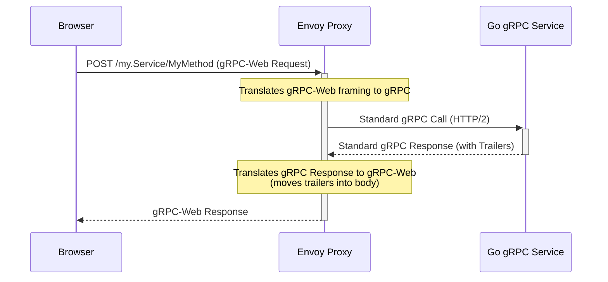
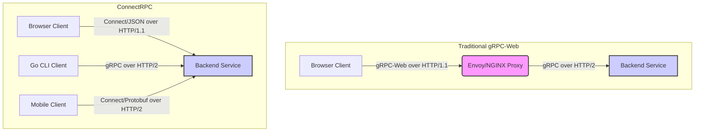

For nearly a decade, gRPC has been the undisputed heavyweight champion for high-performance, backend-to-backend communication. Its blend of HTTP/2 efficiency and Protobuf's rigid type safety promised a nirvana of low-latency, schema-driven microservices. Yet, for full-stack engineers building modern web applications, this promise came with a significant and often painful asterisk: the browser. The inherent architectural mismatch between gRPC's strict HTTP/2 transport requirements and the limitations of browser APIs gave rise to a complex ecosystem of proxies and protocol translations, most notably gRPC-Web and Envoy. We accepted this complexity as the cost of doing business. We deployed sidecars, configured listeners, and debugged opaque `application/grpc-web-text` payloads. But what if this complexity isn't a fundamental necessity, but rather a historical artifact? This is the central question that Buf's ConnectRPC forces us to confront. It presents an alternative vision—one where Protobuf-defined APIs are a first-class citizen of the web, consumable directly by any browser, using simple HTTP POST requests, without sacrificing type safety or server-side compatibility. This article is a deep architectural analysis comparing these two paradigms, not just in theory, but through the lens of production-grade Go and TypeScript code.

<AudioPlayer src="/static/audio/grpc-vs-connectrpc-production-guide.mp3" title="Executive Audio Briefing" />

## The gRPC Conundrum: Power vs. Web Complexity

To understand why ConnectRPC is gaining traction, we must first dissect the precise technical reasons why gRPC, for all its power, struggles in a browser environment. It's not a flaw in gRPC itself, but a fundamental impedance mismatch with the web platform.

### gRPC's Foundation: HTTP/2 and Protobuf

gRPC's performance derives from two core technologies:

1.  **Protobuf (Protocol Buffers):** A language-agnostic, binary serialization format developed by Google. It's incredibly efficient, both in terms of payload size and CPU cost for serialization/deserialization, compared to text-based formats like JSON. Its greatest strength is the Interface Definition Language (IDL), which allows you to define service contracts (`.proto` files) that generate statically-typed client and server code in dozens of languages.
2.  **HTTP/2:** gRPC is built *directly* on top of HTTP/2, not just using it as a transport. It leverages specific HTTP/2 features that are not present or easily accessible in HTTP/1.1:
    *   **Multiplexing:** Multiple RPC calls can run in parallel over a single TCP connection without head-of-line blocking.
    *   **Bidirectional Streaming:** Both the client and server can send a stream of messages within a single RPC call.
    *   **Trailers:** gRPC sends the final status of an RPC (e.g., `OK`, `UNAUTHENTICATED`) and other metadata in HTTP trailers, which are headers sent *after* the response body. This is a crucial part of the gRPC protocol.

This tight coupling to HTTP/2 is gRPC's superpower in controlled server-to-server environments. However, it becomes its Achilles' heel in the browser.

### The Browser Barrier: Why Native gRPC Fails

Modern browsers speak HTTP/2, so why can't they speak gRPC? The issue lies in the level of control exposed by browser networking APIs like `fetch` and `XMLHttpRequest`. These APIs are designed around the classic HTTP request/response semantic model, not the low-level transport frames of HTTP/2.

Specifically, browsers provide **no API to control HTTP/2 trailers**. You can read response headers, but you cannot access headers that arrive after the body. Since gRPC mandates the use of trailers to communicate RPC status, a browser client simply cannot complete a gRPC call according to the protocol specification. This single limitation makes "native gRPC" in the browser a non-starter.

### Enter the Proxy: gRPC-Web and Envoy

The community's solution was gRPC-Web. It's a modified protocol that works around the browser's limitations:

1.  It sends the RPC status and metadata, which would normally be in trailers, at the end of the response body, framed in a specific way.
2.  It can be layered on top of standard HTTP/1.1 or HTTP/2 requests.

This solves the browser problem, but introduces a server-side one: your gRPC server only speaks the standard gRPC protocol. It doesn't understand the gRPC-Web framing. This necessitates a translation layer—a proxy that sits between the browser and your gRPC service.

This is where tools like Envoy, NGINX, or dedicated middleware libraries come in. The proxy's job is to:
1.  Receive the gRPC-Web request from the browser.
2.  Translate the gRPC-Web framing into a standard gRPC request.
3.  Forward the request to the backend gRPC service.
4.  Receive the gRPC response, translate it back to gRPC-Web framing (moving trailers into the body), and send it to the browser.

This architecture is functional but complex, as illustrated below.



This additional hop introduces operational overhead, another point of failure, and increased latency. Debugging becomes harder as you now have to trace requests through the proxy layer.

## ConnectRPC: A Protocol-First Approach to Simplicity

ConnectRPC, developed by Buf, takes a different approach. Instead of creating a workaround protocol for the browser, it asks a more fundamental question: Can we design a Protobuf-based RPC protocol that is inherently compatible with the web's native architecture?

The answer is yes. Connect builds on the same Protobuf IDL but treats HTTP as a first-class peer, not just a transport layer to be subverted.

### The Core Philosophy: Protobuf-Defined, HTTP-Native

Connect defines a simple, elegant mapping of Protobuf services onto plain HTTP `POST` requests. A unary RPC call like `Say(HelloRequest)` simply becomes `POST /connect.example.v1.ExampleService/Say`.

Crucially, it supports three protocols on a single server port, with no special configuration:
1.  **The Connect Protocol:** A simple protocol using `POST` requests. It can use `application/json` (for easy debugging in browser dev tools) or `application/proto` (for performance). Metadata is sent via standard HTTP headers. Errors are mapped to HTTP status codes where possible, with details in the response body.
2.  **The gRPC Protocol:** A Connect server is fully compatible with standard gRPC clients over HTTP/2. It transparently handles gRPC requests without any translation.
3.  **The gRPC-Web Protocol:** A Connect server *also* understands gRPC-Web out of the box. You no longer need a separate proxy to handle gRPC-Web clients.

This means you can have a single Go service that simultaneously serves a legacy gRPC client, a web app using gRPC-Web, and a new web app using the native Connect protocol.

The architectural simplification is dramatic.



With Connect, the proxy is eliminated for web clients, collapsing the architecture into a direct client-server communication path.

## Implementation Deep Dive: Go Backend and Next.js Frontend

Let's ground this in production-grade code. We'll build a simple `EchoService` with a Go backend and a Next.js frontend, demonstrating the end-to-end type safety and simplicity of Connect.

### Defining the API with Protobuf

First, we define our service contract in `proto/echo/v1/echo.proto`.

```protobuf
syntax = "proto3";

package echo.v1;

import "google/protobuf/timestamp.proto";

// The service definition.
service EchoService {
  // Unary RPC
  rpc Echo(EchoRequest) returns (EchoResponse) {}

  // Server-streaming RPC
  rpc EchoStream(EchoStreamRequest) returns (stream EchoStreamResponse) {}
}

message EchoRequest {
  string message = 1;
}

message EchoResponse {
  string message = 1;
  google.protobuf.Timestamp timestamp = 2;
}

message EchoStreamRequest {
  string message = 1;
  int32 count = 2;
}

message EchoStreamResponse {
  string message = 1;
  google.protobuf.Timestamp timestamp = 2;
}
```

We use `buf` to manage our Protobuf dependencies and code generation. Our `buf.gen.yaml` specifies the plugins we need:

```yaml
# buf.gen.yaml
version: v1
plugins:
  # Go code generation
  - plugin: buf.build/protocolbuffers/go:v1.31.0
    out: gen/go
    opt: paths=source_relative
  # Connect-Go code generation
  - plugin: buf.build/connectrpc/go:v1.11.1
    out: gen/go
    opt: paths=source_relative
  # TypeScript/JS code generation
  - plugin: buf.build/connectrpc/es:v1.1.2
    out: web/src/gen
    opt:
      - target=ts
      - keep_empty_files=true
  - plugin: buf.build/bufbuild/es:v1.5.0
    out: web/src/gen
    opt:
      - target=ts
      - keep_empty_files=true
```

Running `buf generate` will create all our server and client stubs.

### Go Server Implementation

The Go server implementation is remarkably lean. We implement the generated `EchoServiceHandler` interface.

```go
// main.go
package main

import (
	"context"
	"fmt"
	"log"
	"net/http"
	"time"

	"connectrpc.com/connect"
	"golang.org/x/net/http2"
	"golang.org/x/net/http2/h2c"
	"google.golang.org/protobuf/types/known/timestamppb"

	echov1 "example.com/gen/go/echo/v1"
	"example.com/gen/go/echo/v1/echov1connect"
)

// EchoServer implements the EchoService API.
type EchoServer struct{}

func (s *EchoServer) Echo(
	ctx context.Context,
	req *connect.Request[echov1.EchoRequest],
) (*connect.Response[echov1.EchoResponse], error) {
	log.Println("Request headers: ", req.Header())
	res := connect.NewResponse(&echov1.EchoResponse{
		Message:   fmt.Sprintf("You said: %s", req.Msg.Message),
		Timestamp: timestamppb.Now(),
	})
	res.Header().Set("Echo-Version", "v1.0.0")
	return res, nil
}

func (s *EchoServer) EchoStream(
    ctx context.Context,
    req *connect.Request[echov1.EchoStreamRequest],
    stream *connect.ServerStream[echov1.EchoStreamResponse],
) error {
    for i := 0; i < int(req.Msg.Count); i++ {
        if err := ctx.Err(); err != nil {
            return err // Client closed the connection
        }
        time.Sleep(500 * time.Millisecond)
        if err := stream.Send(&echov1.EchoStreamResponse{
            Message:   fmt.Sprintf("Message %d: %s", i+1, req.Msg.Message),
            Timestamp: timestamppb.Now(),
        }); err != nil {
            return err
        }
    }
    return nil
}

func main() {
	echoer := &EchoServer{}
	mux := http.NewServeMux()
	// The generated constructor returns a path and a handler.
	path, handler := echov1connect.NewEchoServiceHandler(echoer)
	mux.Handle(path, handler)
	log.Println("... Listening on :8080")

	// h2c.NewHandler allows the server to speak both HTTP/1.1 and unencrypted HTTP/2.
	// In production, you'd likely use a TLS listener.
	http.ListenAndServe(
		":8080",
		h2c.NewHandler(mux, &http2.Server{}),
	)
}
```

Notice a few key details:
*   We use the standard `net/http` library. This means we can integrate any existing Go HTTP middleware for logging, authentication, metrics, etc.
*   The handler created by `echov1connect.NewEchoServiceHandler` is just an `http.Handler`.
*   The `h2c` wrapper enables HTTP/2, allowing the server to handle gRPC clients alongside Connect and gRPC-Web clients on the same port.

### TypeScript Client Implementation (Next.js)

On the frontend, we'll create a reusable, type-safe client and use it within a React Server Component in Next.js.

First, a client utility:

```typescript
// web/src/lib/connect-client.ts
import { createConnectTransport } from "@connectrpc/connect-web";
import { createPromiseClient } from "@connectrpc/connect";
import { EchoService } from "@/gen/echo/v1/echo_connect";

// The transport defines how the client communicates with the server.
const transport = createConnectTransport({
  baseUrl: process.env.NEXT_PUBLIC_API_URL ?? "http://localhost:8080",
});

// Here we create a typed client from the generated code.
export const echoClient = createPromiseClient(EchoService, transport);
```

Now, let's use this client in a Next.js page. This example uses a server component, meaning the RPC is made from the server-side rendering environment, but the exact same client code works in a client component (`'use client'`).

```typescript
// web/src/app/page.tsx
import { echoClient } from "@/lib/connect-client";
import { EchoRequest } from "@/gen/echo/v1/echo_pb";

export default async function Home() {
  const req = new EchoRequest({ message: "Hello from Next.js Server Component" });

  // The RPC call is fully typed.
  // 'res.message' is a string, 'res.timestamp' is a Timestamp object.
  // A typo like 'res.mesage' would be a compile-time error.
  const res = await echoClient.echo(req);

  return (
    <main>
      <h1>ConnectRPC + Next.js</h1>
      <div>
        <h2>Server Response:</h2>
        <pre><code>{JSON.stringify(res.toJson(), null, 2)}</code></pre>
      </div>
    </main>
  );
}
```

This is it. No custom fetch wrappers, no interceptors for translating trailers, no complex proxy setup. Just an import and an `await`. The type safety flows directly from our `.proto` file to our TypeScript code, preventing entire classes of bugs.

## Architectural and Performance Analysis

Simplicity is compelling, but performance is paramount in system design. How does Connect stack up against gRPC in terms of latency and throughput?

### Streaming: A Tale of Two HTTPs

The biggest difference lies in how streaming is implemented, especially over HTTP/1.1.

*   **gRPC/HTTP/2:** Uses native HTTP/2 streams. A single TCP connection can host multiple, fully bidirectional streams of messages. This is highly efficient.
*   **Connect/HTTP/2:** When a Connect client and server communicate over HTTP/2, the streaming implementation is **identical to gRPC**. It uses the exact same underlying mechanism. Performance is on par.
*   **Connect/HTTP/1.1:** This is where things get clever. Since HTTP/1.1 doesn't have native streaming, Connect emulates it:
    *   **Server Streaming:** Uses `chunked-transfer-encoding`. The server holds the request open and sends back data in chunks as it becomes available. This is a well-supported, standard HTTP mechanism.
    *   **Client Streaming & Bidirectional Streaming:** This is the main trade-off. True bidirectional streaming over a single HTTP/1.1 connection is impossible. Connect's web client implements these by using separate HTTP requests under the hood, or by falling back to a WebSocket transport if configured. While functional, this has higher overhead than native HTTP/2 streaming.

**The takeaway:** For browser clients (which often use HTTP/1.1 or can't fully control HTTP/2), Connect provides robust streaming capabilities that work everywhere. For backend services where you control the environment, you use HTTP/2 and get the same performance as gRPC.

### Latency and Throughput (p99 Analysis)

Let's break down the expected performance characteristics.

| Scenario | Protocol | Bottlenecks & Latency Profile |
| :--- | :--- | :--- |
| **Backend-to-Backend** | gRPC (Go to Go) | **Baseline.** Highly optimized. Latency is dominated by network RTT and Protobuf processing. p99 latencies are typically very low and stable. |
| **Backend-to-Backend** | ConnectRPC (Go to Go, HTTP/2) | **Nearly identical to gRPC.** The protocol overhead difference is negligible. Both leverage HTTP/2 and binary Protobuf. Performance should be within a very small margin of error of native gRPC. |
| **Browser-to-Backend** | gRPC-Web + Envoy | **Higher latency.** Introduces an extra network hop to the proxy. The proxy itself consumes CPU and memory for translation. This will add a fixed amount of latency to every request and can become a bottleneck under high load, impacting p99 latencies. |
| **Browser-to-Backend** | ConnectRPC (Connect/Protobuf) | **Lower latency than gRPC-Web.** Direct client-to-server connection removes the proxy hop. Performance is close to the theoretical minimum for a browser-based RPC, limited by RTT and binary Protobuf processing. |
| **Browser-to-Backend** | ConnectRPC (Connect/JSON) | **Highest latency (but most debuggable).** Direct connection is good, but JSON serialization/deserialization is significantly slower and produces larger payloads than Protobuf. This is great for development but should be used cautiously in performance-critical paths. |

For most full-stack applications, the removal of the proxy hop in the `Browser -> Backend` path is a significant architectural and performance win. The p99 latency will be lower and more predictable with ConnectRPC because an entire class of failure modes and resource contention (the proxy layer) has been eliminated.

<FAQ title="Frequently Asked Questions">
  <Question>If ConnectRPC is so much simpler for the web, are there any scenarios where I should still use gRPC-Web with a proxy?</Question>
  <Answer>Yes, absolutely. If your organization has a mature, established infrastructure built around a service mesh like Istio or a standardized API Gateway using Envoy/NGINX, sticking with gRPC-Web can be a valid choice. In these environments, the proxy isn't just a protocol translator; it's a critical component for enforcing cross-cutting concerns like mTLS authentication, advanced traffic shaping, global rate limiting, and centralized observability. Introducing a direct-to-service communication path with Connect might bypass these established control planes. The decision hinges on whether you want to delegate these concerns to the proxy (gRPC-Web) or handle them within your application code or a simpler gateway (Connect).</Answer>
  <Question>How does ConnectRPC handle errors compared to gRPC?</Question>
  <Answer>ConnectRPC's error handling is one of its most developer-friendly features. While gRPC exclusively uses the `grpc-status` trailer and a binary `grpc-message` to convey errors, Connect maps its canonical error codes to HTTP semantics. For example, a `NotFound` error from your service becomes a `404 Not Found` HTTP status. An `Unauthenticated` error becomes a `401 Unauthorized`. This makes debugging in a browser's network tab instantly intuitive. For gRPC error codes that don't have a clear HTTP equivalent (like `DataLoss`), Connect uses a specific HTTP status (e.g., `400 Bad Request` for `InvalidArgument`) and includes a structured JSON error body with the code, message, and optional details. This provides the best of both worlds: semantic HTTP for browsers and detailed, machine-readable error information for clients.</Answer>
  <Question>Can I mix and match gRPC and Connect clients/servers?</Question>
  <Answer>Yes, and this is a cornerstone of Connect's design. A server built with `connect-go` is a fully compliant gRPC and gRPC-Web server. This means you can point your existing Go, Java, or Python gRPC clients at a `connect-go` server, and they will work perfectly over HTTP/2. You can also point your existing gRPC-Web clients at it, and they will also work, without an Envoy proxy. This makes migration seamless. You can gradually introduce Connect-native clients into your ecosystem while continuing to support your entire existing fleet of gRPC and gRPC-Web clients, all from a single server process on a single port.</Answer>
  <Question>What's the catch? Are there any downsides to ConnectRPC?</Question>
  <Answer>The primary "catch" is the ecosystem maturity and feature set compared to the massive gRPC ecosystem. While Connect is robust and production-ready, gRPC has a longer history and thus a wider array of third-party tooling, interceptors, and language support (though Connect's is growing rapidly). The other consideration, as mentioned, is client/bidirectional streaming over HTTP/1.1, which has higher overhead than native HTTP/2 streaming. Finally, if your architecture relies heavily on advanced HTTP/2 features that gRPC exposes but Connect abstracts away for the sake of simplicity, you might find gRPC a better fit. However, for the vast majority of web and mobile applications, these are minor trade-offs for the massive gain in simplicity and developer experience.</Answer>
</FAQ>

## Conclusion: Actionable Takeaways

The choice between gRPC and ConnectRPC is a classic engineering trade-off between an established, powerful, but complex standard and a modern, simpler, but newer alternative.

Here are the actionable takeaways for senior engineers and architects:

1.  **For Green-field Full-Stack Applications:** Start with ConnectRPC. The elimination of the proxy requirement for browser clients is a massive simplification of your architecture, deployment, and developer workflow. The end-to-end type safety from Go to TypeScript is a game-changer for productivity and reliability.

2.  **For Backend-to-Backend Services:** The choice is less clear-cut. Both gRPC and Connect (over HTTP/2) offer nearly identical performance. If your organization already has extensive tooling and expertise in gRPC, there may be little reason to switch. If you value the ability to easily "curl" or debug your services with JSON, or want a single service to be easily callable by both other backends and a browser, Connect offers superior flexibility.

3.  **For Existing gRPC Systems:** Connect provides a compelling, low-risk migration path. You can build new services with Connect or wrap existing gRPC services, and they will immediately support gRPC, gRPC-Web, and Connect clients. This allows for incremental adoption without a "big bang" rewrite.

4.  **Understand the Streaming Model:** Be mindful of the streaming model. For browser-based clients that may be restricted to HTTP/1.1, server-side streaming in Connect is excellent, but bidirectional and client-side streaming carry more overhead than their HTTP/2 counterparts.

gRPC established the paradigm of schema-driven RPCs. ConnectRPC refines it for the modern web, proving that you don't have to trade power for simplicity. By embracing standard HTTP semantics, Connect has created a tool that feels less like a workaround and more like a native part of the full-stack developer's toolkit.

### Further Reading

*   [ConnectRPC Official Documentation](https://connectrpc.com/docs/)
*   [gRPC Official Documentation](https://grpc.io/docs/)
*   [Buf - The Home of ConnectRPC](https://buf.build/)
*   [gRPC-Web Protocol Specification](https://github.com/grpc/grpc/blob/master/doc/PROTOCOL-WEB.md)
*   [Understanding Envoy Proxy](https://www.envoyproxy.io/docs/envoy/latest/)
