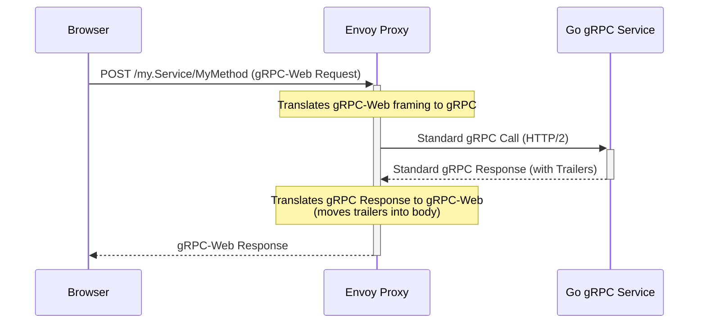
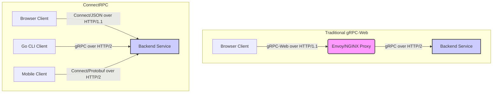

ほぼ10年間、gRPCは高性能なバックエンド間通信において、誰もが認めるヘビー級チャンピオンでした。HTTP/2の効率性とProtobufの厳格な型安全性の組み合わせは、低レイテンシーでスキーマ駆動型のマイクロサービスの理想郷を約束しました。しかし、最新のウェブアプリケーションを構築するフルスタックエンジニアにとって、この約束には大きな、そしてしばしば厄介なアスタリスクが付きまといました。それがブラウザです。gRPCの厳格なHTTP/2トランスポート要件とブラウザAPIの制限との間に内在するアーキテクチャ上の不一致は、プロキシとプロトコル変換の複雑なエコシステム、特にgRPC-WebとEnvoyを生み出しました。私たちはこの複雑さをビジネスコストとして受け入れてきました。サイドカーをデプロイし、リスナーを設定し、不透明な`application/grpc-web-text`ペイロードをデバッグしました。しかし、この複雑さが根本的な必然性ではなく、歴史的な遺物だとしたらどうでしょうか？これが、BufのConnectRPCが私たちに突きつける中心的な問いです。それは、Protobufで定義されたAPIがウェブの第一級市民であり、型安全性やサーバーサイドの互換性を犠牲にすることなく、シンプルなHTTP POSTリクエストを使用して、あらゆるブラウザから直接利用できるという、別のビジョンを提示します。この記事は、これら2つのパラダイムを、理論だけでなく、本番環境レベルのGoおよびTypeScriptコードの視点から比較する、詳細なアーキテクチャ分析です。

<AudioPlayer src="/static/audio/grpc-vs-connectrpc-production-guide-ja.mp3" title="音声エグゼクティブ・ブリーフィング" voice="Google Cloud ja-JP-Neural2-B" />

## gRPCの難問：パワー vs. ウェブの複雑さ

ConnectRPCがなぜ注目を集めているのかを理解するには、まず、gRPCがそのすべてのパワーにもかかわらず、ブラウザ環境で苦戦する正確な技術的理由を分析する必要があります。それはgRPC自体の欠陥ではなく、ウェブプラットフォームとの根本的なインピーダンスミスマッチです。

### gRPCの基盤：HTTP/2とProtobuf

gRPCのパフォーマンスは、2つのコアテクノロジーに由来します。

1.  **Protobuf (Protocol Buffers):** Googleが開発した言語に依存しないバイナリシリアル化フォーマットです。JSONのようなテキストベースのフォーマットと比較して、ペイロードサイズとシリアル化/デシリアル化のCPUコストの両方で信じられないほど効率的です。その最大の強みは、サービスコントラクト（`.proto`ファイル）を定義し、数十の言語で静的型付けされたクライアントおよびサーバーコードを生成できるインターフェース定義言語（IDL）です。
2.  **HTTP/2:** gRPCは、単にトランスポートとして使用するだけでなく、HTTP/2の上に*直接*構築されています。HTTP/1.1には存在しない、または容易にアクセスできない特定のHTTP/2機能を活用しています。
    *   **多重化（Multiplexing）:** 複数のRPC呼び出しを、ヘッドオブラインブロッキングなしに単一のTCP接続上で並行して実行できます。
    *   **双方向ストリーミング（Bidirectional Streaming）:** クライアントとサーバーの両方が、単一のRPC呼び出し内でメッセージのストリームを送信できます。
    *   **トレーラー（Trailers）:** gRPCは、RPCの最終ステータス（例：`OK`、`UNAUTHENTICATED`）やその他のメタデータをHTTPトレーラーで送信します。これは、レスポンスボディの*後に*送信されるヘッダーです。これはgRPCプロトコルの重要な部分です。

このHTTP/2との密接な結合は、制御されたサーバー間環境におけるgRPCの超能力です。しかし、ブラウザではそれがアキレス腱となります。

### ブラウザの障壁：なぜネイティブgRPCは失敗するのか

現代のブラウザはHTTP/2を話しますが、なぜgRPCを話せないのでしょうか？問題は、`fetch`や`XMLHttpRequest`のようなブラウザのネットワークAPIが公開する制御レベルにあります。これらのAPIは、HTTP/2の低レベルのトランスポートフレームではなく、従来のHTTPリクエスト/レスポンスのセマンティックモデルを中心に設計されています。

具体的には、ブラウザは**HTTP/2トレーラーを制御するAPIを提供しません**。レスポンスヘッダーは読み取れますが、ボディの後に到着するヘッダーにはアクセスできません。gRPCはRPCステータスを通信するためにトレーラーの使用を義務付けているため、ブラウザクライアントはプロトコル仕様に従ってgRPC呼び出しを完了することができません。この単一の制限が、ブラウザにおける「ネイティブgRPC」を不可能にしています。

### プロキシの登場：gRPC-WebとEnvoy

コミュニティの解決策はgRPC-Webでした。これは、ブラウザの制限を回避するために修正されたプロトコルです。

1.  通常トレーラーに含まれるRPCステータスとメタデータを、特定の形式でフレーム化してレスポンスボディの最後に送信します。
2.  標準のHTTP/1.1またはHTTP/2リクエストの上にレイヤー化できます。

これはブラウザの問題を解決しますが、サーバー側の問題を引き起こします。gRPCサーバーは標準のgRPCプロトコルしか話さないため、gRPC-Webのフレーミングを理解できません。このため、ブラウザとgRPCサービスの間に入る変換レイヤー、つまりプロキシが必要になります。

ここで、Envoy、NGINX、または専用のミドルウェアライブラリのようなツールが登場します。プロキシの役割は次のとおりです。
1.  ブラウザからgRPC-Webリクエストを受信する。
2.  gRPC-Webフレーミングを標準のgRPCリクエストに変換する。
3.  リクエストをバックエンドのgRPCサービスに転送する。
4.  gRPCレスポンスを受信し、それをgRPC-Webフレーミングに変換（トレーラーをボディに移動）してブラウザに送信する。

このアーキテクチャは機能しますが、以下に示すように複雑です。



この追加のホップは、運用上のオーバーヘッド、別の障害点、およびレイテンシーの増加を引き起こします。プロキシレイヤーを介してリクエストをトレースする必要があるため、デバッグがより困難になります。

## ConnectRPC：シンプルさへのプロトコルファーストのアプローチ

Bufが開発したConnectRPCは、異なるアプローチを取ります。ブラウザのための回避策プロトコルを作成するのではなく、より根本的な問いを投げかけます。ウェブのネイティブアーキテクチャと本質的に互換性のあるProtobufベースのRPCプロトコルを設計できるか？

答えはイエスです。Connectは同じProtobuf IDLに基づいていますが、HTTPを単なるトランスポートレイヤーとしてではなく、第一級のピアとして扱います。

### コア哲学：Protobuf定義、HTTPネイティブ

Connectは、ProtobufサービスをプレーンなHTTP `POST`リクエストにシンプルかつエレガントにマッピングします。`Say(HelloRequest)`のような単項RPC呼び出しは、単に`POST /connect.example.v1.ExampleService/Say`になります。

重要なのは、特別な設定なしに、単一のサーバーポートで3つのプロトコルをサポートすることです。
1.  **Connectプロトコル:** `POST`リクエストを使用するシンプルなプロトコルです。`application/json`（ブラウザの開発者ツールでのデバッグが容易）または`application/proto`（パフォーマンスのため）を使用できます。メタデータは標準のHTTPヘッダーを介して送信されます。エラーは可能な限りHTTPステータスコードにマッピングされ、詳細はレスポンスボディに含まれます。
2.  **gRPCプロトコル:** Connectサーバーは、HTTP/2を介した標準のgRPCクライアントと完全に互換性があります。翻訳なしでgRPCリクエストを透過的に処理します。
3.  **gRPC-Webプロトコル:** Connectサーバーは、gRPC-Webもそのまま理解します。gRPC-Webクライアントを処理するために、もはや別のプロキシは必要ありません。

これは、レガシーなgRPCクライアント、gRPC-Webを使用するウェブアプリ、そしてネイティブのConnectプロトコルを使用する新しいウェブアプリを同時に提供する単一のGoサービスを持つことができることを意味します。

アーキテクチャの簡素化は劇的です。



Connectを使用すると、ウェブクライアントのプロキシが排除され、アーキテクチャが直接的なクライアント-サーバー通信パスに集約されます。

## 実装の詳細：GoバックエンドとNext.jsフロントエンド

これを本番環境レベルのコードで具体化しましょう。GoバックエンドとNext.jsフロントエンドでシンプルな`EchoService`を構築し、Connectのエンドツーエンドの型安全性とシンプルさを示します。

### ProtobufによるAPIの定義

まず、`proto/echo/v1/echo.proto`でサービスコントラクトを定義します。

```protobuf
syntax = "proto3";

package echo.v1;

import "google/protobuf/timestamp.proto";

// The service definition.
service EchoService {
  // Unary RPC
  rpc Echo(EchoRequest) returns (EchoResponse) {}

  // Server-streaming RPC
  rpc EchoStream(EchoStreamRequest) returns (stream EchoStreamResponse) {}
}

message EchoRequest {
  string message = 1;
}

message EchoResponse {
  string message = 1;
  google.protobuf.Timestamp timestamp = 2;
}

message EchoStreamRequest {
  string message = 1;
  int32 count = 2;
}

message EchoStreamResponse {
  string message = 1;
  google.protobuf.Timestamp timestamp = 2;
}
```

Protobufの依存関係とコード生成を管理するために`buf`を使用します。`buf.gen.yaml`は必要なプラグインを指定します。

```yaml
# buf.gen.yaml
version: v1
plugins:
  # Go code generation
  - plugin: buf.build/protocolbuffers/go:v1.31.0
    out: gen/go
    opt: paths=source_relative
  # Connect-Go code generation
  - plugin: buf.build/connectrpc/go:v1.11.1
    out: gen/go
    opt: paths=source_relative
  # TypeScript/JS code generation
  - plugin: buf.build/connectrpc/es:v1.1.2
    out: web/src/gen
    opt:
      - target=ts
      - keep_empty_files=true
  - plugin: buf.build/bufbuild/es:v1.5.0
    out: web/src/gen
    opt:
      - target=ts
      - keep_empty_files=true
```

`buf generate`を実行すると、すべてのサーバーおよびクライアントスタブが作成されます。

### Goサーバーの実装

Goサーバーの実装は驚くほど簡潔です。生成された`EchoServiceHandler`インターフェースを実装します。

```go
// main.go
package main

import (
	"context"
	"fmt"
	"log"
	"net/http"
	"time"

	"connectrpc.com/connect"
	"golang.org/x/net/http2"
	"golang.org/x/net/http2/h2c"
	"google.golang.org/protobuf/types/known/timestamppb"

	echov1 "example.com/gen/go/echo/v1"
	"example.com/gen/go/echo/v1/echov1connect"
)

// EchoServer implements the EchoService API.
type EchoServer struct{}

func (s *EchoServer) Echo(
	ctx context.Context,
	req *connect.Request[echov1.EchoRequest],
) (*connect.Response[echov1.EchoResponse], error) {
	log.Println("Request headers: ", req.Header())
	res := connect.NewResponse(&echov1.EchoResponse{
		Message:   fmt.Sprintf("You said: %s", req.Msg.Message),
		Timestamp: timestamppb.Now(),
	})
	res.Header().Set("Echo-Version", "v1.0.0")
	return res, nil
}

func (s *EchoServer) EchoStream(
    ctx context.Context,
    req *connect.Request[echov1.EchoStreamRequest],
    stream *connect.ServerStream[echov1.EchoStreamResponse],
) error {
    for i := 0; i < int(req.Msg.Count); i++ {
        if err := ctx.Err(); err != nil {
            return err // Client closed the connection
        }
        time.Sleep(500 * time.Millisecond)
        if err := stream.Send(&echov1.EchoStreamResponse{
            Message:   fmt.Sprintf("Message %d: %s", i+1, req.Msg.Message),
            Timestamp: timestamppb.Now(),
        }); err != nil {
            return err
        }
    }
    return nil
}

func main() {
	echoer := &EchoServer{}
	mux := http.NewServeMux()
	// The generated constructor returns a path and a handler.
	path, handler := echov1connect.NewEchoServiceHandler(echoer)
	mux.Handle(path, handler)
	log.Println("... Listening on :8080")

	// h2c.NewHandler allows the server to speak both HTTP/1.1 and unencrypted HTTP/2.
	// In production, you'd likely use a TLS listener.
	http.ListenAndServe(
		":8080",
		h2c.NewHandler(mux, &http2.Server{}),
	)
}
```

いくつかの重要な詳細に注目してください。
*   標準の`net/http`ライブラリを使用しています。これは、ロギング、認証、メトリクスなどの既存のGo HTTPミドルウェアを統合できることを意味します。
*   `echov1connect.NewEchoServiceHandler`によって作成されたハンドラーは、単なる`http.Handler`です。
*   `h2c`ラッパーはHTTP/2を有効にし、サーバーがConnectおよびgRPC-Webクライアントと並行してgRPCクライアントを同じポートで処理できるようにします。

### TypeScriptクライアントの実装（Next.js）

フロントエンドでは、再利用可能で型安全なクライアントを作成し、Next.jsのReactサーバーコンポーネント内で使用します。

まず、クライアントユーティリティです。

```typescript
// web/src/lib/connect-client.ts
import { createConnectTransport } from "@connectrpc/connect-web";
import { createPromiseClient } from "@connectrpc/connect";
import { EchoService } from "@/gen/echo/v1/echo_connect";

// The transport defines how the client communicates with the server.
const transport = createConnectTransport({
  baseUrl: process.env.NEXT_PUBLIC_API_URL ?? "http://localhost:8080",
});

// Here we create a typed client from the generated code.
export const echoClient = createPromiseClient(EchoService, transport);
```

次に、このクライアントをNext.jsページで使用しましょう。この例ではサーバーコンポーネントを使用しており、RPCはサーバーサイドレンダリング環境から行われますが、まったく同じクライアントコードがクライアントコンポーネント（`'use client'`）でも機能します。

```typescript
// web/src/app/page.tsx
import { echoClient } from "@/lib/connect-client";
import { EchoRequest } from "@/gen/echo/v1/echo_pb";

export default async function Home() {
  const req = new EchoRequest({ message: "Hello from Next.js Server Component" });

  // The RPC call is fully typed.
  // 'res.message' is a string, 'res.timestamp' is a Timestamp object.
  // A typo like 'res.mesage' would be a compile-time error.
  const res = await echoClient.echo(req);

  return (
    <main>
      <h1>ConnectRPC + Next.js</h1>
      <div>
        <h2>Server Response:</h2>
        <pre><code>{JSON.stringify(res.toJson(), null, 2)}</code></pre>
      </div>
    </main>
  );
}
```

これで終わりです。カスタムのフェッチラッパーも、トレーラーを変換するためのインターセプターも、複雑なプロキシ設定もありません。インポートと`await`だけです。型安全性は、`.proto`ファイルからTypeScriptコードに直接流れ込み、あらゆる種類のバグを防ぎます。

## アーキテクチャとパフォーマンス分析

シンプルさは魅力的ですが、システム設計においてパフォーマンスは最も重要です。Connectはレイテンシーとスループットの点でgRPCとどのように比較されるでしょうか？

### ストリーミング：2つのHTTPの物語

最大の違いは、特にHTTP/1.1でのストリーミングの実装方法にあります。

*   **gRPC/HTTP/2:** ネイティブのHTTP/2ストリームを使用します。単一のTCP接続で、複数の完全に双方向のメッセージストリームをホストできます。これは非常に効率的です。
*   **Connect/HTTP/2:** ConnectクライアントとサーバーがHTTP/2を介して通信する場合、ストリーミングの実装は**gRPCと同一**です。まったく同じ基盤メカニズムを使用します。パフォーマンスは同等です。
*   **Connect/HTTP/1.1:** ここが巧妙な点です。HTTP/1.1にはネイティブストリーミングがないため、Connectはそれをエミュレートします。
    *   **サーバーサイドストリーミング:** `chunked-transfer-encoding`を使用します。サーバーはリクエストを開いたままにし、データが利用可能になり次第チャンクで返します。これは十分にサポートされている標準的なHTTPメカニズムです。
    *   **クライアントサイドストリーミングと双方向ストリーミング:** これが主なトレードオフです。単一のHTTP/1.1接続での真の双方向ストリーミングは不可能です。Connectのウェブクライアントは、内部で個別のHTTPリクエストを使用するか、設定されている場合はWebSocketトランスポートにフォールバックすることでこれらを実装します。機能的には問題ありませんが、ネイティブHTTP/2ストリーミングよりもオーバーヘッドが高くなります。

**結論:** ブラウザクライアント（多くの場合HTTP/1.1を使用するか、HTTP/2を完全に制御できない）の場合、Connectはどこでも機能する堅牢なストリーミング機能を提供します。環境を制御できるバックエンドサービスの場合、HTTP/2を使用すればgRPCと同じパフォーマンスが得られます。

### レイテンシーとスループット（p99分析）

予想されるパフォーマンス特性を分解してみましょう。

| シナリオ | プロトコル | ボトルネックとレイテンシープロファイル |
| :--- | :--- | :--- |
| **バックエンド間** | gRPC (Go to Go) | **ベースライン。** 高度に最適化されています。レイテンシーは主にネットワークRTTとProtobuf処理によって決まります。p99レイテンシーは通常非常に低く安定しています。 |
| **バックエンド間** | ConnectRPC (Go to Go, HTTP/2) | **gRPCとほぼ同じ。** プロトコルオーバーヘッドの差はごくわずかです。どちらもHTTP/2とバイナリProtobufを活用します。パフォーマンスはネイティブgRPCと非常にわずかな誤差範囲内であるはずです。 |
| **ブラウザからバックエンド** | gRPC-Web + Envoy | **レイテンシーが高い。** プロキシへの追加のネットワークホップが発生します。プロキシ自体が変換のためにCPUとメモリを消費します。これにより、すべてのリクエストに一定量のレイテンシーが追加され、高負荷時にはボトルネックとなり、p99レイテンシーに影響を与える可能性があります。 |
| **ブラウザからバックエンド** | ConnectRPC (Connect/Protobuf) | **gRPC-Webよりもレイテンシーが低い。** 直接的なクライアント-サーバー接続により、プロキシホップが不要になります。パフォーマンスは、ブラウザベースのRPCの理論上の最小値に近く、RTTとバイナリProtobuf処理によって制限されます。 |
| **ブラウザからバックエンド** | ConnectRPC (Connect/JSON) | **レイテンシーが最も高い（ただしデバッグが最も容易）。** 直接接続は良いですが、JSONのシリアル化/デシリアル化はProtobufよりも大幅に遅く、より大きなペイロードを生成します。これは開発には最適ですが、パフォーマンスが重要なパスでは慎重に使用する必要があります。 |

ほとんどのフルスタックアプリケーションにとって、`Browser -> Backend`パスにおけるプロキシホップの削除は、アーキテクチャとパフォーマンスの両面で大きな勝利です。ConnectRPCを使用すると、障害モードとリソース競合（プロキシレイヤー）のクラス全体が排除されるため、p99レイテンシーはより低く、より予測可能になります。

<FAQ title="よくある質問">
  <Question>ConnectRPCがウェブにとってこれほどシンプルなら、gRPC-Webをプロキシと一緒に使い続けるべきシナリオはありますか？</Question>
  <Answer>はい、もちろんです。組織がIstioのようなサービスメッシュやEnvoy/NGINXを使用する標準化されたAPIゲートウェイを中心に成熟した確立されたインフラストラクチャを構築している場合、gRPC-Webを使い続けることは有効な選択肢となり得ます。これらの環境では、プロキシは単なるプロトコル変換器ではなく、mTLS認証、高度なトラフィックシェーピング、グローバルなレート制限、集中型オブザーバビリティなどの横断的な懸念事項を強制するための重要なコンポーネントです。Connectでサービスへの直接通信パスを導入すると、これらの確立された制御プレーンをバイパスする可能性があります。この決定は、これらの懸念事項をプロキシに委任するか（gRPC-Web）、アプリケーションコード内またはよりシンプルなゲートウェイで処理するか（Connect）にかかっています。</Answer>
  <Question>ConnectRPCはgRPCと比較してエラーをどのように処理しますか？</Question>
  <Answer>ConnectRPCのエラー処理は、開発者にとって最も使いやすい機能の1つです。gRPCがエラーを伝えるために排他的に`grpc-status`トレーラーとバイナリ`grpc-message`を使用するのに対し、Connectは正規のエラーコードをHTTPセマンティクスにマッピングします。たとえば、サービスからの`NotFound`エラーは`404 Not Found` HTTPステータスになります。`Unauthenticated`エラーは`401 Unauthorized`になります。これにより、ブラウザのネットワークタブでのデバッグが即座に直感的になります。明確なHTTP同等物がないgRPCエラーコード（`DataLoss`など）の場合、Connectは特定のHTTPステータス（例：`400 Bad Request`は`InvalidArgument`）を使用し、コード、メッセージ、およびオプションの詳細を含む構造化されたJSONエラーボディを含めます。これにより、ブラウザ向けのセマンティックHTTPと、クライアント向けの詳細で機械可読なエラー情報の両方の利点が得られます。</Answer>
  <Question>gRPCとConnectのクライアント/サーバーを混在させることはできますか？</Question>
  <Answer>はい、これはConnectの設計の基礎です。`connect-go`で構築されたサーバーは、完全に準拠したgRPCおよびgRPC-Webサーバーです。これは、既存のGo、Java、またはPythonのgRPCクライアントを`connect-go`サーバーに向けることができ、HTTP/2を介して完全に機能することを意味します。既存のgRPC-Webクライアントを向けることもでき、Envoyプロキシなしで機能します。これにより、移行がシームレスになります。単一のサーバープロセスで単一のポートから、既存のgRPCおよびgRPC-Webクライアントのフリート全体をサポートし続けながら、Connectネイティブクライアントをエコシステムに段階的に導入できます。</Answer>
  <Question>何か落とし穴はありますか？ConnectRPCに欠点はありますか？</Question>
  <Answer>主な「落とし穴」は、巨大なgRPCエコシステムと比較して、エコシステムの成熟度と機能セットです。Connectは堅牢で本番環境に対応していますが、gRPCはより長い歴史を持ち、より広範なサードパーティツール、インターセプター、言語サポート（Connectも急速に成長していますが）を持っています。もう1つの考慮事項は、前述したように、HTTP/1.1を介したクライアント/双方向ストリーミングであり、ネイティブHTTP/2ストリーミングよりもオーバーヘッドが高くなります。最後に、アーキテクチャがgRPCが公開する高度なHTTP/2機能に大きく依存しているが、Connectがシンプルさのために抽象化している場合、gRPCの方が適していると感じるかもしれません。しかし、ほとんどのウェブおよびモバイルアプリケーションにとって、これらはシンプルさと開発者エクスペリエンスの大幅な向上に対するわずかなトレードオフです。</Answer>
</FAQ>


## 知識を確認する（インタラクティブクイズ）

<Quiz questions={
  [
    {
      "question": "フルスタックチームは、リアルタイム更新と低レイテンシ通信を必要とする新しいブラウザベースアプリケーションのためにgRPCを評価しています。彼らは、既存のWebフロントエンドとgRPCを統合する際の運用オーバーヘッドについて懸念しています。記事に基づくと、gRPCがブラウザネイティブアプリケーションにもたらす主要なアーキテクチャ上の課題は何ですか？",
      "options": [
        "gRPCのバイナリシリアライゼーション（Protobuf）はJavaScriptのネイティブデータ構造と互換性がなく、広範な手動パースが必要です。",
        "ブラウザには、双方向ストリーミングやトレーラーのようなgRPCの基盤となるHTTP/2機能を直接活用するためのネイティブAPIがなく、プロキシが必要です。",
        "Protobuf IDLによって提供されるgRPCの強力な型安全性は、ブラウザ側のTypeScriptやJavaScriptではサポートされておらず、ランタイムエラーにつながります。",
        "gRPCのProtobufシリアライゼーション/デシリアライゼーションの高いCPUコストが、クライアントサイドデバイスでのブラウザパフォーマンスを著しく低下させます。"
      ],
      "correctAnswer": 1,
      "explanation": "記事には「問題は、`fetch`や`XMLHttpRequest`のようなブラウザのネットワークAPIによって公開される制御レベルにある。これらのAPIは、HTTP/2の低レベルトランスポートフレームではなく、従来のHTTPリクエスト/レスポンスのセマンティックモデルを中心に設計されている」と明示的に述べられています。さらに、ブラウザが双方向ストリーミングやトレーラーのようなHTTP/2機能を直接「制御」するためのAPIを提供していないため、gRPC-WebやEnvoyプロキシのようなソリューションが必要であると強調しています。Protobufは効率的で生成されたコードと互換性があり、型安全性は正しく統合されれば利点であり、欠点ではありません。"
    },
    {
      "question": "本番環境では、マイクロサービスアーキテクチャはその効率性からバックエンド間の通信にgRPCを多用しています。チームは現在、これらのgRPCサービスの一部をブラウザクライアントに直接公開するオプションを検討しています。記事が示唆するように、ブラウザ通信を可能にするためにgRPC-WebとEnvoyプロキシを使用することによって導入される最も重要な運用上のトレードオフは何ですか？",
      "options": [
        "Envoyプロキシによって実行される追加のシリアライゼーション/デシリアライゼーションステップによるネットワークレイテンシの増加。",
        "プロトコル変換のために追加のインフラコンポーネント（Envoy）を維持および設定する必要があり、複雑さが増すこと。",
        "プロキシによってリクエストがgRPC-WebからネイティブgRPCに変換される際に、gRPCの強力な型安全性が失われること。",
        "ブラウザが開始するリクエストに対してHTTP/2の多重化機能を利用できず、ヘッドオブラインブロッキングが発生すること。"
      ],
      "correctAnswer": 1,
      "explanation": "記事には「私たちはこの複雑さをビジネスコストとして受け入れた。サイドカーをデプロイし、リスナーを設定し、不透明な`application/grpc-web-text`ペイロードをデバッグした」と述べられています。これは、プロトコル変換のためにEnvoyのような追加のインフラコンポーネントを管理することの運用オーバーヘッドと複雑さを直接指しています。わずかなレイテンシの影響や特定のプロトコルのニュアンスがあるかもしれませんが、主要かつ最も強調されているトレードオフは、プロキシのデプロイと管理に伴うアーキテクチャ上および運用上の複雑さの増加です。"
    }
  ]
} />


## 結論：実用的なヒント

gRPCとConnectRPCの選択は、確立された強力だが複雑な標準と、現代的でシンプルだが新しい代替案との間の古典的なエンジニアリングのトレードオフです。

シニアエンジニアとアーキテクト向けの具体的なヒントを以下に示します。

1.  **グリーンフィールドのフルスタックアプリケーションの場合:** ConnectRPCから始めましょう。ブラウザクライアントのプロキシ要件がなくなることは、アーキテクチャ、デプロイ、開発者ワークフローの劇的な簡素化につながります。GoからTypeScriptへのエンドツーエンドの型安全性は、生産性と信頼性にとって画期的なものです。

2.  **バックエンド間サービスの場合:** 選択はそれほど明確ではありません。gRPCとConnect（HTTP/2経由）はどちらもほぼ同じパフォーマンスを提供します。組織がすでにgRPCに関する広範なツールと専門知識を持っている場合、切り替える理由はほとんどないかもしれません。サービスをJSONで簡単に「curl」したりデバッグしたりする機能、または他のバックエンドとブラウザの両方から簡単に呼び出せる単一のサービスを望む場合は、Connectが優れた柔軟性を提供します。

3.  **既存のgRPCシステムの場合:** Connectは、魅力的で低リスクな移行パスを提供します。Connectで新しいサービスを構築したり、既存のgRPCサービスをラップしたりすると、すぐにgRPC、gRPC-Web、およびConnectクライアントをサポートします。これにより、「ビッグバン」な書き換えなしに段階的な採用が可能になります。

4.  **ストリーミングモデルを理解する:** ストリーミングモデルに注意してください。HTTP/1.1に制限される可能性のあるブラウザベースのクライアントの場合、Connectのサーバーサイドストリーミングは優れていますが、双方向およびクライアントサイドストリーミングはHTTP/2の対応するものよりもオーバーヘッドが大きくなります。

gRPCはスキーマ駆動型RPCのパラダイムを確立しました。ConnectRPCはそれを現代のウェブ向けに洗練させ、パワーとシンプルさをトレードオフする必要がないことを証明しています。標準のHTTPセマンティクスを採用することで、Connectは回避策というよりも、フルスタック開発者のツールキットのネイティブな一部のように感じられるツールを作成しました。

### 参考文献

*   [ConnectRPC公式ドキュメント](https://connectrpc.com/docs/)
*   [gRPC公式ドキュメント](https://grpc.io/docs/)
*   [Buf - ConnectRPCの本拠地](https://buf.build/)
*   [gRPC-Webプロトコル仕様](https://github.com/grpc/grpc/blob/master/doc/PROTOCOL-WEB.md)
*   [Envoyプロキシの理解](https://www.envoyproxy.io/docs/envoy/latest/)