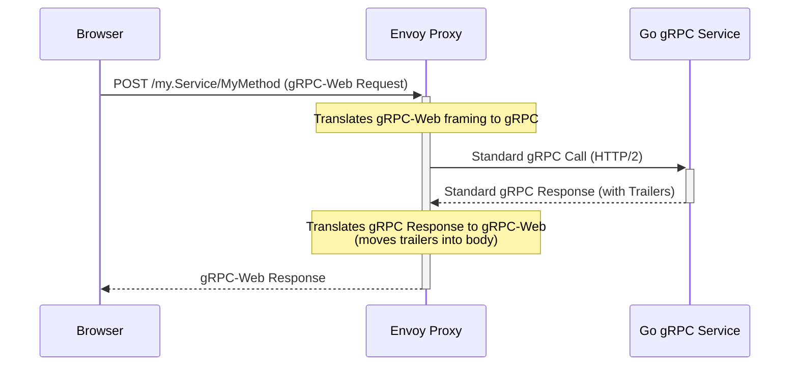
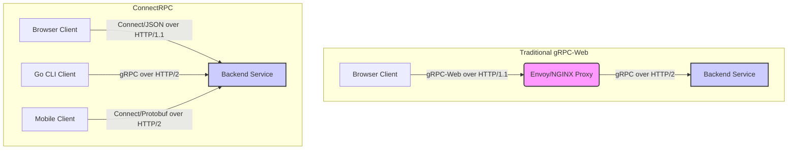

Trong gần một thập kỷ, gRPC đã là nhà vô địch không thể tranh cãi trong lĩnh vực giao tiếp hiệu suất cao giữa các backend. Sự kết hợp giữa hiệu quả của HTTP/2 và tính an toàn kiểu dữ liệu chặt chẽ của Protobuf đã hứa hẹn một thiên đường của các microservice có độ trễ thấp, dựa trên schema. Tuy nhiên, đối với các kỹ sư full-stack xây dựng ứng dụng web hiện đại, lời hứa này đi kèm với một dấu hoa thị đáng kể và thường gây đau đớn: trình duyệt. Sự không tương thích kiến trúc cố hữu giữa các yêu cầu vận chuyển HTTP/2 nghiêm ngặt của gRPC và các giới hạn của API trình duyệt đã tạo ra một hệ sinh thái phức tạp gồm các proxy và dịch giao thức, đáng chú ý nhất là gRPC-Web và Envoy. Chúng ta đã chấp nhận sự phức tạp này như một cái giá phải trả để kinh doanh. Chúng ta đã triển khai các sidecar, cấu hình các listener và gỡ lỗi các payload `application/grpc-web-text` không rõ ràng. Nhưng điều gì sẽ xảy ra nếu sự phức tạp này không phải là một sự cần thiết cơ bản, mà chỉ là một hiện vật lịch sử? Đây là câu hỏi trọng tâm mà ConnectRPC của Buf buộc chúng ta phải đối mặt. Nó trình bày một tầm nhìn thay thế—một nơi mà các API được định nghĩa bằng Protobuf là một công dân hạng nhất của web, có thể được tiêu thụ trực tiếp bởi bất kỳ trình duyệt nào, sử dụng các yêu cầu HTTP POST đơn giản, mà không phải hy sinh tính an toàn kiểu dữ liệu hoặc khả năng tương thích phía máy chủ. Bài viết này là một phân tích kiến trúc sâu sắc so sánh hai mô hình này, không chỉ về mặt lý thuyết, mà còn thông qua lăng kính của mã Go và TypeScript cấp độ sản xuất.

<AudioPlayer src="/static/audio/grpc-vs-connectrpc-production-guide.mp3" title="Tóm tắt âm thanh điều hành" />

## Vấn đề nan giải của gRPC: Sức mạnh so với sự phức tạp của Web

Để hiểu tại sao ConnectRPC đang ngày càng được ưa chuộng, trước tiên chúng ta phải phân tích các lý do kỹ thuật chính xác tại sao gRPC, với tất cả sức mạnh của nó, lại gặp khó khăn trong môi trường trình duyệt. Đó không phải là một lỗi trong bản thân gRPC, mà là sự không tương thích cơ bản với nền tảng web.

### Nền tảng của gRPC: HTTP/2 và Protobuf

Hiệu suất của gRPC bắt nguồn từ hai công nghệ cốt lõi:

1.  **Protobuf (Protocol Buffers):** Một định dạng tuần tự hóa nhị phân, không phụ thuộc ngôn ngữ, được phát triển bởi Google. Nó cực kỳ hiệu quả, cả về kích thước payload và chi phí CPU cho việc tuần tự hóa/giải tuần tự hóa, so với các định dạng dựa trên văn bản như JSON. Sức mạnh lớn nhất của nó là Ngôn ngữ Định nghĩa Giao diện (IDL), cho phép bạn định nghĩa các hợp đồng dịch vụ (tệp `.proto`) tạo ra mã máy khách và máy chủ được gõ tĩnh trong hàng chục ngôn ngữ.
2.  **HTTP/2:** gRPC được xây dựng *trực tiếp* trên HTTP/2, không chỉ sử dụng nó như một phương tiện vận chuyển. Nó tận dụng các tính năng HTTP/2 cụ thể không có hoặc khó truy cập trong HTTP/1.1:
    *   **Multiplexing:** Nhiều cuộc gọi RPC có thể chạy song song trên một kết nối TCP duy nhất mà không bị chặn đầu dòng.
    *   **Streaming hai chiều:** Cả máy khách và máy chủ đều có thể gửi một luồng tin nhắn trong một cuộc gọi RPC duy nhất.
    *   **Trailers:** gRPC gửi trạng thái cuối cùng của một RPC (ví dụ: `OK`, `UNAUTHENTICATED`) và các siêu dữ liệu khác trong các HTTP trailer, là các header được gửi *sau* phần thân phản hồi. Đây là một phần quan trọng của giao thức gRPC.

Sự kết nối chặt chẽ này với HTTP/2 là siêu năng lực của gRPC trong các môi trường máy chủ-máy chủ được kiểm soát. Tuy nhiên, nó trở thành gót chân Achilles của nó trong trình duyệt.

### Rào cản trình duyệt: Tại sao gRPC gốc thất bại

Các trình duyệt hiện đại nói HTTP/2, vậy tại sao chúng không thể nói gRPC? Vấn đề nằm ở mức độ kiểm soát được phơi bày bởi các API mạng trình duyệt như `fetch` và `XMLHttpRequest`. Các API này được thiết kế xung quanh mô hình ngữ nghĩa yêu cầu/phản hồi HTTP cổ điển, chứ không phải các khung vận chuyển cấp thấp của HTTP/2.

Cụ thể, các trình duyệt **không cung cấp API để kiểm soát HTTP/2 trailers**. Bạn có thể đọc các header phản hồi, nhưng bạn không thể truy cập các header đến sau phần thân. Vì gRPC bắt buộc sử dụng trailers để truyền đạt trạng thái RPC, một máy khách trình duyệt đơn giản là không thể hoàn thành một cuộc gọi gRPC theo đặc tả giao thức. Hạn chế duy nhất này khiến "gRPC gốc" trong trình duyệt không thể thực hiện được.

### Bước vào Proxy: gRPC-Web và Envoy

Giải pháp của cộng đồng là gRPC-Web. Đó là một giao thức đã được sửa đổi để khắc phục các hạn chế của trình duyệt:

1.  Nó gửi trạng thái RPC và siêu dữ liệu, vốn thường nằm trong các trailer, ở cuối phần thân phản hồi, được đóng khung theo một cách cụ thể.
2.  Nó có thể được xếp lớp trên các yêu cầu HTTP/1.1 hoặc HTTP/2 tiêu chuẩn.

Điều này giải quyết vấn đề trình duyệt, nhưng lại tạo ra một vấn đề phía máy chủ: máy chủ gRPC của bạn chỉ nói giao thức gRPC tiêu chuẩn. Nó không hiểu cách đóng khung gRPC-Web. Điều này đòi hỏi một lớp dịch—một proxy nằm giữa trình duyệt và dịch vụ gRPC của bạn.

Đây là nơi các công cụ như Envoy, NGINX hoặc các thư viện middleware chuyên dụng xuất hiện. Nhiệm vụ của proxy là:
1.  Nhận yêu cầu gRPC-Web từ trình duyệt.
2.  Dịch cách đóng khung gRPC-Web thành một yêu cầu gRPC tiêu chuẩn.
3.  Chuyển tiếp yêu cầu đến dịch vụ gRPC backend.
4.  Nhận phản hồi gRPC, dịch nó trở lại cách đóng khung gRPC-Web (chuyển các trailer vào phần thân), và gửi nó đến trình duyệt.

Kiến trúc này có chức năng nhưng phức tạp, như minh họa dưới đây.



Bước bổ sung này gây ra chi phí vận hành, một điểm lỗi khác và tăng độ trễ. Việc gỡ lỗi trở nên khó khăn hơn vì giờ đây bạn phải theo dõi các yêu cầu thông qua lớp proxy.

## ConnectRPC: Một phương pháp tiếp cận ưu tiên giao thức để đơn giản hóa

ConnectRPC, được phát triển bởi Buf, có một cách tiếp cận khác. Thay vì tạo ra một giao thức giải quyết vấn đề cho trình duyệt, nó đặt ra một câu hỏi cơ bản hơn: Chúng ta có thể thiết kế một giao thức RPC dựa trên Protobuf mà vốn dĩ tương thích với kiến trúc gốc của web không?

Câu trả lời là có. Connect xây dựng trên cùng một Protobuf IDL nhưng coi HTTP là một đối tác hạng nhất, không chỉ là một lớp vận chuyển để bị phá vỡ.

### Triết lý cốt lõi: Định nghĩa bằng Protobuf, gốc HTTP

Connect định nghĩa một ánh xạ đơn giản, thanh lịch của các dịch vụ Protobuf lên các yêu cầu HTTP `POST` thuần túy. Một cuộc gọi RPC đơn phương như `Say(HelloRequest)` đơn giản trở thành `POST /connect.example.v1.ExampleService/Say`.

Điều quan trọng là, nó hỗ trợ ba giao thức trên một cổng máy chủ duy nhất, không cần cấu hình đặc biệt:
1.  **Giao thức Connect:** Một giao thức đơn giản sử dụng các yêu cầu `POST`. Nó có thể sử dụng `application/json` (để dễ dàng gỡ lỗi trong công cụ dành cho nhà phát triển trình duyệt) hoặc `application/proto` (để đạt hiệu suất). Siêu dữ liệu được gửi qua các tiêu đề HTTP tiêu chuẩn. Lỗi được ánh xạ tới các mã trạng thái HTTP nếu có thể, với chi tiết trong phần thân phản hồi.
2.  **Giao thức gRPC:** Một máy chủ Connect hoàn toàn tương thích với các máy khách gRPC tiêu chuẩn qua HTTP/2. Nó xử lý các yêu cầu gRPC một cách minh bạch mà không cần dịch.
3.  **Giao thức gRPC-Web:** Một máy chủ Connect *cũng* hiểu gRPC-Web ngay lập tức. Bạn không còn cần một proxy riêng biệt để xử lý các máy khách gRPC-Web.

Điều này có nghĩa là bạn có thể có một dịch vụ Go duy nhất đồng thời phục vụ một máy khách gRPC cũ, một ứng dụng web sử dụng gRPC-Web và một ứng dụng web mới sử dụng giao thức Connect gốc.

Sự đơn giản hóa kiến trúc là rất lớn.



Với Connect, proxy bị loại bỏ đối với các máy khách web, làm sụp đổ kiến trúc thành một đường dẫn giao tiếp trực tiếp giữa máy khách và máy chủ.

## Triển khai chuyên sâu: Backend Go và Frontend Next.js

Hãy đặt điều này vào mã cấp độ sản xuất. Chúng ta sẽ xây dựng một `EchoService` đơn giản với backend Go và frontend Next.js, thể hiện tính an toàn kiểu dữ liệu đầu cuối và sự đơn giản của Connect.

### Định nghĩa API với Protobuf

Đầu tiên, chúng ta định nghĩa hợp đồng dịch vụ của mình trong `proto/echo/v1/echo.proto`.

```protobuf
syntax = "proto3";

package echo.v1;

import "google/protobuf/timestamp.proto";

// The service definition.
service EchoService {
  // Unary RPC
  rpc Echo(EchoRequest) returns (EchoResponse) {}

  // Server-streaming RPC
  rpc EchoStream(EchoStreamRequest) returns (stream EchoStreamResponse) {}
}

message EchoRequest {
  string message = 1;
}

message EchoResponse {
  string message = 1;
  google.protobuf.Timestamp timestamp = 2;
}

message EchoStreamRequest {
  string message = 1;
  int32 count = 2;
}

message EchoStreamResponse {
  string message = 1;
  google.protobuf.Timestamp timestamp = 2;
}
```

Chúng ta sử dụng `buf` để quản lý các dependency Protobuf và tạo mã. Tệp `buf.gen.yaml` của chúng ta chỉ định các plugin chúng ta cần:

```yaml
# buf.gen.yaml
version: v1
plugins:
  # Go code generation
  - plugin: buf.build/protocolbuffers/go:v1.31.0
    out: gen/go
    opt: paths=source_relative
  # Connect-Go code generation
  - plugin: buf.build/connectrpc/go:v1.11.1
    out: gen/go
    opt: paths=source_relative
  # TypeScript/JS code generation
  - plugin: buf.build/connectrpc/es:v1.1.2
    out: web/src/gen
    opt:
      - target=ts
      - keep_empty_files=true
  - plugin: buf.build/bufbuild/es:v1.5.0
    out: web/src/gen
    opt:
      - target=ts
      - keep_empty_files=true
```

Chạy `buf generate` sẽ tạo tất cả các stub máy chủ và máy khách của chúng ta.

### Triển khai máy chủ Go

Việc triển khai máy chủ Go cực kỳ tinh gọn. Chúng ta triển khai giao diện `EchoServiceHandler` được tạo.

```go
// main.go
package main

import (
	"context"
	"fmt"
	"log"
	"net/http"
	"time"

	"connectrpc.com/connect"
	"golang.org/x/net/http2"
	"golang.org/x/net/http2/h2c"
	"google.golang.org/protobuf/types/known/timestamppb"

	echov1 "example.com/gen/go/echo/v1"
	"example.com/gen/go/echo/v1/echov1connect"
)

// EchoServer implements the EchoService API.
type EchoServer struct{}

func (s *EchoServer) Echo(
	ctx context.Context,
	req *connect.Request[echov1.EchoRequest],
) (*connect.Response[echov1.EchoResponse], error) {
	log.Println("Request headers: ", req.Header())
	res := connect.NewResponse(&echov1.EchoResponse{
		Message:   fmt.Sprintf("You said: %s", req.Msg.Message),
		Timestamp: timestamppb.Now(),
	})
	res.Header().Set("Echo-Version", "v1.0.0")
	return res, nil
}

func (s *EchoServer) EchoStream(
    ctx context.Context,
    req *connect.Request[echov1.EchoStreamRequest],
    stream *connect.ServerStream[echov1.EchoStreamResponse],
) error {
    for i := 0; i < int(req.Msg.Count); i++ {
        if err := ctx.Err(); err != nil {
            return err // Client closed the connection
        }
        time.Sleep(500 * time.Millisecond)
        if err := stream.Send(&echov1.EchoStreamResponse{
            Message:   fmt.Sprintf("Message %d: %s", i+1, req.Msg.Message),
            Timestamp: timestamppb.Now(),
        }); err != nil {
            return err
        }
    }
    return nil
}

func main() {
	echoer := &EchoServer{}
	mux := http.NewServeMux()
	// The generated constructor returns a path and a handler.
	path, handler := echov1connect.NewEchoServiceHandler(echoer)
	mux.Handle(path, handler)
	log.Println("... Listening on :8080")

	// h2c.NewHandler allows the server to speak both HTTP/1.1 and unencrypted HTTP/2.
	// In production, you'd likely use a TLS listener.
	http.ListenAndServe(
		":8080",
		h2c.NewHandler(mux, &http2.Server{}),
	)
}
```

Lưu ý một vài chi tiết chính:
*   Chúng ta sử dụng thư viện `net/http` tiêu chuẩn. Điều này có nghĩa là chúng ta có thể tích hợp bất kỳ middleware HTTP Go hiện có nào để ghi nhật ký, xác thực, đo lường, v.v.
*   Trình xử lý được tạo bởi `echov1connect.NewEchoServiceHandler` chỉ là một `http.Handler`.
*   Trình bao bọc `h2c` cho phép HTTP/2, cho phép máy chủ xử lý các máy khách gRPC cùng với các máy khách Connect và gRPC-Web trên cùng một cổng.

### Triển khai máy khách TypeScript (Next.js)

Ở phía frontend, chúng ta sẽ tạo một máy khách có thể tái sử dụng, an toàn kiểu dữ liệu và sử dụng nó trong một React Server Component trong Next.js.

Đầu tiên, một tiện ích máy khách:

```typescript
// web/src/lib/connect-client.ts
import { createConnectTransport } from "@connectrpc/connect-web";
import { createPromiseClient } from "@connectrpc/connect";
import { EchoService } from "@/gen/echo/v1/echo_connect";

// The transport defines how the client communicates with the server.
const transport = createConnectTransport({
  baseUrl: process.env.NEXT_PUBLIC_API_URL ?? "http://localhost:8080",
});

// Here we create a typed client from the generated code.
export const echoClient = createPromiseClient(EchoService, transport);
```

Bây giờ, hãy sử dụng máy khách này trong một trang Next.js. Ví dụ này sử dụng một thành phần máy chủ, nghĩa là RPC được thực hiện từ môi trường kết xuất phía máy chủ, nhưng cùng một mã máy khách hoạt động trong một thành phần máy khách (`'use client'`).

```typescript
// web/src/app/page.tsx
import { echoClient } from "@/lib/connect-client";
import { EchoRequest } from "@/gen/echo/v1/echo_pb";

export default async function Home() {
  const req = new EchoRequest({ message: "Hello from Next.js Server Component" });

  // The RPC call is fully typed.
  // 'res.message' is a string, 'res.timestamp' is a Timestamp object.
  // A typo like 'res.mesage' would be a compile-time error.
  const res = await echoClient.echo(req);

  return (
    <main>
      <h1>ConnectRPC + Next.js</h1>
      <div>
        <h2>Server Response:</h2>
        <pre><code>{JSON.stringify(res.toJson(), null, 2)}</code></pre>
      </div>
    </main>
  );
}
```

Chỉ vậy thôi. Không có trình bao bọc fetch tùy chỉnh, không có interceptor để dịch các trailer, không có thiết lập proxy phức tạp. Chỉ cần một import và một `await`. Tính an toàn kiểu dữ liệu chảy trực tiếp từ tệp `.proto` của chúng ta đến mã TypeScript của chúng ta, ngăn chặn toàn bộ các loại lỗi.

## Phân tích kiến trúc và hiệu suất

Sự đơn giản là hấp dẫn, nhưng hiệu suất là tối quan trọng trong thiết kế hệ thống. Connect so với gRPC như thế nào về độ trễ và thông lượng?

### Streaming: Câu chuyện về hai HTTP

Sự khác biệt lớn nhất nằm ở cách triển khai streaming, đặc biệt là qua HTTP/1.1.

*   **gRPC/HTTP/2:** Sử dụng các luồng HTTP/2 gốc. Một kết nối TCP duy nhất có thể chứa nhiều luồng tin nhắn hai chiều hoàn toàn. Điều này rất hiệu quả.
*   **Connect/HTTP/2:** Khi một máy khách và máy chủ Connect giao tiếp qua HTTP/2, việc triển khai streaming **giống hệt gRPC**. Nó sử dụng cùng một cơ chế cơ bản. Hiệu suất ngang bằng.
*   **Connect/HTTP/1.1:** Đây là nơi mọi thứ trở nên thông minh. Vì HTTP/1.1 không có streaming gốc, Connect mô phỏng nó:
    *   **Server Streaming:** Sử dụng `chunked-transfer-encoding`. Máy chủ giữ yêu cầu mở và gửi lại dữ liệu theo từng khối khi có sẵn. Đây là một cơ chế HTTP tiêu chuẩn, được hỗ trợ tốt.
    *   **Client Streaming & Bidirectional Streaming:** Đây là sự đánh đổi chính. Streaming hai chiều thực sự qua một kết nối HTTP/1.1 duy nhất là không thể. Máy khách web của Connect triển khai chúng bằng cách sử dụng các yêu cầu HTTP riêng biệt bên dưới, hoặc bằng cách quay lại vận chuyển WebSocket nếu được cấu hình. Mặc dù có chức năng, điều này có chi phí cao hơn so với streaming HTTP/2 gốc.

**Điểm mấu chốt:** Đối với các máy khách trình duyệt (thường sử dụng HTTP/1.1 hoặc không thể kiểm soát hoàn toàn HTTP/2), Connect cung cấp khả năng streaming mạnh mẽ hoạt động ở mọi nơi. Đối với các dịch vụ backend nơi bạn kiểm soát môi trường, bạn sử dụng HTTP/2 và có được hiệu suất tương tự như gRPC.

### Độ trễ và thông lượng (Phân tích p99)

Hãy phân tích các đặc điểm hiệu suất dự kiến.

| Kịch bản | Giao thức | Nút thắt cổ chai & Hồ sơ độ trễ |
| :--- | :--- | :--- |
| **Backend-to-Backend** | gRPC (Go to Go) | **Mức cơ sở.** Tối ưu hóa cao. Độ trễ bị chi phối bởi RTT mạng và xử lý Protobuf. Độ trễ p99 thường rất thấp và ổn định. |
| **Backend-to-Backend** | ConnectRPC (Go to Go, HTTP/2) | **Gần như giống hệt gRPC.** Sự khác biệt về chi phí giao thức là không đáng kể. Cả hai đều tận dụng HTTP/2 và Protobuf nhị phân. Hiệu suất phải nằm trong một biên độ lỗi rất nhỏ so với gRPC gốc. |
| **Browser-to-Backend** | gRPC-Web + Envoy | **Độ trễ cao hơn.** Giới thiệu một bước nhảy mạng bổ sung đến proxy. Bản thân proxy tiêu thụ CPU và bộ nhớ để dịch. Điều này sẽ thêm một lượng độ trễ cố định vào mỗi yêu cầu và có thể trở thành nút thắt cổ chai dưới tải cao, ảnh hưởng đến độ trễ p99. |
| **Browser-to-Backend** | ConnectRPC (Connect/Protobuf) | **Độ trễ thấp hơn gRPC-Web.** Kết nối trực tiếp từ máy khách đến máy chủ loại bỏ bước nhảy proxy. Hiệu suất gần với mức tối thiểu lý thuyết cho một RPC dựa trên trình duyệt, bị giới hạn bởi RTT và xử lý Protobuf nhị phân. |
| **Browser-to-Backend** | ConnectRPC (Connect/JSON) | **Độ trễ cao nhất (nhưng dễ gỡ lỗi nhất).** Kết nối trực tiếp là tốt, nhưng tuần tự hóa/giải tuần tự hóa JSON chậm hơn đáng kể và tạo ra các payload lớn hơn Protobuf. Điều này rất tốt cho việc phát triển nhưng nên được sử dụng thận trọng trong các đường dẫn quan trọng về hiệu suất. |

Đối với hầu hết các ứng dụng full-stack, việc loại bỏ bước nhảy proxy trong đường dẫn `Browser -> Backend` là một chiến thắng kiến trúc và hiệu suất đáng kể. Độ trễ p99 sẽ thấp hơn và dễ dự đoán hơn với ConnectRPC vì toàn bộ một loại chế độ lỗi và tranh chấp tài nguyên (lớp proxy) đã bị loại bỏ.

<FAQ title="Các câu hỏi thường gặp">
  <Question>Nếu ConnectRPC đơn giản hơn nhiều cho web, có kịch bản nào mà tôi vẫn nên sử dụng gRPC-Web với proxy không?</Question>
  <Answer>Vâng, chắc chắn rồi. Nếu tổ chức của bạn có một cơ sở hạ tầng trưởng thành, đã được thiết lập xung quanh một service mesh như Istio hoặc một API Gateway tiêu chuẩn hóa sử dụng Envoy/NGINX, việc gắn bó với gRPC-Web có thể là một lựa chọn hợp lệ. Trong các môi trường này, proxy không chỉ là một trình dịch giao thức; nó là một thành phần quan trọng để thực thi các mối quan tâm xuyên suốt như xác thực mTLS, định hình lưu lượng nâng cao, giới hạn tốc độ toàn cầu và khả năng quan sát tập trung. Việc giới thiệu một đường dẫn giao tiếp trực tiếp đến dịch vụ với Connect có thể bỏ qua các mặt phẳng kiểm soát đã được thiết lập này. Quyết định phụ thuộc vào việc bạn muốn ủy quyền các mối quan tâm này cho proxy (gRPC-Web) hay xử lý chúng trong mã ứng dụng của bạn hoặc một gateway đơn giản hơn (Connect).</Answer>
  <Question>ConnectRPC xử lý lỗi như thế nào so với gRPC?</Question>
  <Answer>Xử lý lỗi của ConnectRPC là một trong những tính năng thân thiện với nhà phát triển nhất của nó. Trong khi gRPC độc quyền sử dụng trailer `grpc-status` và `grpc-message` nhị phân để truyền tải lỗi, Connect ánh xạ các mã lỗi chuẩn của nó sang ngữ nghĩa HTTP. Ví dụ, lỗi `NotFound` từ dịch vụ của bạn trở thành trạng thái HTTP `404 Not Found`. Lỗi `Unauthenticated` trở thành `401 Unauthorized`. Điều này giúp việc gỡ lỗi trong tab mạng của trình duyệt trở nên trực quan ngay lập tức. Đối với các mã lỗi gRPC không có tương đương HTTP rõ ràng (như `DataLoss`), Connect sử dụng một trạng thái HTTP cụ thể (ví dụ: `400 Bad Request` cho `InvalidArgument`) và bao gồm một phần thân lỗi JSON có cấu trúc với mã, thông báo và các chi tiết tùy chọn. Điều này cung cấp cả hai thế giới tốt nhất: HTTP ngữ nghĩa cho trình duyệt và thông tin lỗi chi tiết, có thể đọc được bằng máy cho máy khách.</Answer>
  <Question>Tôi có thể kết hợp và ghép nối các máy khách/máy chủ gRPC và Connect không?</Question>
  <Answer>Có, và đây là nền tảng trong thiết kế của Connect. Một máy chủ được xây dựng với `connect-go` là một máy chủ gRPC và gRPC-Web hoàn toàn tuân thủ. Điều này có nghĩa là bạn có thể trỏ các máy khách gRPC Go, Java hoặc Python hiện có của mình vào một máy chủ `connect-go`, và chúng sẽ hoạt động hoàn hảo qua HTTP/2. Bạn cũng có thể trỏ các máy khách gRPC-Web hiện có của mình vào đó, và chúng cũng sẽ hoạt động, mà không cần proxy Envoy. Điều này giúp việc di chuyển trở nên liền mạch. Bạn có thể dần dần giới thiệu các máy khách Connect-native vào hệ sinh thái của mình trong khi vẫn tiếp tục hỗ trợ toàn bộ đội máy khách gRPC và gRPC-Web hiện có của bạn, tất cả từ một tiến trình máy chủ duy nhất trên một cổng duy nhất.</Answer>
  <Question>Có gì bất lợi khi sử dụng ConnectRPC không?</Question>
  <Answer>Điểm "bất lợi" chính là sự trưởng thành của hệ sinh thái và bộ tính năng so với hệ sinh thái gRPC khổng lồ. Mặc dù Connect mạnh mẽ và sẵn sàng cho sản xuất, gRPC có lịch sử lâu đời hơn và do đó có nhiều công cụ của bên thứ ba, interceptor và hỗ trợ ngôn ngữ hơn (mặc dù Connect đang phát triển nhanh chóng). Một cân nhắc khác, như đã đề cập, là streaming máy khách/hai chiều qua HTTP/1.1, có chi phí cao hơn so với streaming HTTP/2 gốc. Cuối cùng, nếu kiến trúc của bạn phụ thuộc nhiều vào các tính năng HTTP/2 nâng cao mà gRPC phơi bày nhưng Connect trừu tượng hóa đi để đơn giản hóa, bạn có thể thấy gRPC phù hợp hơn. Tuy nhiên, đối với phần lớn các ứng dụng web và di động, đây là những đánh đổi nhỏ để đạt được sự đơn giản và trải nghiệm nhà phát triển lớn.</Answer>
</FAQ>

## Kết luận: Những điều cần lưu ý

Việc lựa chọn giữa gRPC và ConnectRPC là một sự đánh đổi kỹ thuật cổ điển giữa một tiêu chuẩn đã được thiết lập, mạnh mẽ nhưng phức tạp và một giải pháp thay thế hiện đại, đơn giản hơn nhưng mới hơn.
1.  **Đối với các ứng dụng Full-Stack mới:** Bắt đầu với ConnectRPC. Việc loại bỏ yêu cầu proxy cho các máy khách trình duyệt là một sự đơn giản hóa lớn trong kiến trúc, triển khai và quy trình làm việc của bạn. Tính an toàn kiểu dữ liệu đầu cuối từ Go đến TypeScript là một yếu tố thay đổi cuộc chơi về năng suất và độ tin cậy.

2.  **Đối với các dịch vụ Backend-to-Backend:** Lựa chọn ít rõ ràng hơn. Cả gRPC và Connect (qua HTTP/2) đều cung cấp hiệu suất gần như giống hệt nhau. Nếu tổ chức của bạn đã có nhiều công cụ và chuyên môn về gRPC, có thể có ít lý do để chuyển đổi. Nếu bạn coi trọng khả năng dễ dàng "curl" hoặc gỡ lỗi các dịch vụ của mình bằng JSON, hoặc muốn một dịch vụ duy nhất có thể dễ dàng được gọi bởi cả các backend khác và trình duyệt, Connect mang lại sự linh hoạt vượt trội.

3.  **Đối với các hệ thống gRPC hiện có:** Connect cung cấp một lộ trình di chuyển hấp dẫn, rủi ro thấp. Bạn có thể xây dựng các dịch vụ mới với Connect hoặc bao bọc các dịch vụ gRPC hiện có, và chúng sẽ ngay lập tức hỗ trợ các máy khách gRPC, gRPC-Web và Connect. Điều này cho phép áp dụng tăng dần mà không cần viết lại "big bang".

4.  **Hiểu mô hình Streaming:** Hãy lưu ý đến mô hình streaming. Đối với các máy khách dựa trên trình duyệt có thể bị giới hạn ở HTTP/1.1, streaming phía máy chủ trong Connect rất tuyệt vời, nhưng streaming hai chiều và phía máy khách có chi phí cao hơn so với các đối tác HTTP/2 của chúng.

gRPC đã thiết lập mô hình RPC dựa trên schema. ConnectRPC tinh chỉnh nó cho web hiện đại, chứng minh rằng bạn không phải đánh đổi sức mạnh để lấy sự đơn giản. Bằng cách chấp nhận ngữ nghĩa HTTP tiêu chuẩn, Connect đã tạo ra một công cụ ít giống như một giải pháp thay thế mà giống như một phần gốc của bộ công cụ của nhà phát triển full-stack hơn.

### Đọc thêm

*   [Tài liệu chính thức của ConnectRPC](https://connectrpc.com/docs/)
*   [Tài liệu chính thức của gRPC](https://grpc.io/docs/)
*   [Buf - Nơi ra đời của ConnectRPC](https://buf.build/)
*   [Đặc tả giao thức gRPC-Web](https://github.com/grpc/grpc/blob/master/doc/PROTOCOL-WEB.md)
*   [Tìm hiểu Envoy Proxy](https://www.envoyproxy.io/docs/envoy/latest/)