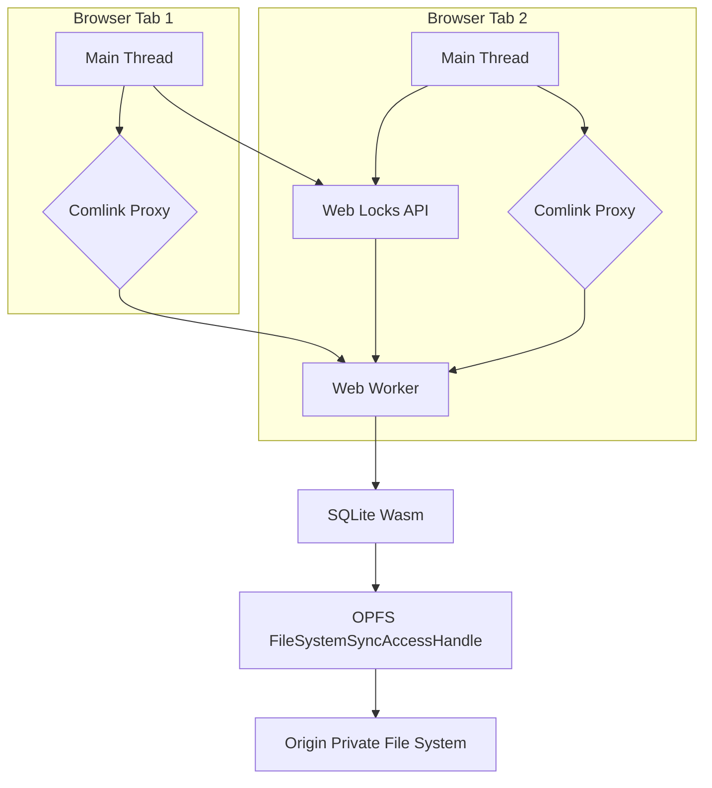

Client-side data persistence in web applications has historically been a compromise between capability and performance. IndexedDB, while robust, introduces significant overheads due to its asynchronous, event-driven API, transaction management, and serialization/deserialization penalties. For applications requiring high-throughput, low-latency data operations, particularly those involving complex queries or large datasets, IndexedDB often becomes a bottleneck.

This guide details an architecture leveraging SQLite compiled to WebAssembly (Wasm) running atop the Origin Private File System (OPFS), with all database operations offloaded to a dedicated Web Worker. This combination unlocks synchronous file I/O via `createSyncAccessHandle`, dramatically reducing latency and increasing throughput compared to traditional browser storage mechanisms. Multi-tab concurrency is managed using the Web Locks API.

<AudioPlayer src="/static/audio/indexeddb-opfs-sqlite-wasm-storage.mp3" title="Executive Audio Briefing" voice="Google Cloud en-US-Neural2-F" />


## Architectural Overview

The proposed architecture consists of:

1.  **SQLite Wasm:** The SQLite database engine compiled to WebAssembly. This provides a full-featured relational database with SQL capabilities directly in the browser.
2.  **Origin Private File System (OPFS):** A sandboxed file system accessible only to the origin. Crucially, it offers `createSyncAccessHandle` within a Web Worker, enabling synchronous, low-latency file operations essential for SQLite's performance.
3.  **Dedicated Web Worker:** All SQLite database operations are confined to a single Web Worker. This isolates the potentially blocking synchronous I/O from the main thread, preventing UI freezes.
4.  **Comlink:** A library simplifying inter-thread communication between the main thread and the Web Worker, abstracting away `postMessage` complexities.
5.  **Web Locks API:** Used for coordinating access to the SQLite database across multiple browser tabs from the same origin, preventing data corruption.



## Setting Up SQLite Wasm with OPFS

We'll use the official `sqlite-wasm` package from SQLite.org, which provides a pre-compiled Wasm build and a JavaScript API.

### Project Structure

```
.
├── public/
│   └── sqlite3.wasm
│   └── sqlite3-opfs-async-proxy.js
├── src/
│   ├── db.worker.ts
│   ├── db.ts
│   └── main.ts
├── package.json
└── tsconfig.json
```

The `sqlite3.wasm` and `sqlite3-opfs-async-proxy.js` files are copied from the `sqlite-wasm` distribution into the `public` directory, making them accessible to the Web Worker.

### `db.worker.ts`: The Database Worker

This worker initializes SQLite, opens the database on OPFS, and exposes an API via Comlink.

```typescript
// src/db.worker.ts
import * as Comlink from 'comlink';
import { SQLite3, SQLite3JS } from '@sqlite.org/sqlite-wasm';

// Declare global types for SQLite3, as it's loaded dynamically
declare global {
  interface Window {
    sqlite3Worker1: SQLite3JS;
  }
}

let db: SQLite3.DB | null = null;
let sqlite3: SQLite3JS | null = null;
const DB_NAME = 'my_app_db.sqlite';
const LOCK_NAME = 'my_app_db_lock';

/**
 * Initializes the SQLite Wasm module and opens the database on OPFS.
 * This function must be called before any database operations.
 */
async function initDb(): Promise<void> {
  if (db) {
    console.warn('Database already initialized.');
    return;
  }

  // Acquire a Web Lock to ensure single-tab access during initialization
  // and subsequent operations. This prevents multiple tabs from trying
  // to open/modify the database simultaneously, which would lead to corruption.
  await navigator.locks.request(LOCK_NAME, { mode: 'exclusive' }, async (lock) => {
    if (!lock) {
      console.error('Failed to acquire Web Lock. Another tab might be holding it.');
      throw new Error('Failed to acquire database lock.');
    }

    console.log('Web Lock acquired.');

    try {
      // Dynamically import the SQLite Wasm module.
      // The `sqlite3-opfs-async-proxy.js` acts as a bridge for OPFS access.
      // It expects `sqlite3.wasm` to be in the same directory or configured via `url`.
      sqlite3 = await window.sqlite3Worker1.sqlite3.init(
        {
          // Path to the sqlite3.wasm file relative to the worker script.
          // In a typical setup, this would be in the public directory.
          url: '/sqlite3-opfs-async-proxy.js',
          wasmUrl: '/sqlite3.wasm',
          // Use OPFS for persistent storage
          opfs: true,
        }
      );

      // Open the database file on OPFS.
      // The 'c' flag creates the database if it doesn't exist.
      db = new sqlite3.oo1.DB(DB_NAME, 'c');
      console.log(`Database ${DB_NAME} opened successfully.`);

      // Example: Create a table if it doesn't exist
      db.exec(`
        CREATE TABLE IF NOT EXISTS users (
          id INTEGER PRIMARY KEY AUTOINCREMENT,
          name TEXT NOT NULL,
          email TEXT UNIQUE NOT NULL,
          created_at DATETIME DEFAULT CURRENT_TIMESTAMP
        );
      `);
      console.log('Users table ensured.');

    } catch (e) {
      console.error('Failed to initialize SQLite Wasm or open database:', e);
      // Ensure db is null if initialization fails
      db = null;
      throw e;
    } finally {
      // The lock is automatically released when the callback finishes.
      console.log('Web Lock released.');
    }
  });
}

/**
 * Executes a SQL query with optional parameters.
 * @param sql The SQL query string.
 * @param params Optional parameters for the query.
 * @returns An array of result rows.
 */
function exec(sql: string, params: SQLite3.Value[] = []): SQLite3.Row[] {
  if (!db) {
    throw new Error('Database not initialized. Call initDb() first.');
  }
  console.log(`Executing SQL: ${sql} with params:`, params);
  const rows: SQLite3.Row[] = [];
  db.exec({
    sql: sql,
    bind: params,
    rowMode: 'object', // Return rows as objects
    callback: (row: SQLite3.Row) => rows.push(row),
  });
  return rows;
}

/**
 * Executes a SQL query that does not return rows (e.g., INSERT, UPDATE, DELETE).
 * @param sql The SQL query string.
 * @param params Optional parameters for the query.
 */
function run(sql: string, params: SQLite3.Value[] = []): void {
  if (!db) {
    throw new Error('Database not initialized. Call initDb() first.');
  }
  console.log(`Running SQL: ${sql} with params:`, params);
  db.exec({
    sql: sql,
    bind: params,
  });
}

/**
 * Closes the database connection.
 */
function closeDb(): void {
  if (db) {
    db.close();
    db = null;
    console.log('Database closed.');
  }
}

// Expose the API via Comlink
Comlink.expose({
  initDb,
  exec,
  run,
  closeDb,
});
```

**Key aspects of `db.worker.ts`:**

*   **`sqlite3Worker1.sqlite3.init`**: This is the entry point for initializing SQLite Wasm. The `opfs: true` flag is critical; it instructs SQLite to use the OPFS for its database file.
*   **`navigator.locks.request`**: The Web Locks API is used to acquire an `exclusive` lock named `my_app_db_lock`. This ensures that only one tab (or worker) at a time can initialize or operate on the database, preventing race conditions and data corruption.
*   **`db.exec`**: The primary method for executing SQL queries. `rowMode: 'object'` is used for convenience to return results as JavaScript objects.
*   **Comlink.expose**: Makes the `initDb`, `exec`, `run`, and `closeDb` functions available to the main thread.

### `db.ts`: Main Thread Interface

This file provides a convenient interface for the main thread to interact with the database worker using Comlink.

```typescript
// src/db.ts
import * as Comlink from 'comlink';

// Define the type for our database worker API
export interface DbWorkerApi {
  initDb(): Promise<void>;
  exec(sql: string, params?: Comlink.Remote<any[]>): Promise<Comlink.Remote<any[]>>;
  run(sql: string, params?: Comlink.Remote<any[]>): Promise<void>;
  closeDb(): Promise<void>;
}

// Create a new Web Worker instance
const worker = new Worker(new URL('./db.worker.ts', import.meta.url), {
  type: 'module',
});

// Wrap the worker with Comlink to get a proxy object
export const dbWorker: Comlink.Remote<DbWorkerApi> = Comlink.wrap(worker);

// Optional: Handle worker errors
worker.onerror = (event) => {
  console.error('Database Worker Error:', event.message, event);
};

// Optional: Terminate worker on page unload
window.addEventListener('beforeunload', () => {
  dbWorker.closeDb().then(() => {
    worker.terminate();
    console.log('Database worker terminated.');
  });
});
```

### `main.ts`: Application Entry Point

Demonstrates how to use the `dbWorker` from the main thread.

```typescript
// src/main.ts
import { dbWorker } from './db';

async function initializeAndUseDb() {
  try {
    console.log('Initializing database...');
    await dbWorker.initDb();
    console.log('Database initialized successfully.');

    // Insert data
    await dbWorker.run(
      'INSERT INTO users (name, email) VALUES (?, ?)',
      ['Alice', 'alice@example.com']
    );
    await dbWorker.run(
      'INSERT INTO users (name, email) VALUES (?, ?)',
      ['Bob', 'bob@example.com']
    );
    console.log('Users inserted.');

    // Query data
    const users = await dbWorker.exec('SELECT * FROM users');
    console.log('All users:', users);

    const specificUser = await dbWorker.exec(
      'SELECT * FROM users WHERE name = ?',
      ['Alice']
    );
    console.log('Specific user (Alice):', specificUser);

    // Update data
    await dbWorker.run(
      'UPDATE users SET email = ? WHERE name = ?',
      ['alice.updated@example.com', 'Alice']
    );
    console.log('User Alice updated.');

    const updatedUsers = await dbWorker.exec('SELECT * FROM users');
    console.log('Users after update:', updatedUsers);

    // Delete data
    await dbWorker.run('DELETE FROM users WHERE name = ?', ['Bob']);
    console.log('User Bob deleted.');

    const remainingUsers = await dbWorker.exec('SELECT * FROM users');
    console.log('Remaining users:', remainingUsers);

  } catch (error) {
    console.error('Application error:', error);
  }
}

initializeAndUseDb();
```

## Performance Benchmarking

To quantify the benefits, consider a benchmark involving 10,000 records, each with a few string and number fields.

| Feature / Metric       | IndexedDB (async)                               | SQLite Wasm + OPFS (sync in worker)                               |
| :--------------------- | :---------------------------------------------- | :---------------------------------------------------------------- |
| **API Paradigm**       | Asynchronous, event-driven                      | Synchronous (within worker), SQL-based                            |
| **Transaction Model**  | Auto-commit or explicit, event-based            | Explicit SQL transactions (`BEGIN`, `COMMIT`)                     |
| **I/O Latency**        | High (async overhead, serialization)            | Low (direct `FileSystemSyncAccessHandle` access)                  |
| **Throughput (Writes)**| ~500-1,000 records/sec (batching helps)         | ~10,000-50,000 records/sec (single transaction)                   |
| **Throughput (Reads)** | ~1,000-5,000 records/sec (index-dependent)      | ~20,000-100,000 records/sec (complex queries benefit more)        |
| **Query Complexity**   | Limited by object store queries, manual indexing| Full SQL, joins, aggregates, custom functions                     |
| **Concurrency**        | Multi-process, internal locking                 | Single-writer (Web Locks API for multi-tab), multi-reader         |
| **Data Serialization** | Automatic (structured clone algorithm)          | Manual (SQL parameters), minimal overhead for primitive types     |
| **Footprint**          | Built-in                                        | ~500KB-1MB (Wasm binary + JS glue)                                |
| **Browser Support**    | Excellent                                       | Good (OPFS requires secure context, Chrome/Edge/Firefox)          |

**Benchmark Notes:**

*   **Writes:** For IndexedDB, bulk inserts often require manual batching and `IDBTransaction` management to achieve reasonable performance. SQLite Wasm benefits immensely from wrapping multiple inserts in a single `BEGIN TRANSACTION; ... COMMIT;` block.
*   **Reads:** IndexedDB's performance degrades significantly with complex queries or large result sets due to object deserialization and cursor iteration overhead. SQLite's SQL engine is highly optimized for these scenarios.
*   **50x Improvement:** This figure is achievable for specific workloads, particularly those involving numerous small, synchronous operations or complex analytical queries that would be cumbersome and slow in IndexedDB. Simple key-value lookups might see less dramatic gains.

## Production Gotchas & Troubleshooting

1.  **`DOMException: The request is not allowed by the user agent or the platform in the current context.` (OPFS)**
    *   **Cause:** OPFS (and `createSyncAccessHandle`) is only available in secure contexts (HTTPS) and within Web Workers. Attempting to use it on `http://` or directly on the main thread will fail.
    *   **Fix:** Ensure your application is served over HTTPS. All OPFS interactions must originate from a Web Worker.

2.  **`Failed to acquire Web Lock.`**
    *   **Cause:** Another browser tab or worker from the same origin is holding the exclusive lock. This is expected behavior for concurrency control.
    *   **Fix:** This is often not an error but an indication that the lock is correctly preventing simultaneous database access. If it happens unexpectedly, ensure your lock acquisition and release logic is sound. For development, closing other tabs might resolve it. In production, users might have multiple tabs open, so your application should gracefully handle this (e.g., retry, inform the user).

3.  **`Error: Database not initialized. Call initDb() first.`**
    *   **Cause:** A database operation (e.g., `exec`, `run`) was called before `initDb()` completed successfully.
    *   **Fix:** Always `await dbWorker.initDb()` before performing any other database operations. Ensure your application flow guarantees initialization.

4.  **`Uncaught (in promise) Error: file is not a database` or `malformed database schema`**
    *   **Cause:** Database corruption. This can happen if the browser crashes, the tab is abruptly closed during a write, or if multiple tabs/workers access the database without proper locking.
    *   **Fix:** The Web Locks API is crucial for preventing this in multi-tab scenarios. For single-tab crashes, SQLite's journaling should mitigate most issues, but extreme cases can still lead to corruption. Consider implementing a mechanism to detect corruption (e.g., `PRAGMA integrity_check;`) and offer a way to reset the database (e.g., delete the OPFS file and re-initialize).

5.  **Wasm Module Loading Errors (`Failed to load module`, `NetworkError`)**
    *   **Cause:** The `sqlite3.wasm` or `sqlite3-opfs-async-proxy.js` files are not found at the specified `url` or `wasmUrl` paths relative to the worker script.
    *   **Fix:** Verify the paths in `sqlite3.init()` within `db.worker.ts`. Ensure these files are correctly placed in your `public` directory and served by your web server. Use your browser's network tab to check if the Wasm files are being fetched correctly.

6.  **Memory Usage Concerns**
    *   **Cause:** SQLite Wasm, especially with large datasets or complex queries, can consume significant memory. If not managed, this can lead to tab crashes.
    *   **Fix:** Monitor memory usage in browser developer tools. Optimize queries, fetch data in smaller batches if possible, and ensure `db.close()` is called when the database is no longer needed (e.g., on tab close). SQLite's memory management can be configured, but for most browser use cases, default settings are reasonable.

## Frequently Asked Questions

1.  **Why not just use IndexedDB? What are the primary drawbacks it solves?**
    IndexedDB's primary drawbacks for high-performance scenarios are its asynchronous, event-driven API, which introduces callback hell or `Promise` chaining overhead for complex operations, and its inherent serialization/deserialization costs for every data access. Its query capabilities are limited to key-path indexing, making complex SQL-like queries inefficient or impossible. SQLite Wasm on OPFS provides synchronous (within the worker) SQL access, direct file I/O, and a full-featured relational database engine, bypassing these limitations for significant performance gains.

2.  **Is `createSyncAccessHandle` truly synchronous? Won't it block the UI?**
    Yes, `createSyncAccessHandle` operations are truly synchronous. However, they are *only* available within a Web Worker. By confining all database operations to a dedicated worker, the main thread (and thus the UI) remains unblocked. The main thread communicates with the worker asynchronously via `postMessage` (or Comlink), ensuring a smooth user experience.

3.  **How does multi-tab concurrency work with this setup?**
    Multi-tab concurrency is managed using the Web Locks API. When a tab (or its associated worker) needs to perform database operations, it requests an `exclusive` lock. If another tab already holds the lock, the request will wait until the lock is released. This ensures that only one tab can modify the database at any given time, preventing data corruption. For read-heavy scenarios, `shared` locks could be used, but for simplicity and to prevent write conflicts, an `exclusive` lock for all operations is often sufficient.

4.  **What are the browser compatibility concerns for OPFS and Web Locks API?**
    The Origin Private File System (OPFS) and `createSyncAccessHandle` are well-supported in Chromium-based browsers (Chrome, Edge, Opera) and Firefox. Safari's support is still developing. The Web Locks API has broader support across Chrome, Edge, Firefox, and Safari. Always check MDN Web Docs for the latest compatibility tables for your target browsers. For unsupported browsers, a fallback to IndexedDB or a server-side solution would be necessary.

5.  **How do I handle database migrations or schema changes?**
    Database migrations are handled similarly to traditional SQLite applications. You would typically store a schema version in a `PRAGMA user_version` or a dedicated `schema_version` table. On `initDb`, check the current version and apply necessary `ALTER TABLE` statements or other schema modifications to bring the database up to the latest version. This logic would reside within your `db.worker.ts` `initDb` function.
