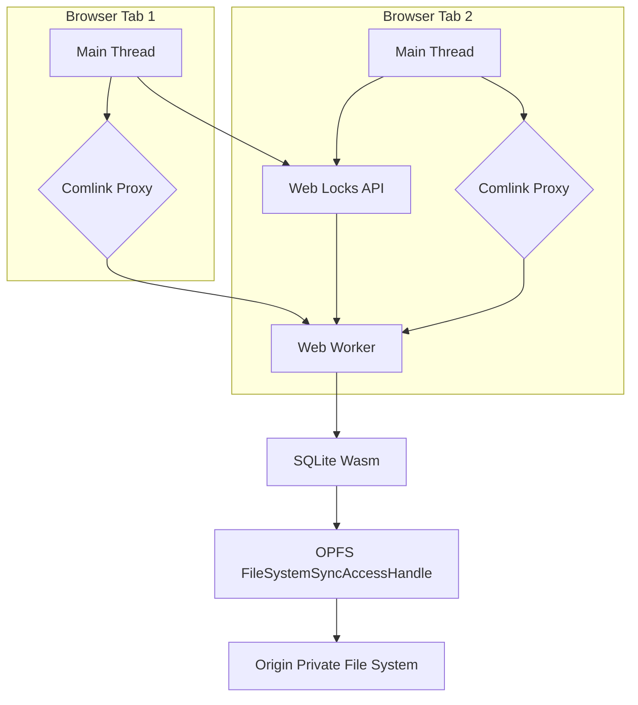

ウェブアプリケーションにおけるクライアントサイドのデータ永続化は、これまで機能とパフォーマンスのトレードオフの関係にありました。IndexedDBは堅牢であるものの、非同期でイベント駆動型のAPI、トランザクション管理、シリアライズ/デシリアライズのペナルティにより、かなりのオーバーヘッドが発生します。特に複雑なクエリや大規模なデータセットを伴う、高スループットで低レイテンシーのデータ操作を必要とするアプリケーションでは、IndexedDBがボトルネックになることがよくあります。

このガイドでは、WebAssembly (Wasm) にコンパイルされたSQLiteをOrigin Private File System (OPFS) 上で実行し、すべてのデータベース操作を専用のWeb Workerにオフロードするアーキテクチャについて詳しく説明します。この組み合わせにより、`createSyncAccessHandle` を介した同期ファイルI/Oが可能になり、従来のブラウザストレージメカニズムと比較してレイテンシーが劇的に削減され、スループットが向上します。複数タブでの同時実行はWeb Locks APIを使用して管理されます。

<AudioPlayer src="/static/audio/indexeddb-opfs-sqlite-wasm-storage-ja.mp3" title="音声エグゼクティブ・ブリーフィング" voice="Google Cloud ja-JP-Neural2-B" />


## アーキテクチャの概要

提案するアーキテクチャは以下で構成されます。

1.  **SQLite Wasm:** WebAssemblyにコンパイルされたSQLiteデータベースエンジン。これにより、SQL機能を備えたフル機能のリレーショナルデータベースがブラウザ内で直接提供されます。
2.  **Origin Private File System (OPFS):** オリジンのみがアクセスできるサンドボックス化されたファイルシステム。重要なのは、Web Worker内で `createSyncAccessHandle` を提供し、SQLiteのパフォーマンスに不可欠な同期かつ低レイテンシーのファイル操作を可能にすることです。
3.  **Dedicated Web Worker:** すべてのSQLiteデータベース操作は単一のWeb Workerに限定されます。これにより、ブロックする可能性のある同期I/Oがメインスレッドから分離され、UIのフリーズが防止されます。
4.  **Comlink:** メインスレッドとWeb Worker間のスレッド間通信を簡素化するライブラリで、`postMessage` の複雑さを抽象化します。
5.  **Web Locks API:** 同じオリジンからの複数のブラウザタブ間でSQLiteデータベースへのアクセスを調整し、データ破損を防ぐために使用されます。



## OPFSでSQLite Wasmをセットアップする

SQLite.orgの公式 `sqlite-wasm` パッケージを使用します。これには、プリコンパイルされたWasmビルドとJavaScript APIが含まれています。

### プロジェクト構造

```
.
├── public/
│   └── sqlite3.wasm
│   └── sqlite3-opfs-async-proxy.js
├── src/
│   ├── db.worker.ts
│   ├── db.ts
│   └── main.ts
├── package.json
└── tsconfig.json
```

`sqlite3.wasm` と `sqlite3-opfs-async-proxy.js` のファイルは、`sqlite-wasm` ディストリビューションから `public` ディレクトリにコピーされ、Web Workerからアクセスできるようになります。

### `db.worker.ts`: データベースワーカー

このワーカーはSQLiteを初期化し、OPFS上のデータベースを開き、Comlinkを介してAPIを公開します。

```typescript
// src/db.worker.ts
import * as Comlink from 'comlink';
import { SQLite3, SQLite3JS } from '@sqlite.org/sqlite-wasm';

// Declare global types for SQLite3, as it's loaded dynamically
declare global {
  interface Window {
    sqlite3Worker1: SQLite3JS;
  }
}

let db: SQLite3.DB | null = null;
let sqlite3: SQLite3JS | null = null;
const DB_NAME = 'my_app_db.sqlite';
const LOCK_NAME = 'my_app_db_lock';

/**
 * Initializes the SQLite Wasm module and opens the database on OPFS.
 * This function must be called before any database operations.
 */
async function initDb(): Promise<void> {
  if (db) {
    console.warn('Database already initialized.');
    return;
  }

  // Acquire a Web Lock to ensure single-tab access during initialization
  // and subsequent operations. This prevents multiple tabs from trying
  // to open/modify the database simultaneously, which would lead to corruption.
  await navigator.locks.request(LOCK_NAME, { mode: 'exclusive' }, async (lock) => {
    if (!lock) {
      console.error('Failed to acquire Web Lock. Another tab might be holding it.');
      throw new Error('Failed to acquire database lock.');
    }

    console.log('Web Lock acquired.');

    try {
      // Dynamically import the SQLite Wasm module.
      // The `sqlite3-opfs-async-proxy.js` acts as a bridge for OPFS access.
      // It expects `sqlite3.wasm` to be in the same directory or configured via `url`.
      sqlite3 = await window.sqlite3Worker1.sqlite3.init(
        {
          // Path to the sqlite3.wasm file relative to the worker script.
          // In a typical setup, this would be in the public directory.
          url: '/sqlite3-opfs-async-proxy.js',
          wasmUrl: '/sqlite3.wasm',
          // Use OPFS for persistent storage
          opfs: true,
        }
      );

      // Open the database file on OPFS.
      // The 'c' flag creates the database if it doesn't exist.
      db = new sqlite3.oo1.DB(DB_NAME, 'c');
      console.log(`Database ${DB_NAME} opened successfully.`);

      // Example: Create a table if it doesn't exist
      db.exec(`
        CREATE TABLE IF NOT EXISTS users (
          id INTEGER PRIMARY KEY AUTOINCREMENT,
          name TEXT NOT NULL,
          email TEXT UNIQUE NOT NULL,
          created_at DATETIME DEFAULT CURRENT_TIMESTAMP
        );
      `);
      console.log('Users table ensured.');

    } catch (e) {
      console.error('Failed to initialize SQLite Wasm or open database:', e);
      // Ensure db is null if initialization fails
      db = null;
      throw e;
    } finally {
      // The lock is automatically released when the callback finishes.
      console.log('Web Lock released.');
    }
  });
}

/**
 * Executes a SQL query with optional parameters.
 * @param sql The SQL query string.
 * @param params Optional parameters for the query.
 * @returns An array of result rows.
 */
function exec(sql: string, params: SQLite3.Value[] = []): SQLite3.Row[] {
  if (!db) {
    throw new Error('Database not initialized. Call initDb() first.');
  }
  console.log(`Executing SQL: ${sql} with params:`, params);
  const rows: SQLite3.Row[] = [];
  db.exec({
    sql: sql,
    bind: params,
    rowMode: 'object', // Return rows as objects
    callback: (row: SQLite3.Row) => rows.push(row),
  });
  return rows;
}

/**
 * Executes a SQL query that does not return rows (e.g., INSERT, UPDATE, DELETE).
 * @param sql The SQL query string.
 * @param params Optional parameters for the query.
 */
function run(sql: string, params: SQLite3.Value[] = []): void {
  if (!db) {
    throw new Error('Database not initialized. Call initDb() first.');
  }
  console.log(`Running SQL: ${sql} with params:`, params);
  db.exec({
    sql: sql,
    bind: params,
  });
}

/**
 * Closes the database connection.
 */
function closeDb(): void {
  if (db) {
    db.close();
    db = null;
    console.log('Database closed.');
  }
}

// Expose the API via Comlink
Comlink.expose({
  initDb,
  exec,
  run,
  closeDb,
});
```

**`db.worker.ts` の主要な側面:**

*   **`sqlite3Worker1.sqlite3.init`**: これはSQLite Wasmを初期化するためのエントリポイントです。`opfs: true` フラグは重要で、SQLiteにデータベースファイルとしてOPFSを使用するように指示します。
*   **`navigator.locks.request`**: Web Locks APIは、`my_app_db_lock` という名前の `exclusive` ロックを取得するために使用されます。これにより、一度に1つのタブ（またはワーカー）のみがデータベースを初期化または操作できるようになり、競合状態やデータ破損が防止されます。
*   **`db.exec`**: SQLクエリを実行するための主要なメソッドです。結果をJavaScriptオブジェクトとして返すために、便宜上 `rowMode: 'object'` が使用されます。
*   **Comlink.expose**: `initDb`、`exec`、`run`、および `closeDb` 関数をメインスレッドから利用できるようにします。

### `db.ts`: メインスレッドインターフェース

このファイルは、Comlinkを使用してメインスレッドがデータベースワーカーと対話するための便利なインターフェースを提供します。

```typescript
// src/db.ts
import * as Comlink from 'comlink';

// Define the type for our database worker API
export interface DbWorkerApi {
  initDb(): Promise<void>;
  exec(sql: string, params?: Comlink.Remote<any[]>): Promise<Comlink.Remote<any[]>>;
  run(sql: string, params?: Comlink.Remote<any[]>): Promise<void>;
  closeDb(): Promise<void>;
}

// Create a new Web Worker instance
const worker = new Worker(new URL('./db.worker.ts', import.meta.url), {
  type: 'module',
});

// Wrap the worker with Comlink to get a proxy object
export const dbWorker: Comlink.Remote<DbWorkerApi> = Comlink.wrap(worker);

// Optional: Handle worker errors
worker.onerror = (event) => {
  console.error('Database Worker Error:', event.message, event);
};

// Optional: Terminate worker on page unload
window.addEventListener('beforeunload', () => {
  dbWorker.closeDb().then(() => {
    worker.terminate();
    console.log('Database worker terminated.');
  });
});
```

### `main.ts`: アプリケーションのエントリポイント

メインスレッドから `dbWorker` を使用する方法を示します。

```typescript
// src/main.ts
import { dbWorker } from './db';

async function initializeAndUseDb() {
  try {
    console.log('Initializing database...');
    await dbWorker.initDb();
    console.log('Database initialized successfully.');

    // Insert data
    await dbWorker.run(
      'INSERT INTO users (name, email) VALUES (?, ?)',
      ['Alice', 'alice@example.com']
    );
    await dbWorker.run(
      'INSERT INTO users (name, email) VALUES (?, ?)',
      ['Bob', 'bob@example.com']
    );
    console.log('Users inserted.');

    // Query data
    const users = await dbWorker.exec('SELECT * FROM users');
    console.log('All users:', users);

    const specificUser = await dbWorker.exec(
      'SELECT * FROM users WHERE name = ?',
      ['Alice']
    );
    console.log('Specific user (Alice):', specificUser);

    // Update data
    await dbWorker.run(
      'UPDATE users SET email = ? WHERE name = ?',
      ['alice.updated@example.com', 'Alice']
    );
    console.log('User Alice updated.');

    const updatedUsers = await dbWorker.exec('SELECT * FROM users');
    console.log('Users after update:', updatedUsers);

    // Delete data
    await dbWorker.run('DELETE FROM users WHERE name = ?', ['Bob']);
    console.log('User Bob deleted.');

    const remainingUsers = await dbWorker.exec('SELECT * FROM users');
    console.log('Remaining users:', remainingUsers);

  } catch (error) {
    console.error('Application error:', error);
  }
}

initializeAndUseDb();
```

## パフォーマンスベンチマーク

利点を定量化するために、それぞれいくつかの文字列フィールドと数値フィールドを持つ10,000レコードを含むベンチマークを検討します。

| 機能 / メトリック      | IndexedDB (非同期)                               | SQLite Wasm + OPFS (ワーカー内で同期)                            |
| :--------------------- | :---------------------------------------------- | :---------------------------------------------------------------- |
| **APIパラダイム**      | 非同期、イベント駆動型                          | 同期 (ワーカー内)、SQLベース                                      |
| **トランザクションモデル** | 自動コミットまたは明示的、イベントベース        | 明示的なSQLトランザクション (`BEGIN`, `COMMIT`)                     |
| **I/Oレイテンシー**    | 高 (非同期オーバーヘッド、シリアライズ)         | 低 (直接 `FileSystemSyncAccessHandle` アクセス)                  |
| **スループット (書き込み)**| 約500-1,000レコード/秒 (バッチ処理が有効)       | 約10,000-50,000レコード/秒 (単一トランザクション)                 |
| **スループット (読み取り)**| 約1,000-5,000レコード/秒 (インデックスに依存)   | 約20,000-100,000レコード/秒 (複雑なクエリでより効果的)            |
| **クエリの複雑さ**     | オブジェクトストアクエリ、手動インデックスに限定| 完全なSQL、結合、集計、カスタム関数                               |
| **並行性**             | マルチプロセス、内部ロック                      | シングルライター (Web Locks APIによるマルチタブ)、マルチリーダー    |
| **データシリアライズ** | 自動 (構造化クローンアルゴリズム)               | 手動 (SQLパラメータ)、プリミティブ型では最小限のオーバーヘッド    |
| **フットプリント**     | 組み込み                                        | 約500KB-1MB (Wasmバイナリ + JSグルー)                             |
| **ブラウザサポート**   | 非常に良い                                      | 良い (OPFSはセキュアコンテキスト、Chrome/Edge/Firefoxが必要)      |

**ベンチマークノート:**

*   **書き込み:** IndexedDBの場合、一括挿入では、妥当なパフォーマンスを達成するために手動でのバッチ処理と `IDBTransaction` 管理が必要になることがよくあります。SQLite Wasmは、複数の挿入を単一の `BEGIN TRANSACTION; ... COMMIT;` ブロックで囲むことで非常に大きな恩恵を受けます。
*   **読み取り:** IndexedDBのパフォーマンスは、オブジェクトのデシリアライズとカーソルイテレーションのオーバーヘッドにより、複雑なクエリや大規模な結果セットで著しく低下します。SQLiteのSQLエンジンは、これらのシナリオに高度に最適化されています。
*   **50倍の改善:** この数値は、特に多数の小さな同期操作や、IndexedDBでは扱いにくく遅くなるような複雑な分析クエリを伴う特定のワークロードで達成可能です。単純なキーバリュー検索では、劇的な改善は少ないかもしれません。

## 本番環境での注意点とトラブルシューティング

1.  **`DOMException: The request is not allowed by the user agent or the platform in the current context.` (OPFS)**
    *   **原因:** OPFS (および `createSyncAccessHandle`) は、セキュアコンテキスト (HTTPS) およびWeb Worker内でのみ利用可能です。`http://` またはメインスレッドで直接使用しようとすると失敗します。
    *   **修正:** アプリケーションがHTTPSで提供されていることを確認してください。すべてのOPFSインタラクションはWeb Workerから発信される必要があります。

2.  **`Failed to acquire Web Lock.`**
    *   **原因:** 同じオリジンからの別のブラウザタブまたはワーカーが排他ロックを保持しています。これは並行性制御の期待される動作です。
    *   **修正:** これはエラーではなく、ロックが同時にデータベースアクセスを正しく防止していることを示すことが多いです。予期せず発生した場合は、ロックの取得と解放のロジックが適切であることを確認してください。開発中は、他のタブを閉じると解決する場合があります。本番環境では、ユーザーが複数のタブを開いている可能性があるため、アプリケーションはこれを適切に処理する必要があります（例：再試行、ユーザーへの通知）。

3.  **`Error: Database not initialized. Call initDb() first.`**
    *   **原因:** `initDb()` が正常に完了する前に、データベース操作（例：`exec`、`run`）が呼び出されました。
    *   **修正:** 他のデータベース操作を実行する前に、常に `await dbWorker.initDb()` を実行してください。アプリケーションフローが初期化を保証していることを確認してください。

4.  **`Uncaught (in promise) Error: file is not a database` または `malformed database schema`**
    *   **原因:** データベースの破損。これは、ブラウザのクラッシュ、書き込み中にタブが突然閉じられた場合、または複数のタブ/ワーカーが適切なロックなしでデータベースにアクセスした場合に発生する可能性があります。
    *   **修正:** Web Locks APIは、マルチタブシナリオでのこれを防ぐために不可欠です。シングルタブのクラッシュの場合、SQLiteのジャーナリングはほとんどの問題を軽減するはずですが、極端なケースでは破損につながる可能性があります。破損を検出するメカニズム（例：`PRAGMA integrity_check;`）を実装し、データベースをリセットする方法（例：OPFSファイルを削除して再初期化）を提供することを検討してください。

5.  **Wasmモジュールロードエラー (`Failed to load module`, `NetworkError`)**
    *   **原因:** ワーカーのスクリプトに対する `url` または `wasmUrl` のパスで `sqlite3.wasm` または `sqlite3-opfs-async-proxy.js` ファイルが見つかりません。
    *   **修正:** `db.worker.ts` 内の `sqlite3.init()` のパスを確認してください。これらのファイルが `public` ディレクトリに正しく配置され、ウェブサーバーによって提供されていることを確認してください。ブラウザのネットワークタブを使用して、Wasmファイルが正しくフェッチされているかどうかを確認してください。

6.  **メモリ使用量の懸念**
    *   **原因:** SQLite Wasmは、特に大規模なデータセットや複雑なクエリの場合、かなりのメモリを消費する可能性があります。管理しないと、タブのクラッシュにつながる可能性があります。
    *   **修正:** ブラウザの開発者ツールでメモリ使用量を監視してください。クエリを最適化し、可能であればデータをより小さなバッチでフェッチし、データベースが不要になったとき（例：タブを閉じたとき）に `db.close()` が呼び出されるようにしてください。SQLiteのメモリ管理は設定可能ですが、ほとんどのブラウザのユースケースでは、デフォルト設定で十分です。

## よくある質問

1.  **なぜIndexedDBを使わないのですか？解決する主な欠点は何ですか？**
    高パフォーマンスのシナリオにおけるIndexedDBの主な欠点は、非同期でイベント駆動型のAPIであり、複雑な操作でコールバック地獄や `Promise` チェーンのオーバーヘッドが発生すること、およびすべてのデータアクセスにおける固有のシリアライズ/デシリアライズコストです。そのクエリ機能はキーパスインデックスに限定されており、複雑なSQLライクなクエリは非効率的であるか、不可能です。OPFS上のSQLite Wasmは、同期（ワーカー内）SQLアクセス、直接ファイルI/O、およびフル機能のリレーショナルデータベースエンジンを提供し、これらの制限を回避して大幅なパフォーマンス向上を実現します。

2.  **`createSyncAccessHandle` は本当に同期ですか？UIをブロックしませんか？**
    はい、`createSyncAccessHandle` 操作は本当に同期です。ただし、Web Worker内でのみ利用可能です。すべてのデータベース操作を専用のワーカーに限定することで、メインスレッド（ひいてはUI）はブロックされません。メインスレッドは `postMessage`（またはComlink）を介してワーカーと非同期に通信し、スムーズなユーザーエクスペリエンスを保証します。

3.  **この設定で複数タブの並行性はどのように機能しますか？**
    複数タブの並行性はWeb Locks APIを使用して管理されます。タブ（またはそれに関連付けられたワーカー）がデータベース操作を実行する必要がある場合、`exclusive` ロックを要求します。別のタブがすでにロックを保持している場合、ロックが解放されるまで要求は待機します。これにより、一度に1つのタブのみがデータベースを変更できるようになり、データ破損が防止されます。読み取りが多いシナリオでは `shared` ロックを使用できますが、シンプルさと書き込み競合を防ぐために、すべての操作に `exclusive` ロックを使用するだけで十分な場合が多いです。

4.  **OPFSとWeb Locks APIのブラウザ互換性に関する懸念は何ですか？**
    Origin Private File System (OPFS) と `createSyncAccessHandle` は、Chromiumベースのブラウザ（Chrome、Edge、Opera）とFirefoxで十分にサポートされています。Safariのサポートはまだ開発中です。Web Locks APIは、Chrome、Edge、Firefox、Safariでより広範なサポートがあります。ターゲットブラウザの最新の互換性テーブルについては、常にMDN Web Docsを確認してください。サポートされていないブラウザの場合、IndexedDBまたはサーバーサイドソリューションへのフォールバックが必要になります。

5.  **データベースの移行やスキーマの変更はどのように処理しますか？**
    データベースの移行は、従来のSQLiteアプリケーションと同様に処理されます。通常、スキーマバージョンを `PRAGMA user_version` または専用の `schema_version` テーブルに保存します。`initDb` で、現在のバージョンを確認し、必要な `ALTER TABLE` ステートメントやその他のスキーマ変更を適用して、データベースを最新バージョンに更新します。このロジックは、`db.worker.ts` `initDb` 関数内に配置されます。
