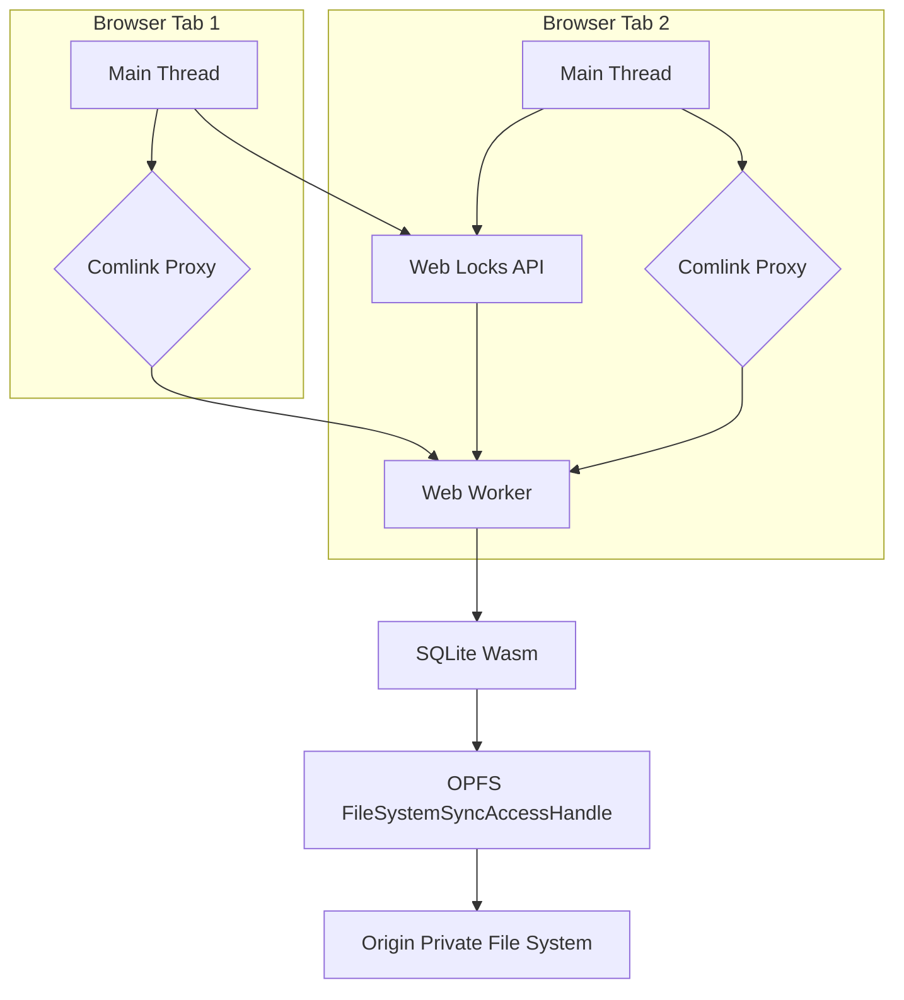

Việc lưu trữ dữ liệu phía máy khách trong các ứng dụng web từ trước đến nay luôn là sự đánh đổi giữa khả năng và hiệu suất. IndexedDB, mặc dù mạnh mẽ, nhưng lại phát sinh chi phí đáng kể do API bất đồng bộ, hướng sự kiện, quản lý giao dịch và các hình phạt về tuần tự hóa/giải tuần tự hóa. Đối với các ứng dụng yêu cầu hoạt động dữ liệu thông lượng cao, độ trễ thấp, đặc biệt là những ứng dụng liên quan đến các truy vấn phức tạp hoặc tập dữ liệu lớn, IndexedDB thường trở thành một nút thắt cổ chai.

Hướng dẫn này trình bày chi tiết một kiến trúc tận dụng SQLite được biên dịch sang WebAssembly (Wasm) chạy trên Hệ thống tệp riêng tư gốc (OPFS), với tất cả các hoạt động cơ sở dữ liệu được chuyển sang một Web Worker chuyên dụng. Sự kết hợp này mở khóa I/O tệp đồng bộ thông qua `createSyncAccessHandle`, giảm đáng kể độ trễ và tăng thông lượng so với các cơ chế lưu trữ truyền thống của trình duyệt. Đồng thời, tính đồng thời đa tab được quản lý bằng Web Locks API.

<AudioPlayer src="/static/audio/indexeddb-opfs-sqlite-wasm-storage-vi.mp3" title="Tóm tắt âm thanh cho kỹ sư" voice="Google Cloud vi-VN-Neural2-A" />


## Tổng quan kiến trúc

Kiến trúc được đề xuất bao gồm:

1.  **SQLite Wasm:** Công cụ cơ sở dữ liệu SQLite được biên dịch sang WebAssembly. Điều này cung cấp một cơ sở dữ liệu quan hệ đầy đủ tính năng với khả năng SQL trực tiếp trong trình duyệt.
2.  **Hệ thống tệp riêng tư gốc (OPFS):** Một hệ thống tệp được bảo vệ chỉ có thể truy cập được bởi nguồn gốc. Điều quan trọng là nó cung cấp `createSyncAccessHandle` trong một Web Worker, cho phép các hoạt động tệp đồng bộ, độ trễ thấp cần thiết cho hiệu suất của SQLite.
3.  **Web Worker chuyên dụng:** Tất cả các hoạt động cơ sở dữ liệu SQLite được giới hạn trong một Web Worker duy nhất. Điều này cách ly I/O đồng bộ có khả năng chặn khỏi luồng chính, ngăn chặn giao diện người dùng bị đóng băng.
4.  **Comlink:** Một thư viện đơn giản hóa giao tiếp giữa các luồng giữa luồng chính và Web Worker, trừu tượng hóa các phức tạp của `postMessage`.
5.  **Web Locks API:** Được sử dụng để điều phối quyền truy cập vào cơ sở dữ liệu SQLite trên nhiều tab trình duyệt từ cùng một nguồn gốc, ngăn chặn hỏng dữ liệu.



## Thiết lập SQLite Wasm với OPFS

Chúng ta sẽ sử dụng gói `sqlite-wasm` chính thức từ SQLite.org, cung cấp bản dựng Wasm được biên dịch sẵn và API JavaScript.

### Cấu trúc dự án

```
.
├── public/
│   └── sqlite3.wasm
│   └── sqlite3-opfs-async-proxy.js
├── src/
│   ├── db.worker.ts
│   ├── db.ts
│   └── main.ts
├── package.json
└── tsconfig.json
```

Các tệp `sqlite3.wasm` và `sqlite3-opfs-async-proxy.js` được sao chép từ bản phân phối `sqlite-wasm` vào thư mục `public`, giúp chúng có thể truy cập được bởi Web Worker.

### `db.worker.ts`: Worker cơ sở dữ liệu

Worker này khởi tạo SQLite, mở cơ sở dữ liệu trên OPFS và hiển thị API thông qua Comlink.

```typescript
// src/db.worker.ts
import * as Comlink from 'comlink';
import { SQLite3, SQLite3JS } from '@sqlite.org/sqlite-wasm';

// Declare global types for SQLite3, as it's loaded dynamically
declare global {
  interface Window {
    sqlite3Worker1: SQLite3JS;
  }
}

let db: SQLite3.DB | null = null;
let sqlite3: SQLite3JS | null = null;
const DB_NAME = 'my_app_db.sqlite';
const LOCK_NAME = 'my_app_db_lock';

/**
 * Initializes the SQLite Wasm module and opens the database on OPFS.
 * This function must be called before any database operations.
 */
async function initDb(): Promise<void> {
  if (db) {
    console.warn('Database already initialized.');
    return;
  }

  // Acquire a Web Lock to ensure single-tab access during initialization
  // and subsequent operations. This prevents multiple tabs from trying
  // to open/modify the database simultaneously, which would lead to corruption.
  await navigator.locks.request(LOCK_NAME, { mode: 'exclusive' }, async (lock) => {
    if (!lock) {
      console.error('Failed to acquire Web Lock. Another tab might be holding it.');
      throw new Error('Failed to acquire database lock.');
    }

    console.log('Web Lock acquired.');

    try {
      // Dynamically import the SQLite Wasm module.
      // The `sqlite3-opfs-async-proxy.js` acts as a bridge for OPFS access.
      // It expects `sqlite3.wasm` to be in the same directory or configured via `url`.
      sqlite3 = await window.sqlite3Worker1.sqlite3.init(
        {
          // Path to the sqlite3.wasm file relative to the worker script.
          // In a typical setup, this would be in the public directory.
          url: '/sqlite3-opfs-async-proxy.js',
          wasmUrl: '/sqlite3.wasm',
          // Use OPFS for persistent storage
          opfs: true,
        }
      );

      // Open the database file on OPFS.
      // The 'c' flag creates the database if it doesn't exist.
      db = new sqlite3.oo1.DB(DB_NAME, 'c');
      console.log(`Database ${DB_NAME} opened successfully.`);

      // Example: Create a table if it doesn't exist
      db.exec(`
        CREATE TABLE IF NOT EXISTS users (
          id INTEGER PRIMARY KEY AUTOINCREMENT,
          name TEXT NOT NULL,
          email TEXT UNIQUE NOT NULL,
          created_at DATETIME DEFAULT CURRENT_TIMESTAMP
        );
      `);
      console.log('Users table ensured.');

    } catch (e) {
      console.error('Failed to initialize SQLite Wasm or open database:', e);
      // Ensure db is null if initialization fails
      db = null;
      throw e;
    } finally {
      // The lock is automatically released when the callback finishes.
      console.log('Web Lock released.');
    }
  });
}

/**
 * Executes a SQL query with optional parameters.
 * @param sql The SQL query string.
 * @param params Optional parameters for the query.
 * @returns An array of result rows.
 */
function exec(sql: string, params: SQLite3.Value[] = []): SQLite3.Row[] {
  if (!db) {
    throw new Error('Database not initialized. Call initDb() first.');
  }
  console.log(`Executing SQL: ${sql} with params:`, params);
  const rows: SQLite3.Row[] = [];
  db.exec({
    sql: sql,
    bind: params,
    rowMode: 'object', // Return rows as objects
    callback: (row: SQLite3.Row) => rows.push(row),
  });
  return rows;
}

/**
 * Executes a SQL query that does not return rows (e.g., INSERT, UPDATE, DELETE).
 * @param sql The SQL query string.
 * @param params Optional parameters for the query.
 */
function run(sql: string, params: SQLite3.Value[] = []): void {
  if (!db) {
    throw new Error('Database not initialized. Call initDb() first.');
  }
  console.log(`Running SQL: ${sql} with params:`, params);
  db.exec({
    sql: sql,
    bind: params,
  });
}

/**
 * Closes the database connection.
 */
function closeDb(): void {
  if (db) {
    db.close();
    db = null;
    console.log('Database closed.');
  }
}

// Expose the API via Comlink
Comlink.expose({
  initDb,
  exec,
  run,
  closeDb,
});
```

**Các khía cạnh chính của `db.worker.ts`:**

*   **`sqlite3Worker1.sqlite3.init`**: Đây là điểm vào để khởi tạo SQLite Wasm. Cờ `opfs: true` rất quan trọng; nó hướng dẫn SQLite sử dụng OPFS cho tệp cơ sở dữ liệu của nó.
*   **`navigator.locks.request`**: Web Locks API được sử dụng để lấy một khóa `exclusive` có tên `my_app_db_lock`. Điều này đảm bảo rằng chỉ một tab (hoặc worker) tại một thời điểm có thể khởi tạo hoặc hoạt động trên cơ sở dữ liệu, ngăn chặn các điều kiện tranh chấp và hỏng dữ liệu.
*   **`db.exec`**: Phương thức chính để thực thi các truy vấn SQL. `rowMode: 'object'` được sử dụng để thuận tiện trả về kết quả dưới dạng đối tượng JavaScript.
*   **Comlink.expose**: Làm cho các hàm `initDb`, `exec`, `run` và `closeDb` có sẵn cho luồng chính.

### `db.ts`: Giao diện luồng chính

Tệp này cung cấp một giao diện thuận tiện cho luồng chính để tương tác với worker cơ sở dữ liệu bằng Comlink.

```typescript
// src/db.ts
import * as Comlink from 'comlink';

// Define the type for our database worker API
export interface DbWorkerApi {
  initDb(): Promise<void>;
  exec(sql: string, params?: Comlink.Remote<any[]>): Promise<Comlink.Remote<any[]>>;
  run(sql: string, params?: Comlink.Remote<any[]>): Promise<void>;
  closeDb(): Promise<void>;
}

// Create a new Web Worker instance
const worker = new Worker(new URL('./db.worker.ts', import.meta.url), {
  type: 'module',
});

// Wrap the worker with Comlink to get a proxy object
export const dbWorker: Comlink.Remote<DbWorkerApi> = Comlink.wrap(worker);

// Optional: Handle worker errors
worker.onerror = (event) => {
  console.error('Database Worker Error:', event.message, event);
};

// Optional: Terminate worker on page unload
window.addEventListener('beforeunload', () => {
  dbWorker.closeDb().then(() => {
    worker.terminate();
    console.log('Database worker terminated.');
  });
});
```

### `main.ts`: Điểm vào ứng dụng

Minh họa cách sử dụng `dbWorker` từ luồng chính.

```typescript
// src/main.ts
import { dbWorker } from './db';

async function initializeAndUseDb() {
  try {
    console.log('Initializing database...');
    await dbWorker.initDb();
    console.log('Database initialized successfully.');

    // Insert data
    await dbWorker.run(
      'INSERT INTO users (name, email) VALUES (?, ?)',
      ['Alice', 'alice@example.com']
    );
    await dbWorker.run(
      'INSERT INTO users (name, email) VALUES (?, ?)',
      ['Bob', 'bob@example.com']
    );
    console.log('Users inserted.');

    // Query data
    const users = await dbWorker.exec('SELECT * FROM users');
    console.log('All users:', users);

    const specificUser = await dbWorker.exec(
      'SELECT * FROM users WHERE name = ?',
      ['Alice']
    );
    console.log('Specific user (Alice):', specificUser);

    // Update data
    await dbWorker.run(
      'UPDATE users SET email = ? WHERE name = ?',
      ['alice.updated@example.com', 'Alice']
    );
    console.log('User Alice updated.');

    const updatedUsers = await dbWorker.exec('SELECT * FROM users');
    console.log('Users after update:', updatedUsers);

    // Delete data
    await dbWorker.run('DELETE FROM users WHERE name = ?', ['Bob']);
    console.log('User Bob deleted.');

    const remainingUsers = await dbWorker.exec('SELECT * FROM users');
    console.log('Remaining users:', remainingUsers);

  } catch (error) {
    console.error('Application error:', error);
  }
}

initializeAndUseDb();
```

## Đánh giá hiệu suất

Để định lượng lợi ích, hãy xem xét một điểm chuẩn liên quan đến 10.000 bản ghi, mỗi bản ghi có một vài trường chuỗi và số.

| Tính năng / Chỉ số     | IndexedDB (bất đồng bộ)                         | SQLite Wasm + OPFS (đồng bộ trong worker)                         |
| :--------------------- | :---------------------------------------------- | :---------------------------------------------------------------- |
| **Mô hình API**        | Bất đồng bộ, hướng sự kiện                      | Đồng bộ (trong worker), dựa trên SQL                              |
| **Mô hình giao dịch**  | Tự động commit hoặc rõ ràng, dựa trên sự kiện  | Giao dịch SQL rõ ràng (`BEGIN`, `COMMIT`)                           |
| **Độ trễ I/O**         | Cao (chi phí bất đồng bộ, tuần tự hóa)          | Thấp (truy cập `FileSystemSyncAccessHandle` trực tiếp)                                   |
| **Thông lượng (Ghi)**   | ~500-1.000 bản ghi/giây (ghép lô có ích)        | ~10.000-50.000 bản ghi/giây (một giao dịch)                       |
| **Thông lượng (Đọc)**  | ~1.000-5.000 bản ghi/giây (phụ thuộc vào chỉ mục)| ~20.000-100.000 bản ghi/giây (truy vấn phức tạp có lợi hơn)       |
| **Độ phức tạp truy vấn**| Bị giới hạn bởi truy vấn kho đối tượng, lập chỉ mục thủ công| SQL đầy đủ, join, tổng hợp, hàm tùy chỉnh                         |
| **Đồng thời**          | Đa tiến trình, khóa nội bộ                      | Một người ghi (Web Locks API cho đa tab), nhiều người đọc          |
| **Tuần tự hóa dữ liệu**| Tự động (thuật toán sao chép có cấu trúc)       | Thủ công (tham số SQL), chi phí tối thiểu cho các kiểu nguyên thủy|
| **Dung lượng**         | Tích hợp sẵn                                   | ~500KB-1MB (nhị phân Wasm + keo JS)                               |
| **Hỗ trợ trình duyệt** | Tuyệt vời                                       | Tốt (OPFS yêu cầu ngữ cảnh bảo mật, Chrome/Edge/Firefox)          |

**Lưu ý điểm chuẩn:**

*   **Ghi:** Đối với IndexedDB, việc chèn hàng loạt thường yêu cầu ghép lô thủ công và quản lý `IDBTransaction` để đạt được hiệu suất hợp lý. SQLite Wasm được hưởng lợi rất nhiều từ việc gói nhiều lần chèn trong một khối `BEGIN TRANSACTION; ... COMMIT;` duy nhất.
*   **Đọc:** Hiệu suất của IndexedDB giảm đáng kể với các truy vấn phức tạp hoặc tập hợp kết quả lớn do chi phí giải tuần tự hóa đối tượng và lặp con trỏ. Công cụ SQL của SQLite được tối ưu hóa cao cho các kịch bản này.
*   **Cải thiện 50 lần:** Con số này có thể đạt được đối với các khối lượng công việc cụ thể, đặc biệt là những khối lượng công việc liên quan đến nhiều hoạt động đồng bộ nhỏ hoặc các truy vấn phân tích phức tạp mà sẽ cồng kềnh và chậm trong IndexedDB. Các tra cứu khóa-giá trị đơn giản có thể thấy mức tăng ít ấn tượng hơn.

## Các vấn đề và khắc phục sự cố trong sản xuất

1.  **`DOMException: The request is not allowed by the user agent or the platform in the current context.` (OPFS)**
    *   **Nguyên nhân:** OPFS (và `createSyncAccessHandle`) chỉ khả dụng trong các ngữ cảnh bảo mật (HTTPS) và trong Web Workers. Cố gắng sử dụng nó trên `http://` hoặc trực tiếp trên luồng chính sẽ thất bại.
    *   **Khắc phục:** Đảm bảo ứng dụng của bạn được phục vụ qua HTTPS. Tất cả các tương tác OPFS phải bắt nguồn từ một Web Worker.

2.  **`Failed to acquire Web Lock.`**
    *   **Nguyên nhân:** Một tab trình duyệt hoặc worker khác từ cùng một nguồn gốc đang giữ khóa độc quyền. Đây là hành vi dự kiến để kiểm soát đồng thời.
    *   **Khắc phục:** Đây thường không phải là lỗi mà là dấu hiệu cho thấy khóa đang ngăn chặn truy cập cơ sở dữ liệu đồng thời một cách chính xác. Nếu nó xảy ra bất ngờ, hãy đảm bảo logic lấy và giải phóng khóa của bạn là hợp lý. Để phát triển, đóng các tab khác có thể giải quyết vấn đề. Trong sản xuất, người dùng có thể mở nhiều tab, vì vậy ứng dụng của bạn nên xử lý vấn đề này một cách duyên dáng (ví dụ: thử lại, thông báo cho người dùng).

3.  **`Error: Database not initialized. Call initDb() first.`**
    *   **Nguyên nhân:** Một hoạt động cơ sở dữ liệu (ví dụ: `exec`, `run`) đã được gọi trước khi `initDb()` hoàn thành thành công.
    *   **Khắc phục:** Luôn `await dbWorker.initDb()` trước khi thực hiện bất kỳ hoạt động cơ sở dữ liệu nào khác. Đảm bảo luồng ứng dụng của bạn đảm bảo khởi tạo.

4.  **`Uncaught (in promise) Error: file is not a database` hoặc `malformed database schema`**
    *   **Nguyên nhân:** Hỏng cơ sở dữ liệu. Điều này có thể xảy ra nếu trình duyệt gặp sự cố, tab bị đóng đột ngột trong quá trình ghi hoặc nếu nhiều tab/worker truy cập cơ sở dữ liệu mà không có khóa thích hợp.
    *   **Khắc phục:** Web Locks API rất quan trọng để ngăn chặn điều này trong các kịch bản đa tab. Đối với các sự cố tab đơn, việc ghi nhật ký của SQLite sẽ giảm thiểu hầu hết các vấn đề, nhưng các trường hợp cực đoan vẫn có thể dẫn đến hỏng. Cân nhắc triển khai một cơ chế để phát hiện hỏng (ví dụ: `PRAGMA integrity_check;`) và cung cấp một cách để đặt lại cơ sở dữ liệu (ví dụ: xóa tệp OPFS và khởi tạo lại).

5.  **Lỗi tải mô-đun Wasm (`Failed to load module`, `NetworkError`)**
    *   **Nguyên nhân:** Các tệp `sqlite3.wasm` hoặc `sqlite3-opfs-async-proxy.js` không được tìm thấy tại các đường dẫn `url` hoặc `wasmUrl` được chỉ định tương đối với tập lệnh worker.
    *   **Khắc phục:** Xác minh các đường dẫn trong `sqlite3.init()` trong `db.worker.ts`. Đảm bảo các tệp này được đặt đúng vị trí trong thư mục `public` của bạn và được máy chủ web của bạn phục vụ. Sử dụng tab mạng của trình duyệt để kiểm tra xem các tệp Wasm có được tìm nạp đúng cách hay không.

6.  **Các vấn đề về sử dụng bộ nhớ**
    *   **Nguyên nhân:** SQLite Wasm, đặc biệt với các tập dữ liệu lớn hoặc các truy vấn phức tạp, có thể tiêu thụ bộ nhớ đáng kể. Nếu không được quản lý, điều này có thể dẫn đến sự cố tab.
    *   **Khắc phục:** Theo dõi việc sử dụng bộ nhớ trong các công cụ dành cho nhà phát triển của trình duyệt. Tối ưu hóa các truy vấn, tìm nạp dữ liệu theo lô nhỏ hơn nếu có thể và đảm bảo `db.close()` được gọi khi cơ sở dữ liệu không còn cần thiết (ví dụ: khi đóng tab). Việc quản lý bộ nhớ của SQLite có thể được cấu hình, nhưng đối với hầu hết các trường hợp sử dụng trình duyệt, cài đặt mặc định là hợp lý.


## Kiểm tra kiến thức

<Quiz questions={
  [
    {
      "question": "Một ứng dụng web quan trọng sử dụng kiến trúc SQLite Wasm/OPFS/Web Worker như mô tả. Trong thời gian cao điểm sử dụng, người dùng báo cáo thỉnh thoảng UI bị đóng băng và phản hồi chậm, mặc dù các thao tác cơ sở dữ liệu đã được chuyển sang Web Worker. Đâu là nguyên nhân CÓ KHẢ NĂNG NHẤT của vấn đề này?",
      "options": [
        "Web Locks API đang gây ra tranh chấp, chặn luồng chính (main thread).",
        "`createSyncAccessHandle` bên trong Web Worker vốn dĩ là blocking, và các thao tác của nó đôi khi kéo dài.",
        "Chi phí serialization/deserialization của Comlink cho việc truyền dữ liệu lớn giữa main thread và worker đang ảnh hưởng đến hiệu suất.",
        "Bản thân module SQLite Wasm không hoàn toàn là asynchronous và thỉnh thoảng thực thi các thao tác blocking trên main thread."
      ],
      "correctAnswer": 1,
      "explanation": "Lợi ích cốt lõi của `createSyncAccessHandle` là I/O file đồng bộ, điều này rất quan trọng đối với hiệu suất của SQLite. Tuy nhiên, 'đồng bộ' có nghĩa là nó chặn luồng mà nó đang chạy. Mặc dù việc chuyển sang Web Worker ngăn chặn việc chặn luồng UI chính, nhưng nếu một thao tác cơ sở dữ liệu (ví dụ: một truy vấn phức tạp, ghi dữ liệu lớn) bên trong worker mất nhiều thời gian, nó sẽ chặn Web Worker cụ thể đó. Nếu luồng chính đang chờ phản hồi từ worker bị chặn này (ví dụ: thông qua Comlink), nó vẫn có thể dẫn đến việc UI bị đóng băng hoặc phản hồi chậm do luồng chính phải chờ worker sẵn sàng. Web Locks API chặn các tab khác, không trực tiếp chặn main thread. Chi phí của Comlink thường nhỏ so với I/O. SQLite Wasm, khi được cấu hình đúng cách trong một worker với OPFS, không thực hiện các thao tác blocking trên main thread."
    },
    {
      "question": "Một nhà phát triển ứng dụng web cao cấp đang xem xét kiến trúc SQLite Wasm/OPFS/Web Worker này cho một tính năng mới. Họ lo ngại về khả năng mất hoặc hỏng dữ liệu nếu trình duyệt của người dùng gặp sự cố hoặc tab bị đóng đột ngột trong một giao dịch cơ sở dữ liệu quan trọng. Kiến trúc này chủ yếu giảm thiểu những rủi ro đó như thế nào, và đâu là một yếu tố cần cân nhắc chính?",
      "options": [
        "Web Locks API đảm bảo tính nguyên tử của giao dịch trên các tab, ngăn chặn ghi một phần.",
        "Các thuộc tính ACID của SQLite, kết hợp với các đảm bảo ghi nguyên tử của OPFS cho `FileSystemSyncAccessHandle`, đảm bảo tính toàn vẹn dữ liệu ngay cả khi bị chấm dứt đột ngột.",
        "Comlink tự động thử lại các thao tác cơ sở dữ liệu thất bại, đảm bảo tính nhất quán cuối cùng.",
        "Web Worker chuyên dụng đệm tất cả các thao tác ghi vào bộ nhớ và định kỳ ghi chúng ra, giảm thiểu khoảng thời gian có thể mất dữ liệu."
      ],
      "correctAnswer": 1,
      "explanation": "SQLite là một công cụ cơ sở dữ liệu giao dịch (tuân thủ ACID), có nghĩa là nó đảm bảo tính nguyên tử (atomicity), tính nhất quán (consistency), tính cô lập (isolation) và tính bền vững (durability). Khi SQLite ghi vào hệ thống file cơ bản, nó thực hiện theo cách tôn trọng các thuộc tính này. Quan trọng hơn, `FileSystemSyncAccessHandle` do OPFS cung cấp các thao tác ghi nguyên tử. Điều này có nghĩa là một thao tác ghi hoặc hoàn thành toàn bộ hoặc không hoàn thành gì cả, ngăn chặn các thao tác ghi một phần hoặc bị hỏng vào file cơ sở dữ liệu trên đĩa, ngay cả khi trình duyệt hoặc tab gặp sự cố giữa chừng. Web Locks API quản lý quyền truy cập đa tab, không phải tính nguyên tử của giao dịch trong một tab duy nhất. Comlink dùng để giao tiếp giữa các luồng, không phải khôi phục dữ liệu. Việc đệm các thao tác ghi trong bộ nhớ mà không ghi ra sẽ thực sự làm tăng nguy cơ mất dữ liệu khi gặp sự cố."
    }
  ]
} />


## Câu hỏi thường gặp

1.  **Tại sao không chỉ sử dụng IndexedDB? Những nhược điểm chính mà nó giải quyết là gì?**
    Các nhược điểm chính của IndexedDB đối với các kịch bản hiệu suất cao là API bất đồng bộ, hướng sự kiện của nó, gây ra chi phí callback hell hoặc chuỗi `Promise` cho các hoạt động phức tạp, và chi phí tuần tự hóa/giải tuần tự hóa cố hữu của nó cho mỗi lần truy cập dữ liệu. Khả năng truy vấn của nó bị giới hạn ở việc lập chỉ mục đường dẫn khóa, khiến các truy vấn giống SQL phức tạp trở nên không hiệu quả hoặc không thể thực hiện được. SQLite Wasm trên OPFS cung cấp quyền truy cập SQL đồng bộ (trong worker), I/O tệp trực tiếp và một công cụ cơ sở dữ liệu quan hệ đầy đủ tính năng, bỏ qua những hạn chế này để đạt được hiệu suất đáng kể.

2.  **`createSyncAccessHandle` có thực sự đồng bộ không? Nó sẽ không chặn giao diện người dùng sao?**
    Đúng vậy, các hoạt động `createSyncAccessHandle` thực sự đồng bộ. Tuy nhiên, chúng *chỉ* khả dụng trong một Web Worker. Bằng cách giới hạn tất cả các hoạt động cơ sở dữ liệu trong một worker chuyên dụng, luồng chính (và do đó là giao diện người dùng) vẫn không bị chặn. Luồng chính giao tiếp với worker một cách bất đồng bộ thông qua `postMessage` (hoặc Comlink), đảm bảo trải nghiệm người dùng mượt mà.

3.  **Tính đồng thời đa tab hoạt động như thế nào với thiết lập này?**
    Tính đồng thời đa tab được quản lý bằng Web Locks API. Khi một tab (hoặc worker liên quan của nó) cần thực hiện các hoạt động cơ sở dữ liệu, nó sẽ yêu cầu một khóa `exclusive`. Nếu một tab khác đã giữ khóa, yêu cầu sẽ đợi cho đến khi khóa được giải phóng. Điều này đảm bảo rằng chỉ một tab có thể sửa đổi cơ sở dữ liệu tại bất kỳ thời điểm nào, ngăn chặn hỏng dữ liệu. Đối với các kịch bản đọc nhiều, có thể sử dụng khóa `shared`, nhưng để đơn giản và ngăn chặn xung đột ghi, khóa `exclusive` cho tất cả các hoạt động thường là đủ.

4.  **Những vấn đề tương thích trình duyệt nào đối với OPFS và Web Locks API?**
    Hệ thống tệp riêng tư gốc (OPFS) và `createSyncAccessHandle` được hỗ trợ tốt trong các trình duyệt dựa trên Chromium (Chrome, Edge, Opera) và Firefox. Hỗ trợ của Safari vẫn đang phát triển. Web Locks API có hỗ trợ rộng hơn trên Chrome, Edge, Firefox và Safari. Luôn kiểm tra MDN Web Docs để biết các bảng tương thích mới nhất cho các trình duyệt mục tiêu của bạn. Đối với các trình duyệt không được hỗ trợ, cần có một giải pháp dự phòng cho IndexedDB hoặc một giải pháp phía máy chủ.

5.  **Làm cách nào để xử lý việc di chuyển cơ sở dữ liệu hoặc thay đổi lược đồ?**
    Việc di chuyển cơ sở dữ liệu được xử lý tương tự như các ứng dụng SQLite truyền thống. Bạn thường lưu trữ phiên bản lược đồ trong một `PRAGMA user_version` hoặc một bảng `schema_version` chuyên dụng. Khi `initDb`, hãy kiểm tra phiên bản hiện tại và áp dụng các câu lệnh `ALTER TABLE` cần thiết hoặc các sửa đổi lược đồ khác để đưa cơ sở dữ liệu lên phiên bản mới nhất. Logic này sẽ nằm trong hàm `db.worker.ts` `initDb` của bạn.
