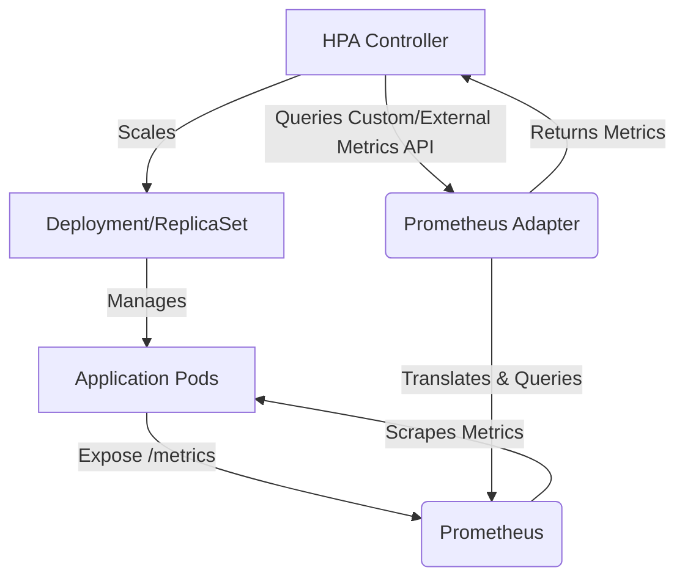

Kubernetes Horizontal Pod Autoscaler (HPA) is a fundamental component for managing application elasticity. While scaling based on CPU and memory utilization is a common starting point, it often fails to capture the true load and performance characteristics of modern applications. Effective autoscaling requires metrics directly correlated with application demand, such as HTTP request rates, message queue depth, or active user sessions.

This article provides a pragmatic, code-rich guide to configuring Kubernetes HPA v2 with custom and external metrics using the Prometheus Adapter. We will demonstrate how to scale deployments based on real-world application metrics, moving beyond generic resource utilization.

<AudioPlayer src="/static/audio/kubernetes-hpa-custom-metrics-guide.mp3" title="Executive Audio Briefing" />


## Understanding Kubernetes HPA and Metrics

The Horizontal Pod Autoscaler automatically scales the number of pods in a deployment, stateful set, or replica set based on observed metrics.

### HPA v1 vs. HPA v2

- **HPA v1:** Limited to scaling based on CPU utilization only.
- **HPA v2:** Introduced support for multiple metrics, including resource metrics (CPU, memory), custom metrics, and external metrics. This significantly enhances HPA's flexibility and applicability to diverse workloads.

### Metric Types for Autoscaling

1.  **Resource Metrics:**
    *   **Description:** CPU and memory utilization reported by pods. These are collected by the Kubernetes Metrics Server.
    *   **Use Case:** General-purpose scaling for applications where CPU/memory directly correlates with load.
    *   **Limitation:** Often an indirect indicator of actual application demand. A CPU-bound application might scale well, but an I/O-bound or latency-sensitive application might not.

2.  **Custom Metrics:**
    *   **Description:** Application-specific metrics exposed by pods, typically via a `/metrics` endpoint in Prometheus format. These metrics are directly associated with a Kubernetes object (e.g., a Deployment, Service, or Pod).
    *   **Use Case:** Scaling based on application-level indicators like HTTP request rate, active connections, or internal queue sizes.
    *   **Example:** `http_requests_total` per pod.

3.  **External Metrics:**
    *   **Description:** Metrics originating from external systems not directly tied to a specific Kubernetes object. These metrics are often global or represent a shared resource.
    *   **Use Case:** Scaling based on external queue depth (e.g., SQS, Kafka topic lag), database connection pool utilization, or external API call rates.
    *   **Example:** Total messages in an SQS queue, independent of any single pod.

### How HPA Works

The HPA controller continuously queries the Kubernetes Metrics API (for resource metrics) or the Custom/External Metrics APIs (for custom/external metrics). Based on the configured target values and current metric observations, it calculates the desired number of replicas and updates the target workload (Deployment, ReplicaSet, etc.).

The formula for desired replicas is generally:

`desiredReplicas = ceil[currentReplicas * (currentMetricValue / targetMetricValue)]`

## Architecture Overview: Prometheus Adapter for Custom Metrics

To enable HPA to consume custom and external metrics from Prometheus, the Kubernetes ecosystem provides the Prometheus Adapter.

The flow is as follows:

1.  **Application:** Your application exposes metrics in Prometheus format (e.g., `http_requests_total`, `queue_messages_total`) via an HTTP endpoint (`/metrics`).
2.  **Prometheus:** A Prometheus instance scrapes these metrics from your application pods using ServiceMonitors or PodMonitors.
3.  **Prometheus Adapter:**
    *   Deploys as an API server within your Kubernetes cluster.
    *   Implements the `custom.metrics.k8s.io` and `external.metrics.k8s.io` APIs.
    *   Translates requests from the HPA controller into Prometheus queries based on predefined rules.
    *   Executes these queries against the Prometheus instance.
    *   Returns the query results to the HPA controller in the expected API format.
4.  **HPA Controller:** Queries the Custom/External Metrics APIs exposed by the Prometheus Adapter and adjusts the replica count of your application deployment.



## Setting Up the Environment

This section assumes you have a functional Kubernetes cluster and `kubectl` configured.

### 1. Install Prometheus Stack

We will use the `kube-prometheus-stack` Helm chart, which includes Prometheus, Grafana, and the Prometheus Operator.

```bash
# Add the Prometheus community Helm repository
helm repo add prometheus-community https://prometheus-community.github.io/helm-charts
helm repo update

# Create a namespace for monitoring components
kubectl create namespace monitoring

# Install kube-prometheus-stack
helm install prometheus prometheus-community/kube-prometheus-stack \
  --namespace monitoring \
  --set prometheus.prometheusSpec.serviceMonitorSelectorNilUsesHelmValues=false \
  --set prometheus.prometheusSpec.podMonitorSelectorNilUsesHelmValues=false
```

The `serviceMonitorSelectorNilUsesHelmValues` and `podMonitorSelectorNilUsesHelmValues` flags are crucial. They ensure that Prometheus automatically discovers ServiceMonitors and PodMonitors deployed in the same namespace as Prometheus, or those explicitly labeled to be discovered.

### 2. Install Prometheus Adapter

The Prometheus Adapter is installed via its dedicated Helm chart. The critical part is configuring its `config.yaml` to define how Prometheus metrics map to Kubernetes custom and external metrics.

```bash
# Add the Prometheus Adapter Helm repository
helm repo add k8s-at-home https://k8s-at-home.com/charts/
helm repo update

# Install Prometheus Adapter with custom rules
# We'll define the rules in a values.yaml file
```

Create a `prometheus-adapter-values.yaml` file:

```yaml
# prometheus-adapter-values.yaml
prometheus:
  url: http://prometheus-kube-prometheus-stack-prometheus.monitoring.svc
  port: 9090

# Configuration for custom and external metrics rules
config: |
  rules:
  - seriesQuery: '{__name__=~"^http_requests_total$"}'
    resources:
      overrides:
        kubernetes_namespace: {resource: "namespace"}
        kubernetes_pod_name: {resource: "pod"}
    name:
      matches: "^(.*)_total$"
      as: "${1}_per_second"
    metricsQuery: sum(rate(<<.Series>>{<<.LabelMatchers>>}[5m])) by (<<.GroupBy>>)`

  - seriesQuery: '{__name__="queue_messages_total",kubernetes_namespace!="",kubernetes_pod_name!=""}'
    resources:
      overrides:
        kubernetes_namespace: {resource: "namespace"}
        kubernetes_pod_name: {resource: "pod"}
    name:
      matches: "^(.*)_total$"
      as: "${1}_depth"
    metricsQuery: sum(<<.Series>>{<<.LabelMatchers>>}) by (<<.GroupBy>>)`

  # External metrics example for a global queue depth
  - seriesQuery: '{__name__="external_queue_messages_total",queue_name!=""}'
    name:
      matches: "^external_(.*)_total$"
      as: "${1}_depth_external"
    metricsQuery: sum(<<.Series>>{<<.LabelMatchers>>}) by (queue_name)`
    external: true
```

Now, install the Prometheus Adapter using this values file:

```bash
helm install prometheus-adapter k8s-at-home/prometheus-adapter \
  --namespace monitoring \
  -f prometheus-adapter-values.yaml
```

**Explanation of `config.yaml` rules:**

*   **`seriesQuery`**: A Prometheus label selector that identifies the metrics series to be processed by this rule.
*   **`resources.overrides`**: Maps Prometheus labels (e.g., `kubernetes_namespace`, `kubernetes_pod_name`) to Kubernetes resource names, allowing HPA to target specific objects.
*   **`name.matches` / `name.as`**: Defines how the Prometheus metric name is transformed into the Kubernetes custom metric name. For `http_requests_total`, it becomes `http_requests_per_second`. For `queue_messages_total`, it becomes `queue_messages_depth`.
*   **`metricsQuery`**: The actual PromQL query executed by the adapter.
    *   `sum(rate(<<.Series>>{<<.LabelMatchers>>}[5m])) by (<<.GroupBy>>)`: Calculates the 5-minute average rate of `http_requests_total` (a counter) per pod. `<<.Series>>`, `<<.LabelMatchers>>`, and `<<.GroupBy>>` are templated variables replaced by the adapter based on the HPA request.
    *   `sum(<<.Series>>{<<.LabelMatchers>>}) by (<<.GroupBy>>)`: Calculates the sum of `queue_messages_total` (a gauge) per pod.
    *   For external metrics, `external

## Test Your Knowledge

<Quiz questions={
  [
    {
      "question": "A critical microservice processes real-time financial transactions. Its CPU utilization is consistently low, but latency spikes occur during peak transaction volumes due to database connection pool exhaustion. Which HPA metric type would be most effective for autoscaling this service to prevent latency issues, and why?",
      "options": [
        "Resource Metrics (CPU/Memory) because they are the simplest to configure and directly reflect pod load.",
        "Custom Metrics, specifically tracking the number of active database connections per pod, because it directly correlates with the bottleneck.",
        "External Metrics, monitoring the total database connection pool utilization across the entire cluster, as it's a shared resource.",
        "A combination of Resource Metrics and Custom Metrics, prioritizing CPU for general scaling and active connections for specific bottlenecks."
      ],
      "correctAnswer": 1,
      "explanation": "While CPU/Memory (Resource Metrics) are a starting point, they don't capture the specific bottleneck of database connection pool exhaustion. External Metrics for total pool utilization might be useful, but scaling based on 'active database connections per pod' (Custom Metric) directly addresses the per-pod resource constraint causing latency. This allows the HPA to proactively scale out pods when individual pods are nearing their connection limits, before the entire pool is exhausted or latency spikes. Option 3 is less precise for per-service scaling, and Option 4, while seemingly comprehensive, still relies on CPU which is not the primary bottleneck here."
    },
    {
      "question": "You are designing an autoscaling strategy for a Kafka consumer application. The application's primary bottleneck is the lag behind the latest message in a specific Kafka topic. Which HPA metric type and approach would be most appropriate for this scenario, considering the need for responsive scaling?",
      "options": [
        "Custom Metrics, by having each consumer pod expose its individual Kafka consumer lag as a Prometheus metric.",
        "Resource Metrics (CPU utilization), as increased lag will eventually lead to higher CPU usage in an attempt to catch up.",
        "External Metrics, by configuring the HPA to directly query the Kafka broker for the topic's overall consumer group lag.",
        "A fixed number of replicas, as Kafka consumer groups handle scaling internally and HPA would interfere."
      ],
      "correctAnswer": 2,
      "explanation": "Kafka consumer lag is a classic example of an 'External Metric'. The lag is a property of the Kafka topic and consumer group, not directly tied to a single Kubernetes pod's internal state. While individual pods might expose their own lag (Custom Metric), the overall consumer group lag is a more robust and holistic indicator for scaling the entire consumer group. Relying on CPU (Resource Metrics) is an indirect and often delayed indicator. A fixed number of replicas (Option 4) negates the benefits of autoscaling and is not suitable for variable loads."
    }
  ]
} />

