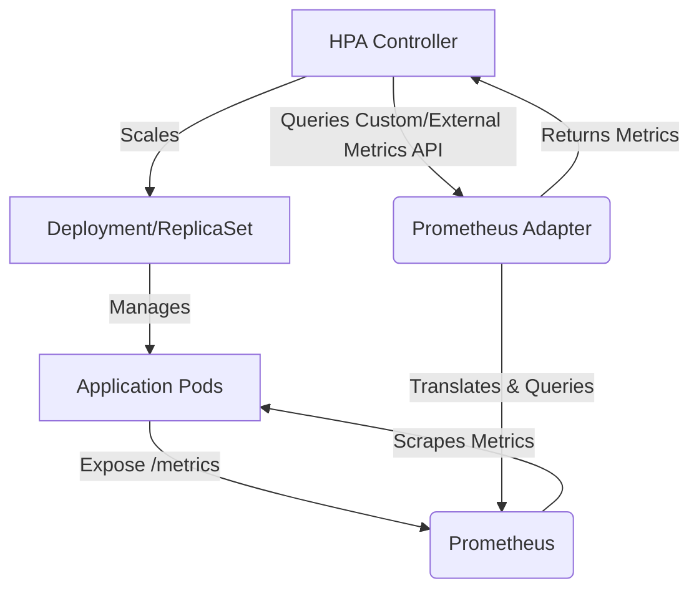

Kubernetes Horizontal Pod Autoscaler (HPA) は、アプリケーションの伸縮性を管理するための基本的なコンポーネントです。CPU やメモリ使用率に基づいてスケーリングを開始するのが一般的ですが、多くの場合、最新のアプリケーションの真の負荷とパフォーマンス特性を捉えることはできません。効果的なオートスケーリングには、HTTP リクエストレート、メッセージキューの深さ、アクティブなユーザーセッションなど、アプリケーションの需要に直接関連するメトリクスが必要です。

この記事では、Prometheus Adapter を使用してカスタムメトリクスと外部メトリクスで Kubernetes HPA v2 を構成するための、実践的でコード豊富なガイドを提供します。一般的なリソース使用率を超えて、実際のアプリケーションメトリクスに基づいてデプロイメントをスケーリングする方法をデモンストレーションします。

<AudioPlayer src="/static/audio/kubernetes-hpa-custom-metrics-guide-ja.mp3" title="音声エグゼクティブ・ブリーフィング" voice="Google Cloud ja-JP-Neural2-B" />


## Kubernetes HPA とメトリクスの理解

Horizontal Pod Autoscaler は、観測されたメトリクスに基づいて、デプロイメント、ステートフルセット、またはレプリカセット内の Pod の数を自動的にスケーリングします。

### HPA v1 と HPA v2 の比較

- **HPA v1:** CPU 使用率に基づくスケーリングのみに限定されていました。
- **HPA v2:** リソースメトリクス（CPU、メモリ）、カスタムメトリクス、外部メトリクスを含む複数のメトリクスをサポートするようになりました。これにより、HPA の柔軟性と多様なワークロードへの適用性が大幅に向上しました。

### オートスケーリングのメトリクスタイプ

1.  **リソースメトリクス:**
    *   **説明:** Pod によって報告される CPU およびメモリ使用率。これらは Kubernetes Metrics Server によって収集されます。
    *   **ユースケース:** CPU/メモリが負荷と直接相関するアプリケーションの汎用スケーリング。
    *   **制限:** 実際のアプリケーション需要の間接的な指標であることが多いです。CPU バウンドなアプリケーションはうまくスケーリングできるかもしれませんが、I/O バウンドまたはレイテンシに敏感なアプリケーションはそうではないかもしれません。

2.  **カスタムメトリクス:**
    *   **説明:** Pod によって公開されるアプリケーション固有のメトリクス。通常、Prometheus 形式の `/metrics` エンドポイントを介して公開されます。これらのメトリクスは、Kubernetes オブジェクト（例：Deployment、Service、Pod）に直接関連付けられています。
    *   **ユースケース:** HTTP リクエストレート、アクティブな接続、内部キューサイズなどのアプリケーションレベルの指標に基づくスケーリング。
    *   **例:** Pod あたりの `http_requests_total`。

3.  **外部メトリクス:**
    *   **説明:** 特定の Kubernetes オブジェクトに直接関連付けられていない外部システムから発生するメトリクス。これらのメトリクスは、グローバルであるか、共有リソースを表すことが多いです。
    *   **ユースケース:** 外部キューの深さ（例：SQS、Kafka トピックラグ）、データベース接続プールの使用率、外部 API 呼び出しレートに基づくスケーリング。
    *   **例:** 単一の Pod に依存しない、SQS キュー内の合計メッセージ数。

### HPA の仕組み

HPA コントローラーは、Kubernetes Metrics API（リソースメトリクスの場合）または Custom/External Metrics API（カスタム/外部メトリクスの場合）を継続的にクエリします。構成されたターゲット値と現在のメトリクス観測に基づいて、必要なレプリカ数を計算し、ターゲットワークロード（Deployment、ReplicaSet など）を更新します。

必要なレプリカの計算式は一般的に次のとおりです。

`desiredReplicas = ceil[currentReplicas * (currentMetricValue / targetMetricValue)]`

## アーキテクチャ概要: カスタムメトリクス用 Prometheus Adapter

HPA が Prometheus からカスタムメトリクスと外部メトリクスを消費できるようにするために、Kubernetes エコシステムは Prometheus Adapter を提供しています。

フローは次のとおりです。

1.  **アプリケーション:** アプリケーションは、HTTP エンドポイント（`/metrics`）を介して Prometheus 形式（例：`http_requests_total`、`queue_messages_total`）でメトリクスを公開します。
2.  **Prometheus:** Prometheus インスタンスは、ServiceMonitor または PodMonitor を使用して、アプリケーション Pod からこれらのメトリクスをスクレイピングします。
3.  **Prometheus Adapter:**
    *   Kubernetes クラスター内に API サーバーとしてデプロイされます。
    *   `custom.metrics.k8s.io` および `external.metrics.k8s.io` API を実装します。
    *   HPA コントローラーからのリクエストを、事前定義されたルールに基づいて Prometheus クエリに変換します。
    *   これらのクエリを Prometheus インスタンスに対して実行します。
    *   クエリ結果を期待される API 形式で HPA コントローラーに返します。
4.  **HPA コントローラー:** Prometheus Adapter によって公開される Custom/External Metrics API をクエリし、アプリケーションデプロイメントのレプリカ数を調整します。



## 環境設定

このセクションでは、機能する Kubernetes クラスターと `kubectl` が構成されていることを前提としています。

### 1. Prometheus Stack のインストール

Prometheus、Grafana、および Prometheus Operator を含む `kube-prometheus-stack` Helm チャートを使用します。

```bash
# Add the Prometheus community Helm repository
helm repo add prometheus-community https://prometheus-community.github.io/helm-charts
helm repo update

# Create a namespace for monitoring components
kubectl create namespace monitoring

# Install kube-prometheus-stack
helm install prometheus prometheus-community/kube-prometheus-stack \
  --namespace monitoring \
  --set prometheus.prometheusSpec.serviceMonitorSelectorNilUsesHelmValues=false \
  --set prometheus.prometheusSpec.podMonitorSelectorNilUsesHelmValues=false
```

`serviceMonitorSelectorNilUsesHelmValues` と `podMonitorSelectorNilUsesHelmValues` フラグは非常に重要です。これらは、Prometheus が Prometheus と同じ名前空間にデプロイされた ServiceMonitor と PodMonitor、または明示的に検出されるようにラベル付けされた ServiceMonitor と PodMonitor を自動的に検出することを保証します。

### 2. Prometheus Adapter のインストール

Prometheus Adapter は、専用の Helm チャートを介してインストールされます。重要な部分は、Prometheus メトリクスを Kubernetes のカスタムメトリクスと外部メトリクスにマッピングする方法を定義する `config.yaml` を構成することです。

```bash
# Add the Prometheus Adapter Helm repository
helm repo add k8s-at-home https://k8s-at-home.com/charts/
helm repo update

# Install Prometheus Adapter with custom rules
# We'll define the rules in a values.yaml file
```

`prometheus-adapter-values.yaml` ファイルを作成します。

```yaml
# prometheus-adapter-values.yaml
prometheus:
  url: http://prometheus-kube-prometheus-stack-prometheus.monitoring.svc
  port: 9090

# Configuration for custom and external metrics rules
config: |
  rules:
  - seriesQuery: '{__name__=~"^http_requests_total$"}'
    resources:
      overrides:
        kubernetes_namespace: {resource: "namespace"}
        kubernetes_pod_name: {resource: "pod"}
    name:
      matches: "^(.*)_total$"
      as: "${1}_per_second"
    metricsQuery: sum(rate(<<.Series>>{<<.LabelMatchers>>}[5m])) by (<<.GroupBy>>)`

  - seriesQuery: '{__name__="queue_messages_total",kubernetes_namespace!="",kubernetes_pod_name!=""}'
    resources:
      overrides:
        kubernetes_namespace: {resource: "namespace"}
        kubernetes_pod_name: {resource: "pod"}
    name:
      matches: "^(.*)_total$"
      as: "${1}_depth"
    metricsQuery: sum(<<.Series>>{<<.LabelMatchers>>}) by (<<.GroupBy>>)`

  # External metrics example for a global queue depth
  - seriesQuery: '{__name__="external_queue_messages_total",queue_name!=""}'
    name:
      matches: "^external_(.*)_total$"
      as: "${1}_depth_external"
    metricsQuery: sum(<<.Series>>{<<.LabelMatchers>>}) by (queue_name)`
    external: true
```

次に、この values ファイルを使用して Prometheus Adapter をインストールします。

```bash
helm install prometheus-adapter k8s-at-home/prometheus-adapter \
  --namespace monitoring \
  -f prometheus-adapter-values.yaml
```

**`config.yaml` ルールの説明:**

*   **`seriesQuery`**: このルールによって処理されるメトリクスシリーズを識別する Prometheus ラベルセレクター。
*   **`resources.overrides`**: Prometheus ラベル（例：`kubernetes_namespace`、`kubernetes_pod_name`）を Kubernetes リソース名にマッピングし、HPA が特定のオブジェクトをターゲットにできるようにします。
*   **`name.matches` / `name.as`**: Prometheus メトリクス名が Kubernetes カスタムメトリクス名に変換される方法を定義します。`http_requests_total` の場合、`http_requests_per_second` になります。`queue_messages_total` の場合、`queue_messages_depth` になります。
*   **`metricsQuery`**: アダプターによって実行される実際の PromQL クエリ。
    *   `sum(rate(<<.Series>>{<<.LabelMatchers>>}[5m])) by (<<.GroupBy>>)`: Pod あたりの `http_requests_total`（カウンター）の 5 分間の平均レートを計算します。`<<.Series>>`、`<<.LabelMatchers>>`、および `<<.GroupBy>>` は、HPA リクエストに基づいてアダプターによって置き換えられるテンプレート変数です。
    *   `sum(<<.Series>>{<<.LabelMatchers>>}) by (<<.GroupBy>>)`: Pod あたりの `queue_messages_total`（ゲージ）の合計を計算します。
    *   外部メトリクスの場合、`external`

## 知識を確認する（インタラクティブクイズ）

<Quiz questions={
  [
    {
      "question": "重要なマイクロサービスがリアルタイムの金融取引を処理しています。CPU使用率は常に低いですが、データベースのconnection poolの枯渇により、トランザクション量のピーク時にレイテンシーの急増が発生します。このサービスをオートスケールしてレイテンシーの問題を防ぐために最も効果的なHPAメトリックタイプは何ですか、そしてその理由は何ですか？",
      "options": [
        "リソースメトリック (CPU/Memory)。設定が最も簡単で、podの負荷を直接反映するため。",
        "カスタムメトリック。特にpodあたりのアクティブなデータベース接続数を追跡する。ボトルネックに直接相関するため。",
        "外部メトリック。クラスター全体のデータベースconnection poolの総利用率を監視する。共有リソースであるため。",
        "リソースメトリックとカスタムメトリックの組み合わせ。一般的なスケーリングにはCPUを優先し、特定のボトルネックにはアクティブな接続を優先する。"
      ],
      "correctAnswer": 1,
      "explanation": "CPU/Memory (リソースメトリック) は出発点となりますが、データベースのconnection poolの枯渇という特定のボトルネックを捉えません。全体のpool利用率に対する外部メトリックは有用かもしれませんが、「podあたりのアクティブなデータベース接続数」(カスタムメトリック) に基づくスケーリングは、レイテンシーを引き起こすpodごとのリソース制約に直接対処します。これにより、個々のpodが接続制限に近づいたときに、pool全体が枯渇したりレイテンシーが急増したりする前に、HPAがプロアクティブにpodをスケールアウトできます。オプション3はサービスごとのスケーリングには精度が低く、オプション4は包括的に見えますが、ここでは主要なボトルネックではないCPUに依然として依存しています。"
    },
    {
      "question": "Kafkaコンシューマーアプリケーションのオートスケーリング戦略を設計しています。アプリケーションの主なボトルネックは、特定のKafkaトピックの最新メッセージに対する遅延（lag）です。応答性の高いスケーリングの必要性を考慮すると、このシナリオに最も適切なHPAメトリックタイプとアプローチは何ですか？",
      "options": [
        "カスタムメトリック。各コンシューマーpodが個々のKafkaコンシューマーlagをPrometheusメトリックとして公開する。",
        "リソースメトリック (CPU使用率)。lagが増加すると、最終的に追いつこうとしてCPU使用率が高くなるため。",
        "外部メトリック。HPAを構成して、Kafkaブローカーからトピック全体のコンシューマーグループlagを直接クエリする。",
        "固定レプリカ数。Kafkaコンシューマーグループは内部でスケーリングを処理し、HPAは干渉するため。"
      ],
      "correctAnswer": 2,
      "explanation": "Kafkaコンシューマーlagは「外部メトリック」の典型的な例です。lagはKafkaトピックとコンシューマーグループのプロパティであり、単一のKubernetes podの内部状態に直接結びついているわけではありません。個々のpodが独自のlagを公開する可能性はありますが（カスタムメトリック）、コンシューマーグループ全体のlagは、コンシューマーグループ全体をスケーリングするためのより堅牢で全体的な指標です。CPU (リソースメトリック) に依存することは間接的であり、しばしば遅延した指標です。固定レプリカ数（オプション4）はオートスケーリングの利点を打ち消し、変動する負荷には適していません。"
    }
  ]
} />

