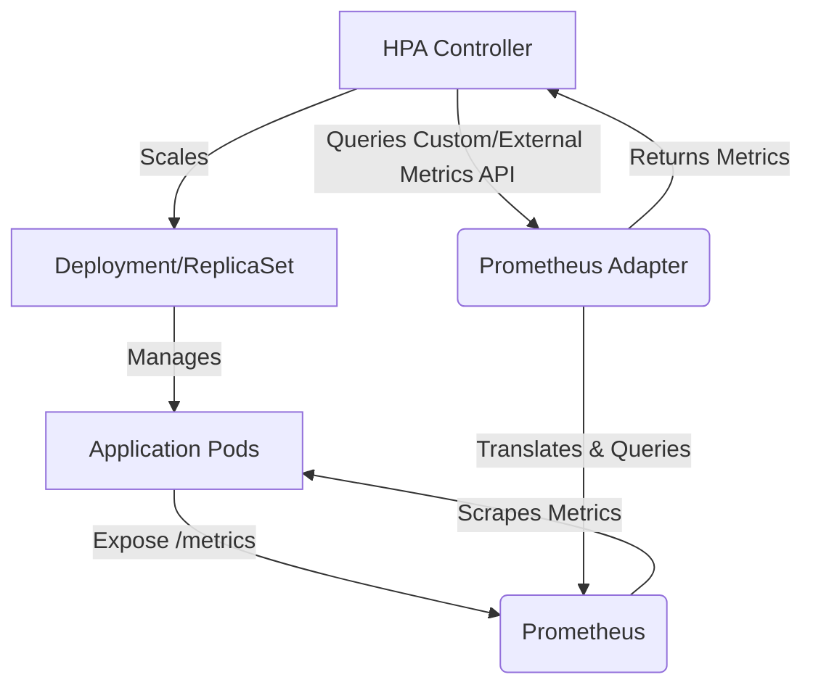

Kubernetes Horizontal Pod Autoscaler (HPA) là một thành phần cơ bản để quản lý khả năng co giãn của ứng dụng. Mặc dù việc điều chỉnh quy mô dựa trên mức sử dụng CPU và bộ nhớ là một điểm khởi đầu phổ biến, nhưng nó thường không thể nắm bắt được tải thực tế và đặc điểm hiệu suất của các ứng dụng hiện đại. Tự động điều chỉnh quy mô hiệu quả đòi hỏi các số liệu tương quan trực tiếp với nhu cầu của ứng dụng, chẳng hạn như tốc độ yêu cầu HTTP, độ sâu hàng đợi tin nhắn hoặc số phiên người dùng hoạt động.

Bài viết này cung cấp một hướng dẫn thực tế, nhiều mã để cấu hình Kubernetes HPA v2 với các số liệu tùy chỉnh và bên ngoài bằng cách sử dụng Prometheus Adapter. Chúng tôi sẽ trình bày cách điều chỉnh quy mô triển khai dựa trên các số liệu ứng dụng thực tế, vượt ra ngoài việc sử dụng tài nguyên chung.

<AudioPlayer src="/static/audio/kubernetes-hpa-custom-metrics-guide-vi.mp3" title="Tóm tắt âm thanh cho kỹ sư" voice="Google Cloud vi-VN-Neural2-A" />


## Tìm hiểu Kubernetes HPA và các số liệu

Horizontal Pod Autoscaler tự động điều chỉnh số lượng pod trong một triển khai, stateful set hoặc replica set dựa trên các số liệu được quan sát.

### HPA v1 so với HPA v2

-   **HPA v1:** Chỉ giới hạn ở việc điều chỉnh quy mô dựa trên mức sử dụng CPU.
-   **HPA v2:** Giới thiệu hỗ trợ nhiều số liệu, bao gồm số liệu tài nguyên (CPU, bộ nhớ), số liệu tùy chỉnh và số liệu bên ngoài. Điều này giúp tăng cường đáng kể tính linh hoạt và khả năng áp dụng của HPA cho các khối lượng công việc đa dạng.

### Các loại số liệu để tự động điều chỉnh quy mô

1.  **Số liệu tài nguyên:**
    *   **Mô tả:** Mức sử dụng CPU và bộ nhớ được báo cáo bởi các pod. Chúng được thu thập bởi Kubernetes Metrics Server.
    *   **Trường hợp sử dụng:** Điều chỉnh quy mô chung cho các ứng dụng mà CPU/bộ nhớ tương quan trực tiếp với tải.
    *   **Hạn chế:** Thường là một chỉ số gián tiếp về nhu cầu ứng dụng thực tế. Một ứng dụng bị giới hạn bởi CPU có thể điều chỉnh quy mô tốt, nhưng một ứng dụng bị giới hạn bởi I/O hoặc nhạy cảm với độ trễ thì có thể không.

2.  **Số liệu tùy chỉnh:**
    *   **Mô tả:** Các số liệu dành riêng cho ứng dụng được hiển thị bởi các pod, thường thông qua một endpoint `/metrics` ở định dạng Prometheus. Các số liệu này được liên kết trực tiếp với một đối tượng Kubernetes (ví dụ: Deployment, Service hoặc Pod).
    *   **Trường hợp sử dụng:** Điều chỉnh quy mô dựa trên các chỉ số cấp ứng dụng như tốc độ yêu cầu HTTP, kết nối hoạt động hoặc kích thước hàng đợi nội bộ.
    *   **Ví dụ:** `http_requests_total` trên mỗi pod.

3.  **Số liệu bên ngoài:**
    *   **Mô tả:** Các số liệu có nguồn gốc từ các hệ thống bên ngoài không liên quan trực tiếp đến một đối tượng Kubernetes cụ thể. Các số liệu này thường là toàn cầu hoặc đại diện cho một tài nguyên được chia sẻ.
    *   **Trường hợp sử dụng:** Điều chỉnh quy mô dựa trên độ sâu hàng đợi bên ngoài (ví dụ: SQS, độ trễ chủ đề Kafka), mức sử dụng nhóm kết nối cơ sở dữ liệu hoặc tốc độ gọi API bên ngoài.
    *   **Ví dụ:** Tổng số tin nhắn trong hàng đợi SQS, độc lập với bất kỳ pod nào.

### HPA hoạt động như thế nào

Bộ điều khiển HPA liên tục truy vấn Kubernetes Metrics API (đối với số liệu tài nguyên) hoặc Custom/External Metrics APIs (đối với số liệu tùy chỉnh/bên ngoài). Dựa trên các giá trị mục tiêu đã cấu hình và các quan sát số liệu hiện tại, nó tính toán số lượng bản sao mong muốn và cập nhật khối lượng công việc mục tiêu (Deployment, ReplicaSet, v.v.).

Công thức cho số lượng bản sao mong muốn thường là:

`desiredReplicas = ceil[currentReplicas * (currentMetricValue / targetMetricValue)]`

## Tổng quan kiến trúc: Prometheus Adapter cho các số liệu tùy chỉnh

Để cho phép HPA tiêu thụ các số liệu tùy chỉnh và bên ngoài từ Prometheus, hệ sinh thái Kubernetes cung cấp Prometheus Adapter.

Luồng hoạt động như sau:

1.  **Ứng dụng:** Ứng dụng của bạn hiển thị các số liệu ở định dạng Prometheus (ví dụ: `http_requests_total`, `queue_messages_total`) thông qua một endpoint HTTP (`/metrics`).
2.  **Prometheus:** Một phiên bản Prometheus thu thập các số liệu này từ các pod ứng dụng của bạn bằng cách sử dụng ServiceMonitors hoặc PodMonitors.
3.  **Prometheus Adapter:**
    *   Triển khai dưới dạng máy chủ API trong cụm Kubernetes của bạn.
    *   Thực hiện các API `custom.metrics.k8s.io` và `external.metrics.k8s.io`.
    *   Dịch các yêu cầu từ bộ điều khiển HPA thành các truy vấn Prometheus dựa trên các quy tắc được xác định trước.
    *   Thực thi các truy vấn này đối với phiên bản Prometheus.
    *   Trả về kết quả truy vấn cho bộ điều khiển HPA ở định dạng API mong muốn.
4.  **Bộ điều khiển HPA:** Truy vấn các API Custom/External Metrics được hiển thị bởi Prometheus Adapter và điều chỉnh số lượng bản sao của triển khai ứng dụng của bạn.



## Thiết lập môi trường

Phần này giả định bạn có một cụm Kubernetes đang hoạt động và `kubectl` đã được cấu hình.

### 1. Cài đặt Prometheus Stack

Chúng ta sẽ sử dụng biểu đồ Helm `kube-prometheus-stack`, bao gồm Prometheus, Grafana và Prometheus Operator.

```bash
# Add the Prometheus community Helm repository
helm repo add prometheus-community https://prometheus-community.github.io/helm-charts
helm repo update

# Create a namespace for monitoring components
kubectl create namespace monitoring

# Install kube-prometheus-stack
helm install prometheus prometheus-community/kube-prometheus-stack \
  --namespace monitoring \
  --set prometheus.prometheusSpec.serviceMonitorSelectorNilUsesHelmValues=false \
  --set prometheus.prometheusSpec.podMonitorSelectorNilUsesHelmValues=false
```

Các cờ `serviceMonitorSelectorNilUsesHelmValues` và `podMonitorSelectorNilUsesHelmValues` rất quan trọng. Chúng đảm bảo rằng Prometheus tự động phát hiện ServiceMonitors và PodMonitors được triển khai trong cùng một namespace với Prometheus, hoặc những cái được gắn nhãn rõ ràng để được phát hiện.

### 2. Cài đặt Prometheus Adapter

Prometheus Adapter được cài đặt thông qua biểu đồ Helm chuyên dụng của nó. Phần quan trọng là cấu hình `config.yaml` của nó để xác định cách các số liệu Prometheus ánh xạ tới các số liệu tùy chỉnh và bên ngoài của Kubernetes.

```bash
# Add the Prometheus Adapter Helm repository
helm repo add k8s-at-home https://k8s-at-home.com/charts/
helm repo update

# Install Prometheus Adapter with custom rules
# We'll define the rules in a values.yaml file
```

Tạo một tệp `prometheus-adapter-values.yaml`:

```yaml
# prometheus-adapter-values.yaml
prometheus:
  url: http://prometheus-kube-prometheus-stack-prometheus.monitoring.svc
  port: 9090

# Configuration for custom and external metrics rules
config: |
  rules:
  - seriesQuery: '{__name__=~"^http_requests_total$"}'
    resources:
      overrides:
        kubernetes_namespace: {resource: "namespace"}
        kubernetes_pod_name: {resource: "pod"}
    name:
      matches: "^(.*)_total$"
      as: "${1}_per_second"
    metricsQuery: sum(rate(<<.Series>>{<<.LabelMatchers>>}[5m])) by (<<.GroupBy>>)`

  - seriesQuery: '{__name__="queue_messages_total",kubernetes_namespace!="",kubernetes_pod_name!=""}'
    resources:
      overrides:
        kubernetes_namespace: {resource: "namespace"}
        kubernetes_pod_name: {resource: "pod"}
    name:
      matches: "^(.*)_total$"
      as: "${1}_depth"
    metricsQuery: sum(<<.Series>>{<<.LabelMatchers>>}) by (<<.GroupBy>>)`

  # External metrics example for a global queue depth
  - seriesQuery: '{__name__="external_queue_messages_total",queue_name!=""}'
    name:
      matches: "^external_(.*)_total$"
      as: "${1}_depth_external"
    metricsQuery: sum(<<.Series>>{<<.LabelMatchers>>}) by (queue_name)`
    external: true
```

Bây giờ, hãy cài đặt Prometheus Adapter bằng tệp giá trị này:

```bash
helm install prometheus-adapter k8s-at-home/prometheus-adapter \
  --namespace monitoring \
  -f prometheus-adapter-values.yaml
```

**Giải thích các quy tắc `config.yaml`:**

*   **`seriesQuery`**: Một bộ chọn nhãn Prometheus xác định chuỗi số liệu sẽ được xử lý bởi quy tắc này.
*   **`resources.overrides`**: Ánh xạ các nhãn Prometheus (ví dụ: `kubernetes_namespace`, `kubernetes_pod_name`) tới tên tài nguyên Kubernetes, cho phép HPA nhắm mục tiêu các đối tượng cụ thể.
*   **`name.matches` / `name.as`**: Xác định cách tên số liệu Prometheus được chuyển đổi thành tên số liệu tùy chỉnh của Kubernetes. Đối với `http_requests_total`, nó trở thành `http_requests_per_second`. Đối với `queue_messages_total`, nó trở thành `queue_messages_depth`.
*   **`metricsQuery`**: Truy vấn PromQL thực tế được thực thi bởi bộ điều hợp.
    *   `sum(rate(<<.Series>>{<<.LabelMatchers>>}[5m])) by (<<.GroupBy>>)`: Tính toán tốc độ trung bình 5 phút của `http_requests_total` (một bộ đếm) trên mỗi pod. `<<.Series>>`, `<<.LabelMatchers>>` và `<<.GroupBy>>` là các biến mẫu được thay thế bởi bộ điều hợp dựa trên yêu cầu HPA.
    *   `sum(<<.Series>>{<<.LabelMatchers>>}) by (<<.GroupBy>>)`: Tính tổng của `queue_messages_total` (một đồng hồ đo) trên mỗi pod.
    *   Đối với các số liệu bên ngoài, `external
