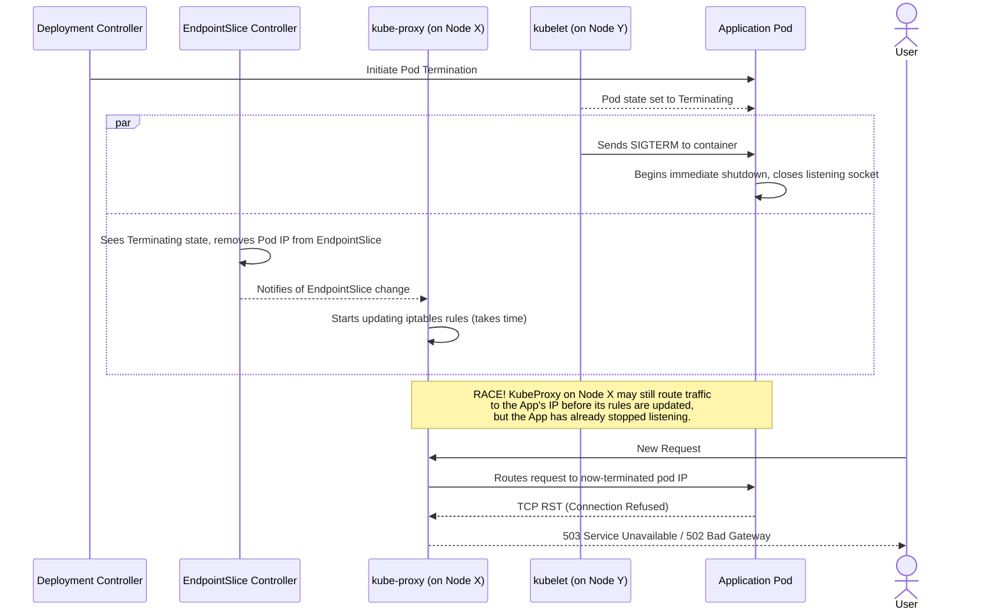

Your `kubectl apply -f deployment.yaml` command finishes with a satisfying `deployment.apps/my-app configured`. The new pods are running, the old ones are gone. You check your metrics dashboard and your heart sinks. A spike of 502s and 503s correlates perfectly with your deployment window. You achieved a "rolling update," but for your users, it was a brief but impactful outage.

This scenario is frustratingly common. It stems from a misunderstanding of what Kubernetes guarantees out of the box. While Kubernetes provides the primitives for high availability, achieving true zero-downtime deployments requires a deliberate, multi-layered strategy. Default settings are optimized for speed of rollout, not for connection integrity.

This guide is an exhaustive deep dive into the mechanics of Kubernetes pod termination. We will dissect the race condition that causes dropped connections and provide a production-grade, battle-tested configuration to eliminate it entirely. We'll cover graceful shutdown, `preStop` lifecycle hooks, `terminationGracePeriodSeconds`, Pod Disruption Budgets, and the often-overlooked role of the ingress controller.

<AudioPlayer src="/static/audio/kubernetes-zero-downtime-deployments.mp3" title="Executive Audio Briefing" />

## The Race Condition: Why Connections Are Dropped

To solve the problem, we must first understand the sequence of events during a pod termination initiated by a rolling update. It's a distributed systems problem involving multiple components that do not act in perfect, transactional synchrony.

When a Deployment is updated, the following happens for each old pod being replaced:

1.  **Control Plane:** The Deployment controller decides to terminate a pod. The pod's state is set to `Terminating`.
2.  **Endpoint Controller:** The EndpointSlice controller (or the older Endpoints controller) watches for pod state changes. It sees the pod is `Terminating` and, crucially, that its `readinessProbe` is now irrelevant. It immediately removes the pod's IP address from the corresponding Service's EndpointSlice.
3.  **kube-proxy:** The `kube-proxy` daemon on *every node* in the cluster watches for changes to EndpointSlices. It sees the removal and updates the node's `iptables` or `IPVS` rules to stop routing new traffic to the terminating pod's IP.
4.  **kubelet:** *Simultaneously* with step 2, the `kubelet` on the node hosting the pod is notified of the termination. It begins the shutdown sequence on the pod.
5.  **Application:** The `kubelet` sends a `SIGTERM` signal to the main process (PID 1) in each container of the pod.

The core of the problem lies in the race between **Step 3** and **Step 5**. The propagation of endpoint removal across the entire cluster (from EndpointSlice controller to all `kube-proxy` instances) is not instantaneous. If your application container receives `SIGTERM` and immediately exits, there is a window of time where `kube-proxy` on some nodes may still consider the pod a valid endpoint. New connections will be sent to a pod that is no longer listening, resulting in `connection refused` errors, which often manifest as 502 Bad Gateway or 503 Service Unavailable errors from upstream services.

Here is a visualization of this race condition:



## The Solution Stack: A Multi-Layered Defense

Fixing this requires a combination of application-level behavior and Kubernetes configuration. We will build our defense layer by layer.

### Layer 1: Application Graceful Shutdown

The first principle is that your application must handle `SIGTERM` gracefully. An immediate, abrupt exit (`exit(0)`) is the source of the problem. Graceful handling means:

1.  **Stop accepting new connections:** The server should immediately stop listening on its port.
2.  **Finish processing in-flight requests:** Allow any requests currently being processed to complete.
3.  **Close keep-alive connections:** Politely inform clients that the connection will be closing.
4.  **Exit:** Once all work is done, exit with a success code.

Most modern web frameworks have plugins or middleware for this. Here’s a conceptual example in Python using FastAPI.

```python:main.py
import asyncio
import signal
import sys
import uvicorn
from fastapi import FastAPI

app = FastAPI()
SHUTDOWN_SIGNAL_RECEIVED = False

@app.get("/")
async def root():
    # Simulate some work
    await asyncio.sleep(2)
    return {"message": "Hello World"}

@app.get("/healthz")
async def healthz():
    if SHUTDOWN_SIGNAL_RECEIVED:
        # Once shutdown starts, we are no longer "healthy"
        # but readiness probes should have already failed.
        # This is for any direct health checks.
        return {"status": "shutting down"}, 503
    return {"status": "ok"}

async def graceful_shutdown(signal, loop):
    global SHUTDOWN_SIGNAL_RECEIVED
    print(f"Received shutdown signal: {signal.name}")
    SHUTDOWN_SIGNAL_RECEIVED = True

    # This is a simplified example. In a real app, you would:
    # 1. Stop accepting new connections (uvicorn does this automatically on SIGTERM)
    # 2. Wait for existing requests to finish. Frameworks often have a way to track this.
    # 3. Clean up resources (DB connections, etc.)
    
    # Uvicorn's server has a 'server.shutdown()' method we could call,
    # but for simplicity, we'll rely on its default SIGTERM handling
    # which is already quite graceful. The key is what *else* you do here.
    
    print("Application is shutting down gracefully...")
    # The web server itself will handle the rest.

if __name__ == "__main__":
    loop = asyncio.get_event_loop()
    for sig in (signal.SIGTERM, signal.SIGINT):
        loop.add_signal_handler(sig, lambda s=sig: asyncio.create_task(graceful_shutdown(s, loop)))

    # Run the server. Uvicorn will handle the actual server shutdown process
    # when it receives SIGTERM.
    config = uvicorn.Config(app, host="0.0.0.0", port=8000, log_level="info")
    server = uvicorn.Server(config)
    loop.run_until_complete(server.serve())
```

While crucial, graceful shutdown *alone* is not enough. If traffic is still being sent to the pod, graceful shutdown logic cannot prevent the initial "connection refused" error for new requests. It only helps with requests that have already been accepted.

### Layer 2: The `preStop` Hook - Buying Time

This is the most direct solution to the race condition. The `preStop` lifecycle hook is a command or HTTP request that the `kubelet` executes *inside the container* **before** it sends the `SIGTERM` signal.

We can use this hook to simply pause. By adding a `sleep` command, we artificially delay the `SIGTERM`, giving the control plane (EndpointSlice controller and `kube-proxy`) the time it needs to propagate the endpoint removal across the cluster. By the time the sleep is over and `SIGTERM` is sent, no new traffic should be arriving at the pod.

```yaml
# deployment.yaml
apiVersion: apps/v1
kind: Deployment
metadata:
  name: my-app
spec:
  replicas: 3
  selector:
    matchLabels:
      app: my-app
  template:
    metadata:
      labels:
        app: my-app
    spec:
      containers:
      - name: my-app-container
        image: my-registry/my-app:1.0.1
        ports:
        - containerPort: 8000
        # --- CRITICAL ADDITION ---
        lifecycle:
          preStop:
            exec:
              # Give time for endpoint propagation and ingress controller updates
              command: ["/bin/sh", "-c", "sleep 15"]
        # ---
        readinessProbe:
          httpGet:
            path: /healthz
            port: 8000
          initialDelaySeconds: 5
          periodSeconds: 5
```

With this `preStop` hook, the termination sequence changes:

1.  `kubelet` receives the termination order.
2.  `kubelet` executes the `preStop` hook: `sleep 15`. The container continues to run and serve traffic normally for 15 seconds.
3.  During this 15-second window, the EndpointSlice is updated, and `kube-proxy` on all nodes removes the pod from their routing tables. Ingress controllers also update their backends.
4.  After 15 seconds, the `preStop` hook completes.
5.  `kubelet` sends `SIGTERM` to the application.
6.  The application, which is no longer receiving new traffic, performs its graceful shutdown to finish any in-flight requests.

### Layer 3: `terminationGracePeriodSeconds` - The Safety Net

This setting defines the maximum time a pod is given to shut down. The clock starts when the `kubelet` initiates the termination process (i.e., when it runs the `preStop` hook). The default is 30 seconds.

**Crucial Relationship:** The `terminationGracePeriodSeconds` must be longer than the time your `preStop` hook takes PLUS the time your application needs for graceful shutdown.

`terminationGracePeriodSeconds` > (`preStop` sleep duration) + (application shutdown time)

If the sum of these activities exceeds `terminationGraceperiodSeconds`, the `kubelet` loses patience and sends a `SIGKILL` signal, which forcefully terminates the process without any chance for cleanup.

Let's refine our deployment manifest:

```yaml
# deployment.yaml
apiVersion: apps/v1
kind: Deployment
metadata:
  name: my-app
spec:
  replicas: 3
  selector:
    matchLabels:
      app: my-app
  template:
    metadata:
      labels:
        app: my-app
    spec:
      # --- CRITICAL ADDITION ---
      # Total time for preStop hook + graceful shutdown
      terminationGracePeriodSeconds: 45
      # ---
      containers:
      - name: my-app-container
        image: my-registry/my-app:1.0.1
        ports:
        - containerPort: 8000
        lifecycle:
          preStop:
            exec:
              # Give time for endpoint propagation.
              # This should be long enough for the largest cluster.
              command: ["/bin/sh", "-c", "sleep 15"]
        # ... probes, etc.
```

In this example, we allocate 45 seconds total.
*   15 seconds are for the `preStop` sleep.
*   This leaves 30 seconds for the application to receive `SIGTERM` and finish its work.

### Layer 4: Pod Disruption Budgets (PDBs) - Protection from Voluntary Disruption

`preStop` hooks and graceful shutdown are for controlled rollouts. But what about other disruptions, like a cluster administrator draining a node for maintenance (`kubectl drain`)? This is a *voluntary* disruption.

A Pod Disruption Budget (PDB) is a Kubernetes object that limits the number of pods of a replicated application that are down simultaneously from voluntary disruptions.

**A PDB does NOT protect against rolling updates.** This is a common misconception. A rolling update is governed by the Deployment's own `strategy.rollingUpdate.maxUnavailable` setting. A PDB is for external events.

Here's how to create a PDB that ensures at least 80% of our application's pods are always available during a voluntary disruption like a node drain.

```yaml:pdb.yaml
apiVersion: policy/v1
kind: PodDisruptionBudget
metadata:
  name: my-app-pdb
spec:
  # Using minAvailable is often clearer than maxUnavailable.
  # This says "you must keep at least 80% of the desired replicas running".
  minAvailable: 80%
  selector:
    matchLabels:
      # This MUST match the labels of the pods you want to protect.
      app: my-app
```

With this PDB in place, if an operator runs `kubectl drain <node-name>`, the command will only proceed to evict pods from that node if doing so does not violate the `minAvailable: 80%` budget. It will wait, potentially forever, until pods become available (e.g., if other pods are terminating for other reasons) before continuing the drain.

## Beyond the Cluster: Ingress and Load Balancer Draining

We've fixed the race condition within the cluster. But the request path doesn't end at `kube-proxy`. For most web applications, traffic first hits an external Load Balancer and then a Kubernetes Ingress Controller.

This introduces another potential point of failure. The Ingress controller maintains its own list of backend endpoints based on the Kubernetes Service. When a pod is terminated, the Ingress controller also needs to see that change and remove the pod from its load balancing pool. This is another asynchronous process.

Modern ingress controllers solve this with a feature called **connection draining** or **deregistration delay**.

*   **How it works:** When an endpoint is removed from the Ingress's backend pool, the Ingress stops sending *new* requests to it. However, it keeps the backend in a "draining" state for a configured period, allowing existing, long-lived connections (like file uploads, WebSockets, or gRPC streams) to complete.

*   **Configuration:** This is specific to your Ingress controller:
    *   **NGINX Ingress:** You can leverage the pod's `preStop` hook. The controller is smart enough to start draining when the pod enters the `Terminating` state. The NGINX configuration `proxy_read_timeout` and `proxy_send_timeout` will dictate how long existing connections are held open.
    *   **AWS Load Balancer Controller:** You configure the `deregistration_delay_timeout_seconds` setting on the Target Group, which is managed via annotations on your Service or Ingress object (e.g., `alb.ingress.kubernetes.io/target-group-attributes: deregistration_delay.timeout_seconds=60`).
    *   **GKE Ingress:** Backend Services in Google Cloud have a "Connection draining timeout" setting that you can configure. GKE Ingress automatically manages this when pods are terminated.

The `preStop` sleep provides a buffer for these external systems to react, but for maximum reliability, you should explicitly configure connection draining on your load balancing tier.

## A Production-Ready Example

Let's combine everything into a complete, production-grade set of manifests.

```yaml:full-deployment.yaml
apiVersion: apps/v1
kind: Deployment
metadata:
  name: my-app
  labels:
    app: my-app
spec:
  replicas: 5 # A more realistic number
  selector:
    matchLabels:
      app: my-app
  # Strategy for the rolling update itself
  strategy:
    type: RollingUpdate
    rollingUpdate:
      # Can create 1 extra pod above desired count
      maxSurge: "25%"
      # Can take down 1 pod at a time
      maxUnavailable: "25%"
  template:
    metadata:
      labels:
        app: my-app
    spec:
      # Set a total grace period for shutdown.
      # Must be > preStop sleep + graceful shutdown time.
      terminationGracePeriodSeconds: 60
      containers:
      - name: my-app-container
        image: my-registry/my-app:1.0.1
        ports:
        - name: http
          containerPort: 8000
        # --- Zero-Downtime Configuration ---
        lifecycle:
          preStop:
            exec:
              # Sleep to allow time for endpoint propagation and
              # ingress controllers to deregister the pod.
              command: ["/bin/sh", "-c", "sleep 20"]
        # --- Probes are essential for readiness ---
        readinessProbe:
          httpGet:
            path: /healthz
            port: http
          initialDelaySeconds: 10
          periodSeconds: 5
          timeoutSeconds: 2
          failureThreshold: 3
        livenessProbe:
          httpGet:
            path: /healthz
            port: http
          initialDelaySeconds: 30
          periodSeconds: 10

---
apiVersion: v1
kind: Service
metadata:
  name: my-app-svc
spec:
  selector:
    app: my-app
  ports:
    - protocol: TCP
      port: 80
      targetPort: http

---
apiVersion: policy/v1
kind: PodDisruptionBudget
metadata:
  name: my-app-pdb
spec:
  # Ensure at least 3 pods are available during voluntary disruptions
  minAvailable: 3
  selector:
    matchLabels:
      app: my-app
```

## Interactive FAQ

<FAQ title="Frequently Asked Questions">
  <Question>Why use a `preStop` sleep hook? Isn't graceful shutdown in my app enough?</Question>
  <Answer>
    Graceful shutdown in your application is necessary but not sufficient. It only handles requests that have *already been received*. The core problem is the race condition where new traffic is routed to your pod *after* it has started shutting down but *before* its IP has been removed from all routing tables (`kube-proxy`, Ingress) in the cluster. The `preStop` sleep hook pauses the shutdown process entirely, creating a crucial delay. This delay gives the Kubernetes control plane and ingress controllers enough time to stop sending traffic to the pod. Only then is `SIGTERM` sent to your application, which can then gracefully shut down knowing no new requests are coming.
  </Answer>

  <Question>My legacy app can't be modified to handle SIGTERM. What are my options?</Question>
  <Answer>
    This is a common and challenging situation. While modifying the app is the ideal solution, you can still significantly improve reliability. In this case, the `preStop` hook becomes even more critical. You would configure a `preStop` sleep hook as described to ensure traffic is drained. Then, you set `terminationGracePeriodSeconds` to be just slightly longer than the sleep duration. For example: `preStop` sleep of `20s`, and `terminationGracePeriodSeconds: 25`. When the pod terminates, it will wait for 20 seconds (draining traffic), then receive `SIGTERM`. Since the app ignores it, it will continue running for 5 more seconds until the grace period expires. At that point, the `kubelet` will send `SIGKILL`, forcefully terminating it. You may drop any in-flight requests that were active when termination began, but you will have prevented the flood of `connection refused` errors for new requests. It's a damage control strategy, but a very effective one.
  </Answer>

  <Question>Does a Pod Disruption Budget (PDB) protect me during a rolling update?</Question>
  <Answer>
    No, and this is a critical point of confusion. A PDB protects against **voluntary disruptions**, which are actions initiated by the cluster administrator or other controllers that cause pods to be evicted. The canonical example is draining a node with `kubectl drain`. The PDB API tells the eviction process: "You are not allowed to evict this pod if it would violate the budget". A rolling update, however, is managed directly by the Deployment's own controller. The speed and safety of a rolling update are governed by its `strategy.rollingUpdate.maxUnavailable` and `maxSurge` parameters. The two mechanisms are distinct and protect against different types of disruptions. You need both for a truly resilient application.
  </Answer>

  <Question>What's a good value for the `preStop` sleep duration? 5 seconds? 30 seconds?</Question>
  <Answer>
    There is no universal magic number; it depends on the characteristics of your cluster and traffic path. The duration must be long enough to cover the propagation delay of endpoint removal to all `kube-proxy` instances and your ingress controller. Key factors include:
    *   **Cluster Size:** Larger clusters (more nodes) generally have longer propagation delays.
    *   **Network Latency:** Communication latency between the control plane and nodes.
    *   **Ingress Controller:** How quickly your specific ingress controller reacts to endpoint changes.
    *   **Cloud Provider:** The performance of the underlying network and control plane provided by your cloud.

    A good starting point for a typical cloud-based cluster is between **10 to 20 seconds**. For a small, local cluster (like `minikube`), 5 seconds might be sufficient. The best approach is to start with a conservative value (e.g., 20s), verify that you have zero dropped connections during a deployment, and then optionally try to tune it down while monitoring your error metrics closely.
  </Answer>
</FAQ>

## Conclusion: The Path to True Reliability

Achieving zero-downtime deployments in Kubernetes isn't a single setting, but a holistic approach to reliability engineering. By understanding the underlying mechanics and applying a layered defense, you can transform your deployments from a source of anxiety into a routine, non-eventful process.

**Actionable Takeaways:**

1.  **Implement Graceful Shutdown:** Your application MUST handle `SIGTERM` to finish in-flight work.
2.  **Use a `preStop` Sleep Hook:** This is the most effective way to win the race condition between termination and endpoint propagation.
3.  **Set `terminationGracePeriodSeconds` Deliberately:** It's your overall shutdown budget. Give yourself enough time.
4.  **Configure Readiness Probes:** A pod isn't "ready" until it's actually ready. Probes are non-negotiable.
5.  **Use Pod Disruption Budgets:** Protect your application from voluntary disruptions like node maintenance.
6.  **Configure Ingress Connection Draining:** Don't forget the final mile of the request path. Ensure your load balancer is part of the graceful shutdown process.

By systematically applying these principles, you can provide your users with the seamless, uninterrupted experience they expect, and deploy with the confidence that comes from robust engineering.

### Further Reading

*   [Official Kubernetes Docs: Pod Lifecycle - Termination of Pods](https://kubernetes.io/docs/concepts/workloads/pods/pod-lifecycle/#pod-termination)
*   [Official Kubernetes Docs: Pod Disruption Budgets](https://kubernetes.io/docs/concepts/workloads/pods/disruptions/)
*   [Blog Post: Graceful shutdown of pods with NGINX Ingress](https://www.nginx.com/blog/graceful-shutdown-of-pods-with-nginx-ingress-controller-for-kubernetes/)
*   [AWS Blog: Improve application availability with slower target deregistration for your Application Load Balancers](https://aws.amazon.com/blogs/elasticloadbalancing/improve-application-availability-with-slower-target-deregistration-for-your-application-load-balancers/)
