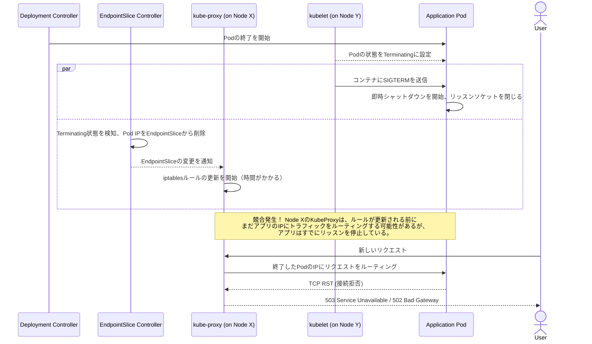

`kubectl apply -f deployment.yaml`コマンドが`deployment.apps/my-app configured`という満足のいくメッセージとともに終了します。新しいPodは起動し、古いPodは削除されました。あなたはメトリクスのダッシュボードを確認し、心が沈みます。デプロイの時間帯と完璧に相関して、502と503エラーが急増しているのです。あなたは「ローリングアップデート」を達成しましたが、ユーザーにとっては短時間ながらも影響の大きい障害となってしまいました。

このシナリオは、苛立たしいほどによくあることです。これは、Kubernetesが標準で保証してくれることに対する誤解から生じます。Kubernetesは高可用性のための基本的な機能を提供しますが、真のゼロダウンタイムデプロイメントを実現するには、意図的で多層的な戦略が必要です。デフォルト設定は、コネクションの完全性ではなく、ロールアウトの速さに最適化されています。

このガイドは、KubernetesのPod終了のメカニズムを徹底的に深掘りするものです。コネクション切断を引き起こす競合状態を分析し、それを完全になくすための本番環境で実証済みの設定を提供します。グレースフルシャットダウン、`preStop`ライフサイクルフック、`terminationGracePeriodSeconds`、Pod Disruption Budget、そして見落とされがちなIngressコントローラの役割について解説します。

<AudioPlayer src="/static/audio/kubernetes-zero-downtime-deployments-ja.mp3" title="音声エグゼクティブ・ブリーフィング" voice="Google Cloud ja-JP-Neural2-B" />

## 競合状態：なぜコネクションは切断されるのか

問題を解決するためには、まずローリングアップデートによって開始されるPod終了時の一連のイベントを理解する必要があります。これは、複数のコンポーネントが完全かつトランザクション的に同期して動作しない、分散システムの問題です。

Deploymentが更新されると、置き換えられる各古いPodに対して以下のことが起こります：

1.  **コントロールプレーン:** DeploymentコントローラがPodを終了させることを決定します。Podの状態は`Terminating`に設定されます。
2.  **Endpointコントローラ:** EndpointSliceコントローラ（または古いEndpointsコントローラ）がPodの状態変化を監視します。Podが`Terminating`であり、重要なことに、その`readinessProbe`がもはや無関係であることを見て取ります。そして即座に対応するServiceのEndpointSliceからPodのIPアドレスを削除します。
3.  **kube-proxy:** クラスタ内の*すべてのノード*上の`kube-proxy`デーモンがEndpointSliceの変更を監視します。削除を検知し、ノードの`iptables`または`IPVS`ルールを更新して、終了中のPodのIPへの新しいトラフィックのルーティングを停止します。
4.  **kubelet:** ステップ2と*同時に*、Podをホストしているノードの`kubelet`に終了が通知されます。`kubelet`はPodのシャットダウンシーケンスを開始します。
5.  **アプリケーション:** `kubelet`はPod内の各コンテナのメインプロセス（PID 1）に`SIGTERM`シグナルを送信します。

問題の核心は、**ステップ3**と**ステップ5**の間の競合にあります。Endpointの削除がクラスタ全体に伝播するプロセス（EndpointSliceコントローラからすべての`kube-proxy`インスタンスへ）は瞬時ではありません。もしアプリケーションコンテナが`SIGTERM`を受け取って即座に終了してしまうと、一部のノード上の`kube-proxy`がまだそのPodを有効なエンドポイントと見なしている時間帯が存在します。新しいコネクションはもはやリッスンしていないPodに送られ、`connection refused`エラーを引き起こします。これは、上流のサービスからは502 Bad Gatewayや503 Service Unavailableエラーとして現れることが多いです。

この競合状態の視覚化は以下の通りです：



## 解決策のスタック：多層防御

これを修正するには、アプリケーションレベルの挙動とKubernetesの設定の組み合わせが必要です。防御策を層ごとに構築していきましょう。

### 第1層：アプリケーションのグレースフルシャットダウン

最初の原則は、アプリケーションが`SIGTERM`をグレースフルに処理しなければならないということです。即時かつ突然の終了（`exit(0)`）が問題の根源です。グレースフルな処理とは以下のことを意味します：

1.  **新しいコネクションの受付を停止する：** サーバーは即座にポートでのリッスンを停止すべきです。
2.  **処理中のリクエストを完了させる：** 現在処理中のリクエストが完了するのを許可します。
3.  **keep-aliveコネクションを閉じる：** クライアントにコネクションがまもなく閉じられることを丁寧に通知します。
4.  **終了する：** すべての作業が完了したら、成功コードで終了します。

ほとんどの現代的なWebフレームワークには、このためのプラグインやミドルウェアがあります。以下はFastAPIを使ったPythonでの概念的な例です。

```python:main.py
import asyncio
import signal
import sys
import uvicorn
from fastapi import FastAPI

app = FastAPI()
SHUTDOWN_SIGNAL_RECEIVED = False

@app.get("/")
async def root():
    # 何らかの処理をシミュレート
    await asyncio.sleep(2)
    return {"message": "Hello World"}

@app.get("/healthz")
async def healthz():
    if SHUTDOWN_SIGNAL_RECEIVED:
        # シャットダウンが開始されたら、もはや「healthy」ではない
        # が、readiness probeはすでに失敗しているはず。
        # これは直接的なヘルスチェック用。
        return {"status": "shutting down"}, 503
    return {"status": "ok"}

async def graceful_shutdown(signal, loop):
    global SHUTDOWN_SIGNAL_RECEIVED
    print(f"Received shutdown signal: {signal.name}")
    SHUTDOWN_SIGNAL_RECEIVED = True

    # これは簡略化された例です。実際のアプリでは以下を行います：
    # 1. 新しいコネクションの受付を停止する（uvicornはSIGTERMで自動的にこれを行う）
    # 2. 既存のリクエストが終了するのを待つ。フレームワークにはこれを追跡する方法がしばしばある。
    # 3. リソース（DB接続など）をクリーンアップする。
    
    # Uvicornのサーバーには 'server.shutdown()' メソッドがあるが、
    # 簡単のため、デフォルトのSIGTERM処理に依存する。
    # これはすでにかなりグレースフルです。重要なのは、ここで他に何をするかです。
    
    print("Application is shutting down gracefully...")
    # Webサーバー自体が残りの処理を行う。

if __name__ == "__main__":
    loop = asyncio.get_event_loop()
    for sig in (signal.SIGTERM, signal.SIGINT):
        loop.add_signal_handler(sig, lambda s=sig: asyncio.create_task(graceful_shutdown(s, loop)))

    # サーバーを起動。UvicornはSIGTERMを受け取ると
    # 実際のサーバーシャットダウンプロセスを処理する。
    config = uvicorn.Config(app, host="0.0.0.0", port=8000, log_level="info")
    server = uvicorn.Server(config)
    loop.run_until_complete(server.serve())
```

グレースフルシャットダウンは不可欠ですが、それ*だけ*では十分ではありません。もしトラフィックがまだPodに送られている場合、グレースフルシャットダウンのロジックは新しいリクエストに対する最初の「connection refused」エラーを防ぐことができません。それはすでに受け付けられたリクエストにしか役立ちません。

### 第2層：`preStop`フック - 時間を稼ぐ

これが競合状態に対する最も直接的な解決策です。`preStop`ライフサイクルフックは、`kubelet`が`SIGTERM`シグナルを送る*前*に*コンテナ内部で*実行するコマンドまたはHTTPリクエストです。

このフックを使って単に一時停止することができます。`sleep`コマンドを追加することで、`SIGTERM`の送信を人為的に遅らせ、コントロールプレーン（EndpointSliceコントローラと`kube-proxy`）がクラスタ全体にEndpointの削除を伝播させるために必要な時間を与えます。sleepが終わり`SIGTERM`が送信される頃には、Podに新しいトラフィックは到着していないはずです。

```yaml
# deployment.yaml
apiVersion: apps/v1
kind: Deployment
metadata:
  name: my-app
spec:
  replicas: 3
  selector:
    matchLabels:
      app: my-app
  template:
    metadata:
      labels:
        app: my-app
    spec:
      containers:
      - name: my-app-container
        image: my-registry/my-app:1.0.1
        ports:
        - containerPort: 8000
        # --- 重要な追加 ---
        lifecycle:
          preStop:
            exec:
              # Endpointの伝播とIngressコントローラの更新のための時間を与える
              command: ["/bin/sh", "-c", "sleep 15"]
        # ---
        readinessProbe:
          httpGet:
            path: /healthz
            port: 8000
          initialDelaySeconds: 5
          periodSeconds: 5
```

この`preStop`フックにより、終了シーケンスは次のように変わります：

1.  `kubelet`が終了命令を受け取ります。
2.  `kubelet`が`preStop`フックを実行します：`sleep 15`。コンテナは15秒間、通常通り実行され、トラフィックを処理し続けます。
3.  この15秒の間に、EndpointSliceが更新され、すべてのノードの`kube-proxy`がルーティングテーブルからPodを削除します。Ingressコントローラもバックエンドを更新します。
4.  15秒後、`preStop`フックが完了します。
5.  `kubelet`がアプリケーションに`SIGTERM`を送信します。
6.  もはや新しいトラフィックを受け取っていないアプリケーションは、処理中のリクエストを完了させるためのグレースフルシャットダウンを実行します。

### 第3層：`terminationGracePeriodSeconds` - セーフティネット

この設定は、Podがシャットダウンするために与えられる最大時間を定義します。この時間は`kubelet`が終了プロセスを開始したとき（つまり、`preStop`フックを実行したとき）からカウントが始まります。デフォルトは30秒です。

**重要な関係：** `terminationGracePeriodSeconds`は、`preStop`フックにかかる時間とアプリケーションがグレースフルシャットダウンに要する時間の合計よりも長くなければなりません。

`terminationGracePeriodSeconds` > (`preStop`のsleep時間) + (アプリケーションのシャットダウン時間)

これらの活動の合計が`terminationGracePeriodSeconds`を超えると、`kubelet`は待ちきれなくなり、`SIGKILL`シグナルを送信します。これはプロセスを強制的に終了させ、クリーンアップの機会を与えません。

Deploymentマニフェストを改良しましょう：

```yaml
# deployment.yaml
apiVersion: apps/v1
kind: Deployment
metadata:
  name: my-app
spec:
  replicas: 3
  selector:
    matchLabels:
      app: my-app
  template:
    metadata:
      labels:
        app: my-app
    spec:
      # --- 重要な追加 ---
      # preStopフック + グレースフルシャットダウンの合計時間
      terminationGracePeriodSeconds: 45
      # ---
      containers:
      - name: my-app-container
        image: my-registry/my-app:1.0.1
        ports:
        - containerPort: 8000
        lifecycle:
          preStop:
            exec:
              # Endpointの伝播のための時間を与える。
              # これは最大規模のクラスタでも十分な長さであるべき。
              command: ["/bin/sh", "-c", "sleep 15"]
        # ... probes, etc.
```

この例では、合計45秒を割り当てています。
*   15秒は`preStop`のsleep用です。
*   これにより、アプリケーションが`SIGTERM`を受け取って作業を終えるのに30秒が残ります。

### 第4層：Pod Disruption Budgets (PDBs) - 自発的な中断からの保護

`preStop`フックとグレースフルシャットダウンは、制御されたロールアウトのためのものです。しかし、クラスタ管理者がメンテナンスのためにノードをドレインする（`kubectl drain`）など、他の中断についてはどうでしょうか？これは*自発的な中断*です。

Pod Disruption Budget (PDB)は、自発的な中断によって同時にダウンするレプリケートされたアプリケーションのPod数を制限するKubernetesオブジェクトです。

**PDBはローリングアップデートからは保護しません。** これはよくある誤解です。ローリングアップデートは、Deployment自身の`strategy.rollingUpdate.maxUnavailable`設定によって管理されます。PDBは外部イベントのためのものです。

以下は、ノードドレインのような自発的な中断中に、アプリケーションのPodの少なくとも80%が常に利用可能であることを保証するPDBの作成方法です。

```yaml:pdb.yaml
apiVersion: policy/v1
kind: PodDisruptionBudget
metadata:
  name: my-app-pdb
spec:
  # maxUnavailableよりもminAvailableの方がしばしば明確です。
  # これは「希望するレプリカ数のうち、少なくとも80%は稼働させ続けなければならない」という意味です。
  minAvailable: 80%
  selector:
    # これは保護したいPodのラベルと一致しなければなりません。
    matchLabels:
      app: my-app
```

このPDBを配置すると、オペレーターが`kubectl drain <node-name>`を実行した場合、そのノードからPodを退去させることが`minAvailable: 80%`の予算に違反しない場合にのみコマンドが進行します。予算が守られるまで（例えば、他のPodが他の理由で終了するなどしてPodが利用可能になるまで）、ドレインを続ける前に、場合によっては永久に待機します。

## クラスタを越えて：Ingressとロードバランサーのドレイニング

クラスタ内の競合状態は修正しました。しかし、リクエストのパスは`kube-proxy`で終わりではありません。ほとんどのWebアプリケーションでは、トラフィックはまず外部のロードバランサーに到達し、次にKubernetesのIngressコントローラに到達します。

これは、別の潜在的な障害点をもたらします。Ingressコントローラは、Kubernetes Serviceに基づいて独自のバックエンドエンドポイントのリストを維持しています。Podが終了すると、Ingressコントローラもその変更を検知し、ロードバランシングプールからPodを削除する必要があります。これもまた非同期プロセスです。

現代のIngressコントローラは、**コネクションドレイニング**または**登録解除遅延**と呼ばれる機能でこれを解決します。

*   **仕組み：** エンドポイントがIngressのバックエンドプールから削除されると、Ingressはそれに*新しい*リクエストを送るのをやめます。しかし、設定された期間、バックエンドを「ドレイニング」状態に保ち、既存の長命なコネクション（ファイルアップロード、WebSocket、gRPCストリームなど）が完了するのを許可します。

*   **設定：** これは使用しているIngressコントローラに固有です：
    *   **NGINX Ingress:** Podの`preStop`フックを活用できます。コントローラは、Podが`Terminating`状態に入るとドレイニングを開始するほど賢いです。NGINXの設定`proxy_read_timeout`と`proxy_send_timeout`が、既存のコネクションがどれだけ長く開かれているかを決定します。
    *   **AWS Load Balancer Controller:** ServiceまたはIngressオブジェクトのアノテーション（例：`alb.ingress.kubernetes.io/target-group-attributes: deregistration_delay.timeout_seconds=60`）を介して管理されるターゲットグループの`deregistration_delay_timeout_seconds`設定を構成します。
    *   **GKE Ingress:** Google Cloudのバックエンドサービスには、「コネクションドレイニングのタイムアウト」設定があり、これを構成できます。GKE Ingressは、Podが終了する際にこれを自動的に管理します。

`preStop`のsleepは、これらの外部システムが反応するためのバッファを提供しますが、最大の信頼性を得るためには、ロードバランシング層で明示的にコネクションドレイニングを設定すべきです。

## 本番環境向けの完全な例

すべてを組み合わせて、本番環境で通用する完全なマニフェストセットを作成しましょう。

```yaml:full-deployment.yaml
apiVersion: apps/v1
kind: Deployment
metadata:
  name: my-app
  labels:
    app: my-app
spec:
  replicas: 5 # より現実的な数
  selector:
    matchLabels:
      app: my-app
  # ローリングアップデート自体の戦略
  strategy:
    type: RollingUpdate
    rollingUpdate:
      # 希望する数より1つ多くPodを作成できる
      maxSurge: "25%"
      # 一度に1つのPodを停止できる
      maxUnavailable: "25%"
  template:
    metadata:
      labels:
        app: my-app
    spec:
      # シャットダウンの合計猶予期間を設定。
      # preStop sleep + グレースフルシャットダウン時間より長くなければならない。
      terminationGracePeriodSeconds: 60
      containers:
      - name: my-app-container
        image: my-registry/my-app:1.0.1
        ports:
        - name: http
          containerPort: 8000
        # --- ゼロダウンタイム設定 ---
        lifecycle:
          preStop:
            exec:
              # Endpointの伝播とIngressコントローラが
              # Podの登録を解除する時間を与えるためにsleepする。
              command: ["/bin/sh", "-c", "sleep 20"]
        # --- Readiness Probeは不可欠 ---
        readinessProbe:
          httpGet:
            path: /healthz
            port: http
          initialDelaySeconds: 10
          periodSeconds: 5
          timeoutSeconds: 2
          failureThreshold: 3
        livenessProbe:
          httpGet:
            path: /healthz
            port: http
          initialDelaySeconds: 30
          periodSeconds: 10

---
apiVersion: v1
kind: Service
metadata:
  name: my-app-svc
spec:
  selector:
    app: my-app
  ports:
    - protocol: TCP
      port: 80
      targetPort: http

---
apiVersion: policy/v1
kind: PodDisruptionBudget
metadata:
  name: my-app-pdb
spec:
  # 自発的な中断の間、少なくとも3つのPodが利用可能であることを保証する
  minAvailable: 3
  selector:
    matchLabels:
      app: my-app
```

## インタラクティブFAQ

<FAQ title="よくある質問">
  <Question>なぜ`preStop`のsleepフックを使うのですか？アプリでのグレースフルシャットダウンだけでは不十分なのですか？</Question>
  <Answer>
    アプリケーションでのグレースフルシャットダウンは必要ですが、十分ではありません。それは*すでに受信した*リクエストしか処理しません。中心的な問題は、Podがシャットダウンを開始した*後*、しかしそのIPがクラスタ内のすべてのルーティングテーブル（`kube-proxy`、Ingress）から削除される*前*に、新しいトラフィックがPodにルーティングされてしまう競合状態です。`preStop`のsleepフックは、シャットダウンプロセス全体を一時停止させ、重要な遅延を生み出します。この遅延により、KubernetesのコントロールプレーンとIngressコントローラはPodへのトラフィック送信を停止するのに十分な時間を得られます。その後初めて`SIGTERM`がアプリケーションに送信され、新しいリクエストが来ないことを知った上でグレースフルにシャットダウンできます。
  </Answer>

  <Question>私のレガシーアプリはSIGTERMを処理するように修正できません。どのような選択肢がありますか？</Question>
  <Answer>
    これはよくある困難な状況です。アプリの修正が理想的な解決策ですが、それでも信頼性を大幅に向上させることは可能です。この場合、`preStop`フックがさらに重要になります。説明したように`preStop`のsleepフックを設定して、トラフィックが確実にドレインされるようにします。次に、`terminationGracePeriodSeconds`をsleep時間よりわずかに長く設定します。例えば、`preStop`のsleepを`20s`、`terminationGracePeriodSeconds`を`25`にします。Podが終了する際、20秒待機し（トラフィックをドレイン）、その後`SIGTERM`を受け取ります。アプリはそれを無視するので、さらに5秒間実行を続け、猶予期間が切れます。その時点で`kubelet`は`SIGKILL`を送信し、強制的に終了させます。終了開始時にアクティブだった処理中のリクエストは失われるかもしれませんが、新しいリクエストに対する`connection refused`エラーの洪水を防ぐことができます。これはダメージコントロール戦略ですが、非常に効果的です。
  </Answer>

  <Question>Pod Disruption Budget (PDB)はローリングアップデート中に私を守ってくれますか？</Question>
  <Answer>
    いいえ、これは非常に重要な誤解ポイントです。PDBは**自発的な中断**から保護します。これは、クラスタ管理者や他のコントローラによって開始され、Podが退去させられるアクションのことです。典型的な例は`kubectl drain`によるノードのドレインです。PDB APIは退去プロセスに「このPodを退去させることが予算に違反するなら、許可しない」と伝えます。一方、ローリングアップデートはDeployment自身のコントローラによって直接管理されます。ローリングアップデートの速度と安全性は、その`strategy.rollingUpdate.maxUnavailable`と`maxSurge`パラメータによって制御されます。この2つのメカニズムは別個のものであり、異なる種類の中断から保護します。真に回復力のあるアプリケーションのためには、両方が必要です。
  </Answer>

  <Question>`preStop`のsleep時間として適切な値は何秒ですか？5秒？30秒？</Question>
  <Answer>
    普遍的な魔法の数字はありません。それはクラスタとトラフィックパスの特性に依存します。この時間は、Endpoint削除の伝播遅延がすべての`kube-proxy`インスタンスとIngressコントローラに及ぶのに十分な長さでなければなりません。主な要因は以下の通りです：
    *   **クラスタサイズ:** より大きなクラスタ（より多くのノード）は、一般的に伝播遅延が長くなります。
    *   **ネットワークレイテンシ:** コントロールプレーンとノード間の通信レイテンシ。
    *   **Ingressコントローラ:** 使用している特定のIngressコントローラがEndpointの変更にどれだけ速く反応するか。
    *   **クラウドプロバイダー:** クラウドが提供する基盤となるネットワークとコントロールプレーンのパフォーマンス。

    典型的なクラウドベースのクラスタの良い出発点は**10秒から20秒**の間です。小規模なローカルクラスタ（`minikube`など）では、5秒で十分かもしれません。最善のアプローチは、保守的な値（例：20秒）から始め、デプロイ中にコネクション切断がゼロであることを確認し、その後、エラーメトリクスを注意深く監視しながら値を下げていくことです。
  </Answer>
</FAQ>

## 結論：真の信頼性への道

Kubernetesでゼロダウンタイムデプロイメントを達成することは、単一の設定ではなく、信頼性工学への包括的なアプローチです。根底にあるメカニズムを理解し、多層的な防御を適用することで、デプロイメントを不安の種から、日常的で何事もないプロセスに変えることができます。

**実践的な要点：**

1.  **グレースフルシャットダウンを実装する：** アプリケーションは処理中の作業を終えるために`SIGTERM`を処理しなければなりません。
2.  **`preStop`のsleepフックを使用する：** これは終了とEndpoint伝播の間の競合状態に勝つための最も効果的な方法です。
3.  **`terminationGracePeriodSeconds`を意図的に設定する：** これは全体的なシャットダウンの予算です。十分な時間を確保しましょう。
4.  **Readiness Probeを設定する：** Podは実際に準備が整うまで「準備完了」ではありません。Probeは交渉の余地がありません。
5.  **Pod Disruption Budgetを使用する：** ノードメンテナンスのような自発的な中断からアプリケーションを保護します。
6.  **Ingressのコネクションドレイニングを設定する：** リクエストパスの最後のマイルを忘れないでください。ロードバランサーがグレースフルシャットダウンプロセスの一部であることを確認してください。

これらの原則を体系的に適用することで、ユーザーが期待するシームレスで中断のない体験を提供し、堅牢なエンジニアリングから来る自信を持ってデプロイすることができます。

### 参考資料

*   [公式Kubernetesドキュメント: Podのライフサイクル - Podの終了](https://kubernetes.io/docs/concepts/workloads/pods/pod-lifecycle/#pod-termination)
*   [公式Kubernetesドキュメント: Pod Disruption Budgets](https://kubernetes.io/docs/concepts/workloads/pods/disruptions/)
*   [ブログ記事: Graceful shutdown of pods with NGINX Ingress](https://www.nginx.com/blog/graceful-shutdown-of-pods-with-nginx-ingress-controller-for-kubernetes/)
*   [AWSブログ: Improve application availability with slower target deregistration for your Application Load Balancers](https://aws.amazon.com/blogs/elasticloadbalancing/improve-application-availability-with-slower-target-deregistration-for-your-application-load-balancers/)
