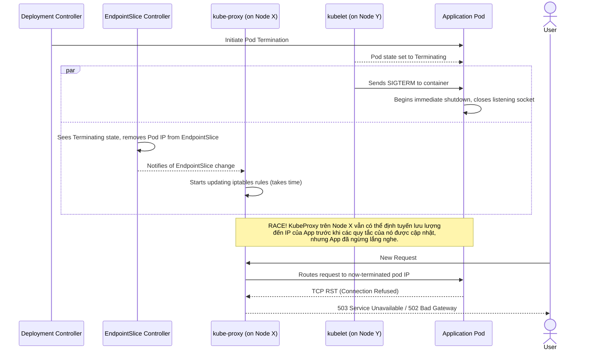

Lệnh `kubectl apply -f deployment.yaml` của bạn kết thúc với thông báo `deployment.apps/my-app configured` đầy thỏa mãn. Các pod mới đang chạy, các pod cũ đã biến mất. Bạn kiểm tra dashboard giám sát và tim bạn như thắt lại. Một loạt lỗi 502 và 503 tăng đột biến khớp hoàn hảo với khoảng thời gian bạn triển khai. Bạn đã đạt được một "rolling update", nhưng đối với người dùng, đó là một sự cố gián đoạn tuy ngắn ngủi nhưng có tác động rõ rệt.

Kịch bản này phổ biến đến mức gây bực bội. Nó xuất phát từ việc hiểu sai những gì Kubernetes đảm bảo ngay từ đầu. Mặc dù Kubernetes cung cấp các nguyên tắc cơ bản cho tính sẵn sàng cao, việc đạt được triển khai zero-downtime thực sự đòi hỏi một chiến lược có chủ đích, đa tầng. Các cài đặt mặc định được tối ưu hóa cho tốc độ triển khai, chứ không phải cho tính toàn vẹn của kết nối.

Hướng dẫn này là một bài phân tích sâu toàn diện về cơ chế chấm dứt pod của Kubernetes. Chúng ta sẽ mổ xẻ race condition gây ra việc rớt kết nối và cung cấp một cấu hình đã được kiểm chứng trong môi trường production để loại bỏ hoàn toàn vấn đề này. Chúng ta sẽ đề cập đến graceful shutdown, `preStop` lifecycle hooks, `terminationGracePeriodSeconds`, Pod Disruption Budgets, và vai trò thường bị bỏ qua của ingress controller.

<AudioPlayer src="/static/audio/kubernetes-zero-downtime-deployments-vi.mp3" title="Tóm tắt âm thanh cho kỹ sư" voice="Google Cloud vi-VN-Neural2-A" />

## Race Condition: Tại sao kết nối bị rớt

Để giải quyết vấn đề, trước tiên chúng ta phải hiểu chuỗi sự kiện trong quá trình chấm dứt một pod được khởi xướng bởi một rolling update. Đây là một vấn đề của hệ thống phân tán liên quan đến nhiều thành phần không hoạt động đồng bộ một cách hoàn hảo, giao dịch.

Khi một Deployment được cập nhật, điều sau đây xảy ra cho mỗi pod cũ đang được thay thế:

1.  **Control Plane:** Deployment controller quyết định chấm dứt một pod. Trạng thái của pod được đặt thành `Terminating`.
2.  **Endpoint Controller:** EndpointSlice controller (hoặc Endpoints controller cũ hơn) theo dõi sự thay đổi trạng thái của pod. Nó thấy pod đang ở trạng thái `Terminating` và, quan trọng là, `readinessProbe` của nó bây giờ không còn liên quan. Nó ngay lập tức xóa địa chỉ IP của pod khỏi EndpointSlice của Service tương ứng.
3.  **kube-proxy:** Daemon `kube-proxy` trên *mọi node* trong cluster theo dõi các thay đổi đối với EndpointSlices. Nó thấy việc xóa bỏ này và cập nhật các quy tắc `iptables` hoặc `IPVS` của node để ngừng định tuyến lưu lượng mới đến IP của pod đang chấm dứt.
4.  **kubelet:** *Đồng thời* với bước 2, `kubelet` trên node chứa pod được thông báo về việc chấm dứt. Nó bắt đầu chuỗi tắt máy trên pod.
5.  **Application:** `kubelet` gửi tín hiệu `SIGTERM` đến tiến trình chính (PID 1) trong mỗi container của pod.

Cốt lõi của vấn đề nằm ở cuộc chạy đua (race) giữa **Bước 3** và **Bước 5**. Việc lan truyền thông tin xóa endpoint trên toàn bộ cluster (từ EndpointSlice controller đến tất cả các instance `kube-proxy`) không diễn ra tức thời. Nếu container ứng dụng của bạn nhận `SIGTERM` và thoát ngay lập tức, sẽ có một khoảng thời gian mà `kube-proxy` trên một số node vẫn có thể coi pod đó là một endpoint hợp lệ. Các kết nối mới sẽ được gửi đến một pod không còn lắng nghe, dẫn đến lỗi `connection refused`, thường biểu hiện dưới dạng lỗi 502 Bad Gateway hoặc 503 Service Unavailable từ các dịch vụ upstream.

Dưới đây là một hình ảnh trực quan về race condition này:



## Bộ Giải Pháp: Một Hệ Thống Phòng Thủ Đa Tầng

Để khắc phục điều này, cần có sự kết hợp giữa hành vi ở cấp độ ứng dụng và cấu hình Kubernetes. Chúng ta sẽ xây dựng hệ thống phòng thủ của mình từng lớp một.

### Lớp 1: Graceful Shutdown của Ứng Dụng

Nguyên tắc đầu tiên là ứng dụng của bạn phải xử lý `SIGTERM` một cách nhẹ nhàng (gracefully). Việc thoát đột ngột (`exit(0)`) là nguồn gốc của vấn đề. Xử lý graceful có nghĩa là:

1.  **Ngừng nhận kết nối mới:** Máy chủ nên ngay lập tức ngừng lắng nghe trên cổng của nó.
2.  **Hoàn thành xử lý các yêu cầu đang diễn ra:** Cho phép mọi yêu cầu đang được xử lý hoàn tất.
3.  **Đóng các kết nối keep-alive:** Lịch sự thông báo cho các client rằng kết nối sẽ bị đóng.
4.  **Thoát:** Sau khi hoàn thành tất cả công việc, thoát với mã thành công.

Hầu hết các web framework hiện đại đều có các plugin hoặc middleware cho việc này. Dưới đây là một ví dụ khái niệm trong Python sử dụng FastAPI.

```python:main.py
import asyncio
import signal
import sys
import uvicorn
from fastapi import FastAPI

app = FastAPI()
SHUTDOWN_SIGNAL_RECEIVED = False

@app.get("/")
async def root():
    # Simulate some work
    await asyncio.sleep(2)
    return {"message": "Hello World"}

@app.get("/healthz")
async def healthz():
    if SHUTDOWN_SIGNAL_RECEIVED:
        # Once shutdown starts, we are no longer "healthy"
        # but readiness probes should have already failed.
        # This is for any direct health checks.
        return {"status": "shutting down"}, 503
    return {"status": "ok"}

async def graceful_shutdown(signal, loop):
    global SHUTDOWN_SIGNAL_RECEIVED
    print(f"Received shutdown signal: {signal.name}")
    SHUTDOWN_SIGNAL_RECEIVED = True

    # This is a simplified example. In a real app, you would:
    # 1. Stop accepting new connections (uvicorn does this automatically on SIGTERM)
    # 2. Wait for existing requests to finish. Frameworks often have a way to track this.
    # 3. Clean up resources (DB connections, etc.)
    
    # Uvicorn's server has a 'server.shutdown()' method we could call,
    # but for simplicity, we'll rely on its default SIGTERM handling
    # which is already quite graceful. The key is what *else* you do here.
    
    print("Application is shutting down gracefully...")
    # The web server itself will handle the rest.

if __name__ == "__main__":
    loop = asyncio.get_event_loop()
    for sig in (signal.SIGTERM, signal.SIGINT):
        loop.add_signal_handler(sig, lambda s=sig: asyncio.create_task(graceful_shutdown(s, loop)))

    # Run the server. Uvicorn will handle the actual server shutdown process
    # when it receives SIGTERM.
    config = uvicorn.Config(app, host="0.0.0.0", port=8000, log_level="info")
    server = uvicorn.Server(config)
    loop.run_until_complete(server.serve())
```

Mặc dù rất quan trọng, nhưng chỉ riêng graceful shutdown là không đủ. Nếu lưu lượng vẫn đang được gửi đến pod, logic graceful shutdown không thể ngăn chặn lỗi "connection refused" ban đầu cho các yêu cầu mới. Nó chỉ giúp với các yêu cầu đã được chấp nhận.

### Lớp 2: `preStop` Hook - Mua Thời Gian

Đây là giải pháp trực tiếp nhất cho race condition. `preStop` lifecycle hook là một lệnh hoặc một yêu cầu HTTP mà `kubelet` thực thi *bên trong container* **trước khi** nó gửi tín hiệu `SIGTERM`.

Chúng ta có thể sử dụng hook này để đơn giản là tạm dừng. Bằng cách thêm một lệnh `sleep`, chúng ta trì hoãn một cách nhân tạo việc gửi `SIGTERM`, cho control plane (EndpointSlice controller và `kube-proxy`) thời gian cần thiết để lan truyền việc xóa endpoint trên toàn cluster. Đến khi lệnh sleep kết thúc và `SIGTERM` được gửi đi, sẽ không còn lưu lượng mới nào đến pod nữa.

```yaml
# deployment.yaml
apiVersion: apps/v1
kind: Deployment
metadata:
  name: my-app
spec:
  replicas: 3
  selector:
    matchLabels:
      app: my-app
  template:
    metadata:
      labels:
        app: my-app
    spec:
      containers:
      - name: my-app-container
        image: my-registry/my-app:1.0.1
        ports:
        - containerPort: 8000
        # --- BỔ SUNG QUAN TRỌNG ---
        lifecycle:
          preStop:
            exec:
              # Cho thời gian để lan truyền endpoint và cập nhật ingress controller
              command: ["/bin/sh", "-c", "sleep 15"]
        # ---
        readinessProbe:
          httpGet:
            path: /healthz
            port: 8000
          initialDelaySeconds: 5
          periodSeconds: 5
```

Với `preStop` hook này, chuỗi sự kiện chấm dứt thay đổi như sau:

1.  `kubelet` nhận lệnh chấm dứt.
2.  `kubelet` thực thi `preStop` hook: `sleep 15`. Container tiếp tục chạy và phục vụ lưu lượng bình thường trong 15 giây.
3.  Trong khoảng thời gian 15 giây này, EndpointSlice được cập nhật, và `kube-proxy` trên tất cả các node xóa pod khỏi bảng định tuyến của chúng. Các ingress controller cũng cập nhật backend của chúng.
4.  Sau 15 giây, `preStop` hook hoàn tất.
5.  `kubelet` gửi `SIGTERM` đến ứng dụng.
6.  Ứng dụng, lúc này không còn nhận lưu lượng mới, thực hiện graceful shutdown để hoàn thành mọi yêu cầu đang xử lý.

### Lớp 3: `terminationGracePeriodSeconds` - Lưới An Toàn

Cài đặt này định nghĩa thời gian tối đa mà một pod được phép tắt. Đồng hồ bắt đầu đếm khi `kubelet` khởi tạo quy trình chấm dứt (tức là khi nó chạy `preStop` hook). Mặc định là 30 giây.

**Mối Quan Hệ Sống Còn:** `terminationGracePeriodSeconds` phải dài hơn tổng thời gian `preStop` hook và thời gian ứng dụng của bạn cần cho graceful shutdown.

`terminationGracePeriodSeconds` > (thời gian `preStop` sleep) + (thời gian shutdown của ứng dụng)

Nếu tổng các hoạt động này vượt quá `terminationGracePeriodSeconds`, `kubelet` sẽ mất kiên nhẫn và gửi tín hiệu `SIGKILL`, buộc chấm dứt tiến trình một cách cưỡng bức mà không có cơ hội dọn dẹp.

Hãy tinh chỉnh manifest deployment của chúng ta:

```yaml
# deployment.yaml
apiVersion: apps/v1
kind: Deployment
metadata:
  name: my-app
spec:
  replicas: 3
  selector:
    matchLabels:
      app: my-app
  template:
    metadata:
      labels:
        app: my-app
    spec:
      # --- BỔ SUNG QUAN TRỌNG ---
      # Tổng thời gian cho preStop hook + graceful shutdown
      terminationGracePeriodSeconds: 45
      # ---
      containers:
      - name: my-app-container
        image: my-registry/my-app:1.0.1
        ports:
        - containerPort: 8000
        lifecycle:
          preStop:
            exec:
              # Cho thời gian để lan truyền endpoint.
              # Con số này nên đủ lớn cho cluster lớn nhất.
              command: ["/bin/sh", "-c", "sleep 15"]
        # ... probes, etc.
```

Trong ví dụ này, chúng ta phân bổ tổng cộng 45 giây.
*   15 giây dành cho `preStop` sleep.
*   Điều này để lại 30 giây cho ứng dụng nhận `SIGTERM` và hoàn thành công việc của nó.

### Lớp 4: Pod Disruption Budgets (PDBs) - Bảo vệ khỏi Gián đoạn Tự nguyện

`preStop` hooks và graceful shutdown dành cho các lần rollout có kiểm soát. Nhưng còn các gián đoạn khác thì sao, như việc quản trị viên cluster rút cạn một node để bảo trì (`kubectl drain`)? Đây là một sự gián đoạn *tự nguyện*.

Pod Disruption Budget (PDB) là một đối tượng Kubernetes giới hạn số lượng pod của một ứng dụng nhân bản bị ngừng hoạt động đồng thời do các gián đoạn tự nguyện.

**PDB KHÔNG bảo vệ khỏi rolling updates.** Đây là một hiểu lầm phổ biến. Một rolling update được điều chỉnh bởi cài đặt `strategy.rollingUpdate.maxUnavailable` của chính Deployment đó. PDB dành cho các sự kiện bên ngoài.

Đây là cách tạo một PDB đảm bảo ít nhất 80% số pod của ứng dụng chúng ta luôn sẵn sàng trong một gián đoạn tự nguyện như việc rút cạn node.

```yaml:pdb.yaml
apiVersion: policy/v1
kind: PodDisruptionBudget
metadata:
  name: my-app-pdb
spec:
  # Sử dụng minAvailable thường rõ ràng hơn maxUnavailable.
  # Điều này có nghĩa là "bạn phải giữ ít nhất 80% số replica mong muốn đang chạy".
  minAvailable: 80%
  selector:
    matchLabels:
      # Điều này PHẢI khớp với label của các pod bạn muốn bảo vệ.
      app: my-app
```

Với PDB này, nếu một người vận hành chạy `kubectl drain <node-name>`, lệnh sẽ chỉ tiếp tục trục xuất các pod khỏi node đó nếu việc làm này không vi phạm ngân sách `minAvailable: 80%`. Nó sẽ chờ đợi, có thể là mãi mãi, cho đến khi các pod trở nên sẵn sàng (ví dụ, nếu các pod khác đang chấm dứt vì lý do khác) trước khi tiếp tục việc rút cạn.

## Vượt ra ngoài Cluster: Ingress và Load Balancer Draining

Chúng ta đã khắc phục race condition bên trong cluster. Nhưng đường đi của yêu cầu không kết thúc ở `kube-proxy`. Đối với hầu hết các ứng dụng web, lưu lượng đầu tiên đi qua một Load Balancer bên ngoài và sau đó là một Kubernetes Ingress Controller.

Điều này tạo ra một điểm thất bại tiềm năng khác. Ingress controller duy trì danh sách các backend endpoint của riêng nó dựa trên Kubernetes Service. Khi một pod bị chấm dứt, Ingress controller cũng cần thấy sự thay đổi đó và xóa pod khỏi nhóm load balancing của nó. Đây lại là một quá trình bất đồng bộ khác.

Các ingress controller hiện đại giải quyết vấn đề này bằng một tính năng gọi là **connection draining** hoặc **deregistration delay**.

*   **Cách hoạt động:** Khi một endpoint bị xóa khỏi nhóm backend của Ingress, Ingress ngừng gửi các yêu cầu *mới* đến nó. Tuy nhiên, nó giữ backend ở trạng thái "draining" (rút cạn) trong một khoảng thời gian đã cấu hình, cho phép các kết nối hiện có, tồn tại lâu (như tải tệp lên, WebSockets, hoặc gRPC streams) hoàn tất.

*   **Cấu hình:** Điều này phụ thuộc vào Ingress controller của bạn:
    *   **NGINX Ingress:** Bạn có thể tận dụng `preStop` hook của pod. Controller đủ thông minh để bắt đầu draining khi pod vào trạng thái `Terminating`. Cấu hình `proxy_read_timeout` và `proxy_send_timeout` của NGINX sẽ quyết định thời gian các kết nối hiện có được giữ mở.
    *   **AWS Load Balancer Controller:** Bạn cấu hình cài đặt `deregistration_delay_timeout_seconds` trên Target Group, được quản lý thông qua các annotation trên đối tượng Service hoặc Ingress của bạn (ví dụ: `alb.ingress.kubernetes.io/target-group-attributes: deregistration_delay.timeout_seconds=60`).
    *   **GKE Ingress:** Các Backend Service trong Google Cloud có cài đặt "Connection draining timeout" mà bạn có thể cấu hình. GKE Ingress tự động quản lý điều này khi các pod bị chấm dứt.

Lệnh `preStop` sleep cung cấp một khoảng đệm cho các hệ thống bên ngoài này phản ứng, nhưng để có độ tin cậy tối đa, bạn nên cấu hình rõ ràng việc connection draining trên tầng load balancing của mình.

## Một Ví dụ Sẵn sàng cho Production

Hãy kết hợp mọi thứ lại thành một bộ manifest hoàn chỉnh, sẵn sàng cho môi trường production.

```yaml:full-deployment.yaml
apiVersion: apps/v1
kind: Deployment
metadata:
  name: my-app
  labels:
    app: my-app
spec:
  replicas: 5 # Một con số thực tế hơn
  selector:
    matchLabels:
      app: my-app
  # Chiến lược cho chính rolling update
  strategy:
    type: RollingUpdate
    rollingUpdate:
      # Có thể tạo thêm 1 pod so với số lượng mong muốn
      maxSurge: "25%"
      # Có thể tắt 1 pod mỗi lần
      maxUnavailable: "25%"
  template:
    metadata:
      labels:
        app: my-app
    spec:
      # Đặt một khoảng thời gian chờ tắt máy tổng thể.
      # Phải lớn hơn thời gian preStop sleep + thời gian graceful shutdown.
      terminationGracePeriodSeconds: 60
      containers:
      - name: my-app-container
        image: my-registry/my-app:1.0.1
        ports:
        - name: http
          containerPort: 8000
        # --- Cấu hình Zero-Downtime ---
        lifecycle:
          preStop:
            exec:
              # Sleep để có thời gian cho việc lan truyền endpoint và
              # ingress controllers hủy đăng ký pod.
              command: ["/bin/sh", "-c", "sleep 20"]
        # --- Probes là cần thiết cho trạng thái sẵn sàng ---
        readinessProbe:
          httpGet:
            path: /healthz
            port: http
          initialDelaySeconds: 10
          periodSeconds: 5
          timeoutSeconds: 2
          failureThreshold: 3
        livenessProbe:
          httpGet:
            path: /healthz
            port: http
          initialDelaySeconds: 30
          periodSeconds: 10

---
apiVersion: v1
kind: Service
metadata:
  name: my-app-svc
spec:
  selector:
    app: my-app
  ports:
    - protocol: TCP
      port: 80
      targetPort: http

---
apiVersion: policy/v1
kind: PodDisruptionBudget
metadata:
  name: my-app-pdb
spec:
  # Đảm bảo ít nhất 3 pod sẵn sàng trong các gián đoạn tự nguyện
  minAvailable: 3
  selector:
    matchLabels:
      app: my-app
```

## Câu hỏi Thường Gặp Tương tác

<FAQ title="Các câu hỏi thường gặp">
  <Question>Tại sao phải dùng `preStop` sleep hook? Chẳng phải graceful shutdown trong ứng dụng của tôi là đủ rồi sao?</Question>
  <Answer>
    Graceful shutdown trong ứng dụng của bạn là cần thiết nhưng không đủ. Nó chỉ xử lý các yêu cầu *đã được nhận*. Vấn đề cốt lõi là race condition, nơi lưu lượng mới được định tuyến đến pod của bạn *sau khi* nó đã bắt đầu tắt nhưng *trước khi* IP của nó bị xóa khỏi tất cả các bảng định tuyến (`kube-proxy`, Ingress) trong cluster. `preStop` sleep hook tạm dừng hoàn toàn quá trình tắt, tạo ra một độ trễ quan trọng. Độ trễ này cho phép Kubernetes control plane và ingress controllers có đủ thời gian để ngừng gửi lưu lượng đến pod. Chỉ sau đó, `SIGTERM` mới được gửi đến ứng dụng của bạn, và nó có thể thực hiện graceful shutdown khi biết rằng không có yêu cầu mới nào sắp đến.
  </Answer>

  <Question>Ứng dụng cũ của tôi không thể sửa đổi để xử lý SIGTERM. Tôi có những lựa chọn nào?</Question>
  <Answer>
    Đây là một tình huống phổ biến và đầy thách thức. Mặc dù sửa đổi ứng dụng là giải pháp lý tưởng, bạn vẫn có thể cải thiện đáng kể độ tin cậy. Trong trường hợp này, `preStop` hook càng trở nên quan trọng hơn. Bạn sẽ cấu hình một `preStop` sleep hook như đã mô tả để đảm bảo lưu lượng được rút cạn. Sau đó, bạn đặt `terminationGracePeriodSeconds` chỉ dài hơn một chút so với thời gian sleep. Ví dụ: `preStop` sleep là `20s`, và `terminationGracePeriodSeconds: 25`. Khi pod chấm dứt, nó sẽ đợi 20 giây (rút cạn lưu lượng), sau đó nhận `SIGTERM`. Vì ứng dụng phớt lờ nó, nó sẽ tiếp tục chạy thêm 5 giây cho đến khi hết thời gian chờ. Tại thời điểm đó, `kubelet` sẽ gửi `SIGKILL`, buộc chấm dứt nó. Bạn có thể làm rớt bất kỳ yêu cầu nào đang hoạt động khi quá trình chấm dứt bắt đầu, nhưng bạn sẽ ngăn chặn được một loạt lỗi `connection refused` cho các yêu cầu mới. Đó là một chiến lược kiểm soát thiệt hại, nhưng rất hiệu quả.
  </Answer>

  <Question>Pod Disruption Budget (PDB) có bảo vệ tôi trong quá trình rolling update không?</Question>
  <Answer>
    Không, và đây là một điểm gây nhầm lẫn nghiêm trọng. Một PDB bảo vệ chống lại **các gián đoạn tự nguyện**, là những hành động do quản trị viên cluster hoặc các controller khác khởi xướng gây ra việc trục xuất pod. Ví dụ kinh điển là rút cạn một node bằng `kubectl drain`. API PDB nói với quy trình trục xuất: "Bạn không được phép trục xuất pod này nếu nó vi phạm ngân sách". Tuy nhiên, một rolling update được quản lý trực tiếp bởi controller của chính Deployment đó. Tốc độ và sự an toàn của một rolling update được điều chỉnh bởi các tham số `strategy.rollingUpdate.maxUnavailable` và `maxSurge` của nó. Hai cơ chế này là riêng biệt và bảo vệ chống lại các loại gián đoạn khác nhau. Bạn cần cả hai để có một ứng dụng thực sự vững chắc.
  </Answer>

  <Question>Giá trị nào là tốt cho thời gian `preStop` sleep? 5 giây? 30 giây?</Question>
  <Answer>
    Không có con số ma thuật nào phù hợp cho tất cả mọi người; nó phụ thuộc vào các đặc điểm của cluster và đường đi của lưu lượng. Thời gian này phải đủ dài để bao gồm độ trễ lan truyền của việc xóa endpoint đến tất cả các instance `kube-proxy` và ingress controller của bạn. Các yếu tố chính bao gồm:
    *   **Kích thước Cluster:** Các cluster lớn hơn (nhiều node hơn) thường có độ trễ lan truyền dài hơn.
    *   **Độ trễ Mạng:** Độ trễ giao tiếp giữa control plane và các node.
    *   **Ingress Controller:** Ingress controller cụ thể của bạn phản ứng với thay đổi endpoint nhanh như thế nào.
    *   **Nhà cung cấp Đám mây:** Hiệu suất của mạng và control plane cơ bản do nhà cung cấp đám mây của bạn cung cấp.

    Một điểm khởi đầu tốt cho một cluster điển hình trên đám mây là từ **10 đến 20 giây**. Đối với một cluster nhỏ, cục bộ (như `minikube`), 5 giây có thể là đủ. Cách tiếp cận tốt nhất là bắt đầu với một giá trị an toàn (ví dụ: 20s), xác minh rằng bạn không có kết nối nào bị rớt trong quá trình triển khai, và sau đó có thể thử giảm dần trong khi theo dõi chặt chẽ các chỉ số lỗi của bạn.
  </Answer>
</FAQ>

## Kết luận: Con đường đến Độ tin cậy Thực sự

Đạt được triển khai zero-downtime trong Kubernetes không phải là một cài đặt duy nhất, mà là một cách tiếp cận toàn diện về kỹ thuật tin cậy. Bằng cách hiểu các cơ chế cơ bản và áp dụng một hệ thống phòng thủ đa tầng, bạn có thể biến các lần triển khai của mình từ một nguồn lo lắng thành một quy trình thường lệ, không gây sự cố.

**Các điểm chính cần hành động:**

1.  **Thực hiện Graceful Shutdown:** Ứng dụng của bạn PHẢI xử lý `SIGTERM` để hoàn thành công việc đang dang dở.
2.  **Sử dụng `preStop` Sleep Hook:** Đây là cách hiệu quả nhất để chiến thắng race condition giữa việc chấm dứt và lan truyền endpoint.
3.  **Đặt `terminationGracePeriodSeconds` một cách có chủ đích:** Đó là ngân sách tắt máy tổng thể của bạn. Hãy cho mình đủ thời gian.
4.  **Cấu hình Readiness Probes:** Một pod chưa "sẵn sàng" cho đến khi nó thực sự sẵn sàng. Probes là không thể thiếu.
5.  **Sử dụng Pod Disruption Budgets:** Bảo vệ ứng dụng của bạn khỏi các gián đoạn tự nguyện như bảo trì node.
6.  **Cấu hình Ingress Connection Draining:** Đừng quên dặm cuối cùng của đường đi yêu cầu. Đảm bảo load balancer của bạn là một phần của quy trình graceful shutdown.

Bằng cách áp dụng có hệ thống các nguyên tắc này, bạn có thể cung cấp cho người dùng của mình trải nghiệm liền mạch, không bị gián đoạn mà họ mong đợi, và triển khai với sự tự tin đến từ kỹ thuật vững chắc.

### Đọc thêm

*   [Official Kubernetes Docs: Pod Lifecycle - Termination of Pods](https://kubernetes.io/docs/concepts/workloads/pods/pod-lifecycle/#pod-termination)
*   [Official Kubernetes Docs: Pod Disruption Budgets](https://kubernetes.io/docs/concepts/workloads/pods/disruptions/)
*   [Blog Post: Graceful shutdown of pods with NGINX Ingress](https://www.nginx.com/blog/graceful-shutdown-of-pods-with-nginx-ingress-controller-for-kubernetes/)
*   [AWS Blog: Improve application availability with slower target deregistration for your Application Load Balancers](https://aws.amazon.com/blogs/elasticloadbalancing/improve-application-availability-with-slower-target-deregistration-for-your-application-load-balancers/)
