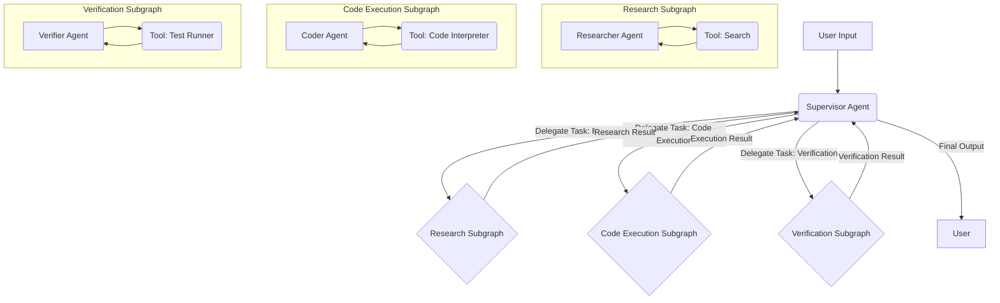

Multi-agent systems, particularly those leveraging large language models (LLMs), present significant challenges in orchestration, state management, and robust error handling. LangGraph, with its state-machine-centric approach, offers a powerful paradigm for constructing such systems. This guide details the construction of a hierarchical multi-agent system, employing a supervisor-worker pattern, specialized subgraphs, shared state schemas, conditional routing, human-in-the-loop (HITL) checkpoints, and error recovery mechanisms. The focus is on production-grade architecture using LangGraph 2026.

<AudioPlayer src="/static/audio/langgraph-multi-agent-supervisors-state-machines.mp3" title="Executive Audio Briefing" voice="Google Cloud en-US-Neural2-F" />


## Architectural Overview: Supervisor-Worker Hierarchy

The core architecture comprises a top-level `Supervisor` agent responsible for delegating tasks to specialized `Worker` subgraphs. Each worker subgraph encapsulates a specific capability, such as research, code execution, or verification. This hierarchical structure promotes modularity, separation of concerns, and simplifies complex workflows into manageable, testable units.



### Shared State Schema

A unified `AgentState` schema is critical for seamless communication and state propagation across the supervisor and its subgraphs. This schema defines the common data structure that flows through the entire graph.

```python
from typing import List, Annotated, TypedDict, Union
from langchain_core.messages import BaseMessage, HumanMessage, AIMessage

class AgentState(TypedDict):
    """
    Represents the state of our multi-agent system.
    This state is shared across all agents and subgraphs.
    """
    messages: Annotated[List[BaseMessage], operator.add]
    next_action: str # The next action the supervisor decides to take
    task: str # The initial task given to the supervisor
    research_results: Annotated[List[str], operator.add]
    code_output: str
    verification_status: str
    error_message: str # For error recovery
    iterations: int # To prevent infinite loops

# Example of how to initialize the state
initial_state = AgentState(
    messages=[HumanMessage(content="Initial task description.")],
    next_action="supervisor_decision",
    task="Initial task description.",
    research_results=[],
    code_output="",
    verification_status="pending",
    error_message="",
    iterations=0
)
```

### Supervisor Agent

The `Supervisor` agent's role is to analyze the current state, determine the next logical step, and route the execution to the appropriate worker subgraph or directly respond. It uses an LLM to make these routing decisions.

```python
import operator
from langgraph.graph import StateGraph, END, START
from langgraph.checkpoint.sqlite import SqliteSaver
from langgraph.prebuilt import ToolNode
from langchain_openai import ChatOpenAI
from langchain_core.prompts import ChatPromptTemplate
from langchain_core.messages import BaseMessage, HumanMessage, AIMessage
from typing import List, Annotated, TypedDict, Union

# Assume AgentState is defined as above

class SupervisorAgent:
    def __init__(self, llm):
        self.llm = llm
        self.prompt = ChatPromptTemplate.from_messages([
            ("system", "You are a highly intelligent supervisor agent. Your goal is to orchestrate a team of specialized agents to complete a given task. Based on the current state and messages, decide the next action. Available actions: {actions}. If the task is complete, respond with 'FINISH'. If an error occurred, respond with 'ERROR_RECOVERY'."),
            ("user", "{messages}")
        ])
        self.router = self.prompt | self.llm.bind_tools(
            tools=[
                {"name": "research", "description": "Delegate to the research agent."},
                {"name": "code_execution", "description": "Delegate to the code execution agent."},
                {"name": "verification", "description": "Delegate to the verification agent."},
                {"name": "finish", "description": "The task is complete."},
                {"name": "error_recovery", "description": "An error occurred, attempt recovery."}
            ]
        )

    def route_agent(self, state: AgentState) -> str:
        """
        Routes the execution based on the supervisor's decision.
        """
        print(f"---SUPERVISOR DECIDING--- Iteration: {state['iterations']}")
        state['iterations'] += 1
        if state['iterations'] > 10: # Safety break
            return "FINISH" # Or "ERROR_RECOVERY"

        response = self.router.invoke({"messages": state["messages"], "actions": ["research", "code_execution", "verification", "FINISH", "ERROR_RECOVERY"]})
        tool_calls = response.tool_calls
        if tool_calls:
            action = tool_calls[0]['name']
            print(f"Supervisor chose: {action}")
            return action
        else:
            # If LLM doesn't call a tool, it might be trying to finish or error
            content = response.content.strip().upper()
            if "FINISH" in content:
                print("Supervisor chose: FINISH")
                return "FINISH"
            elif "ERROR_RECOVERY" in content:
                print("Supervisor chose: ERROR_RECOVERY")
                return "ERROR_RECOVERY"
            else:
                print(f"Supervisor made an ambiguous decision: {content}. Defaulting to FINISH.")
                return "FINISH" # Fallback

```

### Worker Subgraphs: Research, Code Execution, Verification

Each worker subgraph is a self-contained LangGraph instance, operating on the shared `AgentState`. They perform specific tasks and update the state accordingly.

#### Research Subgraph

```python
from langchain_community.tools import DuckDuckGoSearchRun

class ResearchAgent:
    def __init__(self, llm):
        self.llm = llm
        self.search_tool = DuckDuckGoSearchRun()
        self.prompt = ChatPromptTemplate.from_messages([
            ("system", "You are a research assistant. Use the provided search tool to gather information relevant to the user's task. Summarize your findings concisely. If you have enough information, respond with 'DONE'."),
            ("user", "{messages}")
        ])
        self.research_chain = self.prompt | self.llm.bind_tools(tools=[self.search_tool])

    def research_node(self, state: AgentState) -> AgentState:
        print("---RESEARCH AGENT---")
        # Extract the latest human message as the query
        query = state["messages"][-1].content if state["messages"] else state["task"]
        response = self.research_chain.invoke({"messages": state["messages"]})

        tool_calls = response.tool_calls
        if tool_calls:
            # Assuming the research agent will call the search tool
            tool_output = self.search_tool.invoke(tool_calls[0]['args']['query'])
            state["research_results"].append(f"Search result for '{tool_calls[0]['args']['query']}': {tool_output}")
            state["messages"].append(AIMessage(content=f"Performed search. Results added to state. Current research: {tool_output[:100]}..."))
            state["next_action"] = "supervisor_decision" # Return control to supervisor
        else:
            # If no tool call, it means the research agent might be done or summarizing
            state["research_results"].append(response.content)
            state["messages"].append(AIMessage(content=f"Research summary: {response.content}"))
            state["next_action"] = "supervisor_decision" # Return control to supervisor

        return state

# Build the research subgraph
def create_research_subgraph(llm):
    research_agent = ResearchAgent(llm)
    research_graph = StateGraph(AgentState)
    research_graph.add_node("research_node", research_agent.research_node)
    research_graph.add_edge(START, "research_node")
    research_graph.add_edge("research_node", END) # Research node always returns to supervisor
    return research_graph.compile()
```

#### Code Execution Subgraph

This subgraph uses a code interpreter tool. Error handling within the tool execution is crucial.

```python
from langchain_community.tools import PythonREPLTool

class CodeExecutionAgent:
    def __init__(self, llm):
        self.llm = llm
        self.python_repl = PythonREPLTool()
        self.prompt = ChatPromptTemplate.from_messages([
            ("system", "You are a coding assistant. Execute Python code to solve the task. If an error occurs, try to fix it. Respond with 'DONE' when the code is successfully executed and verified."),
            ("user", "{messages}")
        ])
        self.code_chain = self.prompt | self.llm.bind_tools(tools=[self.python_repl])

    def execute_code_node(self, state: AgentState) -> AgentState:
        print("---CODE EXECUTION AGENT---")
        try:
            response = self.code_chain.invoke({"messages": state["messages"]})
            tool_calls = response.tool_calls
            if tool_calls:
                # Assuming the code agent will call the python_repl tool
                code_to_execute = tool_calls[0]['args']['code']
                print(f"Executing code:\n{code_to_execute}")
                tool_output = self.python_repl.invoke({"code": code_to_execute})
                state["code_output"] = tool_output
                state["messages"].append(AIMessage(content=f"Code executed. Output: {tool_output}"))
                state["next_action"] = "supervisor_decision"
            else:
                state["messages"].append(AIMessage(content=f"Code agent response: {response.content}"))
                state["next_action"] = "supervisor_decision" # If no tool call, it might be done or summarizing
        except Exception as e:
            state["error_message"] = f"Code execution failed: {str(e)}"
            state["messages"].append(AIMessage(content=f"Code execution failed: {str(e)}. Attempting error recovery."))
            state["next_action"] = "error_recovery" # Signal supervisor for recovery
        return state

# Build the code execution subgraph
def create_code_execution_subgraph(llm):
    code_agent = CodeExecutionAgent(llm)
    code_graph = StateGraph(AgentState)
    code_graph.add_node("execute_code_node", code_agent.execute_code_node)
    code_graph.add_edge(START, "execute_code_node")
    code_graph.add_edge("execute_code_node", END)
    return code_graph.compile()
```

#### Verification Subgraph

```python
class VerificationAgent:
    def __init__(self, llm):
        self.llm = llm
        self.prompt = ChatPromptTemplate.from_messages([
            ("system", "You are a verification agent. Your task is to verify the results of previous steps, especially code execution. Identify any discrepancies or errors. Respond with 'VERIFIED' if successful, or 'NEEDS_REVISION' if issues are found."),
            ("user", "{messages}")
        ])
        self.verify_chain = self.prompt | self.llm

    def verify_node(self, state: AgentState) -> AgentState:
        print("---VERIFICATION AGENT---")
        response = self.verify_chain.invoke({"messages": state["messages"]})
        verification_result = response.content.strip().upper()

        if "VERIFIED" in verification_result:
            state["verification_status"] = "verified"
            state["messages"].append(AIMessage(content="Verification successful."))
        else:
            state["verification_status"] = "needs_revision"
            state["messages"].append(AIMessage(content=f"Verification failed: {response.content}. Needs revision."))
            state["error_message"] = f"Verification failed: {response.content}" # Set error for potential recovery

        state["next_action"] = "supervisor_decision"
        return state

# Build the verification subgraph
def create_verification_subgraph(llm):
    verification_agent = VerificationAgent(llm)
    verification_graph = StateGraph(AgentState)
    verification_graph.add_node("verify_node", verification_agent.verify_node)
    verification_graph.add_edge(START, "verify_node")
    verification_graph.add_edge("verify_node", END)
    return verification_graph.compile()
```

### Integrating Subgraphs into the Main Graph

The main graph orchestrates the supervisor and its subgraphs. Conditional edges are used for routing.

```python
from langgraph.graph import StateGraph, END, START
from langgraph.checkpoint.sqlite import SqliteSaver
import os

# Initialize LLM (e.g., OpenAI)
# Ensure OPENAI_API_KEY is set in environment variables
llm = ChatOpenAI(model="gpt-4o", temperature=0)

# Create agents and subgraphs
supervisor_agent = SupervisorAgent(llm)
research_subgraph = create_research_subgraph(llm)
code_execution_subgraph = create_code_execution_subgraph(llm)
verification_subgraph = create_verification_subgraph(llm)

# Define the main graph
workflow = StateGraph(AgentState)

# Add nodes for supervisor and subgraphs
workflow.add_node("supervisor_decision", supervisor_agent.route_agent)
workflow.add_node("research", research_subgraph)
workflow.add_node("code_execution", code_execution_subgraph)
workflow.add_node("verification", verification_subgraph)

# Define conditional edges for the supervisor
workflow.add_conditional_edges(
    "supervisor_decision",
    lambda state: state["next_action"], # The supervisor's output determines the next node
    {
        "research": "research",
        "code_execution": "code_execution",
        "verification": "verification",
        "FINISH": END,
        "ERROR_RECOVERY": "error_recovery_node" # Placeholder for error recovery
    }
)

# Add a dedicated error recovery node (can be another agent or a human-in-the-loop)
def error_recovery_node(state: AgentState) -> AgentState:
    print(f"---ERROR RECOVERY--- Error: {state['error_message']}")
    # Here, you could implement more sophisticated recovery logic:
    # - Summarize error and ask supervisor to re-plan
    # - Notify human operator
    # - Attempt a retry with modified parameters
    state["messages"].append(AIMessage(content=f"Attempting error recovery for: {state['error_message']}"))
    state["error_message"] = "" # Clear error after handling attempt
    state["next_action"] = "supervisor_decision" # Return to supervisor for re-evaluation
    return state

workflow.add_node("error_recovery_node", error_recovery_node)
workflow.add_edge("error_recovery_node", "supervisor_decision")

# Edges from subgraphs back to supervisor
workflow.add_edge("research", "supervisor_decision")
workflow.add_edge("code_execution", "supervisor_decision")
workflow.add_edge("verification", "supervisor_decision")

# Set the entry point
workflow.set_entry_point("supervisor_decision")

# Compile the graph with memory
memory = SqliteSaver.from_conn_string(":memory:") # Use a file path for persistence
app = workflow.compile(checkpointer=memory)

# Example execution
config = {"configurable": {"thread_id": "user-task-123"}}
initial_task = "Research the capital of France, then write and execute Python code to calculate 2+2, and verify the result."
initial_messages = [HumanMessage(content=initial_task)]

# First run
print("\n--- Initial Run ---")
for s in app.stream({"messages": initial_messages, "task": initial_task, "iterations": 0}, config=config):
    if "__end__" not in s:
        print(s)
        print("---")

# Retrieve final state
final_state = app.get_state(config)
print("\n--- Final State ---")
print(final_state.values)

# Demonstrate human-in-the-loop (HITL) and rollback
# Imagine a human reviews the state and finds an issue, then modifies it.
# This is where the checkpointer is crucial.

# Let's simulate a human intervention after some steps
# We can load a specific checkpoint or modify the current state
# For demonstration, we'll just modify the current state and re-run
# In a real scenario, a human might edit the state via a UI and then resume.

# Simulate an error in code execution and a human fixing it
# We'll manually set the state to simulate an error and then a fix
# For a real HITL, you'd pause, present the state, allow edits, then resume.

# Let's assume the code execution failed and we want to retry
# We can manually set the state to trigger error recovery or a specific action
# This is a simplified example; a real HITL would involve UI interaction.

# Example of loading a specific checkpoint (if we had multiple saved)
# from langgraph.checkpoint.base import Checkpoint
# checkpoint: Checkpoint = memory.get(config)
# print(f"Loaded checkpoint: {checkpoint}")

# For this example, we'll just re-run from the current state,
# but if we wanted to rollback, we'd load an earlier checkpoint.

# Let's simulate a human reviewing the research and adding more context
print("\n--- Simulating Human Intervention (Adding more research context) ---")
current_state = app.get_state(config).values
current_state["research_results"].append("Human added: Paris is also known as the 'City of Light'.")
current_state["messages"].append(HumanMessage(content="Human review: Added more context about Paris. Please proceed."))
current_state["next_action"] = "supervisor_decision" # Force supervisor to re-evaluate

# Resume from the modified state
print("\n--- Resuming after Human Intervention ---")
for s in app.stream(current_state, config=config):
    if "__end__" not in s:
        print(s)
        print("---")

final_state_after_hitl = app.get_state(config)
print("\n--- Final State After HITL ---")
print(final_state_after_hitl.values)
```

### Production Gotchas & Troubleshooting

1.  **Infinite Loops:** Agents can get stuck in cycles (e.g., research -> supervisor -> research).
    *   **Fix:** Implement an `iterations` counter in `AgentState` and a hard limit. The supervisor should have a `FINISH` or `ERROR_RECOVERY` path if the limit is exceeded.
    *   **Fix:** Ensure supervisor prompts explicitly guide towards completion or error handling.
2.  **LLM Hallucinations/Incorrect Tool Calls:** The supervisor or worker agents might call non-existent tools or provide malformed arguments.
    *   **Fix:** Robust tool definitions with clear descriptions.
    *   **Fix:** Implement `try-except` blocks around tool invocations to catch `ValidationError` or `ToolException`. Route to `error_recovery_node` on failure.
    *   **Fix:** Add a default fallback in the supervisor's conditional routing if the LLM's output doesn't match expected actions.
3.  **State Contamination/Schema Mismatches:** If `AgentState` is not strictly adhered to, agents might overwrite or misinterpret state variables.
    *   **Fix:** Use `TypedDict` for `AgentState` and type hints extensively.
    *   **Fix:** Ensure `Annotated[List[...], operator.add]` is used for accumulating lists to prevent overwriting.
4.  **Checkpointer Persistence Issues:** `SqliteSaver` in-memory is fine for dev, but production requires a persistent store (e.g., PostgresSaver, RedisSaver).
    *   **Fix:** Configure `PostgresSaver` with a proper connection string. Ensure database migrations are handled.
    *   **Fix:** Regularly back up checkpointer data.
5.  **Performance Bottlenecks:** LLM calls are slow.
    *   **Fix:** Cache LLM responses where appropriate (e.g., for common queries).
    *   **Fix:** Optimize prompts to reduce token count.
    *   **Fix:** Consider using smaller, fine-tuned models for specific tasks.
6.  **Human-in-the-Loop (HITL) Integration:** Seamlessly pausing, modifying state, and resuming.
    *   **Fix:** Design a UI that can fetch the current state from the checkpointer, allow edits, and then trigger a resume with the modified state. The `app.stream(modified_state, config=config)` call is key.
7.  **Concurrency:** Multiple users interacting with the system simultaneously.
    *   **Fix:** Each user/task must have a unique `thread_id` in the `config` for the checkpointer to maintain isolated states.

### Architecture & Tradeoffs Comparison

| Feature             | Hierarchical Multi-Agent (LangGraph)                               | Flat Agent (LangChain AgentExecutor)                               | Microservices (Traditional)                                        |
| :------------------ | :----------------------------------------------------------------- | :----------------------------------------------------------------- | :----------------------------------------------------------------- |
| **Complexity**      | Moderate. State machine logic, subgraph composition.               | Low. Single agent, tool selection.                                 | High. Distributed systems, IPC, data consistency.                  |
| **Modularity**      | High. Specialized subgraphs, clear separation of concerns.         | Low. All logic within one agent's prompt/tools.                    | Very High. Independent services.                                   |
| **State Mgmt.**     | Explicit `AgentState` schema, shared across graph. Checkpointing.  | Implicit, often limited to current turn. Less robust recovery.     | Explicit, often external databases. Complex consistency.            |
| **Error Recovery**  | Explicit `error_recovery_node`, state rollback via checkpointer.   | Basic `handle_parsing_errors`, often restarts from scratch.        | Robust, but requires careful design (e.g., sagas, retries).        |
| **HITL**            | Native support via checkpointer for pause/resume/edit.             | Possible, but less structured; often manual intervention.          | Requires custom workflow engines.                                  |
| **Scalability**     | Scales well with stateless LLM calls; state in checkpointer.       | Scales well with stateless LLM calls.                              | Excellent, but operational overhead.                               |
| **Development Speed** | Moderate. Initial setup takes time, but subsequent additions faster. | Fast for simple tasks.                                             | Slow. High initial setup, but independent teams can work in parallel. |
| **Use Case**        | Complex, multi-step workflows, long-running tasks, human oversight. | Simple, single-turn or short-sequence tasks.                       | Large-scale, highly distributed, high-throughput systems.          |

### Frequently Asked Questions

1.  **How do I ensure my `AgentState` is consistent across subgraphs?**
    *   Define a single, canonical `AgentState` `TypedDict` at the top level. All subgraphs and nodes must operate on this exact schema. Use `Annotated[List[...], operator.add]` for lists to ensure append-only behavior, preventing accidental overwrites.
2.  **What's the best way to handle LLM failures or non-deterministic outputs in routing?**
    *   Implement robust conditional edges with a default fallback. For example, if the supervisor's LLM output doesn't exactly match a defined edge, route to a `re_evaluate` node or `error_recovery_node`. Use `try-except` blocks around LLM calls and tool invocations.
3.  **Can I use different LLMs for different agents/subgraphs?**
    *   Absolutely. Each agent (`SupervisorAgent`, `ResearchAgent`, etc.) can be initialized with its own `ChatOpenAI` instance, potentially using different models (e.g., `gpt-3.5-turbo` for simple routing, `gpt-4o` for complex reasoning). This is a common optimization for cost and performance.
4.  **How do I integrate a real-time human interface for HITL?**
    *   Your application's frontend would need to:
        1.  Call `app.get_state(config)` to retrieve the current state for a given `thread_id`.
        2.  Display the state to the human.
        3.  Allow the human to modify specific fields in the state.
        4.  Submit the modified state back to your backend.
        5.  Your backend then calls `app.stream(modified_state, config=config)` to resume the graph from the human-edited point. This effectively "rolls forward" from the modified state.
5.  **When should I use a subgraph versus just a node in the main graph?**
    *   Use a subgraph when a task is complex enough to warrant its own internal state machine, multiple steps, or specialized agents. This promotes modularity and reusability. If a task is a single, atomic operation (e.g., calling one tool and returning), a simple node is sufficient. Subgraphs help manage cognitive load for complex workflows.

This architecture provides a robust foundation for building sophisticated, production-ready multi-agent systems with LangGraph, emphasizing control, observability, and resilience.
