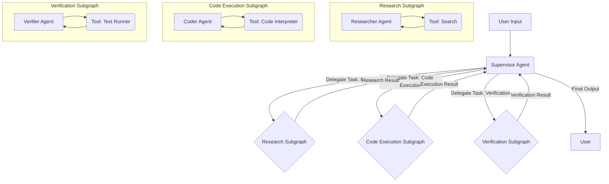

大規模言語モデル（LLM）を活用したマルチエージェントシステムは、オーケストレーション、状態管理、堅牢なエラー処理において大きな課題を提示します。LangGraphは、ステートマシン中心のアプローチにより、このようなシステムを構築するための強力なパラダイムを提供します。このガイドでは、スーパーバイザー・ワーカーパターン、特殊なサブグラフ、共有状態スキーマ、条件付きルーティング、ヒューマン・イン・ザ・ループ（HITL）チェックポイント、およびエラー回復メカニズムを採用した階層型マルチエージェントシステムの構築について詳しく説明します。LangGraph 2026を使用した本番環境レベルのアーキテクチャに焦点を当てています。

<AudioPlayer src="/static/audio/langgraph-multi-agent-supervisors-state-machines-ja.mp3" title="音声エグゼクティブ・ブリーフィング" voice="Google Cloud ja-JP-Neural2-B" />


## アーキテクチャの概要：スーパーバイザー・ワーカー階層

コアアーキテクチャは、トップレベルの`Supervisor`エージェントで構成され、特殊な`Worker`サブグラフにタスクを委任します。各ワーカーサブグラフは、調査、コード実行、検証などの特定の機能をカプセル化します。この階層構造は、モジュール性、関心の分離を促進し、複雑なワークフローを管理可能でテスト可能な単位に簡素化します。



### 共有状態スキーマ

統一された`AgentState`スキーマは、スーパーバイザーとそのサブグラフ間でのシームレスな通信と状態伝播に不可欠です。このスキーマは、グラフ全体を流れる共通のデータ構造を定義します。

```python
from typing import List, Annotated, TypedDict, Union
from langchain_core.messages import BaseMessage, HumanMessage, AIMessage

class AgentState(TypedDict):
    """
    Represents the state of our multi-agent system.
    This state is shared across all agents and subgraphs.
    """
    messages: Annotated[List[BaseMessage], operator.add]
    next_action: str # The next action the supervisor decides to take
    task: str # The initial task given to the supervisor
    research_results: Annotated[List[str], operator.add]
    code_output: str
    verification_status: str
    error_message: str # For error recovery
    iterations: int # To prevent infinite loops

# Example of how to initialize the state
initial_state = AgentState(
    messages=[HumanMessage(content="Initial task description.")],
    next_action="supervisor_decision",
    task="Initial task description.",
    research_results=[],
    code_output="",
    verification_status="pending",
    error_message="",
    iterations=0
)
```

### スーパーバイザーエージェント

`Supervisor`エージェントの役割は、現在の状態を分析し、次の論理的なステップを決定し、実行を適切なワーカーサブグラフにルーティングするか、直接応答することです。これらのルーティング決定にはLLMを使用します。

```python
import operator
from langgraph.graph import StateGraph, END, START
from langgraph.checkpoint.sqlite import SqliteSaver
from langgraph.prebuilt import ToolNode
from langchain_openai import ChatOpenAI
from langchain_core.prompts import ChatPromptTemplate
from langchain_core.messages import BaseMessage, HumanMessage, AIMessage
from typing import List, Annotated, TypedDict, Union

# Assume AgentState is defined as above

class SupervisorAgent:
    def __init__(self, llm):
        self.llm = llm
        self.prompt = ChatPromptTemplate.from_messages([
            ("system", "You are a highly intelligent supervisor agent. Your goal is to orchestrate a team of specialized agents to complete a given task. Based on the current state and messages, decide the next action. Available actions: {actions}. If the task is complete, respond with 'FINISH'. If an error occurred, respond with 'ERROR_RECOVERY'."),
            ("user", "{messages}")
        ])
        self.router = self.prompt | self.llm.bind_tools(
            tools=[
                {"name": "research", "description": "Delegate to the research agent."},
                {"name": "code_execution", "description": "Delegate to the code execution agent."},
                {"name": "verification", "description": "Delegate to the verification agent."},
                {"name": "finish", "description": "The task is complete."},
                {"name": "error_recovery", "description": "An error occurred, attempt recovery."}
            ]
        )

    def route_agent(self, state: AgentState) -> str:
        """
        Routes the execution based on the supervisor's decision.
        """
        print(f"---SUPERVISOR DECIDING--- Iteration: {state['iterations']}")
        state['iterations'] += 1
        if state['iterations'] > 10: # Safety break
            return "FINISH" # Or "ERROR_RECOVERY"

        response = self.router.invoke({"messages": state["messages"], "actions": ["research", "code_execution", "verification", "FINISH", "ERROR_RECOVERY"]})
        tool_calls = response.tool_calls
        if tool_calls:
            action = tool_calls[0]['name']
            print(f"Supervisor chose: {action}")
            return action
        else:
            # If LLM doesn't call a tool, it might be trying to finish or error
            content = response.content.strip().upper()
            if "FINISH" in content:
                print("Supervisor chose: FINISH")
                return "FINISH"
            elif "ERROR_RECOVERY" in content:
                print("Supervisor chose: ERROR_RECOVERY")
                return "ERROR_RECOVERY"
            else:
                print(f"Supervisor made an ambiguous decision: {content}. Defaulting to FINISH.")
                return "FINISH" # Fallback

```

### ワーカーサブグラフ：調査、コード実行、検証

各ワーカーサブグラフは、共有の`AgentState`上で動作する自己完結型のLangGraphインスタンスです。これらは特定のタスクを実行し、それに応じて状態を更新します。

#### 調査サブグラフ

```python
from langchain_community.tools import DuckDuckGoSearchRun

class ResearchAgent:
    def __init__(self, llm):
        self.llm = llm
        self.search_tool = DuckDuckGoSearchRun()
        self.prompt = ChatPromptTemplate.from_messages([
            ("system", "You are a research assistant. Use the provided search tool to gather information relevant to the user's task. Summarize your findings concisely. If you have enough information, respond with 'DONE'."),
            ("user", "{messages}")
        ])
        self.research_chain = self.prompt | self.llm.bind_tools(tools=[self.search_tool])

    def research_node(self, state: AgentState) -> AgentState:
        print("---RESEARCH AGENT---")
        # Extract the latest human message as the query
        query = state["messages"][-1].content if state["messages"] else state["task"]
        response = self.research_chain.invoke({"messages": state["messages"]})

        tool_calls = response.tool_calls
        if tool_calls:
            # Assuming the research agent will call the search tool
            tool_output = self.search_tool.invoke(tool_calls[0]['args']['query'])
            state["research_results"].append(f"Search result for '{tool_calls[0]['args']['query']}': {tool_output}")
            state["messages"].append(AIMessage(content=f"Performed search. Results added to state. Current research: {tool_output[:100]}..."))
            state["next_action"] = "supervisor_decision" # Return control to supervisor
        else:
            # If no tool call, it means the research agent might be done or summarizing
            state["research_results"].append(response.content)
            state["messages"].append(AIMessage(content=f"Research summary: {response.content}"))
            state["next_action"] = "supervisor_decision" # Return control to supervisor

        return state

# Build the research subgraph
def create_research_subgraph(llm):
    research_agent = ResearchAgent(llm)
    research_graph = StateGraph(AgentState)
    research_graph.add_node("research_node", research_agent.research_node)
    research_graph.add_edge(START, "research_node")
    research_graph.add_edge("research_node", END) # Research node always returns to supervisor
    return research_graph.compile()
```

#### コード実行サブグラフ

このサブグラフはコードインタプリタツールを使用します。ツール実行内のエラー処理は非常に重要です。

```python
from langchain_community.tools import PythonREPLTool

class CodeExecutionAgent:
    def __init__(self, llm):
        self.llm = llm
        self.python_repl = PythonREPLTool()
        self.prompt = ChatPromptTemplate.from_messages([
            ("system", "You are a coding assistant. Execute Python code to solve the task. If an error occurs, try to fix it. Respond with 'DONE' when the code is successfully executed and verified."),
            ("user", "{messages}")
        ])
        self.code_chain = self.prompt | self.llm.bind_tools(tools=[self.python_repl])

    def execute_code_node(self, state: AgentState) -> AgentState:
        print("---CODE EXECUTION AGENT---")
        try:
            response = self.code_chain.invoke({"messages": state["messages"]})
            tool_calls = response.tool_calls
            if tool_calls:
                # Assuming the code agent will call the python_repl tool
                code_to_execute = tool_calls[0]['args']['code']
                print(f"Executing code:\n{code_to_execute}")
                tool_output = self.python_repl.invoke({"code": code_to_execute})
                state["code_output"] = tool_output
                state["messages"].append(AIMessage(content=f"Code executed. Output: {tool_output}"))
                state["next_action"] = "supervisor_decision"
            else:
                state["messages"].append(AIMessage(content=f"Code agent response: {response.content}"))
                state["next_action"] = "supervisor_decision" # If no tool call, it might be done or summarizing
        except Exception as e:
            state["error_message"] = f"Code execution failed: {str(e)}"
            state["messages"].append(AIMessage(content=f"Code execution failed: {str(e)}. Attempting error recovery."))
            state["next_action"] = "error_recovery" # Signal supervisor for recovery
        return state

# Build the code execution subgraph
def create_code_execution_subgraph(llm):
    code_agent = CodeExecutionAgent(llm)
    code_graph = StateGraph(AgentState)
    code_graph.add_node("execute_code_node", code_agent.execute_code_node)
    code_graph.add_edge(START, "execute_code_node")
    code_graph.add_edge("execute_code_node", END)
    return code_graph.compile()
```

#### 検証サブグラフ

```python
class VerificationAgent:
    def __init__(self, llm):
        self.llm = llm
        self.prompt = ChatPromptTemplate.from_messages([
            ("system", "You are a verification agent. Your task is to verify the results of previous steps, especially code execution. Identify any discrepancies or errors. Respond with 'VERIFIED' if successful, or 'NEEDS_REVISION' if issues are found."),
            ("user", "{messages}")
        ])
        self.verify_chain = self.prompt | self.llm

    def verify_node(self, state: AgentState) -> AgentState:
        print("---VERIFICATION AGENT---")
        response = self.verify_chain.invoke({"messages": state["messages"]})
        verification_result = response.content.strip().upper()

        if "VERIFIED" in verification_result:
            state["verification_status"] = "verified"
            state["messages"].append(AIMessage(content="Verification successful."))
        else:
            state["verification_status"] = "needs_revision"
            state["messages"].append(AIMessage(content=f"Verification failed: {response.content}. Needs revision."))
            state["error_message"] = f"Verification failed: {response.content}" # Set error for potential recovery

        state["next_action"] = "supervisor_decision"
        return state

# Build the verification subgraph
def create_verification_subgraph(llm):
    verification_agent = VerificationAgent(llm)
    verification_graph = StateGraph(AgentState)
    verification_graph.add_node("verify_node", verification_agent.verify_node)
    verification_graph.add_edge(START, "verify_node")
    verification_graph.add_edge("verify_node", END)
    return verification_graph.compile()
```

### サブグラフのメイングラフへの統合

メイングラフはスーパーバイザーとそのサブグラフをオーケストレーションします。条件付きエッジはルーティングに使用されます。

```python
from langgraph.graph import StateGraph, END, START
from langgraph.checkpoint.sqlite import SqliteSaver
import os

# Initialize LLM (e.g., OpenAI)
# Ensure OPENAI_API_KEY is set in environment variables
llm = ChatOpenAI(model="gpt-4o", temperature=0)

# Create agents and subgraphs
supervisor_agent = SupervisorAgent(llm)
research_subgraph = create_research_subgraph(llm)
code_execution_subgraph = create_code_execution_subgraph(llm)
verification_subgraph = create_verification_subgraph(llm)

# Define the main graph
workflow = StateGraph(AgentState)

# Add nodes for supervisor and subgraphs
workflow.add_node("supervisor_decision", supervisor_agent.route_agent)
workflow.add_node("research", research_subgraph)
workflow.add_node("code_execution", code_execution_subgraph)
workflow.add_node("verification", verification_subgraph)

# Define conditional edges for the supervisor
workflow.add_conditional_edges(
    "supervisor_decision",
    lambda state: state["next_action"], # The supervisor's output determines the next node
    {
        "research": "research",
        "code_execution": "code_execution",
        "verification": "verification",
        "FINISH": END,
        "ERROR_RECOVERY": "error_recovery_node" # Placeholder for error recovery
    }
)

# Add a dedicated error recovery node (can be another agent or a human-in-the-loop)
def error_recovery_node(state: AgentState) -> AgentState:
    print(f"---ERROR RECOVERY--- Error: {state['error_message']}")
    # Here, you could implement more sophisticated recovery logic:
    # - Summarize error and ask supervisor to re-plan
    # - Notify human operator
    # - Attempt a retry with modified parameters
    state["messages"].append(AIMessage(content=f"Attempting error recovery for: {state['error_message']}"))
    state["error_message"] = "" # Clear error after handling attempt
    state["next_action"] = "supervisor_decision" # Return to supervisor for re-evaluation
    return state

workflow.add_node("error_recovery_node", error_recovery_node)
workflow.add_edge("error_recovery_node", "supervisor_decision")

# Edges from subgraphs back to supervisor
workflow.add_edge("research", "supervisor_decision")
workflow.add_edge("code_execution", "supervisor_decision")
workflow.add_edge("verification", "supervisor_decision")

# Set the entry point
workflow.set_entry_point("supervisor_decision")

# Compile the graph with memory
memory = SqliteSaver.from_conn_string(":memory:") # Use a file path for persistence
app = workflow.compile(checkpointer=memory)

# Example execution
config = {"configurable": {"thread_id": "user-task-123"}}
initial_task = "Research the capital of France, then write and execute Python code to calculate 2+2, and verify the result."
initial_messages = [HumanMessage(content=initial_task)]

# First run
print("\n--- Initial Run ---")
for s in app.stream({"messages": initial_messages, "task": initial_task, "iterations": 0}, config=config):
    if "__end__" not in s:
        print(s)
        print("---")

# Retrieve final state
final_state = app.get_state(config)
print("\n--- Final State ---")
print(final_state.values)

# Demonstrate human-in-the-loop (HITL) and rollback
# Imagine a human reviews the state and finds an issue, then modifies it.
# This is where the checkpointer is crucial.

# Let's simulate a human intervention after some steps
# We can load a specific checkpoint or modify the current state
# For demonstration, we'll just modify the current state and re-run
# In a real scenario, a human might edit the state via a UI and then resume.

# Simulate an error in code execution and a human fixing it
# We'll manually set the state to simulate an error and then a fix
# For a real HITL, you'd pause, present the state, allow edits, then resume.

# Let's assume the code execution failed and we want to retry
# We can manually set the state to trigger error recovery or a specific action
# This is a simplified example; a real HITL would involve UI interaction.

# Example of loading a specific checkpoint (if we had multiple saved)
# from langgraph.checkpoint.base import Checkpoint
# checkpoint: Checkpoint = memory.get(config)
# print(f"Loaded checkpoint: {checkpoint}")

# For this example, we'll just re-run from the current state,
# but if we wanted to rollback, we'd load an earlier checkpoint.

# Let's simulate a human reviewing the research and adding more context
print("\n--- Simulating Human Intervention (Adding more research context) ---")
current_state = app.get_state(config).values
current_state["research_results"].append("Human added: Paris is also known as the 'City of Light'.")
current_state["messages"].append(HumanMessage(content="Human review: Added more context about Paris. Please proceed."))
current_state["next_action"] = "supervisor_decision" # Force supervisor to re-evaluate

# Resume from the modified state
print("\n--- Resuming after Human Intervention ---")
for s in app.stream(current_state, config=config):
    if "__end__" not in s:
        print(s)
        print("---")

final_state_after_hitl = app.get_state(config)
print("\n--- Final State After HITL ---")
print(final_state_after_hitl.values)
```

### 本番環境での落とし穴とトラブルシューティング

1.  **無限ループ:** エージェントがサイクル（例：調査 -> スーパーバイザー -> 調査）に陥ることがあります。
    *   **修正:** `iterations`に`AgentState`カウンターとハードリミットを実装します。リミットを超えた場合、スーパーバイザーは`FINISH`または`ERROR_RECOVERY`パスを持つべきです。
    *   **修正:** スーパーバイザーのプロンプトが完了またはエラー処理を明示的に指示するようにします。
2.  **LLMの幻覚/不正確なツール呼び出し:** スーパーバイザーまたはワーカーエージェントが、存在しないツールを呼び出したり、不正な引数を提供したりすることがあります。
    *   **修正:** 明確な説明を持つ堅牢なツール定義。
    *   **修正:** ツール呼び出しの周囲に`try-except`ブロックを実装し、`ValidationError`または`ToolException`を捕捉します。失敗時には`error_recovery_node`にルーティングします。
    *   **修正:** LLMの出力が期待されるアクションと一致しない場合、スーパーバイザーの条件付きルーティングにデフォルトのフォールバックを追加します。
3.  **状態汚染/スキーマの不一致:** `AgentState`が厳密に遵守されていない場合、エージェントが状態変数を上書きしたり誤解したりする可能性があります。
    *   **修正:** `AgentState`には`TypedDict`を、型ヒントを広範囲に使用します。
    *   **修正:** 上書きを防ぐために、リストの累積には`Annotated[List[...], operator.add]`が使用されていることを確認します。
4.  **チェックポインターの永続化の問題:** 開発環境では`SqliteSaver`インメモリで問題ありませんが、本番環境では永続ストア（例：PostgresSaver、RedisSaver）が必要です。
    *   **修正:** 適切な接続文字列で`PostgresSaver`を設定します。データベースのマイグレーションが処理されていることを確認します。
    *   **修正:** チェックポインターデータを定期的にバックアップします。
5.  **パフォーマンスのボトルネック:** LLMの呼び出しは遅いです。
    *   **修正:** 適切な場所でLLMの応答をキャッシュします（例：一般的なクエリの場合）。
    *   **修正:** トークン数を減らすためにプロンプトを最適化します。
    *   **修正:** 特定のタスクには、より小さく、ファインチューニングされたモデルの使用を検討します。
6.  **ヒューマン・イン・ザ・ループ（HITL）統合:** シームレスな一時停止、状態の変更、再開。
    *   **修正:** チェックポインターから現在の状態を取得し、編集を許可し、変更された状態で再開をトリガーできるUIを設計します。`app.stream(modified_state, config=config)`呼び出しが鍵となります。
7.  **並行性:** 複数のユーザーがシステムと同時にやり取りする場合。
    *   **修正:** 各ユーザー/タスクは、チェックポインターが分離された状態を維持するために、`config`に一意の`thread_id`を持つ必要があります。

### アーキテクチャとトレードオフの比較

| 機能                | 階層型マルチエージェント (LangGraph)                               | フラットエージェント (LangChain AgentExecutor)                             | マイクロサービス (従来型)                                        |
| :------------------ | :----------------------------------------------------------------- | :----------------------------------------------------------------- | :----------------------------------------------------------------- |
| **複雑性**          | 中程度。ステートマシンロジック、サブグラフ構成。                   | 低。単一エージェント、ツール選択。                                 | 高。分散システム、IPC、データ一貫性。                              |
| **モジュール性**    | 高。特殊なサブグラフ、明確な関心の分離。                           | 低。すべてのロジックが1つのエージェントのプロンプト/ツール内。     | 非常に高。独立したサービス。                                       |
| **状態管理**        | 明示的な`AgentState`スキーマ、グラフ全体で共有。チェックポイント。 | 暗黙的、多くの場合現在のターンに限定される。回復力が低い。         | 明示的、多くの場合外部データベース。複雑な一貫性。                 |
| **エラー回復**      | 明示的な`error_recovery_node`、チェックポインターによる状態ロールバック。 | 基本的な`handle_parsing_errors`、多くの場合最初から再開。                          | 堅牢だが、慎重な設計が必要（例：Saga、リトライ）。                 |
| **HITL**            | チェックポインターによる一時停止/再開/編集のネイティブサポート。   | 可能だが、構造化されていない。多くの場合手動介入。                 | カスタムワークフローエンジンが必要。                               |
| **スケーラビリティ** | ステートレスなLLM呼び出しでうまくスケール。状態はチェックポインターに。 | ステートレスなLLM呼び出しでうまくスケール。                        | 非常に優れているが、運用上のオーバーヘッドがある。                 |
| **開発速度**        | 中程度。初期設定には時間がかかるが、その後の追加は速い。           | 単純なタスクには速い。                                             | 遅い。初期設定に時間がかかるが、独立したチームが並行して作業できる。 |
| **ユースケース**    | 複雑な多段階ワークフロー、長時間実行タスク、人間の監視。           | 単純な単一ターンまたは短いシーケンスのタスク。                     | 大規模、高度に分散された、高スループットシステム。                 |

### よくある質問

1.  **`AgentState`がサブグラフ間で一貫していることをどのように保証しますか？**
    *   トップレベルで単一の正規の`AgentState` `TypedDict`を定義します。すべてのサブグラフとノードは、この正確なスキーマで動作する必要があります。偶発的な上書きを防ぐために、リストには追加専用の動作を保証する`Annotated[List[...], operator.add]`を使用します。
2.  **ルーティングにおけるLLMの障害や非決定的な出力を処理する最善の方法は何ですか？**
    *   デフォルトのフォールバックを備えた堅牢な条件付きエッジを実装します。たとえば、スーパーバイザーのLLM出力が定義されたエッジと正確に一致しない場合、`re_evaluate`ノードまたは`error_recovery_node`にルーティングします。LLM呼び出しとツール呼び出しの周囲に`try-except`ブロックを使用します。
3.  **異なるエージェント/サブグラフに異なるLLMを使用できますか？**
    *   もちろんです。各エージェント（`SupervisorAgent`、`ResearchAgent`など）は、独自の`ChatOpenAI`インスタンスで初期化でき、異なるモデル（例：単純なルーティングには`gpt-3.5-turbo`、複雑な推論には`gpt-4o`）を使用できます。これはコストとパフォーマンスの一般的な最適化です。
4.  **HITLのためのリアルタイムの人間インターフェースをどのように統合しますか？**
    *   アプリケーションのフロントエンドは次のことを行う必要があります。
        1.  特定の`thread_id`の現在の状態を取得するために`app.get_state(config)`を呼び出す。
        2.  状態を人間に表示する。
        3.  人間が状態の特定のフィールドを変更できるようにする。
        4.  変更された状態をバックエンドに送信する。
        5.  バックエンドは、人間が編集した時点からグラフを再開するために`app.stream(modified_state, config=config)`を呼び出す。これにより、変更された状態から効果的に「前進」します。
5.  **メイングラフのノードではなく、サブグラフを使用すべきなのはいつですか？**
    *   タスクが独自の内部ステートマシン、複数のステップ、または特殊なエージェントを必要とするほど複雑な場合にサブグラフを使用します。これにより、モジュール性と再利用性が促進されます。タスクが単一の原子的な操作（例：1つのツールを呼び出して返す）である場合は、単純なノードで十分です。サブグラフは、複雑なワークフローの認知負荷を管理するのに役立ちます。

このアーキテクチャは、LangGraphを使用して洗練された本番環境対応のマルチエージェントシステムを構築するための堅牢な基盤を提供し、制御、可観測性、回復力を重視しています。

## 知識を確認する（インタラクティブクイズ）

<Quiz questions={
  [
    {
      "question": "LangGraphのプロダクション環境におけるスーパーバイザー・ワーカーパターンを利用したマルチエージェントシステムにおいて、特にエラーハンドリングとhuman-in-the-loop (HITL) チェックポイントを考慮した場合、共有の`AgentState`スキーマを持つことの主要なアーキテクチャ上の利点は何ですか？",
      "options": [
        "各ワーカーサブグラフが独自の分離された状態を維持し、データ破損を防ぐことができます。",
        "個々の状態管理サービスの数を減らすことで、デプロイプロセスを簡素化します。",
        "すべてのエージェントとサブグラフ間で一貫したデータ構造を確保し、通信と状態伝播を可能にし、統合されたロギング、デバッグ、および状態回復を容易にします。",
        "エージェントが使用する異なるプログラミング言語間のメッセージのすべてのシリアライズとデシリアライズを自動的に処理します。"
      ],
      "correctAnswer": 2,
      "explanation": "共有の`AgentState`スキーマは、システムの進行状況とデータの一貫したビューを維持するために不可欠です。この一貫性は、統合されたロギング、デバッグ、そして特に堅牢なエラー回復とHITLチェックポイントにとって極めて重要であり、既知の一貫した状態からシステムを検査し、場合によっては変更することを可能にします。分離された状態（選択肢0）は調整を妨げます。デプロイの簡素化（選択肢1）は二次的な効果であり、主要なアーキテクチャ上の利点ではありません。自動的なシリアライズ/デシリアライズ（選択肢3）は、基盤となるフレームワークまたはライブラリの機能であり、スキーマ自体のものではありません。"
    },
    {
      "question": "記述された階層型マルチエージェントシステムにおいて、`Code Execution Subgraph`がランタイムエラー（例：無効な構文、依存関係の問題）に頻繁に遭遇するプロダクションシナリオを考えます。提供された`AgentState`とアーキテクチャパターンを活用して、これらのエラーを処理し、潜在的に回復するための最も堅牢でスケーラブルなアプローチは次のうちどれですか？",
      "options": [
        "`Code Execution Subgraph`自体にリトライメカニズムを実装し、失敗を報告する前にコード実行を複数回試行します。",
        "`Supervisor`エージェントを変更し、`Code Execution Subgraph`から`error_message`を受信した際に、フローを`Debugging Subgraph`にルーティングして分析とコード修正を行い、その後元のタスクを再試行する条件付きルートを含めます。",
        "カスケード障害を防ぐため、`Code Execution Subgraph`でエラーが発生した場合は、マルチエージェントシステムプロセス全体を直ちに終了します。",
        "エラーをファイルにログ記録し、人間のオペレーターに通知し、コード実行の失敗ごとに手動介入を要求します。"
      ],
      "correctAnswer": 1,
      "explanation": "`Supervisor`を活用して専用の`Debugging Subgraph`にルーティングする（選択肢1）のが、最も堅牢でスケーラブルなアプローチです。これは、階層的でステートマシン中心の設計と一致しています。共有`AgentState`内の`error_message`は、スーパーバイザーが情報に基づいた決定を下すために必要なコンテキストを提供します。サブグラフ内のリトライメカニズム（選択肢0）は根本原因に対処できない可能性があり、無限ループやリソースの無駄につながる可能性があります。システムを終了する（選択肢2）のは、プロダクション環境では堅牢ではありません。手動介入（選択肢3）は、頻繁なエラーに対してスケーラブルではなく、自律型エージェントシステムの目的を損ないます。"
    }
  ]
} />

