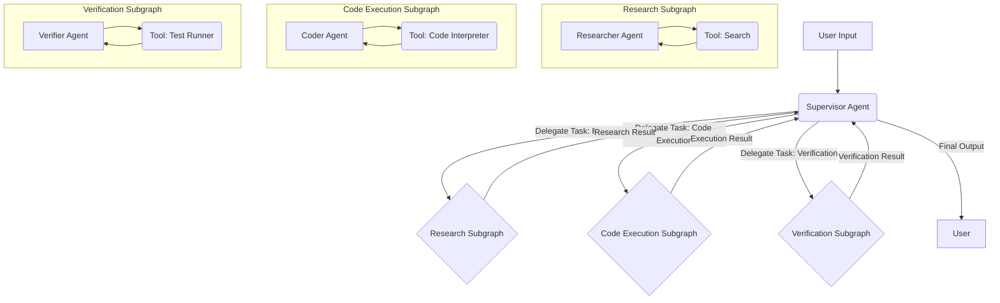

Các hệ thống đa tác nhân, đặc biệt là những hệ thống tận dụng các mô hình ngôn ngữ lớn (LLM), đặt ra những thách thức đáng kể trong việc điều phối, quản lý trạng thái và xử lý lỗi mạnh mẽ. LangGraph, với cách tiếp cận lấy máy trạng thái làm trung tâm, cung cấp một mô hình mạnh mẽ để xây dựng các hệ thống như vậy. Hướng dẫn này trình bày chi tiết việc xây dựng một hệ thống đa tác nhân phân cấp, sử dụng mô hình giám sát-người thực thi (supervisor-worker), các đồ thị con chuyên biệt, lược đồ trạng thái chia sẻ, định tuyến có điều kiện, các điểm kiểm tra có sự can thiệp của con người (HITL) và các cơ chế phục hồi lỗi. Trọng tâm là kiến trúc cấp độ sản phẩm sử dụng LangGraph 2026.

<AudioPlayer src="/static/audio/langgraph-multi-agent-supervisors-state-machines-vi.mp3" title="Tóm tắt âm thanh cho kỹ sư" voice="Google Cloud vi-VN-Neural2-A" />


## Tổng quan kiến trúc: Phân cấp Giám sát-Người thực thi

Kiến trúc cốt lõi bao gồm một tác nhân `Supervisor` cấp cao nhất chịu trách nhiệm ủy quyền các tác vụ cho các đồ thị con `Worker` chuyên biệt. Mỗi đồ thị con của người thực thi gói gọn một khả năng cụ thể, chẳng hạn như nghiên cứu, thực thi mã hoặc xác minh. Cấu trúc phân cấp này thúc đẩy tính mô-đun, phân tách các mối quan tâm và đơn giản hóa các quy trình làm việc phức tạp thành các đơn vị dễ quản lý và kiểm thử.



### Lược đồ trạng thái chia sẻ

Một lược đồ `AgentState` thống nhất là rất quan trọng để giao tiếp liền mạch và truyền trạng thái giữa giám sát viên và các đồ thị con của nó. Lược đồ này định nghĩa cấu trúc dữ liệu chung chảy qua toàn bộ đồ thị.

```python
from typing import List, Annotated, TypedDict, Union
from langchain_core.messages import BaseMessage, HumanMessage, AIMessage

class AgentState(TypedDict):
    """
    Represents the state of our multi-agent system.
    This state is shared across all agents and subgraphs.
    """
    messages: Annotated[List[BaseMessage], operator.add]
    next_action: str # The next action the supervisor decides to take
    task: str # The initial task given to the supervisor
    research_results: Annotated[List[str], operator.add]
    code_output: str
    verification_status: str
    error_message: str # For error recovery
    iterations: int # To prevent infinite loops

# Example of how to initialize the state
initial_state = AgentState(
    messages=[HumanMessage(content="Initial task description.")],
    next_action="supervisor_decision",
    task="Initial task description.",
    research_results=[],
    code_output="",
    verification_status="pending",
    error_message="",
    iterations=0
)
```

### Tác nhân giám sát

Vai trò của tác nhân `Supervisor` là phân tích trạng thái hiện tại, xác định bước logic tiếp theo và định tuyến thực thi đến đồ thị con của người thực thi thích hợp hoặc phản hồi trực tiếp. Nó sử dụng một LLM để đưa ra các quyết định định tuyến này.

```python
import operator
from langgraph.graph import StateGraph, END, START
from langgraph.checkpoint.sqlite import SqliteSaver
from langgraph.prebuilt import ToolNode
from langchain_openai import ChatOpenAI
from langchain_core.prompts import ChatPromptTemplate
from langchain_core.messages import BaseMessage, HumanMessage, AIMessage
from typing import List, Annotated, TypedDict, Union

# Assume AgentState is defined as above

class SupervisorAgent:
    def __init__(self, llm):
        self.llm = llm
        self.prompt = ChatPromptTemplate.from_messages([
            ("system", "You are a highly intelligent supervisor agent. Your goal is to orchestrate a team of specialized agents to complete a given task. Based on the current state and messages, decide the next action. Available actions: {actions}. If the task is complete, respond with 'FINISH'. If an error occurred, respond with 'ERROR_RECOVERY'."),
            ("user", "{messages}")
        ])
        self.router = self.prompt | self.llm.bind_tools(
            tools=[
                {"name": "research", "description": "Delegate to the research agent."},
                {"name": "code_execution", "description": "Delegate to the code execution agent."},
                {"name": "verification", "description": "Delegate to the verification agent."},
                {"name": "finish", "description": "The task is complete."},
                {"name": "error_recovery", "description": "An error occurred, attempt recovery."}
            ]
        )

    def route_agent(self, state: AgentState) -> str:
        """
        Routes the execution based on the supervisor's decision.
        """
        print(f"---SUPERVISOR DECIDING--- Iteration: {state['iterations']}")
        state['iterations'] += 1
        if state['iterations'] > 10: # Safety break
            return "FINISH" # Or "ERROR_RECOVERY"

        response = self.router.invoke({"messages": state["messages"], "actions": ["research", "code_execution", "verification", "FINISH", "ERROR_RECOVERY"]})
        tool_calls = response.tool_calls
        if tool_calls:
            action = tool_calls[0]['name']
            print(f"Supervisor chose: {action}")
            return action
        else:
            # If LLM doesn't call a tool, it might be trying to finish or error
            content = response.content.strip().upper()
            if "FINISH" in content:
                print("Supervisor chose: FINISH")
                return "FINISH"
            elif "ERROR_RECOVERY" in content:
                print("Supervisor chose: ERROR_RECOVERY")
                return "ERROR_RECOVERY"
            else:
                print(f"Supervisor made an ambiguous decision: {content}. Defaulting to FINISH.")
                return "FINISH" # Fallback

```

### Đồ thị con của người thực thi: Nghiên cứu, Thực thi mã, Xác minh

Mỗi đồ thị con của người thực thi là một phiên bản LangGraph độc lập, hoạt động trên `AgentState` được chia sẻ. Chúng thực hiện các tác vụ cụ thể và cập nhật trạng thái tương ứng.

#### Đồ thị con nghiên cứu

```python
from langchain_community.tools import DuckDuckGoSearchRun

class ResearchAgent:
    def __init__(self, llm):
        self.llm = llm
        self.search_tool = DuckDuckGoSearchRun()
        self.prompt = ChatPromptTemplate.from_messages([
            ("system", "You are a research assistant. Use the provided search tool to gather information relevant to the user's task. Summarize your findings concisely. If you have enough information, respond with 'DONE'."),
            ("user", "{messages}")
        ])
        self.research_chain = self.prompt | self.llm.bind_tools(tools=[self.search_tool])

    def research_node(self, state: AgentState) -> AgentState:
        print("---RESEARCH AGENT---")
        # Extract the latest human message as the query
        query = state["messages"][-1].content if state["messages"] else state["task"]
        response = self.research_chain.invoke({"messages": state["messages"]})

        tool_calls = response.tool_calls
        if tool_calls:
            # Assuming the research agent will call the search tool
            tool_output = self.search_tool.invoke(tool_calls[0]['args']['query'])
            state["research_results"].append(f"Search result for '{tool_calls[0]['args']['query']}': {tool_output}")
            state["messages"].append(AIMessage(content=f"Performed search. Results added to state. Current research: {tool_output[:100]}..."))
            state["next_action"] = "supervisor_decision" # Return control to supervisor
        else:
            # If no tool call, it means the research agent might be done or summarizing
            state["research_results"].append(response.content)
            state["messages"].append(AIMessage(content=f"Research summary: {response.content}"))
            state["next_action"] = "supervisor_decision" # Return control to supervisor

        return state

# Build the research subgraph
def create_research_subgraph(llm):
    research_agent = ResearchAgent(llm)
    research_graph = StateGraph(AgentState)
    research_graph.add_node("research_node", research_agent.research_node)
    research_graph.add_edge(START, "research_node")
    research_graph.add_edge("research_node", END) # Research node always returns to supervisor
    return research_graph.compile()
```

#### Đồ thị con thực thi mã

Đồ thị con này sử dụng một công cụ thông dịch mã. Xử lý lỗi trong quá trình thực thi công cụ là rất quan trọng.

```python
from langchain_community.tools import PythonREPLTool

class CodeExecutionAgent:
    def __init__(self, llm):
        self.llm = llm
        self.python_repl = PythonREPLTool()
        self.prompt = ChatPromptTemplate.from_messages([
            ("system", "You are a coding assistant. Execute Python code to solve the task. If an error occurs, try to fix it. Respond with 'DONE' when the code is successfully executed and verified."),
            ("user", "{messages}")
        ])
        self.code_chain = self.prompt | self.llm.bind_tools(tools=[self.python_repl])

    def execute_code_node(self, state: AgentState) -> AgentState:
        print("---CODE EXECUTION AGENT---")
        try:
            response = self.code_chain.invoke({"messages": state["messages"]})
            tool_calls = response.tool_calls
            if tool_calls:
                # Assuming the code agent will call the python_repl tool
                code_to_execute = tool_calls[0]['args']['code']
                print(f"Executing code:\n{code_to_execute}")
                tool_output = self.python_repl.invoke({"code": code_to_execute})
                state["code_output"] = tool_output
                state["messages"].append(AIMessage(content=f"Code executed. Output: {tool_output}"))
                state["next_action"] = "supervisor_decision"
            else:
                state["messages"].append(AIMessage(content=f"Code agent response: {response.content}"))
                state["next_action"] = "supervisor_decision" # If no tool call, it might be done or summarizing
        except Exception as e:
            state["error_message"] = f"Code execution failed: {str(e)}"
            state["messages"].append(AIMessage(content=f"Code execution failed: {str(e)}. Attempting error recovery."))
            state["next_action"] = "error_recovery" # Signal supervisor for recovery
        return state

# Build the code execution subgraph
def create_code_execution_subgraph(llm):
    code_agent = CodeExecutionAgent(llm)
    code_graph = StateGraph(AgentState)
    code_graph.add_node("execute_code_node", code_agent.execute_code_node)
    code_graph.add_edge(START, "execute_code_node")
    code_graph.add_edge("execute_code_node", END)
    return code_graph.compile()
```

#### Đồ thị con xác minh

```python
class VerificationAgent:
    def __init__(self, llm):
        self.llm = llm
        self.prompt = ChatPromptTemplate.from_messages([
            ("system", "You are a verification agent. Your task is to verify the results of previous steps, especially code execution. Identify any discrepancies or errors. Respond with 'VERIFIED' if successful, or 'NEEDS_REVISION' if issues are found."),
            ("user", "{messages}")
        ])
        self.verify_chain = self.prompt | self.llm

    def verify_node(self, state: AgentState) -> AgentState:
        print("---VERIFICATION AGENT---")
        response = self.verify_chain.invoke({"messages": state["messages"]})
        verification_result = response.content.strip().upper()

        if "VERIFIED" in verification_result:
            state["verification_status"] = "verified"
            state["messages"].append(AIMessage(content="Verification successful."))
        else:
            state["verification_status"] = "needs_revision"
            state["messages"].append(AIMessage(content=f"Verification failed: {response.content}. Needs revision."))
            state["error_message"] = f"Verification failed: {response.content}" # Set error for potential recovery

        state["next_action"] = "supervisor_decision"
        return state

# Build the verification subgraph
def create_verification_subgraph(llm):
    verification_agent = VerificationAgent(llm)
    verification_graph = StateGraph(AgentState)
    verification_graph.add_node("verify_node", verification_agent.verify_node)
    verification_graph.add_edge(START, "verify_node")
    verification_graph.add_edge("verify_node", END)
    return verification_graph.compile()
```

### Tích hợp các đồ thị con vào đồ thị chính

Đồ thị chính điều phối giám sát viên và các đồ thị con của nó. Các cạnh có điều kiện được sử dụng để định tuyến.

```python
from langgraph.graph import StateGraph, END, START
from langgraph.checkpoint.sqlite import SqliteSaver
import os

# Initialize LLM (e.g., OpenAI)
# Ensure OPENAI_API_KEY is set in environment variables
llm = ChatOpenAI(model="gpt-4o", temperature=0)

# Create agents and subgraphs
supervisor_agent = SupervisorAgent(llm)
research_subgraph = create_research_subgraph(llm)
code_execution_subgraph = create_code_execution_subgraph(llm)
verification_subgraph = create_verification_subgraph(llm)

# Define the main graph
workflow = StateGraph(AgentState)

# Add nodes for supervisor and subgraphs
workflow.add_node("supervisor_decision", supervisor_agent.route_agent)
workflow.add_node("research", research_subgraph)
workflow.add_node("code_execution", code_execution_subgraph)
workflow.add_node("verification", verification_subgraph)

# Define conditional edges for the supervisor
workflow.add_conditional_edges(
    "supervisor_decision",
    lambda state: state["next_action"], # The supervisor's output determines the next node
    {
        "research": "research",
        "code_execution": "code_execution",
        "verification": "verification",
        "FINISH": END,
        "ERROR_RECOVERY": "error_recovery_node" # Placeholder for error recovery
    }
)

# Add a dedicated error recovery node (can be another agent or a human-in-the-loop)
def error_recovery_node(state: AgentState) -> AgentState:
    print(f"---ERROR RECOVERY--- Error: {state['error_message']}")
    # Here, you could implement more sophisticated recovery logic:
    # - Summarize error and ask supervisor to re-plan
    # - Notify human operator
    # - Attempt a retry with modified parameters
    state["messages"].append(AIMessage(content=f"Attempting error recovery for: {state['error_message']}"))
    state["error_message"] = "" # Clear error after handling attempt
    state["next_action"] = "supervisor_decision" # Return to supervisor for re-evaluation
    return state

workflow.add_node("error_recovery_node", error_recovery_node)
workflow.add_edge("error_recovery_node", "supervisor_decision")

# Edges from subgraphs back to supervisor
workflow.add_edge("research", "supervisor_decision")
workflow.add_edge("code_execution", "supervisor_decision")
workflow.add_edge("verification", "supervisor_decision")

# Set the entry point
workflow.set_entry_point("supervisor_decision")

# Compile the graph with memory
memory = SqliteSaver.from_conn_string(":memory:") # Use a file path for persistence
app = workflow.compile(checkpointer=memory)

# Example execution
config = {"configurable": {"thread_id": "user-task-123"}}
initial_task = "Research the capital of France, then write and execute Python code to calculate 2+2, and verify the result."
initial_messages = [HumanMessage(content=initial_task)]

# First run
print("\n--- Initial Run ---")
for s in app.stream({"messages": initial_messages, "task": initial_task, "iterations": 0}, config=config):
    if "__end__" not in s:
        print(s)
        print("---")

# Retrieve final state
final_state = app.get_state(config)
print("\n--- Final State ---")
print(final_state.values)

# Demonstrate human-in-the-loop (HITL) and rollback
# Imagine a human reviews the state and finds an issue, then modifies it.
# This is where the checkpointer is crucial.

# Let's simulate a human intervention after some steps
# We can load a specific checkpoint or modify the current state
# For demonstration, we'll just modify the current state and re-run
# In a real scenario, a human might edit the state via a UI and then resume.

# Simulate an error in code execution and a human fixing it
# We'll manually set the state to simulate an error and then a fix
# For a real HITL, you'd pause, present the state, allow edits, then resume.

# Let's assume the code execution failed and we want to retry
# We can manually set the state to trigger error recovery or a specific action
# This is a simplified example; a real HITL would involve UI interaction.

# Example of loading a specific checkpoint (if we had multiple saved)
# from langgraph.checkpoint.base import Checkpoint
# checkpoint: Checkpoint = memory.get(config)
# print(f"Loaded checkpoint: {checkpoint}")

# For this example, we'll just re-run from the current state,
# but if we wanted to rollback, we'd load an earlier checkpoint.

# Let's simulate a human reviewing the research and adding more context
print("\n--- Simulating Human Intervention (Adding more research context) ---")
current_state = app.get_state(config).values
current_state["research_results"].append("Human added: Paris is also known as the 'City of Light'.")
current_state["messages"].append(HumanMessage(content="Human review: Added more context about Paris. Please proceed."))
current_state["next_action"] = "supervisor_decision" # Force supervisor to re-evaluate

# Resume from the modified state
print("\n--- Resuming after Human Intervention ---")
for s in app.stream(current_state, config=config):
    if "__end__" not in s:
        print(s)
        print("---")

final_state_after_hitl = app.get_state(config)
print("\n--- Final State After HITL ---")
print(final_state_after_hitl.values)
```

### Những vấn đề và cách khắc phục trong sản xuất

1.  **Vòng lặp vô hạn:** Các tác nhân có thể bị kẹt trong các chu kỳ (ví dụ: nghiên cứu -> giám sát -> nghiên cứu).
    *   **Cách khắc phục:** Triển khai bộ đếm `iterations` trong `AgentState` và một giới hạn cứng. Giám sát viên nên có một đường dẫn `FINISH` hoặc `ERROR_RECOVERY` nếu vượt quá giới hạn.
    *   **Cách khắc phục:** Đảm bảo các lời nhắc của giám sát viên hướng dẫn rõ ràng đến việc hoàn thành hoặc xử lý lỗi.
2.  **Ảo giác của LLM/Gọi công cụ không chính xác:** Giám sát viên hoặc các tác nhân người thực thi có thể gọi các công cụ không tồn tại hoặc cung cấp các đối số không đúng định dạng.
    *   **Cách khắc phục:** Định nghĩa công cụ mạnh mẽ với mô tả rõ ràng.
    *   **Cách khắc phục:** Triển khai các khối `try-except` xung quanh các lời gọi công cụ để bắt `ValidationError` hoặc `ToolException`. Định tuyến đến `error_recovery_node` khi thất bại.
    *   **Cách khắc phục:** Thêm một dự phòng mặc định trong định tuyến có điều kiện của giám sát viên nếu đầu ra của LLM không khớp với các hành động dự kiến.
3.  **Nhiễm bẩn trạng thái/Không khớp lược đồ:** Nếu `AgentState` không được tuân thủ nghiêm ngặt, các tác nhân có thể ghi đè hoặc hiểu sai các biến trạng thái.
    *   **Cách khắc phục:** Sử dụng `TypedDict` cho `AgentState` và các gợi ý kiểu dữ liệu rộng rãi.
    *   **Cách khắc phục:** Đảm bảo `Annotated[List[...], operator.add]` được sử dụng để tích lũy danh sách nhằm ngăn chặn việc ghi đè.
4.  **Sự cố về tính bền vững của Checkpointer:** `SqliteSaver` trong bộ nhớ là tốt cho phát triển, nhưng sản xuất yêu cầu một kho lưu trữ bền vững (ví dụ: PostgresSaver, RedisSaver).
    *   **Cách khắc phục:** Cấu hình `PostgresSaver` với một chuỗi kết nối phù hợp. Đảm bảo các di chuyển cơ sở dữ liệu được xử lý.
    *   **Cách khắc phục:** Thường xuyên sao lưu dữ liệu checkpointer.
5.  **Nút thắt cổ chai hiệu suất:** Các lời gọi LLM chậm.
    *   **Cách khắc phục:** Lưu trữ phản hồi của LLM vào bộ nhớ đệm khi thích hợp (ví dụ: cho các truy vấn phổ biến).
    *   **Cách khắc phục:** Tối ưu hóa lời nhắc để giảm số lượng token.
    *   **Cách khắc phục:** Cân nhắc sử dụng các mô hình nhỏ hơn, được tinh chỉnh cho các tác vụ cụ thể.
6.  **Tích hợp Human-in-the-Loop (HITL):** Tạm dừng, sửa đổi trạng thái và tiếp tục liền mạch.
    *   **Cách khắc phục:** Thiết kế giao diện người dùng có thể lấy trạng thái hiện tại từ checkpointer, cho phép chỉnh sửa và sau đó kích hoạt tiếp tục với trạng thái đã sửa đổi. Lời gọi `app.stream(modified_state, config=config)` là chìa khóa.
7.  **Đồng thời:** Nhiều người dùng tương tác với hệ thống cùng lúc.
    *   **Cách khắc phục:** Mỗi người dùng/tác vụ phải có một `thread_id` duy nhất trong `config` để checkpointer duy trì các trạng thái riêng biệt.

### So sánh kiến trúc và đánh đổi

| Tính năng           | Hệ thống đa tác nhân phân cấp (LangGraph)                     | Tác nhân phẳng (LangChain AgentExecutor)                      | Microservices (Truyền thống)                                 |
| :------------------ | :------------------------------------------------------------ | :------------------------------------------------------------ | :------------------------------------------------------------ |
| **Độ phức tạp**     | Trung bình. Logic máy trạng thái, thành phần đồ thị con.      | Thấp. Một tác nhân duy nhất, lựa chọn công cụ.                | Cao. Hệ thống phân tán, IPC, tính nhất quán dữ liệu.          |
| **Tính mô-đun**     | Cao. Các đồ thị con chuyên biệt, phân tách rõ ràng các mối quan tâm. | Thấp. Tất cả logic trong lời nhắc/công cụ của một tác nhân.   | Rất cao. Các dịch vụ độc lập.                                 |
| **Quản lý trạng thái** | Lược đồ `AgentState` rõ ràng, chia sẻ trên toàn đồ thị. Checkpointing. | Ngầm định, thường giới hạn ở lượt hiện tại. Khôi phục kém mạnh mẽ hơn. | Rõ ràng, thường là cơ sở dữ liệu bên ngoài. Tính nhất quán phức tạp. |
| **Phục hồi lỗi**    | `error_recovery_node` rõ ràng, khôi phục trạng thái thông qua checkpointer. | `handle_parsing_errors` cơ bản, thường khởi động lại từ đầu.                     | Mạnh mẽ, nhưng yêu cầu thiết kế cẩn thận (ví dụ: sagas, retries). |
| **HITL**            | Hỗ trợ gốc thông qua checkpointer để tạm dừng/tiếp tục/chỉnh sửa. | Có thể, nhưng ít cấu trúc hơn; thường là can thiệp thủ công.  | Yêu cầu các công cụ quy trình làm việc tùy chỉnh.             |
| **Khả năng mở rộng** | Mở rộng tốt với các lời gọi LLM không trạng thái; trạng thái trong checkpointer. | Mở rộng tốt với các lời gọi LLM không trạng thái.             | Tuyệt vời, nhưng chi phí vận hành cao.                         |
| **Tốc độ phát triển** | Trung bình. Thiết lập ban đầu mất thời gian, nhưng các bổ sung sau đó nhanh hơn. | Nhanh cho các tác vụ đơn giản.                                | Chậm. Thiết lập ban đầu cao, nhưng các nhóm độc lập có thể làm việc song song. |
| **Trường hợp sử dụng** | Các quy trình làm việc phức tạp, nhiều bước, các tác vụ dài hạn, giám sát của con người. | Các tác vụ đơn giản, một lượt hoặc chuỗi ngắn.                | Các hệ thống quy mô lớn, phân tán cao, thông lượng cao.       |

### Các câu hỏi thường gặp

1.  **Làm cách nào để đảm bảo `AgentState` của tôi nhất quán trên các đồ thị con?**
    *   Xác định một `AgentState` `TypedDict` duy nhất, chuẩn tắc ở cấp cao nhất. Tất cả các đồ thị con và nút phải hoạt động trên lược đồ chính xác này. Sử dụng `Annotated[List[...], operator.add]` cho danh sách để đảm bảo hành vi chỉ thêm vào, ngăn chặn việc ghi đè ngẫu nhiên.
2.  **Cách tốt nhất để xử lý các lỗi LLM hoặc đầu ra không xác định trong định tuyến là gì?**
    *   Triển khai các cạnh có điều kiện mạnh mẽ với một dự phòng mặc định. Ví dụ, nếu đầu ra LLM của giám sát viên không khớp chính xác với một cạnh đã định nghĩa, hãy định tuyến đến một nút `re_evaluate` hoặc `error_recovery_node`. Sử dụng các khối `try-except` xung quanh các lời gọi LLM và lời gọi công cụ.
3.  **Tôi có thể sử dụng các LLM khác nhau cho các tác nhân/đồ thị con khác nhau không?**
    *   Hoàn toàn có thể. Mỗi tác nhân (`SupervisorAgent`, `ResearchAgent`, v.v.) có thể được khởi tạo với phiên bản `ChatOpenAI` riêng của nó, có thể sử dụng các mô hình khác nhau (ví dụ: `gpt-3.5-turbo` cho định tuyến đơn giản, `gpt-4o` cho suy luận phức tạp). Đây là một tối ưu hóa phổ biến cho chi phí và hiệu suất.
4.  **Làm cách nào để tích hợp giao diện người dùng thời gian thực cho HITL?**
    *   Giao diện người dùng của ứng dụng của bạn sẽ cần:
        1.  Gọi `app.get_state(config)` để truy xuất trạng thái hiện tại cho một `thread_id` nhất định.
        2.  Hiển thị trạng thái cho con người.
        3.  Cho phép con người sửa đổi các trường cụ thể trong trạng thái.
        4.  Gửi trạng thái đã sửa đổi trở lại phần phụ trợ của bạn.
        5.  Phần phụ trợ của bạn sau đó gọi `app.stream(modified_state, config=config)` để tiếp tục đồ thị từ điểm đã chỉnh sửa bởi con người. Điều này có hiệu quả "tiến lên" từ trạng thái đã sửa đổi.
5.  **Khi nào tôi nên sử dụng một đồ thị con thay vì chỉ một nút trong đồ thị chính?**
    *   Sử dụng một đồ thị con khi một tác vụ đủ phức tạp để yêu cầu máy trạng thái nội bộ riêng, nhiều bước hoặc các tác nhân chuyên biệt. Điều này thúc đẩy tính mô-đun và khả năng tái sử dụng. Nếu một tác vụ là một hoạt động nguyên tử, đơn lẻ (ví dụ: gọi một công cụ và trả về), một nút đơn giản là đủ. Các đồ thị con giúp quản lý tải nhận thức cho các quy trình làm việc phức tạp.

Kiến trúc này cung cấp một nền tảng mạnh mẽ để xây dựng các hệ thống đa tác nhân phức tạp, sẵn sàng cho sản xuất với LangGraph, nhấn mạnh khả năng kiểm soát, khả năng quan sát và khả năng phục hồi.

## Kiểm tra kiến thức

<Quiz questions={
  [
    {
      "question": "Trong một hệ thống đa tác nhân LangGraph sản xuất sử dụng mô hình supervisor-worker, lợi ích kiến trúc chính của việc có một schema `AgentState` được chia sẻ là gì, đặc biệt khi xem xét xử lý lỗi và các điểm kiểm tra human-in-the-loop (HITL)?",
      "options": [
        "Nó cho phép mỗi subgraph worker duy trì trạng thái riêng biệt của mình, ngăn chặn hỏng dữ liệu.",
        "Nó đơn giản hóa quy trình triển khai bằng cách giảm số lượng các dịch vụ quản lý trạng thái riêng lẻ.",
        "Nó đảm bảo một cấu trúc dữ liệu nhất quán cho giao tiếp và truyền trạng thái giữa tất cả các agent và subgraph, tạo điều kiện thuận lợi cho việc ghi log, gỡ lỗi và phục hồi trạng thái thống nhất.",
        "Nó tự động xử lý tất cả việc tuần tự hóa và giải tuần tự hóa các thông điệp giữa các ngôn ngữ lập trình khác nhau được sử dụng bởi các agent."
      ],
      "correctAnswer": 2,
      "explanation": "Một schema `AgentState` được chia sẻ là rất quan trọng để duy trì một cái nhìn nhất quán về tiến trình và dữ liệu của hệ thống. Sự nhất quán này rất quan trọng cho việc ghi log, gỡ lỗi thống nhất và đặc biệt là cho việc phục hồi lỗi mạnh mẽ và các điểm kiểm tra HITL, vì nó cho phép hệ thống được kiểm tra và có thể sửa đổi từ một trạng thái đã biết, mạch lạc. Các trạng thái bị cô lập (Tùy chọn 0) sẽ cản trở sự phối hợp. Việc đơn giản hóa triển khai (Tùy chọn 1) là một hiệu ứng thứ cấp, không phải là lợi ích kiến trúc chính. Việc tuần tự hóa/giải tuần tự hóa tự động (Tùy chọn 3) là một tính năng của framework hoặc các thư viện cơ bản, không phải bản thân schema."
    },
    {
      "question": "Hãy xem xét một kịch bản sản xuất trong đó một `Code Execution Subgraph` trong hệ thống đa tác nhân phân cấp được mô tả thường xuyên gặp phải các runtime error (ví dụ: cú pháp không hợp lệ, vấn đề phụ thuộc). Chiến lược nào sau đây, tận dụng `AgentState` và mô hình kiến trúc đã cung cấp, sẽ là cách tiếp cận mạnh mẽ và có khả năng mở rộng nhất để xử lý các lỗi này và có thể phục hồi?",
      "options": [
        "Triển khai một cơ chế retry trong chính `Code Execution Subgraph`, thử thực thi mã nhiều lần trước khi báo cáo lỗi.",
        "Sửa đổi agent `Supervisor` để bao gồm một route có điều kiện mà, khi nhận được `error_message` từ `Code Execution Subgraph`, sẽ chuyển luồng đến một `Debugging Subgraph` để phân tích và có thể sửa mã, sau đó thử lại tác vụ ban đầu.",
        "Ngay lập tức chấm dứt toàn bộ tiến trình hệ thống đa tác nhân khi có bất kỳ lỗi nào trong `Code Execution Subgraph` để ngăn chặn các lỗi lan truyền.",
        "Ghi log lỗi vào một tệp và thông báo cho người vận hành, yêu cầu can thiệp thủ công cho mỗi lần thực thi mã thất bại."
      ],
      "correctAnswer": 1,
      "explanation": "Việc tận dụng `Supervisor` để định tuyến đến một `Debugging Subgraph` chuyên dụng (Tùy chọn 1) là cách tiếp cận mạnh mẽ và có khả năng mở rộng nhất. Điều này phù hợp với thiết kế phân cấp, tập trung vào state-machine. `error_message` trong `AgentState` được chia sẻ cung cấp ngữ cảnh cần thiết để supervisor đưa ra quyết định sáng suốt. Cơ chế retry trong subgraph (Tùy chọn 0) có thể không giải quyết được nguyên nhân gốc rễ và có thể dẫn đến các vòng lặp vô hạn hoặc lãng phí tài nguyên. Chấm dứt hệ thống (Tùy chọn 2) không mạnh mẽ cho sản xuất. Can thiệp thủ công (Tùy chọn 3) không có khả năng mở rộng cho các lỗi thường xuyên và làm mất đi mục đích của một hệ thống agent tự động."
    }
  ]
} />

