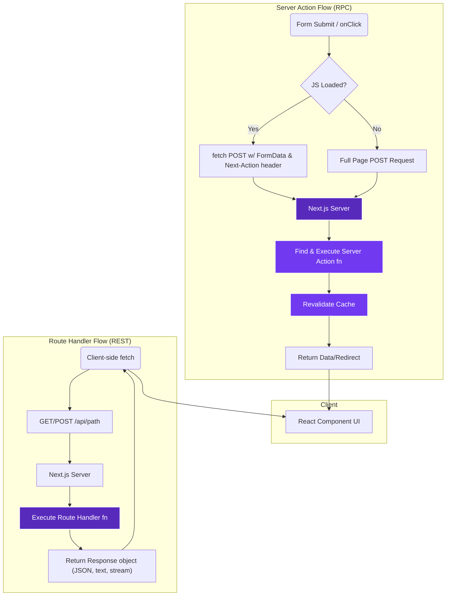

Trong phát triển full-stack hiện đại với Next.js, ranh giới giữa client và server được làm mờ đi một cách có chủ đích. Sự kết hợp này mang lại tốc độ phát triển đáng kinh ngạc nhưng đặt ra một câu hỏi kiến trúc quan trọng: bạn sẽ thực thi logic phía server ở đâu? Cụ thể, đối với các thao tác thay đổi dữ liệu (mutations) và tìm nạp dữ liệu (data fetching), khi nào bạn nên sử dụng Server Action so với Route Handler truyền thống? Đây không phải là vấn đề sở thích; đó là một quyết định kiến trúc cơ bản với những tác động sâu sắc đến hiệu suất, bảo mật và trải nghiệm người dùng. Một lựa chọn sai lầm có thể dẫn đến một ứng dụng dễ vỡ với khả năng nâng cao dần kém, các vấn đề về bộ nhớ đệm và lỗ hổng bảo mật. Bài viết này cung cấp phân tích sâu sắc, có thẩm quyền mà các kỹ sư cấp cao cần để đưa ra quyết định đúng đắn mọi lúc.

<AudioPlayer src="/static/audio/nextjs-15-server-actions-vs-route-handlers-vi.mp3" title="Tóm tắt âm thanh cho kỹ sư" voice="Google Cloud vi-VN-Neural2-A" />

## Sự Phân Đôi Cốt Lõi: RPC so với REST

Ở cấp độ cao nhất, sự khác biệt là một trong các mô hình giao tiếp:

*   **Server Actions** triển khai mô hình **Remote Procedure Call (RPC)**. Mã phía client của bạn *gọi một hàm* mà hàm đó tình cờ được thực thi trên server. Ranh giới mạng, các phương thức HTTP và việc tuần tự hóa dữ liệu phần lớn được trừu tượng hóa bởi framework Next.js. Đơn vị tương tác chính là *chữ ký hàm*.

*   **Route Handlers** triển khai mô hình **Representational State Transfer (REST)** hoặc mô hình giống REST. Bạn tạo các endpoint HTTP riêng biệt (`GET`, `POST`, `PUT`, `DELETE`, v.v.) mà client tương tác bằng cách sử dụng ngữ nghĩa HTTP tiêu chuẩn. Mạng là rõ ràng. Đơn vị tương tác chính là *URL và phương thức HTTP*.

Sự khác biệt cơ bản này quyết định mọi thứ sau đó, từ hành vi lưu trữ vào bộ nhớ đệm đến tư thế bảo mật. Hãy phân tích từng cái một.

## Tìm Hiểu Sâu: Next.js Server Actions

Server Actions là các hàm bất đồng bộ được đánh dấu bằng chỉ thị `"use server"` được thực thi trên server. Chúng có thể được định nghĩa bên trong Server Components hoặc trong một tệp riêng biệt và được nhập vào Client Components. Mục tiêu thiết kế của chúng là đơn giản hóa các thao tác thay đổi dữ liệu từ client, đặc biệt là trong các biểu mẫu.

### Sự Kỳ Diệu của Nâng Cao Dần

Tính năng hấp dẫn nhất của Server Actions là hỗ trợ tích hợp sẵn cho nâng cao dần (progressive enhancement). Hãy xem xét một biểu mẫu đơn giản:

```typescript
// app/actions/create-post.ts
"use server";

import { revalidatePath } from "next/cache";

export async function createPost(formData: FormData) {
  const title = formData.get("title") as string;

  // ... database logic to create the post ...
  console.log(`Created post: ${title}`);

  revalidatePath("/"); // Invalidate cache for the home page
  return { success: true, title };
}
```

```typescript
// app/page.tsx
import { createPost } from "./actions/create-post";

export default function HomePage() {
  return (
    <main>
      <h1>My Blog</h1>
      <form action={createPost}>
        <input type="text" name="title" required />
        <button type="submit">Create Post</button>
      </form>
      {/* ... list of posts ... */}
    </main>
  );
}
```

**Cách hoạt động bên dưới:**

1.  **Không có JavaScript:** Nếu JavaScript của client bị tắt hoặc chưa tải, điều này hoạt động như một biểu mẫu HTML gửi thông thường. Trình duyệt tuần tự hóa dữ liệu biểu mẫu và gửi yêu cầu `POST` đến URL hiện tại. Server Next.js chặn yêu cầu này, xác định Server Action mục tiêu, thực thi nó, và sau đó hiển thị lại trang. Đây là hành vi web cổ điển, mạnh mẽ.
2.  **Với JavaScript:** Khi React đã hydrate, Next.js sẽ chặn việc gửi biểu mẫu. Thay vì tải lại toàn bộ trang, nó thực hiện một yêu cầu `fetch` `POST` đến một endpoint đặc biệt. Phần thân của yêu cầu này không phải là JSON; nó là `FormData`. ID duy nhất của Server Action (một hàm băm được tạo tại thời điểm build) được bao gồm trong yêu cầu, hoặc trong URL hoặc một tiêu đề HTTP `Next-Action` đặc biệt. Server định tuyến yêu cầu này đến hàm chính xác, thực thi nó, và giá trị trả về được truyền ngược lại client. React sau đó sử dụng dữ liệu này để cập nhật giao diện người dùng mà không cần điều hướng toàn bộ trang.

Việc nâng cấp liền mạch này từ tải lại toàn bộ trang sang điều hướng phía client là bản chất của nâng cao dần và là một chiến thắng lớn về DX/UX.

### Giao Thức RPC và Tuần Tự Hóa Closure

Khi bạn gọi một Server Action từ một Client Component, Next.js thực hiện một thủ thuật.

```typescript
// app/components/UpdateUserButton.tsx
"use client";

import { updateUserEmail } from "@/app/actions/user-actions";
import { useTransition } from "react";

export function UpdateUserButton({ userId }: { userId: string }) {
  const [isPending, startTransition] = useTransition();

  const handleUpdate = () => {
    const newEmail = prompt("Enter new email:");
    if (newEmail) {
      // The `userId` is "captured" from the component's props.
      startTransition(() => updateUserEmail(userId, newEmail));
    }
  };

  return (
    <button onClick={handleUpdate} disabled={isPending}>
      {isPending ? "Updating..." : "Update Email"}
    </button>
  );
}
```

Ở đây, `updateUserEmail` là một Server Action cần `userId`. Bạn không truyền `userId` từ một trường nhập liệu của biểu mẫu. Đây là lúc "tuần tự hóa closure" phát huy tác dụng. Hàm `updateUserEmail` được liên kết với giá trị `userId` tại thời điểm gọi. Khi action được gọi, Next.js tuần tự hóa giá trị đã liên kết này và gửi nó cùng với các đối số khác đến server.

**Đây không phải là closure từ vựng thực sự.** Chỉ các đối số có thể tuần tự hóa mới có thể được "đóng lại". Bạn không thể nắm bắt các hàm, Symbols hoặc các thể hiện lớp. Đó là một cơ chế thời gian build và thời gian chạy để tạo một ứng dụng tạm thời, một phần của hàm server của bạn.

### Lưu Trữ vào Bộ Nhớ Đệm và Xác Thực Lại

Server Actions được tích hợp sâu với lớp lưu trữ vào bộ nhớ đệm của Next.js. Cơ chế chính để vô hiệu hóa bộ nhớ đệm là theo chương trình:

*   `revalidatePath(path)`: Vô hiệu hóa Data Cache cho tất cả các yêu cầu `fetch` trên một đường dẫn cụ thể. Điều này khiến Server Components trên đường dẫn đó được hiển thị lại trong lần truy cập tiếp theo.
*   `revalidateTag(tag)`: Vô hiệu hóa bộ nhớ đệm cho bất kỳ yêu cầu `fetch` nào được gắn thẻ bằng một chuỗi cụ thể. Điều này chi tiết và mạnh mẽ hơn để vô hiệu hóa dữ liệu trên các phần khác nhau của ứng dụng của bạn.

Mô hình này là dựa trên đẩy (push-based). Thao tác thay đổi dữ liệu (Server Action) chịu trách nhiệm thông báo rõ ràng cho Next.js biết dữ liệu nào hiện đã lỗi thời.

### Bảo Mật: Bảo Vệ CSRF Tích Hợp Sẵn

Đây là một lợi thế quan trọng, thường bị bỏ qua. **Server Actions có tính năng bảo vệ Cross-Site Request Forgery (CSRF) tích hợp sẵn.**

Khi một Server Action được định nghĩa, Next.js nhúng một ID duy nhất, cho mỗi action. Khi được gọi từ client, ID này được gửi trong tiêu đề HTTP `Next-Action`. Trên server, ID action của yêu cầu đến được kiểm tra với các ID action đã biết của server. Hơn nữa, framework sử dụng một chiến lược dựa trên token (thường được so sánh với mẫu cookie gửi hai lần, nhưng được quản lý nội bộ) để đảm bảo yêu cầu bắt nguồn từ trang web của bạn. Điều này được thực hiện tự động và không yêu cầu thiết lập từ nhà phát triển, cung cấp một tư thế bảo mật mặc định cho các thao tác thay đổi dữ liệu.

## Tìm Hiểu Sâu: Next.js Route Handlers

Route Handlers là sự kế thừa tinh thần của API Routes từ Pages Router. Chúng nằm trong các tệp `app/api/.../route.ts` và cung cấp cho bạn toàn quyền kiểm soát cấp thấp đối với các yêu cầu và phản hồi HTTP bằng cách tận dụng các API Web `Request` và `Response` tiêu chuẩn.

### Mô Hình REST: Rõ Ràng và Phổ Quát

Một Route Handler được định nghĩa bằng cách xuất một hàm được đặt tên theo một phương thức HTTP (`GET`, `POST`, `PUT`, v.v.).

```typescript
// app/api/posts/route.ts
import { NextResponse } from "next/server";

export async function GET(request: Request) {
  // Access search params
  const { searchParams } = new URL(request.url);
  const query = searchParams.get("query");

  // ... database logic to fetch posts matching query ...
  const posts = [{ id: 1, title: "Hello World" }];

  return NextResponse.json(posts);
}

export async function POST(request: Request) {
  const body = await request.json();

  // ... database logic to create a post ...
  const newPost = { id: 2, ...body };

  return NextResponse.json(newPost, { status: 201 });
}
```

Đây là một endpoint REST tiêu chuẩn. Bất kỳ client nào có thể giao tiếp bằng HTTP đều có thể tương tác với nó—một trình duyệt web, một ứng dụng di động, một dịch vụ backend khác hoặc một nhà cung cấp webhook. Bạn có quyền kiểm soát trực tiếp đối với:
*   **Mã trạng thái:** `200`, `201`, `400`, `404`, `500`, v.v.
*   **Tiêu đề:** Đặt `Content-Type`, `Cache-Control`, `Location`, tiêu đề CORS.
*   **Phần thân:** Đọc và ghi JSON, văn bản, `FormData`, hoặc thậm chí truyền dữ liệu.

### Lưu Trữ vào Bộ Nhớ Đệm: Kiểm Soát HTTP Chi Tiết

Lưu trữ vào bộ nhớ đệm với Route Handlers là rõ ràng và tuân theo các tiêu chuẩn HTTP. Bạn kiểm soát nó thông qua:

1.  **Cấu hình Phân đoạn Tuyến đường:**
    ```typescript
    // Statically evaluate at build time
    export const dynamic = 'force-static';
    // Always dynamically evaluate
    export const dynamic = 'force-dynamic';
    ```
2.  **Tiêu đề `Cache-Control`:** Bạn tự đặt các tiêu đề lưu trữ vào bộ nhớ đệm trên đối tượng `Response`. Điều này hướng dẫn các bộ nhớ đệm hạ nguồn (trình duyệt, CDN) cách hoạt động.
    ```typescript
    return new Response('This will be cached for 60 seconds', {
      status: 200,
      headers: {
        'Cache-Control': 'public, s-maxage=60, stale-while-revalidate=30',
      },
    });
    ```
3.  **Next.js Data Cache:** Các yêu cầu `fetch` bên trong Route Handlers `GET` được Next.js tự động lưu vào bộ nhớ đệm theo mặc định, giống như trong Server Components. Bạn có thể từ chối điều này bằng cách sử dụng `{ cache: 'no-store' }` hoặc xác thực lại bằng `{ next: { revalidate: 3600 } }`.

Mô hình này là dựa trên kéo (pull-based). Người tiêu dùng dữ liệu chịu trách nhiệm tuân thủ các chỉ thị bộ nhớ đệm được cung cấp bởi endpoint.

### Truyền Phản Hồi

Route Handlers lý tưởng để truyền dữ liệu, một mẫu phổ biến cho các phản hồi do AI tạo ra hoặc các tác vụ chạy dài. Điều này đạt được bằng cách sử dụng `ReadableStream`.

```typescript
// app/api/chat/route.ts
import { OpenAIStream, StreamingTextResponse } from 'ai';
import OpenAI from 'openai';

export const runtime = 'edge'; // Edge runtime is great for streaming

const openai = new OpenAI({ apiKey: process.env.OPENAI_API_KEY });

export async function POST(req: Request) {
  const { messages } = await req.json();

  const response = await openai.chat.completions.create({
    model: 'gpt-4',
    stream: true,
    messages,
  });

  const stream = OpenAIStream(response);
  return new StreamingTextResponse(stream);
}
```

Mức độ thao tác phản hồi cấp thấp này không thể thực hiện được với Server Actions, vốn có một hợp đồng giá trị trả về có cấu trúc hơn, kiểu RPC.

### Bảo Mật: Trách Nhiệm của Nhà Phát Triển

Không giống như Server Actions, Route Handlers đặt gánh nặng bảo mật hoàn toàn lên nhà phát triển.

*   **CSRF:** **Không có tính năng bảo vệ CSRF tích hợp sẵn**. Nếu các trình xử lý `POST`, `PUT` hoặc `DELETE` của bạn thực hiện các hoạt động nhạy cảm và dựa trên phiên, bạn chịu trách nhiệm triển khai biện pháp giảm thiểu CSRF (ví dụ: cookie gửi hai lần, mẫu token đồng bộ hóa).
*   **CORS:** Theo mặc định, Route Handlers là cùng nguồn gốc. Nếu bạn cần cho phép các yêu cầu đa nguồn gốc (ví dụ: cho một API công khai được tiêu thụ bởi các trang web của bên thứ ba), bạn phải cấu hình thủ công các tiêu đề CORS trong phản hồi của mình.
*   **Xác thực/Ủy quyền:** Bạn phải kiểm tra thủ công các tiêu đề (`Authorization: Bearer ...`), cookie hoặc các token khác để xác thực và ủy quyền các yêu cầu.

## So Sánh Luồng Thực Thi Kiến Trúc

Một so sánh trực quan làm rõ các đường dẫn thực thi khác nhau.



## Ma Trận So Sánh Trực Tiếp

| Tính năng | Server Actions | Route Handlers |
| :--- | :--- | :--- |
| **Mô hình** | **RPC** (Remote Procedure Call) | **REST** (hoặc HTTP Endpoints giống REST) |
| **Trường hợp sử dụng chính** | Các thao tác thay đổi dữ liệu ràng buộc với UI, xử lý biểu mẫu | API công khai, webhook, nguồn AJAX |
| **Nâng cao dần** | **Tự động** & tích hợp sẵn | Thủ công (yêu cầu logic riêng biệt) |
| **Bảo mật (CSRF)** | **Tích hợp sẵn**, bảo vệ tự động | **Thủ công**, trách nhiệm của nhà phát triển |
| **Bảo mật (CORS)** | Không áp dụng (chỉ cùng nguồn gốc) | **Thủ công**, yêu cầu cấu hình tiêu đề |
| **Quản lý trạng thái** | Tích hợp với React (`useFormStatus`, `useOptimistic`) | Thủ công (ví dụ: `useState`, SWR, React Query) |
| **Vô hiệu hóa bộ nhớ đệm** | Theo chương trình (`revalidatePath`, `revalidateTag`) | Thông qua các thẻ `fetch` hoặc tiêu đề HTTP trên client |
| **Chiến lược lưu trữ vào bộ nhớ đệm** | Dựa trên đẩy (thao tác thay đổi dữ liệu vô hiệu hóa bộ nhớ đệm) | Dựa trên kéo (client tuân thủ `Cache-Control`) |
| **Yêu cầu/Phản hồi** | Trừu tượng hóa bằng chữ ký hàm & giá trị trả về | Kiểm soát hoàn toàn thông qua API Web `Request`/`Response` |
| **Truyền dữ liệu** | Không (đối với phần thân phản hồi) | **Có**, thông qua `ReadableStream` |
| **Khả năng truy cập** | Chỉ client Next.js | Bất kỳ client HTTP nào (web, di động, backend) |

## Khung Quyết Định: Khi Nào Nên Sử Dụng Cái Nào?

Sử dụng khung này để đưa ra một lựa chọn kiến trúc có chủ ý, có thể bảo vệ được.

### Chọn Server Actions Khi:

1.  **Xử lý Gửi Biểu mẫu và Thay đổi UI:** Đây là thế mạnh của chúng. Sự tích hợp chặt chẽ với biểu mẫu, nâng cao dần và các hook như `useOptimistic` khiến chúng không thể bị đánh bại cho trường hợp sử dụng này.
2.  **Người gọi là một Next.js React Component:** Chúng được thiết kế để được gọi từ UI của ứng dụng của bạn. DX là liền mạch.
3.  **Bạn muốn các thao tác thay đổi dữ liệu an toàn theo mặc định:** Tính năng bảo vệ CSRF tích hợp sẵn là một lợi ích đáng kể về bảo mật và năng suất. Bạn không cần phải suy nghĩ về nó.
4.  **Logic của bạn được gắn chặt với một UI Component:** Định nghĩa action trong hoặc bên cạnh component sử dụng nó tạo ra sự đồng vị trí mã và khả năng bảo trì tuyệt vời.

**Kịch bản ví dụ:** Nút "thích" trên một bài đăng blog. Đó là một thao tác thay đổi dữ liệu đơn giản gắn trực tiếp với một phần tử UI. Cập nhật lạc quan là mong muốn, và bảo vệ CSRF là rất quan trọng. Server Action là công cụ hoàn hảo.

### Chọn Route Handlers Khi:

1.  **Xây dựng một API Công khai hoặc của Bên thứ ba:** Nếu bạn cần các ứng dụng khác (không phải frontend Next.js của bạn) để tiêu thụ dữ liệu của bạn, bạn cần một endpoint HTTP tiêu chuẩn. Đây là vai trò chính của Route Handlers.
2.  **Nhận Webhook:** Webhook từ các dịch vụ như Stripe, GitHub hoặc Twilio cần một URL công khai, ổn định để gửi yêu cầu `POST` đến. Route Handlers cung cấp điều này.
3.  **Bạn cần kiểm soát chi tiết HTTP:** Khi bạn phải kiểm soát mã trạng thái, tiêu đề (đặc biệt là `Cache-Control` hoặc CORS), hoặc các loại phản hồi (XML, CSV), Route Handlers là lựa chọn duy nhất của bạn.
4.  **Phục vụ như một nguồn dữ liệu cho các client không phải Next.js:** Nếu bạn đang xây dựng một ứng dụng di động frontend, một ứng dụng SvelteKit, hoặc thậm chí chỉ sử dụng một thư viện như SWR/React Query với một trình tìm nạp tùy chỉnh, Route Handlers cung cấp nguồn dữ liệu RESTful cần thiết.
5.  **Truyền các phản hồi lớn:** Đối với các chatbot được hỗ trợ bởi AI hoặc xử lý các tập dữ liệu lớn, khả năng sử dụng `ReadableStream` trong Route Handler là rất cần thiết cho hiệu suất và trải nghiệm người dùng.

**Kịch bản ví dụ:** Cung cấp một endpoint `/api/products?category=shoes` mà ứng dụng iOS của công ty bạn sẽ tiêu thụ. Ứng dụng cần một API REST JSON tiêu chuẩn, và bạn cần kiểm soát bộ nhớ đệm bằng các tiêu đề `Cache-Control`. Route Handler là lựa chọn đúng đắn duy nhất.

<FAQ title="Các Câu Hỏi Thường Gặp">
  <Question>Tôi có thể gọi một Server Action từ một Route Handler, hoặc ngược lại không?</Question>
  <Answer>
    Có. Một Server Action chỉ là một hàm async được xuất. Bạn có thể nhập nó vào một tệp Route Handler và gọi nó trực tiếp. Điều này hữu ích cho việc tái sử dụng logic nghiệp vụ. Ví dụ, Route Handler của bạn cho một webhook có thể gọi cùng một Server Action `createPost` mà UI của bạn sử dụng.
    ```typescript
    // app/api/webhook/route.ts
    import { createPostFromWebhook } from '@/app/actions/post-actions';

    export async function POST(req: Request) {
      const payload = await req.json();
      // Re-use the same core logic!
      const result = await createPostFromWebhook(payload);
      return Response.json(result);
    }
    ```
    Gọi một Route Handler từ một Server Action cũng đơn giản: đó chỉ là một lệnh gọi `fetch` tiêu chuẩn đến endpoint của ứng dụng của bạn.
    `const data = await fetch('https://yourapp.com/api/some-data');`
  </Answer>
  <Question>Xử lý lỗi khác nhau như thế nào giữa Server Actions và Route Handlers?</Question>
  <Answer>
    Các mô hình xử lý lỗi khá khác nhau. **Server Actions** được thiết kế để tích hợp UI. Bạn thường sử dụng một khối `try/catch` bên trong action. Nếu một lỗi được ném ra, nó sẽ được bắt ở client và có thể được sử dụng để cập nhật UI. Đối với các lỗi cụ thể của biểu mẫu, hook `useFormState` là phương pháp tốt nhất. Nó cho phép bạn trả về một đối tượng trạng thái có cấu trúc (bao gồm cả lỗi) từ action của bạn, sau đó cập nhật trạng thái của component.

    **Route Handlers** sử dụng ngữ nghĩa HTTP tiêu chuẩn cho các lỗi. Bạn báo hiệu lỗi bằng cách trả về các mã trạng thái HTTP thích hợp (ví dụ: `400` cho đầu vào xấu, `401` cho không được ủy quyền, `500` cho lỗi server) cùng với một phần thân JSON mô tả lỗi. Lệnh gọi `fetch` phía client sau đó sẽ cần kiểm tra `response.ok` và xử lý các mã trạng thái không phải 2xx một cách thích hợp.
  </Answer>
  <Question>Khi nào thì việc sử dụng Server Action là một ý tưởng tồi?</Question>
  <Answer>
    Việc sử dụng Server Actions là một ý tưởng tồi trong ba kịch bản chính:
    1.  **Đối với API Công khai:** Server Actions không được thiết kế để trở thành các endpoint ổn định, hướng ra công chúng. Quy ước gọi của chúng là một chi tiết triển khai nội bộ của Next.js và có thể thay đổi. Chúng cũng không thể được khám phá hoặc sử dụng bởi các client không phải Next.js.
    2.  **Khi cần kiểm soát HTTP chi tiết:** Nếu bạn cần đặt một tiêu đề `Location` cụ thể cho một phản hồi `201 Created`, hoặc triển khai các chỉ thị `Cache-Control` phức tạp, hoặc phản hồi với trạng thái `429 Too Many Requests`, bạn không có mức độ kiểm soát đó. Route Handlers được xây dựng cho điều này.
    3.  **Đối với các yêu cầu GET:** Mặc dù bạn *có thể* gọi một Server Action để tìm nạp dữ liệu, nhưng đó là một anti-pattern. Server Actions chạy thông qua các yêu cầu `POST` và không thể được lưu vào bộ nhớ đệm bởi các bộ nhớ đệm HTTP hoặc CDN theo cùng một cách mà một yêu cầu `GET` có thể. Để tìm nạp dữ liệu, hãy sử dụng Server Components với `async/await` trên các lệnh gọi `fetch`, hoặc sử dụng Route Handlers để tìm nạp phía client.
  </Answer>
</FAQ>


## Kiểm tra kiến thức

<Quiz questions={
  [
    {
      "question": "Một kỹ sư cấp cao được giao nhiệm vụ xây dựng một API endpoint mới cho một tích hợp bên thứ ba quan trọng, yêu cầu tuân thủ nghiêm ngặt các nguyên tắc RESTful, bao gồm các phương thức HTTP cụ thể (GET, POST, PUT, DELETE) và mã trạng thái cho các hoạt động khác nhau. Đối tác tích hợp mong đợi ngữ nghĩa HTTP tiêu chuẩn cho việc xử lý lỗi và nhận dạng tài nguyên. Tính năng Next.js 15 nào là lựa chọn phù hợp nhất để triển khai API này và tại sao?",
      "options": [
        "Server Actions, vì chúng trừu tượng hóa các chi tiết HTTP, đơn giản hóa việc phát triển.",
        "Route Handlers, vì chúng cung cấp quyền kiểm soát rõ ràng đối với các phương thức HTTP, headers và mã trạng thái, phù hợp với các nguyên tắc RESTful.",
        "Server Components, vì chúng cho phép tương tác trực tiếp với cơ sở dữ liệu mà không cần expose các API endpoint.",
        "Client Components với `fetch`, vì chúng cung cấp sự linh hoạt cao nhất cho các tích hợp bên ngoài."
      ],
      "correctAnswer": 1,
      "explanation": "Route Handlers được thiết kế để tạo các HTTP endpoint một cách rõ ràng, cung cấp toàn quyền kiểm soát các phương thức HTTP, headers và mã trạng thái. Điều này hoàn toàn phù hợp với yêu cầu của một tích hợp bên thứ ba theo kiểu RESTful. Server Actions, mặc dù mạnh mẽ cho các ứng dụng Next.js nội bộ, nhưng lại trừu tượng hóa các chi tiết HTTP này, khiến chúng ít phù hợp hơn cho các hợp đồng API RESTful nghiêm ngặt. Server Components dùng để render UI trên server, không phải để tạo các API endpoint. Client Components với `fetch` sẽ tiêu thụ một API, chứ không phải tạo một API trên server."
    },
    {
      "question": "Một nhóm phát triển đang xây dựng một biểu mẫu (form) hướng người dùng để gửi phản hồi. Biểu mẫu này rất quan trọng đối với trải nghiệm người dùng và nó phải hoạt động ngay cả khi JavaScript của người dùng không tải được hoặc bị vô hiệu hóa. Nhóm cũng muốn tận dụng các cơ chế revalidation dữ liệu tích hợp của Next.js sau khi gửi thành công. Họ nên ưu tiên cách tiếp cận nào?",
      "options": [
        "Triển khai việc gửi biểu mẫu bằng Route Handler, vì nó là một HTTP endpoint tiêu chuẩn hoạt động mà không cần JavaScript.",
        "Triển khai việc gửi biểu mẫu bằng Server Action, tận dụng khả năng progressive enhancement và `revalidatePath` của nó.",
        "Sử dụng Client Component với `fetch` đến một API route tùy chỉnh, đảm bảo trải nghiệm người dùng hiện đại.",
        "Nhúng một `iframe` trỏ đến một ứng dụng legacy riêng biệt xử lý việc gửi biểu mẫu."
      ],
      "correctAnswer": 1,
      "explanation": "Server Actions được thiết kế đặc biệt cho progressive enhancement, nghĩa là chúng hoạt động như các form submission HTML tiêu chuẩn ngay cả khi JavaScript bị vô hiệu hóa. Khi JavaScript được bật, React sẽ đảm nhiệm để có trải nghiệm nâng cao. Chúng cũng tích hợp liền mạch với các tiện ích caching và revalidation của Next.js như `revalidatePath`. Mặc dù Route Handlers cũng hoạt động mà không cần JavaScript, nhưng chúng không cung cấp cùng mức độ progressive enhancement tích hợp cho các form và tích hợp `revalidatePath` trực tiếp như Server Actions. Client Components với `fetch` sẽ hoàn toàn không hoạt động nếu không có JavaScript. Một `iframe` là một giải pháp quá phức tạp và lỗi thời cho vấn đề này."
    }
  ]
} />


## Kết Luận: Hai Công Cụ, Một Mục Tiêu

Server Actions và Route Handlers không phải là đối thủ cạnh tranh; chúng là các công cụ bổ sung cho các lớp khác nhau trong kiến trúc ứng dụng của bạn. Mô hình full-stack Next.js 15 mạnh mẽ vì nó cung cấp cả RPC tích hợp cấp cao của Server Actions và các nguyên thủy phổ quát cấp thấp của Route Handlers.

*   **Mặc định sử dụng Server Actions** cho tất cả các thao tác thay đổi dữ liệu và hoạt động được khởi tạo từ bên trong UI của ứng dụng Next.js của bạn. Lợi ích của nâng cao dần, quản lý trạng thái tích hợp và bảo vệ CSRF tự động là quá quan trọng để bỏ qua.
*   **Sử dụng Route Handlers** khi bạn cần thoát khỏi hệ sinh thái Next.js—để phục vụ các client khác, nhận webhook hoặc kiểm soát chính xác giao thức HTTP. Chúng là cổng kết nối của bạn với web rộng lớn hơn.

Bằng cách hiểu rõ sự khác biệt kiến trúc sâu sắc và đưa ra các quyết định có ý thức, có thông tin, bạn có thể xây dựng các ứng dụng Next.js mạnh mẽ hơn, an toàn hơn và hiệu suất cao hơn.

### Đọc Thêm

*   [Tài liệu Next.js: Server Actions](https://nextjs.org/docs/app/building-your-application/data-fetching/server-actions-and-mutations)
*   [Tài liệu Next.js: Route Handlers](https://nextjs.org/docs/app/building-your-application/routing/route-handlers)
*   [Tài liệu Next.js: Lưu trữ vào bộ nhớ đệm](https://nextjs.org/docs/app/building-your-application/caching)
*   [Web APIs: Đối tượng Request](https://developer.mozilla.org/en-US/docs/Web/API/Request)
*   [OWASP: Bảng gian lận phòng chống Cross-Site Request Forgery (CSRF)](https://cheatsheetseries.owasp.org/cheatsheets/Cross-Site_Request_Forgery_Prevention_Cheat_Sheet.html)