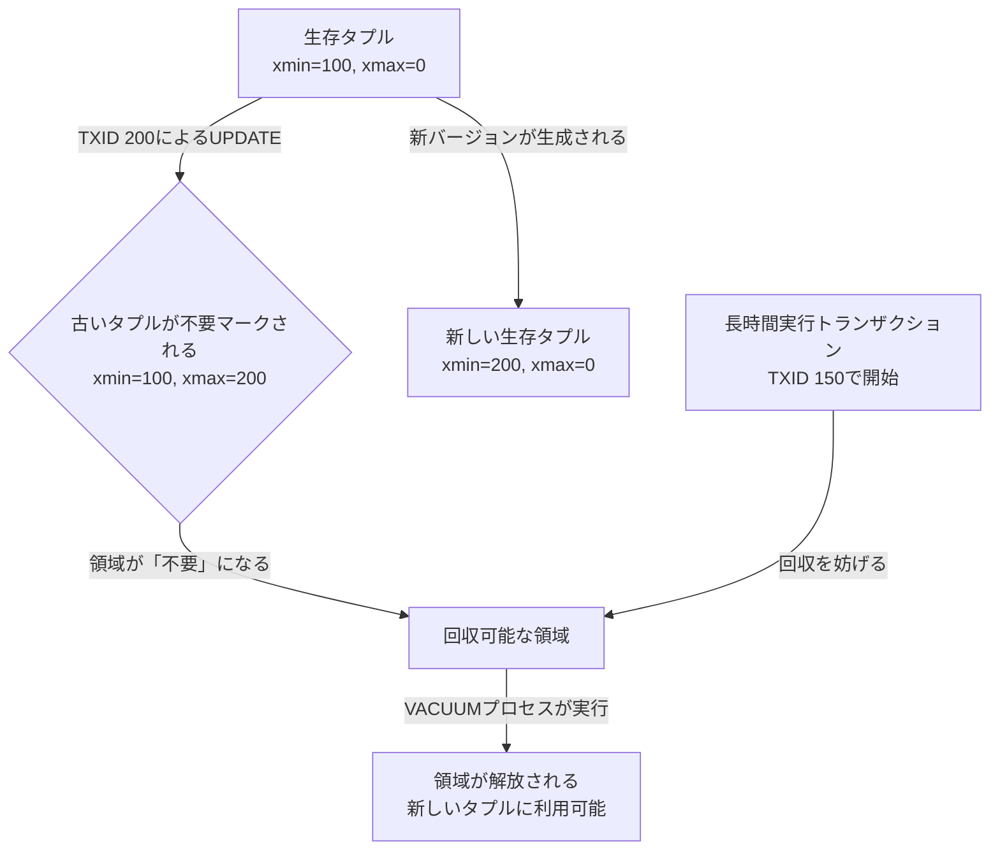

あなたはアプリケーションのパフォーマンスを監視しています。かつてはキビキビと動作していたコアAPIエンドポイントが、今では頻繁にレイテンシSLOを超過しています。その背後にあるクエリは、`users`や`transactions`テーブルを叩く単純なものに見えます。`EXPLAIN ANALYZE`は妥当なプランを示しているにもかかわらず、I/O時間は容赦なく増加し続けています。クラウドプロバイダーのディスク使用量チャートは、実際のデータ投入レートをはるかに上回るペースで、着実に直線的な成長を示しています。あなたはおそらく、PostgreSQLの最も厄介で誤解されがちなパフォーマンスの敵、すなわちテーブルとインデックスの肥大化（bloat）の犠牲者です。

これはバグではありません。PostgreSQLの洗練された多版型同時実行制御（MVCC）アーキテクチャがもたらす、根本的な結果なのです。MVCCは読み取りと書き込みをブロックしない素晴らしい仕組みですが、その過程で「不要タプル（dead tuples）」の痕跡を残します。これらが管理されずに放置されると、あなたのスリムなデータベースは、鈍重でストレージを食い尽くすモノリスへと変貌してしまいます。このガイドでは、タプルの可視性という原子レベルの話から、検知、軽減、そして自動修復のための本番環境グレードの戦略まで、この問題を技術的な観点から深く掘り下げて解説します。

<AudioPlayer src="/static/audio/postgresql-vacuum-and-index-bloat-ja.mp3" title="音声エグゼクティブ・ブリーフィング" voice="Google Cloud ja-JP-Neural2-B" />

## 肥大化の創世記：MVCCと不要タプル

肥大化を打ち負かすには、まずその起源を理解しなければなりません。PostgreSQLは、行を直接書き換える（in-place update）ことを決して行わないことで同時実行性を実現しています。`UPDATE`を実行すると、Postgresは実質的に`DELETE`と`INSERT`を実行します。行の古いバージョン（Postgresの用語で「タプル」）は即座に消去されるのではなく、「不要」とマークされ、新しいバージョンが挿入されます。`DELETE`は単にタプルを不要とマークするだけです。

各タプルには、その可視性を管理する2つの隠しシステムカラムがあります：`xmin`と`xmax`です。
*   `xmin`: このタプルを生成したトランザクションID。
*   `xmax`: このタプルを削除したトランザクションID。初期値は0。

トランザクション`T1`がある行を更新すると、古いタプルの`xmax`を`T1`に設定し、`xmin`が`T1`に設定された新しいタプルを挿入します。`T1`がコミットされる*前*に開始された他のトランザクションは、`T1`がまだデータベース状態の「スナップショット」に含まれていないため、古いタプルを見ることができます。これがPostgresが読み取りロックを回避する方法です。

「不要タプル」とは、その`xmax`が、現在実行中の*すべての*トランザクションから可視なトランザクションIDに設定されている行バージョンのことです。これは、もはやこのバージョンを参照する必要があるアクティブなトランザクションが存在しないことを意味し、領域回収の対象となります。

そのプロセスは次のようになります：



この「不要」な領域は、オペレーティングシステムには返されません。テーブルの「ヒープ」ファイル内に留まり、空のポケットを作り出します。これが**肥大化**です。不要タプルが十分に蓄積されると、テーブルとそのインデックスは、格納している生存データよりも物理的にディスク上で大きくなります。これは以下の事態を引き起こします：
1.  **I/Oの増加：** クエリが必要な生存データを見つけるために、より多くの8KBページをディスクから読み取る必要があります。
2.  **キャッシュ効率の低下：** 肥大化したテーブルは共有バッファ（Postgresのメモリキャッシュ）を不釣り合いに消費し、有用なデータを追い出してしまいます。
3.  **スキャンの低速化：** シーケンシャルスキャンとインデックススキャンの両方が、多くがゴミで満たされたページをより多く走査しなければならなくなるため、遅くなります。インデックスの肥大化は特に悪質で、インデックスを持つこと自体の目的を無効にしてしまう可能性があります。

`VACUUM`が防ぐ最終的な障害モードは、**トランザクションID周回問題（Transaction ID Wraparound）**です。トランザクションIDは32ビット整数です。約20億回の書き込みトランザクションの後、IDは周回します。古い不要タプルが「凍結（freeze）」（将来のすべてのトランザクションから可視であるとマーク）されない場合、データ破損を防ぐためにデータベースはシャットダウンしなければなりません。定期的なバキュームはパフォーマンスのためだけでなく、必須の運用要件なのです。

## 肥大化の検知と測定

測定できなければ、修正することはできません。汎用的な監視ツールでは肥大化を特定できません。Postgresの内部統計情報にクエリを投げる必要があります。以下のクエリは、様々なコミュニティソースから採用されたもので、`pgstattuple`のような拡張機能を必要とせずに、信頼性の高い推定値を提供します。これは、統計的に推定された生存タプルのサイズと、テーブルの実際のディスク上のサイズを比較することで機能します。

### 定番の肥大化検知クエリ

このクエリは、スーパーユーザーまたはテーブル統計を調査するのに十分な権限を持つロールによって実行されるように設計されています。

```sql
-- Detects table and index bloat.
-- Works on PostgreSQL 9.5+
-- Note: The accuracy of this query depends on the freshness of table statistics.
-- Run ANALYZE on your tables before trusting this output for the first time.

WITH constants AS (
  SELECT
    current_setting('block_size')::numeric AS bs,
    23 AS hdr,
    4 AS ma
),
tables AS (
  SELECT
    ns.nspname AS schema_name,
    tbl.relname AS table_name,
    hdr,
    ma,
    bs,
    tbl.reltuples,
    tbl.relpages,
    (
      (tbl.reltuples * (
        -- Average row width, accounting for overhead
        AVG(stat.stanullfrac) * (
          -- Average width of nullable columns
          SELECT SUM(stynsp) FROM pg_type typ JOIN pg_attribute attr ON typ.oid = attr.atttypid WHERE attr.attrelid = tbl.oid AND NOT attr.attnotnull AND attr.attnum > 0
        ) + (1 - AVG(stat.stanullfrac)) * (
          -- Average width of non-nullable columns
          SELECT SUM(stynsp) FROM pg_type typ JOIN pg_attribute attr ON typ.oid = attr.atttypid WHERE attr.attrelid = tbl.oid AND attr.attnotnull AND attr.attnum > 0
        )
      ) + ma - (
        -- Null bitmap overhead
        CASE WHEN tbl.reltuples > 0 THEN ((COUNT(DISTINCT stat.staattnum) + 7) / 8) ELSE 0 END
      ))
      -- Add tuple header overhead
      + hdr
    ) AS avg_row_width
  FROM
    pg_class tbl
  JOIN pg_namespace ns ON ns.oid = tbl.relnamespace
  JOIN pg_attribute attr ON attr.attrelid = tbl.oid
  JOIN pg_statistic stat ON stat.starelid = tbl.oid AND stat.staattnum = attr.attnum
  WHERE
    tbl.relkind = 'r' -- only tables
    AND ns.nspname NOT IN ('pg_catalog', 'information_schema')
    AND tbl.reltuples > 0
  GROUP BY
    ns.nspname, tbl.relname, hdr, ma, bs, tbl.reltuples, tbl.relpages
),
table_bloat AS (
  SELECT
    schema_name,
    table_name,
    reltuples AS live_tuples,
    relpages AS page_count,
    bs,
    -- Estimated pages needed for live data
    CEIL((reltuples * avg_row_width) / (bs - hdr)) AS estimated_pages,
    relpages AS actual_pages,
    -- Actual size
    pg_size_pretty(relpages * bs) AS actual_size
  FROM
    tables
),
table_bloat_summary AS (
  SELECT
    schema_name,
    table_name,
    live_tuples,
    -- Bloat in pages and bytes
    (actual_pages - estimated_pages) AS bloat_pages,
    pg_size_pretty((actual_pages - estimated_pages) * bs) AS bloat_size,
    -- Bloat percentage
    ROUND(100 * (actual_pages - estimated_pages) / actual_pages, 2) AS bloat_percentage
  FROM
    table_bloat
  WHERE
    -- Filter for significant bloat
    (actual_pages - estimated_pages) > 0
),
index_bloat AS (
  SELECT
    ns.nspname AS schema_name,
    tbl.relname AS table_name,
    idx.relname AS index_name,
    idx.reltuples,
    idx.relpages,
    -- Estimated index size
    ROUND((idx.reltuples * (
      -- Average index entry size
      SELECT
        -- Index header + item identifier + data
        16 + AVG(pg_column_size(indexdatacolumns))
      FROM
        pg_index i
      JOIN pg_stats s ON s.tablename = tbl.relname
      AND s.attname = ANY(string_to_array(i.indkey::text, ' ')::text[])
      WHERE i.indexrelid = idx.oid
    )) / current_setting('block_size')::numeric, 1) AS estimated_pages,
    idx.relpages AS actual_pages,
    pg_size_pretty(idx.relpages * current_setting('block_size')::numeric) AS actual_size
  FROM
    pg_class idx
  JOIN pg_index i ON i.indexrelid = idx.oid
  JOIN pg_class tbl ON tbl.oid = i.indrelid
  JOIN pg_namespace ns ON ns.oid = tbl.relnamespace
  WHERE
    idx.relkind = 'i' -- only indexes
    AND ns.nspname NOT IN ('pg_catalog', 'information_schema')
    AND idx.reltuples > 0
),
index_bloat_summary AS (
  SELECT
    schema_name,
    table_name,
    index_name,
    reltuples,
    (actual_pages - estimated_pages) AS bloat_pages,
    pg_size_pretty((actual_pages - estimated_pages) * current_setting('block_size')::numeric) AS bloat_size,
    ROUND(100 * (actual_pages - estimated_pages) / actual_pages, 2) AS bloat_percentage
  FROM
    index_bloat
  WHERE
    (actual_pages - estimated_pages) > 10 -- Filter for significant bloat
)
-- Combine and present the results
SELECT
  'table' AS object_type,
  schema_name,
  table_name AS object_name,
  bloat_percentage,
  bloat_size
FROM
  table_bloat_summary
WHERE bloat_percentage > 20.0
UNION ALL
SELECT
  'index' AS object_type,
  schema_name,
  index_name AS object_name,
  bloat_percentage,
  bloat_size
FROM
  index_bloat_summary
WHERE bloat_percentage > 30.0
ORDER BY
  bloat_size DESC;
```

**出力の解釈：**
このクエリを実行すると、最も肥大化したテーブルとインデックスのリストが得られます。

| object_type | schema_name | object_name               | bloat_percentage | bloat_size  |
|-------------|-------------|---------------------------|------------------|-------------|
| table       | public      | event_logs                | 65.40            | 12 GB       |
| index       | public      | event_logs_user_id_idx    | 72.10            | 8 GB        |
| index       | public      | users_last_login_at_idx   | 45.80            | 2 GB        |

経験則として：
*   **テーブルの肥大化 > 20%:** 調査する価値あり。
*   **インデックスの肥大化 > 30-40%:** 多くの場合、重大なパフォーマンスのボトルネックであり、修復の最優先候補。

## 最初の防衛線：自動バキュームのチューニング

`autovacuum`はPostgreSQLに組み込まれた清掃サービスです。これは、`INSERT`、`UPDATE`、`DELETE`が多数発生したテーブルに対して、定期的に`VACUUM`および`ANALYZE`操作を実行するデーモンプロセスです。

しかし、**デフォルトの自動バキューム設定は悪名高いほど保守的です**。これらは低スペックのハードウェアでのリソース消費を最小限に抑えるように設計されており、中〜高程度の書き込み負荷には全く不十分です。デフォルト設定に依存することは、本番環境のパフォーマンス低下へのよくある道筋です。

### なぜデフォルトでは失敗するのか

自動バキュームは、不要タプルの数が以下の式で計算されるしきい値を超えたときに、テーブル上で`VACUUM`をトリガーすることを決定します：
`vacuum_threshold = autovacuum_vacuum_threshold + autovacuum_vacuum_scale_factor * number_of_tuples`

デフォルト値は以下の通りです：
*   `autovacuum_vacuum_threshold = 50`
*   `autovacuum_vacuum_scale_factor = 0.20` (つまり、テーブルの20%)

1億行を持つ`event_logs`テーブルを考えてみましょう。しきい値は`50 + 0.20 * 100,000,000 = 20,000,050`となります。自動バキュームは、クリーンアップを検討する前に**2000万**もの不要タプルが蓄積するのを待ってしまいます。その時点では、テーブルはすでに深刻に肥大化しています。このスケールファクターが、巨大なテーブルにおける主要な元凶です。

### 本番環境グレードの自動バキュームチューニング

解決策は、グローバルなデフォルト設定から脱却し、書き込みの多いテーブルに対して、テーブルごとに積極的な設定を行うことです。

#### 戦略
1.  `autovacuum_vacuum_scale_factor`を劇的に下げる。
2.  妥当で静的な`autovacuum_vacuum_threshold`を設定し、テーブルが小さくても頻繁にバキュームされるようにする。
3.  オプションとして、バキュームワーカー自体のコスト制限を調整して、より積極的に動作させる。

#### 書き込みが多いテーブルのためのレシピ

`event_logs`テーブルをチューニングしてみましょう。

```sql
-- Tune a specific high-write table.
-- A scale factor of 0.02 means vacuum triggers after 2% of the table has changed.
-- A threshold of 1000 ensures it runs even if the table is temporarily small.
ALTER TABLE public.event_logs SET (
  autovacuum_vacuum_scale_factor = 0.02,
  autovacuum_vacuum_threshold = 1000,
  autovacuum_analyze_scale_factor = 0.01,
  autovacuum_analyze_threshold = 500
);

-- For extremely high-throughput tables, you might also make the vacuum worker
-- faster by reducing its sleep time between operations.
-- This table will now be vacuumed more often and more quickly.
ALTER TABLE public.event_logs SET (
  autovacuum_vacuum_cost_delay = '10ms' -- Default is 20ms on some versions
);
```

これらのストレージパラメータをテーブルに直接設定することで、そのリレーションに対してのみグローバルな`postgresql.conf`の設定を上書きします。これが正しく、的を絞ったアプローチです。グローバル設定を過度に積極的にすると、小さくて静的なテーブルに不要なI/O負荷をかける可能性があるため、それは避けたいところです。

書き込みの多いテーブルを見つけるには、`pg_stat_user_tables`にクエリを投げます：

```sql
SELECT
  schemaname,
  relname,
  n_tup_ins,
  n_tup_upd,
  n_tup_del,
  n_live_tup,
  n_dead_tup,
  last_autovacuum,
  last_autoanalyze
FROM
  pg_stat_user_tables
ORDER BY
  n_tup_upd + n_tup_del DESC
LIMIT 20;
```
これにより、どのテーブルが最も更新頻度が高く、したがってカスタム自動バキュームチューニングの最有力候補であるかがわかります。

## 重火器：`pg_repack`によるゼロダウンタイムでの再構築

自動バキュームをチューニングしたものの、テーブルがすでに65%の肥大化で12GBも太ってしまっている場合はどうすればよいでしょうか？自動バキュームの標準的な`VACUUM`プロセスは、ディスク上のファイルを縮小したり、OSに領域を返却したりはしません。ファイル内の領域を将来の`INSERT`のために空きとしてマークするだけです。真に領域を回収し、ファイルを縮小するには、テーブルを書き直す必要があります。

ネイティブの`VACUUM FULL`コマンドはこれを実行しますが、操作の*全期間*にわたってテーブルに`ACCESS EXCLUSIVE`ロックを取得し、すべての読み取りと書き込みをブロックします。大規模で重要な本番テーブルにとって、これはアプリケーションを数分から数時間オフラインにすることに等しく、現実的な選択肢ではありません。

そこで登場するのが`pg_repack`です。これは、オンラインでのテーブルとインデックスの再構築を行うための、ゴールドスタンダードなコミュニティ拡張機能です。

### `pg_repack`の仕組み
`pg_repack`は、最小限のロックでテーブルとそのインデックスを再構築し、真のゼロダウンタイムでの肥大化解消を可能にします。

1.  **ログテーブルとトリガー：** ログテーブルを作成し、対象テーブルにトリガーをインストールして、プロセス中に発生するすべての`INSERT`、`UPDATE`、`DELETE`をキャプチャします。
2.  **新しいテーブルの作成：** 元のテーブルと同じ構造を持つ、完全にパックされた新しいテーブルを作成します。
3.  **データコピー：** 肥大化した元のテーブルから新しいテーブルへ、すべての行を効率的にコピーします。
4.  **インデックスの再構築：** 新しいテーブル上に、新しくコンパクトなインデックスを構築します。
5.  **差分の適用：** ログテーブルにキャプチャされたすべての変更を新しいテーブルに適用し、最新の状態に追いつかせます。
6.  **スワップ：** ここが魔法のような部分です。単一のトランザクション内で、短い`ACCESS EXCLUSIVE`ロックを保持しながら、以下の操作を行います：
    *   元のテーブルのインデックスと制約を削除する。
    *   テーブル名を変更する（新しいテーブルが古いテーブルの名前になり、古いテーブルは一時的な削除候補となる）。
    *   新しく名前が変更された本番テーブルに制約を再作成する。
7.  **クリーンアップ：** 古い、肥大化したテーブルファイルを削除します。

重い処理（ステップ3-5）はオンラインで行われます。排他ロック（ステップ6）は、テラバイト級のテーブルであっても通常はミリ秒から数秒しか続かないため、本番環境での使用にも安全です。

### `pg_repack`の使用方法

まず、データベースサーバー上とデータベース内に拡張機能をインストールする必要があります。

```sql
-- In psql, connected to your target database
CREATE EXTENSION pg_repack;
```

その後、データベースサーバー上、またはネットワークアクセスと`pg_repack`バイナリを持つ任意のマシンからターミナルで実行します：

```bash
# Example: Repack the 'event_logs' table in the 'mydb' database
# -k, --no-order: Skips clustering by primary key. Faster, but you lose physical ordering.
# -j 4: Use 4 parallel jobs for index creation (if supported).
# --wait-timeout=60: Wait up to 60 seconds to acquire the final lock. Abort if a long-running query blocks it.

pg_repack -d mydb -h myhost.db.example.com -U db_admin_user -k -j 4 --wait-timeout=60 --table public.event_logs
```

**前提条件：**
*   テーブルとそのインデックスの2つ目のコピーを一時的に保持するのに十分な空きディスク容量が必要です。
*   テーブルには`PRIMARY KEY`または`NOT NULL`カラムに対する`UNIQUE`インデックスがなければなりません。
*   スキーマに対する`CREATE`権限が必要です。

## 可視性マップの役割

パズルの最後のピースは、可視性マップ（Visibility Map, VM）です。これは、テーブルのヒープファイル内のどのページが「すべて可視（all-visible）」なタプルのみを含んでいるかを追跡する、コンパクトなビットマップデータ構造です。「すべて可視」とは、現在および将来のすべてのトランザクションから可視であることを意味します。

`VACUUM`が実行されると、VMが更新されます。これは、特定の種類のクエリ、すなわち**インデックスオンリースキャン（index-only scans）**に対して絶大なパフォーマンス上の影響を与えます。

インデックスに完全に含まれるカラムをクエリする場合（例：`SELECT user_id FROM event_logs WHERE processed_at > NOW() - '1 day'`）、そしてVMが、インデックスが指し示すページ上のすべてのタプルがすべて可視であることを確認できた場合、Postgresはインデックスのみを読み取ることでクエリに答えることができます。メインテーブルのヒープにアクセスする必要がありません。これは非常に高速です。

バキュームの頻度が低いためにVMが古くなっていると、Postgresはタプルの可視性について確信が持てません。その結果、`xmin`/`xmax`の値を確認するために、すべての行に対して**インデックススキャンに続くヒープフェッチ**を実行せざるを得なくなります。これはインデックスオンリースキャンの利点を完全に無効にし、不可解なクエリの遅さの一般的な原因となります。

積極的な自動バキュームチューニングは、単に領域を回収するためだけではありません。クエリプランナの最も強力な最適化を可能にするために、可視性マップを最新の状態に保つためでもあるのです。

## インタラクティブFAQ

<FAQ title="よくある質問">
  <Question>`VACUUM FULL`、`pg_repack`、そして単なる自動バキュームのチューニングは、いつ使い分けるべきですか？</Question>
  <Answer>
    これらを、異なる仕事のための異なるツールとして考えてください：
    *   **自動バキュームのチューニング（予防）：** これがあなたの主要な、プロアクティブな戦略です。ある程度の書き込み負荷があるテーブルでは、深刻な肥大化がそもそも蓄積するのを*防ぐ*ために、カスタムの自動バキューム設定が必須です。これをデフォルトのアクションとすべきです。
    *   **`pg_repack`（修復）：** これは、すでに存在する問題を修正するためのツールです。重要な本番テーブルがすでに著しい肥大化（>25-30%）を抱えている場合、自動バキュームのチューニングだけでは不十分です。なぜなら、ディスク上のファイルを縮小しないからです。`pg_repack`を使えば、その無駄な領域を回収し、サービスを中断することなくオンラインでテーブルをコンパクトにできます。
    *   **`VACUUM FULL`（オフラインメンテナンス）：** このコマンドが本番システムにとって正しい選択であることは稀です。その`ACCESS EXCLUSIVE`ロックはあまりにも破壊的です。その唯一の正当な使用例は、計画的なメンテナンスウィンドウ中、開発データベース上、または数秒から数分のダウンタイムが許容できる小さな、重要でないテーブルに対してです。重要なテーブルには、`pg_repack`を優先してください。
  </Answer>
  <Question>自動バキュームワーカーは絶えず実行されていますが、肥大化はまだ増え続けています。何が問題なのでしょうか？</Question>
  <Answer>
    これは古典的で、フラストレーションのたまるシナリオです。主な原因は2つあります：
    1.  **長時間実行されるトランザクション：** `VACUUM`は、まだそのタプルを見ることができる可能性のあるオープンなトランザクションが存在する場合、不要タプルを回収できません。たった一つの長時間実行トランザクション（例えば、何時間も実行されている分析クエリや、問題のあるクライアントからのアイドル状態のトランザクション）が、何百万もの不要タプルをピン留めし、`VACUUM`がその仕事をするのを妨げることがあります。`SELECT pid, datname, usename, state, backend_xid, backend_xmin, query, age(clock_timestamp(), xact_start) as xact_age FROM pg_stat_activity WHERE state != 'idle' AND backend_xmin IS NOT NULL ORDER BY xact_age DESC;` というクエリを使って、長時間実行されているトランザクションを見つけてください。
    2.  **I/Oスロットリング：** 自動バキュームワーカーは「良き市民」であるように設計されており、I/Oサブシステムを圧倒しないようになっています。数ページを処理した後、`autovacuum_vacuum_cost_delay`（デフォルト20ms）だけスリープします。非常に書き込みの多いテーブルで、不要タプルの生成率が、スロットリングされたワーカーがそれらをクリーンアップできる率を上回ると、ワーカーが絶えず実行されていても肥大化は増大します。この場合、テーブルごとに`autovacuum_vacuum_cost_delay`を*減少させる*（例：`5ms`や`10ms`へ）か、`autovacuum_vacuum_cost_limit`（デフォルト200）を*増加させる*ことで、ワーカーをより積極的にする必要があるかもしれません。慎重に行い、I/Oへの影響を監視してください。
  </Answer>
  <Question>`pg_repack`は主キーや外部キーをどのように扱いますか？</Question>
  <Answer>
    `pg_repack`は制約の扱いに非常に堅牢です。テーブルの主キー（または適切なユニークインデックス）を使用して再編成を実行します。排他ロックを持つ単一のトランザクション内で発生する最終的なスワップフェーズ中に、古いテーブルから新しいテーブルへすべての制約を細心の注意を払って転送します。これには`PRIMARY KEY`、`UNIQUE`、`FOREIGN KEY`、`CHECK`制約が含まれます。外部キーは古いテーブルから削除され、元の参照先を指すように新しいテーブル上で再作成されます。これがすべてアトミックに行われるため、プロセス全体を通じてデータの一貫性が維持されます。短いロックにより、制約が移動されている間にアプリケーションが制約に違反するようなデータを書き込むことができなくなります。
  </Answer>
</FAQ>

## 結論：肥大化のないデータベースのための行動計画

データベースの肥大化は、「もし」の問題ではなく、「いつ」の問題です。動的な書き込み負荷を持つあらゆるシステムにとって、受動的なアプローチは最終的なパフォーマンスの低下を保証します。プロアクティブで多層的な戦略が、長期的な健全性には不可欠です。

**あなたの行動計画：**
1.  **監視：** ここで提供した肥大化検知クエリを使用してください。週次で実行するようにスケジュールし、その結果を監視システムに送り、肥大化のしきい値（例：25%）を超えたテーブルについてアラートを出すようにします。
2.  **プロアクティブなチューニング：** `pg_stat_user_tables`を使用して、書き込みの多いトップ10〜20のテーブルを特定します。すぐに、テーブルごとに積極的な自動バキューム設定を適用してください。肥大化が問題になるまで待ってはいけません。
3.  **安全な修復：** すでに著しく肥大化しているテーブルを見つけたら、トラフィックの少ない時間帯に`pg_repack`操作をスケジュールします。ダウンタイムは最小限ですが、それでも主要な操作は注意深く実行するのがベストプラクティスです。
4.  **啓蒙：** チームが長時間実行トランザクションの影響を理解するように徹底してください。PgBouncerの`idle_in_transaction_session_timeout`のような接続プーラーの設定を実装し、アイドル状態でありながらまだオープンなトランザクションを自動的に終了させます。

この検知、予防、そして修復のサイクルをマスターすることで、あなたは受動的な火消し役から戦略的なデータベースエンジニアへと移行し、PostgreSQLインフラストラクチャが大規模になっても高速で、効率的で、信頼性を保てるように保証するのです。

### さらに読む
*   [PostgreSQL Documentation: The Autovacuum Daemon](https://www.postgresql.org/docs/current/routine-vacuuming.html#AUTOVACUUM)
*   [PostgreSQL Documentation: VACUUM](https://www.postgresql.org/docs/current/sql-vacuum.html)
*   [The `pg_repack` Official Documentation](https://reorg.github.io/pg_repack/)
*   [The Visible Internals of PostgreSQL: A Deep Dive into MVCC](https://locionic.com/blog/postgresql-mvcc-internals/) (架空の関連記事)
