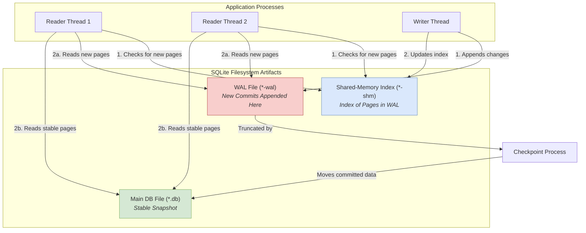

For decades, the standard architectural playbook has been clear: your application logic lives here, and your database lives over there, separated by a network. This client-server model, dominated by giants like PostgreSQL and MySQL, is powerful and familiar. But it's not a universal truth. The network is a fickle beast, a source of latency and unpredictability. What if your database wasn't a remote service but a local library, a function call away from your code? This is the promise of SQLite. Too often dismissed as a "toy database" for mobile apps or simple scripts, a properly configured SQLite instance can deliver astonishing performance and resilience in high-throughput production backends. The engineering dilemma is that SQLite's default settings are optimized for safety and simplicity, not for concurrency. Unlocking its production potential requires a deep understanding of its internal mechanics, particularly the Write-Ahead Log (WAL). This is not a guide for beginners; this is the authoritative manual for deploying SQLite in demanding, concurrent environments.

<AudioPlayer src="/static/audio/sqlite-wal-mode-production-concurrency.mp3" title="Executive Audio Briefing" />

<InfoAlert title="Interactive Production Configurator">
  Fine-tune your workload's exact memory limits, concurrency timeouts, and connection pool settings with our free **[SQLite Production PRAGMA Configurator](/en/tools/sqlite-configurator)** with one-click code generation for Python, Node.js, Go, and Rust.
</InfoAlert>

## The Default Is Not Production-Ready: From Rollback Journal to WAL

The most common source of SQLite's reputation for poor concurrency is its default journaling mode. Before we can appreciate the solution, we must understand the problem.

### How the Rollback Journal Works (and Why It Fails at Concurrency)

By default, SQLite uses a `DELETE` journal mode (a type of rollback journal). When you begin a write transaction, SQLite performs the following steps:

1.  **Acquire a Lock:** It places a RESERVED lock on the database, preventing other writers. To commit, it must escalate this to an EXCLUSIVE lock, blocking all other connections, including readers.
2.  **Create a Journal:** It copies the original, unchanged pages that will be modified into a separate rollback journal file (e.g., `my-db.db-journal`).
3.  **Write to the Database:** It modifies the pages directly in the main database file.
4.  **Commit:** Once the writes are complete and synced to disk, the journal file is deleted.

If a crash occurs mid-transaction, the journal file persists. On the next connection, SQLite sees the journal, uses it to "roll back" the changes in the main database file, and restores it to its pre-transaction state.

This is robust, but it has a catastrophic impact on concurrency: **a writer blocks all readers, and readers block a writer from committing**. In a web server handling multiple requests, this serialization creates an immediate bottleneck, leading to `SQLITE_BUSY` errors and unacceptable latency.

### Enter Write-Ahead Logging (WAL): The Concurrency Game-Changer

Introduced in SQLite 3.7.0, WAL mode inverts the journaling process. Instead of writing a "what to undo" file, it writes a "what to do" file.

1.  **Writes go to the WAL file:** New changes are appended to a separate `*-wal` file. The main database file is not touched.
2.  **Readers consult the WAL:** When a reader needs a page, it first checks a shared-memory index (`*-shm` file) to see if a newer version of that page exists in the WAL file. If so, it reads from there; otherwise, it reads the stable version from the main database file.
3.  **Checkpointing:** Periodically, a process called a "checkpoint" moves the committed transactions from the WAL file into the main database file. This can happen automatically or be triggered manually.

This design fundamentally changes the concurrency model:

*   **Writers don't block Readers:** Readers can continue to access the main database file, which represents a stable, committed snapshot.
*   **Readers don't block Writers:** A writer can append to the WAL file without waiting for readers to finish.

The only contention is that only one writer can be actively appending to the WAL file at any given moment. We'll see how to manage this gracefully.

Here is a visualization of the data flow in WAL mode:



## Configuring SQLite for High Throughput: The Essential PRAGMAs

To enable this high-concurrency mode and tune it for production loads, you must issue a series of `PRAGMA` commands on every new database connection. The order can matter, and they must be set for each connection as they are not stored permanently in the database file (with the exception of `journal_mode`).

Use our interactive configurator below to tailor PRAGMA settings to your workload, or copy the standard boilerplate:

<SqliteConfigurator />

Here's the canonical set of PRAGMAs for a production-grade SQLite setup:

```python
import sqlite3

def create_connection(db_file):
    """ Create a database connection to a SQLite database
        with production-ready PRAGMAs.
    """
    conn = None
    try:
        conn = sqlite3.connect(db_file, timeout=10.0) # timeout is for lock contention
        
        # Set PRAGMAs
        conn.execute("PRAGMA journal_mode = WAL;")
        conn.execute("PRAGMA busy_timeout = 5000;") # 5000ms = 5s
        conn.execute("PRAGMA synchronous = NORMAL;")
        conn.execute("PRAGMA cache_size = -65536;") # 64MB cache
        conn.execute("PRAGMA foreign_keys = ON;")
        conn.execute("PRAGMA temp_store = MEMORY;")

        print(f"SQLite {sqlite3.sqlite_version} connected to {db_file}")
        return conn
    except sqlite3.Error as e:
        print(e)
        if conn:
            conn.close()
    return None

if __name__ == '__main__':
    db_conn = create_connection("production.db")
    if db_conn:
        # Your application logic here
        db_conn.close()
```

Let's break down each critical PRAGMA.

### `PRAGMA journal_mode = WAL;`

This is the master switch. It persistently changes the database to use Write-Ahead Logging. You only need to set it once, and it sticks, but it's harmless to set it on every connection. This enables the reader/writer concurrency we've discussed.

### `PRAGMA busy_timeout = 5000;` - The Art of Waiting

This is the single most important PRAGMA for managing writer concurrency. By default, if a thread tries to acquire a write lock that is already held, SQLite returns `SQLITE_BUSY` immediately. This forces your application code to implement complex retry logic.

`busy_timeout` instructs the SQLite driver to automatically wait and retry for the specified number of milliseconds before returning `SQLITE_BUSY`. In the example, `5000` means a writing thread will wait up to 5 seconds for another writer to finish its transaction. For most web applications with short write transactions, a timeout of 5-10 seconds is more than enough to serialize concurrent write requests without ever bubbling an error up to the application layer.

### `PRAGMA synchronous = NORMAL;` - The Pragmatic Durability Trade-off

The `synchronous` pragma controls how carefully SQLite syncs data to the disk to ensure durability against power loss or OS crashes.

*   **`FULL` (The Default):** In WAL mode, `FULL` performs an `fsync()` after every transaction is committed to the WAL file and another one during checkpointing. This is extremely safe but can be slow, as `fsync()` is an expensive system call.
*   **`NORMAL`:** In WAL mode, `NORMAL` still `fsyncs` during checkpointing, but it *omits the `fsync()` after each individual transaction commit*. Instead, the OS is free to buffer the writes to the WAL file and write them out periodically.

Is `NORMAL` safe? For a transaction to be corrupted, the following must happen:
1.  You commit a transaction.
2.  The OS does not flush its write buffer to the WAL file on disk.
3.  The system experiences a catastrophic crash (e.g., power loss).

Upon recovery, that specific transaction might be lost. However, the database itself will *not* be corrupted. The transaction is atomic; it's either fully present or not at all. For many applications, the massive performance gain from `synchronous=NORMAL` is worth the minuscule risk of losing the most recent few milliseconds of writes in a power-outage scenario. It's a pragmatic choice for high-throughput systems.

### `PRAGMA cache_size = -65536;` - Tuning the In-Memory Cache

This PRAGMA controls the size of SQLite's in-memory page cache. A positive value `N` allocates space for `N` pages. A negative value `-K` allocates `K` kilobytes of memory.

The default cache is small (2MB, or `-2000`). For a server with ample RAM, increasing this is a huge performance win for read-heavy workloads. SQLite will keep frequently accessed pages in memory, avoiding disk I/O. A value of `-65536` allocates a 64MB cache. A good starting point is to allocate 10-25% of your available application memory, depending on the size of your "hot" dataset.

### `PRAGMA mmap_size = N;` - Leveraging the OS Page Cache

This is a more advanced tuning parameter. It instructs SQLite to use memory-mapped I/O to read the database file for sizes up to `N` bytes.

*   **How it works:** Instead of issuing `read()` system calls to pull data from disk into SQLite's private cache (`cache_size`), `mmap` maps the database file directly into the process's address space. The operating system's page cache now becomes the primary cache for the database file.
*   **The Benefit:** This can be faster, especially for read-heavy workloads or databases larger than available RAM. It avoids a `memcpy` from the kernel's buffer cache into SQLite's user-space cache. The OS is often smarter about memory management than a single application.
*   **The Trade-off:** `mmap_size` is primarily for reads. When data is written, the changes must still go through the standard I/O path to the WAL file. It is most effective when the database is read-mostly. A good starting value on a 64-bit system is `268435456` (256 MB).

**Which to use, `cache_size` or `mmap_size`?**
They can be used together. SQLite will use `mmap` for its initial reads if the file fits within `mmap_size`. For pages not covered by mmap or for dirty pages, it will use its private page cache. A common strategy is to set a large `mmap_size` and a modest `cache_size` to hold dirty pages before they are written to the WAL.

## Understanding the Concurrency Model: Many Readers, One Writer

Let's be precise about what "single writer" means. It means the database file system allows only **one active write transaction at a time**.

Imagine a Node.js or Python web server with a worker pool. Ten requests arrive simultaneously, and all need to write to the database.
1.  Worker 1 begins a transaction, acquiring a write lock.
2.  Workers 2-10 attempt to begin a transaction. They find the database locked.
3.  Because `busy_timeout` is set, their SQLite drivers do not fail. They enter a waiting state.
4.  Worker 1 commits its transaction, which is very fast (e.g., &lt;1ms) as it's just an append to the WAL file. The lock is released.
5.  One of the waiting workers (e.g., Worker 2) immediately acquires the lock and performs its write.
6.  This process repeats until all workers have completed their writes.

From the application's perspective, it feels concurrent. The database itself is serializing the writes. As long as individual write transactions are short and fast, this model supports very high write *throughput*. The bottleneck is not the number of concurrent writers, but the duration of the longest write transaction. **Keep your write transactions small and fast.**

## The Sweet Spot: When SQLite Beats Client-Server Databases

SQLite is not a PostgreSQL killer. It's a different tool for a different job. It shines when your primary bottleneck is network latency and operational complexity.

| Feature               | SQLite (in-process)                                | Client-Server (e.g., PostgreSQL)                |
| --------------------- | -------------------------------------------------- | ----------------------------------------------- |
| **Data Transfer**     | Memory copy within the same process                | Network packets (TCP/IP overhead)               |
| **Latency**           | Microseconds (a function call)                     | Milliseconds (network round trip)               |
| **Deployment**        | Zero-config; it's just a file                      | Separate server to provision, manage, secure    |
| **Scalability**       | Vertical (more RAM/faster disk on one machine)     | Horizontal (read replicas, sharding)            |
| **Concurrent Writes** | Serialized (one active writer)                     | High (row-level locking)                        |
| **Use Case**          | Read-heavy apps, edge computing, caching, job queues, analytics | Central source of truth, high write contention |

**SQLite excels in:**
*   **Read-Heavy APIs:** A typical API might perform 5-10 reads and 0-1 writes per request. With SQLite, those reads are function calls with sub-millisecond latency. A client-server DB would incur 5-10 network round trips.
*   **Edge Computing:** Running a database at the edge (e.g., Fly.io, Cloudflare Durable Objects) is a natural fit for SQLite. It provides stateful compute close to the user without managing a distributed database cluster.
*   **Analytics & Reporting:** For generating reports that require many complex joins across a dataset that fits on disk, SQLite can often be faster than pulling all that data over the network to process in application memory.
*   **Application File Formats:** Using SQLite as a robust, queryable, and future-proof file format for complex applications (e.g., design tools, scientific software) is a proven pattern.

## Solving for Durability: Disaster Recovery with Litestream

The biggest legitimate fear of running a standalone SQLite database in production is durability. If the disk fails, you lose everything. Backups are critical, but periodic snapshots can lose minutes or hours of data.

This is where [Litestream](https://litestream.io/) comes in. It's a lightweight, open-source tool that provides continuous, real-time replication of your SQLite database to an S3-compatible object store.

*   **How it Works:** Litestream runs as a separate, sidecar process. It monitors the `-wal` file for changes. As SQLite commits new transactions to the WAL, Litestream reads those committed pages and streams them to your replication destination (e.g., AWS S3, Backblaze B2, MinIO).
*   **Low Overhead:** It's asynchronous and reads from the WAL file, not the main database. Its impact on your application's write performance is negligible.
*   **Point-in-Time Recovery:** Because it's streaming every change, you can restore your database to any specific point in time, not just the last snapshot.

Setting up Litestream is trivial. You create a simple YAML config file:

```yaml
# litestream.yml
dbs:
  - path: /path/to/your/production.db
    replicas:
      - type: s3
        bucket: "my-app-db-backups"
        path: "sqlite/production.db"
        region: "us-east-1"
        # Access keys configured via environment variables
        # AWS_ACCESS_KEY_ID, AWS_SECRET_ACCESS_KEY
```

Then you run it:

```bash
# Start the Litestream replication process in the background
litestream replicate -config /etc/litestream.yml
```

To restore from a disaster:

```bash
# Restore the database from the S3 replica to a specific point in time
litestream restore -o /var/lib/data/restored.db s3://my-app-db-backups/sqlite/production.db -t "2026-09-22T12:30:00Z"
```

With Litestream, SQLite graduates from a volatile, single-node database to a durable, resilient system suitable for storing primary application data.

<FAQ title="Frequently Asked Questions">
  <Question>What is the *real* limit on concurrent writers?</Question>
  <Answer>The hard limit is one *active* write transaction at any given microsecond. The practical limit is a function of your transaction duration and your `busy_timeout`. If your average write transaction takes 100 microseconds (μs) and you have 100 concurrent write requests, the last request will be served after approximately (100 μs * 100) = 10,000 μs, or 10 milliseconds, plus scheduling overhead. This is often perfectly acceptable. The model breaks down if you have *long-running* write transactions (e.g., updating millions of rows at once), as this will cause other writers to time out. The key is to design your application for short, frequent writes, which is a best practice regardless of the database.</Answer>
  <Question>How does `mmap_size` interact with the OS page cache and `cache_size`?</Question>
  <Answer>They serve related but distinct purposes. `cache_size` defines a private, user-space cache managed entirely by SQLite. When SQLite needs a page, it issues a `read()` system call, and the OS copies data from its own disk buffer cache into SQLite's private cache. `mmap_size` bypasses this. It maps a region of the database file directly into the application's memory space, making the OS page cache the *de facto* cache for that region. When SQLite accesses a memory-mapped page, a page fault may occur, but there is no `memcpy`. This is generally more efficient for reads. SQLite can use both; it might use mmap for the bulk of its read-only access and its private `cache_size` cache for pages it needs to modify or for pages outside the mmap region. A good rule of thumb for read-heavy workloads: set a large `mmap_size` (e.g., 256MB+) and a smaller `cache_size` (e.g., 16-64MB) to handle writes and cache misses.</Answer>
  <Question>Is `synchronous=NORMAL` in WAL mode truly safe for production?</Question>
  <Answer>It is "pragmatically safe" for most applications. In WAL mode with `synchronous=NORMAL`, your database is protected from corruption in the event of an OS crash or power loss during a regular write. At worst, you might lose the very last few transactions that were in the OS buffer but not yet flushed to disk. The database integrity is maintained. The one theoretical risk involves a crash happening *during a checkpoint operation*. Because `NORMAL` doesn't `fsync` the main DB file after the checkpoint, a power failure at this precise moment could lead to a corrupted database. However, checkpoints are relatively infrequent, and this failure window is extremely small. The SQLite authors themselves state that "in practice, you are more likely to suffer a catastrophic data loss from a meteor strike than from this particular failure mode." For applications where the loss of a few seconds of data is acceptable in a disaster, the performance gains are almost always worth it. For absolute, iron-clad durability (e.g., financial ledgers), stick with `synchronous=FULL` and accept the performance hit.</Answer>
</FAQ>

## Conclusion: Actionable Takeaways

SQLite is a serious contender for backend services when configured correctly. By moving beyond the defaults, you can build systems that are simpler, faster, and more efficient than their client-server counterparts.

*   **Always Use WAL Mode:** Run `PRAGMA journal_mode=WAL;` to enable modern concurrency.
*   **Set a Generous `busy_timeout`:** Start with 5-10 seconds to handle writer serialization gracefully without application-level errors.
*   **Choose Durability Pragmatically:** `PRAGMA synchronous=NORMAL;` offers a massive performance boost with a minimal, well-understood risk profile. Use it unless you require absolute, transactional fsync guarantees.
*   **Tune Your Caches:** Allocate a generous `cache_size` (e.g., `-65536` for 64MB) and experiment with `mmap_size` for read-intensive workloads.
*   **Keep Write Transactions Short:** The single-writer model thrives on short, fast transactions. Avoid long-running updates.
*   **Solve for Durability with Litestream:** Don't let the fear of data loss stop you. Use Litestream for continuous, real-time backups to object storage, giving you point-in-time recovery and peace of mind.

The next time you start a new service, don't reach for a networked database by default. Evaluate your access patterns. If your application is read-heavy and can benefit from microsecond latency, give a properly configured SQLite a chance. You might be surprised at how far it can take you.

## Further Reading

*   [SQLite PRAGMA Cheatsheet for Performance and Consistency](https://sqlite.org/pragma.html)
*   [Write-Ahead Logging in SQLite](https://www.sqlite.org/wal.html)
*   [Litestream - Streaming Replication for SQLite](https://litestream.io/)
*   [How to use SQLite in a multi-threaded application](https://www.sqlite.org/threadsafe.html)
*   [Fly.io Blog: "Running SQLite in Production"](https://fly.io/blog/all-in-on-sqlite-litestream/)
