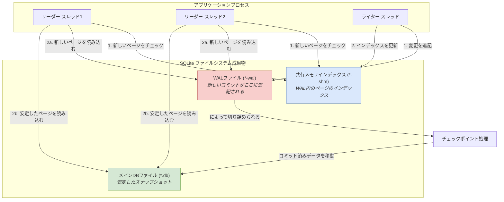

何十年もの間、標準的なアーキテクチャの教科書は明確でした。アプリケーションロジックはこちら側に、データベースはネットワークを介したあちら側に存在するというものです。PostgreSQLやMySQLのような巨人に支配されたこのクライアントサーバーモデルは、強力で馴染み深いものです。しかし、これは普遍的な真実ではありません。ネットワークは気まぐれで、レイテンシと予測不可能性の源です。もし、データベースがリモートサービスではなく、コードから関数呼び出し一つでアクセスできるローカルライブラリだったらどうでしょうか？これがSQLiteの約束する世界です。モバイルアプリや単純なスクリプト向けの「おもちゃのデータベース」として片付けられがちですが、適切に設定されたSQLiteインスタンスは、高スループットな本番バックエンドにおいて驚くべきパフォーマンスと回復力を発揮できます。技術的なジレンマは、SQLiteのデフォルト設定が安全性とシンプルさのために最適化されており、同時実行性のためではないという点です。その本番環境でのポテンシャルを解き放つには、内部メカニズム、特に先行書き込みログ（Write-Ahead Log, WAL）の深い理解が必要です。これは初心者向けのガイドではありません。要求の厳しい、同時実行性の高い環境にSQLiteをデプロイするための決定版マニュアルです。

<AudioPlayer src="/static/audio/sqlite-wal-mode-production-concurrency-ja.mp3" title="音声エグゼクティブ・ブリーフィング" voice="Google Cloud ja-JP-Neural2-B" />

<InfoAlert title="インタラクティブな本番環境用設定ジェネレータ">
  Python、Node.js、Go、Rust用のワンクリックコード生成機能を備えた無料の**[SQLite Production PRAGMA Configurator](/ja/tools/sqlite-configurator)**で、ワークロードの正確なメモリ制限、同時実行タイムアウト、接続プールの設定を微調整できます。
</InfoAlert>

<SuccessAlert title="本番向け Next.js 15 + SQLite ボイラープレート: LiteSaaS">
  このSQLite WAL + Litestreamアーキテクチャを実際の製品で今すぐ試してみませんか？ オープンソースの **[LiteSaaS (GitHub)](https://github.com/locionic/litesaas)**（[ライブデモ](https://litesaas-production.up.railway.app)あり）をご覧ください。Next.js 15、Drizzle ORM、セルフホスト認証、およびLitestream S3自動バックアップを備えた完全無料のSaaSスターターキットです。
</SuccessAlert>

## デフォルトは本番向けではない：ロールバックジャーナルからWALへ

SQLiteの同時実行性が低いという評判の最も一般的な原因は、そのデフォルトのジャーナリングモードにあります。解決策を理解する前に、まず問題を理解しなければなりません。

### ロールバックジャーナルの仕組み（そしてなぜ同時実行に失敗するのか）

デフォルトでは、SQLiteは`DELETE`ジャーナルモード（ロールバックジャーナルの一種）を使用します。書き込みトランザクションを開始すると、SQLiteは以下の手順を実行します。

1.  **ロックの取得：** データベースにRESERVEDロックをかけ、他のライターを防ぎます。コミットするためには、これをEXCLUSIVEロックに昇格させる必要があり、リーダーを含む他のすべての接続をブロックします。
2.  **ジャーナルの作成：** 変更される元のページを別のロールバックジャーナルファイル（例：`my-db.db-journal`）にコピーします。
3.  **データベースへの書き込み：** メインのデータベースファイル内のページを直接変更します。
4.  **コミット：** 書き込みが完了し、ディスクに同期されると、ジャーナルファイルは削除されます。

トランザクションの途中でクラッシュが発生した場合、ジャーナルファイルは残ります。次に接続した際、SQLiteはそのジャーナルファイルを見て、それを使ってメインデータベースファイルの変更を「ロールバック」し、トランザクション前の状態に復元します。

これは堅牢ですが、同時実行性には壊滅的な影響を与えます。**ライターはすべてのリーダーをブロックし、リーダーはライターのコミットをブロックします**。複数のリクエストを処理するWebサーバーでは、この直列化が即座にボトルネックとなり、`SQLITE_BUSY`エラーと許容できないレイテンシを引き起こします。

### 先行書き込みログ（WAL）の登場：同時実行性のゲームチェンジャー

SQLite 3.7.0で導入されたWALモードは、ジャーナリングプロセスを逆転させます。「何を元に戻すか」を記録するファイルの代わりに、「何をすべきか」を記録するファイルを書きます。

1.  **書き込みはWALファイルへ：** 新しい変更は、別の`*-wal`ファイルに追記されます。メインのデータベースファイルは触られません。
2.  **リーダーはWALを参照：** リーダーがページを必要とするとき、まず共有メモリインデックス（`*-shm`ファイル）をチェックし、そのページの新しいバージョンがWALファイルに存在するかどうかを確認します。もし存在すればそこから読み込み、そうでなければメインデータベースファイルの安定したバージョンを読み込みます。
3.  **チェックポイント処理：** 定期的に、「チェックポイント」と呼ばれるプロセスが、コミットされたトランザクションをWALファイルからメインデータベースファイルに移動させます。これは自動的に行われることも、手動でトリガーすることもできます。

この設計は、同時実行モデルを根本的に変えます。

*   **ライターはリーダーをブロックしない：** リーダーは、安定したコミット済みスナップショットを表すメインデータベースファイルにアクセスし続けることができます。
*   **リーダーはライターをブロックしない：** ライターは、リーダーが終了するのを待たずにWALファイルに追記できます。

唯一の競合は、特定の瞬間にWALファイルに追記できるライターが1つだけであるという点です。これをうまく管理する方法については後ほど説明します。

以下は、WALモードにおけるデータフローの視覚化です。



## 高スループットのためのSQLite設定：必須のPRAGMA

この高同時実行性モードを有効にし、本番の負荷に合わせて調整するには、新しいデータベース接続ごとに一連の`PRAGMA`コマンドを発行する必要があります。順序が重要になる場合があり、これらは（`journal_mode`を除いて）データベースファイルに永続的に保存されないため、接続ごとに設定する必要があります。

以下のインタラクティブ設定ツールを使用してワークロードに合わせたPRAGMA設定を調整するか、標準の定型コードをコピーしてください：

<SqliteConfigurator />

以下は、本番グレードのSQLite設定のための標準的なPRAGMAのセットです：

```python
import sqlite3

def create_connection(db_file):
    """ Create a database connection to a SQLite database
        with production-ready PRAGMAs.
    """
    conn = None
    try:
        conn = sqlite3.connect(db_file, timeout=10.0) # timeout is for lock contention
        
        # Set PRAGMAs
        conn.execute("PRAGMA journal_mode = WAL;")
        conn.execute("PRAGMA busy_timeout = 5000;") # 5000ms = 5s
        conn.execute("PRAGMA synchronous = NORMAL;")
        conn.execute("PRAGMA cache_size = -65536;") # 64MB cache
        conn.execute("PRAGMA foreign_keys = ON;")
        conn.execute("PRAGMA temp_store = MEMORY;")

        print(f"SQLite {sqlite3.sqlite_version} connected to {db_file}")
        return conn
    except sqlite3.Error as e:
        print(e)
        if conn:
            conn.close()
    return None

if __name__ == '__main__':
    db_conn = create_connection("production.db")
    if db_conn:
        # Your application logic here
        db_conn.close()
```

それぞれの重要なPRAGMAを詳しく見ていきましょう。

### `PRAGMA journal_mode = WAL;`

これはマスターイッチです。データベースを永続的に先行書き込みログを使用するように変更します。一度設定すればその設定は維持されますが、すべての接続で設定しても害はありません。これにより、これまで説明してきたリーダー/ライターの同時実行性が有効になります。

### `PRAGMA busy_timeout = 5000;` - 待機の技術

これは、ライターの同時実行性を管理するための最も重要なPRAGMAです。デフォルトでは、スレッドがすでに保持されている書き込みロックを取得しようとすると、SQLiteは即座に`SQLITE_BUSY`を返します。これにより、アプリケーションコードで複雑なリトライロジックを実装する必要が生じます。

`busy_timeout`は、SQLiteドライバーに、`SQLITE_BUSY`を返す前に指定されたミリ秒数だけ自動的に待機してリトライするように指示します。この例では、`5000`は書き込みスレッドが他のライターのトランザクションが終了するのを最大5秒間待つことを意味します。短い書き込みトランザクションを持つほとんどのWebアプリケーションでは、5〜10秒のタイムアウトは、アプリケーション層にエラーを上げることなく、同時書き込みリクエストを直列化するのに十分すぎるほどです。

### `PRAGMA synchronous = NORMAL;` - 実用的な耐久性のトレードオフ

`synchronous`プラグマは、SQLiteが停電やOSのクラッシュに対してデータの耐久性を確保するために、どれだけ慎重にデータをディスクに同期するかを制御します。

*   **`FULL`（デフォルト）：** WALモードでは、`FULL`はトランザクションがWALファイルにコミットされるたびに`fsync()`を実行し、チェックポイント処理中にもう一度実行します。これは非常に安全ですが、`fsync()`は高価なシステムコールであるため、遅くなる可能性があります。
*   **`NORMAL`：** WALモードでは、`NORMAL`はチェックポイント処理中には`fsync`を行いますが、個々のトランザクションコミット後の`fsync()`は*省略します*。その代わり、OSはWALファイルへの書き込みを自由にバッファリングし、定期的に書き出すことができます。

`NORMAL`は安全なのでしょうか？トランザクションが破損するためには、以下の事象が発生する必要があります：
1.  トランザクションをコミットする。
2.  OSが書き込みバッファをディスク上のWALファイルにフラッシュしない。
3.  システムが壊滅的なクラッシュ（例：停電）を経験する。

復旧時に、その特定のトランザクションは失われる可能性があります。しかし、データベース自体は破損*しません*。トランザクションはアトミックであり、完全に存在するか、まったく存在しないかのどちらかです。多くのアプリケーションにとって、`synchronous=NORMAL`による大幅なパフォーマンス向上は、停電シナリオで最新の数ミリ秒の書き込みを失うというごくわずかなリスクに見合う価値があります。これは高スループットシステムにとって実用的な選択です。

### `PRAGMA cache_size = -65536;` - メモリ内キャッシュのチューニング

このPRAGMAは、SQLiteのメモリ内ページキャッシュのサイズを制御します。正の値`N`は`N`ページ分のスペースを割り当てます。負の値`-K`は`K`キロバイトのメモリを割り当てます。

デフォルトのキャッシュは小さいです（2MB、または`-2000`）。十分なRAMを持つサーバーでは、これを増やすことは読み取り負荷の高いワークロードにとって大きなパフォーマンス向上になります。SQLiteは頻繁にアクセスされるページをメモリ内に保持し、ディスクI/Oを回避します。`-65536`という値は64MBのキャッシュを割り当てます。"ホット"なデータセットのサイズに応じて、利用可能なアプリケーションメモリの10〜25％を割り当てるのが良い出発点です。

### `PRAGMA mmap_size = N;` - OSページキャッシュの活用

これはより高度なチューニングパラメータです。SQLiteに、最大`N`バイトのサイズのデータベースファイルを読み取るためにメモリマップドI/Oを使用するように指示します。

*   **仕組み：** `read()`システムコールを発行してディスクからSQLiteのプライベートキャッシュ（`cache_size`）にデータを引き込む代わりに、`mmap`はデータベースファイルをプロセスのアドレス空間に直接マッピングします。これにより、オペレーティングシステムのページキャッシュがデータベースファイルの主要なキャッシュになります。
*   **利点：** これは、特に読み取り負荷の高いワークロードや、利用可能なRAMよりも大きなデータベースの場合に高速になる可能性があります。カーネルのバッファキャッシュからSQLiteのユーザー空間キャッシュへの`memcpy`を回避します。OSは単一のアプリケーションよりもメモリ管理が賢いことが多いです。
*   **トレードオフ：** `mmap_size`は主に読み取り用です。データが書き込まれるとき、変更は依然として標準のI/Oパスを通ってWALファイルに行かなければなりません。データベースがほとんど読み取り専用の場合に最も効果的です。64ビットシステムでの良い開始値は`268435456`（256 MB）です。

**`cache_size`と`mmap_size`、どちらを使うべきか？**
これらは一緒に使用できます。ファイルが`mmap_size`内に収まる場合、SQLiteは初期読み取りに`mmap`を使用します。mmapでカバーされていないページやダーティページについては、プライベートページキャッシュを使用します。一般的な戦略は、大きな`mmap_size`を設定し、WALに書き込まれる前のダーティページを保持するために控えめな`cache_size`を設定することです。

## 同時実行モデルの理解：多数のリーダー、一人のライター

「シングルライター」が何を意味するのかを正確に理解しましょう。これは、データベースファイルシステムが**一度に1つのアクティブな書き込みトランザクションのみ**を許可することを意味します。

ワーカープールを持つNode.jsやPythonのWebサーバーを想像してください。10個のリクエストが同時に到着し、すべてがデータベースに書き込む必要があるとします。
1.  ワーカー1がトランザクションを開始し、書き込みロックを取得します。
2.  ワーカー2〜10がトランザクションを開始しようとします。データベースがロックされていることを見つけます。
3.  `busy_timeout`が設定されているため、SQLiteドライバーは失敗しません。待機状態に入ります。
4.  ワーカー1がトランザクションをコミットします。これはWALファイルへの追記だけなので非常に高速です（例：1ms未満）。ロックが解放されます。
5.  待機していたワーカーの1つ（例：ワーカー2）が即座にロックを取得し、書き込みを実行します。
6.  このプロセスは、すべてのワーカーが書き込みを完了するまで繰り返されます。

アプリケーションの観点からは、これは同時実行のように感じられます。データベース自体が書き込みを直列化しているのです。個々の書き込みトランザクションが短く高速である限り、このモデルは非常に高い書き込み*スループット*をサポートします。ボトルネックは同時ライターの数ではなく、最も長い書き込みトランザクションの期間です。**書き込みトランザクションは小さく、速く保ちましょう。**

## スイートスポット：SQLiteがクライアントサーバーデータベースを上回る時

SQLiteはPostgreSQLキラーではありません。それは異なる仕事のための異なるツールです。主なボトルネックがネットワークレイテンシと運用上の複雑さである場合に輝きます。

| 特徴               | SQLite（インプロセス）                             | クライアントサーバー（例：PostgreSQL）        |
| --------------------- | -------------------------------------------------- | ----------------------------------------------- |
| **データ転送**     | 同一プロセス内でのメモリコピー               | ネットワークパケット（TCP/IPオーバーヘッド）   |
| **レイテンシ**           | マイクロ秒（関数呼び出し）                     | ミリ秒（ネットワークのラウンドトリップ）           |
| **デプロイ**        | ゼロコンフィグ、ただのファイル                      | プロビジョニング、管理、保護が必要な別サーバー    |
| **スケーラビリティ**       | 垂直（1台のマシンのRAM/ディスクを高速化）     | 水平（リードレプリカ、シャーディング）            |
| **同時書き込み** | 直列化（アクティブなライターは1つ）                     | 高い（行レベルロック）                        |
| **ユースケース**          | 読み取り中心のアプリ、エッジコンピューティング、キャッシング、ジョブキュー、分析 | 中央集権的な真実の源、高い書き込み競合 |

**SQLiteが優れている分野：**
*   **読み取り中心のAPI：** 一般的なAPIは、リクエストごとに5〜10回の読み取りと0〜1回の書き込みを行うかもしれません。SQLiteでは、これらの読み取りはサブミリ秒のレイテンシを持つ関数呼び出しです。クライアントサーバーDBでは、5〜10回のネットワークラウンドトリップが発生します。
*   **エッジコンピューティング：** エッジ（例：Fly.io, Cloudflare Durable Objects）でデータベースを実行することは、SQLiteに自然に適合します。分散データベースクラスタを管理することなく、ユーザーに近い場所でステートフルなコンピューティングを提供します。
*   **分析とレポート：** ディスクに収まるデータセット全体で多くの複雑な結合を必要とするレポートを生成する場合、SQLiteは、そのすべてのデータをネットワーク経由でアプリケーションメモリにプルして処理するよりも高速な場合があります。
*   **アプリケーションファイル形式：** 複雑なアプリケーション（例：デザインツール、科学技術ソフトウェア）のための堅牢で、クエリ可能で、将来性のあるファイル形式としてSQLiteを使用することは、実績のあるパターンです。

## 耐久性の解決：Litestreamによる災害復旧

本番環境でスタンドアロンのSQLiteデータベースを実行する際の最大の正当な懸念は、耐久性です。ディスクが故障すれば、すべてを失います。バックアップは重要ですが、定期的なスナップショットでは数分または数時間のデータを失う可能性があります。

ここで[Litestream](https://litestream.io/)の出番です。これは、SQLiteデータベースをS3互換のオブジェクトストレージに継続的かつリアルタイムにレプリケーションするための、軽量なオープンソースツールです。

*   **仕組み：** Litestreamは別のサイドカープロセスとして実行されます。`-wal`ファイルの変更を監視します。SQLiteが新しいトランザクションをWALにコミットすると、Litestreamはそれらのコミットされたページを読み取り、レプリケーション先（例：AWS S3, Backblaze B2, MinIO）にストリーミングします。
*   **低オーバーヘッド：** 非同期であり、メインデータベースではなくWALファイルから読み取ります。アプリケーションの書き込みパフォーマンスへの影響はごくわずかです。
*   **ポイントインタイムリカバリ：** すべての変更をストリーミングしているため、最後のスナップショットだけでなく、特定の任意の時点にデータベースを復元できます。

Litestreamの設定は簡単です。シンプルなYAML設定ファイルを作成します。

```yaml
# litestream.yml
dbs:
  - path: /path/to/your/production.db
    replicas:
      - type: s3
        bucket: "my-app-db-backups"
        path: "sqlite/production.db"
        region: "us-east-1"
        # Access keys configured via environment variables
        # AWS_ACCESS_KEY_ID, AWS_SECRET_ACCESS_KEY
```

そして実行します：

```bash
# Litestreamレプリケーションプロセスをバックグラウンドで開始
litestream replicate -config /etc/litestream.yml
```

災害から復旧するには：

```bash
# S3レプリカから特定の時点のデータベースを復元
litestream restore -o /var/lib/data/restored.db s3://my-app-db-backups/sqlite/production.db -t "2026-09-22T12:30:00Z"
```

Litestreamを使えば、SQLiteは揮発性のある単一ノードのデータベースから、主要なアプリケーションデータを保存するのに適した、耐久性のある回復力のあるシステムに昇格します。

<SuccessAlert title="SQLite + Litestreamですぐにアプリを構築する">
  この本番アーキテクチャをそのまま実装したスターターキット **[LiteSaaS](https://github.com/locionic/litesaas)** を公開しています。[ライブデモ](https://litesaas-production.up.railway.app)（デモアカウントですぐにログイン可能）をお試しいただくか、リポジトリをクローンして月額4ドルのVPSで即座に運用を開始できます。
</SuccessAlert>

<FAQ title="よくある質問">
  <Question>同時書き込みの*本当の*上限は何ですか？</Question>
  <Answer>ハードリミットは、任意のマイクロ秒において*アクティブな*書き込みトランザクションが1つであることです。実用的な上限は、トランザクションの期間と`busy_timeout`の関数です。平均的な書き込みトランザクションが100マイクロ秒(μs)かかり、100の同時書き込みリクエストがある場合、最後のリクエストは約(100 μs * 100) = 10,000 μs、つまり10ミリ秒後に処理されます。これにスケジューリングのオーバーヘッドが加わります。これは多くの場合、完全に許容範囲内です。このモデルは、*長時間実行される*書き込みトランザクション（例：一度に数百万行を更新する）がある場合に破綻します。なぜなら、これにより他のライターがタイムアウトするからです。重要なのは、データベースに関係なくベストプラクティスである、短く頻繁な書き込みを行うようにアプリケーションを設計することです。</Answer>
  <Question>`mmap_size`はOSのページキャッシュや`cache_size`とどのように相互作用しますか？</Question>
  <Answer>これらは関連していますが、異なる目的を果たします。`cache_size`は、SQLiteによって完全に管理されるプライベートなユーザー空間キャッシュを定義します。SQLiteがページを必要とするとき、`read()`システムコールを発行し、OSは自身のディスクバッファキャッシュからSQLiteのプライベートキャッシュにデータをコピーします。`mmap_size`はこれをバイパスします。データベースファイルの一部をアプリケーションのメモリアドレス空間に直接マッピングし、OSのページキャッシュをその領域の*事実上の*キャッシュにします。SQLiteがメモリマップされたページにアクセスすると、ページフォールトが発生する可能性がありますが、`memcpy`はありません。これは一般的に読み取りにおいてより効率的です。SQLiteは両方を使用できます。読み取り専用アクセスの大部分にmmapを使用し、変更が必要なページやmmap領域外のページにはプライベートな`cache_size`キャッシュを使用するかもしれません。読み取り負荷の高いワークロードのための経験則：大きな`mmap_size`（例：256MB+）と、書き込みやキャッシュミスを処理するための小さな`cache_size`（例：16-64MB）を設定します。</Answer>
  <Question>WALモードでの`synchronous=NORMAL`は、本番環境で本当に安全ですか？</Question>
  <Answer>ほとんどのアプリケーションにとって「実用的に安全」です。WALモードで`synchronous=NORMAL`を使用すると、通常の書き込み中にOSがクラッシュしたり電源が喪失したりした場合でも、データベースは破損から保護されます。最悪の場合、OSのバッファにあったがまだディスクにフラッシュされていなかった最後の数トランザクションを失う可能性があります。データベースの整合性は維持されます。理論上のリスクは、*チェックポイント操作中*にクラッシュが発生する場合です。`NORMAL`はチェックポイント後にメインDBファイルを`fsync`しないため、この正確な瞬間に電源障害が発生すると、データベースが破損する可能性があります。しかし、チェックポイントは比較的頻度が低く、この障害のウィンドウは非常に小さいです。SQLiteの作者自身が「実際には、この特定の障害モードよりも隕石の衝突によって壊滅的なデータ損失を被る可能性の方が高い」と述べています。災害時に数秒のデータ損失が許容できるアプリケーションでは、パフォーマンスの向上はほとんどの場合、そのリスクを冒す価値があります。絶対的な、鉄壁の耐久性（例：金融台帳）が必要な場合は、`synchronous=FULL`を使い続け、パフォーマンスの低下を受け入れてください。</Answer>
</FAQ>

## 結論：実践的な要点

SQLiteは、正しく設定すればバックエンドサービスにとって真剣な選択肢となります。デフォルト設定から一歩踏み出すことで、クライアントサーバー型のシステムよりもシンプルで、高速で、効率的なシステムを構築できます。

*   **常にWALモードを使用する：** `PRAGMA journal_mode=WAL;` を実行して、現代的な同時実行性を有効にしましょう。
*   **十分な`busy_timeout`を設定する：** まずは5〜10秒から始め、アプリケーションレベルのエラーなしにライターの直列化を適切に処理しましょう。
*   **耐久性を実用的に選択する：** `PRAGMA synchronous=NORMAL;` は、最小限でよく理解されたリスクプロファイルで、大幅なパフォーマンス向上を提供します。絶対的なトランザクションごとのfsync保証が必要でない限り、これを使用しましょう。
*   **キャッシュを調整する：** 十分な`cache_size`（例：64MBの場合は`-65536`）を割り当て、読み取り集約型のワークロードでは`mmap_size`を試してみましょう。
*   **書き込みトランザクションを短く保つ：** シングルライターモデルは、短く高速なトランザクションでこそ真価を発揮します。長時間実行される更新は避けましょう。
*   **Litestreamで耐久性を確保する：** データ損失の恐れで立ち止まらないでください。Litestreamを使用してオブジェクトストレージへの継続的なリアルタイムバックアップを行い、ポイントインタイムリカバリと安心を手に入れましょう。

次に新しいサービスを開始するときは、デフォルトでネットワークデータベースに手を伸ばさないでください。アクセスパターンを評価しましょう。アプリケーションが読み取り中心で、マイクロ秒単位のレイテンシから恩恵を受けられる場合は、適切に設定されたSQLiteにチャンスを与えてみてください。それがどこまであなたを連れて行ってくれるか、驚くかもしれません。

## さらに読む

*   [SQLite PRAGMA Cheatsheet for Performance and Consistency](https://sqlite.org/pragma.html) (パフォーマンスと一貫性のためのSQLite PRAGMAチートシート)
*   [Write-Ahead Logging in SQLite](https://www.sqlite.org/wal.html) (SQLiteの先行書き込みロギング)
*   [Litestream - Streaming Replication for SQLite](https://litestream.io/) (Litestream - SQLiteのためのストリーミングレプリケーション)
*   [How to use SQLite in a multi-threaded application](https://www.sqlite.org/threadsafe.html) (マルチスレッドアプリケーションでSQLiteを使用する方法)
*   [Fly.io Blog: "Running SQLite in Production"](https://fly.io/blog/all-in-on-sqlite-litestream/) (Fly.ioブログ: 「本番環境でSQLiteを動かす」)
