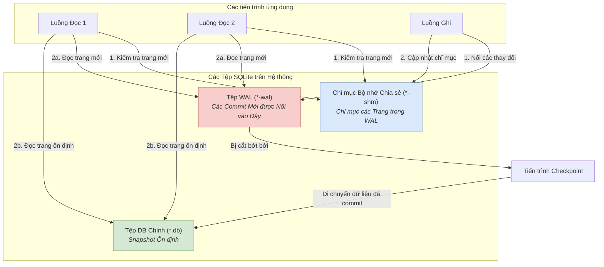

Trong nhiều thập kỷ, kiến trúc phần mềm tiêu chuẩn đã rất rõ ràng: logic ứng dụng của bạn ở một nơi, và cơ sở dữ liệu của bạn ở một nơi khác, ngăn cách bởi một mạng lưới. Mô hình client-server này, do các ông lớn như PostgreSQL và MySQL thống trị, rất mạnh mẽ và quen thuộc. Nhưng nó không phải là chân lý phổ quát. Mạng lưới là một con thú thất thường, một nguồn gốc của độ trễ và sự khó lường. Sẽ ra sao nếu cơ sở dữ liệu của bạn không phải là một dịch vụ từ xa mà là một thư viện cục bộ, chỉ cách mã của bạn một lời gọi hàm? Đây chính là lời hứa của SQLite. Thường bị coi là một "cơ sở dữ liệu đồ chơi" cho các ứng dụng di động hoặc các script đơn giản, một instance SQLite được cấu hình đúng cách có thể mang lại hiệu suất và khả năng phục hồi đáng kinh ngạc trong các backend production có thông lượng cao. Vấn đề nan giải đối với kỹ sư là các cài đặt mặc định của SQLite được tối ưu hóa cho sự an toàn và đơn giản, không phải cho xử lý đồng thời (concurrency). Để khai phá tiềm năng production của nó, đòi hỏi sự hiểu biết sâu sắc về cơ chế nội bộ, đặc biệt là Write-Ahead Log (WAL). Đây không phải là hướng dẫn cho người mới bắt đầu; đây là cẩm nang chính thức để triển khai SQLite trong các môi trường đòi hỏi khắt khe, có tính đồng thời cao.

<AudioPlayer src="/static/audio/sqlite-wal-mode-production-concurrency-vi.mp3" title="Tóm tắt âm thanh cho kỹ sư" voice="Google Cloud vi-VN-Neural2-A" />

<InfoAlert title="Công cụ Cấu hình Production Tương tác">
  Tinh chỉnh chính xác giới hạn bộ nhớ, timeout đồng thời, và cài đặt connection pool cho workload của bạn với công cụ miễn phí **[SQLite Production PRAGMA Configurator](/en/tools/sqlite-configurator)**, có khả năng tạo mã nguồn chỉ với một cú nhấp chuột cho Python, Node.js, Go và Rust.
</InfoAlert>

## Mặc định không sẵn sàng cho Production: Từ Rollback Journal đến WAL

Nguồn gốc phổ biến nhất của việc SQLite bị mang tiếng là xử lý đồng thời kém chính là chế độ journal mặc định của nó. Trước khi chúng ta có thể đánh giá cao giải pháp, chúng ta phải hiểu vấn đề.

### Cách Rollback Journal hoạt động (và Tại sao nó thất bại ở Concurrency)

Theo mặc định, SQLite sử dụng chế độ journal `DELETE` (một loại rollback journal). Khi bạn bắt đầu một giao dịch ghi (write transaction), SQLite thực hiện các bước sau:

1.  **Acquire a Lock (Giành quyền khóa):** Nó đặt một khóa RESERVED trên cơ sở dữ liệu, ngăn chặn các writer khác. Để commit, nó phải nâng cấp khóa này lên EXCLUSIVE, chặn tất cả các kết nối khác, bao gồm cả các reader.
2.  **Create a Journal (Tạo tệp nhật ký):** Nó sao chép các trang (page) gốc, chưa thay đổi sẽ bị sửa đổi vào một tệp rollback journal riêng (ví dụ: `my-db.db-journal`).
3.  **Write to the Database (Ghi vào cơ sở dữ liệu):** Nó sửa đổi các trang trực tiếp trong tệp cơ sở dữ liệu chính.
4.  **Commit:** Sau khi việc ghi hoàn tất và được đồng bộ hóa xuống đĩa, tệp journal sẽ bị xóa.

Nếu xảy ra sự cố giữa chừng giao dịch, tệp journal vẫn tồn tại. Ở lần kết nối tiếp theo, SQLite thấy tệp journal, sử dụng nó để "rollback" (khôi phục) các thay đổi trong tệp cơ sở dữ liệu chính, đưa nó về trạng thái trước giao dịch.

Cơ chế này rất mạnh mẽ, nhưng nó có tác động tai hại đến concurrency: **một writer chặn tất cả các reader, và các reader chặn một writer commit**. Trong một máy chủ web xử lý nhiều yêu cầu, sự tuần tự hóa này tạo ra một điểm nghẽn ngay lập tức, dẫn đến lỗi `SQLITE_BUSY` và độ trễ không thể chấp nhận được.

### Bước vào Write-Ahead Logging (WAL): Kẻ thay đổi cuộc chơi Concurrency

Được giới thiệu trong SQLite 3.7.0, chế độ WAL đảo ngược quá trình journaling. Thay vì ghi một tệp "cần hoàn tác những gì", nó ghi một tệp "cần làm những gì".

1.  **Ghi vào tệp WAL:** Các thay đổi mới được nối vào một tệp `*-wal` riêng biệt. Tệp cơ sở dữ liệu chính không bị ảnh hưởng.
2.  **Reader tham khảo tệp WAL:** Khi một reader cần một trang, nó trước tiên kiểm tra một chỉ mục bộ nhớ chia sẻ (tệp `*-shm`) để xem có phiên bản mới hơn của trang đó trong tệp WAL hay không. Nếu có, nó đọc từ đó; nếu không, nó đọc phiên bản ổn định từ tệp cơ sở dữ liệu chính.
3.  **Checkpointing:** Định kỳ, một quy trình gọi là "checkpoint" sẽ di chuyển các giao dịch đã commit từ tệp WAL vào tệp cơ sở dữ liệu chính. Điều này có thể xảy ra tự động hoặc được kích hoạt thủ công.

Thiết kế này thay đổi cơ bản mô hình concurrency:

*   **Writer không chặn Reader:** Reader có thể tiếp tục truy cập tệp cơ sở dữ liệu chính, vốn đại diện cho một snapshot ổn định, đã được commit.
*   **Reader không chặn Writer:** Một writer có thể nối vào tệp WAL mà không cần chờ các reader hoàn thành.

Sự tranh chấp duy nhất là chỉ có một writer có thể đang tích cực nối vào tệp WAL tại bất kỳ thời điểm nào. Chúng ta sẽ xem cách quản lý điều này một cách khéo léo.

Đây là hình ảnh hóa luồng dữ liệu trong chế độ WAL:



## Cấu hình SQLite cho Thông lượng cao: Các PRAGMA thiết yếu

Để kích hoạt chế độ concurrency cao này và tinh chỉnh nó cho tải production, bạn phải thực thi một loạt lệnh `PRAGMA` trên mỗi kết nối cơ sở dữ liệu mới. Thứ tự có thể quan trọng, và chúng phải được thiết lập cho mỗi kết nối vì chúng không được lưu trữ vĩnh viễn trong tệp cơ sở dữ liệu (ngoại trừ `journal_mode`).

Đây là bộ PRAGMA kinh điển cho một thiết lập SQLite cấp production.

```python
import sqlite3

def create_connection(db_file):
    """ Create a database connection to a SQLite database
        with production-ready PRAGMAs.
    """
    conn = None
    try:
        conn = sqlite3.connect(db_file, timeout=10.0) # timeout is for lock contention
        
        # Set PRAGMAs
        conn.execute("PRAGMA journal_mode = WAL;")
        conn.execute("PRAGMA busy_timeout = 5000;") # 5000ms = 5s
        conn.execute("PRAGMA synchronous = NORMAL;")
        conn.execute("PRAGMA cache_size = -65536;") # 64MB cache
        conn.execute("PRAGMA foreign_keys = ON;")
        conn.execute("PRAGMA temp_store = MEMORY;")

        print(f"SQLite {sqlite3.sqlite_version} connected to {db_file}")
        return conn
    except sqlite3.Error as e:
        print(e)
        if conn:
            conn.close()
    return None

if __name__ == '__main__':
    db_conn = create_connection("production.db")
    if db_conn:
        # Your application logic here
        db_conn.close()
```

Hãy cùng phân tích từng PRAGMA quan trọng.

### `PRAGMA journal_mode = WAL;`

Đây là công tắc chính. Nó thay đổi vĩnh viễn cơ sở dữ liệu để sử dụng Write-Ahead Logging. Bạn chỉ cần đặt nó một lần, và nó sẽ được giữ nguyên, nhưng việc đặt nó trên mỗi kết nối cũng không có hại. Điều này cho phép mô hình concurrency reader/writer mà chúng ta đã thảo luận.

### `PRAGMA busy_timeout = 5000;` - Nghệ thuật của sự chờ đợi

Đây là PRAGMA quan trọng nhất để quản lý concurrency của writer. Theo mặc định, nếu một thread cố gắng giành quyền khóa ghi (write lock) đã bị giữ, SQLite sẽ trả về `SQLITE_BUSY` ngay lập tức. Điều này buộc mã ứng dụng của bạn phải triển khai logic thử lại phức tạp.

`busy_timeout` hướng dẫn driver SQLite tự động chờ và thử lại trong số mili giây được chỉ định trước khi trả về `SQLITE_BUSY`. Trong ví dụ, `5000` có nghĩa là một thread ghi sẽ chờ tối đa 5 giây để một writer khác hoàn thành giao dịch của nó. Đối với hầu hết các ứng dụng web với các giao dịch ghi ngắn, timeout từ 5-10 giây là quá đủ để tuần tự hóa các yêu cầu ghi đồng thời mà không bao giờ đẩy lỗi lên lớp ứng dụng.

### `PRAGMA synchronous = NORMAL;` - Sự đánh đổi thực tế về độ bền dữ liệu

Pragma `synchronous` kiểm soát mức độ cẩn thận của SQLite trong việc đồng bộ hóa dữ liệu xuống đĩa để đảm bảo độ bền trước tình trạng mất điện hoặc sự cố hệ điều hành.

*   **`FULL` (Mặc định):** Trong chế độ WAL, `FULL` thực hiện một lệnh `fsync()` sau mỗi giao dịch được commit vào tệp WAL và một lệnh khác trong quá trình checkpointing. Điều này cực kỳ an toàn nhưng có thể chậm, vì `fsync()` là một lời gọi hệ thống tốn kém.
*   **`NORMAL`:** Trong chế độ WAL, `NORMAL` vẫn `fsync` trong quá trình checkpointing, nhưng nó *bỏ qua `fsync()` sau mỗi lần commit giao dịch riêng lẻ*. Thay vào đó, hệ điều hành được tự do đệm các lần ghi vào tệp WAL và ghi chúng ra định kỳ.

Liệu `NORMAL` có an toàn không? Để một giao dịch bị hỏng, các điều sau phải xảy ra:
1.  Bạn commit một giao dịch.
2.  Hệ điều hành không đẩy bộ đệm ghi của nó vào tệp WAL trên đĩa.
3.  Hệ thống gặp sự cố nghiêm trọng (ví dụ: mất điện).

Khi khôi phục, giao dịch cụ thể đó có thể bị mất. Tuy nhiên, bản thân cơ sở dữ liệu sẽ *không* bị hỏng. Giao dịch là nguyên tử (atomic); nó hoặc là có mặt đầy đủ hoặc là không có gì cả. Đối với nhiều ứng dụng, lợi ích hiệu suất khổng lồ từ `synchronous=NORMAL` đáng giá hơn nguy cơ cực nhỏ là mất đi vài mili giây ghi gần nhất trong trường hợp mất điện. Đó là một lựa chọn thực tế cho các hệ thống có thông lượng cao.

### `PRAGMA cache_size = -65536;` - Tinh chỉnh bộ đệm trong bộ nhớ

PRAGMA này kiểm soát kích thước của page cache trong bộ nhớ của SQLite. Giá trị dương `N` phân bổ không gian cho `N` trang. Giá trị âm `-K` phân bổ `K` kilobyte bộ nhớ.

Cache mặc định rất nhỏ (2MB, hoặc `-2000`). Đối với một máy chủ có nhiều RAM, việc tăng giá trị này là một chiến thắng lớn về hiệu suất cho các workload đọc nhiều. SQLite sẽ giữ các trang được truy cập thường xuyên trong bộ nhớ, tránh I/O đĩa. Giá trị `-65536` phân bổ một cache 64MB. Một điểm khởi đầu tốt là phân bổ 10-25% bộ nhớ ứng dụng có sẵn của bạn, tùy thuộc vào kích thước của tập dữ liệu "nóng" (hot dataset).

### `PRAGMA mmap_size = N;` - Tận dụng Page Cache của Hệ điều hành

Đây là một tham số tinh chỉnh nâng cao hơn. Nó hướng dẫn SQLite sử dụng memory-mapped I/O để đọc tệp cơ sở dữ liệu với kích thước lên tới `N` byte.

*   **Cách hoạt động:** Thay vì thực hiện các lời gọi hệ thống `read()` để lấy dữ liệu từ đĩa vào cache riêng của SQLite (`cache_size`), `mmap` ánh xạ tệp cơ sở dữ liệu trực tiếp vào không gian địa chỉ của tiến trình. Page cache của hệ điều hành giờ đây trở thành cache chính cho tệp cơ sở dữ liệu.
*   **Lợi ích:** Điều này có thể nhanh hơn, đặc biệt đối với các workload đọc nhiều hoặc cơ sở dữ liệu lớn hơn RAM có sẵn. Nó tránh được một lệnh `memcpy` từ bộ đệm của kernel vào cache không gian người dùng của SQLite. Hệ điều hành thường thông minh hơn về quản lý bộ nhớ so với một ứng dụng đơn lẻ.
*   **Sự đánh đổi:** `mmap_size` chủ yếu dành cho việc đọc. Khi dữ liệu được ghi, các thay đổi vẫn phải đi qua đường dẫn I/O tiêu chuẩn đến tệp WAL. Nó hiệu quả nhất khi cơ sở dữ liệu chủ yếu là đọc. Một giá trị khởi đầu tốt trên hệ thống 64-bit là `268435456` (256 MB).

**Nên dùng cái nào, `cache_size` hay `mmap_size`?**
Chúng có thể được sử dụng cùng nhau. SQLite sẽ sử dụng `mmap` cho các lần đọc ban đầu nếu tệp vừa với `mmap_size`. Đối với các trang không được mmap bao phủ hoặc các trang bẩn (dirty pages), nó sẽ sử dụng page cache riêng của mình. Một chiến lược phổ biến là đặt một `mmap_size` lớn và một `cache_size` khiêm tốn để giữ các trang bẩn trước khi chúng được ghi vào WAL.

## Hiểu về Mô hình Concurrency: Nhiều Reader, Một Writer

Hãy làm rõ ý nghĩa của "single writer". Nó có nghĩa là hệ thống tệp cơ sở dữ liệu chỉ cho phép **một giao dịch ghi đang hoạt động tại một thời điểm**.

Hãy tưởng tượng một máy chủ web Node.js hoặc Python với một worker pool. Mười yêu cầu đến đồng thời, và tất cả đều cần ghi vào cơ sở dữ liệu.
1.  Worker 1 bắt đầu một giao dịch, giành quyền khóa ghi.
2.  Các worker 2-10 cố gắng bắt đầu một giao dịch. Họ thấy cơ sở dữ liệu đã bị khóa.
3.  Vì `busy_timeout` đã được đặt, driver SQLite của họ không thất bại. Chúng chuyển sang trạng thái chờ.
4.  Worker 1 commit giao dịch của mình, diễn ra rất nhanh (ví dụ: dưới 1ms) vì nó chỉ là một thao tác nối vào tệp WAL. Khóa được giải phóng.
5.  Một trong những worker đang chờ (ví dụ: Worker 2) ngay lập tức giành được khóa và thực hiện việc ghi của mình.
6.  Quá trình này lặp lại cho đến khi tất cả các worker hoàn thành việc ghi của họ.

Từ góc độ của ứng dụng, nó có cảm giác như đồng thời. Bản thân cơ sở dữ liệu đang tuần tự hóa các lần ghi. Miễn là các giao dịch ghi riêng lẻ ngắn và nhanh, mô hình này hỗ trợ *thông lượng* ghi rất cao. Điểm nghẽn không phải là số lượng writer đồng thời, mà là thời gian của giao dịch ghi dài nhất. **Hãy giữ cho các giao dịch ghi của bạn nhỏ và nhanh.**

## Điểm ngọt: Khi SQLite đánh bại các Cơ sở dữ liệu Client-Server

SQLite không phải là kẻ tiêu diệt PostgreSQL. Nó là một công cụ khác cho một công việc khác. Nó tỏa sáng khi nút thắt cổ chai chính của bạn là độ trễ mạng và sự phức tạp trong vận hành.

| Tính năng             | SQLite (trong tiến trình)                           | Client-Server (ví dụ: PostgreSQL)                 |
| --------------------- | --------------------------------------------------- | ------------------------------------------------- |
| **Truyền dữ liệu**    | Sao chép bộ nhớ trong cùng một tiến trình           | Gói tin mạng (chi phí TCP/IP)                    |
| **Độ trễ**            | Micro giây (một lời gọi hàm)                        | Mili giây (thời gian đi-về của mạng)              |
| **Triển khai**        | Zero-config; nó chỉ là một tệp                      | Máy chủ riêng để cấp phát, quản lý, bảo mật        |
| **Khả năng mở rộng**  | Theo chiều dọc (nhiều RAM/đĩa nhanh hơn trên một máy) | Theo chiều ngang (read replica, sharding)           |
| **Ghi đồng thời**     | Tuần tự hóa (một writer hoạt động)                  | Cao (khóa cấp hàng)                               |
| **Trường hợp sử dụng** | Ứng dụng đọc nhiều, edge computing, caching, hàng đợi, phân tích | Nguồn sự thật trung tâm, tranh chấp ghi cao       |

**SQLite vượt trội trong:**
*   **API đọc nhiều:** Một API điển hình có thể thực hiện 5-10 lần đọc và 0-1 lần ghi mỗi yêu cầu. Với SQLite, những lần đọc đó là các lời gọi hàm với độ trễ dưới mili giây. Một DB client-server sẽ phải chịu 5-10 lần đi-về qua mạng.
*   **Edge Computing:** Chạy cơ sở dữ liệu ở vùng biên (ví dụ: Fly.io, Cloudflare Durable Objects) là một sự phù hợp tự nhiên cho SQLite. Nó cung cấp tính toán có trạng thái gần người dùng mà không cần quản lý một cụm cơ sở dữ liệu phân tán.
*   **Phân tích & Báo cáo:** Để tạo báo cáo yêu cầu nhiều phép join phức tạp trên một tập dữ liệu vừa vặn trên đĩa, SQLite thường có thể nhanh hơn việc kéo tất cả dữ liệu đó qua mạng để xử lý trong bộ nhớ ứng dụng.
*   **Định dạng tệp ứng dụng:** Sử dụng SQLite như một định dạng tệp mạnh mẽ, có thể truy vấn và tương thích với tương lai cho các ứng dụng phức tạp (ví dụ: công cụ thiết kế, phần mềm khoa học) là một mẫu đã được chứng minh.

## Giải quyết bài toán Độ bền dữ liệu: Phục hồi sau thảm họa với Litestream

Nỗi sợ hãi chính đáng nhất khi chạy một cơ sở dữ liệu SQLite độc lập trong production là độ bền dữ liệu. Nếu đĩa hỏng, bạn mất tất cả. Sao lưu rất quan trọng, nhưng các bản snapshot định kỳ có thể làm mất dữ liệu của vài phút hoặc vài giờ.

Đây là lúc [Litestream](https://litestream.io/) xuất hiện. Đây là một công cụ mã nguồn mở, nhẹ, cung cấp khả năng sao chép liên tục, thời gian thực của cơ sở dữ liệu SQLite của bạn đến một kho lưu trữ đối tượng tương thích S3.

*   **Cách hoạt động:** Litestream chạy như một tiến trình sidecar riêng biệt. Nó giám sát tệp `-wal` để tìm thay đổi. Khi SQLite commit các giao dịch mới vào WAL, Litestream đọc các trang đã commit đó và truyền chúng đến đích sao chép của bạn (ví dụ: AWS S3, Backblaze B2, MinIO).
*   **Chi phí thấp:** Nó hoạt động không đồng bộ và đọc từ tệp WAL, không phải từ cơ sở dữ liệu chính. Tác động của nó đến hiệu suất ghi của ứng dụng là không đáng kể.
*   **Phục hồi tại một thời điểm (Point-in-Time Recovery):** Vì nó truyền trực tuyến mọi thay đổi, bạn có thể khôi phục cơ sở dữ liệu của mình về bất kỳ thời điểm cụ thể nào, không chỉ là bản snapshot cuối cùng.

Thiết lập Litestream rất đơn giản. Bạn tạo một tệp cấu hình YAML đơn giản:

```yaml
# litestream.yml
dbs:
  - path: /path/to/your/production.db
    replicas:
      - type: s3
        bucket: "my-app-db-backups"
        path: "sqlite/production.db"
        region: "us-east-1"
        # Access keys configured via environment variables
        # AWS_ACCESS_KEY_ID, AWS_SECRET_ACCESS_KEY
```

Sau đó bạn chạy nó:

```bash
# Bắt đầu quá trình sao chép Litestream trong nền
litestream replicate -config /etc/litestream.yml
```

Để khôi phục sau thảm họa:

```bash
# Khôi phục cơ sở dữ liệu từ bản sao S3 đến một thời điểm cụ thể
litestream restore -o /var/lib/data/restored.db s3://my-app-db-backups/sqlite/production.db -t "2026-09-22T12:30:00Z"
```

Với Litestream, SQLite tốt nghiệp từ một cơ sở dữ liệu đơn nút, dễ bay hơi thành một hệ thống bền bỉ, có khả năng phục hồi, phù hợp để lưu trữ dữ liệu ứng dụng chính.

<FAQ title="Các câu hỏi thường gặp">
  <Question>Giới hạn *thực sự* của số writer đồng thời là bao nhiêu?</Question>
  <Answer>Giới hạn cứng là một giao dịch ghi *đang hoạt động* tại bất kỳ micro giây nào. Giới hạn thực tế là một hàm của thời gian giao dịch và `busy_timeout` của bạn. Nếu giao dịch ghi trung bình của bạn mất 100 micro giây (μs) và bạn có 100 yêu cầu ghi đồng thời, yêu cầu cuối cùng sẽ được phục vụ sau khoảng (100 μs * 100) = 10,000 μs, hoặc 10 mili giây, cộng với chi phí lập lịch. Điều này thường hoàn toàn chấp nhận được. Mô hình này sẽ bị phá vỡ nếu bạn có các giao dịch ghi *chạy lâu* (ví dụ: cập nhật hàng triệu hàng cùng một lúc), vì điều này sẽ khiến các writer khác bị timeout. Chìa khóa là thiết kế ứng dụng của bạn cho các lần ghi ngắn, thường xuyên, đây là một thực hành tốt nhất bất kể cơ sở dữ liệu nào.</Answer>
  <Question>`mmap_size` tương tác với page cache của hệ điều hành và `cache_size` như thế nào?</Question>
  <Answer>Chúng phục vụ các mục đích liên quan nhưng riêng biệt. `cache_size` định nghĩa một cache riêng, trong không gian người dùng, được quản lý hoàn toàn bởi SQLite. Khi SQLite cần một trang, nó thực hiện một lời gọi hệ thống `read()`, và HĐH sao chép dữ liệu từ bộ đệm đĩa của chính nó vào cache riêng của SQLite. `mmap_size` bỏ qua bước này. Nó ánh xạ một vùng của tệp cơ sở dữ liệu trực tiếp vào không gian bộ nhớ của ứng dụng, biến page cache của HĐH thành cache *de facto* cho vùng đó. Khi SQLite truy cập một trang được ánh xạ bộ nhớ, một page fault có thể xảy ra, nhưng không có lệnh `memcpy`. Điều này thường hiệu quả hơn cho việc đọc. SQLite có thể sử dụng cả hai; nó có thể sử dụng mmap cho phần lớn truy cập chỉ đọc và cache `cache_size` riêng của mình cho các trang cần sửa đổi hoặc cho các trang nằm ngoài vùng mmap. Một quy tắc chung cho các workload đọc nhiều: đặt `mmap_size` lớn (ví dụ: 256MB+) và `cache_size` nhỏ hơn (ví dụ: 16-64MB) để xử lý các lần ghi và cache miss.</Answer>
  <Question>Liệu `synchronous=NORMAL` trong chế độ WAL có thực sự an toàn cho production không?</Question>
  <Answer>Nó "an toàn một cách thực tế" cho hầu hết các ứng dụng. Trong chế độ WAL với `synchronous=NORMAL`, cơ sở dữ liệu của bạn được bảo vệ khỏi bị hỏng trong trường hợp HĐH bị treo hoặc mất điện trong một lần ghi thông thường. Tệ nhất, bạn có thể mất vài giao dịch cuối cùng đang nằm trong bộ đệm của HĐH nhưng chưa được ghi xuống đĩa. Tính toàn vẹn của cơ sở dữ liệu được duy trì. Rủi ro lý thuyết duy nhất liên quan đến sự cố xảy ra *trong quá trình checkpoint*. Vì `NORMAL` không `fsync` tệp DB chính sau khi checkpoint, mất điện tại thời điểm chính xác này có thể dẫn đến cơ sở dữ liệu bị hỏng. Tuy nhiên, checkpoint tương đối không thường xuyên, và cửa sổ lỗi này cực kỳ nhỏ. Chính các tác giả SQLite đã tuyên bố rằng "trên thực tế, bạn có nhiều khả năng bị mất dữ liệu thảm khốc do thiên thạch rơi hơn là từ chế độ lỗi cụ thể này." Đối với các ứng dụng mà việc mất vài giây dữ liệu là chấp nhận được trong một thảm họa, lợi ích về hiệu suất gần như luôn luôn đáng giá. Đối với độ bền tuyệt đối, vững như sắt (ví dụ: sổ cái tài chính), hãy gắn bó với `synchronous=FULL` và chấp nhận sự sụt giảm hiệu suất.</Answer>
</FAQ>

## Kết luận: Những điểm chính cần hành động

SQLite là một đối thủ đáng gờm cho các dịch vụ backend khi được cấu hình đúng cách. Bằng cách vượt ra ngoài các thiết lập mặc định, bạn có thể xây dựng các hệ thống đơn giản hơn, nhanh hơn và hiệu quả hơn so với các đối tác client-server của chúng.

*   **Luôn sử dụng Chế độ WAL:** Chạy `PRAGMA journal_mode=WAL;` để kích hoạt concurrency hiện đại.
*   **Đặt `busy_timeout` hợp lý:** Bắt đầu với 5-10 giây để xử lý việc tuần tự hóa writer một cách khéo léo mà không gây lỗi ở cấp ứng dụng.
*   **Chọn Độ bền một cách thực tế:** `PRAGMA synchronous=NORMAL;` mang lại một sự tăng tốc hiệu suất lớn với một hồ sơ rủi ro tối thiểu, dễ hiểu. Hãy sử dụng nó trừ khi bạn yêu cầu đảm bảo `fsync` giao dịch tuyệt đối.
*   **Tinh chỉnh Cache của bạn:** Phân bổ một `cache_size` rộng rãi (ví dụ: `-65536` cho 64MB) và thử nghiệm với `mmap_size` cho các workload đọc nhiều.
*   **Giữ các Giao dịch Ghi ngắn gọn:** Mô hình single-writer phát triển mạnh mẽ với các giao dịch ngắn và nhanh. Tránh các cập nhật chạy lâu.
*   **Giải quyết Độ bền với Litestream:** Đừng để nỗi sợ mất dữ liệu ngăn cản bạn. Sử dụng Litestream để sao lưu liên tục, thời gian thực vào kho lưu trữ đối tượng, cho phép bạn phục hồi tại một thời điểm và yên tâm.

Lần tới khi bạn bắt đầu một dịch vụ mới, đừng mặc định tìm đến một cơ sở dữ liệu mạng. Hãy đánh giá các mẫu truy cập của bạn. Nếu ứng dụng của bạn đọc nhiều và có thể hưởng lợi từ độ trễ micro giây, hãy cho SQLite được cấu hình đúng cách một cơ hội. Bạn có thể sẽ ngạc nhiên về việc nó có thể đưa bạn đi xa đến đâu.

## Đọc thêm

*   [SQLite PRAGMA Cheatsheet for Performance and Consistency](https://sqlite.org/pragma.html)
*   [Write-Ahead Logging in SQLite](https://www.sqlite.org/wal.html)
*   [Litestream - Streaming Replication for SQLite](https://litestream.io/)
*   [How to use SQLite in a multi-threaded application](https://www.sqlite.org/threadsafe.html)
*   [Fly.io Blog: "Running SQLite in Production"](https://fly.io/blog/all-in-on-sqlite-litestream/)
