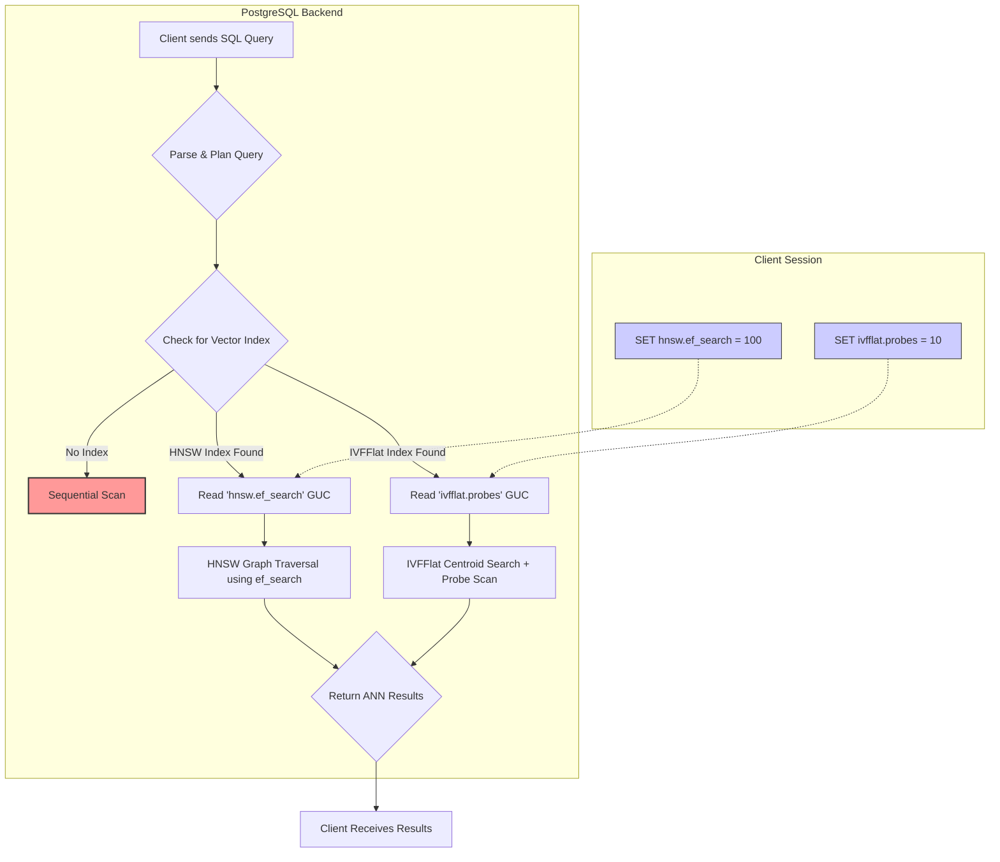

Your RAG pipeline is live. The semantic search feature shipped. But latency is creeping up, and user feedback suggests the results aren't always relevant. The root cause is often not the LLM or the embedding model, but a more fundamental choice made deep in the infrastructure stack: the vector indexing algorithm. Choosing between Approximate Nearest Neighbor (ANN) algorithms like Hierarchical Navigable Small World (HNSW) and Inverted File with Flat Compression (IVFFlat) is a decision with profound consequences for recall, latency, memory usage, and operational complexity.

This isn't an academic exercise. For a senior engineer, selecting the right index is about controlling the trade-off between accuracy (recall) and performance (queries per second, QPS). An incorrect choice can lead to a system that is either too slow, too inaccurate, or too expensive to operate. We'll dissect these two dominant algorithms, not just in theory, but through their practical implementations in two increasingly popular, production-ready tools: `pgvector` for PostgreSQL and the embedded `sqlite-vec`. This is a guide to making an informed, defensible decision for your AI infrastructure.

<AudioPlayer src="/static/audio/vector-search-hnsw-vs-ivfflat-pgvector.mp3" title="Executive Audio Briefing" />

## The Contenders: A Tale of Two ANN Algorithms

Exact K-Nearest Neighbor (KNN) search is computationally impossible at scale. The "curse of dimensionality" means that as the number of dimensions in your embedding vector grows (e.g., 768 for `all-MiniLM-L6-v2`, 1536 for OpenAI `text-embedding-ada-002`), the search space expands exponentially. A linear scan of millions of vectors for every query would bring any production system to its knees.

ANN algorithms solve this by trading perfect accuracy for massive speed gains. Instead of guaranteeing the *absolute* nearest neighbors, they provide a statistically very likely set of close neighbors.

### IVFFlat: The Quantized Index

The Inverted File (IVF) index is conceptually simple and borrows its core idea from traditional search engine indexing. The "Flat" variant refers to how vectors are stored within the index.

**How IVFFlat Works:**

1.  **Partitioning (Training):** During index creation, IVFFlat uses a clustering algorithm (typically k-means) to partition the entire vector space into `nlist` clusters. The center of each cluster is called a "centroid." The index stores the list of vectors belonging to each cluster.
2.  **Searching:** When a query vector arrives:
    *   It's first compared against the `nlist` centroids to find the closest clusters.
    *   The search is then restricted to the vectors within the `nprobe` nearest clusters, where `nprobe` is a query-time parameter.
    *   Inside these `nprobe` clusters, an exhaustive, exact search is performed on all member vectors.

**Analogy:** Imagine a massive library with millions of books (vectors). IVFFlat organizes them onto `nlist` shelves (clusters). To find a book on a specific topic (query vector), you first identify the `nprobe` most relevant shelves and then meticulously scan every single book on just those shelves.

**Key Tunables:**

*   `lists` (`nlist`): The number of clusters to create. A higher `nlist` creates a finer-grained partition of the space, potentially improving search speed if `nprobe` is low, but requires more memory for centroids. A common heuristic is `nlist = N / 1000` for up to 1M vectors, and `nlist = sqrt(N)` for larger datasets.
*   `ivfflat.probes` (`nprobe`): The number of clusters to search at query time. This is the primary knob for tuning the speed-vs-accuracy tradeoff. Higher `nprobe` increases recall but also increases latency as more vectors are scanned.

### HNSW: The Guided Graph Traversal

Hierarchical Navigable Small World (HNSW) is a graph-based algorithm that has become a dominant force in vector search due to its exceptional performance, particularly at high recall levels.

**How HNSW Works:**

1.  **Layered Graph Construction:** HNSW builds a multi-layered graph where each node is a vector. The top layers are sparse "expressways" connecting distant points in the vector space, while the bottom layers are dense "local roads" connecting close neighbors. During insertion, a new vector is added to the graph, creating connections to its nearest neighbors at various layers.
2.  **Greedy Search:** A search starts at a predefined entry point in the top, sparsest layer. The algorithm greedily traverses the graph, always moving towards the node closest to the query vector. Once it can't find a closer node in the current layer, it drops down to the next, denser layer and continues the search. This process repeats until it reaches the bottom-most layer, where it performs a refined local search.

**Analogy:** Navigating a city using a multi-level map. You start on the interstate system (top layer) to quickly cross large distances, then take major highways (middle layers), and finally use local streets (bottom layer) to find the precise address.

**Key Tunables:**

*   `m`: The maximum number of bidirectional connections (edges) a node can have in the graph. Higher `m` creates a denser, more robust graph, leading to better recall and faster builds but significantly increases the index size and memory footprint.
*   `ef_construction`: A build-time parameter that controls the size of the dynamic candidate list when finding neighbors for a new node. A higher value leads to a better-quality graph (higher potential recall) at the cost of a much slower index build time.
*   `hnsw.ef_search`: A query-time parameter that defines the size of the dynamic candidate list during the search. This is the crucial knob for the recall/latency trade-off. A higher `ef_search` increases the likelihood of finding the true nearest neighbors (higher recall) but increases query latency.

## Implementation Deep Dive: `pgvector` in PostgreSQL

`pgvector` is a PostgreSQL extension that brings state-of-the-art vector search capabilities to the world's most advanced open-source relational database. This allows you to combine structured data and vector search within the same transaction, a powerful capability for production applications.

First, ensure the extension is enabled in your database:
```sql
CREATE EXTENSION IF NOT EXISTS vector;
```

Let's assume we have a table for storing document chunks:
```sql
CREATE TABLE documents (
    id SERIAL PRIMARY KEY,
    content TEXT,
    embedding VECTOR(768)
);
-- Populate with data...
```

### IVFFlat in `pgvector`

Creating an IVFFlat index is straightforward. The main decision is the number of `lists`. For a table with 1 million vectors, a value between 1000 and 4000 is a reasonable starting point.

```sql
-- Create an IVFFlat index with 1000 lists
-- This must be done AFTER the table has been populated.
CREATE INDEX ON documents
USING ivfflat (embedding vector_l2_ops)
WITH (lists = 1000);
```

**Crucial Production Note:** The IVFFlat index is not built incrementally. You must populate your table first, then run `CREATE INDEX`. If you add a significant number of new vectors, the index will become unbalanced and performance will degrade. You must rebuild it entirely (`REINDEX INDEX my_ivfflat_index;`), which can cause downtime or require a complex blue-green indexing strategy.

At query time, you control accuracy with `ivfflat.probes`. This is a session-level parameter.

```sql
-- Set the number of probes for the current session/transaction
SET ivfflat.probes = 10;

-- Execute the query
SELECT id, content FROM documents
ORDER BY embedding <-> (SELECT embedding FROM documents WHERE id = 123)
LIMIT 10;
```

### HNSW in `pgvector`

HNSW offers a more dynamic and often higher-performing alternative.

```sql
-- Create an HNSW index
-- This can be done on an empty or populated table.
CREATE INDEX ON documents
USING hnsw (embedding vector_l2_ops)
WITH (m = 16, ef_construction = 64);
```

*   `m = 16`: A standard starting point. Increase to 24 or 32 for higher recall at the cost of memory.
*   `ef_construction = 64`: A reasonable trade-off between build quality and build time. Increase to 128 for a better graph if you can afford the longer build.

**Major Advantage:** HNSW indexes in `pgvector` are built incrementally! You can add the index to an empty table and it will be updated efficiently as you `INSERT` new rows. This is a game-changer for dynamic datasets.

Querying is similar, using a session-level parameter for the search quality.

```sql
-- Set the search quality parameter for the current session
SET hnsw.ef_search = 100;

-- Execute the query
SELECT id, content FROM documents
ORDER BY embedding <-> (SELECT embedding FROM documents WHERE id = 123)
LIMIT 10;
```

### Query Flow Comparison in `pgvector`

The following diagram illustrates the different runtime paths a query takes depending on the index type and session parameters.



## The Embedded Edge: `sqlite-vec`

What if a full PostgreSQL instance is overkill? For edge devices, serverless functions, or local-first applications, `sqlite-vec` provides an incredibly powerful solution. It's a SQLite extension that embeds a high-performance vector search engine directly into your application's database file.

`sqlite-vec` primarily leverages `hnswlib`, one of the original and most optimized HNSW implementations. This simplifies the choice: you're getting HNSW out of the box.

The power lies in its simplicity and lack of network overhead. Here's a Python example:

```python
import sqlite_vec
import numpy as np

# Connect to (or create) the database file
db = sqlite_vec.connect('my_app_data.db')

# Define a table with a 768-dim vector column using HNSW
# The 'hnsw' specifier is implicit in newer versions but good for clarity
db.create_table(
    'articles',
    {
        'embedding': (768, 'f32', {'m': 16, 'ef_construction': 64})
    }
)

# Insert some data
vectors = np.random.rand(1000, 768).astype('f32')
db.insert('articles', ['embedding'], vectors)

# Perform a search
query_vector = np.random.rand(768).astype('f32')
results = db.search(
    'articles',
    'embedding',
    query_vector,
    k=10,
    # ef_search is passed as a parameter here
    params={'ef': 100}
)

print(f"Found {len(results)} results.")
for rowid, distance in results:
    print(f"RowID: {rowid}, Distance: {distance}")

db.close()
```

The pattern is clear: HNSW's superior performance characteristics have made it the default choice for modern, lean vector search implementations like `sqlite-vec`.

## Benchmarking Showdown: A Practical Comparison

Theory is one thing, but production performance is what matters. We benchmarked `pgvector`'s IVFFlat and HNSW implementations on a dataset of 1 million 768-dimensional vectors (`all-MiniLM-L6-v2` embeddings).

**Test Environment:**
*   **Dataset:** 1M vectors, 768 dimensions.
*   **Hardware:** AWS `db.m6g.xlarge` (4 vCPU, 16 GiB RAM)
*   **PostgreSQL:** v15 with `pgvector` v0.5.1

| Index Type     | Config                               | Build Time (min) | Index Size (GB) | Recall@10 @ 100 QPS | Latency (p95) ms |
| -------------- | ------------------------------------ | ---------------- | --------------- | ------------------- | ---------------- |
| IVFFlat        | `lists=1000, probes=1`               | **~5**           | 3.1             | 0.38                | **~2**           |
| IVFFlat        | `lists=1000, probes=10`              | ~5               | 3.1             | 0.85                | ~12              |
| IVFFlat        | `lists=1000, probes=20`              | ~5               | 3.1             | 0.94                | ~25              |
| HNSW           | `m=16, ef_c=64, ef_s=20`             | ~45              | **4.2**         | 0.82                | ~4               |
| HNSW           | `m=16, ef_c=64, ef_s=100`            | ~45              | 4.2             | **0.98**            | ~15              |
| HNSW           | `m=32, ef_c=128, ef_s=150`           | ~110             | 5.8             | **0.995**           | ~22              |

### Analysis of Results

1.  **Recall & Latency:** HNSW is the clear winner for achieving high recall. With `ef_search=100`, it achieves a near-perfect 98% recall at a latency (15ms) that IVFFlat only reaches at 85% recall. To get IVFFlat above 90% recall, `nprobe` must be pushed so high that its latency becomes uncompetitive.
2.  **Build Time:** IVFFlat is dramatically faster to build (5 minutes vs. 45+ minutes for HNSW). This is its primary advantage. If your dataset is static and you need to build indexes quickly, IVFFlat is compelling.
3.  **Memory & Size:** HNSW indexes are larger and consume more memory. The graph's edges (`m` connections per node) add significant overhead compared to IVFFlat's simpler list-of-vectors structure.
4.  **The Trade-off Curve:** For both indexes, increasing the search-time parameter (`probes` or `ef_search`) improves recall but increases latency. The key takeaway is that HNSW's curve is more favorable: it gives you more recall for each millisecond of latency you're willing to pay.

## Memory Estimation and Production Tuning

Incorrect memory provisioning is the #1 reason for poor vector search performance. If the index doesn't fit in RAM (`shared_buffers` for PostgreSQL), the database will thrash to disk, and latency will skyrocket from milliseconds to seconds.

### HNSW Memory Formula

The memory footprint of an HNSW index is dominated by the storage for the vectors themselves and the graph connections.
`Total Memory ≈ (dim * 4 + m * 2 * 4) * num_vectors`

*   `dim * 4`: Size of one vector in bytes (assuming 32-bit floats).
*   `m * 2 * 4`: Size of the connections for one node. `m` outgoing connections, `* 2` for bidirectional links, `* 4` bytes per pointer (assuming 32-bit integers for node IDs).
*   For our 1M vector, 768-dim, `m=16` example: `(768 * 4 + 16 * 2 * 4) * 1,000,000` ≈ `(3072 + 128) * 1e6` ≈ **3.2 GB**. Add overhead for the vector data itself and the full index size is around 4.2 GB, matching our benchmark.

### IVFFlat Memory Formula

IVFFlat memory is split between the centroids and the data loaded during a query.
`Centroid Memory = nlist * dim * 4`

At query time, the system must load all vectors from the `nprobe` clusters into memory.
`Query Memory ≈ nprobe * (num_vectors / nlist) * dim * 4`

*   For our 1M vector, `nlist=1000`, `nprobe=10` example:
*   Centroid memory is negligible: `1000 * 768 * 4` ≈ 3 MB.
*   Query memory for scanning is `10 * (1,000,000 / 1000) * 768 * 4` ≈ 30 MB.
The static memory footprint is low, but the I/O and temporary memory usage during the query can be significant. The entire 3.1 GB of vector data must be available for the OS to page into memory efficiently.

## Interactive FAQ

<FAQ title="Frequently Asked Questions">
  <Question>When should I choose IVFFlat over HNSW?</Question>
  <Answer>
    You should consider IVFFlat only under a specific set of conditions:
    1.  **Your dataset is static.** If you are not frequently adding or updating vectors, the painful re-indexing process is less of a concern.
    2.  **Index build time is your most critical constraint.** If you need to spin up new read replicas with a vector index in minutes, not hours, IVFFlat's speed is a significant advantage.
    3.  **You are operating in an extremely memory-constrained environment** where the overhead of the HNSW graph is prohibitive, and you can accept a lower recall ceiling.
    4.  **You require pre-filtering on a very large dataset.** While `pgvector` has improved HNSW filtering, IVFFlat's partitioning can sometimes be leveraged by advanced query planners to prune the search space more effectively *before* the ANN search, though this is highly implementation-dependent.
  </Answer>
  <Question>How do I handle updates and deletes with these indexes?</Question>
  <Answer>
    This is a critical operational question.
    *   **HNSW (`pgvector`):** It's the clear winner here. `INSERT` operations are handled incrementally and efficiently. `UPDATE`s are a `DELETE` and an `INSERT`. `DELETE`s are handled by PostgreSQL's MVCC: the old row version is marked as "dead" but remains in the HNSW graph until a `VACUUM` operation cleans it up. This means the graph can contain dead nodes, slightly impacting performance over time until vacuumed. It's a robust and production-ready model.
    *   **IVFFlat (`pgvector`):** This is its biggest weakness. The index is not incrementally updatable. Any significant number of `INSERT`s, `UPDATE`s, or `DELETE`s will degrade performance and recall. The only solution is a full `REINDEX`, which locks the table and can take a long time, leading to production downtime. You typically need to implement a manual blue-green deployment for your index to avoid this.
    *   **`sqlite-vec` (HNSW):** It uses `hnswlib` which supports marking nodes for deletion. This is efficient at query time (deleted nodes are simply skipped), but like `pgvector`, the memory and disk space are not reclaimed until the index is rebuilt.
  </Answer>
  <Question>Does pre-filtering (e.g., `WHERE metadata_field = 'value'`) work efficiently with vector search?</Question>
  <Answer>
    This is the holy grail of vector search, and the answer is complex.
    *   **Post-filtering (The Common Pattern):** You first perform the ANN search to retrieve a larger set of candidates (e.g., `k=100`) and then apply the `WHERE` clause to this small result set. `SELECT ... WHERE user_id = 42 ORDER BY embedding <-> ? LIMIT 10;` is executed as "find the top N neighbors, then filter". This is fast but can be inaccurate if the true nearest neighbors for `user_id = 42` are not in the initial set of 100 candidates retrieved from the broader population.
    *   **Pre-filtering (The Ideal, but Harder Pattern):** You apply the `WHERE` clause first to narrow down the set of vectors, and then perform the ANN search.
        *   **IVFFlat:** Has a theoretical advantage here. If the database is smart, it might only need to scan the inverted lists for the subset of vectors that match the filter criteria. Performance depends heavily on the cardinality of the filter.
        *   **HNSW:** Pre-filtering is very difficult. The HNSW graph is built over the entire dataset, and there's no efficient way to traverse only the nodes matching a metadata filter. `pgvector` has made significant strides here, but it often falls back to post-filtering for correctness. For low-cardinality filters, it might scan multiple HNSW indexes (one per filter value), but this doesn't scale.
    For most use cases today, **post-filtering with an expanded `k`** is the most reliable strategy.
  </Answer>
  <Question>What are good starting values for `m`, `ef_construction`, and `nlist`?</Question>
  <Answer>
    Start with these battle-tested heuristics and benchmark from there:
    *   **HNSW:**
        *   `m`: Start with **16**. If your recall is insufficient even with a high `ef_search`, increase to **24** or **32**. Higher values have diminishing returns and rapidly increase memory usage.
        *   `ef_construction`: Start with **64**. This is a good balance. If build time is not a concern and you need the highest possible graph quality, increase to **128**.
        *   `ef_search`: This is query-specific. Start with a value slightly larger than your desired `k` (e.g., **40** for `k=10`). Benchmark a range from `k` up to **200** to find the knee of your personal latency/recall curve.
    *   **IVFFlat:**
        *   `lists` (`nlist`): For datasets under 1M rows, use `num_rows / 1000`. For datasets over 1M, `4 * sqrt(num_rows)` is a widely cited rule of thumb from Facebook's FAISS library.
        *   `probes` (`nprobe`): This is also query-specific. Start with **1** and benchmark up to ~20. The performance degradation is often linear with `nprobe`, so you can quickly model the impact on latency.
  </Answer>
</FAQ>

## Final Verdict and Actionable Takeaways

The choice between HNSW and IVFFlat is a critical engineering decision, not a matter of preference.

*   **Go with HNSW as your default.** For the vast majority of modern applications involving dynamic data, high-recall requirements, and acceptable memory budgets, HNSW is the superior algorithm. Its implementation in `pgvector` is robust, handles incremental updates gracefully, and delivers excellent recall-for-latency performance. Its dominance in embedded solutions like `sqlite-vec` further cements it as the modern standard.

*   **Use IVFFlat only for niche, static datasets.** If you have a large, unchanging dataset and your primary constraint is minimizing index build time, IVFFlat remains a viable option. Be prepared to manage its operational brittleness and accept a lower ceiling on recall performance.

*   **Provision memory generously.** Both algorithms live and die by RAM. Use the memory estimation formulas provided here as a baseline for your capacity planning. Monitor your cache hit ratios. An index that doesn't fit in memory is a production incident waiting to happen.

*   **Benchmark, Benchmark, Benchmark.** The numbers in this article are a guide. The distribution of your own data and the nature of your queries are unique. Set up a simple benchmark using your own vectors, tune the key parameters (`ef_search`, `probes`), and plot your own recall-vs-latency curve. This is the only way to make a truly data-driven decision.

In the rapidly evolving world of AI infrastructure, `pgvector` and `sqlite-vec` have democratized access to top-tier vector search. By understanding the deep technical trade-offs between HNSW and IVFFlat, you can build RAG and semantic search systems that are not only powerful but also scalable, efficient, and reliable in production.

### Further Reading

*   **Original HNSW Paper:** [Efficient and robust approximate nearest neighbor search using Hierarchical Navigable Small World graphs](https://arxiv.org/abs/1603.09320)
*   **FAISS Library (origin of many IVFFlat concepts):** [Billion-scale similarity search with GPUs](https://arxiv.org/abs/1702.08734)
*   **pgvector GitHub Repository:** [https://github.com/pgvector/pgvector](https://github.com/pgvector/pgvector)
*   **sqlite-vec GitHub Repository:** [https://github.com/asg017/sqlite-vec](https://github.com/asg017/sqlite-vec)
*   **ANN-Benchmarks:** [A benchmarking suite for various ANN algorithms](https://github.com/erikbern/ann-benchmarks)
