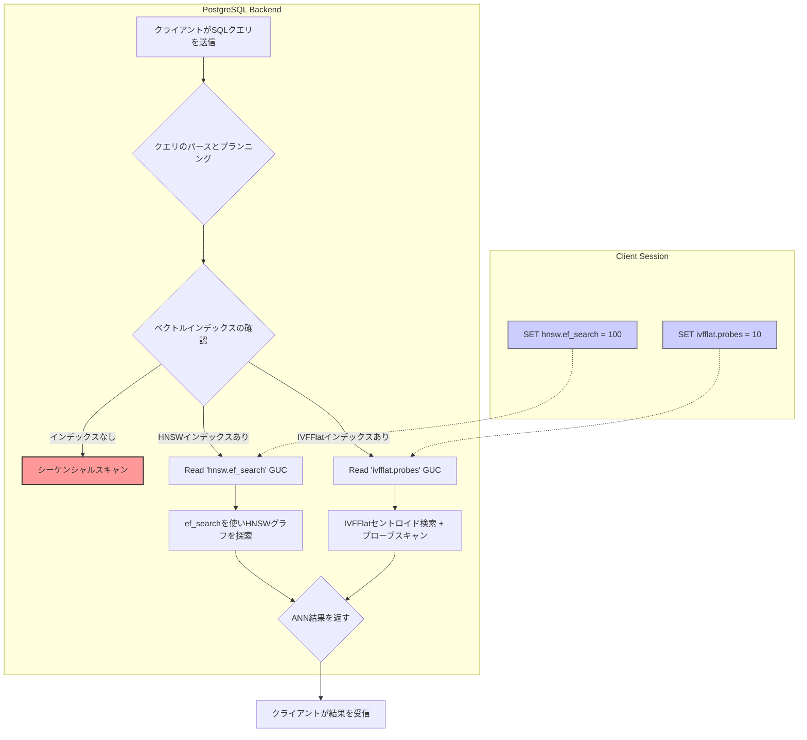

あなたのRAGパイプラインは本番稼働し、セマンティック検索機能もリリースされました。しかし、レイテンシが徐々に悪化し、ユーザーからのフィードバックは、結果が必ずしも関連性の高いものではないことを示唆しています。根本原因は、LLMや埋め込みモデルではなく、インフラストラクチャスタックの奥深くで下された、より根本的な選択、つまりベクトルインデックスのアルゴリズムにあることが少なくありません。階層的航行可能小世界（HNSW）やフラット圧縮付き転置ファイル（IVFFlat）のような近似最近傍（ANN）アルゴリズムのどちらを選択するかは、再現率、レイテンシ、メモリ使用量、そして運用上の複雑さに深刻な影響を及ぼす決断です。

これは学術的な演習ではありません。シニアエンジニアにとって、適切なインデックスを選択することは、精度（再現率）とパフォーマンス（QPS、秒間クエリ数）のトレードオフを制御することに他なりません。誤った選択は、システムが遅すぎるか、不正確すぎるか、あるいは運用コストが高すぎるかのいずれかにつながる可能性があります。本稿では、これら2つの主要なアルゴリズムを、理論上だけでなく、ますます人気が高まっている本番環境対応の2つのツール、PostgreSQL向けの`pgvector`と組み込みの`sqlite-vec`における実践的な実装を通して徹底的に分析します。これは、あなたのAIインフラストラクチャのために、情報に基づいた、正当性を主張できる決定を下すためのガイドです。

<AudioPlayer src="/static/audio/vector-search-hnsw-vs-ivfflat-pgvector-ja.mp3" title="音声エグゼクティブ・ブリーフィング" voice="Google Cloud ja-JP-Neural2-B" />

## 競合アルゴリズム：2つのANNアルゴリズムの物語

大規模なデータセットに対して、完全なK最近傍（KNN）探索を計算することは不可能です。「次元の呪い」とは、埋め込みベクトルの次元数が増えるにつれて（例：`all-MiniLM-L6-v2`で768次元、OpenAI `text-embedding-ada-002`で1536次元）、探索空間が指数関数的に拡大することを意味します。すべてのクエリに対して数百万のベクトルを線形スキャンすれば、どんな本番システムも機能不全に陥るでしょう。

ANNアルゴリズムは、完全な精度を犠牲にすることで、大幅な速度向上を実現してこの問題を解決します。*絶対的な*最近傍点を保証する代わりに、統計的に非常に可能性の高い近傍点の集合を提供します。

### IVFFlat：量子化インデックス

転置ファイル（IVF）インデックスは概念的に単純で、その中心的なアイデアは従来の検索エンジンのインデックス作成から借用しています。「Flat」というバリエーションは、ベクトルがインデックス内でどのように格納されるかを示します。

**IVFFlatの仕組み：**

1.  **分割（トレーニング）：** インデックス作成時、IVFFlatはクラスタリングアルゴリズム（通常はk-means）を使用して、ベクトル空間全体を`nlist`個のクラスタに分割します。各クラスタの中心は「セントロイド」と呼ばれます。インデックスは、各クラスタに属するベクトルのリストを格納します。
2.  **検索：** クエリベクトルが到着すると：
    *   まず`nlist`個のセントロイドと比較され、最も近いクラスタが特定されます。
    *   次に、検索範囲は`nprobe`個の最も近いクラスタ内のベクトルに限定されます。`nprobe`はクエリ時のパラメータです。
    *   これらの`nprobe`個のクラスタ内で、すべてのメンバーベクトルに対して網羅的で正確な検索が実行されます。

**アナロジー：** 何百万冊もの本（ベクトル）がある巨大な図書館を想像してください。IVFFlatはそれらを`nlist`個の棚（クラスタ）に整理します。特定のトピック（クエリベクトル）に関する本を見つけるには、まず`nprobe`個の最も関連性の高い棚を特定し、その後、それらの棚にあるすべての本を丹念にスキャンします。

**主要な調整可能パラメータ：**

*   `lists` (`nlist`)：作成するクラスタの数。`nlist`を大きくすると、空間の分割がより細かくなり、`nprobe`が小さい場合には検索速度が向上する可能性がありますが、セントロイドのためにより多くのメモリが必要になります。一般的なヒューリスティックは、最大100万ベクトルまでは`nlist = N / 1000`、それ以上のデータセットでは`nlist = sqrt(N)`です。
*   `ivfflat.probes` (`nprobe`)：クエリ時に検索するクラスタの数。これは速度と精度のトレードオフを調整するための主要なノブです。`nprobe`を高くすると再現率が向上しますが、より多くのベクトルがスキャンされるためレイテンシも増加します。

### HNSW：ガイド付きグラフ探索

階層的航行可能小世界（HNSW）は、グラフベースのアルゴリズムであり、特に高い再現率レベルでの卓越したパフォーマンスにより、ベクトル検索における支配的な力となっています。

**HNSWの仕組み：**

1.  **階層グラフの構築：** HNSWは、各ノードがベクトルである多層グラフを構築します。上層はベクトル空間内の遠い点を結ぶ疎な「高速道路」であり、下層は近傍の点を結ぶ密な「一般道」です。挿入時、新しいベクトルがグラフに追加され、さまざまな層でその最近傍点への接続が作成されます。
2.  **貪欲法探索：** 検索は、最も疎な最上層の事前に定義されたエントリポイントから開始されます。アルゴリズムはグラフを貪欲法的に探索し、常にクエリベクトルに最も近いノードに向かって移動します。現在の層でより近いノードを見つけられなくなると、次のより密な層に降りて検索を続行します。このプロセスは最下層に到達するまで繰り返され、そこで洗練された局所探索が実行されます。

**アナロジー：** 多層の地図を使って都市をナビゲートするようなものです。最初に州間高速道路（最上層）を使って長距離を素早く移動し、次に主要な幹線道路（中間層）を通り、最後に一般道（最下層）を使って正確な住所を見つけます。

**主要な調整可能パラメータ：**

*   `m`：ノードがグラフ内で持つことができる双方向接続（エッジ）の最大数。`m`を大きくすると、より密で堅牢なグラフが作成され、再現率の向上と構築の高速化につながりますが、インデックスのサイズとメモリフットプリントが大幅に増加します。
*   `ef_construction`：新しいノードの近傍点を見つける際の動的な候補リストのサイズを制御する構築時パラメータ。値を大きくすると、より高品質なグラフ（より高い潜在的再現率）が得られますが、インデックス構築時間が大幅に長くなります。
*   `hnsw.ef_search`：検索中の動的な候補リストのサイズを定義するクエリ時パラメータ。これは再現率とレイテンシのトレードオフにおける重要なノブです。`ef_search`を大きくすると、真の最近傍点を見つける可能性が高まりますが（再現率の向上）、クエリレイテンシが増加します。

## 実装の詳細：PostgreSQLにおける`pgvector`

`pgvector`は、世界で最も先進的なオープンソースリレーショナルデータベースに、最先端のベクトル検索機能をもたらすPostgreSQL拡張です。これにより、構造化データとベクトル検索を同一のトランザクション内で組み合わせることが可能になり、これは本番アプリケーションにとって強力な機能です。

まず、データベースで拡張機能が有効になっていることを確認します：
```sql
CREATE EXTENSION IF NOT EXISTS vector;
```

ドキュメントのチャンクを保存するためのテーブルがあると仮定します：
```sql
CREATE TABLE documents (
    id SERIAL PRIMARY KEY,
    content TEXT,
    embedding VECTOR(768)
);
-- データ投入...
```

### `pgvector`におけるIVFFlat

IVFFlatインデックスの作成は簡単です。主な決定事項は`lists`の数です。100万ベクトルのテーブルの場合、1000から4000の間の値が妥当な出発点です。

```sql
-- 1000リストのIVFFlatインデックスを作成
-- これはテーブルにデータを投入した後に実行する必要があります。
CREATE INDEX ON documents
USING ivfflat (embedding vector_l2_ops)
WITH (lists = 1000);
```

**本番環境での重要な注意点：** IVFFlatインデックスは増分的に構築されません。まずテーブルにデータを投入し、それから`CREATE INDEX`を実行する必要があります。もし大量の新しいベクトルを追加すると、インデックスが不均衡になりパフォーマンスが低下します。インデックス全体を再構築（`REINDEX INDEX my_ivfflat_index;`）する必要があり、これはダウンタイムを引き起こすか、複雑なブルーグリーンインデックス戦略を必要とする場合があります。

クエリ時には、`ivfflat.probes`で精度を制御します。これはセッションレベルのパラメータです。

```sql
-- 現在のセッション/トランザクションのプローブ数を設定
SET ivfflat.probes = 10;

-- クエリを実行
SELECT id, content FROM documents
ORDER BY embedding <-> (SELECT embedding FROM documents WHERE id = 123)
LIMIT 10;
```

### `pgvector`におけるHNSW

HNSWは、より動的で、多くの場合より高性能な代替手段を提供します。

```sql
-- HNSWインデックスを作成
-- これは空またはデータ投入済みのテーブルに対して実行できます。
CREATE INDEX ON documents
USING hnsw (embedding vector_l2_ops)
WITH (m = 16, ef_construction = 64);
```

*   `m = 16`: 標準的な出発点です。メモリを犠牲にしてでも高い再現率が必要な場合は24または32に増やします。
*   `ef_construction = 64`: 構築品質と構築時間の間の妥当なトレードオフです。より長い構築時間を許容できるなら、より良いグラフのために128に増やします。

**大きな利点：** `pgvector`のHNSWインデックスは増分的に構築されます！空のテーブルにインデックスを追加でき、新しい行を`INSERT`するたびに効率的に更新されます。これは動的なデータセットにとっては画期的な機能です。

クエリは同様に、検索品質のためにセッションレベルのパラメータを使用します。

```sql
-- 現在のセッションの検索品質パラメータを設定
SET hnsw.ef_search = 100;

-- クエリを実行
SELECT id, content FROM documents
ORDER BY embedding <-> (SELECT embedding FROM documents WHERE id = 123)
LIMIT 10;
```

### `pgvector`におけるクエリフローの比較

以下の図は、インデックスの種類とセッションパラメータに応じてクエリがたどる異なる実行時パスを示しています。



## 組み込みのエッジ：`sqlite-vec`

もし完全なPostgreSQLインスタンスが大げさな場合はどうでしょうか？エッジデバイス、サーバーレス関数、またはローカルファーストアプリケーションには、`sqlite-vec`が非常に強力なソリューションを提供します。これは、高性能なベクトル検索エンジンをアプリケーションのデータベースファイルに直接埋め込むSQLite拡張です。

`sqlite-vec`は主に、最初期からあり最も最適化されたHNSW実装の1つである`hnswlib`を活用しています。これにより選択が簡素化されます：HNSWが標準で手に入ります。

その力は、そのシンプルさとネットワークオーバーヘッドの欠如にあります。以下にPythonの例を示します：

```python
import sqlite_vec
import numpy as np

# データベースファイルに接続（または作成）
db = sqlite_vec.connect('my_app_data.db')

# 768次元のベクトル列を持つテーブルをHNSWを使用して定義
# 'hnsw'指定子は新しいバージョンでは暗黙的ですが、明確性のために良い
db.create_table(
    'articles',
    {
        'embedding': (768, 'f32', {'m': 16, 'ef_construction': 64})
    }
)

# データを挿入
vectors = np.random.rand(1000, 768).astype('f32')
db.insert('articles', ['embedding'], vectors)

# 検索を実行
query_vector = np.random.rand(768).astype('f32')
results = db.search(
    'articles',
    'embedding',
    query_vector,
    k=10,
    # ef_searchはここでパラメータとして渡される
    params={'ef': 100}
)

print(f"Found {len(results)} results.")
for rowid, distance in results:
    print(f"RowID: {rowid}, Distance: {distance}")

db.close()
```

パターンは明確です：HNSWの優れたパフォーマンス特性により、`sqlite-vec`のような現代的で軽量なベクトル検索実装におけるデフォルトの選択肢となっています。

## ベンチマーク対決：実践的な比較

理論はさておき、重要なのは本番環境でのパフォーマンスです。100万個の768次元ベクトル（`all-MiniLM-L6-v2`埋め込み）のデータセットで、`pgvector`のIVFFlatとHNSW実装をベンチマークしました。

**テスト環境：**
*   **データセット：** 100万ベクトル、768次元
*   **ハードウェア：** AWS `db.m6g.xlarge` (4 vCPU, 16 GiB RAM)
*   **PostgreSQL：** v15 with `pgvector` v0.5.1

| インデックスタイプ | 設定                                 | 構築時間 (分) | インデックスサイズ (GB) | 100 QPS時のRecall@10 | レイテンシ (p95) ms |
| ---------------- | ------------------------------------ | --------------- | ----------------------- | -------------------- | ------------------- |
| IVFFlat          | `lists=1000, probes=1`               | **~5**          | 3.1                     | 0.38                 | **~2**              |
| IVFFlat          | `lists=1000, probes=10`              | ~5              | 3.1                     | 0.85                 | ~12                 |
| IVFFlat          | `lists=1000, probes=20`              | ~5              | 3.1                     | 0.94                 | ~25                 |
| HNSW             | `m=16, ef_c=64, ef_s=20`             | ~45             | **4.2**                 | 0.82                 | ~4                  |
| HNSW             | `m=16, ef_c=64, ef_s=100`            | ~45             | 4.2                     | **0.98**             | ~15                 |
| HNSW             | `m=32, ef_c=128, ef_s=150`           | ~110            | 5.8                     | **0.995**            | ~22                 |

### 結果の分析

1.  **再現率とレイテンシ：** 高い再現率を達成する上で、HNSWが明確な勝者です。`ef_search=100`で、ほぼ完璧な98%の再現率を15msのレイテンシで達成しています。これはIVFFlatが85%の再現率でようやく到達するレベルです。IVFFlatで90%以上の再現率を得るには、`nprobe`を非常に高く設定する必要があり、その結果レイテンシが競争力を失います。
2.  **構築時間：** IVFFlatは構築が劇的に速い（HNSWの45分以上に対して5分）です。これがその主な利点です。データセットが静的で、インデックスを迅速に構築する必要がある場合、IVFFlatは魅力的です。
3.  **メモリとサイズ：** HNSWインデックスはより大きく、より多くのメモリを消費します。グラフのエッジ（ノードあたり`m`個の接続）は、IVFFlatのより単純なベクトルリスト構造と比較して、かなりのオーバーヘッドを追加します。
4.  **トレードオフ曲線：** どちらのインデックスでも、検索時パラメータ（`probes`または`ef_search`）を増やすと再現率が向上しますが、レイテンシも増加します。重要な点は、HNSWの曲線がより有利であるということです：支払うことを厭わないレイテンシのミリ秒ごとにより多くの再現率を提供してくれます。

## メモリ見積もりと本番環境でのチューニング

不適切なメモリプロビジョニングは、ベクトル検索のパフォーマンスが低下する最大の理由です。インデックスがRAM（PostgreSQLの場合は`shared_buffers`）に収まらない場合、データベースはディスクへのスラッシングを起こし、レイテンシはミリ秒単位から秒単位へと急増します。

### HNSWのメモリ計算式

HNSWインデックスのメモリフットプリントは、ベクトル自体のストレージとグラフ接続によって支配されます。
`合計メモリ ≈ (dim * 4 + m * 2 * 4) * num_vectors`

*   `dim * 4`: 1つのベクトルのバイトサイズ（32ビット浮動小数点数を想定）。
*   `m * 2 * 4`: 1つのノードの接続サイズ。`m`個の出力接続、双方向リンクのために `* 2`、ポインタあたり`* 4`バイト（ノードIDに32ビット整数を想定）。
*   我々の100万ベクトル、768次元、`m=16`の例では： `(768 * 4 + 16 * 2 * 4) * 1,000,000` ≈ `(3072 + 128) * 1e6` ≈ **3.2 GB**。ベクトルデータ自体のオーバーヘッドを追加すると、完全なインデックスサイズは約4.2 GBとなり、我々のベンチマークと一致します。

### IVFFlatのメモリ計算式

IVFFlatのメモリは、セントロイドとクエリ中にロードされるデータの間で分割されます。
`セントロイドメモリ = nlist * dim * 4`

クエリ時、システムは`nprobe`個のクラスタからすべてのベクトルをメモリにロードする必要があります。
`クエリメモリ ≈ nprobe * (num_vectors / nlist) * dim * 4`

*   我々の100万ベクトル、`nlist=1000`、`nprobe=10`の例では：
*   セントロイドメモリは無視できるほど小さいです： `1000 * 768 * 4` ≈ 3 MB。
*   スキャン用のクエリメモリは `10 * (1,000,000 / 1000) * 768 * 4` ≈ 30 MB。
静的なメモリフットプリントは低いですが、クエリ中のI/Oと一時的なメモリ使用量は大きくなる可能性があります。OSが効率的にメモリにページインできるように、3.1 GBのベクトルデータ全体が利用可能でなければなりません。

## インタラクティブFAQ

<FAQ title="よくある質問">
  <Question>どのような場合にHNSWよりIVFFlatを選ぶべきですか？</Question>
  <Answer>
    IVFFlatを検討すべきなのは、特定の条件が揃った場合に限られます：
    1.  **データセットが静的である。** ベクトルを頻繁に追加・更新しない場合、面倒な再インデックス作成プロセスはそれほど懸念事項になりません。
    2.  **インデックス構築時間が最も重要な制約である。** 数時間ではなく数分でベクトルインデックスを持つ新しいリードレプリカを立ち上げる必要がある場合、IVFFlatの速度は大きな利点です。
    3.  **極端にメモリに制約のある環境で運用している。** HNSWグラフのオーバーヘッドが許容できず、より低い再現率の上限を受け入れられる場合。
    4.  **非常に大規模なデータセットで事前フィルタリングが必要である。** `pgvector`はHNSWのフィルタリングを改善しましたが、IVFFlatのパーティショニングは、高度なクエリプランナーによって、ANN検索*前*に検索空間をより効果的に刈り込むために利用できる場合があります。ただし、これは実装に大きく依存します。
  </Answer>
  <Question>これらのインデックスで更新や削除をどのように扱いますか？</Question>
  <Answer>
    これは重要な運用上の問題です。
    *   **HNSW (`pgvector`):** ここでは明確な勝者です。`INSERT`操作は増分的かつ効率的に処理されます。`UPDATE`は`DELETE`と`INSERT`の組み合わせです。`DELETE`はPostgreSQLのMVCCによって処理されます：古い行バージョンは「dead」とマークされますが、`VACUUM`操作によってクリーンアップされるまでHNSWグラフ内に残ります。これは、グラフに古いノードが含まれる可能性があり、バキュームされるまでパフォーマンスにわずかに影響を与えることを意味します。これは堅牢で本番環境に対応したモデルです。
    *   **IVFFlat (`pgvector`):** これが最大の弱点です。インデックスは増分的に更新できません。かなりの数の`INSERT`、`UPDATE`、`DELETE`はパフォーマンスと再現率を低下させます。唯一の解決策は完全な`REINDEX`ですが、これはテーブルをロックし、長時間かかるため、本番環境のダウンタイムにつながる可能性があります。これを避けるためには、通常、インデックスのブルーグリーンデプロイメントを手動で実装する必要があります。
    *   **`sqlite-vec` (HNSW):** これは`hnswlib`を使用しており、ノードを削除対象としてマークすることをサポートしています。これはクエリ時には効率的です（削除されたノードは単にスキップされます）が、`pgvector`と同様に、メモリとディスクスペースはインデックスが再構築されるまで解放されません。
  </Answer>
  <Question>事前フィルタリング（例：`WHERE metadata_field = 'value'`）はベクトル検索で効率的に機能しますか？</Question>
  <Answer>
    これはベクトル検索の聖杯であり、答えは複雑です。
    *   **事後フィルタリング（一般的なパターン）：** まずANN検索を実行してより多くの候補（例：`k=100`）を取得し、その後、この小さな結果セットに`WHERE`句を適用します。`SELECT ... WHERE user_id = 42 ORDER BY embedding <-> ? LIMIT 10;`は、「上位N個の近傍点を見つけ、次にフィルタリングする」として実行されます。これは高速ですが、`user_id = 42`の真の最近傍点が、より広範な母集団から取得された最初の100個の候補セットに含まれていない場合、不正確になる可能性があります。
    *   **事前フィルタリング（理想的だが難しいパターン）：** まず`WHERE`句を適用してベクトルのセットを絞り込み、その後ANN検索を実行します。
        *   **IVFFlat:** ここでは理論的な利点があります。データベースが賢ければ、フィルタ条件に一致するベクトルのサブセットの転置リストのみをスキャンするだけで済むかもしれません。パフォーマンスはフィルタのカーディナリティに大きく依存します。
        *   **HNSW:** 事前フィルタリングは非常に困難です。HNSWグラフはデータセット全体にわたって構築されており、メタデータフィルタに一致するノードのみを効率的に探索する方法はありません。`pgvector`はここで大きな進歩を遂げていますが、正確性のために事後フィルタリングにフォールバックすることがよくあります。低カーディナリティのフィルタの場合、複数のHNSWインデックス（フィルタ値ごとに1つ）をスキャンするかもしれませんが、これはスケールしません。
    今日のほとんどのユースケースでは、**拡張された`k`での事後フィルタリング**が最も信頼性の高い戦略です。
  </Answer>
  <Question>`m`、`ef_construction`、`nlist`の適切な初期値は何ですか？</Question>
  <Answer>
    これらの実績のあるヒューリスティックから始めて、そこからベンチマークを行ってください：
    *   **HNSW:**
        *   `m`: **16**から始めます。高い`ef_search`でも再現率が不十分な場合は、**24**または**32**に増やします。これ以上の値は効果が薄れ、メモリ使用量が急激に増加します。
        *   `ef_construction`: **64**から始めます。これは良いバランスです。構築時間が問題でなく、可能な限り最高のグラフ品質が必要な場合は、**128**に増やします。
        *   `ef_search`: これはクエリ固有です。希望する`k`より少し大きい値（例：`k=10`に対して**40**）から始めます。`k`から**200**までの範囲でベンチマークを行い、あなた自身のレイテンシ/再現率曲線の変曲点を見つけます。
    *   **IVFFlat:**
        *   `lists` (`nlist`): 100万行未満のデータセットでは、`num_rows / 1000`を使用します。100万行を超えるデータセットでは、FacebookのFAISSライブラリから広く引用されている経験則`4 * sqrt(num_rows)`が使われます。
        *   `probes` (`nprobe`): これもクエリ固有です。**1**から始め、約20までベンチマークします。パフォーマンスの低下は`nprobe`にほぼ線形であるため、レイテンシへの影響を迅速にモデル化できます。
  </Answer>
</FAQ>

## 最終的な判断と実用的な takeaways

HNSWとIVFFlatの選択は、好みの問題ではなく、重要なエンジニアリングの決定です。

*   **デフォルトとしてHNSWを選択してください。** 動的なデータ、高い再現率の要件、許容可能なメモリ予算を伴う現代のアプリケーションの大多数にとって、HNSWは優れたアルゴリズムです。`pgvector`でのその実装は堅牢で、増分更新を優雅に処理し、レイテンシに対する優れた再現率パフォーマンスを提供します。`sqlite-vec`のような組み込みソリューションでのその優位性は、現代の標準としての地位をさらに固めています。

*   **IVFFlatは、ニッチな静的データセットにのみ使用してください。** 大規模で不変のデータセットがあり、主な制約がインデックス構築時間の最小化である場合、IVFFlatは依然として実行可能な選択肢です。その運用上の脆さを管理し、再現率性能の上限が低いことを受け入れる準備をしてください。

*   **メモリは寛大にプロビジョニングしてください。** どちらのアルゴリズムもRAMの有無が生死を分けます。ここで提供されたメモリ見積もり式をキャパシティプランニングのベースラインとして使用してください。キャッシュヒット率を監視してください。メモリに収まらないインデックスは、いつ発生してもおかしくない本番インシデントです。

*   **ベンチマーク、ベンチマーク、そしてベンチマーク。** この記事の数値はガイドです。あなた自身のデータの分布とクエリの性質はユニークです。あなた自身のベクトルを使用して簡単なベンチマークを設定し、主要なパラメータ（`ef_search`、`probes`）を調整し、あなた自身の再現率対レイテンシ曲線を描いてください。これこそが、真にデータ駆動型の決定を下す唯一の方法です。

急速に進化するAIインフラストラクチャの世界において、`pgvector`と`sqlite-vec`は、トップティアのベクトル検索へのアクセスを民主化しました。HNSWとIVFFlatの間の深い技術的なトレードオフを理解することで、強力であるだけでなく、本番環境でスケーラブル、効率的、そして信頼性の高いRAGおよびセマンティック検索システムを構築できます。

### 参考資料

*   **HNSW原著論文：** [Efficient and robust approximate nearest neighbor search using Hierarchical Navigable Small World graphs](https://arxiv.org/abs/1603.09320) (階層的航行可能小世界グラフを用いた効率的で堅牢な近似最近傍探索)
*   **FAISSライブラリ (多くのIVFFlatコンセプトの起源)：** [Billion-scale similarity search with GPUs](https://arxiv.org/abs/1702.08734) (GPUを用いた10億スケールの類似性検索)
*   **pgvector GitHubリポジトリ：** [https://github.com/pgvector/pgvector](https://github.com/pgvector/pgvector)
*   **sqlite-vec GitHubリポジトリ：** [https://github.com/asg017/sqlite-vec](https://github.com/asg017/sqlite-vec)
*   **ANN-Benchmarks：** [A benchmarking suite for various ANN algorithms](https://github.com/erikbern/ann-benchmarks) (様々なANNアルゴリズムのためのベンチマークスイート)
